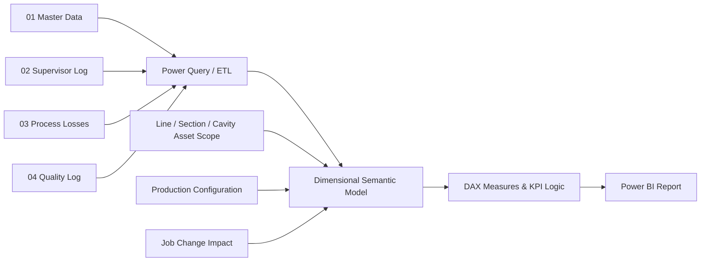

# Lumora Manufacturing Intelligence

**A Power BI manufacturing analytics solution for production performance, process losses, product quality, rework, job-change efficiency, and section/cavity-level loss attribution.**

> **Portfolio note:** the public version uses synthetic/anonymized manufacturing data and artificial branding. It is designed to demonstrate the business logic, data modeling, validation, DAX, and dashboarding approach without exposing confidential plant information.

---

## Dashboard Preview

### Executive Overview


### Production Losses & Pack Efficiency


### Product Performance & Loss Analysis


### Job Change & Time Loss Analysis


### Time Loss Reasons Analysis


---

## Project Overview

Manufacturing dashboards often stop at line-level KPIs. That is useful for monitoring, but it does not always explain **where the loss actually happened**.

This project extends a conventional production dashboard into a more diagnostic manufacturing intelligence model. It combines:

- production output and pack efficiency;
- hold and reject performance;
- 11 process-loss categories;
- quality sampling and rework;
- job-change T1/T2 performance;
- hot-end, cold-end, and palletizer downtime;
- product/order/customer analysis; and
- detailed **Line → Section → Cavity** impact attribution.

The result is a five-page Power BI report designed for both executive monitoring and engineering root-cause analysis.

---

## Business Problem

The core management questions are:

1. **Are production lines delivering against their designed output?**
2. **Which lines, products, and orders are driving the largest production gap?**
3. **Which process-loss categories contribute most to lost output?**
4. **Are job changes meeting their T1 and T2 standards?**
5. **Which downtime reasons create the highest recurring loss?**
6. **Did a job-change loss affect the whole line, a section, or a single cavity?**
7. **What is the capacity-weighted impact of that localized loss?**
8. **Which sections and cavities should engineering prioritize first?**

The last two questions are the main modeling extension in this project. A one-hour stop on one cavity should not be treated as a one-hour full-line stop.

---

## Manufacturing Model

The demonstration plant contains five production lines: **21–25**.

For the detailed asset model, each line has a physical capability of:

- **13 sections per line**
- **up to 3 cavity positions per section**

Physical capability is kept separate from the active production configuration. A production order may use fewer sections or fewer cavities depending on the product and setup.

This distinction prevents false precision and allows loss calculations to reflect the equipment that was actually active during each production event.

---

## KPI Logic

### Production

```text
Designed Cuts per Hour
= Designed Cycles per Minute
  × Active Sections
  × Cavities per Section
  × 60
```

```text
Design Output
= Designed Cuts per Hour × Working Hours
```

```text
Material Balance
Design Output = Actual Pack + Total Hold + Total Reject
```

```text
Pack Efficiency / FPY
= Actual Pack ÷ Design Output
```

```text
Hold Rate
= Total Hold ÷ Design Output
```

```text
Reject / Defect Rate
= Total Reject ÷ Design Output
```

### Detailed Job-Change Impact

A job-change event can have multiple child impact records. Each impact identifies:

- loss area;
- affected asset level;
- section/cavity where applicable;
- duration;
- reason;
- production event;
- active capacity at the time of the event.

```text
Capacity Impact %
= Affected Active Cavities ÷ Total Active Cavities
```

```text
Line-Equivalent Loss Hours
= Duration Hours × Capacity Impact %
```

```text
Estimated Lost Units
= Duration Hours
  × 60
  × Designed Cycles per Minute
  × Affected Active Cavities
```

This avoids overstating a localized cavity or section loss as a complete line loss.

---

## Dashboard Pages

### 1. Executive Overview

Designed for top-management monitoring.

Key metrics and visuals include:

- FPY / Pack Efficiency;
- reject rate;
- hold rate;
- reworked, resorted, and cullet units;
- total job-change loss hours;
- daily FPY trend against target;
- daily job-change efficiency;
- actual packed production versus target gap; and
- average job-change duration.

### 2. Production Losses & Pack Efficiency

Focuses on production performance by line and product.

It includes:

- design output versus actual pack;
- production gap;
- line-level pack efficiency;
- process-loss matrix by product;
- top sections by estimated lost units; and
- top cavities by estimated lost units.

### 3. Product Performance & Loss Analysis

Used to identify underperforming products and orders.

It includes:

- pack-efficiency trend;
- lowest pack-efficiency orders;
- average loss percentage by category;
- top loss categories over time; and
- product, customer, and order filtering.

### 4. Job Change & Time Loss Analysis

Analyzes changeover effectiveness.

It includes:

- number of job changes;
- average job-change hours;
- job-change efficiency;
- T1 mechanical work versus target;
- T2 forming time versus target;
- T1/T2 hours saved or lost;
- trial, hot-end, cold-end, and palletizer loss hours;
- job-change loss percentage by line; and
- job-change loss percentage by type.

### 5. Time Loss Reasons Analysis

Drills into recurring downtime causes.

It includes:

- hot-end loss percentage by reason;
- average hot-end downtime per event;
- cold-end loss percentage by reason;
- average cold-end downtime per event;
- palletizer loss percentage by reason;
- average palletizer downtime per event;
- top sections by equivalent loss time; and
- top cavities by equivalent loss time.

---

## Data Architecture



The workbook structure is also designed with staging/dimensional mappings in mind, so the same business model can be migrated from Excel/Power Query to a SQL Server/SSIS data-warehouse implementation without changing the KPI definitions.

---

## Semantic Model

### Core Dimensions

- `DimDate`
- `Dim_Lines`
- `Dim_Order`
- `Dim_Products`
- `Dim_Customers`
- `Dim_Shift`
- `Dim_Crew`
- `Dim_Case`
- `Dim_JobChangeTypes`
- `Dim_HE_DowntimeReason`
- `Dim_CE_LossesReason`
- `Dim_PalletizerReason`
- `Dim_DefectName`
- `Dim_ReworkStatus`
- `Dim_AssetScope`

### Core Facts / Detail Tables

- `DailyProduction_Fact`
- `LossesOutput_Fact`
- `SamplingDefectLog_Fact`
- `Rework_Fact`
- `JobChange_Fact`
- `JobChangeImpact`
- `ProductionConfiguration`

### Measure Groups

The model separates DAX into dedicated measure tables for maintainability, including production, losses, job change, quality, rework, executive charts, and section/cavity analysis.

---

## Source Workbooks

| Workbook | Business Purpose |
|---|---|
| `01_MasterData.xlsx` | Customers, products, orders, lines, job-change standards, lookup values, and physical asset hierarchy |
| `02_Supervisor_Log.xlsx` | Daily production, job-change events, detailed job-change impacts, and production configuration |
| `03_Process_Losses.xlsx` | Wide-format process-loss percentages by production event |
| `04_Quality_Log.xlsx` | Hourly defect sampling and rework activity |
| `Lumora-Manufacturing-Intelligence.pbix` | Power BI semantic model, DAX measures, and report pages |

---

## Granularity Strategy

One of the main technical challenges was combining datasets with different grains without creating double counting.

| Dataset | Grain |
|---|---|
| Daily Production | Line × Date × Shift × Order |
| Process Losses | Line × Date × Shift × Order |
| Quality Sampling | Line × Date × Order × Hour × Defect |
| Rework | Line × Date × Shift × Order × Rework Status |
| Job Change | One row per job-change event |
| Job Change Impact | One row per impact component and asset scope |
| Production Configuration | Production Event × Physical Section |
| Asset Scope | Physical Line / Section / Cavity |

The model uses stable event IDs and explicit parent-child relationships to preserve these grains.

---

## Data Quality & Validation

The Excel input layer is not treated as an uncontrolled flat-file source. It includes validation and reconciliation checks such as:

- unique production-event IDs;
- unique job-change-event IDs;
- product/customer consistency;
- design-cuts formula validation;
- design-output validation;
- production material-balance validation;
- job-change reason consistency;
- order-transition validation;
- parent-event checks;
- asset-scope validation;
- duration validation;
- section/cavity physical-capability checks; and
- production-configuration reconciliation.

Legacy or invalid source values are **flagged rather than silently overwritten**, which preserves auditability.

---

## Power Query / ETL Transformations

Important transformations include:

- data-type enforcement;
- reference/master-data joins;
- process-loss unpivoting from 11 wide percentage columns;
- cavity-flag unpivoting for cavity-grain analysis;
- event-key generation and reconciliation;
- dimensional normalization; and
- preparation of line/section/cavity display fields.

---

## DAX & Analytics Techniques

The report uses DAX patterns including:

- context-aware ratios;
- target and variance measures;
- dynamic conditional colors;
- ranking with `RANKX`;
- Top-N asset analysis;
- time-intelligence filtering;
- line-equivalent loss calculations;
- selected-period availability logic;
- dynamic KPI status measures; and
- measure-table separation for maintainability.

---

## Demonstration Dataset

The included portfolio dataset is a **synthetic one-week sample** covering **2025-10-20 to 2025-10-26**.

It contains approximately:

- **5 production lines**
- **70 production events**
- **70 process-loss records**
- **9 job-change events**
- **33 detailed job-change impact records**
- **910 event-section production-configuration rows**
- **145 quality-sampling records**
- **18 rework records**
- **265 physical asset-scope records**
- **15 production orders**
- **3 products**

The test dataset represents more than **13 million designed units** and is structured to exercise the production, quality, loss, and asset-granularity business rules.

---

## Example Portfolio Results

For the current synthetic test period, the dashboard reconciles to:

- **13.06M** designed units;
- **12.31M** packed units;
- **94.25%** pack efficiency / FPY;
- **4.71%** reject rate;
- **1.04%** hold rate;
- **23K** reworked units;
- **17.2K** resorted units;
- **5.8K** units moved to cullet; and
- **53.65 hours** of recorded job-change time across **9 job changes**.

These values are included only to demonstrate model reconciliation and dashboard behavior.

---

## Repository Structure

```text
manufacturing-performance-analytics-powerbi/
│
├── README.md
├── powerbi/
│   └── Lumora-Manufacturing-Intelligence.pbix
│
├── data/
│   ├── 01_MasterData.xlsx
│   ├── 02_Supervisor_Log.xlsx
│   ├── 03_Process_Losses.xlsx
│   └── 04_Quality_Log.xlsx
│
└── docs/
    └── images/
        ├── 01-executive-overview.png
        ├── 02-production-losses.png
        ├── 03-product-performance.png
        ├── 04-job-change.png
        └── 05-downtime-reasons.png
```

---

## How to Run

1. Clone or download the repository.
2. Place the four Excel source files in the `data/` folder.
3. Open the `.pbix` file in Power BI Desktop.
4. In **Transform Data → Data source settings**, update the Excel source paths to your local repository.
5. Refresh the model.
6. Review any source rows marked `CHECK` before using the report for analysis.
7. Use the Date, Line, Order, Product, and Customer slicers to explore the dashboard.

---

## Design Decisions

### Why keep physical capability separate from active configuration?

A line may physically support 13 sections and three cavities per section, but a product may run with fewer sections or cavities. Storing only the physical maximum would overstate production capacity and localized-loss impact.

### Why use a child `JobChangeImpact` table?

A job change can contain multiple loss components—T1, T2, trial, hot-end, cold-end, or palletizer—and each component can affect a different asset scope. A child fact allows each component to be recorded once at the correct grain while the parent job-change event remains unique.

### Why calculate line-equivalent loss hours?

A 60-minute single-cavity loss is not equivalent to a 60-minute full-line stop. Capacity weighting makes section/cavity comparisons meaningful to management.

---

## Business Value

This solution moves the analysis from:

> **“How much did the line lose?”**

to:

> **“What caused the loss, where did it occur, how much capacity did it affect, and what should we fix first?”**

That enables production, process, quality, maintenance, and management teams to work from the same operational model while viewing the problem at the level relevant to them.

---

## Technology Stack

- **Microsoft Power BI**
- **DAX**
- **Power Query (M)**
- **Microsoft Excel**
- **Dimensional / Star-Schema Modeling**
- **Manufacturing KPI Design**
- **Data Validation & Reconciliation**

The source design is also compatible with a future **SQL Server + SSIS** staging/data-warehouse implementation.

---

## Future Enhancements

Potential next steps include:

- automated ingestion from MES/SCADA instead of daily Excel;
- SQL Server data warehouse and scheduled ETL;
- incremental refresh;
- row-level security;
- statistical process-control views;
- downtime event overlap detection;
- predictive loss and quality modeling;
- maintenance/work-order integration;
- alerting for KPI threshold violations; and
- deployment through Power BI Service.

---

## Author

Developed as a manufacturing analytics portfolio project demonstrating the integration of **manufacturing engineering knowledge, data modeling, data quality controls, DAX, and executive dashboard design**.
