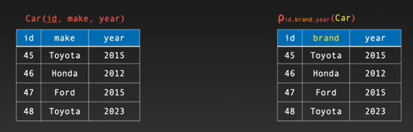

# SQL

## Types of Database (In Depth)

### 1. **Relational (SQL) Databases**

Relational databases store data in structured tables made of rows and columns. Each table has a schema that defines the structure of the data. Relationships between tables are established using **primary** and **foreign keys**.

**Key Features:**

* Structured and schema-based.
* Uses SQL for querying.
* Supports ACID transactions.
* Ideal for applications requiring complex joins and consistency.

**Examples:** MySQL, PostgreSQL, SQL Server, Oracle.

**Use Cases:** Banking systems, enterprise apps, inventory systems.

### 2. **Graph Databases**

Graph databases store data as **nodes**, **edges**, and **properties**. They are optimized for analyzing complex relationships.

**Key Features:**

* Excellent for highly connected data.
* Edges store relationship information.
* Fast traversal using graph algorithms.

**Examples:** Neo4j, Amazon Neptune, ArangoDB.

**Use Cases:** Social networks, recommendation engines, fraud detection.

### 3. **Key-Value Databases**

A key-value database stores data as simple **key → value** pairs. Values can be strings, JSON, binary, or complex objects.

**Key Features:**

* Extremely fast reads/writes.
* Very scalable and distributed.
* No predefined schema.

**Examples:** Redis, DynamoDB, Riak.

**Use Cases:** Caching, session storage, real-time analytics.

### 4. **Column Store Databases**

Columnar databases store data by **columns** instead of rows. This makes them very efficient for analytical queries that scan only specific columns.

**Key Features:**

* High compression.
* Excellent for large-scale analytics.
* Optimized for aggregation queries.

**Examples:** Apache Cassandra, HBase, Bigtable, Amazon Redshift.

**Use Cases:** Big data analytics, data warehousing, reporting systems.

---

## Relational Algebra in the Context of Relational Databases

Relational algebra is a formal language used to manipulate and query data stored in relational databases. It provides a set of operations that take one or more relations (tables) as input and return a new relation as output.

### **Why Relational Algebra Matters**

* It forms the theoretical foundation of SQL.
* Helps optimize and reason about queries.
* Ensures operations are mathematically sound.

### **Core Operations of Relational Algebra**

#### 1. **Selection (σ)**

Extracts rows that satisfy a condition.

* Example: σ(age > 30)(Employees)

#### 2. **Projection (π)**

Extracts specific columns from a table.

* Example: π(name, salary)(Employees)

#### 3. **Rename (ρ)**

Renames a table or its attributes.

* Example: ρ(Emp)(Employees)

### **Set-Based Operations**

These assume that relations are sets (no duplicates).

#### 4. **Union (R ∪ S)**

Returns tuples present in either relation.

#### 5. **Intersection (R ∩ S)**

Returns tuples present in both relations.

#### 6. **Difference (R − S)**

Returns tuples in R but not in S.

### **Join Operations**

Used to combine data from multiple tables.

#### 7. **Cartesian Product (R × S)**

Combines every tuple of R with every tuple of S.

#### 8. **Theta Join (⋈θ)**

Joins tables based on a condition.

* Example: Employees ⋈ Employees.dept_id = Departments.id Departments

#### 9. **Natural Join (⋈)**

Automatically joins using attributes with the same name.

### **Division (÷)**

Used for queries involving "for all" logic.

* Example: Find students who take *all* courses taught by a specific professor.

### **How It Connects to SQL**

Relational algebra operations map directly to SQL:

* SELECT → σ (selection)
* SELECT column list → π (projection)
* JOIN → ⋈ (join)
* UNION / EXCEPT / INTERSECT → set operations

If you want, I can add diagrams, tables, examples, or practice exercises!
