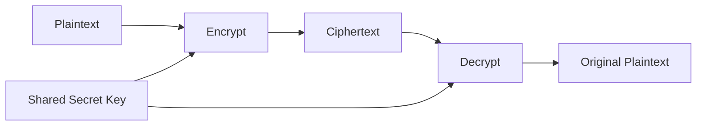
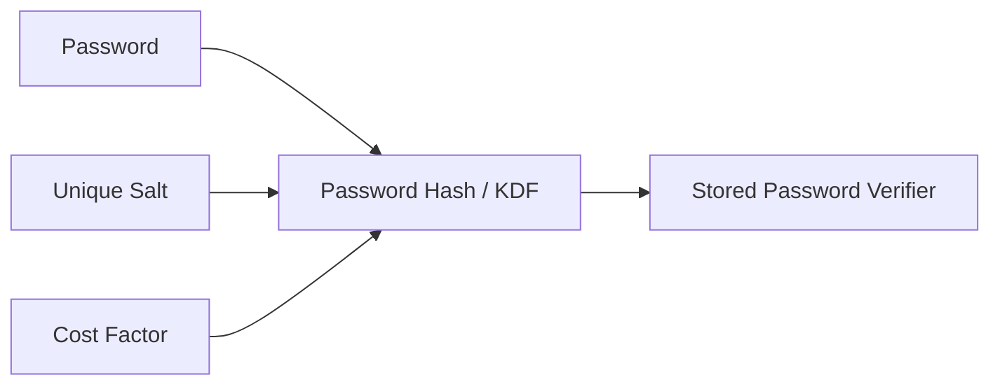

# Security Operations — Deep Learning Material

> A cybersecurity study module covering data security, the data lifecycle, secure data handling, logging and monitoring, cryptography and cryptanalysis, system hardening, security policies, and security-awareness training.

---

# Table of Contents

1. Security Operations Overview
2. Data Security Fundamentals
3. Data States
4. Data Lifecycle
5. Data Classification and Labeling
6. Data Handling Practices
7. Data Retention
8. Secure Data Destruction
9. Why Normal Deletion Is Not Secure Destruction
10. Clear, Purge, and Destroy
11. Data Ownership and Custodianship
12. Data Minimization and DLP
13. Event Logging and Monitoring
14. Important Log Sources
15. SIEM
16. Ingress, Egress, and East-West Monitoring
17. Log Integrity and Retention
18. Cryptography Fundamentals
19. Cryptography vs Cryptanalysis vs Cryptology
20. Symmetric Cryptography
21. Block and Stream Ciphers
22. AES and Authenticated Encryption
23. Asymmetric Cryptography
24. Hybrid Cryptography
25. Hash Functions
26. Password Hashing and Salting
27. HMAC
28. Digital Signatures
29. PKI and Certificates
30. Key Management
31. Cryptanalysis Attack Models
32. Side-Channel Cryptanalysis
33. Post-Quantum Cryptography
34. Cryptography Advantages and Limitations
35. Python Cryptography Examples
36. System Hardening
37. Endpoint and Server Hardening
38. Network and Cloud Hardening
39. Hardening Verification
40. Security Policies
41. Policy vs Standard vs Procedure vs Guideline
42. Core Security Policies
43. Security Awareness Training
44. Role-Based Awareness Training
45. Security Operations Architecture
46. Common Misconceptions and Slide Corrections
47. Interview and Exam Questions
48. Final Review Sheet
49. Authoritative References

---

# 1. Security Operations Overview

**Security Operations** is the continuous process of protecting systems, networks, identities, applications, and data during normal business operation.

It combines:

```text
People
+
Processes
+
Technology
```

Typical activities include:

```text
Monitoring
Threat Detection
Incident Investigation
Data Protection
Cryptographic Protection
Hardening
Patch Management
Vulnerability Management
Policy Enforcement
Security Awareness
```

A simple operational cycle is:

```text
Assets
  ↓
Protect
  ↓
Monitor
  ↓
Detect
  ↓
Investigate
  ↓
Respond
  ↓
Recover
  ↓
Improve
```

The primary objectives are:

```text
Confidentiality
Integrity
Availability
Authentication
Authorization
Accountability
Privacy
Resilience
```

---

# 2. Data Security Fundamentals

**Data security** protects information from unauthorized disclosure, modification, destruction, theft, or loss.

Security must apply throughout the full lifecycle of data, not only while it is stored.

A useful model is:

```text
Data
├── At Rest
├── In Transit
└── In Use
```

---

# 3. Data States

## Data at Rest

Stored data.

Examples:

```text
Hard Disk
Database
Backup
USB Drive
Cloud Storage
Archive
```

Controls:

```text
Encryption
Access Control
DLP
Backups
Physical Security
```

## Data in Transit

Data moving between systems.

Examples:

```text
Web Traffic
VPN Traffic
API Calls
Email
File Transfer
```

Controls:

```text
TLS
VPN
SSH
IPsec
Secure File Transfer
```

## Data in Use

Data currently being processed.

Controls:

```text
Least Privilege
Application Isolation
Memory Protection
Role-Based Access
Process Isolation
Confidential Computing where appropriate
```

---

# 4. Data Lifecycle

A practical data lifecycle is:

```text
Create / Collect
      ↓
Classify
      ↓
Store
      ↓
Use
      ↓
Share / Transmit
      ↓
Archive
      ↓
Retain
      ↓
Sanitize / Destroy
```


## Create / Collect

Ask:

```text
Do we really need this data?
Who owns it?
How sensitive is it?
Which laws or contracts apply?
```

## Store

Protect using:

```text
Encryption
Access Control
Secure Configuration
Backup
Logging
```

## Use

Allow only authorized users and systems.

```text
User
 ↓
Authentication
 ↓
Authorization
 ↓
Required Data Only
```

## Share

Before transmitting data, verify:

```text
Recipient
Authorization
Classification
Approved Channel
Encryption Requirement
```

## Archive

Archived data is still sensitive.

Use:

```text
Encryption
Restricted Access
Integrity Checks
Retention Rules
```

## Destroy

When retention expires, data should be sanitized according to sensitivity and media type.

---

# 5. Data Classification and Labeling

## Classification

Classification identifies sensitivity.

Example model:

```text
Public
Internal
Confidential
Restricted
```

### Public

Approved for public release.

### Internal

For employees or approved internal users.

### Confidential

Disclosure could cause meaningful business or privacy harm.

### Restricted

Highest sensitivity.

Examples:

```text
Private Cryptographic Keys
Authentication Secrets
Payment Information
Critical Credentials
Trade Secrets
```

## Labeling

A **label** communicates the classification to people and systems.

Examples:

```text
PUBLIC
INTERNAL USE ONLY
CONFIDENTIAL
RESTRICTED
```

Labels may exist as:

```text
Document Headers
Email Labels
File Metadata
Database Tags
Cloud Resource Tags
DLP Labels
```

### Classification vs Labeling

```text
Classification
→ What sensitivity level is this data?

Label
→ How do we mark that sensitivity level?
```

---

# 6. Data Handling Practices

Handling requirements should become stronger as data sensitivity increases.

| Classification | Storage | Transmission | Access | Disposal |
|---|---|---|---|---|
| Public | Standard | Standard | Broad | Standard |
| Internal | Controlled | Approved channels | Employees | Approved disposal |
| Confidential | Encrypted | Encrypted | Need-to-know | Sanitization |
| Restricted | Strong encryption | Approved secure channels | Strict least privilege | Purge/Destroy |

Core handling practices:

```text
Classify
Label
Restrict Access
Encrypt
Monitor
Retain Correctly
Destroy Securely
```

---

# 7. Data Retention

**Retention** defines how long data should exist.

Retention depends on:

```text
Business Need
Legal Requirements
Regulation
Contract
Audit Requirements
Investigation Requirements
Privacy Risk
```

Good retention balances:

```text
Need to Keep Data
       vs
Risk of Keeping Data
```

A policy should specify:

```text
Data Type
Owner
Retention Period
Archive Location
Legal Hold Rules
Destruction Method
```

---

# 8. Secure Data Destruction

Secure deletion means more than choosing **Delete** in an operating system.

The goal of sanitization is to make recovery of target data infeasible for the defined threat model.

NIST media-sanitization terminology uses:

```text
Clear
Purge
Destroy
```

---

# 9. Why Normal Deletion Is Not Secure Destruction

A normal filesystem deletion often removes a reference to data or marks storage as available for reuse.

Conceptually:

```text
Before Deletion

Directory Entry
      |
      v
+----------------+
| Storage Blocks |
| Actual Data    |
+----------------+
```

After a typical deletion:

```text
Directory Entry
      X

+----------------+
| Old Data       |
| May Remain     |
+----------------+
```

This means:

```text
File Deleted
≠
Guaranteed Data Sanitization
```

Important nuance:

Modern SSDs, flash translation layers, TRIM, snapshots, cloud storage, encrypted disks, virtual storage, and deduplication can change how deletion behaves. Therefore, always use media-specific sanitization guidance.

---

# 10. Clear, Purge, and Destroy

## Clear

Logical sanitization intended to make data unrecoverable through normal interfaces and ordinary recovery techniques.

Media usually remains usable.

## Purge

Stronger sanitization intended to make recovery infeasible even with more advanced techniques.

Depending on media, methods can include:

```text
Cryptographic Erase
Device-Specific Sanitization Commands
Degaussing for compatible magnetic media
```

## Destroy

Physical destruction so the media cannot be reused.

Possible approved methods include:

```text
Shredding
Disintegration
Pulverization
Incineration
Other approved physical destruction methods
```

Decision concept:

```text
Need to Reuse Media?
        |
   +----+----+
   |         |
  Yes        No
   |         |
Clear/Purge  Destroy when appropriate
```

The chosen method depends on:

```text
Data Sensitivity
Media Technology
Reuse Requirements
Threat Model
Law / Policy
```

---

# 11. Data Ownership and Custodianship

## Data Owner

Business role responsible for decisions about:

```text
Classification
Access
Retention
Business Use
```

## Data Custodian

Technical/operational role implementing protection.

Examples:

```text
DBA
Cloud Administrator
Storage Administrator
IT Operations
```

Diagram:

```text
Data Owner
   |
   | Defines requirements
   v
Data Custodian
   |
   | Implements controls
   v
Data System
```

---

# 12. Data Minimization and DLP

## Data Minimization

Collect and retain only what is needed.

```text
Less Data
   ↓
Less Exposure
   ↓
Lower Breach Impact
```

## DLP — Data Loss Prevention

DLP detects and controls sensitive data.

It may protect:

```text
Data at Rest
Data in Use
Data in Transit
```

Deployment locations:

```text
Endpoint
Email
Network
Cloud
SaaS
```

Example:

```text
Employee Upload
      ↓
Sensitive File
      ↓
DLP Detects Classification
      ↓
Block / Warn / Log
```

---

# 13. Event Logging and Monitoring

Security monitoring requires usable telemetry.

```text
Systems
  ↓
Logs
  ↓
Central Collection
  ↓
SIEM
  ↓
Correlation
  ↓
Alert
  ↓
Investigation
```

Logging supports:

```text
Detection
Incident Response
Forensics
Audit
Compliance
Troubleshooting
Accountability
```

---

# 14. Important Log Sources

Important telemetry includes:

```text
Windows Events
Linux Logs
Identity Provider
Active Directory
Cloud Audit Logs
Firewalls
DNS
DHCP
VPN
Web Servers
Applications
Databases
EDR
IDS/IPS
Email
Proxy
DLP
PAM
Network Devices
```

Useful log fields include:

```text
Timestamp
User
Source IP
Destination
Action
Result
Process
Resource
Session ID
Device
```

---

# 15. SIEM

**SIEM = Security Information and Event Management**

A SIEM collects and correlates security data from many systems.

```text
Firewall ───┐
EDR ────────┤
Identity ───┤
Cloud ──────┤
DNS ────────┤
VPN ────────┤
Apps ───────┘
      ↓
     SIEM
      ↓
Correlation
      ↓
Detection
      ↓
Alert
```

Functions:

```text
Collection
Parsing
Normalization
Correlation
Search
Detection Rules
Dashboards
Alerting
Retention
Investigation
Reporting
```

Example correlation:

```text
30 Failed Logins
      +
Successful Login
      +
New Country
      +
Admin Privilege Change
      ↓
High-Risk Alert
```

---

# 16. Ingress, Egress, and East-West Monitoring

## Ingress

Traffic entering the organization.

```text
Internet
   ↓
Ingress
   ↓
Organization
```

Monitor for:

```text
Exploitation
Malware
Scanning
DDoS
Unauthorized Access
```

Controls:

```text
Firewall
IDS/IPS
WAF
DDoS Protection
Email Security
```

## Egress

Traffic leaving the organization.

```text
Organization
    ↓
Egress
    ↓
Internet
```

Monitor for:

```text
Data Exfiltration
Malware C2
DNS Tunneling
Suspicious Uploads
Large Transfers
```

Controls:

```text
Egress Firewall
Proxy
DLP
NDR
DNS Monitoring
CASB / SSE
```

## East-West

Internal traffic between workloads.

```text
Server A
   ↔
Server B
   ↔
Database
```

Important for detecting:

```text
Lateral Movement
Internal Reconnaissance
Credential Reuse
Data Collection
```

---

# 17. Log Integrity and Retention

Attackers may try to:

```text
Delete Logs
Modify Logs
Disable Logging
Change System Time
Flood Logging Systems
```

Protect logs through:

```text
Central Collection
Restricted Access
Time Synchronization
Encryption
Immutable Storage where needed
Backups
Integrity Controls
Monitoring for Logging Failures
```

Retention should define:

```text
Which Logs
How Long
Storage Location
Who Can Access
How Logs Are Destroyed
```

---

# 18. Cryptography Fundamentals

**Cryptography** uses mathematical techniques to protect information.

Main objectives:

```text
Confidentiality
Integrity
Authentication
Support for Non-Repudiation
```

Typical uses:

```text
TLS
VPN
Disk Encryption
Digital Signatures
Certificates
Secure Software Updates
Password Verification
```

---

# 19. Cryptography vs Cryptanalysis vs Cryptology

## Cryptography

Design and use of techniques that protect information.

## Cryptanalysis

Analysis of cryptographic systems to understand weaknesses and determine whether protected information can be recovered without the intended secret.

## Cryptology

The combined discipline:

```text
           Cryptology
           /       \
          /         \
Cryptography     Cryptanalysis
 Build/Protect   Analyze/Break
```

---

# 20. Symmetric Cryptography

Symmetric cryptography uses a shared secret key.

```text
Plaintext
   ↓
Encrypt with K
   ↓
Ciphertext
   ↓
Decrypt with K
   ↓
Plaintext
```



Examples:

```text
AES
ChaCha20
```

Advantages:

```text
Fast
Efficient
Good for large amounts of data
```

Challenges:

```text
Key Distribution
Key Storage
Key Rotation
Large-Scale Key Management
```

### Important Correction

It is too absolute to say:

```text
The symmetric key cannot be sent over the same channel.
```

The real requirement is:

```text
The shared secret must be established securely.
```

Secure authenticated key exchange or key encapsulation can establish a symmetric key over the same underlying network.

---

# 21. Block and Stream Ciphers

## Block Cipher

Processes fixed-size blocks.

Example:

```text
AES
Block Size = 128 bits
```

## Stream Cipher

Generates a pseudorandom keystream and combines it with data.

Modern example:

```text
ChaCha20
```

Usually paired with authentication:

```text
ChaCha20-Poly1305
```

---

# 22. AES and Authenticated Encryption

**AES = Advanced Encryption Standard**

Key sizes:

```text
AES-128
AES-192
AES-256
```

Block size:

```text
128 bits
```

Used for:

```text
Storage Encryption
TLS
VPN
Database Encryption
Backups
```

Modern designs should generally use **authenticated encryption**.

Example:

```text
AES-GCM
```

Provides:

```text
Confidentiality
+
Integrity / Authentication of Ciphertext
```

Concept:

```text
Plaintext
   ↓
AEAD + Key + Nonce
   ↓
Ciphertext + Authentication Tag
```

---

# 23. Asymmetric Cryptography

Asymmetric cryptography uses a key pair:

```text
Public Key
Private Key
```

The private key must remain protected.

Uses include:

```text
Digital Signatures
Key Agreement
Key Encapsulation
Public-Key Encryption
Certificates
```

Public-key encryption concept:

```text
Receiver Public Key
       ↓
Encrypt
       ↓
Ciphertext
       ↓
Receiver Private Key
       ↓
Decrypt
       ↓
Plaintext
```

Advantages:

```text
Public key can be shared
Supports digital signatures
Supports scalable trust systems
Enables secure key establishment
```

Limitations:

```text
Slower than symmetric encryption
More complex
Requires trusted public-key authentication
```

### Important Correction

Asymmetric cryptography does **not inherently require PKI**.

PKI is one important trust framework used to authenticate public keys with certificates.

---

# 24. Hybrid Cryptography

Real systems typically combine asymmetric and symmetric cryptography.

```text
Asymmetric Cryptography
        ↓
Establish Shared Session Key
        ↓
Symmetric Encryption
        ↓
Bulk Application Data
```

Why?

```text
Asymmetric
→ Good for key establishment and identity

Symmetric
→ Fast for bulk encryption
```

TLS uses this general hybrid design.

---

# 25. Hash Functions

A cryptographic hash maps arbitrary-length data into fixed-length output.

```text
Input
  ↓
Hash Function
  ↓
Digest
```

Hashing is:

```text
One-Way
```

It is not encryption.

You do not decrypt a hash.

Desired properties:

```text
Preimage Resistance
Second-Preimage Resistance
Collision Resistance
Avalanche Effect
```

Modern standardized families include:

```text
SHA-2
SHA-3
```

Examples:

```text
SHA-256
SHA-384
SHA-512
```

Legacy security-sensitive use should avoid:

```text
MD5
SHA-1
```

---

# 26. Password Hashing and Salting

Passwords should never be stored in plaintext.

Correct concept:

```text
Password
   +
Unique Random Salt
   +
Password Hashing Scheme / KDF
   +
Cost Factor
   ↓
Stored Verifier
```



## Salt

A salt is a unique random value used for password hashing.

Salt does **not** need to be secret.

Purpose:

```text
Same Password
+
Different Salt
=
Different Stored Result
```

### Important Correction: Raw SHA-256 Is Not Enough

A training slide may show:

```text
Password
 ↓
SHA-256
 ↓
Hash
```

This is not sufficient for secure password storage.

General-purpose hashes are intentionally fast.

Password storage should use:

```text
Salt
+
Password Hash / KDF
+
Cost Factor
```

Examples include approved password-hashing/KDF mechanisms such as PBKDF2 and modern memory-hard password hashing where appropriate.

---

# 27. HMAC

**HMAC = Hash-Based Message Authentication Code**

Combines:

```text
Hash Function
+
Secret Key
```

Provides:

```text
Integrity
+
Authentication using shared secret
```

Concept:

```text
Message + Secret Key
       ↓
      HMAC
       ↓
Authentication Tag
```

---

# 28. Digital Signatures

Digital signatures use asymmetric cryptography.

```text
Private Key
→ Sign

Public Key
→ Verify
```

They provide:

```text
Integrity
Origin Authentication
Support for Non-Repudiation
```

They do **not** inherently provide confidentiality.

## Signing Flow

```text
Message
  ↓
Hash / Signature Preparation
  ↓
Signing Algorithm
  +
Private Key
  ↓
Digital Signature
```

## Verification Flow

```text
Message + Signature + Public Key
          ↓
Verification Algorithm
          ↓
Valid / Invalid
```

If the message changes:

```text
Signature Verification Fails
```

### Digital Signature vs Encryption

| Encryption | Digital Signature |
|---|---|
| Confidentiality | Integrity/authentication |
| Encrypt/decrypt | Sign/verify |
| Hides content | Does not necessarily hide content |

---

# 29. PKI and Certificates

**PKI = Public Key Infrastructure**

PKI manages public-key trust.

Core components:

```text
Certificate Authority — CA
Registration Authority — RA
Digital Certificates
Certificate Repositories
Revocation Services
Policies
Key Management
```

Certificate concept:

```text
Identity
  +
Public Key
  +
Validity
  +
CA Signature
  ↓
Digital Certificate
```

Trust chain:

```text
Root CA
   ↓
Intermediate CA
   ↓
Server / User Certificate
```

Certificates are used in:

```text
HTTPS
VPN
802.1X
Device Authentication
Code Signing
Email Security
```

---

# 30. Key Management

Strong cryptography can fail because of weak key management.

Key lifecycle:

```text
Generate
  ↓
Distribute / Establish
  ↓
Store
  ↓
Use
  ↓
Rotate
  ↓
Revoke / Retire
  ↓
Archive if required
  ↓
Destroy
```

Controls:

```text
CSPRNG
HSM
TPM
Key Vault
Least Privilege
Dual Control where appropriate
Rotation
Backup where appropriate
Audit Logging
```

## Rotation

Replaces keys due to:

```text
Time
Usage
Policy
Compromise
Algorithm Transition
```

## Revocation

Removes trust because of:

```text
Private-Key Compromise
Employee Departure
Device Loss
Incorrect Certificate
Algorithm Weakness
```

---

# 31. Cryptanalysis Attack Models

Security professionals should understand common attack models conceptually.

```text
Brute Force
Ciphertext-Only
Known-Plaintext
Chosen-Plaintext
Chosen-Ciphertext
Frequency Analysis
Collision Attacks
Side-Channel Analysis
Fault Analysis
```

## Brute Force

Tries candidate keys or passwords until one succeeds.

Defenses depend on:

```text
Key Size
Password Entropy
Rate Limiting
KDF Cost
MFA
```

## Ciphertext-Only

Attacker sees ciphertext only.

Strong modern encryption should withstand this.

## Known-Plaintext

Attacker knows examples of:

```text
Plaintext
+
Corresponding Ciphertext
```

## Chosen-Plaintext

Attacker can obtain ciphertext for chosen inputs.

## Chosen-Ciphertext

Attacker can obtain some information about selected ciphertexts.

Modern cryptosystems are designed for strong attacker models.

## Frequency Analysis

Useful against classical substitution ciphers because language statistics remain visible.

## Collision Attack

Targets hash collision resistance.

## Birthday Effect

For an ideal n-bit hash, generic collision security is conceptually around:

```text
2^(n/2)
```

---

# 32. Side-Channel Cryptanalysis

Side-channel attacks target implementation leakage rather than the core mathematics.

```text
Cryptographic Operation
       |
       +--> Timing
       +--> Power
       +--> CPU Cache
       +--> Electromagnetic Signals
       +--> Fault Behavior
```

Types:

```text
Timing Analysis
Power Analysis
Cache Attacks
Electromagnetic Analysis
Fault Attacks
```

Defenses:

```text
Constant-Time Implementations
Secure Hardware
Masking
Secure Elements
Validated Libraries
Fault Detection
```

### Cryptographic Algorithm vs Implementation

```text
Strong Algorithm
+
Weak Implementation
=
Weak System
```

Example:

```text
AES-256
+
Key stored in plaintext file
=
Poor Security
```

---

# 33. Post-Quantum Cryptography

Quantum computing threatens many classical public-key algorithms.

NIST standardized major post-quantum algorithms beginning in 2024.

Important names:

```text
ML-KEM
→ Key encapsulation / key establishment

ML-DSA
→ Digital signatures

SLH-DSA
→ Hash-based digital signatures
```

Security Operations should prepare through:

```text
Cryptographic Inventory
Crypto Agility
Certificate Planning
Vendor Roadmaps
Algorithm Transition
Harvest-Now-Decrypt-Later Risk Assessment
```

---

# 34. Cryptography Advantages and Limitations

## Advantages

```text
Confidentiality
Integrity
Authentication
Digital Signatures
Secure Key Establishment
Data-at-Rest Protection
Data-in-Transit Protection
Secure Software Updates
Certificate Trust
```

## Limitations

Cryptography alone cannot prevent:

```text
DDoS
Phishing
Malware
Authorized Insider Misuse
Compromised Endpoints
Weak Access Control
Bad Key Management
```

Example:

```text
Encrypted Database
      ↓
Attacker Steals DBA Account
      ↓
System Decrypts Data for Attacker
```

Therefore:

```text
Cryptography
+
Access Control
+
Monitoring
+
Hardening
+
Policies
=
Better Security
```

---

# 35. Python Cryptography Examples

## SHA-256 Integrity Hash

```python
import hashlib

message = b"Security Operations Training"

digest = hashlib.sha256(message).hexdigest()

print(digest)
```

Use cases:

```text
File Integrity
Artifact Verification
Change Detection
```

## HMAC

```python
import hashlib
import hmac

key = b"shared-secret"
message = b"amount=1000"

tag = hmac.new(
    key,
    message,
    hashlib.sha256,
).hexdigest()

print(tag)
```

Verification:

```python
expected = hmac.new(
    key,
    message,
    hashlib.sha256,
).hexdigest()

if hmac.compare_digest(tag, expected):
    print("Valid")
else:
    print("Invalid")
```

## Password Hashing with PBKDF2

```python
import hashlib
import hmac
import os


def hash_password(password: str):
    salt = os.urandom(16)
    iterations = 600_000

    derived = hashlib.pbkdf2_hmac(
        "sha256",
        password.encode(),
        salt,
        iterations,
    )

    return salt, iterations, derived


def verify_password(
    password: str,
    salt: bytes,
    iterations: int,
    expected: bytes,
) -> bool:

    candidate = hashlib.pbkdf2_hmac(
        "sha256",
        password.encode(),
        salt,
        iterations,
    )

    return hmac.compare_digest(
        candidate,
        expected,
    )
```

The specific cost factor should follow current platform guidance and performance testing.

---

# 36. System Hardening

**System hardening** reduces attack surface by securely configuring systems.

```text
Default Installation
       ↓
Remove Unneeded Features
       ↓
Patch
       ↓
Restrict Access
       ↓
Enable Security Controls
       ↓
Monitor
       ↓
Hardened System
```

Core practices:

```text
Asset Inventory
Secure Baselines
Patch Management
Disable Unused Services
Close Unused Ports
Least Privilege
MFA
Host Firewall
EDR
Encryption
Central Logging
Configuration Monitoring
```

---

# 37. Endpoint and Server Hardening

## Endpoint Hardening

```text
Patch OS
Patch Applications
EDR
Host Firewall
Disk Encryption
Application Control
Secure Boot
Least Privilege
USB Controls
Browser Hardening
Logging
```

## Server Hardening

```text
Minimal Installation
Restricted Administration
Patch Management
Host Firewall
EDR
Service Isolation
TLS
Secure Permissions
Central Logging
File Integrity Monitoring
Backups
```

Public server pattern:

```text
Internet
   ↓
Firewall / WAF
   ↓
Hardened Web Server
   ↓
Restricted Application Tier
   ↓
Database
```

---

# 38. Network and Cloud Hardening

## Network Device Hardening

Protect:

```text
Routers
Switches
Firewalls
Wireless APs
Load Balancers
```

Best practices:

```text
Disable Telnet
Use SSH / HTTPS
Use MFA where available
Use AAA / RADIUS / TACACS+
Separate Management Network
Restrict Admin Source IPs
Patch Firmware
Use SNMPv3
Back Up Configuration
Centralize Logs
Disable Unused Ports
```

## Cloud Hardening

```text
Federation
MFA
Least-Privilege IAM
Private Networking
No Unnecessary Public Storage
Encryption
Cloud Logging
Security Posture Management
Key Management
Segmentation
Backups
Resource Inventory
```

Key principle:

```text
Secure Cloud Platform
+
Unsafe Customer Configuration
=
Exposure
```

---

# 39. Hardening Verification

Hardening must be continuously verified.

Use:

```text
Configuration Scanners
Vulnerability Scanners
Compliance Checks
Patch Reports
Audits
Authorized Penetration Testing
Continuous Monitoring
```

Lifecycle:

```text
Harden
  ↓
Verify
  ↓
Monitor Configuration Drift
  ↓
Correct
```

---

# 40. Security Policies

A **security policy** defines management's security requirements and intent.

Policies answer:

```text
What must be protected?
Who is responsible?
What is mandatory?
What is prohibited?
```

Security policies should be:

```text
Approved
Communicated
Enforceable
Reviewed
Updated
```

---

# 41. Policy vs Standard vs Procedure vs Guideline

## Policy

High-level mandatory direction.

Example:

```text
Sensitive data must be encrypted.
```

## Standard

Specific mandatory requirement.

Example:

```text
Only organization-approved encryption algorithms and key-management methods may be used.
```

## Procedure

Step-by-step implementation.

Example:

```text
How to enable storage encryption.
```

## Guideline

Recommended approach.

Example:

```text
Recommended secure file-sharing method.
```

Structure:

```text
Policy
  ↓
Standard
  ↓
Procedure

Guidelines provide recommendations.
```

---

# 42. Core Security Policies

A mature organization commonly needs policies covering:

```text
Acceptable Use
Access Control
Authentication
Data Classification
Data Handling
Encryption
Logging and Monitoring
Patch Management
Vulnerability Management
Remote Access
Backup and Recovery
Incident Response
Third Parties
BYOD
Data Retention
Data Destruction
Change Management
```

## Acceptable Use Policy

Covers:

```text
Internet
Email
Software Installation
Personal Use
Social Media
Data Storage
Prohibited Activities
```

## Access Control Policy

Covers:

```text
Least Privilege
Need to Know
Provisioning
Approvals
Access Reviews
Privileged Access
Offboarding
```

## Authentication Policy

Covers:

```text
MFA
Passkeys
Password Manager
Recovery
Session Security
Privileged Authentication
```

## Data Classification Policy

Defines:

```text
Classification Levels
Labels
Storage Rules
Transmission Rules
Access Rules
Retention
Destruction
```

## Encryption Policy

Defines:

```text
What must be encrypted
Approved algorithms
TLS requirements
Key ownership
Rotation
Certificate management
```

## Logging Policy

Defines:

```text
Required logs
Central collection
Retention
Time synchronization
Access
Integrity
Alerting
```

## Patch and Vulnerability Policy

Defines:

```text
Scanning Frequency
Patch Timeframes
Severity Priorities
Exceptions
Emergency Patching
Verification
```

## Remote Access Policy

Defines:

```text
VPN / ZTNA
MFA
Device Compliance
Approved Devices
Admin Access
Logging
```

## Backup Policy

Defines:

```text
Backup Frequency
Retention
Encryption
Offline / Immutable Copies
Restore Testing
```

## Incident Response Policy

Defines:

```text
Reporting
Roles
Escalation
Evidence
Communication
Containment
Recovery
Lessons Learned
```

## Third-Party Policy

Defines:

```text
Due Diligence
Access Rules
MFA
Logging
Data Handling
Incident Notification
Offboarding
```

## Data Retention and Destruction Policy

Defines:

```text
Retention Periods
Legal Hold
Archive
Clear / Purge / Destroy
Evidence of Disposal
Responsibility
```

---

# 43. Security Awareness Training

Security awareness helps employees recognize threats and follow secure behavior.

Core topics:

```text
Phishing
Social Engineering
Password / Passkeys
MFA
Data Classification
Data Sharing
Malware
Removable Media
Remote Work
Physical Security
Incident Reporting
Software Updates
```

Awareness flow:

```text
Threat Encountered
      ↓
Employee Recognizes It
      ↓
Avoids Unsafe Action
      ↓
Reports Quickly
      ↓
Security Team Responds
```

## Phishing Awareness

Teach employees to inspect:

```text
Sender Domain
Links
Attachments
Urgency
Payment Requests
Credential Requests
Unexpected MFA Prompts
```

Desired behavior:

```text
Suspicious Message
      ↓
Do Not Interact
      ↓
Report
```

## MFA Awareness

Unexpected push notification:

```text
MFA Prompt
   ↓
Did I initiate this login?
   |
   +-- Yes → Continue
   |
   +-- No → Deny + Report
```

## Data Awareness

Users should understand:

```text
Classification
Approved Storage
Approved Sharing
Encryption Requirements
Secure Disposal
```

## Physical Security

Teach:

```text
No Tailgating
Protect Badges
Lock Screens
Clean Desk
Secure Documents
Report Lost Devices
Avoid Unknown USB Devices
```

---

# 44. Role-Based Awareness Training

Different roles require different security education.

## All Employees

```text
Phishing
MFA
Data Handling
Incident Reporting
```

## Administrators

```text
PAM
Hardening
Key Management
Logging
Secure Remote Access
```

## Developers

```text
Secure Coding
Secrets Management
Dependency Security
Code Review
Software Supply Chain
```

## Executives

```text
Whaling
BEC
Crisis Communication
Risk Decisions
```

## SOC Analysts

```text
SIEM
Incident Triage
Threat Intelligence
Detection Engineering
Forensics
```

Useful awareness metrics:

```text
Training Completion
Phishing Report Rate
Phishing Failure Rate
Time to Report
MFA Adoption
Repeat Failure Rate
Policy Violations
```

The goal is:

```text
Improved Security Behavior
```

not merely course completion.

---

# 45. Security Operations Architecture

```text
                         USERS
                           |
                    Awareness + MFA
                           |
                           v
                       IDENTITY
                           |
                           v
INTERNET ---> FIREWALL ---> NETWORK ---> ENDPOINTS
               |              |             |
               |              |             +--> EDR
               |              +--> NDR
               +--> IDS/IPS
                           |
                           v
                      APPLICATIONS
                           |
                           v
                         DATA
              Classification / Encryption
                 DLP / Retention / Backup

Telemetry:
Identity ─┐
Firewall ─┤
EDR ──────┤
NDR ──────┤
Cloud ────┤
Apps ─────┤
Data ─────┘
     |
     v
    SIEM
     |
     v
Detection → Investigation → Response
```

---

# 46. Common Misconceptions and Slide Corrections

## 1. Delete = Secure Destruction

Incorrect.

```text
Delete
→ Often removes reference/metadata
```

Use appropriate:

```text
Clear
Purge
Destroy
```

## 2. "Cleaning" Is the NIST Sanitization Category

Formal terms are:

```text
Clear
Purge
Destroy
```

## 3. Symmetric Key Must Always Travel Out-of-Band

Too absolute.

Correct idea:

```text
Secret must be established securely.
```

Authenticated key exchange can occur over the same network.

## 4. Asymmetric Cryptography Requires PKI

Incorrect.

```text
Asymmetric Cryptography
→ Requires public/private keys

PKI
→ One framework for authenticating public keys
```

## 5. SHA-256 Alone Is Good Password Storage

Incorrect.

Use:

```text
Password
+
Salt
+
Password Hash / KDF
+
Cost
```

## 6. Hashing = Encryption

Incorrect.

```text
Encryption
→ Reversible with a key

Hash
→ Designed to be one-way
```

## 7. Digital Signature = Encrypt Entire Message with Private Key

This is an oversimplification.

Correct operational model:

```text
Private Key
→ Sign

Public Key
→ Verify
```

## 8. Encryption Automatically Gives Integrity

Not always.

Use authenticated encryption such as:

```text
AES-GCM
```

or an appropriate integrity mechanism.

---

# 47. Interview and Exam Questions

## What are the three states of data?

```text
At Rest
In Transit
In Use
```

## What is the data lifecycle?

```text
Create
Classify
Store
Use
Share
Archive
Retain
Destroy
```

## Classification vs labeling?

```text
Classification
→ Sensitivity category

Label
→ Marking representing category
```

## Does normal deletion securely destroy data?

No. It may only remove or change filesystem references and may leave recoverable data.

## NIST sanitization categories?

```text
Clear
Purge
Destroy
```

## What is a SIEM?

Central security platform used to collect, normalize, correlate, detect, search, and investigate security events.

## Ingress vs egress?

```text
Ingress
→ Entering traffic

Egress
→ Leaving traffic
```

## What is cryptography?

Mathematical techniques used to protect information.

## What is cryptanalysis?

Analysis of cryptographic systems to understand or discover weaknesses.

## Symmetric encryption?

Uses shared secret key material for encryption/decryption.

## Symmetric advantage?

Fast and efficient for bulk data.

## Symmetric challenge?

Secure key distribution and management.

## Asymmetric cryptography?

Uses public/private key pairs.

## Does asymmetric crypto always need PKI?

No. PKI is one public-key trust framework.

## What is hashing?

One-way mapping from arbitrary input to a fixed-size digest.

## What is a salt?

A unique value used in password hashing so identical passwords do not produce identical stored verifiers.

## What is a collision?

Two different inputs producing the same hash output.

## What does a digital signature provide?

```text
Integrity
Origin Authentication
Support for Non-Repudiation
```

## Which key signs?

```text
Private Key
```

## Which key verifies?

```text
Public Key
```

## What is system hardening?

Reducing attack surface and securely configuring systems.

## Core hardening activities?

```text
Patch
Disable unnecessary services
Least privilege
MFA
Firewall
EDR
Encryption
Logging
```

## Policy vs standard?

```text
Policy
→ High-level mandatory rule

Standard
→ Specific mandatory requirement
```

## Why security awareness?

To reduce human-related security risk and improve recognition/reporting of threats.

---

# 48. Final Review Sheet

## Data Security

```text
Data at Rest
Data in Transit
Data in Use
```

## Lifecycle

```text
Create
 ↓
Classify
 ↓
Store
 ↓
Use
 ↓
Share
 ↓
Archive
 ↓
Retain
 ↓
Sanitize
```

## Sanitization

```text
Clear
Purge
Destroy
```

## Monitoring

```text
Ingress
Egress
East-West
North-South
```

## SIEM

```text
Logs
 ↓
Collection
 ↓
Correlation
 ↓
Alert
 ↓
Investigation
```

## Cryptology

```text
Cryptography
+
Cryptanalysis
```

## Symmetric

```text
Shared Secret
Fast
Bulk Encryption
```

## Asymmetric

```text
Public Key
+
Private Key
```

## Hash

```text
Input
 ↓
One-Way Function
 ↓
Fixed-Length Digest
```

## Password Storage

```text
Password
+
Salt
+
Password Hash / KDF
+
Cost
 ↓
Stored Verifier
```

## Signature

```text
Private Key → Sign
Public Key → Verify
```

## Cryptanalysis Models

```text
Brute Force
Ciphertext-Only
Known-Plaintext
Chosen-Plaintext
Chosen-Ciphertext
Frequency Analysis
Collision
Side Channel
```

## Hardening

```text
Inventory
Baseline
Patch
Disable Unused Services
Least Privilege
MFA
Firewall
EDR
Logging
Verify
```

## Policies

```text
Acceptable Use
Access Control
Authentication
Data Classification
Encryption
Logging
Patch Management
Remote Access
Backup
Incident Response
Third Party
BYOD
Retention
Change Management
```

## Awareness

```text
Phishing
MFA
Credentials
Data Handling
Physical Security
Remote Work
Incident Reporting
```

---

# 49. Authoritative References

## NIST SP 800-88 Rev. 2 — Guidelines for Media Sanitization

Defines current media-sanitization program guidance and Clear, Purge, and Destroy approaches.

https://csrc.nist.gov/pubs/sp/800/88/r2/final

## NIST SP 800-92 — Guide to Computer Security Log Management

https://csrc.nist.gov/pubs/sp/800/92/final

## NIST Cryptographic Standards and Guidelines

https://csrc.nist.gov/projects/cryptographic-standards-and-guidelines

## FIPS 197 — Advanced Encryption Standard

https://csrc.nist.gov/pubs/fips/197/final

## FIPS 186-5 — Digital Signature Standard

https://csrc.nist.gov/pubs/fips/186-5/final

## NIST SP 800-57 Part 1 Rev. 5 — Key Management

https://csrc.nist.gov/pubs/sp/800/57/pt1/r5/final

## NIST SP 800-63B — Authentication and Authenticator Management

Current guidance requires password verifiers to use salted password hashing with a suitable password hashing scheme and cost factor.

https://pages.nist.gov/800-63-4/sp800-63b.html

## NIST Post-Quantum Cryptography

https://csrc.nist.gov/projects/post-quantum-cryptography

Relevant finalized standards:

```text
FIPS 203 — ML-KEM
FIPS 204 — ML-DSA
FIPS 205 — SLH-DSA
```

## CISA Cybersecurity Best Practices

https://www.cisa.gov/topics/cybersecurity-best-practices

## CISA Secure Our World

https://www.cisa.gov/secure-our-world

---

# End of Document
