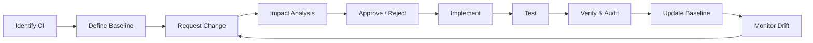
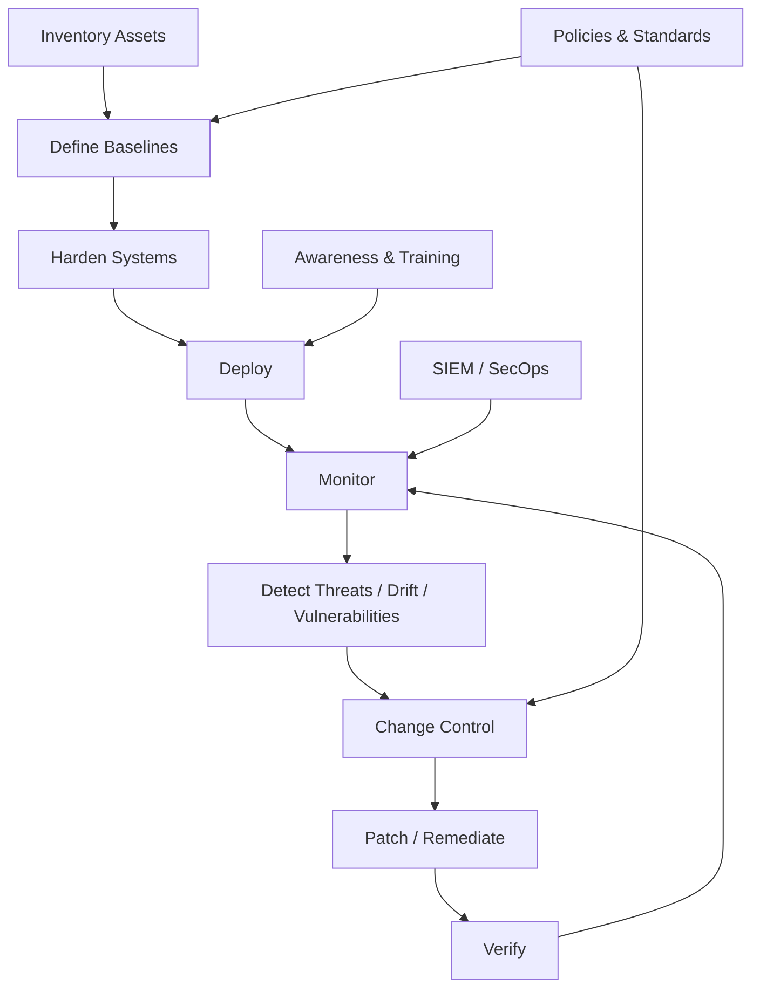

# System Hardening, Configuration Management & Security Operations

## Table of Contents

### Part I — System Hardening
1. Hardening Fundamentals
2. Attack Surface Reduction
3. Asset Inventory
4. Operating System Hardening
5. Service and Port Hardening
6. Account and Privilege Hardening
7. Authentication and MFA
8. Password Security
9. Host Firewall Hardening
10. Endpoint Protection
11. Patch and Vulnerability Management
12. Server Hardening
13. Network Device Hardening
14. Database Hardening
15. Cloud and Container Hardening
16. Logging and Backup Hardening
17. Hardening Verification

### Part II — Configuration Management
18. Configuration Management Fundamentals
19. Configuration Items
20. Configuration Identification
21. Asset and Software Inventory
22. Configuration Baselines
23. Secure Configuration Baselines
24. Change Control
25. Security Impact Analysis
26. Testing and Validation
27. Rollback and Backout Plans
28. Verification and Audit
29. Configuration Drift
30. Version Control and Infrastructure as Code
31. CMDB
32. Emergency and Standard Changes
33. Change Management Workflow

### Part III — Security Operations
34. Security Operations Overview
35. Governance Elements
36. Regulations, Standards, Policies, Procedures
37. Data Handling and Protection Policy
38. Password Policy
39. Acceptable Use Policy
40. BYOD Policy and MDM
41. Privacy Policy
42. Change Management Policy
43. Patch and Vulnerability Policies
44. Logging and Monitoring Policy
45. Security Awareness Training
46. Awareness vs Training vs Education
47. Social Engineering Awareness
48. Measuring Awareness
49. End-to-End Security Operations Model
50. Exam Review
51. Authoritative References

---

# Part I — System Hardening

# 1. Hardening Fundamentals

**System hardening** is the process of applying secure configurations and removing unnecessary functionality to reduce a system's attack surface.

```text
Default System
     ↓
Remove unnecessary features
     ↓
Patch vulnerabilities
     ↓
Restrict access
     ↓
Enable security controls
     ↓
Monitor and verify
     ↓
Hardened System
```

Hardening is not a one-time task. It is a lifecycle:

```text
Build → Harden → Test → Deploy → Monitor → Patch → Revalidate
```

Core principles:

- Least functionality
- Least privilege
- Default deny
- Secure by default
- Defense in depth
- Patch quickly
- Strong authentication
- Central logging
- Secure configuration baselines
- Continuous verification

---

# 2. Attack Surface Reduction

The **attack surface** is everything an attacker may interact with.

Examples:

- Open ports
- Running services
- User accounts
- APIs
- Web interfaces
- Remote administration
- Cloud resources
- USB interfaces
- Wireless interfaces
- Third-party software
- Dependencies

```text
More Functionality
      ↓
More Exposure
      ↓
More Potential Attack Paths
```

The hardening objective is:

```text
Remove what is not needed
+
Secure what must remain
```

---

# 3. Asset Inventory

You cannot harden what you do not know exists.

Inventory should include:

- Servers
- Workstations
- Laptops
- Mobile devices
- Routers
- Switches
- Firewalls
- Access points
- Cloud resources
- Virtual machines
- Containers
- Applications
- Databases
- Operating systems
- Software packages
- Firmware
- Certificates
- Service accounts

Recommended inventory fields:

```text
Asset ID
Hostname
Owner
Business Service
Location
Operating System
Version
IP Address
Criticality
Data Classification
Patch Status
Baseline
```

Relationship:

```text
Inventory
   ↓
Owner
   ↓
Criticality
   ↓
Baseline
   ↓
Hardening
```

---

# 4. Operating System Hardening

Typical OS hardening:

- Apply supported patches.
- Disable unused services.
- Remove unneeded packages.
- Disable insecure legacy protocols.
- Enable host firewall.
- Enable auditing.
- Configure secure file permissions.
- Enable full-disk encryption.
- Restrict administrative access.
- Configure automatic screen locking.
- Install endpoint protection.
- Protect boot settings.

Example:

```text
Linux Server
├── SSH         Required
├── HTTPS       Required
├── Telnet      Disable
├── FTP         Remove if unused
└── Database    Internal access only
```

---

# 5. Service and Port Hardening

Each exposed service increases risk.

```text
Server
├── 22 SSH      Restricted
├── 80 HTTP     Redirect/disable
├── 443 HTTPS   Required
├── 23 Telnet   Disable
└── 5432 DB     Internal only
```

General rule:

```text
Not required → Disable
Required internally → Restrict
Required publicly → Protect and monitor
```

Also review:

- Listening sockets
- Daemons
- Remote management interfaces
- Legacy protocols
- Default services

---

# 6. Account and Privilege Hardening

Review:

- User accounts
- Service accounts
- Guest accounts
- Default accounts
- Dormant accounts
- Privileged accounts
- Shared accounts

Controls:

- Disable unused accounts.
- Remove default credentials.
- Use unique identities.
- Apply least privilege.
- Review access periodically.
- Disable accounts quickly during offboarding.
- Separate administrative and daily-use accounts.

Example:

```text
Ahmed.User
→ Email, browser, normal work

Ahmed.Admin
→ Administrative tasks only
```

For privileged identities use:

- MFA
- PAM
- Just-in-Time access
- Approval workflows
- Session logging
- Credential vaulting

---

# 7. Authentication and MFA

Strong authentication protects against:

- Password guessing
- Credential stuffing
- Password reuse
- Phishing
- Stolen passwords

Preferred controls:

- MFA
- Passkeys / FIDO
- Conditional access
- Risk-based authentication
- Rate limiting
- Password managers
- Secure account recovery

Priority:

```text
Privileged Accounts
       ↓
Remote Access
       ↓
Cloud Admin
       ↓
Email
       ↓
All Users
```

---

# 8. Password Security

Modern password policy should emphasize:

- Length
- Uniqueness
- Known-compromised password blocking
- Password manager support
- MFA
- Rate limiting

Avoid outdated thinking such as relying mainly on:

```text
Uppercase + lowercase + number + symbol
+
Forced password change every 30/60/90 days
```

Current NIST guidance does not recommend arbitrary composition rules or periodic changes when there is no evidence of compromise.

For systems using passwords as the only authentication factor, current NIST guidance requires a longer minimum than many old screenshots and legacy Group Policy examples.

---

# 9. Host Firewall Hardening

Use host firewalls even inside the internal network.

Example:

```text
Inbound:
Default → DENY

Allow TCP 443
Allow SSH only from management subnet
Block database ports from user networks
```

Benefits:

- Reduces lateral movement
- Limits accidental exposure
- Protects hosts even when network segmentation fails

---

# 10. Endpoint Protection

Modern endpoint controls include:

- Antivirus
- Antimalware
- EDR
- Application control
- Exploit protection
- Behavior monitoring
- Ransomware controls
- Host isolation

```text
Endpoint
   ↓
EDR Agent
   ↓
Telemetry
   ↓
Security Platform
   ↓
Detect / Investigate / Isolate
```

---

# 11. Patch and Vulnerability Management

Patch lifecycle:

```text
Identify
  ↓
Prioritize
  ↓
Test
  ↓
Approve
  ↓
Deploy
  ↓
Verify
```

Vulnerability management is broader:

```text
Inventory
  ↓
Discover
  ↓
Assess Risk
  ↓
Prioritize
  ↓
Remediate / Mitigate
  ↓
Verify
```

Prioritize based on:

- Active exploitation
- Internet exposure
- Asset criticality
- Business impact
- Exploitability
- Compensating controls

---

# 12. Server Hardening

Server hardening typically includes:

- Minimal installation
- Restricted administration
- Host firewall
- EDR
- Patch management
- Secure service accounts
- TLS
- Central logging
- Backups
- Time synchronization
- File integrity monitoring

```text
Internet
   ↓
Firewall / WAF
   ↓
Reverse Proxy
   ↓
Hardened App Server
   ↓
Restricted Database
```

---

# 13. Network Device Hardening

For routers, switches, firewalls, APs, and load balancers:

- Disable Telnet.
- Use SSH/HTTPS.
- Restrict management interfaces.
- Use AAA.
- Use MFA where supported.
- Use SNMPv3.
- Update firmware.
- Disable unused interfaces.
- Centralize logs.
- Back up configuration.
- Use a dedicated management network where possible.

---

# 14. Database Hardening

Controls:

- Restrict network exposure.
- Use least-privilege roles.
- Patch the DBMS.
- Disable default accounts.
- Encrypt network connections.
- Encrypt sensitive data.
- Audit privileged activity.
- Protect backups.
- Separate DBA and application identities.

Bad architecture:

```text
Internet → Database
```

Better:

```text
Internet
   ↓
Application
   ↓
Network Policy
   ↓
Database
```

---

# 15. Cloud and Container Hardening

Cloud controls:

- MFA
- Federation
- Least-privilege IAM
- Restrict public storage
- Private networking
- Encryption
- Audit logging
- Security posture monitoring
- Key management
- Backup
- Resource inventory

Container controls:

- Minimal base image
- Image scanning
- Non-root execution
- Secrets management
- Signed images
- Read-only filesystem where practical
- Runtime monitoring
- Restricted capabilities

Kubernetes adds:

- RBAC
- Network Policies
- Admission controls
- Pod security
- Audit logging
- Node hardening

---

# 16. Logging and Backup Hardening

Logs should be:

- Centralized
- Time synchronized
- Access controlled
- Protected from deletion
- Retained according to policy
- Monitored for logging failure

Backups should be:

- Encrypted
- Access controlled
- Tested
- Isolated
- Immutable/offline where required
- Protected with separate credentials

```text
Production
   ↓
Backup
   ↓
Immutable / Offline Copy
```

---

# 17. Hardening Verification

Hardening must be tested.

Use:

- Configuration scans
- Vulnerability scans
- Compliance scans
- Port scans
- Audit
- Security assessment
- Penetration testing
- Manual review

```text
Harden
  ↓
Verify
  ↓
Detect Drift
  ↓
Correct
```

---

# Part II — Configuration Management

# 18. Configuration Management Fundamentals

**Configuration Management (CM)** establishes and maintains the integrity of systems through controlled initialization, changes, monitoring, and documentation.

```text
Known State
+
Approved Changes
+
Traceability
+
Verification
=
Controlled Environment
```

Security-focused CM is often called **SecCM**.

---

# 19. Configuration Items

A **Configuration Item (CI)** is an item placed under configuration control.

Examples:

- Server
- Router
- Switch
- Firewall
- Application
- Database
- Operating system
- Configuration file
- Cloud resource
- Container image
- Security documentation

Example:

```yaml
ci_id: SRV-PROD-001
hostname: prod-web-01
owner: web-platform
environment: production
criticality: high
baseline: linux-web-v3
```

---

# 20. Configuration Identification

Configuration identification answers:

```text
What must be managed?
Who owns it?
What version is approved?
Which baseline applies?
Which settings are security-critical?
```

Without identification:

```text
Unknown Asset
→ No Baseline
→ No Reliable Change Control
```

---

# 21. Asset and Software Inventory

Hardware inventory may track:

- Asset ID
- Serial number
- Model
- Owner
- Location
- IP/MAC
- Firmware
- Lifecycle state

Software inventory may track:

- Product
- Version
- Publisher
- Installation
- Patch state
- Support status
- Owner

```text
Unknown Software
=
Unknown Risk
```

---

# 22. Configuration Baselines

A **baseline** is a formally reviewed and approved configuration used as a reference point.

Example:

```text
Windows Server Security Baseline
├── Host firewall enabled
├── Legacy protocols disabled
├── Auditing enabled
├── Admin MFA required
└── Approved patch level
```

A baseline should change only through controlled change processes.

---

# 23. Secure Configuration Baselines

Sources may include:

- CIS Benchmarks
- NIST configuration checklists
- Vendor security baselines
- DISA STIGs
- Internal standards
- Cloud security benchmarks

The approved baseline should balance:

```text
Security
+
Business Function
+
Compatibility
```

---

# 24. Change Control

Every significant change should follow:

```text
Request
  ↓
Impact Analysis
  ↓
Approval
  ↓
Implementation
  ↓
Testing
  ↓
Verification
  ↓
Documentation
```

Uncontrolled change can cause:

- Outages
- Vulnerabilities
- Compliance violations
- Configuration drift
- Lost accountability

---

# 25. Security Impact Analysis

Before approving a change, ask:

- Does it open a port?
- Does it create public exposure?
- Does it add privilege?
- Does it disable logging?
- Does it change encryption?
- Does it add third-party software?
- Does it change authentication?
- Does it expose sensitive data?
- Does it affect backups?
- Does it alter firewall rules?

---

# 26. Testing and Validation

Before deployment:

- Functional testing
- Security testing
- Regression testing
- Compatibility testing
- Performance testing

After deployment:

- Health check
- Configuration verification
- Log review
- Service validation
- Security validation

---

# 27. Rollback and Backout Plans

A backout plan restores the previous safe state when a change fails.

```text
New Change
   ↓
Failure
   ↓
Rollback Trigger
   ↓
Restore Previous State
   ↓
Validate Service
```

A good plan defines:

- Trigger
- Responsible person
- Backup/snapshot
- Exact reversal steps
- Validation method
- Expected recovery time

---

# 28. Verification and Audit

Verification asks:

```text
Did we implement the approved change correctly?
```

Audit asks:

```text
Can we prove the process was followed?
```

Evidence:

- Ticket
- Approval
- Configuration diff
- Test output
- Deployment logs
- Change record

---

# 29. Configuration Drift

**Configuration drift** is the difference between the approved baseline and the actual configuration.

```text
Approved Baseline
       |
       | manual/uncontrolled changes
       v
Actual System
```

Common causes:

- Manual fixes
- Emergency changes
- Unauthorized administration
- Vendor updates
- Automation errors
- Human error

---

# 30. Version Control and Infrastructure as Code

Version control provides:

- History
- Diff
- Peer review
- Rollback
- Accountability

Example:

```text
Git Commit
   ↓
Pull Request
   ↓
Review
   ↓
Approval
   ↓
Deployment
```

Infrastructure as Code tools may include:

- Terraform
- CloudFormation
- Bicep
- Pulumi
- Ansible

Security benefits:

- Repeatability
- Reviewability
- Automation
- Drift detection

---

# 31. CMDB

A **Configuration Management Database (CMDB)** tracks CIs and relationships.

```text
Business Service
├── Web Server
├── Database
├── Firewall Rule
├── Load Balancer
└── Cloud Network
```

A CMDB helps answer:

```text
If this CI changes,
what business service might be affected?
```

---

# 32. Emergency and Standard Changes

## Emergency Change

Used when delay creates unacceptable risk.

Examples:

- Active zero-day exploitation
- Critical outage
- Emergency security block

Still requires:

```text
Documentation
Authorization
Post-change review
```

## Standard Change

Low-risk, repeatable, pre-authorized change.

## Normal Change

Requires standard assessment and approval.

---

# 33. Change Management Workflow



The core model from your slides is:

```text
Identification
→ Baseline
→ Change Control
→ Verification & Audit
```

For real operations add:

```text
Inventory
Security Impact Analysis
Backout Plan
Version Control
Drift Monitoring
Documentation
```

---

# Part III — Security Operations

# 34. Security Operations Overview

Security Operations protects systems continuously during normal business operations.

```text
Assets
  ↓
Protect
  ↓
Monitor
  ↓
Detect
  ↓
Respond
  ↓
Recover
  ↓
Improve
```

Typical SecOps responsibilities:

- Asset visibility
- Hardening
- Configuration monitoring
- Vulnerability management
- Logging
- SIEM monitoring
- Threat detection
- Incident triage
- Policy enforcement
- Access review
- Security awareness

---

# 35. Governance Elements

Security governance is commonly implemented through:

```text
External Requirements
        ↓
Policies
        ↓
Standards
        ↓
Procedures
```

Guidelines support the structure.

---

# 36. Regulations, Standards, Policies, Procedures

## Regulations

External legal/regulatory obligations.

Examples studied in cybersecurity include:

- GDPR
- HIPAA
- FISMA
- National data-protection laws

Applicability depends on organization and jurisdiction.

## Standards

Specific mandatory requirements.

Example:

```text
Administrative access must use MFA.
```

## Policies

High-level mandatory organizational rules.

Example:

```text
Sensitive data must be protected against unauthorized disclosure.
```

## Procedures

Step-by-step execution instructions.

Example:

```text
How to patch a production server.
```

## Guidelines

Recommended, less rigid practices.

---

# 37. Data Handling and Protection Policy

A data-handling policy defines:

- Data ownership
- Classification
- Access authorization
- Storage
- Transmission
- Monitoring
- Retention
- Destruction
- Employee responsibilities

Example lifecycle:

```text
Create
 ↓
Classify
 ↓
Store
 ↓
Use
 ↓
Share
 ↓
Retain
 ↓
Destroy
```

---

# 38. Password Policy

Password policy should define:

- Minimum length
- Compromised-password screening
- Password-manager support
- MFA
- Rate limiting
- Recovery process
- Password storage
- Privileged-account requirements

Current NIST guidance differs significantly from many older Group Policy screenshots.

Important modern concepts:

```text
Long passwords
No arbitrary complexity rules
No arbitrary periodic changes
Block compromised passwords
Allow password managers
Use MFA
```

---

# 39. Acceptable Use Policy

An **Acceptable Use Policy (AUP)** defines permitted and prohibited use of company systems.

It may cover:

- Internet use
- Email
- Software installation
- Personal use
- Social media
- Data uploads
- External storage
- Unauthorized testing
- Monitoring notice

Users may be required to acknowledge the AUP before being granted access.

---

# 40. BYOD Policy and MDM

**BYOD** = Bring Your Own Device.

The policy defines whether personal devices may access company resources.

Controls:

- MDM/MAM
- Device encryption
- Screen lock
- Minimum OS version
- Remote wipe
- Corporate data separation
- Conditional access
- MFA

**MDM** can enforce:

```text
Configuration Profiles
Encryption
Remote Lock
Remote Wipe
App Policies
Compliance
```

Modern organizations may use **UEM** for phones, tablets, laptops, and desktops.

---

# 41. Privacy Policy

A privacy policy explains how personal information is:

- Collected
- Used
- Stored
- Shared
- Protected
- Retained
- Disposed

Security and privacy are related but different:

```text
Security
→ Protect information.

Privacy
→ Ensure appropriate processing and use of personal information.
```

PII can include identifiers such as names, national IDs, financial data, location information, or biometrics depending on context.

---

# 42. Change Management Policy

A change-management policy defines:

```text
Request
 ↓
Impact Analysis
 ↓
Approve / Deny
 ↓
Implement
 ↓
Validate
 ↓
Review
```

It should define:

- Change categories
- Authorization levels
- Testing
- Security review
- Backout planning
- Emergency process
- Documentation

---

# 43. Patch and Vulnerability Policies

Patch policy defines:

- Patch timeframes
- Severity categories
- Testing
- Emergency patching
- Exception process
- Verification
- Ownership

Vulnerability policy defines:

- Asset coverage
- Scan frequency
- Risk prioritization
- Remediation
- Risk acceptance
- Metrics

---

# 44. Logging and Monitoring Policy

Policy should specify:

- Required log sources
- Central collection
- Retention
- Time synchronization
- Access control
- Integrity
- Alerting
- Review
- Privacy considerations

```text
Endpoint ─┐
Firewall ─┤
Cloud ────┤
Identity ─┤
Apps ─────┘
     ↓
    SIEM
     ↓
Detection
     ↓
SOC
```

---

# 45. Security Awareness Training

Security-awareness programs teach people to:

- Recognize threats
- Protect credentials
- Handle data safely
- Use approved systems
- Report incidents quickly

Instead of simply saying:

```text
Humans are the weakest link
```

a more useful operational view is:

```text
Users can become an effective security control
when trained, supported, and given safe processes.
```

---

# 46. Awareness vs Training vs Education

## Awareness

Goal:

```text
Recognition and behavior
```

Example:

```text
Recognize phishing.
```

## Training

Goal:

```text
Practical job skills
```

Example:

```text
Correctly classify and share company data.
```

## Education

Goal:

```text
Deep professional understanding
```

Example:

```text
Security architecture and cryptography.
```

Simple model:

```text
Awareness
→ Know the risk

Training
→ Know what to do

Education
→ Understand the discipline deeply
```

---

# 47. Social Engineering Awareness

Users should recognize:

- Phishing
- Vishing
- Smishing
- Pretexting
- Baiting
- Tailgating

## Phishing

Fraudulent email/web message.

## Vishing

Voice-based deception.

## Smishing

SMS/message phishing.

## Pretexting

Fake scenario used to gain trust.

## Baiting

Entices a user with a reward or device.

## Tailgating

Unauthorized person follows an authorized person into a protected area.

---

# 48. Measuring Awareness

Useful metrics:

- Training completion
- Phishing-report rate
- Phishing failure rate
- Time to report
- MFA adoption
- Repeated violations
- Policy exceptions

Goal:

```text
Improve behavior
```

not only:

```text
Complete a yearly course
```

---

# 49. End-to-End Security Operations Model



Relationship:

```text
SYSTEM HARDENING
"What should the secure configuration be?"
        ↓
CONFIGURATION MANAGEMENT
"How do we control and maintain that configuration?"
        ↓
SECURITY OPERATIONS
"How do we monitor, enforce, respond, and improve continuously?"
```

---

# 50. Exam Review

## What is hardening?

Applying secure configurations and reducing attack surface.

## Main hardening activities?

- Remove unnecessary services
- Patch software and firmware
- Enable firewalls
- Use strong authentication/MFA
- Least privilege
- Security assessment
- Logging and monitoring

## What is configuration management?

Maintaining system integrity through controlled configuration identification, baselines, changes, and verification.

## Four core CM components?

```text
Identification
Baseline
Change Control
Verification & Audit
```

## What is inventory?

A controlled list of technology assets.

## What is a baseline?

An approved reference configuration.

## What is configuration drift?

Actual configuration differs from approved baseline.

## Why use a backout plan?

To restore a safe state if a change causes failure.

## Policy vs standard?

```text
Policy
→ High-level mandatory direction

Standard
→ Specific mandatory requirement
```

## Procedure?

Step-by-step implementation instructions.

## What is AUP?

Acceptable Use Policy.

## BYOD?

Bring Your Own Device.

## MDM?

Mobile Device Management.

## Awareness vs training vs education?

```text
Awareness
→ Behavior and recognition

Training
→ Practical skills

Education
→ Deep professional knowledge
```

---

# 51. Authoritative References

## NIST SP 800-128 — Security-Focused Configuration Management

Covers secure configuration management, baselines, change control, and monitoring.

https://csrc.nist.gov/pubs/sp/800/128/upd1/final

## NIST SP 800-53 Rev. 5

Important Configuration Management controls include:

```text
CM-2  Baseline Configuration
CM-3  Configuration Change Control
CM-4  Impact Analyses
CM-6  Configuration Settings
CM-7  Least Functionality
CM-8  System Component Inventory
```

https://csrc.nist.gov/pubs/sp/800/53/r5/upd1/final

## NIST Security Configuration Checklists

https://www.nist.gov/programs-projects/security-configuration-checklists-commercial-it-products

## NIST SP 800-63B — Passwords and Authentication

Current password guidance.

https://pages.nist.gov/800-63-4/sp800-63b.html

## NIST Cybersecurity Framework 2.0

https://www.nist.gov/cyberframework

## NIST Privacy Framework

https://www.nist.gov/privacy-framework

## CISA Secure Our World

https://www.cisa.gov/secure-our-world

## CISA Cyber Guidance

https://www.cisa.gov/cyber-guidance-small-businesses

## CIS Benchmarks

https://www.cisecurity.org/cis-benchmarks

---

# End of Document
