# Phase 1 — Generative AI for Software Engineers

> **Track:** AI-Powered Software Development / Agentic Software Engineering  
> **Phase goal:** Build the minimum *deep* conceptual foundation required to understand what an AI coding assistant or coding agent is doing, why it succeeds, why it fails, and how a software engineer should supervise it.
>
> **Edition:** Expanded deep-dive edition — adds mechanism-level explanations, engineering trade-offs, failure analysis, case studies, and additional code/architecture examples.

---

# Table of Contents

1. [How to Study This Phase](#how-to-study-this-phase)
2. [Learning Objectives](#learning-objectives)
3. [The Big Picture](#the-big-picture)
4. [Module 1 — Generative AI Fundamentals](#module-1--generative-ai-fundamentals)
5. [Module 2 — Large Language Model Fundamentals](#module-2--large-language-model-fundamentals)
6. [Module 3 — Tokens, Context Windows and Inference](#module-3--tokens-context-windows-and-inference)
7. [Module 4 — LLM Capabilities and Limitations](#module-4--llm-capabilities-and-limitations)
8. [Module 5 — Hallucination and Uncertainty](#module-5--hallucination-and-uncertainty)
9. [Module 6 — Reasoning Models for Software Engineering](#module-6--reasoning-models-for-software-engineering)
10. [Module 7 — AI-Assisted vs Agentic Software Development](#module-7--ai-assisted-vs-agentic-software-development)
11. [Putting Everything Together](#putting-everything-together)
12. [Practical Labs](#practical-labs)
13. [Common Misconceptions](#common-misconceptions)
14. [Software Engineering Rules of Thumb](#software-engineering-rules-of-thumb)
15. [Glossary](#glossary)
16. [Review Questions](#review-questions)
17. [Phase Project](#phase-project)
18. [Phase 1 Completion Checklist](#phase-1-completion-checklist)
19. [Where This Leads Next](#where-this-leads-next)

---

# How to Study This Phase

This phase is deliberately different from a traditional machine-learning course.

You are **not** trying to become a model-training researcher.

You are trying to become a software engineer who can answer questions such as:

- What exactly does an LLM receive when I send a prompt?
- Why does a model sometimes generate correct code and sometimes invent APIs?
- Why can adding *more* context make an answer worse?
- What is the difference between an AI assistant and an AI agent?
- What does "reasoning effort" actually change?
- Why should a coding agent run tests instead of merely claiming the code works?
- Why can an agent confidently make a bad architectural decision?
- What information should be placed in the model's context?
- Why do tool calls make agents much more capable?
- What remains the responsibility of the software engineer?

Study the phase in this order:

```text
Software Engineering
        ↓
Generative AI
        ↓
Large Language Models
        ↓
Tokens + Context + Inference
        ↓
Capabilities + Limitations
        ↓
Hallucination + Uncertainty
        ↓
Reasoning Models
        ↓
AI-Assisted Development
        ↓
Agentic Software Development
```

The order matters.

Without understanding the model itself, an agent can appear almost magical.

Once you understand the mechanics, you can reason about its behavior much more systematically.

---

# Learning Objectives

By the end of this phase, you should be able to:

1. Explain what **generative AI** is and distinguish it from traditional deterministic software.
2. Explain what a **large language model** is without relying on vague phrases such as "it understands everything."
3. Explain the basic role of:
   - training,
   - inference,
   - tokens,
   - context,
   - next-token prediction,
   - probabilities,
   - tools,
   - reasoning.
4. Explain why an LLM can generate useful software even though it does not execute code internally in the same way a Python interpreter does.
5. Explain what a **context window** contains.
6. Explain why context is a scarce engineering resource.
7. Identify major strengths of modern LLMs for software engineering.
8. Identify major limitations and failure modes.
9. Define **hallucination/confabulation** and explain why confidence is not evidence.
10. Design verification steps for AI-generated software.
11. Explain the role of reasoning models in:
    - debugging,
    - architecture,
    - planning,
    - migrations,
    - code review.
12. Distinguish:
    - autocomplete,
    - chat assistant,
    - AI-assisted development,
    - tool-using assistant,
    - coding agent,
    - multi-agent development.
13. Draw the basic control loop of an agent.
14. Explain why agents require:
    - tools,
    - permissions,
    - observations,
    - tests,
    - feedback loops,
    - stopping criteria.
15. Decide whether a task should be solved by:
    - ordinary code,
    - an LLM call,
    - a reasoning model,
    - an agent,
    - a human engineer.

---

# The Big Picture

Before learning details, build the correct mental model.

## Traditional Software

Traditional software follows explicitly implemented logic.

```text
Input
  ↓
Program
  ↓
Rules / Algorithms
  ↓
Output
```

Example:

```python
def calculate_discount(total: float) -> float:
    if total >= 1000:
        return total * 0.10
    return 0.0
```

Given the same inputs and environment, we generally expect the same result.

The behavior comes from rules that a programmer encoded.

---

## Machine Learning

Machine learning changes the relationship.

Instead of manually specifying every rule, we learn patterns from data.

```text
Training Data
      ↓
Learning Algorithm
      ↓
Model
      ↓
New Input
      ↓
Prediction
```

For example:

```text
emails + labels
      ↓
training
      ↓
spam classifier
      ↓
new email
      ↓
spam probability
```

---

## Generative AI

Generative models produce new content.

```text
Input / Prompt
      ↓
Generative Model
      ↓
New Content
```

That content may be:

- text,
- source code,
- SQL,
- JSON,
- images,
- audio,
- video,
- structured data,
- tool calls,
- plans.

For software development:

```text
Requirement
    ↓
LLM
    ↓
Possible code / plan / explanation
```

But this alone is **not yet an agent**.

---

## Agentic Software

An agent can use the model inside a larger execution loop.

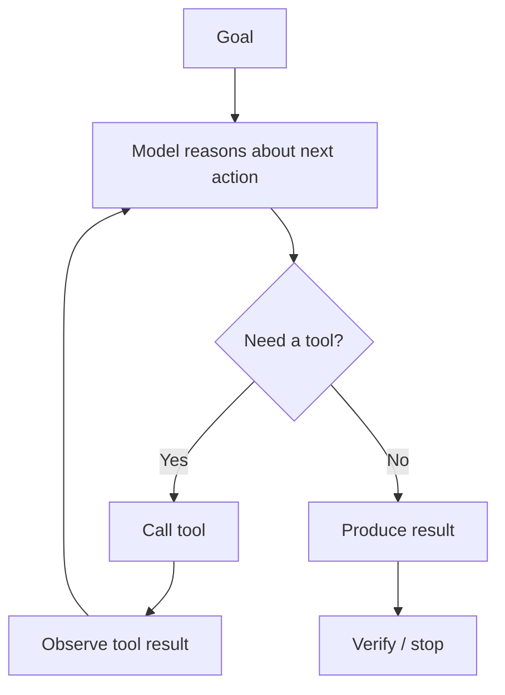

For a coding agent:

```text
Feature Request
      ↓
Read repository
      ↓
Plan
      ↓
Edit files
      ↓
Run tests
      ↓
Observe failures
      ↓
Modify implementation
      ↓
Run tests again
      ↓
Review diff
      ↓
Return implementation
```

The **LLM is only one component**.

The agent is the whole system around the model.

This distinction will become one of the most important ideas in your entire track.

---

# Module 1 — Generative AI Fundamentals

# 1.1 What Is Artificial Intelligence?

"Artificial intelligence" is an umbrella term.

It includes systems that perform tasks associated with intelligent behavior, such as:

- perception,
- classification,
- prediction,
- language understanding,
- planning,
- optimization,
- decision support,
- generation.

A simplified hierarchy is:

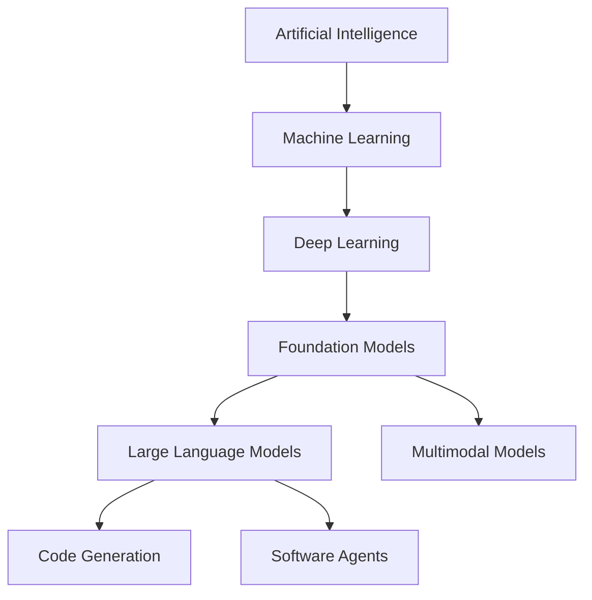

This diagram is conceptual rather than a strict taxonomy.

The important point:

> LLMs are one family of AI models, not the whole of AI.

---

# 1.2 Traditional AI vs Generative AI

A classifier answers:

```text
"What category does this input belong to?"
```

A generative model answers something closer to:

```text
"What plausible output should continue or respond to this input?"
```

Consider three systems.

### Classifier

```text
Input:
"This deployment failed because the database timeout was exceeded."

Output:
incident_category = "database"
```

### Regression model

```text
Input:
CPU, RAM, request rate, historical latency

Output:
predicted_latency = 186 ms
```

### Generative model

```text
Input:
"Analyze this deployment failure and propose a remediation plan."

Output:
A multi-step diagnosis and proposed fix.
```

Generative models produce open-ended output spaces.

That makes them powerful—but much harder to verify.

---

# 1.3 Deterministic vs Probabilistic Behavior

Traditional code often behaves approximately like:

```text
input → exact algorithm → output
```

An LLM behaves more like:

```text
input + context
      ↓
model
      ↓
probability distribution over possible next tokens
      ↓
chosen token
      ↓
repeat
```

This means the model is fundamentally probabilistic.

Suppose the prompt is:

```text
def add(a, b):
    return
```

The model may assign high probability to something like:

```text
a + b
```

But other continuations are theoretically possible.

Conceptually:

```text
Candidate next token     Probability
------------------------------------
"a"                      0.53
"("                      0.12
"sum"                    0.08
"b"                      0.04
...
```

These numbers are illustrative only.

---

# 1.4 Generation Is Sequential

A useful simplified representation:

```text
Prompt
  ↓
Predict token 1
  ↓
Append token 1
  ↓
Predict token 2
  ↓
Append token 2
  ↓
...
```

Example:

```text
Input:
"The function should return"

Step 1:
"The function should return a"

Step 2:
"The function should return a JSON"

Step 3:
"The function should return a JSON object"

...
```

The model continually conditions on the context available so far.

---

# 1.5 Why Can This Produce Code?

Source code is highly structured language.

Repositories contain repeated patterns:

```text
function definition
imports
types
control flow
error handling
tests
framework conventions
API usage
documentation
```

Large models learn statistical and structural regularities from vast amounts of text and code.

Therefore they can generate structures such as:

```python
from dataclasses import dataclass


@dataclass
class User:
    id: int
    email: str
```

They can also reason over relationships represented in their learned model and supplied context.

However:

> Generating syntactically plausible code does not prove semantic correctness.

This distinction is essential.

---

# 1.6 Generative AI as a Software Component

A developer should not think:

```text
"AI is an oracle."
```

Think:

```text
"AI is a probabilistic software component."
```

A production AI feature typically has:

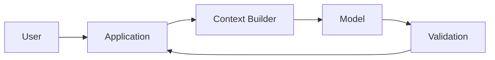

A more advanced system may have:

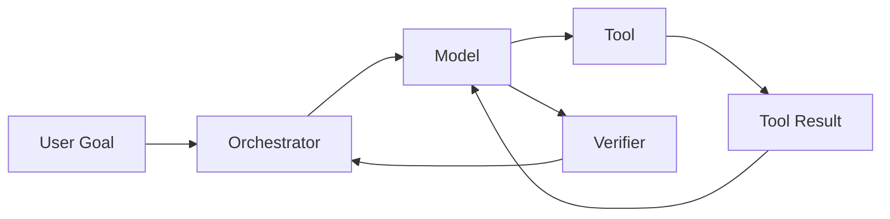

The model therefore participates in an ordinary engineered system.

You still need:

- validation,
- APIs,
- databases,
- permissions,
- retries,
- observability,
- tests,
- security controls,
- error handling.

---

# 1.7 Foundation Models

A **foundation model** is a broadly capable model trained on large and diverse data and then adapted or instructed for many downstream tasks.

Instead of one model for:

```text
classifying invoices
```

and another for:

```text
summarizing logs
```

and another for:

```text
writing Python
```

a foundation model may handle all of them through instructions and context.

This is important for software engineering because a single model can move between:

```text
requirements
architecture
code
tests
documentation
logs
terminal output
review comments
```

within one workflow.

---

# 1.8 Multimodality

Modern generative models may operate over multiple modalities.

Examples:

```text
Text → Text
Image → Text
Text + Image → Text
Text → Image
Audio → Text
```

Software engineering use cases include:

```text
Screenshot
   ↓
Model
   ↓
UI implementation

Architecture diagram
   ↓
Model
   ↓
Code/design explanation

Error screenshot
   ↓
Model
   ↓
Diagnosis
```

Multimodality broadens the context available to the engineer or agent.

---

# 1.9 Training vs Inference

This distinction must be clear.

## Training

Training is when model parameters are learned or adjusted from data.

Conceptually:

```text
Large Dataset
     ↓
Optimization
     ↓
Model Parameters
```

You do **not** need to study the mathematics of this process deeply for this track.

---

## Inference

Inference is when the already-trained model is used.

```text
Prompt
  ↓
Model
  ↓
Generated Response
```

When you call an LLM API, you are usually performing **inference**, not training the model.

Python-shaped pseudocode:

```python
response = model.generate(
    "Explain why this test is failing."
)
```

The model is not normally retraining itself from that single prompt.

---

# 1.10 Model Parameters vs Runtime Context

Do not confuse these.

```text
Model Parameters
    =
knowledge/behavior encoded during training

Context
    =
information supplied during this inference
```

A useful mental model:

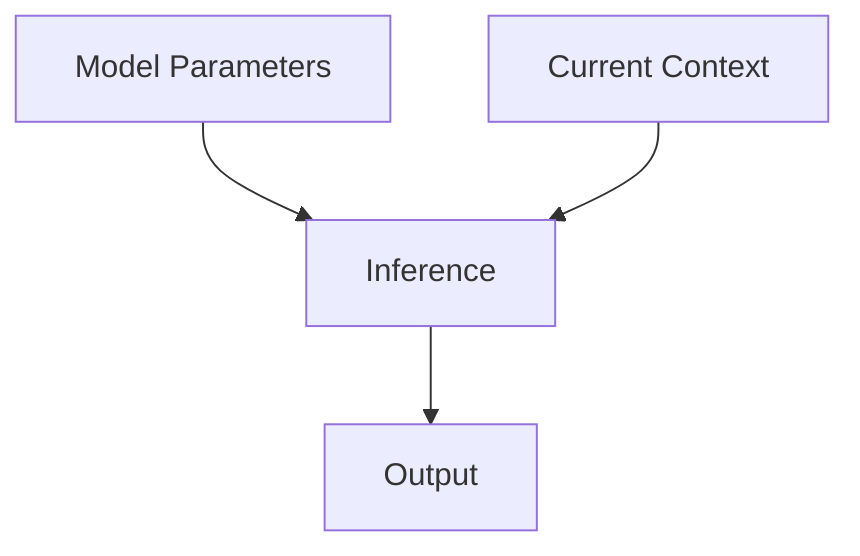

The parameters are the model's learned internal state.

The context is what you give it *now*.

For coding agents, context can include:

- system instructions,
- user request,
- repository instructions,
- source files,
- diffs,
- terminal output,
- test failures,
- tool descriptions,
- previous conversation turns.

---

# 1.11 Why Software Engineers Must Understand This

Suppose you ask:

```text
"Fix authentication.py."
```

The model cannot automatically know:

- your current repository state,
- which framework version you use,
- your security requirements,
- your tests,
- your architectural conventions,
- the production environment.

Unless that information is:

1. already reliably represented in the model,
2. explicitly provided,
3. retrieved,
4. discovered with tools.

This leads directly to **context engineering**, which comes later in the track.

---


# 1.12 Deep Dive — A Generative Model as a Runtime Component

It is useful to stop thinking of an LLM as a "smart text box" and instead model it as a runtime component with explicit inputs, internal computation, and outputs.

A simplified request can be represented as:

```text
Application State
      +
Instructions
      +
User Input
      +
Retrieved Evidence
      +
Tool Descriptions
      ↓
Serialization / Tokenization
      ↓
Model Inference
      ↓
Generated Tokens or Tool Call
      ↓
Application Validation
      ↓
Next Action
```

This matters because most production failures do **not** come from the model alone.

They can come from any layer:

```text
Wrong user requirement
Wrong context selection
Wrong tool description
Wrong model configuration
Wrong generated answer
Wrong output parser
Wrong permission boundary
Wrong validation
Wrong downstream action
```

A software engineer therefore needs to debug the whole AI-enabled system.

For example, imagine a coding assistant recommends a nonexistent library method.

Possible causes include:

1. The model recalled an obsolete API.
2. The installed package version was not included in context.
3. The agent never inspected the dependency lock file.
4. The tool for documentation retrieval returned stale documentation.
5. The model had the evidence but ignored it.
6. The application accepted the generated code without executing tests.

Notice that only one of these is purely a "model intelligence" problem.

A useful diagnostic diagram is:

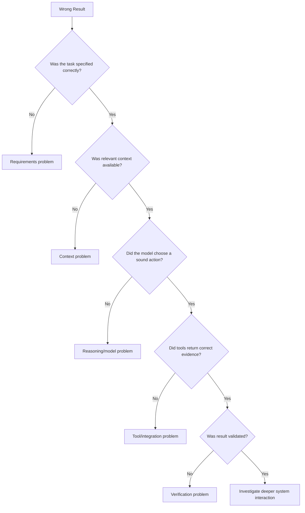

This way of thinking will become extremely important once you start building agents.

---

# 1.13 Deep Dive — Probabilistic Does Not Mean Random Chaos

Saying that an LLM is probabilistic can create the wrong impression.

It does **not** mean:

```text
"Every answer is random."
```

It means the model computes a distribution over possible continuations and the inference system selects among them according to model/API behavior.

For many strongly constrained inputs, the distribution can be extremely concentrated.

Example:

```text
2 + 2 =
```

The model will overwhelmingly favor:

```text
4
```

For an open-ended prompt:

```text
Design an architecture for notifications.
```

many continuations may be plausible:

```text
queue + workers
event bus
serverless functions
synchronous API call
database outbox
```

The amount of uncertainty depends strongly on the task.

For software engineering, this gives us a practical spectrum:

```text
Highly constrained task
"Convert this dataclass to Pydantic"
        ↓
Relatively small valid solution space

Moderately constrained task
"Fix this failing validation test"
        ↓
Several possible causes and fixes

Open-ended task
"Redesign this platform"
        ↓
Very large solution space
```

As the valid solution space expands, requirements and verification become more important.

---

# 1.14 Deep Dive — Reproducibility and Why Tests Matter More Than Repeated Asking

A beginner may respond to uncertain AI output by asking the same question repeatedly:

```text
"Are you sure?"
"Check again."
"Try again."
```

This can occasionally help, but it is weak verification.

A stronger workflow converts a generated claim into something executable.

Suppose the model says:

```text
"This regex correctly validates all supported project IDs."
```

Instead of asking the model again, create tests:

```python
import re
import pytest


PATTERN = re.compile(r"^[A-Z]{3}-\d{4}$")


@pytest.mark.parametrize(
    ("value", "expected"),
    [
        ("ABC-1234", True),
        ("XYZ-0001", True),
        ("abc-1234", False),
        ("AB-1234", False),
        ("ABC-12345", False),
        ("ABC_1234", False),
    ],
)
def test_project_id_format(value: str, expected: bool) -> None:
    assert bool(PATTERN.fullmatch(value)) is expected
```

The important transition is:

```text
Generated claim
      ↓
Executable property
      ↓
Test
      ↓
Observed result
```

This is one of the deepest differences between casual AI use and AI-powered software engineering.

---

# 1.15 Deep Dive — Where Generative AI Fits in a Conventional Architecture

AI should usually be inserted into a software architecture where its uncertainty is manageable.

Consider a support-ticket classifier.

Bad design:

```text
Ticket
  ↓
LLM
  ↓
Directly modify production database with unrestricted output
```

Better design:

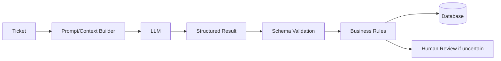

The LLM performs the fuzzy interpretation.

Ordinary code performs:

- validation,
- authorization,
- state transitions,
- persistence,
- policy enforcement.

A useful architectural principle is:

> Put uncertainty where uncertainty is useful; keep invariants in deterministic code.

Examples:

| Problem | Better primary mechanism |
|---|---|
| Explain an exception | LLM |
| Calculate invoice total | Deterministic code |
| Suggest likely root causes | LLM |
| Enforce permission check | Deterministic code |
| Summarize a pull request | LLM |
| Verify tests passed | Test runner |
| Choose candidate files to inspect | Agent/model |
| Confirm file exists | Filesystem tool |

This separation makes AI-enabled systems much easier to reason about.


# Module 2 — Large Language Model Fundamentals

# 2.1 What Is a Language Model?

A language model estimates relationships between sequences of tokens.

At a simplified level:

```text
Given:
token_1, token_2, ..., token_n

Predict:
token_n+1
```

Mathematically, conceptually:

```text
P(next token | previous tokens)
```

You do not need advanced probability mathematics here.

The critical idea is:

> The model generates by repeatedly predicting plausible next pieces of the sequence conditioned on the available context.

---

# 2.2 Why "Language" Includes Code

Programming languages are sequences of symbols with strong patterns.

Python:

```python
if user.is_active:
    send_notification(user)
```

SQL:

```sql
SELECT id, email
FROM users
WHERE active = TRUE;
```

JSON:

```json
{
  "status": "ok"
}
```

All are tokenizable sequences.

Therefore an LLM can model:

```text
natural language
+
programming language
+
configuration formats
+
markup
+
logs
+
terminal output
```

This is why LLMs fit software engineering exceptionally well.

---

# 2.3 A Very High-Level Transformer Mental Model

You do not need transformer mathematics in this phase.

But you should know the conceptual pipeline.

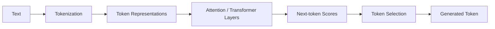

The key mechanism worth remembering is **attention**.

Attention allows the model to relate different parts of the context.

Example:

```python
customer = get_customer(customer_id)

if customer.is_premium:
    ...
```

When reasoning about `customer.is_premium`, the model can relate `customer` back to its definition and surrounding code.

You do not need to derive attention equations before continuing.

---

# 2.4 Attention Is Not Human Attention

Be careful with anthropomorphic language.

When engineers say:

```text
"The model attends to this token."
```

they refer to computational relationships, not human consciousness.

Similarly:

```text
"The model knows Python."
```

is useful shorthand, but it should not be interpreted as human-style understanding.

For engineering purposes, focus on observable capability:

```text
Can it correctly perform the task?
Under what context?
With what failure rate?
Under what verification?
```

---

# 2.5 Pretraining

During pretraining, a language model is exposed to huge amounts of data and learns broad patterns.

Conceptually:

```text
Text + Code + Other Data
          ↓
Pretraining
          ↓
General Language/Reasoning Capabilities
```

This gives the model broad prior capability.

However, prior capability does not guarantee current factual knowledge or repository-specific knowledge.

---

# 2.6 Post-Training / Instruction Following

Modern assistant models are further adapted to become more useful at:

- following instructions,
- conversation,
- tool use,
- safety behavior,
- reasoning,
- structured responses.

Conceptually:

```text
Base Model
    ↓
Post-training
    ↓
Instruction-following Model
```

This helps explain why models can respond to commands such as:

```text
"Return only JSON."
"Write unit tests."
"Use this tool."
"Do not modify migrations."
```

Still, instructions are not a hard programming-language guarantee.

You must verify behavior.

---

# 2.7 LLMs as Conditional Generators

Suppose the request is:

```text
Write a Python function that parses this log format.
```

The model's response depends on the total conditioning context:

```text
system instructions
+
developer instructions
+
user prompt
+
examples
+
repository files
+
tool results
+
conversation history
```

So:

```text
Output = f(model parameters, current context, inference settings)
```

This is not literal production code but a useful mental equation.

---

# 2.8 In-Context Learning

A powerful LLM behavior is **in-context learning**.

You can provide examples without retraining the model.

Example:

```text
Convert statuses:

"opened" -> "OPEN"
"closed" -> "CLOSED"
"pending" -> ?
```

The model can infer:

```text
"PENDING"
```

For software engineering, examples may include:

```text
existing service implementation
existing unit test
existing API handler
existing error response format
existing logging style
```

This leads to a practical rule:

> When asking an agent to implement something in an existing repository, relevant examples from the repository can be more useful than a long abstract prompt.

---

# 2.9 Zero-Shot and Few-Shot

## Zero-shot

No examples:

```text
Classify this bug report as frontend or backend.
```

## Few-shot

Examples are supplied:

```text
Example:
"Button is misaligned" -> frontend

Example:
"Database timeout" -> backend

Now classify:
"JWT signature validation fails"
```

Few-shot examples can establish local conventions.

For coding:

```text
Here is how our project writes repository classes.
Follow this structure for the new OrdersRepository.
```

---

# 2.10 Structured Output

Software systems often need predictable structure rather than prose.

Example desired output:

```json
{
  "severity": "high",
  "component": "authentication",
  "needs_human_review": true
}
```

This is safer to integrate than:

```text
"I think this looks like a serious authentication problem..."
```

Structured output reduces ambiguity but does **not** automatically guarantee factual correctness.

There are two distinct questions:

```text
Is the format valid?
Is the content correct?
```

Both must be considered.

---

# 2.11 LLM vs Database

An LLM is not a database.

A database is optimized for:

```text
store exact facts
retrieve exact records
enforce constraints
```

An LLM is optimized for generalized pattern-based generation and reasoning.

Bad architecture:

```text
"What is customer #4132's current credit limit?"
        ↓
LLM memory
```

Better:

```text
Question
   ↓
Application
   ↓
Database lookup
   ↓
Verified value
   ↓
LLM explanation if needed
```

---

# 2.12 LLM vs Search Engine

Search retrieves documents.

An LLM generates output.

A useful combined system:


For software engineering:

```text
Find framework documentation
     +
Read actual repository
     +
Reason over evidence
```

is much safer than relying on model memory alone.

---

# 2.13 LLM vs Compiler

A compiler enforces language rules.

An LLM predicts/generates code.

Example:

```python
def divide(a, b):
    return a / b
```

This may be valid syntax.

But requirements may demand:

```python
def divide(a: float, b: float) -> float:
    if b == 0:
        raise ValueError("b must not be zero")
    return a / b
```

The LLM may or may not infer that requirement.

Therefore:

```text
LLM generation
   ≠
compiler validation
   ≠
test validation
   ≠
requirements validation
```

These are separate layers.

---

# 2.14 LLM vs Interpreter

The model may predict the result of code but that is not equivalent to actually executing the code.

Example:

```python
values = [2, 4, 8]
print(sum(values))
```

An LLM can probably state `14`.

But real engineering should prefer:

```text
Run the code
```

whenever exact execution is cheap and available.

This becomes central in coding agents:

```text
Model proposes change
      ↓
Shell executes tests
      ↓
Agent observes real result
```

---


# 2.15 Deep Dive — Internal Representations Without the Mathematics

Tokens are converted into numerical representations that allow the model to process relationships between pieces of text.

You do not need to derive vector algebra in this track, but you should understand the engineering intuition.

Imagine these pieces of code:

```python
user.email
customer.email
account.email
```

The raw strings are different.

Yet they share semantic structure:

```text
entity
  ↓
email attribute
```

Modern language models learn representations that make many such relationships computationally useful.

This is part of why they can generalize from one code pattern to another.

A conceptual pipeline is:

```text
Token ID
  ↓
Numerical representation
  ↓
Repeated transformer processing
  ↓
Context-sensitive representation
  ↓
Next-token scores
```

"Context-sensitive" matters.

The token:

```text
class
```

means something different in:

```python
class User:
    ...
```

than the ordinary English phrase:

```text
the class begins at nine
```

The surrounding context changes the representation used during inference.

---

# 2.16 Deep Dive — Pretraining, Post-Training, Context, and Tools Solve Different Problems

These four concepts are often mixed together.

## Pretraining gives broad prior capability

```text
Python syntax
common libraries
software patterns
natural language
general world knowledge
```

## Post-training shapes usable behavior

```text
follow instructions
refuse unsafe requests
use tools
produce structured responses
perform reasoning tasks
```

## Runtime context supplies task-specific information

```text
your repository
your bug report
your exact framework version
your coding standards
your current test failure
```

## Tools expose external reality

```text
filesystem
terminal
Git
web
database
issue tracker
cloud environment
```

A useful matrix:

| Need | Main mechanism |
|---|---|
| General knowledge of Python | Training |
| Follow "return JSON" instruction | Post-training/instruction behavior |
| Know your `UserService` implementation | Context or tool |
| Know whether tests pass now | Tool |
| Know current package version | Tool/environment |
| Know business rule unique to your company | Context/source of truth |

This explains why "a smarter model" is not always the correct fix.

If the model lacks the current repository state, the fix is often better context or tool access—not a larger model.

---

# 2.17 Deep Dive — Why Code Generation Can Look More Certain Than It Is

Programming languages have strict syntax and strong local regularities.

That makes generated code look authoritative.

For example:

```python
async with session.transaction():
    ...
```

looks believable.

But the exact API may be wrong for the installed library.

This creates a dangerous combination:

```text
High syntactic plausibility
+
Strong formatting
+
Familiar naming
+
No runtime evidence
=
Easy-to-trust wrong code
```

Engineers should mentally separate four levels:

```text
Level 1 — Looks like code
Level 2 — Parses/compiles
Level 3 — Runs
Level 4 — Satisfies requirements safely
```

An LLM can often achieve Level 1 easily.

CI and engineering review are needed to establish Levels 2–4.

---

# 2.18 Deep Dive — In-Context Learning as Temporary Task Adaptation

In-context learning can be thought of as temporary adaptation inside the current interaction.

Suppose your project uses this error convention:

```python
raise DomainError(
    code="ORDER_NOT_FOUND",
    message="Order does not exist",
)
```

You can provide two examples and ask the model to follow the pattern.

The model has not been permanently retrained.

Instead:

```text
Examples in current context
       ↓
Model infers local convention
       ↓
Generated output follows pattern
```

When those examples disappear from context, there is no guarantee the behavior persists.

This distinction is important for agent design.

If a convention must be consistently available, place it in a durable source such as:

```text
repository instructions
architecture documentation
style guide
agent skill
retrievable project memory
```

rather than assuming one earlier chat example will remain influential forever.


# Module 3 — Tokens, Context Windows and Inference

# 3.1 What Is a Token?

LLMs usually do not process raw text exactly one character or one word at a time.

They process **tokens**.

A token may represent:

- a whole word,
- part of a word,
- punctuation,
- whitespace,
- a code fragment,
- another frequently occurring character sequence.

Conceptual example:

```text
"authentication_failed"
```

might be tokenized roughly into pieces resembling:

```text
"authentication"
"_"
"failed"
```

The exact tokenization depends on the tokenizer.

Do not assume:

```text
1 word = 1 token
```

It is false.

---

# 3.2 Why Tokens Matter to Software Engineers

Tokens affect:

- context limits,
- latency,
- cost,
- memory pressure,
- prompt size,
- tool descriptions,
- repository ingestion,
- output limits.

A huge repository may contain millions of tokens.

An agent usually should not blindly place the entire repository into every inference call.

---

# 3.3 Toy Tokenization Example in Python

This is **not** a real production LLM tokenizer.

It simply demonstrates the idea of splitting text into smaller units.

```python
import re


def toy_tokenize(text: str) -> list[str]:
    return re.findall(r"\w+|[^\w\s]", text)


code = """
def calculate_total(price, quantity):
    return price * quantity
"""

tokens = toy_tokenize(code)

print(tokens)
print("Toy token count:", len(tokens))
```

Possible output:

```text
[
  "def",
  "calculate_total",
  "(",
  "price",
  ",",
  "quantity",
  ")",
  ":",
  "return",
  "price",
  "*",
  "quantity"
]
```

A real tokenizer can split these differently.

The goal is understanding the abstraction:

```text
Text
  ↓
Tokenizer
  ↓
Token IDs
  ↓
Model
```

---

# 3.4 Token IDs

Internally, tokens are represented numerically.

Conceptually:

```text
"def"     → 431
"return"  → 982
"("       → 17
```

The model operates on numerical representations rather than the literal text strings you see.

Simplified:

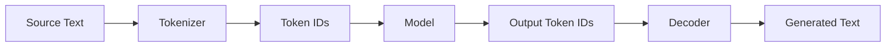

---

# 3.5 What Is a Context Window?

The **context window** is the amount of tokenized information the model can consider within an inference context, subject to the model/API's rules.

Conceptually:

```text
┌──────────────────────────────────────────┐
│               Context Window             │
├──────────────────────────────────────────┤
│ System instructions                      │
│ Developer instructions                   │
│ User request                             │
│ Previous conversation                    │
│ Repository files                         │
│ Tool definitions                         │
│ Tool outputs                             │
│ Retrieved documentation                  │
│ Other runtime information                │
└──────────────────────────────────────────┘
                       ↓
                     Model
```

The exact composition depends on the system.

---

# 3.6 Context Is Not Just the User Prompt

A common beginner mistake is:

```text
context == prompt
```

In an agent, context might be closer to:

```python
context = {
    "system_instructions": ...,
    "project_instructions": ...,
    "conversation": ...,
    "task": ...,
    "tools": ...,
    "source_files": ...,
    "test_output": ...,
    "git_diff": ...,
}
```

The agent runtime decides what to include.

---

# 3.7 Why Context Windows Matter

Imagine a repository:

```text
repo/
├── 3,000 source files
├── 4,000 tests
├── documentation/
├── migrations/
├── generated files/
└── dependencies/
```

The agent needs to fix:

```text
JWT expiry handling in auth/service.py
```

Dumping everything into context is poor engineering.

A better strategy:

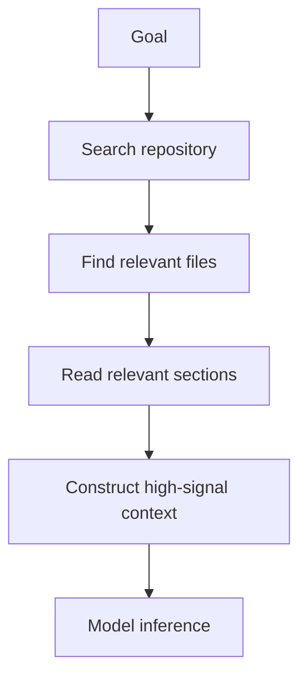

This is an early introduction to **context engineering**.

---

# 3.8 Context Is Finite

Treat context like RAM.

You would not design an application assuming memory is infinite.

Similarly:

```text
Context budget is finite.
```

Every irrelevant token competes with useful information.

A useful conceptual equation:

```text
Context Utility
≈
Relevant Signal
───────────────
Total Context
```

This is not a scientific metric.

It is an engineering intuition:

> Maximize useful signal, not raw context size.

---

# 3.9 Bigger Context Is Not Automatically Better

Suppose you give a model:

```text
10 relevant files
+
1,000 irrelevant files
```

The useful information may become harder to identify.

Long-context models are valuable, but long context does not remove the need for information selection.

Potential failure modes include:

- distraction,
- conflicting instructions,
- stale information,
- duplicate definitions,
- outdated docs,
- irrelevant test output,
- excessive latency,
- increased cost.

---

# 3.10 Context Rot

In long-running workflows, accumulated context can degrade usefulness.

Imagine this sequence:

```text
Task starts
   ↓
20 shell commands
   ↓
10 test runs
   ↓
large logs
   ↓
multiple code revisions
   ↓
old plans
   ↓
obsolete assumptions
```

If every piece remains equally prominent, the model can be forced to reason over stale and contradictory state.

Agent systems may therefore:

- summarize,
- compact,
- retrieve only relevant history,
- discard low-value content,
- isolate sub-tasks.

This becomes important in long-horizon agentic work.

---

# 3.11 Context Selection Example

Suppose the error is:

```text
AttributeError: 'User' object has no attribute 'is_admin'
```

Potentially useful context:

```text
models/user.py
services/auth.py
tests/test_auth.py
traceback
recent git diff
```

Potentially irrelevant:

```text
frontend CSS
Docker logo assets
old release notes
unrelated payment tests
```

Good context engineering tries to identify the first set.

---

# 3.12 Context Budget Visualization

```text
Context Window
100%
┌────────────────────────────────────────┐
│ Instructions                 ███  10%  │
│ User task                    ██    5%  │
│ Relevant code               █████ 30%  │
│ Tests                       ████  20%  │
│ Tool outputs                ███   15%  │
│ History                     ███   15%  │
│ Spare capacity               █     5%  │
└────────────────────────────────────────┘
```

Illustrative only.

The design question is:

```text
What belongs here right now?
```

---

# 3.13 Input Tokens vs Output Tokens

A request typically involves:

```text
Input tokens
+
Output tokens
```

For an agent, there may also be model-internal reasoning usage depending on the model and API.

From an engineering perspective, token consumption affects:

```text
cost
latency
throughput
context capacity
```

---

# 3.14 Inference

**Inference** is the runtime process of producing a response from the trained model.

```text
Context
  ↓
Forward computation
  ↓
Next-token scores
  ↓
Token selection
  ↓
Repeat
```

Inference is where your application interacts with the model.

---

# 3.15 Temperature and Sampling — Conceptual View

Different model APIs expose different sampling controls.

The basic concept:

```text
More deterministic selection
        ↓
more predictable responses

More exploratory sampling
        ↓
more diversity
```

For code generation, high randomness is often undesirable when correctness and consistency matter.

However, do not blindly copy a "temperature = 0" rule across all current models/APIs.

Modern reasoning models may expose different controls, and some settings may not be applicable in the same way.

The general engineering rule:

> Configure inference based on the model's documented interface and evaluate on representative software tasks.

---

# 3.16 A Generic Python Inference Example

Vendor-neutral pseudocode:

```python
from typing import Protocol


class LanguageModel(Protocol):
    def generate(self, prompt: str) -> str:
        ...


def explain_bug(model: LanguageModel, traceback: str) -> str:
    prompt = f"""
You are reviewing a Python traceback.

Traceback:
{traceback}

Explain:
1. Root cause
2. Evidence
3. Smallest likely fix
4. How to verify the fix
"""
    return model.generate(prompt)
```

Notice the architecture:

```text
application code
   ↓
construct context
   ↓
model inference
   ↓
response
```

The model call is one function inside a broader system.

---

# 3.17 A Current-Style API Example

A modern Python API call may look conceptually like:

```python
from openai import OpenAI

client = OpenAI()

response = client.responses.create(
    model="YOUR_CURRENT_MODEL",
    input="""
Review this Python function.

Requirements:
- identify correctness issues
- identify edge cases
- propose tests
- do not modify behavior without explaining why
"""
)

print(response.output_text)
```

Use the model identifier and parameters available in your current environment.

The important part of this phase is the architecture, not memorizing a model name.

---

# 3.18 Why Token Knowledge Changes Your Coding-Agent Behavior

Without token awareness, you may ask:

```text
"Read my entire repository and understand everything."
```

With token awareness, you instead think:

```text
1. Inspect repository structure.
2. Search for relevant symbols.
3. Read targeted files.
4. Load related tests.
5. Read architecture instructions.
6. Build the smallest sufficient context.
```

That change is enormous.

It is the transition from casual prompting toward context engineering.

---


# 3.19 Deep Dive — A Realistic Context Budget Case Study

Imagine a coding agent receives:

```text
"Fix the duplicate invoice bug."
```

The repository contains:

```text
4,000 source files
6,000 test files
200 migration files
large generated SDKs
documentation
CI logs
```

A naive strategy is:

```text
load everything
```

A better strategy is staged discovery.

## Stage 1 — Orientation

Load only:

```text
repository tree
project instructions
issue text
recent relevant commit metadata
```

## Stage 2 — Search

Search for:

```text
Invoice
create_invoice
idempotency
duplicate
invoice number
```

## Stage 3 — Targeted reads

Read:

```text
invoice service
invoice repository
payment/event handler
related tests
database uniqueness rules
```

## Stage 4 — Evidence refresh

After editing:

```text
targeted test output
Git diff
static analysis results
```

The context changes over time.

This is crucial:

> Good agent context is not a static document. It is a continuously curated working set.

---

# 3.20 Deep Dive — Context Layers in a Coding Agent

A useful way to reason about context is to divide it into layers.

```text
Layer 1 — Operating policy
Layer 2 — Project instructions
Layer 3 — Current goal
Layer 4 — Relevant repository evidence
Layer 5 — Recent tool observations
Layer 6 — Working notes / plan
Layer 7 — Output requirements
```

These layers have different lifetimes.

### Long-lived

```text
security policy
coding conventions
architecture boundaries
```

### Task-lived

```text
feature specification
acceptance criteria
```

### Short-lived

```text
latest test failure
current Git diff
temporary shell output
```

An effective agent should not treat all information as equally permanent.

---

# 3.21 Deep Dive — Context Pollution

Context pollution occurs when low-value material competes with important material.

Common sources:

```text
huge dependency files
generated assets
repeated logs
obsolete plans
duplicated documentation
failed approaches that are no longer relevant
```

Example:

```text
Agent tries approach A
tests fail
Agent switches to approach B
approach B succeeds
```

If the context continues to emphasize extensive details from approach A, the model may regress toward obsolete assumptions.

A good runtime may:

```text
summarize old attempts
retain the reason they failed
discard redundant raw logs
keep the current implementation state
```

---

# 3.22 Deep Dive — Compaction

Compaction is a strategy for long-running tasks.

Conceptually:

```text
Large conversation / trace
          ↓
High-fidelity summary
          ↓
New working context
```

A good compaction summary should preserve:

```text
goal
hard constraints
architecture decisions
files changed
tests run
unresolved failures
important evidence
next actions
```

while removing:

```text
duplicate outputs
long successful logs
obsolete exploratory details
repeated instructions
```

A poor summary can destroy important state.

Therefore compaction itself must be evaluated.

---

# 3.23 Deep Dive — Just-in-Time Context

Instead of preloading every document, an agent can keep references:

```text
app/auth/service.py
docs/security.md
issue #412
migration 2026_08_12
```

and retrieve them only when needed.

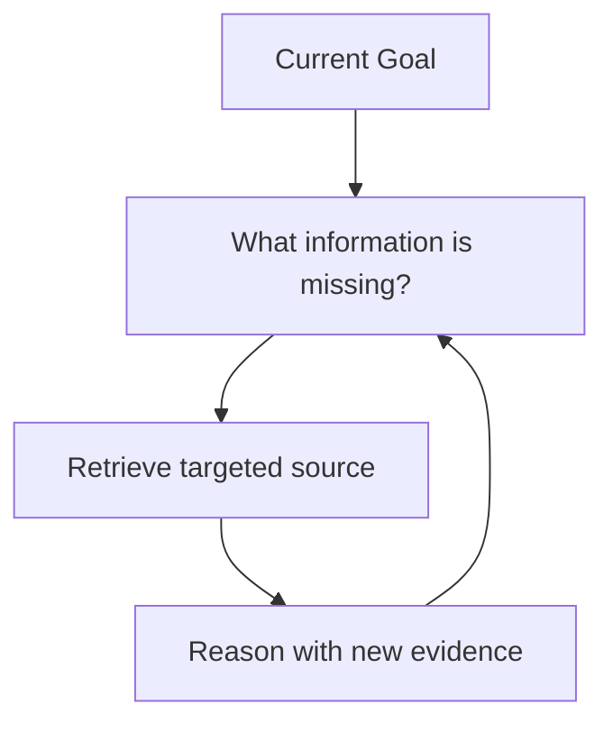

This strategy improves focus but introduces new requirements:

- good search tools,
- good navigation heuristics,
- reliable file identifiers,
- permission controls,
- latency management.

---

# 3.24 Deep Dive — Cost, Latency, and Token Economics

From an application perspective, every model call has a resource profile.

Conceptually:

```text
Total request cost
≈
input processing
+
reasoning/model work
+
output generation
+
tool round trips
```

Longer context may increase:

```text
latency
cost
attention burden
```

Longer output may increase:

```text
latency
cost
post-processing work
```

More tool calls may increase:

```text
wall-clock duration
external API cost
failure probability
```

Therefore optimization should consider the whole agent loop, not merely "use fewer prompt words."

For example, reading a 100,000-token log may be worse than:

```text
grep error pattern
extract 100 relevant lines
then ask the model
```

This is standard software performance thinking applied to AI systems.


# Module 4 — LLM Capabilities and Limitations

# 4.1 Capability Is Not Binary

Avoid thinking:

```text
"The model can code."
```

A more accurate question is:

```text
Under what conditions can this model perform this coding task reliably?
```

Capability depends on:

- task difficulty,
- programming language,
- repository complexity,
- context quality,
- model choice,
- tool access,
- test coverage,
- prompt quality,
- time horizon,
- feedback loops.

---

# 4.2 Strong Capability: Code Explanation

LLMs are often highly useful for explaining code.

Example:

```python
def retry(fn, attempts=3):
    for i in range(attempts):
        try:
            return fn()
        except Exception:
            if i == attempts - 1:
                raise
```

An LLM can explain:

- retry behavior,
- exception flow,
- number of calls,
- shortcomings,
- missing delay/backoff,
- overly broad exception handling.

This is especially valuable when onboarding into unfamiliar repositories.

---

# 4.3 Strong Capability: Code Transformation

Typical tasks:

```text
refactor function
rename interface
convert sync → async
add types
generate tests
migrate API usage
convert data format
```

These tasks have relatively concrete input/output structure.

---

# 4.4 Strong Capability: Pattern Completion

If a repository has:

```text
users/controller.py
orders/controller.py
products/controller.py
```

and you ask for:

```text
invoices/controller.py
```

the model can infer local conventions.

This is one reason agentic tools benefit from repository access.

---

# 4.5 Strong Capability: Natural Language ↔ Code

LLMs bridge:

```text
business requirement
        ↕
technical specification
        ↕
code
        ↕
tests
        ↕
documentation
```

That makes them unusually valuable throughout the SDLC.

---

# 4.6 Strong Capability: Summarization

Examples:

```text
summarize this module
summarize this PR
summarize test failures
summarize this architecture decision
summarize logs
```

But summaries can omit critical details.

So for consequential engineering decisions:

```text
summary
+
link/evidence to original source
```

is better.

---

# 4.7 Strong Capability: Candidate Generation

An LLM is excellent at generating candidates:

```text
possible root causes
possible test cases
possible architectures
possible edge cases
possible migration steps
```

A powerful engineering pattern is:

```text
Generate candidates
        ↓
Use deterministic evidence
        ↓
Eliminate bad candidates
```

---

# 4.8 Strong Capability: Cross-Artifact Reasoning

Modern models can often reason across:

```text
requirements
+
source code
+
test output
+
schema
+
documentation
```

Example:

```text
Requirement:
Every project must belong to an organization.

Schema:
project.organization_id nullable

Service:
project created without organization

Tests:
no organization constraint test
```

A strong model may identify the inconsistency.

---

# 4.9 Limitation: Plausibility Is Not Truth

This is perhaps the most important limitation.

The model is optimized to produce a plausible/useful continuation—not to query an internal truth database for every statement.

Therefore it may produce:

```text
plausible
well-written
confident
wrong
```

output.

---

# 4.10 Limitation: Invented APIs

Example hallucination:

```python
from fastapi import AutoTransactionMiddleware
```

This may look reasonable.

But if such a component does not exist in the installed framework version, the code fails.

Therefore:

```text
Generated API usage
        ↓
Check installed package
        ↓
Check documentation
        ↓
Run code/tests
```

---

# 4.11 Limitation: Version Drift

The model may know an API from an older version.

Your project may use:

```text
library v5
```

while the model recalls patterns from:

```text
library v3
```

A coding agent should inspect:

```text
pyproject.toml
requirements.txt
package.json
lockfiles
actual installed environment
```

before assuming APIs.

---

# 4.12 Limitation: Hidden Requirements

Prompt:

```text
"Add an endpoint to delete users."
```

Hidden requirements may include:

- authorization,
- audit logging,
- soft deletion,
- foreign-key handling,
- GDPR retention rules,
- administrator-only access,
- idempotency.

The model cannot reliably infer your organization-specific rules.

This is a **requirements problem**, not merely an AI problem.

---

# 4.13 Limitation: Long-Horizon Error Accumulation

One wrong early assumption may propagate.

```text
Wrong architecture assumption
        ↓
Wrong schema
        ↓
Wrong API
        ↓
Wrong tests
        ↓
Large incorrect implementation
```

This is why long-running agent workflows need checkpoints.

---

# 4.14 Limitation: Weak Verification Without Tools

Suppose the model generates:

```python
assert normalize_email(" User@Example.com ") == "user@example.com"
```

Without executing code, it may *believe* this passes.

A tool-enabled agent can run:

```bash
pytest
```

and receive real evidence.

This difference is enormous:

```text
Model prediction
vs
Environment observation
```

---

# 4.15 Limitation: Arithmetic and Exactness

Models may perform arithmetic well, especially modern reasoning models, but exact computation should still use deterministic tools where practical.

Bad system design:

```text
LLM calculates financial ledger totals.
```

Better:

```text
Python/SQL computes totals.
LLM explains the result.
```

---

# 4.16 Limitation: Security Blind Spots

Generated code can contain:

- SQL injection,
- path traversal,
- insecure deserialization,
- secrets in code,
- missing authorization,
- weak validation,
- dangerous shell commands.

Security review remains mandatory.

---

# 4.17 Limitation: Overengineering

A model may respond to:

```text
"Add a health endpoint."
```

with:

```text
new service layer
new repository
new event bus
new abstraction
new caching layer
```

A good engineer provides:

```text
scope constraints
architecture constraints
definition of done
```

and reviews the diff.

---

# 4.18 Limitation: Underengineering

The reverse also happens.

Request:

```text
"Implement payment retries."
```

The model may write:

```python
for _ in range(3):
    try:
        charge()
        break
    except Exception:
        pass
```

while ignoring:

- idempotency,
- exponential backoff,
- retryable vs non-retryable errors,
- logging,
- timeout,
- observability,
- duplicate payments.

Again: context and verification matter.

---

# 4.19 Capability Matrix for Software Engineers

| Task | LLM usefulness | Required verification |
|---|---:|---|
| Explain unfamiliar code | High | Read source |
| Generate boilerplate | High | Compile/test |
| Draft unit tests | High | Run tests + inspect assertions |
| Rename/refactor | High | Full test suite |
| Debug exception | High | Reproduce + test fix |
| Architecture proposal | High for options | Human trade-off review |
| Security-critical code | Useful assistant | Strong security review |
| Database migration | Useful | Migration test + rollback review |
| Exact financial calculation | Low as primary calculator | Deterministic code |
| Unknown current API | Risky without retrieval | Docs/environment |
| Autonomous production deployment | High risk | Guardrails + approval |

---

# 4.20 The Verification Ladder

For AI-generated software, increase evidence step by step.

```text
Level 0 — Model says it works
        ↓
Level 1 — Syntax parses
        ↓
Level 2 — Static analysis passes
        ↓
Level 3 — Unit tests pass
        ↓
Level 4 — Integration tests pass
        ↓
Level 5 — End-to-end tests pass
        ↓
Level 6 — Security/performance checks pass
        ↓
Level 7 — Human review
        ↓
Level 8 — Controlled production observation
```

Not every task needs all levels.

But **Level 0 is almost never sufficient**.

---


# 4.21 Deep Dive — Capability Depends on Task Geometry

A useful way to evaluate an LLM task is across several dimensions:

```text
ambiguity
required domain knowledge
need for current information
need for exactness
number of steps
availability of verification
risk of failure
```

Example matrix:

| Task | Ambiguity | Exactness | Verification | Risk |
|---|---:|---:|---:|---:|
| Explain a local function | Low | Medium | Easy | Low |
| Generate unit tests | Medium | High | Easy | Low |
| Diagnose distributed race | High | High | Medium | High |
| Suggest API names | Medium | Low | Easy | Low |
| Modify payment workflow | Medium | Very high | Hard | Very high |
| Summarize logs | Low | Medium | Medium | Medium |

The model should not be trusted uniformly across these tasks.

A good engineer changes the workflow.

For a low-risk task:

```text
model → review
```

For a high-risk task:

```text
evidence
  ↓
model analysis
  ↓
independent tests
  ↓
security/invariant checks
  ↓
human approval
```

---

# 4.22 Deep Dive — Model Capability vs System Capability

Suppose two teams use the same model.

Team A gives it:

```text
a vague prompt
no tools
no repository access
no tests
```

Team B gives it:

```text
clear specification
repository search
filesystem
test runner
linter
type checker
Git diff
approval policy
```

Team B may achieve dramatically higher reliability even though the underlying model is identical.

This distinction is central:

```text
Model capability
    ≠
Agent/system capability
```

Agent engineering is largely the work of converting raw model capability into dependable system behavior.

---

# 4.23 Deep Dive — Know When Deterministic Code Is Better

A common anti-pattern is using an LLM where ordinary code is simpler and safer.

Bad:

```text
Ask LLM whether 42 is greater than 40.
```

Better:

```python
42 > 40
```

Bad:

```text
Ask LLM whether user has ADMIN permission.
```

Better:

```python
if "ADMIN" not in user.permissions:
    raise PermissionDenied()
```

Good LLM use:

```text
Summarize why permission was denied in user-friendly language.
```

A practical decision rule:

```text
If the rule is explicit, stable, exact, and cheap to compute:
prefer deterministic code.

If the task requires interpretation, language understanding,
open-ended synthesis, or uncertain judgment:
an LLM may add value.
```


# Module 5 — Hallucination and Uncertainty

# 5.1 What Is Hallucination?

In engineering discussions, **hallucination** usually means generated content that is false, unsupported, inconsistent, or invented while being presented as if valid.

NIST uses the term **confabulation** for this general phenomenon.

Examples:

- nonexistent library,
- invented method,
- fake configuration flag,
- wrong explanation of code,
- fabricated benchmark,
- incorrect database field,
- nonexistent file,
- fictional security guarantee.

---

# 5.2 Example: Hallucinated Package API

Model response:

```python
from sqlalchemy import AsyncAutoSession
```

It sounds plausible.

But if your SQLAlchemy version does not provide it, it is wrong.

The critical lesson:

```text
Plausible identifier
    ≠
real identifier
```

---

# 5.3 Example: Hallucinated Repository Fact

Suppose the repository contains:

```text
app/
├── api/
└── services/
```

The model says:

```text
"Update app/repositories/user_repository.py."
```

But the file does not exist.

A chat-only assistant may invent paths based on conventions.

A proper coding agent should first:

```bash
find .
rg "UserRepository"
```

or use repository search tools.

---

# 5.4 Why Hallucinations Happen

At a conceptual level:

```text
The model generates likely sequences.
```

It does not automatically perform:

```text
truth lookup
filesystem lookup
API documentation lookup
database query
program execution
```

unless the surrounding system gives it those capabilities.

If a plausible answer fits the language pattern, generation may continue even when evidence is missing.

---

# 5.5 Hallucination Is Not Just "Making Up Facts"

Software hallucinations may be subtler.

### Type A — Entity hallucination

```text
nonexistent function
nonexistent package
nonexistent class
```

### Type B — Behavioral hallucination

```text
"This function validates authorization."
```

when it does not.

### Type C — Causal hallucination

```text
"The failure is caused by race conditions."
```

without evidence.

### Type D — Repository hallucination

```text
"This service already implements caching."
```

without reading it.

### Type E — Requirement hallucination

```text
"The endpoint must return HTTP 202."
```

when no requirement says so.

### Type F — Verification hallucination

```text
"All tests pass."
```

without having actually run them.

That final category is especially dangerous.

---

# 5.6 Confidence Is Not Calibration

An LLM can write:

```text
"The root cause is definitely..."
```

even when uncertainty is high.

Natural-language confidence is not a reliable probability estimate.

Therefore:

```text
confident wording
    ≠
strong evidence
```

---

# 5.7 Engineer Around Hallucination

Do not ask:

```text
"How do I eliminate hallucination entirely?"
```

A better software-engineering question:

```text
"How do I design the workflow so unsupported model output cannot silently become production truth?"
```

Use:

- retrieval,
- tool calls,
- schema validation,
- test execution,
- static analysis,
- code review,
- explicit evidence,
- permission boundaries.

---

# 5.8 Evidence-Grounded Workflow

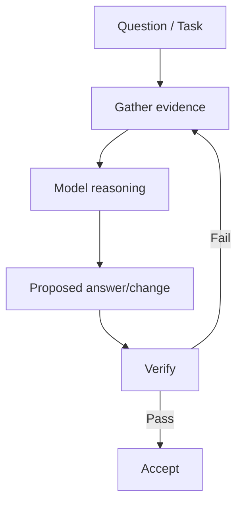

For debugging:

```text
Bug report
   ↓
Reproduce
   ↓
Capture failure
   ↓
Reason about cause
   ↓
Implement fix
   ↓
Run test
   ↓
Accept only if evidence passes
```

---

# 5.9 Ask for Evidence, Not Confidence

Weak prompt:

```text
Are you sure this is the bug?
```

Better:

```text
Identify the root cause and cite the exact code path,
test failure, or runtime evidence supporting it.
Clearly label assumptions that are not yet verified.
```

This does not magically make the model correct.

It improves auditability.

---

# 5.10 Separate Facts, Inferences, and Proposals

A good engineering response can be structured:

```text
Observed facts:
- test X fails with error Y
- function Z passes None into parser

Inference:
- parser likely fails because None is unsupported

Proposed change:
- validate input before parser

Verification:
- add regression test
- run suite
```

This is far better than mixing everything into one confident narrative.

---

# 5.11 Python Validation Example

Suppose the model should generate configuration.

Do not trust arbitrary text.

Use a schema.

```python
from pydantic import BaseModel, Field


class DeploymentPlan(BaseModel):
    service: str
    replicas: int = Field(ge=1, le=20)
    environment: str


candidate = {
    "service": "api",
    "replicas": 3,
    "environment": "staging",
}

plan = DeploymentPlan.model_validate(candidate)

print(plan)
```

This verifies structure and constraints.

It does not prove that 3 replicas are operationally correct.

That requires additional evidence.

---

# 5.12 Deterministic Validation Example

Suppose an LLM generates a Python module.

Validation pipeline:

```python
import subprocess


def run_checks() -> None:
    commands = [
        ["python", "-m", "compileall", "app"],
        ["pytest", "-q"],
        ["ruff", "check", "."],
    ]

    for command in commands:
        result = subprocess.run(
            command,
            capture_output=True,
            text=True,
        )

        if result.returncode != 0:
            raise RuntimeError(
                f"Check failed: {' '.join(command)}\n"
                f"{result.stdout}\n{result.stderr}"
            )
```

The exact tools vary by project.

The principle is stable:

```text
Probabilistic generation
        +
Deterministic validation
        =
Much safer workflow
```

---

# 5.13 Uncertainty Categories

When reviewing model output, classify uncertainty.

```text
Epistemic uncertainty:
"I don't have the required information."

Execution uncertainty:
"I proposed code but have not run it."

Environmental uncertainty:
"I don't know the installed package version."

Requirement uncertainty:
"The expected behavior is ambiguous."

Operational uncertainty:
"I don't know how this change behaves under load."
```

Each category requires a different response.

---

# 5.14 Uncertainty Reduction Strategy

```text
Unknown repository state
        → inspect repository

Unknown runtime behavior
        → execute test

Unknown documentation
        → retrieve authoritative docs

Unknown requirement
        → clarify specification

Unknown production behavior
        → inspect telemetry / stage rollout
```

This is a foundational agentic engineering pattern:

> Convert uncertainty into observations whenever possible.

---


# 5.15 Deep Dive — A Hallucination-Resistant Architecture

You cannot make an LLM mathematically incapable of generating unsupported statements.

You can design the system so unsupported statements have limited authority.

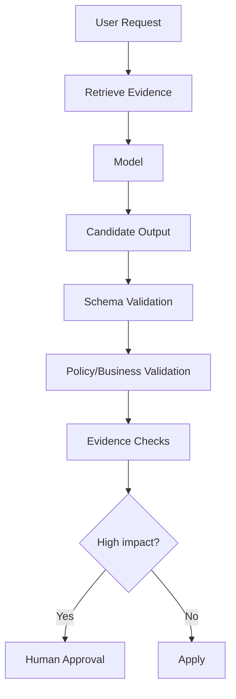

This uses multiple defenses.

## Defense 1 — Grounding

Provide authoritative sources.

## Defense 2 — Structural validation

Reject malformed output.

## Defense 3 — Semantic checks

Confirm important facts.

## Defense 4 — Deterministic execution

Run tests/queries instead of trusting statements.

## Defense 5 — Human approval

Use for irreversible or high-impact actions.

This is defense in depth.

---

# 5.16 Deep Dive — Provenance

For consequential claims, ask:

```text
Where did this information come from?
```

Possible provenance:

```text
repository file
test output
database query
official documentation
user-provided requirement
model prior knowledge
```

These are not equally reliable.

Example:

```text
Claim:
"The endpoint returns 409 for duplicates."

Evidence A:
model says it remembers this pattern

Evidence B:
integration test asserts 409

Evidence C:
running the integration test returns 409
```

C is stronger evidence about the current environment than A.

A mature agent should distinguish:

```text
observed
inferred
assumed
proposed
```

---

# 5.17 Deep Dive — Confidence Should Be Operationalized

Instead of asking the model:

```text
"How confident are you?"
```

ask operational questions:

```text
What evidence supports the claim?
What evidence would falsify it?
Which assumptions remain unverified?
What test would most reduce uncertainty?
```

This turns vague confidence into actionable engineering work.

---

# 5.18 Deep Dive — Hallucination in Code Review

Code review hallucinations are costly because they create developer fatigue.

Example weak finding:

```text
"This may cause a race condition."
```

Better finding:

```text
"Two requests can both pass the `exists()` check before either insert commits.
Because there is no database uniqueness constraint, both can insert the same key."
```

The second contains:

- a concrete execution path,
- a concurrency mechanism,
- evidence,
- an invariant at risk.

A reviewer agent should prefer fewer high-quality findings over a long list of speculative concerns.


# Module 6 — Reasoning Models for Software Engineering

# 6.1 What Do We Mean by a Reasoning Model?

A reasoning-oriented model is optimized/configured to spend more computational effort on difficult problems before producing the final answer or action.

For this course, think:

```text
Fast response model
    ↓
good for straightforward tasks

Reasoning-oriented execution
    ↓
better suited to difficult multi-step tasks
```

Examples of difficult tasks:

- debugging a subtle concurrency issue,
- tracing data through many layers,
- designing a migration plan,
- reviewing architecture trade-offs,
- finding hidden edge cases,
- planning a repository-wide refactor.

---

# 6.2 Reasoning Is Not Magic

More reasoning does not imply:

```text
always correct
```

A model can reason deeply from a false premise.

Example:

```text
False assumption:
"This API is synchronous."

Deep reasoning:
20 steps based on that assumption.

Result:
Still wrong.
```

Therefore:

```text
Reasoning quality
+
Evidence quality
```

both matter.

---

# 6.3 Reasoning Effort as an Engineering Trade-Off

Modern model APIs may expose settings that change how much reasoning effort is used.

Conceptually:

```text
Low reasoning
   → lower latency/cost
   → sufficient for simple tasks

Medium reasoning
   → balanced

High reasoning
   → more exploration
   → useful on harder tasks
   → increased cost/latency
```

Do not assume:

```text
maximum reasoning = best configuration
```

Instead:

```text
task
  ↓
representative evaluation
  ↓
choose model + reasoning setting
```

---

# 6.4 Match Reasoning to Task Complexity

## Low-complexity task

```text
"Rename `user_id` to `account_id` in this DTO."
```

Likely little deep reasoning required.

## Medium task

```text
"Add pagination to this endpoint while preserving existing API behavior."
```

Needs:

- interface awareness,
- tests,
- edge cases.

## High-complexity task

```text
"Migrate this synchronous processing pipeline to asynchronous jobs
without changing externally visible behavior."
```

Needs:

- architecture,
- failure modes,
- idempotency,
- state transitions,
- migration strategy,
- tests.

---

# 6.5 Reasoning for Debugging

A strong debugging process:

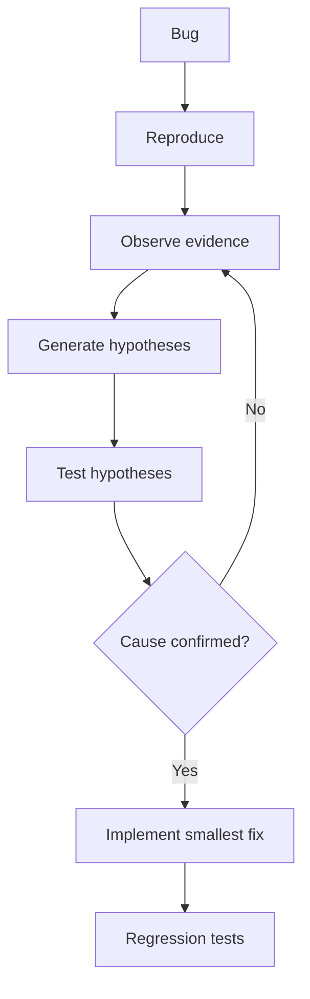

The model can help with:

```text
hypothesis generation
code tracing
test design
```

But environment tools establish ground truth.

---

# 6.6 Debugging Example

Bug:

```python
def get_discount(user):
    if user.plan == "premium":
        discount = 0.2

    return discount
```

Potential failure:

```text
UnboundLocalError
```

for non-premium users.

A reasoning process:

```text
1. `discount` is assigned only in the premium branch.
2. The return executes for every user.
3. Non-premium path reaches return without assignment.
4. Therefore the variable may be unbound.
```

Fix:

```python
def get_discount(user):
    discount = 0.0

    if user.plan == "premium":
        discount = 0.2

    return discount
```

Better yet:

```python
def get_discount(user):
    if user.plan == "premium":
        return 0.2

    return 0.0
```

Regression test:

```python
def test_standard_user_has_no_discount():
    user = User(plan="standard")

    assert get_discount(user) == 0.0
```

---

# 6.7 Reasoning for Architecture

Suppose a model receives:

```text
Requirement:
Send confirmation emails after orders are placed.
Traffic:
100 requests/s.
Email provider occasionally fails.
Order creation must remain fast.
```

A naive design:

```text
HTTP request
   ↓
create order
   ↓
send email synchronously
   ↓
return response
```

Reasoning identifies:

- external email latency,
- provider failures,
- coupling,
- user-request latency.

Alternative:

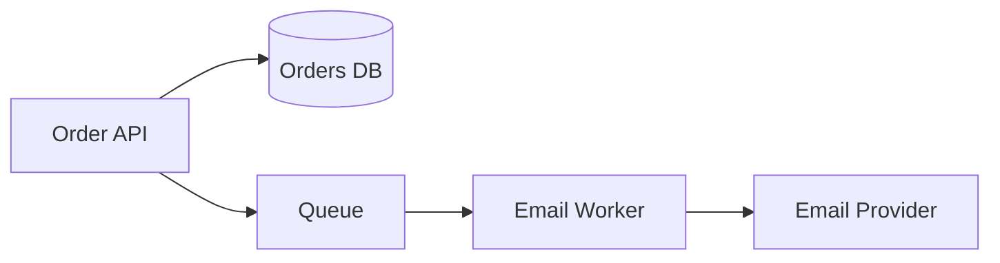

But the model should then consider:

- duplicate messages,
- retry behavior,
- idempotency,
- dead-letter handling,
- observability.

Reasoning is valuable because architecture is a trade-off problem.

---

# 6.8 Reasoning for Refactoring

Request:

```text
Split a 2,000-line service into modules.
```

A poor agent may start editing immediately.

A better reasoning process:

```text
1. Identify responsibilities.
2. Identify public interfaces.
3. Map dependencies.
4. Identify test coverage.
5. Define extraction boundaries.
6. Refactor incrementally.
7. Run tests after each step.
```

Planning before action reduces blast radius.

---

# 6.9 Reasoning for Code Review

A high-quality review asks:

```text
Does this compile?
Does this satisfy requirements?
Does it handle edge cases?
Does it introduce security issues?
Does it preserve compatibility?
Does it create operational risk?
Are tests meaningful?
```

A reasoning model can explore these dimensions more systematically than simple code completion.

---

# 6.10 Reasoning vs Tool Use

Reasoning answers:

```text
"What should I do next?"
```

Tools answer:

```text
"What is actually true in the environment?"
```

Example:

```text
Reasoning:
"The error may be caused by an outdated migration."

Tool:
`alembic current`

Observation:
database is actually one migration behind.
```

The combination is more powerful than either alone.

---

# 6.11 Reasoning Loop

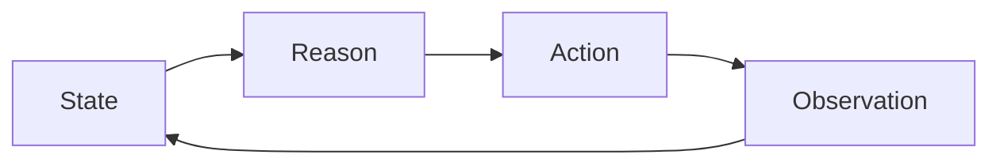

This is the foundation of agentic behavior.

---

# 6.12 Avoid Forcing Unnecessary Reasoning

Do not turn every trivial task into a long planning exercise.

Task:

```text
"Fix typo in README."
```

You do not need:

```text
architecture analysis
multi-agent debate
high reasoning effort
```

Agentic engineering is also about efficiency.

---

# 6.13 Evaluation Beats Intuition

Suppose you are selecting reasoning effort for code review.

Do not choose based on vibes.

Build a test set:

```text
20 historical PRs
with known bugs
```

Measure:

```text
bugs detected
false positives
latency
cost
```

Then choose the configuration.

This introduces the concept of **eval-driven AI engineering**, covered later in the roadmap.

---


# 6.14 Deep Dive — Choosing Reasoning Effort

Reasoning effort should be treated like a performance-quality tuning parameter.

A simple decision matrix:

| Task | Suggested starting point |
|---|---|
| Reformat output | Minimal/low |
| Simple code explanation | Low |
| Add conventional endpoint | Low–medium |
| Debug multi-file failure | Medium |
| Architecture trade-off | Medium–high |
| Repository-wide migration | High, evaluate |
| Complex security review | High, evaluate |
| Trivial typo | Do not waste high reasoning |

The correct value depends on the model and workload.

Do not optimize from anecdotes.

Build representative evaluations.

---

# 6.15 Deep Dive — Reasoning, Search, and Execution Are Different Operations

Consider:

```text
"Why is the service returning HTTP 500?"
```

The model can reason.

But first you may need to **observe**:

```bash
pytest tests/api/test_service.py -q
```

Then **search**:

```bash
rg "HTTPException|DomainError" app/
```

Then **read** relevant code.

Then reason again.

A high-performing agent alternates between:

```text
Think
  ↓
Observe
  ↓
Think
  ↓
Act
  ↓
Observe
```

It should not spend unlimited reasoning tokens trying to infer something the environment can reveal directly.

---

# 6.16 Deep Dive — The "Cheap Truth" Principle

When exact truth is cheap to obtain, prefer obtaining it.

Examples:

```text
Question: Does file exist?
Cheap truth: filesystem lookup

Question: Which version is installed?
Cheap truth: package manager

Question: Did test pass?
Cheap truth: test runner

Question: Is DB migration current?
Cheap truth: migration tool

Question: Which API behavior is documented?
Cheap truth: authoritative docs
```

Reasoning is most valuable after the agent has gathered the right observations.

This principle reduces both hallucination and wasted computation.

---

# 6.17 Deep Dive — Reasoning Failure Patterns

Even strong reasoning models can fail in characteristic ways.

## Premise lock-in

The model accepts a false assumption and reasons deeply from it.

## Overexploration

The model investigates too many branches after enough evidence already exists.

## Premature convergence

The model picks the first plausible explanation.

## Local optimization

The fix solves the immediate test but violates a system invariant.

## Verification substitution

The model narrates what *would* happen instead of actually executing verification.

These failures motivate:

```text
grounding
stopping criteria
tool use
invariants
regression tests
human review
```


# Module 7 — AI-Assisted vs Agentic Software Development

# 7.1 The Evolution of AI Coding

A useful progression:

```text
Autocomplete
    ↓
Chat Assistant
    ↓
AI-Assisted Development
    ↓
Tool-Using Assistant
    ↓
Coding Agent
    ↓
Multi-Agent Software Engineering
```

Each level increases autonomy.

---

# 7.2 Level 1 — Autocomplete

Example:

```python
def calculate_average(values):
    # AI suggests:
    return sum(values) / len(values)
```

Characteristics:

- local context,
- small completion,
- engineer remains primary executor,
- minimal autonomy.

---

# 7.3 Level 2 — Chat Assistant

You ask:

```text
"Explain this traceback."
```

The assistant responds with text.

```text
Human
 ↓
Prompt
 ↓
LLM
 ↓
Answer
```

The assistant may not have direct access to:

- repository,
- shell,
- tests,
- Git.

---

# 7.4 Level 3 — AI-Assisted Development

The developer uses AI throughout work:

```text
requirements
planning
coding
testing
debugging
documentation
review
```

But the human usually drives each step.

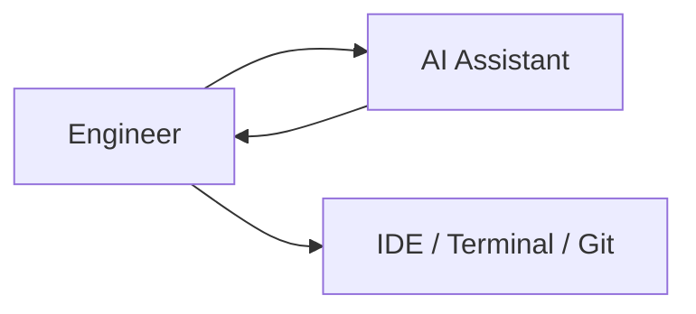

AI is an accelerator.

---

# 7.5 Level 4 — Tool-Using Assistant

Now the model can call tools.

Examples:

- read file,
- search repository,
- execute shell,
- query documentation,
- inspect Git,
- call API.

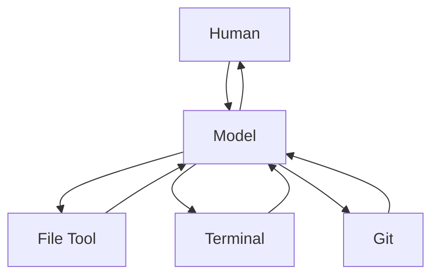

This changes everything because the model can collect evidence.

---

# 7.6 Level 5 — Coding Agent

An agent receives a goal and performs a multi-step workflow.

Example:

```text
"Fix issue #412 and add a regression test."
```

Possible loop:

```text
Read issue
   ↓
Search repository
   ↓
Read relevant code
   ↓
Run failing test / reproduce
   ↓
Plan fix
   ↓
Edit source
   ↓
Edit test
   ↓
Run tests
   ↓
Inspect diff
   ↓
Return result
```

The human supervises at a higher level.

---

# 7.7 What Makes an Agent an Agent?

There is no single universally accepted boundary, but for this track an agent should involve several of these characteristics:

1. Receives a **goal** rather than only a one-shot completion.
2. Maintains some **state/context**.
3. Chooses among **actions/tools**.
4. Receives **observations** from those actions.
5. Performs **multiple steps**.
6. Adjusts behavior based on results.
7. Has some **stopping condition**.
8. May operate with bounded autonomy.

A useful abstraction:

```python
while not done:
    state = observe()
    action = model.decide(state)
    result = execute(action)
    update_state(result)
```

This is pseudocode, not a production agent.

---

# 7.8 Agent Loop in More Detail

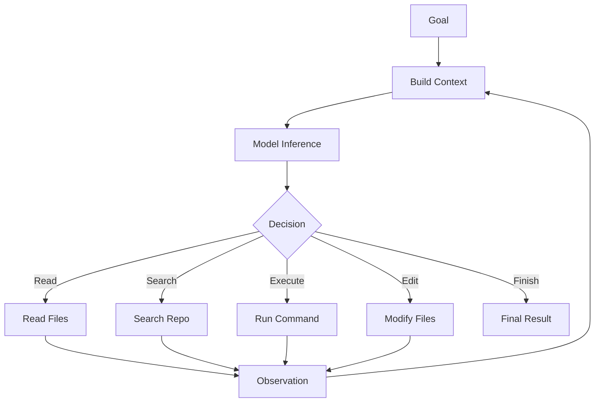

This is much closer to how you should conceptualize a coding agent.

---

# 7.9 Agent Tools

A coding agent becomes useful because it may have tools such as:

```text
filesystem
repository search
terminal
Git
test runner
package manager
browser/documentation
issue tracker
database
cloud tooling
```

Tools transform the model from:

```text
"guess what exists"
```

into:

```text
"inspect what exists"
```

when used correctly.

---

# 7.10 Agent Observations

After a tool action, the agent receives observations.

Example:

```text
Action:
pytest tests/test_auth.py

Observation:
2 failed, 18 passed

Failure:
Expected 401, got 500
```

The observation becomes new context.

The model then reasons again.

---

# 7.11 Agent State

Agent state can include:

```text
current goal
plan
files inspected
files changed
test results
remaining tasks
tool outputs
known constraints
```

Without state, long workflows repeatedly lose track of progress.

---

# 7.12 Agent Planning

For complex work, the agent may form a plan.

Example:

```text
1. Find password-reset endpoint.
2. Inspect token validation.
3. Reproduce expiry bug.
4. Add failing regression test.
5. Fix timestamp comparison.
6. Run targeted tests.
7. Run broader authentication tests.
8. Review diff.
```

A plan creates explicit structure.

However:

> Plans should be updated when observations contradict assumptions.

A rigid plan can be as bad as no plan.

---

# 7.13 Agent Autonomy

Autonomy is not simply:

```text
off / on
```

It is a spectrum.

```text
Human approves every edit
        ↓
Human approves commands
        ↓
Agent edits/runs safe commands
        ↓
Agent opens PR automatically
        ↓
Agent merges after checks
        ↓
Agent deploys automatically
```

Risk rises with authority.

---

# 7.14 Permission Boundaries

A production coding agent should not automatically have unlimited access.

Think:

```text
Read repository      → low risk
Modify branch        → moderate risk
Delete data          → high risk
Access production    → high risk
Deploy production    → high risk
Rotate credentials   → very high risk
```

Permissions should align with task requirements.

---

# 7.15 Human-in-the-Loop

Human review remains valuable at high-impact boundaries.

Example:

```mermaid
flowchart LR
    A[Agent] --> B[Implement]
    B --> C[Tests]
    C --> D[PR]
    D --> H{Human Review}
    H -->|Approve| M[Merge]
    H -->|Reject| A
```

The ideal level of human involvement depends on:

- risk,
- reversibility,
- test quality,
- environment,
- agent reliability.

---

# 7.16 AI-Assisted vs Agentic Comparison

| Characteristic | AI-Assisted | Agentic |
|---|---|---|
| Human drives each step | Usually | Less |
| Model uses tools | Sometimes | Core behavior |
| Multi-step execution | Limited | Yes |
| Repository exploration | Human-led | Agent-led |
| Runs tests | Human often | Agent can |
| Adjusts after failures | Human-mediated | Agent loop |
| Autonomy | Low | Medium to high |
| Permissions required | Minimal | Important |
| Need for guardrails | Moderate | High |
| Need for observability | Moderate | High |

---

# 7.17 Example — Assisted Debugging

Human:

```text
Here is the error.
What is wrong?
```

AI:

```text
The likely problem is...
```

Human:

```text
edits file
runs pytest
```

The human controls execution.

---

# 7.18 Example — Agentic Debugging

Human:

```text
Fix the failing authentication test.
Do not alter public API behavior.
```

Agent:

```text
1. runs failing test
2. reads traceback
3. searches authentication code
4. identifies cause
5. modifies implementation
6. adds regression test
7. runs test suite
8. summarizes diff
```

The control loop is automated.

---

# 7.19 The Software Engineer's Role Changes

Traditional workflow:

```text
Engineer
   ↓
writes implementation
   ↓
runs tests
   ↓
debugs
```

Agentic workflow:

```text
Engineer
   ↓
defines intent
   ↓
defines constraints
   ↓
provides environment
   ↓
agent executes
   ↓
automated feedback
   ↓
engineer reviews evidence
```

Your value shifts toward:

- requirements quality,
- architecture judgment,
- context design,
- test design,
- verification,
- system boundaries,
- security,
- observability,
- orchestration.

---

# 7.20 Harness Engineering

A useful modern concept is **harness engineering**.

Instead of asking only:

```text
"How smart is the model?"
```

ask:

```text
"What environment have we built around the model?"
```

The harness may include:

```text
repository instructions
tool APIs
sandbox
tests
linters
type checker
CI pipeline
permissions
memory
context retrieval
logs
evaluation
```

A mediocre workflow around a powerful model may perform poorly.

A strong workflow can dramatically increase reliability.

---

# 7.21 Coding-Agent Harness Diagram

```mermaid
flowchart TD
    G[Feature Goal]
    G --> SPEC[Specification]
    SPEC --> AG[Agent Runtime]

    AG --> LLM[Reasoning Model]
    AG --> FS[Filesystem]
    AG --> SH[Shell]
    AG --> GIT[Git]
    AG --> DOC[Docs/Search]

    FS --> AG
    SH --> AG
    GIT --> AG
    DOC --> AG

    AG --> TEST[Tests / Lint / Types]
    TEST --> AG

    AG --> DIFF[Proposed Diff]
    DIFF --> HR[Human Review]
```

The LLM is central—but it is not the whole system.

---

# 7.22 Agent-Friendly Tasks

Good early agent tasks:

```text
add unit tests
fix isolated bug
implement clear endpoint
refactor duplicated code
update documentation
perform mechanical migration
```

They have:

- clear scope,
- observable outcome,
- deterministic verification.

---

# 7.23 Difficult Agent Tasks

Harder tasks:

```text
redesign architecture
perform ambiguous product work
modify financial logic
make security-critical decisions
migrate poorly tested legacy system
deploy irreversible database changes
```

These require stronger supervision and guardrails.

---

# 7.24 Task Suitability Matrix

Consider two axes:

```text
clarity of requirements
verifiability of outcome
```

```text
                    Verifiability
                Low              High
            ┌────────────────────────────
Clarity High│ Human review     Good agent task
            │
        Low │ Clarify first    Agent explores,
            │                  but human steers
```

The best agent tasks are generally:

```text
clear
+
bounded
+
testable
+
reversible
```

---


# 7.25 Deep Dive — The Autonomy Ladder

Agentic development is easier to reason about as levels of authority.

```text
Level 0 — Suggest only
Level 1 — Read repository
Level 2 — Run non-destructive commands
Level 3 — Modify local files
Level 4 — Create commits/branches
Level 5 — Open pull requests
Level 6 — Modify shared environments
Level 7 — Merge/deploy
Level 8 — Modify production data/infrastructure
```

As authority increases, required controls should increase.

```text
More autonomy
    ↓
More blast radius
    ↓
Stronger verification
    ↓
Stronger permission boundaries
    ↓
Better auditability
```

---

# 7.26 Deep Dive — Agent Success Is a Systems Property

A successful coding agent needs more than a strong model.

```text
Specification quality
+
Context retrieval
+
Tool reliability
+
Repository quality
+
Test quality
+
Model capability
+
Permission policy
+
Observability
+
Human governance
=
Agent reliability
```

This is why organizations with strong engineering hygiene often gain more from agents.

If the repository has:

```text
no tests
unclear architecture
broken setup
undocumented commands
inconsistent naming
```

the agent must infer much more.

That raises uncertainty.

---

# 7.27 Deep Dive — The Agent Execution Contract

Before granting autonomy, define:

```text
Goal
Allowed tools
Allowed files
Forbidden actions
Required checks
Approval boundaries
Stopping criteria
Expected final report
```

Example:

```text
Goal:
Fix issue #412.

Allowed:
- read repository
- edit feature branch
- run tests
- run linter

Approval required:
- dependency changes
- database migrations
- network calls to production

Done when:
- regression test added
- relevant suite passes
- no unrelated files changed
- diff summarized
```

This is the beginning of agent governance.

---

# 7.28 Deep Dive — Why Agentic Development Changes Repository Design

A repository optimized for humans may still be difficult for agents.

Agent-friendly repositories tend to expose:

```text
clear README/setup
one-command test entry points
fast targeted tests
consistent project structure
machine-readable lint/type errors
architecture docs
stable commands
explicit local instructions
```

Why?

Because the agent's loop is only as good as its feedback.

Example:

```text
Agent changes code
      ↓
`make test-auth`
      ↓
clear pass/fail result
```

is much easier to reason about than:

```text
Agent changes code
      ↓
manual 17-step environment setup
      ↓
ambiguous output
```

This prepares you for later work on agent-friendly repository engineering.


# Putting Everything Together

You can now build the complete mental model.

```mermaid
flowchart TD
    SE[Software Engineering] --> GAI[Generative AI]
    GAI --> LLM[Large Language Model]
    LLM --> TOK[Tokens]
    TOK --> CTX[Context Window]
    CTX --> INF[Inference]
    INF --> OUT[Probabilistic Output]

    OUT --> CAP[Capabilities]
    OUT --> LIM[Limitations]

    LIM --> HAL[Hallucination / Uncertainty]
    HAL --> VER[Verification]

    LLM --> REA[Reasoning]
    REA --> TOOL[Tool Selection]
    TOOL --> OBS[Observation]
    OBS --> REA

    REA --> AG[Agent]
    VER --> AG
    AG --> SDLC[Agentic Software Development]
```

---

# The Most Important Mental Model of Phase 1

Remember this:

```text
                    ┌───────────────┐
                    │ Trained Model │
                    └───────┬───────┘
                            │
                            ↓
┌─────────────┐      ┌───────────────┐
│ Instructions│ ───→ │    Context    │
└─────────────┘      └───────┬───────┘
                             │
┌─────────────┐              ↓
│ Repo / Docs │ ───→    ┌──────────┐
└─────────────┘         │ Inference │
                       └─────┬────┘
┌─────────────┐              │
│ Tool Results│ ─────────────┘
└─────────────┘              ↓
                       Proposed Action
                             ↓
                         Tool / Code
                             ↓
                         Observation
                             ↓
                       Verification Loop
```

This explains much of modern AI-powered software development.

---


# End-to-End Case Study — Understanding a Coding Agent Fixing a Real Bug

This case connects every major concept in Phase 1.

## Problem

A FastAPI application has this bug:

```text
Expired password-reset tokens produce HTTP 500.
Expected behavior is HTTP 401 with the application's standard error shape.
```

A user tells a coding agent:

```text
Fix the expired reset-token bug.
```

At first glance this looks simple.

But observe what must happen inside a reliable agent workflow.

---

## Step 1 — The User Goal Becomes Context

The natural-language request is only one part of the model input.

The agent may also receive:

```text
system policy
repository instructions
tool definitions
current Git status
project path
conversation history
```

Conceptually:

```text
"Fix the expired reset-token bug"
        +
repository policy
        +
available tools
        ↓
initial context
```

The model's first answer depends on **all** of this context.

---

## Step 2 — The Model Does Not Actually Know the Repository Yet

From training, the model may know common patterns such as:

```python
jwt.decode(...)
ExpiredSignatureError
HTTPException(status_code=401)
```

But it does not yet know whether this repository uses:

```text
PyJWT
python-jose
Authlib
custom tokens
database-backed tokens
```

It should not treat prior knowledge as repository truth.

The correct next move is observation.

---

## Step 3 — Repository Search

The agent searches:

```text
reset token
password reset
ExpiredSignature
decode_token
```

Suppose it discovers:

```text
app/auth/reset.py
app/auth/tokens.py
tests/auth/test_reset.py
```

These paths now become evidence.

The model's context is enriched by tool observations.

```mermaid
flowchart LR
    G[Goal] --> M1[Model]
    M1 --> S[Repository Search]
    S --> O[Paths/Symbols]
    O --> M2[Model with Better Context]
```

---

## Step 4 — Read Relevant Code

Suppose `tokens.py` contains:

```python
from jwt import ExpiredSignatureError, decode


def decode_reset_token(token: str) -> dict:
    return decode(
        token,
        RESET_SECRET,
        algorithms=["HS256"],
    )
```

and `reset.py` contains:

```python
async def reset_password(token: str, new_password: str) -> None:
    payload = decode_reset_token(token)
    user = await users.get(payload["sub"])
    ...
```

No expiry exception is translated.

The model can now form a hypothesis:

```text
ExpiredSignatureError propagates out of the domain/service path and reaches
the generic server-error handler.
```

Notice:

```text
This is still a hypothesis.
```

It is supported by code but not yet confirmed by runtime observation.

---

## Step 5 — Reproduction

The agent runs:

```bash
pytest tests/auth/test_reset.py -q
```

Suppose existing tests do not cover expiry.

A mature agent should not conclude:

```text
"Tests pass, therefore no bug."
```

The reported bug concerns an uncovered path.

The agent can create or run a targeted reproduction.

---

## Step 6 — Add a Regression Test

Example:

```python
async def test_expired_reset_token_returns_401(client, expired_reset_token):
    response = await client.post(
        "/auth/reset-password",
        json={
            "token": expired_reset_token,
            "new_password": "NewPassword123!",
        },
    )

    assert response.status_code == 401
    assert response.json()["error"]["code"] == "INVALID_RESET_TOKEN"
```

Before the fix:

```text
Expected: 401
Actual:   500
```

Now the bug has deterministic evidence.

This changes the epistemic status:

```text
Before:
plausible hypothesis

After:
reproduced behavior
```

---

## Step 7 — Reason About the Correct Boundary

The agent should not merely catch every exception in the route.

It should inspect repository error conventions.

Suppose similar authentication failures use:

```python
raise InvalidResetToken() from exc
```

inside the domain/service boundary and a shared exception handler converts that to HTTP 401.

Now the repository itself provides a few-shot architectural pattern.

The fix may become:

```python
def decode_reset_token(token: str) -> dict:
    try:
        return decode(
            token,
            RESET_SECRET,
            algorithms=["HS256"],
        )
    except ExpiredSignatureError as exc:
        raise InvalidResetToken() from exc
```

Whether this exact location is correct depends on the real architecture.

The important point is that the agent should derive the solution from:

```text
requirement
+
repository conventions
+
runtime evidence
```

not generic memory alone.

---

## Step 8 — Execute Verification

The agent runs:

```bash
pytest tests/auth/test_reset.py -q
```

Result:

```text
12 passed
```

Then a broader suite:

```bash
pytest tests/auth/ -q
```

Result:

```text
87 passed
```

Now the model can truthfully report:

```text
The targeted and authentication test suites passed.
```

because a tool observation supports the claim.

---

## Step 9 — Review the Diff

The agent checks:

```bash
git diff -- app/auth/tokens.py tests/auth/test_reset.py
```

This guards against unintended changes.

A reliable final report might include:

```text
Root cause:
ExpiredSignatureError escaped the token-decoding boundary and was handled
as an unexpected server exception.

Change:
Translate expired reset tokens to the existing InvalidResetToken domain error.

Verification:
- pytest tests/auth/test_reset.py -q → 12 passed
- pytest tests/auth/ -q → 87 passed

Files changed:
- app/auth/tokens.py
- tests/auth/test_reset.py

Remaining risk:
Only the auth test scope was run; the complete repository suite was not run.
```

This final report separates:

```text
facts
actions
evidence
remaining uncertainty
```

---

## Map the Case Back to Phase 1 Concepts

### Generative AI

The model generated hypotheses, code, and explanations.

### LLM

It used learned knowledge of Python/JWT patterns.

### Tokens and context

Repository files, tool outputs, and instructions entered its runtime context.

### Capability

It could connect traceback/code/error-handling patterns.

### Limitation

It could have invented the library API without repository evidence.

### Hallucination control

The filesystem, tests, and Git diff constrained unsupported claims.

### Reasoning

It selected a likely cause and identified the correct architectural boundary.

### Agentic behavior

It repeatedly:

```text
reasoned
acted
observed
updated
verified
```

This is the complete Phase 1 mental model in one workflow.

---

# Phase 1 Engineering Takeaway

The most important lesson is not:

```text
"LLMs are good at coding."
```

It is:

```text
A coding agent is a probabilistic reasoning system operating inside
a deterministic software environment.

Reliability comes from repeatedly grounding its reasoning in real observations.
```


# Practical Labs

# Lab 1 — Observe Probabilistic Generation

## Goal

Understand that language-model generation is not ordinary deterministic business logic.

## Exercise

Ask a model several times:

```text
Give me three names for a Python library that validates configuration files.
Do not use names of existing libraries.
```

Compare outputs.

Observe:

- diversity,
- plausibility,
- potential accidental collision with real package names.

## Lesson

Generative output is candidate generation, not authoritative lookup.

---

# Lab 2 — Separate Model Knowledge from Environment Knowledge

## Create a Mini Project

```text
phase1_lab/
├── app.py
├── pricing.py
└── tests/
    └── test_pricing.py
```

`pricing.py`:

```python
def calculate_discount(total: float, premium: bool) -> float:
    if premium:
        return total * 0.20

    return 0.0
```

`app.py`:

```python
from pricing import calculate_discount

print(calculate_discount(100, True))
```

Ask an AI assistant:

```text
What files exist in my local project?
```

If it does not have filesystem access, it cannot know reliably.

Then give it the tree.

Notice how supplying context changes capability.

---

# Lab 3 — Create a Hallucination Trap

Ask:

```text
Write Python using the `fastapi.AutoDatabaseMiddleware`
class to automatically create SQL transactions.
```

Then verify whether the requested API actually exists in your installed environment/documentation.

## Lesson

A model may follow a false premise rather than challenge it.

When the premise matters, require evidence.

---

# Lab 4 — Build Deterministic Verification

Create:

```python
# calculator.py

def divide(a: float, b: float) -> float:
    return a / b
```

Ask an AI to improve error handling.

Then create tests:

```python
# test_calculator.py

import pytest

from calculator import divide


def test_divide():
    assert divide(10, 2) == 5


def test_divide_by_zero():
    with pytest.raises(ValueError):
        divide(10, 0)
```

Run:

```bash
pytest
```

Do not accept the generated change until the test passes.

---

# Lab 5 — Context Quality Experiment

Give a model only:

```text
Fix the bug in this function.
```

with:

```python
def calculate_shipping(weight):
    if weight > 10:
        cost = 20
    return cost
```

Then give a richer prompt:

```text
Requirement:
- weight <= 10 kg costs 7
- weight > 10 kg costs 20
- weight must be positive
- invalid weights should raise ValueError

Current code:
...

Generate:
1. corrected function
2. unit tests
3. edge cases
```

Compare outputs.

## Lesson

Better context changes both correctness and completeness.

---

# Lab 6 — Build a Context Budget Script

Create a simple estimator.

```python
from pathlib import Path


def approximate_tokens(text: str) -> int:
    # Educational approximation only.
    # Real token counts require the target model's tokenizer.
    return max(1, len(text) // 4)


root = Path(".")

for path in root.rglob("*.py"):
    text = path.read_text(encoding="utf-8")
    print(
        path,
        approximate_tokens(text),
        "approximate tokens",
    )
```

The `characters / 4` approximation is intentionally rough.

The point is to think about repository size.

Ask:

```text
Would loading every file into every prompt be sensible?
```

Usually not.

---

# Lab 7 — Reasoning vs Execution

Given:

```python
def total(items):
    return sum(item.price * item.quantity for item in items)
```

Ask the model:

```text
Will this work if quantity is None?
```

Then actually run a test.

```python
from dataclasses import dataclass


@dataclass
class Item:
    price: float
    quantity: int | None


def total(items):
    return sum(item.price * item.quantity for item in items)


items = [Item(10, None)]

print(total(items))
```

Observe the runtime result.

## Lesson

Reasoning predicts.

Execution observes.

---

# Lab 8 — Assisted vs Agentic Workflow Simulation

First solve a bug using chat only.

Record every manual action you perform:

```text
open file
search symbol
run test
edit file
run test
inspect diff
```

Then describe how an agent could perform each action through tools.

Build a table:

| Step | Human-assisted workflow | Agentic equivalent |
|---|---|---|
| Locate code | Human search | Repository search tool |
| Inspect file | Human opens IDE | File-read tool |
| Reproduce | Human runs pytest | Shell tool |
| Edit | Human types code | File edit tool |
| Verify | Human runs tests | Shell tool |
| Review | Human reads diff | Git diff tool + human |

This makes the agent abstraction concrete.

---

# Lab 9 — Build a Minimal Toy Agent Loop

This is **not an LLM-powered production agent**.

It demonstrates the control-loop concept.

```python
from dataclasses import dataclass


@dataclass
class State:
    tests_passing: bool = False
    attempts: int = 0


def decide(state: State) -> str:
    if state.tests_passing:
        return "finish"

    if state.attempts == 0:
        return "run_tests"

    return "apply_fix"


def execute(action: str, state: State) -> State:
    if action == "run_tests":
        print("Running tests...")
        state.attempts += 1
        return state

    if action == "apply_fix":
        print("Applying simulated fix...")
        state.tests_passing = True
        state.attempts += 1
        return state

    return state


state = State()

while True:
    action = decide(state)

    if action == "finish":
        print("Done.")
        break

    state = execute(action, state)
```

The architecture is:

```text
state
 ↓
decision
 ↓
action
 ↓
observation/state update
 ↓
repeat
```

Replace `decide()` with an LLM and `execute()` with real tools and you begin approaching an agent runtime.

---

# Lab 10 — Build an Evidence-Oriented Prompt

Weak:

```text
Review this code.
```

Better:

```text
Review the following function for correctness.

For each issue:
1. identify the exact line or behavior
2. explain why it is a problem
3. distinguish confirmed issues from possible risks
4. propose the smallest fix
5. propose a test that would fail before the fix and pass after it

Do not claim that a test passes unless you actually have execution evidence.
```

Notice the difference:

```text
"be smart"
```

vs:

```text
define evidence expectations
```

---

# Common Misconceptions

# Misconception 1 — "The LLM searches the internet for every answer."

False.

A model may answer from its trained parameters and current context.

Web retrieval is a separate capability/tool unless explicitly integrated.

---

# Misconception 2 — "The model remembers my repository forever."

False as a general assumption.

Repository information must be available through:

- current context,
- persistent system features,
- retrieval,
- tools,
- external memory.

---

# Misconception 3 — "If it generated valid Python, the task is solved."

False.

Valid syntax is only one property.

Correct software also requires:

```text
requirements correctness
runtime correctness
security
performance
maintainability
compatibility
```

---

# Misconception 4 — "More context always improves the result."

False.

Relevant context helps.

Irrelevant, stale, duplicate, or contradictory context can hurt.

---

# Misconception 5 — "Reasoning models do not hallucinate."

False.

Reasoning can improve performance on hard tasks but does not create perfect truthfulness.

---

# Misconception 6 — "A coding agent is just ChatGPT inside an IDE."

Incomplete.

A serious coding agent usually combines:

```text
model
+
tools
+
execution environment
+
context management
+
state
+
permissions
+
feedback
```

---

# Misconception 7 — "Agentic development means no humans."

False.

In production engineering, human responsibilities often move upward toward:

```text
intent
architecture
risk
verification
governance
review
```

---

# Misconception 8 — "If the agent ran tests, the change is correct."

Not necessarily.

Tests may be:

- incomplete,
- weak,
- incorrectly written,
- overly mocked,
- aligned with the bug instead of the requirement.

Tests provide evidence—not absolute proof.

---

# Misconception 9 — "The largest model should be used for every task."

Poor engineering.

Choose based on:

```text
quality
latency
cost
risk
task complexity
eval results
```

---

# Misconception 10 — "Prompt engineering is enough."

Not for serious agents.

Eventually you need:

```text
context engineering
tools
verification
evaluation
security
orchestration
```

---

# Software Engineering Rules of Thumb

## Rule 1

Use an LLM for **judgment, transformation, interpretation, generation, and reasoning**.

Use deterministic software for **exact computation, constraints, and repeatable verification**.

---

## Rule 2

When reality can be observed cheaply, **observe it instead of asking the model to guess it**.

```text
Need package version?
→ inspect environment

Need test status?
→ run tests

Need database value?
→ query database

Need repository file?
→ read file
```

---

## Rule 3

Do not treat natural-language confidence as evidence.

---

## Rule 4

The more autonomous the agent, the stronger the required:

```text
tests
permissions
sandbox
observability
stopping criteria
human approval boundaries
```

---

## Rule 5

Prefer small, verifiable agent tasks before large ambiguous ones.

---

## Rule 6

Repository context is part of the software interface to the agent.

Keep it clean.

---

## Rule 7

An agent should not merely produce code.

It should produce **evidence**.

Examples:

```text
tests executed
commands executed
files changed
diff
remaining risks
```

---

## Rule 8

Reasoning effort should be selected based on task difficulty and evaluation—not prestige.

---

## Rule 9

Never let AI replace requirements engineering.

Bad requirements generate fast bad software.

---

## Rule 10

The safest pattern is often:

```text
Model proposes
Tool verifies
Human governs
```

---

# Glossary

## Agent

A system that uses a model in a loop to choose and perform actions toward a goal, usually with tools and state.

## AI-Assisted Development

Software engineering in which AI helps the engineer but the human directly controls most execution steps.

## Agentic Software Development

Software development where AI agents perform multi-step engineering tasks with some autonomy.

## Attention

A transformer mechanism that allows relationships between token representations to influence processing.

## Confabulation / Hallucination

Generated content that is false, unsupported, inconsistent, or fabricated while appearing plausible.

## Context

The tokenized information available to the model during inference.

## Context Window

The bounded amount of context that can be processed within a model interaction, subject to model and platform limits.

## Foundation Model

A broadly trained model capable of supporting many downstream tasks.

## Generative AI

AI systems that produce new content such as text, code, images, audio, or structured outputs.

## In-Context Learning

The ability of a model to adapt behavior based on examples or information supplied in the current context without ordinary retraining.

## Inference

Using a trained model to generate outputs from inputs.

## LLM

Large Language Model.

## Model Parameters

Learned numerical values that encode the model's behavior after training.

## Multimodal Model

A model that supports more than one type of input or output modality.

## Prompt

An instruction or input given to a model. A prompt is only one component of overall context.

## Reasoning Model

A model or model configuration designed to devote additional computation to difficult multi-step problems.

## Token

A unit of text representation processed by the language model.

## Tool

An external function or capability an agent can invoke, such as filesystem access, a terminal, database query, or API.

## Tool Call

A structured request from the model/agent to invoke a tool.

## Tool Result / Observation

The information returned from executing a tool.

## Verification

The process of determining whether generated output actually satisfies requirements or environmental reality.

---

# Review Questions

## Conceptual Questions

1. What makes generative AI different from a traditional deterministic program?
2. What is an LLM?
3. Why is an LLM not equivalent to a database?
4. Why can an LLM generate Python even if it is not a Python interpreter?
5. What is inference?
6. What is the difference between training and inference?
7. What is a token?
8. Why does token count matter to an application developer?
9. What is a context window?
10. What types of information may exist inside a coding agent's context?
11. Why can additional context reduce performance?
12. What is context rot?
13. What is hallucination/confabulation?
14. Give three examples of software-specific hallucinations.
15. Why is model confidence not sufficient evidence?
16. What is the difference between reasoning and execution?
17. Why should a coding agent run tests?
18. When is high reasoning effort appropriate?
19. Why is high reasoning effort not always the best option?
20. What is the difference between an AI coding assistant and a coding agent?
21. What is a tool call?
22. What is an observation?
23. Why does an agent need state?
24. Why does an agent need stopping criteria?
25. What makes a task suitable for delegation to an agent?
26. Why should production agents have permission boundaries?
27. What is human-in-the-loop?
28. What is harness engineering?
29. Why is deterministic validation valuable around probabilistic models?
30. What remains the responsibility of the software engineer?

---

# Scenario Questions

## Scenario 1

An agent says:

```text
All 184 tests pass.
```

but it never invoked the test runner.

### Question

Should you accept the claim?

### Expected reasoning

No.

It is a generated statement without execution evidence.

---

## Scenario 2

An agent wants to use a library method you have never seen.

### Question

What should it do?

### Good workflow

```text
inspect installed version
        ↓
read authoritative docs/source
        ↓
verify method
        ↓
implement
        ↓
run tests
```

---

## Scenario 3

You have a repository with 15,000 files.

### Question

Should every file be inserted into every model call?

### Answer

Usually no.

Use search, retrieval, repository structure, and targeted reads.

---

## Scenario 4

A one-line README typo needs fixing.

### Question

Should you use maximum reasoning effort and a five-agent architecture?

### Answer

No.

Match orchestration complexity to task complexity.

---

## Scenario 5

A payment service needs a retry mechanism.

### Question

What concerns should be raised beyond merely writing a retry loop?

Possible answers:

- idempotency,
- duplicate payments,
- retry classification,
- timeouts,
- exponential backoff,
- logging,
- monitoring,
- failure handling,
- provider guarantees,
- tests.

---

# Phase Project

# Project — Build an AI-Aware Code Review CLI

The goal is **not** to build a full agent yet.

The goal is to apply the Phase 1 mental models.

---

## Project Requirements

Build:

```text
ai_review/
├── README.md
├── pyproject.toml
├── src/
│   └── ai_review/
│       ├── __init__.py
│       ├── cli.py
│       ├── context.py
│       ├── models.py
│       └── validator.py
└── tests/
    ├── test_context.py
    └── test_validator.py
```

---

## Feature 1 — Read a Source File

CLI:

```bash
python -m ai_review review example.py
```

Read the source file.

---

## Feature 2 — Build Explicit Context

Create a structure:

```python
from dataclasses import dataclass


@dataclass
class ReviewContext:
    filename: str
    source: str
    requirements: list[str]
```

The project should make context explicit.

---

## Feature 3 — Approximate Context Size

Create:

```python
def approximate_token_count(text: str) -> int:
    return max(1, len(text) // 4)
```

Clearly label this as an approximation.

The purpose is educational.

---

## Feature 4 — Construct a Review Prompt

Example:

```text
You are reviewing Python code.

File:
{filename}

Requirements:
{requirements}

Source:
{source}

Identify:
- confirmed correctness issues
- possible risks
- missing edge cases
- tests that should be added

Separate observations from assumptions.
Do not claim any code was executed.
```

---

## Feature 5 — Add Structured Output

Define:

```python
from pydantic import BaseModel


class ReviewIssue(BaseModel):
    severity: str
    description: str
    evidence: str
    suggested_test: str
```

Use structured results.

---

## Feature 6 — Validation

Validate generated results with Pydantic.

Again:

```text
schema validity
≠
semantic correctness
```

Document this clearly.

---

## Feature 7 — Human Review Boundary

The CLI should end with a message conceptually like:

```text
AI review generated.
No proposed issue should be treated as confirmed until checked against
the source, tests, runtime behavior, or authoritative documentation.
```

This reinforces the Phase 1 philosophy.

---

## Stretch Goal — Add Real Test Execution

Allow:

```bash
python -m ai_review review example.py --run-tests
```

Run:

```bash
pytest
```

Capture:

- exit code,
- stdout,
- stderr.

Add the real test result to the review context.

Now you have moved one step toward agentic software:

```text
LLM
+
tool observation
```

---

# Suggested Project Workflow

```mermaid
flowchart TD
    F[Source File] --> C[Context Builder]
    C --> M[LLM Review]
    M --> S[Structured Output]
    S --> V[Pydantic Validation]
    V --> H[Human Review]

    T[Test Runner] --> C
```

---

# Phase 1 Completion Checklist

You are ready to continue when you can confidently explain every item below without memorized buzzwords.

## Generative AI

- [ ] I can explain generative AI.
- [ ] I can distinguish generative models from deterministic programs.
- [ ] I understand training vs inference.
- [ ] I understand why AI output is probabilistic.

## LLM Fundamentals

- [ ] I can explain next-token prediction at a conceptual level.
- [ ] I understand why code can be modeled as language.
- [ ] I understand the high-level role of transformers/attention.
- [ ] I understand in-context learning.
- [ ] I can distinguish an LLM from a database, search engine, compiler, and interpreter.

## Tokens and Context

- [ ] I can explain what tokens are.
- [ ] I can explain what a context window is.
- [ ] I know that context contains more than the user prompt.
- [ ] I understand why irrelevant context can reduce effectiveness.
- [ ] I understand context budget and context rot.
- [ ] I understand why repository retrieval matters.

## Capabilities and Limitations

- [ ] I can identify tasks where LLMs are strong.
- [ ] I can identify tasks requiring deterministic tools.
- [ ] I understand version/API hallucination risk.
- [ ] I understand long-horizon error accumulation.
- [ ] I know why generated code must be verified.

## Hallucination and Uncertainty

- [ ] I can define hallucination/confabulation.
- [ ] I can distinguish facts, inferences, and proposals.
- [ ] I do not treat confident language as evidence.
- [ ] I can design a verification step for an AI-generated claim.
- [ ] I understand schema validation vs semantic validation.

## Reasoning

- [ ] I understand what reasoning-oriented execution is for.
- [ ] I can choose simple vs complex tasks appropriately.
- [ ] I know that more reasoning is not automatically better.
- [ ] I understand reasoning vs tool-based observation.
- [ ] I understand eval-driven model/configuration selection.

## Agentic Development

- [ ] I can distinguish autocomplete, assistant, tool-using assistant, and agent.
- [ ] I can draw the agent loop.
- [ ] I understand tools, actions, observations, state, and stopping conditions.
- [ ] I understand autonomy as a spectrum.
- [ ] I understand human-in-the-loop.
- [ ] I understand permission boundaries.
- [ ] I understand the concept of a coding-agent harness.
- [ ] I can identify a good first task for an agent.

---

# Where This Leads Next

Phase 1 establishes:

```text
What the model is
        +
What context is
        +
How inference works
        +
Why models fail
        +
How reasoning helps
        +
How tools change capability
        +
What makes an agent
```

The next phases should build on this foundation:

```text
Phase 1
Generative AI for Software Engineers
        ↓
Phase 2
Prompt Engineering for Software Development
        ↓
Phase 3
Context Engineering
        ↓
Phase 4
Agentic AI Fundamentals
        ↓
Phase 5
AI Coding Agent Mastery
        ↓
Phase 6
Spec-Driven Development
```

After Phase 1, you should stop thinking of an AI coding system as:

```text
"A chatbot that writes code."
```

and start thinking of it as:

```text
A probabilistic reasoning component
inside a software-engineering control system
that receives curated context,
can potentially use tools,
produces uncertain outputs,
and must be verified against real evidence.
```

That mental model is the foundation for everything that follows.

---

# Reference Baseline Used to Review This Material

This chapter was reviewed against current primary-source concepts available in August 2026, including:

- OpenAI model guidance for current reasoning-capable models.
- OpenAI engineering material on coding agents, agent loops, safe coding-agent execution, and harness engineering.
- Anthropic engineering guidance on context engineering and finite context budgets.
- NIST's Generative AI Risk Management Profile terminology for confabulation/hallucination.

Because APIs, model names, context sizes, and product capabilities change quickly, this chapter intentionally teaches the **stable engineering concepts** rather than depending on one model version.


## Additional current engineering guidance

As of August 2026, current OpenAI model guidance for GPT-5.6 emphasizes that reasoning effort is an explicit engineering trade-off, with higher settings reserved for workloads where evaluations demonstrate measurable benefit. It also emphasizes intent understanding, constraints, approval boundaries, and success criteria rather than requiring every intermediate step to be prescribed.

Anthropic's context-engineering guidance similarly treats context as a finite resource and recommends high-signal context, just-in-time retrieval, compaction, structured note-taking, and careful context curation for long-horizon agents.

NIST's Generative AI Risk Management Profile uses **confabulation** for confidently presented false or erroneous generated content and notes that this behavior follows naturally from statistical generation, reinforcing the need for application-level verification and risk controls.

Primary references:

- https://developers.openai.com/api/docs/guides/latest-model
- https://www.anthropic.com/engineering/effective-context-engineering-for-ai-agents
- https://nvlpubs.nist.gov/nistpubs/ai/NIST.AI.600-1.pdf


---

# Deep Expansion II — From Conceptual Understanding to Engineering Intuition

This section deepens the same Phase 1 topics from a second angle.

The goal is not to add unrelated AI theory. The goal is to make the concepts **operational** for a software engineer.

By the end of this expansion, you should be able to look at an AI coding workflow and mentally decompose it into:

```text
model capability
+
runtime context
+
inference configuration
+
tools
+
environment
+
verification
+
permissions
```

rather than treating the entire system as one opaque "AI" box.

---

# A. A Four-Layer Mental Model for Every LLM Application

When an AI system behaves unexpectedly, separate the problem into four layers.

```mermaid
flowchart TD
    A[Layer 1: Model] --> B[Layer 2: Context]
    B --> C[Layer 3: Inference]
    C --> D[Layer 4: Environment / Tools]
    D --> E[Observed Behavior]
```

## Layer 1 — Model

Questions:

- Is the selected model capable enough for the task?
- Is it optimized for reasoning, speed, multimodality, or coding?
- Does it support the required tool or structured-output interface?

A model-capability problem cannot always be fixed with a better prompt.

Example:

```text
Task:
Perform a difficult repository-wide concurrency analysis.

Problem:
The selected model repeatedly misses cross-module state interactions.
```

Possible causes include insufficient capability, not just bad instructions.

---

## Layer 2 — Context

Questions:

- Did the model receive the relevant source files?
- Did it receive current tests?
- Did it receive stale or contradictory documentation?
- Did it receive the exact error output?
- Did it receive enough architectural context?

Example:

```text
The model writes code against `UserRepository.find_by_email()`.

Actual repository:
The method is named `get_by_email()`.
```

If the model never saw the repository interface, the error is largely a context failure.

---

## Layer 3 — Inference

Questions:

- Is the task using appropriate reasoning effort?
- Is the response constrained to a suitable format?
- Is the output budget enough?
- Is the task being split into too many calls or too few calls?

A difficult architecture task may fail if treated like a trivial completion.

A trivial formatting task may become unnecessarily slow and expensive if routed through a high-reasoning workflow.

---

## Layer 4 — Environment / Tools

Questions:

- Can the agent read the repository?
- Can it run tests?
- Can it inspect package versions?
- Can it execute Git commands?
- Can it retrieve documentation?
- Are permissions preventing necessary actions?

A model can correctly reason:

```text
"The likely fix requires updating the migration."
```

but if it cannot inspect migrations, that remains a hypothesis.

---

## Engineering Rule

When AI output fails, do not immediately respond with:

```text
"Write a better prompt."
```

Diagnose the layer first.

```text
Capability problem?
Context problem?
Inference problem?
Tool problem?
Requirements problem?
Verification problem?
```

This diagnostic habit will save enormous time later.

---

# B. Next-Token Prediction in More Depth

"Next-token prediction" sounds simple enough that beginners often underestimate it.

Consider:

```text
The API returns HTTP
```

Possible continuations:

```text
200
201
400
401
404
500
...
```

The model does not initially choose a full paragraph.

It computes relative scores for possible next tokens.

Conceptually:

```text
token           score
----------------------
"200"           6.2
"201"           5.8
"400"           4.9
"500"           3.2
...
```

Those scores are often called **logits** before normalization.

You do not need the underlying neural-network derivation for this track.

What matters is that the model has a *distribution*, not a single stored answer.

---

# B.1 From Scores to Probabilities

A common mathematical transformation is softmax.

Conceptually:

```text
raw scores
    ↓
softmax
    ↓
probability distribution
```

Educational Python:

```python
import math


def softmax(values: list[float]) -> list[float]:
    maximum = max(values)
    exps = [math.exp(value - maximum) for value in values]
    total = sum(exps)
    return [value / total for value in exps]


tokens = ["200", "201", "400", "500"]
scores = [6.2, 5.8, 4.9, 3.2]

probabilities = softmax(scores)

for token, probability in zip(tokens, probabilities):
    print(f"{token}: {probability:.3f}")
```

This does **not** reproduce any production model's exact behavior.

It illustrates the principle:

```text
model produces relative preferences
        ↓
runtime converts them into probabilities
        ↓
generation selects a continuation
```

---

# B.2 Why Small Differences Matter

Suppose:

```text
"201" = 0.43
"200" = 0.39
```

The model is not "certain" in a human sense.

Both are plausible.

Now add context:

```text
Successful creation must return HTTP 201.
```

The probability distribution may shift strongly toward `201`.

This demonstrates why context matters.

```text
Same model
+
different context
=
different token probabilities
```

---

# B.3 Autoregressive Error Propagation

Generation is autoregressive.

The model conditions on what has already been generated.

Imagine it makes an early mistake:

```text
Incorrect early assumption:
"Project names are globally unique."
```

It may then generate:

```text
global unique DB constraint
global duplicate check
tests enforcing global uniqueness
migration adding global index
```

A single wrong assumption can create a *coherent but wrong* implementation.

This explains a common experience:

> The model's code can be internally consistent while violating the actual requirement.

The fix is not merely "better syntax."

The fix is to control assumptions and verification.

---

# C. Sampling: Why the Same Prompt Can Produce Different Answers

A probabilistic model may support different token-selection strategies.

Simplified strategies include:

- greedy selection,
- probabilistic sampling,
- top-k-like filtering,
- top-p-like filtering.

Exact controls vary by model/API.

---

# C.1 Greedy Selection

Choose the highest probability token every time.

Conceptually:

```python
def greedy_choice(probabilities: dict[str, float]) -> str:
    return max(probabilities, key=probabilities.get)
```

If:

```python
choices = {
    "200": 0.39,
    "201": 0.43,
    "400": 0.10,
}
```

greedy selection always chooses:

```text
201
```

This can improve repeatability.

But it does not guarantee correctness.

A deterministically selected wrong answer is still wrong.

---

# C.2 Probabilistic Selection

Educational example:

```python
import random


def sample_choice(probabilities: dict[str, float]) -> str:
    items = list(probabilities)
    weights = list(probabilities.values())
    return random.choices(items, weights=weights, k=1)[0]
```

Running this multiple times may produce different outputs.

This helps explain why:

```text
same request
+
same model
```

does not necessarily imply:

```text
byte-for-byte identical response
```

---

# C.3 Why Software Engineers Care

For creative naming:

```text
Generate 20 names for a library.
```

diversity can be useful.

For database migrations:

```text
Generate an exact migration plan.
```

predictability and verification are more important.

The broader principle:

```text
Sampling configuration should match task characteristics.
```

---

# D. Internal Representations Without the Heavy Mathematics

After tokenization, a token ID such as:

```text
431
```

is not useful by itself.

The model maps tokens into numerical vector representations.

Conceptually:

```text
token
  ↓
embedding / representation
  ↓
high-dimensional numeric vector
```

Example, purely illustrative:

```text
"database"
→ [0.17, -0.82, 0.44, ...]
```

The actual vectors are much larger.

---

# D.1 Why Representations Matter

The representation enables the network to compute relationships between tokens and context.

Conceptually:

```text
"database"
"PostgreSQL"
"SQL"
"transaction"
```

may have useful learned relationships.

Similarly:

```text
"pytest"
"test"
"fixture"
"assert"
```

exist in a learned representation space that supports code reasoning.

This does **not** mean the model contains a neat hand-readable dictionary.

The knowledge is distributed across parameters and activations.

---

# D.2 Position Matters

Consider:

```text
dog bites man
```

versus:

```text
man bites dog
```

The tokens are similar, but order changes meaning.

Code is even more sensitive to order:

```python
if authenticated:
    delete_account()
```

is not the same as:

```python
delete_account()

if authenticated:
    ...
```

Transformer models need representations of token order/position in addition to token identity.

You do not need the mathematical implementation here.

You need the engineering intuition:

> The model processes both *what* tokens appear and *where/how they relate within the sequence*.

---

# E. Attention — A Deeper Software Engineer's Mental Model

Attention is often explained too vaguely.

A useful conceptual interpretation is:

> For the current computation, which parts of the context are most relevant to each other?

Consider:

```python
def deactivate_user(user: User) -> None:
    user.active = False
    session_repository.revoke_all(user.id)
```

When reasoning about:

```text
revoke_all(user.id)
```

the model may benefit from relationships to:

- `user`,
- `User`,
- the earlier assignment,
- `session_repository`,
- surrounding instructions,
- repository conventions.

---

# E.1 Query / Key / Value Intuition

Do not memorize this as exact internal behavior, but a useful analogy is:

```text
Query:
"What information am I looking for?"

Key:
"What kind of information does this token/location represent?"

Value:
"What information should be contributed if it is relevant?"
```

Imagine reading code manually.

When you see:

```python
repository.save(user)
```

your brain may ask:

```text
"What is `repository`?"
```

Then look backward for:

```python
repository = UserRepository(...)
```

Attention provides a computational mechanism for these contextual relationships.

---

# E.2 Attention Does Not Guarantee Correct Retrieval

Important:

```text
Relevant information exists in context
```

does not guarantee:

```text
model uses it perfectly
```

Reasons include:

- context length,
- competing information,
- ambiguous names,
- repeated patterns,
- poor retrieval selection,
- conflicting instructions.

Therefore:

> "The file was somewhere in the prompt" is weaker than "the relevant definition was selected and made salient."

This is one reason context engineering exists as its own phase.

---

# F. Context Windows — Deeper Than "Maximum Tokens"

A context window is often described as:

```text
maximum number of tokens
```

That is incomplete from a software engineering perspective.

You should think about:

1. capacity,
2. composition,
3. relevance,
4. placement,
5. freshness,
6. cost,
7. inference latency.

---

# F.1 Capacity

A model can only process a bounded amount of context per interaction.

Even large windows are finite.

---

# F.2 Composition

A coding-agent context may contain:

```text
system policy
repository instructions
user feature request
planning notes
source files
tests
diffs
terminal results
tool schemas
previous actions
```

Each consumes capacity.

---

# F.3 Relevance

A 100,000-token context that contains only 5,000 useful tokens may perform worse than a carefully selected 15,000-token context.

---

# F.4 Freshness

Suppose earlier context says:

```text
"All tests pass."
```

Then later a code edit causes failures.

If old state remains prominent without updated evidence, the model may reason from stale information.

Agent systems must continually maintain a representation of **current state**.

---

# F.5 Context Placement

In practical systems, information may appear across different message and tool-result sections.

The exact model behavior depends on the platform.

Engineering rule:

> Put critical constraints and current task state in explicit, stable places rather than hoping the model infers them from distant history.

---

# F.6 Context Cost

More input generally means:

```text
more tokens
+
more processing
+
potentially greater cost
```

There may also be caching mechanisms depending on the platform.

The stable principle:

```text
context has operational cost
```

therefore information selection is an engineering problem.

---

# G. Prefill vs Decode — Why Latency Feels Different

A useful inference concept for application engineers is that processing the input context and generating new tokens are different phases.

Conceptually:

```text
Large input context
      ↓
Prefill / input processing
      ↓
Generate output token 1
      ↓
Generate output token 2
      ↓
...
```

You do not need inference-engine internals.

But this explains two latency dimensions:

```text
time to first token
+
time to generate remaining output
```

A huge context may increase initial latency.

A very long answer may increase generation latency.

---

# G.1 Software Design Consequence

If an agent repeatedly sends:

```text
100,000 tokens
```

for a tiny decision such as:

```text
"Which test should I run next?"
```

the system can become inefficient.

A better architecture may maintain summarized state and retrieve only relevant detail.

Again, this anticipates Phase 3.

---

# H. Model Knowledge vs Repository Knowledge vs Runtime Knowledge

This distinction deserves its own framework.

```mermaid
flowchart LR
    MK[Model Knowledge] --> R[Reasoning]
    RK[Repository Knowledge] --> R
    RT[Runtime Knowledge] --> R
```

## Model knowledge

Broad learned capability:

```text
Python syntax
FastAPI patterns
SQL concepts
common software architectures
```

## Repository knowledge

Specific to your project:

```text
actual file names
actual interfaces
custom conventions
business logic
tests
```

## Runtime knowledge

Current environment state:

```text
installed package version
database migration state
test result
environment variable
deployment status
```

---

# H.1 Why This Distinction Matters

Question:

```text
"Does `ProjectRepository` expose `get_by_id()`?"
```

This is repository knowledge.

The model should inspect the repository.

Question:

```text
"What SQLAlchemy version is installed?"
```

This is runtime/environment knowledge.

The agent should inspect:

```text
lockfile
package metadata
environment
```

Question:

```text
"What does a SQL transaction mean?"
```

This is general model knowledge territory.

---

# I. Tool Use as Epistemic Upgrade

Tools do more than increase convenience.

They change what kind of statements the agent can ground.

Without tool:

```text
"I think tests should pass."
```

With tool:

```text
pytest returned exit code 0.
```

Without tool:

```text
"The file probably exists."
```

With tool:

```text
filesystem search found app/users/service.py.
```

Without tool:

```text
"Version 2 likely supports this API."
```

With tool:

```text
installed package reports version 2.7.1.
```

Tools convert some uncertainty into observation.

That is why agentic systems can outperform isolated chat interactions on real software tasks.

---

# J. A Capability Decomposition Framework

When evaluating whether an LLM can perform a software task, split the task into capabilities.

Example task:

```text
Fix a failing authentication endpoint.
```

Sub-capabilities:

```text
1. understand traceback
2. find relevant code
3. understand auth logic
4. identify root cause
5. modify code
6. write regression test
7. execute tests
8. inspect failures
9. revise
10. communicate result
```

Some are model capabilities:

```text
understand traceback
reason about auth logic
propose fix
```

Some are tool/environment capabilities:

```text
find code
edit code
run tests
inspect Git diff
```

The final system is only as strong as the weakest critical capability.

---

# K. Determinism Spectrum

Do not divide systems into:

```text
deterministic
vs
AI
```

Real applications mix both.

Example AI code-review pipeline:

```mermaid
flowchart LR
    D[Git Diff] --> L[LLM Review]
    L --> S[Structured Findings]
    S --> V[Schema Validation]
    V --> F[File/Line Validation]
    F --> P[Policy Filter]
    P --> H[Human Reviewer]
```

Probabilistic:

```text
LLM interpretation
```

Deterministic:

```text
schema validation
line existence
severity enum
policy filters
```

The engineering goal is to place deterministic controls around probabilistic components.

---

# L. Hallucination Taxonomy — Expanded

Hallucination becomes easier to manage when categorized.

## L.1 Syntax Hallucination

The model generates invalid syntax.

Example:

```python
def create_user(
    email: str
    name: str,
):
```

Easy to catch with parser/compiler.

---

## L.2 API Hallucination

```python
client.enable_auto_transaction()
```

The method does not exist.

Catch with:

```text
type checker
runtime
documentation
source inspection
```

---

## L.3 Repository Hallucination

```text
"Modify app/core/auth_manager.py."
```

No such file exists.

Catch with repository tools.

---

## L.4 Behavioral Hallucination

The model claims:

```text
"This function is idempotent."
```

but repeated execution creates duplicate rows.

Catch with tests.

---

## L.5 Requirement Hallucination

The model invents:

```text
"Admins should be allowed to bypass this validation."
```

No requirement supports it.

Catch through specification traceability.

---

## L.6 Causal Hallucination

The model attributes a failure to:

```text
race condition
```

without evidence.

Catch through targeted experiments.

---

## L.7 Verification Hallucination

```text
"All tests pass."
```

when they were never run.

Catch by requiring tool provenance.

---

## L.8 Security Hallucination

```text
"This token is securely encrypted."
```

when the implementation is merely base64 encoding.

Catch through security review and implementation inspection.

---

# M. Evidence Levels

Not all evidence has equal strength.

A useful hierarchy:

```text
Level 1 — Model intuition
Level 2 — Code inspection
Level 3 — Static tool output
Level 4 — Targeted execution/test
Level 5 — Integration execution
Level 6 — Production/staging telemetry
```

Example:

```text
"Function appears to handle None."
```

is weaker than:

```text
"Unit test with None passed."
```

which is weaker than:

```text
"Production traces show the failure rate dropped to zero across the deployment window."
```

Engineering decisions should match required confidence to evidence strength.

---

# N. Uncertainty as a First-Class Data Structure

Instead of hiding uncertainty inside prose, represent it.

Example:

```python
from dataclasses import dataclass
from typing import Literal


Confidence = Literal["low", "medium", "high"]


@dataclass
class Hypothesis:
    statement: str
    confidence: Confidence
    supporting_evidence: list[str]
    missing_evidence: list[str]
```

Example:

```python
hypothesis = Hypothesis(
    statement="JWT expiry handling is uncaught.",
    confidence="medium",
    supporting_evidence=[
        "Traceback contains ExpiredSignatureError",
    ],
    missing_evidence=[
        "auth middleware source not yet inspected",
    ],
)
```

This does not magically calibrate probabilities.

It forces the workflow to expose uncertainty.

---

# O. Reasoning Model Selection — A Practical Decision Table

| Task | Deep reasoning need | Tool need | Typical approach |
|---|---:|---:|---|
| Rename variable | Low | Low | Fast coding model |
| Explain traceback | Medium | Low | General/reasoning model |
| Fix isolated tested bug | Medium | High | Coding agent |
| Plan schema migration | High | High | Reasoning + tools + human review |
| Review concurrency change | High | Medium | Reasoning model |
| Format JSON | Very low | Low | Deterministic code/schema |
| Calculate exact invoice total | Very low | Low | Deterministic code |
| Repository-wide refactor | High | High | Agent + strong verification |

The table illustrates an important pattern:

```text
Task complexity
≠
Need for agent
```

Some hard reasoning tasks require no tools.

Some simple tasks require a tool for exactness.

---

# P. Reasoning Failure Modes — Expanded

## P.1 Anchoring

The model sees an early hypothesis and overcommits.

Prompt:

```text
"I think the database is causing the timeout."
```

The model may search for database explanations even when logs indicate DNS failure.

Mitigation:

```text
Ask for alternative hypotheses and falsification evidence.
```

---

## P.2 Confirmation Bias in the Workflow

The agent proposes:

```text
"Bug is caused by token expiry."
```

Then selectively interprets evidence in that direction.

Mitigation:

```text
Require a test that can disprove the hypothesis.
```

---

## P.3 Planning Fallacy

The model creates a clean plan but underestimates hidden dependencies.

Mitigation:

```text
Plan → inspect → revise plan
```

not:

```text
Plan once → follow blindly
```

---

## P.4 Local Optimization

The model fixes one test by special-casing behavior:

```python
if user_id == 123:
    ...
```

while violating general requirements.

Mitigation:

```text
require requirement-level tests and broader regression.
```

---

## P.5 Overgeneralization

A pattern observed in one module is applied everywhere.

Mitigation:

```text
inspect multiple representative repository examples.
```

---

# Q. The Agent State Machine

Instead of thinking of an agent as "a chatbot that keeps talking," think of a state machine.

```mermaid
stateDiagram-v2
    [*] --> Understand
    Understand --> Explore
    Explore --> Plan
    Plan --> Implement
    Implement --> Verify
    Verify --> Implement: failure
    Verify --> Review: pass
    Review --> Implement: issue found
    Review --> Done: acceptable
    Done --> [*]
```

Possible state object:

```python
from dataclasses import dataclass, field


@dataclass
class AgentState:
    goal: str
    phase: str
    files_read: list[str] = field(default_factory=list)
    files_changed: list[str] = field(default_factory=list)
    tests_run: list[str] = field(default_factory=list)
    known_failures: list[str] = field(default_factory=list)
    unresolved_risks: list[str] = field(default_factory=list)
```

Real agent frameworks implement state differently.

The principle is:

```text
explicit state
>
implicit conversational memory
```

for long-running engineering tasks.

---

# R. Stop Conditions

A production agent needs a definition of when to stop.

Bad stopping condition:

```text
"Stop when you feel done."
```

Better:

```text
Stop when:
- requested behavior is implemented
- required tests pass
- no unapproved files were changed
- static checks pass
- no unresolved critical risk remains
```

Also stop on failure conditions:

```text
Stop and escalate when:
- destructive migration is required
- requirement conflict is discovered
- production credentials are needed
- test failure cannot be explained after N attempts
```

This prevents infinite loops and unsafe escalation.

---

# S. Autonomy Budget

Think of autonomy like an engineering budget.

Agent capabilities might include:

```text
Read files               low risk
Run tests                low risk
Edit branch files        moderate risk
Install dependency       moderate risk
Push branch              moderate risk
Modify migration         high risk
Access production DB     very high risk
Deploy production        very high risk
```

Do not grant maximum authority simply because the model can technically use a tool.

Grant the minimum needed for the task.

---

# T. End-to-End Case Study — Expired JWT Bug

We will connect every Phase 1 concept.

## T.1 User Goal

```text
Expired access tokens return 500.
They should return 401.
```

---

## T.2 Model Knowledge

The model may already know:

- JWT concepts,
- common expiry exceptions,
- HTTP status semantics,
- FastAPI patterns.

But it does not yet know your project.

---

## T.3 Required Repository Context

The agent discovers:

```text
app/auth/middleware.py
app/auth/token_service.py
tests/auth/test_middleware.py
pyproject.toml
```

This is repository knowledge.

---

## T.4 Runtime Evidence

The agent runs:

```bash
pytest tests/auth/test_middleware.py -q
```

Observation:

```text
1 failed
Expected 401
Received 500

ExpiredSignatureError
```

This is runtime knowledge.

---

## T.5 Reasoning

Hypothesis:

```text
ExpiredSignatureError escapes TokenService and reaches generic 500 handler.
```

Supporting evidence:

```text
traceback
token_service.py implementation
```

---

## T.6 Verification Before Edit

Read code:

```python
def decode_token(token: str) -> dict:
    return jwt.decode(
        token,
        settings.jwt_secret,
        algorithms=["HS256"],
    )
```

No expiry exception mapping exists.

Hypothesis gains evidence.

---

## T.7 Proposed Fix

Model proposes:

```python
def decode_token(token: str) -> dict:
    try:
        return jwt.decode(
            token,
            settings.jwt_secret,
            algorithms=["HS256"],
        )
    except ExpiredSignatureError as exc:
        raise InvalidAccessToken("Token expired") from exc
```

But this is still a candidate.

---

## T.8 Deterministic Verification

Run:

```bash
pytest tests/auth/test_middleware.py -q
```

Result:

```text
12 passed
```

Then broader auth tests:

```bash
pytest tests/auth/ -q
```

Result:

```text
84 passed
```

Now evidence is much stronger.

---

## T.9 Review

Inspect Git diff.

Check:

- no schema change,
- no unrelated files,
- existing token errors preserved,
- error message does not leak sensitive detail.

---

## T.10 Final Report

A useful final agent response:

```text
Root cause:
ExpiredSignatureError was not mapped to the application's
InvalidAccessToken domain error and reached the generic 500 handler.

Change:
Mapped token-expiry exception to the existing auth error path.

Verification:
- pytest tests/auth/test_middleware.py -q → 12 passed
- pytest tests/auth/ -q → 84 passed

Files changed:
- app/auth/token_service.py
- tests/auth/test_middleware.py

Remaining risk:
No production/staging verification was performed.
```

Notice what makes this trustworthy:

```text
not confidence
not eloquence

but:
evidence + execution + constrained scope
```

---

# U. Decision Framework — Code, LLM, Reasoning Model, Agent, or Human?

Use this framework.

## Ordinary deterministic code

Choose when:

- rules are known,
- exactness is required,
- computation is cheap,
- behavior should be reproducible.

Examples:

```text
calculate tax
validate schema
parse known date format
compare version numbers
```

---

## Single LLM call

Choose when:

- task is bounded,
- context is already available,
- no environmental action is needed.

Examples:

```text
summarize a module
explain a traceback
draft test cases
```

---

## Reasoning model

Choose when:

- task requires multi-step analysis,
- architecture trade-offs matter,
- debugging hypotheses need ranking.

Examples:

```text
migration planning
concurrency analysis
architecture review
```

---

## Agent

Choose when:

- the model must gather evidence,
- use tools,
- edit files,
- run tests,
- iterate based on observations.

Examples:

```text
fix a repository bug
perform a mechanical migration
implement a bounded feature
```

---

## Human engineer

Human authority should dominate when:

- requirements are ambiguous and business-critical,
- irreversible changes are involved,
- legal/security/accountability decisions are required,
- evidence is insufficient,
- production risk is high.

The future is not:

```text
human OR AI
```

It is:

```text
deterministic software
+
models
+
agents
+
humans
```

with clear boundaries.

---

# V. Additional Practical Exercises

## Exercise 1 — Failure Classification

For each failure, identify the likely layer:

1. Model generates a nonexistent repository method.
2. Agent cannot run tests because shell access is disabled.
3. Model ignores an important requirement buried in 200k tokens.
4. Agent uses outdated package syntax.
5. Simple task is extremely slow because maximum reasoning is always used.

Classify as:

```text
model
context
inference
tool/environment
mixed
```

---

## Exercise 2 — Evidence Ladder

For the claim:

```text
"This refactor preserves behavior."
```

Write evidence at five strength levels.

Example:

```text
1. model inspection
2. static analysis
3. unit tests
4. integration tests
5. production observation
```

---

## Exercise 3 — Autonomy Design

Design permissions for an agent whose only task is:

```text
Update documentation examples after API changes.
```

Which capabilities should it have?

Which should it not have?

---

## Exercise 4 — Context Selection

Bug:

```text
POST /payments returns duplicate transaction IDs.
```

Repository contains:

```text
2,500 files
```

List the first five searches or files you would retrieve.

Explain why each is high-signal.

---

## Exercise 5 — Reasoning vs Execution

For each question, choose reasoning or deterministic/tool execution.

```text
What is 18,429 × 7.35?
Which module likely owns this business rule?
Do all tests pass?
What package version is installed?
What architecture alternatives exist?
```

---

# W. Phase 1 Mastery Test

You have mastered Phase 1 when you can explain this system:

```mermaid
flowchart TD
    G[Engineering Goal] --> CTX[Context Selection]
    CTX --> M[Model]
    M --> A[Proposed Action]
    A --> T[Tool / Environment]
    T --> O[Observation]
    O --> M
    M --> V[Candidate Result]
    V --> D[Deterministic Checks]
    D --> H[Human Governance]
```

and correctly state:

1. Which parts are probabilistic.
2. Which parts are deterministic.
3. Where hallucination can occur.
4. Where context becomes stale.
5. What evidence raises confidence.
6. What permissions should be restricted.
7. Why the LLM alone is not the agent.
8. Why the agent alone is not the complete engineering system.

If you can explain those eight points deeply, you have the conceptual base needed for prompt engineering, context engineering, and coding-agent mastery.

