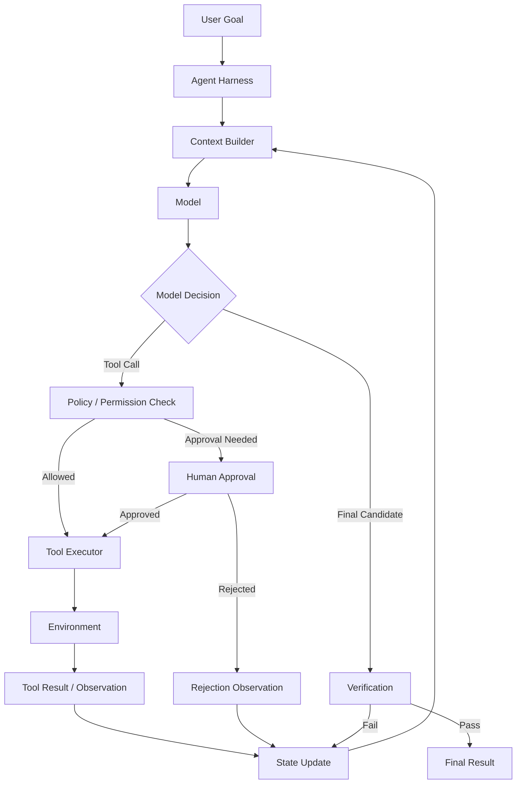
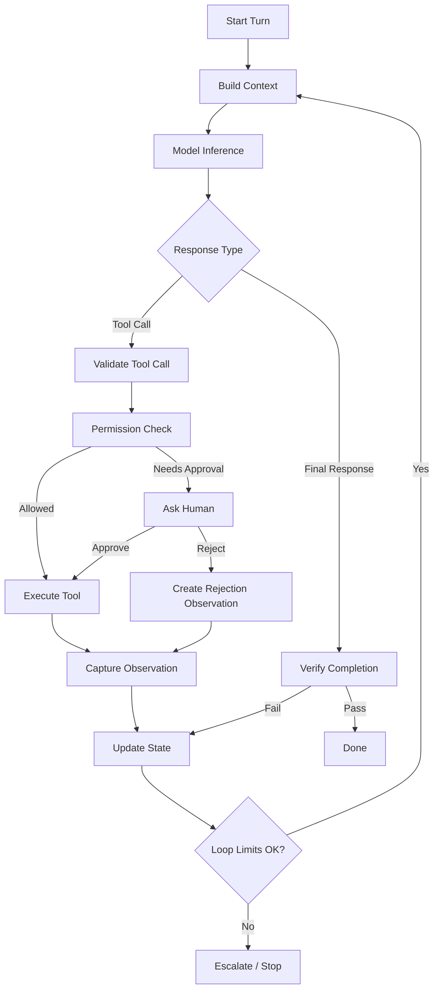
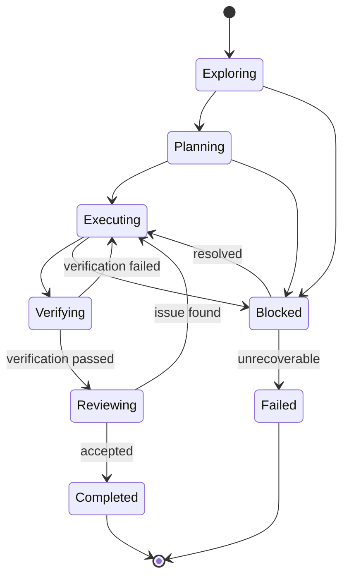
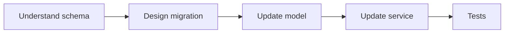
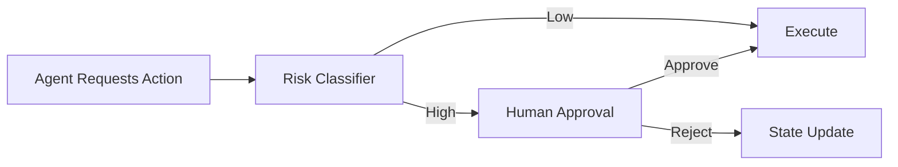
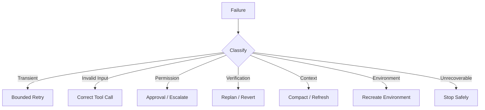
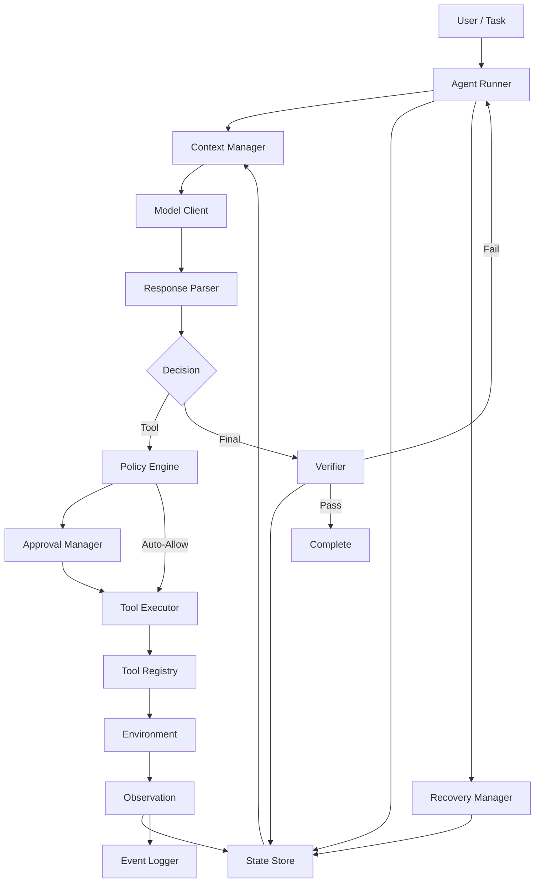
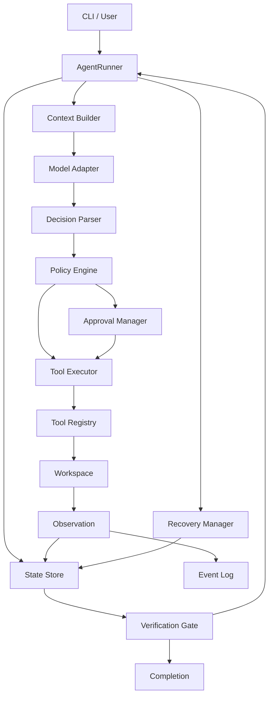
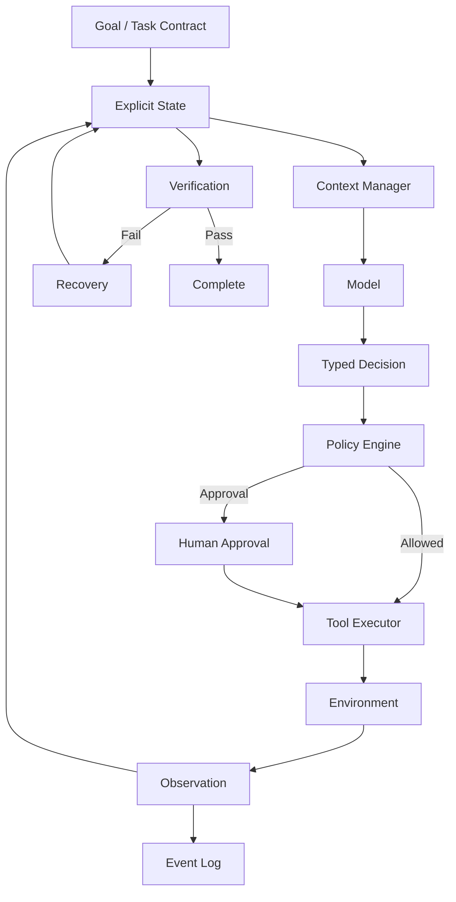

# Phase 4 — Agentic AI Fundamentals

> **Track:** AI-Powered Software Development / Agentic Software Engineering  
> **Prerequisites:**  
> - Phase 1 — Generative AI for Software Engineers  
> - Phase 2 — Prompt Engineering for Software Development  
> - Phase 3 — Context Engineering for Software Development  
>
> **Phase goal:** Understand how a real AI agent operates as an engineered execution system: how it interprets a goal, reasons over context, chooses tools, maintains state, plans work, performs actions, observes results, verifies progress, requests approvals, respects permissions, detects failure, and recovers safely.

---

# Table of Contents

1. [How to Study This Phase](#how-to-study-this-phase)
2. [Learning Objectives](#learning-objectives)
3. [The Core Transition](#the-core-transition)
4. [The Agent Mental Model](#the-agent-mental-model)
5. [Module 29 — AI Agent Fundamentals](#module-29--ai-agent-fundamentals)
6. [Module 30 — Agent Loop Architecture](#module-30--agent-loop-architecture)
7. [Module 31 — Observe → Reason → Act → Observe](#module-31--observe--reason--act--observe)
8. [Module 32 — Tool Calling](#module-32--tool-calling)
9. [Module 33 — Agent State](#module-33--agent-state)
10. [Module 34 — Planning](#module-34--planning)
11. [Module 35 — Task Execution](#module-35--task-execution)
12. [Module 36 — Reflection and Verification](#module-36--reflection-and-verification)
13. [Module 37 — Human-in-the-Loop Systems](#module-37--human-in-the-loop-systems)
14. [Module 38 — Agent Permissions and Approval Gates](#module-38--agent-permissions-and-approval-gates)
15. [Module 39 — Agent Failure Recovery](#module-39--agent-failure-recovery)
16. [Agent Harness Architecture](#agent-harness-architecture)
17. [Agent Control Flow Patterns](#agent-control-flow-patterns)
18. [Tool Design for Software Agents](#tool-design-for-software-agents)
19. [Planning and Execution Strategies](#planning-and-execution-strategies)
20. [Verification Architecture](#verification-architecture)
21. [Safety, Permissions, and Trust Boundaries](#safety-permissions-and-trust-boundaries)
22. [Failure Taxonomy and Recovery Playbooks](#failure-taxonomy-and-recovery-playbooks)
23. [Practical Python Agent Implementations](#practical-python-agent-implementations)
24. [Worked Software Engineering Case Studies](#worked-software-engineering-case-studies)
25. [Agent Anti-Patterns](#agent-anti-patterns)
26. [Practical Labs](#practical-labs)
27. [Review Questions](#review-questions)
28. [Scenario Exercises](#scenario-exercises)
29. [Phase Project — DevAgent Core](#phase-project--devagent-core)
30. [Phase 4 Completion Checklist](#phase-4-completion-checklist)
31. [Where This Leads Next](#where-this-leads-next)
32. [Reference Baseline](#reference-baseline)

---

# How to Study This Phase

The previous phases established three layers:

```text
Phase 1
What is the model?

Phase 2
How do I specify the task?

Phase 3
What information should the model receive?
```

Phase 4 adds the execution layer:

```text
What can the model do?
How does it choose actions?
How does it observe reality?
How does it maintain state?
How does it know whether work is complete?
How does it recover when something goes wrong?
```

This is the phase where a language model becomes part of a true **agent system**.

Do not think of an agent as:

```text
"an LLM with a long prompt"
```

A real agent is closer to:

```text
Model
+
Context Builder
+
State
+
Tools
+
Execution Environment
+
Planning
+
Verification
+
Permissions
+
Approvals
+
Recovery Logic
+
Stopping Rules
```

The model is the reasoning component.

The **agent harness** is the engineered system surrounding it.

---

# Learning Objectives

By the end of this phase, you should be able to:

1. Define an AI agent in engineering terms.
2. Distinguish:
   - LLM,
   - assistant,
   - tool-using assistant,
   - agent,
   - agent harness,
   - workflow.
3. Explain the agent loop.
4. Draw a full agent control flow.
5. Explain how inference and tool execution alternate.
6. Distinguish:
   - observation,
   - reasoning,
   - action,
   - result,
   - state update.
7. Design typed tools.
8. Define tool schemas.
9. Validate tool inputs and outputs.
10. Distinguish read-only from side-effecting tools.
11. Maintain explicit agent state.
12. Define task progress.
13. Represent:
   - assumptions,
   - evidence,
   - decisions,
   - blockers,
   - completed work.
14. Explain planning strategies.
15. Distinguish:
   - plan-first,
   - reactive,
   - hierarchical,
   - rolling-horizon planning.
16. Avoid rigid plans.
17. Execute tasks incrementally.
18. Use checkpoints.
19. Design verification loops.
20. Distinguish model confidence from execution evidence.
21. Implement reflection without endless self-critique.
22. Design human-in-the-loop systems.
23. Place approval gates at high-risk boundaries.
24. Design permission models.
25. Apply least privilege.
26. Use sandboxing.
27. Define action risk classes.
28. Detect and recover from:
   - tool errors,
   - invalid tool calls,
   - bad plans,
   - test failures,
   - context drift,
   - environment failures,
   - partial execution,
   - infinite loops.
29. Design stopping conditions.
30. Design retry policies.
31. Design escalation policies.
32. Implement a toy software agent in Python.
33. Build a state-machine agent.
34. Build a tool registry.
35. Build an approval layer.
36. Build a verification layer.
37. Build a recovery layer.
38. Produce an auditable agent execution trace.
39. Explain why autonomous execution requires stronger engineering controls than chat assistance.
40. Be ready to move into coding-agent mastery.

---

# The Core Transition

Phase 3:

```text
Goal
    ↓
Context Engineering
    ↓
Model has the right information
```

Phase 4:

```text
Goal
    ↓
Context
    ↓
Model chooses action
    ↓
Tool executes action
    ↓
Environment changes or returns evidence
    ↓
Model observes result
    ↓
State updates
    ↓
Repeat
```

The useful mental model is:

```text
User Goal
   ↓
Agent
   ↓
Understand Context
   ↓
Create / Update Plan
   ↓
Choose Action
   ↓
Use Tool
   ↓
Observe Result
   ↓
Update State
   ↓
Repeat
   ↓
Verify Result
   ↓
Finish or Escalate
```

---

# The Agent Mental Model

A complete agent can be visualized as:



The agent is not just:

```text
model → answer
```

It is a **closed-loop control system**.

---

# Module 29 — AI Agent Fundamentals

# 29.1 What Is an AI Agent?

There is no single universally accepted definition.

For this track, use this practical definition:

> **An AI agent is a software system that uses a model to repeatedly choose actions toward a goal, observes the results of those actions, updates its state, and continues until it reaches a stopping condition or requires escalation.**

The important characteristics are:

```text
goal
state
decision
action
observation
iteration
stopping condition
```

---

# 29.2 Assistant vs Agent

## Assistant

```text
User:
Explain this traceback.

Model:
Returns explanation.
```

No environmental action is required.

---

## Tool-Using Assistant

```text
User:
What tests failed?

Model:
Calls test-report tool.
Returns answer.
```

There may be one tool call, but the system may not be executing a longer autonomous task.

---

## Agent

```text
Goal:
Fix failing authentication test.

Agent:
1. runs test
2. reads failure
3. searches repository
4. reads implementation
5. edits source
6. reruns test
7. sees new failure
8. edits again
9. runs broader test suite
10. reviews diff
11. reports completion
```

This is multi-step execution.

---

# 29.3 Agent vs Workflow

A workflow has relatively predetermined control flow.

Example:

```text
upload file
→ parse
→ validate
→ store
```

An agent chooses actions dynamically.

```text
goal
→ inspect current state
→ decide next action
→ observe
→ decide again
```

A useful distinction:

```text
Workflow:
control logic mostly written by programmer

Agent:
some control decisions delegated to model
```

Real systems often combine both.

---

# 29.4 Deterministic Workflow + Agentic Step

Example:


The overall system is deterministic.

Only the review step is agentic/model-driven.

This is often safer than making everything autonomous.

---

# 29.5 Agent Autonomy Is a Spectrum

```text
Level 0:
Text suggestion only

Level 1:
Read-only tools

Level 2:
Run non-destructive commands

Level 3:
Edit local branch

Level 4:
Create commit / PR

Level 5:
Modify infrastructure or persistent systems

Level 6:
Deploy production
```

Higher autonomy requires stronger:

```text
permissions
approval controls
logging
verification
rollback
```

---

# 29.6 Agent Environment

An agent acts inside an environment.

For software development:

```text
filesystem
Git repository
shell
compiler
test runner
package manager
browser
database
cloud platform
issue tracker
CI/CD
```

The environment provides reality.

The model alone does not.

---

# 29.7 Agent Harness

The **harness** orchestrates:

```text
model calls
tools
state
context
permissions
sandbox
logs
retries
approvals
termination
```

A model may be extremely capable but perform poorly in a weak harness.

This is why modern agent engineering increasingly focuses on:

```text
harness design
```

not only model selection.

---

# 29.8 Agent Goal

A goal is the desired end state.

Example:

```text
Fix the bug where expired JWT tokens return HTTP 500.
```

The goal should be connected to measurable success.

Better:

```text
Expired access tokens must return the existing standardized HTTP 401
response, valid tokens must remain unchanged, and relevant tests must pass.
```

---

# 29.9 Agent Task Contract

A useful task contract contains:

```text
goal
constraints
acceptance criteria
allowed actions
approval boundaries
verification
definition of done
```

This comes directly from Phase 2.

---

# 29.10 Agent Context

The agent needs current information.

This comes from Phase 3.

```text
repository instructions
task spec
source files
tests
tool results
current state
```

Therefore:

```text
Agent Reliability
depends heavily on:

Prompt quality
+
Context quality
+
Tool quality
+
Verification quality
+
Permission design
```

---

# 29.11 Agent Output Is Not Only Text

A crucial idea.

For a coding agent, the primary output may be:

```text
modified files
new tests
Git commit
generated migration
updated documentation
```

The final assistant message is only a report.

Therefore:

```text
Agent output
=
environmental changes
+
final communication
```

---

# 29.12 Agent Success

Do not define success as:

```text
model emitted a final message
```

Define success as:

```text
desired state reached
+
constraints preserved
+
verification passed
```

---

# Module 30 — Agent Loop Architecture

# 30.1 The Simplest Agent Loop

Pseudocode:

```python
while True:
    response = model(context)

    if response.is_final:
        return response

    result = execute_tool(response.tool_call)
    context.append(result)
```

This captures the essence.

But production agents need much more.

---

# 30.2 Production Loop

A stronger loop:

```text
Build context
    ↓
Call model
    ↓
Parse model output
    ↓
Validate requested action
    ↓
Check permissions
    ↓
Request approval if needed
    ↓
Execute tool
    ↓
Validate tool result
    ↓
Update state
    ↓
Evaluate progress
    ↓
Compact context if needed
    ↓
Continue / verify / stop
```

---

# 30.3 Agent Loop Diagram



---

# 30.4 Model Response Types

A model may produce:

```text
final message
tool call
structured decision
clarification request
handoff
```

The harness must parse them correctly.

---

# 30.5 Turn vs Loop Iteration

One user turn may contain many agent-loop iterations.

Example:

```text
User message
  ↓
Inference 1
  ↓
Tool call
  ↓
Inference 2
  ↓
Tool call
  ↓
Inference 3
  ↓
Tool call
  ↓
Inference 4
  ↓
Final response
```

This is one conversational turn containing multiple model/tool cycles.

---

# 30.6 Agent Loop Invariant

Each iteration should preserve:

```text
goal
hard constraints
permission policy
current state
```

These should not disappear because context grows.

---

# 30.7 Loop Termination

Possible termination reasons:

```text
goal satisfied
human stopped task
approval rejected
retry limit reached
budget exhausted
unsafe condition detected
required information missing
unrecoverable environment failure
```

Termination should be explicit.

---

# 30.8 Infinite Loop Risk

Agent:

```text
run test
→ fail
→ same edit
→ run test
→ fail
→ same edit
...
```

Mitigation:

```text
iteration limit
same-action detection
failure fingerprinting
plan revision requirement
human escalation
```

---

# 30.9 Tool Call History

Track:

```text
tool
arguments
time
result
exit status
side effects
```

This supports:

```text
debugging
auditing
recovery
```

---

# 30.10 Agent Event Log

A durable event stream may look like:

```text
TaskStarted
ContextBuilt
ModelCalled
ToolRequested
ApprovalRequested
ApprovalGranted
ToolExecuted
TestFailed
FileModified
TestPassed
VerificationPassed
TaskCompleted
```

Event logs are excellent for resuming after crashes.

---

# Module 31 — Observe → Reason → Act → Observe

# 31.1 The Closed Loop

The fundamental loop is:

```text
Observe
   ↓
Reason
   ↓
Act
   ↓
Observe
   ↓
...
```

This resembles a feedback-control process.

---

# 31.2 Observation

An observation is evidence from the environment.

Examples:

```text
file contents
test failure
Git status
compiler error
HTTP response
database query result
browser screenshot
```

Observation should be distinguished from inference.

---

# 31.3 Reason

The model interprets current state.

Questions:

```text
What happened?
What does it mean?
What uncertainty remains?
What should happen next?
```

---

# 31.4 Act

An action changes or queries the environment.

Examples:

```text
read file
search repository
run command
edit file
create file
query API
```

---

# 31.5 New Observation

Every action should yield a result.

```text
command exit code
stdout
stderr
file diff
HTTP status
```

The result becomes new context.

---

# 31.6 Observation vs Assumption

Agent state should clearly distinguish:

```text
Observed:
pytest returns 1 failed.

Assumption:
failure likely caused by timezone mismatch.
```

Do not store assumptions as facts.

---

# 31.7 Observation Quality

Bad tool output:

```text
Command failed.
```

Better:

```json
{
  "exit_code": 1,
  "stdout": "...",
  "stderr": "...",
  "duration_ms": 482
}
```

Machine-legible observations improve agent performance.

---

# 31.8 Action Should Reduce Uncertainty

A strong action often answers a question.

Question:

```text
Does TokenService map ExpiredSignatureError?
```

Action:

```text
read TokenService
```

Question:

```text
Did fix work?
```

Action:

```text
run targeted test
```

This is efficient agent behavior.

---

# 31.9 Observe Before Acting

Poor agent:

```text
bug report
→ immediately edit code
```

Better:

```text
bug report
→ reproduce
→ inspect evidence
→ edit
```

The first action should often be information gathering.

---

# 31.10 Action-Observation Pair

Model actions as pairs:

```python
from dataclasses import dataclass
from typing import Any


@dataclass
class Action:
    name: str
    arguments: dict[str, Any]


@dataclass
class Observation:
    action: Action
    success: bool
    data: Any
    error: str | None = None
```

---

# 31.11 Observation Provenance

Record:

```text
which tool
which arguments
which environment
which time
```

A test result without command provenance is less useful.

---

# 31.12 Evidence Accumulation

Agent may move from:

```text
low evidence
→ medium evidence
→ strong evidence
```

Example:

```text
Hypothesis:
auth error mapping broken.

Evidence 1:
traceback.

Evidence 2:
source inspection.

Evidence 3:
regression test fails before fix.

Evidence 4:
test passes after fix.
```

---

# Module 32 — Tool Calling

# 32.1 What Is a Tool?

A tool is a capability exposed by the harness to the model.

Examples:

```text
read_file
search_repository
run_shell
write_file
git_diff
query_database
call_api
browser
```

The model does not directly execute them.

It requests them.

The harness performs execution.

---

# 32.2 Tool Definition

A tool needs:

```text
name
description
input schema
output contract
error behavior
side-effect classification
permission requirement
```

---

# 32.3 Example Tool Schema

Conceptual:

```python
from pydantic import BaseModel, Field


class ReadFileInput(BaseModel):
    path: str
    start_line: int | None = Field(default=None, ge=1)
    end_line: int | None = Field(default=None, ge=1)
```

---

# 32.4 Tool Description Matters

Weak:

```text
read_file:
Reads files.
```

Better:

```text
read_file:
Read UTF-8 text from a repository file.
Use for known paths.
Returns numbered lines.
Does not modify the filesystem.
Fails if the path is outside the workspace.
```

The description teaches:

```text
when
what
limits
effects
```

---

# 32.5 Tool Input Validation

Never trust generated arguments automatically.

Example:

```python
request = ReadFileInput.model_validate(
    model_arguments
)
```

Then enforce workspace boundary.

---

# 32.6 Path Traversal Protection

```python
from pathlib import Path


WORKSPACE = Path("/workspace").resolve()


def safe_path(raw: str) -> Path:
    candidate = (
        WORKSPACE / raw
    ).resolve()

    if WORKSPACE not in candidate.parents and candidate != WORKSPACE:
        raise ValueError(
            "Path escapes workspace."
        )

    return candidate
```

---

# 32.7 Read Tools vs Write Tools

Read-only:

```text
read file
search
Git log
status
query metrics
```

Side-effecting:

```text
write file
delete file
install dependency
push commit
deploy
write database
```

Side-effecting tools require stricter policy.

---

# 32.8 Tool Risk Classification

Example:

| Tool | Risk |
|---|---|
| `read_file` | Low |
| `search_repo` | Low |
| `run_tests` | Low–Medium |
| `write_file` | Medium |
| `install_package` | Medium–High |
| `git_push` | High |
| `db_write` | High |
| `deploy_prod` | Critical |

Risk depends on environment.

---

# 32.9 Tool Output Contract

Return structured results.

```python
class ShellResult(BaseModel):
    command: str
    exit_code: int
    stdout: str
    stderr: str
    duration_ms: int
```

---

# 32.10 Tool Errors Are Observations

If tool fails:

```text
Permission denied
```

the harness should return that failure to the model.

Do not hide it.

The model may choose:

```text
different action
request approval
escalate
```

---

# 32.11 Tool Selection

Tool selection is itself a reasoning task.

Question:

```text
Need current package version.
```

Best tool:

```text
inspect package manager / manifest
```

not:

```text
web search
```

unless runtime state is unavailable.

---

# 32.12 Too Many Tools

A catalog of hundreds of tools can create:

```text
context overhead
wrong-tool selection
parameter mistakes
```

Modern systems may load/discover tools on demand.

Principle:

```text
minimum useful tool set
```

---

# 32.13 Direct vs Programmatic Tool Calling

Some workflows require model judgment between each tool call.

Example:

```text
run test
→ inspect failure
→ decide next test
```

Direct iterative calls are appropriate.

Other workflows are bounded and mechanical:

```text
fetch 30 files
filter
deduplicate
aggregate
return summary
```

These can be performed programmatically when supported.

The principle:

```text
Use deterministic code for predictable orchestration.
Use model reasoning when semantic judgment is needed.
```

---

# 32.14 Tool Idempotency

A tool is idempotent when repeating the same operation has the same intended effect.

Read tool:

```text
usually idempotent
```

Create payment:

```text
not automatically idempotent
```

Agent retries must account for this.

---

# 32.15 Tool Retry Policy

Do not blindly retry all failures.

Classify:

```text
transient
validation
permission
business
destructive
```

Transient:

```text
network timeout
```

may be retried.

Validation:

```text
invalid argument
```

should be corrected first.

Permission:

```text
access denied
```

may require approval or escalation.

---

# 32.16 Tool Timeout

Every external action should have timeout policy.

Example:

```python
subprocess.run(
    command,
    timeout=60,
)
```

Otherwise a tool can block the agent indefinitely.

---

# Module 33 — Agent State

# 33.1 Why State Matters

Without explicit state, the agent must infer progress from conversation history.

That becomes unreliable in long tasks.

State should answer:

```text
What is the goal?
What has been completed?
What changed?
What evidence exists?
What remains?
What is blocked?
```

---

# 33.2 Minimal Agent State

```python
from dataclasses import dataclass, field


@dataclass
class AgentState:
    goal: str
    status: str = "running"
    completed_steps: list[str] = field(default_factory=list)
    pending_steps: list[str] = field(default_factory=list)
    observations: list[str] = field(default_factory=list)
    files_changed: list[str] = field(default_factory=list)
    risks: list[str] = field(default_factory=list)
```

---

# 33.3 State vs Context

State is structured task information.

Context is what the model sees.

State may be rendered into context.

```text
Agent State
    ↓
Context Builder
    ↓
Model
```

---

# 33.4 State Fields

Useful categories:

```text
goal
constraints
acceptance criteria
plan
current step
completed work
files read
files changed
tool history
verification
assumptions
decisions
blockers
risks
budget
```

---

# 33.5 State Machine



---

# 33.6 State Transition Validation

Do not allow arbitrary transitions.

Example:

```text
Planning
→ Completed
```

without execution/verification may be invalid.

---

# 33.7 Pydantic State Model

```python
from typing import Literal
from pydantic import BaseModel, Field


AgentStatus = Literal[
    "exploring",
    "planning",
    "executing",
    "verifying",
    "blocked",
    "completed",
    "failed",
]


class AgentStateModel(BaseModel):
    goal: str
    status: AgentStatus
    iteration: int = Field(ge=0)
    completed: list[str]
    pending: list[str]
    blockers: list[str]
    verification: list[str]
```

---

# 33.8 State Should Contain Evidence, Not Only Narrative

Weak:

```text
"Things are going well."
```

Better:

```text
targeted auth tests:
84 passed

full suite:
not run
```

---

# 33.9 State Checkpoint

Persist state periodically.

This enables:

```text
resume after crash
context reset
handoff
audit
```

---

# 33.10 Durable Event Log vs Mutable State

Useful architecture:

```text
Event Log:
append-only history

Current State:
projection of latest events
```

Example events:

```text
TestRunCompleted
FileModified
ApprovalRejected
```

Current state is derived.

This is similar to event-sourced systems.

---

# 33.11 State Consistency

Agent should not say:

```text
status = completed
```

while:

```text
pending = ["run integration tests"]
```

Validate state invariants.

---

# 33.12 State Invariant Example

```python
def validate_state(state: AgentStateModel) -> None:
    if state.status == "completed" and state.pending:
        raise ValueError(
            "Completed state cannot have pending tasks."
        )
```

---

# Module 34 — Planning

# 34.1 Why Agents Plan

Complex goals need decomposition.

Example:

```text
Upgrade SQLAlchemy major version.
```

This may require:

```text
inspect dependency
read migration docs
find affected APIs
update code
update tests
run migrations
run full suite
```

Planning provides structure.

---

# 34.2 Plan Is Not Truth

A plan is a hypothesis about the future.

It should change when new evidence appears.

```text
Plan
    ↓
Action
    ↓
Observation
    ↓
Plan revision
```

---

# 34.3 Plan-First Strategy

Useful when:

```text
task is complex
change surface large
dependencies important
```

Workflow:

```text
explore
→ plan
→ execute
```

---

# 34.4 Reactive Strategy

Useful for small/debugging tasks.

```text
observe
→ act
→ observe
```

No elaborate upfront plan required.

---

# 34.5 Rolling-Horizon Planning

Plan the next few meaningful steps.

Then revise.

Example:

```text
Current horizon:
1. reproduce bug
2. inspect service
3. inspect failing test

After that:
replan based on evidence.
```

This avoids overplanning uncertain tasks.

---

# 34.6 Hierarchical Planning

High-level:

```text
1. analyze
2. implement
3. verify
```

Detailed subplan:

```text
Implement:
- update repository
- update service
- update API
```

---

# 34.7 Dependency-Aware Planning

Represent dependencies.



---

# 34.8 Plan Quality

A useful plan step should have:

```text
purpose
expected evidence
completion condition
dependencies
```

Example:

```text
Step:
Reproduce expired-token bug.

Action:
Run `pytest tests/auth/test_token.py -k expired`.

Expected evidence:
Current behavior returns 500.

Done when:
Failure is reproduced or discrepancy is documented.
```

---

# 34.9 Plan Drift

If current evidence invalidates step 4:

```text
remove or replace it
```

Do not execute because "it was in the plan."

---

# 34.10 Planning Failure Modes

```text
too much detail
too little detail
false assumptions
missing dependencies
no verification
no rollback
rigid execution
```

---

# 34.11 Planning Budget

Planning itself consumes:

```text
tokens
latency
reasoning
```

Do not create a 50-step plan for a one-line typo.

---

# 34.12 Plan Representation

```python
from dataclasses import dataclass


@dataclass
class PlanStep:
    id: str
    goal: str
    depends_on: list[str]
    verification: str
    status: str = "pending"
```

---

# Module 35 — Task Execution

# 35.1 Execution Is Controlled Change

Execution is where the agent converts decisions into environmental actions.

Examples:

```text
edit source
run test
install dependency
update configuration
create migration
```

This is where risk becomes real.

---

# 35.2 Small-Step Execution

Prefer:

```text
small change
→ verify
→ next change
```

over:

```text
modify 30 files
→ test at end
```

Small steps make failure attribution easier.

---

# 35.3 Atomic Work Units

A work unit should ideally be:

```text
cohesive
reversible
verifiable
```

Example:

```text
Add regression test for expired token.
```

Then:

```text
Implement error mapping.
```

---

# 35.4 Precondition Checks

Before action:

```text
Is repository clean?
Is branch correct?
Is dependency available?
Is required approval granted?
```

---

# 35.5 Postcondition Checks

After action:

```text
Did file change as intended?
Did command succeed?
Did migration apply?
Did tests pass?
```

---

# 35.6 Execution Guard

```python
from dataclasses import dataclass


@dataclass
class ExecutionPolicy:
    allow_file_write: bool
    allow_shell: bool
    allow_dependency_install: bool
    allow_git_push: bool
```

Tool executor checks policy.

---

# 35.7 Change Scope

Track permitted files.

Example:

```text
allowed:
app/auth/*
tests/auth/*

approval required:
pyproject.toml
migrations/*
```

This reduces accidental scope expansion.

---

# 35.8 Diff Inspection

After edits:

```bash
git diff --stat
git diff
```

Agent should verify:

```text
what actually changed
```

not only what it intended to change.

---

# 35.9 Incremental Commit Strategy

For long work, clean commits can create recovery points.

Example:

```text
commit 1:
add characterization tests

commit 2:
refactor service

commit 3:
update API
```

Whether agents may commit depends on permission policy.

---

# 35.10 Execution Trace

Record:

```text
action
arguments
before state
result
after state
```

Important for side-effecting tools.

---

# 35.11 Avoid Unnecessary Side Effects

If task only needs read access:

```text
do not install packages
do not edit files
```

Agents should use the least invasive action.

---

# Module 36 — Reflection and Verification

# 36.1 Reflection vs Verification

Reflection:

```text
model evaluates its own work
```

Verification:

```text
system gathers independent evidence
```

Verification is stronger.

---

# 36.2 Self-Reflection

Example:

```text
"Review your proposed change for overlooked edge cases."
```

Useful for:

```text
candidate generation
consistency checking
```

But it remains model judgment.

---

# 36.3 Deterministic Verification

Examples:

```text
compiler
tests
linter
type checker
schema validator
security scanner
```

These provide external evidence.

---

# 36.4 Independent Model Verification

Another agent/model can review the work.

This may reduce some shared bias, especially with context isolation.

But it is still probabilistic.

---

# 36.5 Verification Ladder

```text
Self-reflection
    ↓
Static analysis
    ↓
Unit tests
    ↓
Integration tests
    ↓
End-to-end tests
    ↓
Independent review
    ↓
Staging / telemetry
```

Choose appropriate levels based on risk.

---

# 36.6 Verification Must Match Requirement

Requirement:

```text
button works in browser
```

Unit test alone may be insufficient.

Need:

```text
browser / end-to-end test
```

Requirement:

```text
endpoint enforces tenant isolation
```

Need:

```text
cross-tenant integration test
```

Verification should test real behavior.

---

# 36.7 Test-Shaped Cheating

An agent can accidentally overfit to a test.

Example:

```python
if project_id == TEST_PROJECT_ID:
    return expected
```

Tests pass, requirements fail.

Therefore verify general behavior.

---

# 36.8 Reflection Loop Limit

Do not run:

```text
reflect
→ reflect
→ reflect
→ reflect forever
```

Set a limit.

Use reflection when it can produce a concrete new check or action.

---

# 36.9 Verification Failure

If verification fails:

```text
do not simply mark task complete
```

Update state:

```text
status = executing
failure = ...
```

Then replan.

---

# 36.10 Evidence Report

Final response should include:

```text
tests run
commands
results
remaining unverified areas
```

---

# 36.11 Completion Gate

Pseudo:

```python
def can_complete(
    *,
    acceptance_met: bool,
    tests_pass: bool,
    blockers: list[str],
) -> bool:
    return (
        acceptance_met
        and tests_pass
        and not blockers
    )
```

Real policies can be more complex.

---

# Module 37 — Human-in-the-Loop Systems

# 37.1 Why Humans Remain in the Loop

Some decisions involve:

```text
business judgment
irreversible effects
security risk
ambiguity
legal/accountability concerns
```

The agent should not infer authority it does not have.

---

# 37.2 Human-in-the-Loop Is Not "Human Reviews Everything"

That would remove much of the benefit.

Place humans at high-value boundaries.

Examples:

```text
approve migration
approve new dependency
approve production deployment
resolve requirement conflict
approve data deletion
```

---

# 37.3 Approval Gate



---

# 37.4 Approval Request Quality

Bad:

```text
Can I continue?
```

Better:

```text
Approval requested:
Add Alembic migration introducing nullable `archived_at`.

Reason:
Current schema cannot represent archive state.

Impact:
Adds nullable column only; no destructive changes.

Rollback:
Drop column before application begins writing it.

Verification:
Migration upgrade/downgrade tests.

Approve?
```

Human needs context.

---

# 37.5 Human Decisions Become State

Approval:

```text
approved migration
```

should be recorded.

Rejection:

```text
do not change schema
```

should also become state/constraint.

---

# 37.6 Human Correction

Human may say:

```text
Do not use archived_at; use existing status enum.
```

Agent must:

```text
update plan
invalidate conflicting assumptions
continue
```

---

# 37.7 Escalation

When agent cannot safely proceed:

```text
escalate
```

Examples:

```text
conflicting requirements
missing credential
ambiguous data deletion
production-only failure
```

---

# 37.8 Human Review vs Approval

Review:

```text
evaluate work after action
```

Approval:

```text
authorize action before it occurs
```

These are different control points.

---

# Module 38 — Agent Permissions and Approval Gates

# 38.1 Capability Does Not Equal Permission

A tool may exist.

That does not mean the agent may always use it.

```text
tool capability:
deploy_prod()

permission:
requires human approval
```

---

# 38.2 Least Privilege

Grant only what the task requires.

Documentation task:

```text
read repo
edit docs
run docs tests
```

Does not need:

```text
database write
cloud admin
production deploy
```

---

# 38.3 Permission Layers

```text
tool available?
    ↓
user/task authorized?
    ↓
arguments safe?
    ↓
approval required?
    ↓
execution environment permits?
```

---

# 38.4 Filesystem Permissions

Example:

```text
Read:
workspace/**

Write:
workspace/src/**
workspace/tests/**

Forbidden:
~/.ssh/**
.env
system files
```

---

# 38.5 Network Permissions

Possible policy:

```text
allow:
package registry
approved docs

block:
arbitrary external hosts
```

Network egress matters because code/tool output may be untrusted.

---

# 38.6 Shell Permissions

Not all shell commands have equal risk.

Low:

```text
pytest
ruff
git diff
```

Medium:

```text
pip install
npm install
```

High:

```text
rm -rf
git push --force
terraform apply
```

---

# 38.7 Command Allowlist / Denylist

Simple approach:

```python
SAFE_COMMAND_PREFIXES = {
    "pytest",
    "ruff",
    "pyright",
    "git status",
    "git diff",
}
```

But string allowlists are not sufficient for complex shells.

Strong systems use sandboxing and structured execution.

---

# 38.8 Sandbox

A sandbox limits damage.

Possible restrictions:

```text
isolated filesystem
limited CPU/memory
no production credentials
restricted network
ephemeral environment
```

Coding agents should ideally run untrusted generated code in controlled environments.

---

# 38.9 Credential Separation

Do not place powerful credentials in the same environment as arbitrary generated code unless required.

Strong architecture:

```text
Agent Workspace
    ↓
Brokered Tool
    ↓
Privileged System
```

The agent requests a narrow operation instead of possessing raw credential.

---

# 38.10 Approval Policies

Example:

```text
Read file:
auto

Run tests:
auto

Edit source:
auto on feature branch

Add dependency:
approval

DB migration:
approval

Push branch:
approval

Merge:
human review

Production deploy:
separate release approval
```

---

# 38.11 Risk-Based Policy

Risk may depend on:

```text
action type
target environment
reversibility
data sensitivity
blast radius
```

Deleting temp file in sandbox differs from deleting production table.

---

# 38.12 Permission Denial Is an Observation

If action rejected:

```text
Do not retry the same forbidden action forever.
```

Update state and choose another plan.

---

# Module 39 — Agent Failure Recovery

# 39.1 Failure Is Normal

Agents interact with:

```text
tools
networks
filesystems
dependencies
tests
humans
```

Failures are inevitable.

Design for recovery.

---

# 39.2 Failure Taxonomy

Major categories:

```text
model decision failure
tool argument failure
tool execution failure
environment failure
permission failure
verification failure
plan failure
context failure
state corruption
budget exhaustion
```

---

# 39.3 Tool Argument Failure

Example:

```text
read_file(path=null)
```

Recovery:

```text
return validation error
model corrects arguments
```

Do not execute invalid input.

---

# 39.4 Tool Execution Failure

Example:

```text
pytest command not found
```

Agent investigates:

```text
wrong environment?
missing dependency?
wrong command?
```

---

# 39.5 Transient Failure

Example:

```text
network timeout
```

May use bounded retry.

```text
retry up to N times
with backoff
```

---

# 39.6 Non-Transient Failure

Example:

```text
403 permission denied
```

Retrying is unlikely to help.

Escalate or change plan.

---

# 39.7 Verification Failure

Tests fail after edit.

Recovery:

```text
capture failure
compare before/after
diagnose
revert or revise
```

---

# 39.8 Bad Plan

Evidence shows plan assumption false.

Recovery:

```text
pause execution
update plan
discard invalid steps
continue
```

---

# 39.9 Partial Execution

Example:

```text
migration file written
model file updated
tests not updated
agent crashes
```

Recovery requires durable state.

On restart:

```text
inspect Git diff
read checkpoint
run tests
continue
```

---

# 39.10 Environment Crash

A sandbox/container may die.

If agent state and event log are external:

```text
create new environment
restore repository state
resume from durable event/checkpoint
```

---

# 39.11 Context Exhaustion

When context becomes too large:

```text
compact
or
handoff to fresh context
```

Preserve:

```text
goal
constraints
current state
decisions
evidence
next step
```

---

# 39.12 Loop Stagnation

Detect repeated action signatures.

Example:

```text
same tool
same arguments
same error
3 times
```

Then:

```text
force replan or escalate
```

---

# 39.13 Retry Budget

```python
from dataclasses import dataclass


@dataclass
class RetryPolicy:
    max_attempts: int = 3
    retry_transient_only: bool = True
```

---

# 39.14 Exponential Backoff

Educational:

```python
import time


def retry_with_backoff(
    fn,
    attempts: int = 3,
):
    delay = 1.0

    for attempt in range(attempts):
        try:
            return fn()
        except TimeoutError:
            if attempt == attempts - 1:
                raise

            time.sleep(delay)
            delay *= 2
```

Do not use retries for non-idempotent side effects without safeguards.

---

# 39.15 Rollback

For reversible actions:

```text
edit file
→ test fails badly
→ git restore file
```

For migrations:

```text
rollback may be complicated
```

Plan reversibility in advance.

---

# 39.16 Known-Good Checkpoints

Long tasks benefit from known-good states.

```text
commit
checkpoint
tests passing
```

If future work fails:

```text
return to checkpoint
```

---

# 39.17 Recovery Decision Tree



---

# Agent Harness Architecture

# 40.1 Components

A robust harness may include:

```text
Agent Runner
Model Client
Context Manager
Tool Registry
Tool Executor
State Store
Planner
Policy Engine
Approval Manager
Verifier
Recovery Manager
Event Logger
Budget Manager
```

---

# 40.2 Architecture Diagram



---

# 40.3 Separation of Responsibilities

Do not place everything inside one giant loop function.

Example boundaries:

```text
Tool Registry:
What capabilities exist?

Policy Engine:
May this action happen?

Tool Executor:
Actually execute.

State Store:
What is current task state?

Verifier:
Is task complete?

Recovery Manager:
What happens after failure?
```

This makes the agent testable.

---

# Agent Control Flow Patterns

# 41.1 ReAct-Like Pattern

Conceptually:

```text
reason
→ act
→ observe
→ reason
```

Useful for exploratory tasks.

---

# 41.2 Plan-and-Execute

```text
plan
→ execute steps
→ verify
```

Useful for structured tasks.

Risk:

```text
stale plan
```

Use replanning.

---

# 41.3 Planner + Executor

Separate roles.

```text
Planner:
creates tasks

Executor:
performs next task

Verifier:
checks result
```

This separation can improve structure.

---

# 41.4 State-Machine Agent

Transitions are explicit.

Good for:

```text
business workflows
high reliability
approval-heavy systems
```

---

# 41.5 Deterministic Shell Around Model

Strong pattern:

```text
deterministic state machine
+
model decisions at selected nodes
```

Example:

```text
always run tests after file changes
```

Do not ask model whether tests are necessary every time.

Encode required behavior in harness.

---

# 41.6 Reflection Loop

```text
execute
→ inspect result
→ critique
→ revise
```

Limit iterations.

---

# 41.7 Reviewer Agent

Separate verification model.

```text
developer agent
→ diff
→ reviewer agent
```

Useful when independent context is provided.

---

# Tool Design for Software Agents

# 42.1 Narrow Tools Beat Dangerous General Tools

Compare:

```text
run_shell(command: str)
```

vs:

```text
run_tests(path: str)
format_code(paths: list[str])
read_file(path)
```

Narrow tools are:

```text
safer
easier to validate
easier for model to select correctly
```

General shell tools are powerful but higher risk.

---

# 42.2 High-Level Domain Tools

Example:

```text
create_pull_request(
    title,
    body,
    branch
)
```

is safer than teaching the agent raw API details.

---

# 42.3 Tool Preconditions

A tool can enforce:

```text
workspace only
feature branch only
no force push
file size limit
```

Do not rely solely on prompt instructions.

---

# 42.4 Tool Postconditions

After `write_file`:

```text
return file hash
line count
diff summary
```

This helps verification.

---

# 42.5 Tool Error Taxonomy

Return machine-readable types:

```text
VALIDATION_ERROR
PERMISSION_DENIED
NOT_FOUND
TIMEOUT
CONFLICT
EXECUTION_ERROR
```

The model can reason better than with arbitrary prose.

---

# 42.6 Tool Example

```python
from typing import Literal
from pydantic import BaseModel


class ToolError(BaseModel):
    code: Literal[
        "VALIDATION_ERROR",
        "PERMISSION_DENIED",
        "NOT_FOUND",
        "TIMEOUT",
        "EXECUTION_ERROR",
    ]
    message: str
    retryable: bool
```

---

# Planning and Execution Strategies

# 43.1 Exploration Before Commitment

For uncertain tasks:

```text
explore
→ identify change surface
→ plan
→ execute
```

---

# 43.2 Test-Driven Execution

Bug:

```text
reproduce
→ failing test
→ fix
→ pass
```

Strong because progress is externally measurable.

---

# 43.3 Vertical-Slice Execution

Feature:

```text
one complete behavior
from input to persistence to response to tests
```

Better than creating every layer before any behavior works.

---

# 43.4 Checkpointed Long Work

```text
workstream
→ tests pass
→ checkpoint
→ next workstream
```

---

# 43.5 Parallelizable vs Sequential

Independent:

```text
documentation
backend
frontend
```

may run in parallel.

Dependent:

```text
schema
→ model
→ service
```

should often be sequential.

Phase 14 will go deeply into multi-agent parallelism.

---

# Verification Architecture

# 44.1 Verification Should Be Designed Before Execution

Ask:

```text
How will the agent know this is correct?
```

before writing code.

This often reveals missing tests.

---

# 44.2 Verification Contract

Example:

```text
Required:
- targeted unit tests
- integration tests
- ruff
- pyright
- Git diff inspection

Optional:
- full suite if runtime permits
```

---

# 44.3 Independent Evidence

Use:

```text
tests
compilers
type checkers
logs
screenshots
```

rather than model self-report.

---

# 44.4 Verification by Risk

Low-risk docs:

```text
link check
spell check
```

High-risk auth:

```text
unit
integration
security
cross-tenant
regression
```

---

# 44.5 Verifier Interface

```python
from typing import Protocol


class Verifier(Protocol):
    def verify(
        self,
        state: AgentStateModel,
    ) -> bool:
        ...
```

---

# 44.6 Multiple Verifiers

```text
TestVerifier
LintVerifier
TypeVerifier
ScopeVerifier
SecurityVerifier
```

All may contribute.

---

# Safety, Permissions, and Trust Boundaries

# 45.1 Three Boundaries

Think about:

```text
Information boundary
Action boundary
Authority boundary
```

Information:

```text
what agent may read
```

Action:

```text
what agent may execute
```

Authority:

```text
which actions require approval
```

---

# 45.2 Untrusted Code Execution

Generated code may be wrong or malicious.

Execute in sandbox.

---

# 45.3 Privileged Operations

Use narrow brokered tools.

Example:

```text
Agent
→ request "create staging deployment"
→ deployment service validates policy
→ performs action
```

Agent never receives full cloud credentials.

---

# 45.4 Auditability

Record:

```text
who requested task
which model
which tools
which actions
which approvals
which files changed
which tests ran
```

---

# Failure Taxonomy and Recovery Playbooks

# 46.1 Model Hallucination

Symptom:

```text
nonexistent API
```

Recovery:

```text
retrieve docs/runtime
correct assumption
retry implementation
```

---

# 46.2 Wrong Tool

Symptom:

```text
agent uses web search for local package version
```

Recovery:

```text
clarify tool descriptions
retrieve local environment
```

---

# 46.3 Invalid Arguments

Recovery:

```text
schema error returned
model retries corrected call
```

---

# 46.4 Repeated Failure

Recovery:

```text
detect fingerprint
force plan revision
```

---

# 46.5 Scope Creep

Symptom:

```text
agent changes unrelated files
```

Recovery:

```text
scope verifier
revert unrelated changes
tighten policy
```

---

# 46.6 Test Regression

Recovery:

```text
identify failing tests
compare changed behavior
fix or revert
```

---

# 46.7 Human Rejection

Recovery:

```text
record rejection as new constraint
replan
```

---

# 46.8 Budget Exhaustion

Budgets:

```text
iterations
tokens
time
tool calls
cost
```

If exceeded:

```text
checkpoint
stop or handoff
```

---

# 46.9 Environment Drift

Example:

```text
dependency changes during task
```

Recovery:

```text
refresh environment facts
invalidate stale context
```

---

# Practical Python Agent Implementations

# 47.1 Tool Protocol

```python
from typing import Any, Protocol


class Tool(Protocol):
    name: str

    def execute(
        self,
        arguments: dict[str, Any],
    ) -> Any:
        ...
```

---

# 47.2 Tool Registry

```python
class ToolRegistry:
    def __init__(self) -> None:
        self._tools: dict[str, Tool] = {}

    def register(self, tool: Tool) -> None:
        self._tools[tool.name] = tool

    def get(self, name: str) -> Tool:
        try:
            return self._tools[name]
        except KeyError as exc:
            raise ValueError(
                f"Unknown tool: {name}"
            ) from exc
```

---

# 47.3 Simple Read Tool

```python
from pathlib import Path


class ReadFileTool:
    name = "read_file"

    def __init__(
        self,
        workspace: Path,
    ) -> None:
        self.workspace = workspace.resolve()

    def execute(
        self,
        arguments: dict,
    ) -> dict:
        raw_path = arguments["path"]

        path = (
            self.workspace / raw_path
        ).resolve()

        if (
            path != self.workspace
            and self.workspace not in path.parents
        ):
            raise PermissionError(
                "Path outside workspace."
            )

        text = path.read_text(
            encoding="utf-8"
        )

        return {
            "path": str(path),
            "content": text,
        }
```

---

# 47.4 Shell Result

```python
class CommandResult(BaseModel):
    command: list[str]
    exit_code: int
    stdout: str
    stderr: str
```

---

# 47.5 Safe Test Tool

```python
import subprocess


class RunPytestTool:
    name = "run_pytest"

    def __init__(
        self,
        workspace: Path,
    ) -> None:
        self.workspace = workspace

    def execute(
        self,
        arguments: dict,
    ) -> dict:
        target = arguments.get(
            "target",
            "tests",
        )

        result = subprocess.run(
            [
                "python",
                "-m",
                "pytest",
                target,
                "-q",
            ],
            cwd=self.workspace,
            capture_output=True,
            text=True,
            timeout=120,
        )

        return {
            "exit_code": result.returncode,
            "stdout": result.stdout,
            "stderr": result.stderr,
        }
```

---

# 47.6 Agent Decision Model

```python
from typing import Literal


class ToolCallDecision(BaseModel):
    kind: Literal["tool"]
    tool: str
    arguments: dict


class FinalDecision(BaseModel):
    kind: Literal["final"]
    message: str
```

Real APIs may represent tool calls natively.

---

# 47.7 Policy Engine

```python
from enum import Enum


class RiskLevel(str, Enum):
    LOW = "low"
    MEDIUM = "medium"
    HIGH = "high"
    CRITICAL = "critical"


TOOL_RISK = {
    "read_file": RiskLevel.LOW,
    "search_repo": RiskLevel.LOW,
    "run_pytest": RiskLevel.LOW,
    "write_file": RiskLevel.MEDIUM,
    "install_package": RiskLevel.HIGH,
    "git_push": RiskLevel.HIGH,
    "deploy_prod": RiskLevel.CRITICAL,
}
```

---

# 47.8 Approval Decision

```python
def requires_approval(
    tool_name: str,
) -> bool:
    risk = TOOL_RISK[tool_name]

    return risk in {
        RiskLevel.HIGH,
        RiskLevel.CRITICAL,
    }
```

---

# 47.9 Event Model

```python
from datetime import datetime


class AgentEvent(BaseModel):
    timestamp: datetime
    event_type: str
    payload: dict
```

---

# 47.10 Agent Runner Skeleton

```python
class AgentRunner:
    def __init__(
        self,
        *,
        model,
        tools: ToolRegistry,
        state: AgentStateModel,
    ) -> None:
        self.model = model
        self.tools = tools
        self.state = state

    def run(self) -> str:
        while True:
            context = self.build_context()

            decision = self.model.decide(
                context
            )

            if decision.kind == "final":
                if self.verify_completion():
                    return decision.message

                self.state.status = "verifying"
                continue

            result = self.execute_tool(
                decision
            )

            self.update_state(
                decision,
                result,
            )
```

This is intentionally simplified.

---

# 47.11 Loop Limits

```python
MAX_ITERATIONS = 50


def run_with_limit(agent) -> str:
    for _ in range(MAX_ITERATIONS):
        result = agent.step()

        if result.done:
            return result.message

    raise RuntimeError(
        "Agent iteration limit exceeded."
    )
```

---

# 47.12 Repeated Action Detection

```python
import json
from collections import Counter


def action_signature(
    tool: str,
    arguments: dict,
) -> str:
    return json.dumps(
        {
            "tool": tool,
            "arguments": arguments,
        },
        sort_keys=True,
    )


def is_stuck(
    history: list[str],
    threshold: int = 3,
) -> bool:
    if not history:
        return False

    counts = Counter(history)

    return max(counts.values()) >= threshold
```

---

# 47.13 Retry Classifier

```python
def should_retry(
    *,
    error_code: str,
) -> bool:
    return error_code in {
        "TIMEOUT",
        "TEMPORARY_UNAVAILABLE",
    }
```

---

# Worked Software Engineering Case Studies

# Case Study 1 — Fix Expired JWT Handling

## Goal

```text
Expired access token returns 500.
Expected 401.
```

---

## Step 1 — Observe

Tool:

```text
run_pytest
```

Observation:

```text
Expected 401
Received 500
ExpiredSignatureError
```

State:

```text
bug reproduced
```

---

## Step 2 — Reason

Hypothesis:

```text
expiry exception not mapped to domain error
```

---

## Step 3 — Act

Tool:

```text
search_repo("ExpiredSignatureError")
```

Observation:

```text
no mapping in token service
```

---

## Step 4 — Plan

```text
1. add regression test
2. map exception
3. rerun targeted tests
4. run auth suite
5. inspect diff
```

---

## Step 5 — Execute

Write test.

Run.

Fail expectedly.

Edit token service.

---

## Step 6 — Verify

Targeted:

```text
12 passed
```

Auth suite:

```text
84 passed
```

---

## Step 7 — Reflect

Check:

```text
valid token path unchanged?
error message safe?
unrelated diff?
```

---

## Step 8 — Finish

Report:

```text
root cause
files changed
tests executed
remaining risk
```

---

# Case Study 2 — Dependency Upgrade Requires Approval

Goal:

```text
Upgrade package to address security advisory.
```

Agent discovers:

```text
new version requires major framework upgrade
```

This changes task scope.

Agent should not automatically:

```text
upgrade half repository
```

Instead:

```text
state blocker
prepare impact analysis
request human decision
```

Approval request:

```text
The security fix requires framework major upgrade.

Affected:
- API framework
- middleware
- test client

Options:
A. upgrade now
B. apply vendor backport
C. isolate vulnerable feature

Recommendation:
...

Approval requested before changing dependencies.
```

This is correct human-in-the-loop behavior.

---

# Case Study 3 — Agent Gets Stuck

Loop:

```text
run test
→ error A
edit X
run test
→ error A
edit X
run test
→ error A
```

Harness detects same action/error fingerprint.

Recovery:

```text
1. stop repeated edit
2. restore last known-good file if needed
3. require fresh hypothesis
4. inspect dependency/config
5. continue
```

If still stuck:

```text
escalate
```

---

# Case Study 4 — Partial Crash Recovery

Agent has:

```text
modified service
added test
not run full suite
```

Process crashes.

Durable artifacts:

```text
Git diff
event log
checkpoint
```

New harness resumes:

```text
read task contract
read checkpoint
inspect diff
run targeted tests
continue
```

No need to recreate entire conversation.

---

# Case Study 5 — High-Risk Migration

Goal:

```text
Make `organization_id` non-null.
```

Agent must not directly:

```text
ALTER COLUMN SET NOT NULL
```

without checking existing data.

Safe plan:

```text
1. inspect null count
2. design backfill
3. approval
4. backfill
5. verify zero nulls
6. add constraint
7. rollback plan
```

Human approval required before persistent database changes.

---

# Agent Anti-Patterns

# Anti-Pattern 1 — LLM as the Entire Agent

```text
while True:
    print(model(prompt))
```

No tools, state, verification, policy.

Not a robust agent.

---

# Anti-Pattern 2 — Unlimited Shell

Give model unrestricted root shell with production credentials.

Extremely risky.

---

# Anti-Pattern 3 — No Stopping Condition

Agent can loop indefinitely.

---

# Anti-Pattern 4 — Retry Everything

Can duplicate side effects.

---

# Anti-Pattern 5 — Trust Final Message

```text
"All tests pass."
```

without tool evidence.

---

# Anti-Pattern 6 — Plan Once, Never Replan

Plans become stale.

---

# Anti-Pattern 7 — Reflect Forever

Self-critique without new evidence wastes tokens.

---

# Anti-Pattern 8 — Human Approval for Every Action

Destroys autonomy and usability.

Approve high-risk boundaries.

---

# Anti-Pattern 9 — No Human Approval Anywhere

Unsafe for high-impact operations.

---

# Anti-Pattern 10 — Tool Descriptions Without Error Contracts

Model cannot reason about failure.

---

# Anti-Pattern 11 — Unstructured State

Conversation history becomes the only memory.

---

# Anti-Pattern 12 — No Crash Recovery

Long task lost when process exits.

---

# Anti-Pattern 13 — Side Effects Before Observation

Agent edits before reproducing bug.

---

# Anti-Pattern 14 — Broad Permissions by Default

Violates least privilege.

---

# Anti-Pattern 15 — Model Decides Security Policy

Policy belongs in deterministic harness/configuration.

---

# Practical Labs

# Lab 1 — Build a Toy Agent Loop

Implement:

```text
state
→ model decision
→ tool execution
→ observation
→ repeat
```

Use a fake model first.

---

# Lab 2 — Tool Registry

Implement:

```text
read_file
search_repo
run_pytest
```

Register dynamically.

---

# Lab 3 — Typed Tool Inputs

Use Pydantic for every tool input.

Test invalid inputs.

---

# Lab 4 — Workspace Boundary

Attempt:

```text
../../etc/passwd
```

Verify read tool rejects it.

---

# Lab 5 — Tool Error Types

Implement:

```text
NOT_FOUND
PERMISSION_DENIED
TIMEOUT
```

Return structured errors.

---

# Lab 6 — Observe-Reason-Act Trace

For a simple bug, record every:

```text
observation
hypothesis
action
result
```

---

# Lab 7 — Agent State Machine

Implement states:

```text
exploring
planning
executing
verifying
completed
failed
```

Validate transitions.

---

# Lab 8 — State Invariants

Prevent:

```text
completed + pending tasks
```

---

# Lab 9 — Plan Model

Create typed plan steps with dependencies.

---

# Lab 10 — Rolling-Horizon Plan

Plan only next 3 steps.

Update after observation.

---

# Lab 11 — Verification Gate

Agent may not complete unless:

```text
required tests pass
```

---

# Lab 12 — Reflection Limit

Allow at most:

```text
2 reflection cycles
```

before requiring new evidence or stop.

---

# Lab 13 — Approval Gate

Require human approval for:

```text
install_package
```

Auto-allow:

```text
read_file
run_pytest
```

---

# Lab 14 — Approval Rejection

Reject a dependency change.

Ensure agent updates plan.

---

# Lab 15 — Retry Policy

Simulate timeout.

Retry three times.

Then stop.

---

# Lab 16 — Non-Retryable Error

Simulate permission denied.

Ensure no blind retry.

---

# Lab 17 — Loop Detection

Repeat same action three times.

Trigger replan.

---

# Lab 18 — Crash Recovery

Persist state to JSON.

Stop process.

Reload and continue.

---

# Lab 19 — Event Log

Record every tool/action event.

Reconstruct state.

---

# Lab 20 — Known-Good Checkpoint

Create a checkpoint after tests pass.

Introduce bad edit.

Recover.

---

# Lab 21 — Scope Guard

Task permits:

```text
app/auth/*
tests/auth/*
```

Attempt to edit:

```text
payments/*
```

Reject.

---

# Lab 22 — Sandbox Simulation

Run generated Python inside a temporary directory.

Restrict accessible files.

---

# Lab 23 — Evidence Report

Final output must include:

```text
commands
exit codes
files changed
remaining risk
```

---

# Lab 24 — Human-in-the-Loop Migration

Design an approval request for schema migration.

---

# Lab 25 — Independent Reviewer

Developer agent changes code.

Reviewer receives:

```text
spec
diff
test results
```

not developer reasoning.

---

# Lab 26 — Tool Catalog Reduction

Create 20 fake tools.

Compare model/tool routing with:

```text
all tools
vs
5 relevant tools
```

---

# Lab 27 — Direct vs Programmatic Tool Use

Task:

```text
read 20 JSON files
deduplicate IDs
```

Implement deterministically.

Compare with one-model-call-per-file design.

---

# Lab 28 — Partial Failure

Tool writes first file then fails on second.

Design recovery.

---

# Lab 29 — Task Budget

Set:

```text
max iterations
max tool calls
max runtime
```

Stop gracefully.

---

# Lab 30 — Full Bug-Fixing Agent

Goal:

```text
reproduce
diagnose
edit
test
verify
```

Build end-to-end.

---

# Review Questions

1. What is an AI agent?
2. What distinguishes an agent from an assistant?
3. What is an agent harness?
4. Why is the model not the whole agent?
5. What is the difference between agent and workflow?
6. What is autonomy?
7. Why is autonomy a spectrum?
8. What is an agent environment?
9. What is an agent goal?
10. What makes a good agent task contract?
11. Why is final text not necessarily the primary agent output?
12. What defines agent success?
13. What is the agent loop?
14. What is one conversational turn?
15. Why can one turn contain many model calls?
16. What should remain invariant through the loop?
17. What are valid stopping reasons?
18. How do you detect infinite loops?
19. What is an observation?
20. How is observation different from assumption?
21. Why should actions reduce uncertainty?
22. Why observe before editing?
23. What is a tool?
24. What belongs in a tool definition?
25. Why validate tool inputs?
26. Why classify tools by side effects?
27. Why do tool descriptions matter?
28. Why should tool errors be returned to the model?
29. When should a tool call be retried?
30. Why can retries be dangerous?
31. What is tool idempotency?
32. Why do too many tools hurt?
33. What is agent state?
34. How is state different from context?
35. What belongs in state?
36. Why use state machines?
37. What are state invariants?
38. What is an event log?
39. Why separate mutable state from append-only events?
40. Why plan?
41. Why is a plan not truth?
42. What is rolling-horizon planning?
43. What is hierarchical planning?
44. What is plan drift?
45. Why should plans include verification?
46. Why execute in small steps?
47. What is an atomic work unit?
48. Why check preconditions?
49. Why inspect diffs?
50. What is reflection?
51. How is reflection different from verification?
52. Why is deterministic verification stronger?
53. Why should verification match real requirements?
54. What is test-shaped cheating?
55. Why limit reflection loops?
56. What is human-in-the-loop?
57. What is an approval gate?
58. Why should human review and approval be separated?
59. What makes a good approval request?
60. What is least privilege?
61. What are filesystem boundaries?
62. Why restrict network egress?
63. Why use sandboxes?
64. Why separate credentials from generated code?
65. What is a permission denial?
66. How should the agent react to rejection?
67. What is a failure taxonomy?
68. What is a transient failure?
69. What is a non-transient failure?
70. How do you recover from bad plan?
71. How do you recover from partial execution?
72. How do you recover after harness crash?
73. What is context exhaustion?
74. What is loop stagnation?
75. What is a retry budget?
76. What is rollback?
77. What is a known-good checkpoint?
78. What components belong in a robust harness?
79. Why separate policy engine from tool executor?
80. What should be deterministic rather than model-controlled?

---

# Scenario Exercises

# Scenario 1 — Dangerous Tool Call

Agent requests:

```text
rm -rf .
```

for a documentation task.

Explain:

```text
why policy should block
how state should update
whether human approval should even be offered
```

---

# Scenario 2 — Repeated Timeout

External API times out twice.

Design retry policy.

Discuss idempotency.

---

# Scenario 3 — Dependency Install

Agent wants a new package.

What should approval request contain?

---

# Scenario 4 — Test Failure After Refactor

Agent changed five files.

Targeted tests pass.

Full suite fails unrelated-looking test.

How should agent proceed?

---

# Scenario 5 — Context Reset

Long task reaches context limit.

What must be preserved for fresh agent?

---

# Scenario 6 — Human Rejects Migration

Agent must continue without schema change.

How does plan update?

---

# Scenario 7 — Verification Disagreement

Agent says:

```text
feature complete
```

but browser E2E fails.

Which signal wins?

---

# Scenario 8 — Partial Database Side Effect

Tool timed out after sending write request.

You do not know whether server committed.

Should agent retry?

Discuss idempotency and reconciliation.

---

# Scenario 9 — Wrong Tool Selection

Agent web-searches an API version despite local lockfile.

How would you improve harness/tool guidance?

---

# Scenario 10 — Reviewer Bias

Reviewer receives developer's statement:

```text
"This implementation is definitely safe."
```

Would isolated context improve review?

---

# Phase Project — DevAgent Core

# Project Goal

Build a small but architecturally serious Python coding-agent harness.

The project should demonstrate:

```text
goal
context
state
planning
tool calls
execution
observations
verification
permissions
approval
recovery
event logging
```

Do not attempt to build a production Codex clone.

Build the **core mechanics** correctly.

---

# Project Structure

```text
devagent-core/
├── README.md
├── pyproject.toml
├── AGENTS.md
├── examples/
│   └── broken_app/
├── src/
│   └── devagent/
│       ├── __init__.py
│       ├── runner.py
│       ├── models.py
│       ├── state.py
│       ├── events.py
│       ├── planner.py
│       ├── context.py
│       ├── tools/
│       │   ├── base.py
│       │   ├── registry.py
│       │   ├── read_file.py
│       │   ├── search_repo.py
│       │   ├── write_file.py
│       │   ├── run_pytest.py
│       │   └── git_diff.py
│       ├── policy/
│       │   ├── risk.py
│       │   ├── permissions.py
│       │   └── approvals.py
│       ├── verification/
│       │   ├── base.py
│       │   ├── tests.py
│       │   ├── scope.py
│       │   └── completion.py
│       ├── recovery/
│       │   ├── classifier.py
│       │   ├── retries.py
│       │   └── checkpoints.py
│       └── cli.py
└── tests/
    ├── test_tools.py
    ├── test_policy.py
    ├── test_state.py
    ├── test_runner.py
    ├── test_recovery.py
    └── test_verification.py
```

---

# Project Feature 1 — Agent Task

```python
class AgentTask(BaseModel):
    goal: str
    constraints: list[str]
    acceptance_criteria: list[str]
    allowed_paths: list[str]
    verification_commands: list[list[str]]
```

---

# Project Feature 2 — Agent State

```python
class AgentState(BaseModel):
    task: AgentTask
    status: AgentStatus
    iteration: int
    plan: list[PlanStep]
    observations: list[str]
    changed_files: list[str]
    verification_results: list[str]
    blockers: list[str]
    risks: list[str]
```

---

# Project Feature 3 — Tool Registry

Support:

```text
read_file
search_repo
write_file
run_pytest
git_diff
```

Every tool has:

```text
typed input
typed output
risk level
side-effect flag
```

---

# Project Feature 4 — Permission Policy

Example:

```text
read_file:
auto

search_repo:
auto

run_pytest:
auto

write_file:
allowed only inside allowed_paths

install_dependency:
not supported initially

git_push:
not supported
```

This keeps the project safe.

---

# Project Feature 5 — Approval Manager

Add one simulated approval-requiring action.

Example:

```text
write pyproject.toml
```

CLI asks:

```text
Agent requests modification of dependency file.

Reason:
...

Approve [y/N]?
```

---

# Project Feature 6 — Event Log

Persist JSONL:

```json
{"type":"task_started", ...}
{"type":"tool_requested", ...}
{"type":"tool_executed", ...}
{"type":"verification_completed", ...}
```

---

# Project Feature 7 — Checkpoint

Persist:

```text
state.json
```

after every meaningful action.

---

# Project Feature 8 — Resume

Command:

```bash
devagent resume state.json
```

Restore state and continue.

---

# Project Feature 9 — Loop Limits

Configuration:

```text
max_iterations = 30
max_same_action = 3
```

Stop safely if exceeded.

---

# Project Feature 10 — Recovery

Implement:

```text
TIMEOUT → bounded retry
INVALID_ARGUMENT → model correction
PERMISSION_DENIED → no retry
TEST_FAILURE → replan
LOOP_DETECTED → replan/escalate
```

---

# Project Feature 11 — Verification Gate

Task cannot become completed unless:

```text
required tests pass
no blockers
scope verifier passes
```

---

# Project Feature 12 — Scope Verifier

Compare Git diff paths to:

```text
allowed_paths
```

Reject completion if unrelated files changed.

---

# Project Feature 13 — Fake Model First

Before using real LLM API, create deterministic fake decisions.

Example:

```python
class FakeModel:
    def decide(self, state):
        ...
```

This allows harness tests without API calls.

---

# Project Feature 14 — Real Model Adapter

Later add:

```python
class ModelClient(Protocol):
    def decide(
        self,
        context: str,
    ) -> AgentDecision:
        ...
```

Implement with current agent/model API.

Keep provider code isolated.

---

# Project Feature 15 — Agent Decision Schema

```python
class ToolDecision(BaseModel):
    kind: Literal["tool"]
    tool: str
    arguments: dict
    reason: str


class FinishDecision(BaseModel):
    kind: Literal["finish"]
    summary: str
```

---

# Project Feature 16 — Approval Decision Schema

```python
class ApprovalRequest(BaseModel):
    action: str
    reason: str
    impact: str
    rollback: str
```

---

# Project Feature 17 — Demo Bug

Create a broken app:

```python
def discount(user):
    if user.premium:
        amount = 0.20

    return amount
```

Tests expose:

```text
standard user crashes
```

Agent goal:

```text
Fix discount behavior.
Standard user must return 0.0.
Premium user must return 0.20.
Add regression test.
```

---

# Project Feature 18 — Expected Agent Flow

```text
read task
↓
run failing test
↓
read implementation
↓
plan
↓
edit test or source
↓
run test
↓
inspect diff
↓
verify scope
↓
complete
```

---

# DevAgent Core Architecture



---

# Suggested DevAgent Core Development Order

## Stage 1 — Deterministic Harness

Build:

```text
state
tools
registry
event log
```

No LLM yet.

---

## Stage 2 — Policy

Add:

```text
risk levels
path restrictions
approval
```

---

## Stage 3 — Verification

Add:

```text
tests
scope verification
completion gate
```

---

## Stage 4 — Recovery

Add:

```text
retries
loop detection
checkpoint/resume
```

---

## Stage 5 — Fake Model

Drive complete loop with scripted decisions.

---

## Stage 6 — Real Model

Add model adapter.

---

## Stage 7 — End-to-End Bug Fix

Agent must:

```text
reproduce
edit
verify
complete
```

---

# Phase 4 Completion Checklist

## Agent Fundamentals

- [ ] I can define an agent.
- [ ] I can distinguish assistant, tool user, workflow, and agent.
- [ ] I understand the harness.
- [ ] I understand autonomy as a spectrum.
- [ ] I know agent output includes environmental changes.

## Agent Loop

- [ ] I can draw the loop.
- [ ] I understand inference/tool alternation.
- [ ] I understand turn vs loop iteration.
- [ ] I can define termination conditions.
- [ ] I can detect loop stagnation.

## Observe → Reason → Act

- [ ] I distinguish observation from assumption.
- [ ] I design actions to reduce uncertainty.
- [ ] I capture tool provenance.
- [ ] I update state after every action.

## Tools

- [ ] I can define typed tools.
- [ ] I validate tool inputs.
- [ ] I validate tool outputs.
- [ ] I classify tools by side effects.
- [ ] I classify tools by risk.
- [ ] I understand idempotency.
- [ ] I understand bounded retries.
- [ ] I understand on-demand tool discovery.

## State

- [ ] I maintain explicit state.
- [ ] I understand state vs context.
- [ ] I can implement a state machine.
- [ ] I can define state invariants.
- [ ] I understand event logs.
- [ ] I can checkpoint and resume.

## Planning

- [ ] I can choose when to plan.
- [ ] I understand rolling-horizon planning.
- [ ] I understand hierarchical planning.
- [ ] I replan after contradictory evidence.
- [ ] I avoid overplanning.

## Execution

- [ ] I execute in small verifiable steps.
- [ ] I check preconditions and postconditions.
- [ ] I inspect actual diffs.
- [ ] I minimize unnecessary side effects.

## Reflection and Verification

- [ ] I distinguish reflection from verification.
- [ ] I prefer independent evidence.
- [ ] I select verification that matches requirements.
- [ ] I limit reflection loops.
- [ ] I prevent completion without evidence.

## Human-in-the-Loop

- [ ] I know when to require human approval.
- [ ] I can write a useful approval request.
- [ ] I record approval/rejection in state.
- [ ] I understand review vs approval.
- [ ] I know when to escalate.

## Permissions

- [ ] I apply least privilege.
- [ ] I restrict filesystem access.
- [ ] I understand network egress controls.
- [ ] I use sandboxing.
- [ ] I separate credentials from arbitrary generated code.
- [ ] I treat permission denial as an observation.

## Failure Recovery

- [ ] I can classify failures.
- [ ] I distinguish transient/non-transient errors.
- [ ] I use retry budgets.
- [ ] I handle partial execution.
- [ ] I can recover from crash.
- [ ] I can replan after bad assumptions.
- [ ] I use known-good checkpoints.
- [ ] I stop safely when recovery is not possible.

## Project

- [ ] I can build DevAgent Core.
- [ ] I can run a multi-step tool loop.
- [ ] I can persist state.
- [ ] I can enforce permissions.
- [ ] I can require approvals.
- [ ] I can verify completion.
- [ ] I can recover from failure.
- [ ] I can produce an execution trace.

---

# Where This Leads Next

At this point, the full architecture is:

```text
Phase 1
Understand the model
        ↓
Phase 2
Specify intent
        ↓
Phase 3
Engineer context
        ↓
Phase 4
Build the agent loop
```

The next phase is:

# Phase 5 — AI Coding Agent Mastery

That phase should move from building the conceptual/harness foundation into mastering real development agents:

```text
CLI coding agents
IDE agents
repository exploration
plan mode
execution mode
file edits
shell usage
Git
test execution
diff review
permissions
sandboxing
```

The key transition is:

```text
Phase 4:
How agents work

Phase 5:
How to professionally use real coding agents
```

---

# Final Mental Model

By the end of Phase 4, you should think of an agent as:

```text
              ┌──────────────────┐
              │    User Goal     │
              └────────┬─────────┘
                       ↓
              ┌──────────────────┐
              │   Task Contract  │
              └────────┬─────────┘
                       ↓
              ┌──────────────────┐
              │ Context Manager  │
              └────────┬─────────┘
                       ↓
              ┌──────────────────┐
              │      Model       │
              └────────┬─────────┘
                       ↓
              ┌──────────────────┐
              │ Action Decision  │
              └────────┬─────────┘
                       ↓
              ┌──────────────────┐
              │ Policy / Approval│
              └────────┬─────────┘
                       ↓
              ┌──────────────────┐
              │ Tool Execution   │
              └────────┬─────────┘
                       ↓
              ┌──────────────────┐
              │   Observation    │
              └────────┬─────────┘
                       ↓
              ┌──────────────────┐
              │   State Update   │
              └────────┬─────────┘
                       ↓
              ┌──────────────────┐
              │ Replan / Repeat  │
              └────────┬─────────┘
                       ↓
              ┌──────────────────┐
              │   Verification   │
              └────────┬─────────┘
                       ↓
              ┌──────────────────┐
              │ Complete/Escalate│
              └──────────────────┘
```

The essential lesson is:

> **An agent is not autonomous because the model is intelligent. It is autonomous because the surrounding system gives the model controlled ways to observe, decide, act, verify, and recover.**

And therefore:

> **Reliable agentic software development is primarily a systems-engineering problem around a probabilistic reasoning component.**

---

# Reference Baseline

This chapter was reviewed against current primary-source guidance available in August 2026.

## OpenAI — Codex Agent Loop

OpenAI's January 2026 engineering explanation of the Codex agent loop describes the harness as the orchestration layer connecting:

```text
user input
model inference
tool calls
tool results
conversation state
termination
```

and emphasizes that the agent's real output can include changes made in the software environment, not merely the final assistant message.

Reference:

`Unrolling the Codex agent loop` — OpenAI, January 23, 2026.

https://openai.com/index/unrolling-the-codex-agent-loop/

---

## OpenAI — Agents SDK and Sandboxed Execution

OpenAI's April 2026 Agents SDK update describes agent infrastructure that can:

```text
inspect files
run commands
edit code
perform long-horizon tasks
operate in controlled sandbox environments
```

This reinforces the architecture used throughout this chapter:

```text
model
+
harness
+
tools
+
sandbox
+
state
```

Reference:

`The next evolution of the Agents SDK` — OpenAI, April 15, 2026.

https://openai.com/index/the-next-evolution-of-the-agents-sdk/

---

## OpenAI — Safe Coding Agent Operation

OpenAI's May 2026 description of internal Codex deployment emphasizes:

```text
technical boundaries
access control
human approval for higher-risk operations
telemetry
auditability
```

These ideas directly inform the permissions and approval sections of this phase.

Reference:

`Running Codex safely at OpenAI` — OpenAI, May 8, 2026.

https://openai.com/index/running-codex-safely/

---

## Anthropic — Long-Running Agent Harnesses

Anthropic's 2025–2026 engineering work on long-running agents emphasizes:

```text
incremental progress
clean environment state
Git checkpoints
progress artifacts
context resets / handoffs
end-to-end verification
```

These ideas directly inform the state, checkpoint, execution, and recovery architecture in this chapter.

References:

`Effective harnesses for long-running agents` — Anthropic, November 2025.

https://www.anthropic.com/engineering/effective-harnesses-for-long-running-agents

`Harness design for long-running application development` — Anthropic, March 2026.

https://www.anthropic.com/engineering/harness-design-long-running-apps

---

## Anthropic — Tool Use

Anthropic's 2025 advanced tool-use guidance highlights:

```text
tool discovery
tool selection
programmatic tool orchestration
tool-use examples
context cost of large tool catalogs
```

This reinforces the principle:

```text
Do not expose every possible tool definition when only a small subset is relevant.
```

Reference:

`Introducing advanced tool use on the Claude Developer Platform` — Anthropic, November 2025.

https://www.anthropic.com/engineering/advanced-tool-use

---

# Stable Principles to Retain

Specific APIs and products will change.

The durable engineering principles are:

```text
goal-driven execution
explicit state
observe → reason → act → observe
typed tools
least privilege
approval at risk boundaries
small reversible actions
evidence-based verification
bounded retries
checkpointing
failure classification
safe stopping
human escalation
auditable execution
```

These are the foundations required before mastering production coding agents.


---

# Deep Expansion — Agent Systems Under the Hood

The main chapter explains the complete agent loop.

This section deepens the architecture from a systems-engineering perspective.

The goal is to understand why seemingly small harness decisions can dramatically affect reliability.

---

# A. Agent as a Control System

A useful analogy is a feedback controller.

A control system has:

```text
desired state
current state
controller
action
environment
feedback
```

An agent has:

```text
goal
agent state
model/harness
tool call
software environment
observation
```

Mapping:

| Control-system concept | Agent concept |
|---|---|
| Desired state | Goal / acceptance criteria |
| Current state | Agent state |
| Controller | Model + harness |
| Control signal | Tool/action |
| Plant/environment | Repository/runtime |
| Sensor feedback | Tool observation |
| Error | Gap between current and desired state |

This analogy explains why agents require feedback.

An open-loop system:

```text
goal
→ generate 500 lines of code
→ stop
```

has no opportunity to correct error.

A closed-loop system:

```text
goal
→ act
→ test
→ observe
→ revise
```

can adapt.

---

# A.1 Goal Error

Conceptually:

```text
error =
desired state - observed state
```

Not a literal numeric subtraction for most software tasks.

Example:

```text
Desired:
expired token → 401

Observed:
expired token → 500

Gap:
exception mapping incorrect
```

The agent's next action should reduce this gap.

---

# A.2 Control Instability

An unstable agent may oscillate.

Example:

```text
change implementation A
→ test X fails

change to implementation B
→ test Y fails

revert to A
→ test X fails

switch to B
...
```

This resembles oscillation.

Mitigation:

```text
retain evidence
track attempted fixes
detect repeated states
reframe hypothesis
```

---

# A.3 Overshoot

Agent asked:

```text
fix one error
```

but rewrites whole authentication subsystem.

This is control overshoot.

Mitigation:

```text
scope constraints
minimal-change preference
diff budget
approval for large change surface
```

---

# B. Decision Semantics

A model response should not be interpreted as unrestricted prose when it controls execution.

Use explicit decision types.

Example:

```text
Observe
Plan
ToolCall
RequestApproval
Finish
Escalate
```

---

# B.1 Decision Union

```python
from typing import Literal, Union
from pydantic import BaseModel


class ToolDecision(BaseModel):
    kind: Literal["tool"]
    tool: str
    arguments: dict
    rationale: str


class ApprovalDecision(BaseModel):
    kind: Literal["approval"]
    action: str
    reason: str


class FinishDecision(BaseModel):
    kind: Literal["finish"]
    summary: str


class EscalateDecision(BaseModel):
    kind: Literal["escalate"]
    blocker: str
    required_input: str


AgentDecision = Union[
    ToolDecision,
    ApprovalDecision,
    FinishDecision,
    EscalateDecision,
]
```

This prevents ambiguous output such as:

```text
"I might run tests, but perhaps first..."
```

The harness needs one executable next action.

---

# B.2 Separate Rationale from Authority

The model may explain:

```text
"I recommend deleting this migration because..."
```

But recommendation is not authorization.

The harness decides whether the action is allowed.

This is critical:

```text
model recommends
≠
system authorizes
```

---

# C. Event-Sourced Agent Architecture

For long-running agents, event sourcing is a useful mental model.

Instead of only storing:

```text
current state
```

store the append-only history:

```text
events
```

Then derive current state.

---

# C.1 Example Events

```text
TaskStarted
RepositoryInspected
PlanCreated
ToolRequested
ToolRejected
ToolExecuted
FileChanged
TestFailed
PlanUpdated
TestPassed
ApprovalRequested
ApprovalGranted
TaskCompleted
```

---

# C.2 Why Event Logs Help

They provide:

```text
auditability
debugging
replay
crash recovery
metrics
```

If state becomes corrupted, events can reconstruct it.

---

# C.3 Event Example

```python
from datetime import datetime, timezone


event = AgentEvent(
    timestamp=datetime.now(
        timezone.utc
    ),
    event_type="tool_executed",
    payload={
        "tool": "run_pytest",
        "target": "tests/auth",
        "exit_code": 0,
    },
)
```

---

# C.4 State Projection

```python
def apply_event(
    state: AgentState,
    event: AgentEvent,
) -> AgentState:
    if event.event_type == "test_passed":
        state.verification.append(
            event.payload["command"]
        )

    if event.event_type == "file_changed":
        state.changed_files.append(
            event.payload["path"]
        )

    return state
```

---

# D. Idempotency and Exactly-Once Illusions

Tool retries are easy for read operations.

Side effects are harder.

Suppose:

```text
Agent:
create payment

Network:
timeout

Question:
Did payment happen?
```

Retrying blindly can create duplicate charge.

The core problem:

```text
timeout
≠
operation definitely failed
```

---

# D.1 At-Least-Once Execution

If you retry uncertain actions, the tool may execute more than once.

Safe design may require:

```text
idempotency key
```

Example:

```python
create_payment(
    amount=100,
    idempotency_key="order-4821",
)
```

Repeated calls should resolve to the same payment.

---

# D.2 Tool Retry Categories

## Safe retry

```text
read file
search
GET status
```

Generally side-effect free.

## Conditionally safe

```text
create resource with idempotency key
```

## Unsafe retry

```text
send payment
delete record
send email
```

unless deduplication/idempotency exists.

---

# D.3 Agent Principle

The model should not decide retry safety from intuition alone.

Tool metadata should specify:

```text
idempotent
retryable
side_effect
```

Example:

```python
@dataclass
class ToolMetadata:
    name: str
    side_effecting: bool
    idempotent: bool
    approval_required: bool
```

---

# E. Compensation vs Rollback

Some distributed actions cannot be truly rolled back.

Example:

```text
email sent
```

You cannot unsend it.

You may need a compensating action:

```text
send correction
```

---

# E.1 Database Rollback

Within transaction:

```text
BEGIN
UPDATE
ERROR
ROLLBACK
```

This is true rollback.

---

# E.2 External Side Effect

```text
create GitHub issue
```

Compensation:

```text
close issue
```

Not identical to never having created it.

---

# E.3 Saga-Like Agent Workflow

For multi-step side effects:

```text
Step A
→ Step B
→ Step C fails
→ compensate B
→ compensate A
```

This pattern matters for autonomous business agents.

---

# F. Action Budgets

Agents need resource limits.

Budgets can include:

```text
max model calls
max tool calls
max shell commands
max wall-clock runtime
max token usage
max money/cost
max files changed
```

---

# F.1 Why Budgets Matter

Without budget:

```text
agent may explore indefinitely
```

Budget creates pressure toward useful action and safe stopping.

---

# F.2 Budget Model

```python
class AgentBudget(BaseModel):
    max_iterations: int = 40
    max_tool_calls: int = 100
    max_files_changed: int = 25
    max_retries_per_error: int = 3
```

---

# F.3 Soft vs Hard Budget

Soft:

```text
warn at 80%
```

Hard:

```text
stop at 100%
```

At soft limit, agent may:

```text
compact context
prioritize verification
checkpoint progress
```

---

# G. Action Deduplication

Repeated identical actions can signal stagnation.

Track signatures:

```text
tool + normalized arguments
```

If repeated without new information:

```text
replan
```

---

# G.1 Semantic Repetition

Different commands may be semantically identical.

Example:

```text
pytest tests/auth
python -m pytest tests/auth
```

Simple signature detection may miss this.

Advanced systems can classify action intent.

For fundamentals, exact-action detection is sufficient.

---

# H. Failure Fingerprints

A failure fingerprint summarizes an error.

Example:

```text
tool: pytest
exception: TypeError
message:
can't compare offset-naive and offset-aware datetimes
top frame:
token_service.py:48
```

If same fingerprint repeats:

```text
current approach is not working
```

---

# H.1 Fingerprint Function

```python
import hashlib


def fingerprint_failure(
    tool: str,
    error_type: str,
    message: str,
) -> str:
    raw = (
        f"{tool}|{error_type}|{message}"
    )

    return hashlib.sha256(
        raw.encode("utf-8")
    ).hexdigest()
```

---

# I. Verification Independence

An important concept:

> The mechanism that creates the change should not be the only mechanism that judges the change.

Developer agent:

```text
implements
```

Verification:

```text
tests
type checker
independent reviewer
```

---

# I.1 Correlated Failure

If the same model:

```text
writes implementation
writes tests
judges implementation
```

the same wrong assumption can propagate across all three.

Mitigations:

```text
existing tests
spec-derived independent tests
different context
deterministic tools
human review
```

---

# I.2 Test Independence

For high-risk feature:

```text
Implementation agent sees:
repository + task

Testing agent sees:
acceptance criteria + API + diff
```

Tester should derive cases independently.

---

# J. Reflection Quality

Reflection should answer concrete questions.

Bad:

```text
Think harder about whether this is good.
```

Better:

```text
Before completion, inspect the diff for:
- unrequested public API changes
- unhandled errors
- missing regression coverage
- security-sensitive logging
```

Reflection should be scoped.

---

# J.1 Reflection as Candidate Generator

Reflection can propose:

```text
possible overlooked issue
```

Then tool-based verification checks it.

Example:

```text
Reflection:
"Could this introduce race condition?"

Verification:
run concurrency test / inspect transaction boundary.
```

---

# K. Agent Testing

Agents themselves require tests.

Not only the software they modify.

Test layers:

```text
tool unit tests
policy tests
state-transition tests
recovery tests
integration tests
task-level evals
```

---

# K.1 Tool Unit Test

```python
def test_read_file_blocks_escape(
    tmp_path,
):
    tool = ReadFileTool(tmp_path)

    with pytest.raises(
        PermissionError
    ):
        tool.execute(
            {"path": "../../etc/passwd"}
        )
```

---

# K.2 Policy Test

```python
def test_git_push_requires_approval():
    assert requires_approval(
        "git_push"
    )
```

---

# K.3 State Machine Test

```python
def test_completed_state_has_no_pending():
    ...
```

---

# K.4 Recovery Test

Simulate:

```text
TIMEOUT
TIMEOUT
success
```

Assert bounded retry.

---

# K.5 Task-Level Evaluation

Give agent known bug repository.

Measure:

```text
bug fixed?
tests pass?
scope obeyed?
tool budget?
human approvals respected?
```

This prepares for Phase 16 agent evaluation.

---

# L. Failure Injection

Reliable systems are tested by intentionally creating failures.

Examples:

```text
tool timeout
permission denied
malformed tool result
test failure
context reset
process crash
disk full
```

Observe recovery.

---

# L.1 Fault Injection Example

```python
class FlakyTool:
    name = "flaky"

    def __init__(self):
        self.calls = 0

    def execute(self, arguments):
        self.calls += 1

        if self.calls < 3:
            raise TimeoutError(
                "temporary failure"
            )

        return {"ok": True}
```

Use to test retries.

---

# M. Approval as a Transaction Boundary

High-risk approval should happen before irreversible side effect.

Bad:

```text
delete DB rows
→ ask user whether deletion was okay
```

Correct:

```text
prepare action
→ explain impact
→ approve
→ execute
```

---

# M.1 Approval Context

Approval request should contain:

```text
action
target
reason
impact
reversibility
evidence
alternatives
```

---

# N. Permission Capability Tokens

Conceptually, permissions can be modeled as explicit capabilities.

Agent session may possess:

```text
READ_REPO
RUN_TESTS
WRITE_WORKSPACE
```

but not:

```text
PUSH_MAIN
DEPLOY_PROD
```

This is stronger than natural-language instruction:

```text
"please don't deploy production"
```

---

# N.1 Capability Check

```python
class Capability(str, Enum):
    READ_REPO = "read_repo"
    RUN_TESTS = "run_tests"
    WRITE_WORKSPACE = "write_workspace"
    PUSH_BRANCH = "push_branch"


def ensure_capability(
    granted: set[Capability],
    required: Capability,
) -> None:
    if required not in granted:
        raise PermissionError(
            f"Missing capability: {required}"
        )
```

---

# O. Sandboxing Layers

Sandboxing is not only filesystem isolation.

Potential layers:

```text
filesystem
network
process
CPU
memory
time
credentials
syscalls
```

For coding-agent fundamentals, understand:

```text
workspace isolation
restricted credentials
bounded resources
controlled network
```

---

# P. Agent Concurrency Hazards

Even single-agent systems may invoke parallel tools.

Parallelism can improve speed.

But side effects can race.

Example:

```text
Agent call A:
edit requirements.txt

Agent call B:
run dependency install
```

If simultaneous:

```text
install may read old file
```

---

# P.1 Safe Parallelism

Good candidates:

```text
read independent files
search multiple directories
fetch independent docs
```

---

# P.2 Unsafe Parallelism

Avoid:

```text
two writes to same file
migration + tests using unstable DB state
dependency modification + install
```

---

# P.3 Concurrency Rule

Parallelize only when:

```text
actions are independent
and
shared state is not mutated incompatibly
```

---

# Q. Deterministic Orchestration vs Agent Choice

Do not ask the model to decide things that are fixed policy.

Example:

```text
After any source edit:
always run formatter.
```

Encode:

```python
if event.type == "source_changed":
    run_formatter()
```

not:

```text
"Model, do you think formatting is necessary?"
```

This reduces variability.

---

# Q.1 Policy Extraction

Prompt rule:

```text
Always run tests before completion.
```

Better harness rule:

```text
completion gate checks test result.
```

Move stable invariants from prompt into deterministic code.

---

# R. State Invariants — Deeper

Examples:

```text
completed implies no blockers
approved action must reference approval ID
file change must appear in diff
test pass record must reference executed command
```

These constraints protect state integrity.

---

# R.1 Approval Invariant

```python
class ApprovedAction(BaseModel):
    action_id: str
    approval_id: str
```

No approval ID:

```text
action blocked
```

---

# S. Recovery from Model Failure

Model itself may produce:

```text
invalid structured output
nonsensical tool
empty response
```

Harness should handle.

---

# S.1 Structured Parse Failure

Recovery:

```text
return schema error
retry once with repair context
```

If repeated:

```text
escalate/model fallback
```

---

# S.2 Model Unavailable

Options:

```text
retry
fallback model
checkpoint and stop
```

Do not lose state.

---

# S.3 Model Switch

If fallback model used, record it in event log.

Model behavior may differ.

---

# T. Failure from Context Corruption

Agent receives stale state:

```text
"file not changed"
```

when file changed.

Recovery:

```text
refresh from environment
rebuild context
```

Environment should be source of truth for observable facts.

---

# U. Action Confirmation

After high-impact action, confirm actual result.

Example:

```text
tool reports deployment started
```

Do not assume deployment succeeded.

Follow:

```text
query deployment status
```

---

# V. Completion Semantics

Completion is not one thing.

Possible:

```text
implemented
verified
reviewed
approved
deployed
```

Task contract should define which is required.

Example:

```text
Definition of done:
implementation + tests + PR
```

does not require deployment.

---

# V.1 Completion State Model

```python
class CompletionState(BaseModel):
    implemented: bool
    verified: bool
    reviewed: bool
    approved: bool
    deployed: bool
```

---

# W. Agent UX

Humans need visibility into agent work.

Useful status messages:

```text
what agent is doing
why
what changed
what requires approval
what remains
```

Avoid flooding with every low-level token.

---

# W.1 Progress Report

Example:

```text
Progress:
- reproduced bug
- identified root cause
- added regression test
- implementing fix

Next:
run targeted auth suite
```

This improves trust and allows intervention.

---

# X. Long-Running Agent Handoff

When context reset is needed:

```text
Fresh agent
```

should receive:

```text
task contract
checkpoint
Git diff
verification state
decisions
remaining work
```

not giant transcript.

---

# X.1 Handoff Example

```markdown
# Handoff

Goal:
Upgrade SQLAlchemy.

Completed:
- repository layer migrated
- service tests passing

Current branch:
upgrade-sqlalchemy

Changed files:
...

Pending:
- async session fixtures
- integration tests

Important decisions:
- preserve existing transaction boundary
- no raw SQL changes

Known failures:
- test_order_repo uses removed API

Next action:
migrate test fixture, then rerun repository suite
```

---

# Y. Advanced Worked Case — Agent Fixes CI-Only Failure

Goal:

```text
Test passes locally but fails CI on Python 3.12.
```

---

## Y.1 Observe

Agent runs local test:

```text
pass
```

Cannot reproduce.

---

## Y.2 Gather Environment Context

Compare:

```text
local Python 3.11
CI Python 3.12
```

Observation identifies environmental difference.

---

## Y.3 Plan

```text
1. reproduce in Python 3.12 container
2. capture failure
3. inspect incompatible API
4. fix
5. run both supported versions
```

---

## Y.4 Permission

Container execution allowed.

No approval required.

---

## Y.5 Reproduce

Python 3.12 container:

```text
failure
```

Trace:

```text
datetime behavior mismatch
```

---

## Y.6 Execute

Add compatibility fix.

---

## Y.7 Verify

```text
3.11 tests pass
3.12 tests pass
lint pass
```

---

## Y.8 Reflection

Check:

```text
did fix hide timezone information?
```

No.

---

## Y.9 Completion

Final state includes:

```text
root cause:
environment-specific naive/aware datetime handling

evidence:
both environments tested
```

This case demonstrates:

```text
observation
environment comparison
planning
tool use
verification
```

---

# Z. Advanced Worked Case — Uncertain Side Effect

Agent calls external issue tracker:

```text
create_ticket
```

Tool returns timeout.

No response ID.

Question:

```text
Was ticket created?
```

Correct recovery:

```text
do not blindly retry
```

First:

```text
query tickets using deterministic external reference
```

If found:

```text
continue
```

If not found:

```text
retry using idempotency key
```

This is reconciliation.

---

# AA. Reconciliation

After uncertain side effect:

```text
observe external system
```

to establish actual state.

This is common in distributed systems.

Agent engineering inherits distributed-system problems.

---

# AB. Agent Engineering Principles

Memorize these.

## Principle 1 — The Harness Owns Safety

Do not outsource policy to the model.

## Principle 2 — Tools Turn Reasoning into Action

Tool quality determines action quality.

## Principle 3 — Observations Are Ground Truth Inputs

Prefer real environment evidence.

## Principle 4 — State Must Be Explicit

Do not rely on conversational memory alone.

## Principle 5 — Plans Are Revisable

Evidence overrides plan.

## Principle 6 — Execute Incrementally

Small changes are easier to verify and recover.

## Principle 7 — Verification Is Independent Evidence

Self-confidence is insufficient.

## Principle 8 — Authority Must Be Explicit

Capability does not imply permission.

## Principle 9 — Retry Only When Safe

Idempotency matters.

## Principle 10 — Failure Recovery Is a First-Class Feature

Assume tools, models, and environments fail.

## Principle 11 — Completion Must Be Defined

Do not equate final message with success.

## Principle 12 — Make Agent Actions Auditable

Logs, approvals, and evidence matter.

---

# AC. Additional Advanced Labs

## Lab 31 — Event-Sourced State

Store agent events in JSONL.

Rebuild state from events.

---

## Lab 32 — Failure Fingerprints

Detect identical failure repeated three times.

Force replan.

---

## Lab 33 — Idempotent Tool

Create `create_task` with idempotency key.

Retry safely.

---

## Lab 34 — Uncertain Side Effect

Simulate timeout after server performs action.

Implement reconciliation before retry.

---

## Lab 35 — Compensation

Create external resource.

Fail later step.

Implement compensating delete/close.

---

## Lab 36 — Action Budget

Stop agent after 20 tool calls.

Persist checkpoint.

---

## Lab 37 — Capability-Based Permissions

Grant:

```text
READ_REPO
RUN_TESTS
```

Attempt file write.

Block.

---

## Lab 38 — Verification Independence

Have one scripted agent implement.

A second verifier derives tests independently.

---

## Lab 39 — Fault Injection

Randomly fail 20% of tool calls.

Measure successful recovery.

---

## Lab 40 — Concurrency Safety

Run two read tools in parallel.

Then demonstrate why parallel writes require synchronization.

---

# AD. Final Phase 4 Mastery Test

You have mastered Phase 4 when you can explain and implement:



and answer:

1. Which logic should be deterministic?
2. Which decisions benefit from model judgment?
3. Which tools are side-effecting?
4. Which actions require approval?
5. What state must survive a crash?
6. How is repeated failure detected?
7. When is retry unsafe?
8. How does the agent reconcile uncertain side effects?
9. How does verification remain independent?
10. What exactly makes the task complete?

If you can answer these precisely, you understand the core mechanics of an AI agent rather than merely knowing how to use an AI chatbot.

