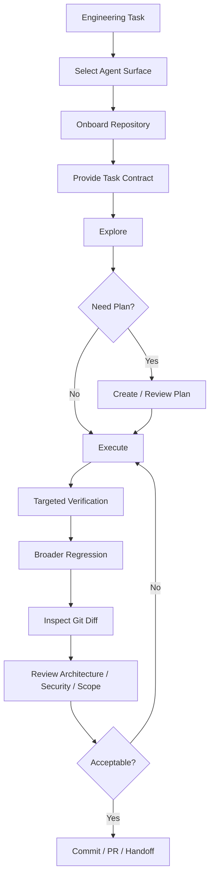
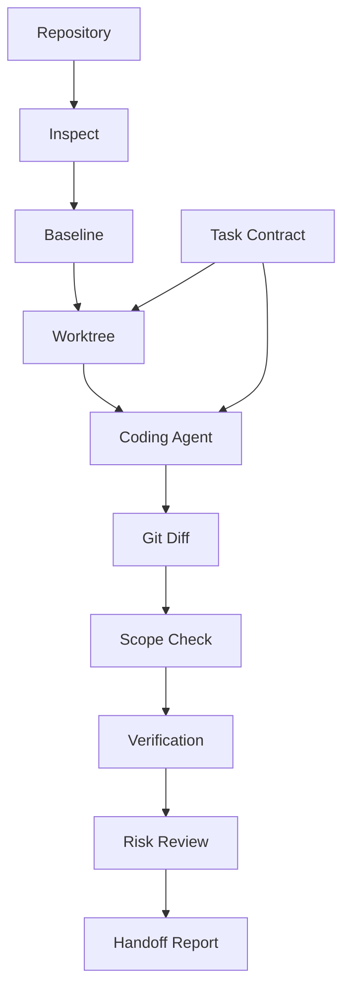
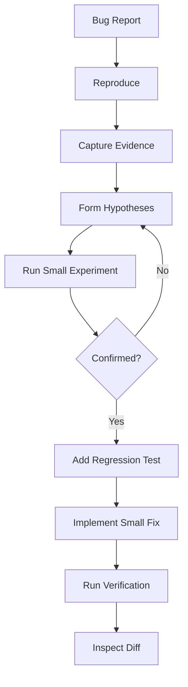
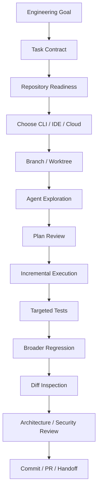

# Phase 5 — AI Coding Agent Mastery

> **Track:** AI-Powered Software Development / Agentic Software Engineering  
> **Prerequisites:**  
> - Phase 1 — Generative AI for Software Engineers  
> - Phase 2 — Prompt Engineering for Software Development  
> - Phase 3 — Context Engineering for Software Development  
> - Phase 4 — Agentic AI Fundamentals  
>
> **Phase goal:** Learn to use modern coding agents professionally across the terminal, IDE, and cloud: how to onboard a repository, delegate engineering tasks, supervise exploration and planning, control edits and shell execution, manage Git and worktrees, verify changes, inspect diffs, manage permissions, use sandboxes, and build a repeatable workflow that produces reviewable software rather than merely plausible code.

---

# Table of Contents

1. [How to Study This Phase](#how-to-study-this-phase)
2. [Learning Objectives](#learning-objectives)
3. [The Core Transition](#the-core-transition)
4. [The Professional Coding-Agent Workflow](#the-professional-coding-agent-workflow)
5. [Module 40 — CLI-Based Coding Agents](#module-40--cli-based-coding-agents)
6. [Module 41 — IDE-Based Coding Agents](#module-41--ide-based-coding-agents)
7. [Module 42 — Repository Navigation with Agents](#module-42--repository-navigation-with-agents)
8. [Module 43 — Agent Plan Mode](#module-43--agent-plan-mode)
9. [Module 44 — Agent Execution Mode](#module-44--agent-execution-mode)
10. [Module 45 — File Creation and Modification](#module-45--file-creation-and-modification)
11. [Module 46 — Terminal / Shell Tool Use](#module-46--terminal--shell-tool-use)
12. [Module 47 — Git Operations with Agents](#module-47--git-operations-with-agents)
13. [Module 48 — Test Execution](#module-48--test-execution)
14. [Module 49 — Diff Inspection](#module-49--diff-inspection)
15. [Module 50 — Agent Permissions](#module-50--agent-permissions)
16. [Module 51 — Sandboxed Execution](#module-51--sandboxed-execution)
17. [Repository Onboarding for Coding Agents](#repository-onboarding-for-coding-agents)
18. [Choosing the Right Agent Surface](#choosing-the-right-agent-surface)
19. [Task Delegation Patterns](#task-delegation-patterns)
20. [Worktrees and Parallel Agent Work](#worktrees-and-parallel-agent-work)
21. [Professional Verification Workflow](#professional-verification-workflow)
22. [Coding-Agent Review Discipline](#coding-agent-review-discipline)
23. [Failure Modes and Recovery](#failure-modes-and-recovery)
24. [Security and Operational Boundaries](#security-and-operational-boundaries)
25. [Practical Python Utilities](#practical-python-utilities)
26. [Worked Case Studies](#worked-case-studies)
27. [Coding-Agent Anti-Patterns](#coding-agent-anti-patterns)
28. [Practical Labs](#practical-labs)
29. [Review Questions](#review-questions)
30. [Scenario Exercises](#scenario-exercises)
31. [Phase Project — AgentOps Workbench](#phase-project--agentops-workbench)
32. [Phase 5 Completion Checklist](#phase-5-completion-checklist)
33. [Where This Leads Next](#where-this-leads-next)
34. [Reference Baseline](#reference-baseline)

---

# How to Study This Phase

Phase 4 explained **how agents work internally**.

Phase 5 is about **operating real coding agents effectively**.

The shift is:

```text
Phase 4:
Understand the engine.

Phase 5:
Drive the vehicle professionally.
```

A beginner often uses a coding agent like this:

```text
"Build the feature."
```

Then watches the model generate code.

A professional workflow is different:

```text
Understand repository
        ↓
Define task contract
        ↓
Confirm execution boundary
        ↓
Explore
        ↓
Plan if needed
        ↓
Implement incrementally
        ↓
Run targeted verification
        ↓
Run broader regression
        ↓
Inspect diff
        ↓
Review architecture/security
        ↓
Return reviewable change
```

The primary skill is **supervision**.

You are not trying to micromanage every token.

You are trying to create a working environment where the agent can move quickly while remaining inside strong engineering boundaries.

---

# Learning Objectives

By the end of this phase, you should be able to:

1. Explain what a modern coding agent does differently from autocomplete or chat.
2. Use terminal-based coding agents effectively.
3. Use IDE-based coding agents effectively.
4. Understand cloud/remote coding-agent workflows conceptually.
5. Choose the right surface for a task:
   - CLI,
   - IDE,
   - cloud agent,
   - desktop orchestration environment.
6. Onboard an unfamiliar repository for an agent.
7. Design concise persistent repository instructions.
8. Give an agent a production-quality task contract.
9. Supervise repository exploration.
10. Use:
    - tree-first,
    - symbol-first,
    - error-first,
    - test-first,
    - diff-first,
    - spec-first exploration.
11. Decide when plan mode is appropriate.
12. Evaluate an agent plan before execution.
13. Avoid overplanning trivial work.
14. Execute bounded changes safely.
15. Control file creation/modification.
16. Use shell commands as verification tools.
17. Distinguish safe, risky, and destructive shell operations.
18. Use Git safely with coding agents.
19. Inspect status, diff, logs, and branches.
20. Understand worktrees and isolated branches.
21. Run targeted tests first.
22. Expand verification progressively.
23. Review tests generated by agents.
24. Inspect diffs before accepting work.
25. Detect scope creep.
26. Detect architecture drift.
27. Detect test-shaped cheating.
28. Configure permissions according to task risk.
29. Understand sandbox modes conceptually.
30. Understand filesystem and network boundaries.
31. Avoid dangerous full-access defaults.
32. Supervise dependency installation.
33. Supervise migrations.
34. Handle partial agent failure.
35. Resume work after interruption.
36. Use independent review.
37. Write professional agent handoff reports.
38. Design an agent-friendly repository.
39. Build a repeatable coding-agent operating playbook.
40. Be ready for Phase 6 — Spec-Driven Development.

---

# The Core Transition

The previous phase gave us:

```text
User Goal
   ↓
Agent Loop
   ↓
Tools
   ↓
Observations
   ↓
Verification
```

This phase asks:

```text
How should a software engineer actually operate this system?
```

The key workflow is:

```text
Task
  ↓
Choose Agent Surface
  ↓
Load Repository Instructions
  ↓
Inspect Current State
  ↓
Explore Relevant Code
  ↓
Plan if Complexity Requires It
  ↓
Execute Small Changes
  ↓
Run Tests / Checks
  ↓
Inspect Diff
  ↓
Review Risks
  ↓
Commit / PR / Handoff
```

---

# The Professional Coding-Agent Workflow

A strong default workflow is:



The important principle:

> **Do not judge the agent by how impressive the generation looks. Judge it by the quality of the engineering evidence it leaves behind.**

---

# Module 40 — CLI-Based Coding Agents

# 40.1 Why the Terminal Is a Natural Agent Surface

Software development already happens through command-line interfaces:

```text
git
pytest
npm
pnpm
uv
docker
kubectl
terraform
linters
compilers
build tools
```

A terminal coding agent can use the same interfaces a developer uses.

This makes the terminal an extremely powerful agent environment.

---

# 40.2 CLI Agent Mental Model

```text
Human
  ↓
Terminal Agent
  ↓
Repository
  ↓
Shell Tools
  ↓
Git / Tests / Build
  ↓
Evidence
  ↓
Agent
  ↓
Human
```

---

# 40.3 What a CLI Agent Can Usually Do

Depending on product/configuration:

```text
read files
search repository
edit files
create files
run shell commands
run tests
inspect Git
use web/documentation tools
use MCP/tools
```

Exact capabilities differ by agent.

---

# 40.4 Why CLI Agents Are Powerful

They have direct access to the engineering environment.

Example:

```text
Question:
"Does this code compile?"
```

A chat assistant predicts.

A CLI agent can run:

```bash
python -m compileall app
```

and observe the result.

---

# 40.5 CLI Session Setup

Before giving a substantial task:

```bash
git status
git branch --show-current
python --version
```

or equivalent.

Purpose:

```text
know current branch
know dirty files
know environment
```

The agent should ideally inspect these itself.

---

# 40.6 Start from a Clean Working Tree

Why?

Suppose:

```text
you have unrelated local edits
```

Then the agent also edits files.

Later:

```text
Which changes belong to whom?
```

becomes difficult.

Recommended:

```text
clean working tree
or
separate worktree/branch
```

---

# 40.7 CLI Task Example

Weak:

```text
Fix auth.
```

Strong:

```text
Fix the bug where expired access tokens return HTTP 500.

Constraints:
- preserve valid-token behavior
- no schema changes
- no new dependency
- limit changes to auth module and related tests

Verification:
- reproduce the failing test
- add regression coverage
- run targeted auth tests
- inspect final diff

Do not claim completion unless the tests were actually run.
```

---

# 40.8 Interactive Supervision

Terminal agents often expose tool actions as they happen.

Watch for:

```text
unexpected directories
unexpected dependency installs
network requests
large diffs
destructive commands
```

Intervene when necessary.

---

# 40.9 CLI Agents and Long Tasks

Long tasks need:

```text
progress tracking
plan
checkpoints
Git state
context compaction
```

Do not assume the model can carry the entire task in conversational memory indefinitely.

---

# 40.10 CLI Agent Strengths

Strong for:

```text
backend work
repository exploration
debugging
tests
migrations
refactors
Git
build failures
DevOps tasks
```

---

# 40.11 CLI Agent Weaknesses

Can be less convenient when:

```text
visual UI comparison is central
pixel-level design work
manual code browsing is more important than execution
```

Though modern tools increasingly support images/screenshots.

---

# Module 41 — IDE-Based Coding Agents

# 41.1 Why Use an IDE Agent?

The IDE provides:

```text
open files
cursor position
selection
diagnostics
language server
project tree
editor diff
```

This context can make local development efficient.

---

# 41.2 IDE Agent Workflow

```text
Developer sees code
    ↓
Select function / file
    ↓
Ask agent
    ↓
Agent reads project context
    ↓
Proposes / performs edit
    ↓
IDE shows diff
    ↓
Developer reviews
```

---

# 41.3 IDE vs CLI

IDE strengths:

```text
visual diff
local edits
code navigation
inline diagnostics
quick review
```

CLI strengths:

```text
shell-heavy workflows
automation
large repository operations
Git/test loops
remote systems
```

Often the best workflow uses both.

---

# 41.4 Local Edit Tasks

Good IDE-agent task:

```text
"Refactor this method to remove duplication while preserving public behavior.
Use existing helper conventions in this package."
```

The local code selection provides useful context.

---

# 41.5 Repository-Wide Tasks in IDE

Do not assume an IDE agent only sees the open file.

Modern agent modes can explore the repository.

Still, give a clear task contract.

---

# 41.6 Diagnostics as Feedback

IDE diagnostics provide:

```text
type errors
syntax errors
lint findings
```

These are observations.

The agent can use them to revise changes.

---

# 41.7 IDE Review Discipline

Do not click:

```text
Accept All
```

without reviewing meaningful changes.

Inspect:

```text
behavior
scope
imports
error handling
tests
```

---

# 41.8 IDE Agent vs Autocomplete

Autocomplete:

```text
predict next code
```

Agent mode:

```text
understand task
search repository
edit multiple files
run tools
iterate
```

Very different autonomy.

---

# 41.9 When IDE Agent Is Best

Examples:

```text
local refactor
UI component change
interactive debugging
small feature
manual architecture exploration
```

---

# 41.10 When CLI May Be Better

Examples:

```text
large migration
shell-heavy setup
Docker debugging
CI replication
repository-wide search
large test loops
```

---

# Module 42 — Repository Navigation with Agents

# 42.1 Exploration Before Editing

A professional coding agent should usually understand:

```text
where behavior lives
how code is structured
how tests are organized
what conventions exist
```

before editing.

---

# 42.2 Repository Entry Sequence

For unfamiliar repo:

```text
1. repository instructions
2. tree / top-level files
3. package manifest
4. architecture docs
5. relevant subsystem
6. related tests
```

---

# 42.3 Tree-First Navigation

Example:

```text
src/
tests/
docs/
infra/
```

The agent narrows to:

```text
src/auth/
```

---

# 42.4 Symbol-First Navigation

Task mentions:

```text
InvoiceService
```

Search:

```bash
rg "class InvoiceService"
rg "InvoiceService"
```

Then inspect:

```text
definition
callers
tests
```

---

# 42.5 Error-First Navigation

Given stack trace:

```text
services/payments.py:81
```

Start there.

Then expand outward.

---

# 42.6 Test-First Navigation

A failing test may encode:

```text
expected behavior
input
output
error path
```

Read it before changing source.

---

# 42.7 Diff-First Navigation

For review:

```bash
git diff
```

Then inspect changed symbols.

---

# 42.8 Spec-First Navigation

For feature:

```text
spec
→ affected domain
→ analogous feature
→ tests
```

---

# 42.9 Dependency Navigation

If service calls repository:

```text
service
→ repository
→ model/schema
```

Do not read every layer unless necessary.

---

# 42.10 Ask Agent to Explain Repository Before Editing

Useful instruction:

```text
Before modifying files, identify:
- likely implementation path
- relevant tests
- architecture boundaries
- any ambiguity that affects behavior
```

This creates a review checkpoint.

---

# 42.11 Repository Map as Context Accelerator

A concise map can prevent repeated exploration.

Example:

```text
api/ → HTTP
services/ → business rules
repositories/ → persistence
models/ → DB entities
schemas/ → API contracts
```

---

# 42.12 Avoid Premature Abstraction

Agent sees:

```text
duplicate code
```

and may create new abstraction.

First ask:

```text
is duplication intentional?
is there existing helper?
is behavior actually identical?
```

Exploration reduces wrong abstraction.

---

# 42.13 Search Before Creating

Rule:

```text
Before creating new utility, class, service, or pattern,
search repository for an existing equivalent.
```

This reduces repository entropy.

---

# Module 43 — Agent Plan Mode

# 43.1 What Is Plan Mode?

Plan mode means:

```text
analyze
explore
propose implementation strategy
without immediately making changes
```

Different tools expose this differently.

The concept is universal.

---

# 43.2 Why Plan Mode Matters

Useful for:

```text
large feature
migration
architectural change
ambiguous bug
cross-module refactor
security-sensitive change
```

It creates a human review point before edits.

---

# 43.3 Good Plan Structure

```text
Goal
Current understanding
Affected components
Implementation steps
Tests
Risks
Assumptions
Approval needs
```

---

# 43.4 Example Plan

Task:

```text
Add project archiving.
```

Plan:

```text
1. inspect Project model lifecycle support
2. confirm whether schema change required
3. add persistence support
4. add service authorization
5. add API endpoint
6. add regression tests
7. verify listing excludes archived projects
8. run project suite
```

---

# 43.5 Review a Plan Like Code

Ask:

```text
Does it satisfy requirements?
Does it preserve architecture?
Is order correct?
Are risks identified?
Does verification prove success?
```

---

# 43.6 Plan Anti-Pattern — Fake Precision

Bad plan:

```text
1. edit line 42
2. add helper on line 61
```

before the repository is fully inspected.

A plan should express engineering intent.

---

# 43.7 Plan Anti-Pattern — 50 Steps for Tiny Task

Task:

```text
rename error message
```

No need for elaborate plan mode.

---

# 43.8 Rolling Plan

For uncertain debugging:

```text
1. reproduce
2. inspect failure
3. inspect likely source
```

Then replan.

---

# 43.9 Ask for Risk Flags

Useful:

```text
Before implementation, flag any step that would:
- change public API
- change schema
- add dependency
- change security behavior
```

---

# 43.10 Plan Approval Boundary

For high-risk tasks:

```text
plan first
human approves
execute second
```

---

# Module 44 — Agent Execution Mode

# 44.1 Execution Mode Means Action

The agent is now allowed to:

```text
edit
create
run
delete within policy
```

This is where supervision matters.

---

# 44.2 Execute Against a Reviewed Contract

The agent should enter execution with:

```text
goal
constraints
acceptance criteria
scope
verification
```

---

# 44.3 Small Batches

Prefer:

```text
change
→ test
→ change
→ test
```

not:

```text
rewrite everything
→ test at end
```

---

# 44.4 Execution Checkpoints

After meaningful milestone:

```text
inspect status
run relevant tests
update plan
```

---

# 44.5 Stop When Reality Disagrees

If execution discovers:

```text
spec assumption is false
```

stop or replan.

Do not force the original plan.

---

# 44.6 Scope Tracking

If task allows:

```text
auth module
```

and agent begins editing:

```text
billing
```

ask why.

Possibilities:

```text
legitimate hidden dependency
or
scope creep
```

---

# 44.7 Execution Report

At end:

```text
what changed
why
tests run
results
unverified areas
```

---

# 44.8 Do Not Equate Activity With Progress

Agent may run 50 commands.

That does not mean task is progressing.

Progress should map to:

```text
acceptance criteria
```

---

# Module 45 — File Creation and Modification

# 45.1 File Writes Are Side Effects

Reading:

```text
low risk
```

Writing:

```text
changes repository state
```

Therefore every write should be reviewable.

---

# 45.2 Prefer Existing Files When Appropriate

Do not create:

```text
new helper.py
new utils2.py
new abstractions.py
```

without checking existing structure.

---

# 45.3 New File Decision

Create a file when it improves:

```text
cohesion
ownership
architecture
maintainability
```

not merely because the agent prefers smaller files.

---

# 45.4 Preserve Formatting

Agents may accidentally reformat unrelated code.

This creates noisy diffs.

Instruction:

```text
Do not reformat unrelated code.
```

---

# 45.5 Encoding and Line Endings

Cross-platform repositories may use:

```text
LF
CRLF
```

A bad agent edit can rewrite entire files.

Diff inspection catches this.

---

# 45.6 Generated Files

Do not manually edit generated files unless repository workflow requires it.

Examples:

```text
OpenAPI generated client
compiled schema
lockfile
```

Usually modify source and regenerate.

---

# 45.7 File Deletion

Deletion is higher risk.

Before deleting:

```text
search references
confirm unused
review build/tests
```

---

# 45.8 Configuration Files

Changes to:

```text
pyproject.toml
package.json
Dockerfile
CI
Terraform
```

may have wider blast radius than application code.

Treat as higher-risk.

---

# 45.9 Dependency Manifest

If agent adds dependency:

```text
Why?
Existing alternative?
Maintenance risk?
License/security?
Version?
Lockfile?
```

Require justification.

---

# Module 46 — Terminal / Shell Tool Use

# 46.1 Shell Is Powerful

A shell can:

```text
read
write
delete
install
network
build
deploy
```

Therefore shell access should be controlled.

---

# 46.2 Safe Everyday Commands

Often low risk:

```bash
git status
git diff
rg "symbol"
pytest
ruff check .
pyright
```

Context matters.

---

# 46.3 Higher-Risk Commands

Examples:

```bash
pip install ...
npm install ...
docker system prune
git reset --hard
rm -rf ...
terraform apply
kubectl delete ...
```

Require more scrutiny.

---

# 46.4 Command Intent

Before approving a command, understand:

```text
what does it read?
what does it modify?
network?
persistent state?
reversible?
```

---

# 46.5 Compound Commands

Example:

```bash
pytest && git add . && git commit -m "fix"
```

One approval hides multiple side effects.

Prefer smaller commands for clarity.

---

# 46.6 Pipes and Redirection

Commands such as:

```bash
curl ... | sh
```

are high risk.

They download and execute code.

Avoid unless explicitly trusted.

---

# 46.7 Shell Injection

If user-controlled values are interpolated into shell strings, risk increases.

Prefer structured subprocess arguments.

Python:

```python
subprocess.run(
    ["pytest", target],
    check=False,
)
```

instead of:

```python
subprocess.run(
    f"pytest {target}",
    shell=True,
)
```

---

# 46.8 Exit Codes

Agent should inspect:

```text
exit code
stdout
stderr
```

not merely visible output.

---

# 46.9 Timeouts

Long commands need limits.

```python
subprocess.run(
    command,
    timeout=120,
)
```

---

# 46.10 Environment Variables

Avoid exposing secrets.

If command only needs:

```text
APP_ENV=test
```

do not pass the full production environment.

---

# 46.11 Command Reproducibility

Agent final report should list important commands.

This allows human rerun.

---

# Module 47 — Git Operations with Agents

# 47.1 Git Is the Agent's Safety Net

Git provides:

```text
diff
history
branch isolation
revert
checkpoint
review
```

A coding agent should use Git intentionally.

---

# 47.2 Start with Status

```bash
git status --short
```

Know current modifications.

---

# 47.3 Current Branch

```bash
git branch --show-current
```

Avoid accidental work on:

```text
main
```

if team expects feature branches.

---

# 47.4 Diff

```bash
git diff
```

This is one of the most important verification tools.

---

# 47.5 Diff Stat

```bash
git diff --stat
```

Useful for scope.

Task:

```text
fix one parser bug
```

Diff:

```text
42 files changed
```

warning.

---

# 47.6 Git Log

```bash
git log --oneline -10
```

Useful for recent behavior and conventions.

---

# 47.7 Git Blame

Use cautiously.

Helpful for:

```text
why was this line introduced?
```

Not authoritative product specification.

---

# 47.8 Branch Isolation

Agent work should usually occur on a branch.

```text
feature/...
fix/...
agent/...
```

Naming depends on team.

---

# 47.9 Worktrees

Git worktrees allow multiple working directories tied to separate branches.

Conceptually:

```text
repo
├── main working tree
├── worktree-agent-a
└── worktree-agent-b
```

This is powerful for parallel agents.

---

# 47.10 Worktree Benefit

Without worktrees:

```text
two agents edit same working tree
→ conflicts
→ state interference
```

With isolation:

```text
each agent has own branch + files
```

---

# 47.11 Worktree Commands

Typical Git concept:

```bash
git worktree add ../repo-agent-a -b agent/a
git worktree list
```

Use repository/team policy.

---

# 47.12 Worktree Risks

Agents can still conflict when branches merge.

Parallel execution does not eliminate integration problems.

---

# 47.13 Commit Discipline

A clean agent commit should be:

```text
cohesive
tested
scoped
reviewable
```

Avoid giant mixed commits.

---

# 47.14 Agent-Generated Commit Message

Review it.

Ensure it reflects actual change.

---

# 47.15 Push Permission

Pushing remote is higher risk than local commit.

Many teams require approval.

---

# 47.16 Never Force Push Automatically

Unless explicitly designed/authorized.

`git push --force` can destroy shared history.

---

# 47.17 Reset / Clean

Commands:

```bash
git reset --hard
git clean -fd
```

can destroy uncommitted work.

Treat as dangerous.

---

# Module 48 — Test Execution

# 48.1 Testing Is the Agent's Reality Check

Generated code is hypothesis.

Tests provide evidence.

---

# 48.2 Verification Pyramid for Agent Changes

```text
syntax/static checks
      ↓
targeted unit tests
      ↓
related integration tests
      ↓
broader regression suite
      ↓
E2E / system checks
```

Run proportionally.

---

# 48.3 Targeted First

Bug in auth:

```bash
pytest tests/auth/test_token.py -q
```

Faster feedback.

---

# 48.4 Then Broader

```bash
pytest tests/auth -q
```

Then possibly:

```bash
pytest -q
```

depending on runtime.

---

# 48.5 Test Before Fix

For bugs:

```text
reproduce
before
modify
```

Otherwise you may not know whether the fix addressed the actual bug.

---

# 48.6 Regression Test

A regression test should:

```text
fail before fix
pass after fix
```

when practical.

---

# 48.7 Agent-Written Tests Need Review

Common bad patterns:

```text
test implementation detail
mock away behavior
assert trivial condition
copy current broken behavior
```

---

# 48.8 Test-Shaped Cheating

The model can accidentally overfit.

Review whether test represents:

```text
requirement
```

not just:

```text
current implementation
```

---

# 48.9 Tests Are Not Absolute Proof

Passing tests can still miss:

```text
security
performance
integration
edge cases
production configuration
```

---

# 48.10 Static Analysis

Run:

```text
linter
type checker
compiler
```

These catch classes of errors tests may miss.

---

# 48.11 Deterministic Check List

Python example:

```bash
python -m compileall app
ruff check .
pyright
pytest -q
```

Adapt to repo.

---

# 48.12 Record Test Evidence

Final report:

```text
pytest tests/auth/test_token.py -q → 12 passed
pytest tests/auth -q → 84 passed
ruff check app/auth tests/auth → passed
```

---

# Module 49 — Diff Inspection

# 49.1 Why Diff Inspection Is Mandatory

The agent may intend:

```text
change 2 files
```

but actually change:

```text
7 files
```

The diff is the actual artifact.

---

# 49.2 First Check — Scope

Ask:

```text
Which files changed?
Expected?
Any generated/noisy changes?
```

---

# 49.3 Second Check — Behavior

Read changed logic.

Does it match requirements?

---

# 49.4 Third Check — Architecture

Look for:

```text
new cross-layer dependency
duplicated logic
wrong abstraction
direct DB access
```

---

# 49.5 Fourth Check — Security

Look for:

```text
auth bypass
secret logging
unsafe SQL
path traversal
weak validation
```

---

# 49.6 Fifth Check — Test Quality

Do tests prove behavior?

---

# 49.7 Sixth Check — Unrelated Refactoring

Agent may "clean up" unrelated code.

Revert unless justified.

---

# 49.8 Diff Size as Signal

Large diff for small task:

```text
investigate
```

Not automatically wrong.

But review burden increases.

---

# 49.9 Diff Review Prompt

```text
Review this diff against the original task.

Check:
- requirements
- scope
- architecture
- security
- tests
- backward compatibility

Do not assume the implementation is correct because tests pass.
```

---

# 49.10 Independent Review

Prefer a fresh reviewer context for important changes.

---

# Module 50 — Agent Permissions

# 50.1 Permission Model

A coding agent can only act safely if its authority is explicit.

Examples:

```text
read repository
write workspace
run commands
access network
install dependency
push Git
use cloud credentials
```

---

# 50.2 Read-Only Mode

Useful for:

```text
analysis
planning
review
architecture
```

Agent cannot modify workspace.

---

# 50.3 Workspace-Write Mode

Agent can modify project workspace.

Usually appropriate for implementation.

Still restrict:

```text
outside paths
network
privileged resources
```

---

# 50.4 Full Access

Very high authority.

May allow:

```text
broad filesystem
network
external systems
```

Do not use as default merely to avoid permission prompts.

---

# 50.5 Approval Fatigue

If every trivial action requires approval:

```text
user stops reading prompts
```

This reduces safety.

Better:

```text
sandbox low-risk actions
require approval only for meaningful boundary crossings
```

---

# 50.6 Risk-Based Approval

Example policy:

```text
read repo → auto
edit workspace → auto
run tests → auto
network → approval
install dependency → approval
push → approval
production → blocked/explicit workflow
```

---

# 50.7 Permission Prompt Review

Ask:

```text
What action?
Why?
What target?
What side effect?
Can it be avoided?
```

---

# 50.8 Session-Level Approval

Some systems allow:

```text
approve similar action for session
```

Use cautiously.

---

# 50.9 Team Policy

Organization-controlled settings may restrict:

```text
sandbox modes
network domains
authentication
commands
```

This is more reliable than individual habit.

---

# 50.10 Permissions and MCP/Plugins

External tools can extend authority.

Treat each integration as a capability boundary.

---

# Module 51 — Sandboxed Execution

# 51.1 What Is a Sandbox?

A sandbox is an execution environment that restricts what agent commands can access or modify.

Typical boundaries:

```text
filesystem
network
process
credentials
resources
```

---

# 51.2 Why Sandboxing Matters

Generated commands may be:

```text
wrong
overbroad
unsafe
prompt-injected
```

The sandbox limits damage.

---

# 51.3 Filesystem Sandbox

Example policy:

```text
read:
repository

write:
current workspace only

deny:
home secrets
SSH keys
system files
```

---

# 51.4 Network Sandbox

Possible:

```text
no network
allowlist
approval for new domain
```

Network access enables:

```text
documentation
package downloads
APIs
```

but increases exfiltration and external-side-effect risk.

---

# 51.5 Credential Isolation

Do not expose:

```text
cloud admin keys
production DB credentials
personal SSH keys
```

to arbitrary generated processes.

---

# 51.6 Sandbox and Autonomy

Strong sandboxing allows more low-risk autonomous behavior.

Instead of approving every command:

```text
define safe boundary
let agent work inside it
```

---

# 51.7 Sandbox Does Not Replace Review

Sandbox protects environment.

It does not guarantee:

```text
correct code
good architecture
secure implementation
```

Still verify.

---

# 51.8 Sandbox Escape Consideration

Real sandboxes are security systems.

Do not attempt to build your own production sandbox casually.

Use mature OS/container/platform isolation.

---

# 51.9 Ephemeral Environments

Cloud agents often use temporary environments.

Benefits:

```text
clean state
reproducibility
isolation
easy reset
```

---

# 51.10 Local vs Cloud Sandbox

Local:

```text
fast access
uses developer environment
higher local data exposure
```

Cloud:

```text
isolated
reproducible
may require environment setup
```

Choose based on task.

---

# Repository Onboarding for Coding Agents

# 52.1 Why Onboarding Matters

The first task in an unfamiliar repository is expensive because the agent must discover:

```text
what project is
how to run it
how to test it
architecture
conventions
```

A good repository reduces this recurring cost.

---

# 52.2 Onboarding Checklist

Persistent instructions should include:

```text
project purpose
stack
repository structure
architecture
build
test
lint
type-check
important constraints
documentation map
definition of done
```

---

# 52.3 Keep Instructions Short

Current agent guidance across major tools strongly favors concise, focused instructions.

Do not write:

```text
100-page agent manual
```

Use progressive disclosure.

---

# 52.4 Agent Instruction Files

Common ecosystems now support files such as:

```text
AGENTS.md
CLAUDE.md
.github/copilot-instructions.md
path-specific instruction files
```

Exact discovery and precedence rules vary by tool.

Therefore:

```text
keep universal project truth in shared versioned docs
use tool-specific instruction layers only where necessary
```

---

# 52.5 Cross-Agent Compatibility

If your team uses multiple agents:

```text
Codex
Claude Code
Copilot
```

avoid duplicating conflicting rules.

A strong approach:

```text
AGENTS.md → common high-level rules
docs/ → deeper shared sources
tool-specific file → only tool-specific behavior
```

---

# 52.6 Build Commands Must Work

Instruction:

```text
Run `pytest`.
```

is useless if setup is missing.

Test agent onboarding from clean environment.

---

# 52.7 Agent-Friendly Error Messages

If build fails:

```text
"Error 1"
```

hard to diagnose.

Prefer structured/actionable output.

---

# Choosing the Right Agent Surface

# 53.1 CLI

Use when:

```text
shell-heavy
large repository
debugging
Git
build/test
migration
```

---

# 53.2 IDE

Use when:

```text
interactive local edits
visual code review
small feature
UI code
manual exploration
```

---

# 53.3 Cloud Agent

Use when:

```text
delegated issue
independent environment
background task
PR generation
parallel work
```

---

# 53.4 Desktop / Multi-Agent Command Center

Use when:

```text
several agents
multiple worktrees
long-running tasks
supervision across projects
```

---

# 53.5 Surface Decision Matrix

| Task | CLI | IDE | Cloud |
|---|---:|---:|---:|
| One-function refactor | Good | Excellent | Possible |
| CI debugging | Excellent | Good | Good |
| Long migration | Excellent | Good | Excellent |
| UI visual edit | Good | Excellent | Good |
| Issue → PR delegation | Good | Good | Excellent |
| Multi-agent parallel work | Good | Moderate | Excellent |

The exact product support evolves.

---

# Task Delegation Patterns

# 54.1 Direct Fix

```text
Fix failing test X.
```

Good when:

```text
clear
bounded
verifiable
```

---

# 54.2 Feature Slice

```text
Implement POST /projects including service, repository, and tests.
```

---

# 54.3 Investigation-Only

```text
Do not edit.
Investigate why CI fails.
Return evidence and recommendation.
```

Useful before risky changes.

---

# 54.4 Plan-Only

```text
Design migration plan.
Do not modify files.
```

---

# 54.5 Review-Only

```text
Review diff.
Do not modify.
```

---

# 54.6 Mechanical Migration

Example:

```text
Replace deprecated API across repository.
```

Great agent task if well tested.

---

# 54.7 Documentation Sync

```text
Update docs to match current CLI behavior.
```

---

# 54.8 Bad Delegation

```text
Improve the whole system.
```

Too broad.

---

# Worktrees and Parallel Agent Work

# 55.1 Why Parallel Agents Need Isolation

Parallel work creates:

```text
file conflicts
branch conflicts
context contamination
```

Worktrees isolate file state.

---

# 55.2 Example

```text
Agent A:
backend API

Agent B:
tests

Agent C:
documentation
```

Separate worktrees.

---

# 55.3 Shared Contracts

Parallel agents should share:

```text
spec
API contract
architecture rules
```

Not necessarily each other's entire reasoning.

---

# 55.4 Integration

After parallel work:

```text
review branches
merge carefully
resolve conflicts
run full verification
```

---

# 55.5 Parallelism Is Not Free

Extra agents add:

```text
coordination
review
merge
token/cost
```

Use when tasks are sufficiently independent.

---

# Professional Verification Workflow

# 56.1 Before Editing

Verify baseline:

```text
target bug reproduces
or
baseline tests pass
```

---

# 56.2 During Editing

Run targeted checks.

---

# 56.3 Before Completion

Run:

```text
targeted tests
related suite
lint/types
diff inspection
```

---

# 56.4 For High-Risk Changes

Add:

```text
integration
security
migration
performance
E2E
```

---

# 56.5 Final Evidence Package

A reviewable agent result includes:

```text
summary
root cause / design
files changed
tests
commands
remaining risk
```

---

# Coding-Agent Review Discipline

# 57.1 Review the Change, Not the Agent's Story

Agent says:

```text
"I implemented clean architecture."
```

Ignore rhetoric.

Inspect:

```text
diff
tests
architecture
```

---

# 57.2 Requirement Traceability

Map:

```text
acceptance criterion
→ implementation
→ test
```

---

# 57.3 Review New Tests

Ask:

```text
would this test fail if feature were broken?
```

---

# 57.4 Review Error Handling

Agents often handle happy path well.

Inspect:

```text
None
empty
timeout
permission
duplicate
concurrency
```

---

# 57.5 Review Backward Compatibility

Check:

```text
public API
DB schema
config
CLI flags
serialization
```

---

# 57.6 Review Operational Impact

New:

```text
background task
network call
DB query
dependency
```

may affect production.

---

# Failure Modes and Recovery

# 58.1 Agent Changes Too Much

Recovery:

```text
inspect diff
revert unrelated changes
tighten task scope
continue
```

---

# 58.2 Agent Invents API

Recovery:

```text
inspect installed version/docs
replace hallucinated API
add test/type check
```

---

# 58.3 Agent Cannot Reproduce Bug

Do not force fix.

Investigate:

```text
environment
version
data
configuration
CI
```

---

# 58.4 Tests Pass Locally but CI Fails

Compare:

```text
runtime versions
OS
env vars
services
parallelism
timezone
```

---

# 58.5 Dependency Install Breaks Repo

Use Git to restore manifest/lockfile or fix deliberately.

---

# 58.6 Agent Loops

Stop.

Checkpoint.

Give new task:

```text
Summarize evidence and explain why current approach is failing.
Do not edit.
```

Then replan.

---

# 58.7 Context Lost

Resume from:

```text
task
AGENTS.md
Git diff
tests
checkpoint
```

---

# Security and Operational Boundaries

# 59.1 Treat Repository Content as Potentially Untrusted

Especially:

```text
external issue text
downloaded files
third-party docs
generated code
```

---

# 59.2 Network Access Should Be Deliberate

Ask:

```text
why does agent need network?
which domain?
what data might leave?
```

---

# 59.3 Dependency Installation

Package install runs code in many ecosystems.

Treat as higher-risk.

---

# 59.4 Production Credentials

Keep away from routine coding sessions.

---

# 59.5 Secrets in Logs

Agent may paste logs into context.

Redact.

---

# 59.6 External MCP / Plugins

Each external integration expands trust boundary.

Review permissions.

---

# Practical Python Utilities

# 60.1 Git Status Parser

```python
import subprocess


def git_status() -> str:
    result = subprocess.run(
        ["git", "status", "--short"],
        capture_output=True,
        text=True,
        check=False,
    )

    return result.stdout
```

---

# 60.2 Changed Files

```python
def changed_files() -> list[str]:
    result = subprocess.run(
        [
            "git",
            "diff",
            "--name-only",
        ],
        capture_output=True,
        text=True,
        check=False,
    )

    return [
        line.strip()
        for line in result.stdout.splitlines()
        if line.strip()
    ]
```

---

# 60.3 Scope Guard

```python
from pathlib import PurePosixPath


def path_allowed(
    path: str,
    allowed_prefixes: list[str],
) -> bool:
    normalized = str(
        PurePosixPath(path)
    )

    return any(
        normalized.startswith(prefix)
        for prefix in allowed_prefixes
    )
```

---

# 60.4 Scope Verification

```python
def verify_scope(
    files: list[str],
    allowed_prefixes: list[str],
) -> list[str]:
    return [
        path
        for path in files
        if not path_allowed(
            path,
            allowed_prefixes,
        )
    ]
```

---

# 60.5 Test Runner

```python
from dataclasses import dataclass


@dataclass
class CheckResult:
    name: str
    exit_code: int
    stdout: str
    stderr: str


def run_check(
    name: str,
    command: list[str],
) -> CheckResult:
    result = subprocess.run(
        command,
        capture_output=True,
        text=True,
        check=False,
    )

    return CheckResult(
        name=name,
        exit_code=result.returncode,
        stdout=result.stdout,
        stderr=result.stderr,
    )
```

---

# 60.6 Verification Pipeline

```python
def verification_pipeline():
    return [
        (
            "ruff",
            ["ruff", "check", "."],
        ),
        (
            "pyright",
            ["pyright"],
        ),
        (
            "pytest",
            ["pytest", "-q"],
        ),
    ]
```

---

# 60.7 Diff Size Guard

```python
def diff_stat() -> str:
    result = subprocess.run(
        ["git", "diff", "--stat"],
        capture_output=True,
        text=True,
        check=False,
    )

    return result.stdout
```

---

# 60.8 Dangerous Command Detector

Educational only:

```python
DANGEROUS_PATTERNS = [
    "rm -rf",
    "git reset --hard",
    "git clean -fd",
    "git push --force",
    "terraform apply",
]


def looks_dangerous(
    command: str,
) -> bool:
    return any(
        pattern in command
        for pattern in DANGEROUS_PATTERNS
    )
```

Real command security should rely on sandbox/policy, not string matching alone.

---

# Worked Case Studies

# Case Study 1 — Small Bug Fix

Task:

```text
Standard user discount crashes.
```

Code:

```python
def discount(user):
    if user.premium:
        amount = 0.20

    return amount
```

Professional agent workflow:

```text
1. run failing test
2. inspect function
3. confirm expected standard behavior
4. add regression test
5. fix
6. run targeted tests
7. inspect diff
```

Correct implementation may be:

```python
def discount(user):
    if user.premium:
        return 0.20

    return 0.0
```

The key is not code complexity.

The key is evidence.

---

# Case Study 2 — Cross-Module Feature

Task:

```text
Add project archive endpoint.
```

Agent:

```text
reads spec
reads repository instructions
maps project subsystem
plans change
identifies schema impact
requests approval if migration needed
implements vertical slice
runs targeted tests
runs project suite
reviews diff
```

Professional user supervises at:

```text
plan
schema decision
final diff
```

not every edit.

---

# Case Study 3 — Repository-Wide API Migration

Task:

```text
Replace deprecated configuration API.
```

Good agent strategy:

```text
search usage
classify call sites
change one category
run tests
continue
final global search
full suite
```

Bad:

```text
mass replace all matches
hope
```

---

# Case Study 4 — CI Failure

Agent sees:

```text
passes locally
fails CI
```

It should compare:

```text
Python version
OS
dependency lock
timezone
parallelism
environment variables
services
```

Then reproduce in similar environment.

---

# Case Study 5 — Dangerous Dependency Request

Agent wants:

```text
new package
```

Ask:

```text
why?
can stdlib/current dependency solve?
maintenance/security impact?
```

Only approve if justified.

---

# Case Study 6 — Parallel Worktrees

Feature requires:

```text
backend
frontend
tests
```

Three agents.

Shared:

```text
API contract
feature spec
```

Separate:

```text
worktrees
branches
local context
```

Integrate:

```text
merge
full regression
review
```

---

# Coding-Agent Anti-Patterns

# Anti-Pattern 1 — "Build Everything"

Too broad.

---

# Anti-Pattern 2 — No Baseline

Agent edits before reproducing.

---

# Anti-Pattern 3 — Full Access by Default

Unsafe.

---

# Anti-Pattern 4 — Accept All Diffs

No human engineering judgment.

---

# Anti-Pattern 5 — Trust Generated Tests Automatically

Tests can encode wrong assumptions.

---

# Anti-Pattern 6 — No Git Isolation

Agent mixes with human uncommitted work.

---

# Anti-Pattern 7 — Let Agent Install Anything

Dependency sprawl/security risk.

---

# Anti-Pattern 8 — Giant Instructions File

Context crowding.

---

# Anti-Pattern 9 — Agent Creates New Abstraction Without Search

Repository entropy.

---

# Anti-Pattern 10 — Run Full Suite After Every Tiny Edit

Slow.

Use targeted first.

---

# Anti-Pattern 11 — Never Run Full Suite

Miss regressions.

---

# Anti-Pattern 12 — No Diff Review

Agent story replaces artifact review.

---

# Anti-Pattern 13 — Blind Shell Approval

Dangerous.

---

# Anti-Pattern 14 — One Working Tree for Multiple Agents

Conflict-prone.

---

# Anti-Pattern 15 — No Final Evidence Report

Hard to trust/reproduce.

---

# Practical Labs

# Lab 1 — CLI Agent Baseline

Open a small repo.

Before task:

```text
status
branch
tests
```

Record baseline.

---

# Lab 2 — Repository Onboarding

Create concise `AGENTS.md`.

Test whether a fresh agent can:

```text
build
test
find architecture
```

without extra explanation.

---

# Lab 3 — Tree-First Exploration

Give unfamiliar repo.

Ask agent to map major subsystems without editing.

---

# Lab 4 — Symbol-First Exploration

Find all callers of one service method.

---

# Lab 5 — Error-First Exploration

Start from traceback.

Map call path.

---

# Lab 6 — Test-First Bug Fix

Require failing test before modification.

---

# Lab 7 — Plan Mode

Give cross-module feature.

Ask plan only.

Review it.

---

# Lab 8 — Plan Revision

Change a requirement.

Have agent update plan rather than start over blindly.

---

# Lab 9 — Execution Scope

Allow only:

```text
src/auth
tests/auth
```

Check diff.

---

# Lab 10 — File Creation Review

Ask agent to add feature.

Inspect whether it creates unnecessary files.

---

# Lab 11 — Shell Safety

Review 20 commands.

Classify:

```text
safe
approval
block
```

---

# Lab 12 — Compound Command

Split a compound risky shell command into reviewable steps.

---

# Lab 13 — Git Status Discipline

Start with dirty repo.

Have agent distinguish pre-existing vs agent changes.

---

# Lab 14 — Worktree

Create separate worktree for agent task.

---

# Lab 15 — Parallel Worktrees

Run two independent tasks.

Merge later.

---

# Lab 16 — Targeted Test First

Measure time:

```text
targeted test
vs
full suite
```

Design verification sequence.

---

# Lab 17 — Regression Test Quality

Review three agent-generated tests.

Find weak assertions.

---

# Lab 18 — Static Checks

Add:

```text
ruff
pyright
```

to agent completion criteria.

---

# Lab 19 — Diff Stat Guard

Small task creates huge diff.

Stop and investigate.

---

# Lab 20 — Architecture Review

Detect direct DB access from route.

---

# Lab 21 — Security Review

Detect token logging added by agent.

---

# Lab 22 — Permission Modes

Run same task conceptually under:

```text
read-only
workspace-write
full access
```

Compare required approvals.

---

# Lab 23 — Sandbox Boundary

Try writing outside workspace.

Confirm denial.

---

# Lab 24 — Network Boundary

Task needs docs.

Allow only approved docs domain.

---

# Lab 25 — Dependency Approval

Agent proposes package.

Require written justification before approval.

---

# Lab 26 — Generated File

Agent edits generated client manually.

Correct workflow:

```text
change source
regenerate
```

---

# Lab 27 — CI Reproduction

Replicate CI environment locally/container.

---

# Lab 28 — Context Reset

Clear agent session.

Resume from:

```text
AGENTS.md
task spec
Git diff
tests
```

---

# Lab 29 — Independent Review

Have second agent review final diff without developer reasoning.

---

# Lab 30 — Professional Handoff

Create final report:

```text
summary
files
tests
risks
```

---

# Lab 31 — Full Feature

Implement one vertical slice with agent from spec to tests.

---

# Lab 32 — Failed Agent Task

Deliberately give ambiguous requirement.

Observe agent failure.

Then improve task contract.

---

# Lab 33 — Noisy Repository

Add irrelevant large files.

Evaluate whether agent navigates efficiently.

---

# Lab 34 — Instruction Conflict

Create:

```text
AGENTS.md
tool-specific instructions
```

with conflict.

Resolve.

---

# Lab 35 — Large Refactor

Require characterization tests first.

---

# Lab 36 — Migration Guard

Plan database migration in read-only mode.

No implementation.

---

# Lab 37 — Review-Only Mode

Agent must not modify anything.

Verify Git clean.

---

# Lab 38 — Tool Selection

Ask package version question.

Agent should inspect local manifest/runtime, not web first.

---

# Lab 39 — Worktree Integration

Merge two agent branches.

Resolve conflict.

Run full suite.

---

# Lab 40 — End-to-End Agent Operating Drill

Task:

```text
bug → reproduce → plan → edit → test → diff → review → handoff
```

Do the entire professional lifecycle.

---

# Review Questions

1. Why is the terminal a natural surface for coding agents?
2. What makes CLI agents different from chat?
3. What are the strengths of IDE agents?
4. When is CLI preferable to IDE?
5. What is repository onboarding?
6. Why should a coding agent inspect Git status first?
7. Why is a clean working tree valuable?
8. What is tree-first exploration?
9. What is symbol-first exploration?
10. What is test-first exploration?
11. What is error-first exploration?
12. What is diff-first exploration?
13. What is spec-first exploration?
14. Why search before creating a new abstraction?
15. What is plan mode?
16. When is plan mode valuable?
17. When is plan mode unnecessary?
18. What should a plan contain?
19. What is plan drift?
20. What is execution mode?
21. Why execute in small batches?
22. Why track scope?
23. Why are file writes side effects?
24. Why avoid reformatting unrelated code?
25. Why are configuration files high blast-radius?
26. Why are dependency changes risky?
27. Why is shell access dangerous?
28. Why avoid `curl | sh`?
29. Why prefer structured subprocess arguments?
30. What does exit code tell you?
31. Why is Git a safety mechanism?
32. Why inspect `git diff`?
33. What is a worktree?
34. Why are worktrees valuable for multiple agents?
35. Why can parallel agents still conflict?
36. Why should push require more control than local edit?
37. Why are `reset --hard` and `clean -fd` dangerous?
38. Why test before bug fix?
39. Why use targeted tests first?
40. Why expand to broader regression later?
41. Why review agent-generated tests?
42. What is test-shaped cheating?
43. Why are passing tests not absolute proof?
44. What is diff scope review?
45. How do you detect architecture drift?
46. What is independent review?
47. What is read-only permission mode?
48. What is workspace-write mode?
49. Why is full access high risk?
50. What is approval fatigue?
51. How does risk-based approval help?
52. What is sandboxing?
53. What are filesystem boundaries?
54. What are network boundaries?
55. Why isolate credentials?
56. What is an ephemeral environment?
57. Why should repository instructions be concise?
58. How do multiple agent ecosystems create instruction conflicts?
59. What belongs in `AGENTS.md`?
60. When should you use a cloud agent?
61. What is a direct-fix delegation?
62. What is investigation-only mode?
63. What is plan-only mode?
64. What is review-only mode?
65. What makes a mechanical migration a good agent task?
66. What is parallel agent isolation?
67. What should agents share during parallel work?
68. What is a final evidence package?
69. Why review the artifact rather than the agent's explanation?
70. What is requirement traceability?
71. What should you inspect in new error handling?
72. Why review backward compatibility?
73. How do you recover from scope creep?
74. What if bug cannot be reproduced?
75. How do you investigate CI-only failure?
76. What do you do after dependency install breaks the repo?
77. How do you recover after context loss?
78. Why treat external integrations as permission boundaries?
79. What makes a professional agent handoff?
80. What is the key lesson of Phase 5?

---

# Scenario Exercises

# Scenario 1 — Dirty Working Tree

You have three uncommitted manual changes.

Agent task is unrelated.

Design a safe workflow.

---

# Scenario 2 — Huge Diff

Task:

```text
fix one validation bug
```

Agent changes 38 files.

What do you do?

---

# Scenario 3 — Agent Requests Network

It wants to access a package documentation site.

What should you inspect before approval?

---

# Scenario 4 — Agent Adds Dependency

It says:

```text
"Package X makes this easier."
```

What questions must be answered?

---

# Scenario 5 — Passing Tests, Wrong Requirement

Tests pass.

But acceptance criterion is not covered.

Should task be accepted?

---

# Scenario 6 — Parallel Agents

Two agents edit same API contract differently.

How could shared specification have prevented this?

---

# Scenario 7 — Generated File

Agent manually edits generated OpenAPI client.

What should happen instead?

---

# Scenario 8 — CI-Only Failure

Local agent cannot reproduce.

What environment facts should be compared?

---

# Scenario 9 — Dangerous Shell

Agent requests:

```bash
git reset --hard HEAD~2
```

What risk does this create?

---

# Scenario 10 — Full Access

Agent asks for full access because dependency install failed.

Is that sufficient justification?

---

# Phase Project — AgentOps Workbench

# Project Goal

Build a small Python tool that supports **professional operation of coding agents**.

This project is not another agent runtime.

Phase 4 built `DevAgent Core`.

Phase 5 builds the **operator layer** around coding-agent work.

It should help the engineer:

```text
prepare repository
create isolated workspace
check baseline
define task
run verification
inspect scope
produce final handoff
```

---

# Project Structure

```text
agentops-workbench/
├── README.md
├── pyproject.toml
├── AGENTS.md
├── src/
│   └── agentops/
│       ├── __init__.py
│       ├── cli.py
│       ├── repo.py
│       ├── baseline.py
│       ├── task.py
│       ├── worktree.py
│       ├── checks.py
│       ├── diff.py
│       ├── scope.py
│       ├── permissions.py
│       ├── report.py
│       └── models.py
└── tests/
    ├── test_repo.py
    ├── test_scope.py
    ├── test_checks.py
    ├── test_report.py
    └── test_permissions.py
```

---

# Feature 1 — Repository Health Check

Command:

```bash
agentops inspect
```

Return:

```text
Git repository: yes
Branch: feature/auth-fix
Dirty files: 0
AGENTS.md: present
Python: 3.12.5
Test command: detected
Lint command: detected
```

---

# Feature 2 — Baseline Check

```bash
agentops baseline
```

Run configured checks.

Example:

```text
ruff: pass
pyright: pass
pytest: pass
```

Store result.

---

# Feature 3 — Task Contract

```python
class CodingTask(BaseModel):
    title: str
    goal: str
    constraints: list[str]
    acceptance_criteria: list[str]
    allowed_paths: list[str]
    verification: list[list[str]]
    approval_required_for: list[str]
```

---

# Feature 4 — Render Agent Task

```bash
agentops task render task.json
```

Output Markdown prompt suitable for a coding agent.

---

# Feature 5 — Worktree Creation

```bash
agentops worktree create \
  --branch agent/auth-fix
```

Wrap Git worktree commands.

---

# Feature 6 — Scope Check

After agent works:

```bash
agentops scope check task.json
```

Output:

```text
Allowed changed files:
- app/auth/token.py
- tests/auth/test_token.py

Unexpected:
- docs/README.md
```

---

# Feature 7 — Verification Runner

```bash
agentops verify task.json
```

Run required checks.

Return structured results.

---

# Feature 8 — Diff Summary

```bash
agentops diff summary
```

Output:

```text
2 files changed
18 insertions
4 deletions
```

---

# Feature 9 — Risk Flagging

Flag changes to:

```text
dependency manifests
migrations
CI
infra
security config
```

Example:

```text
HIGH-RISK FILE:
pyproject.toml
```

---

# Feature 10 — Permission Recommendation

Based on task:

```text
read-only
workspace-write
approval-needed
```

Educational heuristic.

---

# Feature 11 — Final Handoff Report

```bash
agentops report task.json
```

Generate:

```markdown
# Agent Work Report

## Goal
...

## Files Changed
...

## Verification
...

## Scope
...

## High-Risk Changes
...

## Remaining Risks
...
```

---

# Feature 12 — Repository Onboarding Audit

Check:

```text
AGENTS.md exists?
build instructions?
test instructions?
architecture map?
definition of done?
```

---

# Feature 13 — Instruction Size Check

Warn:

```text
AGENTS.md is excessively large.
```

---

# Feature 14 — Baseline vs Final Comparison

Before:

```text
tests pass
```

After:

```text
tests pass
```

If baseline already failed:

```text
do not falsely attribute old failures to agent
```

---

# Feature 15 — Changed-File Ownership

Store:

```text
pre-existing changes
agent changes
```

This teaches artifact attribution.

---

# Feature 16 — End-to-End Workflow

```bash
agentops inspect
agentops baseline
agentops worktree create --branch agent/project-archive
agentops task render task.json
# run coding agent
agentops scope check task.json
agentops verify task.json
agentops diff summary
agentops report task.json
```

---

# AgentOps Architecture



---

# Suggested Project Development Order

## Stage 1

```text
repo inspection
Git status
branch
```

## Stage 2

```text
task model
render prompt
```

## Stage 3

```text
baseline checks
verification runner
```

## Stage 4

```text
scope guard
diff summary
```

## Stage 5

```text
worktree support
```

## Stage 6

```text
risk flags
final report
```

## Stage 7

Run a real agent against a sample repository.

---

# Phase 5 Completion Checklist

## CLI Agents

- [ ] I can start a coding-agent task from a clean repository state.
- [ ] I understand shell-based feedback loops.
- [ ] I supervise tool calls rather than every token.
- [ ] I understand long-running CLI task management.

## IDE Agents

- [ ] I understand agent mode vs autocomplete.
- [ ] I use IDE diff/diagnostics effectively.
- [ ] I know when IDE is preferable to CLI.
- [ ] I review before accepting edits.

## Repository Navigation

- [ ] I can guide tree-first exploration.
- [ ] I can guide symbol-first exploration.
- [ ] I can guide error-first exploration.
- [ ] I can guide test-first exploration.
- [ ] I can guide diff-first exploration.
- [ ] I can guide spec-first exploration.
- [ ] I require search before new abstraction.

## Plan Mode

- [ ] I know when to use plan mode.
- [ ] I can review an implementation plan.
- [ ] I can detect false precision.
- [ ] I can detect missing verification.
- [ ] I can update plans after new evidence.

## Execution

- [ ] I execute in small batches.
- [ ] I track scope.
- [ ] I stop when assumptions break.
- [ ] I require final evidence.

## File Operations

- [ ] I understand file writes as side effects.
- [ ] I review new file creation.
- [ ] I avoid unrelated formatting.
- [ ] I treat generated files correctly.
- [ ] I treat config/dependency files as high blast-radius.

## Shell

- [ ] I classify command risk.
- [ ] I inspect compound commands.
- [ ] I avoid unsafe download-and-execute patterns.
- [ ] I understand exit codes.
- [ ] I understand timeouts.
- [ ] I protect environment secrets.

## Git

- [ ] I always inspect status.
- [ ] I know current branch.
- [ ] I inspect diff and diff stat.
- [ ] I understand worktrees.
- [ ] I use branches for isolation.
- [ ] I understand push risk.
- [ ] I treat hard reset/clean as destructive.

## Testing

- [ ] I reproduce bugs first.
- [ ] I run targeted tests first.
- [ ] I expand to regression tests.
- [ ] I review generated tests.
- [ ] I run static checks.
- [ ] I understand tests are evidence, not proof.

## Diff Review

- [ ] I verify scope.
- [ ] I verify behavior.
- [ ] I verify architecture.
- [ ] I verify security.
- [ ] I verify test quality.
- [ ] I remove unrelated changes.

## Permissions

- [ ] I understand read-only mode.
- [ ] I understand workspace-write mode.
- [ ] I understand full-access risk.
- [ ] I manage approval fatigue.
- [ ] I use risk-based approval.
- [ ] I understand external tools extend authority.

## Sandbox

- [ ] I understand filesystem isolation.
- [ ] I understand network isolation.
- [ ] I isolate credentials.
- [ ] I understand ephemeral environments.
- [ ] I know sandboxing does not replace code review.

## Agent-Friendly Repositories

- [ ] I can onboard a repo for multiple coding agents.
- [ ] I maintain concise project instructions.
- [ ] I avoid conflicting instruction layers.
- [ ] I make build/test commands reliable.

## Parallel Work

- [ ] I understand worktree isolation.
- [ ] I know when parallel agents are useful.
- [ ] I share stable contracts.
- [ ] I run integration verification after merging.

## Professional Handoff

- [ ] I can produce a concise final report.
- [ ] I include commands and results.
- [ ] I disclose remaining risks.
- [ ] I make the change reviewable by another engineer.

---

# Where This Leads Next

Phase 5 teaches:

```text
how to operate a coding agent professionally
```

The next phase is:

# Phase 6 — Spec-Driven Development

The progression becomes:

```text
Phase 1
Understand the model
        ↓
Phase 2
Prompt Engineering
        ↓
Phase 3
Context Engineering
        ↓
Phase 4
Agent Fundamentals
        ↓
Phase 5
Coding Agent Mastery
        ↓
Phase 6
Spec-Driven Development
```

Phase 6 should transform:

```text
informal task delegation
```

into:

```text
constitution
→ specification
→ clarification
→ plan
→ tasks
→ consistency analysis
→ implementation
→ convergence
```

That is the point where coding agents begin operating against durable engineering artifacts instead of conversational intent alone.

---

# Final Mental Model

A professional coding-agent workflow is:

```text
Engineering Goal
       ↓
Task Contract
       ↓
Repository Instructions
       ↓
Isolated Workspace / Branch
       ↓
Agent Exploration
       ↓
Plan if Necessary
       ↓
Incremental Execution
       ↓
Targeted Tests
       ↓
Broader Verification
       ↓
Git Diff Inspection
       ↓
Architecture / Security Review
       ↓
Commit / PR / Handoff
```

The central lesson is:

> **Coding-agent mastery is not learning how to make the model write more code. It is learning how to make autonomous code generation produce controlled, testable, reviewable engineering changes.**

---

# Reference Baseline

This chapter was reviewed against current primary-source guidance available in August 2026.

## OpenAI — Codex

Current Codex materials emphasize that modern coding agents can:

- inspect repositories,
- modify code,
- run commands,
- test their work,
- operate in the CLI, IDE, desktop app, and cloud,
- manage parallel work through isolated worktrees,
- use repository instructions and skills,
- operate under sandbox and approval policies.

OpenAI's current safety guidance emphasizes:

```text
bounded environments
sandboxed filesystem access
network policy
approval gates
credential management
agent-native telemetry
```

Relevant sources:

- `Codex` — OpenAI
- `Introducing the Codex app` — OpenAI, February 2026
- `Running Codex safely at OpenAI` — OpenAI, May 2026
- `Building a safe, effective sandbox to enable Codex on Windows` — OpenAI, May 2026
- `Unrolling the Codex agent loop` — OpenAI, January 2026

---

## Anthropic — Claude Code

Current Claude Code guidance emphasizes:

```text
read → plan → act → observe
plan mode
repository instructions
sandboxing
permissions
subagents
hooks
MCP integrations
long-running workflows
```

Anthropic's sandboxing work also highlights a key operational trade-off:

```text
manual approval for every action
vs
well-defined sandbox boundaries that allow safe autonomy
```

Relevant sources:

- `Claude Code: Foundations` — Anthropic, July 2026
- `Claude Code Advanced Patterns` — Anthropic, March 2026
- `Beyond permission prompts: making Claude Code more secure and autonomous` — Anthropic, October 2025
- `How we built Claude Code auto mode` — Anthropic, March 2026

---

## GitHub Copilot

GitHub's current guidance supports multiple layers of persistent project instruction, including:

```text
.github/copilot-instructions.md
path-specific .instructions.md files
AGENTS.md
CLAUDE.md
GEMINI.md
```

depending on the Copilot surface.

GitHub guidance also emphasizes:

```text
project structure
build instructions
test instructions
technical principles
concise repository-level instructions
validation before PR completion
```

Relevant sources:

- GitHub Docs — Repository custom instructions
- GitHub Docs — Copilot cloud agent project onboarding
- GitHub Docs — Copilot code review customization

---

# Stable Principles to Retain

Specific agent products will continue to change.

The durable engineering principles are:

```text
start from a clean state
use a clear task contract
explore before editing
plan proportionally
execute incrementally
use Git for isolation
run real tests
inspect the actual diff
review generated tests
limit permissions
sandbox execution
approve high-risk boundaries
avoid unnecessary dependencies
use worktrees for parallel agents
return evidence, not confidence
```

These principles carry directly into the next phase: Spec-Driven Development.


---

# Deep Expansion — Professional Operation of Coding Agents

The main chapter teaches the workflow.

This expansion goes deeper into the operator's judgment.

The central question is no longer:

```text
Can the agent write code?
```

It is:

```text
Can I delegate meaningful engineering work
while preserving correctness, scope, reviewability,
security, and recovery?
```

This is the real skill.

---

# A. Coding-Agent Work as Delegation

A coding agent should be treated more like a junior-to-senior engineering collaborator than a code generator.

Delegation has five parts:

```text
1. Define the outcome
2. Define the boundaries
3. Provide the environment
4. Observe evidence
5. Review the artifact
```

The human's job is to shape the work.

The agent's job is to execute inside the contract.

---

# A.1 Bad Delegation

```text
"Make the app better."
```

Problems:

```text
no scope
no priority
no measurable success
no risk boundary
```

---

# A.2 Strong Delegation

```text
Goal:
Reduce `/projects` list latency from ~900 ms to below 300 ms
for the existing staging dataset.

Constraints:
- no API contract change
- no caching infrastructure
- no schema migration without approval

Process:
- measure before changing code
- identify bottleneck
- make the smallest evidence-backed optimization

Verification:
- benchmark before/after
- project API tests
- no query-count regression
```

This delegates a real engineering outcome.

---

# A.3 Delegation Completeness

Before handing off, ask:

```text
Can the agent know when it is done?
Can it know what it must not change?
Can it verify the outcome?
```

If the answer is no, improve the task first.

---

# B. Task Suitability for Coding Agents

Not every task is equally agent-friendly.

Use three dimensions:

```text
clarity
verifiability
blast radius
```

---

# B.1 Ideal Agent Task

```text
high clarity
high verifiability
low/moderate blast radius
```

Examples:

```text
fix a reproducible bug
add a bounded endpoint
mechanical API migration
add test coverage
update docs
```

---

# B.2 Difficult Agent Task

```text
low clarity
low verifiability
high blast radius
```

Examples:

```text
redesign pricing policy
rewrite authorization architecture
change production data retention
```

These need stronger human leadership.

---

# B.3 Task Suitability Matrix

| Clarity | Verification | Blast Radius | Agent Suitability |
|---|---|---|---|
| High | High | Low | Excellent |
| High | High | High | Good with approvals |
| High | Low | Medium | Moderate |
| Low | High | Low | Clarify first |
| Low | Low | High | Human-led |

---

# C. Surface Selection as an Engineering Decision

Choosing:

```text
CLI
IDE
Cloud
Desktop / Multi-agent
```

should depend on the work.

---

# C.1 CLI as a Systems Surface

CLI gives direct access to:

```text
build
tests
Git
containers
scripts
package managers
infra tooling
```

Strong for:

```text
backend
infra-adjacent application work
large refactors
debugging
CI reproduction
```

---

# C.2 IDE as a Code-Understanding Surface

IDE gives:

```text
language server
open symbols
inline diagnostics
selection
visual diff
```

Strong for:

```text
local code changes
frontend
interactive review
fine-grained manual collaboration
```

---

# C.3 Cloud Agent as a Delegation Surface

Cloud agents are useful when the user wants:

```text
task delegation
isolated environment
PR-based result
parallel execution
background progress
```

But they may have setup challenges:

```text
dependency installation
private services
secrets
environment parity
```

---

# C.4 Environment Fidelity

A cloud agent can be isolated but incorrect if environment differs from production.

Example:

```text
local:
PostgreSQL

cloud agent:
SQLite fallback
```

Tests may pass while behavior differs.

Environment setup is part of agent reliability.

---

# D. Repository Readiness Score

Before heavy agent use, evaluate repository readiness.

Score each 0–2.

| Area | 0 | 1 | 2 |
|---|---|---|---|
| Build | unclear | documented | one-command |
| Tests | missing | partial | reliable |
| Lint/types | none | partial | automated |
| Architecture | hidden | informal | documented/enforced |
| Instructions | none | long/stale | concise/current |
| Git hygiene | poor | moderate | disciplined |
| Environment | fragile | manual | reproducible |
| Errors | opaque | mixed | machine-readable |

A higher score generally improves agent productivity.

---

# D.1 Why Repository Quality Multiplies Agent Quality

Agent performance is not only model capability.

Conceptually:

```text
Effective Agent Performance
≈
Model Capability
×
Repository Legibility
×
Verification Quality
×
Environment Reliability
```

Again, conceptual rather than mathematical.

A very capable model in a chaotic repo may underperform.

---

# E. Coding-Agent Onboarding Drill

Before asking for a feature, ask the agent to answer:

```text
1. What does this repository do?
2. How do I run it?
3. How do I run tests?
4. What are the main architectural layers?
5. Where does business logic live?
6. What files should I avoid changing without approval?
```

If the agent cannot answer reliably, repository onboarding is incomplete.

---

# E.1 Onboarding Output

A good onboarding summary:

```text
Project:
FastAPI backend for manufacturing analytics.

Architecture:
api → services → repositories → models

Database:
PostgreSQL

Tests:
pytest

Quality:
ruff + pyright

Risk areas:
migrations/*
infra/*
pyproject.toml

Docs:
docs/architecture.md
docs/product/
```

This becomes a high-level working map.

---

# F. Plan Review Framework

When an agent produces a plan, review using seven questions.

```text
1. Does it match the goal?
2. Does it respect scope?
3. Does it preserve architecture?
4. Does it identify unknowns?
5. Does it sequence dependencies correctly?
6. Does it include verification?
7. Does it identify approval boundaries?
```

---

# F.1 Plan Smell — Implementation Before Evidence

Plan:

```text
1. add Redis cache
2. rewrite query
3. benchmark
```

Problem:

```text
optimization before measurement
```

Better:

```text
1. measure query count
2. inspect trace/query plan
3. identify bottleneck
4. choose optimization
```

---

# F.2 Plan Smell — No Rollback

Migration plan without:

```text
rollback
compatibility
```

is incomplete.

---

# F.3 Plan Smell — Hidden Scope Expansion

Task:

```text
add archive endpoint
```

Plan:

```text
rewrite project state architecture
replace repository layer
change serialization library
```

Likely overreach.

---

# G. Execution Supervision Without Micromanagement

Do not approve or critique every tiny edit.

Supervise meaningful boundaries:

```text
plan
dependency change
schema change
large diff
failed verification
security-sensitive action
final handoff
```

Inside safe workspace:

```text
let agent read
search
edit
test
```

This is efficient supervision.

---

# G.1 Intervention Triggers

Intervene when:

```text
agent changes unrelated subsystem
agent repeats failure
agent requests broad permissions
agent adds dependency casually
agent changes public API unexpectedly
agent weakens tests
agent cannot explain side effect
```

---

# H. Diff as the Primary Review Artifact

The final diff answers:

```text
What actually changed?
```

Agent narrative answers:

```text
What the agent believes changed.
```

Always prefer artifact over narrative.

---

# H.1 Diff Review Sequence

Use this order:

```text
1. File list
2. Diff stat
3. Production code
4. Tests
5. Config/dependencies
6. Generated files
7. Docs
```

---

# H.2 File-List Review

Example:

```text
app/auth/token.py
tests/auth/test_token.py
package.json
Dockerfile
```

Task:

```text
fix JWT expiry
```

Why did:

```text
package.json
Dockerfile
```

change?

Ask before reading line-by-line.

---

# H.3 Behavioral Diff Review

Do not only inspect syntax.

Ask:

```text
what path changed?
what conditions changed?
what state changed?
what errors changed?
```

---

# H.4 Data-Flow Review

Example:

```text
request
→ validation
→ service
→ DB
→ response
```

Trace changed data through system.

---

# I. Review Generated Tests as Specifications

Agent tests reveal what the agent thinks the requirements are.

Example test:

```python
assert response.status_code == 200
```

But spec says:

```text
201
```

The test exposes model misunderstanding.

Therefore:

> Agent-generated tests are not merely verification; they are a visible statement of the agent's interpreted requirements.

Review them carefully.

---

# I.1 Strong Regression Test

Bug:

```text
expired token returns 500
```

Strong:

```python
def test_expired_token_returns_401():
    token = expired_token()

    response = client.get(
        "/protected",
        headers={
            "Authorization": f"Bearer {token}",
        },
    )

    assert response.status_code == 401
```

---

# I.2 Weak Regression Test

```python
def test_error():
    assert True
```

Obviously useless.

More subtle:

```python
mock_token_service.side_effect = InvalidToken
```

if the actual bug is that the real token service fails to translate the expiry error.

The mock bypasses the bug.

---

# J. Verification Expansion Strategy

A professional agent should expand verification based on change surface.

---

# J.1 Level 1 — Syntax

```text
compile / parse
```

---

# J.2 Level 2 — Local Behavior

```text
targeted unit test
```

---

# J.3 Level 3 — Component

```text
related test package
```

---

# J.4 Level 4 — System

```text
integration / E2E
```

---

# J.5 Level 5 — Non-Functional

```text
performance
security
migration
load
```

---

# J.6 Level 6 — Operational

```text
staging
telemetry
```

Use only what task risk requires.

---

# K. Agent-Driven Debugging Workflow

A mature debugging workflow:



This is far better than:

```text
read bug
→ guess
→ edit
```

---

# L. Agent-Driven Refactoring Workflow

Refactoring should be behavior-preserving.

Workflow:

```text
characterize behavior
→ map dependencies
→ define extraction
→ refactor one unit
→ run tests
→ repeat
```

---

# L.1 Large Refactor Rule

Never delegate:

```text
"Refactor architecture."
```

Instead:

```text
1. map current responsibilities
2. identify target boundary
3. preserve public behavior
4. extract incrementally
```

---

# M. Agent-Driven Migration Workflow

Mechanical migrations are excellent agent work when:

```text
pattern identifiable
target API known
tests reliable
```

Example:

```text
Pydantic v1 → v2
```

Workflow:

```text
search deprecated usage
classify patterns
migrate one category
test
repeat
global search
full suite
```

---

# M.1 Migration Completion Condition

Do not finish only because tests pass.

Also search for remaining deprecated usage.

Example:

```bash
rg "root_validator|parse_obj|\.dict\("
```

Expected:

```text
no unsupported remaining uses
```

---

# N. Agent-Driven Code Review Workflow

A review agent should not modify by default.

Give:

```text
task/issue
diff
relevant context
tests
```

Ask for:

```text
actionable defects only
```

Then human decides whether to apply.

---

# N.1 Review Agent Independence

Do not give:

```text
developer agent says everything is safe
```

unless needed.

Bias reduction matters.

---

# O. Multi-Agent Coordination — Practical Foundations

Phase 14 will go much deeper.

For now understand operational basics.

---

# O.1 Parallel Candidate Solutions

Two agents can solve same difficult task differently.

Use when:

```text
architecture uncertain
algorithm trade-off important
```

Then compare.

Cost is higher.

---

# O.2 Parallel Independent Work

Tasks:

```text
backend
docs
test fixtures
```

can sometimes proceed independently.

---

# O.3 Coordinator Responsibility

Human or orchestrator maintains:

```text
shared spec
branch ownership
integration order
```

---

# P. Worktree Deep Dive

A Git worktree associates another directory with another branch.

Main repo:

```text
~/project
```

Agent worktree:

```text
~/project-agent-auth
```

Both share Git object database.

---

# P.1 Example

```bash
git worktree add \
  ../project-agent-auth \
  -b agent/auth-fix
```

Then:

```text
Human:
~/project

Agent:
~/project-agent-auth
```

No working-directory collision.

---

# P.2 Worktree Cleanup

After merge:

```bash
git worktree remove ../project-agent-auth
git branch -d agent/auth-fix
```

Use carefully and only after confirming work is integrated.

---

# P.3 Worktree State

Each worktree has:

```text
separate checked-out branch
separate working files
```

But shared repository history.

---

# Q. Permissions: Operational Philosophy

Permission design should maximize:

```text
useful autonomy
```

subject to:

```text
bounded risk
```

Not:

```text
minimum permissions at all costs
```

because excessive friction causes:

```text
approval fatigue
slower work
unsafe blanket approvals
```

---

# Q.1 Good Boundary

Inside workspace:

```text
read
edit
run tests
```

auto.

Outside workspace:

```text
approval
```

Network:

```text
restricted/approval
```

Production:

```text
separate explicit workflow
```

---

# Q.2 Why Sandboxing Is Better Than Constant Approval

Sandbox makes technical enforcement.

Prompt:

```text
"Don't write outside repo"
```

is soft.

OS sandbox:

```text
write outside repo denied
```

is hard.

Prefer hard controls for safety invariants.

---

# R. Network Access Threat Model

Why restrict network?

Potential risks:

```text
data exfiltration
malicious downloaded instructions
unexpected side effects
package supply chain
external API writes
```

---

# R.1 Read-Only Network Is Not Entirely Safe

Even HTTP GET can leak information through:

```text
query parameters
headers
request bodies
```

Therefore allow only needed destinations.

---

# S. Dependency Installation Deep Dive

Installing package may:

```text
run install scripts
change lockfile
pull transitive dependencies
alter build
introduce vulnerabilities
```

Agent should justify.

---

# S.1 Dependency Decision Checklist

```text
Is it necessary?
Can existing dependency solve?
Can stdlib solve?
Is package maintained?
Is version pinned?
What transitive changes occur?
Does license fit?
Does security scanner approve?
```

---

# T. CI as an Agent Feedback System

CI is ideal agent feedback because it is:

```text
repeatable
automated
shared
```

A mature coding-agent workflow uses local verification first, then CI.

---

# T.1 CI Failure Handoff

If cloud/PR agent sees CI fail:

```text
read failing job
map error to change
fix
push/update
rerun
```

This is a natural agent loop.

---

# T.2 CI Flakiness

Do not assume every failure is caused by agent.

Compare:

```text
baseline
history
retry
```

Avoid masking flaky tests.

---

# U. Environment Reproducibility

Agent productivity increases when setup is deterministic.

Good:

```bash
uv sync
pytest
```

Poor:

```text
Install random local SDK.
Ask Bob for config.
Run undocumented service.
```

---

# U.1 Reproducible Environment Tools

Examples:

```text
Docker
Dev Containers
Nix
uv lock
pnpm lock
CI images
```

Exact choice depends on project.

---

# V. Agent-Friendly Commands

Prefer one-command tasks.

Good:

```bash
make test
make lint
make typecheck
```

or:

```bash
uv run pytest
```

Instead of 12 undocumented steps.

---

# V.1 Machine-Readable Failures

Better test/build output:

```text
file
line
error type
expected
actual
```

Agents benefit from structured diagnostics.

---

# W. Operator Communication Patterns

When supervising agent, useful messages include:

---

## W.1 Scope Correction

```text
The changes in billing are outside this task.
Revert those changes and keep the implementation within auth + related tests.
```

---

## W.2 Evidence Correction

```text
Do not assume this API exists.
Check the installed package version and authoritative docs before continuing.
```

---

## W.3 Plan Correction

```text
Do not introduce a schema migration.
Replan using the existing status field.
```

---

## W.4 Verification Correction

```text
The unit tests pass, but this behavior crosses the HTTP boundary.
Add/run the relevant API integration test before completion.
```

---

# X. Agent Handoff Quality

A final report should not be an essay.

It should answer:

```text
What changed?
Why?
How verified?
What remains uncertain?
```

---

# X.1 High-Quality Handoff Example

```text
Implemented:
Expired JWTs now map to existing InvalidAccessToken handling.

Files:
- app/auth/token_service.py
- tests/auth/test_token_service.py

Verification:
- targeted test: 12 passed
- auth suite: 84 passed
- ruff: passed

Scope:
No schema/dependency/public API changes.

Remaining:
Full repository test suite not run.
```

This is useful.

---

# Y. Acceptance Decision Framework

After agent finishes, decide:

```text
accept
request changes
revert
escalate
```

Use evidence.

---

# Y.1 Accept

When:

```text
requirements satisfied
tests appropriate
diff scoped
risk understood
```

---

# Y.2 Request Changes

When:

```text
fix mostly correct
but missing tests/scope issue
```

---

# Y.3 Revert

When:

```text
approach fundamentally wrong
or
diff too destructive
```

---

# Y.4 Escalate

When:

```text
business/security ambiguity
requires specialist decision
```

---

# Z. Coding-Agent Maturity Levels

## Level 0 — Chat Copy/Paste

Human asks AI, manually copies code.

---

## Level 1 — Inline Assistant

Autocomplete and local edits.

---

## Level 2 — Tool-Using Agent

Reads repo, edits, tests.

---

## Level 3 — Delegated Task Agent

Receives bounded feature/bug and produces reviewable result.

---

## Level 4 — Parallel Agent Workflow

Several isolated agents operate on independent workstreams.

---

## Level 5 — Agentic SDLC

Issue/spec drives multiple agents through implementation, review, CI, documentation.

Later phases build toward this.

---

# AA. Agent Skill Transfer Across Products

Do not memorize only one product's slash commands.

Transferable skills:

```text
task definition
context quality
repo onboarding
plan review
tool supervision
Git discipline
test discipline
diff review
permission judgment
sandbox awareness
handoff quality
```

These remain valuable when tooling changes.

---

# AB. Current Product Patterns to Understand

As of 2026, major coding-agent ecosystems commonly expose concepts such as:

```text
CLI agents
IDE agents
cloud agents
repository instruction files
plan modes
permissions
sandboxing
MCP/tool integrations
skills/customizations
subagents
worktrees/isolated workspaces
code review agents
```

Exact names differ.

Learn the concepts.

---

# AC. Professional Daily Workflow Example

Imagine starting your day with three tasks:

```text
1. fix auth bug
2. update dependency
3. review PR
```

Possible approach:

```text
Auth bug:
CLI/IDE agent in worktree

Dependency:
cloud/CLI agent with migration plan first

PR review:
review-only agent
```

You supervise three different modes instead of doing everything in one session.

---

# AC.1 Auth Worktree

```text
agent/auth-expiry
```

---

# AC.2 Dependency Plan

Read-only first.

Approval before manifest changes.

---

# AC.3 PR Review

No write permission.

Focus on diff and tests.

---

# AD. Agent Metrics for Personal Productivity

Track:

```text
task completion rate
rework rate
average diff size
test failures after handoff
human review time
agent retries
scope violations
```

This helps improve your operating style.

---

# AD.1 Bad Metric

```text
lines of code generated
```

More code is not necessarily more value.

---

# AE. Quality Gates

A team can define:

```text
Gate 1:
task contract present

Gate 2:
baseline known

Gate 3:
tests pass

Gate 4:
scope clean

Gate 5:
review complete
```

This standardizes agent work.

---

# AF. Agent Use in Legacy Repositories

Legacy repos often lack:

```text
tests
architecture docs
clear commands
```

Before large delegation, improve legibility.

---

# AF.1 Bootstrap Sequence

```text
1. map repo
2. document build/test
3. add characterization tests
4. create instructions
5. then delegate refactor
```

---

# AG. Brownfield vs Greenfield

Greenfield:

```text
agent can influence structure early
```

Risk:

```text
overengineering
```

Brownfield:

```text
existing constraints
```

Risk:

```text
agent ignores historical behavior
```

Different supervision.

---

# AH. Greenfield Guardrails

Specify:

```text
architecture
dependencies
testing
deployment assumptions
```

before broad generation.

---

# AI. Brownfield Guardrails

Require:

```text
search before creating
preserve public behavior
characterization tests
small diffs
```

---

# AJ. Coding Agent as a Compiler for Specifications

A powerful future mental model:

```text
specification
→ agent
→ implementation candidate
```

Like a compiler, quality depends on:

```text
input precision
constraints
target environment
verification
```

But unlike a deterministic compiler, the transformation is probabilistic.

That is why Phase 6 — Spec-Driven Development — comes next.

---

# AK. Additional Advanced Labs

## Lab 41 — Repository Readiness Score

Score one of your repositories.

Create improvement plan.

---

## Lab 42 — Agent Onboarding Benchmark

Give fresh agent one task before and after improving `AGENTS.md`.

Compare exploration/tool calls.

---

## Lab 43 — Plan Review Rubric

Score three agent plans for:

```text
scope
risk
sequence
verification
```

---

## Lab 44 — Diff-First Review

Review PR using only diff initially.

Then selectively retrieve surrounding code.

---

## Lab 45 — Test-as-Spec Review

Find one generated test that encodes wrong assumption.

Correct requirement and test.

---

## Lab 46 — Dependency Risk Review

Have agent propose 3 dependencies.

Reject unnecessary ones.

---

## Lab 47 — CI Failure Loop

Simulate:

```text
agent PR
→ CI failure
→ agent diagnosis
→ fix
→ rerun
```

---

## Lab 48 — Cloud vs Local

Run same small task in:

```text
local agent
isolated cloud environment
```

Compare setup/context.

---

## Lab 49 — Legacy Repo Bootstrap

Take poorly documented sample repo.

Create:

```text
AGENTS.md
build instructions
characterization tests
```

before agent refactor.

---

## Lab 50 — Full Professional Delegation

Delegate a medium feature.

You may intervene only at:

```text
task contract
plan approval
high-risk action
final review
```

Measure how much autonomous work agent completes.

---

# AL. Phase 5 Mastery Test

You have mastered Phase 5 when you can independently run this workflow:



and explain:

1. Why you chose the agent surface.
2. Why the repository was ready or not ready.
3. Why the task was suitable for delegation.
4. What the agent was allowed to modify.
5. Why a plan was or was not needed.
6. Which commands were safe to auto-run.
7. Which actions required approval.
8. Why the verification sequence was sufficient.
9. Why the diff matched the task.
10. What evidence justified acceptance.
11. What risks remained.
12. How the work could be resumed or reverted.

If you can do that consistently, you are no longer merely using coding AI.

You are **operating an agentic software-development workflow**.

