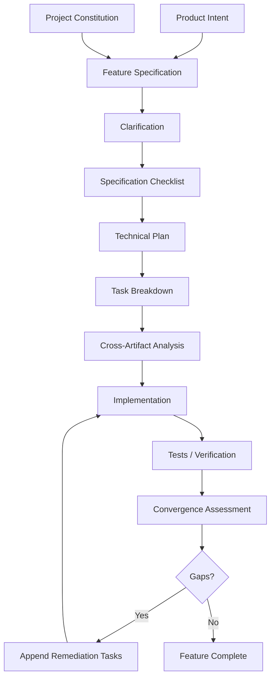
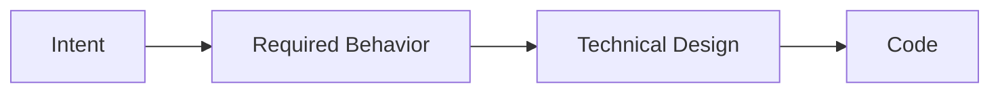
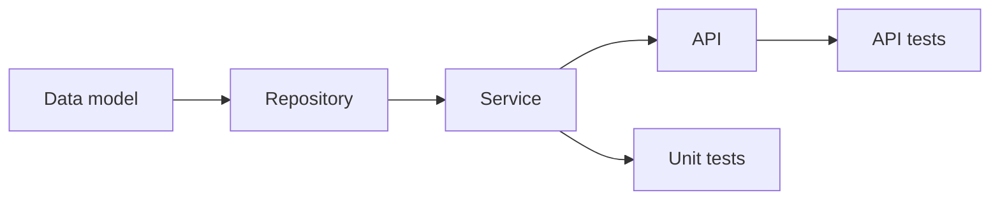
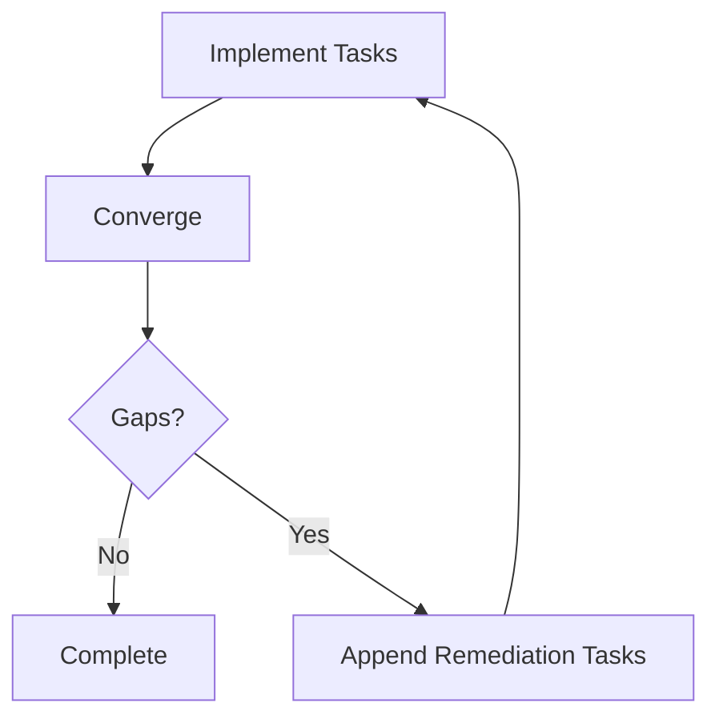
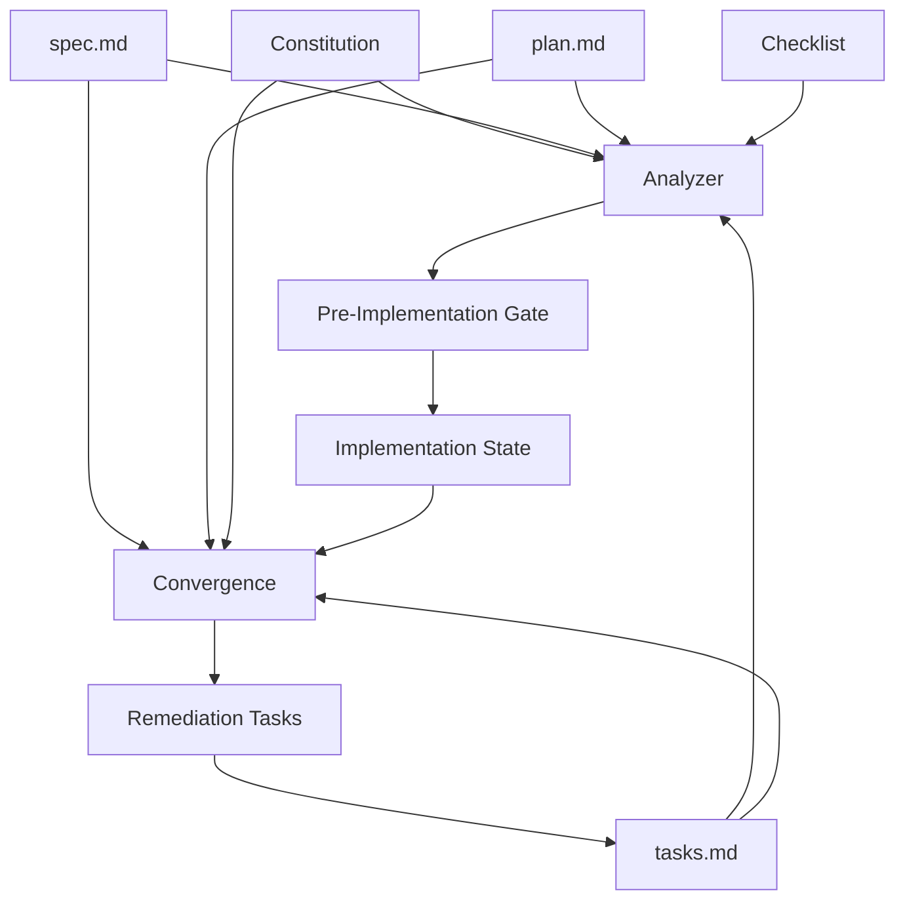
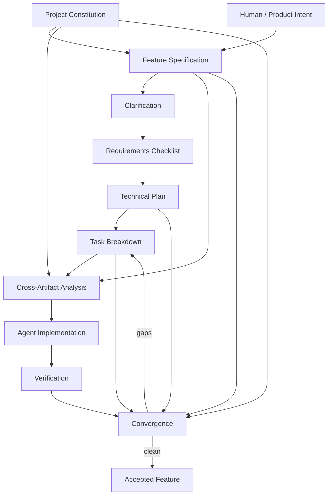
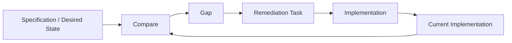
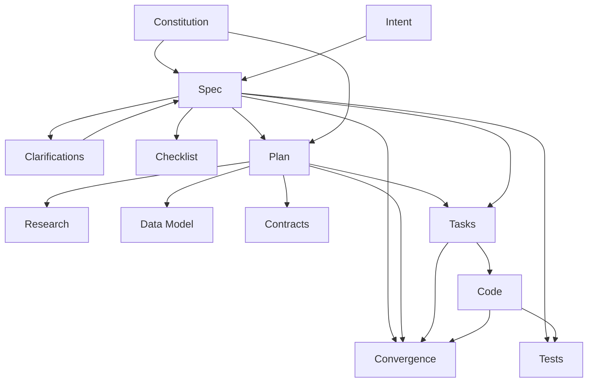
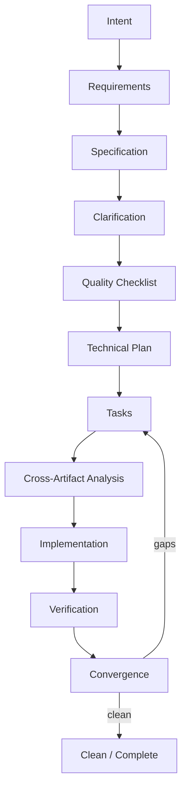

# Phase 6 — Spec-Driven Development

> **Track:** AI-Powered Software Development / Agentic Software Engineering  
> **Prerequisites:**  
> - Phase 1 — Generative AI for Software Engineers  
> - Phase 2 — Prompt Engineering for Software Development  
> - Phase 3 — Context Engineering for Software Development  
> - Phase 4 — Agentic AI Fundamentals  
> - Phase 5 — AI Coding Agent Mastery  
>
> **Phase goal:** Learn to turn product intent into durable, reviewable, testable engineering artifacts that coding agents can implement, analyze, verify, and converge against. This phase establishes Spec-Driven Development as the default workflow for serious features.

---

# Table of Contents

1. [How to Study This Phase](#how-to-study-this-phase)
2. [Learning Objectives](#learning-objectives)
3. [Why This Phase Matters](#why-this-phase-matters)
4. [The Core Transition](#the-core-transition)
5. [The Spec-Driven Development Mental Model](#the-spec-driven-development-mental-model)
6. [Module 52 — Requirements Engineering with AI](#module-52--requirements-engineering-with-ai)
7. [Module 53 — Intent-Driven Development](#module-53--intent-driven-development)
8. [Module 54 — Spec-Driven Development](#module-54--spec-driven-development)
9. [Module 55 — Project Constitution](#module-55--project-constitution)
10. [Module 56 — Feature Specifications](#module-56--feature-specifications)
11. [Module 57 — Requirements Clarification](#module-57--requirements-clarification)
12. [Module 58 — Technical Planning](#module-58--technical-planning)
13. [Module 59 — Task Decomposition](#module-59--task-decomposition)
14. [Module 60 — Acceptance Criteria](#module-60--acceptance-criteria)
15. [Module 61 — Cross-Artifact Analysis](#module-61--cross-artifact-analysis)
16. [Module 62 — Implementation from Specifications](#module-62--implementation-from-specifications)
17. [Module 63 — Specification Convergence](#module-63--specification-convergence)
18. [Module 64 — Specification ↔ Implementation Drift](#module-64--specification--implementation-drift)
19. [A Complete Spec-Kit-Style Workflow](#a-complete-spec-kit-style-workflow)
20. [Artifact Traceability](#artifact-traceability)
21. [Living Specs vs Historical Feature Specs](#living-specs-vs-historical-feature-specs)
22. [Specification Quality Engineering](#specification-quality-engineering)
23. [Requirements Risk and Prioritization](#requirements-risk-and-prioritization)
24. [Specification Testing](#specification-testing)
25. [AI Failure Modes in SDD](#ai-failure-modes-in-sdd)
26. [Practical Python Utilities](#practical-python-utilities)
27. [Worked Case Studies](#worked-case-studies)
28. [SDD Anti-Patterns](#sdd-anti-patterns)
29. [Practical Labs](#practical-labs)
30. [Review Questions](#review-questions)
31. [Scenario Exercises](#scenario-exercises)
32. [Phase Project — SpecFlow Lab](#phase-project--specflow-lab)
33. [Phase 6 Completion Checklist](#phase-6-completion-checklist)
34. [Where This Leads Next](#where-this-leads-next)
35. [Reference Baseline](#reference-baseline)

---

# How to Study This Phase

This phase is one of the most important in the entire track.

By now you know how to:

```text
understand the model
write strong prompts
engineer context
understand agents
operate coding agents
```

But there is still a major problem.

If you give a powerful coding agent:

```text
"Build project archiving."
```

the agent still has to infer:

```text
What exactly is archive?
Who may archive?
Is it reversible?
What happens to archived projects in listings?
What happens to audit history?
What happens to linked resources?
Does the schema change?
What API should exist?
What are the edge cases?
What proves completion?
```

A highly capable agent can generate a large amount of code very quickly.

That means ambiguity becomes **more dangerous**, not less dangerous.

Traditional software development sometimes hides ambiguity behind slow human implementation.

Agentic development can amplify ambiguity at machine speed.

Therefore the correct response is not:

```text
write an even longer prompt
```

The response is:

```text
externalize intent into structured artifacts
```

That is Spec-Driven Development.

---

# Learning Objectives

By the end of this phase, you should be able to:

1. Explain requirements engineering in agentic software development.
2. Distinguish:
   - stakeholder need,
   - intent,
   - requirement,
   - constraint,
   - assumption,
   - user story,
   - acceptance criterion,
   - success criterion,
   - technical design,
   - task.
3. Extract requirements from ambiguous natural language.
4. Detect missing requirements.
5. Detect conflicting requirements.
6. Separate **what** from **how**.
7. Explain intent-driven development.
8. Explain Spec-Driven Development.
9. Treat specifications as durable engineering artifacts.
10. Design a project constitution.
11. Distinguish constitutional principles from feature requirements.
12. Write feature specifications.
13. Write prioritized user stories.
14. Write functional requirements.
15. Write measurable success criteria.
16. Document edge cases.
17. Document assumptions.
18. Run structured clarification.
19. Rank ambiguities by impact.
20. Avoid asking unnecessary low-value questions.
21. Produce technical implementation plans.
22. Separate research decisions from implementation tasks.
23. Model data changes.
24. Define API/contracts.
25. Decompose plans into executable tasks.
26. Express task dependencies.
27. Identify parallelizable work.
28. Write strong acceptance criteria.
29. Build requirement-to-test traceability.
30. Use checklists as specification quality gates.
31. Perform cross-artifact consistency analysis.
32. Detect missing requirement coverage.
33. Detect contradictory artifacts.
34. Detect unjustified technical decisions.
35. Implement from specifications rather than chat history.
36. Verify implementation against specification.
37. Explain specification convergence.
38. Use an `implement → converge` loop.
39. Classify implementation gaps.
40. Detect unrequested implementation.
41. Explain specification drift.
42. Explain implementation drift.
43. Decide whether spec or implementation should change.
44. Maintain living specifications.
45. Preserve historical feature records where appropriate.
46. Use Git to review artifact evolution.
47. Build a full Spec-Kit-style workflow.
48. Design an SDD repository structure.
49. Build a small SDD automation/checking tool.
50. Make SDD the default workflow for serious agentic features.

---

# Why This Phase Matters

The old workflow:

```text
Prompt
  ↓
Generate lots of code
  ↓
Run some tests
  ↓
Hope the model understood the intent
```

has several weaknesses:

```text
requirements remain implicit
decisions disappear in chat history
tests may reflect model assumptions
reviewers do not know intended behavior
future agents cannot reconstruct intent
implementation can drift silently
```

Spec-Driven Development changes the source of authority.

Instead of:

```text
chat history
```

the durable source becomes:

```text
constitution
specification
plan
tasks
acceptance criteria
```

The agent works against artifacts.

The artifacts can be:

```text
reviewed
versioned
diffed
analyzed
reused
audited
```

---

# The Core Transition

The basic transition is:

```text
Intent
  ↓
Specification
  ↓
Plan
  ↓
Tasks
  ↓
Implementation
```

instead of:

```text
Prompt
  ↓
Huge amount of generated code
  ↓
Hope it works
```

For serious work, expand the lifecycle:

```text
Constitution
    ↓
Intent
    ↓
Specification
    ↓
Clarification
    ↓
Specification Quality Checklist
    ↓
Technical Plan
    ↓
Tasks
    ↓
Cross-Artifact Analysis
    ↓
Implementation
    ↓
Verification
    ↓
Convergence
    ↓
Repeat until clean
```

---

# The Spec-Driven Development Mental Model

A useful architecture:



The key concept is:

> **Implementation is not the source of truth. Implementation is one realization of the intended specification.**

---

# Module 52 — Requirements Engineering with AI

# 52.1 What Is Requirements Engineering?

Requirements engineering is the discipline of discovering, analyzing, documenting, validating, prioritizing, and managing what a system must do.

It includes:

```text
elicitation
analysis
specification
validation
change management
```

In agentic software development, this becomes more important because the agent can implement assumptions very quickly.

---

# 52.2 Stakeholder Need vs Requirement

Stakeholder statement:

```text
"We need to stop users from losing projects."
```

This is not yet an implementation-ready requirement.

Possible interpretations:

```text
soft delete
archive
undo
version history
backup
confirmation dialog
```

Requirements engineering transforms the statement into explicit behavior.

---

# 52.3 Intent

Intent is the desired outcome.

Example:

```text
Users should be able to remove inactive projects from normal work
without permanently losing historical information.
```

This is much stronger than:

```text
Add delete.
```

But it is still not a full specification.

---

# 52.4 Functional Requirement

Functional requirement describes required system behavior.

Example:

```text
FR-001:
An organization administrator MUST be able to archive an active project.
```

---

# 52.5 Non-Functional Requirement

Describes quality or operational constraints.

Examples:

```text
NFR-001:
Project archival MUST complete within 2 seconds for normal request load.

NFR-002:
Archived project data MUST remain available to audit administrators.
```

---

# 52.6 Constraint

Constraint limits solution space.

Example:

```text
No new infrastructure service may be introduced.
```

---

# 52.7 Assumption

An assumption is believed to be true but not guaranteed by the requirement.

Example:

```text
Assumption:
Projects currently have no legal-retention restrictions.
```

Unverified assumptions should be visible.

---

# 52.8 Business Rule

Example:

```text
A project with an active deployment cannot be archived.
```

This is domain behavior.

Do not bury it inside implementation code without specification.

---

# 52.9 Requirement Sources

Requirements may come from:

```text
stakeholders
product managers
support tickets
existing system behavior
contracts
regulations
design docs
tests
analytics
incident reports
```

Different sources have different authority.

---

# 52.10 Existing Code Is Not Automatically the Requirement

Current implementation:

```text
returns 200
```

Product requirement:

```text
should return 201
```

The code is evidence of current behavior, not necessarily desired behavior.

This distinction was introduced in Phase 3:

```text
CURRENT
vs
TARGET
```

It becomes central here.

---

# 52.11 AI as Requirements Analyst

AI can help:

```text
extract candidate requirements
identify ambiguity
find conflicts
generate questions
organize stories
identify edge cases
generate acceptance scenarios
```

But the model cannot invent authoritative business policy.

---

# 52.12 Example — Ambiguous Request

Input:

```text
"Add project archive."
```

AI requirements analysis might identify:

```text
Who can archive?
Can archived projects be restored?
Are archived projects visible?
What happens to project members?
What happens to active jobs?
Should URLs still resolve?
Should archived projects be editable?
Is there an audit record?
```

These are **questions**, not answers.

---

# 52.13 Requirement Risk Categories

Classify unknowns.

## Product behavior

```text
What does archive mean?
```

## Authorization

```text
Who may archive?
```

## Data lifecycle

```text
Is data retained?
```

## Compatibility

```text
Does existing API change?
```

## Performance

```text
Does operation need async processing?
```

## Compliance

```text
Retention restrictions?
```

---

# 52.14 High-Impact Ambiguity

High-impact ambiguity affects:

```text
public API
security
authorization
database schema
persistent data
billing
legal/compliance
irreversible behavior
```

These should rarely be guessed.

---

# 52.15 Low-Impact Ambiguity

Examples:

```text
private helper name
local variable name
test fixture name
```

Follow repository conventions.

---

# 52.16 Requirement Quality Attributes

A good requirement should be:

```text
clear
testable
necessary
consistent
traceable
implementation-independent where possible
```

---

# 52.17 Requirement Smell — "User Friendly"

```text
The archive flow should be user friendly.
```

Not testable.

Better:

```text
After successful archival, the user is returned to the project list
and receives confirmation that the project was archived.
```

---

# 52.18 Requirement Smell — "Fast"

```text
The endpoint should be fast.
```

Better:

```text
P95 archival request latency should remain below 500 ms
for the expected request volume.
```

Only use metric if product genuinely requires it.

---

# 52.19 Requirement Smell — Implementation Disguised as Requirement

```text
Use Redis to store archive state.
```

This is a technical decision.

The requirement may actually be:

```text
Archive state must be persisted and visible across application instances.
```

---

# 52.20 Requirement Traceability ID

Use identifiers:

```text
FR-001
FR-002
NFR-001
SC-001
AC-001
```

Identifiers allow downstream traceability.

---

# 52.21 Requirements Table

| ID | Type | Requirement | Source | Priority |
|---|---|---|---|---|
| FR-001 | Functional | Admin can archive project | Product | Must |
| FR-002 | Functional | Archived project hidden from normal list | Product | Must |
| FR-003 | Functional | Admin can restore project | Product | Should |
| NFR-001 | Security | Non-admin cannot archive | Security | Must |

---

# Module 53 — Intent-Driven Development

# 53.1 What Is Intent-Driven Development?

Intent-driven development centers the desired outcome rather than immediately specifying code.

Instead of:

```text
Create `ArchiveService`.
Add `archived_at`.
Add `/archive` endpoint.
```

begin:

```text
Organization administrators need to remove inactive projects
from normal workflows while preserving project history.
```

This creates space to choose the correct design.

---

# 53.2 Why Intent Matters

If you start from implementation too early, you may lock into the wrong solution.

Intent:

```text
temporarily hide inactive projects
```

Possible solutions:

```text
status enum
archived_at
soft delete
separate lifecycle model
```

The design should follow requirements.

---

# 53.3 Intent → Behavior → Design



Not:

```text
Intent
→ first implementation idea
→ code
```

---

# 53.4 Intent Is Not Vague Product Poetry

Bad:

```text
"Make collaboration delightful."
```

Useful intent:

```text
Multiple organization members need to update project metadata
without unintentionally overwriting each other's changes.
```

Now engineering concerns emerge:

```text
concurrency
versioning
conflict detection
```

---

# 53.5 Outcome Boundary

Intent should answer:

```text
Who benefits?
What outcome changes?
What system boundary is involved?
```

---

# 53.6 Intent and Constraints

Example:

```text
Intent:
Allow users to recover accidentally removed projects.

Constraint:
Data must remain recoverable for 30 days.
```

Now permanent deletion is not valid.

---

# 53.7 Intent as Stable Anchor

Technical implementation may evolve.

Intent often remains stable.

```text
v1:
archived_at timestamp

v2:
lifecycle state machine
```

Both may serve same intent.

This is why the specification should preserve **why**.

---

# Module 54 — Spec-Driven Development

# 54.1 What Is SDD?

For this track:

> **Spec-Driven Development is a software development process where structured specifications and derived artifacts become the authoritative representation of intent, and implementation is produced, checked, and evolved against those artifacts.**

---

# 54.2 Specification as Executable Context

"Executable" does not necessarily mean the spec directly compiles into machine code.

It means the specification becomes operational input to:

```text
planning
task generation
agent implementation
testing
analysis
convergence
```

---

# 54.3 SDD Artifact Flow

```text
spec.md
   ↓
plan.md
   ↓
tasks.md
   ↓
implementation
```

Supporting artifacts may include:

```text
research.md
data-model.md
contracts/
quickstart.md
checklists/
```

Exact outputs depend on workflow/template.

---

# 54.4 Why Markdown Works Well

Markdown is:

```text
human-readable
LLM-readable
Git-friendly
diffable
portable
```

It is not the only format, but it is practical.

---

# 54.5 Artifact Authority

A common hierarchy:

```text
Constitution
    ↓
Feature Specification
    ↓
Plan
    ↓
Tasks
    ↓
Implementation
```

Lower-level artifacts should not contradict higher-level intent.

---

# 54.6 Derived Artifact Principle

If:

```text
spec changes
```

then:

```text
plan may need regeneration
tasks may need regeneration
implementation may need update
```

Do not silently preserve stale downstream artifacts.

---

# 54.7 SDD Is Not Big Design Up Front

SDD should not mean:

```text
write 200 pages before coding
```

The artifacts should match task complexity.

Small feature:

```text
short spec
short plan
few tasks
```

Large feature:

```text
deeper artifacts
```

---

# 54.8 SDD Is Not Waterfall

Artifacts can evolve.

The difference is that changes are made **explicitly and traceably**.

```text
discover requirement
→ update spec
→ update plan/tasks
→ implementation follows
```

---

# 54.9 SDD and Agents

Agents benefit because they receive:

```text
stable intent
structured context
clear boundaries
measurable completion
```

This reduces reliance on chat memory.

---

# 54.10 SDD and Humans

Humans benefit because they can review:

```text
what is being built
before
thousands of lines are generated
```

---

# Module 55 — Project Constitution

# 55.1 What Is a Project Constitution?

A constitution defines durable project-level principles.

It answers:

```text
What rules govern all features?
```

Examples:

```text
architecture
testing expectations
security requirements
compatibility policy
quality gates
dependency rules
observability rules
```

---

# 55.2 Constitution vs Feature Spec

Constitution:

```text
All routes MUST delegate business logic to services.
```

Feature spec:

```text
Admin can archive a project.
```

One is global.

One is feature-specific.

---

# 55.3 Constitution Authority

Constitution should represent principles that are:

```text
stable
important
cross-cutting
non-negotiable or explicitly governed
```

Do not put temporary feature details there.

---

# 55.4 Example Constitution

```markdown
# Project Constitution

## Principle I — Layered Architecture

Application dependencies MUST follow:

api → services → repositories → models

Routes MUST NOT issue database queries directly.

## Principle II — Testable Behavior

Every behavior change MUST include automated verification
at the lowest appropriate level.

Bug fixes SHOULD include regression coverage.

## Principle III — API Compatibility

Existing public API contracts MUST remain backward compatible
unless the feature specification explicitly authorizes a breaking change.

## Principle IV — Security

Authorization MUST be enforced server-side.

Secrets MUST NOT be committed or logged.

## Principle V — Dependency Discipline

New runtime dependencies MUST have explicit justification.

Existing dependencies SHOULD be reused when they adequately solve the need.

## Principle VI — Completion

A feature is not complete until:
- required tests pass
- lint/type checks pass
- implementation is reviewed against the specification
```

---

# 55.5 MUST / SHOULD / MAY

Normative language helps.

```text
MUST
= mandatory

SHOULD
= expected unless justified

MAY
= optional
```

Be consistent.

---

# 55.6 Constitution Smell — Too Specific

Bad:

```text
Project archive button must be blue.
```

Feature-specific.

---

# 55.7 Constitution Smell — Too Vague

```text
Write good code.
```

Not actionable.

---

# 55.8 Constitution Smell — Impossible Rule

```text
Every function MUST have 100% branch coverage.
```

May create waste if not genuinely required.

Constitution should encode valuable principles.

---

# 55.9 Constitution Evolution

Constitution can change.

But global rules should not be casually rewritten to make one feature easier.

Change process should include:

```text
reason
impact
migration
version/date
```

---

# Module 56 — Feature Specifications

# 56.1 Purpose

The feature specification defines:

```text
what users/system need
```

without overcommitting to technical implementation.

---

# 56.2 Recommended Sections

A strong feature spec may include:

```text
feature purpose
user stories
functional requirements
success criteria
edge cases
assumptions
out of scope
```

---

# 56.3 User Stories

Example:

```text
US-1 — Archive Project

As an organization administrator,
I want to archive an inactive project,
so that it no longer appears in normal workflows
while its historical record remains available.
```

---

# 56.4 Prioritization

Use priorities such as:

```text
P1
P2
P3
```

P1 should ideally provide independently useful value.

---

# 56.5 Independently Testable Story

Weak story:

```text
"Create database column."
```

That is a technical task.

Strong story:

```text
Admin can archive a project and no longer sees it in normal listings.
```

---

# 56.6 Acceptance Scenario

```text
Given:
an active project owned by Organization A

And:
the current user is an Organization A administrator

When:
the user archives the project

Then:
the project is marked archived

And:
it no longer appears in the normal project list
```

---

# 56.7 Functional Requirement IDs

Example:

```text
FR-001:
System MUST allow organization administrators to archive active projects.

FR-002:
System MUST exclude archived projects from normal project listings.

FR-003:
System MUST retain archived project history.
```

---

# 56.8 Success Criteria

Success criterion should describe observable successful outcome.

Example:

```text
SC-001:
An authorized administrator can archive a project and observe
that it no longer appears in the default project list.
```

Avoid implementation metrics unless necessary.

---

# 56.9 Success Criterion vs Acceptance Criterion

They overlap but can operate at different levels.

Feature success:

```text
Admin can archive.
```

Detailed acceptance:

```text
Archive request returns 204.
Archived project is excluded from GET /projects.
```

Use your project template consistently.

---

# 56.10 Edge Cases

Examples:

```text
already archived project
project with active deployment
cross-tenant project ID
concurrent archive requests
restoration
```

---

# 56.11 Out of Scope

Explicitly state:

```text
Permanent deletion is out of scope.
Bulk archival is out of scope.
Automatic archival is out of scope.
```

This controls agent expansion.

---

# 56.12 Assumptions

Example:

```text
Current audit subsystem is sufficient for archive events.
```

Assumptions should be validated during planning.

---

# 56.13 Avoid Premature Technical Detail

Feature spec:

```text
System must retain archive timestamp.
```

May be a requirement if timestamp is business-visible.

But:

```text
Use PostgreSQL TIMESTAMPTZ column named archived_at.
```

belongs in technical planning unless externally mandated.

---

# Module 57 — Requirements Clarification

# 57.1 Why Clarification Exists

The initial spec is rarely perfect.

Clarification systematically resolves uncertainty before technical planning.

---

# 57.2 Clarification Goal

Not:

```text
ask as many questions as possible
```

Goal:

```text
remove high-impact ambiguity
```

---

# 57.3 Clarification Categories

Look for ambiguity in:

```text
scope
actors
permissions
data lifecycle
failure behavior
edge cases
external integration
performance
security
compatibility
```

---

# 57.4 Impact-First Clarification

Question priority:

```text
security/data/API
    ↓
core business behavior
    ↓
edge cases
    ↓
minor UX/detail
```

---

# 57.5 Example

Spec:

```text
Users can archive projects.
```

Critical question:

```text
Which roles may archive projects?
```

High impact.

Low-value question:

```text
Should the internal helper be called `archive_project`?
```

Not clarification.

---

# 57.6 Closed-Choice Questions

When possible, present meaningful options.

Example:

```text
When an archived project is requested directly, should the API:

A. Return 404 to hide archived resources.
B. Return 410 Gone.
C. Return the archived project with status metadata.
```

This helps stakeholders decide.

---

# 57.7 Open Questions

Use when options are unknown.

```text
What retention policy applies to archived projects?
```

---

# 57.8 Record Clarifications in the Spec

Do not let answer live only in chat.

If decision:

```text
Archived projects return 404 from normal project endpoint.
```

update specification.

---

# 57.9 Clarification Trace

Optional table:

| Question | Decision | Spec Impact |
|---|---|---|
| Who archives? | Org admin | FR-001 |
| Restore supported? | Yes | US-2, FR-004 |
| Direct read? | 404 | FR-005 |

---

# 57.10 Stop Clarifying When Enough Is Known

Do not delay implementation indefinitely.

A specification can still contain explicit assumptions or deferred decisions for low-risk details.

---

# Module 58 — Technical Planning

# 58.1 What Is the Plan?

The specification defines:

```text
what
```

The plan defines:

```text
how
```

---

# 58.2 Plan Inputs

```text
constitution
spec
repository architecture
existing technology
research
constraints
```

---

# 58.3 Plan Outputs

A technical plan may include:

```text
architecture
affected components
data model
API/contracts
technical decisions
migration strategy
verification strategy
implementation phases
```

---

# 58.4 Research Before Commitment

Unknown library behavior?

Do not guess.

Research:

```text
current API
package version
migration guidance
existing repo pattern
```

Store important findings.

---

# 58.5 Research Artifact

Example:

```markdown
# Research

## Decision
Use existing ProjectStatus enum rather than adding archived_at.

## Evidence
ProjectStatus already models lifecycle transitions and is used by
all project queries.

## Alternative
archived_at timestamp.

## Rejected Because
Would introduce parallel lifecycle mechanisms.
```

---

# 58.6 Architecture Plan

Example:

```text
API
→ ProjectService.archive
→ ProjectRepository.update_status
→ audit event
```

---

# 58.7 Data Model

Document changes.

Example:

```text
Project.status:
ACTIVE | ARCHIVED
```

Or if new field:

```text
archived_at: nullable timestamp
```

---

# 58.8 Contracts

If API changes:

```text
request
response
errors
authorization
```

should be explicit.

---

# 58.9 Migration Plan

For data changes include:

```text
upgrade
backfill
compatibility
rollback
```

---

# 58.10 Technical Risk

Plan should identify:

```text
schema migration
race condition
performance
cross-service dependency
security
```

---

# 58.11 Plan Must Satisfy Constitution

Example:

Constitution:

```text
Routes MUST NOT access DB directly.
```

Plan:

```text
Archive route updates Project model directly.
```

Conflict.

Cross-artifact analysis should catch it later, but plan review should catch it now.

---

# 58.12 Planning Is Derived

If spec changes:

```text
plan must be reconsidered
```

The plan cannot override the requirement.

---

# Module 59 — Task Decomposition

# 59.1 From Plan to Executable Work

A plan is too high-level for direct implementation in many cases.

Tasks convert:

```text
technical design
```

into:

```text
ordered units of work
```

---

# 59.2 Good Task Properties

A task should be:

```text
clear
bounded
traceable
verifiable
dependency-aware
```

---

# 59.3 Example Task

```text
T005 [US1]
Update ProjectRepository listing query to exclude archived projects.

Files:
- app/repositories/projects.py

Verification:
- repository listing test excludes archived projects.
```

---

# 59.4 Task Traceability

Link task to:

```text
user story
requirement
plan section
```

---

# 59.5 Task Ordering

Example:

```text
T001 add data model support
T002 migration
T003 repository
T004 service
T005 API
T006 tests
```

But if tests-first workflow:

```text
characterization/regression tests may precede implementation.
```

---

# 59.6 Parallel Tasks

Tasks can be marked parallel when independent.

Example:

```text
[P] API docs
[P] frontend UI
```

after shared contract exists.

---

# 59.7 Avoid File Collision in Parallel Work

Two tasks modifying same file should generally not be assigned as independent parallel tasks.

---

# 59.8 Task Granularity

Too large:

```text
T001 Build archive feature.
```

Too small:

```text
T001 add import
T002 add blank line
```

Right size:

```text
implement one coherent behavior or component change
```

---

# 59.9 Task Completion Condition

Each task should have evidence.

```text
code exists
test passes
contract updated
```

---

# 59.10 Task Dependency Graph



---

# Module 60 — Acceptance Criteria

# 60.1 Acceptance Criteria Define Observable Completion

Acceptance criteria answer:

```text
What must be true for the requirement to be accepted?
```

---

# 60.2 Given / When / Then

Example:

```text
Given an active project
and an authorized organization admin

When the admin archives the project

Then the archive succeeds
and the project no longer appears in default listings.
```

---

# 60.3 Positive Case

```text
authorized admin archives
```

---

# 60.4 Negative Case

```text
non-admin receives 403
```

---

# 60.5 Boundary Case

```text
already archived project
```

---

# 60.6 Security Case

```text
admin from Organization B cannot archive Organization A project
```

---

# 60.7 Concurrency Case

If relevant:

```text
two archive requests do not corrupt state
```

---

# 60.8 Acceptance Criteria Should Avoid Internal Implementation

Bad:

```text
Service calls repository exactly once.
```

Unless architecture/performance requires it.

Better:

```text
Archival is idempotent.
```

---

# 60.9 Acceptance Criteria as Test Design Input

Map:

```text
AC-001
→ test_admin_can_archive_project

AC-002
→ test_non_admin_cannot_archive

AC-003
→ test_archived_hidden_from_list
```

---

# 60.10 Acceptance Criteria Are Not Test Code

Tests are one implementation of verification.

Criterion remains business/system behavior.

---

# Module 61 — Cross-Artifact Analysis

# 61.1 Why Analyze Before Implementing?

Artifacts can diverge before any code is written.

Example:

Spec:

```text
restore is required
```

Plan:

```text
archive only
```

Tasks:

```text
no restore task
```

If implementation begins now, restore is likely omitted.

---

# 61.2 Analysis Inputs

```text
constitution
spec
plan
tasks
```

Possibly supporting:

```text
data model
contracts
checklists
```

---

# 61.3 Coverage Analysis

Question:

```text
Does every requirement have downstream implementation coverage?
```

---

# 61.4 Consistency Analysis

Question:

```text
Do artifacts contradict each other?
```

---

# 61.5 Duplication Analysis

Example:

```text
FR-003 and FR-008 describe same requirement differently.
```

Could cause inconsistency.

---

# 61.6 Ambiguity Analysis

Example:

```text
"appropriate error"
```

Still vague.

---

# 61.7 Constitution Compliance

Plan/task must obey global rules.

---

# 61.8 Traceability Matrix

| Requirement | Plan | Task | Acceptance |
|---|---|---|---|
| FR-001 archive | §3.1 | T004,T005 | AC-001 |
| FR-002 hide list | §3.2 | T006 | AC-002 |
| FR-003 audit | §3.4 | T008 | AC-004 |

Missing cell:

```text
warning
```

---

# 61.9 Severity

Findings can be ranked:

```text
critical
high
medium
low
```

Example:

```text
Constitution MUST violation:
critical/highest priority
```

---

# 61.10 Analysis Is Read-Only

A good analysis phase should usually report inconsistencies before implementation.

Do not hide gaps by silently rewriting artifacts.

---

# 61.11 Resolve Before Implementing

Especially:

```text
CRITICAL
HIGH
```

Then rerun analysis.

A good workflow:

```text
analyze
→ fix artifacts
→ analyze
→ clean
→ implement
```

---

# Module 62 — Implementation from Specifications

# 62.1 Implementation Source of Intent

The agent should implement from:

```text
constitution
spec
plan
tasks
```

not from memory of earlier conversation.

---

# 62.2 Pre-Implementation Check

Before implementation:

```text
artifacts exist
analysis clean enough
working tree understood
dependencies ready
```

---

# 62.3 Task-by-Task Execution

For each task:

```text
read task
read related requirement
edit
verify
mark complete
```

---

# 62.4 Preserve Traceability

If task T007 implements FR-004:

```text
tests or report should make connection visible
```

---

# 62.5 Implementation Should Not Invent Scope

Agent discovers:

```text
maybe bulk archive would be nice
```

Not in spec.

Do not add it.

This is **unrequested work**.

---

# 62.6 When Implementation Reveals Missing Requirement

Example:

```text
What should happen to scheduled deployments?
```

Spec does not say.

Do not guess if high impact.

Return to:

```text
clarification/spec update
```

Then update downstream artifacts.

---

# 62.7 Specification Feedback Loop

Implementation can reveal flaws in spec.

That is normal.

Correct response:

```text
code discovery
→ update spec
→ update plan/tasks
→ continue
```

not:

```text
hide decision in code
```

---

# 62.8 Implementation Verification

Run:

```text
task-level tests
story-level tests
broader regression
```

as appropriate.

---

# 62.9 Done Is Not "tasks.md checked"

All tasks marked complete does not prove spec satisfied.

This is why convergence exists.

---

# Module 63 — Specification Convergence

# 63.1 What Is Convergence?

Convergence asks:

> **Does the current implementation actually satisfy the specification, plan, and task intent?**

This is different from:

```text
Did the agent execute every listed task?
```

---

# 63.2 Why Convergence Is Needed

Tasks may be:

```text
missing
incomplete
incorrectly interpreted
implemented partially
```

Implementation may also contain:

```text
unrequested work
```

---

# 63.3 Convergence Inputs

Core:

```text
spec.md
plan.md
tasks.md
current codebase
constitution
```

---

# 63.4 Convergence Gap Types

A useful classification:

```text
missing
partial
contradicts
unrequested
```

### Missing

Required behavior absent.

### Partial

Behavior exists but incomplete.

### Contradicts

Implementation conflicts with specification or constitutional rule.

### Unrequested

Implementation includes behavior not requested.

---

# 63.5 Example — Missing

Spec:

```text
admin can restore archived project
```

Code:

```text
archive exists
restore absent
```

---

# 63.6 Example — Partial

Spec:

```text
archived project hidden everywhere in normal workflows
```

Code:

```text
hidden from list
but search still returns it
```

---

# 63.7 Example — Contradicts

Constitution:

```text
route MUST not access DB directly
```

Code:

```text
archive route executes SQL
```

---

# 63.8 Example — Unrequested

Spec:

```text
manual archive
```

Code also:

```text
auto-archives after 90 days
```

Unrequested behavior may be harmful.

---

# 63.9 Convergence Loop



---

# 63.10 Append-Only Remediation

A useful convergence model preserves historical tasks and appends new work.

Why?

```text
auditability
traceability
no rewriting history
```

---

# 63.11 Convergence Is Not Git Diff Review

Diff asks:

```text
What changed?
```

Convergence asks:

```text
Does present code satisfy intended state?
```

A feature could be incomplete even if the latest diff looks clean.

---

# 63.12 Convergence Completion

Stop when:

```text
no meaningful specification gaps remain
```

subject to project quality gates.

---

# 63.13 Convergence and Tests

Tests support convergence but do not replace it.

A requirement may lack a test entirely.

Convergence should detect missing behavior from spec.

---

# Module 64 — Specification ↔ Implementation Drift

# 64.1 What Is Drift?

Drift occurs when:

```text
specification
and
implementation
```

no longer describe the same system.

---

# 64.2 Specification Drift

Spec becomes outdated while code intentionally evolves.

Example:

```text
API returns 202 now
spec still says 200
```

---

# 64.3 Implementation Drift

Code changes without corresponding intended spec change.

Example:

```text
spec says tenant isolation
implementation accidentally removes organization filter
```

---

# 64.4 Which One Is Wrong?

You need authority/context.

Possible cases:

```text
spec correct, code wrong
code intentionally updated, spec stale
both wrong
requirement changed but artifacts not propagated
```

---

# 64.5 Drift Detection Sources

```text
convergence
tests
contract tests
OpenAPI
schema diff
code review
production behavior
```

---

# 64.6 Living Spec Model

In a living-spec model:

```text
spec.md is current contract
```

When intent changes:

```text
update spec first
→ update plan
→ update tasks
→ analyze
→ implement
→ converge
```

---

# 64.7 Flow-Forward Historical Model

For larger follow-up changes:

```text
create new feature spec
```

Preserve old feature directory as history.

This supports:

```text
audit
comparison
evolution
```

---

# 64.8 Drift Is Inevitable Without Maintenance

The goal is not:

```text
prevent all drift forever
```

The goal is:

```text
detect
make explicit
reconcile
```

---

# 64.9 Automated Drift Checks

Examples:

```text
OpenAPI generated from code vs committed contract
DB schema vs data-model docs
feature tests vs acceptance criteria
```

---

# A Complete Spec-Kit-Style Workflow

A current Spec-Kit-style workflow can be represented as:

```text
constitution
    ↓
specify
    ↓
clarify
    ↓
plan
    ↓
checklist
    ↓
tasks
    ↓
analyze
    ↓
implement
    ↓
converge
```

The exact command syntax depends on integration.

Examples may appear as:

```text
/speckit.specify
```

or agent skills such as:

```text
$speckit-specify
```

Use the syntax supported by your coding-agent integration.

---

# 65.1 Constitution

Purpose:

```text
establish governing project principles
```

Artifact:

```text
constitution
```

---

# 65.2 Specify

Purpose:

```text
turn natural-language feature intent into structured requirements
```

Artifact:

```text
spec.md
```

---

# 65.3 Clarify

Purpose:

```text
resolve underspecified, high-impact requirements
```

Updates:

```text
specification
```

---

# 65.4 Plan

Purpose:

```text
derive technical implementation strategy
```

Artifacts may include:

```text
plan.md
research.md
data-model.md
contracts/
quickstart.md
```

depending on feature/templates.

---

# 65.5 Checklist

Purpose:

```text
validate specification quality
```

Think:

```text
"unit tests for requirements"
```

Checklist should test:

```text
clarity
completeness
consistency
coverage
```

not implementation correctness.

---

# 65.6 Tasks

Purpose:

```text
derive actionable implementation work
```

Artifact:

```text
tasks.md
```

---

# 65.7 Analyze

Purpose:

```text
cross-check constitution/spec/plan/tasks
```

Look for:

```text
missing coverage
inconsistency
ambiguity
duplication
constitutional conflict
```

---

# 65.8 Implementation Gate

Resolve remaining:

```text
CRITICAL
HIGH
```

findings before implementation.

Then rerun analysis.

Desired:

```text
clean or consciously accepted lower-risk findings
```

---

# 65.9 Implement

Purpose:

```text
execute task breakdown
```

Agent should mark progress and verify work.

---

# 65.10 Converge

Purpose:

```text
compare current codebase with artifacts
```

If gaps:

```text
append remediation tasks
```

Then:

```text
implement
→ converge
→ implement
→ converge
```

until clean.

---

# 65.11 Recommended Serious-Feature Workflow

For your default workflow:

```text
$speckit-constitution
$speckit-specify
$speckit-clarify
$speckit-plan
$speckit-checklist
$speckit-tasks
$speckit-analyze

Resolve CRITICAL/HIGH findings.
Rerun analyze until clean.

$speckit-implement
$speckit-converge

If converge adds tasks:
$speckit-implement
$speckit-converge

Repeat until clean.
```

This is a much stronger process than one-shot code generation.

---

# Artifact Traceability

# 66.1 Why Traceability Matters

You should be able to answer:

```text
Why does this line/feature exist?
Which requirement asked for it?
Which task implemented it?
Which test verifies it?
```

---

# 66.2 Traceability Chain

```text
Intent
→ User Story
→ Functional Requirement
→ Acceptance Criterion
→ Plan Decision
→ Task
→ Code
→ Test
```

---

# 66.3 Traceability Matrix

| Requirement | Story | Plan | Task | Code | Test |
|---|---|---|---|---|---|
| FR-001 | US-1 | §3.1 | T004 | ProjectService | test_archive |
| FR-002 | US-1 | §3.2 | T005 | ProjectRepository | test_list_hidden |

---

# 66.4 Traceability Gaps

If:

```text
requirement has no task
```

implementation may miss it.

If:

```text
code has no requirement
```

it may be unrequested.

---

# 66.5 Test Traceability

Tests should prove important requirements.

Not necessarily one-to-one, but coverage should be visible.

---

# Living Specs vs Historical Feature Specs

# 67.1 Living Spec

Use when:

```text
spec is current contract for evolving behavior
```

Update same spec as intent changes.

Then regenerate downstream artifacts.

---

# 67.2 Flow-Forward Specs

Use when:

```text
each feature/change should remain historical
```

Create new spec for major follow-up.

Previous remains record.

---

# 67.3 Choosing

Living spec suits:

```text
stable capability continuously refined
```

Flow-forward suits:

```text
auditable sequence of feature changes
```

Projects can mix approaches.

---

# Specification Quality Engineering

# 68.1 Treat Specification Like Code

Specs can have defects:

```text
ambiguity
contradiction
duplication
missing edge case
unmeasurable success
implementation leakage
```

Therefore specs need review.

---

# 68.2 Specification Checklist Example

```markdown
# Requirements Quality Checklist

- [ ] Every P1 story is independently testable.
- [ ] Every functional requirement uses unambiguous normative language.
- [ ] Authorization behavior is explicit.
- [ ] Data deletion/retention semantics are explicit.
- [ ] Public API changes are explicit.
- [ ] Edge cases include duplicate/repeated operations.
- [ ] Success criteria are measurable or directly observable.
- [ ] Out-of-scope behavior is documented.
- [ ] No technical design is presented as a product requirement without reason.
```

---

# 68.3 Checklist vs Tests

Checklist:

```text
Is requirement well written?
```

Test:

```text
Does implementation satisfy requirement?
```

Different quality layer.

---

# 68.4 Specification Linting

Some defects can be automatically flagged:

```text
"fast"
"user friendly"
"appropriate"
"etc."
"TBD"
```

Not always wrong, but suspicious.

---

# Requirements Risk and Prioritization

# 69.1 Prioritize User Value

P1:

```text
minimum independently useful outcome
```

P2/P3:

```text
additional value
```

---

# 69.2 Prioritize Risk

High-risk requirement:

```text
authorization
payment
data deletion
migration
```

should receive deeper clarification and acceptance criteria.

---

# 69.3 Story Independence

If P1 cannot function without P2:

```text
priority structure may be wrong
```

---

# 69.4 Vertical Slices

Prefer story:

```text
admin can archive one project end-to-end
```

over:

```text
build database layer for all future lifecycle features
```

---

# Specification Testing

# 70.1 Requirements Can Be Tested Before Code

Ask:

```text
Can we derive an unambiguous test from this requirement?
```

If not, requirement may be vague.

---

# 70.2 Example

Requirement:

```text
Archive should work correctly.
```

Cannot derive clear test.

Rewrite.

---

# 70.3 Model-Based Scenario Enumeration

AI can propose cases:

```text
authorized
unauthorized
already archived
cross-tenant
active deployment
concurrent archive
```

Human decides which are requirements.

---

# 70.4 Property-Style Criteria

Example:

```text
For any project not owned by the user's organization,
archive request must not modify the project.
```

This defines a general invariant.

---

# AI Failure Modes in SDD

# 71.1 The Agent Invents Requirements

Model adds:

```text
automatic archival after 90 days
```

not requested.

Prevent with:

```text
spec authority
unrequested-work convergence detection
```

---

# 71.2 The Spec Overfits Current Code

AI reads implementation and rewrites current behavior as requirement.

This can preserve bugs.

Separate:

```text
current
vs
desired
```

---

# 71.3 The Plan Overrides the Spec

Plan says:

```text
no restore
```

spec requires restore.

Spec wins unless changed deliberately.

---

# 71.4 Tasks Lose Requirements

Requirement exists but no task.

Use cross-artifact analysis.

---

# 71.5 Checklist Becomes Implementation Checklist

Wrong:

```text
[ ] archive endpoint implemented
```

for requirements-quality checklist.

Better:

```text
[ ] archive authorization requirement identifies permitted roles
```

---

# 71.6 Analyze Produces Noise

Do not mechanically fix every low-severity wording comment.

Prioritize real gaps.

---

# 71.7 Implementation Checks Boxes Without Behavior

Task marked complete but feature incomplete.

Use convergence.

---

# 71.8 Spec Becomes Massive

A 10,000-line spec for a tiny feature is counterproductive.

Use proportional detail.

---

# 71.9 Constitution Becomes Feature Dump

Global rule file grows endlessly.

Keep durable principles only.

---

# 71.10 Chat Becomes Hidden Source of Truth

Decision:

```text
"Actually admins only."
```

stays in chat but not spec.

Later agent misses it.

Always persist authoritative decisions.

---

# Practical Python Utilities

# 72.1 Requirement Model

```python
from typing import Literal
from pydantic import BaseModel


class Requirement(BaseModel):
    id: str
    kind: Literal[
        "functional",
        "non_functional",
        "constraint",
    ]
    text: str
    priority: Literal[
        "must",
        "should",
        "may",
    ]
```

---

# 72.2 User Story Model

```python
class UserStory(BaseModel):
    id: str
    priority: int
    actor: str
    goal: str
    value: str
    requirement_ids: list[str]
```

---

# 72.3 Acceptance Criterion Model

```python
class AcceptanceCriterion(BaseModel):
    id: str
    requirement_id: str
    given: str
    when: str
    then: list[str]
```

---

# 72.4 Plan Decision

```python
class TechnicalDecision(BaseModel):
    id: str
    topic: str
    decision: str
    rationale: str
    alternatives: list[str]
    requirement_ids: list[str]
```

---

# 72.5 Task Model

```python
class Task(BaseModel):
    id: str
    title: str
    requirement_ids: list[str]
    depends_on: list[str]
    parallel: bool = False
    verification: list[str]
```

---

# 72.6 Coverage Checker

```python
def uncovered_requirements(
    requirements: list[Requirement],
    tasks: list[Task],
) -> list[str]:
    covered = {
        req_id
        for task in tasks
        for req_id in task.requirement_ids
    }

    return [
        requirement.id
        for requirement in requirements
        if requirement.id not in covered
    ]
```

---

# 72.7 Duplicate Requirement Detector

Simplified exact normalization:

```python
import re


def normalize_requirement(
    text: str,
) -> str:
    normalized = text.lower()
    normalized = re.sub(
        r"\s+",
        " ",
        normalized,
    )

    return normalized.strip()


def duplicate_requirements(
    requirements: list[Requirement],
) -> list[tuple[str, str]]:
    seen: dict[str, str] = {}
    duplicates: list[tuple[str, str]] = []

    for requirement in requirements:
        key = normalize_requirement(
            requirement.text
        )

        if key in seen:
            duplicates.append(
                (
                    seen[key],
                    requirement.id,
                )
            )
        else:
            seen[key] = requirement.id

    return duplicates
```

Semantic duplicates need smarter analysis.

---

# 72.8 Traceability Matrix Builder

```python
def traceability(
    requirements: list[Requirement],
    tasks: list[Task],
) -> dict[str, list[str]]:
    matrix = {
        requirement.id: []
        for requirement in requirements
    }

    for task in tasks:
        for req_id in task.requirement_ids:
            matrix.setdefault(
                req_id,
                [],
            ).append(task.id)

    return matrix
```

---

# 72.9 Spec Smell Detector

Educational:

```python
VAGUE_TERMS = {
    "fast",
    "user friendly",
    "appropriate",
    "etc.",
    "as needed",
    "robust",
}


def vague_terms(
    text: str,
) -> list[str]:
    lower = text.lower()

    return [
        term
        for term in VAGUE_TERMS
        if term in lower
    ]
```

These terms are not automatically errors.

They are review signals.

---

# 72.10 Task Dependency Validation

```python
def unknown_dependencies(
    tasks: list[Task],
) -> list[tuple[str, str]]:
    ids = {
        task.id
        for task in tasks
    }

    errors: list[tuple[str, str]] = []

    for task in tasks:
        for dep in task.depends_on:
            if dep not in ids:
                errors.append(
                    (
                        task.id,
                        dep,
                    )
                )

    return errors
```

---

# 72.11 Convergence Gap Model

```python
class ConvergenceGap(BaseModel):
    kind: Literal[
        "missing",
        "partial",
        "contradicts",
        "unrequested",
    ]
    requirement_id: str | None
    description: str
    severity: Literal[
        "low",
        "medium",
        "high",
        "critical",
    ]
    evidence: list[str]
```

---

# Worked Case Studies

# Case Study 1 — Project Archiving

## Intent

```text
Administrators need to remove inactive projects from normal workflows
without destroying historical records.
```

---

## Specification

```text
US-1:
Admin archives project.

FR-001:
Only org admins may archive.

FR-002:
Archived projects hidden from default list.

FR-003:
History retained.

FR-004:
Archive action is idempotent.

Out of scope:
permanent deletion.
```

---

## Clarification

Question:

```text
Can project be restored?
```

Decision:

```text
Yes.
```

Add:

```text
US-2
FR-005
```

---

## Plan

Repository already has:

```text
ProjectStatus
```

Decision:

```text
add ARCHIVED state
```

rather than new timestamp.

---

## Tasks

```text
T001 extend status enum
T002 repository list filter
T003 archive service
T004 restore service
T005 API endpoints
T006 audit behavior
T007 tests
```

---

## Analyze

Finds:

```text
FR-003 history retained
has no explicit task
```

Add task.

Rerun.

Clean.

---

## Implement

Agent executes tasks.

---

## Converge

Finds:

```text
search endpoint still returns archived projects
```

Classification:

```text
partial
```

Append remediation task.

Implement again.

Converge again.

Clean.

This is exactly why convergence matters.

---

# Case Study 2 — Password Reset

## Intent

```text
Users who lose password must regain account access securely.
```

---

## Clarification Topics

```text
token lifetime
single use
account enumeration
session invalidation
old token invalidation
rate limits
```

---

## Critical Requirement

```text
Reset request response MUST NOT reveal whether account exists.
```

Without clarification, an agent might accidentally create security vulnerability.

---

## Technical Plan

```text
existing TokenService
existing EmailService
session revocation
reset-token persistence
```

---

## Cross-Artifact Analysis

Detect:

```text
spec requires old token invalidation
tasks only create new token
```

Fix before implementation.

---

# Case Study 3 — Performance Feature

Intent:

```text
Project list is too slow.
```

Do not immediately specify:

```text
add Redis
```

Requirement:

```text
P95 list latency < 300 ms on staging-size dataset.
```

Plan:

```text
measure query count
profile
inspect DB
```

Implementation determined by evidence.

This demonstrates:

```text
intent
before
technical solution
```

---

# Case Study 4 — Requirement Changes During Implementation

Original:

```text
Archive only admins.
```

Stakeholder changes:

```text
Project owners may also archive.
```

Wrong:

```text
edit service directly
```

Correct:

```text
update spec
update acceptance criteria
update plan if authorization design affected
update tasks
analyze
implement
converge
```

---

# Case Study 5 — Unrequested Agent Creativity

Agent adds:

```text
automatic archive scheduler
```

because it seems useful.

Convergence detects:

```text
unrequested
```

Decision:

```text
remove
or
create new feature spec
```

Do not silently keep.

---

# SDD Anti-Patterns

# Anti-Pattern 1 — Spec as Prompt Dump

Pasting every conversation into `spec.md`.

---

# Anti-Pattern 2 — Technical Design in Every Requirement

Makes spec brittle.

---

# Anti-Pattern 3 — No Clarification

Agent guesses high-impact behavior.

---

# Anti-Pattern 4 — Clarify Everything

Creates analysis paralysis.

---

# Anti-Pattern 5 — Constitution With Hundreds of Rules

Context noise and contradiction.

---

# Anti-Pattern 6 — Plan Before Spec Stabilizes

Technical work built on ambiguity.

---

# Anti-Pattern 7 — Tasks Without Traceability

Hard to detect missing coverage.

---

# Anti-Pattern 8 — Tasks as Tiny Keystrokes

Micromanagement.

---

# Anti-Pattern 9 — Acceptance Criteria That Say "Works"

Not testable.

---

# Anti-Pattern 10 — Analyze Once, Ignore Findings

Quality gate becomes theater.

---

# Anti-Pattern 11 — Implement Before Critical Findings Resolved

Known inconsistency becomes code.

---

# Anti-Pattern 12 — All Tasks Complete = Feature Complete

False.

Use convergence.

---

# Anti-Pattern 13 — Convergence Changes Code Directly

Better separation:

```text
assess
→ generate remediation work
→ implement
```

---

# Anti-Pattern 14 — Code Is Always Right

Can institutionalize bugs.

---

# Anti-Pattern 15 — Spec Is Always Right

Spec can be stale.

Reconcile explicitly.

---

# Anti-Pattern 16 — Hidden Decisions in Chat

Persist them.

---

# Anti-Pattern 17 — Huge Spec for Tiny Task

Use proportional rigor.

---

# Practical Labs

# Lab 1 — Requirement Extraction

Input:

```text
"We need a way to hide old projects."
```

Extract:

```text
intent
candidate requirements
ambiguities
assumptions
```

---

# Lab 2 — Current vs Desired

Given current implementation and product request, label statements:

```text
CURRENT
TARGET
ASSUMPTION
```

---

# Lab 3 — Requirement Smells

Find vague terms in 20 example requirements.

Rewrite them.

---

# Lab 4 — Functional vs Technical

Classify statements:

```text
requirement
constraint
technical decision
task
```

---

# Lab 5 — Constitution

Create project constitution with:

```text
architecture
testing
security
compatibility
dependency policy
definition of done
```

---

# Lab 6 — Constitution Review

Remove rules that are:

```text
feature-specific
vague
unnecessary
```

---

# Lab 7 — Feature Specification

Write `spec.md` for:

```text
user data export
```

---

# Lab 8 — Prioritized User Stories

Create:

```text
P1
P2
P3
```

Ensure P1 independently valuable.

---

# Lab 9 — Acceptance Scenarios

Write Given/When/Then scenarios.

---

# Lab 10 — Edge Cases

Generate 15 candidates.

Select only requirement-relevant cases.

---

# Lab 11 — Clarification Ranking

Rank questions by:

```text
impact
uncertainty
```

---

# Lab 12 — Clarification Persistence

Apply decisions back into spec.

Verify no answer remains only in chat.

---

# Lab 13 — Technical Plan

Create plan for spec.

Separate:

```text
what
from
how
```

---

# Lab 14 — Research Decision

Research one library/API choice.

Record:

```text
decision
evidence
alternatives
```

---

# Lab 15 — Data Model Plan

Document current and target entities.

---

# Lab 16 — API Contract

Define:

```text
request
response
errors
authorization
```

---

# Lab 17 — Task Generation

Convert plan into 10–15 tasks.

---

# Lab 18 — Task Dependencies

Build dependency graph.

---

# Lab 19 — Parallel Tasks

Identify tasks safe for parallel execution.

---

# Lab 20 — Task Granularity

Rewrite tasks that are too large/small.

---

# Lab 21 — Acceptance Criteria Quality

Score:

```text
observable
specific
testable
```

---

# Lab 22 — Traceability Matrix

Map:

```text
requirements
→ tasks
→ tests
```

---

# Lab 23 — Missing Coverage

Use Python coverage checker.

Detect uncovered requirement.

---

# Lab 24 — Cross-Artifact Conflict

Spec says:

```text
restore required
```

Plan says:

```text
restore out of scope
```

Flag and resolve.

---

# Lab 25 — Constitution Conflict

Plan violates route/service boundary.

Detect.

---

# Lab 26 — Checklist

Build requirements-quality checklist.

Do not write implementation checklist.

---

# Lab 27 — Analyze Loop

Run:

```text
analyze
fix CRITICAL/HIGH
analyze again
```

until clean.

---

# Lab 28 — Implement from Tasks

Give agent only durable artifacts + repo context.

Avoid old chat.

---

# Lab 29 — Requirement Discovery During Code

Discover missing authorization behavior.

Stop implementation.

Return to spec.

---

# Lab 30 — Convergence Missing Gap

Intentionally omit one feature.

Detect with convergence.

---

# Lab 31 — Convergence Partial Gap

Implement list filtering but not search filtering.

Classify partial.

---

# Lab 32 — Convergence Contradiction

Implement direct DB access violating constitution.

Detect.

---

# Lab 33 — Convergence Unrequested

Add unrequested auto-archive.

Detect.

---

# Lab 34 — Implement/Converge Loop

Repeat until no gaps.

---

# Lab 35 — Living Spec Update

Change requirement.

Propagate:

```text
spec
plan
tasks
analysis
implementation
```

---

# Lab 36 — Flow-Forward Spec

Create follow-up feature directory instead of rewriting historical spec.

---

# Lab 37 — Spec Drift

Make code intentional change without spec.

Detect mismatch.

---

# Lab 38 — Implementation Drift

Break one authorization rule.

Detect via spec/test.

---

# Lab 39 — Spec Linter

Implement vague-term detector.

---

# Lab 40 — Requirement Coverage Tool

Build traceability matrix automatically.

---

# Lab 41 — Duplicate Requirement Detection

Detect exact and semantic duplicates.

---

# Lab 42 — Story Independence

Find story that depends entirely on P2.

Reprioritize.

---

# Lab 43 — High-Risk Feature

Write deeper spec for:

```text
data deletion
```

Include:

```text
retention
authorization
audit
rollback/recovery
```

---

# Lab 44 — Low-Risk Feature

Write minimal spec for:

```text
add optional display field
```

Compare rigor.

---

# Lab 45 — Review Agent

Have independent agent review spec before plan.

---

# Lab 46 — Test Derivation

Generate tests from acceptance criteria.

Review for fidelity.

---

# Lab 47 — Unrequested Code Audit

Search implementation for behaviors not traceable to requirements.

---

# Lab 48 — Historical Decision Preservation

Change plan while preserving important rationale.

---

# Lab 49 — Full Spec-Kit-Style Run

Execute:

```text
constitution
specify
clarify
plan
checklist
tasks
analyze
implement
converge
```

---

# Lab 50 — Serious Feature Drill

Choose a medium real feature.

Use SDD from intent through clean convergence.

No implementation before artifact quality gates.

---

# Review Questions

1. What is requirements engineering?
2. Why does agentic development increase the cost of ambiguity?
3. What is stakeholder intent?
4. What is a functional requirement?
5. What is a non-functional requirement?
6. What is a constraint?
7. What is an assumption?
8. What is a business rule?
9. Why is current code not automatically the requirement?
10. What is high-impact ambiguity?
11. What makes a requirement high quality?
12. What is intent-driven development?
13. Why separate intent from technical design?
14. What is Spec-Driven Development?
15. In what sense can a specification be executable?
16. Why is Markdown useful for SDD?
17. What is artifact authority?
18. Why are plans and tasks derived?
19. Why is SDD not necessarily waterfall?
20. What is a project constitution?
21. How is constitution different from feature spec?
22. What belongs in constitution?
23. What does MUST/SHOULD/MAY mean?
24. How can constitution become harmful?
25. What is a user story?
26. Why prioritize stories?
27. What makes a story independently testable?
28. What is a functional requirement ID?
29. What are success criteria?
30. What are edge cases?
31. Why define out of scope?
32. Why avoid premature technical detail in spec?
33. What is clarification?
34. Why rank clarification questions by impact?
35. Why persist clarification decisions?
36. When should clarification stop?
37. What is technical planning?
38. What inputs feed the plan?
39. What is a technical decision?
40. Why research before committing to design?
41. Why document alternatives?
42. What belongs in a data-model plan?
43. What belongs in an API contract?
44. Why must migration plans include compatibility?
45. How can plan violate constitution?
46. What is task decomposition?
47. What makes a task traceable?
48. How do you identify dependencies?
49. When can tasks run in parallel?
50. What is good task granularity?
51. What is an acceptance criterion?
52. Why use Given/When/Then?
53. Why include negative/security criteria?
54. Why should criteria avoid implementation detail?
55. How do criteria become test inputs?
56. What is cross-artifact analysis?
57. What is coverage analysis?
58. What is consistency analysis?
59. Why detect duplication?
60. Why should analysis happen before implementation?
61. Why resolve CRITICAL/HIGH findings first?
62. Why rerun analysis?
63. What is the source of intent during implementation?
64. What should happen when code discovery reveals missing requirement?
65. Why does completed `tasks.md` not prove feature completeness?
66. What is convergence?
67. How is convergence different from diff review?
68. What is a missing gap?
69. What is a partial gap?
70. What is a contradiction gap?
71. What is unrequested work?
72. Why append remediation tasks?
73. Why repeat implement/converge?
74. What is specification drift?
75. What is implementation drift?
76. How do you decide which side is wrong?
77. What is a living spec?
78. What is flow-forward specification evolution?
79. Why is drift management inevitable?
80. What is traceability?
81. What does requirement-to-test traceability provide?
82. What is a requirements-quality checklist?
83. Why is checklist different from implementation test?
84. What is specification linting?
85. Why prioritize risk as well as value?
86. Why do agent-generated requirements require human authority?
87. How can AI invent scope?
88. How can a spec accidentally preserve a bug?
89. Why should implementation not override spec silently?
90. Why is SDD a strong default for serious agentic features?

---

# Scenario Exercises

# Scenario 1 — "Add Delete"

Stakeholder says:

```text
Users should be able to delete projects.
```

List critical clarifications before implementation.

---

# Scenario 2 — Spec vs Current Code

Spec says:

```text
POST returns 201.
```

Code/tests currently return 200.

How do you determine whether code or spec should change?

---

# Scenario 3 — Constitution Conflict

Constitution forbids direct DB access from route.

Plan proposes it for performance.

What should happen?

---

# Scenario 4 — Uncovered Requirement

FR-008 has no task.

Analysis catches it.

What is the correct workflow?

---

# Scenario 5 — Implementation Discovery

While coding, agent finds project can have active deployment.

Spec does not define archive behavior.

Should agent guess?

---

# Scenario 6 — All Tasks Complete

Tasks all checked.

Convergence finds missing restore endpoint.

Is feature complete?

---

# Scenario 7 — Unrequested Feature

Agent implemented automatic archival.

Stakeholder likes it.

Should it remain undocumented?

---

# Scenario 8 — Requirement Change

Authorization changes during implementation.

Describe full artifact propagation.

---

# Scenario 9 — Living vs Historical

A major new archive retention policy arrives six months later.

When might you create a new feature spec rather than mutate old history?

---

# Scenario 10 — Vague Success

Spec says:

```text
export should be fast.
```

Rewrite into useful criterion.

---

# Phase Project — SpecFlow Lab

# Project Goal

Build a Python application that manages and checks a lightweight Spec-Driven Development workflow.

The project should not attempt to replace Spec Kit.

Its purpose is to teach the **mechanics**:

```text
requirements
traceability
artifact relationships
quality gates
analysis
convergence
```

---

# Project Structure

```text
specflow-lab/
├── README.md
├── pyproject.toml
├── constitution.md
├── specs/
│   └── 001-project-archive/
│       ├── spec.md
│       ├── plan.md
│       ├── tasks.md
│       ├── research.md
│       ├── data-model.md
│       ├── contracts/
│       └── checklists/
│           └── requirements.md
├── src/
│   └── specflow/
│       ├── __init__.py
│       ├── cli.py
│       ├── models.py
│       ├── parser.py
│       ├── requirements.py
│       ├── traceability.py
│       ├── checklist.py
│       ├── analyzer.py
│       ├── convergence.py
│       ├── drift.py
│       └── report.py
└── tests/
    ├── test_requirements.py
    ├── test_traceability.py
    ├── test_analyzer.py
    ├── test_convergence.py
    └── test_drift.py
```

---

# Project Feature 1 — Parse Requirements

Recognize:

```text
FR-001
NFR-001
SC-001
```

from Markdown.

---

# Project Feature 2 — Parse Tasks

Recognize:

```text
T001
T002
```

and requirement references.

---

# Project Feature 3 — Traceability Matrix

Command:

```bash
specflow trace specs/001-project-archive
```

Output:

```text
FR-001 → T003,T004
FR-002 → T005
FR-003 → MISSING
```

---

# Project Feature 4 — Spec Smells

Command:

```bash
specflow lint-spec ...
```

Flag:

```text
TBD
"fast"
"appropriate"
missing normative verb
missing priority
```

Use warnings, not absolute judgment.

---

# Project Feature 5 — Constitution Rules

Represent a few structural principles.

Example:

```yaml
architecture:
  forbidden_edges:
    - api -> database
```

Then analyze plan descriptions if possible.

This can be simplified educationally.

---

# Project Feature 6 — Checklist Validator

Requirements checklist must be complete before plan gate.

---

# Project Feature 7 — Cross-Artifact Analyzer

Detect:

```text
uncovered requirement
unknown requirement reference
duplicate task ID
unknown task dependency
requirement marked MUST but no acceptance criterion
```

---

# Project Feature 8 — Severity

Classify:

```text
CRITICAL
HIGH
MEDIUM
LOW
```

Example:

```text
MUST requirement uncovered:
HIGH

constitution MUST conflict:
CRITICAL
```

---

# Project Feature 9 — Implementation Manifest

For teaching convergence, create:

```json
{
  "implemented_requirements": [
    "FR-001",
    "FR-002"
  ]
}
```

Later replace with richer code analysis.

---

# Project Feature 10 — Convergence

Compare:

```text
required
vs
implemented
```

Generate gaps.

---

# Project Feature 11 — Gap Types

Support:

```text
missing
partial
contradicts
unrequested
```

---

# Project Feature 12 — Append Remediation Tasks

Given:

```text
FR-003 missing
```

append:

```text
## Convergence Phase

- [ ] T011 [FR-003] Implement audit-history retention behavior...
```

Preserve previous tasks.

---

# Project Feature 13 — Drift Report

Compare:

```text
spec version/hash
implementation manifest
last convergence
```

Warn when spec changed after last implementation verification.

---

# Project Feature 14 — Artifact Hashes

```python
import hashlib


def file_hash(path: Path) -> str:
    return hashlib.sha256(
        path.read_bytes()
    ).hexdigest()
```

Useful for detecting changes.

---

# Project Feature 15 — SDD Status

Command:

```bash
specflow status specs/001-project-archive
```

Output:

```text
Constitution: OK
Spec: 7 requirements
Checklist: PASS
Plan: present
Tasks: 12
Coverage: 100%
Analysis: CLEAN
Implementation manifest: 6/7
Convergence: 1 missing gap
Status: NOT COMPLETE
```

---

# Project Feature 16 — Gate Command

```bash
specflow gate pre-implement ...
```

Fail if:

```text
high/critical findings remain
```

---

# Project Feature 17 — Feature Report

Generate:

```markdown
# Feature Status

## Intent
...

## Requirements
...

## Traceability
...

## Analysis
...

## Convergence
...

## Remaining Work
...
```

---

# Project Feature 18 — Full Workflow Demo

Feature:

```text
Project archiving
```

Run:

```text
write constitution
write spec
clarify
plan
tasks
lint/checklist
analyze
fix analysis
implement sample
converge
append task
implement missing
converge clean
```

---

# SpecFlow Architecture



---

# Suggested Project Development Order

## Stage 1 — Models

Build:

```text
Requirement
Story
AcceptanceCriterion
Task
Finding
Gap
```

---

## Stage 2 — Parsers

Parse:

```text
spec.md
tasks.md
```

---

## Stage 3 — Traceability

Build coverage matrix.

---

## Stage 4 — Lint / Checklist

Detect obvious spec quality issues.

---

## Stage 5 — Analyzer

Cross-check artifacts.

---

## Stage 6 — Convergence

Compare desired vs implementation manifest.

---

## Stage 7 — Remediation Tasks

Append convergence phase.

---

## Stage 8 — Status / Reports

Create complete SDD dashboard/report.

---

# Phase 6 Completion Checklist

## Requirements Engineering

- [ ] I distinguish intent from requirement.
- [ ] I distinguish requirement from technical decision.
- [ ] I distinguish assumption from fact.
- [ ] I can identify high-impact ambiguity.
- [ ] I can write testable requirements.
- [ ] I can identify requirement smells.

## Intent-Driven Development

- [ ] I begin from outcome rather than first technical idea.
- [ ] I preserve why behind the feature.
- [ ] I allow implementation to evolve while intent remains stable.

## SDD Fundamentals

- [ ] I can explain Spec-Driven Development.
- [ ] I understand artifacts as durable context.
- [ ] I understand derived artifact relationships.
- [ ] I use proportional rigor.

## Constitution

- [ ] I can write project-level principles.
- [ ] I use MUST/SHOULD/MAY intentionally.
- [ ] I keep feature-specific detail out.
- [ ] I understand constitution authority.
- [ ] I govern constitution changes.

## Feature Specification

- [ ] I can write feature purpose.
- [ ] I can write prioritized user stories.
- [ ] I can write functional requirements.
- [ ] I can write measurable success criteria.
- [ ] I can document edge cases.
- [ ] I can define out of scope.
- [ ] I can record assumptions.

## Clarification

- [ ] I rank ambiguity by impact.
- [ ] I ask product/security/data questions before low-level details.
- [ ] I record decisions in spec.
- [ ] I stop clarifying once risk is acceptable.

## Planning

- [ ] I separate what from how.
- [ ] I research unknown technical facts.
- [ ] I record technical decisions and rationale.
- [ ] I model data/API impacts.
- [ ] I identify migration/rollback.
- [ ] I ensure plan obeys constitution.

## Tasks

- [ ] I can decompose plan into bounded tasks.
- [ ] I preserve requirement traceability.
- [ ] I model dependencies.
- [ ] I identify safe parallelism.
- [ ] I use appropriate task granularity.
- [ ] I define verification.

## Acceptance Criteria

- [ ] I write observable criteria.
- [ ] I cover positive and negative paths.
- [ ] I include security/tenant boundaries where relevant.
- [ ] I can derive tests from criteria.
- [ ] I avoid implementation-coupled criteria.

## Checklist

- [ ] I understand checklist as requirements quality gate.
- [ ] I do not confuse checklist with implementation tests.
- [ ] I can create feature-specific quality checks.

## Analysis

- [ ] I can analyze constitution/spec/plan/tasks.
- [ ] I detect missing coverage.
- [ ] I detect contradictions.
- [ ] I detect ambiguity.
- [ ] I detect duplicate requirements.
- [ ] I resolve CRITICAL/HIGH findings before implementation.
- [ ] I rerun analysis after fixes.

## Implementation

- [ ] I implement from durable artifacts.
- [ ] I do not invent scope.
- [ ] I return to spec when high-impact unknown appears.
- [ ] I verify tasks against acceptance criteria.

## Convergence

- [ ] I understand convergence vs diff review.
- [ ] I detect missing behavior.
- [ ] I detect partial behavior.
- [ ] I detect contradictions.
- [ ] I detect unrequested behavior.
- [ ] I append remediation tasks.
- [ ] I repeat implement/converge until clean.

## Drift

- [ ] I distinguish spec drift from implementation drift.
- [ ] I know current vs desired sources of truth.
- [ ] I can use living specs.
- [ ] I can use flow-forward specs.
- [ ] I reconcile changes explicitly.

## Traceability

- [ ] I can trace intent → requirement → plan → task → code → test.
- [ ] I can build a traceability matrix.
- [ ] I can identify untraceable code and uncovered requirements.

## Project

- [ ] I can build SpecFlow Lab.
- [ ] I can parse artifacts.
- [ ] I can lint specs.
- [ ] I can build coverage.
- [ ] I can analyze artifacts.
- [ ] I can model convergence.
- [ ] I can detect drift.
- [ ] I can enforce a pre-implementation gate.

---

# Where This Leads Next

After Phase 6, your development workflow changes fundamentally.

Before:

```text
Task
→ Agent
→ Code
```

After:

```text
Intent
→ Specification
→ Clarification
→ Plan
→ Tasks
→ Analysis
→ Agent
→ Implementation
→ Convergence
```

The next phase in the roadmap is:

# Phase 7 — Agent-Friendly Repository Engineering

because SDD works best when the repository itself is designed so agents can:

```text
discover architecture
run deterministic commands
understand errors
retrieve instructions
verify work
respect boundaries
```

Phase 6 defines **what the system should become**.

Phase 7 improves the environment in which the agent must make that transformation.

---

# Final Mental Model

The final mental model for serious features is:



The deepest principle is:

> **When agents can generate code faster than humans can inspect it, the scarce resource becomes precise intent and reliable verification.**

Spec-Driven Development solves the first half by making intent durable.

Convergence solves the second half by checking the implementation against that durable intent.

This should become your default workflow for serious agentic software engineering.

---

# Reference Baseline

This chapter was reviewed against current primary-source guidance available in August 2026.

## GitHub Spec Kit — Current SDD Model

Current Spec Kit documentation describes the core process as:

```text
Spec
→ Plan
→ Tasks
→ Implement
```

with structured Markdown artifacts feeding the next phase, plus optional quality gates such as clarification, checklist creation, and cross-artifact analysis for meaningful ambiguity.

The current agentic workflow exposes:

```text
constitution
specify
clarify
plan
checklist
tasks
analyze
implement
converge
```

with command syntax varying across coding-agent integrations.

Current references:

- GitHub Spec Kit documentation
- Agentic SDD reference
- Spec-Driven Development concept documentation

## Convergence

Current 2026 Spec Kit documentation defines `converge` as a post-implementation assessment of the current codebase against:

```text
spec.md
plan.md
tasks.md
```

with the project constitution acting as governing constraints.

The convergence process distinguishes remaining work such as:

```text
missing
partial
contradicts
unrequested
```

and can append traceable remediation tasks so the implementation/convergence loop continues until the feature is complete.

This is an important evolution beyond treating implementation as the end of the workflow.

## Specification Evolution

Current Spec Kit guidance describes both:

```text
flow-forward feature specifications
```

where earlier feature directories remain historical records,

and:

```text
living specifications
```

where the existing spec is updated first and downstream plan/tasks are regenerated or revised.

Both models are useful depending on governance and audit requirements.

## OpenAI — Harness Engineering

OpenAI's 2026 harness-engineering experience emphasizes a related shift in software engineering:

```text
humans steer
agents execute
```

and highlights the importance of:

```text
specifying intent
designing agent-legible repositories
building feedback loops
versioning plans and decisions
```

These principles align strongly with the SDD workflow taught in this phase.

---

# Stable Principles to Retain

Specific tooling and command names will evolve.

The durable principles are:

```text
intent before implementation
requirements before architecture
clarify high-impact ambiguity
separate what from how
version durable artifacts
derive plans from specifications
derive tasks from plans
trace requirements through implementation
analyze artifacts before coding
implement from artifacts, not chat memory
verify against acceptance criteria
compare present code to intended state
converge until gaps are closed
reconcile specification drift explicitly
```

These principles are the foundation for scalable agentic software engineering.


---

# Deep Expansion — Spec-Driven Development as an Engineering Control System

The main chapter explains the full workflow.

This expansion goes deeper into **why** SDD works so well with coding agents and how to design the artifacts so they behave like a real engineering control system rather than a collection of Markdown files.

---

# A. Why SDD Becomes More Important as Models Get Better

Suppose a weak coding assistant can generate:

```text
50 lines/minute
```

and a much stronger agent can generate:

```text
thousands of lines
multiple files
tests
migrations
CI
documentation
```

The stronger system does not eliminate requirements risk.

It amplifies it.

If the model misunderstands:

```text
one authorization rule
```

a weak assistant may produce one wrong function.

A strong agent may propagate the misunderstanding through:

```text
API
service
repository
database
tests
documentation
```

and produce a coherent but wrong system.

Therefore:

```text
Agent Capability ↑
       ↓
Need for Intent Precision ↑
```

This is one of the most important reasons to adopt SDD.

---

# B. SDD as a Feedback Control System

Recall the control-system model from Phase 4.

SDD adds an explicit representation of desired state.

```text
Desired State:
specification

Current State:
implementation

Controller:
agent + engineering workflow

Feedback:
tests + analysis + convergence
```

Conceptually:



This is why convergence is such a powerful concept.

Without a desired-state artifact, the system has nothing stable to compare against.

---

# B.1 Prompt-Driven Development Is Open Loop

Prompt:

```text
"Build archive feature."
```

Agent generates implementation.

There is no formal desired-state representation after the prompt disappears into conversation.

That is close to:

```text
open-loop control
```

---

# B.2 Spec-Driven Development Is Closed Loop

```text
spec
→ implementation
→ compare implementation to spec
→ remediate
```

This is a closed-loop engineering process.

---

# C. Artifact Dependency Graph

Artifacts are not independent.

A useful graph:



A change in an upstream artifact can invalidate downstream artifacts.

---

# C.1 Change Propagation

Suppose:

```text
FR-004:
Only administrators may archive.
```

changes to:

```text
Administrators and project owners may archive.
```

Potentially affected:

```text
acceptance criteria
plan
authorization design
tasks
tests
implementation
documentation
```

A mature SDD process asks:

```text
What downstream artifacts are now stale?
```

---

# C.2 Artifact Invalidity

You can model:

```text
spec version 3
plan derived from spec version 2
```

The plan is potentially stale.

This suggests artifact metadata.

Example:

```yaml
artifact: plan
derived_from_spec: sha256:...
```

Not mandatory, but useful in advanced systems.

---

# D. Intent Authority

Who decides what is correct?

Potential sources:

```text
stakeholder
product spec
regulation
contract
current implementation
tests
developer assumption
model inference
```

These sources do not have equal authority.

---

# D.1 Authority Example

Question:

```text
Should deleted customer records be retained for 7 years?
```

Possible source:

```text
legal/compliance requirement
```

Agent should not infer from existing code.

---

# D.2 Specification Authority Does Not Mean Infallibility

A specification is authoritative because the team chooses it as the current intended contract.

It may still contain errors.

If evidence shows:

```text
spec conflicts with legal requirement
```

the correct action is:

```text
update spec
```

not blindly implement.

---

# E. Requirements as Assertions About the Desired System

Think of each requirement as an assertion.

Example:

```text
FR-003:
Archived projects MUST NOT appear in default project listings.
```

This is logically similar to:

```text
assert archived_project not in default_list
```

The implementation should satisfy the assertion.

---

# E.1 Requirements as Properties

Some requirements describe properties over many cases.

Example:

```text
For every project owned by Organization A,
a user from Organization B MUST NOT be able to archive it.
```

This is stronger than one example.

It can inspire property-based tests.

---

# E.2 Requirement Formalization Spectrum

Natural:

```text
Users must not access other organizations' projects.
```

Structured:

```text
FR-012:
For any project whose organization_id differs from the authenticated
user's organization_id, the archive operation MUST fail without
modifying project state.
```

Formal/property-like:

```text
∀ user, project:
user.org != project.org
⇒ archive(user, project) does not mutate project
```

You do not need formal methods for every feature.

But thinking in properties improves specification quality.

---

# F. Specification Normal Forms

Specifications become easier to analyze if requirements use consistent structure.

Example pattern:

```text
Actor
Trigger
System behavior
Constraint
Outcome
```

Example:

```text
When an authorized organization administrator archives an active project,
the system MUST transition the project to archived state and exclude it
from default listings while preserving historical data.
```

---

# F.1 Split Compound Requirements

Bad:

```text
FR-001:
Admin can archive and restore projects, archived projects are hidden,
audit data remains, and operations are fast.
```

Too many concerns.

Better:

```text
FR-001 archive
FR-002 restore
FR-003 listing visibility
FR-004 audit retention
NFR-001 performance
```

This improves traceability.

---

# G. Requirement Atomicity

An atomic requirement represents one coherent obligation.

Why?

Because downstream artifacts can map cleanly.

```text
Requirement
→ Acceptance
→ Task
→ Test
```

If one requirement contains eight obligations, coverage becomes unclear.

---

# H. Requirement Dependencies

Requirements may depend on others.

Example:

```text
FR-005:
Admin can restore archived project.
```

depends on:

```text
FR-001:
Project can be archived.
```

You can model:

```python
class Requirement(BaseModel):
    id: str
    text: str
    depends_on: list[str] = []
```

This helps planning.

---

# I. Requirement Contradiction Types

Common contradiction patterns:

---

## I.1 Direct Contradiction

```text
FR-001:
Archived projects return 404.

FR-009:
Archived projects remain readable through normal GET endpoint.
```

---

## I.2 Scope Contradiction

```text
Out of scope:
restoration

FR-006:
Admin can restore.
```

---

## I.3 Authorization Contradiction

```text
FR-004:
Only admins can archive.

AC-007:
Project owner can archive.
```

---

## I.4 Data-Lifecycle Contradiction

```text
Data retained permanently.

Deletion removes all customer data immediately.
```

---

# J. Ambiguity Quantification

You can estimate ambiguity risk using:

```text
Impact × Uncertainty
```

Conceptual table:

| Question | Impact | Uncertainty | Priority |
|---|---:|---:|---:|
| Who may archive? | 5 | 5 | 25 |
| Button label? | 1 | 3 | 3 |
| Data retention? | 5 | 4 | 20 |
| Helper name? | 1 | 2 | 2 |

Use such ranking to select clarification questions.

---

# J.1 Python Ambiguity Model

```python
from dataclasses import dataclass


@dataclass
class Ambiguity:
    question: str
    impact: int
    uncertainty: int

    @property
    def score(self) -> int:
        return (
            self.impact
            * self.uncertainty
        )
```

---

# K. Requirements Elicitation with AI

AI can perform an initial elicitation pass.

Input:

```text
"Let customers export their data."
```

AI can propose categories:

```text
scope of export
format
authorization
delivery
size limits
retention
privacy
rate limits
```

But the AI should label them:

```text
candidate questions
```

not silently convert into requirements.

---

# K.1 Elicitation Output Structure

```text
Known
Unknown
Assumptions
Potential constraints
Potential edge cases
Stakeholder questions
```

This is much safer than letting the model fill gaps.

---

# L. Specification Review Roles

Different reviewers catch different defects.

---

## L.1 Product Reviewer

Focus:

```text
value
behavior
scope
priority
```

---

## L.2 Security Reviewer

Focus:

```text
auth
data
secrets
abuse
```

---

## L.3 Architecture Reviewer

Focus:

```text
feasibility
boundaries
system constraints
```

---

## L.4 QA Reviewer

Focus:

```text
testability
edge cases
observability
```

---

# L.5 Multi-Perspective Spec Review

One agent can simulate perspectives, but for important work consider independent review contexts.

This mirrors code review.

---

# M. Constitution as Organizational Memory

A constitution solves repeated debates.

Without constitution:

Every feature asks:

```text
Do we need tests?
Can routes access DB?
Can we add libraries freely?
Do public APIs need compatibility?
```

With constitution:

```text
already decided
```

This reduces repeated context and decision cost.

---

# M.1 Constitution Is Policy, Not Documentation

Documentation:

```text
"We currently use PostgreSQL."
```

Constitution:

```text
"All persistent business data MUST be accessed through repository abstractions."
```

Policy controls behavior.

---

# M.2 Constitutional Exceptions

Sometimes exception is justified.

Do not silently violate.

Record:

```text
exception
reason
scope
approval
```

---

# N. Specification Versioning

Git provides natural versioning.

Example:

```text
commit A:
initial spec

commit B:
clarification changes auth behavior

commit C:
plan updated
```

Review the artifact diff.

---

# N.1 Spec Diff Review

Ask:

```text
What behavior changed?
What was clarified?
What scope expanded?
Which downstream artifacts need update?
```

---

# N.2 Avoid Rewriting History During Review

If requirements change materially during implementation, preserve meaningful history via:

```text
Git commits
new feature spec
decision log
```

depending on workflow.

---

# O. Acceptance Criteria as Boundary Conditions

Good criteria describe boundaries.

Example:

```text
Authorized admin + active project → archive succeeds.
Unauthorized member → 403.
Different organization → 404/403 according to policy.
Already archived → idempotent outcome.
```

Together they define behavioral space.

---

# O.1 Acceptance Coverage Matrix

| Actor | Project State | Ownership | Expected |
|---|---|---|---|
| Admin | Active | Same org | Success |
| Member | Active | Same org | Denied |
| Admin | Active | Other org | Hidden/Denied |
| Admin | Archived | Same org | Idempotent |

Matrices can expose missing scenarios.

---

# P. From Acceptance Criteria to Tests

A test-generation agent should use acceptance criteria, not implementation internals.

Example:

```text
AC-003:
An admin from another organization cannot archive the project.
```

Potential integration test:

```python
def test_cross_tenant_admin_cannot_archive():
    ...
```

---

# P.1 Trace Tests Back

Add comments/metadata if useful:

```python
# AC-003 / FR-002
def test_cross_tenant_admin_cannot_archive():
    ...
```

Do not overdo tagging if maintenance becomes burdensome.

---

# Q. Checklist Engineering

A checklist is most useful when tailored to feature risk.

Authentication feature checklist:

```text
[ ] permitted actors explicit
[ ] token lifetime explicit
[ ] account enumeration behavior explicit
[ ] replay behavior explicit
[ ] audit behavior explicit
```

File upload checklist:

```text
[ ] size limit explicit
[ ] allowed content types explicit
[ ] filename handling explicit
[ ] storage behavior explicit
[ ] authorization explicit
```

---

# Q.1 Generic Checklists Are Weaker

Generic:

```text
[ ] requirements clear
```

Feature-specific:

```text
[ ] The spec defines whether archived projects are visible through direct lookup.
```

The second is more valuable.

---

# R. Research as an Artifact

Why store `research.md`?

Because otherwise technical facts disappear inside agent reasoning.

Example:

```text
Decision:
Use existing background worker.

Evidence:
It already supports retry/idempotency.

Rejected:
New queue service.

Reason:
Unnecessary operational complexity.
```

Future reviewer can understand why.

---

# S. Plan Quality Rubric

Score 0–2:

| Dimension | 0 | 1 | 2 |
|---|---|---|---|
| Spec coverage | Missing | Partial | Full |
| Constitution | Violates | Unclear | Compliant |
| Dependencies | Missing | Partial | Clear |
| Data changes | Ignored | Partial | Explicit |
| Contracts | Missing | Partial | Explicit |
| Verification | Missing | Basic | Strong |
| Rollback | Missing | Partial | Adequate |
| Risk | Ignored | Mentioned | Managed |

---

# T. Tasks as Agent Execution Contracts

A task should give an agent enough to work without rereading the entire plan.

Example:

```markdown
- [ ] T014 [US2] Implement restore authorization in ProjectService
  - Requirement: FR-006
  - Files: app/services/projects.py
  - Depends on: T010
  - Verification:
    - owner/admin restoration tests
    - cross-tenant denial
```

This is much stronger than:

```text
T014 restore stuff
```

---

# T.1 Task Independence

A task may be individually complete while feature remains incomplete.

This is okay.

SDD composes tasks into user-story outcomes.

---

# U. Cross-Artifact Analysis as Static Analysis for Intent

Think of:

```text
constitution/spec/plan/tasks
```

as a program.

Analysis checks for:

```text
type errors
missing references
contradictions
unreachable intent
```

Analogy:

```text
compiler static analysis
for engineering artifacts
```

---

# U.1 Missing Requirement Coverage = Unreferenced Symbol

Requirement exists but no plan/task.

Equivalent to:

```text
declared behavior never implemented
```

---

# U.2 Unknown Requirement ID = Broken Reference

Task references:

```text
FR-099
```

but no such requirement.

---

# U.3 Constitutional Violation = Policy Type Error

Plan cannot satisfy global invariant.

---

# V. Implementation as Compilation

A useful analogy:

```text
Spec
  ↓
Plan
  ↓
Tasks
  ↓
Agent
  ↓
Code
```

The agent behaves like a probabilistic compiler.

Unlike a real compiler:

```text
same input may yield different implementation
```

Therefore we need:

```text
tests
analysis
convergence
```

---

# V.1 Compiler Analogy Limits

Do not assume specification can fully determine every implementation detail.

Software design still involves:

```text
judgment
trade-offs
repository context
```

The analogy is useful for authority and traceability, not determinism.

---

# W. Convergence as Semantic Verification

Static artifact analysis occurs before implementation.

Convergence occurs after implementation.

```text
Analyze:
Do artifacts agree?

Converge:
Does implementation satisfy artifacts?
```

This distinction is crucial.

---

# W.1 Convergence Evidence

Potential evidence:

```text
code inspection
tests
contracts
runtime behavior
schema
documentation
```

Depending on requirement.

---

# W.2 False Convergence

Danger:

```text
model says "looks complete"
```

without adequate evidence.

Convergence should be grounded.

---

# W.3 Convergence Severity

Example:

```text
CRITICAL:
authorization contradicts constitution/security requirement

HIGH:
P1 requirement missing

MEDIUM:
P2 edge case partial

LOW:
unrequested minor documentation detail
```

Exact policy is project-specific.

---

# X. Unrequested Work Is a Real Defect Class

Developers often think:

```text
extra feature = bonus
```

In production:

```text
extra behavior
=
extra maintenance
extra security surface
extra test burden
unexpected UX
```

Therefore unrequested implementation deserves explicit review.

---

# Y. Convergence and Deletion

Suppose spec removes a requirement.

Old implementation remains.

Convergence can identify:

```text
unrequested legacy behavior
```

This makes SDD useful for **subtractive changes**, not only new features.

---

# Z. Specification Drift Detection Strategies

---

## Z.1 Contract Diff

Compare:

```text
OpenAPI spec
vs
runtime/API implementation
```

---

## Z.2 Schema Diff

Compare:

```text
data-model artifact
vs
actual DB schema
```

---

## Z.3 Requirement Test Mapping

Requirement exists but related tests deleted.

Flag.

---

## Z.4 Feature Flag Drift

Spec says feature off by default.

Config enables globally.

Operational drift.

---

# AA. Artifact Freshness Metadata

Optional advanced idea:

```yaml
spec_version: 4
plan_based_on: 4
tasks_based_on_plan: 3
last_convergence_commit: abc123
```

Then a tool can warn:

```text
tasks derived from stale plan
```

---

# AB. Change Impact Analysis

When spec changes, compute affected downstream artifacts.

Example:

```python
DEPENDENCIES = {
    "spec": {
        "plan",
        "tasks",
        "tests",
        "implementation",
    },
    "plan": {
        "tasks",
        "implementation",
    },
    "tasks": {
        "implementation",
    },
}
```

---

# AB.1 Python Impact Function

```python
def affected_artifacts(
    changed: str,
) -> set[str]:
    visited: set[str] = set()
    stack = [changed]

    while stack:
        item = stack.pop()

        for dependent in DEPENDENCIES.get(
            item,
            set(),
        ):
            if dependent in visited:
                continue

            visited.add(dependent)
            stack.append(dependent)

    return visited
```

---

# AC. Specification Governance for Teams

Large teams need rules:

```text
Who may change constitution?
Who approves security requirements?
Who owns API spec?
When is convergence required?
```

This is governance, not merely tooling.

---

# AC.1 Change Classes

Example:

```text
Class A:
copy/clarification only

Class B:
behavior change

Class C:
security/data/API breaking change
```

Higher classes require stronger review.

---

# AD. SDD for Bugs

Not every bug needs full feature workflow.

Small bug:

```text
bug report
→ reproduce
→ expected behavior
→ regression criterion
→ fix
→ verify
```

Large behavioral bug may justify full spec update.

Use proportional rigor.

---

# AE. SDD for Refactoring

Refactoring spec focuses on invariants.

Example:

```text
Goal:
reduce coupling

Must preserve:
public API
behavior
performance envelope
```

Plan can define architecture transformation.

Acceptance:

```text
existing tests
architecture rule
```

---

# AF. SDD for Migrations

Migration specs need both:

```text
target state
transition behavior
```

Example:

```text
During migration,
old and new application versions must both function.
```

This is often missed if spec describes only final schema.

---

# AG. SDD for Security Work

Security specs should explicitly define:

```text
assets
actors
permissions
trust boundaries
abuse cases
failure behavior
audit
```

A vague:

```text
"make secure"
```

is unacceptable.

---

# AH. SDD for AI Features

AI features need additional criteria:

```text
allowed model behavior
fallback
uncertainty
latency
cost
privacy
evaluation
```

Example:

```text
If confidence/evidence is insufficient,
assistant must abstain rather than fabricate customer-specific facts.
```

---

# AI. SDD and Non-Functional Requirements

Agent-generated features frequently satisfy functional happy paths but miss:

```text
performance
security
reliability
observability
maintainability
```

Make critical NFRs explicit.

---

# AJ. NFR Traceability

Example:

```text
NFR-003:
Archive operation must emit audit event.
```

Map to:

```text
plan
task
test
observability check
```

---

# AK. Decision Records vs Plan

A plan describes feature implementation.

An ADR records architectural decision expected to persist beyond feature.

Example:

```text
Plan:
Use status enum for archive.

ADR:
Project lifecycle is modeled through status state machine across all features.
```

Promote durable decisions appropriately.

---

# AL. Reuse of SDD Artifacts by Future Agents

Future bug agent can read:

```text
original spec
plan rationale
acceptance criteria
```

to understand intended behavior.

This is powerful institutional memory.

---

# AM. SDD Repository Structure

Example:

```text
.specify/
memory/
  constitution.md

specs/
  001-project-archive/
    spec.md
    plan.md
    tasks.md
    research.md
    data-model.md
    quickstart.md
    contracts/
    checklists/
```

Exact paths depend on tooling.

The design principle is:

```text
feature intent lives close to implementation history
and is version controlled
```

---

# AN. Practical Full Workflow — From One Sentence to Clean Convergence

Start:

```text
"Users need project archiving."
```

---

## AN.1 Constitution

Global rules:

```text
service/repository architecture
tests required
tenant isolation mandatory
```

---

## AN.2 Specify

Create:

```text
P1 archive
P2 restore
functional requirements
edge cases
out of scope
```

---

## AN.3 Clarify

Resolve:

```text
roles
visibility
restore
active deployments
```

---

## AN.4 Checklist

Validate:

```text
authorization explicit
data retention explicit
direct lookup behavior explicit
```

---

## AN.5 Plan

Choose:

```text
existing status enum
service methods
repository filters
API endpoints
audit event
```

---

## AN.6 Tasks

Create:

```text
model
repository
service
API
audit
tests
docs
```

---

## AN.7 Analyze

Find:

```text
restore requirement has no API task
```

Fix tasks.

Rerun.

Clean.

---

## AN.8 Implement

Agent implements.

---

## AN.9 Converge

Find:

```text
archived project still appears in search.
```

Gap:

```text
partial
```

Append remediation task.

---

## AN.10 Re-Implement

Fix search.

---

## AN.11 Converge Again

Clean.

Now feature is much more defensible than:

```text
"all generated tasks checked"
```

---

# AO. SDD Quality Gates

A serious feature can have gates:

```text
Gate 0 — Constitution available
Gate 1 — Specification review
Gate 2 — Clarification complete
Gate 3 — Checklist pass
Gate 4 — Plan review
Gate 5 — Tasks traceable
Gate 6 — Analyze clean
Gate 7 — Implementation verification
Gate 8 — Convergence clean
```

Not every project needs bureaucratic approval at every gate.

The artifacts still create a structured flow.

---

# AP. Human Attention Allocation

SDD changes where humans spend time.

Old:

```text
typing code
debugging syntax
manual boilerplate
```

Agentic:

```text
intent
requirements
architecture
risk
review
verification
```

This aligns with current agent-first engineering practices.

---

# AQ. SDD Maturity Levels

## Level 0 — Prompt-Driven

```text
prompt → code
```

---

## Level 1 — Requirement-Aware

```text
requirements + acceptance → code
```

---

## Level 2 — Structured Spec

```text
spec → plan → tasks → code
```

---

## Level 3 — Quality-Gated SDD

```text
clarify
checklist
analyze
```

---

## Level 4 — Convergent SDD

```text
implement
↔
converge
```

until clean.

---

## Level 5 — Organization-Scale SDD

```text
constitutions
policies
traceability
automated gates
multi-agent execution
drift monitoring
```

---

# AR. Additional Advanced Labs

## Lab 51 — Atomic Requirements

Split ten compound requirements into atomic statements.

---

## Lab 52 — Requirement Dependency Graph

Build dependencies among FRs.

---

## Lab 53 — Ambiguity Scoring

Score clarification questions by:

```text
impact × uncertainty
```

---

## Lab 54 — Role-Based Spec Review

Review same spec as:

```text
product
security
QA
architecture
```

Compare findings.

---

## Lab 55 — Spec Diff Impact

Change one authorization requirement.

List all downstream artifacts affected.

---

## Lab 56 — Artifact Version Check

Store spec hash in plan metadata.

Detect stale plan after spec edit.

---

## Lab 57 — Acceptance Matrix

Build actor/state/ownership matrix for archive feature.

---

## Lab 58 — Property-Based Requirement

Rewrite tenant-isolation requirement as general property.

---

## Lab 59 — Feature-Specific Checklist

Create quality checklist for file upload.

---

## Lab 60 — Plan Rubric

Score a generated plan against:

```text
coverage
constitution
data
contracts
verification
risk
```

---

## Lab 61 — Task Contract Quality

Rewrite vague tasks into traceable agent-ready tasks.

---

## Lab 62 — Cross-Artifact Broken Reference

Create task referring to nonexistent FR.

Detect.

---

## Lab 63 — Spec Evolution

Change P2 story.

Update downstream artifacts only where affected.

---

## Lab 64 — Subtractive Feature

Remove old feature from spec.

Use convergence to detect leftover implementation.

---

## Lab 65 — Migration Transition Spec

Specify compatibility during rolling deployment.

---

## Lab 66 — Security Specification

Write explicit trust-boundary and authorization requirements.

---

## Lab 67 — AI Feature Specification

Specify hallucination fallback, latency, and data policy.

---

## Lab 68 — ADR Promotion

Identify technical decision that should become durable ADR.

---

## Lab 69 — Convergence Evidence

For each gap, require code/test evidence.

---

## Lab 70 — End-to-End Maturity Level 4

Run a feature through:

```text
constitution
specify
clarify
checklist
plan
tasks
analyze
implement
converge
implement
converge
```

until clean.

---

# AS. Phase 6 Mastery Test

You have mastered Phase 6 when you can take this:

```text
"Add password reset."
```

and produce a controlled chain:



and answer precisely:

1. What is the user's actual intent?
2. Which requirements are authoritative?
3. Which ambiguities must be clarified?
4. Which global constitutional principles apply?
5. What belongs in the spec versus the plan?
6. Which technical facts require research?
7. How do requirements map to tasks?
8. How do acceptance criteria map to tests?
9. What cross-artifact inconsistencies exist?
10. What must be fixed before implementation?
11. What happens if implementation reveals a missing requirement?
12. How do you determine feature completeness?
13. How do you classify convergence gaps?
14. How do you prevent unrequested code?
15. How do you detect spec/implementation drift?
16. When should the spec be updated rather than code?
17. How do you propagate requirement changes downstream?
18. Which decisions should become long-lived architecture records?
19. How does the workflow survive context reset or a different agent?
20. Why is this safer than one large coding prompt?

If you can do that consistently, you have moved from **AI-assisted coding** to **intent-controlled agentic software engineering**.

