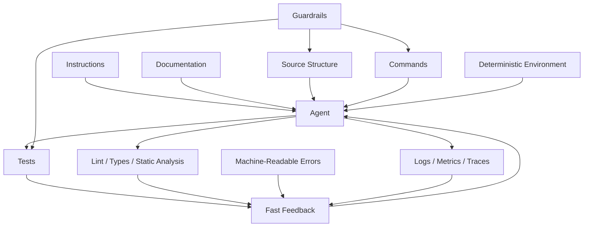
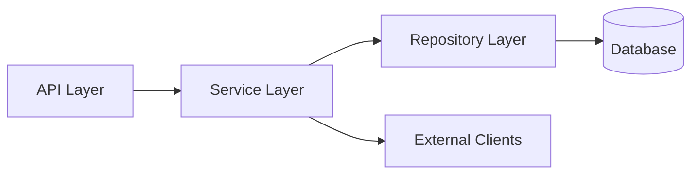
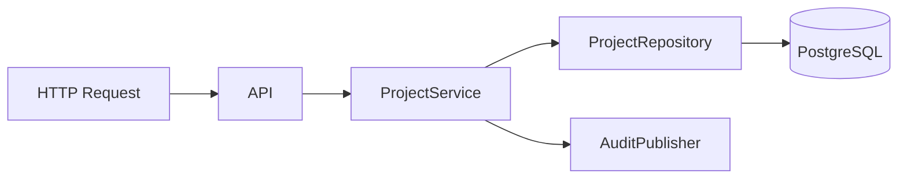
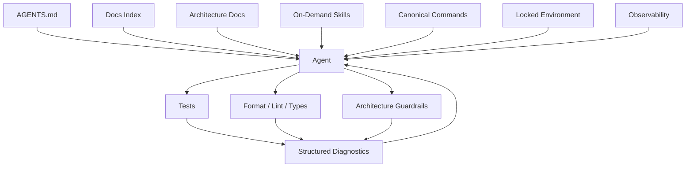
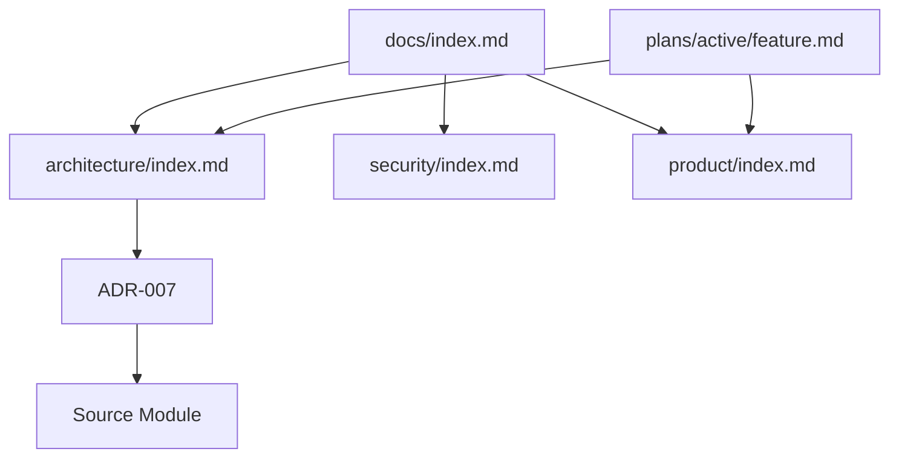
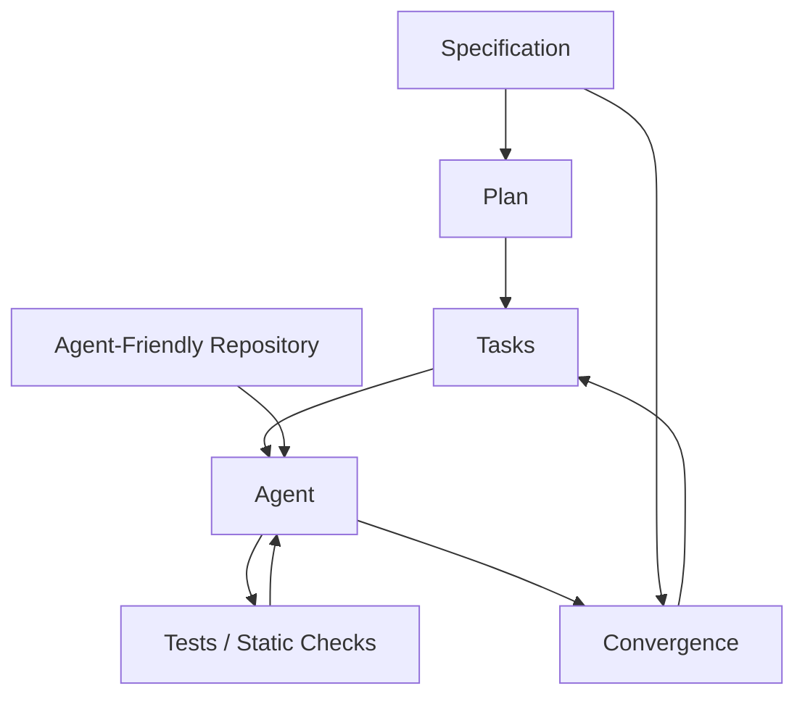
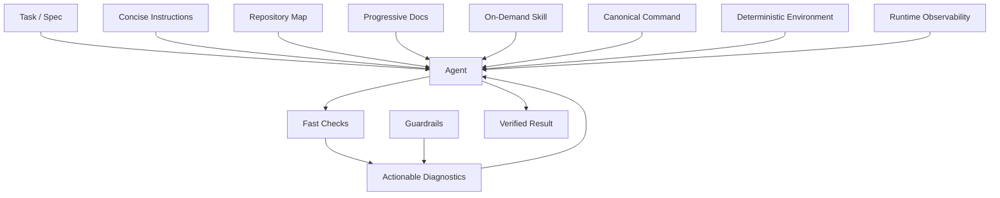

# Phase 7 — Agent-Friendly Repository Engineering

> **Track:** AI-Powered Software Development / Agentic Software Engineering  
> **Prerequisites:**  
> - Phase 1 — Generative AI for Software Engineers  
> - Phase 2 — Prompt Engineering for Software Development  
> - Phase 3 — Context Engineering  
> - Phase 4 — Agentic AI Fundamentals  
> - Phase 5 — AI Coding Agent Mastery  
> - Phase 6 — Spec-Driven Development  
>
> **Phase goal:** Design repositories, development environments, documentation, tools, tests, diagnostics, and architectural boundaries so coding agents can operate reliably with less manual correction.

---

# Table of Contents

1. [How to Study This Phase](#how-to-study-this-phase)
2. [Learning Objectives](#learning-objectives)
3. [Why Repository Engineering Matters for Agents](#why-repository-engineering-matters-for-agents)
4. [The Reliability Equation](#the-reliability-equation)
5. [The Agent-Friendly Repository Mental Model](#the-agent-friendly-repository-mental-model)
6. [Module 65 — Agent-Friendly Repository Design](#module-65--agent-friendly-repository-design)
7. [Module 66 — Repository Instruction Files](#module-66--repository-instruction-files)
8. [Module 67 — Architecture Documentation for Agents](#module-67--architecture-documentation-for-agents)
9. [Module 68 — Development Commands](#module-68--development-commands)
10. [Module 69 — Deterministic Build Environments](#module-69--deterministic-build-environments)
11. [Module 70 — One-Command Testing](#module-70--one-command-testing)
12. [Module 71 — Automated Formatting and Linting](#module-71--automated-formatting-and-linting)
13. [Module 72 — Strong Type Systems / Static Analysis](#module-72--strong-type-systems--static-analysis)
14. [Module 73 — Machine-Readable Errors](#module-73--machine-readable-errors)
15. [Module 74 — Agent Skills and Reusable Instructions](#module-74--agent-skills-and-reusable-instructions)
16. [Module 75 — Repository Guardrails](#module-75--repository-guardrails)
17. [Repository Knowledge as a System of Record](#repository-knowledge-as-a-system-of-record)
18. [Progressive Disclosure for Agent Context](#progressive-disclosure-for-agent-context)
19. [Agent-Legible Architecture](#agent-legible-architecture)
20. [Mechanical Enforcement of Architecture](#mechanical-enforcement-of-architecture)
21. [Fast Feedback Loops](#fast-feedback-loops)
22. [Agent-Friendly Observability](#agent-friendly-observability)
23. [Agent-Friendly Monorepos](#agent-friendly-monorepos)
24. [Agent-Friendly Legacy Repositories](#agent-friendly-legacy-repositories)
25. [Repository Quality Gardening](#repository-quality-gardening)
26. [Practical Python and Configuration Examples](#practical-python-and-configuration-examples)
27. [Worked Case Studies](#worked-case-studies)
28. [Repository Anti-Patterns](#repository-anti-patterns)
29. [Practical Labs](#practical-labs)
30. [Review Questions](#review-questions)
31. [Scenario Exercises](#scenario-exercises)
32. [Phase Project — AgentReady Repo](#phase-project--agentready-repo)
33. [Phase 7 Completion Checklist](#phase-7-completion-checklist)
34. [Where This Leads Next](#where-this-leads-next)
35. [Reference Baseline](#reference-baseline)

---

# How to Study This Phase

The previous phase taught you to improve the **intent pipeline**:

```text
Intent
→ Specification
→ Plan
→ Tasks
→ Implementation
→ Convergence
```

Phase 7 changes the environment itself.

Instead of repeatedly telling an agent:

```text
"Use the service layer."
"Run tests."
"Don't touch this directory."
"Don't invent package APIs."
"Use the existing error type."
"Don't bypass the repository."
"Remember to lint."
```

you ask:

> **Why is the repository making the agent rediscover or remember these rules manually?**

Then you redesign the repository so:

```text
architecture is visible
commands are obvious
rules are encoded
errors are readable
tests are fast
builds are reproducible
knowledge is versioned
```

The key shift is:

```text
Correct the agent repeatedly
        ↓
Encode the correction once
        ↓
Make the repository enforce it
```

This is one of the most important mindset changes in agentic engineering.

---

# Learning Objectives

By the end of this phase, you should be able to:

1. Define an **agent-friendly repository**.
2. Explain repository legibility.
3. Explain why repository quality affects agent reliability.
4. Design repository structure for machine navigation.
5. Separate stable knowledge from transient task context.
6. Design concise repository instruction files.
7. Distinguish:
   - repository-wide instructions,
   - path-specific instructions,
   - personal instructions,
   - reusable skills,
   - feature specifications.
8. Avoid giant instruction files.
9. Design progressive documentation disclosure.
10. Build an architecture map.
11. Document dependency direction.
12. Document domain ownership.
13. Document system boundaries.
14. Create deterministic development commands.
15. Create a one-command setup flow.
16. Create deterministic build environments.
17. Lock versions and dependencies.
18. Explain reproducibility.
19. Design one-command testing.
20. Separate:
    - targeted tests,
    - full tests,
    - integration tests,
    - static checks.
21. Design fast feedback loops.
22. Automate formatting.
23. Automate linting.
24. Use strong type checking.
25. Use architecture/static analysis.
26. Design machine-readable errors.
27. Design structured command output.
28. Build reusable agent skills.
29. Decide what belongs in a skill vs instruction file.
30. Encode repository workflows as executable scripts.
31. Build mechanical repository guardrails.
32. Enforce dependency boundaries.
33. Enforce file-size and naming rules where useful.
34. Enforce test and quality gates.
35. Expose logs, metrics, and traces to agents.
36. Make application behavior agent-legible.
37. Build documentation freshness checks.
38. Detect documentation drift.
39. Build a repository-readiness score.
40. Improve legacy repositories for agents.
41. Design monorepo-local instructions.
42. Create path-scoped guidance.
43. Design CI as an agent feedback system.
44. Design errors that agents can act on.
45. Build a complete agent-ready repository template.
46. Understand when to prefer hard guardrails over prompt reminders.
47. Recognize over-engineering in agent infrastructure.
48. Preserve human readability while improving agent legibility.
49. Build repository tooling agents can directly execute.
50. Be ready for AI-Assisted Software Architecture.

---

# Why Repository Engineering Matters for Agents

An AI coding agent does not work in a vacuum.

Its effectiveness depends on what the repository exposes.

Imagine two repositories.

## Repository A

```text
README outdated
no architecture docs
tests require 8 undocumented commands
environment depends on local machine state
lint rules are tribal knowledge
business rules live in Slack
errors say "something failed"
services import anything
no CI architecture checks
```

A powerful agent will still struggle.

It must infer missing structure.

## Repository B

```text
short AGENTS.md
clear docs index
deterministic setup
one-command tests
typed interfaces
structured errors
strict architecture boundaries
fast CI
versioned decisions
```

The same model becomes dramatically more reliable.

The model did not become smarter.

The **environment became more legible**.

---

# The Reliability Equation

A useful conceptual model:

```text
Agent Reliability
≈
Agent Capability
×
Repository Legibility
×
Verification Quality
×
Instruction Quality
×
Feedback Speed
```

This is not a mathematical formula.

It expresses a systems principle:

> A weak factor can bottleneck the whole agent workflow.

A highly capable agent with poor tests is hard to trust.

A highly capable agent with unclear architecture produces drift.

A highly capable agent with slow feedback wastes iterations.

---

# The Agent-Friendly Repository Mental Model



The agent should not need to memorize repository reality.

The repository should **teach and constrain** the agent continuously.

---

# Module 65 — Agent-Friendly Repository Design

# 65.1 What Is an Agent-Friendly Repository?

A repository is agent-friendly when an agent can efficiently answer:

```text
What is this system?
Where does this behavior live?
What rules apply?
How do I run it?
How do I test it?
How do I verify changes?
What may I modify?
What should I not do?
```

without requiring a human to explain the same things every task.

# 65.2 Agent Legibility

Agent legibility means important repository properties are accessible in forms the agent can inspect.

Examples:

```text
architecture → Markdown + dependency graph
API → OpenAPI
DB → schema/migrations
tests → executable commands
logs → structured JSON
product rules → versioned specs
```

# 65.3 Human Legibility and Agent Legibility Align

Most improvements for agents are also improvements for developers.

A new engineer also benefits from:

```text
clear structure
reproducible setup
good docs
fast tests
meaningful errors
```

Do not build a repository that is machine-friendly but human-hostile.

# 65.4 Repository Structure as Information Architecture

Example backend:

```text
repo/
├── AGENTS.md
├── README.md
├── ARCHITECTURE.md
├── pyproject.toml
├── uv.lock
├── Makefile
├── app/
│   ├── api/
│   ├── services/
│   ├── repositories/
│   ├── models/
│   └── core/
├── tests/
│   ├── unit/
│   ├── integration/
│   └── architecture/
├── docs/
│   ├── index.md
│   ├── product/
│   ├── architecture/
│   ├── security/
│   ├── operations/
│   ├── plans/
│   └── generated/
└── scripts/
    ├── check.py
    ├── test.py
    └── setup.py
```

This communicates more than a flat directory.

# 65.5 Domain-Based Organization

For large systems, organize by business domain.

Example:

```text
app/
├── users/
├── projects/
├── billing/
└── analytics/
```

Each domain may contain layers:

```text
projects/
├── api.py
├── service.py
├── repository.py
├── models.py
└── schemas.py
```

Now the agent can reason locally.

# 65.6 Layer-Based Organization

Alternative:

```text
api/
services/
repositories/
models/
```

Also valid.

The important property is:

```text
predictability
```

not one universal architecture.

# 65.7 Consistency Beats Cleverness

If every domain follows a different pattern:

```text
users uses services
billing uses handlers
projects uses managers
analytics uses processors
```

the model must continually re-infer architecture.

Stable patterns reduce reasoning burden.

# 65.8 Searchability

Use names that map to concepts.

Good:

```text
ProjectService
ProjectRepository
ProjectArchivePolicy
```

Poor:

```text
Manager2
Helper
Utils
CommonStuff
```

Searchability is important for context retrieval.

# 65.9 Explicit Ownership

Document:

```text
Which module owns project lifecycle?
Which module owns authorization?
Which module owns notifications?
```

Otherwise agents duplicate behavior.

# 65.10 Small Cohesive Modules

Very large files increase retrieval cost.

A 4,000-line utility file is difficult for humans and agents.

But do not split files merely to satisfy arbitrary size.

The goal:

```text
cohesion
discoverability
```

# 65.11 Locality

Related implementation and tests should be easy to discover.

Example:

```text
app/projects/service.py
tests/projects/test_service.py
```

or colocated patterns.

# 65.12 Predictable Entrypoints

An agent should quickly find:

```text
application entry
CLI entry
background workers
migration config
```

Document them.

# 65.13 Avoid Hidden Runtime Magic

Examples of agent-hostile magic:

```text
implicit global monkey patches
environment-dependent imports
runtime class mutation
undocumented plugin loading
```

Not always avoidable, but make important magic visible.

# 65.14 Favor Inspectable Abstractions

An abstraction should make behavior easier to understand.

A wrapper that hides everything behind reflection may be difficult for agents.

# 65.15 Repository Readiness Heuristic

Ask:

```text
Can a fresh agent run a bug fix without asking a human:
- how to install?
- how to test?
- where logic belongs?
```

If not, improve the repository.

---

# Module 66 — Repository Instruction Files

# 66.1 Purpose

Instruction files provide persistent guidance automatically.

Examples across current coding-agent ecosystems include:

```text
AGENTS.md
CLAUDE.md
.github/copilot-instructions.md
.github/instructions/*.instructions.md
```

Support and precedence differ by product.

The general engineering model is stable.

# 66.2 What Should Repository Instructions Contain?

High-value content:

```text
repository purpose
architecture map
development commands
test commands
important invariants
security rules
documentation links
definition of done
known non-obvious quirks
```

# 66.3 What Should Not Be in the Root Instructions?

Avoid:

```text
every API endpoint
full product specification
historical incidents
temporary task state
huge schemas
hundreds of edge cases
secrets
```

Use links/progressive disclosure.

# 66.4 Map, Not Manual

A root instruction file should function like:

```text
table of contents
+
critical rules
```

Example:

```markdown
# Repository Guide

## Purpose
Project analytics backend.

## Architecture
api → services → repositories → models

See `docs/architecture/index.md`.

## Commands
- Setup: `make setup`
- Test targeted: `pytest path/to/test.py -q`
- Full check: `make check`

## Rules
- Routes MUST NOT query DB directly.
- Business rules belong in services.
- New runtime dependencies require justification.
- Do not edit generated files directly.

## Documentation
- Product: `docs/product/`
- Security: `docs/security/`
- Plans: `docs/plans/`
```

# 66.5 Instruction Hierarchy

Possible layers:

```text
global/personal
repository-wide
path-specific
task-specific
```

Avoid conflicts.

# 66.6 Path-Specific Instructions

Monorepo:

```text
frontend/
backend/
infra/
```

Different rules may apply.

Example GitHub-style path instruction:

```markdown
---
applyTo: "frontend/**/*.tsx"
---

- Use React function components.
- Run `pnpm test frontend`.
- Follow `docs/frontend/design-system.md`.
```

# 66.7 Nested Instructions

Some tools support nearest-directory instruction behavior or automatic nested file loading.

Use this to localize rules.

Example:

```text
AGENTS.md
services/payments/AGENTS.md
frontend/AGENTS.md
```

Keep cross-agent differences in mind.

# 66.8 Avoid Instruction Duplication

Bad:

```text
AGENTS.md says one test command
CLAUDE.md says another
copilot-instructions says third
```

Better:

```text
all point to canonical command:
make check
```

# 66.9 Canonical Sources

Instead of duplicating architecture rules in five files:

```text
AGENTS.md
→ docs/architecture.md
```

Tool-specific files can reference shared sources where supported.

# 66.10 Instruction Drift

Instructions can become stale.

Example:

```text
"Use Python 3.11"
```

after project moves to 3.12.

Add CI/documentation checks.

# 66.11 Instruction Testing

You can test some instructions indirectly.

If instructions say:

```text
run `make check`
```

CI can verify that command exists and succeeds.

# 66.12 Instruction Size

There is no universal line limit.

But large always-on instructions consume context.

Prefer:

```text
short root
deeper docs
on-demand skills
```

# 66.13 Instruction Quality Test

Ask a fresh agent:

```text
How do I:
1. run the app?
2. test?
3. find architecture?
4. know where business logic belongs?
```

If instructions fail, improve them.

---

# Module 67 — Architecture Documentation for Agents

# 67.1 Why Architecture Documentation Matters

Agents infer architecture from examples.

If bad patterns exist, they may reproduce them.

Explicit architecture gives a stronger signal.

# 67.2 Architecture Map

Example:



# 67.3 Document Dependency Direction

Example:

```text
Allowed:
api → services
services → repositories
repositories → models

Forbidden:
api → repositories
repositories → services
models → api
```

# 67.4 Domain Boundaries

Document:

```text
Projects owns project lifecycle.
Billing owns invoices/payment state.
Auth owns identity/session policy.
```

Cross-domain access must use defined interfaces.

# 67.5 Architecture Index

Example:

```markdown
# Architecture Index

## Domains
- [Authentication](auth.md)
- [Projects](projects.md)
- [Billing](billing.md)

## Cross-Cutting
- [Observability](observability.md)
- [Security](security.md)
- [Background Jobs](jobs.md)

## Rules
- [Dependency Rules](dependency-rules.md)
```

# 67.6 C4-Style Documentation

Useful levels:

```text
System Context
Container
Component
```

You do not need to document every class.

Focus on meaningful boundaries.

# 67.7 Architecture Decision Records

Important durable decisions belong in ADRs.

Example:

```text
ADR-007:
Use PostgreSQL row-level organization scoping in repositories.
```

This gives agents historical rationale.

# 67.8 Why Rationale Matters

Without rationale, agent may "simplify" intentional design.

Example:

```text
Why do we use outbox pattern?
```

ADR explains:

```text
avoid lost events across DB/message transaction
```

# 67.9 Architecture Examples

Provide canonical examples.

Example:

```text
For new CRUD domain, follow `app/projects/`.
```

Agents learn patterns well from examples.

# 67.10 Examples Must Be Good

If canonical example contains legacy anti-patterns, the agent replicates them.

Curate examples.

# 67.11 Generated Architecture Docs

Some architecture knowledge can be generated:

```text
dependency graphs
module lists
schema
OpenAPI
```

Generated docs reduce manual drift.

# 67.12 Architecture Freshness

Docs should include:

```text
owner
status
last reviewed
```

where useful.

# 67.13 Architecture Documentation Is Not Enforcement

An agent can ignore text.

Mechanical checks are stronger.

We will build those in Module 75.

---

# Module 68 — Development Commands

# 68.1 Commands Are Agent APIs

A development command is effectively a tool interface.

Compare:

```text
"Run these nine shell commands in this exact order..."
```

with:

```bash
make check
```

The second is a stable API.

# 68.2 Canonical Commands

A mature repo may expose:

```text
make setup
make dev
make test
make test-unit
make test-integration
make lint
make typecheck
make format
make check
```

Use `just`, `task`, scripts, package manager, or equivalent.

# 68.3 Why Wrapper Commands Help

They encapsulate:

```text
arguments
environment
paths
tool versions
```

The agent does not need to rediscover them.

# 68.4 Commands Must Be Deterministic

`make test` should mean the same thing for:

```text
human
agent
CI
```

This creates shared evidence.

# 68.5 Command Discoverability

Document:

```bash
make help
```

Example:

```make
help:
	@echo "setup     Install dependencies"
	@echo "test      Run unit tests"
	@echo "check     Run lint, types, tests"
```

# 68.6 Avoid Huge Hidden Scripts

Wrapper commands should not become opaque black boxes.

Keep scripts readable and versioned.

# 68.7 Targeted Commands

Fast agent feedback needs targeted execution.

Examples:

```bash
pytest tests/projects/test_service.py -q
pnpm test -- project-card
```

Do not force 25-minute full suite for every edit.

# 68.8 Full Verification Command

Before handoff:

```bash
make check
```

should run appropriate broad checks.

# 68.9 Environment Diagnostics

Provide:

```bash
make doctor
```

or:

```bash
scripts/doctor.py
```

Check:

```text
runtime versions
dependencies
required services
env vars
```

# 68.10 Machine-Readable Command Results

Where possible, support:

```text
JSON
JUnit XML
structured logs
```

This improves agent parsing.

# 68.11 Command Contract

Document:

```text
purpose
inputs
side effects
exit codes
```

especially for custom tools.

---

# Module 69 — Deterministic Build Environments

# 69.1 What Is Determinism?

Given the same repository state and declared environment, setup/build should behave predictably.

# 69.2 Reproducibility

If agent sees:

```text
tests pass in sandbox
```

but developer cannot reproduce, trust suffers.

Deterministic environments improve:

```text
debugging
CI parity
agent recovery
```

# 69.3 Pin Runtime Versions

Examples:

```text
Python 3.12.x
Node 24.x
PostgreSQL 17
```

Use appropriate version management.

# 69.4 Lock Dependencies

Examples:

```text
uv.lock
poetry.lock
package-lock.json
pnpm-lock.yaml
Cargo.lock
```

Do not let each agent resolve a different dependency graph.

# 69.5 Containers

Containerized development can standardize:

```text
OS
runtime
services
dependencies
```

Example:

```dockerfile
FROM python:3.12-slim

WORKDIR /app

COPY pyproject.toml uv.lock ./
RUN pip install uv && uv sync --frozen

COPY . .
```

Educational example only.

# 69.6 Dev Containers

A `.devcontainer/` configuration can give both humans and agents a consistent workspace.

# 69.7 Nix / Reproducible Toolchains

Tools such as Nix can make environments highly reproducible.

Do not adopt complexity only for agents.

Use if appropriate to team/system.

# 69.8 Database Reproducibility

Provide:

```text
schema migration
seed data
test DB setup
```

Agent should not depend on manually prepared local DB.

# 69.9 External Services

Use:

```text
local container
mock/fake
test instance
```

with clear configuration.

# 69.10 Environment Variables

Provide:

```text
.env.example
```

but never real secrets.

Explain required variables.

# 69.11 One-Command Environment

Goal:

```bash
make setup
```

or:

```bash
docker compose up
```

not:

```text
follow 26 wiki steps
```

# 69.12 Environment Fingerprint

Useful command:

```bash
make doctor
```

output:

```text
Python: 3.12.5
uv: 0.x
Postgres: reachable
Redis: reachable
Migrations: current
```

# 69.13 Clean Rebuild Test

Periodically create a fresh environment and run:

```text
setup
build
test
```

This tests onboarding.

---

# Module 70 — One-Command Testing

# 70.1 Why One-Command Testing Matters

Agent should not reason:

```text
Which 7 commands represent "tested"?
```

Give stable interfaces.

# 70.2 Test Layers

Example:

```text
test-unit
test-integration
test-e2e
test-all
```

# 70.3 Targeted Test API

Support selecting:

```text
file
module
marker
```

# 70.4 Example Makefile

```make
test-unit:
	uv run pytest tests/unit -q

test-integration:
	uv run pytest tests/integration -q

test:
	uv run pytest -q

check:
	uv run ruff check .
	uv run pyright
	uv run pytest -q
```

# 70.5 Fail Fast

Fast feedback helps agents iterate.

Run:

```text
syntax
lint
targeted test
```

before expensive suites.

# 70.6 Test Runtime Budget

A full suite taking 90 minutes discourages frequent verification.

Invest in:

```text
parallelization
test selection
fixtures
```

# 70.7 Deterministic Tests

Flaky tests are especially harmful to agents.

A model may misdiagnose random failures.

# 70.8 Flake Management

Track and fix flakes.

Do not train agents to ignore red CI.

# 70.9 Test Isolation

Tests should not depend on:

```text
execution order
developer machine state
internet
production data
```

unless explicitly integration-level.

# 70.10 Test Data Builders

Provide factories/fixtures that agents can reuse.

# 70.11 Clear Assertion Messages

Useful failures:

```text
Expected archived project not to appear in default listing.
Found project ID abc123.
```

Better than:

```text
assert False
```

# 70.12 Test Selection Hints

Instruction file:

```text
For service changes, run matching `tests/unit/services/...` first.
```

# 70.13 CI Consistency

Local command and CI should share implementation.

Example:

```text
CI calls `make check`
```

rather than duplicating logic.

---

# Module 71 — Automated Formatting and Linting

# 71.1 Remove Subjective Formatting Work

Agents should not spend reasoning tokens debating indentation.

Use formatters.

Examples:

```text
Ruff formatter
Black
Prettier
gofmt
rustfmt
```

# 71.2 Formatting as Deterministic Normalization

```text
many equivalent source styles
        ↓
formatter
        ↓
one canonical style
```

This reduces diff noise.

# 71.3 Linting

Linters detect:

```text
unused imports
unsafe patterns
complexity
naming
bad APIs
```

# 71.4 Custom Lints

Agent-friendly repositories can encode organizational rules.

Examples:

```text
no direct SQL in API layer
no print statements
structured logging only
no timezone-naive datetime
```

# 71.5 Lint Rule Must Have Value

Do not create rules only because they are easy to enforce.

Every rule creates maintenance cost.

# 71.6 Auto-Fix

Safe mechanical issues can be automatically fixed.

Example:

```bash
ruff check . --fix
```

Review changes.

# 71.7 Pre-Commit

Pre-commit hooks can provide immediate feedback.

But CI should still enforce.

# 71.8 CI Enforcement

```text
formatter check
lint
```

must fail consistently.

# 71.9 Agent Feedback Quality

Bad lint:

```text
Rule 104 failed.
```

Better:

```text
ARCH001 api/users.py:42
API layer must not import repositories directly.
Use UserService.
```

# 71.10 Lint Documentation

Each custom rule should explain:

```text
why
bad example
good example
how to fix
```

---

# Module 72 — Strong Type Systems / Static Analysis

# 72.1 Why Types Help Agents

Types expose contracts directly in code.

Without types:

```python
def process(x):
    ...
```

The agent must infer.

With types:

```python
def process(
    project: Project,
) -> ArchiveResult:
    ...
```

More context is explicit.

# 72.2 Types as Machine-Readable Documentation

Types communicate:

```text
shape
nullability
variants
interfaces
```

# 72.3 Static Analysis

Tools can detect errors without execution.

Examples:

```text
pyright
mypy
TypeScript compiler
Go compiler
Rust compiler
```

# 72.4 Strictness

Stronger type checking often improves agent reliability.

But migrating a legacy dynamic codebase to maximum strictness overnight may be expensive.

Use incremental adoption.

# 72.5 Explicit Domain Types

Bad:

```python
def archive(id: str):
    ...
```

Better:

```python
def archive(
    project_id: ProjectId,
    actor: AuthenticatedUser,
) -> ArchiveResult:
    ...
```

# 72.6 Enums vs Free Strings

Use:

```python
class ProjectStatus(str, Enum):
    ACTIVE = "active"
    ARCHIVED = "archived"
```

instead of arbitrary strings.

# 72.7 Result Types

Explicit success/failure shapes can guide agents.

# 72.8 Schema Validation

Pydantic/Zod/etc. make data boundaries explicit.

# 72.9 Static Architecture Analysis

Static checks can enforce:

```text
module dependency rules
forbidden imports
```

# 72.10 Security Static Analysis

Tools such as SAST can catch certain patterns.

Do not treat static scan as complete security proof.

# 72.11 Type Errors Must Be Actionable

Example:

```text
Argument of type Project | None cannot be assigned to Project
```

This tells the agent exactly what uncertainty exists.

---

# Module 73 — Machine-Readable Errors

# 73.1 Error Messages Are Agent Context

When tools fail, error output becomes model input.

Design errors accordingly.

# 73.2 Bad Error

```text
Build failed.
```

# 73.3 Better Error

```text
ERROR ARCH001
file: app/api/projects.py
line: 42
message: API layer imports ProjectRepository directly
expected: API → Service → Repository
suggestion: inject ProjectService instead
```

# 73.4 Structured JSON Error

```json
{
  "code": "ARCH001",
  "file": "app/api/projects.py",
  "line": 42,
  "message": "API layer cannot import repository",
  "expected": "api -> service -> repository",
  "docs": "docs/architecture/dependencies.md"
}
```

Excellent agent input.

# 73.5 Stable Error Codes

Codes enable:

```text
search
documentation
automation
```

# 73.6 Exit Codes

Commands should return:

```text
0 success
non-zero failure
```

consistently.

# 73.7 Error Categorization

Examples:

```text
VALIDATION
CONFIGURATION
DEPENDENCY
TEST_FAILURE
ARCHITECTURE
PERMISSION
TRANSIENT
```

# 73.8 Avoid Giant Unstructured Logs

A 10,000-line traceback may contain only 10 useful lines.

Provide summaries and references where possible.

# 73.9 JUnit / SARIF / JSON

Standard machine-readable formats are useful for:

```text
tests
static analysis
security findings
```

# 73.10 CI Annotation

CI should surface:

```text
file
line
rule
```

Agents can act quickly.

# 73.11 Error Documentation

Create:

```text
docs/errors/ARCH001.md
```

for custom errors if complex.

---

# Module 74 — Agent Skills and Reusable Instructions

# 74.1 What Is an Agent Skill?

A skill is reusable, task-specific procedural knowledge an agent can load when needed.

Examples:

```text
run a database migration
review a FastAPI endpoint
debug a React UI
update OpenAPI
perform release
```

# 74.2 Skill vs Root Instructions

Root:

```text
stable always-on rules
```

Skill:

```text
specialized workflow loaded on demand
```

# 74.3 Why Skills Matter

Without skills, repeated prompts contain:

```text
same workflow
same commands
same checks
```

Encode once.

# 74.4 Example Skill

```markdown
# Database Migration Skill

Use this workflow for schema changes.

1. Read `docs/db/migrations.md`.
2. Inspect current migration head.
3. Generate a migration.
4. Review upgrade and downgrade.
5. Run migration tests.
6. Update generated schema documentation.
7. Do not apply to production.
```

# 74.5 Skills as Progressive Disclosure

A model does not need migration instructions during frontend work.

Load only when relevant.

# 74.6 Skill Inputs and Outputs

A good skill defines:

```text
when to use
required inputs
steps
verification
side effects
stop conditions
```

# 74.7 Skill Must Reference Canonical Tools

Avoid embedding brittle shell details if a repository command exists.

Prefer:

```text
Run `make db-check`
```

# 74.8 Skill Versioning

Skills are code-like assets.

Version in repository.

Review changes.

# 74.9 Skill Tests

You can test procedural expectations.

Example:

```text
migration skill must mention rollback verification
```

More importantly, run the workflow in CI/sample environment.

# 74.10 Product-Specific Skill Systems

Modern agent platforms expose skills/custom agents/plugins in different ways.

The portable principle:

```text
reusable procedural context
+
minimal always-on context
```

# 74.11 Skill Anti-Pattern — Giant Universal Skill

Defeats progressive disclosure.

# 74.12 Skill Anti-Pattern — Hidden Authority

A skill should not silently override project constitution/security.

---

# Module 75 — Repository Guardrails

# 75.1 What Is a Guardrail?

A guardrail is a mechanism that prevents or detects undesired repository changes.

It can be:

```text
formatter
lint rule
type checker
architecture test
CI gate
schema validation
permission rule
```

# 75.2 Prompt Rule vs Guardrail

Prompt:

```text
"Do not import repositories from API."
```

Guardrail:

```text
CI fails if API imports repository.
```

Guardrail is stronger.

# 75.3 Enforce Invariants, Not Every Implementation Choice

Good:

```text
API cannot access DB directly.
```

Overly rigid:

```text
Every service must have exactly 4 methods.
```

The first protects architecture.

The second micromanages.

# 75.4 Dependency Rule

Example:

```text
api -> services -> repositories -> models
```

Create automated checker.

# 75.5 Python Import Guard Example

Educational:

```python
from pathlib import Path
import ast


def imported_modules(
    path: Path,
) -> set[str]:
    tree = ast.parse(
        path.read_text(encoding="utf-8")
    )

    modules: set[str] = set()

    for node in ast.walk(tree):
        if isinstance(node, ast.Import):
            for name in node.names:
                modules.add(name.name)

        elif isinstance(
            node,
            ast.ImportFrom,
        ):
            if node.module:
                modules.add(node.module)

    return modules
```

Then:

```python
def check_api_dependencies(
    root: Path,
) -> list[str]:
    violations: list[str] = []

    for path in (
        root / "app" / "api"
    ).rglob("*.py"):
        for module in imported_modules(path):
            if module.startswith(
                "app.repositories"
            ):
                violations.append(
                    f"{path}: API may not import repositories"
                )

    return violations
```

Production-grade tools should be more robust.

# 75.6 Structural Tests

Example:

```python
def test_api_does_not_import_repositories():
    violations = check_api_dependencies(
        Path(".")
    )

    assert not violations, "\n".join(
        violations
    )
```

# 75.7 File Size Guard

Large files may reduce legibility.

Example rule:

```text
warn > 800 lines
```

Do not treat arbitrary thresholds as universal truths.

# 75.8 Naming Guard

Examples:

```text
schemas end with Request/Response
repository classes end with Repository
```

Useful if convention genuinely matters.

# 75.9 Structured Logging Guard

Reject:

```python
print(...)
```

in production code.

Require structured logger.

# 75.10 Data Boundary Guard

Require external payload parsing at boundary.

This prevents agents from assuming shapes.

# 75.11 Test Guard

Example:

```text
production code changed
but no test changes
```

May be warning, not universal failure.

Bug fixes should usually add regression tests.

# 75.12 Generated File Guard

Prevent direct edits to:

```text
generated/
```

except regeneration command.

# 75.13 Dependency Guard

Require explicit process for new runtime dependency.

# 75.14 Security Guard

Examples:

```text
secret scanning
SAST
dependency scanning
```

# 75.15 Guardrail Error Quality

A guardrail without actionable diagnostics causes agent loops.

Always explain:

```text
what
where
why
how to fix
```

---

# Repository Knowledge as a System of Record

# 76.1 Why Repository-Local Knowledge Matters

If architecture lives only in:

```text
Slack
Notion
meeting memory
```

the agent may not access it.

Versioned repository knowledge is:

```text
discoverable
reviewable
branch-specific
```

# 76.2 Suggested Knowledge Layout

```text
docs/
├── index.md
├── architecture/
│   ├── index.md
│   ├── dependency-rules.md
│   └── domains.md
├── product/
│   ├── index.md
│   └── ...
├── security/
├── operations/
├── plans/
│   ├── active/
│   └── completed/
├── references/
└── generated/
```

# 76.3 Docs Index

Start:

```markdown
# Documentation

## Product
See `product/index.md`.

## Architecture
See `architecture/index.md`.

## Security
See `security/index.md`.

## Active Plans
See `plans/active/`.
```

# 76.4 Knowledge Ownership

Important docs can declare:

```text
owner
status
last reviewed
```

# 76.5 Branch-Correct Knowledge

Repository-local docs follow branches.

Feature branch can update:

```text
spec
architecture
code
```

together.

# 76.6 Documentation Drift

Docs may not match code.

Treat drift like technical debt.

---

# Progressive Disclosure for Agent Context

# 77.1 Why Progressive Disclosure?

Context is finite.

Do not load:

```text
everything
```

Load:

```text
map
→ relevant domain
→ specific reference
```

# 77.2 Progressive Structure

```text
AGENTS.md
   ↓
docs/index.md
   ↓
docs/architecture/index.md
   ↓
docs/architecture/payments.md
```

# 77.3 Good Navigation Links

Every deep document should link:

```text
related docs
source modules
tests
```

# 77.4 Avoid Orphan Docs

A file that nothing links to may be invisible to agents.

---

# Agent-Legible Architecture

# 78.1 Legibility Beyond Source

Expose:

```text
data flow
event flow
dependency rules
service ownership
runtime components
```

# 78.2 Data Flow Diagram



# 78.3 Runtime Map

```text
API
Worker
PostgreSQL
Redis
Message Broker
```

Document which are required locally.

# 78.4 Interface Catalog

For cross-domain services:

```text
interface
owner
allowed callers
```

---

# Mechanical Enforcement of Architecture

# 79.1 Why Documentation Is Insufficient

Agents learn by imitation.

One violating file may become a precedent.

Enforcement prevents pattern spread.

# 79.2 Architecture Tests

Use language-specific tools or custom checks.

Examples:

```text
dependency-cruiser
ArchUnit
import-linter
custom AST tests
```

# 79.3 Golden Paths

Create canonical templates.

Example:

```text
scripts/new-domain.py
```

generates:

```text
api
service
repository
tests
```

with correct structure.

Agents use the same path.

# 79.4 Scaffolding Reduces Variation

Instead of agent inventing structure each time:

```bash
make new-domain NAME=projects
```

# 79.5 Policy as Code

Rules belong in:

```text
CI
linters
config
```

when mechanically expressible.

---

# Fast Feedback Loops

# 80.1 Feedback Speed Changes Agent Productivity

Agent loop:

```text
edit
→ check
→ observe
→ edit
```

If check takes:

```text
5 seconds
```

agent can iterate quickly.

If:

```text
25 minutes
```

workflow slows dramatically.

# 80.2 Feedback Hierarchy

```text
syntax
→ formatter
→ lint
→ types
→ targeted test
→ component test
→ full test
→ E2E
```

# 80.3 Local Fast Path

Provide:

```bash
make check-fast
```

Example:

```text
format check
lint
types
targeted unit tests
```

# 80.4 Final Path

```bash
make check
```

broader.

# 80.5 Cache

Build/test caches can help.

Ensure caches do not create hidden nondeterminism.

---

# Agent-Friendly Observability

# 81.1 Why Observability Matters

Source code cannot answer all runtime questions.

Agent needs:

```text
logs
metrics
traces
screenshots/UI state
```

# 81.2 Structured Logs

Example:

```json
{
  "level": "error",
  "service": "api",
  "request_id": "abc123",
  "error_code": "AUTH_EXPIRED",
  "duration_ms": 17
}
```

# 81.3 Searchable Logs

Provide local commands:

```bash
make logs
make logs SERVICE=api
```

# 81.4 Metrics

If task:

```text
startup < 800 ms
```

agent needs measurement.

# 81.5 Traces

Distributed problems benefit from trace context.

# 81.6 Local Observability Stack

Advanced repos can boot:

```text
app
logs
metrics
traces
```

per worktree.

This allows isolated runtime reasoning.

# 81.7 UI Legibility

Frontend agents benefit from:

```text
screenshots
DOM snapshots
browser automation
```

A visually testable application is more agent-friendly.

---

# Agent-Friendly Monorepos

# 82.1 Monorepo Challenge

Large monorepo context is huge.

Use:

```text
root map
path-specific instructions
domain-local commands
```

# 82.2 Root Instructions

Contain only universal rules.

# 82.3 Package Instructions

Example:

```text
apps/web/AGENTS.md
services/api/AGENTS.md
infra/AGENTS.md
```

if agent platform supports.

# 82.4 Scoped Commands

```bash
make test-api
make test-web
```

# 82.5 Dependency Graph

Monorepos need explicit dependency direction.

# 82.6 Avoid Global Full Build for Every Change

Use affected-package testing.

Then full integration at appropriate gate.

---

# Agent-Friendly Legacy Repositories

# 83.1 Start with Legibility

Before delegating huge refactor:

```text
document build
document tests
map architecture
capture behavior
```

# 83.2 Characterization Tests

Protect current behavior.

# 83.3 Add Instructions Incrementally

Do not attempt to document 15 years of history.

Start with:

```text
current task paths
critical rules
commands
```

# 83.4 Identify Dangerous Zones

Example:

```text
legacy/payments/
```

Mark:

```text
requires approval
```

# 83.5 Create Safe Facades

If legacy API is chaotic, create stable wrappers agents can use.

---

# Repository Quality Gardening

# 84.1 Agent Repositories Accumulate Entropy

Agents reproduce existing patterns.

If one bad pattern appears, it can spread.

# 84.2 Continuous Cleanup

Instead of annual rewrite:

```text
small recurring cleanup
```

# 84.3 Golden Principles

Define mechanical quality principles.

Examples:

```text
reuse shared utilities
validate boundary data
use structured logs
do not create cross-layer imports
```

# 84.4 Quality Score

Advanced system can track:

```text
test coverage
architecture violations
doc freshness
dependency health
type strictness
```

# 84.5 Doc Gardening

Automate:

```text
broken links
stale references
missing owners
outdated generated docs
```

# 84.6 Agent-Generated Cleanup PRs

A cleanup agent can open focused changes.

Keep changes:

```text
small
mechanically justified
easy to review
```

---

# Practical Python and Configuration Examples

# 85.1 Repository Doctor

```python
from pathlib import Path
import subprocess
from dataclasses import dataclass


@dataclass
class Check:
    name: str
    ok: bool
    detail: str


def command_version(
    command: list[str],
) -> Check:
    result = subprocess.run(
        command,
        capture_output=True,
        text=True,
        check=False,
    )

    return Check(
        name=" ".join(command),
        ok=result.returncode == 0,
        detail=(
            result.stdout.strip()
            or result.stderr.strip()
        ),
    )


def repository_doctor(
    root: Path,
) -> list[Check]:
    return [
        Check(
            "AGENTS.md",
            (root / "AGENTS.md").exists(),
            "repository instructions",
        ),
        command_version(
            ["python", "--version"]
        ),
        command_version(
            ["git", "--version"]
        ),
    ]
```

# 85.2 Documentation Link Checker

Simple Markdown link extraction is complex in full generality.

Educational check:

```python
import re


LINK_RE = re.compile(
    r"\[[^\]]+\]\(([^)]+)\)"
)


def local_links(
    text: str,
) -> list[str]:
    return [
        target
        for target in LINK_RE.findall(text)
        if not target.startswith(
            ("http://", "https://", "#")
        )
    ]
```

# 85.3 Instruction Size Warning

```python
def instruction_size_warning(
    path: Path,
    max_lines: int = 250,
) -> str | None:
    lines = path.read_text(
        encoding="utf-8"
    ).splitlines()

    if len(lines) > max_lines:
        return (
            f"{path} has {len(lines)} lines. "
            "Consider progressive disclosure."
        )

    return None
```

Threshold is heuristic.

# 85.4 Architecture Rule Configuration

```yaml
layers:
  api:
    may_import:
      - services
      - schemas

  services:
    may_import:
      - repositories
      - schemas
      - domain

  repositories:
    may_import:
      - models
      - domain
```

# 85.5 Error Model

```python
from pydantic import BaseModel


class Diagnostic(BaseModel):
    code: str
    severity: str
    file: str | None = None
    line: int | None = None
    message: str
    suggestion: str | None = None
    docs: str | None = None
```

# 85.6 Diagnostic JSON

```python
diagnostic = Diagnostic(
    code="ARCH001",
    severity="error",
    file="app/api/projects.py",
    line=42,
    message=(
        "API layer imports repository directly."
    ),
    suggestion=(
        "Use ProjectService."
    ),
    docs=(
        "docs/architecture/"
        "dependency-rules.md"
    ),
)

print(
    diagnostic.model_dump_json(
        indent=2
    )
)
```

# 85.7 Quality Gate

```python
def quality_gate(
    checks: list[Check],
) -> int:
    failed = [
        check
        for check in checks
        if not check.ok
    ]

    for check in failed:
        print(
            f"FAIL {check.name}: "
            f"{check.detail}"
        )

    return 1 if failed else 0
```

# 85.8 Makefile Example

```make
.PHONY: setup dev test lint typecheck format check doctor

setup:
	uv sync --frozen

dev:
	uv run uvicorn app.main:app --reload

test:
	uv run pytest -q

lint:
	uv run ruff check .

typecheck:
	uv run pyright

format:
	uv run ruff format .

check:
	uv run ruff format --check .
	uv run ruff check .
	uv run pyright
	uv run pytest -q

doctor:
	uv run python scripts/doctor.py
```

# 85.9 Pyproject Example

```toml
[tool.ruff]
line-length = 100

[tool.pyright]
typeCheckingMode = "strict"

[tool.pytest.ini_options]
testpaths = ["tests"]
```

Illustrative.

# 85.10 GitHub Actions Example

```yaml
name: Check

on:
  pull_request:
  push:
    branches: [main]

jobs:
  check:
    runs-on: ubuntu-latest

    steps:
      - uses: actions/checkout@v4

      - name: Set up Python
        uses: actions/setup-python@v5
        with:
          python-version: "3.12"

      - name: Install uv
        run: pip install uv

      - name: Install
        run: uv sync --frozen

      - name: Check
        run: make check
```

The key idea:

```text
CI runs the same canonical command humans/agents run.
```

---

# Worked Case Studies

# Case Study 1 — The Agent Keeps Bypassing the Service Layer

## Symptom

Three agent PRs create:

```python
from app.repositories.users import UserRepository
```

inside API routes.

Human repeatedly comments:

```text
Use UserService.
```

## Bad Solution

Add longer prompt every time.

## Better Repository Fix

1. Add architecture rule to docs.
2. Add custom architecture test.
3. Improve error message.
4. Add canonical example.
5. Add rule to root instruction map.

Now:

```text
agent violates
→ local test fails
→ diagnostic explains fix
```

Correction becomes automatic.

---

# Case Study 2 — Agent Cannot Run Tests Reliably

## Current Workflow

```text
start Docker
export 6 variables
run migration
seed DB
run pytest
```

Agents frequently miss a step.

## Repository Engineering

Create:

```bash
make test
```

It:

```text
starts ephemeral services
runs migrations
seeds fixtures
executes tests
cleans up
```

Now one command works for:

```text
human
agent
CI
```

---

# Case Study 3 — Giant AGENTS.md

Repository has:

```text
1,800-line AGENTS.md
```

Agent misses feature-specific instructions.

## Refactor

Root:

```text
100–200 lines of map + critical rules
```

Move deeper:

```text
docs/architecture/
docs/security/
docs/frontend/
skills/
```

Use progressive disclosure.

---

# Case Study 4 — Runtime Bug Is Invisible to Agent

Frontend bug:

```text
button visually overlaps modal
```

Tests pass.

Agent has no browser feedback.

## Repository Engineering

Add:

```text
browser test harness
screenshots
DOM snapshots
```

Now agent can reproduce and verify.

---

# Case Study 5 — Dependency Version Hallucination

Agent repeatedly uses APIs from a newer package version.

## Repository Fix

Expose:

```text
locked dependency version
local reference docs
doctor command
```

Add instruction:

```text
Inspect installed/locked version before using uncertain APIs.
```

---

# Case Study 6 — Stale Architecture Docs

Docs say:

```text
Redis owns session state.
```

Code migrated to DB six months ago.

Agent proposes Redis changes.

## Fix

Add:

```text
doc freshness ownership
periodic doc-gardening check
generated runtime map
```

Remove stale source.

---

# Repository Anti-Patterns

# Anti-Pattern 1 — Human Memory as Source of Truth

```text
"Ask Sarah how deployment works."
```

Agent-hostile.

# Anti-Pattern 2 — Giant Root Instructions

Crowds context.

# Anti-Pattern 3 — Duplicate Instructions Across Tools

Creates conflicts.

# Anti-Pattern 4 — Architecture Only in Diagrams

Diagrams are useful, but rules also need textual/mechanical representation.

# Anti-Pattern 5 — Architecture Only in Human Convention

No enforcement.

# Anti-Pattern 6 — Non-Reproducible Setup

```text
works on my machine
```

# Anti-Pattern 7 — Slow Feedback Everywhere

Agent waits for full suite after every edit.

# Anti-Pattern 8 — No Full Verification

Only targeted checks.

# Anti-Pattern 9 — Flaky Tests

Models chase randomness.

# Anti-Pattern 10 — Weak Error Messages

```text
Error.
```

# Anti-Pattern 11 — Free-Form Strings Everywhere

Reduces static guarantees.

# Anti-Pattern 12 — Skill Instructions Always Loaded

Wastes context.

# Anti-Pattern 13 — Guardrail Without Explanation

Agent loops against mysterious failure.

# Anti-Pattern 14 — Too Many Guardrails

Repository becomes rigid and hostile.

# Anti-Pattern 15 — Agent-Only Architecture

Humans cannot understand it.

# Anti-Pattern 16 — Generated Docs Never Refreshed

False authority.

# Anti-Pattern 17 — Local Command Differs From CI

Agent gets contradictory feedback.

# Anti-Pattern 18 — Hidden Side Effects in Scripts

`make test` unexpectedly deletes local data.

Commands should be safe/predictable.

---

# Practical Labs

# Lab 1 — Repository Readiness Audit

Score:

```text
structure
instructions
commands
environment
tests
lint
types
errors
docs
guardrails
```

# Lab 2 — Design Root AGENTS.md

Keep it concise.

Include:

```text
purpose
architecture
commands
critical rules
docs map
done definition
```

# Lab 3 — Split Giant Instructions

Take 1,000-line mock instruction file.

Refactor into:

```text
root map
docs
skills
path-specific instructions
```

# Lab 4 — Path-Specific Instructions

Create frontend and backend instruction files.

# Lab 5 — Architecture Map

Create Markdown + Mermaid diagram.

# Lab 6 — Dependency Rules

Write allowed/forbidden dependency matrix.

# Lab 7 — Architecture Test

Implement AST/import rule.

# Lab 8 — Canonical Example

Choose one well-designed domain as template.

# Lab 9 — One-Command Setup

Create:

```bash
make setup
```

# Lab 10 — Doctor Command

Check runtime/dependencies/services.

# Lab 11 — Lockfile Reproducibility

Delete environment.

Reinstall from frozen lock.

# Lab 12 — Clean Environment Test

Run setup/test in fresh container.

# Lab 13 — One-Command Unit Tests

Create:

```bash
make test-unit
```

# Lab 14 — One-Command Full Check

Create:

```bash
make check
```

# Lab 15 — Targeted Feedback

Design command to run one test file quickly.

# Lab 16 — Flaky Test

Create flaky test.

Observe why agent diagnosis becomes unreliable.

Fix it.

# Lab 17 — Formatter Integration

Add deterministic formatter.

# Lab 18 — Linter Integration

Add lint rules.

# Lab 19 — Custom Architecture Lint

Return actionable error.

# Lab 20 — Type Strictness

Enable stronger typing in one module.

Observe new agent-visible contracts.

# Lab 21 — Domain Types

Replace primitive strings with typed identifiers/enums.

# Lab 22 — Structured Diagnostic

Create JSON diagnostic output.

# Lab 23 — Stable Error Codes

Document:

```text
ARCH001
SEC002
```

# Lab 24 — JUnit Output

Configure test runner to emit machine-readable results.

# Lab 25 — Create Agent Skill

Skill:

```text
database migration
```

Define:

```text
when
steps
checks
stop conditions
```

# Lab 26 — Skill vs Instruction

Classify 20 rules into:

```text
root instruction
deep doc
skill
feature spec
```

# Lab 27 — Skill Progressive Loading

Demonstrate that frontend task does not load DB migration skill.

# Lab 28 — Generated Schema Docs

Generate DB schema Markdown.

# Lab 29 — Broken Link CI

Fail CI for broken internal docs links.

# Lab 30 — Documentation Freshness

Add last-reviewed metadata and stale warning.

# Lab 31 — Repository Docs Index

Create navigable index.

# Lab 32 — Orphan Doc Detection

Find Markdown files not linked from indexes.

# Lab 33 — Quality Score

Create simple scorecard.

# Lab 34 — Golden Principles

Define 5 enforceable repository principles.

# Lab 35 — Structured Logging

Replace prints with JSON/structured logger.

# Lab 36 — Local Logs Command

Create:

```bash
make logs
```

# Lab 37 — Browser Verification

Add UI screenshot/E2E harness.

# Lab 38 — Monorepo Instructions

Create root + package-local guidance.

# Lab 39 — Affected Tests

Run only tests affected by package.

# Lab 40 — Legacy Repo Bootstrap

Add:

```text
AGENTS.md
doctor
test command
architecture map
```

to messy repo.

# Lab 41 — Guardrail Test

Try intentional architecture violation.

Verify agent gets actionable message.

# Lab 42 — Generated File Protection

CI fails if generated files modified without regeneration marker.

# Lab 43 — Dependency Policy

Create check that flags new runtime dependency for review.

# Lab 44 — Secret Scan

Add secret scanner.

# Lab 45 — CI/Local Parity

Ensure CI uses `make check`.

# Lab 46 — Instruction Conflict

Create conflicting root/path rule.

Detect and resolve.

# Lab 47 — Agent Onboarding Benchmark

Measure:

```text
tool calls before first successful test
```

before and after repo improvements.

# Lab 48 — Feedback Speed Benchmark

Measure agent loop with:

```text
full suite
vs
targeted checks
```

# Lab 49 — Doc Gardening Bot Design

Define recurring checks.

# Lab 50 — Full Agent-Ready Repository Conversion

Take a sample project and implement the full Phase 7 system.

---

# Review Questions

1. What makes a repository agent-friendly?
2. What is agent legibility?
3. Why does repository structure affect agent performance?
4. Why does consistency matter?
5. Why are searchable names important?
6. What is architectural locality?
7. Why should runtime magic be documented?
8. What belongs in repository instructions?
9. Why should root instructions be concise?
10. What is progressive disclosure?
11. What are path-specific instructions?
12. Why avoid duplicated tool-specific instructions?
13. What is instruction drift?
14. How can instruction quality be tested?
15. Why document architecture?
16. What should architecture docs include?
17. Why record architecture rationale?
18. What is a canonical example?
19. Why can a bad canonical example be dangerous?
20. Why generate certain architecture docs?
21. Why are commands an agent API?
22. Why use canonical wrapper commands?
23. Why should local and CI commands be identical?
24. What is a doctor command?
25. What is deterministic build environment?
26. Why pin runtime versions?
27. Why lock dependencies?
28. Why are clean rebuild tests important?
29. Why is one-command testing useful?
30. Why run targeted tests first?
31. Why do flaky tests hurt agents more?
32. Why must tests be isolated?
33. Why automate formatting?
34. Why automate linting?
35. What makes a good custom lint?
36. Why are types useful to agents?
37. Why do enums/domain types improve reliability?
38. What is static architecture analysis?
39. Why are machine-readable errors useful?
40. What makes an error actionable?
41. Why use stable diagnostic codes?
42. What is an agent skill?
43. How is skill different from root instruction?
44. What makes a good skill?
45. Why should skills be loaded on demand?
46. What is a repository guardrail?
47. Why is a guardrail stronger than a prompt rule?
48. Why enforce invariants rather than implementation details?
49. What is a structural test?
50. Why must guardrail errors explain how to fix?
51. Why keep knowledge in repository?
52. What is documentation drift?
53. What is a docs index?
54. What is agent-legible observability?
55. Why should logs be structured?
56. How do metrics help agents?
57. Why are screenshots/DOM snapshots useful?
58. What makes monorepos difficult for agents?
59. How do path-specific instructions help monorepos?
60. How do you bootstrap a legacy repo?
61. What are characterization tests?
62. What is repository entropy?
63. What are golden principles?
64. Why automate doc gardening?
65. How do you avoid over-engineering guardrails?
66. Why should CI provide fast, specific feedback?
67. What should be the source of truth for architecture?
68. How should generated docs be maintained?
69. Why is human readability still important?
70. What is the main lesson of Phase 7?

---

# Scenario Exercises

# Scenario 1 — Repeated Architecture Violation

Agent repeatedly imports repository directly from route.

What repository changes should you make?

# Scenario 2 — Huge Root Instructions

`AGENTS.md` is 2,000 lines.

Design progressive-disclosure replacement.

# Scenario 3 — CI Passes, Local Fails

Local and CI use different commands.

How should repository engineering fix this?

# Scenario 4 — Agent Uses Wrong Package API

The lockfile is correct but docs are unclear.

What context/tool improvements help?

# Scenario 5 — Flaky Integration Test

Agent modifies code three times because test randomly fails.

What is the root repository problem?

# Scenario 6 — Hidden Architecture Decision

Only senior developer knows why event outbox exists.

What artifact should capture it?

# Scenario 7 — Guardrail Overreach

Custom lint forbids every function over 20 lines.

Agents create awkward code.

How do you revise the principle?

# Scenario 8 — Legacy Repository

No docs, tests take 40 minutes, setup manual.

What should you fix first before large agent delegation?

# Scenario 9 — Monorepo

Frontend rules leak into backend agent context.

How should instruction structure change?

# Scenario 10 — Production UI Bug

Unit tests pass but visual bug remains.

What agent-legibility capability is missing?

---

# Phase Project — AgentReady Repo

# Project Goal

Build a professional repository template optimized for both humans and coding agents.

The project should demonstrate:

```text
clear structure
concise instructions
progressive docs
deterministic environment
canonical commands
fast tests
format/lint/types
machine-readable diagnostics
skills
guardrails
observability
```

# Project Structure

```text
agentready-repo/
├── AGENTS.md
├── README.md
├── ARCHITECTURE.md
├── Makefile
├── pyproject.toml
├── uv.lock
├── .github/
│   ├── workflows/
│   │   └── check.yml
│   ├── copilot-instructions.md
│   └── instructions/
│       └── tests.instructions.md
├── app/
│   ├── api/
│   ├── services/
│   ├── repositories/
│   ├── models/
│   └── core/
├── tests/
│   ├── unit/
│   ├── integration/
│   └── architecture/
├── docs/
│   ├── index.md
│   ├── architecture/
│   │   ├── index.md
│   │   ├── dependency-rules.md
│   │   └── domains.md
│   ├── product/
│   ├── security/
│   ├── operations/
│   ├── plans/
│   │   ├── active/
│   │   └── completed/
│   └── generated/
├── skills/
│   ├── database-migration.md
│   ├── bug-fix.md
│   └── api-review.md
├── scripts/
│   ├── doctor.py
│   ├── architecture_check.py
│   ├── docs_check.py
│   └── diagnostics.py
└── observability/
    └── README.md
```

# Project Feature 1 — Concise AGENTS.md

Must contain only:

```text
purpose
architecture map
commands
critical rules
docs links
definition of done
```

# Project Feature 2 — Documentation Index

Every important doc discoverable from:

```text
docs/index.md
```

# Project Feature 3 — Architecture Map

Include:

```text
layers
allowed dependencies
domain ownership
```

# Project Feature 4 — Doctor Command

```bash
make doctor
```

Checks:

```text
Python version
dependency tool
Git
DB connection
migration status
```

# Project Feature 5 — Deterministic Setup

```bash
make setup
```

uses frozen lock.

# Project Feature 6 — Canonical Test Commands

```bash
make test-unit
make test-integration
make test
```

# Project Feature 7 — Full Quality Command

```bash
make check
```

runs:

```text
format check
lint
types
architecture tests
unit/integration tests
docs check
```

# Project Feature 8 — Custom Architecture Check

Fail:

```text
api → repository
```

Return JSON diagnostic.

# Project Feature 9 — Structured Diagnostics

Command:

```bash
python scripts/architecture_check.py --json
```

Output:

```json
[
  {
    "code": "ARCH001",
    "file": "app/api/users.py",
    "line": 14,
    "message": "API layer imports repository",
    "suggestion": "Use UserService"
  }
]
```

# Project Feature 10 — Path-Specific Instructions

Testing guidance only for:

```text
tests/**
```

# Project Feature 11 — Agent Skills

Create:

```text
bug-fix
database-migration
api-review
```

Each includes:

```text
when to use
steps
verification
stop conditions
```

# Project Feature 12 — Documentation Check

Check:

```text
broken local links
missing index references
oversized root instruction file
```

# Project Feature 13 — Generated Schema Doc

Generate:

```text
docs/generated/db-schema.md
```

from models/migrations.

# Project Feature 14 — Structured Logging

Application logs include:

```text
timestamp
level
request_id
event
```

# Project Feature 15 — Local Observability Instructions

Document:

```text
how to view logs
how to run trace/debug mode
```

# Project Feature 16 — Quality Score

Generate:

```text
Repository Agent Readiness: 87/100
```

using heuristics:

```text
instructions
commands
tests
types
docs
guardrails
```

Educational only.

# Project Feature 17 — Clean Environment CI

CI:

```text
fresh checkout
setup
make check
```

# Project Feature 18 — Agent Onboarding Test

Give fresh agent task:

```text
Find how project creation works and run the relevant tests.
Do not edit.
```

Measure whether it succeeds using repository alone.

# Project Feature 19 — Intentional Violation Test

Create temporary branch with:

```text
api imports repository
```

Confirm guardrail catches.

# Project Feature 20 — Full Feature Test

Give coding agent:

```text
Add project archive per spec.
```

Repository should guide it through:

```text
correct layer
tests
commands
docs
guardrails
```

with minimal manual correction.

# AgentReady Architecture



# Suggested Project Development Order

## Stage 1 — Repository Skeleton

```text
structure
README
AGENTS
docs index
```

## Stage 2 — Canonical Commands

```text
setup
doctor
test
check
```

## Stage 3 — Deterministic Environment

```text
runtime pin
lockfile
clean setup
```

## Stage 4 — Quality Tools

```text
formatter
lint
types
```

## Stage 5 — Architecture Rules

```text
docs
custom checks
structural tests
```

## Stage 6 — Machine Diagnostics

```text
JSON output
stable codes
```

## Stage 7 — Skills

```text
bug fix
migration
review
```

## Stage 8 — Documentation Gardening

```text
links
freshness
generated docs
```

## Stage 9 — Observability

```text
logs
runtime verification
```

## Stage 10 — Agent Benchmark

Run fresh agent tasks and measure improvement.

---

# Phase 7 Completion Checklist

## Repository Design

- [ ] Repository structure is predictable.
- [ ] Domain/layer ownership is clear.
- [ ] Important modules are discoverable.
- [ ] Naming is searchable.
- [ ] Runtime entrypoints are documented.
- [ ] Hidden magic is minimized or documented.

## Instructions

- [ ] Root instructions are concise.
- [ ] Root instructions act as a map.
- [ ] Critical rules are explicit.
- [ ] Deeper knowledge lives in linked docs.
- [ ] Tool-specific instructions do not conflict.
- [ ] Path-specific rules are used when helpful.
- [ ] Instructions are reviewed for freshness.

## Architecture Documentation

- [ ] Architecture map exists.
- [ ] Dependency direction is explicit.
- [ ] Domain ownership is explicit.
- [ ] Important decisions have rationale.
- [ ] Canonical examples are trustworthy.
- [ ] Generated architecture artifacts are refreshed.

## Development Commands

- [ ] Setup has canonical command.
- [ ] Dev has canonical command.
- [ ] Tests have canonical commands.
- [ ] Lint/type/format have canonical commands.
- [ ] Full verification has one command.
- [ ] Doctor command diagnoses environment.
- [ ] Local and CI commands are aligned.

## Deterministic Environment

- [ ] Runtime versions are pinned/documented.
- [ ] Dependencies are locked.
- [ ] Fresh setup is reproducible.
- [ ] Required services are scripted.
- [ ] Test DB setup is deterministic.
- [ ] Environment variables are documented without secrets.
- [ ] Clean build is periodically verified.

## Testing

- [ ] Unit tests have one command.
- [ ] Integration tests have one command.
- [ ] Full tests have one command.
- [ ] Targeted tests are easy to run.
- [ ] Tests are deterministic.
- [ ] Tests are isolated.
- [ ] Failures are actionable.
- [ ] CI uses the same test interfaces.

## Formatting and Linting

- [ ] Formatting is automated.
- [ ] Linting is automated.
- [ ] Auto-fix is safe and reviewable.
- [ ] Custom rules encode valuable invariants.
- [ ] CI enforces rules.
- [ ] Diagnostics explain fixes.

## Types / Static Analysis

- [ ] Important interfaces are typed.
- [ ] Nullability/variants are explicit.
- [ ] Strong static analysis runs automatically.
- [ ] Domain types are used for important concepts.
- [ ] Architecture/static rules are automated where valuable.

## Errors

- [ ] Custom checks use stable codes.
- [ ] Errors identify file/line.
- [ ] Errors explain expected behavior.
- [ ] Errors provide remediation.
- [ ] Machine-readable output is available where useful.
- [ ] Exit codes are reliable.

## Skills

- [ ] Repeated workflows are encoded as skills.
- [ ] Skills are loaded on demand.
- [ ] Skills reference canonical commands.
- [ ] Skills define verification.
- [ ] Skills define stop/approval conditions.
- [ ] Skills are version-controlled.

## Guardrails

- [ ] Architectural invariants are enforced.
- [ ] Generated-file rules are enforced.
- [ ] Secret/security scanning exists.
- [ ] Dependency changes are governed.
- [ ] Guardrails do not over-constrain implementation.
- [ ] Violations produce actionable feedback.

## Knowledge System

- [ ] Docs are repository-local where practical.
- [ ] Docs have an index.
- [ ] Important docs are linked.
- [ ] Stale docs are detectable.
- [ ] Generated docs are refreshed.
- [ ] Active plans/decisions are versioned.

## Observability

- [ ] Logs are structured.
- [ ] Agents can access useful runtime logs.
- [ ] Metrics are available for measurable goals.
- [ ] Traces are available where distributed behavior matters.
- [ ] UI behavior can be inspected where relevant.

## Monorepo / Legacy

- [ ] Monorepo rules are scoped.
- [ ] Package-specific commands exist.
- [ ] Legacy dangerous zones are documented.
- [ ] Characterization tests protect old behavior.
- [ ] Agent legibility is improved before large refactors.

## Phase Project

- [ ] AgentReady Repo is built.
- [ ] Fresh agent can onboard without human explanation.
- [ ] Agent can run checks itself.
- [ ] Guardrails catch intentional violations.
- [ ] Agent receives actionable errors.
- [ ] Feature work requires less manual correction.

---

# Where This Leads Next

Phase 6 taught:

```text
make intent executable
```

Phase 7 teaches:

```text
make the repository executable by agents
```

Together:

```text
Clear Specification
        +
Agent-Friendly Repository
        =
High-Leverage Agentic Engineering
```

The next phase is:

# Phase 8 — AI-Assisted Software Architecture

where the agent begins helping with:

```text
requirements analysis
system design
architecture alternatives
trade-offs
C4 modeling
ADRs
API contracts
data modeling
non-functional requirements
performance
scalability
security requirements
```

Phase 7 is the bridge that makes that architecture work enforceable in the repository.

---

# Final Mental Model

```text
Agent Capability
      +
Good Repository Structure
      +
Clear Instructions
      +
Versioned Architecture Knowledge
      +
Deterministic Environment
      +
One-Command Tests
      +
Automated Formatting / Linting / Types
      +
Machine-Readable Diagnostics
      +
Reusable Skills
      +
Mechanical Guardrails
      +
Fast Feedback
      =
Reliable Agent
```

The deepest principle is:

> **When an agent repeatedly makes the same category of mistake, treat the mistake as feedback about the repository environment.**

Do not ask only:

```text
"How can I prompt the agent better?"
```

Ask:

```text
"Which rule, tool, document, test, diagnostic, or guardrail is missing?"
```

That question turns agent failures into infrastructure improvements.

Over time, this compounds.

The repository becomes easier for:

```text
agents
new developers
reviewers
CI
future maintainers
```

to reason about.

That is the core of agent-friendly repository engineering.

---

# Reference Baseline

This phase was reviewed against current primary-source guidance available in August 2026.

## OpenAI — Harness Engineering

OpenAI's 2026 agent-first engineering work describes an internal codebase built entirely by coding agents and reports several practices that directly support this phase:

- a concise `AGENTS.md` used as a map rather than a giant manual,
- repository-local structured documentation as the system of record,
- progressive disclosure,
- versioned execution plans and decisions,
- mechanically enforced architecture and quality invariants,
- custom linters and structural tests,
- agent-legible logs, metrics, browser state, and traces,
- isolated worktree runtime environments,
- recurring documentation and quality gardening.

Reference:

`Harness engineering: leveraging Codex in an agent-first world` — OpenAI, February 11, 2026.

## OpenAI — Agents SDK

OpenAI's 2026 Agents SDK materials describe repository-oriented agent primitives including:

```text
AGENTS.md
skills
shell execution
file edits
sandbox-aware orchestration
```

This reinforces the separation between:

```text
always-on repository context
and
on-demand procedural skills.
```

Reference:

`The next evolution of the Agents SDK` — OpenAI, April 15, 2026.

## Anthropic — Claude Code Repository Guidance

Anthropic's coding-agent guidance recommends keeping project instructions concise and human-readable, documenting build/type/test commands and important workflow rules, and tuning them as persistent prompt context. Current Claude Code materials also emphasize reusable skills and project instructions for teaching an agent how a codebase operates.

References:

- `Claude Code Best Practices`
- `Claude Code: Foundations` — July 2026.

## GitHub Copilot — Custom Instructions

Current GitHub Copilot documentation supports multiple scopes of persistent project guidance:

```text
.github/copilot-instructions.md
.github/instructions/**/*.instructions.md
AGENTS.md
CLAUDE.md
GEMINI.md
```

depending on product surface.

GitHub explicitly recommends using repository instructions to provide project structure, coding conventions, and information about how to build, test, and validate changes, while path-specific instructions avoid overloading global context with irrelevant rules.

References:

- GitHub Docs — `Support for different types of custom instructions`
- GitHub Docs — `Adding custom instructions for GitHub Copilot CLI`
- GitHub Docs — `Customize Copilot for your project`

---

# Stable Principles to Retain

Specific agent products, instruction filenames, and tooling will continue to evolve.

The durable principles are:

```text
make repository knowledge discoverable
use concise always-on instructions
use progressive disclosure
make architecture explicit
enforce important invariants mechanically
provide canonical commands
make setup reproducible
make verification one command
prefer fast feedback
make diagnostics actionable
encode repeated workflows as reusable skills
keep logs and runtime state legible
version plans and decisions
continuously remove repository entropy
```

These principles make agent capability compound instead of decay.


---

# Deep Expansion — Repository Engineering as Agent Infrastructure

The previous sections describe the major components.

This expansion goes deeper into the systems-engineering logic behind them.

The central idea is:

> **A coding agent can only reason over the system properties that are made legible, executable, and observable.**

If a repository rule exists only in a senior engineer's head, it does not reliably exist for the agent.

If a quality rule exists only in prose, it may be ignored.

If a test exists but takes 45 minutes, it may be run too late.

If a failure is unreadable, the agent may diagnose the wrong problem.

Repository engineering therefore becomes a form of **agent infrastructure engineering**.

---

# A. The Repository as an Agent Operating System

A useful analogy is to think of the repository as an operating system for software-development agents.

An OS provides:

```text
interfaces
permissions
process boundaries
system calls
diagnostics
resource management
```

An agent-friendly repository provides:

```text
instructions
commands
architecture boundaries
tests
skills
diagnostics
guardrails
```

Mapping:

| Operating-system concept | Agent-repository equivalent |
|---|---|
| System calls | Development commands |
| Filesystem layout | Repository structure |
| Permissions | Agent/tool policy |
| Process isolation | Worktrees/sandboxes |
| Kernel invariants | Repository guardrails |
| Logs | Build/test diagnostics |
| Man pages | Documentation/skills |
| Package management | Locked toolchain/dependencies |

This analogy is useful because it changes your question from:

```text
"How do I get the model to remember?"
```

to:

```text
"How do I make the environment provide the correct interface?"
```

---

# A.1 Repository API Surface

A repository exposes an informal API to developers and agents.

Example:

```text
make setup
make test
make check
make migrate
```

These are API endpoints.

They should be:

```text
stable
documented
predictable
safe
```

If the repository API constantly changes, agents repeatedly rediscover workflow.

---

# A.2 Repository ABI-Like Stability

A command such as:

```bash
make check
```

becomes organizational infrastructure.

Changing its semantics carelessly can break:

```text
CI
human workflows
agent skills
automation
```

Treat important commands as stable interfaces.

---

# B. Knowledge Placement Architecture

A major design decision is **where information belongs**.

Not all knowledge belongs in `AGENTS.md`.

Use a placement model.

---

# B.1 Always-On Instructions

Use for:

```text
critical cross-cutting rules
canonical commands
repository map
```

Properties:

```text
small
stable
high frequency
high importance
```

---

# B.2 Deep Documentation

Use for:

```text
architecture details
domain design
security policies
operations
```

Properties:

```text
larger
retrieved as needed
versioned
```

---

# B.3 Skills

Use for:

```text
procedures
specialized workflows
```

Example:

```text
schema migration
release
incident debugging
```

---

# B.4 Feature Specifications

Use for:

```text
feature-specific desired behavior
```

Do not put feature intent in permanent global instructions.

---

# B.5 Generated Artifacts

Use for facts that can be derived automatically.

Examples:

```text
database schema
OpenAPI
dependency graph
package inventory
```

---

# B.6 Placement Decision Table

| Knowledge | Best Home |
|---|---|
| "Run `make check` before completion" | Root instructions |
| Payment authorization design | Architecture/security docs |
| How to create DB migration | Skill |
| Archive feature requirements | Feature spec |
| Current DB columns | Generated schema |
| Temporary bug hypothesis | Task state, not repository docs |

---

# C. Instruction Architecture

Instruction design is its own engineering problem.

---

# C.1 Three Properties of Good Instructions

## Relevance

Does this rule apply often enough to be always loaded?

## Stability

Will it remain true?

## Enforceability

Can it be turned into a mechanical rule?

If enforceable, consider moving some responsibility from prose to tooling.

---

# C.2 Instruction Entropy

As instructions grow:

```text
duplicate rules
conflicting rules
stale rules
low-value rules
```

accumulate.

This is **instruction entropy**.

A 2,000-line instruction file may contain a great deal of information but little useful signal.

---

# C.3 Instruction Compression

Turn:

```text
many paragraphs describing architecture
```

into:

```text
Dependency rule:
api → service → repository
See docs/architecture/dependencies.md
```

The root file preserves the invariant and navigation path.

---

# C.4 Instruction Escalation

A repeated agent failure can evolve through levels:

```text
Level 1:
prompt reminder

Level 2:
repository instruction

Level 3:
skill

Level 4:
lint/static check

Level 5:
architectural redesign
```

Use the least expensive durable solution that solves the problem.

---

# C.5 Example Escalation

Problem:

```text
Agents repeatedly construct timezone-naive datetimes.
```

Step 1:

```text
Tell agent to use timezone-aware datetime.
```

Repeated failure.

Step 2:

```text
Add rule to instructions.
```

Still occurs.

Step 3:

```text
Create helper/domain type.
```

Step 4:

```text
Add lint/static check preventing naive datetime constructors.
```

Now the environment prevents the pattern.

---

# D. Agent Failure as Repository Telemetry

Treat agent failures as data.

Repeated failure categories:

```text
cannot find architecture
uses wrong command
uses wrong package API
violates layer boundary
cannot reproduce test
misreads runtime state
```

Each may indicate a repository capability gap.

---

# D.1 Failure Log

Track:

```text
failure category
task
root cause
repository fix
```

Example:

| Failure | Root Cause | Repository Improvement |
|---|---|---|
| Wrong test command | Docs unclear | Canonical `make test` |
| Direct DB access | Architecture implicit | Static import guard |
| Wrong API version | Dependency state hard to inspect | Doctor/reference docs |
| UI bug unverifiable | No browser harness | Screenshot/E2E tooling |

---

# D.2 Compound Improvement

One repository improvement helps every future agent.

This creates compounding leverage.

---

# E. Deterministic Development Commands as Protocols

A good command behaves like a protocol.

Define:

```text
name
purpose
inputs
outputs
side effects
exit codes
```

---

# E.1 Example Command Contract

```markdown
## `make check`

Purpose:
Run all required pre-PR verification.

Inputs:
Current repository working tree.

Side effects:
May create temporary test/cache files.
Must not modify production data.

Success:
Exit code 0.

Failure:
Non-zero exit code with component diagnostics.

Runs:
1. format check
2. lint
3. type check
4. architecture tests
5. unit tests
6. integration tests
```

This is an agent-friendly API contract.

---

# E.2 Stable Exit Semantics

Avoid commands that print:

```text
FAILED
```

but return:

```text
0
```

Automation depends on exit codes.

---

# E.3 Partial Check Results

If full check has many stages, return enough information to identify which stage failed.

Example:

```json
{
  "command": "make check",
  "status": "failed",
  "failed_stage": "typecheck",
  "exit_code": 1
}
```

---

# F. Build Reproducibility as a Contract

A reproducible environment can be expressed as:

```text
Repository commit
+
Lockfiles
+
Runtime definition
+
Environment config
=
Expected build
```

If hidden machine state contributes, reproducibility weakens.

---

# F.1 Hidden State Examples

```text
globally installed package
developer-local config
old DB schema
cached generated code
system-specific PATH
```

Agents are especially likely to encounter fresh environments, so hidden state is exposed quickly.

---

# F.2 Hermeticity Spectrum

Fully hermetic environments are difficult.

Think of a spectrum:

```text
ad hoc local machine
→ pinned runtime
→ locked dependencies
→ container
→ hermetic build system
```

Choose sufficient rigor.

---

# F.3 Reproducibility Verification

CI can periodically run:

```text
fresh checkout
no cache
setup
build
test
```

This tests the repository's onboarding contract.

---

# G. Feedback Latency as a First-Class Metric

Feedback latency is time from:

```text
agent action
```

to:

```text
useful verification signal
```

Short feedback improves iterative reasoning.

---

# G.1 Example

Agent edits one function.

Option A:

```text
full suite = 22 minutes
```

Option B:

```text
targeted test = 1.8 seconds
```

Use B during iteration.

Use A at broader gate.

---

# G.2 Feedback Pyramid

```text
<1 sec:
syntax / formatting

1–10 sec:
lint / type local / targeted unit test

10–60 sec:
component tests

minutes:
integration / full suite

longer:
E2E / performance
```

Exact values vary.

---

# G.3 Feedback Precision

Fast feedback that says:

```text
something failed
```

is less useful than slightly slower feedback identifying exact problem.

Optimize:

```text
latency
+
diagnostic quality
```

---

# H. Test Architecture for Agents

Testing strategy affects agent autonomy.

---

# H.1 Test Discovery

Tests should have predictable naming/location.

Example:

```text
app/projects/service.py
tests/unit/projects/test_service.py
```

Agent can infer mapping.

---

# H.2 Test Command Hierarchy

Provide:

```text
test-one
test-domain
test-unit
test-integration
test-all
```

---

# H.3 Regression Test Policy

For bug fixes:

```text
reproduce
→ failing test
→ fix
```

encode this in skill or project rules.

---

# H.4 Test Runtime Isolation

A test should not silently rely on:

```text
timezone
internet
random order
current date
developer DB
```

Use deterministic fixtures.

---

# H.5 Time Control

Tests involving time should freeze/control time.

Uncontrolled clock creates flakiness.

---

# H.6 Randomness Control

Use deterministic seeds where appropriate.

---

# H.7 External API Fakes

For unit/integration tests, expose stable fake services where appropriate.

Agents can verify without needing real third-party systems.

---

# I. Static Analysis as Repository Memory

Static rules encode lessons learned.

Example historical incident:

```text
Naive datetime caused production bug.
```

Rather than merely documenting incident:

```text
add static rule
```

Now the lesson is executable.

---

# I.1 Human Taste → Mechanical Rule

Some engineering preferences can be encoded.

Example:

```text
structured logging
```

This converts repeated review feedback into automated feedback.

---

# I.2 What Not to Automate

Avoid encoding subjective rules that require legitimate contextual judgment.

Example:

```text
"Every abstraction must be elegant."
```

Not mechanically enforceable.

---

# J. Type System as Context Compression

Types reduce the amount of prose needed.

Without:

```text
"project may be absent"
```

a type can say:

```python
Project | None
```

Without:

```text
"only these statuses are legal"
```

an enum communicates that directly.

Types are a compact context representation.

---

# J.1 Domain Type Example

```python
from dataclasses import dataclass
from uuid import UUID


@dataclass(frozen=True)
class ProjectId:
    value: UUID
```

This distinguishes:

```text
ProjectId
```

from:

```text
UserId
```

even if both are UUIDs.

---

# J.2 Typed Result

```python
from typing import Literal
from pydantic import BaseModel


class ArchiveResult(BaseModel):
    status: Literal[
        "archived",
        "already_archived",
    ]
```

Agent cannot invent arbitrary result states as easily.

---

# K. Machine-Readable Diagnostic Design

Diagnostics are one of the highest-leverage agent interfaces.

A good diagnostic answers:

```text
What failed?
Where?
Which rule?
What was expected?
What should I do?
Where can I learn more?
```

---

# K.1 Diagnostic Schema

```python
class Diagnostic(BaseModel):
    code: str
    severity: Literal[
        "info",
        "warning",
        "error",
    ]
    category: str
    file: str | None
    line: int | None
    message: str
    expected: str | None
    suggestion: str | None
    documentation: str | None
```

---

# K.2 Example

```json
{
  "code": "ARCH001",
  "severity": "error",
  "category": "architecture",
  "file": "app/api/projects.py",
  "line": 41,
  "message": "API layer imports repository directly.",
  "expected": "API modules depend on services only.",
  "suggestion": "Inject ProjectService and move persistence access there.",
  "documentation": "docs/architecture/dependency-rules.md"
}
```

This is close to ideal agent feedback.

---

# K.3 Diagnostics Should Be Stable

If wording changes constantly but code remains `ARCH001`, agent tooling can reliably search/reference the rule.

---

# L. Agent Skills as Procedural APIs

Skills are more than stored prompts.

Treat them like procedural APIs.

A good skill defines:

```text
trigger
preconditions
workflow
allowed tools
verification
failure/escalation
outputs
```

---

# L.1 Skill Template

```markdown
# Bug Fix Skill

## Use When
A reproducible defect is reported.

## Preconditions
- Worktree is isolated.
- Baseline state known.

## Procedure
1. Reproduce.
2. Capture failure.
3. Find relevant source.
4. Add regression test.
5. Implement minimal fix.
6. Run targeted tests.
7. Run related regression.
8. Inspect diff.

## Stop Conditions
Stop and escalate if:
- expected behavior is ambiguous
- schema change is required unexpectedly
- production-only evidence is required

## Output
Report:
- root cause
- files changed
- commands/results
- remaining risks
```

---

# L.2 Skills and Spec-Driven Development

Phase 6 artifacts can trigger Phase 7 skills.

Example:

```text
tasks.md:
T011 database migration
```

Agent loads:

```text
database migration skill
```

This is progressive procedural context.

---

# M. Guardrail Design Economics

Every guardrail has:

```text
benefit
false-positive cost
maintenance cost
agent-friction cost
```

Do not maximize guardrails.

Optimize them.

---

# M.1 High-Value Guardrail

Rule:

```text
API cannot import DB repositories.
```

Benefit:

```text
protects architecture
```

False positives:

```text
low if architecture is strict
```

Good candidate.

---

# M.2 Low-Value Guardrail

Rule:

```text
Every file must have exactly one class.
```

Benefit:

```text
unclear
```

False positives:

```text
high
```

Poor candidate.

---

# M.3 Guardrail Escalation Levels

```text
warning
error
approval required
hard block
```

Not every issue should block CI.

---

# N. Repository Governance Levels

Not all repositories need the same rigor.

---

## N.1 Personal Prototype

Needs:

```text
simple instructions
one-command run/test
basic formatter
```

---

## N.2 Team Production Service

Needs:

```text
CI
types
architecture docs
guardrails
deterministic setup
```

---

## N.3 High-Risk Platform

May need:

```text
strict permissions
security scanners
policy-as-code
formal change gates
deep observability
```

Use proportional engineering.

---

# O. Documentation as a Graph, Not a Folder

Agents navigate links.

Think:

```text
documents = nodes
links = edges
```

A good docs system has strong connectivity.

---

# O.1 Documentation Graph



---

# O.2 Orphan Documents

If a document has no inbound link, agents may never discover it.

Build an orphan checker.

---

# O.3 Documentation Link Reasoning

Links should have context.

Better:

```text
For authorization invariants, see `docs/security/authorization.md`.
```

than:

```text
See docs.
```

---

# P. Documentation Freshness Model

Not all docs age equally.

---

# P.1 High-Churn Docs

Examples:

```text
runtime commands
dependency versions
deployment flow
```

Need frequent verification.

---

# P.2 Low-Churn Docs

Examples:

```text
core domain principles
```

May remain stable.

---

# P.3 Freshness Metadata

Optional:

```yaml
owner: platform
last_verified: 2026-08-01
review_interval_days: 90
```

---

# P.4 Generated Facts vs Human Rationale

Automate facts.

Human-maintain rationale.

Example:

```text
Current DB schema:
generated.

Why lifecycle uses status enum:
ADR.
```

This reduces stale manual facts.

---

# Q. Repository Self-Description

An advanced agent-friendly repository can answer questions about itself.

Command:

```bash
make repo-info
```

Output:

```json
{
  "language": "python",
  "python": "3.12",
  "test_command": "make test",
  "check_command": "make check",
  "architecture_docs": "docs/architecture/index.md",
  "generated_paths": [
    "docs/generated/"
  ]
}
```

This is machine-readable onboarding.

---

# R. Agent-Ready CI

CI is part of the agent environment.

A good CI failure should be easy for an agent to consume.

---

# R.1 CI Stages

Example:

```text
format
lint
types
architecture
unit
integration
security
```

Each stage should be independently identifiable.

---

# R.2 CI Artifact Retention

Store:

```text
test reports
logs
screenshots
coverage
```

Agents reviewing failed PRs can inspect evidence.

---

# R.3 CI Commands Reusable Locally

Do not hide verification exclusively in YAML.

Use:

```text
make check
```

and invoke from CI.

---

# S. Agent-Friendly Observability Under the Hood

Observability should make real application behavior queryable.

---

# S.1 Logging Contract

Define required fields:

```text
timestamp
level
service
event
request_id
```

Potentially:

```text
user_id
```

only when privacy/security permits.

---

# S.2 Semantic Event Names

Good:

```text
project.archive.failed
```

Poor:

```text
error_12
```

---

# S.3 Trace Correlation

Use request/trace IDs to connect:

```text
API log
DB query
worker event
```

Agents can reconstruct execution.

---

# S.4 Metric Contract

Metric names should be stable and documented.

---

# T. Frontend Agent Legibility

Frontend systems require special environment design.

---

# T.1 DOM Accessibility

Semantic HTML makes UI easier for:

```text
screen readers
automation
agents
```

Use stable roles/labels.

---

# T.2 Visual Regression

Screenshots can verify:

```text
layout
color
overlap
```

---

# T.3 Browser Automation

Provide canonical:

```bash
make test-e2e
```

Agent can reproduce user flows.

---

# T.4 Deterministic UI Data

Seed known fixtures.

Visual tests are unreliable if data changes randomly.

---

# U. Monorepo Context Budget

A monorepo may contain millions of tokens.

Root instructions should provide a **routing map**.

Example:

```text
web tasks → apps/web/
API tasks → services/api/
infra → infra/
shared schemas → packages/contracts/
```

Then local instructions provide detail.

---

# U.1 Monorepo Package Manifest

Create a generated index:

```json
{
  "packages": [
    {
      "name": "api",
      "path": "services/api",
      "test": "make test-api"
    }
  ]
}
```

Useful for agents/orchestrators.

---

# V. Legacy Repository Stabilization Sequence

A practical order:

```text
1. make build reproducible
2. expose test command
3. add characterization tests
4. create repository map
5. document dangerous areas
6. add static checks
7. begin larger agent delegation
```

Do not begin with hundreds of architecture documents if tests cannot even run.

---

# W. Repository Readiness Scoring

Create a score for prioritization, not truth.

Example dimensions:

```text
Instructions
Architecture
Environment
Commands
Testing
Static Analysis
Diagnostics
Documentation
Guardrails
Observability
```

Score 0–5.

---

# W.1 Example

| Area | Score |
|---|---:|
| Instructions | 4 |
| Architecture | 3 |
| Environment | 5 |
| Commands | 5 |
| Tests | 4 |
| Static Analysis | 3 |
| Diagnostics | 2 |
| Docs | 3 |
| Guardrails | 2 |
| Observability | 2 |

Total:

```text
33 / 50
```

Use gaps to prioritize.

---

# W.2 Do Not Optimize the Number

The score is a diagnostic.

A repository can score high and still contain severe business ambiguity.

---

# X. Agent Onboarding Benchmark

Measure real agent behavior.

Task:

```text
"Find the implementation of project creation,
identify its tests,
and run the smallest relevant test suite.
Do not edit."
```

Metrics:

```text
time
tool calls
wrong files read
failed commands
human interventions
```

Improve repo.

Rerun benchmark.

This directly tests agent-friendliness.

---

# Y. Feedback Loop Benchmark

Measure:

```text
edit
→ first actionable failure
```

If 10 minutes, improve.

If 2 seconds, excellent.

---

# Z. Repository Entropy Control

As agents generate more code:

```text
patterns multiply
exceptions spread
docs grow
```

Need regular cleanup.

---

# Z.1 Entropy Indicators

```text
duplicate helpers
growing exception lists
architecture violations
very large files
stale docs
new dependencies
```

---

# Z.2 Garbage Collection Loop

```text
scan
→ score
→ identify small issue
→ open focused cleanup
→ verify
→ merge
```

Small continuous maintenance prevents large cleanup projects.

---

# AA. Golden Principles

Golden principles should be:

```text
few
valuable
observable
enforceable where possible
```

Example:

```text
1. Boundary data is validated.
2. Architecture dependencies follow declared direction.
3. Shared behavior uses shared utilities.
4. Production logging is structured.
5. Every bug fix includes regression evidence where practical.
```

---

# AB. Agent-Friendly Repository Security

Repository friendliness must not weaken security.

---

# AB.1 Instructions Must Not Contain Secrets

Never:

```text
API key
production password
private token
```

---

# AB.2 Tooling Must Respect Workspace Boundaries

Agent scripts should not scan entire home directory.

---

# AB.3 Network Commands

Canonical scripts should make network side effects explicit.

---

# AB.4 Generated Diagnostics and Privacy

Logs/errors should not expose sensitive data merely to make debugging easier.

---

# AC. Cross-Agent Repository Design

Teams may use:

```text
Codex
Claude Code
Copilot
other agents
```

Avoid repository design that only one agent understands.

---

# AC.1 Shared Core

Keep core truth in:

```text
docs
scripts
tests
AGENTS.md where broadly supported
```

---

# AC.2 Product-Specific Thin Adapters

Tool-specific instruction files should mainly adapt:

```text
discovery
permissions
product features
```

not duplicate core architecture.

---

# AD. Repository Engineering and Spec-Driven Development

Phase 6 + Phase 7 combine powerfully.

Feature spec says:

```text
FR-004:
Routes must not expose archived projects.
```

Constitution says:

```text
Routes use services.
```

Phase 7 repository enforces:

```text
API cannot import repositories.
```

Now intent and architecture reinforce each other.

---

# AD.1 Full Loop



---

# AE. What Should Stay Human Judgment?

Do not mechanize everything.

Humans still lead:

```text
product value
architecture trade-offs
security exceptions
business policy
taste that is hard to encode
```

The repository should automate **repeatable truths**, not eliminate judgment.

---

# AF. Repository Engineering Maturity Levels

## Level 0 — Ad Hoc

```text
manual setup
tribal knowledge
```

## Level 1 — Documented

```text
README
basic tests
```

## Level 2 — Agent-Onboardable

```text
instructions
canonical commands
reproducible environment
```

## Level 3 — Agent-Constrained

```text
types
static rules
architecture tests
structured diagnostics
```

## Level 4 — Agent-Legible Runtime

```text
logs
metrics
traces
browser harness
```

## Level 5 — Self-Maintaining Agent Repository

```text
quality scoring
doc gardening
cleanup agents
continuous guardrail evolution
```

---

# AG. Additional Advanced Labs

## Lab 51 — Knowledge Placement Matrix

Classify 30 repository facts into:

```text
root instruction
deep doc
skill
generated artifact
feature spec
task state
```

---

## Lab 52 — Instruction Entropy Audit

Find:

```text
duplicates
conflicts
obsolete rules
low-value always-on content
```

---

## Lab 53 — Failure Escalation Ladder

Take repeated agent mistake.

Implement:

```text
instruction → skill → lint
```

and compare reliability.

---

## Lab 54 — Command Contract

Document side effects and exit semantics for `make check`.

---

## Lab 55 — Hermeticity Audit

List all hidden machine dependencies.

Remove at least three.

---

## Lab 56 — Feedback Latency Measurement

Measure each quality stage.

Build fast-path command.

---

## Lab 57 — Diagnostic Quality

Take five poor errors.

Rewrite into structured actionable diagnostics.

---

## Lab 58 — Skill API

Create skill with:

```text
trigger
preconditions
steps
verification
stop conditions
```

---

## Lab 59 — Guardrail Economics

Score candidate guardrails by:

```text
benefit
false positives
maintenance
friction
```

---

## Lab 60 — Docs Graph

Build link graph and detect orphans.

---

## Lab 61 — Freshness Automation

Warn on high-churn docs older than review interval.

---

## Lab 62 — Repo Info Command

Implement:

```bash
make repo-info
```

with JSON output.

---

## Lab 63 — CI Artifact Review

Configure test reports/log artifacts and let agent diagnose failure.

---

## Lab 64 — Frontend Legibility

Add screenshot and DOM-based regression checks.

---

## Lab 65 — Monorepo Package Index

Generate package metadata and scoped commands.

---

## Lab 66 — Legacy Stabilization

Apply the recommended sequence to a messy sample repository.

---

## Lab 67 — Readiness Score

Implement 10-dimension scoring.

---

## Lab 68 — Agent Benchmark

Measure tool calls/interventions before and after improvements.

---

## Lab 69 — Entropy Scanner

Detect:

```text
duplicate helpers
large files
architecture violations
```

---

## Lab 70 — Phase 6 + 7 Integration

Implement a Spec-Driven feature inside your AgentReady repository and measure how many manual corrections are needed.

---

# AH. Phase 7 Mastery Test

You have mastered Phase 7 when you can take a repository where agents repeatedly fail and redesign it so this loop works:



and answer:

1. What knowledge is always-on?
2. What knowledge is retrieved only when needed?
3. Which repository facts are generated automatically?
4. Which architecture rules are documented?
5. Which architecture rules are mechanically enforced?
6. What is the canonical setup command?
7. Can setup work from a fresh environment?
8. What is the fastest useful verification command?
9. What is the full verification command?
10. Do local and CI use the same commands?
11. Are test failures deterministic?
12. Are type contracts explicit?
13. Are custom errors machine-readable?
14. Can the agent identify exactly how to fix a guardrail failure?
15. Which workflows are encoded as reusable skills?
16. Does the agent have access to runtime evidence?
17. Can the repository detect stale documentation?
18. Can a new agent onboard without human tribal knowledge?
19. What repeated agent failures have been eliminated through repository improvements?
20. Is the repository still understandable and pleasant for humans?

If you can systematically answer and improve these areas, you understand the central skill of agent-first repository engineering:

> **Design the environment so reliable behavior is the easiest behavior.**

