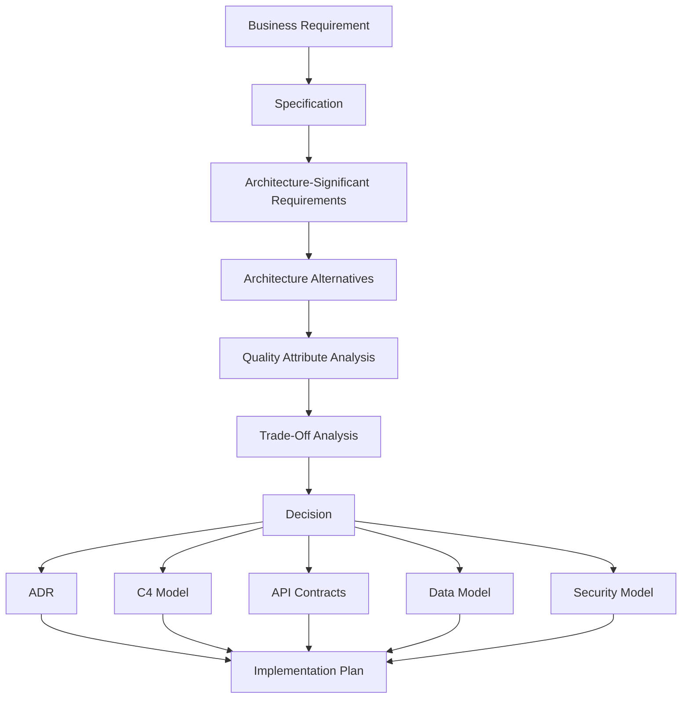
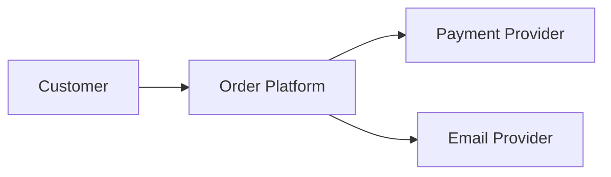
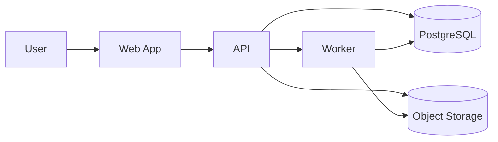
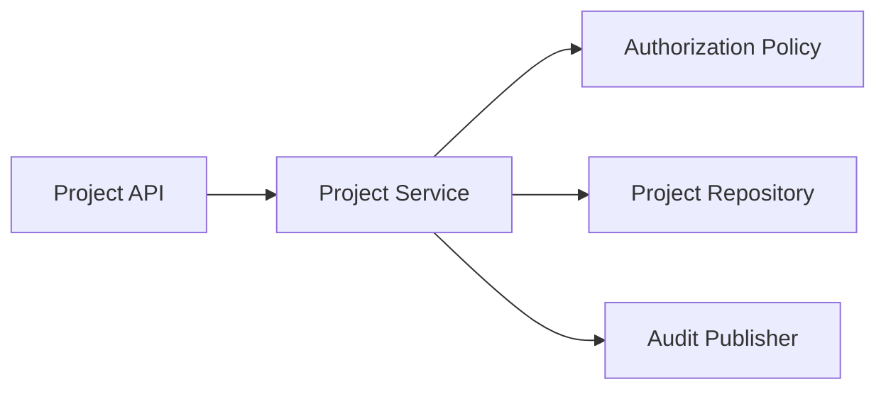
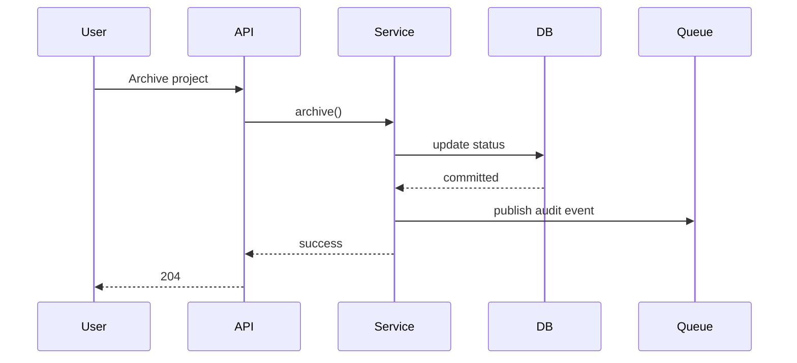
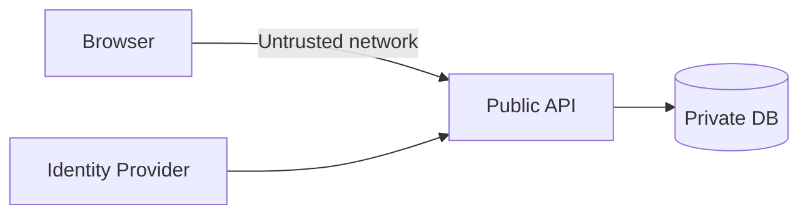
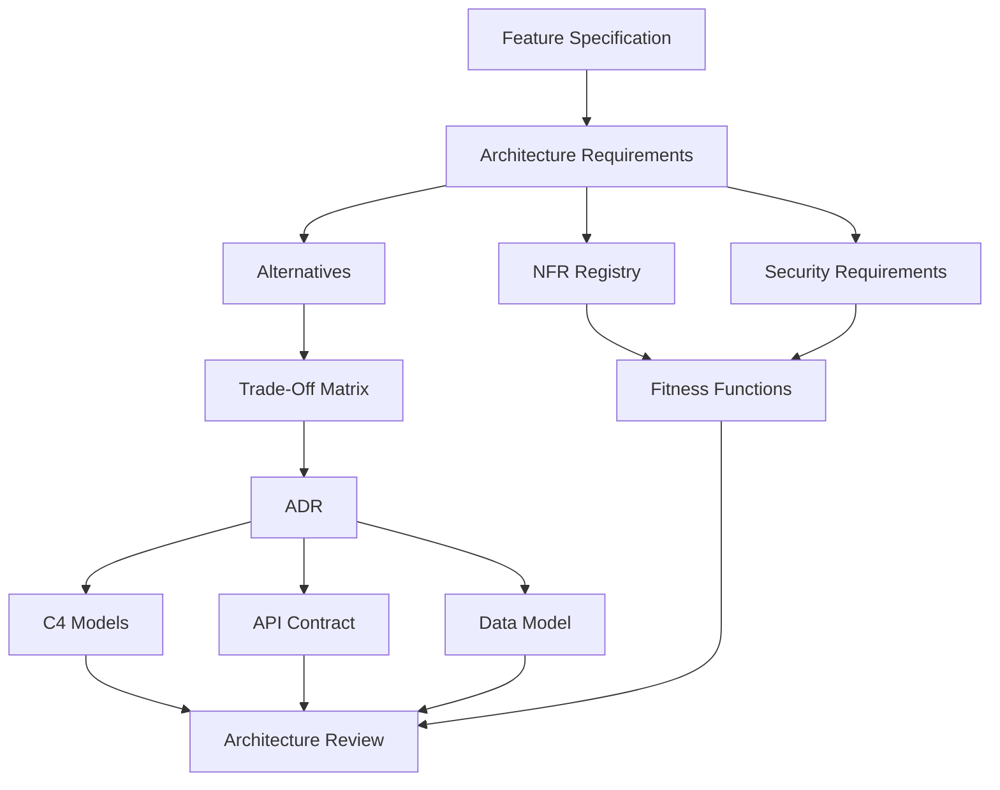
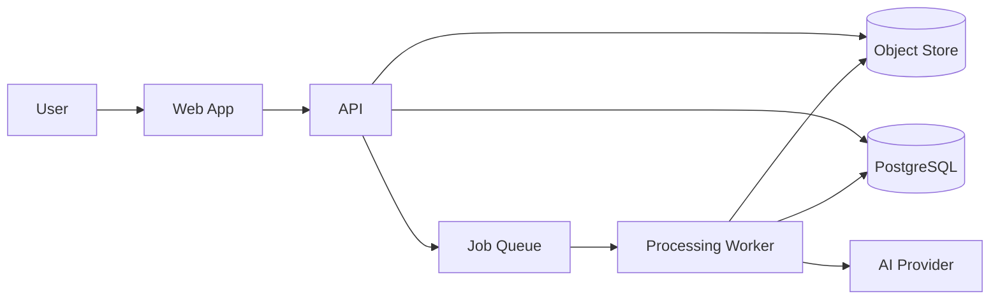
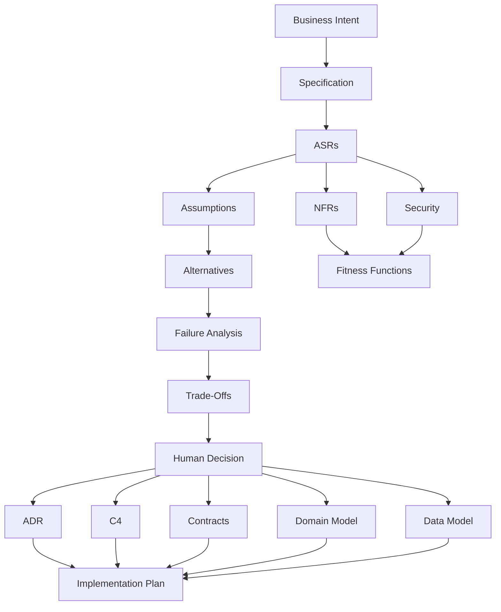

# Phase 8 — AI-Assisted Software Architecture

> **Track:** AI-Powered Software Development / Agentic Software Engineering  
> **Prerequisites:**  
> - Phase 1 — Generative AI for Software Engineers  
> - Phase 2 — Prompt Engineering for Software Development  
> - Phase 3 — Context Engineering  
> - Phase 4 — Agentic AI Fundamentals  
> - Phase 5 — AI Coding Agent Mastery  
> - Phase 6 — Spec-Driven Development  
> - Phase 7 — Agent-Friendly Repository Engineering  
>
> **Phase goal:** Use AI to accelerate architecture analysis, option generation, modeling, trade-off exploration, and documentation while keeping the human engineer responsible for the actual architecture decision.

---

# Table of Contents

1. [How to Study This Phase](#how-to-study-this-phase)
2. [Learning Objectives](#learning-objectives)
3. [Why AI Changes Architecture Work](#why-ai-changes-architecture-work)
4. [The Architecture Responsibility Principle](#the-architecture-responsibility-principle)
5. [The Core Workflow](#the-core-workflow)
6. [Architecture as Constraint Satisfaction](#architecture-as-constraint-satisfaction)
7. [Module 76 — AI-Assisted Requirements Analysis](#module-76--ai-assisted-requirements-analysis)
8. [Module 77 — System Design with AI](#module-77--system-design-with-ai)
9. [Module 78 — Architecture Trade-Off Analysis](#module-78--architecture-trade-off-analysis)
10. [Module 79 — C4 Modeling](#module-79--c4-modeling)
11. [Module 80 — Architecture Decision Records](#module-80--architecture-decision-records)
12. [Module 81 — API Contract Design](#module-81--api-contract-design)
13. [Module 82 — Database Modeling](#module-82--database-modeling)
14. [Module 83 — Domain Modeling](#module-83--domain-modeling)
15. [Module 84 — Non-Functional Requirements](#module-84--non-functional-requirements)
16. [Module 85 — Performance Requirements](#module-85--performance-requirements)
17. [Module 86 — Scalability Requirements](#module-86--scalability-requirements)
18. [Module 87 — Security Requirements](#module-87--security-requirements)
19. [Architecture Alternatives and Decision Matrices](#architecture-alternatives-and-decision-matrices)
20. [Quality Attributes and Architecture](#quality-attributes-and-architecture)
21. [Architecture Fitness Functions](#architecture-fitness-functions)
22. [Data Flow and Trust Boundaries](#data-flow-and-trust-boundaries)
23. [Architecture Review with AI](#architecture-review-with-ai)
24. [Architecture Failure Modes with AI](#architecture-failure-modes-with-ai)
25. [Practical Python and Modeling Examples](#practical-python-and-modeling-examples)
26. [Worked Case Studies](#worked-case-studies)
27. [Architecture Anti-Patterns](#architecture-anti-patterns)
28. [Practical Labs](#practical-labs)
29. [Review Questions](#review-questions)
30. [Scenario Exercises](#scenario-exercises)
31. [Phase Project — ArchLens](#phase-project--archlens)
32. [Phase 8 Completion Checklist](#phase-8-completion-checklist)
33. [Where This Leads Next](#where-this-leads-next)
34. [Reference Baseline](#reference-baseline)

---

# How to Study This Phase

This phase is not about letting an AI “design the architecture.”

That framing is too weak.

The correct mental model is:

```text
Human engineer owns:
- problem framing
- requirements authority
- risk appetite
- trade-off decisions
- irreversible decisions
- acceptance of architectural consequences

AI assists with:
- option generation
- missing-question discovery
- trade-off enumeration
- consistency checks
- modeling
- documentation
- review
- scenario analysis
```

AI is valuable because software architecture is information-heavy.

The architect must combine:

```text
business requirements
current architecture
technical constraints
quality attributes
cost
security
operability
team capability
migration risk
future uncertainty
```

AI can help process these dimensions quickly.

But the final choice remains an engineering decision.

---

# Learning Objectives

By the end of this phase, you should be able to:

1. Explain AI’s appropriate role in architecture work.
2. Separate requirements from architecture.
3. Separate architecture from implementation detail.
4. Identify architecture-significant requirements.
5. Extract quality attributes from feature specifications.
6. Identify hidden architectural assumptions.
7. Generate multiple architecture alternatives with AI.
8. Avoid accepting the first AI-generated design.
9. Compare alternatives systematically.
10. Use trade-off matrices.
11. Distinguish:
    - functional requirements,
    - architectural constraints,
    - quality attributes,
    - risks,
    - assumptions.
12. Build system context diagrams.
13. Build container diagrams.
14. Build component diagrams when useful.
15. Build dynamic diagrams.
16. Build deployment diagrams.
17. Avoid diagramming meaningless detail.
18. Write Architecture Decision Records.
19. Record:
    - context,
    - options,
    - decision,
    - consequences.
20. Design APIs contract-first.
21. Use OpenAPI as an interface artifact.
22. Define:
    - resources,
    - operations,
    - request/response schemas,
    - errors,
    - authentication,
    - idempotency.
23. Design relational schemas.
24. Identify entities, relationships, constraints, and indexes.
25. Explain normalization and denormalization trade-offs.
26. Model aggregate boundaries.
27. Build domain models.
28. Distinguish:
    - entity,
    - value object,
    - aggregate,
    - service,
    - domain event.
29. Identify bounded contexts.
30. Write measurable non-functional requirements.
31. Write performance requirements.
32. Design latency and throughput budgets.
33. Write scalability requirements.
34. Distinguish vertical and horizontal scaling.
35. Identify scaling bottlenecks.
36. Write security requirements.
37. Identify trust boundaries.
38. Define authentication and authorization requirements.
39. Define data protection requirements.
40. Define audit and abuse requirements.
41. Model architecture trade-offs explicitly.
42. Use scenario-based architecture evaluation.
43. Build architecture fitness functions.
44. Detect architecture drift.
45. Review architecture using AI without delegating authority.
46. Challenge AI-generated architecture assumptions.
47. Use evidence and measurement to validate architecture.
48. Produce an architecture package from a feature specification.
49. Build an architecture analysis tool.
50. Be ready for AI-driven implementation.

---

# Why AI Changes Architecture Work

Traditional architecture work can be slow because humans must manually gather and compare a large option space.

For example:

```text
Should this feature use:
- synchronous request?
- background job?
- message queue?
- scheduled batch?
- event-driven flow?
```

Each option affects:

```text
latency
consistency
complexity
operability
cost
failure modes
```

AI can quickly enumerate the implications.

That is useful.

But it can also generate a very confident design that ignores:

```text
real traffic
team skill
existing platform
regulatory constraint
legacy integration
operational burden
```

Therefore AI changes architecture in two ways:

```text
Architecture exploration becomes faster.

Architecture judgment becomes more important.
```

---

# The Architecture Responsibility Principle

Memorize:

> **The AI may recommend architecture. The engineer accepts architecture.**

Architecture creates consequences that can last for years:

```text
data model
service boundaries
public API
operational model
security model
deployment architecture
```

An architecture decision may cost far more to reverse than a local code decision.

Therefore:

```text
High reversibility
→ delegate more

Low reversibility
→ require deeper human review
```

---

# The Core Workflow

The target workflow is:

```text
Business Requirement
        ↓
Specification
        ↓
Architecture-Significant Requirements
        ↓
Architecture Alternatives
        ↓
Trade-Off Analysis
        ↓
Selected Architecture
        ↓
ADR
        ↓
Implementation Plan
```

Expanded:



---

# Architecture as Constraint Satisfaction

Architecture is not about choosing the “best technology.”

It is about choosing a design that satisfies the important constraints.

Suppose:

```text
Requirement:
Process uploaded files within 10 seconds.

Scale:
10 uploads/minute.

Team:
4 Python engineers.

Operations:
No Kafka experience.

Budget:
Small.

Reliability:
Retry failures safely.
```

A simple background queue may be better than a complex event platform.

Architecture quality depends on context.

Conceptually:

```text
Architecture
=
Functional Requirements
+
Quality Attributes
+
Constraints
+
Trade-Off Decisions
```

---

# Module 76 — AI-Assisted Requirements Analysis

# 76.1 Architecture Starts Before the Diagram

A common mistake:

```text
Requirement
→ immediately draw microservices
```

Architecture should start by understanding the forces shaping the system.

---

# 76.2 Architecture-Significant Requirement

An architecture-significant requirement (ASR) is a requirement likely to meaningfully influence system structure or technology.

Examples:

```text
P95 latency < 200 ms
99.99% availability
regional data residency
offline operation
10,000 concurrent users
audit retention for 7 years
```

---

# 76.3 Functional Requirement vs ASR

Functional:

```text
User can submit an order.
```

Architecture significance may come from:

```text
Orders must not be lost.
Peak load is 30,000 orders/minute.
Payment confirmation may arrive asynchronously.
```

---

# 76.4 AI Requirements Pass

Ask AI to classify specification content into:

```text
functional
data
integration
security
performance
scalability
reliability
operational
constraints
assumptions
```

Do not ask it to invent values.

---

# 76.5 Example

Feature:

```text
Generate monthly customer invoices.
```

AI should surface questions:

```text
How many invoices?
How quickly?
Can generation be asynchronous?
Is exact timing required?
What happens on partial failure?
Can invoices be regenerated?
Are records immutable?
```

These questions shape architecture.

---

# 76.6 Extracting Hidden Constraints

A sentence:

```text
Finance needs the report by 07:00 every morning.
```

implies:

```text
batch deadline
reliability
observability
recovery window
```

---

# 76.7 Stakeholder Vocabulary

AI can help map business language to technical concerns.

Example:

```text
"never lose an order"
→ durability/reliability

"instant"
→ latency

"available worldwide"
→ geography/scalability/availability

"must be auditable"
→ logging/immutability/retention
```

But verify interpretation.

---

# 76.8 Requirement Quantification

Vague:

```text
high traffic
```

Architecturally useful:

```text
average requests/sec
peak requests/sec
growth rate
payload size
concurrency
```

---

# 76.9 Architecture Assumption Log

Example:

```markdown
## Assumptions

A-001:
Peak traffic will not exceed 500 req/s in first year.
Status: unverified.
Impact: high.

A-002:
Background processing up to 30 seconds is acceptable.
Status: confirmed by product.
```

---

# 76.10 Uncertainty Must Be Visible

Never silently turn:

```text
unknown
```

into:

```text
architecture fact
```

Label:

```text
confirmed
assumed
estimated
unknown
```

---

# Module 77 — System Design with AI

# 77.1 System Design Is a Search Problem

Given requirements, many designs may satisfy them.

AI is good at generating candidate architectures.

Use that.

---

# 77.2 Require Multiple Alternatives

Bad request:

```text
Design the architecture.
```

Better:

```text
Generate three viable architecture alternatives.
For each, explain:
- responsibilities
- data flow
- failure behavior
- operational complexity
- main risks
- when it is appropriate
Do not select a winner yet.
```

---

# 77.3 Example Alternatives

Feature:

```text
Generate report after large data import.
```

Alternatives:

```text
A. synchronous request
B. DB-backed background job
C. message broker + worker
```

---

# 77.4 System Boundaries

First identify:

```text
what is inside the system?
what is external?
```

Example:

```text
Our system:
API
worker
DB

External:
payment provider
email provider
identity provider
```

---

# 77.5 Responsibility Allocation

Architecture decides where responsibilities live.

Example:

```text
API:
authentication + input validation

Service:
business rules

Worker:
long-running execution

Repository:
persistence
```

---

# 77.6 Data Flow

Trace:

```text
request
→ validation
→ business decision
→ persistence
→ event
→ external side effect
```

AI can inspect for missing failure paths.

---

# 77.7 Failure Design

Ask:

```text
What if:
DB unavailable?
external API times out?
worker crashes?
message delivered twice?
```

Architecture is often revealed by failures.

---

# 77.8 State Ownership

Every state should have an owner.

Example:

```text
Order state → PostgreSQL
Cache → Redis
File object → Object storage
Job state → job table
```

Avoid ambiguous state ownership.

---

# 77.9 Synchronous vs Asynchronous

Compare:

```text
Synchronous:
simple
immediate result
request tied to processing time

Asynchronous:
decoupled
retryable
supports long work
more state/operational complexity
```

---

# 77.10 Monolith vs Microservices

Do not let AI default to microservices.

Ask:

```text
Does independent deployment solve a real problem?
Are boundaries stable?
Can team operate distributed systems?
```

A modular monolith is often appropriate.

---

# 77.11 Architecture Evolution

Design for current requirements plus credible change.

Do not design for imaginary scale.

---

# Module 78 — Architecture Trade-Off Analysis

# 78.1 Every Architecture Has Trade-Offs

There is no design maximizing all of:

```text
performance
reliability
simplicity
cost
security
scalability
developer speed
```

Architecture is choosing which qualities matter most.

---

# 78.2 Trade-Off Matrix

Example:

| Criterion | Weight | Sync | DB Job | Queue |
|---|---:|---:|---:|---:|
| Simplicity | 5 | 5 | 4 | 2 |
| Retryability | 4 | 1 | 4 | 5 |
| Scale | 3 | 2 | 3 | 5 |
| Ops burden | 4 | 5 | 4 | 2 |

Do not treat numeric score as absolute truth.

It makes assumptions visible.

---

# 78.3 Weighted Score

```text
score =
Σ(weight × option rating)
```

Useful as a discussion tool.

Not an architecture oracle.

---

# 78.4 Reversibility

Classify decisions:

```text
easy to reverse
moderate
expensive
```

Invest more analysis in expensive decisions.

---

# 78.5 Cost of Complexity

A technically powerful option may have hidden costs:

```text
on-call complexity
debugging
deployment
observability
developer onboarding
```

AI often underweights operational complexity unless prompted.

---

# 78.6 Team Capability Is an Architectural Constraint

Architecture requiring expertise the team does not possess introduces delivery risk.

This does not mean never adopt new technology.

It means cost must be explicit.

---

# 78.7 Existing Platform

If company already operates:

```text
PostgreSQL
Redis
SQS
```

a new Kafka cluster needs strong justification.

---

# 78.8 Trade-Off Scenario

```text
Requirement:
10-second processing deadline.

Option A:
synchronous.

Option B:
DB queue.

Option C:
Kafka.
```

The correct choice depends on actual:

```text
load
durability
team
failure model
future demand
```

---

# Module 79 — C4 Modeling

# 79.1 Why C4?

The C4 model uses hierarchical zoom levels to communicate architecture.

Core static levels:

```text
System Context
Container
Component
Code
```

You usually do not need all four.

For many teams:

```text
Context + Container
```

provide most value.

---

# 79.2 Level 1 — System Context

Shows:

```text
people
system
external systems
```

Question:

```text
Where does the system fit?
```

Example:



---

# 79.3 Context Diagram Rules

Focus on:

```text
system boundary
actors
external dependencies
relationships
```

Avoid:

```text
database tables
classes
internal libraries
```

---

# 79.4 Level 2 — Container

In C4, container means a deployable/runnable application or data store, not specifically a Docker container.

Examples:

```text
web application
API
worker
database
object storage
```

---

# 79.5 Container Example



---

# 79.6 Container Responsibilities

Each element should communicate:

```text
name
responsibility
technology when useful
relationships
```

---

# 79.7 Level 3 — Component

Zoom into one container.

Example API:

```text
ProjectController
ProjectService
ProjectRepository
AuditPublisher
```

Use when internal structure matters.

---

# 79.8 Component Diagram



---

# 79.9 Level 4 — Code

Classes/functions.

Usually source code and IDE already provide this.

Do not create code diagrams unless they add value.

---

# 79.10 Dynamic Diagram

Shows sequence of interactions.

Example:



---

# 79.11 Deployment Diagram

Shows runtime deployment:

```text
region
nodes
instances
load balancer
DB
```

Useful for operational architecture.

---

# 79.12 AI and C4

AI can generate C4 drafts.

Human must verify:

```text
boundaries
responsibilities
actual dependencies
```

---

# 79.13 Diagrams as Architecture Index

Diagrams should link to:

```text
ADRs
contracts
source
operations docs
```

---

# Module 80 — Architecture Decision Records

# 80.1 Why ADRs?

Architecture decisions disappear if only discussed in:

```text
meeting
chat
PR
```

ADR records durable rationale.

---

# 80.2 ADR Structure

A concise ADR:

```markdown
# ADR-012 — Use DB-Backed Job Queue for Report Generation

## Status
Accepted

## Context
Reports may take 5–20 seconds.
Peak load is low.
The team operates PostgreSQL but no message broker.

## Options
1. Synchronous processing
2. DB-backed jobs
3. Dedicated broker

## Decision
Use DB-backed jobs.

## Consequences
Positive:
- no new infrastructure
- durable retries

Negative:
- DB receives queue workload
- less scalable than dedicated broker

## Revisit When
Peak job rate exceeds agreed threshold.
```

---

# 80.3 ADR Is Not Design Document

ADR records a decision.

It should not duplicate the full architecture plan.

---

# 80.4 Record Alternatives

Without alternatives, future readers cannot understand why decision was made.

---

# 80.5 Record Consequences

Every decision has costs.

Document them.

---

# 80.6 Status

Examples:

```text
Proposed
Accepted
Superseded
Deprecated
Rejected
```

---

# 80.7 Superseding ADRs

Do not erase history.

New ADR:

```text
ADR-024 supersedes ADR-012
```

---

# 80.8 Decision Triggers

Not every coding choice needs ADR.

Use for decisions with:

```text
long life
broad impact
significant trade-offs
hard reversal
```

---

# 80.9 AI-Assisted ADR Drafting

AI can summarize:

```text
context
options
pros/cons
```

Human confirms:

```text
decision
rationale
consequences
```

---

# Module 81 — API Contract Design

# 81.1 API Is an Architectural Boundary

An API contract determines how systems collaborate.

It should be designed intentionally.

---

# 81.2 Contract-First Workflow

```text
Requirement
→ Resource model
→ Operations
→ Request/response
→ Errors
→ Auth
→ Contract
→ Implementation
```

---

# 81.3 Resource Modeling

Example:

```text
/projects
/projects/{project_id}/archive
```

Prefer domain concepts over implementation details.

---

# 81.4 HTTP Methods

Use semantics appropriately:

```text
GET
POST
PUT
PATCH
DELETE
```

Exact design depends on resource/action.

---

# 81.5 Status Codes

Define:

```text
success
validation failure
unauthorized
forbidden
not found
conflict
server failure
```

---

# 81.6 Request Schema

Example:

```json
{
  "reason": "Project completed"
}
```

---

# 81.7 Response Schema

Example:

```json
{
  "id": "uuid",
  "status": "archived",
  "archived_at": "2026-08-23T11:00:00Z"
}
```

---

# 81.8 Error Model

Prefer stable structure:

```json
{
  "code": "PROJECT_NOT_ARCHIVABLE",
  "message": "Project has an active deployment.",
  "details": {}
}
```

---

# 81.9 Error Codes as Contract

Clients can depend on:

```text
code
```

more reliably than human text.

---

# 81.10 Authentication and Authorization

API contract should define:

```text
who can call
which scopes/roles
tenant boundary
```

---

# 81.11 Idempotency

Important for retryable operations.

Example:

```text
POST payment
```

may use an idempotency key.

---

# 81.12 Pagination

Define:

```text
offset
cursor
page size
ordering
```

Cursor often scales better for changing datasets.

---

# 81.13 Versioning

Breaking changes need policy.

Examples:

```text
URL version
header
media type
compatible evolution
```

---

# 81.14 OpenAPI

OpenAPI provides a language-agnostic description of HTTP APIs usable by humans and machines.

Current published OAS version is 3.2.0.

Use OpenAPI to capture:

```text
paths
operations
schemas
security
errors
examples
```

---

# 81.15 Contract Validation

CI can validate:

```text
OpenAPI syntax
implementation compatibility
breaking changes
```

---

# 81.16 Consumer-Driven Concerns

Do not design API only from server perspective.

Consider:

```text
client workflows
round trips
error recovery
compatibility
```

---

# Module 82 — Database Modeling

# 82.1 Database Design Is Architecture

Data outlives many code versions.

Bad data models are expensive to reverse.

---

# 82.2 Start from Domain

Do not start:

```text
table first
```

Start:

```text
business concepts
relationships
invariants
queries
```

---

# 82.3 Entity Identification

Example:

```text
Organization
Project
ProjectMember
ArchiveEvent
```

---

# 82.4 Keys

Primary key:

```text
stable identity
```

Foreign key:

```text
relationship
```

---

# 82.5 Constraints

Encode invariant where possible:

```text
NOT NULL
UNIQUE
FOREIGN KEY
CHECK
```

Database constraints are strong guardrails.

---

# 82.6 Normalization

Normalization reduces:

```text
duplication
update anomalies
```

Do not normalize blindly.

---

# 82.7 Denormalization

Use when justified for:

```text
performance
read model
analytics
```

Document consistency consequences.

---

# 82.8 Index Design

Indexes should follow query patterns.

Example:

```sql
CREATE INDEX idx_projects_org_status
ON projects (organization_id, status);
```

Do not add indexes merely because a column exists.

---

# 82.9 Unique Constraint

Example:

```text
project name unique per organization
```

Should be enforced:

```sql
UNIQUE (organization_id, name)
```

not only application logic.

---

# 82.10 Soft Delete / Archive

Options:

```text
status
deleted_at
archived_at
history table
```

Each has trade-offs.

---

# 82.11 Audit Model

Questions:

```text
who changed?
when?
what changed?
immutable?
```

---

# 82.12 Transaction Boundaries

Architecture must identify operations that require atomicity.

Example:

```text
update order
+
write outbox event
```

same transaction may prevent lost events.

---

# 82.13 Isolation and Concurrency

Understand:

```text
lost update
dirty read
non-repeatable read
phantom
```

Use only as much isolation as necessary.

---

# 82.14 Schema Evolution

Plan:

```text
backward-compatible migration
backfill
application rollout
constraint enforcement
cleanup
```

---

# 82.15 AI Database Review

Ask AI:

```text
What invariants are not enforced?
Which queries need indexes?
What concurrency races exist?
```

Then validate with actual workload/query plans.

---

# Module 83 — Domain Modeling

# 83.1 What Is Domain Modeling?

Domain modeling represents business concepts and rules in software.

It answers:

```text
What are the important things?
What state do they own?
What rules govern them?
```

---

# 83.2 Entity

Has identity over time.

Example:

```text
Project
Invoice
Customer
```

---

# 83.3 Value Object

Defined by value.

Example:

```text
Money
EmailAddress
DateRange
```

---

# 83.4 Aggregate

Consistency boundary.

Example:

```text
Order
+ OrderLines
```

External code changes the aggregate through its root.

---

# 83.5 Aggregate Invariants

Example:

```text
Order cannot be paid twice.
```

---

# 83.6 Domain Service

Use when business operation does not naturally belong to one entity/value object.

---

# 83.7 Domain Event

Represents meaningful business fact.

Examples:

```text
ProjectArchived
InvoicePaid
OrderSubmitted
```

---

# 83.8 Bounded Context

A domain concept may mean different things in different contexts.

Example:

```text
Customer in Sales
Customer in Billing
```

Do not force one giant model.

---

# 83.9 Ubiquitous Language

Use names stakeholders recognize.

Avoid technical aliases that obscure business meaning.

---

# 83.10 AI and Domain Modeling

AI can propose:

```text
entities
events
invariants
bounded contexts
```

But business authority remains with domain experts.

---

# 83.11 Anemic Domain Model

If all entities are passive data and business logic is scattered:

```text
rules become hard to discover
```

But not every application requires rich DDD.

Use proportional complexity.

---

# 83.12 Domain Modeling vs Database Modeling

Domain:

```text
business meaning
```

Database:

```text
persistence representation
```

Do not force 1:1 mapping.

---

# Module 84 — Non-Functional Requirements

# 84.1 What Are NFRs?

They describe system qualities and constraints rather than primary user behavior.

Examples:

```text
availability
performance
security
reliability
maintainability
observability
cost
compliance
```

---

# 84.2 NFRs Drive Architecture

Functional requirements often can be implemented many ways.

NFRs determine which architecture is appropriate.

---

# 84.3 Vague NFR

```text
The system should be scalable.
```

Not useful.

---

# 84.4 Measurable NFR

```text
The API must support 2,000 sustained requests/sec
with P95 latency under 250 ms
for the defined workload.
```

---

# 84.5 Quality Attribute Scenario

Useful template:

```text
Source
Stimulus
Environment
Artifact
Response
Measure
```

Example:

```text
Source:
Customer

Stimulus:
Submits API request

Environment:
Normal load

Artifact:
Projects API

Response:
Returns result

Measure:
P95 < 250 ms
```

---

# 84.6 Reliability Requirement

Example:

```text
Accepted orders must not be lost after API returns success.
```

---

# 84.7 Availability Requirement

Example:

```text
99.95% monthly availability excluding scheduled maintenance.
```

Define measurement precisely.

---

# 84.8 Observability Requirement

Example:

```text
Every request must carry a correlation ID through API and worker logs.
```

---

# 84.9 Recoverability Requirement

Example:

```text
RPO ≤ 5 minutes
RTO ≤ 30 minutes
```

Only if business needs justify.

---

# 84.10 Cost Requirement

Example:

```text
Infrastructure must remain within agreed monthly budget at projected load.
```

---

# 84.11 AI and NFR Discovery

AI is useful for asking:

```text
What qualities could make this feature fail in production?
```

But numeric targets require business/measurement evidence.

---

# Module 85 — Performance Requirements

# 85.1 Performance Is More Than Latency

Dimensions:

```text
latency
throughput
resource use
startup time
batch completion
```

---

# 85.2 Percentiles

Average hides tail latency.

Use:

```text
P50
P95
P99
```

depending on system.

---

# 85.3 Performance Requirement Example

```text
Under 500 concurrent users,
GET /projects must maintain:
P95 < 200 ms
P99 < 500 ms
```

---

# 85.4 Workload Definition

Performance targets are meaningless without workload.

Define:

```text
requests/sec
payload size
data volume
concurrency
read/write mix
```

---

# 85.5 Latency Budget

Example:

```text
Total target: 200 ms

API overhead: 20
DB: 80
external call: 60
serialization: 20
buffer: 20
```

Architecture can use the budget.

---

# 85.6 Performance Bottleneck

AI can suggest bottlenecks.

Validate with:

```text
profiling
traces
query plans
metrics
```

---

# 85.7 Premature Optimization

Do not architect complex caches without evidence.

---

# 85.8 Caching Trade-Offs

Cache improves:

```text
latency
load
```

but adds:

```text
staleness
invalidation
memory
operability
```

---

# 85.9 Database Performance

Check:

```text
query count
indexes
join shape
N+1
locks
```

---

# 85.10 Async Does Not Automatically Mean Fast

Async improves concurrency for I/O-bound work.

It does not reduce CPU work automatically.

---

# 85.11 Performance Test

Architecture should define how requirement is measured.

---

# Module 86 — Scalability Requirements

# 86.1 Scalability Is Ability to Handle Growth

Dimensions:

```text
users
requests
data
jobs
regions
tenants
```

---

# 86.2 Vertical Scaling

Increase:

```text
CPU
RAM
```

Simple but limited.

---

# 86.3 Horizontal Scaling

Add instances.

Requires attention to:

```text
statelessness
shared state
load balancing
coordination
```

---

# 86.4 Stateless Application

Stateless request handling is easier to scale horizontally.

Persistent state belongs in shared stores.

---

# 86.5 Scaling Bottlenecks

Common:

```text
database writes
global locks
single queue
external API limits
shared filesystem
```

---

# 86.6 Data Scaling

Large datasets may require:

```text
partitioning
archiving
read replicas
sharding
```

Do not jump to sharding prematurely.

---

# 86.7 Queue Scaling

Workers can scale horizontally if jobs are independent/idempotent.

---

# 86.8 Multi-Tenant Scale

Consider:

```text
noisy neighbor
tenant isolation
per-tenant limits
```

---

# 86.9 Geographic Scale

Global architecture introduces:

```text
latency
replication
data residency
consistency
```

---

# 86.10 Scalability Requirement Example

```text
The architecture must support growth from 100 to 2,000 requests/sec
without redesigning the public API or changing the core data model.
```

---

# 86.11 Growth Horizon

Architecture for credible horizon:

```text
12–24 months
```

not hypothetical millions of users unless required.

---

# Module 87 — Security Requirements

# 87.1 Security Is an Architecture Concern

Security should not be added at the end.

Architecture determines:

```text
trust boundaries
identity flow
data exposure
privilege
network paths
```

---

# 87.2 Identify Assets

Examples:

```text
customer PII
credentials
payments
business records
audit logs
```

---

# 87.3 Identify Actors

```text
customer
admin
service
third party
attacker
```

---

# 87.4 Trust Boundaries

A trust boundary is where trust level changes.

Example:

```text
browser
→ public API
```

---

# 87.5 Authentication Requirement

```text
All non-public API operations require authenticated identity.
```

---

# 87.6 Authorization Requirement

```text
Project access must be scoped to authenticated organization.
```

---

# 87.7 Least Privilege

Services/accounts receive minimum permissions needed.

---

# 87.8 Data in Transit

Use protected transport.

---

# 87.9 Data at Rest

Define protection based on data sensitivity.

---

# 87.10 Secret Management

Secrets should not be:

```text
committed
logged
hard-coded
```

Use appropriate secret storage.

---

# 87.11 Audit Requirements

Example:

```text
Archive and restore actions must record:
actor
project
timestamp
action
result
```

---

# 87.12 Abuse Cases

Think:

```text
credential stuffing
IDOR
mass export
rate abuse
replay
```

---

# 87.13 Security Failure Behavior

Do not leak:

```text
existence
internal stack
sensitive details
```

---

# 87.14 Security Architecture Review

Ask AI:

```text
What trust boundaries exist?
What privilege escalation paths?
What cross-tenant risks?
What sensitive flows?
```

Then review using real threat model and controls.

---

# 87.15 Secure Development Requirements

Security requirements should exist throughout the SDLC, not only code review.

Current NIST SSDF guidance treats security practices as integrated development activities rather than an add-on.

---

# Architecture Alternatives and Decision Matrices

# 88.1 Architecture Alternative Template

```markdown
## Alternative A — DB-Backed Queue

### Description
...

### Strengths
...

### Weaknesses
...

### Failure Model
...

### Operational Cost
...

### Security Impact
...

### Reversibility
...
```

---

# 88.2 Decision Criteria

Possible:

```text
latency
reliability
complexity
cost
team familiarity
migration effort
security
operability
```

---

# 88.3 Weighted Matrix Example

```python
criteria = {
    "simplicity": 5,
    "reliability": 5,
    "scalability": 3,
    "cost": 4,
}
```

---

# 88.4 Avoid False Precision

A score:

```text
87.4
```

does not make architecture objective.

Use matrix to expose assumptions.

---

# Quality Attributes and Architecture

# 89.1 Quality Attribute Tension

Examples:

```text
security vs convenience
consistency vs availability
performance vs cost
simplicity vs flexibility
```

---

# 89.2 Reliability

Questions:

```text
What fails?
What retries?
What state persists?
```

---

# 89.3 Maintainability

Questions:

```text
Can teams understand boundaries?
Can change remain local?
```

---

# 89.4 Operability

Questions:

```text
Can we deploy?
Can we observe?
Can we recover?
```

---

# 89.5 Cost

Architecture has both:

```text
infrastructure cost
engineering/operational cost
```

---

# Architecture Fitness Functions

# 90.1 What Is a Fitness Function?

A fitness function is an automated or measurable check that tells whether architecture continues satisfying an important characteristic.

Examples:

```text
dependency tests
performance benchmark
schema compatibility
security scan
```

---

# 90.2 Architecture Rule Fitness Function

```text
API must not import repository.
```

Automate in tests.

---

# 90.3 Performance Fitness Function

```text
P95 endpoint latency stays below target under benchmark.
```

---

# 90.4 Contract Fitness Function

```text
No breaking OpenAPI change without approval.
```

---

# 90.5 Fitness Functions and Phase 7

Phase 7 repository guardrails are the implementation mechanism for many architecture fitness functions.

---

# Data Flow and Trust Boundaries

# 91.1 Why Data Flow Matters

Architecture diagrams that only show boxes may hide security/reliability problems.

Trace:

```text
where data originates
where it moves
where stored
where transformed
```

---

# 91.2 Data Flow Table

| Data | Source | Destination | Sensitive? | Retention |
|---|---|---|---|---|
| Project metadata | Browser | API/DB | Low | active life |
| Access token | IdP | API | High | ephemeral |
| Audit event | Service | Audit store | Medium | 7 years |

---

# 91.3 Trust Boundary Diagram



---

# 91.4 Sensitive Data Reduction

Do not move/store sensitive data unless required.

Architecture can reduce attack surface.

---

# Architecture Review with AI

# 92.1 AI as Reviewer

Give AI:

```text
requirements
architecture
ADRs
C4 diagrams
contracts
```

Ask it to challenge assumptions.

---

# 92.2 Review Prompts

```text
Identify:
- unsupported assumptions
- missing failure paths
- hidden coupling
- scaling bottlenecks
- security boundaries
- operational complexity
```

---

# 92.3 Red-Team the Architecture

Ask:

```text
Under what conditions does this design fail?
```

---

# 92.4 Counterproposal Review

Ask AI to generate one alternative with a different philosophy.

Example:

```text
current: asynchronous
counterproposal: synchronous
```

Compare.

---

# 92.5 AI Review Limitation

AI lacks direct knowledge of:

```text
actual team
real cost
real traffic
political constraints
organizational history
```

unless provided.

---

# Architecture Failure Modes with AI

# 93.1 First-Answer Bias

Agent proposes one architecture and then rationalizes it.

Fix:

```text
require multiple alternatives before selection
```

---

# 93.2 Trend Bias

AI overuses:

```text
microservices
Kafka
Kubernetes
event sourcing
```

because common in architecture discourse.

Require justification.

---

# 93.3 Imaginary Scale

AI designs for millions without evidence.

Use quantified load.

---

# 93.4 Ignored Team Constraints

Architecture impossible for team to operate.

Include team capability.

---

# 93.5 Hand-Wavy NFRs

```text
high availability
scalable
secure
```

without measures.

Rewrite.

---

# 93.6 Diagram Correctness Illusion

A clean Mermaid diagram can still represent wrong architecture.

---

# 93.7 ADR After the Fact

Writing ADR only after code to justify existing choice weakens decision process.

---

# 93.8 API Implementation Leakage

Contract mirrors internal DB structure.

Review consumer needs.

---

# 93.9 Database Over-Abstraction

AI may add repository complexity without real need.

---

# 93.10 Security as Checklist Only

Threats depend on actual data/control flow.

---

# Practical Python and Modeling Examples

# 94.1 Architecture Requirement Model

```python
from typing import Literal
from pydantic import BaseModel


class ArchitectureRequirement(BaseModel):
    id: str
    category: Literal[
        "functional",
        "performance",
        "scalability",
        "security",
        "reliability",
        "operational",
        "constraint",
    ]
    statement: str
    priority: Literal[
        "must",
        "should",
        "may",
    ]
    status: Literal[
        "confirmed",
        "assumed",
        "unknown",
    ]
```

---

# 94.2 Architecture Alternative

```python
class ArchitectureAlternative(BaseModel):
    name: str
    description: str
    strengths: list[str]
    weaknesses: list[str]
    risks: list[str]
    reversible: bool
```

---

# 94.3 Weighted Decision Matrix

```python
from dataclasses import dataclass


@dataclass
class Criterion:
    name: str
    weight: float


def score_option(
    ratings: dict[str, float],
    criteria: list[Criterion],
) -> float:
    return sum(
        criterion.weight
        * ratings[criterion.name]
        for criterion in criteria
    )
```

---

# 94.4 ADR Model

```python
class ADR(BaseModel):
    id: str
    title: str
    status: str
    context: str
    options: list[str]
    decision: str
    positive_consequences: list[str]
    negative_consequences: list[str]
    revisit_when: list[str]
```

---

# 94.5 Latency Budget

```python
from dataclasses import dataclass


@dataclass
class LatencyBudget:
    api_ms: int
    db_ms: int
    external_ms: int
    serialization_ms: int
    buffer_ms: int

    @property
    def total_ms(self) -> int:
        return (
            self.api_ms
            + self.db_ms
            + self.external_ms
            + self.serialization_ms
            + self.buffer_ms
        )
```

---

# 94.6 NFR Model

```python
class QualityRequirement(BaseModel):
    id: str
    quality: str
    stimulus: str
    environment: str
    response: str
    measure: str
```

---

# 94.7 Data Entity Sketch

```python
class EntitySpec(BaseModel):
    name: str
    identity: str
    attributes: list[str]
    invariants: list[str]
    relationships: list[str]
```

---

# 94.8 API Error Contract

```python
class ApiError(BaseModel):
    code: str
    message: str
    details: dict
```

---

# Worked Case Studies

# Case Study 1 — Report Generation

## Requirement

```text
Generate customer report after import.
Report may take 5–20 seconds.
Traffic is low.
```

## Alternatives

```text
A synchronous
B DB-backed job
C message broker
```

## Trade-Off

Synchronous:

```text
simple
poor long-request behavior
```

DB job:

```text
durable
simple infrastructure
good current scale
```

Broker:

```text
best independent scale
highest operational cost
```

## Decision

DB-backed job.

## ADR

Records:

```text
why not broker
revisit threshold
```

---

# Case Study 2 — Multi-Tenant Analytics API

## Requirements

```text
500 req/s peak
P95 < 250 ms
tenant isolation mandatory
```

Architecture:

```text
API
→ service
→ PostgreSQL
```

Before adding Redis, benchmark real queries.

Potential DB index:

```text
(tenant_id, report_date)
```

Security requirement:

```text
every query constrained by tenant
```

Fitness function:

```text
cross-tenant integration tests
```

---

# Case Study 3 — File Processing

## Requirement

```text
100 MB file
processing may take 2 minutes
retries required
```

Synchronous architecture is poor.

Design:

```text
upload object
→ job created
→ worker processes
→ status API
```

Architecture reflects workload.

---

# Case Study 4 — Architecture Review Finds Hidden Risk

AI proposes:

```text
worker retries email sending
```

Question:

```text
Could duplicate email be sent?
```

Need idempotency/outbox/deduplication strategy.

Architecture review improves design.

---

# Case Study 5 — Domain and Database Divergence

Domain:

```text
Money
```

Database:

```text
amount decimal
currency char(3)
```

Do not collapse domain model to primitive decimal only.

---

# Architecture Anti-Patterns

# Anti-Pattern 1 — Let AI Select Architecture Without Alternatives

# Anti-Pattern 2 — Start with Technology

```text
"We need Kafka."
```

before requirement.

# Anti-Pattern 3 — Microservices by Default

# Anti-Pattern 4 — Architecture for Imaginary Scale

# Anti-Pattern 5 — NFRs as Adjectives

```text
fast scalable secure
```

# Anti-Pattern 6 — Architecture Diagram Without Decisions

# Anti-Pattern 7 — ADR Without Alternatives

# Anti-Pattern 8 — API Mirrors Database

# Anti-Pattern 9 — Database Constraints Only in Application

# Anti-Pattern 10 — Ignore Failure Modes

# Anti-Pattern 11 — Ignore Operations

# Anti-Pattern 12 — Ignore Cost

# Anti-Pattern 13 — Security After Design

# Anti-Pattern 14 — Treat AI Confidence as Evidence

# Anti-Pattern 15 — Use Decision Matrix as Automatic Winner

# Anti-Pattern 16 — Never Revisit Decisions

# Practical Labs

# Lab 1 — ASR Extraction

Take a feature spec.

Extract architecture-significant requirements.

# Lab 2 — Requirement Classification

Classify:

```text
functional
quality
constraint
assumption
```

# Lab 3 — Quantify Vague NFRs

Rewrite:

```text
fast
scalable
reliable
```

# Lab 4 — Architecture Assumption Log

Create 10 assumptions.

Rank by impact.

# Lab 5 — Alternative Generation

Generate 3 architectures for same problem.

# Lab 6 — Failure Analysis

For each architecture, list failure modes.

# Lab 7 — Trade-Off Matrix

Build weighted comparison.

# Lab 8 — Reversibility Analysis

Classify decisions.

# Lab 9 — Team Capability Constraint

Re-score design given team skills.

# Lab 10 — System Context Diagram

Create C4 context view.

# Lab 11 — Container Diagram

Create C4 container view.

# Lab 12 — Component Diagram

Create only where useful.

# Lab 13 — Dynamic Diagram

Show request path.

# Lab 14 — Deployment Diagram

Show production nodes.

# Lab 15 — ADR

Write one complete ADR.

# Lab 16 — ADR Supersession

Create new ADR superseding old one.

# Lab 17 — Contract-First API

Design OpenAPI before implementation.

# Lab 18 — Error Contract

Define stable error codes.

# Lab 19 — Idempotency Contract

Design retry-safe operation.

# Lab 20 — Pagination

Compare offset/cursor.

# Lab 21 — Breaking Change Review

Detect API contract break.

# Lab 22 — Entity Modeling

Identify entities and relationships.

# Lab 23 — Database Constraints

Move invariants into DB where appropriate.

# Lab 24 — Index Design

Choose index from query pattern.

# Lab 25 — Migration Plan

Design backward-compatible migration.

# Lab 26 — Domain Entities

Separate entity/value object.

# Lab 27 — Aggregate Boundary

Choose aggregate root.

# Lab 28 — Domain Event

Define event and semantics.

# Lab 29 — Bounded Context

Split overloaded domain term.

# Lab 30 — Quality Attribute Scenario

Write 10 scenario-based NFRs.

# Lab 31 — Latency Budget

Allocate 250 ms request.

# Lab 32 — Load Definition

Specify realistic benchmark workload.

# Lab 33 — Cache Decision

Compare with/without cache.

# Lab 34 — Scalability Bottleneck

Find first component to saturate.

# Lab 35 — Horizontal Scale

Make stateless API scale.

# Lab 36 — Data Growth

Plan for 100× data growth without premature sharding.

# Lab 37 — Trust Boundary

Draw security boundary diagram.

# Lab 38 — Authorization Requirements

Write tenant isolation rules.

# Lab 39 — Data Protection

Classify sensitive data.

# Lab 40 — Audit Requirements

Define audit event.

# Lab 41 — Abuse Case

Model one adversarial workflow.

# Lab 42 — Architecture Review

Use AI to challenge design.

# Lab 43 — Counterproposal

Generate simpler alternative.

# Lab 44 — Operational Review

List monitoring/deployment burden.

# Lab 45 — Cost Review

Estimate relative architecture cost.

# Lab 46 — Architecture Fitness Function

Automate one dependency rule.

# Lab 47 — Performance Fitness Function

Automate benchmark threshold.

# Lab 48 — Contract Fitness Function

Detect breaking API change.

# Lab 49 — Architecture Package

Create C4 + ADR + API + data model.

# Lab 50 — Full Architecture Decision Drill

Start from business requirement and end at reviewed ADR.

---

# Review Questions

1. Why should AI not own architecture decisions?
2. What is an architecture-significant requirement?
3. Why quantify requirements?
4. What is an architecture assumption?
5. Why label uncertainty?
6. Why generate multiple alternatives?
7. Why design failure behavior?
8. Why is state ownership important?
9. When is asynchronous processing useful?
10. Why are microservices not default?
11. What is a trade-off?
12. Why does team capability matter?
13. What is reversibility?
14. What is C4?
15. What does a context diagram show?
16. What is a C4 container?
17. When should component diagrams be used?
18. What is a dynamic diagram?
19. Why write ADRs?
20. What belongs in ADR context?
21. Why record alternatives?
22. Why record consequences?
23. When should ADR be superseded?
24. What is contract-first API design?
25. Why define errors?
26. What is idempotency?
27. Why is pagination architectural?
28. What is OpenAPI?
29. Why should DB design begin with domain/invariants?
30. Why use constraints?
31. When is denormalization valid?
32. How do indexes follow access patterns?
33. Why are transaction boundaries architectural?
34. What is an entity?
35. What is a value object?
36. What is an aggregate?
37. What is a domain event?
38. What is a bounded context?
39. What is an NFR?
40. Why are NFRs architecture drivers?
41. What is a quality attribute scenario?
42. Why use percentiles?
43. What is a latency budget?
44. Why define workload?
45. Why is async not automatically faster?
46. What is vertical scaling?
47. What is horizontal scaling?
48. Why is statelessness useful?
49. What are common scaling bottlenecks?
50. Why not shard early?
51. What is a trust boundary?
52. Why identify assets?
53. What is least privilege?
54. Why specify audit behavior?
55. What is an abuse case?
56. What is a decision matrix?
57. Why should scores not automatically decide?
58. What is a fitness function?
59. How can architecture drift be detected?
60. What makes AI useful in architecture review?
61. What is first-answer bias?
62. What is trend bias?
63. Why can clean diagrams be misleading?
64. Why is architecture operational?
65. Why does cost matter?
66. Why should architecture decisions be versioned?
67. Why separate domain and database models?
68. Why are contracts machine-readable?
69. Why should security requirements exist early?
70. What is the central lesson of Phase 8?

---

# Scenario Exercises

# Scenario 1 — “Use Microservices”

Stakeholder says:

```text
We need microservices because we expect growth.
```

What data is missing?

# Scenario 2 — Kafka Recommendation

AI proposes Kafka for 50 jobs/day.

How do you challenge this?

# Scenario 3 — Low Latency

Requirement:

```text
response should be instant.
```

What questions do you ask?

# Scenario 4 — Public API

AI changes field name in API.

Why is this architectural?

# Scenario 5 — Database Uniqueness

Application checks duplicate name but DB has no unique constraint.

What race exists?

# Scenario 6 — Multi-Tenant Security

Where should tenant isolation be enforced?

# Scenario 7 — Cache

AI adds Redis before benchmarking.

What evidence should exist first?

# Scenario 8 — Global Deployment

Product says:

```text
available worldwide.
```

What architecture-significant questions follow?

# Scenario 9 — ADR

An old ADR no longer fits current load.

Should you edit history?

# Scenario 10 — Model Confidence

AI says:

```text
"This architecture will scale to millions."
```

What evidence is required?

---

# Phase Project — ArchLens

# Project Goal

Build a small Python tool and architecture package that turns a feature specification into a structured architecture review workflow.

The project should teach:

```text
requirements analysis
alternatives
trade-offs
C4
ADRs
contracts
data model
NFRs
risk
fitness functions
```

---

# Project Structure

```text
archlens/
├── README.md
├── pyproject.toml
├── architecture/
│   ├── requirements.md
│   ├── alternatives.md
│   ├── tradeoffs.md
│   ├── c4/
│   │   ├── context.md
│   │   ├── container.md
│   │   └── dynamic.md
│   ├── adr/
│   │   └── ADR-001.md
│   ├── api/
│   │   └── openapi.yaml
│   ├── data/
│   │   └── model.md
│   ├── security/
│   │   └── threat-boundaries.md
│   └── fitness/
│       └── requirements.yaml
├── src/
│   └── archlens/
│       ├── models.py
│       ├── requirements.py
│       ├── alternatives.py
│       ├── scoring.py
│       ├── adr.py
│       ├── nfr.py
│       ├── contracts.py
│       ├── drift.py
│       └── cli.py
└── tests/
    ├── test_scoring.py
    ├── test_requirements.py
    ├── test_contracts.py
    └── test_drift.py
```

---

# Feature 1 — Architecture Requirement Parser

Read structured requirements:

```text
PERF-001
SEC-001
SCALE-001
```

---

# Feature 2 — Assumption Register

Track:

```text
confirmed
assumed
unknown
```

---

# Feature 3 — Alternative Model

Store multiple alternatives.

---

# Feature 4 — Decision Matrix

Score options without auto-selecting winner.

---

# Feature 5 — ADR Generator

Generate Markdown skeleton from selected alternative.

---

# Feature 6 — C4 Artifact

Store context/container diagrams as Mermaid/Structurizr-style text.

---

# Feature 7 — OpenAPI Contract

Create API contract.

Validate syntax.

---

# Feature 8 — Database Model

Document:

```text
entities
relationships
constraints
indexes
```

---

# Feature 9 — NFR Registry

Store measurable NFRs.

---

# Feature 10 — Security Requirements

Track:

```text
assets
actors
trust boundaries
auth
authorization
audit
```

---

# Feature 11 — Architecture Review

Command:

```bash
archlens review
```

Output:

```text
Missing:
- scalability target
- failure behavior for external provider

Risk:
- no tenant isolation fitness function

Decision:
- ADR present

Status:
NEEDS REVIEW
```

---

# Feature 12 — Fitness Functions

Map:

```text
requirement
→ verification
```

---

# Feature 13 — Contract Drift

Compare OpenAPI changes for breaking behavior.

---

# Feature 14 — Architecture Drift

Compare documented dependency rules with source imports.

---

# Feature 15 — Architecture Package Report

Generate:

```markdown
# Architecture Review Package

## Requirements
## Alternatives
## Trade-Offs
## Decision
## C4
## API
## Data
## NFRs
## Security
## Risks
## Fitness Functions
```

---

# ArchLens Architecture



---

# Suggested Development Order

## Stage 1

```text
requirements + assumptions
```

## Stage 2

```text
alternatives + scoring
```

## Stage 3

```text
ADR
```

## Stage 4

```text
C4
```

## Stage 5

```text
API + data model
```

## Stage 6

```text
NFR + security
```

## Stage 7

```text
fitness functions
```

## Stage 8

```text
architecture review + drift
```

---

# Phase 8 Completion Checklist

## AI-Assisted Requirements Analysis

- [ ] I can identify ASRs.
- [ ] I distinguish facts, assumptions, and unknowns.
- [ ] I quantify important workload/NFRs.
- [ ] I identify hidden constraints.

## System Design

- [ ] I generate multiple alternatives.
- [ ] I define system boundaries.
- [ ] I assign responsibilities explicitly.
- [ ] I trace data flow.
- [ ] I design failure behavior.
- [ ] I define state ownership.

## Trade-Off Analysis

- [ ] I compare alternatives explicitly.
- [ ] I include operational complexity.
- [ ] I include team capability.
- [ ] I assess reversibility.
- [ ] I avoid false precision.

## C4

- [ ] I can create context diagram.
- [ ] I can create container diagram.
- [ ] I use component diagrams selectively.
- [ ] I can create dynamic/deployment diagrams.
- [ ] I do not confuse C4 container with Docker container.

## ADRs

- [ ] I document context.
- [ ] I document alternatives.
- [ ] I document decision.
- [ ] I document positive/negative consequences.
- [ ] I define revisit triggers.
- [ ] I supersede rather than erase history.

## APIs

- [ ] I design contract-first.
- [ ] I define resource semantics.
- [ ] I define errors.
- [ ] I define auth.
- [ ] I define idempotency where needed.
- [ ] I define pagination/versioning.
- [ ] I maintain OpenAPI.

## Database

- [ ] I derive data model from domain.
- [ ] I define PK/FK.
- [ ] I encode invariants with constraints.
- [ ] I design indexes from access patterns.
- [ ] I understand normalization/denormalization.
- [ ] I define transaction boundaries.
- [ ] I plan migrations.

## Domain Modeling

- [ ] I distinguish entities/value objects.
- [ ] I define aggregates/invariants.
- [ ] I understand domain services.
- [ ] I define domain events.
- [ ] I identify bounded contexts.

## NFRs

- [ ] I write measurable NFRs.
- [ ] I use quality attribute scenarios.
- [ ] I define reliability/availability/observability.
- [ ] I define recovery/cost where needed.

## Performance

- [ ] I define workload.
- [ ] I use percentiles.
- [ ] I create latency budget.
- [ ] I measure before optimizing.
- [ ] I validate with benchmarks.

## Scalability

- [ ] I define growth dimensions.
- [ ] I understand vertical/horizontal scaling.
- [ ] I identify bottlenecks.
- [ ] I design stateless processing where useful.
- [ ] I avoid premature sharding.

## Security

- [ ] I identify assets.
- [ ] I identify actors.
- [ ] I identify trust boundaries.
- [ ] I define authN/authZ.
- [ ] I define data protection.
- [ ] I define audit.
- [ ] I model abuse cases.
- [ ] I integrate security early.

## Architecture Governance

- [ ] I build fitness functions.
- [ ] I review architecture with AI.
- [ ] I challenge AI assumptions.
- [ ] I detect architecture drift.
- [ ] I keep human ownership of decisions.

## Project

- [ ] I can build ArchLens.
- [ ] I can produce a complete architecture package.
- [ ] I can review trade-offs before coding.
- [ ] I can connect architecture requirements to automated checks.

---

# Where This Leads Next

Phase 8 produces:

```text
Requirements
      ↓
Architecture Decision
      ↓
C4
ADR
API Contract
Data Model
NFRs
Security Model
```

The next phase is:

# Phase 9 — AI-Driven Implementation

where the architecture package becomes implementation work through:

```text
vertical slices
incremental implementation
AI-assisted TDD
feature implementation
refactoring
legacy modernization
dependency migrations
framework upgrades
database migrations
documentation generation
```

The sequence is intentional:

```text
Do not let the agent code first
and justify architecture later.
```

Instead:

```text
Requirements
→ Architecture
→ Decision
→ Plan
→ Implementation
```

---

# Final Mental Model

```text
Business Requirement
        ↓
Feature Specification
        ↓
Architecture-Significant Requirements
        ↓
Multiple Architecture Alternatives
        ↓
Trade-Off Analysis
        ↓
Human Engineering Decision
        ↓
ADR
        ↓
C4 Model
        ↓
API Contract
        ↓
Domain / Data Model
        ↓
NFRs
        ↓
Security Requirements
        ↓
Fitness Functions
        ↓
Implementation Plan
```

The central principle is:

> **AI is an architecture accelerator, not an architecture authority.**

Use AI to:

```text
expand
challenge
compare
model
document
review
```

But you remain responsible for:

```text
choosing
accepting risk
understanding consequences
```

That is AI-assisted software architecture.

---

# Reference Baseline

This phase was reviewed against current primary-source guidance available in August 2026.

## C4 Model

The official C4 model defines hierarchical static architecture views:

```text
System Context
Container
Component
Code
```

plus supporting views such as:

```text
System Landscape
Dynamic
Deployment
```

The official guidance notes that teams do not need every level and that context/container diagrams are sufficient for many teams.

Reference:
https://c4model.com/

## OpenAPI

The current published OpenAPI Specification is version 3.2.0, released September 19, 2025.

OpenAPI provides a standard language-agnostic description of HTTP APIs so humans and tooling can understand service capabilities.

Reference:
https://spec.openapis.org/oas/v3.2.0.html

## AWS Well-Architected

Current AWS Well-Architected guidance evaluates architecture using quality dimensions including:

```text
operational excellence
security
reliability
performance efficiency
cost optimization
sustainability
```

The framework emphasizes that architecture involves explicit trade-offs driven by business needs.

Reference:
https://docs.aws.amazon.com/wellarchitected/latest/userguide/waf.html

## NIST Secure Software Development Framework

Current NIST SSDF guidance treats security as a set of practices integrated into software development rather than a final-stage activity.

NIST published an initial public draft of SSDF 1.2 in December 2025 and continued project updates in 2026.

Reference:
https://csrc.nist.gov/Projects/ssdf

---

# Stable Principles to Retain

Tools and frameworks will evolve.

The durable architecture principles are:

```text
requirements before architecture
architecture alternatives before decision
trade-offs before technology preference
quantify quality attributes
keep assumptions visible
record durable decisions
model system boundaries
design contracts explicitly
model data deliberately
model domain meaning separately from persistence
design failure behavior
treat performance/scalability/security as architecture inputs
automate important architecture invariants
use AI to challenge decisions
retain human responsibility for the final choice
```


---

# Deep Expansion — Architecture Reasoning Under the Hood

The earlier modules define the core workflow.

This expansion focuses on the parts of architecture that are most often oversimplified by AI-generated designs.

A diagram with:

```text
API
Database
Queue
Cache
```

is not yet architecture.

Architecture requires explicit reasoning about:

```text
state
consistency
failure
latency
ownership
security
operability
evolution
```

---

# A. Architecture Is a Set of Decisions Under Uncertainty

At design time, you rarely know everything.

You may know:

```text
current traffic
current team
current product requirement
```

but not:

```text
future growth
new regulations
future feature interactions
future team size
```

Architecture therefore manages uncertainty.

A strong architect does not pretend uncertainty is gone.

Instead:

```text
identify assumptions
choose reversible decisions where possible
delay irreversible decisions until justified
define revisit triggers
```

---

# A.1 Decision Confidence

For each major decision, track:

```text
evidence
uncertainty
reversibility
impact
```

Example:

```markdown
Decision:
Use PostgreSQL for job queue initially.

Evidence:
- 50–100 jobs/day
- existing operational expertise
- retry requirements are simple

Uncertainty:
Future job rate.

Reversibility:
Moderate.

Revisit:
> 10 jobs/sec sustained or queue isolation becomes operationally necessary.
```

This is stronger than:

```text
PostgreSQL is best.
```

---

# B. Architecture-Significant Change Surface

A change is architecture-significant when it affects one or more of:

```text
system boundary
public contract
persistent data
deployment topology
security boundary
operational model
cross-domain dependency
availability model
consistency model
```

Examples:

```text
rename private helper
→ not architectural

add new public API version
→ architectural

introduce message broker
→ architectural

add DB index
→ usually local, but can be architectural if workload strategy changes
```

---

# C. Reversible vs Irreversible Decisions

Use a two-way-door / one-way-door style mental model.

---

## C.1 Highly Reversible

Examples:

```text
private class name
internal helper
local serialization library
```

Architecture process can be lightweight.

---

## C.2 Moderately Reversible

Examples:

```text
internal module boundary
queue technology
cache technology
```

Requires migration effort.

---

## C.3 Expensive to Reverse

Examples:

```text
public API
database identity strategy
tenant partitioning
event contract
regional data model
```

Invest more analysis.

---

# D. Architecture Decision Funnel

Do not jump from requirements to one technology.

Use:

```text
Problem
  ↓
Forces
  ↓
Constraints
  ↓
Candidate patterns
  ↓
Concrete technologies
```

Example:

```text
Problem:
Long-running work.

Forces:
retry, durability, 2-minute processing.

Patterns:
background job / message queue.

Technologies:
DB queue / SQS / RabbitMQ / Kafka.
```

This prevents technology-first reasoning.

---

# E. Service Boundary Design

One of the most difficult architecture decisions is:

```text
Where should one service/module end and another begin?
```

---

# E.1 Bad Boundary — Technical Layer as Service

Microservices such as:

```text
Validation Service
Database Service
Utility Service
```

often create excessive network coupling.

Service boundaries should usually align with meaningful business capabilities.

---

# E.2 Cohesion

A good boundary keeps related business change together.

Example:

```text
Order lifecycle
```

should not require editing five independent services for every rule change.

---

# E.3 Coupling

Ask:

```text
How often must these modules change together?
How often do they call each other?
Do they need one transaction?
```

High coupling may indicate boundary is wrong.

---

# E.4 Data Ownership

A strong service boundary has clear data ownership.

Avoid:

```text
Service A and Service B directly update same tables.
```

This creates invisible coupling.

---

# E.5 Shared Database Trade-Off

Shared DB:

```text
simpler transactions
easy joins
lower operational complexity
```

but:

```text
weak service isolation
schema coupling
```

Separate DBs:

```text
strong ownership
independent deployment
```

but:

```text
distributed consistency
data duplication
more operational complexity
```

Do not choose separate databases merely because services are separate.

---

# F. Modular Monolith as a Deliberate Architecture

A modular monolith can provide:

```text
strong module boundaries
single deployment
local transactions
simpler operations
```

It is not a failed microservice system.

---

# F.1 When Modular Monolith Fits

```text
small/medium team
domain boundaries still evolving
single deployment acceptable
scale manageable
```

---

# F.2 Future Extraction

If module boundaries are strong:

```text
module
→ future service
```

can be possible.

Do not extract until independent deployment/scale/ownership provides real benefit.

---

# G. Distributed Systems Failure Model

Once architecture crosses process/network boundaries, new failures appear.

A local function call typically returns:

```text
success
or
exception
```

A network call adds:

```text
timeout
partial response
duplicate request
retry
unknown completion
network partition
```

This is a fundamental architecture shift.

---

# G.1 The Timeout Problem

Client sends:

```text
create order
```

Server commits order.

Response is lost.

Client sees:

```text
timeout
```

Did operation happen?

Architecture needs:

```text
idempotency
reconciliation
operation status
```

---

# G.2 At-Least-Once Delivery

Many messaging systems can redeliver.

Consumers must often be idempotent.

Example:

```text
InvoicePaid event delivered twice
```

must not:

```text
credit account twice
```

---

# G.3 Exactly-Once Claims

Treat “exactly once” carefully.

Often the real architecture is:

```text
at-least-once delivery
+
idempotent processing
+
deduplication
```

---

# H. Consistency Models

Architecture must define what users may observe.

---

# H.1 Strong Consistency

After write succeeds:

```text
all reads observe new value
```

conceptually.

Often simpler inside one transactional DB.

---

# H.2 Eventual Consistency

Different components may temporarily disagree.

Example:

```text
Order created
→ search index updated seconds later
```

This can be acceptable if UX defines it.

---

# H.3 User-Visible Consistency

Do not only discuss theoretical consistency.

Ask:

```text
What can the user see?
For how long?
What happens during delay?
```

---

# H.4 Read-Your-Writes

User updates profile.

Immediately refreshing should usually show new value.

An eventually consistent replica may violate expectation.

---

# I. Distributed Transactions

Suppose:

```text
DB update
+
publish event
```

must both happen.

Naive:

```text
update DB
publish event
```

Failure between them causes inconsistency.

---

# I.1 Transactional Outbox

Pattern:

```text
DB transaction:
- update business record
- insert outbox row

worker:
- publishes outbox event
- marks sent
```

This trades:

```text
strong local atomicity
```

for:

```text
eventual external delivery
```

---

# I.2 Saga

For cross-service workflows:

```text
reserve inventory
charge payment
create shipment
```

If shipment fails:

```text
refund payment
release inventory
```

Compensating transactions are part of architecture.

---

# I.3 AI Architecture Review Question

Always ask for distributed workflows:

```text
What happens if step N succeeds and step N+1 fails?
```

This reveals hidden consistency problems.

---

# J. Event-Driven Architecture

Events represent facts:

```text
OrderPlaced
PaymentReceived
ProjectArchived
```

They can decouple producers and consumers.

---

# J.1 Benefits

```text
loose temporal coupling
independent consumers
asynchronous processing
extensibility
```

---

# J.2 Costs

```text
eventual consistency
debugging complexity
schema evolution
duplicate delivery
ordering
observability
```

---

# J.3 Event vs Command

Event:

```text
ProjectArchived
```

fact that happened.

Command:

```text
ArchiveProject
```

request to perform action.

Do not confuse semantics.

---

# J.4 Event Contract

Define:

```text
event name
version
identity
timestamp
payload
ordering expectations
delivery semantics
```

---

# K. Caching Architecture

Caching is often proposed too quickly.

Ask first:

```text
What is slow?
Can source be optimized?
What staleness is acceptable?
```

---

# K.1 Cache-Aside

Flow:

```text
read cache
miss
read DB
write cache
return
```

---

# K.2 Invalidation

Hard part:

```text
when does cache become stale?
```

---

# K.3 TTL

TTL accepts bounded staleness.

Useful when:

```text
slight delay acceptable
```

---

# K.4 Cache Key Design

Must account for:

```text
tenant
user permissions
query parameters
version
```

Poor key can create security leaks.

---

# K.5 Authorization and Cache

Never serve tenant-specific data using cache keys that omit tenant identity/context.

---

# L. Capacity Estimation

Architecture decisions should have rough numbers.

Suppose:

```text
1 million requests/day
```

Average requests/sec:

```text
~11.6
```

But peak may be:

```text
10× average
```

Architecture should model peak, not just daily total.

---

# L.1 Back-of-the-Envelope Inputs

Estimate:

```text
requests/sec
concurrent users
storage/day
bandwidth
job rate
DB writes/sec
```

---

# L.2 Storage Growth

Example:

```text
100,000 records/day
2 KB average
```

Raw:

```text
~200 MB/day
```

Then add:

```text
indexes
replicas
backups
metadata
```

---

# L.3 Queue Backlog

If:

```text
arrival rate > processing rate
```

backlog grows.

Architecture must scale consumers or reduce work.

---

# L.4 Little’s Law Intuition

For stable systems:

```text
Concurrency ≈ Throughput × Latency
```

Example:

```text
100 requests/sec
×
0.2 sec
≈
20 concurrent requests
```

This helps reason about resource requirements.

---

# M. Performance Architecture Deep Dive

Performance requirements should drive design through evidence.

---

# M.1 End-to-End Latency

Users experience total latency.

Do not optimize:

```text
one DB query
```

if network/external service dominates.

---

# M.2 Tail Latency

P99 often matters for user frustration.

A system with:

```text
P50 50ms
P99 5s
```

can feel unreliable.

---

# M.3 Fan-Out Amplifies Tail

If one request calls 20 services, overall latency/failure probability increases.

Distributed architecture creates tail amplification.

---

# M.4 Batch vs Online

Some work should move from request path to background batch.

Architecture should separate:

```text
latency-sensitive
vs
throughput-oriented
```

---

# N. Scalability Architecture Deep Dive

Scale is not only adding servers.

---

# N.1 Stateless Compute

Allows:

```text
load balancer
→ any instance
```

Session state should not live only in one process.

---

# N.2 Stateful Bottleneck

Database often becomes central bottleneck.

Options:

```text
indexing
query optimization
connection pooling
read replicas
partitioning
sharding
```

in that order only when evidence justifies.

---

# N.3 Hot Keys

Partitioned systems can still fail if one tenant/key gets most traffic.

Design partition key carefully.

---

# N.4 Noisy Neighbor

Multi-tenant system may need:

```text
rate limit
quota
resource isolation
```

---

# O. Reliability Architecture

Reliability asks:

```text
Can the system keep correct behavior despite failures?
```

---

# O.1 Retry

Retries help transient failure but can amplify load.

Use:

```text
bounded retry
backoff
jitter
```

---

# O.2 Circuit Breaker

If dependency failing:

```text
stop hammering temporarily
```

May improve recovery.

---

# O.3 Timeout

Every remote dependency needs timeout.

Without timeout:

```text
threads/tasks accumulate
```

---

# O.4 Bulkhead

Isolate resources.

Example:

```text
slow report jobs
```

should not consume all API worker capacity.

---

# O.5 Graceful Degradation

If recommendation service fails:

```text
core checkout may still work
```

Architecture should identify optional dependencies.

---

# P. Availability Architecture

Availability is not simply “use replicas.”

Need:

```text
failure domains
dependency availability
deployment strategy
data recovery
```

---

# P.1 Availability Multiplication

If request requires two independent services with availability:

```text
99.9%
and
99.9%
```

combined path availability is lower than either individually.

Distributed dependencies can reduce availability.

---

# P.2 Redundancy

Replicas help only if failures are sufficiently independent.

Two instances on same failing host provide weak redundancy.

---

# Q. Security Architecture Deep Dive

Security architecture should model:

```text
identity
trust
privilege
data
attack surface
```

---

# Q.1 Threat Modeling Questions

For each component:

```text
Who can call it?
What data does it trust?
What can attacker control?
What privilege does it have?
What happens if compromised?
```

---

# Q.2 STRIDE as a Prompting Lens

A common threat-modeling lens:

```text
Spoofing
Tampering
Repudiation
Information Disclosure
Denial of Service
Elevation of Privilege
```

Use as brainstorming support, not a complete security guarantee.

---

# Q.3 Tenant Isolation

Enforce in more than UI.

Potential layers:

```text
API authorization
service policy
repository filtering
database policy
tests
```

Defense in depth depends on risk.

---

# Q.4 Data Classification

Classify:

```text
public
internal
confidential
restricted
```

Then define protection.

---

# Q.5 Data Minimization

Architecture should avoid collecting/storing unnecessary sensitive data.

---

# Q.6 Audit Integrity

Audit logs may need:

```text
append-only
restricted modification
retention
```

depending on requirement.

---

# R. API Evolution Deep Dive

Public contracts evolve.

---

# R.1 Additive Change

Usually safer:

```text
add optional field
```

---

# R.2 Breaking Change

Examples:

```text
rename field
remove field
change semantic meaning
make optional field required
```

---

# R.3 Consumer Compatibility

An API may have consumers outside your repository.

Therefore source refactor can become architecture change.

---

# R.4 Deprecation

Define:

```text
announcement
support window
migration path
removal date
```

---

# R.5 Contract Testing

Tests can ensure provider remains compatible with expected contracts.

---

# S. Database Evolution Deep Dive

Schema changes can require zero-downtime rollout.

---

# S.1 Expand and Contract

Example rename:

Bad:

```text
rename column immediately
```

Safer:

```text
1. add new column
2. write both
3. backfill
4. read new
5. stop old write
6. remove old
```

---

# S.2 Large Backfill

Backfill can affect:

```text
locks
IO
replication
latency
```

Architecture plan must include operational execution.

---

# S.3 Online Index

Large indexes may require online/concurrent creation based on DB technology.

---

# T. Domain Modeling Deep Dive

Domain boundaries should reflect business invariants.

---

# T.1 Invariant Ownership

Example:

```text
Invoice total = sum(lines)
```

Who guarantees this?

If responsibility is scattered, model is weak.

---

# T.2 Aggregate Size

Too large aggregate:

```text
contention
large transactions
```

Too small:

```text
cross-aggregate consistency problems
```

Choose based on invariants.

---

# T.3 Domain Event Timing

Event should represent committed business fact.

Publishing before transaction commits can create false event.

---

# U. Architecture Review Scenarios

Static diagrams do not fully test architecture.

Use scenarios.

---

# U.1 Change Scenario

```text
Add another payment provider.
```

How many components change?

---

# U.2 Load Scenario

```text
traffic grows 10×.
```

What breaks first?

---

# U.3 Failure Scenario

```text
DB unavailable for 60 seconds.
```

What happens?

---

# U.4 Security Scenario

```text
attacker guesses another tenant's project ID.
```

Which controls prevent access?

---

# U.5 Deployment Scenario

```text
old and new service versions run simultaneously.
```

Are contracts/schema compatible?

---

# V. Architecture Fitness Functions Deep Dive

Fitness functions transform architecture rules into continuous checks.

---

# V.1 Structural

```text
forbidden imports
module cycles
```

---

# V.2 Behavioral

```text
tenant isolation
```

---

# V.3 Performance

```text
benchmark threshold
```

---

# V.4 Resilience

Chaos/failure injection:

```text
external dependency timeout
```

---

# V.5 Security

```text
secret scan
permission tests
SAST
```

---

# V.6 Contract

```text
OpenAPI breaking change detection
```

---

# W. Architecture Drift

Architecture drift occurs when implementation gradually diverges from intended structure.

Examples:

```text
new cross-layer imports
new undocumented dependency
public API changes
database ownership violations
```

Phase 7 guardrails help prevent it.

---

# W.1 Drift Detection

Compare:

```text
C4/docs
ADRs
dependency rules
contracts
actual code
```

---

# X. Architecture Decision Quality

A good decision is not one whose outcome is guaranteed.

Under uncertainty, outcome can be bad even if reasoning was good.

Judge decision process by:

```text
information available
alternatives considered
risks acknowledged
assumptions visible
revisit trigger
```

---

# X.1 Avoid Hindsight Bias

ADR helps preserve:

```text
what was known at decision time
```

This supports learning.

---

# Y. AI Architecture Review Protocol

Use a structured protocol.

---

## Y.1 Pass 1 — Requirement Coverage

```text
Which ASRs are not addressed?
```

---

## Y.2 Pass 2 — Failure Analysis

```text
What happens when each dependency fails?
```

---

## Y.3 Pass 3 — Security

```text
Trust boundaries, privilege, tenant isolation.
```

---

## Y.4 Pass 4 — Performance/Scale

```text
Where are bottlenecks?
What workload assumptions?
```

---

## Y.5 Pass 5 — Operability

```text
How deploy, monitor, recover?
```

---

## Y.6 Pass 6 — Simplicity

```text
Can architecture be simpler while satisfying requirements?
```

This last pass is extremely important.

---

# Z. Architecture Decision Checklist

Before accepting an AI-assisted design:

```text
[ ] Requirements quantified where needed
[ ] Assumptions visible
[ ] At least two viable alternatives considered
[ ] Failure behavior discussed
[ ] Data ownership clear
[ ] Consistency model clear
[ ] Public contracts explicit
[ ] Security boundaries explicit
[ ] Performance target measurable
[ ] Scale horizon realistic
[ ] Operational complexity considered
[ ] Team capability considered
[ ] Cost considered
[ ] Reversibility assessed
[ ] ADR written for durable decisions
[ ] Fitness functions identified
```

---

# AA. Extended Case Study — AI Document Processing Platform

Consider:

```text
Users upload PDF documents.
System extracts text and creates summaries.
```

At first glance:

```text
API + AI model
```

looks sufficient.

Architecture analysis reveals more.

---

## AA.1 Requirements

```text
file size up to 100 MB
processing 20 sec–5 min
retry on model/provider failures
user can query status
tenant isolation
documents confidential
peak 100 uploads/min
```

---

## AA.2 Architecture Alternatives

### A — Synchronous API

Rejected:

```text
request timeout
poor retry
ties API capacity to processing
```

### B — DB-Backed Job

Possible for moderate scale.

### C — Queue + Worker

Better independent worker scaling.

Given 100 uploads/min and long processing, queue architecture may be justified.

---

## AA.3 Container View



---

## AA.4 Security

Sensitive document content crosses:

```text
browser
API
object storage
worker
AI provider
```

Questions:

```text
provider retention?
encryption?
access isolation?
log redaction?
```

---

## AA.5 Reliability

Worker crash:

```text
job redelivered
```

therefore processing must be idempotent.

---

## AA.6 Scalability

Workers scale horizontally.

Queue depth provides load buffer.

---

## AA.7 Performance

User upload response:

```text
< 1 sec after storage/job creation
```

Full processing:

```text
P95 < defined business target
```

Different latency classes.

---

## AA.8 ADR

Decision records:

```text
async queue architecture
```

with revisit triggers.

This is architecture driven by quantified requirements, not fashionable technology.

---

# AB. Extended Case Study — E-Commerce Checkout

Requirement:

```text
Place order and charge card.
```

Architecture concerns:

```text
payment external
inventory
duplicate requests
failure after payment
```

---

## AB.1 Idempotency

Client retry must not create two orders/charges.

---

## AB.2 Transaction Problem

Cannot atomically transact:

```text
local DB
+
external payment provider
```

Need workflow.

---

## AB.3 Possible Flow

```text
create pending order
→ initiate payment with idempotency key
→ payment succeeds
→ confirm order
```

Failures require reconciliation.

---

## AB.4 Security

Do not store raw card details unless system is designed/compliant for it.

Use provider tokenization.

---

## AB.5 Observability

Need correlation:

```text
order_id
payment_id
request_id
```

for incident investigation.

---

# AC. Extended Labs

## Lab 51 — Decision Confidence Register

For 10 architecture decisions, record:

```text
evidence
uncertainty
impact
reversibility
```

---

## Lab 52 — Service Boundary Analysis

Calculate change coupling manually across modules.

Propose better boundary.

---

## Lab 53 — Modular Monolith vs Microservices

Design both for same system.

Compare.

---

## Lab 54 — Timeout Unknown Outcome

Design retry-safe external write.

---

## Lab 55 — At-Least-Once Consumer

Implement idempotent event consumer.

---

## Lab 56 — Transactional Outbox

Model DB tables and publish flow.

---

## Lab 57 — Saga

Design compensation for 3-step business transaction.

---

## Lab 58 — Consistency UX

Specify user experience during eventual consistency.

---

## Lab 59 — Event Contract

Design versioned domain event.

---

## Lab 60 — Cache Security

Find tenant-leak bug in bad cache key.

---

## Lab 61 — Capacity Estimate

Estimate request/storage growth for sample workload.

---

## Lab 62 — Little’s Law

Estimate concurrency from throughput and latency.

---

## Lab 63 — Tail Latency

Compare P50 and P99 architecture behavior.

---

## Lab 64 — Fan-Out Risk

Analyze endpoint calling 12 downstream services.

---

## Lab 65 — Retry Storm

Model why unlimited retries worsen outage.

---

## Lab 66 — Graceful Degradation

Design optional recommendation dependency.

---

## Lab 67 — Expand/Contract Migration

Perform backward-compatible column rename design.

---

## Lab 68 — Aggregate Invariants

Choose aggregate based on transactional rule.

---

## Lab 69 — Architecture Scenarios

Run:

```text
change
load
failure
security
deployment
```

against one architecture.

---

## Lab 70 — Full AI Architecture Review

Have AI produce first design, then systematically challenge it with the six-pass review protocol before human acceptance.

---

# AD. Phase 8 Mastery Test

You have mastered Phase 8 when you can take:

```text
"Build a customer document-processing feature."
```

and move through:



and explain:

1. Which requirements actually shape architecture?
2. Which unknowns remain assumptions?
3. Which decisions are expensive to reverse?
4. What viable alternatives exist?
5. Why was the chosen alternative selected?
6. What failure behavior is expected?
7. What consistency guarantees exist?
8. Who owns each important state?
9. What are the system and trust boundaries?
10. Which public contracts must remain compatible?
11. Which data invariants belong in the database?
12. Which business invariants belong in the domain?
13. What performance workload is assumed?
14. What is the realistic scaling horizon?
15. Which component saturates first?
16. What security controls follow from the data flow?
17. What operational burden does the architecture introduce?
18. What ADR captures the durable decision?
19. Which fitness functions will detect architecture drift?
20. What evidence—not AI confidence—supports the final decision?

If you can answer those questions rigorously, you are using AI as an architecture reasoning partner while retaining engineering authority.


---

# Extended Architecture Topics — Where Production Designs Usually Break

These topics are not separate roadmap modules, but they are necessary to understand Modules 76–87 at a professional level.

---

# AE. Backpressure and Overload Architecture

A scalable architecture must define what happens when demand exceeds capacity.

Suppose:

```text
API accepts 1,000 jobs/sec
workers can process 500 jobs/sec
```

The system does not become scalable merely because a queue exists.

The queue grows:

```text
+500 jobs/sec
```

indefinitely until:

```text
latency explodes
storage fills
or
business deadlines fail
```

---

# AE.1 Backpressure

Backpressure means controlling incoming work when downstream capacity is saturated.

Possible strategies:

```text
rate limiting
queue capacity limits
load shedding
client retry-after
priority queues
autoscaling
```

---

# AE.2 Load Shedding

Sometimes rejecting new low-priority work is safer than accepting work that cannot complete.

Example:

```text
HTTP 429 Too Many Requests
```

with retry guidance.

---

# AE.3 Queue Age

Queue depth alone is not enough.

Track:

```text
oldest message age
```

A queue with 10,000 jobs may be healthy if workers clear it quickly.

A queue with 100 jobs may be unhealthy if oldest job is 2 hours late.

---

# AE.4 Architecture Requirement

Example:

```text
Under normal load, 99% of queued document-processing jobs
must begin execution within 30 seconds.
```

Now architecture has a measurable backlog requirement.

---

# AF. Concurrency Control

Concurrent users/processes can modify the same state.

Example:

```text
User A edits project.
User B edits project.
```

Both read version 3.

A saves version 4.

B saves based on stale version 3.

Without control:

```text
A's change may be lost.
```

---

# AF.1 Optimistic Concurrency

Store version:

```text
version = 3
```

Update:

```sql
UPDATE projects
SET name = :name,
    version = version + 1
WHERE id = :id
  AND version = :expected_version;
```

If zero rows updated:

```text
conflict
```

---

# AF.2 API ETag Pattern

HTTP APIs can expose:

```text
ETag
If-Match
```

to prevent lost updates.

This is an API + data + domain architecture decision.

---

# AF.3 Pessimistic Locking

Acquire lock before modifying.

Useful in some transaction-heavy workflows.

Costs:

```text
blocking
deadlocks
reduced concurrency
```

---

# AF.4 AI Review Question

Ask:

```text
What happens if two actors execute this command at the same time?
```

Many architecture bugs appear immediately.

---

# AG. Multi-Region Architecture

“Global” requirements often trigger excessive design.

First clarify:

```text
global users?
global low latency?
regional resilience?
data residency?
active-active writes?
```

These are different.

---

# AG.1 Single Region + CDN

May be sufficient for:

```text
global static content
moderate API latency
```

---

# AG.2 Multi-Region Read

Replicate read data closer to users.

Writes remain centralized.

Simpler consistency than active-active writes.

---

# AG.3 Active-Active Write

Multiple regions accept writes.

Now architecture must solve:

```text
conflicts
replication delay
global uniqueness
ordering
failover
```

Do not adopt unless business requirement justifies.

---

# AG.4 Data Residency

Requirement:

```text
EU customer data must remain within EU region.
```

Architecture may need:

```text
regional routing
regional data stores
backup constraints
logging constraints
```

This is architecture-significant.

---

# AH. Resilience Budgets

A system with latency target can also have a failure budget.

Example:

```text
External payment call:
timeout 2 seconds
max retry 1
```

If request deadline is 3 seconds, three retries at 2 seconds each are impossible.

Architecture must coordinate:

```text
timeout
retry
end-to-end deadline
```

---

# AH.1 Deadline Propagation

A caller may have:

```text
500 ms remaining
```

Downstream call should not use:

```text
5-second timeout
```

Advanced systems propagate deadline/cancellation.

---

# AH.2 Retry Multiplication

If:

```text
API retries service 3 times
service retries DB proxy 3 times
proxy retries DB 3 times
```

one request may create:

```text
27 attempts
```

during outage.

Centralize retry responsibility.

---

# AI. API Concurrency and Conditional Requests

API contracts are not only JSON shapes.

They define concurrency semantics.

Example:

```http
GET /projects/123
ETag: "v5"
```

Client update:

```http
PATCH /projects/123
If-Match: "v5"
```

If current is v6:

```text
412 Precondition Failed
```

This prevents overwriting newer state.

---

# AI.1 PUT vs PATCH

Conceptually:

```text
PUT:
replace representation

PATCH:
partial modification
```

Real API semantics must be documented consistently.

---

# AI.2 Action Endpoint vs Resource Transition

Archive could be:

```text
POST /projects/{id}/archive
```

or:

```text
PATCH /projects/{id}
{"status":"archived"}
```

Trade-off depends on domain semantics.

If archive is a business command with:

```text
authorization
validation
audit
side effects
```

an explicit action endpoint can communicate intent clearly.

There is no universal rule.

---

# AJ. Contract Evolution Under Rolling Deployment

During deployment:

```text
old client
new server
new client
old server
```

may coexist.

Therefore API/schema changes must support transition.

---

# AJ.1 Tolerant Reader

Clients should often tolerate additive fields.

---

# AJ.2 Add Before Require

If adding mandatory field:

```text
1. server accepts optional field
2. clients begin sending
3. observe adoption
4. make semantically required later if necessary
```

This reduces rolling-deployment breakage.

---

# AK. Database Query Modeling

Database design should be tested against real access paths.

For each important query, document:

```text
filter
sort
join
expected cardinality
frequency
```

---

# AK.1 Query Inventory

Example:

| Query | Frequency | Expected Rows |
|---|---:|---:|
| Projects by org/status | High | 10–500 |
| Project by ID/org | Very high | 1 |
| Archived projects export | Low | 1k–100k |

This drives indexes.

---

# AK.2 Index Trade-Off

Indexes improve reads but cost:

```text
storage
write latency
maintenance
```

Do not index every column.

---

# AK.3 Composite Index Order

For:

```sql
WHERE organization_id = ?
  AND status = ?
ORDER BY created_at DESC
```

a possible index:

```text
(organization_id, status, created_at DESC)
```

must be validated with the actual database/query plan.

---

# AL. Data Retention Architecture

Data lifecycle requirements affect:

```text
primary DB
backups
logs
analytics
search indexes
object storage
```

Deleting from one table may not satisfy deletion requirement.

---

# AL.1 Retention Map

For each data class:

```text
source
copies
retention
deletion mechanism
```

---

# AL.2 Backup Tension

Requirement:

```text
delete customer data
```

Backup strategy may retain data for recovery window.

This requires explicit policy.

---

# AM. Architecture Cost Model

Cloud resource cost is only one component.

Total architecture cost includes:

```text
infrastructure
engineering
operations
incident response
developer cognitive load
```

---

# AM.1 Complexity Tax

A new distributed component adds:

```text
deployment
monitoring
security patching
backup/recovery
on-call knowledge
```

Include this in trade-off analysis.

---

# AN. Architecture Maintainability

A maintainable architecture makes common changes local.

Ask:

```text
If we add one new project status,
how many modules/services change?
```

If many unrelated components change, coupling may be high.

---

# AN.1 Change Amplification

Metric idea:

```text
files/modules touched per typical feature
```

Not perfect, but useful.

---

# AO. Architecture Observability Requirements

Architecture should define what operators must see.

Examples:

```text
request rate
error rate
latency
queue age
worker failure
DB saturation
external-provider error
```

---

# AO.1 Service-Level Indicators

SLIs may include:

```text
availability
latency
freshness
correctness
```

---

# AO.2 Alert on User Impact

Prefer:

```text
P95 queue age > target
```

over only:

```text
CPU > 80%
```

Resource metrics are useful but may not represent user impact.

---

# AP. Architecture Documentation Package

A serious architecture package should be navigable.

Example:

```text
architecture/
├── README.md
├── requirements.md
├── assumptions.md
├── alternatives.md
├── tradeoffs.md
├── c4/
│   ├── context.md
│   ├── container.md
│   └── deployment.md
├── adr/
├── api/
├── data/
├── security/
├── nfr/
└── fitness/
```

---

# AP.1 Avoid Duplicate Truth

If OpenAPI defines API shapes:

```text
link to it
```

Do not manually copy all fields into architecture docs.

---

# AQ. AI-Assisted Architecture Session Template

Use this sequence with an architecture agent.

---

## Step 1 — Requirements

```text
Extract architecture-significant requirements.
Do not design yet.
Identify unknowns and assumptions.
```

---

## Step 2 — Clarification

Resolve high-impact unknowns.

---

## Step 3 — Alternatives

```text
Generate 2–4 viable designs.
Include a deliberately simpler alternative.
```

---

## Step 4 — Failure Analysis

```text
For each alternative, analyze:
- dependency failure
- duplicate requests
- partial execution
- overload
```

---

## Step 5 — Trade-Offs

Compare:

```text
performance
reliability
security
cost
complexity
team capability
reversibility
```

---

## Step 6 — Human Decision

Human chooses.

---

## Step 7 — ADR + Models

Generate draft:

```text
ADR
C4
API
data
security
```

---

## Step 8 — Review

Use fresh AI review context to challenge design.

---

## Step 9 — Fitness Functions

Convert important invariants into automated checks.

---

# AR. Architecture Review Output Template

```markdown
# Architecture Review

## Decision
...

## Requirements Covered
...

## Assumptions
...

## Major Risks
...

## Failure Modes
...

## Security Concerns
...

## Performance/Scale Concerns
...

## Operational Concerns
...

## Simpler Alternative
...

## Required Fitness Functions
...

## Recommendation
Accept / Revise / Escalate
```

---

# AS. Extended Review Questions

71. What is backpressure?
72. Why is queue depth not enough?
73. What is optimistic concurrency?
74. How can ETags prevent lost updates?
75. Why do network calls create unknown outcomes?
76. Why should message consumers often be idempotent?
77. What is eventual consistency?
78. What is read-your-writes consistency?
79. What problem does transactional outbox solve?
80. What is a saga?
81. What is the difference between event and command?
82. Why is cache invalidation architectural?
83. How can a cache key create tenant data leakage?
84. Why estimate capacity?
85. What intuition does Little’s Law provide?
86. Why does fan-out increase tail latency risk?
87. What is graceful degradation?
88. Why can retries amplify outages?
89. Why does active-active multi-region writing add complexity?
90. How does data residency shape architecture?
91. What is expand-and-contract migration?
92. Why should data retention include backups/logs?
93. What is complexity tax?
94. How does architecture influence change amplification?
95. Why should observability requirements be designed early?
96. What is a service-level indicator?
97. Why should AI produce a simpler alternative?
98. How do rolling deployments affect contract design?
99. Why should architecture package avoid duplicated truth?
100. What makes an architecture review evidence-based?

---

# AT. Final Architecture Responsibility Test

Before approving an AI-generated architecture, you should be able to say:

```text
I understand:
- why this design exists,
- which alternatives were rejected,
- which assumptions it depends on,
- how it fails,
- how it scales,
- how it protects data,
- how it is operated,
- how it evolves,
- and what would make us revisit it.
```

If you cannot explain those points without repeating the AI's wording, you do not yet own the architecture decision.

The final responsibility remains human:

```text
AI explores.
AI challenges.
AI documents.

Engineer decides.
Engineer accepts consequences.
```

