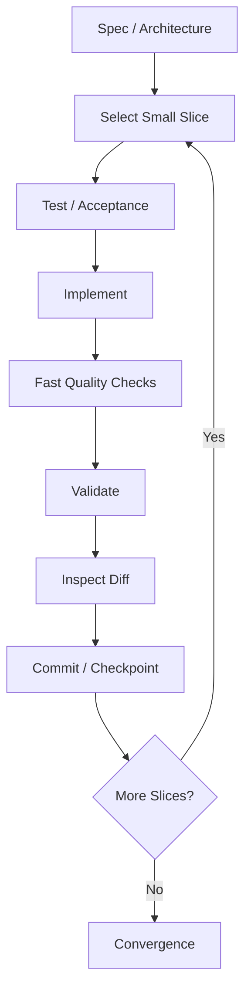
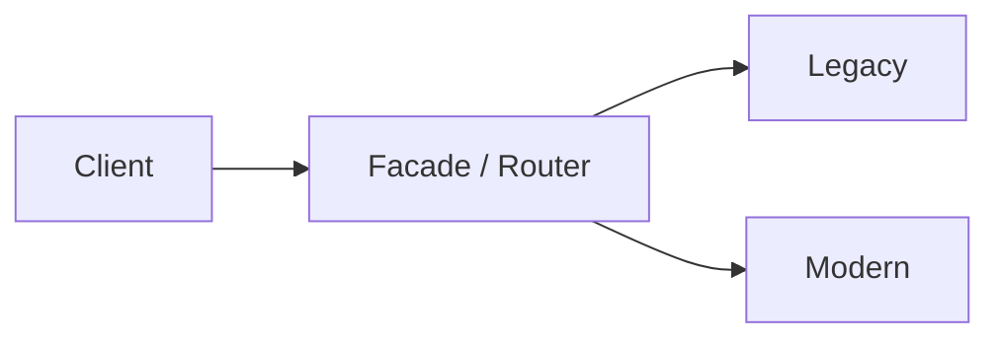
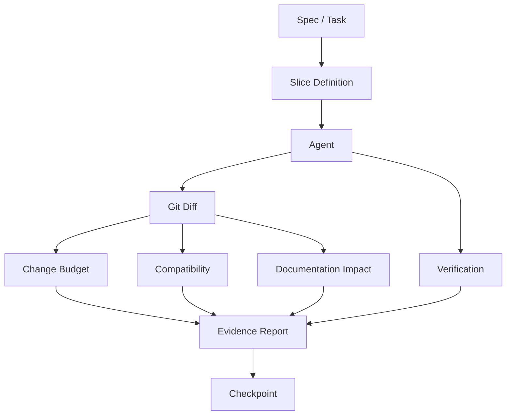
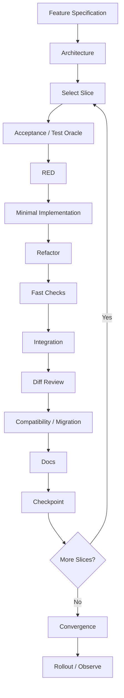

# Phase 9 — AI-Driven Implementation

> **Track:** AI-Powered Software Development / Agentic Software Engineering  
> **Prerequisites:**  
> - Phase 1 — Generative AI for Software Engineers  
> - Phase 2 — Prompt Engineering for Software Development  
> - Phase 3 — Context Engineering  
> - Phase 4 — Agentic AI Fundamentals  
> - Phase 5 — AI Coding Agent Mastery  
> - Phase 6 — Spec-Driven Development  
> - Phase 7 — Agent-Friendly Repository Engineering  
> - Phase 8 — AI-Assisted Software Architecture  
>
> **Phase goal:** Use coding agents to implement production software in small, testable, reviewable increments while preserving specifications, architectural decisions, compatibility, and operational safety.

---

# Table of Contents

1. [How to Study This Phase](#how-to-study-this-phase)
2. [Learning Objectives](#learning-objectives)
3. [The Core Implementation Principle](#the-core-implementation-principle)
4. [From Architecture to Production Code](#from-architecture-to-production-code)
5. [Implementation as a Closed-Loop Engineering Process](#implementation-as-a-closed-loop-engineering-process)
6. [Module 88 — Vertical-Slice Development](#module-88--vertical-slice-development)
7. [Module 89 — Incremental Implementation](#module-89--incremental-implementation)
8. [Module 90 — AI-Assisted TDD](#module-90--ai-assisted-tdd)
9. [Module 91 — Feature Implementation](#module-91--feature-implementation)
10. [Module 92 — Code Generation](#module-92--code-generation)
11. [Module 93 — Refactoring](#module-93--refactoring)
12. [Module 94 — Legacy Code Modernization](#module-94--legacy-code-modernization)
13. [Module 95 — Dependency Migrations](#module-95--dependency-migrations)
14. [Module 96 — Framework Upgrades](#module-96--framework-upgrades)
15. [Module 97 — Database Migrations](#module-97--database-migrations)
16. [Module 98 — Documentation Generation](#module-98--documentation-generation)
17. [The Production Implementation Loop](#the-production-implementation-loop)
18. [Slice Design and Change Budgets](#slice-design-and-change-budgets)
19. [Implementation Risk Classes](#implementation-risk-classes)
20. [Feature Flags and Safe Rollout](#feature-flags-and-safe-rollout)
21. [Backward Compatibility](#backward-compatibility)
22. [Characterization Tests and Golden Masters](#characterization-tests-and-golden-masters)
23. [Branch by Abstraction](#branch-by-abstraction)
24. [Strangler-Style Modernization](#strangler-style-modernization)
25. [Migration Safety and Rollback](#migration-safety-and-rollback)
26. [Agent Verification Discipline](#agent-verification-discipline)
27. [Reviewing AI-Generated Code](#reviewing-ai-generated-code)
28. [Implementation Observability](#implementation-observability)
29. [Practical Python Examples](#practical-python-examples)
30. [Worked Case Studies](#worked-case-studies)
31. [Implementation Anti-Patterns](#implementation-anti-patterns)
32. [Practical Labs](#practical-labs)
33. [Review Questions](#review-questions)
34. [Scenario Exercises](#scenario-exercises)
35. [Phase Project — SliceForge](#phase-project--sliceforge)
36. [Phase 9 Completion Checklist](#phase-9-completion-checklist)
37. [Where This Leads Next](#where-this-leads-next)
38. [Reference Baseline](#reference-baseline)

---

# How to Study This Phase

Phases 6–8 deliberately delayed implementation.

You first learned to create:

```text
Specification
        ↓
Architecture
        ↓
Plan
        ↓
Tasks
```

Now Phase 9 answers:

> **How should a coding agent actually change production software?**

The wrong answer is:

```text
"Here is the complete application requirement.
Build everything."
```

Even if the agent is capable of generating a large application, the implementation becomes hard to:

```text
review
verify
debug
revert
reason about
```

The preferred loop is:

```text
Small specification
        ↓
Small implementation
        ↓
Tests
        ↓
Validation
        ↓
Diff review
        ↓
Commit
```

Then repeat.

This phase is about making **implementation throughput high without making change risk high**.

---

# Learning Objectives

By the end of this phase, you should be able to:

1. Explain why small agent implementation slices are safer than large one-shot generation.
2. Design vertical slices.
3. Distinguish vertical slicing from layer-by-layer implementation.
4. Decompose a large feature into independently valuable increments.
5. Define slice-level acceptance criteria.
6. Implement one slice at a time.
7. Use checkpoints between slices.
8. Maintain specification traceability during implementation.
9. Use AI-assisted TDD correctly.
10. Write a failing test before a bug fix or behavior change when appropriate.
11. Distinguish:
    - unit,
    - integration,
    - contract,
    - E2E,
    - characterization tests.
12. Prevent agent-written tests from encoding the wrong behavior.
13. Implement features across API/service/persistence layers without overexpansion.
14. Use agents for boilerplate generation safely.
15. Review generated code before accepting it.
16. Refactor while preserving behavior.
17. Use characterization tests before risky refactors.
18. Detect refactoring that silently changes behavior.
19. Modernize legacy systems incrementally.
20. Apply strangler-style replacement.
21. Apply branch-by-abstraction.
22. Avoid big-bang rewrites.
23. Build a dependency migration inventory.
24. Read changelogs and migration guides before upgrades.
25. Upgrade dependencies in controlled groups.
26. Handle lockfiles and transitive dependencies.
27. Design framework upgrades in stages.
28. Separate mechanical migration from behavior changes.
29. Use compatibility shims temporarily.
30. Design database migrations safely.
31. Apply expand-and-contract migrations.
32. Handle backfills.
33. Handle schema/application compatibility during rolling deployment.
34. Design rollback or forward-fix paths.
35. Use feature flags for risky behavior rollout.
36. Use canary/progressive rollout concepts.
37. Preserve API backward compatibility.
38. Preserve event/schema compatibility.
39. Generate documentation from source artifacts where possible.
40. Avoid documentation hallucination.
41. Update architecture/ADR/spec docs when implementation reveals a durable change.
42. Run targeted verification first.
43. Run broader verification before handoff.
44. Inspect Git diff after every slice.
45. Detect scope creep.
46. Detect test cheating.
47. Detect unnecessary dependencies.
48. Produce evidence-rich implementation handoffs.
49. Build a small implementation orchestration tool.
50. Be ready for AI Testing & Verification.

---

# The Core Implementation Principle

The most important rule of Phase 9 is:

> **Optimize the size of the feedback loop, not the size of the generated patch.**

A large patch can feel productive:

```text
35 files changed
4,000 lines added
all layers generated
```

But the real questions are:

```text
Can we prove each behavior?
Can we isolate a regression?
Can we revert one bad decision?
Can a reviewer understand the change?
```

A smaller change often produces faster reliable delivery.

---

# From Architecture to Production Code

At the end of Phase 8 you may have:

```text
spec.md
plan.md
tasks.md
ADR
C4 diagrams
OpenAPI
data model
security requirements
NFRs
```

Implementation should consume these artifacts.

The agent should not reinterpret the feature from scratch.

---

# Implementation as a Closed-Loop Engineering Process



---

# Module 88 — Vertical-Slice Development

# 88.1 What Is a Vertical Slice?

A vertical slice delivers one useful behavior through the relevant system layers.

Example feature:

```text
Project archiving
```

A vertical slice might include:

```text
API endpoint
service rule
persistence update
authorization
test
```

for **one user outcome**.

---

# 88.2 Horizontal Layer Implementation

A horizontal approach:

```text
build all DB models
then all repositories
then all services
then all APIs
```

This delays end-to-end validation.

---

# 88.3 Vertical Approach

```text
Story 1:
Archive one project end-to-end

Story 2:
Restore one project end-to-end

Story 3:
Archived project search behavior
```

Each slice can be validated.

---

# 88.4 Why Vertical Slices Work Well with Agents

They reduce:

```text
context size
change surface
uncertainty
merge conflicts
review burden
```

They create clear stopping conditions.

---

# 88.5 Slice Anatomy

A production slice should answer:

```text
User outcome
Requirements
Affected architecture
Files likely touched
Acceptance criteria
Verification
Rollback/revert path
```

---

# 88.6 Example Slice

```markdown
## Slice S1 — Archive Active Project

Outcome:
An organization administrator can archive an active project.

Requirements:
FR-001, FR-002

Scope:
- project API
- project service
- project repository
- related tests

Not Included:
- restore
- bulk archive
- automatic archive

Verification:
- admin succeeds
- member denied
- archived item hidden from default listing
```

---

# 88.7 Slice Independence

A good slice should be useful or demonstrably complete independently.

Avoid:

```text
Slice 1:
Create five unused interfaces.

Slice 2:
Implement everything.
```

---

# 88.8 Walking Skeleton

For larger systems, first vertical slice can be a thin walking skeleton:

```text
request
→ app
→ DB
→ response
→ test
```

Minimal behavior proves integration.

---

# 88.9 Thin Slice vs Fake Slice

Thin:

```text
real end-to-end path
with minimal behavior
```

Fake:

```text
hardcoded response that proves nothing about actual architecture
```

Use thin real integration.

---

# 88.10 Slice Size

Too large:

```text
entire billing system
```

Too small:

```text
add one import
```

Good slice:

```text
one meaningful acceptance outcome
```

---

# 88.11 Slice Sequencing

Prioritize:

```text
highest product value
highest architectural risk
highest uncertainty
```

Sometimes implement risky integration early to validate architecture.

---

# 88.12 Vertical Slice and Spec Kit

Large feature implementation can be scoped to one phase/user story at a time.

This preserves context and validation quality.

---

# Module 89 — Incremental Implementation

# 89.1 Incremental Means Controlled Progression

Incremental implementation is:

```text
change
→ verify
→ checkpoint
→ continue
```

not:

```text
change everything
→ discover 58 failures
```

---

# 89.2 Increment Boundary

A useful increment may be:

```text
one function
one behavior
one story
one migration stage
one package update group
```

---

# 89.3 Checkpoint

After an increment:

```text
tests pass
diff understood
Git state known
```

Then commit or create a logical checkpoint.

---

# 89.4 Why Checkpoints Matter

If later work fails, you can return to:

```text
last known-good state
```

---

# 89.5 Incremental Change Budget

Define a soft budget:

```text
expected files
expected modules
expected behavioral scope
```

If the agent exceeds it, stop and review.

---

# 89.6 Example Budget

Task:

```text
Fix expired token handling.
```

Expected:

```text
2–4 files
auth module
related tests
no dependencies
no schema
```

Actual:

```text
22 files
new JWT library
DB migration
```

Something is wrong.

---

# 89.7 Incremental Integration

For large features:

```text
Slice A
→ merge
Slice B
→ merge
```

or maintain a feature branch with stable intermediate commits.

Team strategy varies.

---

# 89.8 Integration Before Perfection

Do not spend days building isolated perfect subsystem before connecting it.

Integrate early enough to expose real constraints.

---

# 89.9 End-of-Increment Report

Agent should report:

```text
implemented
tests run
result
diff scope
remaining work
new risks
```

---

# Module 90 — AI-Assisted TDD

# 90.1 What Is TDD?

Classic loop:

```text
RED
→ GREEN
→ REFACTOR
```

---

# 90.2 RED

Write a test expressing desired behavior.

Run it.

It should fail for the correct reason.

---

# 90.3 GREEN

Implement the smallest change that satisfies the test.

---

# 90.4 REFACTOR

Improve structure while keeping tests green.

---

# 90.5 AI and TDD

AI can accelerate:

```text
test case generation
edge-case enumeration
fixture creation
implementation
refactoring
```

But AI can also corrupt the discipline.

---

# 90.6 Common AI TDD Failure

Agent writes:

```text
test
implementation
```

at the same time.

You never confirm the test was capable of detecting the bug.

---

# 90.7 Require Test Failure Evidence

For bug fix:

```text
1. reproduce bug
2. add regression test
3. run it
4. record failure
5. implement
6. rerun
```

---

# 90.8 Wrong-Failure Problem

Test may fail because:

```text
fixture broken
import error
wrong setup
```

not because expected behavior is missing.

Confirm failure reason.

---

# 90.9 Test from Requirement, Not Implementation

Agent should derive test from:

```text
acceptance criterion
```

not from the code it just wrote.

---

# 90.10 TDD at Different Levels

Unit:

```text
domain/service behavior
```

Integration:

```text
DB/API boundary
```

Contract:

```text
public interface
```

E2E:

```text
user workflow
```

Choose lowest level that proves behavior adequately.

---

# 90.11 Bug Regression

A bug fix should generally have:

```text
test that fails before
passes after
```

when practical.

---

# 90.12 Characterization vs TDD

Legacy code may lack clear intended behavior.

First write characterization tests for current behavior.

Then decide which behavior changes.

---

# 90.13 Test Cheating

Agent may:

```text
weaken assertion
mock away bug
skip test
change expected value
```

to make suite green.

Review test diff separately.

---

# 90.14 Testing Implementation Details

Avoid brittle tests that assert:

```text
private helper called exactly once
```

unless requirement actually depends on it.

Test observable behavior.

---

# 90.15 Refactor Phase

After green:

```text
remove duplication
improve names
improve structure
```

but no new behavior.

Run tests after refactor.

---

# Module 91 — Feature Implementation

# 91.1 Feature Implementation Begins from Artifacts

Inputs:

```text
feature spec
architecture
tasks
acceptance criteria
repository instructions
```

---

# 91.2 Pre-Implementation Questions

Agent should confirm:

```text
Which story/slice?
Which paths?
Which tests?
Any schema/API/dependency impact?
```

---

# 91.3 Implementation Order

A common vertical order:

```text
test/contract
→ domain/service
→ persistence
→ transport/API
→ integration test
```

But architecture may differ.

---

# 91.4 Feature Boundaries

Do not expand to:

```text
nice-to-have
cleanup of unrelated module
future abstraction
```

unless separately approved.

---

# 91.5 Existing Pattern Reuse

Before adding:

```text
new service
new error type
new utility
```

search existing repo.

---

# 91.6 Business Invariants

Implement invariant in strongest appropriate place.

Example:

```text
Project from another tenant cannot be archived.
```

May exist in:

```text
service authorization
repository query scoping
DB policy
tests
```

depending on security architecture.

---

# 91.7 Error Handling

Implement:

```text
happy path
expected domain errors
unexpected failure
```

Do not swallow exceptions broadly.

---

# 91.8 Observability

Feature may require:

```text
log event
metric
trace annotation
audit event
```

These are part of implementation if specified.

---

# 91.9 Feature Flag

Risky behavior can be implemented behind a flag.

More later.

---

# 91.10 Completion

Feature is not done because:

```text
endpoint exists
```

It is done when:

```text
acceptance criteria verified
quality checks pass
diff reviewed
convergence clean
```

---

# Module 92 — Code Generation

# 92.1 Code Generation Is Not the Objective

The goal is not:

```text
maximize generated lines
```

The goal is:

```text
produce correct maintainable behavior efficiently
```

---

# 92.2 Good Agent Code-Generation Tasks

Examples:

```text
DTO/schema boilerplate
test fixtures
CRUD scaffolding
API client generation
mapping code
repetitive migration
documentation skeletons
```

---

# 92.3 High-Risk Generation

Be more careful with:

```text
authorization
cryptography
financial calculations
concurrency
data deletion
distributed transactions
```

Require stronger review/evidence.

---

# 92.4 Generate from Contracts

Best:

```text
OpenAPI
schema
typed models
spec
```

rather than prose alone.

---

# 92.5 Generated Code Boundaries

If source is generated from contract:

```text
do not manually edit generated output
```

Change source and regenerate.

---

# 92.6 Boilerplate vs Domain Logic

Agents can generate boilerplate freely.

Domain behavior deserves more intentional review.

---

# 92.7 Code Style

Repository formatter/linter should normalize generated code.

Do not spend prompt tokens describing formatting already enforced mechanically.

---

# 92.8 Dependency Awareness

Before using API:

```text
inspect installed version
```

Do not trust model memory.

---

# 92.9 Generated Code Review

Check:

```text
correctness
scope
security
architecture
types
tests
dependencies
```

---

# Module 93 — Refactoring

# 93.1 What Is Refactoring?

Refactoring changes internal structure while preserving observable behavior.

Examples:

```text
rename
extract method
move class
remove duplication
change internal abstraction
```

---

# 93.2 Refactoring Rule

```text
Behavior before = Behavior after
```

unless explicitly mixed with a feature change.

---

# 93.3 Separate Refactor from Behavior Change

Bad PR:

```text
rewrite module
change API behavior
upgrade dependency
```

all together.

Review becomes difficult.

---

# 93.4 Safe Refactor Workflow

```text
baseline tests
→ characterization if needed
→ small refactor
→ tests
→ diff
→ next refactor
```

---

# 93.5 AI Refactor Strength

Agents are excellent at mechanical refactors:

```text
rename symbol
extract repeated code
update call sites
convert patterns
```

when tests/types are strong.

---

# 93.6 AI Refactor Risk

Agent may “improve” semantics.

Example:

```text
reorders operations
changes error behavior
changes laziness/eagerness
```

Review carefully.

---

# 93.7 Refactoring Smell — Premature Abstraction

Agent sees 2 similar functions and creates framework.

Ask:

```text
Are behaviors genuinely same?
Is duplication stable?
```

---

# 93.8 Refactoring Smell — Generic Utility Dump

Avoid:

```text
utils.py
helpers.py
common.py
```

as uncontrolled abstraction sinks.

---

# 93.9 Architecture Refactor

Examples:

```text
move DB access out of API
extract domain module
```

Should be supported by architecture tests.

---

# 93.10 Refactor Completion

Prove:

```text
tests unchanged/pass
public contract unchanged
performance not materially degraded
```

where relevant.

---

# Module 94 — Legacy Code Modernization

# 94.1 Legacy Means Risky to Change

Legacy code is not simply old code.

A useful definition:

```text
code whose behavior is difficult to change safely
```

Often because:

```text
weak tests
implicit contracts
tight coupling
obsolete dependencies
```

---

# 94.2 Big-Bang Rewrite Risk

Rewrite:

```text
old system
→ completely new system
→ cutover
```

creates long period with no production validation.

This is high risk.

---

# 94.3 Incremental Modernization

Prefer:

```text
identify boundary
capture behavior
replace slice
route traffic
verify
continue
```

---

# 94.4 Characterization First

Before changing unknown behavior:

```text
test what system does today
```

Then distinguish:

```text
intentional behavior
bug
accidental behavior depended on by consumers
```

---

# 94.5 Modernization Inventory

Classify:

```text
stable
high-risk
obsolete
unsupported
high-change
```

---

# 94.6 Strangler-Style Modernization

A new implementation gradually replaces old behavior.

Concept:

```text
Old System
    ↓
Facade / Router
   ↙      ↘
Old       New
```

Move capability by capability.

---

# 94.7 Strangler Benefits

```text
incremental production validation
smaller rollback
continuous delivery
```

---

# 94.8 Strangler Risks

```text
temporary dual systems
routing complexity
data synchronization
long-lived transition
```

---

# 94.9 Compatibility Layer

A facade can expose old contract while new implementation evolves internally.

---

# 94.10 Modernization Success Criteria

Do not define success only as:

```text
new framework used
```

Measure:

```text
behavior preserved
risk reduced
unsupported dependency removed
delivery improved
```

---

# Module 95 — Dependency Migrations

# 95.1 Dependency Upgrade Is an Engineering Change

Even a minor package update can change:

```text
behavior
types
performance
security
transitive graph
```

---

# 95.2 Migration Inventory

Before upgrading:

```text
current version
target version
direct usage
transitive dependencies
breaking changes
deprecated APIs
```

---

# 95.3 Read Authoritative Migration Material

Use:

```text
official changelog
release notes
migration guide
installed package docs
```

not model memory alone.

---

# 95.4 Upgrade One Logical Group

Bad:

```text
upgrade 47 unrelated dependencies
```

Good:

```text
upgrade FastAPI + compatible Starlette/Pydantic group
```

if ecosystem coupling requires.

---

# 95.5 Lockfile Diff

Inspect lockfile.

Questions:

```text
How many transitive changes?
Unexpected major upgrades?
Platform-specific packages?
```

---

# 95.6 Deprecated API Search

Example:

```bash
rg "deprecated_api|old_method" app tests
```

Run before and after.

---

# 95.7 Migration Adapter

Temporary compatibility shim:

```python
def serialize_model(model):
    if hasattr(model, "model_dump"):
        return model.model_dump()

    return model.dict()
```

This can reduce change surface during phased migration.

Do not keep forever.

---

# 95.8 Dependency Migration Tests

Run:

```text
targeted package-dependent tests
full suite
type checks
integration
```

---

# 95.9 Security Updates

A security patch may require faster action.

Still verify compatibility.

---

# 95.10 Version Policy

Define:

```text
allowed ranges
pinning
upgrade cadence
```

---

# Module 96 — Framework Upgrades

# 96.1 Framework Upgrade Is Broader Than Dependency Upgrade

Framework affects:

```text
project structure
configuration
lifecycle
middleware
routing
testing
plugins
deployment
```

---

# 96.2 Read Migration Guide

Do not start with blind search/replace.

Build a migration checklist.

---

# 96.3 Upgrade Categories

Classify changes:

```text
mechanical
behavioral
configuration
deprecated
removed
```

---

# 96.4 Mechanical First

Example:

```text
rename API
update imports
```

Agent can handle efficiently.

---

# 96.5 Behavioral Separately

If framework changed semantics:

```text
test explicit behavior
```

Do not hide under mechanical migration.

---

# 96.6 Compatibility Matrix

Track:

| Area | Old | New | Status |
|---|---|---|---|
| Runtime | Python 3.11 | 3.12 | PASS |
| Pydantic | v1 API | v2 API | IN PROGRESS |
| Tests | old client | new client | TODO |

---

# 96.7 Dual-Compatibility Phase

Some upgrades can temporarily support both versions.

Useful when:

```text
library consumed externally
large monorepo
gradual migration
```

---

# 96.8 Remove Compatibility Layer

After migration:

```text
search old API
remove shim
rerun tests
```

---

# 96.9 Framework Upgrade Acceptance

Require:

```text
no deprecated API
tests pass
startup works
critical E2E works
performance acceptable
```

---

# Module 97 — Database Migrations

# 97.1 Database Migrations Need Extra Discipline

Data changes may be:

```text
irreversible
large
online
shared by old/new app versions
```

---

# 97.2 Migration Types

```text
add column
drop column
rename
type change
backfill
index
constraint
table split
```

Risk differs.

---

# 97.3 Expand-and-Contract

The safest common pattern for many rolling changes.

Example rename:

```text
old column: display_name
new column: name
```

---

# 97.4 Expand

1. Add new column.
2. Keep old column.
3. Deploy app that supports both.
4. Backfill data.
5. Verify.

---

# 97.5 Transition

```text
write both
read new with fallback
```

as needed.

---

# 97.6 Contract

After all code uses new column:

```text
stop old writes
remove old reads
drop old column
```

---

# 97.7 Why Direct Rename Can Break

During rolling deployment:

```text
old app expects old column
new migration removed it
```

Old instances fail.

---

# 97.8 Backfill

Backfills need planning:

```text
batch size
transaction size
locks
runtime
restartability
monitoring
```

---

# 97.9 Backfill Idempotency

A restart should not corrupt data.

---

# 97.10 Index Migration

Large index can lock or consume resources depending on DB.

Use database-specific safe operations.

---

# 97.11 Constraint Introduction

If adding `NOT NULL`:

```text
1. populate valid data
2. validate
3. enforce constraint
```

not blindly.

---

# 97.12 Downgrade

Some migrations cannot safely downgrade after production writes.

Be explicit.

Sometimes forward-fix is safer.

---

# 97.13 Migration Verification

Before:

```text
schema state
row counts
null counts
```

After:

```text
schema
data invariants
application tests
```

---

# 97.14 Migration and Agent Permissions

Agents should generally not run destructive production migrations autonomously.

Separate:

```text
generate/review
from
production execution
```

---

# Module 98 — Documentation Generation

# 98.1 Documentation Is Part of Implementation

A feature may change:

```text
API
config
CLI
architecture
operations
```

Docs should follow.

---

# 98.2 Generate Facts from Source

Best generated docs:

```text
OpenAPI
CLI help
schema
config reference
```

because source is authoritative.

---

# 98.3 Human-Maintained Rationale

Keep human-reviewed:

```text
architecture rationale
trade-offs
runbooks
conceptual guides
```

AI can draft.

---

# 98.4 Documentation Diff

Review generated docs like code.

Do not assume correctness.

---

# 98.5 Code Comment Generation

Avoid comments that simply restate code.

Good comments explain:

```text
why
constraint
non-obvious risk
```

---

# 98.6 Docstrings

Useful for:

```text
public API
complex domain semantics
```

Not mandatory for every trivial function.

---

# 98.7 README Updates

Feature requiring new setup/config should update onboarding.

---

# 98.8 ADR Update

If implementation makes a new durable architecture decision:

```text
write/supersede ADR
```

Do not hide architecture evolution in code.

---

# 98.9 Documentation Validation

Check:

```text
links
examples
commands
generated references
```

---

# 98.10 Documentation Hallucination

Agent may document nonexistent flags/API.

Validate examples against actual code.

---

# The Production Implementation Loop

A robust loop:

```text
1. Select one slice
2. Re-read acceptance criteria
3. Reproduce baseline / write failing test
4. Implement minimal behavior
5. Run targeted checks
6. Run related integration
7. Inspect diff
8. Update docs/artifacts
9. Commit checkpoint
10. Continue
```

---

# Slice Design and Change Budgets

# 99.1 Slice Budget Dimensions

Define:

```text
behavioral scope
files
modules
dependencies
schema
public contracts
```

---

# 99.2 Budget Escalation

If implementation discovers need for:

```text
schema change
new public API
new dependency
```

outside plan:

```text
stop
replan
```

---

# 99.3 Slice Review

Every slice should answer:

```text
Did we implement exactly this outcome?
```

---

# Implementation Risk Classes

# 100.1 Low Risk

```text
internal formatting
safe refactor with strong tests
docs
```

---

# 100.2 Medium Risk

```text
new endpoint
business rule
dependency update
```

---

# 100.3 High Risk

```text
auth
payments
data deletion
schema destructive change
concurrency
```

High risk requires stronger verification/approval.

---

# Feature Flags and Safe Rollout

# 101.1 Feature Flag Purpose

Separate:

```text
code deployment
```

from:

```text
feature exposure
```

---

# 101.2 Use Cases

```text
risky feature
gradual rollout
A/B
internal testing
emergency disable
```

---

# 101.3 Flag Debt

Flags must have:

```text
owner
purpose
removal condition
```

Otherwise dead branches accumulate.

---

# 101.4 Server-Side Authorization Still Required

Feature flag is not security boundary.

---

# 101.5 Progressive Rollout

Example:

```text
internal
→ 1%
→ 10%
→ 50%
→ 100%
```

Monitor between stages.

---

# 101.6 Rollback

If metrics regress:

```text
disable flag
```

may be faster than code rollback.

---

# Backward Compatibility

# 102.1 Compatibility Surfaces

```text
HTTP API
events
DB schema
CLI
configuration
serialized files
```

---

# 102.2 Additive Changes

Prefer:

```text
add optional field
```

before:

```text
remove/rename
```

---

# 102.3 Consumer Awareness

Some consumers may not be in your repo.

Contract changes require explicit review.

---

# 102.4 Event Compatibility

Events should evolve safely.

Avoid silently changing field meaning.

---

# Characterization Tests and Golden Masters

# 103.1 Characterization Test

Captures current behavior.

Useful when:

```text
legacy code
poor docs
unknown edge cases
```

---

# 103.2 Golden Master

Capture representative output.

Then compare after refactor.

Useful for:

```text
reports
serialization
transformation
```

---

# 103.3 Golden Master Risk

It can preserve bugs.

Use to detect change, not to declare behavior correct.

---

# Branch by Abstraction

# 104.1 Problem

Need replace implementation:

```text
OldPaymentClient
→ NewPaymentClient
```

without large cutover.

---

# 104.2 Introduce Abstraction

```python
from typing import Protocol


class PaymentClient(Protocol):
    def charge(
        self,
        amount_cents: int,
    ) -> str:
        ...
```

---

# 104.3 Route Old Through Abstraction

Existing behavior preserved.

---

# 104.4 Add New Implementation

```text
OldPaymentClient
NewPaymentClient
```

behind same interface.

---

# 104.5 Switch Gradually

Feature flag/config.

---

# 104.6 Remove Old

After validation.

This is branch-by-abstraction.

---

# Strangler-Style Modernization

# 105.1 Concept

Gradually route behavior from old system to new system.



---

# 105.2 Good Candidate

System has separable capabilities:

```text
customer profile
reporting
billing
```

Migrate one at a time.

---

# 105.3 Data Synchronization

One of hardest parts.

Strategies:

```text
shared DB temporarily
dual writes
events
migration batches
```

Each has trade-offs.

---

# Migration Safety and Rollback

# 106.1 Every Migration Needs a Failure Plan

Ask:

```text
What if migration stops halfway?
Can we retry?
Can old code continue?
Can we revert?
```

---

# 106.2 Rollback vs Forward Fix

Rollback:

```text
restore previous app/schema
```

Forward fix:

```text
repair new state
```

Data migrations often make rollback difficult.

---

# 106.3 Pre-Migration Snapshot

Depending on risk:

```text
backup
schema snapshot
row count
checksums
```

---

# 106.4 Post-Migration Validation

```text
counts
constraints
sample queries
application health
```

---

# Agent Verification Discipline

# 107.1 Evidence Hierarchy

Weak:

```text
"I implemented it."
```

Stronger:

```text
test passed
```

Stronger still:

```text
targeted + integration + diff + contract validation
```

---

# 107.2 Verification Must Match Risk

Low-risk docs:

```text
link/examples check
```

DB migration:

```text
migration up/down or forward path
data checks
application compatibility
```

---

# 107.3 Do Not Hide Failed Checks

Final report should state:

```text
full suite not run
```

if true.

---

# 107.4 Independent Review

For high-risk implementation, use fresh review context.

---

# Reviewing AI-Generated Code

# 108.1 Review Order

```text
1. file list
2. behavior
3. tests
4. architecture
5. security
6. dependencies
7. docs
```

---

# 108.2 Signs of Scope Creep

```text
unrelated formatting
new abstraction
extra feature
new dependency
```

---

# 108.3 Signs of Test Cheating

```text
skip
xfail
weaker assertion
mocking away behavior
expected value changed without requirement
```

---

# 108.4 Signs of Architecture Drift

```text
cross-layer import
new global state
direct DB access
duplicate domain logic
```

---

# Implementation Observability

# 109.1 Implementation Should Produce Runtime Evidence

Feature may need:

```text
log
metric
trace
audit
```

---

# 109.2 Rollout Monitoring

Watch:

```text
error rate
latency
business success
queue backlog
```

---

# 109.3 Feature-Specific Metric

Example archive feature:

```text
project_archive_success_total
project_archive_failure_total
```

Only if operational value justifies.

---

# Practical Python Examples

# 110.1 Slice Definition

```python
from pydantic import BaseModel


class ImplementationSlice(BaseModel):
    id: str
    title: str
    requirement_ids: list[str]
    allowed_paths: list[str]
    acceptance_checks: list[str]
    risky_changes: list[str] = []
```

---

# 110.2 Verification Result

```python
class VerificationResult(BaseModel):
    command: list[str]
    exit_code: int
    passed: bool
    stdout: str
    stderr: str
```

---

# 110.3 Change Budget

```python
class ChangeBudget(BaseModel):
    max_files: int
    allowed_prefixes: list[str]
    dependencies_allowed: bool = False
    schema_change_allowed: bool = False
```

---

# 110.4 Budget Check

```python
def over_file_budget(
    changed_files: list[str],
    budget: ChangeBudget,
) -> bool:
    return (
        len(changed_files)
        > budget.max_files
    )
```

---

# 110.5 Allowed Path Check

```python
def outside_scope(
    changed_files: list[str],
    allowed_prefixes: list[str],
) -> list[str]:
    return [
        path
        for path in changed_files
        if not any(
            path.startswith(prefix)
            for prefix in allowed_prefixes
        )
    ]
```

---

# 110.6 Migration Step Model

```python
from typing import Literal


class MigrationStep(BaseModel):
    name: str
    phase: Literal[
        "expand",
        "transition",
        "contract",
    ]
    reversible: bool
    verification: list[str]
```

---

# 110.7 Upgrade Inventory

```python
class DependencyUpgrade(BaseModel):
    package: str
    current: str
    target: str
    breaking_changes: list[str]
    deprecated_usages: list[str]
    verification: list[str]
```

---

# 110.8 Documentation Change Model

```python
class DocumentationImpact(BaseModel):
    api: bool = False
    configuration: bool = False
    cli: bool = False
    architecture: bool = False
    operations: bool = False
```

---

# Worked Case Studies

# Case Study 1 — Expired Token Bug

## Slice

```text
Expired access token returns 401 instead of 500.
```

## RED

Add regression test.

Run.

Confirm:

```text
500 != 401
```

## GREEN

Map expiry exception to domain auth error.

## Verify

```text
target test
auth suite
lint
types
diff
```

Small implementation.

---

# Case Study 2 — Project Archive Feature

Slice 1:

```text
admin archives active project
```

Slice 2:

```text
archived excluded from list
```

Slice 3:

```text
restore
```

Slice 4:

```text
search behavior
```

Each independently verified.

Convergence catches missing paths.

---

# Case Study 3 — Pydantic-Style Major Upgrade

Process:

```text
inventory deprecated APIs
mechanical replacements
types/tests
compatibility shim if needed
full search
remove shim
```

Do not mix feature changes.

---

# Case Study 4 — Database Column Rename

Unsafe:

```text
rename column in one migration
deploy new app
```

Safe rolling pattern:

```text
add new
dual write
backfill
switch read
stop old
drop old
```

---

# Case Study 5 — Legacy Report Engine

Old report module:

```text
6,000 lines
no tests
```

Modernization:

```text
characterize outputs
introduce facade
route one report type to new implementation
compare golden outputs
expand gradually
```

---

# Case Study 6 — Framework Upgrade

Upgrade web framework.

Stages:

```text
read migration guide
baseline
upgrade runtime compatibility
upgrade framework
mechanical changes
behavioral fixes
integration tests
remove deprecated APIs
```

---

# Implementation Anti-Patterns

# Anti-Pattern 1 — Entire Application in One Prompt

# Anti-Pattern 2 — Horizontal Layers Before Any User Flow

# Anti-Pattern 3 — No Failing Test for Reproducible Bug

# Anti-Pattern 4 — Agent Writes Test and Implementation Without Red Evidence

# Anti-Pattern 5 — Accepting Green Tests Without Reviewing Test Changes

# Anti-Pattern 6 — Refactor + Feature + Upgrade Together

# Anti-Pattern 7 — Big-Bang Rewrite

# Anti-Pattern 8 — Upgrade All Dependencies at Once

# Anti-Pattern 9 — Trust Model Memory for Migration APIs

# Anti-Pattern 10 — Direct Destructive DB Migration

# Anti-Pattern 11 — Backfill Without Restartability

# Anti-Pattern 12 — No Compatibility During Rolling Deployment

# Anti-Pattern 13 — Feature Flag With No Removal Plan

# Anti-Pattern 14 — Generated Docs as Unreviewed Truth

# Anti-Pattern 15 — Hidden Failed Verification

# Anti-Pattern 16 — Huge Diff With Tiny Requirement

---

# Practical Labs

# Lab 1 — Design Vertical Slice

Convert a large feature into 5 slices.

# Lab 2 — Horizontal vs Vertical

Implement same toy feature both ways.

Compare feedback.

# Lab 3 — Slice Acceptance Criteria

Write independent checks.

# Lab 4 — Slice Change Budget

Define allowed paths/files.

# Lab 5 — Increment Checkpoint

Create known-good commit after slice.

# Lab 6 — Bug TDD

Reproduce → failing test → fix.

# Lab 7 — Wrong Failure

Create test that fails for setup reason.

Fix the test.

# Lab 8 — Test Cheating Detection

Review maliciously weakened test.

# Lab 9 — Unit vs Integration

Choose correct level for 10 scenarios.

# Lab 10 — Feature Vertical Path

Implement API → service → DB.

# Lab 11 — Scope Creep

Agent edits unrelated module.

Revert.

# Lab 12 — Existing Pattern Search

Find reusable error/service before creating new.

# Lab 13 — Boilerplate Generation

Generate schemas and review.

# Lab 14 — High-Risk Code Review

Review authorization generation.

# Lab 15 — Mechanical Refactor

Rename symbol across repo.

# Lab 16 — Behavior-Preserving Refactor

Extract service method with characterization tests.

# Lab 17 — Refactor Drift

Detect changed error semantics.

# Lab 18 — Legacy Characterization

Capture current output.

# Lab 19 — Golden Master

Compare report output before/after.

# Lab 20 — Strangler Slice

Route one endpoint to new module.

# Lab 21 — Branch by Abstraction

Introduce interface between old/new clients.

# Lab 22 — Dependency Inventory

Document current/target versions.

# Lab 23 — Changelog Review

Extract breaking changes from official docs.

# Lab 24 — Deprecated API Search

Build before/after search.

# Lab 25 — Lockfile Diff

Review transitive changes.

# Lab 26 — Compatibility Shim

Implement temporary adapter.

# Lab 27 — Framework Migration Matrix

Track all migration categories.

# Lab 28 — Remove Deprecated API

Prove zero remaining usage.

# Lab 29 — DB Expand

Add compatible new column.

# Lab 30 — Dual Write

Write old/new during transition.

# Lab 31 — Backfill

Implement idempotent batches.

# Lab 32 — Read Switch

Move reads to new field.

# Lab 33 — DB Contract

Remove old field only after compatibility.

# Lab 34 — Migration Failure

Stop halfway and resume.

# Lab 35 — Constraint Introduction

Backfill before NOT NULL.

# Lab 36 — Migration Rollback Analysis

Decide rollback vs forward fix.

# Lab 37 — Feature Flag

Implement risky path behind flag.

# Lab 38 — Progressive Rollout

Define rollout stages and metrics.

# Lab 39 — Flag Cleanup

Remove completed flag.

# Lab 40 — API Compatibility

Make additive API change.

# Lab 41 — Breaking Contract Detection

Identify breaking field rename.

# Lab 42 — Event Evolution

Version event safely.

# Lab 43 — Docs from OpenAPI

Generate API reference.

# Lab 44 — README Update

Update actual setup commands.

# Lab 45 — ADR During Implementation

Discover durable change and record it.

# Lab 46 — Slice Verification Report

Produce evidence.

# Lab 47 — Independent Review

Fresh agent reviews slice diff.

# Lab 48 — Convergence

Detect missing behavior after all tasks.

# Lab 49 — Implement/Converge Loop

Repeat until clean.

# Lab 50 — Full Production Feature

Deliver medium feature as multiple verified slices.

---

# Review Questions

1. Why prefer small implementation slices?
2. What is a vertical slice?
3. How does vertical slicing differ from horizontal layering?
4. What is a walking skeleton?
5. What makes a slice independently useful?
6. How should slices be sequenced?
7. What is incremental implementation?
8. What is a checkpoint?
9. What is a change budget?
10. Why detect budget expansion?
11. What is TDD?
12. What is RED?
13. What is GREEN?
14. What is REFACTOR?
15. Why must the test fail first?
16. What is a wrong-failure problem?
17. Why derive tests from requirements?
18. What is test cheating?
19. When should you use characterization tests?
20. What does feature implementation consume?
21. Why search existing patterns first?
22. Why implement observability with the feature?
23. What makes code generation safe?
24. Which code is high-risk to generate?
25. Why generate from contracts?
26. Why avoid manual edits to generated files?
27. What is refactoring?
28. Why separate refactor from behavior change?
29. How do tests support refactoring?
30. What is premature abstraction?
31. What makes code legacy?
32. Why are big-bang rewrites risky?
33. What is strangler-style modernization?
34. What are strangler risks?
35. What is branch-by-abstraction?
36. Why inventory dependency usage?
37. Why read official migration guides?
38. Why upgrade logical dependency groups?
39. Why inspect lockfiles?
40. What is a compatibility shim?
41. Why remove shims later?
42. Why is framework upgrade broader than package update?
43. Why separate mechanical and behavioral migration?
44. What is expand-and-contract?
45. Why can direct column rename break rolling deployment?
46. What makes backfill safe?
47. What is idempotent backfill?
48. Why can downgrade be unsafe?
49. Why separate migration generation from production execution?
50. Why generate factual docs from source?
51. What documentation should remain rationale-focused?
52. Why can generated docs hallucinate?
53. What is a feature flag?
54. Why is a feature flag not authorization?
55. What is flag debt?
56. What is progressive rollout?
57. What are compatibility surfaces?
58. What is a golden master?
59. Why can golden masters preserve bugs?
60. What is rollback vs forward fix?
61. How should verification match risk?
62. What is independent review?
63. What are signs of scope creep?
64. What are signs of architecture drift?
65. What are signs of test cheating?
66. Why inspect documentation changes?
67. Why use convergence after implementation?
68. Why should implementation evidence be explicit?
69. What does production-ready implementation mean?
70. What is the central lesson of Phase 9?

---

# Scenario Exercises

# Scenario 1 — Large Agent Patch

Agent changes 45 files for one small endpoint.

What do you do?

# Scenario 2 — Bug Fix Without Reproduction

Agent says bug is fixed but never reproduced.

Accept?

# Scenario 3 — TDD Test Changed

Agent modifies expected value to make test pass.

What category of failure is this?

# Scenario 4 — Refactor and Feature

Agent adds feature while rewriting module architecture.

How should work be split?

# Scenario 5 — Major Package Upgrade

Agent uses remembered migration steps.

What evidence should be required?

# Scenario 6 — Schema Rename

Old and new app versions overlap during deploy.

Design safe migration.

# Scenario 7 — Backfill Failure

Backfill stops at 60%.

What property allows safe restart?

# Scenario 8 — Legacy Rewrite

Team proposes six-month rewrite with one cutover.

What incremental alternatives exist?

# Scenario 9 — Feature Flag

Flag reaches 100% and remains for two years.

What problem?

# Scenario 10 — Generated Docs

Docs describe command that does not exist.

How should docs generation be validated?

---

# Phase Project — SliceForge

# Project Goal

Build a Python tool that manages small, evidence-driven implementation slices.

It should connect:

```text
spec/task
→ slice
→ change budget
→ verification
→ diff
→ checkpoint
→ convergence
```

The purpose is not to replace coding agents.

It is to teach the implementation control layer around them.

---

# Project Structure

```text
sliceforge/
├── README.md
├── pyproject.toml
├── AGENTS.md
├── slices/
│   ├── S001.json
│   └── S002.json
├── migrations/
│   └── inventory.yaml
├── src/
│   └── sliceforge/
│       ├── __init__.py
│       ├── cli.py
│       ├── models.py
│       ├── slice.py
│       ├── budget.py
│       ├── git.py
│       ├── verify.py
│       ├── migration.py
│       ├── compatibility.py
│       ├── docs.py
│       └── report.py
└── tests/
    ├── test_budget.py
    ├── test_verify.py
    ├── test_migration.py
    └── test_compatibility.py
```

---

# Feature 1 — Slice Definition

```json
{
  "id": "S001",
  "title": "Archive active project",
  "requirements": ["FR-001", "FR-002"],
  "allowed_paths": [
    "app/projects/",
    "tests/projects/"
  ],
  "max_files": 8,
  "schema_change_allowed": false,
  "dependencies_allowed": false
}
```

---

# Feature 2 — Slice Status

Command:

```bash
sliceforge status S001
```

Output:

```text
Slice: S001
Changed files: 4/8
Outside scope: none
Schema changes: none
Dependency changes: none
Verification: 3/4 passed
Status: NOT READY
```

---

# Feature 3 — Git Diff Scope

Detect changed files.

---

# Feature 4 — Change Budget

Fail/warn if:

```text
too many files
outside allowed path
unexpected manifest migration
```

---

# Feature 5 — Verification Commands

Store:

```text
targeted
related
full
```

checks.

---

# Feature 6 — Red/Green Evidence

For TDD slice, store:

```text
failing test command/result
passing test command/result
```

---

# Feature 7 — Migration Inventory

For dependency/framework upgrade:

```yaml
package: pydantic
current: "1.x"
target: "2.x"
deprecated:
  - BaseModel.dict()
  - parse_obj()
```

---

# Feature 8 — Compatibility Checklist

Track:

```text
API
DB
events
config
runtime
```

---

# Feature 9 — DB Migration Phases

Track:

```text
expand
transition
contract
```

---

# Feature 10 — Documentation Impact

Detect changed:

```text
API
CLI
config
architecture
```

and require doc review.

---

# Feature 11 — Evidence Report

```bash
sliceforge report S001
```

Generate:

```markdown
# Slice S001 Report

## Requirement
...

## Files Changed
...

## Test Evidence
...

## Scope
...

## Compatibility
...

## Risks
...

## Remaining Work
...
```

---

# Feature 12 — Commit Gate

Only recommend checkpoint when:

```text
required checks pass
scope clean
```

Do not automatically commit unless explicit.

---

# Feature 13 — Migration Gate

For destructive migration:

```text
BLOCK
```

until explicit approval/review.

---

# Feature 14 — Convergence Hook

After final slice:

```text
run external convergence process
```

or produce reminder/evidence package.

---

# SliceForge Architecture



---

# Suggested Development Order

## Stage 1

```text
models + slice parser
```

## Stage 2

```text
git changed files
```

## Stage 3

```text
change budgets
```

## Stage 4

```text
verification runner
```

## Stage 5

```text
TDD evidence
```

## Stage 6

```text
migration/compatibility models
```

## Stage 7

```text
documentation impact
```

## Stage 8

```text
reports + gate
```

---

# Phase 9 Completion Checklist

## Vertical Slices

- [ ] I can define one meaningful vertical slice.
- [ ] I avoid horizontal-only progress.
- [ ] I define slice acceptance criteria.
- [ ] I keep slices independently reviewable.
- [ ] I sequence by value/risk/uncertainty.

## Incremental Implementation

- [ ] I implement in checkpoints.
- [ ] I keep known-good states.
- [ ] I define change budgets.
- [ ] I stop when scope unexpectedly expands.
- [ ] I produce evidence after increments.

## TDD

- [ ] I understand RED/GREEN/REFACTOR.
- [ ] I reproduce bugs first.
- [ ] I confirm test fails for correct reason.
- [ ] I review generated tests.
- [ ] I detect test cheating.
- [ ] I choose appropriate test level.

## Feature Implementation

- [ ] I implement from spec/architecture/tasks.
- [ ] I reuse existing repository patterns.
- [ ] I preserve business invariants.
- [ ] I implement error handling.
- [ ] I include required observability.
- [ ] I verify acceptance criteria.

## Code Generation

- [ ] I generate boilerplate safely.
- [ ] I use contracts as inputs.
- [ ] I review high-risk generated logic carefully.
- [ ] I inspect dependency versions.
- [ ] I avoid editing generated artifacts manually.

## Refactoring

- [ ] I preserve behavior.
- [ ] I separate refactor from behavior change.
- [ ] I use tests before/after.
- [ ] I avoid premature abstraction.
- [ ] I inspect diff for semantic drift.

## Legacy Modernization

- [ ] I characterize current behavior.
- [ ] I avoid big-bang rewrites.
- [ ] I can use strangler-style replacement.
- [ ] I can use branch-by-abstraction.
- [ ] I define modernization success by risk/behavior, not only new technology.

## Dependency Migrations

- [ ] I inventory package usage.
- [ ] I read authoritative migration guidance.
- [ ] I upgrade controlled groups.
- [ ] I inspect lockfile changes.
- [ ] I search deprecated APIs.
- [ ] I remove temporary shims.

## Framework Upgrades

- [ ] I build migration matrix.
- [ ] I separate mechanical/behavioral changes.
- [ ] I test startup/integration.
- [ ] I prove deprecated APIs removed.
- [ ] I preserve compatibility where needed.

## Database Migrations

- [ ] I understand expand/transition/contract.
- [ ] I design rolling-deployment compatibility.
- [ ] I build restartable backfills.
- [ ] I validate before constraints.
- [ ] I distinguish rollback and forward fix.
- [ ] I separate production execution from code generation.

## Documentation

- [ ] I generate facts from source where practical.
- [ ] I update README/config/API docs.
- [ ] I preserve rationale in ADR/architecture docs.
- [ ] I validate generated examples.
- [ ] I review doc diffs.

## Rollout / Compatibility

- [ ] I use feature flags intentionally.
- [ ] I plan flag removal.
- [ ] I understand progressive rollout.
- [ ] I preserve API/event/DB compatibility.
- [ ] I define rollback/recovery.

## Verification

- [ ] I run targeted checks first.
- [ ] I run broader verification before handoff.
- [ ] I inspect diff.
- [ ] I disclose unrun checks.
- [ ] I use independent review for high-risk work.
- [ ] I run convergence after feature implementation.

## Project

- [ ] I can build SliceForge.
- [ ] I can enforce change budgets.
- [ ] I can store TDD evidence.
- [ ] I can model migrations.
- [ ] I can produce implementation evidence reports.

---

# Where This Leads Next

Phase 9 teaches:

```text
how to produce controlled production changes
```

The next phase is:

# Phase 10 — AI Testing & Verification

where verification becomes its own deep discipline:

```text
unit testing
integration testing
API testing
contract testing
E2E testing
property-based testing
regression testing
static analysis
security testing
coverage analysis
agent-generated tests
independent verification agents
```

Phase 9 uses tests to guide implementation.

Phase 10 teaches how to build a **verification system strong enough to trust agent-generated software**.

---

# Final Mental Model

```text
Small Specification
        ↓
Small Vertical Slice
        ↓
Failing Test / Acceptance Evidence
        ↓
Minimal Implementation
        ↓
Fast Checks
        ↓
Integration Validation
        ↓
Diff Review
        ↓
Compatibility / Migration Check
        ↓
Documentation
        ↓
Checkpoint Commit
        ↓
Next Slice
        ↓
Convergence
```

The deepest principle is:

> **The agent should produce a sequence of understandable, verified engineering changes—not one impressive wall of code.**

The unit of progress is not:

```text
lines generated
```

The unit of progress is:

```text
verified behavior
```

---

# Reference Baseline

This phase was reviewed against current primary-source and established engineering guidance available in August 2026.

## OpenAI — Harness Engineering

OpenAI's 2026 agent-first engineering work emphasizes that human engineers increasingly design environments, specify intent, and build feedback loops while agents execute. The team explicitly describes breaking larger goals into smaller building blocks such as design, code, review, and test rather than relying on a single undifferentiated generation pass.

## GitHub Spec Kit — Implementation and Convergence

Current Spec Kit guidance supports staged implementation for large features. `/speckit.implement` can be scoped to one phase or user story, with each stage validated before continuing.

Current `/speckit.converge` evaluates the present codebase against `spec.md`, `plan.md`, and `tasks.md`, then appends remaining implementation work as traceable tasks. The intended loop is:

```text
implement
→ converge
→ implement
→ converge
```

until clean.

This strongly supports the implementation style taught here:

```text
small scope
→ verify
→ continue
```

## Legacy Modernization — Strangler Fig

The Strangler Fig modernization pattern remains a useful model for replacing legacy systems gradually instead of attempting a high-risk big-bang rewrite.

The key idea is progressive replacement of capabilities while the existing system continues operating.

## Stable Implementation Principles

Specific agent products and frameworks will continue to change.

The durable implementation principles are:

```text
implement from durable artifacts
prefer vertical slices
keep change surface small
use failing tests for reproducible bugs
verify every increment
separate behavior changes from refactors
modernize legacy systems incrementally
read authoritative migration guides
upgrade dependencies in controlled groups
design database migrations for compatibility
make backfills restartable
roll out risky behavior progressively
preserve backward compatibility
generate factual documentation from authoritative source artifacts
review the actual diff
report evidence, not confidence
converge against the specification before calling the feature complete
```


---

# Deep Expansion — Production Implementation Under the Hood

The main chapter explains the complete implementation flow.

This expansion focuses on the systems-level details that separate:

```text
AI generated code
```

from:

```text
production engineering
```

The most important shift is this:

> **A production implementation is a controlled state transition of the codebase.**

You begin with:

```text
Known State A
```

You want:

```text
Desired State B
```

The implementation process must preserve:

```text
correctness
compatibility
observability
recoverability
traceability
```

while moving between them.

---

# A. Implementation as State Transition

A repository has a current state:

```text
source
tests
schema
dependencies
contracts
documentation
```

A feature changes some subset.

A production change is not just source code.

It can modify the entire engineering state.

---

# A.1 State Vector

Conceptually:

```text
Repository State =
{
  code,
  tests,
  dependencies,
  schemas,
  contracts,
  docs,
  configuration
}
```

The agent must know which dimensions are expected to change.

---

# A.2 Controlled Transition

For a small feature:

```text
A
→ source + tests
→ B
```

For a database migration:

```text
A
→ expand schema
→ transition code
→ backfill
→ contract schema
→ B
```

The second requires multiple safe intermediate states.

---

# A.3 Intermediate States Matter

A migration may be correct at final state but unsafe during deployment.

Therefore implementation correctness includes:

```text
transitional correctness
```

not only final correctness.

---

# B. Slice Design Heuristics

A slice is good when it minimizes both:

```text
risk
and
coordination
```

while preserving real value.

---

# B.1 Slice by User Outcome

Good:

```text
User can create project.
```

Weak:

```text
Add ProjectRepository.
```

---

# B.2 Slice by Risk

Sometimes first slice should prove uncertain technical path.

Example:

```text
Can provider handle 100 MB uploads?
```

Create technical spike/walking slice before full implementation.

---

# B.3 Slice by Architectural Boundary

If one feature crosses:

```text
API
worker
external provider
```

first slice might prove:

```text
API → queue → worker → status
```

with simple payload.

Then add full domain behavior.

---

# B.4 Slice by Migration Stage

Migration slice:

```text
S1 expand
S2 transition
S3 backfill
S4 contract
```

Each must be deployable.

---

# B.5 Slice Size Test

Ask:

```text
Can a reviewer understand this change in one review session?
Can we revert this without undoing unrelated value?
Can tests identify which behavior broke?
```

If no, slice may be too large.

---

# C. Change Budget as a Control Mechanism

A change budget is not bureaucracy.

It is a signal for unexpected scope.

Example budget:

```text
Expected:
3–6 files
one module
no schema
no dependency
```

If actual:

```text
18 files
two packages
new Redis dependency
```

the task changed.

---

# C.1 Soft vs Hard Budget

Soft:

```text
warn if > 8 files
```

Hard:

```text
block paths outside allowed directories
```

Use based on risk.

---

# C.2 Budget Categories

```text
files
directories
dependencies
schema
public contract
configuration
generated files
```

---

# C.3 Budget Exception

Sometimes legitimate discovery requires expansion.

Do not blindly enforce.

Escalate:

```text
why expansion needed
which requirement causes it
which artifacts must update
```

---

# D. TDD and the Test Oracle Problem

A test needs an oracle:

```text
How do we know expected output?
```

AI can generate tests quickly, but if the expected behavior is wrong, TDD only makes wrong behavior consistent.

---

# D.1 Oracle Sources

Strong sources:

```text
acceptance criteria
existing public contract
domain rule
approved spec
regulation
known regression behavior
```

Weak sources:

```text
what current implementation happens to do
model guess
```

---

# D.2 Example

Bug report:

```text
Expired token returns 500.
Expected 401.
```

Oracle:

```text
spec/security contract says authentication failure → 401
```

Good.

---

# D.3 Circular Test Generation

Danger:

```text
Agent writes implementation.
Agent reads implementation.
Agent writes tests matching it.
```

This creates circular validation.

Better:

```text
derive tests before implementation
or
use separate context from acceptance criteria
```

---

# D.4 Mutation Thinking

Ask:

```text
If implementation were subtly wrong,
would this test fail?
```

Example mutation:

```text
authorization always returns true
```

Would tests catch it?

This is a powerful review heuristic.

---

# E. Test Pyramid for Agent Implementation

Use different layers for different confidence.

---

# E.1 Unit Tests

Best for:

```text
pure logic
domain rules
error mapping
```

Fast.

---

# E.2 Integration Tests

Best for:

```text
database queries
framework wiring
external adapter contracts
```

---

# E.3 Contract Tests

Best for:

```text
API shape
event schema
consumer expectations
```

---

# E.4 End-to-End Tests

Best for:

```text
critical user journeys
```

Slower, broader.

---

# E.5 Property-Based Tests

Useful when behavior can be expressed as invariant.

Example:

```text
For any cross-tenant project,
archive must not modify state.
```

---

# F. Implementation Ordering for Vertical Slices

There is no universal order, but one effective pattern is:

```text
acceptance/test
→ domain
→ persistence
→ transport
→ integration
```

Why?

Because the domain requirement remains visible.

---

# F.1 Outside-In TDD

Start from external behavior:

```text
API test
```

Then implement inward.

Useful for user-facing contract.

---

# F.2 Inside-Out TDD

Start from domain object/service.

Then integrate outward.

Useful for complex domain logic.

---

# F.3 Hybrid

Common production approach:

```text
one thin integration test
+
focused unit tests
```

Avoid dogma.

---

# G. Code Generation Boundaries

Agent code generation is safest when constraints are strong.

A spectrum:

```text
Schema-derived DTOs
→ boilerplate
→ standard CRUD
→ business logic
→ concurrency/security
```

As you move right:

```text
human review depth increases
```

---

# G.1 Deterministic Generation

If possible use tools:

```text
OpenAPI generators
ORM schema generators
protobuf
```

These are more deterministic than free-form LLM generation.

Use LLM around them for integration/customization.

---

# G.2 Agent Generation with Template

Provide canonical example.

Example:

```text
Follow app/projects/service.py pattern.
```

This reduces architectural variation.

---

# G.3 Generated Diff Noise

Agents sometimes rewrite formatting.

Run formatter separately.

Keep semantic diff clean.

---

# H. Refactoring Taxonomy

Refactoring can be categorized.

---

## H.1 Rename

```text
symbol
module
method
```

Low risk with type/search support.

---

## H.2 Extract

```text
method
class
module
```

Risk:

```text
hidden state/ordering behavior
```

---

## H.3 Move

Move responsibilities across architecture boundaries.

Need import/dependency verification.

---

## H.4 Replace Conditional with Polymorphism/Strategy

Can improve extensibility but may over-abstract.

Use when variation is real.

---

## H.5 Data Structure Refactor

Changing representation:

```text
dict
→ typed object
```

may affect serialization/equality.

---

# H.6 Behavior-Preserving Proof

Evidence may include:

```text
tests
golden outputs
contracts
benchmarks
```

depending on refactor.

---

# I. Characterization Testing Deep Dive

Legacy systems often lack requirements.

Characterization asks:

```text
What does it actually do?
```

---

# I.1 Capture Inputs and Outputs

Example:

```python
def test_legacy_invoice_total_characterization():
    result = legacy_total(
        items=[
            {"price": 10, "qty": 2},
            {"price": 5, "qty": 1},
        ]
    )

    assert result == 25
```

This captures behavior.

It does not prove behavior is correct.

---

# I.2 Capture Exceptions

If legacy raises:

```text
ValueError
```

for malformed input, note it.

Consumers may depend on error type.

---

# I.3 Capture Side Effects

Examples:

```text
DB row
file
event
log
```

---

# I.4 Characterization Before Cleanup

Do not clean before learning behavior.

---

# J. Golden Master Deep Dive

Useful for large deterministic transformations.

Example:

```text
legacy report generator
```

Generate outputs from representative fixtures.

Store:

```text
normalized JSON/text
```

Compare after modernization.

---

# J.1 Normalize Volatile Fields

Remove:

```text
timestamp
random ID
ordering noise
```

only if not semantically important.

---

# J.2 Golden Master Review

Golden baseline must be reviewed.

Otherwise:

```text
bug becomes contract
```

---

# K. Legacy Modernization Strategy Matrix

| Strategy | Best When | Main Risk |
|---|---|---|
| In-place refactor | strong tests, moderate code | hidden behavior |
| Branch by abstraction | replace internal dependency | temporary complexity |
| Strangler | replace system capability gradually | dual-system period |
| Replatform | environment/platform problem | compatibility |
| Rewrite | very constrained/small system | lost behavior |

Rewrite should be exceptional.

---

# K.1 Modernization Before/After Metrics

Measure:

```text
change lead time
test coverage
incident rate
unsupported dependencies
deployment frequency
```

Technology upgrade alone is not success.

---

# L. Strangler Routing Strategies

How to split traffic:

```text
path
tenant
feature
percentage
resource type
```

---

# L.1 Path Routing

```text
/new-reports/*
→ new service
```

---

# L.2 Tenant Routing

Internal tenant first.

Useful for canary.

---

# L.3 Shadow Traffic

Send copy of requests to new system but do not serve response.

Compare outputs.

Be careful with side effects.

---

# L.4 Dual Run

Old and new process same input.

Compare.

Useful for calculations/reports.

---

# M. Branch by Abstraction Deep Dive

The core sequence:

```text
1. identify direct dependency
2. introduce abstraction without behavior change
3. route existing implementation through abstraction
4. add new implementation
5. switch gradually
6. delete old implementation
7. simplify abstraction if no longer needed
```

---

# M.1 Avoid Permanent Temporary Abstraction

A migration interface may exist only to enable transition.

Remove if it no longer adds design value.

---

# N. Dependency Migration Engineering

A dependency upgrade should be treated as a mini-project when important.

---

# N.1 Usage Inventory

Search:

```text
imports
API calls
config
plugins
type references
test helpers
```

---

# N.2 Compatibility Constraints

Example:

```text
Framework X 5
requires
Library Y >= 3
```

Migration planning must include coupled dependencies.

---

# N.3 Direct vs Transitive

Direct dependency appears in manifest.

Transitive does not.

But transitive upgrade may still break runtime.

Inspect lockfile.

---

# N.4 Upgrade Range

Avoid broad unconstrained ranges for critical dependencies if reproducibility matters.

---

# N.5 Deprecation Burn-Down

Track:

```text
old_api_1 → 47 uses
old_api_2 → 12 uses
```

After migration:

```text
0
```

---

# N.6 Temporary Warnings

Turn deprecation warnings into visible CI signal.

Do not ignore indefinitely.

---

# O. Framework Upgrade Strategy

A framework upgrade often needs layered migration.

Example stages:

```text
Stage 1:
make current code warning-clean

Stage 2:
upgrade runtime prerequisites

Stage 3:
upgrade framework

Stage 4:
mechanical API changes

Stage 5:
behavioral changes

Stage 6:
remove compatibility code
```

---

# O.1 Upgrade Branch Duration

Long-running upgrade branches drift badly.

Prefer incremental compatibility changes merged continuously where possible.

---

# O.2 Feature Freeze?

Sometimes useful for very large upgrade, but expensive.

Better architecture often enables migration while normal delivery continues.

---

# P. Database Migration Deep Dive

Database changes combine:

```text
schema
data
application compatibility
operational safety
```

---

# P.1 Online Migration Requirement

For production services:

```text
old application
and
new application
```

may run simultaneously.

Design for both.

---

# P.2 Additive First

Adding nullable column is often safer than:

```text
rename/drop/change type
```

---

# P.3 Backfill Worker

Instead of one massive transaction:

```text
process N rows
commit
checkpoint
continue
```

---

# P.4 Backfill Cursor

Track progress:

```text
last processed ID
```

Example:

```python
def backfill_batch(
    last_id: int,
    batch_size: int,
) -> int:
    rows = fetch_rows_after(
        last_id=last_id,
        limit=batch_size,
    )

    for row in rows:
        if row.new_value is None:
            row.new_value = derive_value(row)

    commit()

    return rows[-1].id if rows else last_id
```

---

# P.5 Idempotency

Running batch twice should yield same correct state.

---

# P.6 Verification Query

Before enforcing constraint:

```sql
SELECT COUNT(*)
FROM projects
WHERE new_column IS NULL;
```

Expected:

```text
0
```

Then add `NOT NULL`.

---

# P.7 Large Table Risk

Migration may create:

```text
lock
replication lag
IO saturation
```

Use DB-specific online techniques.

---

# Q. API Migration Strategy

When replacing API behavior:

```text
support old + new
migrate consumers
measure
deprecate
remove
```

---

# Q.1 Compatibility Adapter

Server can translate old request shape into new internal model.

---

# Q.2 Consumer Inventory

Know:

```text
web
mobile
partner
internal scripts
```

before breaking.

---

# R. Event Migration Strategy

Event schemas are public contracts between services.

---

# R.1 Additive Event Evolution

Safer:

```text
add optional field
```

---

# R.2 Semantic Change

Changing meaning of:

```text
amount
```

without changing schema can be more dangerous than field rename.

Document semantics.

---

# R.3 Event Version

Options:

```text
schema version field
new event type
schema registry
```

depends on ecosystem.

---

# S. Feature Flags Deep Dive

Feature flags create alternate code paths.

This increases state space:

```text
flag off
flag on
```

Multiple flags create combinations.

---

# S.1 Flag Categories

```text
release flag
experiment flag
ops flag
permission/entitlement flag
```

Do not mix semantics.

---

# S.2 Release Flag Lifecycle

```text
create
→ internal
→ partial rollout
→ full rollout
→ remove flag
```

---

# S.3 Kill Switch

Ops flag can disable failing subsystem quickly.

Test kill switch before relying on it.

---

# S.4 Flag Configuration Drift

Production flag state may differ across environments.

Observability should expose active state.

---

# T. Progressive Delivery

Deployment:

```text
code available
```

Release:

```text
behavior exposed
```

Separate them.

---

# T.1 Canary

Deploy to small instance/user subset.

Monitor.

---

# T.2 Blue/Green

Maintain two environments.

Switch traffic.

---

# T.3 Rolling

Replace instances gradually.

Requires compatibility across versions.

---

# T.4 Rollout Metrics

Define before rollout:

```text
error rate
latency
business conversion
resource use
```

---

# U. Rollback Engineering

Rollback should be planned before deployment.

---

# U.1 Code Rollback

Usually easiest if schema/contracts remain compatible.

---

# U.2 Data Rollback

Often hard.

If new writes use new schema:

```text
old app may not understand
```

This is why expand-and-contract matters.

---

# U.3 Irreversible Operations

Examples:

```text
external email sent
payment charged
data deleted
```

Need compensation/forward fix, not simple rollback.

---

# V. Agent Commit Strategy

Commits can serve as verified checkpoints.

A good commit:

```text
cohesive
green
small
reviewable
```

---

# V.1 Commit by Slice

Example:

```text
commit 1:
add archive domain behavior + tests

commit 2:
add API contract + integration

commit 3:
add docs
```

or one cohesive vertical slice commit.

Team preference matters.

---

# V.2 Avoid Commit Spam

Do not create:

```text
"fix"
"fix again"
"oops"
```

as final history if repository expects clean commits.

Agents can squash before handoff if authorized.

---

# W. Evidence Package per Slice

A mature slice report:

```text
Requirement:
FR-004

Change:
Project archive authorization.

Tests:
- test_admin_archive
- test_member_denied
- test_cross_tenant_denied

Commands:
pytest tests/projects/test_archive.py -q
ruff check app/projects tests/projects
pyright

Diff:
4 files, +61/-8

Compatibility:
no public schema change

Risks:
full E2E not run
```

This dramatically improves review.

---

# X. Implementation Observability as Rollout Feedback

Implementation is not finished at merge if runtime behavior is uncertain.

For risky feature:

```text
deploy
→ observe
→ compare expected
```

---

# X.1 Technical Metrics

```text
latency
errors
CPU
queue age
```

---

# X.2 Business Metrics

```text
successful archive count
checkout conversion
document processing completion
```

---

# X.3 Guardrail Metrics

Experiment should define “do not worsen” metrics.

---

# Y. Documentation Generation Pipeline

Think of documentation sources.

---

# Y.1 Source-Derived

```text
OpenAPI → API docs
CLI parser → CLI docs
models/migrations → schema docs
config schema → configuration reference
```

---

# Y.2 AI-Drafted

```text
tutorial
migration guide
concept explanation
release note
```

Needs review.

---

# Y.3 Human-Owned

```text
architecture decision rationale
business policy
security exception
```

AI can assist but not invent authority.

---

# Z. Release Notes from Implementation

Agent can summarize diff into:

```text
user-visible changes
developer changes
migration steps
known limitations
```

Validate against actual diff/spec.

---

# AA. Implementation Completion Ladder

There are multiple meanings of “done.”

```text
Code complete
Tests complete
Review complete
Migration complete
Deployment complete
Rollout complete
Convergence complete
```

Define which one the task requires.

---

# AB. Implementation Quality Dimensions

A production slice should be evaluated on:

```text
correctness
scope
maintainability
compatibility
security
performance
observability
recoverability
documentation
```

Not every slice requires deep work in all dimensions, but none should be ignored blindly.

---

# AC. Agent Failure Recovery During Implementation

Agent may reach:

```text
test failure loop
dependency conflict
migration inconsistency
```

Do not continue randomly.

Use:

```text
stop
summarize evidence
restore known-good checkpoint if necessary
replan
```

---

# AC.1 Three-Attempt Rule

A useful heuristic:

If same failure pattern persists after a few materially different attempts:

```text
stop changing code
revisit hypothesis
```

Do not mechanically retry.

---

# AD. Implementation Review Roles

For high-risk slice, use different review lenses.

---

## AD.1 Functional Reviewer

Does behavior satisfy spec?

---

## AD.2 Architecture Reviewer

Does implementation preserve boundaries?

---

## AD.3 Security Reviewer

Does it expand attack surface?

---

## AD.4 Migration Reviewer

Is transition safe?

---

## AD.5 Test Reviewer

Would tests catch plausible defects?

---

# AE. AI-Assisted Implementation Prompt Pattern

A strong implementation instruction:

```text
Implement only Slice S3 from tasks.md.

Before editing:
- read FR-004 and AC-006/AC-007
- inspect the existing project authorization pattern
- identify the smallest relevant test command

Constraints:
- no schema changes
- no new dependencies
- only app/projects/** and tests/projects/**

Workflow:
1. add/confirm failing regression test
2. implement minimal behavior
3. run targeted tests
4. run related project tests
5. run lint/type checks for changed paths
6. inspect diff

Stop if:
- public API needs to change
- requirement is ambiguous
- scope must expand outside allowed paths

Return:
- summary
- commands/results
- changed files
- remaining risk
```

This is an implementation contract.

---

# AF. Implementation Maturity Levels

## Level 0 — One-Shot Generation

```text
prompt
→ huge patch
```

---

## Level 1 — Small Tasks

```text
task
→ patch
→ tests
```

---

## Level 2 — Vertical Slices

```text
story
→ end-to-end behavior
→ verification
```

---

## Level 3 — Migration-Aware Delivery

```text
compatibility
feature flags
expand/contract
rollout
```

---

## Level 4 — Evidence-Driven Agent Delivery

```text
change budget
TDD evidence
diff review
independent review
runtime metrics
convergence
```

---

# AG. Additional Advanced Labs

## Lab 51 — Slice Size Review

Take 10 proposed slices.

Classify:

```text
too small
good
too large
```

---

## Lab 52 — Change Budget Escalation

Simulate unexpected schema need.

Stop and revise artifacts.

---

## Lab 53 — Test Oracle Review

Identify authoritative expected behavior.

---

## Lab 54 — Mutation Test Thinking

Introduce one bug manually.

Check if generated tests catch it.

---

## Lab 55 — Outside-In TDD

Implement endpoint from failing API test.

---

## Lab 56 — Inside-Out TDD

Implement domain rule from unit test then wire integration.

---

## Lab 57 — Characterize Exceptions

Capture legacy error behavior.

---

## Lab 58 — Golden Master Normalization

Remove volatile fields safely.

---

## Lab 59 — Modernization Strategy Matrix

Choose between refactor, strangler, abstraction, rewrite.

---

## Lab 60 — Shadow Traffic Design

Compare old/new outputs without serving new result.

---

## Lab 61 — Dependency Coupling

Map framework + transitive package compatibility.

---

## Lab 62 — Deprecation Burn-Down

Track old API calls to zero.

---

## Lab 63 — Long-Running Upgrade Branch

Simulate branch drift and redesign migration into incremental merges.

---

## Lab 64 — Restartable Backfill

Stop batch at 40%, resume safely.

---

## Lab 65 — Rolling Deployment Compatibility

Run old/new schema clients together.

---

## Lab 66 — Event Schema Migration

Support old/new consumers.

---

## Lab 67 — Kill Switch

Implement and verify runtime disabling.

---

## Lab 68 — Canary Metrics

Define pass/fail thresholds before rollout.

---

## Lab 69 — Evidence Package

Generate professional slice report.

---

## Lab 70 — Complete Production Delivery

Implement:
```text
spec
→ slices
→ TDD
→ compatibility
→ migration
→ rollout
→ docs
→ convergence
```
for one medium feature.

---

# AH. Phase 9 Mastery Test

You have mastered Phase 9 when you can take a serious feature such as:

```text
"Add project archival with restore and audit."
```

and implement it as:



and answer:

1. Why is this slice the right size?
2. What is the authoritative test oracle?
3. Did the test fail for the correct reason before implementation?
4. What is the smallest implementation satisfying the behavior?
5. What changed outside the expected budget?
6. Did any public contract change?
7. Did any persistent schema change?
8. Are old and new versions compatible during deployment?
9. Is any backfill restartable?
10. Is any external side effect idempotent or compensatable?
11. Did refactoring preserve behavior?
12. Did generated tests avoid implementation coupling?
13. Are dependency/framework changes based on authoritative migration guidance?
14. Can the change be rolled back or forward-fixed?
15. Are feature flags temporary and observable?
16. Are documentation changes grounded in source/spec?
17. What exact commands prove the slice?
18. What verification was not run?
19. What did convergence find?
20. What production metrics indicate the rollout is healthy?

If you can answer all twenty precisely, you are not merely using AI to write code.

You are operating an **evidence-driven production implementation system**.


---

# Production Patterns Appendix — Detailed Implementation Playbooks

This appendix converts the principles above into reusable playbooks for common agent-driven implementation work.

---

# AI. Playbook — New Feature

Use when the requirement adds new product behavior.

## Step 1 — Select One Story

Do not begin with:

```text
Implement all stories.
```

Select:

```text
P1 / highest-value vertical slice
```

## Step 2 — Establish Baseline

Run:

```text
relevant existing tests
lint/types for affected area
```

If baseline already fails, record it.

## Step 3 — Identify Contracts

Read:

```text
acceptance criteria
OpenAPI/event schema
data invariants
architecture rules
```

## Step 4 — Test First Where Useful

Create:

```text
failing acceptance/integration test
```

for behavior.

## Step 5 — Implement Minimal Path

Avoid future abstractions.

## Step 6 — Add Negative Cases

Examples:

```text
unauthorized
invalid state
cross-tenant
duplicate request
```

## Step 7 — Verify

```text
targeted
domain/component
full relevant suite
```

## Step 8 — Review Diff

Especially:

```text
scope
tests
errors
security
```

## Step 9 — Document

Update changed public/config behavior.

## Step 10 — Checkpoint

Commit or handoff.

---

# AJ. Playbook — Production Bug Fix

A bug fix should produce more knowledge than it consumes.

---

## AJ.1 Capture the Symptom

Example:

```text
POST /payments occasionally creates two payments after client timeout.
```

---

## AJ.2 Reproduce

Create deterministic reproduction if possible.

If unable:

```text
collect logs
trace IDs
environment differences
```

Do not guess.

---

## AJ.3 Find Root Cause

Distinguish:

```text
symptom
from
root cause
```

Example:

```text
duplicate payment
```

symptom.

Root cause:

```text
retry without idempotency key
```

---

## AJ.4 Regression Test

The test should reproduce the root-cause condition.

---

## AJ.5 Minimal Fix

Implement the smallest correct behavior.

---

## AJ.6 Broader Review

Ask:

```text
Does same pattern exist elsewhere?
```

Do not expand automatically.

Create follow-up tasks if needed.

---

## AJ.7 Evidence

Final report:

```text
reproduction
root cause
test
fix
verification
```

---

# AK. Playbook — Refactoring

## Precondition

```text
behavior sufficiently characterized
```

## Procedure

```text
1. baseline
2. choose one structural transformation
3. edit
4. test
5. diff
6. continue
```

## Stop Conditions

Stop if:

```text
tests reveal undocumented behavior
public contract must change
performance changes unexpectedly
```

Refactoring is no longer purely structural.

---

# AL. Playbook — Dependency Upgrade

## Inventory

```text
manifest
lockfile
direct imports
deprecated APIs
plugins
```

## Research

Use official:

```text
release notes
migration guide
compatibility docs
```

## Baseline

```text
tests
warnings
types
```

## Upgrade

Change dependency.

## Mechanical Migration

Update known deprecated syntax.

## Behavioral Verification

Run affected integrations.

## Search Completion

Prove old API is gone.

## Lockfile Review

Inspect unexpected transitive movement.

## Documentation

Update required runtime/version docs.

---

# AM. Playbook — Framework Upgrade

Framework upgrades need broader validation.

Checklist:

```text
[ ] runtime compatible
[ ] dependency ecosystem compatible
[ ] configuration migrated
[ ] startup succeeds
[ ] request lifecycle works
[ ] middleware works
[ ] auth works
[ ] DB integration works
[ ] test harness works
[ ] deployment image builds
[ ] deprecated APIs removed
```

Agent should not declare completion after unit tests alone.

---

# AN. Playbook — Database Migration

## Design

Classify migration:

```text
additive
destructive
data-transforming
performance/index
```

## Compatibility

Identify:

```text
old app requirements
new app requirements
```

## Expand

Make compatible schema additions.

## Deploy Compatible Code

Old and new representations supported.

## Backfill

Run restartable batches.

## Validate

Check invariants.

## Switch

Move reads/writes.

## Observe

Confirm production metrics.

## Contract

Remove old representation only after safe.

---

# AO. Playbook — Legacy Replacement

## Discover

Map:

```text
entry points
consumers
side effects
data
failure behavior
```

## Characterize

Tests/golden masters.

## Define Seam

Introduce:

```text
facade
interface
router
```

## Implement One Replacement Slice

Do not rewrite everything.

## Compare

Run old/new outputs where possible.

## Route

Move limited traffic.

## Expand

Continue capability by capability.

## Retire

Delete old only after usage reaches zero.

---

# AP. Playbook — Documentation Generation

## Identify Source of Truth

Example:

```text
API → OpenAPI
CLI → parser
schema → DB metadata
```

## Generate Facts

Use deterministic tooling.

## Draft Explanation

AI may draft conceptual narrative.

## Verify

Run examples/commands.

## Diff Review

Check for invented behavior.

## Publish

Keep generated/manual ownership clear.

---

# AQ. Code Review Checklist for AI-Generated Implementation

Use this checklist after every meaningful slice.

## Requirements

```text
[ ] correct requirement
[ ] no unrequested behavior
[ ] acceptance criteria covered
```

## Scope

```text
[ ] changed files expected
[ ] no unrelated cleanup
[ ] no unnecessary dependency
```

## Correctness

```text
[ ] errors handled
[ ] boundary cases covered
[ ] concurrency considered where relevant
```

## Architecture

```text
[ ] dependencies follow rules
[ ] domain logic in correct layer
[ ] no duplicated business rule
```

## Security

```text
[ ] authN/authZ unchanged or explicitly tested
[ ] tenant boundary preserved
[ ] no secret/sensitive logging
```

## Data

```text
[ ] constraints/invariants preserved
[ ] migration compatibility safe
[ ] destructive behavior reviewed
```

## Tests

```text
[ ] meaningful assertions
[ ] no skipped/disabled tests added
[ ] regression test fails without fix
```

## Operations

```text
[ ] logs/metrics needed are present
[ ] rollout/rollback considered
```

## Documentation

```text
[ ] public/config behavior documented
```

---

# AR. Implementation Task Template

A high-quality task handed to an agent can follow:

```markdown
# Implementation Task T014

## Goal
Implement project restoration.

## Requirements
- FR-006
- AC-008
- AC-009

## Architecture
Use existing ProjectService and ProjectRepository.
Do not add a new lifecycle service.

## Scope
Allowed:
- app/projects/**
- tests/projects/**

Not allowed without escalation:
- migrations
- dependency manifests
- shared auth

## Test Oracle
- archived project can be restored by org admin
- active project restoration is idempotent
- cross-tenant actor denied

## Verification
1. targeted unit tests
2. project API integration tests
3. ruff
4. pyright

## Stop Conditions
- schema change appears necessary
- authorization requirement is ambiguous
- public API must differ from spec

## Output
Return changed files, tests/results, and remaining risk.
```

This template turns a task into a bounded execution contract.

---

# AS. Migration Decision Table

| Change | Preferred Strategy | Main Verification |
|---|---|---|
| Add nullable column | additive migration | old/new app compatibility |
| Rename column | expand/contract | dual-version tests |
| Add NOT NULL | backfill then enforce | zero invalid rows |
| Change type | dual representation if risky | conversion correctness |
| Remove API field | deprecate then remove | consumer inventory |
| Major framework | staged upgrade | startup + integration + E2E |
| Replace service | strangler/abstraction | old/new behavior comparison |

---

# AT. Verification Matrix by Change Type

| Change | Unit | Integration | Contract | E2E | Migration/Runtime |
|---|---:|---:|---:|---:|---:|
| Local refactor | High | Maybe | Low | Low | Low |
| API feature | Medium | High | High | Maybe | Low |
| Auth change | High | High | High | High | Medium |
| Dependency upgrade | Medium | High | Maybe | Maybe | Medium |
| Framework upgrade | Medium | High | High | High | High |
| DB migration | Medium | High | Medium | High | Very High |
| Legacy replacement | Medium | Very High | High | High | Very High |

The table is guidance, not rigid policy.

---

# AU. Implementation Economics

AI reduces the cost of generating code.

That changes the bottleneck.

Traditional bottleneck:

```text
typing / boilerplate
```

Agentic bottleneck:

```text
clarity
verification
review
integration
```

Therefore good teams invest more in:

```text
specifications
tests
guardrails
observability
migration tooling
```

rather than simply asking for larger generations.

---

# AV. Why Small Commits Scale Better with Agents

Multiple agents increase merge pressure.

Small coherent commits reduce:

```text
conflicts
review time
rollback size
```

A huge agent patch may be fast to generate but slow to integrate.

Total delivery time matters more than generation time.

---

# AW. Parallel Implementation

Not every slice should run in parallel.

Good parallel tasks:

```text
independent frontend docs
separate test fixtures
two isolated packages
```

Bad:

```text
two agents changing same core service
```

---

# AW.1 Shared Contract First

Before parallel work, stabilize:

```text
API schema
domain interface
event contract
```

Then agents can implement independently.

---

# AW.2 Merge Verification

After parallel merge:

```text
full relevant suite
architecture checks
contract checks
```

because isolated success does not guarantee integrated success.

---

# AX. Implementation Security Boundaries

Production agents should not receive authority they do not need.

Implementation may allow:

```text
workspace writes
test execution
local containers
```

but not automatically:

```text
production DB migration
production deploy
secret rotation
```

Keep implementation and release authority distinct.

---

# AY. The Final Rule — Stop at Evidence Boundaries

An agent should stop when it reaches a decision it cannot verify safely.

Examples:

```text
unknown business policy
production-only data
destructive migration
unexpected breaking API
security ambiguity
```

Stopping is not failure.

It is correct engineering behavior.

---

# AZ. Final Implementation Readiness Checklist

Before a large implementation run:

```text
[ ] feature spec is stable enough
[ ] architecture decision accepted
[ ] tasks decomposed
[ ] current baseline known
[ ] slice is bounded
[ ] test oracle is authoritative
[ ] environment reproducible
[ ] risky permissions controlled
[ ] compatibility requirements known
[ ] migration strategy defined if needed
[ ] rollback/forward-fix considered
[ ] verification commands known
[ ] documentation impacts known
```

If several items are unknown, implementation is premature.

---

# BA. Final Phase 9 Principle

The practical hierarchy is:

```text
Correctness
    ↓
Verification
    ↓
Reviewability
    ↓
Compatibility
    ↓
Speed
```

Speed matters.

But an agent that generates a feature in two minutes and creates a week of debugging work did not accelerate delivery.

Production agentic development is successful when:

```text
generation speed
+
small slices
+
strong evidence
+
safe migration
+
fast review
```

produce **shorter end-to-end delivery time with controlled risk**.

