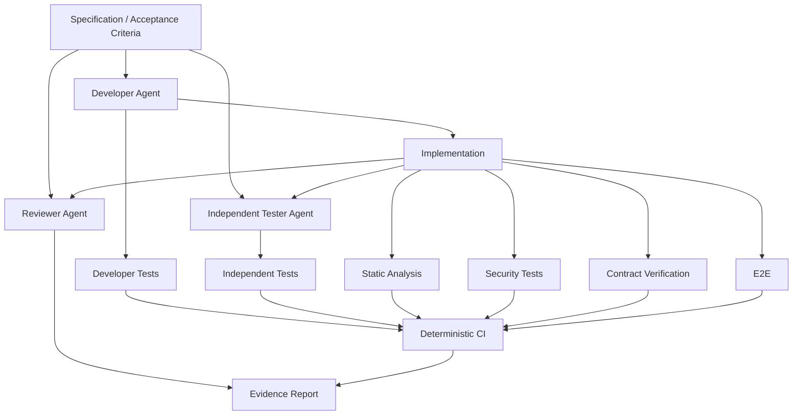
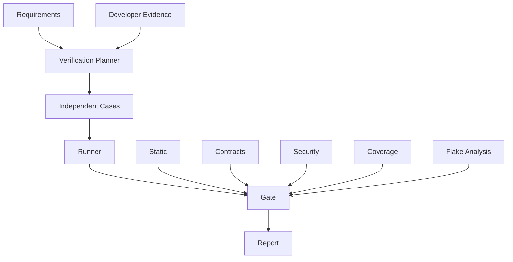
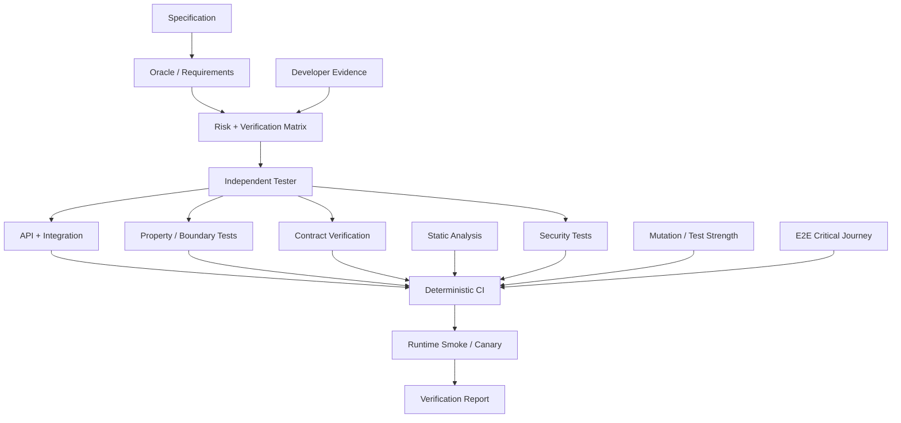

# Phase 10 — AI Testing & Verification

> **Track:** AI-Powered Software Development / Agentic Software Engineering  
> **Prerequisites:**  
> - Phase 1 — Generative AI for Software Engineers  
> - Phase 2 — Prompt Engineering for Software Development  
> - Phase 3 — Context Engineering  
> - Phase 4 — Agentic AI Fundamentals  
> - Phase 5 — AI Coding Agent Mastery  
> - Phase 6 — Spec-Driven Development  
> - Phase 7 — Agent-Friendly Repository Engineering  
> - Phase 8 — AI-Assisted Software Architecture  
> - Phase 9 — AI-Driven Implementation  
>
> **Phase goal:** Build a verification system strong enough that agent-generated software can be trusted because its behavior is supported by deterministic evidence, independent tests, contract checks, security validation, static analysis, and repeatable CI—not because the implementation agent says it is correct.

---

# Table of Contents

1. [How to Study This Phase](#how-to-study-this-phase)
2. [Learning Objectives](#learning-objectives)
3. [The Core Verification Principle](#the-core-verification-principle)
4. [The Verification Architecture](#the-verification-architecture)
5. [Evidence Hierarchy](#evidence-hierarchy)
6. [Test Independence](#test-independence)
7. [Module 99 — Unit Testing with AI](#module-99--unit-testing-with-ai)
8. [Module 100 — Integration Testing](#module-100--integration-testing)
9. [Module 101 — API Testing](#module-101--api-testing)
10. [Module 102 — Contract Testing](#module-102--contract-testing)
11. [Module 103 — End-to-End Testing](#module-103--end-to-end-testing)
12. [Module 104 — Property-Based Testing](#module-104--property-based-testing)
13. [Module 105 — Regression Testing](#module-105--regression-testing)
14. [Module 106 — Static Analysis](#module-106--static-analysis)
15. [Module 107 — Security Testing](#module-107--security-testing)
16. [Module 108 — Test Coverage Analysis](#module-108--test-coverage-analysis)
17. [Module 109 — Agent-Generated Test Cases](#module-109--agent-generated-test-cases)
18. [Module 110 — Independent Verification Agents](#module-110--independent-verification-agents)
19. [The Multi-Agent Verification Pattern](#the-multi-agent-verification-pattern)
20. [Test Oracle Engineering](#test-oracle-engineering)
21. [Determinism and Flakiness](#determinism-and-flakiness)
22. [Test Data Architecture](#test-data-architecture)
23. [Mocks, Stubs, Fakes, and Real Dependencies](#mocks-stubs-fakes-and-real-dependencies)
24. [Mutation Testing and Test Strength](#mutation-testing-and-test-strength)
25. [Differential and Metamorphic Testing](#differential-and-metamorphic-testing)
26. [Verification of Migrations](#verification-of-migrations)
27. [Verification in CI](#verification-in-ci)
28. [Runtime Verification and Post-Deploy Checks](#runtime-verification-and-post-deploy-checks)
29. [Practical Python Examples](#practical-python-examples)
30. [Worked Case Studies](#worked-case-studies)
31. [Testing Anti-Patterns](#testing-anti-patterns)
32. [Practical Labs](#practical-labs)
33. [Review Questions](#review-questions)
34. [Scenario Exercises](#scenario-exercises)
35. [Phase Project — VerifyMesh](#phase-project--verifymesh)
36. [Phase 10 Completion Checklist](#phase-10-completion-checklist)
37. [Where This Leads Next](#where-this-leads-next)
38. [Reference Baseline](#reference-baseline)

---

# How to Study This Phase

This phase is absolutely critical.

In previous phases, the agent learned to:

```text
understand intent
design a plan
write production code
run tests
inspect diffs
```

But there is a dangerous failure mode:

```text
Developer Agent:
"I implemented the feature."

Developer Agent:
"I wrote tests."

Developer Agent:
"All tests pass."

Developer Agent:
"Therefore the feature is correct."
```

That conclusion is invalid.

The same agent may have misunderstood the requirement in both:

```text
implementation
and
tests
```

A self-consistent mistake can still produce a green test suite.

Therefore:

> **Verification must be designed as an independent evidence system, not as a confidence statement produced by the implementation agent.**

The target pattern is:

```text
Developer Agent
      ↓
Implementation
      ↓
Developer Tests
      ↓
Independent Tester Agent
      ↓
Independent Test Cases
      ↓
Reviewer Agent
      ↓
Architecture / Security / Diff Review
      ↓
CI
      ↓
Deterministic Verification
      ↓
Evidence
```

---

# Learning Objectives

By the end of this phase, you should be able to:

1. Explain why an implementation agent's claim is not evidence.
2. Build a layered verification strategy.
3. Distinguish:
   - unit tests,
   - integration tests,
   - API tests,
   - contract tests,
   - E2E tests,
   - property tests,
   - regression tests,
   - static checks,
   - security tests.
4. Understand which failure class each test layer can detect.
5. Design deterministic unit tests.
6. Use AI to generate unit tests without overfitting to implementation.
7. Test domain invariants.
8. Test error handling and boundary conditions.
9. Build integration tests with real databases/services where valuable.
10. Decide when mocks are appropriate.
11. Avoid excessive mocking.
12. Test API semantics, not only status codes.
13. Validate request/response schemas.
14. Validate authN/authZ behavior.
15. Test pagination, idempotency, errors, concurrency, and versioning.
16. Explain provider-contract testing.
17. Explain consumer-driven contract testing.
18. Use contract tests to reduce integration risk.
19. Avoid turning contract tests into broad E2E tests.
20. Build stable E2E tests for critical journeys.
21. Use property-based testing.
22. Define invariants instead of enumerating examples only.
23. Use generators/strategies.
24. Understand shrinking.
25. Use regression tests to prevent bug recurrence.
26. Build bug reproduction evidence.
27. Use static typing and linting as verification.
28. Use architecture/static rules.
29. Integrate security verification.
30. Use security requirements as test inputs.
31. Understand SAST/DAST/dependency/secret testing categories.
32. Use OWASP-style verification guidance appropriately.
33. Measure statement coverage.
34. Measure branch coverage.
35. Explain why 100% coverage does not mean correctness.
36. Identify untested risk rather than chase arbitrary percentages.
37. Evaluate agent-generated test quality.
38. Detect test cheating.
39. Detect circular validation.
40. Separate developer and verifier contexts.
41. Build independent verification agents.
42. Use specification-derived verification.
43. Use fresh context to reduce confirmation bias.
44. Build adversarial test cases.
45. Use mutation thinking to evaluate test strength.
46. Build deterministic CI gates.
47. Quarantine and eliminate flaky tests.
48. Build machine-readable verification reports.
49. Verify production migrations and rollouts.
50. Build a complete verification orchestration project.

---

# The Core Verification Principle

Memorize:

```text
Agent statement
≠
Evidence
```

The agent may say:

```text
"Implementation completed successfully."
```

That is a report.

It is not proof.

Evidence includes:

```text
test result
static analysis result
contract verification
security scan
benchmark
runtime observation
diff review
```

---

# The Verification Architecture



---

# Evidence Hierarchy

A useful hierarchy:

```text
Level 0:
Agent says it works.

Level 1:
Code compiles/imports.

Level 2:
Developer-written tests pass.

Level 3:
Independent tests pass.

Level 4:
Contracts/static/security checks pass.

Level 5:
Critical E2E behavior passes.

Level 6:
Runtime/rollout evidence confirms expected behavior.
```

Not every task requires Level 6.

Verification depth should match risk.

---

# Test Independence

Independent verification means the verifier should not merely repeat the developer's assumptions.

Ideal verifier inputs:

```text
specification
acceptance criteria
public contracts
implementation
```

Avoid feeding:

```text
developer's explanation of why code is correct
developer's test design rationale
```

unless necessary.

Why?

Because this can anchor the verifier.

---

# Independent Oracle

The verifier should derive expected behavior from:

```text
approved specification
contract
known business invariant
```

rather than:

```text
current code
```

---

# Module 99 — Unit Testing with AI

# 99.1 What Is a Unit Test?

A unit test verifies a small unit of behavior in isolation.

Common units:

```text
function
class
domain object
service method
```

The "unit" is a logical boundary, not necessarily one function.

---

# 99.2 Unit Test Goal

Fast feedback about business logic.

Example:

```python
def test_archived_project_cannot_be_archived_again():
    project = Project(
        status=ProjectStatus.ARCHIVED,
    )

    result = project.archive()

    assert result.status == "already_archived"
```

---

# 99.3 Arrange / Act / Assert

```text
Arrange
→ create state

Act
→ perform behavior

Assert
→ verify observable result
```

---

# 99.4 AI Unit-Test Generation

AI is useful for:

```text
happy path
negative cases
edge cases
state combinations
parameterized cases
```

But require:

```text
requirement-first generation
```

---

# 99.5 Bad Test Generation

Input to agent:

```text
Read this implementation and create tests.
```

It may simply encode current code.

Better:

```text
Using FR-003 and AC-006,
create unit tests for Project.archive().
Inspect implementation only after deriving expected cases.
```

---

# 99.6 Boundary Values

Example integer requirement:

```text
quantity 1–100
```

Tests:

```text
0
1
100
101
```

---

# 99.7 Equivalence Classes

Instead of testing every value, group:

```text
valid
invalid-low
invalid-high
```

---

# 99.8 State Transition Testing

For stateful domain object:

```text
ACTIVE → ARCHIVED
ARCHIVED → ACTIVE
ARCHIVED → ARCHIVED
```

Define allowed transitions.

---

# 99.9 Parameterized Tests

Example:

```python
import pytest


@pytest.mark.parametrize(
    ("role", "allowed"),
    [
        ("admin", True),
        ("owner", True),
        ("member", False),
        ("viewer", False),
    ],
)
def test_archive_permission(
    role: str,
    allowed: bool,
):
    assert can_archive(role) is allowed
```

---

# 99.10 Unit Tests Should Be Fast

If a unit test needs:

```text
network
real database
Docker
```

it is probably not a unit test.

---

# 99.11 Test Behavior, Not Implementation

Brittle:

```python
mock_repository.save.assert_called_once()
```

unless call count is part of behavior.

Stronger:

```text
project state is persisted correctly
```

at the appropriate integration layer.

---

# 99.12 Mocking at Unit Level

Mocks can isolate:

```text
external email
payment gateway
clock
```

But excessive mocking tests the mock network, not the system.

---

# 99.13 Time

Inject/freeze clock for deterministic time-dependent behavior.

---

# 99.14 Randomness

Inject deterministic random source where behavior depends on randomness.

---

# 99.15 AI Unit-Test Review

Ask verifier:

```text
Which meaningful branch or invariant is missing?
Which assertions simply mirror implementation?
```

---

# Module 100 — Integration Testing

# 100.1 Integration Testing Goal

Integration tests verify boundaries between components.

Examples:

```text
service ↔ database
API framework ↔ service
repository ↔ PostgreSQL
worker ↔ queue
```

---

# 100.2 Real Dependency Value

Some behavior cannot be trusted with mocks.

Database example:

```text
SQL syntax
constraint behavior
transaction semantics
index/query behavior
```

Use real test DB.

---

# 100.3 Integration Test Example

```python
def test_archived_project_excluded_from_default_query(
    project_repository,
    db_session,
):
    active = create_project(
        db_session,
        status="active",
    )
    archived = create_project(
        db_session,
        status="archived",
    )

    results = project_repository.list_default()

    ids = {project.id for project in results}

    assert active.id in ids
    assert archived.id not in ids
```

---

# 100.4 Integration Boundary

Test one boundary intentionally.

Do not accidentally create full-system test with unclear failures.

---

# 100.5 Test Containers / Ephemeral Services

Useful for:

```text
PostgreSQL
Redis
broker
```

The environment should be reproducible.

---

# 100.6 Transaction Rollback

Tests may isolate DB changes with transaction rollback.

Beware if behavior depends on committed transactions.

---

# 100.7 Migration Tests

An integration suite should test:

```text
fresh schema
upgrade from supported previous schema
```

when migration risk is significant.

---

# 100.8 External Provider Integration

Options:

```text
sandbox/test environment
recorded fixture
fake
contract test
```

Choose based on failure class.

---

# 100.9 Don't Run Production Integrations in Unit CI

Avoid tests that:

```text
charge real cards
send real email
modify real data
```

---

# 100.10 Integration Failure Diagnostics

Report:

```text
service
endpoint
DB query
actual response
```

not only:

```text
assertion failed
```

---

# Module 101 — API Testing

# 101.1 API Tests Verify External Semantics

An API test should check more than:

```text
status == 200
```

It should verify:

```text
schema
errors
authorization
idempotency
pagination
headers
state changes
```

---

# 101.2 Happy Path

Example:

```python
def test_admin_can_archive_project(
    client,
    admin_headers,
    project,
):
    response = client.post(
        f"/projects/{project.id}/archive",
        headers=admin_headers,
    )

    assert response.status_code == 204
```

---

# 101.3 Authorization Cases

Test:

```text
anonymous
authenticated wrong role
wrong tenant
correct role
```

---

# 101.4 Error Contract

Example:

```python
assert response.json() == {
    "code": "PROJECT_NOT_ARCHIVABLE",
    "message": "Project has an active deployment.",
    "details": {},
}
```

Be careful not to make human-readable message unnecessarily rigid if only code is contract.

---

# 101.5 Schema Validation

Validate:

```text
required fields
types
formats
nullability
```

---

# 101.6 Pagination

Test:

```text
first page
next cursor
last page
stable ordering
duplicate/missing records
```

---

# 101.7 Filtering / Sorting

Test combinations derived from contract.

---

# 101.8 Idempotency

Example:

```text
same idempotency key
→ same semantic operation
→ no duplicate side effect
```

---

# 101.9 Concurrency

API tests can simulate concurrent updates when behavior requires.

---

# 101.10 Conditional Requests

Test:

```text
ETag
If-Match
```

if API uses optimistic concurrency.

---

# 101.11 API Backward Compatibility

Use schema diff/contract checks.

Breaking change examples:

```text
remove field
rename field
change requiredness
change meaning
```

---

# Module 102 — Contract Testing

# 102.1 What Is Contract Testing?

Contract testing verifies that two independently developed components agree on the messages exchanged between them.

For HTTP:

```text
request
response
```

For messaging:

```text
event/message
```

---

# 102.2 Schema Contract Testing

Provider behavior conforms to:

```text
OpenAPI
JSON Schema
protobuf
```

Example:

```text
response matches documented schema
```

---

# 102.3 Consumer-Driven Contract Testing

Consumer declares:

```text
what it needs from provider
```

Provider verifies those expectations.

A common tool is Pact.

---

# 102.4 Consumer / Provider

```text
Consumer:
calls API / receives message

Provider:
serves API / produces message
```

---

# 102.5 Contract by Example

Consumer-driven contracts often encode concrete interactions.

Example:

```text
GET /users/123
→ 200
→ fields id/name
```

---

# 102.6 Why Contract Tests Matter

They reduce need for:

```text
fully integrated shared environment
```

for every compatibility check.

---

# 102.7 Contract Tests Are Not Full Functional Tests

Do not use them to prove:

```text
provider business logic is correct
```

That belongs in provider tests.

Contract test proves compatibility.

---

# 102.8 Minimal Expectations

A consumer should specify only what it depends on.

Overly exact contracts become brittle.

---

# 102.9 Provider Verification

Provider replays contract expectations against provider implementation.

---

# 102.10 Message Contracts

For event:

```json
{
  "type": "ProjectArchived",
  "project_id": "...",
  "occurred_at": "..."
}
```

Consumers can define required fields/semantics.

---

# 102.11 Contract Versioning

Event/API contracts must evolve compatibly.

---

# 102.12 CI Integration

Before deployment:

```text
consumer contract published
provider verified
deployment compatibility checked
```

---

# Module 103 — End-to-End Testing

# 103.1 What Is E2E?

End-to-end tests verify a user/business workflow across major system boundaries.

Example:

```text
user logs in
creates project
archives project
project disappears from list
```

---

# 103.2 E2E Strength

E2E verifies wiring across:

```text
UI
API
service
DB
```

---

# 103.3 E2E Weakness

They are:

```text
slower
more brittle
harder to diagnose
```

Do not test every edge case via E2E.

---

# 103.4 Critical Journeys

Good E2E targets:

```text
signup
checkout
login
core workflow
```

---

# 103.5 Stable Selectors

Frontend tests should use semantic roles/labels or stable test selectors.

Avoid brittle CSS hierarchy.

---

# 103.6 Deterministic Data

Seed test data.

Do not depend on random shared environment.

---

# 103.7 External Providers

Use:

```text
sandbox
fake
controlled integration
```

depending on workflow.

---

# 103.8 Screenshot / Visual Evidence

Useful for UI behavior.

But visual snapshot alone may miss semantics/accessibility.

---

# 103.9 E2E Failure Diagnostics

Capture:

```text
screenshot
DOM snapshot
network log
browser console
trace
```

---

# 103.10 E2E Parallelism

Tests need isolated users/data to run in parallel.

---

# 103.11 E2E Flakiness

Avoid:

```text
sleep(5)
```

Prefer waiting for actual condition.

---

# Module 104 — Property-Based Testing

# 104.1 Example-Based vs Property-Based

Example-based:

```text
sort([3,1,2]) == [1,2,3]
```

Property-based:

```text
for many lists:
result is ordered
and
contains same elements
```

---

# 104.2 Property

A property is a general invariant.

Examples:

```text
sorting preserves element multiset
archive operation is idempotent
serialization round-trip preserves value
```

---

# 104.3 Hypothesis

In Python, Hypothesis is a major property-based testing library.

Example:

```python
from hypothesis import given
from hypothesis import strategies as st


@given(st.lists(st.integers()))
def test_reverse_twice_returns_original(
    values: list[int],
):
    assert list(
        reversed(
            list(reversed(values))
        )
    ) == values
```

---

# 104.4 Generated Inputs

The library generates:

```text
normal
boundary
unexpected combinations
```

---

# 104.5 Shrinking

When a failure occurs, a property framework attempts to reduce input to a simpler failing example.

Example:

```text
huge list failure
→ minimal [0, -1]
```

This improves diagnosis.

---

# 104.6 Property Design

Good property should represent invariant, not reproduce implementation algorithm.

---

# 104.7 Idempotency Property

```python
@given(st.text(min_size=1))
def test_normalize_is_idempotent(
    value: str,
):
    once = normalize(value)
    twice = normalize(once)

    assert twice == once
```

---

# 104.8 Round-Trip Property

```text
decode(encode(x)) == x
```

where valid.

---

# 104.9 Metamorphic Properties

Even when exact expected result is hard, relationship may be known.

Example:

```text
adding zero should not change total
```

---

# 104.10 Stateful Property Testing

Useful for:

```text
state machines
caches
collections
```

---

# 104.11 AI and Property Generation

AI can propose invariants.

Human must validate domain correctness.

---

# Module 105 — Regression Testing

# 105.1 Regression Test Purpose

A regression test ensures a previously observed defect does not return.

---

# 105.2 Bug → Test

Pattern:

```text
bug
→ deterministic reproduction
→ test
→ fix
→ test remains forever if valuable
```

---

# 105.3 Regression Test Quality

Test root cause behavior, not only symptom.

---

# 105.4 Example

Bug:

```text
expired token causes 500
```

Regression:

```text
expired token → 401
```

not:

```text
mock error handler directly
```

---

# 105.5 Regression Suite Growth

Do not let regression suite become infinitely slow.

Keep tests at lowest sufficient level.

---

# 105.6 Historical Incidents

Production incidents should often result in:

```text
new test
new guardrail
new monitor
```

depending on cause.

---

# 105.7 Bug Class Testing

After one bug:

```text
integer overflow
```

ask whether related boundary cases should be tested.

Avoid unrelated expansion.

---

# Module 106 — Static Analysis

# 106.1 Static Analysis Requires No Runtime Scenario

It inspects:

```text
source
types
dependencies
control/data patterns
```

---

# 106.2 Type Checking

Examples:

```text
pyright
mypy
TypeScript compiler
Go compiler
Rust compiler
```

Catches interface/shape errors before tests.

---

# 106.3 Linting

Detect:

```text
unused code
bad patterns
unsafe constructs
```

---

# 106.4 Architecture Analysis

Detect:

```text
forbidden imports
cycles
boundary violations
```

---

# 106.5 SAST

Static Application Security Testing scans source for security-relevant patterns.

Useful but not complete.

---

# 106.6 Secret Scanning

Detect accidental:

```text
API keys
passwords
tokens
```

---

# 106.7 Dependency Analysis

Check:

```text
known vulnerabilities
licenses
unapproved packages
```

---

# 106.8 Static Analysis False Positives

Rules can produce noise.

Use:

```text
severity
suppressions with justification
```

Do not normalize ignoring warnings.

---

# 106.9 AI and Static Findings

AI can explain/fix findings.

The static tool remains deterministic evidence.

---

# Module 107 — Security Testing

# 107.1 Security Tests Come from Security Requirements

Do not test security only through generic scanner.

Start with:

```text
assets
actors
trust boundaries
authN/authZ
data protection
abuse cases
```

---

# 107.2 Security Test Layers

```text
unit security rules
integration authorization
API abuse cases
SAST
DAST
dependency scanning
secret scanning
manual review
```

---

# 107.3 Authentication

Test:

```text
missing credential
expired credential
invalid signature
revoked session
```

---

# 107.4 Authorization

Test:

```text
wrong role
wrong tenant
object-level access
privilege escalation
```

---

# 107.5 IDOR / Object Authorization

Example:

```text
User from Org B guesses Project A ID.
```

Must not access.

---

# 107.6 Input Validation

Test:

```text
unexpected type
oversize input
malformed encoding
dangerous payload
```

---

# 107.7 Rate / Abuse Testing

When requirement exists:

```text
login attempts
export volume
expensive query
```

---

# 107.8 Security Headers / Configuration

For web applications, verify expected security configuration.

---

# 107.9 Error Leakage

Test that internal stack/secrets are not exposed.

---

# 107.10 Dependency Security

Known vulnerable dependency should fail policy based on severity/risk.

---

# 107.11 OWASP ASVS

ASVS provides a structured security verification standard for web applications.

Current stable ASVS is 5.0.0.

Use ASVS requirements as a source of security verification criteria where relevant.

---

# 107.12 OWASP WSTG

The Web Security Testing Guide provides a broader testing framework and concrete web security testing scenarios.

Use it to design security testing—not as a substitute for threat modeling.

---

# 107.13 Security Testing Is Not Only Penetration Testing

Security verification belongs throughout:

```text
definition
design
development
deployment
maintenance
```

---

# Module 108 — Test Coverage Analysis

# 108.1 What Is Coverage?

Coverage asks:

```text
Which code was executed by tests?
```

It does not ask:

```text
Was the behavior correct?
```

---

# 108.2 Statement Coverage

Measures executed statements/lines.

---

# 108.3 Branch Coverage

Measures whether alternative control-flow branches were exercised.

Example:

```python
if user.is_admin:
    allow()
else:
    deny()
```

Statement coverage may execute all lines across some paths, but branch coverage explicitly tracks both outcomes.

---

# 108.4 Function Coverage

Whether functions are executed.

---

# 108.5 Coverage Tool

For Python, coverage.py can measure statement and branch coverage.

---

# 108.6 Coverage Is a Map

Use coverage to ask:

```text
Why is this critical branch untested?
```

not:

```text
How can I hit 100%?
```

---

# 108.7 100% Coverage Can Still Be Weak

Example:

```python
def test_calculate():
    calculate(1)
```

may execute all lines but assert nothing.

---

# 108.8 Risk-Based Coverage

Prioritize:

```text
auth
money
data loss
complex business rules
error branches
```

---

# 108.9 Changed-Code Coverage

Useful concept:

```text
new/changed code should have strong coverage
```

while legacy baseline may improve gradually.

---

# 108.10 Branch Gaps

A missing branch can reveal:

```text
untested error
untested authorization denial
```

---

# 108.11 Coverage Exclusions

Generated code or impossible defensive branches may be excluded with explicit justification.

---

# 108.12 Coverage Trend

Watch degradation over time.

---

# Module 109 — Agent-Generated Test Cases

# 109.1 Why Agents Are Strong Test Generators

They can quickly enumerate:

```text
happy paths
negative paths
boundaries
state combinations
invalid inputs
```

---

# 109.2 Why Agents Are Dangerous Test Generators

They may:

```text
mirror implementation
assume wrong business rule
overmock
weaken assertions
create brittle tests
```

---

# 109.3 Requirement-First Generation

Prompt structure:

```text
Given:
FR-001, FR-002, AC-004

Generate:
- positive
- negative
- boundary
- concurrency
- security
cases.

Do not inspect implementation yet.
```

Then review cases.

---

# 109.4 Implementation-Aware Second Pass

After cases selected:

```text
inspect code
→ determine appropriate test level
→ implement tests
```

---

# 109.5 Case Matrix

Example:

| Role | State | Tenant | Expected |
|---|---|---|---|
| Admin | Active | Same | Success |
| Member | Active | Same | 403 |
| Admin | Active | Other | Denied |
| Admin | Archived | Same | Idempotent |

AI is excellent at generating matrices.

---

# 109.6 Deduplicate Cases

Agents may generate 20 tests proving same behavior.

Optimize for unique failure detection.

---

# 109.7 Assertion Quality Review

Ask:

```text
What defect would this assertion catch?
```

If answer unclear, test may be low value.

---

# 109.8 Avoid Snapshot Overuse

Snapshots can hide semantic changes.

Use when representation itself matters.

---

# 109.9 Test Naming

Name should communicate behavior.

Good:

```text
test_cross_tenant_admin_cannot_archive_project
```

---

# 109.10 Test Maintenance Cost

Every generated test becomes long-term code.

Do not accept useless volume.

---

# Module 110 — Independent Verification Agents

# 110.1 Why Independent Verifiers?

The developer agent has context and bias from creating the implementation.

A fresh verifier can challenge it.

---

# 110.2 Inputs

Give verifier:

```text
spec
acceptance criteria
contracts
implementation diff
repository test commands
```

---

# 110.3 Avoid Anchoring

Do not begin:

```text
"The developer successfully implemented..."
```

Begin neutral:

```text
"Verify whether implementation satisfies..."
```

---

# 110.4 Verifier Responsibilities

```text
derive missing cases
run tests
write independent tests
inspect contracts
inspect edge/security cases
report gaps
```

---

# 110.5 Verifier Should Not Automatically Fix

Separation can be useful:

```text
Verifier finds
Developer fixes
```

This preserves independent evidence.

---

# 110.6 Reviewer Agent

Different focus:

```text
architecture
maintainability
security
scope
```

Tester focuses behavior.

---

# 110.7 Verification Agent Output

```text
Requirement coverage
Tests added/run
Failures
Unverified areas
Confidence supported by evidence
```

---

# 110.8 Two-Agent Failure

If both agents use same flawed spec, independent models do not solve requirement error.

Human/product authority still matters.

---

# 110.9 Independent Model vs Independent Context

Independence can be improved by:

```text
fresh context
different prompt
different model
different test strategy
```

But the most important source is:

```text
independent oracle
```

---

# 110.10 Adversarial Verifier

Prompt:

```text
Try to falsify the claim that FR-004 is satisfied.
```

This is stronger than:

```text
Confirm the implementation.
```

---

# The Multi-Agent Verification Pattern

```text
Developer Agent
      ↓
Implementation
      ↓
Developer Unit/Integration Tests

Independent Tester Agent
      ↓
Specification-derived tests
      ↓
Property / boundary / API cases

Reviewer Agent
      ↓
Architecture / security / scope review

CI
      ↓
Formatter
Lint
Types
Unit
Integration
Contracts
Security
E2E

      ↓
Evidence Report
```

---

# Test Oracle Engineering

# 111.1 What Is an Oracle?

An oracle defines what correct behavior is.

Sources:

```text
specification
acceptance criteria
public contract
domain invariant
known reference implementation
mathematical property
```

---

# 111.2 Weak Oracle

```text
current output
```

if current behavior may be wrong.

---

# 111.3 Golden Reference

Sometimes compare to trusted implementation.

Example:

```text
new parser vs existing validated parser
```

---

# 111.4 Business Oracle

Some behavior requires human authority.

Example:

```text
refund eligibility
```

Do not let test generator invent policy.

---

# Determinism and Flakiness

# 112.1 Flaky Test

Same code/state:

```text
sometimes pass
sometimes fail
```

This destroys evidence quality.

---

# 112.2 Common Causes

```text
time
randomness
race conditions
shared state
network
test order
eventual consistency
```

---

# 112.3 Fix Flakes, Don't Normalize Retries

Retry can diagnose but should not hide flake.

---

# 112.4 Fixed Random Seed

Useful for reproducibility.

Property frameworks may record/replay failing cases.

---

# 112.5 Controlled Clock

Use injected/frozen time.

---

# 112.6 Eventual Consistency Test

Poll bounded condition instead of sleep.

---

# 112.7 Isolation

Unique:

```text
DB schema
tenant
user
namespace
```

for parallel tests.

---

# Test Data Architecture

# 113.1 Test Data Should Communicate Intent

Avoid giant mystery fixture.

Use builders.

---

# 113.2 Factory

```python
def make_project(
    *,
    status: str = "active",
    organization_id: str = "org-1",
):
    return Project(
        status=status,
        organization_id=organization_id,
    )
```

---

# 113.3 Scenario Builder

```text
given_admin()
given_other_tenant_project()
```

---

# 113.4 Production Data

Do not copy sensitive production data into test environment casually.

Use synthetic/anonymized data appropriately.

---

# 113.5 Edge Data

Include:

```text
empty
maximum
unicode
duplicates
large payload
```

---

# Mocks, Stubs, Fakes, and Real Dependencies

# 114.1 Stub

Returns predefined data.

---

# 114.2 Mock

Also verifies interaction expectations.

---

# 114.3 Fake

Working lightweight implementation.

Example:

```text
in-memory repository
```

---

# 114.4 Real Dependency

Actual PostgreSQL or provider sandbox.

---

# 114.5 Test Double Decision

Ask:

```text
What failure do I need to detect?
```

If detecting SQL behavior:

```text
use real DB
```

If testing domain logic:

```text
fake/mock may be sufficient
```

---

# Mutation Testing and Test Strength

# 115.1 Mutation Concept

Intentionally modify code:

```text
>
→
>=
```

If tests still pass, they may be weak.

---

# 115.2 Mutation Score

Conceptually:

```text
killed mutations / total relevant mutations
```

---

# 115.3 AI Mutation Review

Without mutation tool, ask verifier:

```text
Suggest 10 plausible incorrect implementations.
Would current tests catch each?
```

---

# Differential and Metamorphic Testing

# 116.1 Differential Testing

Run same input through:

```text
old implementation
new implementation
```

Compare.

Useful for modernization.

---

# 116.2 Metamorphic Testing

When exact output unknown, verify relations.

Example:

```text
sort(x + [y])
```

must remain sorted and contain all values.

---

# 116.3 Oracle-Light Testing

These techniques are valuable when exact expected output is expensive.

---

# Verification of Migrations

# 117.1 Schema Migration Test

Verify:

```text
upgrade
schema shape
constraints
old/new app compatibility
```

---

# 117.2 Data Migration Test

Use representative rows:

```text
valid
null
edge
already migrated
```

---

# 117.3 Idempotency

Running backfill twice should remain correct.

---

# 117.4 Resume

Stop midway and continue.

---

# 117.5 Row Count / Invariants

Before/after checks.

---

# Verification in CI

# 118.1 CI Is the Deterministic Gate

CI should not depend on agent opinion.

---

# 118.2 Stage Order

Fast first:

```text
format
lint
types
unit
contract
integration
security
E2E
```

Actual order depends on project.

---

# 118.3 Fail Fast

Do not run 30-minute E2E if lint fails in 2 seconds.

---

# 118.4 Machine-Readable Reports

Store:

```text
JUnit
coverage
SARIF
screenshots
logs
```

---

# 118.5 Baseline Failures

If main is already failing, distinguish:

```text
pre-existing
new
```

---

# 118.6 Required Checks

Critical gates should be required before merge.

---

# Runtime Verification and Post-Deploy Checks

# 119.1 Tests Cannot Model Everything

After rollout, observe:

```text
errors
latency
business metrics
security events
```

---

# 119.2 Smoke Tests

After deploy:

```text
health
critical read
critical write in safe test context
```

---

# 119.3 Synthetic Tests

Continuously exercise critical flow.

---

# 119.4 Canary Verification

Compare:

```text
new version
vs
baseline
```

---

# 119.5 Rollback Trigger

Define before deployment.

---

# Practical Python Examples

# 120.1 Verification Case Model

```python
from typing import Literal
from pydantic import BaseModel


class VerificationCase(BaseModel):
    id: str
    requirement_id: str
    layer: Literal[
        "unit",
        "integration",
        "api",
        "contract",
        "e2e",
        "property",
        "security",
    ]
    description: str
    oracle: str
```

---

# 120.2 Evidence Model

```python
class Evidence(BaseModel):
    check: str
    command: list[str]
    exit_code: int
    passed: bool
    artifact: str | None = None
```

---

# 120.3 Requirement Coverage

```python
def uncovered_requirements(
    requirement_ids: set[str],
    cases: list[VerificationCase],
) -> set[str]:
    covered = {
        case.requirement_id
        for case in cases
    }

    return requirement_ids - covered
```

---

# 120.4 Test Independence Metadata

```python
class TestProvenance(BaseModel):
    author_role: Literal[
        "developer_agent",
        "tester_agent",
        "human",
    ]
    oracle_source: str
    implementation_read_before_design: bool
```

---

# 120.5 Flake Result

```python
class FlakeObservation(BaseModel):
    test_name: str
    runs: int
    passes: int
    failures: int

    @property
    def flaky(self) -> bool:
        return (
            self.passes > 0
            and self.failures > 0
        )
```

---

# 120.6 API Case Matrix

```python
def archive_cases():
    return [
        {
            "role": "admin",
            "tenant": "same",
            "state": "active",
            "expected": 204,
        },
        {
            "role": "member",
            "tenant": "same",
            "state": "active",
            "expected": 403,
        },
        {
            "role": "admin",
            "tenant": "other",
            "state": "active",
            "expected": 404,
        },
    ]
```

---

# 120.7 Property Test

```python
from hypothesis import given
from hypothesis import strategies as st


@given(
    st.lists(
        st.integers(),
        max_size=100,
    )
)
def test_sorted_result_is_monotonic(
    values: list[int],
):
    result = sorted(values)

    assert all(
        left <= right
        for left, right in zip(
            result,
            result[1:],
        )
    )
```

---

# Worked Case Studies

# Case Study 1 — Project Archive

## Developer Agent Tests

```text
admin can archive
```

All pass.

Independent verifier derives matrix:

```text
admin same tenant
member same tenant
admin other tenant
already archived
active deployment
```

Finds:

```text
cross-tenant admin can archive
```

Developer's test suite was green but incomplete.

This is why independent verification matters.

---

# Case Study 2 — API Contract

Provider changes:

```text
name: string
```

to:

```text
display_name: string
```

Provider unit tests pass.

Consumer contract verification fails.

This detects integration break before production.

---

# Case Study 3 — Property-Based Parser

Example tests cover:

```text
simple inputs
```

Hypothesis generates:

```text
empty
unicode
large
unexpected separator
```

Minimal failing input exposes bug.

---

# Case Study 4 — Coverage Trap

Suite has:

```text
100% statement coverage
```

Authorization condition:

```python
if user.organization_id == project.organization_id:
    allow()
else:
    deny()
```

tests only same-tenant path.

Branch coverage reveals missing denial branch.

---

# Case Study 5 — Security Test

Developer tests valid authorization.

Verifier tries:

```text
Org B admin with Org A project ID.
```

Finds IDOR.

Security testing must include adversarial cases.

---

# Case Study 6 — E2E Flake

Test:

```python
time.sleep(5)
```

sometimes fails on slow CI.

Replace with:

```text
poll until job status complete
with bounded timeout
```

Deterministic evidence improves.

---

# Testing Anti-Patterns

# Anti-Pattern 1 — "Agent Says It Passed"

# Anti-Pattern 2 — Developer Agent Writes All Verification

# Anti-Pattern 3 — Tests Derived Only from Implementation

# Anti-Pattern 4 — Only Happy Path

# Anti-Pattern 5 — Every Test Is E2E

# Anti-Pattern 6 — Everything Mocked

# Anti-Pattern 7 — No Real Database Tests

# Anti-Pattern 8 — Sleep-Based Async Tests

# Anti-Pattern 9 — Flaky Tests Retried Until Green

# Anti-Pattern 10 — 100% Coverage as Goal

# Anti-Pattern 11 — Coverage With No Assertions

# Anti-Pattern 12 — Contract Test Used as Functional Test

# Anti-Pattern 13 — Security Scanner as Entire Security Strategy

# Anti-Pattern 14 — Snapshot Everything

# Anti-Pattern 15 — Generated Test Volume Over Value

# Anti-Pattern 16 — Test Cheating

# Anti-Pattern 17 — Verifier Anchored by Developer Explanation

# Anti-Pattern 18 — Green CI With Unverified Migration

---

# Practical Labs

# Lab 1 — Unit Test Design

Write unit tests from acceptance criteria.

# Lab 2 — Boundary Values

Test min/max/outside.

# Lab 3 — State Transition Matrix

Model lifecycle.

# Lab 4 — Parameterized Authorization

Create role matrix.

# Lab 5 — Mock vs Fake vs Real

Choose for 15 cases.

# Lab 6 — DB Integration Test

Use real PostgreSQL.

# Lab 7 — Constraint Verification

Test UNIQUE/FK/CHECK.

# Lab 8 — API Error Contract

Verify stable error code.

# Lab 9 — Pagination

Test cursor behavior.

# Lab 10 — Idempotency

Repeat request.

# Lab 11 — Optimistic Concurrency

Test stale ETag.

# Lab 12 — Provider Schema Contract

Validate OpenAPI response.

# Lab 13 — Consumer Pact

Create consumer expectation.

# Lab 14 — Provider Verification

Replay contract.

# Lab 15 — Message Contract

Verify event schema.

# Lab 16 — E2E Critical Journey

Implement one stable flow.

# Lab 17 — E2E Diagnostics

Capture screenshot/trace.

# Lab 18 — Remove sleep()

Use condition wait.

# Lab 19 — Property-Based List Test

Use Hypothesis.

# Lab 20 — Shrinking

Inspect minimal failing example.

# Lab 21 — Round-Trip Property

Serialize/deserialize.

# Lab 22 — Idempotency Property

Test normalization.

# Lab 23 — Regression Bug

Fail-before/pass-after.

# Lab 24 — Static Types

Introduce type error and catch.

# Lab 25 — Architecture Static Check

Detect forbidden import.

# Lab 26 — Secret Scan

Insert fake key pattern.

# Lab 27 — Dependency Scan

Review vulnerability result.

# Lab 28 — Authorization Security Matrix

Test cross-tenant access.

# Lab 29 — Error Leakage

Ensure stack not returned.

# Lab 30 — ASVS Mapping

Map five security requirements to tests.

# Lab 31 — WSTG Mapping

Select relevant web security tests.

# Lab 32 — Statement Coverage

Generate report.

# Lab 33 — Branch Coverage

Find uncovered branch.

# Lab 34 — Coverage Trap

Create high coverage/weak assertions.

# Lab 35 — Changed-Code Coverage

Analyze new module.

# Lab 36 — Agent Test Generation

Generate cases from spec only.

# Lab 37 — Case Deduplication

Remove redundant tests.

# Lab 38 — Test Cheating Review

Detect weakened assertion.

# Lab 39 — Independent Tester Agent

Fresh context verification.

# Lab 40 — Adversarial Verifier

Try to falsify requirement.

# Lab 41 — Reviewer Agent

Review architecture/security.

# Lab 42 — Mutation Thinking

List plausible faulty implementations.

# Lab 43 — Mutation Tool

Run mutation testing if available.

# Lab 44 — Differential Testing

Compare legacy/new implementation.

# Lab 45 — Metamorphic Testing

Verify relation without exact oracle.

# Lab 46 — Migration Upgrade Test

Test schema from previous version.

# Lab 47 — Restartable Backfill Test

Fail/resume.

# Lab 48 — CI Stage Design

Order fast → slow.

# Lab 49 — Machine-Readable Reports

Produce JUnit/coverage artifacts.

# Lab 50 — Full Multi-Agent Verification

Developer → tester → reviewer → CI.

---

# Review Questions

1. Why is an agent's success statement not evidence?
2. What is independent verification?
3. What is a test oracle?
4. Why should verifier derive behavior from spec?
5. What is a unit test?
6. What makes unit tests fast?
7. Why avoid implementation-coupled assertions?
8. What is boundary-value testing?
9. What is equivalence partitioning?
10. What is state-transition testing?
11. What is integration testing?
12. Why use a real database?
13. When is a fake better than real dependency?
14. What should API testing verify?
15. Why test auth failure cases?
16. What is idempotency testing?
17. What is contract testing?
18. What is consumer-driven contract testing?
19. Why should Pact expectations be minimal?
20. Why are contract tests not full functional tests?
21. What is E2E testing?
22. Why keep E2E suite small?
23. What causes E2E flakiness?
24. Why avoid sleep-based waits?
25. What is property-based testing?
26. What is a property?
27. What is shrinking?
28. What is a round-trip property?
29. What is metamorphic testing?
30. What is a regression test?
31. Why should a bug fix reproduce first?
32. What is static analysis?
33. What is SAST?
34. What is secret scanning?
35. What is dependency scanning?
36. Why is static analysis evidence but not complete proof?
37. What is security testing?
38. Why derive security tests from requirements/threat model?
39. What is object-level authorization testing?
40. What is OWASP ASVS?
41. What is WSTG?
42. What is statement coverage?
43. What is branch coverage?
44. Why is 100% coverage not correctness?
45. What is risk-based coverage?
46. Why are agent-generated tests useful?
47. What risks do agent-generated tests introduce?
48. What is circular validation?
49. What is test cheating?
50. What does an independent tester agent do?
51. How do you reduce verifier anchoring?
52. Why might two agents still share same wrong assumption?
53. What is an adversarial verifier?
54. What is a flaky test?
55. Why are retries not a flake fix?
56. What causes test nondeterminism?
57. What is a test factory?
58. What is a mock?
59. What is a stub?
60. What is a fake?
61. What is mutation testing?
62. What does a surviving mutation imply?
63. What is differential testing?
64. How do you test data migrations?
65. Why should CI use deterministic tools?
66. Why store machine-readable reports?
67. What is runtime verification?
68. What is a smoke test?
69. Why define rollback triggers?
70. What is the central lesson of Phase 10?

---

# Scenario Exercises

# Scenario 1 — Green Suite, Wrong Requirement

Developer and tests both use wrong authorization rule.

How do you detect this?

# Scenario 2 — 95% Coverage

A critical security branch has no test.

Is 95% enough?

# Scenario 3 — Mocked Database

Repository tests mock SQLAlchemy entirely.

A production query syntax bug ships.

Which layer was missing?

# Scenario 4 — Pact Explosion

Consumer contract contains hundreds of UI-specific response combinations.

What went wrong?

# Scenario 5 — E2E Flake

CI passes after retry.

Should it be accepted?

# Scenario 6 — Property Failure

Hypothesis finds one-character Unicode edge case.

Why is shrinking useful?

# Scenario 7 — Security Scanner Clean

Cross-tenant IDOR exists.

Why didn't scanner guarantee security?

# Scenario 8 — Independent Verifier

Verifier is told "developer implemented perfectly."

What bias risk?

# Scenario 9 — Migration Green Unit Tests

Backfill fails after 2 million rows.

What verification was missing?

# Scenario 10 — Test Agent Writes 200 Tests

Most duplicate same behavior.

How should quality be evaluated?

---

# Phase Project — VerifyMesh

# Project Goal

Build a Python verification orchestrator that models independent verification for agent-generated software.

The project should connect:

```text
requirements
→ developer evidence
→ independent cases
→ deterministic checks
→ coverage
→ security
→ report
```

---

# Project Structure

```text
verifymesh/
├── README.md
├── pyproject.toml
├── requirements/
│   └── project-archive.yaml
├── verification/
│   ├── cases/
│   ├── contracts/
│   ├── security/
│   └── reports/
├── src/
│   └── verifymesh/
│       ├── __init__.py
│       ├── cli.py
│       ├── models.py
│       ├── requirements.py
│       ├── planner.py
│       ├── runner.py
│       ├── coverage.py
│       ├── security.py
│       ├── contracts.py
│       ├── independence.py
│       ├── flake.py
│       └── report.py
└── tests/
    ├── unit/
    ├── integration/
    └── property/
```

---

# Feature 1 — Requirement Registry

Example:

```yaml
requirements:
  - id: FR-001
    text: Admin can archive active project.
  - id: SEC-001
    text: Cross-tenant actors cannot archive project.
```

---

# Feature 2 — Verification Case Registry

```json
{
  "id": "VC-001",
  "requirement_id": "SEC-001",
  "layer": "api",
  "description": "Org B admin cannot archive Org A project",
  "oracle": "HTTP response denies access and project state unchanged"
}
```

---

# Feature 3 — Provenance

Record:

```text
human
developer agent
tester agent
```

and oracle source.

---

# Feature 4 — Independence Check

Warn if all cases for critical requirement were authored only by developer agent.

---

# Feature 5 — Verification Runner

Execute configured commands.

---

# Feature 6 — Coverage Import

Parse coverage summary.

---

# Feature 7 — Branch Risk

Flag uncovered branches in critical modules.

---

# Feature 8 — Contract Results

Import:

```text
OpenAPI validation
Pact/provider verification
```

---

# Feature 9 — Security Results

Import:

```text
SAST
secret scan
dependency scan
custom auth tests
```

---

# Feature 10 — Flake Detector

Run selected test multiple times.

Detect mixed pass/fail.

---

# Feature 11 — Mutation Review

Store mutation results or manual mutation checklist.

---

# Feature 12 — Verification Matrix

Output:

| Requirement | Unit | Integration | API | Contract | Security | Independent |
|---|---|---|---|---|---|---|

---

# Feature 13 — Evidence Score

Educational score based on:

```text
requirement coverage
independent cases
determinism
critical checks
```

Do not treat score as proof.

---

# Feature 14 — Gate

Fail if:

```text
critical requirement has no independent verification
required CI command failed
security high finding exists
flake detected in required test
```

---

# Feature 15 — Final Report

```markdown
# Verification Report

## Requirements
## Developer Evidence
## Independent Evidence
## Contract Results
## Static Analysis
## Security
## Coverage
## Flakiness
## Unverified Areas
## Gate Result
```

---

# VerifyMesh Architecture



---

# Suggested Development Order

## Stage 1

```text
requirement + case models
```

## Stage 2

```text
command runner
```

## Stage 3

```text
provenance / independence
```

## Stage 4

```text
coverage parsing
```

## Stage 5

```text
contract/security adapters
```

## Stage 6

```text
flake detector
```

## Stage 7

```text
gate + report
```

---

# Phase 10 Completion Checklist

## Verification Fundamentals

- [ ] I know agent confidence is not evidence.
- [ ] I build layered verification.
- [ ] I derive expected behavior from authoritative oracles.
- [ ] I understand independence.

## Unit Testing

- [ ] I test behavior, not implementation detail.
- [ ] I use boundaries/equivalence classes.
- [ ] I test state transitions.
- [ ] I keep tests fast/deterministic.
- [ ] I review AI-generated unit tests.

## Integration Testing

- [ ] I identify real integration boundaries.
- [ ] I use real DB where needed.
- [ ] I isolate integration test data.
- [ ] I test migrations/infrastructure where relevant.

## API Testing

- [ ] I test schemas.
- [ ] I test errors.
- [ ] I test authN/authZ.
- [ ] I test idempotency.
- [ ] I test pagination/concurrency where relevant.
- [ ] I test backward compatibility.

## Contract Testing

- [ ] I distinguish schema vs consumer-driven contracts.
- [ ] I understand consumer/provider.
- [ ] I keep contract expectations minimal.
- [ ] I verify providers in CI.
- [ ] I model message contracts.

## E2E

- [ ] I reserve E2E for critical journeys.
- [ ] I use deterministic data.
- [ ] I avoid fixed sleeps.
- [ ] I capture useful diagnostics.
- [ ] I control external dependencies.

## Property-Based Testing

- [ ] I can define invariants.
- [ ] I can use Hypothesis strategies.
- [ ] I understand shrinking.
- [ ] I can write round-trip/idempotency properties.
- [ ] I use properties where examples are insufficient.

## Regression

- [ ] I reproduce bugs before fixing.
- [ ] I create durable regression tests.
- [ ] I test root-cause behavior.
- [ ] I keep regression tests at efficient layer.

## Static Analysis

- [ ] I use types/linting.
- [ ] I use architecture checks.
- [ ] I use security/dependency/secret scanning.
- [ ] I manage false positives deliberately.

## Security Testing

- [ ] I derive security tests from threat/requirements.
- [ ] I test authentication failures.
- [ ] I test authorization boundaries.
- [ ] I test tenant isolation.
- [ ] I test leakage/abuse cases.
- [ ] I know ASVS/WSTG roles.

## Coverage

- [ ] I understand statement coverage.
- [ ] I understand branch coverage.
- [ ] I do not confuse coverage with correctness.
- [ ] I prioritize risk-based gaps.
- [ ] I inspect changed-code coverage.

## Agent-Generated Tests

- [ ] I generate cases from spec before code.
- [ ] I remove redundant cases.
- [ ] I review assertion quality.
- [ ] I detect test cheating.
- [ ] I consider maintenance cost.

## Independent Verification Agents

- [ ] I use fresh verifier context.
- [ ] I avoid anchoring language.
- [ ] I separate tester and developer roles.
- [ ] I can run adversarial verification.
- [ ] I report unverified areas honestly.

## Determinism

- [ ] I eliminate flaky required tests.
- [ ] I control time/randomness.
- [ ] I isolate shared state.
- [ ] I avoid sleep-based synchronization.

## CI / Runtime

- [ ] I run fast checks first.
- [ ] I store machine-readable reports.
- [ ] I distinguish baseline/new failures.
- [ ] I run smoke/post-deploy verification.
- [ ] I define rollback triggers.

## Project

- [ ] I can build VerifyMesh.
- [ ] I can track test provenance.
- [ ] I can detect missing independent verification.
- [ ] I can aggregate deterministic evidence.
- [ ] I can produce a verification report.

---

# Where This Leads Next

Phase 9 taught:

```text
how agents implement production software
```

Phase 10 teaches:

```text
how to prove the implementation deserves trust
```

The next phase is:

# Phase 11 — AI Debugging & Code Review

where the workflow becomes:

```text
reproduce
root-cause
logs
stack traces
regression tests
code review
security review
performance review
architecture review
PR review
incident analysis
```

Phase 10 gives the verification machinery.

Phase 11 uses failures and evidence to diagnose and review software deeply.

---

# Final Mental Model

```text
Specification
      ↓
Developer Agent
      ↓
Implementation
      ↓
Developer Tests

Specification
      ↓
Independent Tester Agent
      ↓
Independent Cases

Implementation
      ↓
Reviewer Agent
      ↓
Architecture / Security Review

Implementation
      ↓
Static Analysis
Contract Verification
Security Testing
Coverage Analysis
E2E

All Evidence
      ↓
Deterministic CI
      ↓
Verification Report
      ↓
Accept / Fix / Escalate
```

The deepest principle is:

> **Tests are not proof because they exist. They are evidence only when their oracle is valid, their execution is deterministic, and their failure-detection ability matches the risk being verified.**

And:

> **Independent verification is valuable because implementation and verification should not share the same unchallenged assumptions.**

---

# Reference Baseline

This phase was reviewed against current primary-source guidance available in August 2026.

## OpenAI — Agent-First Engineering

OpenAI's 2026 harness-engineering work emphasizes that reliable agentic development depends on encoded testing, validation, review, feedback handling, and recovery. In that workflow, agents can reproduce bugs, implement fixes, drive the application, and verify results, while human engineers design the environment and acceptance criteria.

The important lesson for this phase:

```text
agent capability
+
verification harness
=
reliable autonomy
```

## Hypothesis

Current Hypothesis documentation describes property-based testing as defining properties that should hold across generated input ranges, including edge cases developers may not manually enumerate. Hypothesis also reduces failing inputs to simpler counterexamples, which improves diagnosis.

## Pact

Current Pact documentation describes contract testing as verifying that independently developed consumers and providers share an agreed interaction contract. Pact's consumer-driven workflow generates contracts from consumer tests and verifies those contracts against the provider.

Important principle:

```text
contract testing
≠
full provider functional testing
```

## OWASP ASVS

Current stable OWASP Application Security Verification Standard is version 5.0.0.

ASVS provides structured requirements that can be used as a security verification baseline for web applications.

## OWASP Web Security Testing Guide

The WSTG provides a broad web application security testing framework and concrete testing scenarios covering areas such as:

```text
authentication
authorization
session management
input validation
error handling
cryptography
business logic
client-side behavior
API testing
```

## Coverage.py

Current coverage.py supports both statement and branch coverage.

Branch coverage is important because executing every line does not necessarily exercise every possible control-flow decision.

---

# Stable Principles to Retain

Specific tools will change.

The durable principles are:

```text
agent claims are not evidence
derive tests from authoritative requirements
separate developer and verifier perspectives
use the lowest test layer that proves the behavior
use real dependencies where integration semantics matter
treat public contracts as executable compatibility boundaries
use E2E selectively
use properties for general invariants
turn production bugs into regression tests
use static and security analysis as additional evidence
treat coverage as a map, not a correctness score
review AI-generated tests for circular reasoning and test cheating
eliminate flaky required tests
make CI deterministic
preserve machine-readable verification artifacts
verify migrations and rollout behavior
state explicitly what remains unverified
```


---

# Deep Expansion — Verification as an Engineering Control System

The previous sections explain the major testing layers.

This expansion goes deeper into the logic of **why verification can still fail even when many tests exist**.

The central idea is:

```text
Verification Quality
=
Oracle Quality
×
Test Strength
×
Independence
×
Determinism
×
Coverage of Risk
```

This is conceptual rather than mathematical.

If any factor is weak, a green result may provide little confidence.

---

# A. Verification Is an Argument, Not a Number

A production verification package should answer:

```text
What behavior was required?
What evidence supports it?
What failure classes were tested?
What remains unverified?
```

A single metric such as:

```text
92% coverage
```

cannot answer those questions.

---

# A.1 Verification Claim

Example:

```text
Claim:
Cross-tenant project archival is impossible.
```

Evidence:

```text
service authorization test
repository tenant-scoping integration test
API cross-tenant test
static architecture rule
independent verifier case
```

This forms a stronger argument.

---

# A.2 Evidence Triangulation

Different checks should attack the same risk from different directions.

For security-critical rule:

```text
unit
+
integration
+
API
+
adversarial verifier
```

may be appropriate.

Not because more tests are automatically better, but because each layer can catch a different failure.

---

# B. Test Oracle Quality

The oracle is the foundation.

If oracle is wrong:

```text
excellent test
+
wrong expectation
=
reliable enforcement of wrong behavior
```

---

# B.1 Oracle Hierarchy

A useful authority order:

```text
law/regulatory requirement
approved product/business policy
feature specification
public API/event contract
architecture invariant
domain invariant
known reference implementation
current implementation
model inference
```

Exact authority depends on organization.

---

# B.2 Conflicting Oracles

Example:

```text
spec says 404
existing tests say 403
code returns 403
```

Do not simply make new test match majority.

Escalate:

```text
Which artifact represents intended behavior?
```

Then update stale artifacts.

---

# B.3 Oracle Drift

Requirements evolve.

Old tests may become outdated.

A failing test can mean:

```text
implementation regression
or
intentional requirement change
```

This is why traceability matters.

---

# C. Test Provenance

Every important test should have understandable provenance.

Possible metadata:

```text
requirement
bug/incident
security control
contract
architecture rule
```

---

# C.1 Example

```python
def test_cross_tenant_archive_denied():
    """SEC-004 / AC-009."""
```

Or external registry mapping.

Do not overburden every trivial test.

Use for important behavior.

---

# C.2 Why Provenance Helps Agents

A future agent seeing failed test can determine:

```text
Why does this test exist?
Can expected behavior change?
Which spec should I read?
```

---

# D. Verification Independence Spectrum

Independence is not binary.

---

## D.1 Level 0 — Same Agent, Same Context

Developer writes implementation and tests after reading code.

Lowest independence.

---

## D.2 Level 1 — Same Agent, Requirement-First

Agent derives tests before implementation.

Better.

---

## D.3 Level 2 — Fresh Agent Context

Tester sees spec + code but not developer rationale.

Better.

---

## D.4 Level 3 — Separate Verification Agent

Explicit tester role and adversarial objective.

---

## D.5 Level 4 — Different Method

Developer uses example tests.

Verifier uses:

```text
property tests
contract tests
mutation
security abuse cases
```

Methodological independence increases value.

---

# D.6 Independence Is About Error Correlation

If two checks are likely to make same mistake, they provide less independent evidence.

Example:

```text
same prompt
same model
same assumptions
same test style
```

may produce correlated failure.

---

# E. Adversarial Verification

A verifier should attempt to falsify success.

Prompt style:

```text
The implementation claims to satisfy SEC-003.
Find inputs or states that violate SEC-003.
Do not assume developer tests are complete.
```

This is fundamentally different from:

```text
Check whether this looks correct.
```

---

# E.1 Red-Team Case Generation

For an authorization rule, generate:

```text
wrong user
wrong role
wrong tenant
missing token
stale token
forged identifier
disabled account
```

---

# E.2 Failure-Oriented Review

Ask:

```text
What implementation defect could pass all current tests?
```

This produces useful gap analysis.

---

# F. Test Strategy as Risk Mapping

A test strategy should map risks to layers.

Example:

| Risk | Unit | Integration | API | Security | E2E |
|---|---:|---:|---:|---:|---:|
| Incorrect archive transition | ✓ | | | | |
| DB filter omits status condition | | ✓ | ✓ | | |
| Cross-tenant access | ✓ | ✓ | ✓ | ✓ | |
| UI hides action incorrectly | | | | | ✓ |

---

# F.1 Avoid Uniform Testing

Not every requirement needs every layer.

Choose based on:

```text
failure mode
cost
risk
```

---

# G. Unit Testing Deep Dive

# G.1 Pure Functions Are Ideal Units

Example:

```python
def calculate_discount(
    subtotal: Decimal,
    tier: CustomerTier,
) -> Decimal:
    ...
```

Properties are explicit.

---

# G.2 State Machines

For domain lifecycle:

```text
DRAFT
ACTIVE
ARCHIVED
DELETED
```

Build transition table.

| From | Action | To | Allowed |
|---|---|---|---|
| ACTIVE | archive | ARCHIVED | Yes |
| ARCHIVED | restore | ACTIVE | Yes |
| DELETED | restore | — | No |

AI can enumerate missing transitions.

---

# G.3 Decision Tables

Useful for complex business logic.

Example:

```text
role × status × tenant × feature flag
```

Rather than ad hoc tests.

---

# G.4 Combinatorial Explosion

Four dimensions with many values create huge combinations.

Use:

```text
equivalence classes
pairwise thinking
properties
risk prioritization
```

not exhaustive Cartesian product unless small.

---

# H. Integration Test Architecture

Integration tests need boundaries and lifecycle.

---

# H.1 Test Environment Ownership

Each test should know who creates/destroys:

```text
database
container
queue
files
```

---

# H.2 Shared Environment Risk

Parallel CI workers using same:

```text
database rows
queue
bucket
```

can interfere.

Use unique namespace.

---

# H.3 Database Fidelity

SQLite may not accurately represent PostgreSQL behavior for:

```text
locking
JSON operators
constraints
types
```

Use the production database engine when those semantics matter.

---

# H.4 Transaction Test Trap

If every test is wrapped in one transaction that never commits, you may miss:

```text
after-commit hooks
visibility across connections
outbox behavior
```

Add committed integration tests where needed.

---

# H.5 Message Queue Integration

Verify:

```text
serialization
routing key/topic
retry/dead-letter behavior
duplicate handling
```

---

# I. API Testing Deep Dive

# I.1 API Test Dimensions

```text
method
path
authentication
authorization
request schema
response schema
headers
side effects
errors
concurrency
```

---

# I.2 Negative Contract

Not only:

```text
what succeeds
```

also:

```text
what must fail
```

---

# I.3 Error Precedence

If request is:

```text
unauthorized
and malformed
```

which error should occur?

Security policy may intentionally authenticate first/last.

Define if externally important.

---

# I.4 Resource Existence Leakage

Cross-tenant request might return:

```text
404
```

instead of:

```text
403
```

to avoid confirming existence.

This must come from security contract.

---

# I.5 Rate Limits

API tests can verify:

```text
429
Retry-After
quota reset
```

where relevant.

---

# J. Contract Testing Deep Dive

Contract testing is especially valuable in distributed systems.

---

# J.1 Provider Schema vs Consumer Expectation

Provider OpenAPI says:

```text
field may exist
```

Consumer-driven contract says:

```text
this consumer requires field
```

Both provide different information.

---

# J.2 Minimal Contract Principle

Consumer should specify:

```text
only fields/behavior it actually needs
```

If contract requires irrelevant fields, provider loses freedom to evolve.

---

# J.3 Provider States

Consumer contract scenarios may require provider setup such as:

```text
"user 123 exists"
```

Provider verification arranges state, then replays interaction.

---

# J.4 Event Consumer Contract

For asynchronous events, test:

```text
producer message
→ consumer parser/handler expectation
```

---

# J.5 Deployment Safety

Contract brokers/workflows can answer:

```text
Can version X of provider deploy with current consumers?
```

This moves compatibility earlier than E2E.

---

# K. E2E Design Deep Dive

E2E is expensive and should test **journeys**, not implementation branches.

---

# K.1 Journey Example

```text
login
→ create project
→ archive project
→ verify default list
→ restore
```

One E2E flow may cover multiple layers.

---

# K.2 E2E Ownership

Define who owns failure:

```text
frontend
backend
environment
test harness
```

Diagnostics must help.

---

# K.3 Browser Trace

Modern browser frameworks can retain:

```text
DOM snapshots
network events
screenshots
console
trace timeline
```

Use on failure.

---

# K.4 Test IDs vs Semantic Selectors

Prefer semantic:

```text
role=button
name=Archive project
```

when stable and accessible.

Use test IDs for otherwise difficult elements.

---

# L. Property-Based Testing Deep Dive

Property testing changes how you think:

```text
examples
→ invariants
```

---

# L.1 Strategy Design

Bad strategy:

```text
all arbitrary strings
```

if domain requires email.

Better:

```text
valid_email_strategy
invalid_email_strategy
```

---

# L.2 Constrained Domain Generation

Example:

```python
from hypothesis import strategies as st


project_names = (
    st.text(
        alphabet=st.characters(
            blacklist_categories=("Cs",),
        ),
        min_size=1,
        max_size=80,
    )
    .map(str.strip)
    .filter(bool)
)
```

---

# L.3 Algebraic Properties

Examples:

```text
commutativity
associativity
idempotency
identity
```

Only when domain supports them.

---

# L.4 Round Trip

Serialization:

```text
deserialize(serialize(x)) == x
```

Excellent for codecs.

---

# L.5 Model-Based Stateful Testing

Create reference model.

Run operations against:

```text
model
system under test
```

compare states.

Useful for caches/state machines.

---

# M. Regression Testing Deep Dive

# M.1 Incident-to-Test Pipeline

Production incident:

```text
detect
→ reproduce
→ identify root cause
→ add regression evidence
→ add prevention/monitoring if needed
```

---

# M.2 Regression Scope

Do not only test exact payload from incident.

Identify minimal generalized condition.

---

# M.3 Production Reproduction Safety

Never replay sensitive/destructive requests blindly.

Sanitize and isolate.

---

# N. Static Analysis Deep Dive

Static tools complement dynamic tests.

---

# N.1 Type-Level Invariants

Example:

```python
ProjectId
```

distinct from:

```python
UserId
```

can prevent accidental mix-ups.

---

# N.2 Nullability

Types can make:

```text
possibly absent
```

explicit.

---

# N.3 Taint Analysis

Some security tools track:

```text
untrusted input
→ sensitive sink
```

Useful for injection classes.

---

# N.4 Architecture Static Rules

Example:

```text
auth domain cannot import billing internals
```

This is architecture verification.

---

# O. Security Testing Deep Dive

# O.1 Security Verification Matrix

| Requirement | Unit | API | SAST | DAST/Manual |
|---|---:|---:|---:|---:|
| Password policy | ✓ | ✓ | | |
| Tenant isolation | ✓ | ✓ | | ✓ |
| Secret not committed | | | ✓ | |
| Injection resistance | | ✓ | ✓ | ✓ |

---

# O.2 Authentication Attacks

Test:

```text
expired
tampered
wrong audience
wrong issuer
algorithm confusion protections
```

according to auth technology.

---

# O.3 Authorization Is State-Dependent

Role alone may not decide.

Example:

```text
owner + archived state + tenant membership
```

Generate matrices.

---

# O.4 Business Logic Security

Scanners often miss:

```text
coupon reused infinitely
refund exceeds payment
workflow skips approval
```

These require domain abuse cases.

---

# O.5 Mass Assignment

Test that clients cannot set server-owned fields.

Example:

```text
is_admin=true
```

should be ignored/rejected.

---

# O.6 Sensitive Logging

Trigger failure with secret/PII.

Inspect logs.

---

# O.7 File Upload

Test:

```text
type
size
filename
content
path handling
authorization
```

where applicable.

---

# O.8 Security Test Traceability

Map tests to:

```text
SEC requirements
ASVS controls
threat-model threats
```

where useful.

---

# P. Coverage Analysis Deep Dive

# P.1 Line Coverage Blind Spot

Code:

```python
if is_admin and same_tenant:
    allow()
```

A test with:

```text
admin + same tenant
```

can execute line.

Missing:

```text
admin + other tenant
member + same tenant
```

Branch/condition analysis matters.

---

# P.2 Branch Coverage

A branch metric captures alternative transitions.

Still may not cover every boolean sub-condition depending on tooling.

---

# P.3 MC/DC Concept

For safety-critical systems, modified condition/decision coverage can assess independent effect of boolean conditions.

Not required for ordinary apps, but useful conceptually.

---

# P.4 Coverage of Requirements

Code coverage asks:

```text
what code ran?
```

Requirement coverage asks:

```text
what intended behaviors have evidence?
```

You need both perspectives.

---

# P.5 Coverage of Risks

Risk coverage asks:

```text
have highest-impact failures been tested?
```

Often more valuable than global line percentage.

---

# Q. Mutation Testing Deep Dive

Mutation testing approximates:

```text
Would tests detect plausible implementation mistakes?
```

---

# Q.1 Example Mutations

```text
< → <=
and → or
remove authorization call
return True
delete retry
```

---

# Q.2 Surviving Mutation

If:

```text
remove tenant check
```

and tests still pass:

```text
critical gap
```

---

# Q.3 Equivalent Mutation

Some mutations do not change observable behavior.

Mutation score must account for these.

---

# Q.4 Selective Mutation

Mutation testing entire huge repo can be expensive.

Focus:

```text
changed code
critical modules
```

---

# R. Differential Testing

Modernization often has a reference:

```text
old
vs
new
```

---

# R.1 Same Inputs

Feed corpus.

Compare outputs.

---

# R.2 Acceptable Differences

Define normalization.

Example:

```text
JSON field ordering irrelevant
timestamp format changed intentionally
```

---

# R.3 Shadow Production

In advanced settings, new implementation may receive mirrored production traffic.

Do not execute duplicate side effects.

---

# S. Metamorphic Testing

Useful when exact oracle unavailable.

Example search:

```text
Adding a non-matching document should not change existing search results.
```

---

# S.1 AI Feature Example

For non-deterministic AI outputs, exact string may be inappropriate.

Possible metamorphic/property checks:

```text
output JSON always matches schema
citation identifiers refer to retrieved documents
forbidden sensitive fields never appear
```

This track later covers agent evaluations more deeply.

---

# T. Flakiness Engineering

Flaky tests corrupt trust.

---

# T.1 Flake Taxonomy

```text
timing
ordering
race
environment
network
random data
resource exhaustion
```

---

# T.2 Quarantine

Temporary quarantine may keep CI functional.

But quarantined test:

```text
is not evidence
```

Create owner/deadline.

---

# T.3 Flake Reproduction

Run:

```text
many times
parallel
different seeds
```

depending on suspected cause.

---

# T.4 Timeouts

A too-short timeout may cause false failures.

A huge timeout hides performance/regression.

Choose based on expected behavior.

---

# U. Test Data Deep Dive

# U.1 Minimal Data

Use smallest state needed to express behavior.

---

# U.2 Realistic Shape

For performance/integration, data volume/distribution must resemble production enough to expose issue.

---

# U.3 Deterministic IDs

Helpful for debugging, but ensure tests do not accidentally rely on global identity.

---

# U.4 Sensitive Data

Security/privacy rules apply to test data too.

---

# V. Migration Verification Deep Dive

# V.1 Expand/Contract Test Matrix

Test:

```text
old app + expanded schema
new app + expanded schema
new app + backfilled data
new app + contracted schema
```

---

# V.2 Backfill Properties

```text
idempotent
restartable
complete
does not change already-correct rows
```

---

# V.3 Data Reconciliation

Example:

```sql
SELECT COUNT(*)
FROM projects
WHERE old_name IS DISTINCT FROM new_name;
```

Expected zero after backfill, depending on migration.

---

# V.4 Performance Verification

Backfill should not violate:

```text
DB latency
replication lag
```

thresholds.

---

# W. CI Evidence Provenance

CI should make evidence traceable to:

```text
commit
environment
tool version
command
timestamp
```

---

# W.1 Reproducibility

If security scan says clean, know:

```text
scanner version
ruleset
dependency snapshot
```

---

# W.2 Artifact Retention

Retain enough evidence for:

```text
review
debugging
audit
```

within storage/privacy policy.

---

# W.3 CI Trust Boundary

CI itself can be compromised/misconfigured.

Protect:

```text
workflow changes
secrets
runner permissions
```

---

# X. Verification Gates by Risk

Example:

## Low Risk

```text
unit
lint
types
```

## Medium

```text
unit
integration
contract
independent review
```

## High

```text
all relevant layers
security
migration
E2E
independent verifier
runtime rollout evidence
```

---

# Y. Independent Verification Protocol

A repeatable protocol:

---

## Y.1 Step 1 — Read Requirements Only

Derive test model before reading implementation.

---

## Y.2 Step 2 — Build Verification Matrix

Map:

```text
requirement
→ failure cases
→ appropriate layer
```

---

## Y.3 Step 3 — Inspect Existing Tests

Identify gaps and circular assumptions.

---

## Y.4 Step 4 — Inspect Implementation

Form hypotheses about defects.

---

## Y.5 Step 5 — Add/Run Independent Tests

Target high-risk gaps.

---

## Y.6 Step 6 — Adversarial Pass

Try to falsify major claims.

---

## Y.7 Step 7 — Report Evidence

Separate:

```text
verified
failed
not verified
```

---

# Z. Independent Verification Report Template

```markdown
# Independent Verification Report

## Scope
FR-001, FR-002, SEC-003

## Oracle Sources
- spec.md
- OpenAPI contract
- security requirement SEC-003

## Existing Developer Evidence
...

## Independent Cases Added
...

## Results
...

## Gaps
...

## Unverified
...

## Recommendation
PASS / FIX REQUIRED / ESCALATE
```

---

# AA. Tester Agent Prompt Pattern

```text
Act as an independent verification engineer.

Authoritative sources:
- spec.md
- acceptance criteria
- OpenAPI contract

Do not assume the developer implementation or existing tests are correct.

First:
1. derive a requirement-to-test matrix without reading implementation details
2. identify high-risk negative/boundary/security cases

Then inspect implementation and current tests.

Add only high-value independent tests that could detect plausible defects.

Run the smallest relevant deterministic checks, then broader required checks.

Do not modify production code.

Report:
- verified requirements
- failing requirements
- tests added/run
- evidence
- unverified areas
```

---

# AB. Reviewer Agent Prompt Pattern

```text
Review the implementation independently from the developer.

Focus on:
- requirement compliance
- architecture boundaries
- security
- scope
- migration/compatibility
- test quality

Do not fix code.
Return actionable findings only, prioritized by impact and evidence.
```

---

# AC. Verification Anti-Correlation Techniques

To reduce correlated mistakes:

```text
different context order
different test methodology
fresh agent
adversarial objective
property testing
mutation testing
contract testing
```

The aim is not artificial disagreement.

The aim is independent routes to evidence.

---

# AD. Testing Economics

More tests are not free.

Each test costs:

```text
runtime
maintenance
debugging
context
```

Optimize:

```text
failure-detection value
per
maintenance cost
```

---

# AD.1 Duplicate Tests

If unit + integration + E2E all prove exactly same low-risk detail, maybe redundant.

But duplication may be justified for critical risk.

---

# AD.2 Test Portfolio

Think of test suite as portfolio:

```text
many fast unit tests
focused integration/contract tests
small critical E2E suite
security/static layers
```

---

# AE. Test Deletion

Tests can be removed when:

```text
requirement removed
implementation impossible to regress due stronger invariant
duplicate low-value coverage
```

Review carefully.

A test suite should evolve, not only grow.

---

# AF. Verification of Generated Documentation

Generated docs can be tested.

Examples:

```text
commands in README execute
OpenAPI examples validate
config keys exist
links resolve
```

This converts documentation into partially executable evidence.

---

# AG. Verification for Concurrency

Concurrency bugs are often invisible in sequential tests.

---

# AG.1 Lost Update

Run two updates simultaneously.

Assert:

```text
conflict
or
correct serialization
```

---

# AG.2 Duplicate Job

Deliver same message twice.

Assert idempotency.

---

# AG.3 Race Reproduction

Use barriers/latches to force interleaving when possible rather than hoping race appears.

---

# AH. Verification for Performance

Performance tests need controlled workload.

---

# AH.1 Microbenchmark

Useful for hot pure function.

---

# AH.2 Endpoint Benchmark

Measure:

```text
P50
P95
P99
throughput
```

under specified dataset/concurrency.

---

# AH.3 Performance Regression Gate

Example:

```text
fail if P95 worsens > 20%
```

Only if environment stable enough.

---

# AH.4 Avoid Noisy CI Benchmark

Shared runners may be too variable.

Use dedicated benchmark environment for strict gates.

---

# AI. Verification for Reliability

Inject failures:

```text
DB timeout
external 500
queue duplicate
worker crash
```

Assert:

```text
retry
no data loss
correct error
```

---

# AJ. Verification of Observability

Logs/metrics/traces are production behavior.

Test where critical.

Example:

```text
failed archive emits audit log
```

---

# AJ.1 Structured Logging Test

Capture log.

Assert:

```text
event
request_id
project_id
result
```

without secret data.

---

# AK. Verification Maturity Levels

## Level 0 — Self-Reported

```text
agent says done
```

## Level 1 — Developer Tests

```text
developer-created tests
```

## Level 2 — Layered Deterministic Tests

```text
unit + integration + contracts
```

## Level 3 — Independent Verification

```text
fresh tester/reviewer
```

## Level 4 — Adversarial and Strength Testing

```text
property + mutation + security
```

## Level 5 — Runtime Verification

```text
canary/synthetic/production evidence
```

---

# AL. Additional Advanced Labs

## Lab 51 — Oracle Conflict

Resolve conflict between spec and old tests.

## Lab 52 — Provenance Registry

Map critical tests to requirements.

## Lab 53 — Independence Levels

Run same verification at Levels 0–4 and compare findings.

## Lab 54 — Adversarial Tester Prompt

Find a defect missed by developer tests.

## Lab 55 — Risk-to-Layer Matrix

Map 20 risks to appropriate testing layer.

## Lab 56 — Decision Table

Generate role/state/tenant cases.

## Lab 57 — Integration Commit Behavior

Test after-commit hook missed by rollback-only tests.

## Lab 58 — Queue Duplicate

Deliver same event twice.

## Lab 59 — API Error Precedence

Test malformed + unauthorized request.

## Lab 60 — Provider State Contract

Create Pact-style provider state.

## Lab 61 — E2E Trace

Capture diagnostic artifacts on failure.

## Lab 62 — Domain Strategy

Build Hypothesis strategy for valid project names.

## Lab 63 — Stateful Property Test

Model lifecycle state machine.

## Lab 64 — Production Incident Generalization

Turn one incident into generalized regression case.

## Lab 65 — Taint/SAST Review

Trace untrusted input to sink.

## Lab 66 — Business Logic Security

Test coupon/refund abuse rule.

## Lab 67 — Condition Coverage

Analyze compound auth condition.

## Lab 68 — Mutation Kill

Remove authorization branch and prove tests fail.

## Lab 69 — Differential Modernization

Compare old/new output corpus.

## Lab 70 — Metamorphic AI Check

Verify schema/citation invariants for non-deterministic output.

## Lab 71 — Flake Quarantine Policy

Create owner/deadline.

## Lab 72 — Test Data Privacy

Replace sensitive fixture with synthetic data.

## Lab 73 — Migration Compatibility Matrix

Test old/new app/schema combinations.

## Lab 74 — CI Provenance

Record tool versions and commit.

## Lab 75 — Risk-Based Gate

Create low/medium/high gate profiles.

## Lab 76 — Independent Verification Report

Produce PASS/FIX/ESCALATE evidence.

## Lab 77 — Test Portfolio Optimization

Delete redundant tests without losing risk coverage.

## Lab 78 — Concurrency Barrier Test

Force lost-update interleaving.

## Lab 79 — Reliability Failure Injection

Simulate external timeout.

## Lab 80 — Complete Verification System

Run:
```text
developer
→ independent tester
→ reviewer
→ static/security/contract
→ CI
→ runtime smoke
```
for a medium feature.

---

# AM. Phase 10 Mastery Test

You have mastered Phase 10 when you can take:

```text
"Project archive feature is implemented and all developer tests pass."
```

and independently establish whether it deserves trust.

Your workflow should look like:



and answer:

1. What is the authoritative oracle?
2. Which requirements have independent tests?
3. Which risks are covered only by developer-written tests?
4. Which tests use real integration semantics?
5. Which public contracts are verified?
6. Which security boundaries are tested adversarially?
7. Which invariants have property-based tests?
8. Which bugs have regression evidence?
9. What static checks support runtime tests?
10. What does branch coverage reveal?
11. Which critical branches remain untested?
12. Would plausible incorrect implementations survive the tests?
13. Are any required tests flaky?
14. Is test data isolated and safe?
15. Are migration transitions verified?
16. Is CI evidence tied to the correct commit/environment?
17. Which verification was performed by a fresh independent context?
18. What remains explicitly unverified?
19. What runtime evidence is required after deployment?
20. What deterministic evidence justifies accepting the feature?

If you can answer all twenty precisely, you are no longer treating testing as a final checklist.

You are operating a **verification architecture**.


---

# Advanced Verification Operations — Scaling the Test System

As the repository grows, verification itself becomes a production system.

A large codebase may have:

```text
tens of thousands of tests
multiple services
multiple languages
many agent changes per day
```

The challenge becomes:

```text
How do we preserve evidence quality without making feedback impossibly slow?
```

---

# AN. Test Selection and Impact Analysis

Running the entire suite after every edit is sometimes unnecessary.

Use impact analysis cautiously.

Inputs may include:

```text
changed files
dependency graph
test-to-code mapping
historical coverage
```

Output:

```text
minimum likely-relevant test set
```

---

# AN.1 Fast Path vs Merge Gate

Agent iteration:

```text
targeted tests
```

PR/merge:

```text
broader required suite
```

Do not let test selection eliminate final regression coverage for high-risk changes.

---

# AN.2 Changed Dependency

If shared utility changes:

```text
many downstream tests
```

may become relevant.

Impact analysis should understand dependency direction.

---

# AO. Hermetic Testing

A hermetic test controls its dependencies sufficiently that outside environment does not change result.

Sources of non-hermetic behavior:

```text
internet
system clock
machine timezone
global package state
shared DB
external service
filesystem leftovers
```

---

# AO.1 Why Agents Benefit

Agents frequently execute in:

```text
fresh containers
cloud sandboxes
worktrees
```

Hermetic tests provide consistent evidence across environments.

---

# AP. Test Execution Contracts

Treat verification commands as stable interfaces.

Example:

```text
make test-unit
make test-integration
make test-contract
make test-security
make test-e2e
make verify
```

Each command should define:

```text
scope
required services
side effects
outputs
exit semantics
```

---

# AQ. Verification Pipeline Design

One possible pipeline:

```text
Stage 1:
format/lint/type

Stage 2:
unit/property

Stage 3:
integration/API

Stage 4:
contract/security

Stage 5:
critical E2E

Stage 6:
migration/benchmark when triggered
```

Conditional expensive tests can run based on changed risk surface.

---

# AQ.1 Trigger Examples

If:

```text
migrations/**
```

changed:

```text
run migration compatibility suite
```

If:

```text
openapi.yaml
```

changed:

```text
run breaking-contract analysis
```

If:

```text
auth/**
```

changed:

```text
run expanded security suite
```

---

# AR. Verification Severity

Not all failures are equivalent.

Example:

```text
CRITICAL:
cross-tenant authorization failure

HIGH:
public contract breaking change

MEDIUM:
uncovered important error branch

LOW:
non-critical coverage reduction
```

Severity helps agent prioritize.

---

# AS. Evidence Expiration

Some evidence can become stale.

Example:

```text
performance benchmark from six months ago
```

may not describe current system.

Version verification evidence with:

```text
commit
environment
date
toolchain
```

---

# AT. Test Review Checklist

Before accepting generated tests:

```text
[ ] expected behavior comes from a valid oracle
[ ] test would fail for a plausible wrong implementation
[ ] test name communicates behavior
[ ] setup is minimal
[ ] assertions are meaningful
[ ] mocks do not bypass behavior being tested
[ ] test is deterministic
[ ] no unnecessary sleeps
[ ] no hidden shared state
[ ] no duplicated low-value case
[ ] maintenance cost is reasonable
```

---

# AU. Verification Agent Separation of Duties

A mature multi-agent workflow can separate:

```text
Developer:
changes production code

Tester:
changes test code only

Reviewer:
read-only findings

CI:
deterministic execution

Release system:
deployment/rollout
```

This limits accidental self-validation.

---

# AU.1 Tester Write Boundary

Tester agent may be allowed:

```text
tests/**
verification fixtures
```

but not:

```text
app/**
```

during independent verification.

If a test fails, it reports failure to developer.

---

# AV. Verification Data Model

A verification system can represent claims explicitly.

```python
from pydantic import BaseModel


class VerificationClaim(BaseModel):
    requirement_id: str
    claim: str
    evidence_ids: list[str]
    status: str
    unverified_risks: list[str]
```

This encourages:

```text
claim
→ evidence
```

rather than:

```text
green suite
→ vague confidence
```

---

# AW. Test Suite Health Metrics

Useful operational metrics:

```text
suite runtime
flake rate
failure diagnosis time
test count
quarantined tests
mutation score for critical modules
coverage trend
```

Do not optimize test count itself.

---

# AW.1 Flake Rate

Example:

```text
required suite flake rate should approach zero
```

A team may track:

```text
flake incidents / executions
```

---

# AW.2 Time to Signal

Measure:

```text
commit
→ first actionable CI result
```

Fast verification encourages frequent use.

---

# AX. Verification Debt

Verification debt includes:

```text
untested legacy behavior
flaky tests
stale contracts
disabled security checks
slow E2E
poor fixtures
```

Like technical debt, track and reduce it.

---

# AY. Verification and Agent Autonomy

Higher agent autonomy requires stronger verification.

Conceptually:

```text
Autonomy ↑
→
Required deterministic feedback ↑
```

If agent can:

```text
edit
test
commit
open PR
```

verification must reliably stop unsafe changes.

If agent can deploy:

```text
runtime verification
approval gates
rollback
```

become even more important.

---

# AZ. The Verification Boundary Principle

Verification should occur at the boundary where the risk becomes observable.

Examples:

```text
pure calculation bug
→ unit

SQL constraint bug
→ DB integration

consumer/provider mismatch
→ contract

browser workflow
→ E2E

tenant security
→ API/security integration

production latency
→ benchmark/runtime
```

This prevents both under-testing and excessive E2E dependence.

---

# BA. Final Verification Decision

At the end, do not ask:

```text
"Did all available tests pass?"
```

Ask:

```text
"Do we have sufficient independent deterministic evidence
for the risks created by this change?"
```

That is the real acceptance decision.

