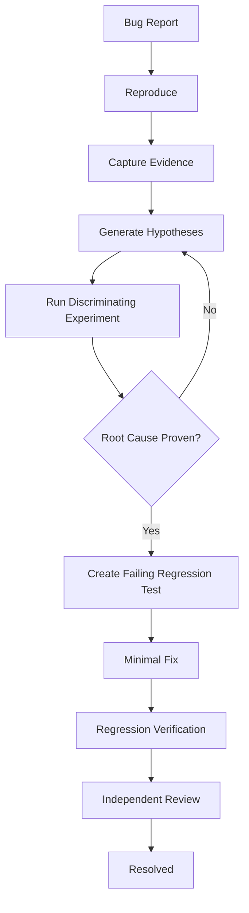
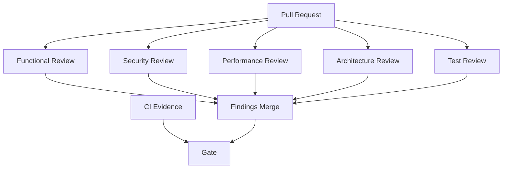
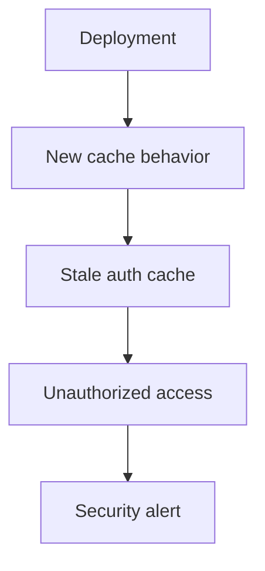
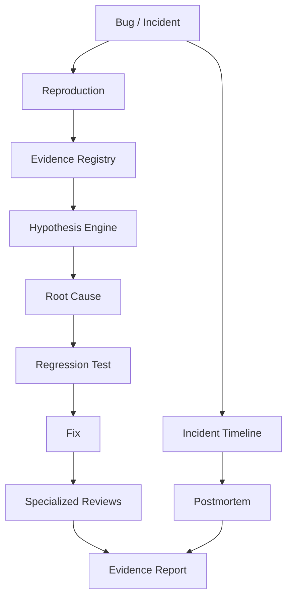
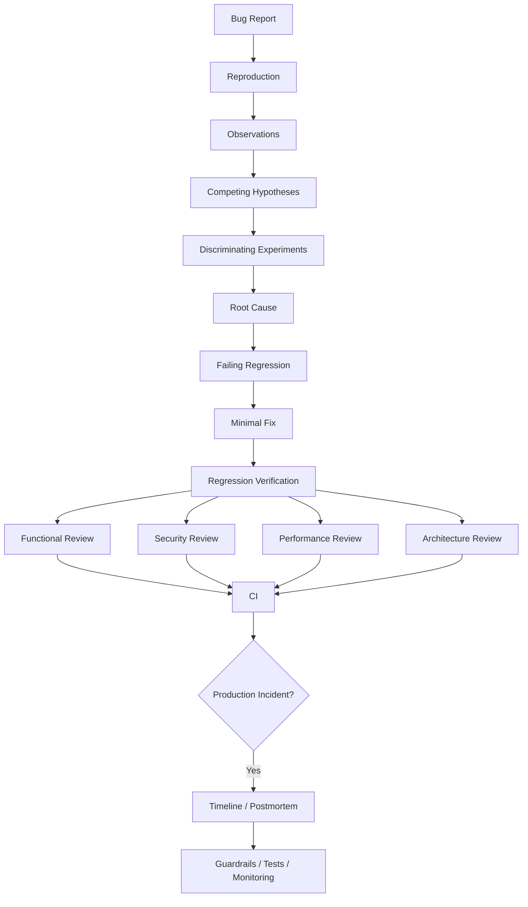

# Phase 11 — AI-Assisted Debugging & Code Review

> **Track:** AI-Powered Software Development / Agentic Software Engineering  
> **Prerequisites:**  
> - Phase 1 — Generative AI for Software Engineers  
> - Phase 2 — Prompt Engineering for Software Development  
> - Phase 3 — Context Engineering  
> - Phase 4 — Agentic AI Fundamentals  
> - Phase 5 — AI Coding Agent Mastery  
> - Phase 6 — Spec-Driven Development  
> - Phase 7 — Agent-Friendly Repository Engineering  
> - Phase 8 — AI-Assisted Software Architecture  
> - Phase 9 — AI-Driven Implementation  
> - Phase 10 — AI Testing & Verification  
>
> **Phase goal:** Use AI agents to reproduce failures, reason from evidence, isolate root causes, review changes from multiple risk perspectives, automate high-value PR review, and investigate production incidents without allowing the agent to substitute guesses for observed facts.

---

# Table of Contents

1. [How to Study This Phase](#how-to-study-this-phase)
2. [Learning Objectives](#learning-objectives)
3. [The Core Debugging Principle](#the-core-debugging-principle)
4. [The Ideal Debugging Loop](#the-ideal-debugging-loop)
5. [Debugging as Hypothesis Testing](#debugging-as-hypothesis-testing)
6. [Evidence Hierarchy for Debugging](#evidence-hierarchy-for-debugging)
7. [Module 111 — Bug Reproduction with Agents](#module-111--bug-reproduction-with-agents)
8. [Module 112 — Root-Cause Analysis](#module-112--root-cause-analysis)
9. [Module 113 — Log Analysis](#module-113--log-analysis)
10. [Module 114 — Stack-Trace Analysis](#module-114--stack-trace-analysis)
11. [Module 115 — Regression Detection](#module-115--regression-detection)
12. [Module 116 — AI Code Review](#module-116--ai-code-review)
13. [Module 117 — Security Code Review](#module-117--security-code-review)
14. [Module 118 — Performance Review](#module-118--performance-review)
15. [Module 119 — Architecture Review](#module-119--architecture-review)
16. [Module 120 — PR Review Automation](#module-120--pr-review-automation)
17. [Module 121 — Agent-Assisted Incident Investigation](#module-121--agent-assisted-incident-investigation)
18. [Reproduction Harnesses](#reproduction-harnesses)
19. [Hypothesis Management](#hypothesis-management)
20. [Binary Search and Fault Localization](#binary-search-and-fault-localization)
21. [Observability Correlation](#observability-correlation)
22. [Distributed-System Debugging](#distributed-system-debugging)
23. [Race Conditions and Concurrency Bugs](#race-conditions-and-concurrency-bugs)
24. [Data and State Debugging](#data-and-state-debugging)
25. [Review Findings as Structured Evidence](#review-findings-as-structured-evidence)
26. [Review Calibration and False Positives](#review-calibration-and-false-positives)
27. [PR Risk Classification](#pr-risk-classification)
28. [Incident Timelines and Causal Analysis](#incident-timelines-and-causal-analysis)
29. [Postmortems and Learning Loops](#postmortems-and-learning-loops)
30. [Practical Python Examples](#practical-python-examples)
31. [Worked Case Studies](#worked-case-studies)
32. [Debugging and Review Anti-Patterns](#debugging-and-review-anti-patterns)
33. [Practical Labs](#practical-labs)
34. [Review Questions](#review-questions)
35. [Scenario Exercises](#scenario-exercises)
36. [Phase Project — TraceForge](#phase-project--traceforge)
37. [Phase 11 Completion Checklist](#phase-11-completion-checklist)
38. [Where This Leads Next](#where-this-leads-next)
39. [Reference Baseline](#reference-baseline)

---

# How to Study This Phase

The previous phase established:

```text
Agent claim
≠
Evidence
```

Phase 11 applies the same principle when something goes wrong.

A weak debugging workflow is:

```text
Bug report
   ↓
Agent guesses likely cause
   ↓
Agent changes code
   ↓
Tests happen to pass
   ↓
"Fixed"
```

That workflow is dangerous because the agent may:

```text
fix a symptom
change unrelated code
mask the failure
introduce another regression
```

The stronger workflow is:

```text
Bug Report
   ↓
Reproduce
   ↓
Capture Evidence
   ↓
Generate Hypotheses
   ↓
Discriminate Between Hypotheses
   ↓
Find Root Cause
   ↓
Create Failing Regression Test
   ↓
Apply Minimal Fix
   ↓
Run Regression Tests
   ↓
Independent Review
   ↓
Verify
```

The goal is not merely:

```text
make the error disappear
```

The goal is:

```text
understand why the system violated expected behavior
and change the system so the failure class is prevented or detected
```

---

# Learning Objectives

By the end of this phase, you should be able to:

1. Turn vague bug reports into reproducible failure cases.
2. Separate symptom from cause.
3. Preserve evidence before changing code.
4. Reproduce bugs in isolated workspaces.
5. Build minimal reproductions.
6. Record:
   - input,
   - environment,
   - expected result,
   - actual result.
7. Use AI to generate debugging hypotheses without treating them as facts.
8. Rank hypotheses by likelihood and discriminating power.
9. Design experiments that eliminate hypotheses.
10. Avoid confirmation bias during debugging.
11. Distinguish correlation from causation.
12. Read structured logs effectively.
13. Correlate logs using request/trace/span identifiers.
14. Analyze chronological vs causal order.
15. Read Python and framework stack traces.
16. Identify the first relevant application frame.
17. Distinguish root exception from wrapper exception.
18. Understand exception chaining.
19. Detect regressions with tests and version control.
20. Use `git bisect` conceptually.
21. Compare known-good and known-bad states.
22. Review code for functionality, design, complexity, tests, and documentation.
23. Make evidence-backed code review findings.
24. Avoid speculative review noise.
25. Assign severity to findings.
26. Perform diff-based security review.
27. Trace untrusted data from source to sink.
28. Review authentication and authorization changes.
29. Review business-logic security.
30. Review cryptographic and secret-handling code carefully.
31. Perform performance-oriented review.
32. Identify N+1 queries and unbounded loops.
33. Review allocation, network, DB, cache, and concurrency behavior.
34. Perform architecture review against ADRs and dependency rules.
35. Detect architecture drift.
36. Automate PR review without creating comment spam.
37. Use specialized reviewer agents.
38. Separate tester, reviewer, and fixer roles.
39. Build structured review output.
40. Use confidence and evidence fields appropriately.
41. Investigate incidents with timelines.
42. Distinguish mitigation from root-cause correction.
43. Preserve incident evidence.
44. Use logs, metrics, and traces together.
45. Build causal incident hypotheses.
46. Write useful postmortems.
47. Create follow-up prevention work.
48. Turn incidents into tests, guardrails, and observability improvements.
49. Build a debugging/review orchestration tool.
50. Be ready for tool-using agents and MCP.

---

# The Core Debugging Principle

Memorize:

> **Do not modify the system until you have enough evidence to state what is failing and how you will know the modification fixes it.**

This does not mean every bug needs hours of analysis.

A simple bug may take:

```text
2 minutes to reproduce
1 minute to inspect
3 minutes to fix
```

The discipline still applies.

---

# The Ideal Debugging Loop



---

# Debugging as Hypothesis Testing

Debugging is scientific reasoning applied to software.

You observe:

```text
Expected:
401 Unauthorized

Actual:
500 Internal Server Error
```

Possible hypotheses:

```text
H1:
Token validation throws unhandled expiration error.

H2:
Database session lookup fails.

H3:
Global exception handler converts auth failure to 500.

H4:
Proxy rewrites upstream response.
```

You should not immediately choose H1 because it “sounds right.”

Design observations that distinguish them.

---

# Example Discriminating Evidence

If stack trace shows:

```text
ExpiredSignatureError
→ auth dependency
→ unhandled
```

H1 becomes strongly supported.

If application logs show:

```text
auth completed successfully
DB lookup raised timeout
```

H2 becomes stronger.

The key principle:

```text
Hypothesis
↓
Prediction
↓
Observation
↓
Update belief
```

---

# Evidence Hierarchy for Debugging

Weak:

```text
"This library often causes bugs."
```

Stronger:

```text
"Logs show failure immediately after library call."
```

Stronger:

```text
"Minimal reproduction fails in the library call with the same exception."
```

Stronger:

```text
"Changing only this condition removes the failure, and regression test fails again when change is reverted."
```

Use the strongest evidence practical.

---

# Module 111 — Bug Reproduction with Agents

# 111.1 Why Reproduction Comes First

If you cannot reproduce a reported bug:

```text
you cannot confidently know whether a change fixed it
```

You may still mitigate production incidents before reproduction, but the debugging process should seek a reproducible signal.

---

# 111.2 Reproduction Record

Capture:

```text
environment
commit/version
input
preconditions
steps
expected
actual
frequency
```

---

# 111.3 Example

```markdown
## Bug
Expired access token returns 500.

## Environment
Commit: abc123
Python: 3.12
API: local isolated worktree

## Steps
1. Create token with expiration in past.
2. Call GET /projects.
3. Observe response.

## Expected
401 with AUTH_EXPIRED.

## Actual
500.
```

---

# 111.4 Deterministic Reproduction

Best case:

```text
same steps
→ same failure
```

every time.

---

# 111.5 Intermittent Bug

Record frequency:

```text
3 failures / 100 runs
```

Then investigate:

```text
race
timing
resource pressure
external dependency
```

---

# 111.6 Minimal Reproduction

Reduce the failing system.

From:

```text
browser
→ API
→ worker
→ DB
→ provider
```

to possibly:

```text
one auth function
```

if same failure occurs.

---

# 111.7 Why Minimal Reproduction Helps

It reduces competing causes.

---

# 111.8 Reproduction Before Code Reading

Sometimes useful to reproduce before deeply reading implementation.

This reduces anchoring.

---

# 111.9 Environment Mismatch

Bug only in:

```text
production
Windows
ARM
specific browser
large dataset
```

Reproduction must preserve relevant environment dimensions.

---

# 111.10 Agent Workspace Isolation

An agent-friendly repository should let the agent:

```text
boot app
seed state
run target request
collect logs
```

without altering shared environments.

---

# 111.11 UI Bug Reproduction

Useful evidence:

```text
video
screenshot
DOM snapshot
console
network trace
```

---

# 111.12 Reproduction Failure

If bug cannot be reproduced, do not silently claim it is fixed.

Report:

```text
not reproduced
evidence inspected
possible causes
instrumentation needed
```

---

# Module 112 — Root-Cause Analysis

# 112.1 Symptom vs Root Cause

Symptom:

```text
checkout returns 500
```

Proximate error:

```text
NoneType access
```

Root cause:

```text
inventory service can legally return missing SKU,
but checkout path assumes result always exists
```

---

# 112.2 Root Cause Is Usually a System Explanation

Avoid shallow:

```text
"developer forgot null check"
```

Stronger:

```text
API contract permits missing SKU,
service type did not represent absence,
and tests lacked missing-SKU case.
```

Now prevention can target system weaknesses.

---

# 112.3 Five Whys

Useful only when it leads to real causal structure.

Do not force exactly five questions.

---

# 112.4 Causal Chain

Example:

```text
New cache TTL
→ stale authorization record
→ disabled user treated as active
→ privileged request accepted
```

---

# 112.5 Contributing Factors

Incidents often have multiple causes.

Example:

```text
code bug
+
missing test
+
weak alert
+
unsafe rollout
```

---

# 112.6 Root-Cause Proof

A plausible explanation is not enough.

Evidence should show:

```text
cause present during failure
cause predicts failure
removing/fixing cause removes failure
regression test encodes behavior
```

---

# 112.7 Counterfactual

Ask:

```text
If this suspected cause were absent,
would the incident still occur?
```

This is useful causal reasoning.

---

# 112.8 Hypothesis Table

| Hypothesis | Evidence For | Evidence Against | Next Test |
|---|---|---|---|
| Token expiry unhandled | stack trace | — | unit repro |
| DB timeout | none | DB logs normal | deprioritize |
| Proxy rewrite | external 500 | app logs also 500 | unlikely |

---

# 112.9 Stop Random Edits

If an attempted fix does not change predicted evidence:

```text
revisit hypothesis
```

Do not layer unrelated patches.

---

# 112.10 Root-Cause Output

A good debugging report contains:

```text
symptom
trigger
root cause
contributing factors
evidence
fix
prevention
```

---

# Module 113 — Log Analysis

# 113.1 Logs Are Event Evidence

A useful log records a meaningful event.

Bad:

```text
"error happened"
```

Better:

```json
{
  "event": "project.archive.failed",
  "project_id": "p-123",
  "reason": "active_deployment",
  "request_id": "r-456"
}
```

---

# 113.2 Structured Logs

Structured fields allow:

```text
filter
group
correlate
```

---

# 113.3 Request Correlation

Include:

```text
request_id
trace_id
span_id
```

where applicable.

OpenTelemetry supports correlation through trace/span context.

---

# 113.4 Time Is Necessary but Not Sufficient

Two log lines close in time are not necessarily causally related.

Prefer correlation IDs.

---

# 113.5 Search Strategy

Start narrow:

```text
request_id
trace_id
entity_id
error code
```

Then widen.

---

# 113.6 Example Query Thinking

Find:

```text
all logs for request r-456
```

Then:

```text
all failures for AUTH_EXPIRED in last hour
```

Then:

```text
distribution by app version
```

---

# 113.7 Logging Levels

Common:

```text
DEBUG
INFO
WARNING
ERROR
CRITICAL
```

Do not treat level alone as severity of business impact.

---

# 113.8 Sensitive Data

Never improve debugging by logging:

```text
passwords
tokens
raw card data
unnecessary PII
```

---

# 113.9 Missing Logs

Sometimes debugging reveals observability gap.

Add:

```text
structured event
correlation field
metric
trace span
```

as prevention.

---

# 113.10 Log Volume

Too much logging can hide signal and increase cost.

Log meaningful events.

---

# 113.11 Agent Log Analysis

An agent can:

```text
group repeating errors
correlate request IDs
compare versions
summarize timeline
```

but should cite exact evidence in its internal report.

---

# Module 114 — Stack-Trace Analysis

# 114.1 Stack Trace Is Execution Path Evidence

A stack trace shows frames involved when exception propagated.

Do not read only the final line.

---

# 114.2 Start at Exception Type

Example:

```text
KeyError: 'organization_id'
```

Then inspect frames.

---

# 114.3 Application Frames vs Framework Frames

A trace may contain:

```text
uvicorn
starlette
fastapi
middleware
your service
repository
```

Identify first relevant application frame.

---

# 114.4 Root Exception vs Wrapper

Example:

```text
DatabaseError
caused by
UniqueViolation
```

The wrapper may be less specific.

---

# 114.5 Python Exception Chaining

Python can show:

```text
The above exception was the direct cause...
```

Follow chain.

---

# 114.6 Async Stack Traces

Async frameworks may produce long traces.

Still identify:

```text
request entry
dependency/middleware
application call
failing operation
```

---

# 114.7 Stack Trace Does Not Prove Root Cause

It proves:

```text
where exception propagated
```

The causal trigger may be earlier state.

---

# 114.8 Local Variables

Debugger/trace tooling can reveal state.

Be careful with secrets.

---

# 114.9 Repeated Stack Signature

Group errors by:

```text
exception type
top application frame
message pattern
```

for incident clustering.

---

# 114.10 Stack-Trace Review Prompt

Ask:

```text
Identify:
1. exception type
2. deepest relevant app frame
3. input/state assumptions
4. likely upstream cause
5. next observation needed
```

---

# Module 115 — Regression Detection

# 115.1 What Is a Regression?

Behavior that previously worked now fails due to a change.

---

# 115.2 Known-Good vs Known-Bad

Need two states:

```text
good commit/version
bad commit/version
```

---

# 115.3 Git Bisect Concept

Binary search commits.

If 128 commits:

```text
~7 tests
```

can narrow culprit.

---

# 115.4 Bisect Requires Deterministic Test

Command must return:

```text
good
bad
```

reliably.

Flaky tests destroy bisect usefulness.

---

# 115.5 Regression Test

Once culprit understood:

```text
add permanent test
```

at appropriate layer.

---

# 115.6 Performance Regression

Compare:

```text
baseline P95
new P95
```

under stable workload.

---

# 115.7 Contract Regression

Detect:

```text
OpenAPI breaking change
event schema change
```

---

# 115.8 Security Regression

Example:

```text
new endpoint bypasses tenant filter
```

Needs security regression case.

---

# 115.9 Visual Regression

Screenshot differences can detect UI changes.

Review intentional vs accidental.

---

# 115.10 Regression Window

Incident may correlate with:

```text
deployment
config
feature flag
dependency
data migration
```

not only source commit.

---

# Module 116 — AI Code Review

# 116.1 Code Review Is Not Re-Implementation

Reviewer should not rewrite author’s solution based on taste.

Review asks:

```text
Does this change improve or preserve system health?
```

---

# 116.2 Review Inputs

```text
PR description
spec/task
diff
tests
architecture docs
relevant context
```

---

# 116.3 Review Order

A strong order:

```text
1. Does the change make sense?
2. What is the main behavior/design?
3. What risks changed?
4. Inspect critical files.
5. Inspect tests.
6. Inspect supporting files/docs.
```

---

# 116.4 Review Dimensions

```text
correctness
design
complexity
readability
maintainability
tests
documentation
security
performance
architecture
scope
```

---

# 116.5 Finding Quality

Bad:

```text
"This could be cleaner."
```

Good:

```text
HIGH — app/api/projects.py:74

The route fetches ProjectRepository directly, bypassing
ProjectService authorization. A cross-tenant caller can reach
persistence before tenant policy executes.

Evidence:
ProjectService.archive() contains the tenant check, but this route
does not call it.

Fix:
Route through ProjectService.
```

---

# 116.6 Severity

Example:

```text
CRITICAL
HIGH
MEDIUM
LOW
NIT
```

Use project policy.

---

# 116.7 Evidence

Every blocking finding should answer:

```text
What can go wrong?
Where?
Under what condition?
Why does the diff cause it?
```

---

# 116.8 Counterfactual Test

Ask:

```text
If the code stayed as written, can I describe a concrete failing input/state?
```

This reduces speculative reviews.

---

# 116.9 Review Tests Separately

Agents can hide errors in tests.

Inspect:

```text
weakened assertions
skips
mocking
```

---

# 116.10 Scope Review

Check:

```text
unrequested code
unrelated refactor
new dependency
```

---

# 116.11 Review Calibration

Do not block for style that formatter enforces.

Do not produce hundreds of low-value comments.

---

# 116.12 AI Review Strength

Agents are good at broad scanning.

Use specialized passes rather than one generic prompt.

---

# Module 117 — Security Code Review

# 117.1 Security Review Has a Different Objective

Functional review asks:

```text
Does it work?
```

Security review asks:

```text
How can an attacker or unauthorized actor misuse this?
```

---

# 117.2 Diff-Based Security Review

For PR:

```text
identify changed trust boundaries
changed auth
changed parsing
new integrations
new data flows
```

---

# 117.3 Sources and Sinks

Trace:

```text
Source:
user input

Processing:
validation/transformation

Sink:
DB
shell
HTML
filesystem
external API
log
```

---

# 117.4 Authentication Review

Check:

```text
credential validation
expiration
issuer/audience
session handling
```

---

# 117.5 Authorization Review

Check:

```text
object ownership
tenant
role
state
```

---

# 117.6 Business Logic

Examples:

```text
refund twice
bypass approval
negative quantity
reuse coupon
```

Automated scanners may miss these.

---

# 117.7 Injection

Review:

```text
SQL
shell
template
path
```

based on sinks.

---

# 117.8 Cryptography

Do not invent crypto.

Review:

```text
algorithm
key handling
nonce/IV
library usage
```

against authoritative guidance.

---

# 117.9 Logging

Check sensitive data leakage.

---

# 117.10 File Operations

Check:

```text
path traversal
filename trust
permissions
```

---

# 117.11 SSRF / External Requests

If user controls URL/host:

```text
network boundary risk
```

---

# 117.12 Dependency Addition

Review:

```text
need
maintenance
security posture
permissions
```

---

# 117.13 Secure Review Output

Findings should include:

```text
attack precondition
impact
code location
evidence
recommended control
```

---

# Module 118 — Performance Review

# 118.1 Performance Review Is Evidence-Driven

Do not label:

```text
"This is slow."
```

without mechanism or measurement.

---

# 118.2 Complexity

Check obvious:

```text
O(n²)
unbounded nested loops
```

when data can grow.

---

# 118.3 N+1 Queries

Pattern:

```python
for project in projects:
    owner = repository.get_owner(project.owner_id)
```

May cause:

```text
1 + N queries
```

---

# 118.4 Unbounded Reads

Danger:

```text
SELECT all rows
```

for growing table.

Require:

```text
pagination
limit
streaming
```

where needed.

---

# 118.5 Memory

Check:

```text
loading large file entirely
copying large buffers
large in-memory collections
```

---

# 118.6 Network Fan-Out

A loop making remote request per item can multiply latency.

---

# 118.7 Serialization

Large responses can dominate latency/CPU.

---

# 118.8 Cache Review

Check:

```text
key correctness
staleness
tenant scope
invalidations
```

---

# 118.9 Async Review

Look for:

```text
blocking I/O inside async
unbounded task creation
missing cancellation
```

---

# 118.10 Locking

Check lock scope and contention.

---

# 118.11 Performance Evidence

Possible:

```text
benchmark
query plan
trace
profile
```

Use measurement for blocking performance findings when possible.

---

# Module 119 — Architecture Review

# 119.1 Architecture Review Checks Structural Intent

Inputs:

```text
ADR
C4
dependency rules
spec
diff
```

---

# 119.2 Questions

```text
Does responsibility live in correct module?
Does dependency direction remain valid?
Did the change create hidden coupling?
Did it change state ownership?
Did it add a new architectural decision?
```

---

# 119.3 Architecture Drift

Example:

```text
API now calls DB directly
```

despite:

```text
API → Service → Repository
```

---

# 119.4 New Cross-Domain Dependency

Review whether:

```text
billing imports project internals
```

violates domain ownership.

---

# 119.5 State Ownership

New Redis cache may introduce new source of truth accidentally.

---

# 119.6 Public Contract

New event/API may be architecture-significant.

Require ADR/spec update if durable.

---

# 119.7 Operational Architecture

Review:

```text
new service
queue
cron
external dependency
```

and its observability/recovery.

---

# 119.8 Simplification Review

Ask:

```text
Can same requirement be satisfied with less architecture?
```

---

# Module 120 — PR Review Automation

# 120.1 Why Automate Review?

Agent throughput can exceed human review capacity.

Automation can pre-screen:

```text
correctness
security
performance
architecture
tests
docs
```

---

# 120.2 Specialized Review Agents

Instead of one generic reviewer:

```text
Functional Reviewer
Security Reviewer
Performance Reviewer
Architecture Reviewer
Test Reviewer
```

---

# 120.3 Review Orchestration



---

# 120.4 Deduplication

Multiple reviewers may flag same issue.

Merge by:

```text
file
line
failure mechanism
```

---

# 120.5 Evidence Threshold

Do not publish speculative low-confidence comments automatically.

---

# 120.6 Structured Finding

```json
{
  "severity": "high",
  "category": "authorization",
  "file": "app/projects/api.py",
  "line": 74,
  "claim": "Cross-tenant archive is possible",
  "evidence": "Route bypasses ProjectService tenant check",
  "suggestion": "Call ProjectService.archive()"
}
```

---

# 120.7 Blocking vs Advisory

Not every finding blocks.

Policy:

```text
CRITICAL/HIGH
→ block

MEDIUM
→ review

LOW/NIT
→ advisory
```

Example only.

---

# 120.8 PR Description Quality

Automation benefits from:

```text
what changed
why
test evidence
risk
migration
```

---

# 120.9 Review Feedback Loop

Developer agent:

```text
reads findings
→ fixes
→ reruns tests
→ pushes
```

Reviewers rerun.

---

# 120.10 Infinite Review Loop

Set stop criteria.

If reviewer disagreement persists:

```text
human decision
```

---

# 120.11 Review Latency

Fast feedback is important.

Run cheap deterministic checks before expensive agent reviews where possible.

---

# Module 121 — Agent-Assisted Incident Investigation

# 121.1 Incident vs Bug

Bug:

```text
software defect
```

Incident:

```text
user/business impact requiring response
```

An incident may arise from:

```text
bug
config
capacity
dependency
operator action
data
security
```

---

# 121.2 First Objective: Mitigate Impact

During incident:

```text
restore service
```

may be more urgent than root-cause fix.

Examples:

```text
rollback
disable feature
fail over
rate limit
```

---

# 121.3 Preserve Evidence

Before destructive changes when possible:

```text
timestamps
deploy version
feature flags
metrics
traces
logs
```

---

# 121.4 Incident Timeline

Example:

```text
10:02 deploy
10:05 error rate rises
10:07 alert
10:10 feature disabled
10:12 errors recover
```

---

# 121.5 Timeline vs Causality

Sequence does not prove cause.

But timeline narrows investigation.

---

# 121.6 Agent Role During Incident

Agent can:

```text
query telemetry
summarize changes
build timeline
compare versions
cluster errors
propose hypotheses
```

Human/operator remains responsible for risky production actions.

---

# 121.7 Mitigation Record

Record:

```text
what action
who/agent
when
result
```

---

# 121.8 Root Cause After Stabilization

Once impact controlled:

```text
reproduce
analyze
test
fix
```

---

# 121.9 Incident State Document

Maintain live:

```text
impact
status
timeline
hypotheses
actions
owners
```

---

# 121.10 Postmortem

A useful postmortem includes:

```text
summary
impact
timeline
root causes
contributing factors
detection
response
what went well
what failed
follow-up actions
```

---

# 121.11 Learning, Not Blame

Focus on:

```text
system conditions
```

that allowed failure.

---

# 121.12 Follow-Up Actions

Strong actions:

```text
test
guardrail
alert
runbook
architecture change
```

Weak:

```text
"be more careful"
```

---

# Reproduction Harnesses

# 122.1 Why Build Harnesses?

Repeated bug class should be easy to reproduce.

Examples:

```text
API replay script
browser scenario
load reproducer
migration fixture
```

---

# 122.2 Example CLI

```bash
python scripts/reproduce_expired_token.py
```

Output:

```text
Expected: 401
Actual: 500
Reproduced: YES
```

---

# 122.3 Harness Safety

Must not point to production by default.

---

# Hypothesis Management

# 123.1 Hypothesis Object

Store:

```text
claim
prediction
evidence
status
next experiment
```

---

# 123.2 Status

```text
open
supported
rejected
confirmed
```

---

# 123.3 Rank by Information Gain

Prefer experiments that distinguish several hypotheses cheaply.

---

# Binary Search and Fault Localization

# 124.1 Reduce Search Space

Possible dimensions:

```text
commit
config
feature flag
input
service
layer
```

---

# 124.2 Git Bisect

Use deterministic repro command.

---

# 124.3 Configuration Bisect

Toggle one dimension at a time.

---

# 124.4 Input Minimization

Reduce payload until failure disappears.

Then restore minimal trigger.

---

# Observability Correlation

# 125.1 Three Core Signals

```text
logs
metrics
traces
```

Each answers different questions.

---

# 125.2 Metrics

Tell:

```text
how much
how often
when
```

---

# 125.3 Traces

Tell:

```text
where request spent time
which components participated
```

---

# 125.4 Logs

Tell:

```text
detailed events/state
```

---

# 125.5 Correlate

Use:

```text
trace_id
span_id
request_id
resource/service
```

---

# Distributed-System Debugging

# 126.1 Partial Failure

Distributed request can be:

```text
API success
worker failure
event delayed
```

Avoid single-service thinking.

---

# 126.2 Unknown Outcome

Timeout does not mean operation failed.

Check idempotency/status.

---

# 126.3 Clock Skew

Timestamps across hosts can differ.

Trace context is often more reliable for causal path than raw time alone.

---

# 126.4 Retry Noise

One user request may generate many error logs due to retries.

Group by request/operation identity.

---

# 126.5 Duplicate Delivery

Inspect:

```text
message ID
consumer dedup state
```

---

# Race Conditions and Concurrency Bugs

# 127.1 Why Hard

They depend on interleaving.

---

# 127.2 Reproduction

Use:

```text
barriers
controlled delays
many iterations
```

---

# 127.3 Example Lost Update

Two concurrent updates based on same version.

---

# 127.4 Fixes

Possible:

```text
optimistic locking
transaction
mutex
atomic DB operation
```

Architecture-dependent.

---

# Data and State Debugging

# 128.1 State Mismatch

Bug may come from corrupted/unexpected data rather than code path.

---

# 128.2 Inspect Invariants

Example:

```text
archived_at != null
but
status = active
```

---

# 128.3 Data Provenance

Ask:

```text
who wrote this state?
which version?
which migration?
```

---

# 128.4 Repair vs Prevent

Incident may need:

```text
data repair
+
code fix
+
constraint
```

---

# Review Findings as Structured Evidence

# 129.1 Finding Schema

Each finding:

```text
severity
category
location
claim
scenario
evidence
recommendation
```

---

# 129.2 Finding Without Scenario

```text
"Potential race condition."
```

is weak.

Better:

```text
Two workers can read status=OPEN before either writes CLOSED,
causing duplicate settlement.
```

---

# Review Calibration and False Positives

# 130.1 False Positive Cost

Too many weak findings lead teams/agents to ignore reviews.

---

# 130.2 Confidence

Use confidence internally/structurally.

But confidence is not a substitute for evidence.

---

# 130.3 Ask for Proof

Before blocking:

```text
Can reviewer show the execution path?
```

---

# PR Risk Classification

# 131.1 Low

```text
docs
format
internal rename
```

---

# 131.2 Medium

```text
business rule
endpoint
dependency
```

---

# 131.3 High

```text
auth
payments
destructive migration
concurrency
public contract
```

Use deeper review.

---

# Incident Timelines and Causal Analysis

# 132.1 Event Types

```text
deploy
config
alert
metric shift
operator action
recovery
```

---

# 132.2 Causal Graph



---

# Postmortems and Learning Loops

# 133.1 Incident Learning

A postmortem should change the system.

---

# 133.2 Prevention Types

```text
eliminate cause
reduce probability
reduce impact
improve detection
improve recovery
```

---

# 133.3 Action Quality

Bad:

```text
remind developers
```

Better:

```text
add authorization integration test
add static boundary rule
add audit alert
```

---

# Practical Python Examples

# 134.1 Bug Reproduction Record

```python
from pydantic import BaseModel


class BugReproduction(BaseModel):
    title: str
    commit: str
    environment: str
    steps: list[str]
    expected: str
    actual: str
    reproduced: bool
```

---

# 134.2 Hypothesis Model

```python
from typing import Literal


class DebugHypothesis(BaseModel):
    id: str
    claim: str
    prediction: str
    evidence_for: list[str] = []
    evidence_against: list[str] = []
    next_experiment: str | None = None
    status: Literal[
        "open",
        "supported",
        "rejected",
        "confirmed",
    ] = "open"
```

---

# 134.3 Review Finding

```python
class ReviewFinding(BaseModel):
    severity: Literal[
        "critical",
        "high",
        "medium",
        "low",
        "nit",
    ]
    category: str
    file: str
    line: int | None
    claim: str
    scenario: str
    evidence: str
    suggestion: str
```

---

# 134.4 Incident Event

```python
from datetime import datetime


class IncidentEvent(BaseModel):
    timestamp: datetime
    source: str
    event: str
    evidence: str
```

---

# 134.5 Timeline Sorting

```python
def build_timeline(
    events: list[IncidentEvent],
) -> list[IncidentEvent]:
    return sorted(
        events,
        key=lambda event: event.timestamp,
    )
```

---

# 134.6 Regression Window

```python
from dataclasses import dataclass


@dataclass(frozen=True)
class RevisionState:
    revision: str
    good: bool
```

---

# 134.7 Error Signature

```python
class ErrorSignature(BaseModel):
    exception_type: str
    application_frame: str
    normalized_message: str
```

---

# 134.8 Review Deduplication Key

```python
def finding_key(
    finding: ReviewFinding,
) -> tuple[str, str, int | None]:
    return (
        finding.category,
        finding.file,
        finding.line,
    )
```

---

# Worked Case Studies

# Case Study 1 — Expired JWT Returns 500

## Report

```text
Expired token returns 500.
```

## Reproduction

Confirmed locally.

## Stack

Shows expiration exception propagating out of auth dependency.

## Hypothesis

```text
Expiration error not mapped to authentication domain error.
```

## Test

```text
expired token
→ 401
```

fails.

## Fix

Map specific expiration condition.

## Regression

Auth suite passes.

## Review

Security reviewer checks:

```text
invalid signature
expired
wrong audience
```

No broad `except Exception`.

---

# Case Study 2 — Slow Project List

Report:

```text
Project page became slow after owner names were added.
```

Trace:

```text
GET /projects
→ 1 query projects
→ 120 owner lookups
```

Root cause:

```text
N+1 queries
```

Fix:

```text
batch/join owner data
```

Evidence:

```text
query count reduced
P95 benchmark improves
```

---

# Case Study 3 — Cross-Tenant PR Defect

PR adds direct repository access in API.

Functional tests pass.

Security reviewer identifies:

```text
service tenant policy bypass
```

Architecture reviewer independently flags:

```text
API → repository violation
```

One defect, two evidence paths.

---

# Case Study 4 — Regression Bisect

Feature worked in release A.

Fails in release B.

128 commits.

Deterministic reproducer enables binary search.

Culprit:

```text
changed timezone normalization
```

Regression test added.

---

# Case Study 5 — Incident After Feature Flag

Timeline:

```text
11:00 deploy
11:20 flag 100%
11:22 DB CPU rises
11:24 latency alert
11:27 flag off
11:29 recovery
```

Cause not merely “deployment.”

Investigation finds flag path generated unbounded query.

Mitigation:

```text
flag off
```

Root fix:

```text
pagination + index
```

Prevention:

```text
performance test + rollout metric
```

---

# Case Study 6 — Logging Gap

Incident cannot distinguish:

```text
provider timeout
vs
local cancellation
```

because logs lack trace IDs and duration.

Fix includes observability enhancement.

---

# Debugging and Review Anti-Patterns

# Anti-Pattern 1 — Guess Then Edit

# Anti-Pattern 2 — Change Before Reproduction

# Anti-Pattern 3 — Stack Trace = Root Cause

# Anti-Pattern 4 — Log Timing = Causality

# Anti-Pattern 5 — Fix Symptom Only

# Anti-Pattern 6 — Add Broad Exception Catch

# Anti-Pattern 7 — No Regression Test

# Anti-Pattern 8 — Generic AI Review Prompt Only

# Anti-Pattern 9 — Review Comment Without Scenario

# Anti-Pattern 10 — Security Review = Scanner Output

# Anti-Pattern 11 — Performance Claim Without Evidence

# Anti-Pattern 12 — Architecture Review Without ADR/Rules

# Anti-Pattern 13 — Hundreds of Low-Value Review Comments

# Anti-Pattern 14 — Reviewer Automatically Fixes Its Own Finding

# Anti-Pattern 15 — Incident Root-Cause Work Before Mitigation

# Anti-Pattern 16 — Blame-Oriented Postmortem

# Anti-Pattern 17 — "Be More Careful" Action Item

# Anti-Pattern 18 — Production Change Without Evidence Preservation

---

# Practical Labs

# Lab 1 — Reproduce Simple Bug

Record expected/actual.

# Lab 2 — Minimal Reproduction

Reduce full API bug to unit.

# Lab 3 — Intermittent Failure

Measure frequency.

# Lab 4 — UI Reproduction

Capture screenshot/network/console.

# Lab 5 — Hypothesis Table

Create 5 candidate causes.

# Lab 6 — Discriminating Experiment

Eliminate at least 3 hypotheses.

# Lab 7 — Root Cause vs Symptom

Classify examples.

# Lab 8 — Five Whys Carefully

Create causal chain without forcing blame.

# Lab 9 — Structured Logs

Add request ID.

# Lab 10 — Log Correlation

Follow one request across services.

# Lab 11 — Trace Correlation

Match log to span.

# Lab 12 — Log Redaction

Remove sensitive field.

# Lab 13 — Stack Trace Reading

Find first relevant app frame.

# Lab 14 — Exception Chain

Identify root exception.

# Lab 15 — Async Trace

Trace request through middleware.

# Lab 16 — Error Signature

Cluster 20 traces.

# Lab 17 — Git Bisect Simulation

Find bad commit.

# Lab 18 — Performance Regression

Compare baseline benchmark.

# Lab 19 — Contract Regression

Detect schema break.

# Lab 20 — Functional Code Review

Find concrete bug.

# Lab 21 — Test Review

Detect weakened assertion.

# Lab 22 — Scope Review

Find unrelated changes.

# Lab 23 — Security Diff Review

Trace source → sink.

# Lab 24 — Authorization Review

Find tenant bypass.

# Lab 25 — Business Logic Security

Find duplicate refund.

# Lab 26 — Sensitive Logging Review

Detect token logging.

# Lab 27 — Performance Review

Detect N+1.

# Lab 28 — Unbounded Query

Add pagination.

# Lab 29 — Async Performance Review

Detect blocking call.

# Lab 30 — Architecture Review

Find forbidden dependency.

# Lab 31 — State Ownership

Find accidental second source of truth.

# Lab 32 — Specialized Reviewer Agents

Run functional/security/performance separately.

# Lab 33 — Finding Schema

Return structured findings.

# Lab 34 — Finding Deduplication

Merge duplicates.

# Lab 35 — False Positive Review

Remove unsupported finding.

# Lab 36 — PR Risk Class

Classify 20 changes.

# Lab 37 — Automated PR Review

Create gate for high findings.

# Lab 38 — Review Loop

Developer fixes, reviewers rerun.

# Lab 39 — Incident Timeline

Build ordered events.

# Lab 40 — Mitigation vs Fix

Separate actions.

# Lab 41 — Production Evidence

Collect logs/metrics/traces.

# Lab 42 — Causal Graph

Model incident.

# Lab 43 — Postmortem

Write learning-oriented report.

# Lab 44 — Action Quality

Replace "be careful" with guardrail.

# Lab 45 — Race Reproduction

Force concurrent interleaving.

# Lab 46 — Data Invariant Debugging

Find invalid state.

# Lab 47 — Retry Noise

Group logs by request ID.

# Lab 48 — Distributed Timeout

Determine unknown outcome.

# Lab 49 — Independent Bug Reviewer

Fresh agent reviews fix.

# Lab 50 — Full Debugging Loop

Report → reproduce → root cause → test → fix → regression → review.

---

# Review Questions

1. Why must bugs be reproduced before confident fixes?
2. What belongs in a reproduction record?
3. What is a minimal reproduction?
4. Why record environment/version?
5. What is a debugging hypothesis?
6. What is a discriminating experiment?
7. Why is confirmation bias dangerous?
8. What is symptom vs root cause?
9. What are contributing factors?
10. How do you support a root-cause claim?
11. What is a counterfactual?
12. Why use hypothesis tables?
13. Why are structured logs valuable?
14. What is request correlation?
15. What is trace/log correlation?
16. Why does timestamp proximity not prove causality?
17. What should not be logged?
18. What is an application frame?
19. What is exception chaining?
20. Why doesn't a stack trace prove root cause?
21. What is a regression?
22. What is known-good vs known-bad?
23. How does binary search help regression localization?
24. Why must bisect tests be deterministic?
25. What is functional code review?
26. Why review overall design before line details?
27. What makes a review finding actionable?
28. Why include concrete failure scenarios?
29. What is review severity?
30. What is a counterfactual review test?
31. Why review tests separately?
32. What is review calibration?
33. What does security code review add beyond functional review?
34. What are sources and sinks?
35. How do you review authorization?
36. Why do business-logic vulnerabilities require contextual review?
37. Why be cautious reviewing cryptography?
38. What is an N+1 query?
39. What is unbounded work?
40. Why must performance findings be evidence-based?
41. What is architecture drift?
42. Why review state ownership?
43. Why use specialized review agents?
44. How do you deduplicate review findings?
45. Why should automation avoid speculative comment spam?
46. What is a blocking finding?
47. What is an incident?
48. Why is mitigation sometimes more urgent than root cause?
49. Why preserve incident evidence?
50. What belongs in an incident timeline?
51. Why doesn't timeline prove causality?
52. What can an agent do during an incident?
53. What is an incident state document?
54. What is a postmortem?
55. Why should postmortems avoid blame?
56. What makes a good follow-up action?
57. What is a reproduction harness?
58. What is fault localization?
59. What are logs/metrics/traces each good for?
60. What is a partial failure?
61. Why does timeout create unknown outcome?
62. How do retries complicate logs?
63. Why are race conditions difficult?
64. What is a data invariant?
65. What makes review evidence strong?
66. What is false-positive review cost?
67. What is PR risk classification?
68. How do incidents create new tests/guardrails?
69. How should an agent report an unreproduced bug?
70. What is the central lesson of Phase 11?

---

# Scenario Exercises

# Scenario 1 — Agent Guess

Bug report says checkout fails.

Agent changes payment code without reproducing.

What is wrong?

# Scenario 2 — Stack Trace

Trace ends in `KeyError`.

Is `KeyError` automatically root cause?

# Scenario 3 — Logs

Two events occurred within 20 ms.

Can you conclude causality?

# Scenario 4 — Review Finding

Agent says:

```text
"This may be insecure."
```

What evidence is missing?

# Scenario 5 — Security Review

New endpoint works but bypasses service layer.

What two review categories may flag it?

# Scenario 6 — Performance

Agent says loop is inefficient.

What data/mechanism should support blocking review?

# Scenario 7 — Incident

Feature flag caused error rate increase.

Should incident team investigate root cause before disabling flag?

# Scenario 8 — Regression

Bug is intermittent.

Can `git bisect` be trusted directly?

# Scenario 9 — Reviewer Noise

Five agents produce 80 comments.

How should orchestration improve?

# Scenario 10 — Postmortem

Action item:

```text
Developers should be more careful.
```

Rewrite it.

---

# Phase Project — TraceForge

# Project Goal

Build a Python debugging and review orchestration tool that models:

```text
bug
→ reproduction
→ evidence
→ hypotheses
→ root cause
→ regression
→ review
→ incident learning
```

The project is educational.

It is not intended to replace production observability platforms or security tooling.

---

# Project Structure

```text
traceforge/
├── README.md
├── pyproject.toml
├── incidents/
│   └── INC-001/
│       ├── report.yaml
│       ├── timeline.json
│       ├── hypotheses.json
│       └── postmortem.md
├── reviews/
│   └── PR-001/
├── src/
│   └── traceforge/
│       ├── __init__.py
│       ├── cli.py
│       ├── models.py
│       ├── reproduce.py
│       ├── hypotheses.py
│       ├── logs.py
│       ├── stacks.py
│       ├── regressions.py
│       ├── review.py
│       ├── security_review.py
│       ├── performance_review.py
│       ├── architecture_review.py
│       ├── incidents.py
│       └── report.py
└── tests/
    ├── test_hypotheses.py
    ├── test_timeline.py
    ├── test_review.py
    └── test_regressions.py
```

---

# Feature 1 — Reproduction Record

```yaml
title: Expired token returns 500
commit: abc123
expected: 401
actual: 500
reproduced: true
```

---

# Feature 2 — Evidence Registry

Store:

```text
log
stack
test
metric
trace
diff
```

with source.

---

# Feature 3 — Hypothesis Tracker

```text
open
supported
rejected
confirmed
```

---

# Feature 4 — Experiment Planner

For each hypothesis:

```text
prediction
next experiment
```

---

# Feature 5 — Stack Signature

Normalize error signatures for clustering.

---

# Feature 6 — Regression Window

Track known-good/known-bad revisions.

---

# Feature 7 — Review Finding Registry

Structured:

```text
severity
category
location
scenario
evidence
suggestion
```

---

# Feature 8 — Specialized Review Passes

```text
functional
security
performance
architecture
test
```

---

# Feature 9 — Finding Deduplication

Merge same failure mechanism.

---

# Feature 10 — PR Risk Profile

Input:

```text
changed paths
schema
auth
contracts
dependencies
```

Output:

```text
low
medium
high
```

---

# Feature 11 — Incident Timeline

Merge:

```text
deploys
alerts
operator actions
telemetry events
```

---

# Feature 12 — Hypothesis Timeline

Show when hypothesis created/rejected.

---

# Feature 13 — Postmortem Generator

Generate skeleton:

```text
impact
timeline
cause
contributing factors
mitigation
follow-ups
```

---

# Feature 14 — Action Quality

Flag weak actions like:

```text
be careful
watch closely
```

and encourage test/guardrail/monitor/runbook.

---

# Feature 15 — Final Debug Report

```markdown
# Debug Report

## Reproduction
## Evidence
## Hypotheses
## Root Cause
## Regression Test
## Fix
## Verification
## Review Findings
## Prevention
```

---

# TraceForge Architecture



---

# Suggested Development Order

## Stage 1

```text
models + reproduction
```

## Stage 2

```text
evidence + hypotheses
```

## Stage 3

```text
stack/log normalization
```

## Stage 4

```text
regression model
```

## Stage 5

```text
review findings + dedup
```

## Stage 6

```text
PR risk profile
```

## Stage 7

```text
incident timeline
```

## Stage 8

```text
postmortem + final report
```

---

# Phase 11 Completion Checklist

## Bug Reproduction

- [ ] I reproduce before modifying when practical.
- [ ] I record environment/version.
- [ ] I record expected/actual behavior.
- [ ] I can create minimal reproductions.
- [ ] I disclose when reproduction fails.

## Root-Cause Analysis

- [ ] I distinguish symptom from cause.
- [ ] I maintain explicit hypotheses.
- [ ] I design discriminating experiments.
- [ ] I avoid confirmation bias.
- [ ] I support root-cause claims with evidence.
- [ ] I identify contributing factors.

## Logs

- [ ] I use structured logs.
- [ ] I correlate by request/trace identity.
- [ ] I do not infer causality from time alone.
- [ ] I avoid sensitive data logging.
- [ ] I identify observability gaps.

## Stack Traces

- [ ] I identify exception type.
- [ ] I find relevant application frame.
- [ ] I follow chained exceptions.
- [ ] I do not equate trace location with root cause.
- [ ] I can cluster repeated signatures.

## Regression Detection

- [ ] I identify known-good/bad states.
- [ ] I can use binary-search localization.
- [ ] I require deterministic reproduction.
- [ ] I add regression evidence after fix.
- [ ] I consider config/deploy/data, not only commits.

## AI Code Review

- [ ] I review design before details.
- [ ] I review functionality/complexity/tests/docs.
- [ ] I make concrete evidence-backed findings.
- [ ] I use severity.
- [ ] I avoid speculative comment spam.
- [ ] I review test changes separately.
- [ ] I detect scope creep.

## Security Review

- [ ] I trace sources to sinks.
- [ ] I review authN/authZ.
- [ ] I review tenant/object boundaries.
- [ ] I review business logic abuse.
- [ ] I review logging/secrets.
- [ ] I treat scanner results as support, not complete review.

## Performance Review

- [ ] I identify N+1 queries.
- [ ] I identify unbounded work.
- [ ] I review memory/network/serialization.
- [ ] I review async/blocking behavior.
- [ ] I support blocking findings with mechanism/evidence.

## Architecture Review

- [ ] I check ADR/C4/dependency rules.
- [ ] I detect hidden coupling.
- [ ] I check state ownership.
- [ ] I identify new architecture decisions.
- [ ] I ask whether simpler design exists.

## PR Automation

- [ ] I use specialized reviewers.
- [ ] I deduplicate findings.
- [ ] I define blocking thresholds.
- [ ] I combine review with deterministic CI.
- [ ] I prevent endless review loops.
- [ ] I keep feedback latency low.

## Incident Investigation

- [ ] I prioritize mitigation during impact.
- [ ] I preserve evidence.
- [ ] I build timelines.
- [ ] I separate timeline from causality.
- [ ] I record actions/results.
- [ ] I investigate root cause after stabilization.
- [ ] I write learning-oriented postmortems.
- [ ] I create durable follow-ups.

## Project

- [ ] I can build TraceForge.
- [ ] I can track evidence/hypotheses.
- [ ] I can model review findings.
- [ ] I can create incident timelines.
- [ ] I can produce debugging/postmortem reports.

---

# Where This Leads Next

Phase 11 gives the agent disciplined capabilities for:

```text
observe
reproduce
investigate
review
learn from failure
```

The next phase is:

# Phase 12 — Tool-Using Agents & MCP

where agents gain standardized access to:

```text
tools
schemas
resources
MCP clients
MCP servers
authentication
tasks
custom developer tooling
```

The transition is important:

```text
Phase 11:
Use tools to understand software failures.

Phase 12:
Design and expose tools themselves as reliable agent interfaces.
```

---

# Final Mental Model

```text
Bug Report
      ↓
Reproduce
      ↓
Capture Logs / Traces / Stack / State
      ↓
Generate Competing Hypotheses
      ↓
Run Discriminating Experiments
      ↓
Prove Root Cause
      ↓
Create Failing Regression Test
      ↓
Apply Minimal Fix
      ↓
Regression Verification
      ↓
Functional Review
Security Review
Performance Review
Architecture Review
      ↓
Deterministic CI
      ↓
Resolved
      ↓
If Incident:
Postmortem
      ↓
Tests / Guardrails / Monitoring / Architecture Improvements
```

The deepest principle of Phase 11 is:

> **Debug from observations toward causes, not from model intuition toward random edits.**

And for review:

> **A review finding is valuable only when it describes a concrete failure mechanism supported by evidence.**

And for incidents:

> **Restore service first when necessary, then turn the incident into durable engineering knowledge.**

---

# Reference Baseline

This phase was reviewed against current and authoritative engineering guidance available in August 2026.

## OpenAI — Harness Engineering

OpenAI's 2026 agent-first engineering write-up describes agents reproducing bugs, driving applications directly, inspecting logs/metrics/traces, validating fixes, opening PRs, and participating in agent-to-agent review loops.

It also emphasizes making runtime state legible to agents and turning repeated failures into missing tools, guardrails, or documentation rather than simply asking the model to "try harder."

Reference:
`Harness engineering: leveraging Codex in an agent-first world` — OpenAI, February 11, 2026.

## OpenTelemetry — Log Correlation

OpenTelemetry's logging specification describes correlation across:

```text
time
trace/span execution context
resource/service context
```

and supports attaching trace and span identifiers to logs so logs can be navigated together with distributed traces.

Reference:
OpenTelemetry Logs specification.

## OWASP — Secure Code Review

OWASP's current Secure Code Review Cheat Sheet treats manual review as complementary to automated SAST/DAST and emphasizes architecture, entry points, authentication, authorization, data flow, business logic, cryptography, error handling, and deployment/configuration.

It distinguishes baseline code review from diff-based PR review.

Reference:
OWASP Secure Code Review Cheat Sheet.

## Google Engineering Practices — Code Review

Google's public engineering practices recommend reviewing:

```text
design
functionality
complexity
tests
names
comments
documentation
consistency
```

and emphasize reviewing the overall design/main parts of a change before getting lost in line-level details.

References:
Google Engineering Practices — Code Review.

## Google SRE — Effective Troubleshooting and Postmortems

Google SRE describes troubleshooting as a learnable structured process rather than ad hoc trial and error.

Its postmortem guidance treats incident review as a written record of impact, mitigation, causes, and follow-up actions so failures become organizational learning instead of recurring indefinitely.

References:
- Google SRE — Effective Troubleshooting
- Google SRE — Postmortem Culture

---

# Stable Principles to Retain

Tools and models will continue to change.

The durable debugging and review principles are:

```text
reproduce before guessing
preserve evidence before editing
treat hypotheses as hypotheses
use experiments to eliminate causes
separate symptom from root cause
correlate telemetry using identity/context
read stack traces as evidence, not final diagnosis
turn bugs into regression tests
review design before line details
require concrete failure scenarios for blocking findings
perform security review separately from ordinary functional review
measure performance rather than speculate
review architectural boundaries against explicit rules
use specialized review agents rather than one generic reviewer
deduplicate and calibrate automated findings
mitigate incident impact before deep root-cause work when necessary
build incident timelines but do not confuse sequence with causation
write postmortems that improve systems rather than blame people
turn incidents into tests, guardrails, observability, and architecture improvements
```


---

# Deep Expansion — Debugging as Evidence-Driven Search

The main chapter defines the workflow.

This expansion goes deeper into the reasoning mechanics that make debugging agents reliable.

The key idea is:

```text
Debugging
=
Search over possible causes
guided by observations
```

A weak agent searches by editing.

A strong agent searches by **experiments**.

---

# A. The Debugging Search Space

Suppose a request fails.

Possible dimensions include:

```text
input
state
configuration
environment
version
dependency
network
database
cache
concurrency
timing
permissions
```

The total search space can be enormous.

Good debugging reduces it systematically.

---

# A.1 Search-Space Reduction

Start with facts:

```text
Only production?
Only one tenant?
Only files > 20 MB?
Only after deployment X?
Only under concurrency?
```

Each fact eliminates many hypotheses.

---

# A.2 High-Information Questions

Compare:

```text
"Could Redis be broken?"
```

with:

```text
"Does failure reproduce with cache disabled while keeping all other state constant?"
```

The second is testable and discriminating.

---

# B. Observations vs Interpretations

Separate:

```text
Observation:
DB query took 3.2 seconds.

Interpretation:
DB is overloaded.
```

The interpretation may be wrong.

Maybe:

```text
lock wait
network delay
bad query
```

Record facts separately.

---

# B.1 Debugging Notebook

A useful investigation record:

```markdown
## Observations
O1. P95 increased at 11:22.
O2. DB CPU stayed below 30%.
O3. Trace shows 2.8s in lock wait.

## Hypotheses
H1. DB CPU saturation.
H2. Lock contention.
```

O2 weakens H1.

O3 strongly supports H2.

---

# C. Bayesian Intuition for Debugging

You do not need formal Bayesian mathematics.

Use the concept:

```text
prior belief
+
new evidence
→
updated belief
```

Do not lock onto first hypothesis.

---

# C.1 Example

Initial:

```text
H1 bad deployment: likely
H2 provider outage: possible
```

Evidence:

```text
rollback does not fix issue
```

Update:

```text
H1 becomes much less likely.
```

---

# D. Debugging Experiment Design

A debugging experiment should change one meaningful variable when possible.

---

# D.1 Controlled Comparison

Known good:

```text
Python 3.11
```

Bad:

```text
Python 3.12
```

Hold:

```text
same code
same DB
same request
```

Now runtime difference matters.

---

# D.2 A/B Reproduction

Run:

```text
old commit
new commit
```

with exact same input.

---

# D.3 Instrumentation Experiment

If two hypotheses cannot be distinguished:

```text
add temporary diagnostic instrumentation
```

Then rerun.

Do not blindly edit logic.

---

# D.4 Remove Temporary Debug Code

Instrumentation should not accidentally remain if noisy/sensitive.

Convert useful diagnostics into intentional observability.

---

# E. Minimal Reproduction Engineering

Minimal reproduction means minimizing:

```text
dependencies
state
input
steps
```

while preserving the failure.

---

# E.1 Delta Debugging

Given failing payload with 100 fields:

```text
remove half
```

If still fails:

```text
keep reduced half
```

Repeat.

Eventually find minimal trigger.

This is a form of delta debugging.

---

# E.2 Automated Input Minimization

For structured data, an agent can systematically remove fields/items.

Be careful to preserve validity needed to reach failing path.

---

# E.3 Why Minimal Repro Improves Root Cause

If failure still occurs with:

```text
one function
one input
no DB
```

then infrastructure hypotheses become irrelevant.

---

# F. Heisenbugs

A Heisenbug changes/disappears when observed.

Common causes:

```text
timing
race
uninitialized state
logging changes timing
debugger changes scheduling
```

---

# F.1 Reproduction Strategy

Use:

```text
high-frequency loop
controlled scheduling
trace without heavy logging
record/replay when available
```

---

# F.2 Avoid "Cannot Reproduce = Gone"

Intermittent bugs need statistical evidence.

---

# G. Concurrency Debugging Deep Dive

Concurrency failures require modeling interleavings.

Example:

```text
Worker A reads balance = 100
Worker B reads balance = 100
A subtracts 80 → 20
B subtracts 80 → 20
```

Expected:

```text
one operation rejected
or balance = -60 only if allowed
```

Actual:

```text
lost update
```

---

# G.1 Force the Race

Use a barrier:

```python
from threading import Barrier


barrier = Barrier(2)
```

Both threads wait after read.

Then continue simultaneously.

---

# G.2 Concurrency Hypotheses

Possible causes:

```text
missing transaction
wrong isolation
no optimistic version
in-memory lock only protects one process
```

---

# G.3 Distributed Lock Review

A local Python lock:

```text
does not coordinate multiple processes/hosts
```

Review deployment topology.

---

# H. Deadlock Analysis

Symptoms:

```text
timeout
blocked transaction
database deadlock exception
```

Need lock graph:

```text
Tx A holds row 1, waits row 2
Tx B holds row 2, waits row 1
```

---

# H.1 Prevention

Possible:

```text
consistent lock order
smaller transactions
retry deadlock victim
```

Database-specific.

---

# I. Memory Leak Debugging

Symptoms:

```text
RSS steadily grows
OOM after hours
```

Hypotheses:

```text
unbounded cache
objects retained
task references
large response buffering
```

Evidence:

```text
heap profile
object counts
allocation profile
```

Agent should not guess from source only.

---

# I.1 Leak vs Legitimate Growth

Cache warm-up may stabilize.

A leak grows without bound.

Observe over time.

---

# J. CPU Performance Debugging

High CPU could be:

```text
hot loop
serialization
regex
compression
GC
encryption
```

Use profiler.

---

# J.1 Review vs Profiling

Code review may spot obvious complexity.

Profiler determines actual hot path.

---

# K. Database Debugging Deep Dive

Database failures often require:

```text
query
execution plan
locks
indexes
cardinality
connection pool
```

---

# K.1 Slow Query

Do not assume missing index.

Inspect plan.

Possibilities:

```text
wrong join
bad selectivity
stale statistics
lock wait
too many rows
```

---

# K.2 Connection Pool Exhaustion

Symptoms:

```text
request waits before query begins
```

Trace timing can distinguish from slow SQL.

---

# K.3 Transaction Leak

A session/connection not closed may exhaust pool over time.

---

# K.4 N+1 Diagnosis

Evidence:

```text
same query pattern repeated N times
within one trace/request
```

---

# L. Cache Debugging

Cache bugs frequently look random.

Classes:

```text
stale value
wrong key
tenant collision
serialization mismatch
stampede
eviction
```

---

# L.1 Cache Key Investigation

Record actual key components.

Example wrong key:

```text
project:{project_id}
```

for tenant-scoped data.

Better may include:

```text
tenant
project
version
```

depending on design.

---

# L.2 Cache Stampede

Many requests miss same key and recompute simultaneously.

Evidence:

```text
burst of identical expensive work
```

---

# M. Distributed Trace Analysis

A distributed trace represents one transaction through services.

Example:

```text
API 3.5s
├── Auth 20ms
├── DB 50ms
└── Provider 3.4s
```

Now likely bottleneck is visible.

---

# M.1 Critical Path

Parallel spans do not simply add.

Find spans on critical path.

---

# M.2 Error Span

An error in child span may be handled.

Do not assume any error span means user failure.

---

# M.3 Trace Sampling

Not every request may be retained.

Incident investigation should understand sampling policy.

---

# N. Log Query Methodology

Agent can use a staged approach:

```text
1. exact request/trace
2. exact error code
3. same version
4. same tenant/input class
5. compare before/after
```

---

# N.1 Frequency vs Severity

A rare error can be critical.

A frequent warning can be harmless noise.

Tie logs to impact.

---

# N.2 Cardinality

Do not create high-cardinality metric labels from:

```text
user_id
request_id
```

Logs/traces are better suited.

---

# O. Stack Traces with Causal Context

A stack trace alone lacks:

```text
input
state
history
```

Combine with:

```text
request metadata
logs
trace
database state
```

---

# O.1 First Bad State

The frame where exception occurs may only expose earlier corruption.

Ask:

```text
Where did invalid state first enter the system?
```

---

# O.2 Error Boundary

A layer should map lower-level failures intentionally.

Example:

```text
UniqueViolation
→
ProjectNameAlreadyExists
→
409 Conflict
```

Review exception mapping.

---

# P. Regression Localization Beyond Git Bisect

Regression may be caused by:

```text
config
feature flag
dependency
schema
data
infrastructure
```

Create a regression matrix.

---

# P.1 Example Matrix

| Dimension | Good | Bad |
|---|---|---|
| App commit | A | B |
| Feature flag | off | on |
| DB schema | 14 | 14 |
| Provider version | same | same |

Flag becomes likely cause.

---

# P.2 Dependency Bisect

If lockfile changes many packages, isolate version changes when feasible.

---

# P.3 Data-Dependent Regression

A code change may only fail for newly possible data.

Need input/state comparison.

---

# Q. Code Review as Risk Discovery

A review is most valuable when it identifies **risk introduced by the change**.

Start with diff impact:

```text
Which trust boundaries changed?
Which state changed?
Which public contracts changed?
Which expensive paths changed?
```

---

# Q.1 Read PR Description Before Diff

Understand intent.

Then ask whether diff matches it.

---

# Q.2 Main Logic First

Do not spend first 15 minutes on generated lockfile.

Find core behavior.

---

# Q.3 Context Around Diff

A changed line may be safe/unsafe based on surrounding function/system.

Read context.

---

# Q.4 Historical Context

Use:

```text
git blame
previous PR
ADR
```

when rationale matters.

Do not automatically treat existing code as correct.

---

# R. Review Finding Taxonomy

Categories:

```text
correctness
security
performance
architecture
reliability
compatibility
test
maintainability
scope
documentation
```

---

# R.1 Correctness Finding

Needs:

```text
concrete input/state
expected
actual predicted
```

---

# R.2 Maintainability Finding

Can be valid without current runtime bug.

Example:

```text
new duplicate business rule creates two sources of truth
```

Explain future failure mechanism.

---

# S. AI Code Review Calibration

Review models can over-report.

Use thresholds.

---

# S.1 High Precision Mode

Publish only findings with:

```text
clear scenario
specific location
strong evidence
```

Good for automated PR comments.

---

# S.2 Broad Audit Mode

Allow speculative hypotheses internally.

Then human/second agent validates before publishing.

---

# S.3 Two-Pass Review

Pass 1:

```text
generate candidate findings
```

Pass 2:

```text
challenge each finding
```

Discard unsupported.

---

# S.4 Finding Challenge

For each:

```text
Could current tests prove this impossible?
Is the claimed path reachable?
Is the input attacker/user controlled?
Does framework already enforce this?
```

---

# T. Security Review Deep Dive

Security code review should begin with changed trust surface.

---

# T.1 New Entry Point

New:

```text
route
webhook
file upload
CLI
message consumer
```

creates attack surface.

---

# T.2 Authorization Placement

Authorization should occur where required despite alternate entry points.

If only UI hides button:

```text
not security
```

---

# T.3 TOCTOU

Time-of-check-to-time-of-use bug:

```text
check permission/state
...
state changes
...
perform action
```

Review race windows.

---

# T.4 SQL Injection Review

ORM reduces some risk but raw fragments can reintroduce.

Trace user data.

---

# T.5 Command Injection

Danger:

```python
subprocess.run(
    f"convert {filename}",
    shell=True,
)
```

User-controlled filename + shell.

Prefer argument arrays and validation.

---

# T.6 Path Traversal

User filename:

```text
../../secret
```

Review path normalization and storage design.

---

# T.7 Deserialization

Unsafe object deserialization can execute behavior or create unexpected types.

Use safe formats/parsers.

---

# T.8 SSRF

A fetch-by-URL feature can access:

```text
localhost
metadata services
internal network
```

Need allow/deny architecture.

---

# T.9 Secrets

Review:

```text
env handling
logs
error messages
client bundle
```

---

# T.10 Authorization Matrix

For sensitive PR, reviewer can generate:

```text
actor × resource ownership × state × action
```

and compare controls.

---

# U. Performance Review Deep Dive

Review performance by resources:

```text
CPU
memory
disk
network
DB
locks
external calls
```

---

# U.1 Complexity Review

An O(n²) loop over max n=10 is fine.

Over n=1,000,000 is not.

Need scale.

---

# U.2 Lazy vs Eager

Agent refactor may replace generator with full list.

Behavior same, memory different.

---

# U.3 Query Shape

Review:

```text
filter before join?
select only needed fields?
index-supported?
```

Need DB evidence for strong claims.

---

# U.4 Remote Calls in Loop

100 sequential API calls × 100 ms:

```text
~10 seconds minimum
```

Consider batch/parallel with rate limits.

---

# U.5 Parallelism Trade-Off

Parallel is not always faster:

```text
rate limits
connection pool
CPU contention
```

---

# U.6 Algorithmic Denial of Service

Performance can become security.

Untrusted input causing pathological computation is both.

---

# V. Architecture Review Deep Dive

Architecture review asks if local code change shifts system shape.

---

# V.1 New Dependency Edge

Example:

```text
Orders → Billing internals
```

Was only:

```text
Orders → Billing public interface
```

before.

This is architecture drift.

---

# V.2 Circular Dependencies

Agent may "solve" import issue with new cross-import.

Detect cycles mechanically where possible.

---

# V.3 New Global State

Singleton cache can introduce:

```text
hidden coupling
test contamination
multi-process inconsistency
```

---

# V.4 Boundary Parsing

External data should be validated at boundary.

Architecture reviewer ensures rule remains.

---

# V.5 New Infrastructure

If PR adds:

```text
Redis
queue
cron
service
```

ask:

```text
why
operations
security
monitoring
failure
```

This may need ADR.

---

# W. PR Review Automation Architecture

High-throughput agent teams need review orchestration.

---

# W.1 Review Trigger Routing

Changed files determine reviewers.

Example:

```text
auth/**
→ security reviewer

migrations/**
→ migration reviewer

openapi/**
→ contract reviewer
```

---

# W.2 Parallel Review

Independent reviewers can run simultaneously.

Then aggregator validates/deduplicates.

---

# W.3 Aggregator Role

Do not merely concatenate outputs.

Aggregator:

```text
deduplicates
challenges evidence
normalizes severity
```

---

# W.4 Reviewer Provenance

Record:

```text
reviewer type
model/version
prompt version
commit reviewed
```

for reproducibility/audit where needed.

---

# W.5 Review Staleness

If code changes after review:

```text
old findings may be stale
```

Review should be tied to commit SHA.

---

# W.6 Incremental Re-Review

On update, inspect:

```text
new diff since reviewed commit
+
whether fixes affect prior findings
```

---

# X. Review Comment Design

Good review comment is:

```text
specific
actionable
prioritized
respectful
```

Avoid personality judgments.

---

# X.1 Comment Structure

```text
Severity/category
Location
Failure scenario
Evidence
Suggested direction
```

---

# X.2 Do Not Mandate One Fix Unless Necessary

Reviewer can describe required outcome.

Author/agent may choose better implementation.

---

# Y. Incident Response Roles

During significant incident, role clarity matters.

Possible roles:

```text
Incident Commander
Operations/Responder
Communications
Investigator/Scribe
```

Exact model varies.

An AI agent can assist investigator/scribe but should not silently assume command authority.

---

# Y.1 Incident Commander

Coordinates:

```text
priorities
decisions
owners
```

---

# Y.2 Scribe Agent

Agent is excellent for:

```text
timeline
actions
hypotheses
links/evidence
```

if source data is trustworthy.

---

# Z. Incident State Machine

```text
Detected
→ Triaged
→ Mitigating
→ Stable
→ Investigating
→ Resolved
→ Postmortem
→ Follow-Up
```

---

# Z.1 Mitigation Is Not Resolution

Example:

```text
feature flag disabled
```

restores service.

Underlying defect still exists.

---

# AA. Incident Evidence Preservation

Capture:

```text
deployment IDs
config/flag state
dashboard snapshots
trace IDs
representative logs
queries
operator actions
```

Do not indiscriminately copy secrets/PII.

---

# AB. Incident Hypothesis Management

High-pressure debugging increases confirmation bias.

Keep explicit hypotheses.

Mark:

```text
unverified
rejected
supported
```

---

# AB.1 Avoid Premature Root Cause

Do not announce:

```text
"database caused outage"
```

because DB error appeared.

Maybe application overload caused DB failure.

---

# AC. Causal Graphs for Incidents

Incident may be chain:

```text
release
→ query fan-out
→ DB connection saturation
→ API timeout
→ client retries
→ more DB load
→ cascading failure
```

Root cause is not simply:

```text
"too many retries"
```

Multiple feedback loops matter.

---

# AD. Cascading Failure Analysis

Look for positive feedback:

```text
failure
→ retry
→ more load
→ more failure
```

Mitigation may require breaking loop.

---

# AE. Postmortem Deep Dive

Good postmortem answers:

```text
What happened?
Why did it happen?
Why was impact as large as it was?
Why did detection/recovery take this long?
What will change?
```

---

# AE.1 Root Cause vs Trigger

Trigger:

```text
deploy
```

Underlying condition:

```text
unbounded query
```

Missing protection:

```text
no performance regression gate
```

---

# AE.2 What Went Well

Important for retaining effective controls.

Example:

```text
feature flag enabled rapid mitigation
```

---

# AE.3 What Went Poorly

Example:

```text
alert fired 12 minutes after user impact
```

---

# AE.4 Where We Got Lucky

Example:

```text
incident occurred outside peak traffic
```

This identifies latent risk.

---

# AE.5 Action Item Properties

A strong action is:

```text
specific
owned
verifiable
risk-reducing
```

---

# AF. Incident-to-Engineering Loop

Every meaningful incident can produce one or more:

```text
regression test
property test
architecture guard
lint rule
dashboard
alert
runbook
capacity limit
feature flag
migration policy
```

This is how systems become more resilient.

---

# AG. Debugging Agent Prompt Pattern

```text
Investigate this bug without changing production code initially.

Authoritative expected behavior:
- AC-004: expired tokens return 401 AUTH_EXPIRED

First:
1. reproduce the failure
2. record exact environment/input/actual output
3. gather stack trace and correlated logs
4. propose at least two plausible hypotheses
5. identify the cheapest observation that distinguishes them

Do not implement a fix until the root-cause hypothesis is supported by evidence.

After root cause:
6. create a failing regression test
7. implement the smallest correct fix
8. run targeted and related regression checks
9. inspect the diff

Return:
- reproduction
- evidence
- hypotheses rejected/confirmed
- root cause
- test evidence
- fix
- remaining uncertainty
```

---

# AH. Code Review Agent Prompt Pattern

```text
Review this PR independently.

Inputs:
- PR description
- specification
- diff
- tests
- architecture rules

Do not rewrite the solution.

Return only findings that include:
- severity
- category
- file/line
- concrete failure scenario
- evidence from the diff/context
- recommended outcome

Review in this order:
1. design/intent
2. correctness
3. test quality
4. security
5. performance
6. architecture
7. scope/docs

Do not emit style comments handled by formatter/linter.
```

---

# AI. Security Review Agent Prompt Pattern

```text
Perform a diff-based security review.

Identify changed:
- entry points
- trust boundaries
- authentication
- authorization
- untrusted inputs
- sensitive data
- external calls
- file/system operations

Trace untrusted sources to sensitive sinks.

For each finding provide:
- attacker/precondition
- vulnerable path
- impact
- evidence
- control recommendation

Do not rely only on generic OWASP keyword matching.
```

---

# AJ. Incident Investigator Prompt Pattern

```text
Assist with incident investigation.

Do not execute production-changing actions unless separately authorized.

Build:
1. current impact/status
2. chronological timeline
3. deployment/config/flag changes
4. relevant metrics
5. representative trace/log evidence
6. explicit hypotheses with status

Separate observations from interpretations.

Prioritize mitigation suggestions only when supported by evidence and clearly mark risks.

After stabilization, produce:
- causal analysis
- contributing factors
- regression/prevention opportunities
- postmortem skeleton
```

---

# AK. Debugging Maturity Levels

## Level 0 — Guess and Patch

```text
report
→ intuition
→ edit
```

## Level 1 — Reproduction

```text
report
→ reproduce
→ patch
```

## Level 2 — Hypothesis-Driven

```text
evidence
→ hypotheses
→ experiments
→ root cause
```

## Level 3 — Regression-Driven

```text
root cause
→ failing test
→ minimal fix
```

## Level 4 — Multi-Perspective Review

```text
functional
security
performance
architecture
```

## Level 5 — Incident Learning System

```text
telemetry
timeline
causal graph
postmortem
guardrails
```

---

# AL. Additional Advanced Labs

## Lab 51 — Observation vs Interpretation

Rewrite 20 debugging statements into fact/inference.

## Lab 52 — Delta Debugging

Reduce a large failing JSON payload.

## Lab 53 — Heisenbug Loop

Reproduce intermittent failure statistically.

## Lab 54 — Forced Race

Use barriers to produce lost update.

## Lab 55 — Deadlock Graph

Analyze two lock orders.

## Lab 56 — Memory Leak

Use repeated requests and allocation evidence.

## Lab 57 — CPU Profile

Find hot function.

## Lab 58 — Connection Pool Exhaustion

Distinguish wait-for-connection vs slow query.

## Lab 59 — Cache Key Collision

Reproduce cross-tenant cache leak.

## Lab 60 — Trace Critical Path

Find latency-dominating span.

## Lab 61 — Log Query Funnel

Narrow incident using IDs/version/error.

## Lab 62 — First Bad State

Trace invalid data to writer.

## Lab 63 — Regression Matrix

Compare code/config/flags/dependencies.

## Lab 64 — Review Candidate/Validation Pass

Generate findings then challenge each.

## Lab 65 — TOCTOU Security Review

Find check/use race.

## Lab 66 — SSRF Review

Review URL fetch feature.

## Lab 67 — Path Traversal Review

Review file upload/extraction.

## Lab 68 — Algorithmic DoS

Find expensive untrusted input path.

## Lab 69 — New Infrastructure Review

Evaluate Redis addition.

## Lab 70 — Review Routing

Route PR paths to specialized agents.

## Lab 71 — Stale Review Detection

Tie review to commit SHA.

## Lab 72 — Incident Scribe

Maintain live state/timeline.

## Lab 73 — Cascading Failure

Model retry feedback loop.

## Lab 74 — Trigger vs Root Cause

Analyze deployment-triggered incident.

## Lab 75 — "Where We Got Lucky"

Identify hidden resilience risk.

## Lab 76 — Action Quality

Convert vague postmortem actions.

## Lab 77 — Incident-to-Guardrail

Turn incident into automated prevention.

## Lab 78 — Independent Fix Review

Fresh reviewer challenges bug fix.

## Lab 79 — Multi-Agent PR Review

Aggregate specialized reviewers.

## Lab 80 — Complete Incident Exercise

Run:
```text
detect
→ mitigate
→ preserve evidence
→ investigate
→ reproduce
→ fix
→ verify
→ postmortem
→ follow-up
```

---

# AM. Phase 11 Mastery Test

You have mastered Phase 11 when you can receive:

```text
"Users sometimes receive 500 while archiving projects."
```

and move through:



and answer precisely:

1. Can the failure be reproduced?
2. What exact environment/input triggers it?
3. Which facts are observations versus interpretations?
4. What competing hypotheses exist?
5. Which experiment best discriminates them?
6. What evidence confirms the root cause?
7. What is the first bad state rather than merely the final exception?
8. What regression test fails before the fix?
9. Is the fix minimal and causally connected to the failure?
10. What related regressions were checked?
11. Does the functional review identify any concrete incorrect behavior?
12. Does security review find changed trust boundaries?
13. Does performance review have actual scale/mechanism evidence?
14. Does architecture review detect new coupling/state ownership?
15. Are review findings tied to the correct commit?
16. If production impact exists, what mitigation restores service fastest?
17. What telemetry supports the incident timeline?
18. What are the root and contributing causes?
19. What durable tests/guardrails/monitoring should be added?
20. What remains uncertain?

If you can answer all twenty with evidence rather than intuition, you are practicing **agent-assisted debugging and review as an engineering discipline**.


---

# Production Review & Incident Appendix — Operating at Agent Scale

When agents produce changes quickly, debugging and review throughput can become the bottleneck.

The solution is not:

```text
accept lower review quality
```

The solution is:

```text
route each risk to the right verifier
automate mechanical checks
reserve reasoning for ambiguous/high-impact issues
```

---

# AN. Review Economics

Every review has two costs:

```text
reviewer effort
change latency
```

A review system that is infinitely strict but takes a week can damage delivery.

A review system that approves everything quickly damages code health.

The goal:

```text
fast, high-signal review
```

---

# AN.1 Mechanical vs Reasoning Work

Mechanical:

```text
format
lint
types
secret scan
dependency policy
architecture import checks
```

Run deterministically.

Reasoning:

```text
business correctness
security logic
architecture trade-offs
performance implications
```

Use agent/human review.

Do not spend model review effort restating formatter output.

---

# AN.2 Risk-Weighted Review

Example:

```text
README typo
→ normal CI only

new report endpoint
→ functional + test review

auth middleware change
→ functional + security + architecture + expanded tests

payment migration
→ all relevant reviewers + migration specialist
```

---

# AO. Review Routing Rules

A repository can map paths to review capabilities.

Example:

```yaml
routes:
  - match: "app/auth/**"
    reviewers:
      - functional
      - security
      - architecture

  - match: "migrations/**"
    reviewers:
      - database
      - compatibility

  - match: "app/reporting/**"
    reviewers:
      - functional
      - performance
```

---

# AO.1 Semantic Triggers

Path alone is imperfect.

Also trigger on:

```text
dependency manifest changed
public schema changed
permission checks changed
new external host
SQL added
```

---

# AP. Review Finding Lifecycle

A finding has a lifecycle:

```text
candidate
→ validated
→ published
→ addressed/rejected
→ reverified
→ closed
```

---

# AP.1 Candidate Findings

Internal reviewer can be broad.

Before publishing:

```text
validate reachability
validate evidence
deduplicate
```

---

# AP.2 Rejected Finding

Record why:

```text
framework already enforces
path unreachable
spec intentionally allows
```

This improves future review prompts/rules.

---

# AQ. Reviewer Disagreement

Two agents may disagree.

Example:

```text
Security reviewer: HIGH
Architecture reviewer: no issue
```

Resolve by evidence.

Ask:

```text
What concrete scenario exists?
Which requirement controls it?
Can it be reproduced/tested?
```

If high-impact ambiguity remains:

```text
human escalation
```

---

# AR. Review Feedback as Training Data for the Repository

Repeated review comment:

```text
"Routes should not access repositories directly."
```

should eventually become:

```text
architecture rule
static check
```

Repeated:

```text
"Use structured audit events."
```

may become:

```text
shared helper
lint/test
```

This is the same harness-engineering loop introduced earlier.

---

# AS. Review Debt

Review debt appears when:

```text
known findings deferred
architecture exceptions accumulate
security TODOs linger
```

Track explicitly.

Do not let AI reviewer produce an endless pile of ignored warnings.

---

# AT. Incident Evidence Quality

Not all incident evidence is equally reliable.

Examples:

```text
user report
screenshot
application log
trace
metric
DB state
deployment record
```

Each may have gaps.

Triangulate.

---

# AT.1 Evidence Integrity

Be careful if debugging action itself changes evidence.

Example:

```text
restart clears in-memory state
```

Capture important state before restart where safe.

---

# AT.2 Configuration Snapshot

Incidents frequently depend on runtime configuration.

Capture:

```text
feature flags
environment config version
deployed artifact
infrastructure version
```

without exposing secrets.

---

# AU. Incident Communication vs Investigation

Separate:

```text
what users/operators need to know
```

from:

```text
all internal hypotheses
```

Do not communicate unverified root causes as facts.

---

# AU.1 Status Language

Good:

```text
"We observed elevated checkout errors beginning at 10:22.
Traffic has been shifted to the previous version and error rates are recovering.
Root cause is under investigation."
```

Avoid premature:

```text
"Database bug caused the outage."
```

unless proven.

---

# AV. Incident Severity

Organizations may use:

```text
SEV0 / SEV1 / SEV2
```

or other scales.

Severity should reflect:

```text
user/business impact
scope
duration
security/data risk
```

not how technically interesting the bug is.

---

# AW. Mitigation Decision Matrix

Possible mitigation options:

| Option | Speed | Risk | Reversibility |
|---|---:|---:|---:|
| Disable feature flag | High | Low | High |
| Roll back app | High | Medium | High |
| Apply DB hotfix | Medium | High | Low/Medium |
| Increase capacity | High | Medium | High |
| Block problematic input | High | Medium | High |

The correct action depends on evidence.

---

# AX. Incident Command Audit Trail

Record:

```text
timestamp
action
actor
reason
result
```

This helps:

```text
coordination
postmortem
compliance
```

---

# AY. Postmortem Action Prioritization

Rank actions by:

```text
expected risk reduction
implementation cost
time to complete
```

---

# AY.1 Strong Categories

## Prevent

Remove failure mechanism.

## Detect

Alert earlier.

## Limit

Reduce blast radius.

## Recover

Improve rollback/runbook.

## Understand

Improve logs/traces.

---

# AZ. Repeated Incident Detection

If same class returns:

```text
postmortem action was insufficient
or not completed
```

Review previous incident artifacts.

Agents can search for recurring signatures and action-item status.

---

# BA. Code Review Metrics

Potential health metrics:

```text
time to first review
time to merge
findings per PR
false-positive rate
escaped defects
review reruns
```

Do not optimize blindly.

Example:

```text
zero findings
```

may mean excellent code or weak review.

---

# BB. Incident Metrics

Useful:

```text
time to detect
time to mitigate
time to recover
repeat incident rate
```

Use carefully; avoid gaming.

---

# BC. Debugging Evidence Report Template

```markdown
# Debugging Evidence Report

## Symptom
...

## Reproduction
Environment:
Input:
Expected:
Actual:

## Observations
O1...
O2...

## Hypotheses
H1...
H2...

## Experiments
E1...
Result...

## Root Cause
...

## Regression Test
...

## Fix
...

## Verification
...

## Review
...

## Remaining Uncertainty
...
```

---

# BD. PR Review Report Template

```markdown
# PR Review Report

## Reviewed Commit
...

## Intent
...

## Risk Class
...

## Functional Findings
...

## Security Findings
...

## Performance Findings
...

## Architecture Findings
...

## Test Findings
...

## CI Evidence
...

## Decision
PASS / FIX REQUIRED / HUMAN REVIEW
```

---

# BE. Incident Investigation Report Template

```markdown
# Incident Investigation

## Impact
...

## Current Status
...

## Timeline
...

## Mitigation
...

## Evidence
...

## Hypotheses
...

## Root Cause
...

## Contributing Factors
...

## Detection / Response Analysis
...

## Follow-Ups
...
```

---

# BF. Final Operational Principle

At agent scale, debugging and review should become **institutional memory**.

Every repeated problem should raise the question:

```text
Can this be made:
- easier to reproduce?
- easier to observe?
- mechanically prevented?
- automatically reviewed?
- automatically tested?
```

A mature agentic repository gets easier to debug and safer to review over time because failures are converted into:

```text
tests
instrumentation
skills
instructions
static rules
architecture constraints
runbooks
```

The target is not a world with no bugs.

The target is a system where:

```text
bugs are quickly observable,
causes are discoverable,
fixes are verifiable,
and the same failure becomes harder to repeat.
```

