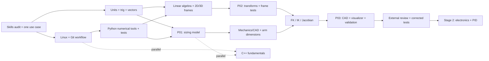

# Robotics Engineering — Stage 01: Foundations

**A standalone, low-level execution curriculum for months 1–3 of the seven-stage robotics learning graph**  
**Overall journey:** 30–36 months at 12–18 focused hours/week for a shared core plus ONE focused specialization; 40–48 months for two substantial tracks; 48–60+ months for all three with meaningful evidence.  
**This file's horizon:** 13 weeks / approximately **156–234 focused hours**, using **195 hours at 15 hours/week** as the planning baseline.  
**Source alignment:** expands *Complete Robotics Engineering Roadmap* (September 2026) and the seven-lane learning graph. The original core schedule assigns **P01–P03 to months 1–3** and **P04–P05 to months 4–6**. The earlier “Stage 1 = months 1–6” description combined two graph lanes and is **not** used here.

> **Boundary:** Stage 1 is mathematical, software, mechanical and modeling preparation. Stage 2 owns circuits, MCU/encoders, safe motor power, PID and P04–P05. Avoid claiming physical robot, certified safety, production/defense qualification, or independent competence based on Stage 1 alone. Defense-adjacent later work stays non-weaponized: logistics, inspection, remote sensing, search-and-rescue support, and survey/hazard mapping only; it excludes weapon integration, target selection and autonomous engagement.

## Contents

1. Stage contract, exit criteria and E/W/P labels
2. Dependency graph and parallel execution plan
3. Baseline audit and test-out rules
4. Detailed low-level learning checklist: Linux/Git, Python, C++, math, geometry, mechanics/CAD
5. P01 / P02 / P03 gate specifications and test cases
6. Thirteen-week execution schedule
7. Weekly cadence, feedback and evidence management
8. Certifications and official learning resources
9. Stage-1 budget and simulation-only path
10. If behind schedule; Stage-2 handoff

---

## 1. Stage contract: what Stage 1 does and does not accomplish

| Field | Stage-1 commitment |
|---|---|
| Time window | Months **1–3**, nominally weeks 1–13; extend the calendar rather than silently waiving a gate |
| Main path | Skills audit → Linux/Git → numeric Python + C++ basics → units/vectors/trig/calculus → linear algebra/rigid frames → mechanics/CAD |
| Mandatory gates | **P01 — Units and motor sizing; P02 — Coordinate frames; P03 — 2-link arm** |
| Math policy | Only learn math needed for the next gate; review prior knowledge, do not start a full graduate math curriculum |
| Physical hardware | **Not required**. Use numerical experiments + CAD + plots; save purchases for Stage 2 |
| Target depth | **W** in bounded units/models, basic numerical Python, transforms and a 2-link model; **E/W** in modern C++; **W** in reproducible Git/Linux workflow |
| Exit decision | An external reviewer has challenged frame conventions, units, numerical edge cases and P03 tests; defects are logged and addressed |

**E — Exposure:** explain the idea and reproduce a guided example. **W — Working competence:** independently implement and debug a bounded task, with evidence. **P — Focused proficiency:** design, integrate, fault-test, review and maintain a bounded repeatable system. **P in one artifact is not professional certification or mastery of the discipline.**

### What must be true by the end of month 3

- [ ] Given a small rover or arm requirement, create a unit-checked, assumption-explicit motor/load calculation (P01).
- [ ] Express transforms with an unambiguous naming convention; invert/compose them; verify results numerically (P02).
- [ ] Design and visualize a planar 2-link arm; implement FK, analytic IK and a Jacobian; test unreachable poses and singular configurations (P03).
- [ ] Execute notebooks and tests from a fresh documented environment without hidden local paths.
- [ ] Make a CAD assembly/drawing/BOM and explain the difference between ideal geometry and physical tolerances.
- [ ] Present at least **one month-3 external review** and a corrected test or model.

**Not a Stage-1 promise:** ROS 2 W, Gazebo/URDF, embedded real-time operation, working PCB, hardware PID, state estimation, field deployment, or formal safety certification. Introductory ROS 2 exposure from the parent roadmap’s first-30-days preview is **optional only**, not P06 evidence.

---

## 2. Dependencies, parallelism and critical path



**Solid arrows = do not skip the prerequisite. Dashed arrows = work that can be studied in parallel.** You do not need to finish C++ before deriving a 2-link arm, and you do not need to finish all CAD before testing matrix multiplication.

| Parallel stream | Start | Continue until | Why it can overlap | Required checkpoint |
|---|---|---|---|---|
| Linux/Git + documentation | Week 1 | Week 13 | Needed by every project; low setup cost | Fresh clone + run |
| Numeric Python and tests | Week 1 | Week 13 | Use math problems as the programming exercises | P01–P03 use reusable, tested functions |
| Just-in-time math | Week 1 | Week 11 | Each math block unlocks a nearby artifact | Derivation + numeric comparison |
| C++ fundamentals | Week 3 | Week 12 | E/W support stream; defer complex concurrency | Build a small numeric CLI + test |
| Mechanics/CAD | Week 5 | Week 13 | Arm dimensions feed geometry code; code tests feed CAD checks | Source model + drawing + BOM |
| Reviewer outreach | Week 5 | Week 13 | Finding feedback takes time | Review questions + issue/action log |

### Explicit stop signs

- **If units cannot be reconciled, do not sign off P01.**
- **If a frame direction is ambiguous, do not sign off P02.**
- **If IK cannot handle unreachable poses and singularity limits, do not sign off P03.**
- Do not compensate for a missing gate by adding ROS 2, cloud, AI, or a certificate.

---

## 3. Week-1 skills audit: test out instead of restudying everything

You can exploit existing mechanical engineering/CAD and Python experience, but **an untested assumption is not a pass**. Attempt each bounded challenge *without* following a tutorial line-for-line.

| Domain | 30–90-minute diagnostic challenge | Pass condition | If already passed |
|---|---|---|---|
| Linux | Create a venv, install from requirements, run tests, inspect a failing process | Reproduce after shell restart | Move immediately to repository automation |
| Git | Branch, commit, merge/PR, tag a release, restore an earlier version | History remains understandable | Use Git throughout; do not watch beginner videos |
| Python | Implement a unit-checked numerical function and plot results with tests | Handles invalid input and boundary cases | Shift study time to frames and math |
| C++ | Compile a multi-file program and run a small test | Can explain types, functions and build flow | Maintain weekly C++ practice only |
| Math | Solve units, dot/cross, trig and a 2×2 matrix problem | Correct results and units, independently checked | Start at the next missing gate |
| Mechanical/CAD | Model an arm link with hole spacing and drawing | Dimensions, constraints and references are stable | Use familiar CAD; avoid reinstalling tools |
| Safety literacy | Identify stored energy, collision/pinch and sensor/control faults in an imagined arm | Plain-language hazard note and stated simulation-only boundary | Carry this note into later gates |

**Record:** topic → diagnostic → pass/fail → evidence path → hours reclaimed → remaining gap. Prior experience changes *time allocation*, not gate quality.

---

## 4. Low-level curriculum: learn and check each atomic skill

**Tags:** `[CORE]` must pass for Stage 1; `[SUPPORT]` should work at basic E/W depth; `[LATER]` deliberately deferred. Checkboxes are small learning units, **not** certificates.

### 4.1 Linux and reproducible working environment — weeks 1–2, then ongoing [CORE/W]

**Target:** another developer can run your calculations and tests in a clean local environment.

- [ ] Identify host OS, shell, CPU architecture and Python/compiler versions.
- [ ] Navigate with `pwd`, `ls`, `cd`, `find`, `grep`/`rg`; create/move/remove safe example files.
- [ ] Understand absolute/relative paths, quoting, spaces in filenames and exit codes.
- [ ] Inspect permissions, ownership, environment variables and executable flags.
- [ ] Redirect stdout/stderr; use pipes and `tee` to save experiment output.
- [ ] Inspect processes and memory usage with `ps`, `top`/`htop`, `kill` (non-production sandbox only).
- [ ] Create/activate a Python virtual environment; install pinned project dependencies.
- [ ] Understand serial-device permissions **as a concept for Stage 2**; do not experiment on unknown connected equipment.
- [ ] Use an editor, debugger/breakpoints and a terminal consistently.
- [ ] Write a one-command setup/test script and state supported OS/tool versions.

**Micro-lab:** deliberately create a missing dependency error; record the error, fix it, and explain why the README prevents recurrence. **Evidence:** `environment.md`, requirements/lock information, test log.

### 4.2 Git and collaboration — weeks 1–3, then ongoing [CORE/W]

- [ ] Explain working tree, staging area, local repository and remote.
- [ ] Initialize repository; use a `.gitignore` suited to Python, C++ and CAD exports.
- [ ] Create small topical commits with meaningful messages.
- [ ] Create and merge a feature branch; practice resolving a benign conflict.
- [ ] Use a pull request for your own design review even if working solo.
- [ ] Tag `p01-v1`, `p02-v1`, `p03-v1` after each verified gate.
- [ ] Track issues for model assumptions, bugs, deferred math and reviewer comments.
- [ ] Never commit secrets, private source data, licensed standards or sensitive drawings.
- [ ] Compare changed code and tests, and revert a broken change deliberately.

**Micro-lab:** a reviewer clones your repository and reproduces a known failing test and its fix. **Evidence:** link/commit/tag + issue + test.

### 4.3 Python for engineering — weeks 1–10 [CORE/W]

**Basic Python: only revisit where diagnostic failed.**

- [ ] Functions, explicit inputs/outputs and meaningful exceptions for impossible requirements.
- [ ] Modules/packages, imports, virtual environments and pinned dependencies.
- [ ] Types/docstrings: document physical units and frame meaning; typing does not enforce units automatically.
- [ ] File I/O: save/load CSV or JSON test inputs and report metadata.
- [ ] Use `pytest` with boundary-case tests; distinguish an example plot from a test assertion.
- [ ] Use NumPy arrays with known shapes; avoid accidental row/column broadcasting.
- [ ] Distinguish elementwise `*` from matrix `@`; test transpose and inverse.
- [ ] Plot dimensions, angles and trajectories with labeled axes, units and legends.
- [ ] Use SciPy/SymPy **only when helpful** to check derivations or solve a bounded equation.
- [ ] Make deterministic plots or tests by fixing random seeds where randomness is used.
- [ ] Validate non-finite inputs and ambiguous degrees/radians at interfaces.

**Micro-labs:** (1) unit converter + tests, (2) wheel sizing notebook, (3) transform module + property tests, (4) arm animation. **Evidence:** `src/`, `tests/`, `notebooks/`, `figures/`.

### 4.4 C++ basics for eventual ROS 2 / embedded work — weeks 3–12 [SUPPORT/E→W]

Stage 1 requires only a **small functional, compiled numerical program**, not RTOS, advanced template programming or high-performance production C++.

- [ ] Install a C++ compiler and compile from shell, then a basic CMake project.
- [ ] Read compiler/linker errors; distinguish compile-time vs runtime faults.
- [ ] Types, signed/unsigned caution, floating-point behavior, `constexpr`, `const` and references.
- [ ] Functions, headers vs implementation files, scope, `namespace` and include guards.
- [ ] `std::vector`, `std::array`, `std::string`, simple loops and input validation.
- [ ] Explain stack vs heap *conceptually* and prefer RAII/standard containers.
- [ ] Implement a 2D rotation or wheel-sizing CLI independently.
- [ ] Write and run at least two numerical tests; compare Python and C++ results.
- [ ] Use debugger or diagnostics on a deliberately introduced numeric bug.

**Defer:** custom allocators, complicated templates, deep concurrency, lock-free structures, RTOS internals, advanced Eigen and micro-ROS. These are not P01–P03 prerequisites.

### 4.5 Mathematics gate A — units, algebra, geometry and calculus for P01 [CORE/W]

#### Units and dimensional analysis

- [ ] SI base units and derived units: m, kg, s, A, N, N·m, W, J, V.
- [ ] Distinguish mass (kg), force (N), torque (N·m), energy (J) and power (W).
- [ ] Convert mm↔m, rpm↔rad/s, N·mm↔N·m, g↔kg without silently changing meaning.
- [ ] Distinguish absolute vs relative error and document assumptions/significant figures.
- [ ] Spot invalid formulas by dimension before running Python.

#### Algebra/trigonometry/vectors

- [ ] Rearrange ratios and equations; solve simple simultaneous equations.
- [ ] Use `sin`, `cos`, `tan`, `atan2` in radians; calculate slope as an angle.
- [ ] Components of force and velocity; 2D and 3D vectors and their norms.
- [ ] Dot product for projection/work; cross product for moment direction/magnitude.
- [ ] Free-body diagram for a wheel-on-slope or a loaded horizontal arm.

#### Only the calculus needed now

- [ ] Interpret derivative as change rate: position→velocity→acceleration.
- [ ] Interpret integral as accumulated quantity: velocity→position; power→energy.
- [ ] Differentiate simple polynomial/sinusoidal motion examples.
- [ ] Use numerical differentiation/integration on sampled motion data; show effect of sample step.
- [ ] State when a static torque estimate is inadequate because acceleration matters.

**Exit test:** derive wheel speed, ideal drive torque and power for a hypothetical rover; derive a static shoulder torque for an arm; mark idealized assumptions and units. **Do not front-load** tensor calculus, graduate variational mechanics or full control-system theory.

### 4.6 Mechanics and preliminary motor sizing for P01 [CORE/W]

- [ ] Define mission/use-case and measurable requirements: mass, speed, slope or reach, duty cycle and cost.
- [ ] Draw free-body diagrams and identify traction, rolling resistance, gravity and acceleration contributions.
- [ ] Derive torque from force at wheel radius; explain mechanical efficiency and reduction ratio.
- [ ] Convert desired wheel angular speed to motor angular speed via gear ratio.
- [ ] Separate nominal, acceleration and stall/fault cases; do not equate stall current with normal current.
- [ ] Use motor **manufacturer data** for voltage, current, torque and `Kt` if available; otherwise keep current *unknown* or clearly illustrative.
- [ ] Identify motor/driver peak vs continuous limits, duty cycle and thermal uncertainty.
- [ ] Explain backlash, slip, losses and why an ideal model is a first estimate.
- [ ] Produce a parameter sweep for mass, slope, efficiency and gear ratio.
- [ ] Document how you would validate the model physically in Stage 2.

Use this **illustrative** simplified wheel-drive model, writing down every assumption:

```text
F_gravity   = m * g * sin(slope_angle)
F_roll      ≈ Crr * m * g * cos(slope_angle)
F_accel     = m * a               [translational approximation]
F_total     ≈ F_gravity + F_roll + F_accel
T_wheels    ≈ F_total * wheel_radius
T_per_wheel ≈ T_wheels / n_driven  [only for equal load sharing]
T_motor     ≈ T_per_wheel / (gear_ratio * drivetrain_efficiency)
ω_wheel     = v / wheel_radius
ω_motor     = gear_ratio * ω_wheel
P_wheel     = F_total * v
P_motor_mech≈ P_wheel / drivetrain_efficiency
I_motor     ≈ T_motor / Kt         [ONLY if Kt is known; model simplification]
```

**Sanity tests:** increasing mass/slope should not lower required torque; wheel/motor RPM conversion should be dimensionally correct; zero speed does not imply zero holding torque; `I_motor` cannot be honestly claimed without a justified motor model.

### 4.7 Mathematics gate B — linear algebra and coordinate geometry for P02 [CORE/W]

- [ ] Scalars, vectors, column vectors, matrix shape and multiplication order.
- [ ] Identity, transpose, inverse and when an inverse does not exist.
- [ ] Geometric meaning of 2D rotation; show `R(θ) R(φ) = R(θ+φ)`.
- [ ] 3D elementary axis rotations and right-hand-rule orientation.
- [ ] Distinguish a point, displacement vector, direction and pose.
- [ ] Construct a 2D homogeneous transform and then a 4×4 3D transform.
- [ ] Define **one** transform convention, e.g. `T_A_B` maps coordinates of points expressed in frame B into frame A.
- [ ] Compose `T_A_B @ T_B_C → T_A_C`; reject incompatible frame names in your API/docs.
- [ ] Invert a rigid transform with `R.T` and `-R.T @ p`; test both multiplication orders against identity.
- [ ] Distinguish rotating a vector from translating a point (vector homogeneous coordinate 0 vs point 1).
- [ ] Test frames translated and rotated together, not merely zero-angle examples.
- [ ] Distinguish degrees↔radians, active↔passive descriptions and row↔column conventions.
- [ ] Spot reflection (determinant −1) vs proper rotation (determinant +1).
- [ ] Recognize numeric tolerance rather than expecting bit-for-bit floating-point equality.

**P02 minimum property tests:** `T @ inv(T)≈I`, `inv(T) @ T≈I`, chaining matches direct geometry, a vector is unaffected by pure translation, invalid input dimensions fail cleanly.

**Defer:** Lie groups/algebras (`SO(3)`, `SE(3)`, exp/log maps), SVD/pseudoinverse theory beyond basic awareness, quaternion differential geometry; return only if a later project requires them.

### 4.8 P03 arm geometry: forward and inverse kinematics [CORE/W]

Use an **ideal planar 2R arm** with link lengths `L1`, `L2`, base at the origin, and joint angles `q1`, `q2` in radians. Define positive angle direction, tool point and joint limits.

- [ ] Degrees of freedom vs joint count; define base, elbow and tool frames.
- [ ] Set link lengths from a CAD parameter sheet; distinguish center-to-center joint spacing from external part length.
- [ ] Draw both links and the end-effector for simple angle pairs.
- [ ] Derive and implement forward kinematics (FK):

```text
x = L1*cos(q1) + L2*cos(q1 + q2)
y = L1*sin(q1) + L2*sin(q1 + q2)
```

- [ ] Derive analytic IK using cosine law, `atan2`, and both elbow-up/down branches:

```text
c2 = (x² + y² - L1² - L2²) / (2*L1*L2)
reachable only when |c2| ≤ 1  [within numerical tolerance]
s2 = ±sqrt(max(0, 1 - c2²))
q2 = atan2(s2, c2)
q1 = atan2(y, x) - atan2(L2*s2, L1 + L2*c2)
```

- [ ] Explain reachable annulus: `|L1−L2| ≤ distance ≤ L1+L2`, before joint-limit filtering.
- [ ] Apply joint limits **after** geometric branch calculation; classify “geometrically reachable but outside joint limits.”
- [ ] Normalize angle outputs consistently; avoid conflating equivalent angles with valid mechanical motion.
- [ ] Derive 2×2 Jacobian `J = ∂(x,y)/∂(q1,q2)` and test by finite differences.
- [ ] Explain Jacobian singularity; for this ideal planar arm, `det(J) = L1*L2*sin(q2)`.
- [ ] Visualize a 2D workspace and sample poses with both IK branches.
- [ ] Separate **kinematics** from dynamics, collisions, physical gravity load and safety controls.

**Minimum edge cases:** full extension, folded pose, unreachable too far, unreachable too near where `L1 ≠ L2`, joint-limit rejection, zero/negative length invalid, angles on wrap boundary and almost-singular pose.

### 4.9 CAD, mechanical design and documentation for P03 [CORE/W]

Use **Inventor if already available**, otherwise FreeCAD or an accessible equivalent; the gating evidence is CAD quality, not a brand.

- [ ] Create a parameter table: `L1`, `L2`, joint-axis diameter, link width/thickness, nominal clearance.
- [ ] Choose a stable sketch origin, constraints and reference geometry.
- [ ] Model base, link 1, link 2 and simple tool marker separately.
- [ ] Assemble two revolute joints with consistent axis directions and range of motion.
- [ ] Compare CAD measured end-effector position with Python FK at ≥5 poses.
- [ ] Draw simple manufacturing views and specify units, material assumption and critical interfaces.
- [ ] Explain fits/tolerances and why perfectly coincident nominal geometry is unrealistic.
- [ ] Calculate simple static arm moment at a selected pose; document idealized support/bearing loads.
- [ ] Include a basic BOM, source CAD and neutral export (e.g. STEP) if supported.
- [ ] Add one paragraph on access, replaceability and likely failure modes of a real prototype.
- [ ] Do **not** treat simplified CAD stress/FEA results as validated strength without realistic loads, constraints and checking.

**Defer:** full manipulator dynamics, fatigue qualification, harmonic-drive internal design, complex 3D-printed actuator packaging and industrial cell certification.

### 4.10 Physics to thread through the stage — not a separate semester [SUPPORT]

| Physics concept | Learn now | Immediately use in |
|---|---|---|
| Statics | free-body diagrams, moment arms, equilibrium | P01/P03 |
| Basic dynamics | `F=ma`, `τ≈Iα` under fixed-axis assumptions | sizing sensitivity; Stage-2 prep |
| Friction/contact | rolling resistance, traction/slip as caveats | P01 |
| Electrical/thermal | `P=VI`, `P=τω`; why motor loss heats components | P01 assumptions only |
| Signals/sampling | derivative/integral intuition, step size | numeric tests; Stage-2 prep |
| Optics, detailed circuits, PWM, battery protection | only name the interfaces now | Stage 2 or later |

---

## 5. Formal project gates: build and verify, not just finish a tutorial

### P01 — Units and motor sizing (target: weeks 3–4)

**Design brief:** size a notional small indoor rover drive or a single arm joint under stated requirements. This is a *calculation/simulation gate*, not permission to energize hardware.

**Work products:**

- [ ] One-page requirements and assumptions with a parameter/unit table.
- [ ] FBD and derivation showing gravity/rolling/acceleration or arm moment as applicable.
- [ ] Gear ratio, wheel/joint angular speed, torque, mechanical power and efficiency estimate.
- [ ] A current/thermal **limitations section** using specified motor data or explicitly marking missing data.
- [ ] A parameter-sweep plot and at least five automated sanity checks.
- [ ] README with instructions for rerunning the calculation.

**Pass/fail examples:** correct SI dimensions; increasing mass raises required torque under the model; changing gear ratio changes motor torque/speed in appropriate directions; a documented negative or impossible input triggers an error; reviewer can identify where the model is optimistic.

### P02 — Coordinate frames (target: weeks 6–8)

**Design brief:** create a reusable Python transform library plus a notebook demonstrating `world → base → link → tool` in a known convention.

**Work products:**

- [ ] Illustrated frame diagram; definitions of `T_A_B` and point/vector representation.
- [ ] 2D rotation/transform examples and one 3D rigid-transform example.
- [ ] Compose and invert with property-based or table-driven tests.
- [ ] Test correct output for nonzero angle **and** translation.
- [ ] Test failure for wrong shape, invalid rotation, non-finite input or inconsistent API use.
- [ ] A brief note on active/passive and row/column convention traps.

**Pass:** numerical round-trip and geometric examples agree within a documented tolerance; a peer can interpret frame directions from README alone.

### P03 — 2-link arm (target: weeks 9–13)

**Design brief:** connect the CAD geometry and a Python FK/IK/Jacobian visualizer for a bounded planar 2R arm.

**Work products:**

- [ ] Parametric assembly, two-joint constraint logic, drawing, BOM and dimensions.
- [ ] FK module and plots; IK with elbow-up/down choices and joint-limit filtering.
- [ ] Jacobian derivation + finite-difference test + singularity explanation.
- [ ] ≥5 CAD-vs-Python pose comparisons with errors and plausible tolerances.
- [ ] Workspace map with reachable/unreachable classifications.
- [ ] Named edge-case tests and a failure/limitation report.
- [ ] External review request and issue/action log; rerun affected tests after fixes.

**Pass:** a fresh clone can produce the figures, and another person can challenge the frame definition, elbow branches, unit handling and unreachable-pose behavior without discovering hidden assumptions.

### Evidence traceability

| Gate | Tests | Technical record | Human review |
|---|---|---|---|
| P01 | unit and monotonicity checks | `requirements.md`, sizing notebook, plots | review assumptions and scope |
| P02 | inverse/chain/translation properties | frame diagram, transform library, tests | check direction of transforms |
| P03 | FK↔IK, Jacobian finite difference, edge cases | CAD, BOM, workspace plot, report | check geometry and numerical failures |

---

## 6. Thirteen-week execution plan (15 h/week nominal)

**Allocation model:** at 15 h/week, plan ~195 hours across 13 weeks. Weeks are suggested targets, not licenses to advance with missing tests. Project work is integrated throughout; it is **not extra on top** of the 15 hours.

| Week | Primary focus / minimum low-level tasks | Parallel tasks | Weekly deliverable | Gate |
|---|---|---|---|---|
| 1 | Skills audit, choose benign use case, SI units; Ubuntu/venv and repository | Git + baseline Python challenges | Skills matrix, README, first unit notebook | — |
| 2 | Algebra, trig/radians, vectors, FBD and unit conversions | Git branches; numeric Python tests | Unit converter + wheel/arm assumptions | — |
| 3 | Torque/speed/power and gear ratio; sensitivity sweeps | Start C++ CLI and CAD parameter sheet | P01 candidate notebook, tests and plots | P01 draft |
| 4 | Correct P01 errors; write requirements/limitations | C++ functions + first CAD sketches | **P01 signed off**, demo 1 + issue log | **P01** |
| 5 | Matrix shapes, dot/cross, 2D rotations | CAD link sketches and C++ build | Tested rotation module | — |
| 6 | 2D homogeneous transform and naming convention | CAD joints + review outreach | Transform diagram and chain tests | P02 draft |
| 7 | 3D rigid transform, inverse/compose, point-vs-vector | C++ equivalent of one numeric function | P02 full regression test set | — |
| 8 | P02 review; fix frame/order confusion | CAD arm assembly and drawings | **P02 signed off**, demo 2 | **P02** |
| 9 | P03 parameters and FK derivation; make visualizer | Drawing/BOM | FK outputs cross-checked against CAD | P03 draft |
| 10 | IK branches, reachability annulus, limits | Numerical boundary tests | Workspace / IK plots | — |
| 11 | Jacobian and singularity; finite-difference checks | CAD comparisons at sampled poses | J tests + error table | — |
| 12 | Integrate CAD/FK/IK/J; prepare minimal reviewer package | C++ practice; documentation cleanup | Capstone candidate, review request + demo 3 | P03 candidate |
| 13 | Correct reviewer issues, fresh-environment reproduction, plan Stage 2 | Identify safe Stage-2 hardware access or simulation path | **P03 sign-off**, evidence index, handoff note | **P03** |

**Month 1:** P01 + toolchain. **Month 2:** P02 + CAD assembly. **Month 3:** P03 + external geometry review and rework. If the reviewer responds late, record the pending review and move the calendar rather than falsely claiming external sign-off.

### Example weekly 15-hour split

| Workstream | Hours/week | Stage-1 emphasis |
|---|---:|---|
| Just-in-time math + physics | 4 | current P01/P02/P03 gate only |
| Python and basic C++ | 3 | model + tests, not generic exercises |
| CAD and modeling | 3 | dimensions, assemblies, comparisons |
| Integrated gate project / experiments | 3 | plots, edge cases, bug reproduction |
| Documentation and feedback | 2 | README, test log, review requests |

At 12 hours/week, simplify visual polish and optional C++ depth. At 18 hours/week, spend added time on errors/verification, **not** on moving Stage-2 control ahead of P03.

---

## 7. Feedback and evidence management

### Reviewer checkpoints

| Timing | Ask reviewer to challenge | Share | Evidence of closure |
|---|---|---|---|
| Week 4 / P01 | Units, worst-case assumptions, torque-current uncertainty | sizing sheet, FBD, parameter sweep | reviewer note + changed calculation/test |
| Week 8 / P02 | `T_A_B` direction, order, right-hand rule, invalid inputs | diagram, minimal code and failing case | added transform regression |
| Week 12–13 / P03 | IK branches, limits, singularities, CAD length definition | CAD/drawing, notebook, tests, open questions | action log + fresh run + re-review if major |

Seek a robotics faculty member/student, makerspace mentor, mechanical/controls engineer, or a well-formed question in a relevant robotics community. A question with precise expectations, frames, units, versions and a minimal reproduction is more likely to receive useful feedback than “review all my robotics code.” Silence is **not** a review approval.

```text
Review request
Gate + git commit/tag:
Question (one or two only):
Expected result [units and frames]:
Actual result and smallest failing case:
Code / plot / CAD image:
Assumptions and what is not modeled:
Proposed change and test to rerun:
```

### Repository layout: reuse for each stage

```text
robotics-roadmap/
└── stage-01-foundations/
    ├── README.md
    ├── docs/
    │   ├── skills_audit.md
    │   ├── requirements.md
    │   ├── assumptions_and_units.md
    │   ├── frame_conventions.md
    │   ├── review_log.md
    │   └── stage_02_handoff.md
    ├── src/                     # Python modules; optional cpp/ subtree
    ├── tests/                   # numerical/edge-case checks
    ├── notebooks/               # P01–P03 derivations and experiments
    ├── cad/                     # native editable files + neutral exports
    ├── figures/                 # labeled plots; diagrams
    ├── data/                    # test-case parameters and measurements
    ├── requirements.txt         # or another documented Python lock approach
    └── scripts/                 # setup and run checks
```

**Definition of done for every gate:** explanation → implementation → automated tests → failure/limits → reproducibility → review/action log → tagged result. Do not score yourself as competent based only on completing videos.

---

## 8. Credentials and resources: actual names, optional, not fake prerequisites

The original roadmap prioritizes project evidence. This stage-1 supplement names **actual credentials**, separating a proctored certification from a course completion certificate and distinguishing optional timing. **No certificate replaces P01–P03.** Verify current availability, exam version, price and regional access before purchasing.

| Exact credential/program name | Type | Relation to Stage 1 | When to attempt |
|---|---|---|---|
| **GitHub Foundations** | GitHub certification exam | Git/repository/collaboration evidence | Optional after consistent Git use and P01; no need to delay P02 |
| **PCEP™ – Certified Entry-Level Python Programmer** | Python Institute certification exam | Introductory Python only | Skip/test out if Python is already strong |
| **PCAP™ – Certified Associate Python Programmer** | Python Institute certification exam | More substantial Python proof, but broader than numerical robotics requirements | Optional later; do not displace P02/P03 |
| **Linux Foundation Certified System Administrator (LFCS)** | Linux Foundation performance-based certification exam | Valuable deeper Linux administration evidence, not needed for transforms or a 2R arm | Usually after Stage 1, if a target role needs it |
| **Modern Robotics, Course 1: Foundations of Robot Motion** | Northwestern/Coursera course, completion certificate when enrolled in eligible certificate track | Direct fit for frames and robot-motion math | May accompany weeks 5–11; complete relevant portion before adding unrelated modules |

**Exact official pages (checked September 2026):**

- GitHub Foundations — https://docs.github.com/en/get-started/showcase-your-expertise-with-github-certifications/about-github-certifications
- Python Institute PCEP — https://pythoninstitute.org/pcep
- Python Institute PCAP — https://pythoninstitute.org/pcap
- LFCS — https://training.linuxfoundation.org/certification/linux-foundation-certified-sysadmin-lfcs/
- Northwestern/Coursera *Modern Robotics, Course 1: Foundations of Robot Motion* — https://www.coursera.org/learn/modernrobotics-course1

**Core learning references:** [Modern Robotics](https://modernrobotics.northwestern.edu/), [MIT OpenCourseWare](https://ocw.mit.edu/), [NumPy](https://numpy.org/doc/), [SciPy](https://docs.scipy.org/doc/scipy/), [FreeCAD](https://www.freecad.org/). Use only chapters that unblock P01–P03; full *Modern Robotics* specialization, advanced control, and ROS coursework belong later.

**CV rule:** list a certification only when earned, and label a course completion as a course completion. A GitHub project called “2-link arm: FK/IK/Jacobian and CAD validation” is independent evidence, not an accredited credential.

---

## 9. Stage-1 cost, tools and access

**Planning budget from parent roadmap:** **$0–60 incremental, excluding an existing computer, tuition, paid certifications and optional commercial CAD.** Prices vary by region; buy **no motor, battery, driver or robot arm** for the P01–P03 gate simply because a later stage needs one.

| Item | Needed now? | Low-cost choice | Caveat |
|---|---|---|---|
| Computer + Ubuntu | Yes, if available | Existing Linux workstation / suitable existing PC | Avoid upgrades until a measured bottleneck |
| Python/NumPy/SciPy/Matplotlib/pytest | Yes | Open-source | Pin dependencies |
| Git, C++ compiler, CMake | Yes | Open-source | Stage-1 C++ remains basic |
| CAD | Yes | Existing Inventor seat **or** FreeCAD | Do not purchase license solely for P03 |
| Physical robot/MCU/motor | **No** | All P01–P03 in code/CAD | P04–P05 in Stage 2 |
| Optional storage/notebook | Optional | ~$0–60 planning room | Excludes external review fees |
| Certifications | Optional separate budget | Delay until evidence exists | Exam fees can exceed Stage-1 tools budget |

**Simulation-only is the normal Stage-1 path**, not a fallback of lesser merit. Do not claim measured hardware current, real motor efficiency, load capacity or safety performance from an ideal Python model.

---

## 10. Recovery guidance and handoff to Stage 2

| Checkpoint | Never cut | Cut/defer first | Repair action |
|---|---|---|---|
| Week 4 | correct units, assumptions, first torque/speed model | certification prep, CAD rendering, full C++ OOP | complete P01 notebook + automated checks |
| Week 8 | frame naming/order, inverse, transform tests | 3D animation polish, advanced 3D algebra, extra platforms | reduce to one 2D chain, then add one 3D example |
| Week 13 | P03 FK/IK, limits, Jacobian basic check, CAD dimension consistency and reviewer issue log | detailed FEA, second arm, optional ROS preview, all certificates | add 2–4 weeks to Stage 1 and fix P03 before P04 |

**Never cut:** units, frame discipline, model limits, tested kinematics or honest simulation-vs-physical claims. Later safety-related hardware work requires suitable power protection, independent stop/isolation strategy where appropriate and qualified supervision; hobby test suites do not constitute certification.

### Stage-2 entry packet (must exist before starting P04/P05)

- [ ] P01–P03 tagged, with independent setup instructions and executable tests.
- [ ] P01 includes mechanical requirements and a defensible nominal/worst-case range, *not* invented measured electrical performance.
- [ ] P02 convention is documented and compatible with P03.
- [ ] P03 arm geometry, lengths, limits and failure cases are versioned.
- [ ] Month-3 reviewer feedback is logged, with corrections and remaining uncertainty.
- [ ] You have chosen **one** Stage-2 option: supervised low-energy motor rig **or** explicitly simulation-only motor/control model.
- [ ] Stage-2 backlog includes circuits and electrical safety, MCU + sensor, encoder/driver/power, ODE/PID/sampling, embedded timing/fault states.

```text
STAGE 01 COMPLETE
  P01 motor/load sizing [W] ─┐
  P02 frame composition [W] ─┼─> STAGE 02: Electronics + Control, months 4–6
  P03 two-link arm     [W] ─┘    P04 motor test rig → P05 bounded PID axis
```

**The next file in the seven-part series:** `Robotics_Stage_02_Electronics_and_Control_Months_04-06.md` (not created in this stage). Stages 3–7 will cover ROS 2/robot software; estimation/perception/planning; optional math on demand; a choice of industrial / non-weaponized rugged-field / IoT-IIoT specialization; and ongoing parallel habits.
