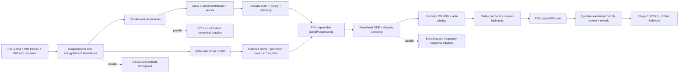

# Robotics Engineering — Stage 02: Electronics + Control

**A standalone, low-level execution curriculum for months 4–6 of the seven-stage robotics learning graph**  
**Overall journey:** 30–36 months at 12–18 focused hours/week for the shared robotics core plus ONE chosen specialization; expect a longer horizon for two or three substantial specializations.  
**This file's horizon:** 13 weeks / approximately **156–234 focused hours**, with **195 hours at 15 hours/week** as the planning baseline.  
**Source alignment:** expands *Complete Robotics Engineering Roadmap* (September 2026) and continues [`Robotics_Stage_01_Foundations_Months_01-03.md`](Robotics_Stage_01_Foundations_Months_01-03.md). The parent schedule assigns **P04–P05 to months 4–6**; its just-in-time math table legitimately permits unfinished control verification to extend into **month 7**. That is recovery time, **not a waived gate**.  
**Graph lane:** `2 — Electronics + Control (builds on foundations)`. This is **not** Stage 3 (`ROS 2 + Robot Software`), although C++/embedded practice continues there.

> **Boundary and safety:** Stage 2 is a small **low-energy, guarded** actuator-control learning environment, or an explicitly labeled **simulation-only** equivalent. Energize real hardware only after appropriate qualified review, suitable power protection, isolation, guarding and a documented safe test plan. A firmware timeout, GUI stop, ROS command, Internet API or test-suite assertion is **not** an independently engineered safety stop. No hobby project or self-assessment constitutes machinery certification. Later defense-adjacent applications remain **non-weaponized**: logistics, inspection, remote sensing, search-and-rescue support, and survey/hazard mapping only; no weapon integration, target selection or autonomous engagement.

## Contents

1. Stage contract, entry packet, E/W/P depth and exit criteria
2. Dependency graph, critical path and parallel work
3. Stage-2 learning map and prerequisite-aware time allocations
4. Atomic learning checklists: electronics, motors, encoders, MCU, C/C++, ODEs, feedback and faults
5. P04 motor test rig: requirements, build alternatives, tests and evidence
6. P05 PID axis: model, controller, experiments, acceptance and evidence
7. Thirteen-week execution schedule and 15-hour weekly cadence
8. Outside review, traceability and repository structure
9. Actual credentials and authoritative study resources
10. Staged equipment budget and simulation-only alternative
11. Behind-schedule triage and the Stage-3 handoff

---

## 1. Stage contract: exactly what this stage proves

| Field | Stage-2 commitment |
|---|---|
| Nominal window | Months **4–6**, weeks **14–26** of the full journey, called Stage-2 weeks **1–13** below |
| Entry gates | Stage 1 **P01 motor/load sizing**, **P02 frame conventions**, **P03 bounded 2-link model**, versioned and reproducible |
| Main chain | Circuit safety → MCU + basic sensors → encoder + matched driver + protected power → timed motor measurement → simple ODE model + sampled PID → fault behavior |
| Mandatory projects | **P04 — Motor test rig** and **P05 — PID axis**; explicitly note whether simulation or real low-energy hardware was tested |
| Target depth | **W** in bounded circuit/measurement reasoning, small MCU program, speed measurement, sampled PID simulation, fault tests; **E/W** in physical integration depending on supervised access |
| Continued parallel practice | Linux/Git, numerical Python and tests, C/C++, Stage-1 mechanical model, calculations, documentation and mentorship |
| No Stage-2 requirement | Full RTOS, BLDC field-oriented control, industrial safety PLC, production PCB, real-time ROS 2, Gazebo, SLAM, LQR/MPC, cloud-connected motor control |
| Completion policy | Finish both gates with explicit limitations, failure injection and outside review; move calendar right if needed, including month 7 |

**Depth labels:** **E — Exposure**: explain/reproduce a guided example. **W — Working competence**: independently implement/debug a bounded task with evidence. **P — Focused proficiency**: design, integrate, fault-test, review and maintain a repeatable bounded system. **P is not a professional license, certification, or blanket claim of electrical or machine safety.** Stage 2 primarily targets **W**, not full-stack **P**.

### 1.1 Required entry packet from Stage 1

- [ ] `p01-v1`: requirements, torque/speed/gear-ratio model, unit checks and documented missing motor/thermal data.
- [ ] `p02-v1`: transform convention, inverse/chain tests and frame diagram.
- [ ] `p03-v1`: 2R FK/IK/Jacobian, CAD dimensions, edge-case tests and review/action log.
- [ ] Python numerical environment and tests reproduce from a fresh clone.
- [ ] Choose **one** Stage-2 evidence path: `SIM` (simulation-only) or `BENCH` (qualified-reviewed low-energy physical rig). A learner may start `SIM` then add `BENCH` **without overwriting the simulation evidence**.
- [ ] Keep an existing P01 motor/load envelope as a **design input**, not as a measured motor capability.

### 1.2 Stage-2 exit checklist

- [ ] Explain current, voltage, resistance, motor electrical/mechanical power and motor-drive limitations with units.
- [ ] Draw a reviewable schematic/block diagram with MCU, sensor, driver, power, protection, ground/reference and separate stop/isolation boundary.
- [ ] Convert encoder counts over **measured elapsed time** into angular speed and detect invalid/stale samples.
- [ ] Demonstrate one bounded periodic embedded or simulated control loop; log requested vs actual interval and missed/deadline cases.
- [ ] Fit/derive a **simple** actuator/load model and state where it fails.
- [ ] Compare open-loop, P, PI and/or PID responses at defined operating points; demonstrate saturation/anti-windup and report errors.
- [ ] Inject lost command, invalid encoder data and reset/restart cases; show the bounded response and documented limitations.
- [ ] Separate simulated evidence from observed hardware evidence in every plot, README and CV claim.
- [ ] Obtain month-6 electrical/controls feedback and close or explicitly carry forward review findings.

**Important nuance:** a simulation-only result can establish **W in controller modeling, software and failure logic**. It cannot establish physical wiring, motor driver behavior, actual temperature/current, physical stop distance, electrical protection performance, or safety certification. Record those as **not tested** rather than inventing observations.

---

## 2. Dependencies, parallelism and critical path



**Solid arrows are hard dependencies. Dashed arrows mean parallel support, not permission to energize unreviewed equipment.** The math/model and MCU simulator can develop in parallel, but a physical P04 test cannot be signed off before electrical review and protection.

| Stream | Start | Can run alongside | Do not advance beyond | Required proof |
|---|---|---|---|---|
| Requirements + hazards + budget | Week 1 | Everything | Any live-power decision | One-page use envelope and stop/isolation plan |
| Circuits + instrumentation | Week 1 | ODE/Python and C basics | Motor power-up | Correct schematic and qualified bench check |
| MCU + encoders | Week 2 | Motor/load model | Closed-loop actuation | Timestamped counts, missing/invalid sample handling |
| Model + numerical simulation | Week 1 | MCU/circuits | P05 acceptance | Open-loop baseline and model limits |
| PID/sampling/fault logic | Week 6 onward | Bench telemetry or simulated plant | Stage-3 interface | Measured or simulated response with explicit provenance |
| C++ + Git/tests/docs | Week 1 | All gates | Never ends | Build/test/traceable evidence |
| Mentor contact | Week 2 | All gates | Physical rig and final sign-off | Reviewed electrical boundary and controller results |

### Critical stop signs

- If supply/driver/motor ratings or polarity are uncertain, **do not energize**; keep working in simulation.
- If the physical rig lacks suitable guarded isolation and approved test arrangements, **stay in simulation**; do not represent software-only stopping as independent safety.
- If encoder scaling, sign, timestamp or sample time is wrong, **P04 fails** even if a plot looks smooth.
- If saturated control, invalid sensing, stale commands or restart produce unbounded behavior, **P05 fails** even if nominal tracking looks good.
- Completing ROS 2 tutorials or buying new sensors does not compensate for missing P04/P05 evidence.

---

## 3. Time budget and low-level module map

Stage-2 time allocations below are approximate **integrated study/build hours** at the 195-hour baseline; they are **not additive on top of** the 13-week project schedule. The last ~20 hours are explicitly reserved for review/rework and stage handoff.

| Module | Low-level scope | Approx. hours | Expected depth | Unlocks |
|---|---|---:|---|---|
| 4.1 Safety and architecture | requirements, hazard boundary, protection/isolation vocabulary | 12 | W (reasoning); **not** safety qualification | Bench decision |
| 4.2 Circuits and measurement | DC basics, DMM, supply, PWM meaning, grounding, wiring documentation | 20 | W bounded reasoning; E/W bench | P04 setup |
| 4.3 Motors/drivers/power | gear ratio review, motor datasheet, matched driver, electrical/thermal limits | 18 | W model/selection | P04 plant |
| 4.4 MCU and C/C++ | GPIO, interrupts, timers, ADC/PWM, serial/logging, watchdog concept | 27 | W bounded firmware/simulator | Encoder and timing |
| 4.5 Encoder + sampling | count scaling, direction, dt, quantization, timestamps, jitter | 18 | W | P04 evidence |
| 4.6 Dynamics and simulation | first-order/second-order intuition, DC motor model, Euler sampling, noise | 20 | W simplified model | P05 controller |
| 4.7 PID/control | closed-loop, anti-windup, filtering, tuning, evaluation | 28 | W bounded axis | P05 evidence |
| 4.8 Faults/tests/integration | state machine, stale command, restart, CI, traceability | 32 | W | P04/P05 sign-off |
| Review + rework + handoff | independent feedback, corrected tests, Stage-3 interfaces | 20 | W verified | Stage 3 |
| **Total** | | **195** | | |

**Time triage:** at 12 h/week, use one motor architecture, one encoder, one simple controller and one safe simulation or bench route. At 18 h/week, spend the extra hours on fault cases, instrumentation and reviewer fixes—not on jumping to ROS 2, RTOS or a second actuator family.

---

## 4. Atomic curriculum — the actual learning checklist

**Tags:** `[CORE]` is required for P04/P05; `[SUPPORT]` is useful to W or E/W now; `[LATER]` is deliberately not an entry condition. Each checkbox should produce **a result, explanation or test**, not merely a watched lecture.

### 4.1 Safety, requirements and system boundary [CORE/W reasoning]

**Purpose:** define the experiment *before* selecting a motor or writing firmware.

- [ ] State task and expected mechanical load; inherit P01 torque/speed envelope and its uncertainty.
- [ ] State operating voltage/current limits only from verified equipment specifications; do not infer safety from a nominal voltage alone.
- [ ] Identify electric shock, stored electrical/mechanical energy, spinning shaft, belt/gearing, pinch, unexpected restart and overheating hazards.
- [ ] Draw an energy path: supply → protection/isolation → driver → motor → load.
- [ ] Draw a separate information path: controller → driver command; encoder/current/temperature → controller → logs.
- [ ] Distinguish hardware energy isolation, ordinary firmware stop, protective stop and emergency stop; **do not claim they are interchangeable**.
- [ ] Define what happens on software crash, power loss, MCU reset, USB disconnection and broken encoder wire.
- [ ] Check if the load can back-drive or freewheel; removing electrical power does not guarantee immediate mechanical stop.
- [ ] Mark who may energize/inspect the physical setup and what equipment requires qualified supervision.
- [ ] Define a guarded test envelope: enclosure, physical spacing, speed/energy limits and when hands stay clear.
- [ ] Prepare pre-use inspection and de-energized setup checklist.
- [ ] Make a clear **SIM-only** branch if protection/instrumentation/reviewer access is missing.

**Micro-lab:** draw two diagrams for the same test: normal operation and “MCU freezes while last command is nonzero.” List every unproven claim.  
**Evidence:** `docs/requirements.md`, `docs/hazard_log.md`, `docs/architecture.md`, review question about electrical isolation.

### 4.2 Circuits and safe instrumentation [CORE/W]

#### Electrical quantities and DC reasoning

- [ ] Define voltage, current, resistance, power, energy, polarity and reference potential with units.
- [ ] Compute `V = I R`, `P = V I`, `E = P t` for **known, appropriate** simple DC loads.
- [ ] Explain series vs parallel elements, open vs short circuit and why a motor is not a fixed resistor.
- [ ] Apply Kirchhoff's current and voltage laws to a small, drawn low-voltage circuit.
- [ ] Recognize inductive effects: a motor winding is not an ideal resistor; switching needs appropriate driver protection.
- [ ] Explain grounds/reference returns, current paths and why logic references and noisy motor paths require proper design.
- [ ] Distinguish schematic symbols, wiring diagram, connector pinout and physical assembly.
- [ ] Calculate illustrative resistor dissipation and choose against stated component ratings in a *non-motor* example.
- [ ] Explain that **GPIO cannot power a motor directly**; choose a suitably rated interface.

#### Instruments and evidence quality

- [ ] Explain what a digital multimeter can/cannot measure; voltage probes go across, current measurement requires an appropriate current-measurement arrangement.
- [ ] Read instrument safety/category/current limits and identify when measurement is **not appropriate for self-study**.
- [ ] Explain a bench supply's current limit and why it does not replace all branch protection.
- [ ] Distinguish a current-limited supply, fuse/protective device, disconnect/isolation and driver internal protection.
- [ ] Understand oscilloscope/logic-analyzer roles **conceptually**, including reference/ground hazards; do not probe unfamiliar live equipment.
- [ ] Distinguish sensor resolution, repeatability, calibration and measurement uncertainty.
- [ ] Capture commanded voltage/duty and measured speed with meaningful timestamps and units.
- [ ] Write a de-energized wiring inspection record and known pin map before bench use.

**Micro-lab A (simulation):** draw and calculate a low-voltage resistive circuit; deliberately catch an impossible power-unit error.  
**Micro-lab B (BENCH only):** a qualified person reviews the **actual chosen** driver/supply/harness/protection before a guarded low-energy demonstration. Record their notes; do not substitute a diagram for that review.  
**Evidence:** circuit calculation, schematic, rating matrix, instrumentation plan and test-log provenance.

### 4.3 Motors, encoders, drivers and power architecture [CORE/W]

#### Motor and drivetrain literacy

- [ ] Distinguish brushed DC, BLDC, stepper and hobby servo **at selection level**; **choose ONE** for this stage (usually a small brushed DC encoder motor or simulator).
- [ ] For P04/P05, document shaft vs gearbox-output speed and encoder mounting side.
- [ ] Distinguish continuous torque, peak torque, stall torque, rated speed, no-load speed and duty cycle.
- [ ] Extract rated voltage, current limits, driver limits, encoder CPR/PPR definitions and gearbox ratio from actual datasheets **where available**.
- [ ] State missing/ambiguous specifications explicitly; do not invent motor constants or declare them measured.
- [ ] Carry P01 load assumptions into a motor-size/speed plausibility calculation.
- [ ] Identify resistive/copper loss conceptually: winding heat depends on current and resistance; do not claim actual temperature from `P=τω` alone.
- [ ] Recognize backlash, friction, speed-dependent loss and what an ideal gear ratio omits.

#### Driver/power and system-level cautions

- [ ] Explain what a motor driver/H-bridge does; distinguish enable, direction, PWM/command and fault signals **for the chosen device only**.
- [ ] Explain forward/reverse, coast/brake and stop states only as documented by the actual driver; avoid universal assumptions about pin behavior.
- [ ] Confirm that driver peak/continuous current/voltage ratings and protection features match the test envelope **before any BENCH test**.
- [ ] Identify isolation/protection, suitable connectors, wire ratings/strain relief, grounds and firmware-startup pin states for design review.
- [ ] Explain back EMF and why an unpowered spinning motor can still have mechanical/electrical consequences.
- [ ] Explain why a battery pack/BMS is an advanced hazard and **not mandatory** for P04/P05; prefer an appropriate supervised bench setup or simulation.
- [ ] Distinguish a proper physical disconnect/isolation plan from a serial/API “stop” command.

**Micro-lab:** compare two hypothetical motor/gear-ratio datasheets against the same P01 requirement and reject one with documented rationale. **Evidence:** motor-selection sheet, rating matrix, source links/part numbers and unknown-data list.

### 4.4 Microcontrollers and focused C/C++ [CORE/W]

#### C/C++ needed *now*, not a full firmware career syllabus

- [ ] C scalar integer/floating types, fixed widths and integer overflow/rollover concerns.
- [ ] Functions, structs, arrays, pointers/references at a **bounded** practical level and basic `const` discipline.
- [ ] Compile/link/debug a small program; distinguish compiler errors, logic faults and timing faults.
- [ ] Keep shared configuration explicit; avoid hidden magic constants for CPR, gear ratio and control period.
- [ ] Write input validation for out-of-range, non-finite or malformed serial commands.
- [ ] Explain why string parsing, printing or allocations in a fast control callback can perturb timing.
- [ ] Write a unit-testable speed-estimator/controller function separate from hardware I/O.

#### MCU, interfaces, timing and diagnostic basics

- [ ] Identify MCU GPIO, timer, PWM peripheral, ADC, interrupts, UART/USB serial and watchdog role.
- [ ] Distinguish GPIO logic levels from supply voltage; never connect unknown sensor/motor voltages to GPIO.
- [ ] Explain digital input pull-up/pull-down and mechanical-switch debounce at an introductory level.
- [ ] Explain ADC units, reference and resolution; label an uncalibrated current-sensor result as such.
- [ ] Explain PWM frequency vs duty cycle; **duty cycle is not measured motor voltage or torque**.
- [ ] Implement a periodic scheduler in a simulator or bounded MCU program with *measured* elapsed time.
- [ ] Keep timestamps monotonic or document rollover handling; do not assume `dt` is exactly nominal.
- [ ] Distinguish interrupt counting from work scheduled outside an interrupt; keep ISR work minimal in this learning rig.
- [ ] Explain where race conditions arise when reading counters updated by interrupts; protect snapshots appropriately for the chosen MCU.
- [ ] Use startup state `DISABLED`, explicit enable, calibrated initial condition and timeout-to-safe-command behavior.
- [ ] Capture loop runtime, requested period, observed period, worst observed jitter and missed deadlines.
- [ ] Record firmware/toolchain version and configuration; validate on the real MCU if claiming hardware timing.

**Micro-labs:** `hello/serial` → timestamp ticks → synthetic encoder counter → input validator → periodic logger.  
**Evidence:** `firmware/`, `src/`, parser/controller unit tests, `data/loop_timing.csv`, state diagram.

**Defer to later:** deep interrupt/DMA optimization, custom RTOS scheduling, complex shared-memory concurrency, secure bootloaders, micro-ROS, field-oriented BLDC control and production firmware signing. Introductory watchdog concepts **do** belong here; a claim of validated watchdog coverage does not, unless tested.

### 4.5 Encoder speed measurement and sampled signals [CORE/W]

- [ ] Explain optical/magnetic encoder **conceptually** and distinction between incremental and absolute encoders.
- [ ] Obtain the exact effective **counts per measured shaft revolution**, considering vendor `PPR/CPR`, x1/x2/x4 quadrature decoding and gearbox side.
- [ ] Record sign convention: positive motor command, encoder positive direction and observed physical shaft direction.
- [ ] Demonstrate raw edge-count/time measurement before constructing an RPM display.
- [ ] Compute `Δcounts` across timestamps, including counter wrap/overflow cases relevant to the data type.
- [ ] Reject `dt≤0`, negative/invalid counters under the chosen contract, impossible jumps and stale samples.
- [ ] Compare two estimate methods: counts per fixed window vs period between edges, and explain low-speed tradeoffs.
- [ ] Derive `ω = (2π * Δcount)/(counts_per_rev * Δt)` and `rpm = 60 * Δcount/(counts_per_rev * Δt)`.
- [ ] Document whether reported speed is motor shaft or gearbox output; transform consistently using the gear ratio.
- [ ] Demonstrate quantization and noise at low speed; avoid mistaking smoothing for extra resolution.
- [ ] Apply one simple moving average/low-pass only *after* keeping raw measurements and noting added delay.
- [ ] Compare estimated speed to synthetic ground truth **or** a valid independent physical reference when accessible.
- [ ] Log command, count, timestamp, raw speed, filtered speed, `dt` and validity flag in one schema.
- [ ] Prove what happens when no pulses arrive while a nonzero command is present; don't silently reuse the last good speed forever.

**Micro-lab:** synthetic encoder sequence with known `ω`, deliberate missing pulses, counter wrap, reversed polarity/sign and irregular intervals. **Evidence:** test vectors, plots, failure-classification tests, data dictionary.

### 4.6 Core differential equations and the motor/load model [CORE/W]

**This is just-in-time math for P05, not a graduate course on control theory.**

- [ ] Interpret a differential equation as a rate model; identify the physical states and units.
- [ ] Derive `v = dx/dt`, `ω = dθ/dt`, `τ ≈ J dω/dt` (fixed-axis simplification) from Stage-1 intuition.
- [ ] Recognize electrical `R`, `L`, back-EMF constant `Ke` and torque constant `Kt` as *model parameters*, not arbitrary decorations.
- [ ] Write one illustrative DC-motor model with stated sign convention:

```text
V_applied = R*i + L*di/dt + Ke*omega
T_motor   = Kt*i
J*domega/dt = T_motor - b*omega - T_load
omega = dtheta/dt
```

- [ ] Set explicit `R, L, Ke, Kt, J, b, T_load` in a **simulation** with labeled illustrative parameters; replace with sourced/fitted values if available.
- [ ] Understand why neglecting `L` or constant friction can be acceptable **only within a named simple-model envelope**.
- [ ] Implement discrete forward Euler for one state and compare with a smaller step or trusted numerical solution.
- [ ] Separate the plant integration step from the controller sample period where simulation requires it.
- [ ] Show effects of varying inertia, friction, load torque and supply saturation.
- [ ] Explain open-loop step response, approximate time constant, steady speed and settling without unproven hardware claims.
- [ ] Compare simulated data with observed BENCH data **only if actual measurement and identification are documented**.
- [ ] Use a simple first-order identified model if it is adequate; do not overfit a full electromechanical model to thin data.

**Micro-lab:** open-loop speed response under two loads; plot ground truth, estimated speed and residuals. **Evidence:** derivation notebook, parameter table, simulation seeds/config, error report.

**Defer:** full state-space controllability/observability proofs, detailed Bode/Nyquist, LQR/MPC, nonlinear robust control and advanced rigid-body dynamics. Revisit only if P05 exposes an unexplained stability or model-fit problem.

### 4.7 Closed-loop control, sampled PID and response interpretation [CORE/W]

#### Control architecture

- [ ] Explain setpoint, measured state, error, controller output, driver command and actual plant.
- [ ] Distinguish open-loop command from feedback, tracking and disturbance rejection.
- [ ] Choose **one control variable** for P05: typically shaft/output angular velocity, not velocity plus position plus force simultaneously.
- [ ] Define desired speed range, sign convention, command saturation and allowed startup/transient envelope.
- [ ] Draw the sampling/timing sequence including sensor update, compute, command and log.
- [ ] Distinguish control-loop frequency from PWM carrier frequency and serial/logging frequency.

#### Implement only what can be tested

- [ ] Implement P control and record its limitations at a specified load.
- [ ] Add I control when the model/measurements show a steady error that merits integral action.
- [ ] Understand derivative action as optional for this bounded motor-speed exercise; noisy measurements may make `PI` preferable to full `PID`.
- [ ] For P05 report **P, PI, or PID** variants explicitly; do not insist that nonzero D is required to pass.
- [ ] Clamp controller output to actual **documented** command range.
- [ ] Add an appropriate anti-windup strategy (e.g. conditional integration or back-calculation), document its assumptions and compare to a version without it in simulation.
- [ ] Use measured/simulated `dt` consistently for integral/derivative terms; reject invalid timing updates.
- [ ] Distinguish derivative on measurement from derivative on error; explain setpoint-kick implication.
- [ ] Start with a reproducible conservative tuning procedure under a defined test envelope; do not tune by uncontrolled physical trials.
- [ ] Handle setpoint slew/ramp where sudden changes would exceed bounded equipment/test limits.
- [ ] Ensure disabling/fault/reset does not silently reuse a stale integrator or motor command.

#### Make measurements meaningful

- [ ] Define rise time, overshoot, settling time, steady-state error and tracking RMS error.
- [ ] Compare at least **two** sample periods or induced jitter levels in simulation; discuss control limitations.
- [ ] Show at least **two** disturbances/plant parameter changes and compare tracking and recovery.
- [ ] Mark controller rate, measurement rate, filter configuration, saturation and any missing physical current/temperature readings on reports.
- [ ] Log unclamped requested action vs clamped applied action in simulation (or available motor-driver command value), without claiming this equals measured motor voltage.
- [ ] Ensure axis can enter an appropriate locally enforced disabled/fault state on stale command and invalid sensing.

A simple illustrative **discrete PI** model (for conceptual understanding only):

```text
e_k = omega_target_k - omega_measured_k
I_candidate = I_previous + Ki * e_k * dt
u_raw = Kp * e_k + I_candidate
u_cmd = clamp(u_raw, u_min, u_max)

# Only accept/update I_candidate according to documented anti-windup rule.
# A motor command is not a safety-rated function or necessarily actual voltage.
```

**Micro-lab:** compare open-loop → P → PI/PID using exactly the same plant and disturbance, then break one assumption (missing encoder, irregular `dt`, saturation). **Evidence:** reproducible tuning notebook, controller module, comparison figures, bounded acceptance matrix.

### 4.8 Fault states, tests and reproducible engineering [CORE/W]

- [ ] Define explicit `DISABLED`, `READY`, `ENABLED`, `FAULT` and `RECOVERING` states (names can vary, semantics must not).
- [ ] Describe allowed transitions and what each state commands locally.
- [ ] Prove reset starts disabled; state does not resume motion without a new valid enable/action as specified by the test contract.
- [ ] Prove command timeout uses a reliable **local** clock and does not depend on USB/cloud/Internet availability.
- [ ] Prove invalid/NaN sensor data does not propagate into a control output unchecked.
- [ ] Prove encoder no-pulse/stale condition is detected **within documented test assumptions**.
- [ ] Record and classify saturation, stall suspicion, excessive command error, sensor fault and deadline miss; distinguish detecting a suspected fault from proving its cause.
- [ ] Ensure that telemetry/logging failure cannot block the bounded local control/fault path in the architecture.
- [ ] Test configuration mismatch (wrong counts/rev, bad gain, missing config file) and define response.
- [ ] Demonstrate operator-requested disable, without claiming that it is a certified emergency stop.
- [ ] Demonstrate the difference between MCU/driver reset and physical energy isolation.
- [ ] Save run ID, commit, firmware/model version, units, sample period and measured-vs-simulated provenance.
- [ ] Include unit tests, integration tests, a negative test and a reproducible known-failure case.
- [ ] Request qualified review for the actual physical harness/protection; require an ordinary controls reviewer for timing and PID logic.

**Micro-lab:** inject ten synthetic faults into a simulated axis, capture transitions and logs, and confirm no unbounded retries. Physical fault tests, if any, require a specific safe reviewed procedure; do not imitate all software faults on a live motor.

---

## 5. P04 — Motor test rig: formal gate (weeks 5–8 target)

**Question P04 answers:** “Can I produce trustworthy timestamped motor/encoder data, safely within my explicitly stated test/simulation boundary?”

### 5.1 Required system architecture

```text
       control / logging PC
             |
         data link                  SIM PATH
             |                  simulated plant → simulated encoder
      MCU / test program                |
         |         \                     +→ same logging/tests contract
   encoder input   bounded command
         |               |
   encoder/motor      driver  ← approved protected low-energy supply
          \             /
             shaft/load

BENCH PATH REQUIRES separate, suitably engineered and reviewed energy
isolation/stop measures and appropriate guarding. Software/USB/cloud
stops are not substitutes for that independent hardware boundary.
```

### 5.2 P04 required artifacts (both paths)

- [ ] Requirements: task, selected motor type or simulated plant, load, speed/energy limits, stop/restart assumptions.
- [ ] System block diagram and **SIM/BENCH label** visible in README and plots.
- [ ] Encoder scaling and sign convention; motor/output-shaft and gear-ratio relationship.
- [ ] Named sensor/command/timing interface, with data types and units.
- [ ] Timestamped CSV or structured log: `run_id, timestamp_s, command, count, omega_rad_s, valid, state` plus measured/simulated origin.
- [ ] Logging at zero speed, positive/negative command (where applicable), changing setpoint and power/reset/lost-command scenario.
- [ ] Non-finite/invalid/no-pulse/`dt≤0` detection and test outputs.
- [ ] Minimal automated tests and plot script; exact software/firmware version, setup instructions.
- [ ] Hazard assumptions and limitations; outside feedback and corrected issue.

### 5.3 Extra requirements only for `BENCH`

- [ ] Qualified review of chosen component ratings, polarity, power protection, isolation/stop arrangement, guarding and measurement plan **before energizing**.
- [ ] De-energized harness/pinout check; physical inspection record.
- [ ] Document actual equipment IDs/part numbers, applicable datasheets and observed supply/driver settings.
- [ ] Document what was *actually measured*: speed, supply-side current, driver reported current or temperature only if instruments/reporting support that claim.
- [ ] Use an appropriate method to observe actual stop/restart/fault behavior under the approved low-energy envelope; state that the result is **not** safety certification.

### 5.4 `SIM`-only substitutions and honest limits

| Intended evidence | Simulation equivalent | What remains unproven |
|---|---|---|
| Encoder counts, speed and timestamps | Synthetic count generator with quantization, noise, missed pulses and irregular `dt` | Real encoder wiring, missing edges, EMI |
| Driver command and motor response | Bounded command → motor/load ODE | Actual driver electrical/thermal and braking behavior |
| Fault states and timeout | Local simulated clock, stale/invalid data injection | Physical safety circuit, stop time and energy isolation |
| Power/current estimates | Parameterized electrical model with clear assumptions | Actual battery/supply current and thermal margins |

**P04 acceptance:** a fresh clone reproduces raw vs computed speed; units/scaling/sign are testable; timeouts/invalid inputs produce explicit fault state; simulated/physical provenance is unmistakable. **Fail** if count-rate conversion, frame/shaft convention, `dt` validation or no-pulse handling is missing. A BENCH claim additionally fails without documented power/guarding review.

---

## 6. P05 — Bounded PID axis: formal gate (weeks 9–13 target)

**Question P05 answers:** “Can I model, close the loop, measure the response and explain what happens when feedback, commands or timing become unreliable?”

### 6.1 Test envelope first

Before tuning, write down **one** bounded speed-control problem: target-speed range, selected shaft, permissible controller output, sample period, simulated/physical load assumptions, software fault behavior, independent hardware protection boundary if BENCH, and acceptance metrics. Thresholds must be chosen **before** looking at the final results and justified for the equipment/model; there is no universal safe or correct PID gain/stop time.

### 6.2 Required controlled experiments

- [ ] Open-loop step experiment; plot target/command/observed speed vs time.
- [ ] Simple plant/model approximation and mismatch statement.
- [ ] P-only closed loop; report steady error/overshoot where applicable.
- [ ] PI or PID closed loop; show benefit and tradeoffs compared with same baseline.
- [ ] Saturated setpoint: demonstrate output clamping and anti-windup behavior in simulation.
- [ ] Two sample-period or timing-jitter cases, **at least simulated**.
- [ ] One load/disturbance change; quantify return to the required band.
- [ ] Stale-command test and explicit locally generated disabled/fault response.
- [ ] Invalid/stale encoder test; no unbounded motor command or misleading valid-speed telemetry.
- [ ] Reset/restart test starting in a known state.
- [ ] Fault/recovery logs and no hidden manual edit between repeated runs.

### 6.3 Suggested metric/report template

| Metric | Definition / source | Result and units | Requirement chosen in advance? |
|---|---|---|---|
| Test identity | run ID, `SIM`/`BENCH`, git tag, plant/firmware revision | … | — |
| Step response | rise/settle time, overshoot, steady error | … s / % / rad/s | yes |
| Integral tracking error | e.g. mean or RMS across a stated window | … rad/s | yes |
| Sampling | nominal vs observed `dt`, jitter/deadline misses | … ms | yes |
| Saturation | max applied command and duration saturated | … units / s | yes |
| Disturbance | changed inertia/load/drag or reviewed benign physical load | … | yes |
| Fault response | local timeout, invalid sensing and restart transitions | event table | yes |
| Power/thermal | only available physical readings OR clearly illustrative model | … | yes/not applicable |
| Limits | effects not validated, reviewer issues, physical-safety boundary | text | — |

### 6.4 P05 pass/fail

**PASS** only when independent reproduction works; baseline and feedback plots have labeled axes/units; fixed controller and model parameters are captured; saturation and at least three named fault/timing cases are demonstrated; predeclared targets are met **or the stage is explicitly not passed and revised**; external control review findings are addressed or openly pending.  
**FAIL** if a screenshot alone is presented, gains are tuned without recording conditions, simulation traces are called measured physical data, a stale encoder is treated as a valid zero-speed signal, a software stop is called a safety-rated E-stop, or a fault case is dismissed because the nominal speed curve looks attractive.

### Gate-to-stage traceability

| Gate | Core data/code | Tests | Human review | Honest CV/project wording |
|---|---|---|---|---|
| P04 | encoder math, schematic/plant, log and timestamp data | scaling/sign/`dt`/no-pulse/reset | qualified BENCH electrical check; firmware/controls peer | “Instrumented a simulated motor axis” **or** “bench-tested low-energy motor/encoder axis” |
| P05 | plant + controller + saturation/fault states + plots | model, step/disturbance, stale command, invalid sensing and timing | controls review; BENCH electrical follow-up | “Designed and evaluated a bounded PI/PID speed loop in simulation” **or** explicitly measured guarded bench version |

---

## 7. Thirteen-week execution plan (15 h/week nominal)

**Weeks in this table are Stage-2 weeks 1–13 = total journey weeks 14–26.** Electronics, math, code, project work and reviews are *inside* the same weekly hour budget. Two or three days spent repairing a failed wire/simulation model are not “extra lost time”; they are robotics learning.

| Stage-2 week | Primary work and minimum atomic outcomes | Parallel stream | Deliverable / checkpoint |
|---|---|---|---|
| 1 | Review Stage-1 entry; define use envelope and SIM/BENCH choice; draw energy and data paths | Linux/Git + motor ODE intro | Requirements, hazard boundary, test plan |
| 2 | Ohm/Kirchhoff/DC power; instrument and ratings literacy; compare motor/driver candidates | C numeric types and parser | Schematic, datasheet/rating matrix, simulated resistive circuit |
| 3 | MCU architecture, GPIO, serial, timer/PWM/ADC concepts; build synthetic logger | First-order motor model | Time-stamped sample schema; MCU/simulator setup |
| 4 | Encoder CPR vs PPR/x4/gear side; sign; speed conversion; invalid `dt` | C++ tests, diagram corrections | Raw-count and reference-speed tests; **demo 1** |
| 5 | Sample jitter/counter wrap, driver/plant integration, bench review before any power | Open-loop model comparisons | P04 complete candidate, qualified BENCH check if applicable |
| 6 | P04 repeated speed/stop/no-pulse cases, measurement provenance and plots | C++ timing logger; simple PI theory | P04 candidate review + issue log |
| 7 | Close P04 issues; establish plant model and baseline step experiment | PID/sampling learning | **P04 signed off**, versioned baseline |
| 8 | ODE/discrete integration, filter delay, sample period selection | Fault-state diagram, Python controller tests | Model comparison report; **demo 2** |
| 9 | P control; PI (or justified PID); first conservative tuning | Telemetry and timing instrumentation | P05 first controller and measured/simulated response |
| 10 | Output saturation, anti-windup and disturbance response | Review hazard cases | Controller-comparison plots and failure cases |
| 11 | Stale command, invalid encoder, reset and jitter/deadline tests | Stage-3 interface outline only | Negative-tests table, full evidence package |
| 12 | Predeclared acceptance runs, independent controls review | Documentation cleanup | **P05 candidate**, demo 3 and review actions |
| 13 | Rework, fresh clone, final safety/claim audit and Stage-3 handoff | C++ continuity plan | **P05 sign-off**, tagged artifacts, next-stage backlog |

**Month 4:** energy/circuit/MCU and encoder basics. **Month 5:** validated P04 and simple plant model. **Month 6:** bounded P05 plus review/rework. If P05 needs 2–4 extra weeks, deliberately extend into month 7 rather than misrepresenting W competence.

### Weekly 15-hour split

| Workstream | Hours/week | What qualifies as progress |
|---|---:|---|
| Circuits/hardware safety/MCU | 4 | schematic, versioned firmware/simulator, evidence |
| Just-in-time ODE/control theory | 3 | derivation/model + validation, not lecture count |
| Software + C/C++ + Python | 2 | reusable tested estimator/controller |
| Project implementation + measurement/fault tests | 4 | actual plots, data, reproducible run, failure reproduction |
| Documentation + external feedback | 2 | README, hazard/review log, precise review request |
| **Total** | **15** | |

**Monthly review rhythm:** every four weeks a short demo + issue log; every ~12 weeks an external checkpoint and time for rework. Reviewer silence is **not** approval.

---

## 8. Review, evidence management and clean repository

### 8.1 Independent feedback checkpoints

| Timing | Reviewer | Precisely what to challenge | What to share | Closure evidence |
|---|---|---|---|---|
| Week 2–5 before BENCH energy | Qualified electronics/controls person with access to actual parts | component matching, supply/protection, isolation, polarity, guarding, instrumentation | selected datasheets, schematic, risk assumptions, de-energized setup | revised setup/test plan; **do not energize on unreviewed assumptions** |
| Week 6–7 / P04 | Embedded/controls engineer or robotics mentor | counts/rev, gear side, speed sign, timestamp handling, validity/no-pulse behavior | minimal logger, counts/CSV, plot and negative tests | corrected scaling/test and changed commit |
| Week 11–13 / P05 | Controls engineer / technically competent reviewer | sampling, saturation/anti-windup, stale data, start/reset, target metrics | model, logged baselines, controller response, tests | review/action log + rerun + honest untested list |

**Helpful request format:** “Expected vs actual; units; shaft/gear side; exact sample time and log; one suspected bug; smallest reproduction; SIM/BENCH; power/safety boundary.” A GitHub discussion, community forum, electronics makerspace or university lab can help with ordinary software/model questions. Physical electrical approval needs a competent person reviewing the **actual** setup; generic online reassurance is not enough.

```text
Stage-2 review request
Gate and exact commit:
SIM / BENCH (never ambiguous):
Actuator and encoder datasheet/configuration:
Shaft, CPR definition, polarity/sign and units:
Controller/sample time + timing evidence:
Expected / actual behavior and minimal failing run:
Fault/stop/isolation boundary and who reviewed it:
One or two precise review questions:
Proposed correction + test to rerun:
```

### 8.2 Suggested repository layout

```text
robotics-roadmap/
└── stage-02-electronics-control/
    ├── README.md                      # SIM/BENCH + setup + what was NOT tested
    ├── docs/
    │   ├── stage_01_entry_packet.md
    │   ├── requirements.md
    │   ├── hazard_log.md
    │   ├── architecture.md
    │   ├── motor_driver_ratings.md
    │   ├── encoder_conventions.md
    │   ├── test_plan.md
    │   ├── review_log.md
    │   └── stage_03_handoff.md
    ├── electronics/
    │   ├── schematic/               # if relevant
    │   └── wiring_and_inspection/   # BENCH only
    ├── firmware/                     # BENCH or MCU simulator
    ├── src/                          # motor plant / encoder / PI/PID
    ├── tests/                        # units + fault injection
    ├── notebooks/                    # sizing reuse, plant identification, tuning
    ├── simulation/
    ├── data/README.md                # schema, provenance and safe data policy
    ├── figures/                      # labeled plots
    ├── configs/                      # versions, gains, CPR, sample time
    ├── scripts/                      # clean setup and rerun
    └── .github/workflows/           # software CI; never a safety certificate
```

**Definition of done for each gate:** requirements → model/schematic → implementation → normal and failing tests → data/plots → limitations → reproducibility → reviewer/action log → tagged release. Report negative tests and unknowns, not just successful runs.

---

## 9. Credentials and resources — do not turn Stage 2 into an exam chase

Stage 2 has **no universally required, standalone robotics-control certification**. Technical training may issue a course-completion credential; this is distinct from an independent proctored professional certification. Do **not** place a descriptive topic such as “motor control training” on a CV as if it were an official certificate name, or list a certificate before earning it. Check current provider offerings, title, regional availability and fee before enrolling.

| Named credential or program | Category | Stage-2 use | Timing / caveat |
|---|---|---|---|
| **Control of Mobile Robots** (Georgia Tech / Coursera) | Named course; course certificate only if offered and completed under the applicable provider arrangement | Feedback/mobile-robot modeling at an introductory level | Relevant selected modules in weeks 7–13; do not let broad course scope delay P05 |
| **Modern Robotics, Course 3: Robot Dynamics** (Northwestern / Coursera) | Named course; course completion if eligible | Optional follow-on for complex manipulator dynamics | **Defer** beyond this simplified motor-axis stage unless a real model problem demands it |
| **GitHub Foundations** | Certification exam | Cross-stage reproducible collaboration | Optional carryover from Stage 1, never a P04/P05 prerequisite |
| **Linux Foundation Certified System Administrator (LFCS)** | Certification exam | Linux operations, useful for later robotic compute | Optional later if target jobs justify it; not needed for MCU/PID gate |

**Core free/official learning resources (use a relevant section, not the whole library):**

- [Feedback Systems — Åström and Murray](https://fbsbook.org/) — sampled feedback, response, PID and stability intuition.
- [MIT Underactuated Robotics](https://underactuated.mit.edu/) — selected motor/control modeling ideas; advanced chapters are **not** mandatory.
- [Modern Robotics](https://modernrobotics.northwestern.edu/) — dynamics and control context, only where it supports the current gate.
- [KiCad documentation](https://docs.kicad.org/) — readable schematics and BOM generation.
- [Arduino documentation](https://docs.arduino.cc/) or documentation for **your actual MCU platform** — timers, GPIO, PWM, ADC and serial behavior; confirm model-specific electrical limits.
- [PlatformIO documentation](https://docs.platformio.org/) — optional reproducible MCU builds if using supported hardware.
- [NumPy](https://numpy.org/doc/), [SciPy](https://docs.scipy.org/doc/scipy/) and [pytest](https://docs.pytest.org/) — numerical plant/control testing.

**Source discipline:** actual motor/driver/encoder datasheets and qualified site/test procedures take priority over generic tutorials for electrical limits and physical work. Safety or standard editions must be reverified when relevant; a homemade test report is not certification. Stage 3 will bring in ROS 2 Jazzy/Gazebo and formal robot-software training.

---

## 10. Stage-2 acquisition budget and substitution paths

**Parent-roadmap planning band for P04/P05:** **$70–250 incremental** for a basic guarded low-voltage test setup, excluding an owned computer, paid coursework/certifications, labor, applicable tax/shipping and possible qualified bench/lab fees. These are **planning ranges, not verified current vendor quotes**. Allow roughly **15–25% contingency** on physical purchases.

| Item | When | Illustrative cost within stage band | SIM-only substitution / evidence limit |
|---|---|---:|---|
| Existing PC, Python/C++, plotting and Git | Start | $0 incremental if owned | Full numerical simulation and tests |
| MCU development board or suitable simulator | After requirements | ~$10–35 | MCU program simulator or simulated timer/encoder; no electrical/timing hardware claim |
| Small suitable encoder motor | After selection/review | ~$15–55 | Motor/load ODE + simulated count stream |
| Matched driver + protection/wiring/connector parts | After electrical review | ~$15–60 | Bounded actuator software interface; **cannot prove electrical protection** |
| Suitable supervised low-voltage supply/access | BENCH path only | ~$20–60 if unavailable | Entirely simulated plant; never improvise hazardous power |
| Multimeter / instrument or makerspace access | BENCH path only | ~$10–40 or access cost | Synthetic/recorded signals; no measured current/temperature claim |
| Guarding, reviewed isolation/stop arrangements, spares | Before BENCH work | Highly setup-dependent; included only if the stage band supports a suitable approved setup | If proper measures cannot be funded/approved, **remain in SIM** |

**Do not add every illustrative row to claim a guaranteed complete kit cost**; existing equipment and suitable protective measures vary, and a real safe setup may exceed the nominal planning band. Do **not** buy batteries, high-power motors, lithium pack fabrication tools, an oscilloscope or industrial safety hardware simply to satisfy Stage 2. Use an authorized makerspace/university lab when accessible; qualified support may cost more than components.

**SIM-first route:** $0 new hardware is viable with a suitable existing PC. It proves encoder algorithms, control models and software fault behavior—not physical sensor EMI, true motor dynamics, current/temperature, or stop integrity. **Never represent a screenshot of a virtual stop as proof of an independent physical emergency stop.**

---

## 11. If behind schedule — protect load-bearing foundations

| Checkpoint | Never cut / repair now | Defer safely | Recovery action |
|---|---|---|---|
| Week 3 | load envelope, circuit safety, component limits, correct speed units | advanced electronics, BLE/Wi-Fi, PCB, paid certification | choose a simpler motor/simulator and finish rating/energy diagram |
| Week 6 | encoder scaling/sign, real `dt`, no-pulse/invalid handling, documented BENCH/SIM boundary | multiple encoder types, extra sensors, fancy plots, RTOS | use synthetic counts, freeze one data schema and finish P04 |
| Week 9 | plant/loop assumptions, one bounded controller and sample period | elaborate full motor identification, D term, second actuator | use a first-order plant and PI; show baseline/saturation/faults |
| Week 13 | P04/P05 tests, stop/restart logic, qualified BENCH boundary, review/action log | cloud dashboard, ROS 2, MPC/LQR, high-speed motors, exam prep | extend into month 7 or label incomplete; keep Stage 3 from inheriting an unverified axis |

**Never cut:** units, physical rating uncertainty, proper power protection if BENCH, independently engineered isolation/stop needs, measured vs assumed timestamps, bounded output, local stale-command behavior, invalid-sensor handling, reproducibility, external feedback, or honesty about simulation-only limitations. If the physical setup is unsuitable, remain in simulation/de-energized work.

### Stage-3 handoff packet — ROS 2 + Robot Software

- [ ] P04 and P05 tagged and independently runnable; `SIM`/`BENCH` provenance is visible.
- [ ] P04 describes actuator and encoder units/sign, counts/rev definition, observed/simulated timing, logged validity.
- [ ] P05 contains stable bounded controller test and explicit **fault-state/stop limitations**.
- [ ] Configuration values (`encoder_counts_per_rev`, gear ratio, control period, output limits, gains, timeouts) are versioned and not hidden in a notebook.
- [ ] Command/feedback interface is defined without exposing raw unsafe hardware commands to future ROS 2 nodes.
- [ ] Local control/fault handling stays **below** the future ROS 2 layer; Stage 3 may coordinate and observe, not replace independent safety architecture.
- [ ] Electrical/controls review and remaining unproven claims are documented.
- [ ] Stage-3 backlog is limited to ROS 2 packages/nodes/tests, `tf2`, URDF/Xacro, Gazebo, `ros2_control`, RViz/rosbag2 and diagnostics.

```text
STAGE 02 COMPLETE
   Stage-1 units + frames + mechanical model [W]
              ↓
   P04 trusted encoder/timing/logging [W, SIM or BENCH]
              ↓
   P05 bounded sampled PI/PID + faults [W, SIM or BENCH]
              ↓
STAGE 03: ROS 2 + Robot Software, months 7–14
   P06 ROS 2 workspace → P07 reproducible robot simulation
```

**Next file in the seven-part series:** `Robotics_Stage_03_ROS2_and_Robot_Software_Months_07-14.md` (not created by this stage). Stage 4 addresses estimation/perception/planning; Stage 5 optional math as needed; Stage 6 the industrial/non-weaponized rugged-field/IoT-IIoT specialization choice; Stage 7 ongoing parallel habits across the whole journey.
