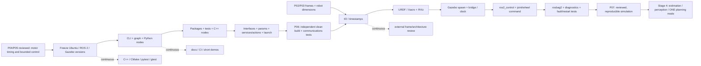

# Robotics Engineering — Stage 03: ROS 2 + Robot Software

**Standalone, low-level execution curriculum for months 7–14 of the seven-stage robotics learning graph**  
**Overall journey:** 30–36 months at 12–18 focused hours/week for the shared core plus **ONE** primary specialization; additional tracks extend the horizon.  
**This file's horizon:** approximately **34 weeks** (months 7–14), **408–612 hours** at 12–18 h/week; **510 hours at 15 h/week** is the planning baseline. Real calendars vary: this is a gate-driven estimate, not a speed guarantee.  
**Source alignment:** expands the ROS 2/software, simulation and Stage-3 rows of *Complete Robotics Engineering Roadmap* (September 2026), following [`Robotics_Stage_01_Foundations_Months_01-03.md`](Robotics_Stage_01_Foundations_Months_01-03.md) and [`Robotics_Stage_02_Electronics_and_Control_Months_04-06.md`](Robotics_Stage_02_Electronics_and_Control_Months_04-06.md). The parent assigns **P06 and partial P07 to months 7–10**, then **P07 completion to months 11–14**. Its **month-12 external review** is a substantial interim review; finish and verify P07 by month 14.  
**Graph lane:** `3 — ROS 2 + Robot Software (in parallel with embedded C++ practice)`. **Stage 4**, not this stage, owns P08–P11 sensor fusion, perception and one full Nav2 **OR** MoveIt 2 planning path.

> **Boundary:** Use a **simulation-first** robot with optional Stage-2-approved, low-energy interface tests. ROS 2 nodes, controllers, QoS settings, launch scripts, Internet services or dashboards are **not independent safety-rated stop functions**. Never attach an unreviewed ROS prototype to hazardous motors or operating factory equipment. Safety-critical stop/control must not depend on a cloud/Internet API, ROS network, or an LLM. Any later rugged/defense-adjacent specialization remains **non-weaponized**: logistics, inspection, remote sensing, search-and-rescue support, and survey/hazard mapping only; no weapon integration, target selection or autonomous engagement. A homemade suite is not certification.

## Contents

1. Stage contract, prerequisites, E/W/P targets and completion policy
2. Hard dependencies, parallel streams and platform/version freeze
3. Workload map and the full atomic ROS 2 curriculum
4. P06 formal project/gate: reproducible ROS 2 workspace
5. P07 formal project/gate: correctly modeled and simulated robot
6. Thirty-four-week plan, demos, review and weekly time allocation
7. Diagnostic playbook, reproducibility, documentation and repository layout
8. Named credentials, authoritative learning links and study order
9. Budget, SIM/BENCH evidence boundaries and behind-schedule recovery
10. Stage-4 handoff and final readiness checklist

---

## 1. Stage contract — what this stage actually proves

| Field | Stage-3 commitment |
|---|---|
| Months / nominal weeks | **7–14**, around Stage-3 weeks **1–34**; shift right if Stage 2 or either project is incomplete |
| Entry packet | P01–P03 versioned geometry/model and P04–P05 bounded motor/encoder controller evidence; Linux, Git, Python, focused C/C++ and tested math utilities |
| Main chain | ROS 2 environment → graph/communication → packages/tests/launch → interfaces/time/QoS → `tf2` → URDF/Xacro → RViz → Gazebo → `ros2_control` → replay/diagnostics/faults |
| Formal gates | **P06 — ROS 2 workspace** (target by ~month 10) and **P07 — Robot simulation** (target by month 14) |
| Primary robot | Choose **one**: simple differential-drive indoor rover **or** two-joint educational arm; rover usually reduces P07 model/physics complexity |
| Target depth | **W** in reproducible ROS packages, simple Python/C++ nodes, interface/QoS selection, frame conventions, robot description, simulation and bounded failure recovery; **E/W** in DDS internals, Gazebo physics and hardware plugins |
| Permitted parallel work | Continue C++ and Stage-2 embedded timing; Git, tests, docs, reviewer contact and simplified mechanics/calculations |
| Deliberately not required | Deep SLAM, EKF, full Nav2 and full MoveIt 2, multi-robot swarms, hardware real-time certification, micro-ROS, custom DDS middleware, cloud deployment, high-energy actuation |

**E — Exposure:** explain/reproduce a guided example. **W — Working competence:** independently implement, debug and test a bounded task with evidence. **P — Focused proficiency:** design, integrate, fault-test, review and maintain a bounded repeatable system. **Stage 3 targets W, not P in all ROS 2 subsystems.**

### 1.1 Entry packet: accept or repair before starting

- [ ] Link P02's documented transform convention and P03's robot dimensions rather than redrawing geometry from memory.
- [ ] Link P04/P05 encoder-sign, shaft conventions, command bounds, timing and known invalid-data behavior.
- [ ] Ensure P05's pending safety/controller-review findings are resolved or explicitly carried as a blocker for BENCH work.
- [ ] A clean clone executes numerical tests and example datasets on your Linux environment.
- [ ] Identify whether the selected Stage-3 robot is **SIM** only or includes a separate, properly reviewed **BENCH** interface.
- [ ] Write what Stage 3 must *not* claim: industrial commissioning, safety PL/SIL, hard-real-time guarantees, autonomous mission planning or formal qualification.

### 1.2 Exit acceptance — month 14

- [ ] P06 builds from source after a clean setup, passes automated tests and runs documented Python **and** C++ nodes.
- [ ] A named custom interface, parameters, launch, a service/action use case and an explicit QoS decision are demonstrated.
- [ ] All important `frame_id`s, parent/child transform directions, sensor timestamps and `/clock`/`use_sim_time` behavior are documented and tested.
- [ ] P07's URDF/Xacro passes description checks; robot appears correctly in RViz **and** a compatible Gazebo release.
- [ ] One robot is commanded via `ros2_control` and the correct simulated state/feedback is observed; controllers, joint names, limits and topics are consistent.
- [ ] A rosbag recording plus configuration/commit reproduces at least one scenario and one deliberately injected fault.
- [ ] On missing command or simulator/bridge fault, **simulated** command behavior is bounded and fault/staleness is reported; hardware safety remains independent.
- [ ] Another person can clone, install pinned compatible dependencies, build, launch, command, stop, replay and run tests without private paths or hidden credentials.
- [ ] External month-12 architecture review and final month-14 rework are evidenced in an issue/action log.

---

## 2. Hard dependencies and work that can run in parallel



**Solid = prerequisite. Dashed = supporting work in parallel.** `tf2` math can start using Stage-1 Python while ROS packages are being learned; URDF geometry can start from P03 before controllers work. Do not confuse parallel *learning* with parallel claims that an incomplete gate is passed.

| Stream | Start | Runs alongside | Must not block | Evidence |
|---|---|---|---|---|
| Versioned development environment | Week 1 | All streams | P06 clean build | OS, ROS distro, Gazebo release, dependencies and package-lock notes |
| Core ROS APIs | Weeks 1–12 | C++ and tests | P06 | Runnable topic/service/action examples and command transcripts |
| C++ / CMake / modern testing | Week 1 | Python nodes and geometry | P06 | Build/test log, warning fixes and small reviewed pull request |
| Frame/time and robot modeling | Weeks 9–24 | ROS graph and Gazebo preparation | P07 | Frame diagram, transform tests, Xacro source and RViz evidence |
| Gazebo/`ros2_control` | Weeks 18–30 | Diagnostics and docs | P07 | Reproducible simulation with control state |
| Review and bug replay | Week 3 onward | All streams | P06/P07 sign-off | Review question, reproducible issue, regression test and corrected run |

### 2.1 Freeze one compatible stack

The parent roadmap's reproducible starting point for an **Ubuntu 24.04** host is **ROS 2 Jazzy + Gazebo Harmonic**; that pairing is shown as recommended in the Gazebo compatibility documentation, and the Jazzy `gz_ros2_control` documentation describes the same Gazebo family. **Verify packaging and compatibility on the day you install; do not blindly mix tutorials for old Gazebo Classic, different ROS distros, or different `ros2_control` versions.**

| Choice | Stage-3 default | Record / caution |
|---|---|---|
| OS | Ubuntu 24.04 LTS | Native install favored; WSL/VM/container may complicate graphics and device timing |
| ROS distro | Jazzy | `echo $ROS_DISTRO`, `ros2 doctor --report`; verify documented commands against installed packages |
| Simulator | Gazebo Harmonic (modern `gz sim`) | Do **not** equate Gazebo Classic plugin names with current Gazebo Sim plugin names |
| ROS↔Gazebo bridge | Jazzy-compatible `ros_gz` | Decide exactly which messages cross, in which direction, with which clock |
| Simulated control | Jazzy-compatible `gz_ros2_control` and `ros2_controllers` | Follow matching versions and inspect actual loaded controllers/interface types |
| Visualizer | RViz 2 | RViz **visualizes**; Gazebo **simulates physics/sensors** |
| Builds | `colcon`, `rosdep`, `ament_python`/`ament_cmake` | Use one clean overlay; no undocumented workspace sourcing |

**Install checklist, not an evergreen blind script:**

- [ ] Follow [ROS 2 Jazzy Ubuntu documentation](https://docs.ros.org/en/jazzy/Installation/Ubuntu-Install-Debs.html) and the selected [Gazebo/ROS pairing guidance](https://gazebosim.org/docs/harmonic/ros_installation/) **as currently published**.
- [ ] Verify architecture/repositories/locale before install; never mix apt packages for two ROS distros to solve one missing dependency.
- [ ] Verify your shell sources `/opt/ros/jazzy/setup.bash` (or the actual supported installation location) **before** sourcing your workspace overlay.
- [ ] Verify modern Gazebo with `gz sim --version`; document any machine-specific rendering workaround without forcing all other users to use it.
- [ ] Run `ros2 doctor --report`, demo talker/listener and `ros2 pkg list`; save version information.
- [ ] Install/add Gazebo/bridge/controller packages only when the relevant P07 subgate begins.
- [ ] Confirm distribution-specific CLI and package options with `--help`; do not add unsupported command-line flags based on an unrelated tutorial.

**Example verification commands (not a complete install recipe):**

```bash
source /opt/ros/jazzy/setup.bash  # adjust only if you intentionally used a different documented prefix
echo "$ROS_DISTRO"
ros2 doctor --report
ros2 pkg list | head
ros2 topic list
gz sim --version                 # after compatible Gazebo installation
```

---

## 3. Time allocation — 510-hour reference budget

These allocations include learning, implementing, correcting mistakes, testing and writing evidence; they are **not additive lecture-time demands**.

| Module | What is learned/build-tested | Nominal hours | Depth | Gate |
|---|---|---:|---|---|
| 3.1 Setup and architecture | compatibility, graph boundaries, simulation/physical labels | 30 | W reproducibility | both |
| 3.2 ROS graph fundamentals | CLI, pub/sub, executors at practical level, namespaces | 60 | W | P06 |
| 3.3 Interfaces and QoS | messages, services, actions, params, QoS, time | 45 | W | P06/P07 |
| 3.4 C++ and build/test integration | `rclcpp`, CMake, CI, debugging | 55 | W bounded nodes | P06 |
| 3.5 Workspace, launch and packaging | Python/C++ packages, rosdep, YAML, launch, logging | 45 | W | P06 |
| 3.6 `tf2` and time | frames, transforms, stamps, static/dynamic tree | 60 | W | P07 |
| 3.7 URDF/Xacro and RViz | reusable model, visuals/collisions/inertials, joint state | 55 | W | P07 |
| 3.8 Gazebo and `ros_gz` | spawn, world, simulated time, bridges, sensors | 55 | W bounded SIM | P07 |
| 3.9 `ros2_control` | controller manager, state/command interfaces, fault behavior | 60 | W SIM | P07 |
| 3.10 Data and diagnosis | rosbag2, replay, fault logging, timing checks | 25 | W | P07 |
| 3.11 Independent review/rework | fresh clone, defects/regressions, handoff | 20 | W verified | both |
| **Total** | | **510** | | |

**Do not stack a separate 100-hour certificate plan on top.** Training/credential prep occupies the same budget; if certification displaces P06 or P07 test evidence, postpone it.

---

## 4. Atomic curriculum — check each item only when you have evidence

**Tags:** `[CORE]` is required for P06/P07, `[SUPPORT]` strengthens working competence, `[LATER]` is intentionally outside this gate. The checklists are low-level *actions*, not a list of lectures to watch.

### 4.1 ROS 2 mental model, architecture and Linux setup [CORE/W]

- [ ] Explain why Stage-2 local actuator control differs from ROS 2 high-level coordination, simulation and sensor exchange.
- [ ] Draw nodes, executors/callbacks, topics, services, actions, parameters, DDS/RMW, launch, `tf2`, controller manager and logging as separate concepts.
- [ ] Explain process vs node vs component; explain that one process can contain several nodes and multiple processes can share a ROS graph.
- [ ] Identify topic name, namespace, type, publisher/subscriber count and ROS domain ID of a running toy graph.
- [ ] Explain distributed discovery and why matching topic **name and type** is necessary but does not guarantee end-to-end data delivery.
- [ ] Distinguish ROS 2 time from wall time and monotonic elapsed time; state what stops or changes when simulation is paused/reset.
- [ ] Decide whether each subcomponent is `SIM`, low-energy `BENCH`, or untested; do not present Gazebo force/torque or simulated battery readings as measurements.
- [ ] Create environment notes: OS, distro, Gazebo version, active RMW, dependencies, GPU/headless limitation, repository commit.
- [ ] Learn to terminate a launch cleanly and diagnose orphaned nodes, stale discovery or reused namespaces without reflexively reinstalling everything.

**Micro-lab:** draw the message/control/energy paths of a simple rover, including a separate, non-ROS physical safety boundary.  
**Evidence:** `docs/architecture.md`, `docs/environment.md`, graph screenshot or CLI transcript, simulation provenance.

### 4.2 CLI and graph inspection [CORE/W]

- [ ] Use `ros2 --help`, `ros2 node list`, `ros2 node info`, `ros2 topic list`, `ros2 topic info -v`, `ros2 topic echo`, `ros2 topic hz` and `ros2 topic bw` **where supported by your installation**.
- [ ] Use `ros2 interface list/show`, `ros2 service list/type/call`, `ros2 action list/info`, `ros2 param list/get/set/dump` in bounded demos.
- [ ] Run a basic demo publisher/subscriber in two terminals and identify what each terminal sources.
- [ ] Distinguish output frequency from actual sensor sampling frequency and note that CLI tools perturb small/high-rate systems.
- [ ] Identify publisher count = 0, wrong topic name, wrong message type, wrong namespace and mismatched QoS as distinct defects.
- [ ] Learn ROS logging severity (DEBUG/INFO/WARN/ERROR/FATAL), throttling/once patterns where supported, and process exit codes.
- [ ] Create a short CLI diagnosis transcript for “topic exists but no data arrives.”

**Micro-lab:** create three intentionally broken toy graphs—wrong namespace, wrong type, incompatible QoS—and repair each with the correct CLI observations.  
**Evidence:** `docs/cli_diagnostics.md` and test transcripts.

### 4.3 `rclpy` Python nodes and pub/sub [CORE/W]

- [ ] Create an `ament_python` package; identify `package.xml`, `setup.py`/`setup.cfg` and `entry_points` where your selected packaging template uses them.
- [ ] Write a publisher with a timer and command/state message with documented units.
- [ ] Write a subscriber with explicit argument validation and bounded callback work.
- [ ] Use parameters for rate, frame name and timeout rather than editing source code between runs.
- [ ] Demonstrate parameter declaration, read and simple validation; document which values must be set before startup.
- [ ] Distinguish an ordinary timer callback from a deterministic real-time loop; record observed callback intervals for a toy load.
- [ ] Add useful logs for startup/shutdown, invalid command and stale-command timeout without flooding normal operation.
- [ ] Implement a local “last command age” check for **simulated or separately protected low-energy behavior**.
- [ ] Write `pytest` unit tests for message parsing, limits and timeout decisions without requiring a graphical simulator.
- [ ] Show clean process shutdown, including no indefinite hidden motion commands on node exit in the simulator.

**Micro-lab:** a synthetic encoder/velocity bridge from Stage-2 CSV data publishes stamped telemetry and marks stale input.  
**Evidence:** package source, pytest results, `ros2 topic` checks, timing plot.

### 4.4 `rclcpp` C++ nodes, CMake and debugging [CORE/W]

- [ ] Write a minimal C++ node using `rclcpp::Node`, a timer, publisher and subscription.
- [ ] Explain basic `shared_ptr` usage and callback ownership; do not require a full C++ memory-model course first.
- [ ] Create an `ament_cmake` package with dependencies explicitly declared in `package.xml` and `CMakeLists.txt`.
- [ ] Compile with warnings and fix actual type/format issues rather than muting them globally.
- [ ] Create at least one C++ service or action endpoint/client and a documented failure response.
- [ ] Demonstrate parameters and explicit type checks in C++.
- [ ] Avoid blocking callbacks and busy loops; demonstrate how an artificial sleep affects timers/observed latency.
- [ ] Contrast single- and multi-threaded executors at **exposure level**; only add concurrency if a measured need exists.
- [ ] Use `gdb`/debugger or targeted logs to find a deliberate null, uninitialized-state or incorrect-message defect **in a toy program**.
- [ ] Write at least one independent C++/gtest-style unit test of a mathematical or command-validation helper.
- [ ] Keep Stage-2 motor timing local; do not migrate an independently guarded motor safety function into an ordinary ROS subscription callback.

**Micro-lab:** C++ command limiter publishes bounded simulated commands while Python node reports requested vs accepted values.  
**Evidence:** build log, unit tests, launch file and documented limits.

### 4.5 Interfaces: message vs service vs action vs parameter [CORE/W]

- [ ] State a criterion for using topics (streaming), services (bounded request/response), actions (longer cancellable goal with feedback) and parameters (configuration).
- [ ] Define one small custom `.msg` containing appropriate timestamp/header and versioned units; record which fields are simulated versus physical.
- [ ] Explain `.srv` request/response and `.action` goal/result/feedback; use **one** action for a cancellable non-critical simulated task, such as “move a toy joint to a bounded target.”
- [ ] Show success, rejection, timeout, cancellation and server-missing behavior without unbounded waits.
- [ ] Decide whether each message needs an explicit frame, timestamp, units, status/quality and correlation/test-run ID.
- [ ] Separate interface packages from implementation packages when that reduces coupling; avoid gratuitous splitting for a tiny demo.
- [ ] Avoid using a parameter update as an undocumented motion command; validate allowed transitions.
- [ ] Document backward-compatibility assumptions when a field is renamed/removed; use a tag/revision for the change.
- [ ] Test malformed/out-of-range/non-finite inputs and ensure rejection is observable in logs or response status.

**Micro-lab:** compare a streaming speed estimate (topic), reset-calibration request (service) and bounded simulated move (action).  
**Evidence:** interface definitions, client/server tests, cancellation and invalid-input record.

### 4.6 QoS, DDS/RMW and networking [CORE/W QoS; E middleware internals]

- [ ] Explain history/depth, reliability, durability, deadline/liveliness **conceptually**; distinguish QoS negotiation from an application-level timeout.
- [ ] Show a reliable vs best-effort toy publisher/subscriber and explain why best-effort may be sensible for disposable high-rate sensor data.
- [ ] Demonstrate one mismatched QoS pair that does not communicate; document the observed diagnosis and fix.
- [ ] Distinguish `/tf_static` durability use from ordinary rapidly changing `/tf` data.
- [ ] Explain how message queue depth and slow callbacks affect delay/drop behavior rather than assuming “reliable = real-time.”
- [ ] Explore `ROS_DOMAIN_ID`, namespace, network interface/firewall/discovery settings on a permitted local setup; do not alter managed workplace networks.
- [ ] Explain RMW as a selected middleware implementation; **do not** build a custom DDS transport for P06/P07.
- [ ] Explain why ROS 2 security, TLS or QoS alone does **not** make an actuator stop chain safety-rated.
- [ ] Document when a bridge or gateway is acceptable for later IoT: selected **non-critical telemetry only**, never independent stop/control.

**Micro-lab:** intentionally connect a transient-local latched static-style data publisher and late subscriber, then distinguish it from an ordinary streaming publisher.  
**Evidence:** QoS table + screenshots/logs of good and bad connections.

### 4.7 Workspaces, `colcon`, dependency management, launch and CI [CORE/W]

- [ ] Understand overlay vs underlay and how sourcing order changes the packages that run.
- [ ] Rebuild from a clean `build/ install/ log/` state **in a disposable test clone**; do not delete another project's environment.
- [ ] Use `rosdep` against declared dependencies; document distro/package source assumptions.
- [ ] Write README setup commands, entrypoint and expected messages; remove private absolute paths, credentials and machine-specific dependencies.
- [ ] Build and test selective packages before full workspace build (`colcon list`, `colcon build`, `colcon test`, `colcon test-result`).
- [ ] Define a launch file with namespaced nodes, parameters, conditional optional visualizer and orderly shutdown.
- [ ] Store config in versioned YAML and validate missing/invalid settings before starting motion simulation.
- [ ] Use Python and C++ test frameworks appropriately; add a smoke integration test of the launched **non-graphics** graph.
- [ ] Add CI for lint, pure software tests and source build on a supported host/image; treat graphics/Gazebo as a separate reproducible local or runner job if CI access is limited.
- [ ] Freeze package and external resource versions in a human-readable environment record; do not assume `latest` is reproducible.
- [ ] Reproduce the sample bug/fix by Git commit or tag, not by manual edits to an installed binary.

**Micro-lab:** a peer clones into a new directory and runs P06 using only README/environment instructions.  
**Evidence:** `colcon` test output, independent setup notes, CI config, version manifest.

### 4.8 `tf2`, rigid frames and time [CORE/W]

- [ ] Reuse P02's precise `T_parent_child` convention: define whether matrices map child-coordinates into parent-coordinates, and document multiplication order.
- [ ] Adopt consistent frames for chosen robot: e.g., `map` (later), `odom` (later), `base_link`, `wheel_left`, `wheel_right`, `camera_link` where applicable; don't publish unsupported localization transforms.
- [ ] Distinguish **static geometry** from changing joint/wheel/robot poses.
- [ ] Explain parent/child transform direction and test inverse + chain composition with known P02 numeric cases.
- [ ] Choose frames so the tree is connected and acyclic; avoid two authorities publishing conflicting edges.
- [ ] Use `static_transform_publisher` only for actually fixed geometry; do not use it for moving joints or repair a bad URDF by duplicating transforms.
- [ ] Demonstrate `tf2` listener lookup from a named source frame to target at a requested time; explain what a lookup error means.
- [ ] Distinguish latest-available transform from time-aligned sensor transform; identify extrapolation into past/future.
- [ ] Demonstrate what happens when transform messages stop, are missing or have mismatched timestamps.
- [ ] Record whether all simulation nodes set `use_sim_time`; explain why one wall-clock node can break lookups.
- [ ] Understand `/clock` behavior on pause/reset/restart; avoid calculating physical elapsed-time guarantees from simulated time.
- [ ] Visualize tree using installed `tf2_tools`/RViz utilities and compare against your hand-drawn expected tree.
- [ ] Verify link axes and forward direction with a positive motion test; don't accept an attractive model that has flipped axes.
- [ ] Keep P02 tests and add automated transform-chain and invalid-frame test cases.

**Micro-lab:** transform a fixed point from `camera_link` into `base_link` and back. Inject a wrong axis or timestamp and capture the failure.  
**Evidence:** frame diagram, `frames` output, geometry notebook and regression tests.

### 4.9 URDF/Xacro: from CAD/kinematics to robot description [CORE/W]

- [ ] Distinguish `link` vs `joint`, origin, joint axis, parent/child, visual/collision/inertial and joint limits.
- [ ] Decide one canonical units policy: meters, radians, kilograms, appropriate inertia units; convert CAD millimeters explicitly.
- [ ] Create a minimal valid 2-link arm **or** differential-drive rover with sensible frame orientation.
- [ ] Match P03 geometry/dimensions in URDF; document changes and why they were necessary.
- [ ] Use Xacro properties/macros for repeated wheel/link, geometry and joint definitions; avoid untestable string copy/paste.
- [ ] Model fixed sensor mount separately from moving joints; use `robot_state_publisher` with valid joint states.
- [ ] Understand `joint_state_publisher`/GUI as **educational state generation**, not actual measured hardware feedback.
- [ ] Add simple collision shapes appropriate for the intended simulator test rather than only detailed visual meshes.
- [ ] Estimate plausible mass and inertia or mark educational placeholders; unrealistic inertia may destabilize Gazebo.
- [ ] Document material/mesh path/scale assumptions; verify CAD mesh scale after mm→m conversion.
- [ ] Define joint limits and actuator/test envelope independent of appearance; model constraints and controller limits consistently.
- [ ] Visualize fixed and joint axes in RViz, sweep through allowed motion, inspect collision mesh placement.
- [ ] Check model description with compatible URDF/Xacro tools; capture generated URDF as build/test artifact if useful.
- [ ] Explain RViz visualization vs a physically meaningful simulation with contacts, gravity and actuation.

**Micro-lab:** intentionally invert a wheel axis or multiply a CAD link length by 1,000, catch it with a numeric assertion, then restore the correct model.  
**Evidence:** `description/`, mesh provenance, model validation notes, RViz screenshot/video and tests.

### 4.10 Gazebo Harmonic and `ros_gz`: physics, clocks and bridge [CORE/W]

- [ ] Run a simple world and spawn chosen URDF/Xacro-derived model using a **version-compatible** process.
- [ ] Explain that URDF describes the robot while Gazebo's physics/configuration and its SDF conversion affect contacts/sensors.
- [ ] Fix body floating/falling/exploding by checking inertia, mass, collisions, origin, constraints and gravity **before** random controller gains.
- [ ] Verify ground contact/friction and wheel orientation for a rover, or joint axes/inertial model for an arm.
- [ ] Inspect basic world/simulation time and pause/reset; distinguish simulation speed from physical wall clock.
- [ ] Bridge only needed state/control/sensor topics using the matching `ros_gz` packages; document ROS type ↔ Gazebo transport type and direction.
- [ ] Verify a legitimate `/clock` source reaches the ROS graph and every relevant node uses intended time semantics.
- [ ] Observe a sensor or joint-state sample from Gazebo with proper timestamp and frame.
- [ ] Start with a simple world and bounded motion; large environment, physics fidelity and fancy textures are **not** P07 requirements.
- [ ] Run headless when GUI performance is limiting; record the headless configuration and don't pretend GUI visuals validate dynamics.
- [ ] Save launch order and failure recovery after Gazebo/bridge restart; don't leave stale command publishers running.
- [ ] Note simulator approximations explicitly: friction, backlash, battery/thermal, latency, collision response and encoder accuracy are not real-world validation.

**Micro-lab:** compare paused simulator vs a wall-clock publisher and fix the resulting timestamp mismatch.  
**Evidence:** `simulation/`, bridge config, simulated-time plot, known-physics-limit note.

### 4.11 `ros2_control` and simulated actuation [CORE/W]

- [ ] Understand controller manager, hardware/component interfaces, controller lifecycle and command/state interfaces.
- [ ] Distinguish command output (requested velocity/position/effort) from *observed simulated state* and from real feedback.
- [ ] Choose one path: `diff_drive_controller` for wheels **or** a suitable position/trajectory controller for the educational arm.
- [ ] Add correct `ros2_control` description/plugin and matching Gazebo integration **for the pinned Jazzy/Gazebo versions**.
- [ ] Verify available joint names and interface types before loading controllers.
- [ ] Demonstrate controller load/configure/activate/deactivate and a known failure or rejected interface.
- [ ] Confirm joint-state broadcaster/controller feedback is consistent with URDF axes and units.
- [ ] Verify command timeout or supervised simulated stop behavior appropriate to the selected controller; an upstream application timeout is still needed where relevant.
- [ ] Keep controller rate, simulation update rate and message age clearly distinguished; demonstrate one timing-stress case.
- [ ] Compare requested wheel/angular joint speed with reported simulated motion and with a simple P03 or kinematic baseline.
- [ ] Explain where the Stage-2 PID would live in a real architecture and why ROS 2 callback timing is not a drop-in replacement for a locally bounded MCU loop.
- [ ] Demonstrate restart from `DISABLED` or equivalent known state; no automatic unlimited continuation from old commands.
- [ ] Add controller configuration, diagnostic inspection and a test of missing or invalid command.

**Micro-lab:** run a slow forward-and-stop wheel command (or bounded joint move), log command/state and inject a disconnection/timeout in simulation.  
**Evidence:** controller YAML/plugin config, `ros2 control ...` inspection transcript, command-vs-state plot and tests.

### 4.12 `rosbag2`, replay, observability and fault behavior [CORE/W]

- [ ] Record a **selected** set of relevant topics; avoid indiscriminate high-volume recordings without disk/privacy planning.
- [ ] Save `ros2 bag info`, exact configuration, software commit, simulation world/model version and scenario ID.
- [ ] Reproduce a reported bug from recorded traffic where replay is technically appropriate; document when Gazebo physics or live services cannot be reconstructed by bag alone.
- [ ] Distinguish bag replay of ROS messages from a deterministic re-run of the entire simulation; capture randomness/seed and initialization if relevant.
- [ ] Diagnose one invalid timestamp and one conflicting frame publisher from evidence rather than screenshots alone.
- [ ] Report data age, dropped/late messages, controller state, node exits and restart sequence at the interface boundary.
- [ ] Separate normal command loss, lost simulator bridge, invalid input, missing transform, controller unavailable and launch shutdown in your fault table.
- [ ] Test bounded behavior on stale input and recovery after restart; describe what's simulated and what's untested physically.
- [ ] Create a small regression test for each fixed bug; run tests again after changing robot model/parameters.
- [ ] Ensure logs contain no API tokens, secrets, personally identifying sensor captures or controlled program data.

**Micro-lab:** intentionally break a frame timestamp, save a bag and minimal reproduction instructions, fix it, and attach before/after evidence.  
**Evidence:** `data/README.md`, small test bag or download instructions, fault matrix and test report.

### 4.13 Keep optional branches truly optional [SUPPORT/LATER]

| Optional area | Stage-3 target | Circle back only when... |
|---|---|---|
| Deep DDS internals/security plugins | E | a concrete multi-host QoS/security problem blocks P06/P07 |
| Multi-threaded executors / real-time scheduling | E | measured callback interference needs isolation and you can benchmark target hardware |
| Detailed SDF/Gazebo plugin development | E | a supported simulator/plugin cannot model the chosen bounded behavior |
| micro-ROS / custom MCU bridge | E | the local control rig is reviewed and ordinary serial/ROS bridge cannot meet an interface requirement |
| Full Nav2 or MoveIt 2 | **defer to Stage 4** | P07 is complete and one planning path is chosen |
| SLAM, EKF/particle filters, deep vision | **defer to Stage 4** | P08/P10 requires those concepts, not P07 visuals |
| Multi-robot fleet, MQTT/cloud OTA | **defer to specialization** | IoT/IIoT track is chosen after P11 |
| Lie-group formalism, MPC, advanced dynamics | as-needed only | a measured failure or selected research scope cannot be addressed by core tools |

---

## 5. P06 — ROS 2 workspace: formal gate (target months 7–10)

**Question answered:** “Can someone else build and run my distributed robot-software components with known message contracts, tests and correct failure responses?”

### 5.1 Minimum package graph

```text
stage03_ws/
└── src/
    ├── robot_interfaces/       # one custom message + optional service/action
    ├── robot_foundation_py/    # Python publisher, logger and bounded command validator
    ├── robot_foundation_cpp/   # C++ service/action + one pure testable helper
    └── robot_bringup/          # launch and YAML; can remain inside a package if smaller
```

**Do not create dozens of packages to imitate enterprise architecture.** Package names above are illustrative; your README specifies the actual names. Keep the simplest structure that makes tests and ownership clear.

### 5.2 Mandatory deliverables

- [ ] Explicit installation/setup for the pinned ROS distro and dependencies (link official instructions; don't embed brittle random commands).
- [ ] A buildable/testable `colcon` workspace that runs without a simulator/GPU.
- [ ] Python publisher/subscriber with units, parameterized rate, bad-input detection and bounded stale-data handling.
- [ ] C++ node with documented memory/callback ownership, parameter and one service **or** action.
- [ ] One custom interface package or equally explicit type contract; use built-ins if custom type adds no value, but demonstrate understanding of `.msg` in a small exercise.
- [ ] Launch YAML / launch file, logging conventions, namespace and runtime diagnostics.
- [ ] One QoS mismatch experiment with an explanation and fix.
- [ ] Tests of command limits, missing service/action server or cancellation, and no-data/stale input.
- [ ] CLI proof of node/topic/service/action/parameter and independent build.
- [ ] `README.md`, `docs/interface_contracts.md`, `docs/architecture.md` and `docs/test_report.md`.

### 5.3 Example P06 acceptance experiments

| ID | Scenario | Predeclare expected behavior | Evidence |
|---|---|---|---|
| 06-01 | Clean clone/build/test | No unstated files or manual private path edits | commands + test log |
| 06-02 | Publisher→subscriber | Correct type, rate range, units and observed messages | graph/CLI transcript |
| 06-03 | Malformed command | Rejected, no unbounded command propagates | unit/integration test |
| 06-04 | Service/action server absent | Bounded timeout + visible error | test + log |
| 06-05 | QoS incompatibility | Explain why no connection; change one side to fix | config + before/after |
| 06-06 | Restart one node | Known startup state; no hidden stale command replay | restart trace |

**P06 PASS:** independent clean build and tests, both language examples, message/parameter/launch contracts and named fault cases. **FAIL:** only following `turtlesim`, only screenshots, a workspace that works solely because of an untracked overlay, or no reproducible error paths. **P06 does not require Gazebo.**

### 5.4 Example verified command skeleton

```bash
# Run in a shell with your documented ROS distro sourced.
mkdir -p ~/robotics/stage03_ws/src
cd ~/robotics/stage03_ws/src
ros2 pkg create --build-type ament_python robot_foundation_py --dependencies rclpy std_msgs
ros2 pkg create --build-type ament_cmake robot_foundation_cpp --dependencies rclcpp std_msgs
# Create/edit source, entry points, interfaces and tests before building.
cd ..
colcon build --symlink-install
source install/setup.bash
colcon test
colcon test-result --verbose
ros2 pkg list | grep robot_foundation
```

This is a **skeleton**, not a guaranteed runnable full robot; `ros2 pkg create` options or dependency names should be checked with the installed Jazzy CLI. Use `rosdep` for declared dependencies. Do not run a generic cleanup command in an unrelated workspace.

---

## 6. P07 — Robot simulation: formal gate (target months 11–14)

**Question answered:** “Can I prove that the robot's geometry, frames, simulator time and command/state interfaces agree, and that its bounded motion and recovery are reproducible?”

### 6.1 P07 minimum vertical slice

```text
P02/P03 dimensions + frame convention
           ↓
    URDF/Xacro + test model
           ↓
   robot_state_publisher → /tf + /tf_static → RViz
           ↓
    Gazebo Harmonic (same described robot)
           ↕  selected ros_gz bridge + /clock
   gz_ros2_control → controller manager
           ↓
   bounded command → simulated joint/wheel state
           ↓
    rosbag2 + plots + fault injection + repeatable launch
```

### 6.2 Model and frame acceptance

- [ ] URDF/Xacro geometry matches P03 or a documented, reviewed simplification.
- [ ] Transform tree has one intended authority per edge, no disconnected required frame and no cycle.
- [ ] A forward/inverse point-transform calculation matches Stage-1 P02 numeric reference within a declared numerical tolerance.
- [ ] Link length, mesh scaling, wheel radius or joint axis verifies with a unit test, not eyeballing alone.
- [ ] Static sensor mount remains fixed while joint/base transforms change as intended.
- [ ] Description contains plausible, documented inertial/collision settings for the bounded simulator use.

### 6.3 Simulation/control acceptance

- [ ] One selected simple world loads and robot spawns from a scripted/README procedure.
- [ ] Active ROS time (`use_sim_time`) and Gazebo `/clock` are consistent throughout intended nodes.
- [ ] Correct controller/command/state interface is loaded and inspected.
- [ ] Commanded direction and bounded speed/motion agree with axis sign and robot geometry.
- [ ] Demonstrate at least one deliberately imposed motion/controller limit or invalid-command rejection.
- [ ] Demonstrate stopped command behavior, command loss or missed communication plus a known restart state **in simulation**.
- [ ] Compare commanded state, reported simulated feedback and one simple P03/Stage-2 model; document discrepancies.
- [ ] Record/replay selected topics and reproduce one bug from exact run instructions.
- [ ] A fresh clone launches in one documented sequence; includes a headless fallback where possible.

### 6.4 P07 fault and regression matrix

| Fault | Observable expectation | What is NOT proven |
|---|---|---|
| Wrong frame or joint-axis sign | Numeric/tree assertion fails, not silently accepted | No real encoder/wiring validation |
| Wrong or absent `/clock` | Time mismatch is detected and documented | No wall-clock deterministic claim |
| Missing transform | Lookup fails with bounded handling; clear diagnostic | No custom state estimator |
| Controller inactive | Command refused/no motion; state reported | No real braking performance |
| Invalid/out-of-range command | Explicit rejection or bounded behavior | No safety-rated stop |
| Command stream lost | Simulated motion transitions according to declared timeout rule | No industrial safety claim |
| Gazebo/bridge reset | Known startup state and controlled reactivation | No real power-failure behavior |
| Bag replay | Relevant ROS traffic reproduced; limits of full-physics replay stated | Not equivalent to recreating hardware test |

**P07 PASS:** a reviewed and repeatedly reproducible **SIM** robot with consistent frames/time/model/control, test logs, limitations and demonstrated fault handling. **FAIL:** pretty RViz picture only; Gazebo movement without `tf2` correctness; working until the first restart; “measured” values that were generated by simulation. **P07 does not require Nav2 or MoveIt 2; these are subsequent Stage-4 depth choices.**

---

## 7. Thirty-four-week schedule, explicit parallel work and reviews

**Stage-3 week 1 ≈ journey week 27.** Month boundaries vary; use four-week demo windows and review/rework, not an artificial claim that every month has exactly four weeks.

| Stage-3 weeks | Approx. months | Critical-path work | Parallel work (same total hours) | Observable result |
|---|---|---|---|---|
| 1–4 | 7 | Restore P04/P05 context; freeze ROS/Gazebo plan; CLI; Python nodes | C++ micro-exercises, reviewer outreach | two-node pub/sub, setup manifest, demo 1 |
| 5–8 | 8 | Python/C++ packages; tests, params, services | P02 transform practice, CI | buildable bilingual workspace, demo 2 |
| 9–12 | 9 | custom message/action, QoS, namespaces, launch | `tf2` notation/timestamps; Stage-2 data bridge | validated graph, fault cases, demo 3 |
| 13–17 | 10 | clean clone, `colcon`, diagnostics, close P06; start URDF/Xacro | C++/CMake strengthening, CAD dimension reuse | **P06 gate**, first robot-description draft |
| 18–21 | 11 | `tf2`, simulated clock, URDF/Xacro, RViz | review preparation, simple inertial estimates | frame tree + rendered model, demo 5 |
| 22–25 | 12 | Gazebo spawn/bridge, sim-time checks, independent architecture review | basic rosbag2, regression tests | **month-12 reviewer packet**, corrected interface/tree issues |
| 26–29 | 13 | `ros2_control`, feedback/control config, bounded commands | diagnostics, command/state plots | robot motion controlled through documented interface, demo 7 |
| 30–32 | 14 | replay, bad input, missing clock/bridge/controller, restart | README, version lock, handoff notes | P07 candidate + fault matrix |
| 33–34 | 14 / buffer | fresh clone, external comments, rerun acceptance | Stage-4 input interface inventory | **P07 sign-off** or explicit carryover |

**Month-12 review is NOT a shortcut to sign off unfinished P07.** Ask for the ROS graph, `tf2` tree, timestamps, QoS, URDF and reproducibility review at that time; repeat review on final controller/fault evidence before final sign-off where available.

### 7.1 Every-four-week demo contract

- [ ] A live or recorded demonstrable result, with exact Git commit/tag.
- [ ] One intentionally broken scenario and explanation of cause/fix.
- [ ] A `SIM` or `BENCH` provenance label on every measurement/plot.
- [ ] A short README/reproduction update and named unresolved problems.
- [ ] One peer question, issue, documentation PR or review message where appropriate.

### 7.2 Reference 15-hour weekly cadence

| Workstream | Hours/week | Expected output |
|---|---:|---|
| ROS APIs / software implementation | 5 | source, interface/launch, build |
| Modeling, `tf2`, URDF and Gazebo | 3 | transform/model/physics evidence |
| Tests, debugging and data experiments | 3 | repeatable failures + repaired tests |
| C++/embedded continuation and math | 2 | small pure function or timing comparison |
| Documentation, review, retrospective | 2 | issues, review packet, README |
| **Total** | **15** | |

At **12 h/week**, postpone optional C++ depth and GUI polish, not frame/time tests. At **18 h/week**, use extra hours to improve correctness, review and reproducibility; don't force a second robot or both full planners into Stage 3.

---

## 8. Reviews, diagnostics and engineering evidence

### 8.1 External review checkpoints

| When | Who can review | Ask them to challenge | Minimum evidence |
|---|---|---|---|
| Weeks 4–8 | ROS user / C++ peer | package and CLI setup, type/namespace confusion | one reproducible issue + response/action |
| Month 10: P06 | ROS maintainer/peer | message contracts, timeout/QoS, clean build/tests | run steps + CI/tests + corrected defect |
| **Month 12: P07 interim** | robotics lab, ROS forum, mentor | transform direction/authority, simulated time, URDF origin/joint axes, launch | diagram + graph + model + negative tests |
| Month 14: P07 final | domain peer; separate qualified person if BENCH | controller names/limits, stop/restart, rosbag provenance, reproduction | issue log, fault matrix, independent clone |

Places to seek feedback include [ROS Discourse](https://discourse.openrobotics.org/), [Robotics Stack Exchange](https://robotics.stackexchange.com/), local robotics university labs and makerspaces, or a bounded upstream documentation/test pull request. Do **not** post proprietary employer files, credentials, private sensor imagery or controlled technical data.

**Request template:**

```text
Gate + Git commit / ROS distro + Gazebo version:
SIM or BENCH? (describe independent physical protection if BENCH):
Expected behavior, topic/interface, units and frames:
Observed behavior and timestamps:
Minimal run commands + configuration + logs/bag:
One exact question for the reviewer:
Issue/action and regression-test follow-up:
```

### 8.2 First-pass diagnostic table

| Symptom | Inspect first | Likely category; do not guess from picture alone |
|---|---|---|
| No nodes appear | sourcing, domain ID, node exit/log | environment/discovery |
| Topic exists, no messages | publisher count/type/QoS/name | interface or QoS |
| Only one machine fails | network/discovery/firewall, matching RMW config | multi-host settings; keep local for core gate |
| Transform lookup fails | target/source names, tree authority and stamp | frame/time |
| Robot looks correct but moves backwards | joint axis, wheel radius and sign conventions | model/controller |
| Robot “explodes”/falls | inertia/mass/collision/ground joint | simulator physics; avoid random PID changes |
| Controller won't activate | interface names/types, plugin, manager state | `ros2_control` configuration |
| Bag replay differs | time, topic selection, QoS, simulator initialization | incomplete reproduction |
| Command persists after disconnect | controller timeout, upstream timeout and state | **must repair before P07 sign-off** |

### 8.3 Project/repository evidence structure

```text
robotics-stage-03/
├── README.md                         # clean setup, SIM/BENCH provenance, run/test/replay
├── docs/
│   ├── environment.md                # pinned versions, host constraints
│   ├── architecture.md               # graph / safety boundary
│   ├── interface_contracts.md         # topic/service/action, units, QoS
│   ├── frames_and_time.md             # tree, authority, clock
│   ├── requirements.md
│   ├── hazard_log.md
│   ├── verification_matrix.md
│   ├── review_actions.md
│   ├── test_report.md
│   └── stage04_handoff.md
├── ros2_ws/src/                      # sources only (ignore build/install/log)
│   ├── robot_interfaces/
│   ├── robot_foundation_py/
│   ├── robot_foundation_cpp/
│   ├── robot_description/
│   ├── robot_bringup/
│   └── robot_simulation/
├── configs/                          # controller, bridge, ROS params
├── data/README.md                    # run/recording provenance and retrieval
├── tests/                             # integration helpers
├── scripts/                           # safe local reproduction wrappers
└── .github/workflows/                 # software CI, never safety certification
```

**README requirements:** `source` order; build; test; launch (headless option); command within predeclared bounds; inspect transforms/controller; stop; replay; failure cases; supported host and dependencies; no secrets or undocumented equipment access. The directory layout is illustrative: follow ROS package layout inside actual packages.

---

## 9. Named certifications/training and primary sources

**Credentials are optional and subordinate to P06/P07.** The provider's *certificate of completion* is not necessarily a proctored, accredited professional certification. Record the exact title and issuer that actually appear on the credential; do not claim a generic “ROS Certified Engineer” credential merely because you finished tutorials. Check current course availability, payment and certificate policies before enrolling.

| Exact name or named provider program to verify | When useful | Intended relevance | Stage-3 action |
|---|---|---|---|
| **The Construct — ROS 2 Basics in 5 Days** (provider course/completion credential where offered) | Weeks 1–8 | node/topic/service fundamentals | optional structured practice; match title to issued record |
| **Modern Robotics: Mechanics, Planning, and Control Specialization** (Northwestern University/Coursera) | Already partly relevant from Stage 1; defer full specialization if needed | transforms and robot modeling | selected chapters/course completion, **not** a P07 substitute |
| **GitHub Foundations** (GitHub certification) | If not already earned and Git workflow is a job priority | repositories/PR/CI workflow | optional, not ROS proficiency proof |
| **Linux Foundation Certified System Administrator (LFCS)** | If Linux system administration supports target role | Linux troubleshooting | optional; may displace robotics practice |
| Vendor/academy ROS, Gazebo or `ros2_control` *course completion* | Only when an exact current course is available | simulation/controller concepts | verify title, issuer and actual scope |

**No mandatory stage-3 professional certificate exists.** A clean P06/P07 repository with visible tests and review can support a robotics software CV more directly than several unrelated general certificates; your employer/role may value a particular vendor credential.

### Authoritative sources and documentation (reverify version as you study)

- [ROS 2 Jazzy docs and tutorials](https://docs.ros.org/en/jazzy/) — start at beginners' nodes, interfaces, launch, `tf2`, URDF and recording.
- [ROS 2 Jazzy Ubuntu installation](https://docs.ros.org/en/jazzy/Installation/Ubuntu-Install-Debs.html) — check supported platform and apt steps on the day of installation.
- [Gazebo Harmonic + ROS installation / compatibility](https://gazebosim.org/docs/harmonic/ros_installation/) — do not mix Classic instructions.
- [Gazebo Harmonic installation](https://gazebosim.org/docs/harmonic/install_ubuntu/) — verify repository compatibility.
- [ROS 2 `tf2` tutorials](https://docs.ros.org/en/jazzy/Tutorials/Intermediate/Tf2/Tf2-Main.html) — frame/time fundamentals.
- [URDF tutorials](https://docs.ros.org/en/jazzy/Tutorials/Intermediate/URDF/URDF-Main.html) — descriptions and `robot_state_publisher` learning.
- [`ros2_control` Jazzy](https://control.ros.org/jazzy/doc/ros2_control/doc/index.html) — control framework and diagnostics.
- [`gz_ros2_control` Jazzy](https://control.ros.org/jazzy/doc/gz_ros2_control/doc/index.html) — matching Gazebo system integration.
- [`rosbag2`](https://github.com/ros2/rosbag2) — recording/playback usage and actual installed CLI help.
- [Modern Robotics](https://modernrobotics.northwestern.edu/) — **as-needed** geometry chapters, not a graduate-math prerequisite.

---

## 10. Budget, alternative paths and if-behind triage

### 10.1 Stage-3 acquisition plan

**Parent-roadmap hardware planning band:** roughly **$150–500 incremental for the shared P06–P11 integrated-robot stage**, which extends beyond this Stage-3 document. Do **not** automatically spend all of it during P06/P07. Already-owned PC, tuition, paid credentials, labor, formal lab access and real commissioning costs are excluded. Planning bands are **not live vendor quotes**; allow approximately **15–25% contingency** on physical purchases.

| Item | Buy/use when | Stage-3 estimate / condition | Simulation-only substitute + what it cannot prove |
|---|---|---|---|
| Existing Ubuntu PC and Git/Python/C++ | Week 1 | **$0 incremental if owned** | Main SIM workflow; GUI may require headless mode |
| ROS 2/Gazebo/RViz/`ros2_control` open-source tools | As required | **$0 license** for named open-source software | Full P06/P07 simulation path |
| Optional memory/storage/graphics access | If simulator performance blocks gate | Highly machine-dependent; **do not invent a universal price** | Simplify models/headless simulation or use permitted lab workstation |
| Optional small rover/2-DOF arm chassis, CPU or SBC and sensor | **Only after P07 SIM success and Stage-2 BENCH review** | **Within the parent $150–500 shared stage only if justified and safe** | Keep simulated robot; cannot claim real electrical/traction/sensing tests |
| Existing Stage-2 encoder rig serial bridge | If properly reviewed and already available | Reuse; no compulsory new robot | Stage-2 CSV/synthetic state publisher; not live hardware validation |
| Course/completion credential | Only if it improves execution or specific job goal | Variable; separate from hardware band | Official free docs + visible tested projects |

**SIM is a legitimate full P07 software/modeling route. BENCH is an optional *additional* claim.** Do not label Gazebo motion “measured motor speed.” Do not claim real servo deadlines, physical stop distances, collision safety or energy isolation unless independently and appropriately verified with qualified oversight.

### 10.2 Behind-schedule recovery

**Never cut:** P01/P02/P03 geometry and units; P04/P05 bounded control behavior and safety boundary; frame direction, timestamps, reproducible tests, command timeout and explicit limitations.

| Checkpoint | Load-bearing: preserve now | Defer first | Recovery action |
|---|---|---|---|
| Stage-3 week 8 | two simple runnable nodes, correctly sourced environment, tests and basic types | extra packages, sophisticated C++ design, fancy GUI | freeze one distro; do one Python/C++ pair + one test |
| Month 10 / P06 | package build, minimal interfaces, parameters, launch, bad-input/timeout and clean clone | elaborate action workflows, advanced DDS internals, second robot | reduce to a synthetic encoder-to-ROS bridge; extend P06 if necessary |
| Month 12 interim review | one consistent `tf2` tree, timestamps, URDF, ROS/Gazebo version record, first simple sim run | textured meshes, camera/lidar stacks, fancy world and GPU vision | use a 2-wheel box robot; obtain targeted frame/time review |
| Month 14 / P07 | validated model, clock, compatible Gazebo, controller, bounded command, replay and restart | Nav2+MoveIt, micro-ROS, multi-robot, cloud, custom plugins, optional BENCH | use one controller and simple world; extend 4–8 weeks if P07 still fails |

**If Stage 2 slipped into month 7:** use the first available Stage-3 weeks to close P05. Introductory ROS CLI exposure may continue in parallel, but P06/P07 dates move right; do not count a guessed completion date as gate evidence.

### 10.3 Red flags that forbid a false sign-off

- [ ] Model and frame conventions change silently between Python notebook, URDF and Gazebo.
- [ ] One process uses wall time while others use sim time, making lookups appear “random.”
- [ ] Controller commands persist unbounded after command loss or restart.
- [ ] Tests pass only on your development machine because of hidden overlays/dependencies.
- [ ] Simulated state is described as real measurement.
- [ ] ROS/API/Internet/software stop is represented as an independent safety-rated function.
- [ ] A project with missing fault evidence is labeled “complete” only because the calendar reached month 14.

If any box above describes your project, **fix it**; checking these boxes is a defect tracker, not a certificate of readiness.

---

## 11. Stage-4 handoff and final checklist

**Next graph lane:** Stage 4 — **Estimation + Perception + Planning**, approximately months **15–22**. Reuse the Stage-3 model, tested `tf2` tree, time source, controlled simulator and diagnostic contracts to implement P08 (fusion), P10 (bounded perception), P09 (**Nav2 mobile OR MoveIt 2 manipulation**) and P11 (integrated prototype). Do not skip the Stage-3 clocks/frames or graduate to learned perception as a workaround for wrong geometry.

### Stage-4 interface packet

- [ ] `P06` tagged release; software setup and test log; source, interface schemas and QoS defaults.
- [ ] `P07` tagged release; URDF/Xacro, controller and Gazebo configuration, known limitations.
- [ ] Named canonical frames, fixed/moving edges, `frame_id` rules and transform-time tests.
- [ ] Timestamp/source policy and pause/reset handling; evidence of consistent simulation clock.
- [ ] Joint/wheel command/state topics, units, rate, limits and stale-data behavior.
- [ ] Run/replay instructions plus at least one reproducible failure/fix.
- [ ] Safety boundary and SIM/BENCH provenance; physical unknowns explicitly listed.
- [ ] External review/action log, unresolved defects and a bounded Stage-4 backlog.

### Final Stage-3 definition of done

```text
P04/P05 inherited and not mislabeled
      +
P06: clean workspace + Python/C++ + interfaces + tests
      +
P07: correct frames/time/URDF + Gazebo + ros2_control
      +
replay + fault response + independent reproduction
      +
external review and honest SIM/BENCH limitations
      =
Stage 3 working competence in a bounded ROS 2 robot software system.
```

**North star:** “I can explain, build, launch, inspect, fault-test and reproduce a ROS 2 robot model and simulation whose geometry, timing and command/feedback interfaces agree.” The completion claim is supported by **P06/P07 code, logs, tests and a review trail**, not by a tutorial badge or a moving animation alone.
