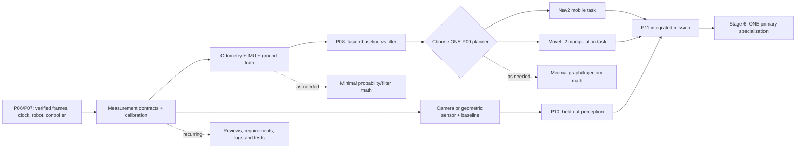

# Robotics Engineering — Stage 04: Estimation + Perception + Planning

**Standalone, low-level execution curriculum for months 15–22 of the seven-stage robotics learning graph**  
**Overall journey:** 30–36 months at 12–18 focused hours/week for the common robotics core plus focused proficiency in **ONE** selected specialization; multiple proficiency-depth tracks extend the horizon.  
**This file's horizon:** approximately **34 weeks** (months 15–22); **408–612 focused hours** at 12–18 h/week, with a **510-hour reference plan at 15 h/week**. Milestones are **gate-dependent**, not automatic calendar achievements.  
**Source alignment:** expands §2 (just-in-time math), §7–12 (kinematics, control, ROS, estimation, perception and planning), §15–18 (verification, schedule, review and projects), and §20 (staged budgets) of *Complete Robotics Engineering Roadmap* (September 2026). Follows [`Robotics_Stage_03_ROS2_and_Robot_Software_Months_07-14.md`](Robotics_Stage_03_ROS2_and_Robot_Software_Months_07-14.md). The parent places **P08 and partial P10 in months 15–18**, then **ONE P09 planning mode, P10 completion and P11 integration in months 19–22**.  
**Graph lane:** `4 — Estimation + Perception + Planning (builds on the software stack)`; optional math belongs to lane 5 **only when needed**. Stage 6 (specialization, months 23–36) starts after a bounded P11.

> **Safety and scope:** Simulation-first. An optional physical P11 is limited to a reviewed, supervised **low-energy** robot with operator override and **independently engineered energy isolation/protective measures appropriate to the actual hazard**. ROS 2 topics, planners, vision models, software watchdogs, cloud dashboards, Internet APIs and LLMs are **not safety-rated stop functions**. Never connect an unreviewed prototype to hazardous machinery or public-road autonomy. Field/defense-adjacent work later remains **non-weaponized**: logistics, inspection, remote sensing, search-and-rescue support and survey/hazard mapping only—**no weapon integration, target selection or autonomous engagement**. Public standards or a homemade test suite are **not certification or program authorization**.

## Contents

1. Stage contract, entry/exit evidence and E/W/P definitions
2. Dependency graph and honest parallel streams
3. Workload, math-at-the-gate and architecture boundaries
4. Atomic curriculum: measurements, filtering, perception, planning and system integration
5. P08 — Sensor fusion: formal project gate
6. P10 — Perception: formal project gate
7. P09 — Nav2 **OR** MoveIt 2: two alternative formal gates
8. P11 — Integrated prototype: formal project gate
9. Thirty-four-week schedule and every-four-week deliverables
10. Review, metrics, experiment design, failure diagnosis and repository
11. Named credentials, primary resources and cost staging
12. Behind-schedule triage and Stage-6 handoff

---

## 1. Stage contract — a bounded autonomous task, not universal autonomy

| Field | Stage-4 requirement |
|---|---|
| Months / weeks | **15–22**; approximately stage weeks 1–34, extended whenever an upstream gate or review is incomplete |
| Entry artifacts | P01–P05 models/control evidence; tagged **P06/P07** releases; canonical frames and units; sim-time policy; URDF/Xacro; working controller; repeatable Gazebo launch/rosbag2/fault test |
| Main chain | timestamp/calibration/ground truth → odometry + IMU baseline → bounded filter (**P08**) → bounded perception (**P10**) → **one** planning path (**P09**) → mission integration + failure recovery (**P11**) |
| Primary robot | Retain the **same Stage-3 rover or arm** when possible; a two-wheel rover is the lowest-friction Nav2 route |
| Gate order | P08 before localization-dependent navigation; P10 may overlap P08 and P09; P09 chosen mode before P11 final acceptance |
| Formal gates | **P08 Sensor fusion; P10 Perception; P09 Navigation/manipulation; P11 Integrated prototype** |
| Target depth | **W** basic calibration/fusion, a bounded perception pipeline, one planning mode and integrated failure handling; **E** unchosen planning mode, full SLAM internals, particle-filter theory and research-grade learning |
| Output | One reproducible robot completing one safe task with baseline-vs-improved measurements, exception behavior, bounded retry/stop and documented SIM/BENCH limits |
| Not required | Full Nav2 **and** MoveIt 2, custom SLAM, learned navigation, large language agent control, multi-robot coordination, flying hardware, formal safety qualification or production field deployment |

**E — Exposure:** can explain and reproduce a guided example. **W — Working competence:** independently implement and debug a bounded feature and demonstrate evidence. **P — Focused proficiency:** design, integrate, fault-test, review and maintain a repeatable system in a stated envelope. **Stage 4 aims for W in one bounded integrated system, not P across all autonomy research.**

### 1.1 Entry checklist: bring the real Stage-3 packet forward

- [ ] A fresh clone builds P06/P07 with pinned ROS/Gazebo-compatible versions; record host OS, distro and commit.
- [ ] Diagram names the canonical `map`, `odom`, `base_link`, sensor and tool frames actually used; distinguish `map → odom` from `odom → base_link`.
- [ ] Each sensor/topic has frame, units, sampling rate, timestamp source, covariance status and validity behavior.
- [ ] Gazebo `/clock`, `use_sim_time`, pause and reset behavior are repeatable and documented.
- [ ] Wheel/joint command, state feedback, controller limits, stale-command behavior and restart state are verified.
- [ ] P07 has an intentionally injected fault with logs and a regression test; unresolved faults are in an issue list.
- [ ] Stage-2 physical stop/isolation review status is clear. If unavailable, select **SIM ONLY** now; do not stall the software stage waiting for hardware.
- [ ] Choose a *single* principal mission: indoor waypoint inspection rover **or** guarded/tabletop simulated pick/place arm.

### 1.2 Exit checklist: month 22

- [ ] P08 demonstrates calibrated/synchronized inputs and **baseline vs fused-state** error/drift with units, timestamps and uncertainty.
- [ ] P10 demonstrates a defined inspection or geometric perception problem on **held-out** data, including changed conditions, latency and false-result analysis.
- [ ] P09 passes a bounded **Nav2 OR MoveIt 2** task with limits, collision/obstacle response and recovery from a failed plan/action.
- [ ] P11 links sensing → estimated state → task/plan → bounded local command/feedback → observation/decision log.
- [ ] A blocked route, failed grasp, dropped/stale sensor and rejected command lead to finite retry, safe no-motion behavior or explicit operator intervention—not endless loops.
- [ ] For SIM: claims identify simulator ground truth/simulated sensors. For BENCH: separate actual measured quantities, approved test area and real stop verification.
- [ ] The independent local stop/energy isolation boundary is represented honestly and remains independent of cloud/Internet and ROS command delivery.
- [ ] Independent tester can install, launch, execute, observe, inject the documented fault, replay and run tests from the release commit.
- [ ] Month-18 estimation review, P09/P11 integration review, final issue-action log and unresolved limitations are attached.

---

## 2. Dependencies and safe parallel learning



**Solid arrows = completion dependency; dashed arrows = work that can overlap or returns only on a measured problem.** The two P09 branches are alternatives. Learn the other only at E level if useful; a second working planner is **not a Stage-4 gate**.

| Stream | Start | Parallel with | Dependency / stop point | Evidence |
|---|---|---|---|---|
| Sensor timing and frame contract | Week 1 | all streams | before comparing data | recorded frame/time table and tests |
| Math: probability, covariance, simple filtering | Weeks 1–8 | P08 measurements | needed for P08 | small derivations + numerical unit tests |
| Camera/geometry and P10 baseline | Weeks 5–16 | P08, then P09 setup | before P11 if perception used in mission | annotated test set or geometric reference |
| One chosen planner | Week 17 onward | P10 error analysis, docs | requires relevant state/control interface | reproducible planned task + failures |
| Code/CI/data provenance | Week 1 onward | all | every gate | clean install, tests, versioned configs |
| Review and correction | Weeks 4, 16, 24, 32–34 | all | release sign-off | specific review questions and fixed regression |
| Optional physical robot | after approved Stage-2 review and SIM integration | P11 only | never a blocker for SIM W | separately labeled physical test packet |

**Path nuance:** a Nav2 rover normally needs usable localization/state and a map or map-localization assumption. A MoveIt 2 arm needs validated joint states, joint/tool frames, limits, collision model and scene updates; P08 can still be completed on a small simulated wheel/IMU fixture or appropriate joint/sensor-estimation subproject. Do **not** pretend that wheel-odometry fusion is automatically the arm's pose estimator.

---

## 3. Time budget, minimum math and architecture

### 3.1 510-hour reference distribution

| Module | Nominal hours | Target | Gate |
|---|---:|---|---|
| Scope, requirements, P07 baseline and data/time contract | 25 | W | all |
| Statistics, sensor calibration and ground truth | 55 | W | P08/P10 |
| Odometry, IMU error modeling and baseline | 65 | W | P08 |
| One bounded fusion method + consistency/fault tests | 65 | W | P08 |
| Geometric/inspection perception + test data | 75 | W | P10 |
| One planning stack and scenario design | 95 | W one mode | P09 |
| Mission/state-machine integration | 60 | W | P11 |
| Fault injection, comparison, review/rework and reproducibility | 70 | W verified | all |
| **Total** | **510** | | |

These hours **include** study, tests, calibration, debugging, revision, project write-up and any optional course learning. Do not add a second 200-hour certificate program on top of the 510 hours without extending the schedule.

### 3.2 Just-in-time mathematics, not a second mathematics degree

| Gate trigger | Strict minimum now | Prove it with | Defer until an actual need |
|---|---|---|---|
| P08 data | mean, variance, standard deviation, covariance, unit conversions, interpolation/time | plot error and sensor lag with labels | stochastic-process theory |
| P08 filter | conditional probability intuition; Gaussian noise; linear least squares; simple Kalman predict/update; Jacobian linearization **only if** using EKF | implement/inspect 1D example; compare odometry vs fusion | particle filters, UKF internals, factor graphs |
| P10 geometry | projective geometry basics only for a camera path; intrinsics/distortion; transforms; confusion matrix | calibration/reprojection or geometric error report | deep-learning architecture research |
| P09 Nav2 | occupancy grid idea, graph nodes/edges, A*/Dijkstra intuition, cost/feasibility, velocity/acceleration constraints | explain failed or rerouted plan | SLAM solver internals, multi-agent planning |
| P09 MoveIt 2 | FK/IK/Jacobian use, joint limits, end-effector frame, collision geometry and trajectory limits | pose-to-joint/collision/replan test | Lie derivations, full numerical solver design |
| P11 | use existing control and state estimates; Boolean conditions, state-machine transitions, bounded timeouts | fault-state transition log | MPC, formal verification research |

**Return-to-optional-math rule:** identify a **recorded** failure; establish a simpler baseline; study the smallest theory needed; show measured benefit in accuracy, failure rate, latency or stability; record limitations. Full `SO(3)/SE(3)` formalism, particle filters, factor-graph optimization, custom SLAM, MPC and advanced dynamics remain **E/deferred** unless your chosen bounded task explicitly requires them.

### 3.3 System separation (do not blur it in P11)

```text
                    OPERATOR / NONCRITICAL DASHBOARD
                                  |
                           mission request
                                  v
 Camera / range ----> PERCEPTION ---> task validator / supervisor
                           |                   |
Encoder + IMU ---> STATE ESTIMATION             v
             |                |          planner: Nav2 OR MoveIt 2
             +-------> local status              |
                                               bounded command
                                                    v
                        locally supervised control / actuation
                                                    |
                                 independent hazard-appropriate
                                protective stop / energy isolation

Logging + bagging observe all layers; cloud/IoT is OPTIONAL and NON-SAFETY-CRITICAL.
```

- [ ] State which layers exchange **requests**, which exchange **measurements**, and which have authority over actual motion.
- [ ] Define validity time, frame, units and explicit rejection/timeout for every motion-related interface.
- [ ] Define what loss of Internet, ROS graph, perception, localization and planner does to local behavior.
- [ ] If physical actuation is planned, obtain qualified review of the hazard/risk boundary and protective measures **before power-on**, not after a successful demo.

---
## 4. Atomic curriculum — check a skill only after its evidence exists

**Tags:** `[CORE/W]` required for the chosen P08–P11 implementation; `[SUPPORT/E]` helpful orientation; `[LATER]` deliberately outside the stage. Use short issue IDs/commit links for completed items. “Read the tutorial” is not acceptance evidence.

### 4.1 Requirements, experiment design and sensor-data contract [CORE/W]

- [ ] Write one-page operational design domain: robot type, controlled area, speed/joint range, objects, lighting, terrain/surface, task, known exclusions.
- [ ] Specify one measurable success target for state error, perception, task completion, maximum retries and observed stop/hold behavior **before testing**.
- [ ] Inventory simulated/physical sensor models, measurement ranges, frames, noise settings, failure modes and configured rates.
- [ ] Distinguish **accuracy**, **precision/repeatability**, **resolution**, **bias**, **latency**, **jitter** and **drift**; show one example of each.
- [ ] Identify command time, measurement acquisition time, ROS receive time and observation/log time; do not treat them as interchangeable.
- [ ] Declare frame-convention, angle wrap, yaw sign, degrees/radians and metres/millimetres for each dataset.
- [ ] Record static sensor mounting/extrinsic transforms and their source (CAD, simulation config or physical calibration).
- [ ] Design a bag/CSV schema: `timestamp`, `frame_id`, `measurement`, `units`, `quality`, `source`, `calibration_version`, `simulation_or_hardware`.
- [ ] Record simulator ground truth separately and explain that **ground truth must not be leaked into the estimator**.
- [ ] Define reference/ground-truth limitations: simulation truth is not a real-world calibrated reference.
- [ ] Design separate development/tuning and held-out evaluation scenarios; do not tune until the reported final score looks good.
- [ ] Document repeat count, random seeds, reset method and inclusion/exclusion rule for failed runs.

**Micro-lab:** record the same stationary robot/sensor scenario three times, estimate apparent bias/noise and inspect timestamp monotonicity.  
**Evidence:** `docs/measurement_contract.md`, one rosbag/CSV sample, calibration config, `tests/test_units_frames_time.*`.

### 4.2 Probability, uncertainty and filtering primitives [CORE/W]

- [ ] Compute sample mean, standard deviation, variance and RMSE by hand for a tiny recorded series; distinguish sample vs population convention.
- [ ] Explain systematic offset vs random variation, correlation, covariance and covariance units (e.g. `m²`, `rad²`).
- [ ] Plot normal-distribution intuition and identify examples that are **not** well modeled as independent Gaussian noise.
- [ ] State when independent measurement errors can and cannot be combined by a simple weighted average.
- [ ] Implement a 1D constant-velocity predictor with explicit `dt` and process-noise assumption.
- [ ] Implement or trace a 1D Kalman predict and update: prior → innovation → gain → posterior; test a missing measurement.
- [ ] Show how increasing measurement noise changes filter weighting and estimated covariance.
- [ ] Show how increasing process noise changes lag/responsiveness; do not choose values solely because a plot looks smooth.
- [ ] Distinguish covariance **reported by a filter** from demonstrated real-error calibration.
- [ ] Guard zero/negative/nonfinite covariance inputs, uninitialized state and numerical divergence.
- [ ] Add simple angle wrap/unwrap and verify yaw errors near `−π / +π` rather than comparing raw angles.
- [ ] Learn Jacobian-based linearization only for a selected nonlinear EKF model; validate dimensions and finite-difference intuition.
- [ ] Interpret innovation/residual plots and obvious outliers without claiming rigorous filter consistency from a handful of trials.

**Micro-lab:** synthetic sensor with tunable bias, dropout and outlier; compare naive average, dead reckoning and bounded filter.  
**Evidence:** short math notebook, numeric tests, residual/error/uncertainty plots and written model assumptions.

### 4.3 Sensor calibration and time alignment [CORE/W]

- [ ] Verify each sensor's ROS message type, physical unit, `frame_id`, measurement range and update rate using CLI/bags.
- [ ] Check whether the simulator's reported IMU angular velocity and acceleration refer to the expected body frame and axes.
- [ ] Check encoder tick/revolution, quadrature convention, gear ratio and effective wheel radius against Stage-2 notes.
- [ ] Measure stationary IMU offset and repeatability; label simulator parameters separately from actual measured calibration.
- [ ] Compute or validate camera intrinsics/extrinsics **if** P10 uses a camera; state calibration target and image-size dependence.
- [ ] Check fixed extrinsics (`base_link → imu_link`, `base_link → camera_link`) with a transform lookup and visual frame diagram.
- [ ] Choose resampling/interpolation/drop policy for unequal sensor rates; **do not synthesize future information into past estimates**.
- [ ] Detect out-of-order, duplicate, stale and zero timestamps; test clock pause/reset and wall-vs-sim-time mismatch.
- [ ] Decide which pipeline measurements are usable when a transform is unavailable at the correct time; do not silently use the newest transform.
- [ ] Save calibration version next to the dataset and update the test when configuration changes.
- [ ] Add one deliberate time-offset fault; quantify impact on position or detection error.

**Micro-lab:** change one IMU yaw bias and one timestamp delay in simulation; demonstrate which diagnostic caught each.  
**Evidence:** calibration note, timestamp-alignment plot, raw/processed bags, transform/time rejection tests.

### 4.4 Kinematics, encoder odometry and ground-truth comparison [CORE/W]

- [ ] Re-derive differential-drive `v = r(ω_R + ω_L)/2` and `ω = r(ω_R − ω_L)/b` from Stage 1; state `r`, `b` and wheel sign convention.
- [ ] Convert wheel encoder counts/rate to radians/s and chassis speed using the documented pulses-per-revolution interpretation.
- [ ] Simulate forward Euler or midpoint integration with explicit `dt`; test zero motion, straight, in-place and curved turns.
- [ ] Set and test the odometry source and frame contract, e.g. `odom → base_link` with locally continuous odometry.
- [ ] Distinguish command velocity from measured wheel velocity and from reference/ground truth.
- [ ] Demonstrate wheel-radius mismatch, track-width mismatch and slip/model error on accumulated pose.
- [ ] Plot trajectory, position/yaw errors and drift over time and path length, not only a single final screenshot.
- [ ] Ensure reset origin, initial pose and angle wrapping match between runs.
- [ ] Compare several known motion scenarios and explain why dead reckoning drifts even if instant wheel-speed noise is small.
- [ ] If your primary robot is an arm: retain an honest *separate mobile P08 simulator* or define a legitimate alternate state-estimation target—do not relabel joint-state publication as wheel/IMU fusion.

**Micro-lab:** scripted square/circle/stop-and-go trajectory under ideal vs mismatched wheel parameters.  
**Evidence:** reference and odometry CSV/bag, reproducible plots, unit/frame tests, error table.

### 4.5 IMU model, sensor failure and bounded sensor fusion [CORE/W]

- [ ] Identify gyro bias, acceleration noise, gravity treatment and yaw observability limitations; distinguish relative yaw from absolute heading.
- [ ] Verify orientation quaternion validity and normalization when an orientation estimate is present; do not fabricate an absolute heading.
- [ ] Draw data flow: wheel measurement → odometry; IMU reading → validated input; filter → estimate + covariance; diagnostics → operator.
- [ ] Choose **one** justified fusion approach: complementary heading filter, bounded custom KF/EKF, or correctly configured existing ROS integration such as `robot_localization`.
- [ ] Explain every filter input's frame, timestamp, covariance, enabled fields and whether two inputs share a correlated source.
- [ ] Prevent double counting wheel encoder information as independent observations (e.g. odometry pose and twist treated as unrelated when derived from the same source).
- [ ] Show filter startup, initial covariance and behavior on missing IMU, missing odometry and sensor restart.
- [ ] Guard stale measurements, invalid quaternions, NaN, impossible jumps and implausible covariance.
- [ ] Compare **odometry-only**, **IMU-only where meaningful**, and **fusion** under identical scenarios/seeds.
- [ ] Calculate metrics for position/yaw error, drift/time, stale-data counts and estimator latency; include worst/median or percentile as appropriate.
- [ ] State when fusion does **not** improve results and why; a filter is not automatically an accuracy upgrade.
- [ ] Plot uncertainty against error and document unproven calibration/consistency claims.
- [ ] Test incorrect IMU yaw sign or wrong static transform and confirm the diagnostic and regression protect against it.
- [ ] Decide how downstream planning responds to confidence/health loss (hold/relocalize/operator intervention); do not silently continue using stale pose.

**Micro-lab:** replay identical path with baseline, fused estimate, IMU loss and wrong-frame injection.  
**Evidence:** P08 report, comparison notebook, configs, raw/replayed bag references and failure matrix.

### 4.6 Perception problem definition, sensor/image fundamentals [CORE/W]

- [ ] Choose **one** bounded use case: marked-station detection, camera-based part PASS/FAIL, tabletop object pose, or a simple geometric obstacle/survey observation.
- [ ] Specify sensor placement, region of interest, lighting/rendering, object range, smallest feature and update rate.
- [ ] Define perception output schema: label/pose/shape, frame, acquisition time, confidence/quality, validity and model/calibration version.
- [ ] Separate object *existence/classification*, object *location/pose* and *tracking*; choose only what the mission needs.
- [ ] If using images, understand pixels, channels, image shape, exposure, blur, distortion, camera intrinsics and optical frame convention.
- [ ] If using depth/range, understand range limits, invalid returns, angle resolution, occlusion and transforming into the robot frame.
- [ ] Draw physical/virtual sensor field of view and blind spots; state where no observation is possible.
- [ ] Build a simple deterministic baseline before introducing an ML detector: threshold, color/shape, fiducial, edge, known target geometry or range filtering.
- [ ] Test known negatives as well as true targets; do not judge quality only by “a box appeared.”
- [ ] Record processing latency and frame drop; specify behavior on stale image or invalid output.

**Micro-lab:** fixed-station detection with a positive set, negative set and one changed-lighting/occlusion set.  
**Evidence:** baseline script, dataset manifest, schema, measured latency and failure examples.

### 4.7 Camera/geometry calibration and reference-frame correctness [CORE/W for camera-based P10]

- [ ] Read/display the raw source with exact dimensions, channels and acquisition timestamp; preserve raw data for replay.
- [ ] Learn the pinhole projection relationship and meanings of focal length, principal point and distortion coefficients.
- [ ] Calibrate with diverse board poses or clearly document simulator-provided intrinsic parameters; avoid measuring accuracy on the same images used for calibration.
- [ ] Report intrinsic matrix, distortion model, calibration image size and reprojection error with units/pixel interpretation.
- [ ] Verify camera optical-frame axis convention and static `base_link → camera_link` transform.
- [ ] Distinguish `camera optical → target`, `base → target` and `world → target`; test transform multiplication order.
- [ ] If estimating object pose, compare against a known simulated pose or independently prepared reference; report translation and angle error separately.
- [ ] Test target partly outside field of view, repeated pattern, reflection/glare and target not detected; report invalid status rather than invented pose.
- [ ] Use fiducials only as educational observation aids, not as a substitute for full autonomous localization claims.

**Micro-lab:** place a marker/known part at three distances and three rotations; report pose residuals and failed detections.  
**Evidence:** calibration folder, transform tests and held-out pose-error plot.

### 4.8 Classical CV, learned perception and reproducible evaluation [CORE/W baseline; SUPPORT/E learned model]

- [ ] Implement a baseline with minimal preprocessing; parameter values, color conversion and morphology must be versioned.
- [ ] Make a small, documented dataset with image/source IDs and labels (or known simulated geometric truth).
- [ ] Split by **scene/session/object instance** where needed to prevent near-duplicate train/test leakage; keep the final test set held out.
- [ ] Define TP/FP/TN/FN for the exact inspection/recognition task; use a confusion matrix on held-out data.
- [ ] Calculate precision, recall and false-reject/false-accept rates when meaningful; for pose/range, use distance/angular error instead.
- [ ] Report detection latency separately from sensor acquisition latency and end-to-end mission reaction time.
- [ ] Test at least two shifted conditions (lighting, noise, motion blur, occlusion, sensor/dropout or background).
- [ ] Save and explain several false positives/negatives or bad pose estimates rather than showing only successful screenshots.
- [ ] If a pretrained neural model is used, record model/version/license, preprocessing, inference device, runtime and failure cases; **not mandatory**.
- [ ] Document confidence threshold and how low confidence changes task state; do not equate model confidence with calibrated probability without evidence.
- [ ] Test camera disconnect, delayed detections, malformed frames and stale result suppression.
- [ ] Keep P10 bounded; a single well-evaluated inspection/geometry pipeline is enough for this gate.

**Micro-lab:** compare a deterministic detector against an optional learned baseline on the *same held-out conditions*.  
**Evidence:** `data/README.md`, evaluation code, confusion/error table, plots, latency benchmark, caveats.

### 4.9 Planning principles shared by both branches [CORE/W]

- [ ] Separate mission/task planning from geometric path, time-parameterized trajectory and local feedback control.
- [ ] Distinguish robot state validity, task preconditions, collision constraints and command-lifetime constraints.
- [ ] Explain obstacle/collision model, clearance or joint limits and assumptions about map/scene freshness.
- [ ] Compare nominal plan and replanned alternative after an environmental change; log why the first plan failed.
- [ ] Show what happens if the map/scene is unavailable, stale, inconsistent or the goal is unreachable.
- [ ] Decide retry count, backoff and escalation; write a finite-state diagram rather than leaving recovery to an unbounded `while` loop.
- [ ] Compare motion completion against real/simulated state feedback rather than treating “command sent” as “task done.”
- [ ] State the difference between planned trajectory and an independent protective-stop function.
- [ ] Record success, rejection, timeout, cancel, preempt and interrupted-restart behavior.

**Micro-lab:** scripted mission with normal route, blocked route/failed grasp and unavailable state.  
**Evidence:** state/sequence diagram and a bag/log demonstrating every terminal outcome.

### 4.10 Nav2 branch — select ONLY if P09 = mobile navigation [CORE/W when selected]

- [ ] Select indoor two-wheel rover model, measured/simulated geometry and already-bounded velocity controller.
- [ ] Decide map scenario: known simulated map and localization source; do not claim full SLAM merely because a packaged system publishes a map.
- [ ] Trace `map → odom → base_link` ownership; prevent two simultaneous publishers of the same transform.
- [ ] Identify localization input, global map, local obstacle data, footprint, inflation/clearance and robot radius geometry.
- [ ] Configure lifecycle/bringup components using documentation matching the installed Nav2 release.
- [ ] Inspect costmap frame, resolution, update frequency, source freshness and robot footprint/clearance.
- [ ] Set bounded max linear/angular speed, accelerations and controller constraints consistent with P05/P07.
- [ ] Understand global path vs local control; observe a blocked path, replanning and behavior-tree/recovery event.
- [ ] Send a goal in the correct frame with valid initial pose; verify actual pose progression and goal tolerances.
- [ ] Stop/cancel a task and show that locally appropriate bounded motion behavior follows.
- [ ] Test an unreachable goal, sudden obstacle, invalid pose, map/TF error, stale scan and controller timeout.
- [ ] Log path length, completion time, clearance/near-collision proxy, retries and scenario success fraction.
- [ ] Document whether localization is ground-truth-assisted or estimated and how that limits any autonomy claim.
- [ ] Refuse a “working Nav2” sign-off for a robot that moves only when RViz manually teleoperates it.

**Micro-lab:** station A → B → C, with one blocked corridor and one deliberately stale/invalid state run.  
**Evidence:** Nav2 config, behavior log, map/world manifest, mission video and repeated results.

### 4.11 MoveIt 2 branch — select ONLY if P09 = manipulation [CORE/W when selected]

- [ ] Reuse P03/P07 robot URDF/Xacro, joint limits, inertials and correct joint-state/controller naming.
- [ ] Identify `base_link`, arm links, tool frame/TCP, planning group and end-effector group where relevant.
- [ ] Verify FK/IK for reachable and unreachable poses using consistent transform conventions.
- [ ] Generate/check matching semantic robot description and planning configuration for installed MoveIt 2 version.
- [ ] Define valid planning scene, table/fixture geometry, object dimensions and self-collision assumptions.
- [ ] Verify joint/velocity/acceleration limits; start with a slow, simulated, low-energy trajectory.
- [ ] Plan and execute in simulation, observe real/simulated joint feedback and validate final pose.
- [ ] Check reachable vs unreachable goals, joint-limit rejection and obstacle insertion after a plan was calculated.
- [ ] Test failed IK, stale scene, gripper/attachment assumption mismatch, action timeout and controlled cancel/replan.
- [ ] If doing pick/place, separate **grasp pose estimation** from **motion planning**; use a simple known object first.
- [ ] Quantify target pose error, plan success fraction, computation time, collision/constraint rejection and completion time.
- [ ] Explain why a collision-free **simulated** plan is not proof of safe physical human–robot interaction.

**Micro-lab:** tabletop pose → collision object added → replan or reject → reset → bounded pick/place-style motion.  
**Evidence:** MoveIt configuration, scene/robot geometry, runs and failure diagnostics.

### 4.12 Mission integration, supervisor and handoff [CORE/W]

- [ ] Define explicit states: `DISABLED → INITIALIZE → CHECK_INPUTS → READY → EXECUTE → VERIFY → COMPLETE` plus `HOLD`, `FAULT`, `ABORT` and authorized reset.
- [ ] Document authority and preconditions for every transition; no automatic return from `FAULT` to motion merely because a topic resumes.
- [ ] Validate estimator health/staleness, perception freshness, planner availability and local controller status before each actionable step.
- [ ] Gate perception-driven decisions on the defined confidence/quality/validity threshold; never assume every frame contains a target.
- [ ] Reject physically invalid goals, frame mismatches, out-of-range velocities/joints and expired commands.
- [ ] Make retries finite and log reason, attempt number and terminal outcome.
- [ ] Handle operator cancel/override, missed completion message, service/action timeouts and restart mid-task.
- [ ] Keep local control and appropriate protective-stop measures independent of cloud/dashboard availability.
- [ ] Distinguish emergency/protective stop, ordinary task abort, software hold and “command zero”; they have different assurance levels.
- [ ] Define recovery to a *known state*: do not assume you know pose after a reset or communications gap.
- [ ] Link each mission event to timestamp, state estimate quality, detection/result, plan ID, robot ID, software/config version and bag/log file.
- [ ] Add a minimal operator status display **only if needed**; show stale/unknown state conspicuously.
- [ ] Create regression scenarios for startup, nominal task, perception miss, planning failure, lost state and clean shutdown.
- [ ] Expose all unresolved safety and real-world limitations in README and capstone handoff.

**Micro-lab:** run one valid task and five deliberately triggered failure/abort/recovery cases from a launch script.  
**Evidence:** transition diagram, `docs/verification_matrix.md`, event log, tests and final report.

### 4.13 Quality, CI, performance and security supporting work [CORE/W]

- [ ] Preserve a clear release for P08/P09/P10/P11 and fixed configuration for every reported evaluation.
- [ ] Unit-test transform direction, angle wrap, numerical integration, timestamp rejection and input validity.
- [ ] Integration-test publisher/subscriber QoS match and stale message behavior under actual installed stack.
- [ ] Use `pytest`/`ament` or corresponding C++ tests and a clean `colcon test` run; document external dependencies.
- [ ] Store simulation seeds/world/map/model settings and dataset provenance; do not commit private or uncontrolled datasets.
- [ ] Separate offline plots from runtime loops; record CPU use, frame drops, planner delay and control command rate where relevant.
- [ ] Define logging retention/privacy and access; do not publish workplace/proprietary images without permission.
- [ ] Add a security boundary note: ROS graph and machine LAN are not automatically authenticated/safe; no Internet exposure by default.
- [ ] Verify robot remains locally bounded if a noncritical cloud analytics service or dashboard is disconnected.
- [ ] Request one narrow, reproducible external review question rather than posting an entire unexplained repository.

### 4.14 Optional topics: read only if the chosen task justifies them [SUPPORT/E or LATER]

- [ ] **E only:** SLAM lifecycle/map/loop-closure vocabulary, not implementing a custom backend.
- [ ] **E only:** particle filters, UKF, factor graphs or nonlinear optimization if the simple fusion baseline succeeds.
- [ ] **E only:** the unchosen P09 planner (Nav2 or MoveIt 2) and its interface differences.
- [ ] **E only:** learned perception, GPU optimization, segmentation and tracking when a geometric baseline suffices.
- [ ] **LATER:** multi-robot coordination, off-road field qualification, production fleet IoT, autonomous flight, advanced MPC, formal safety certification and cloud-based safety logic.

---
## 5. P08 — Sensor fusion: formal project/gate (months 15–18)

**Purpose:** produce and validate a pose/heading/state estimate from wheel odometry and IMU on a small rover **with explicit baseline and uncertainty evidence**. If the principal P09 platform is an arm, complete P08 using an independent simple simulated rover or clearly documented estimation fixture; a filter that blindly republishes ground truth fails the gate.

### 5.1 Minimum architecture and data

```text
Known trajectory / reference (EVALUATION ONLY)
                         |
                metric comparison
                         ^
ENCODERS -> validated wheel odom ---> filter ---> estimated state + covariance
IMU ------> validated IMU -----------^                 |
                         |                             v
                 timestamps, frames,             diagnostics / P09
                 bias/noise policy
```

**Required artifacts:** raw/cleaned data; model/calibration report; baseline implementation; chosen fusion config/code; repeatable replay; plots and quantified test set; fault scenarios; SIM/BENCH provenance; test cases; review log.

### 5.2 P08 acceptance checklist

- [ ] Pose/heading reference trajectory and how it was obtained are documented; reference is not an estimator input.
- [ ] Correct wheel/IMU frame transforms, units, stamp sources and calibration assumptions are verified.
- [ ] At least two independently explained baseline outputs are available: encoder-only odometry and selected fusion; IMU-only where meaningful.
- [ ] At least three varied motion cases (e.g. straight, turns and stop/start) are replayable with known seed or log.
- [ ] Position and heading error are plotted over time plus at least one aggregate metric; label `m`, `rad/deg`, `s` correctly.
- [ ] Covariance/uncertainty interpretation is explicit and not asserted to be statistically calibrated without validation.
- [ ] Sensor noise, bias, loss and timestamp issue appear in the fault table, with demonstrated downstream response.
- [ ] Data from SIM are not described as measured hardware; unobserved real-world slip and calibration limits are listed.
- [ ] A second person reviews one frame/time and one uncertainty/ground-truth assumption and leaves an actionable review record.
- [ ] New maintainer can rerun script/test + generate the plots without hidden manual edits.

### 5.3 P08 experiment matrix (choose numeric targets before the run)

| Case | Controlled change | Compare/log | Expected kind of result (not a universal pass threshold) |
|---|---|---|---|
| F0 | nominal motion | baseline/fused error, stamps, covariance | clear reproducible reference comparison |
| F1 | encoder scaling or wheel slip in simulation | drift and diagnostics | error increase explained, no false “perfect estimate” |
| F2 | IMU bias/noise | heading drift, estimate responsiveness | plausible trade-off documented |
| F3 | missing IMU or odom | staleness and hold/degraded behavior | finite explicit response |
| F4 | stale/out-of-order stamp | reject/drop or documented handling | no silent future-pose misuse |
| F5 | wrong frame sign/mount transform | error/validation checks | catches fault or records known blind spot |

### 5.4 P08 example result table to fill (do not invent measured numbers)

| Metric | Units | Encoder only | Selected fusion | Test conditions / caveat |
|---|---|---:|---:|---|
| Position RMSE | m | TBD | TBD | held-out motion set |
| Heading RMSE | rad | TBD | TBD | angle-wrap aware |
| Final position drift | m | TBD | TBD | same elapsed time/path |
| Processing latency | ms | TBD | TBD | defined measurement-to-output timing |
| Invalid/stale samples | count | TBD | TBD | stated fault run |

**Depth sign-off:** **W** for the **bounded modeled scenarios**, not general localization or SLAM proficiency. The filter need not beat the baseline on every metric; if it does not, identify why and demonstrate that the experimental comparison is valid.

---

## 6. P10 — Perception: formal project/gate (partial months 15–18; finish 19–22)

**Purpose:** produce *one* dependable, time-/frame-valid observation for a task—for example inspect a known part, detect a marked loading station, locate a tabletop object, or recognize an obstacle/survey feature. It is **not** required to train a large deep-learning model.

### 6.1 Choose one P10 mode

| Mode | Smallest useful output | Good example | Avoid claiming |
|---|---|---|---|
| Visual inspection | `PASS/FAIL/UNKNOWN` + timestamp/quality | known glass-part cosmetic check under controlled imaging | general production defect certification |
| Fiducial or geometric pose | target ID/pose + frame/covariance or quality | marked docking station / tabletop object | perfect 3D world localization |
| Range/depth geometry | obstacle or fixture distance/shape + validity | static low-energy indoor rover obstacle | certified collision avoidance |
| Optional learned model | bounded class/pose + failure thresholds | compare against geometric baseline | universal robustness under all conditions |

### 6.2 P10 acceptance checklist

- [ ] Problem, negatives, success metric and source/split of evaluation data were fixed before tuning.
- [ ] Camera/depth geometry and sensor validity are documented where applicable; optical-frame convention is verified.
- [ ] A simple deterministic baseline is implemented and tested; optional ML comparison is clearly labeled.
- [ ] Output has timestamp, `frame_id`, units, confidence/quality/unknown semantics and explicit stale state.
- [ ] Validation/evaluation set includes changed conditions not used to tune the threshold/model.
- [ ] Pose/distance error **or** precision/recall/false-decision evidence is reported with a confusion/error table.
- [ ] Median and tail latency or a defensible bounded sample-rate report is included, with hardware/simulation provenance.
- [ ] No-detection, false positive, occlusion or degraded-lighting case is logged and handled by mission supervisor.
- [ ] Debug images and analysis plots are reproducible without exposing prohibited, private or proprietary content.
- [ ] P10 feeds only validated, non-safety-critical task observations to P11; it is not an independent protective stop.

### 6.3 P10 experiment matrix

| Case | Shift / fault | Required observation |
|---|---|---|
| V0 | standard background/lighting | baseline metric and latency |
| V1 | lighting/exposure change | robustness/error comparison |
| V2 | blur, partial occlusion or changed distance | failed-detection and confidence reporting |
| V3 | negative scene (target absent) | false positives, `UNKNOWN` behavior |
| V4 | stale/disconnected camera or range source | freshness timeout and task hold |
| V5 | incorrect intrinsics/extrinsics (sim/test) | frame/pose regression or known limitation |

**Depth sign-off:** **W** in this evaluated sensor/task envelope; **E** in advanced CV/ML methods not actually implemented. A polished successful video without a negative test set fails P10.

---

## 7. P09 — one planning path: Nav2 mobile OR MoveIt 2 manipulation

**Gate selection rule:** write the selected path in `docs/stage4_scope.md` by the start of month 19. The other path is **E** and does not occupy P09 acceptance time. P10 can complete while P09 is integrated, but must be signed off before perception-driven P11 sign-off.

### 7A. Mobile P09 — Nav2 indoor route scenario

**Minimum vertical slice:** valid estimated pose + correct map/frames → route/goal → planner/path → bounded controller interface → progress/stop → explicit failure/recovery.

- [ ] Known map/world and robot footprint are versioned; obstacle/clearance settings match the simulated robot.
- [ ] Localization source and transforms are valid at time of navigation; reset/start pose is documented.
- [ ] Bringup launches one compatible Nav2 configuration rather than mixing examples from different releases.
- [ ] Robot visits at least two defined goals in one indoor scenario; success is checked from state feedback.
- [ ] A blocked route triggers a documented bounded response: replan, alternative route, no-path failure or operator request.
- [ ] Out-of-bounds/unknown goal, missing TF, stale localization/scan and cancel are tested.
- [ ] Speed and acceleration are bounded; local stop on lost commands is shown **in simulation** and independent physical stop is not misclaimed.
- [ ] Report repeated-run task success, completion time, route length and recovery counts; state map/ground-truth assumptions.

### 7B. Manipulation P09 — MoveIt 2 tabletop task

**Minimum vertical slice:** validated robot description + correct joint states → target pose → collision-aware plan → bounded trajectory → actual sim state feedback → end-state verification.

- [ ] Planning group, tool frame, joints, velocity/acceleration limits and collision objects match P07 model.
- [ ] Execute a valid path between at least two defined poses; verify final joint/end-effector state.
- [ ] Insert a new fixture/obstacle and demonstrate valid replan **or explicit safe rejection**.
- [ ] Unreachable target, stale scene/pose, self-collision/joint-limit and cancellation are tested.
- [ ] If pick/place is selected, separate detection/object pose from gripper attachment and planner success.
- [ ] Report repeated-run plan/execution success, pose error, compute time, goal tolerance and failures.
- [ ] Do not claim force-safe human interaction from collision-free virtual paths.

### 7.1 Shared P09 fault matrix

| Failure | Required proof |
|---|---|
| Unreachable goal / invalid grasp | finite rejection, logged reason |
| Dynamic obstacle / changed scene | bounded replan or abort |
| Missing/stale state | do not execute using apparently valid but expired pose |
| Lost planner/action server | supervisor timeout, no endless retry |
| Cancel / operator stop request | task cancellation confirmed and appropriate local behavior stated |
| Restart during task | state reconstruction or explicit UNKNOWN/await authorization |

**Depth sign-off:** **W** in **one** planner and one bounded scenario; **E** unchosen planner and advanced algorithms. A planner that never handles failure is not P09 complete.

---

## 8. P11 — Small integrated prototype: formal project/gate (finish by month 22)

**Mission options — choose one:**

| Route | Safe bounded mission | Integration proof |
|---|---|---|
| Mobile inspection rover | in simulation, navigate between marked indoor stations; record a simple sensor/visual inspection; return or wait after unexpected condition | P08 pose → P09 Nav2 → P10 station/inspection output → mission supervisor → feedback/fault log |
| Tabletop manipulation | in simulation, identify or use a known benign object pose, plan a slow pick/place-style move, report success/failure, halt on invalid observation | validated joint states → P10 pose/inspection → P09 MoveIt 2 → supervisory states and bounds |
| Optional physical follow-on | same task on a **reviewed, guarded low-energy** platform with operator present | label SIM and physical measurement separately; additional hazard/stop review and permission |

### 8.1 P11 architecture and scope checklist

- [ ] One-page mission requirements state boundary, initial condition, success/failure and unacceptable behavior.
- [ ] Block diagram clearly shows estimation, perception, planner, local control, user, logging and separately engineered protective measures.
- [ ] Interface table specifies topic/action/service, unit, frame, acquisition time, expiry and source of truth.
- [ ] Explicit state machine and human-override path are implemented/documented.
- [ ] Predeclared verification matrix maps each requirement to test/log/acceptance criterion.
- [ ] Configuration/commit identifiers link every run to model, filter, detector and planner parameter sets.
- [ ] Physical hardware is **not** required for Stage-4 software W if safe access is unavailable; mark P11 `SIM ONLY`.

### 8.2 Mandatory P11 demos

- [ ] Nominal: complete one chosen task from documented reset and show measured vs requested end state.
- [ ] P08 trouble: sensor dropout/time fault makes state invalid or degraded; appropriate task hold/relocalization/abort occurs.
- [ ] P10 trouble: target absent, stale result or false detection is rejected/handled, not turned into unchecked motion.
- [ ] P09 trouble: blocked route/failed grasp reaches finite recovery or operator intervention.
- [ ] Local command trouble: command expiry/controller unavailability gives documented no-motion/fault behavior.
- [ ] Operator cancel: robot enters known supervised state; automated restart does not silently resume risky motion.
- [ ] Recovery: after fault reset, verify pose/configuration/preconditions before re-enabling the task.
- [ ] Reproduction: second person can run normal and fault scripts and reproduce reports from same commit.

### 8.3 P11 SIM vs BENCH claim table

| Claim | SIM-only evidence supports | Optional BENCH requires |
|---|---|---|
| Transform/time/interface correctness | source, unit tests, simulator bags, regression | compare physical sensor frames and clock behavior |
| Planner/perception behavior in chosen envelope | fixed-world trials, synthetic/recorded observations | real sensor conditions and supervised guarded task |
| Motor/stop behavior | software command/timeout + simulator observation | qualified review, independent protective measures, appropriate measured stop/energy behavior |
| Localization accuracy | error against **simulated** reference | physical reference/metrology, actual drift, slip and calibration |
| Safety compliance / certification | **never implied** | separate applicable professional standards, qualified assessment and legal/organizational approval; a bench demo alone still does not certify |

### 8.4 P11 report template

```text
Project / release tag:
Chosen mode: Nav2 OR MoveIt 2
Operating envelope and exclusions:
SIM / reviewed BENCH provenance:
Architecture and independent protective-measure boundary:
Requirements and prespecified acceptance metrics:
Calibration, frames, timestamps and source-of-truth:
Reference data and held-out test split:
P08/P09/P10 release links:
Repeated nominal-task results:
Fault-injection outcomes and measured recovery:
External reviewer, comments and action resolution:
Open defects and conditions for safe handoff:
```

---
## 9. Thirty-four-week execution plan — months 15–22

**Calendar convention:** stage weeks 1–17 ≈ months 15–18; weeks 18–34 ≈ months 19–22. A month is not exactly four weeks. Apply the schedule to **gate evidence**, not merely attendance. P10 begins alongside P08; finish P08 before state-dependent P09 integration. P09 selects one planner; P11 consumes all three relevant gate outputs.

| Stage week | Primary work and low-level deliverable | Safe parallel work | Weekly proof |
|---|---|---|---|
| 1 | P07 baseline replay; define robot mission and SIM/BENCH provenance | literature and reviewer outreach | tagged baseline and one-page scope |
| 2 | map frames, sensor schema, time acquisition and log fields | math: units/statistics | contract + one bag inspection |
| 3 | truth/reference policy; mean/variance/RMSE notebook | P10 problem/dataset plan | test of a synthetic metric |
| 4 | repeatable baseline scenarios; deliberately stale timestamp | review and documentation | **Demo 1:** reference/raw measurement with failed-case log |
| 5 | encoder wheel geometry and odometry integration | camera/range setup | ideal straight/turn trajectories |
| 6 | wheel radius, heading and wrap regression tests | P10 baseline detector | odometry error plot |
| 7 | IMU bias, noise and transforms | P10 negative samples | IMU assumptions + static-transform test |
| 8 | odom/IMU synchronization and missing-sample handling | first external question | **Demo 2:** drift + timestamp error reproduction |
| 9 | 1D filter, `dt`/covariance sanity | camera intrinsics if needed | predict/update notebook |
| 10 | select fusion implementation and input config | P10 calibration | first fused run with no hidden truth input |
| 11 | baseline-vs-fusion plots and scenarios | P10 held-out set capture | error/drift comparison |
| 12 | sensor loss, bias and frame-fault injection | review requests | **Demo 3:** fusion nominal + fault |
| 13 | correct estimator defects; covariance/latency limits | P10 shifted conditions | corrected comparison and tests |
| 14 | finish P08 scripts, readme and provenance | P10 error table | clean replay and independent setup |
| 15 | P08 external review: frames, stamps, truth and uncertainty | P10 baseline refinement | review issue log |
| 16 | **P08 formal sign-off** or schedule extension | P10 partial demo | **Demo 4:** P08 acceptance packet + P10 baseline |
| 17 | protected review/rework buffer; choose ONE P09 mode | P10 held-out evaluation | signed planning scope, not two modes |
| 18 | Nav2: map/TF/costmap; OR MoveIt: groups/scene | P10 false-case audit | planner brings up in correct sim |
| 19 | initial valid task and state feedback | P10 timestamp/quality output | first goal with measured result |
| 20 | obstacle/collision and limits | P10 shift tests | **Demo 5:** planned task vs changed scene |
| 21 | bounded replan/failed goal | metrics/CI | fail/abort trace |
| 22 | cancellation, timeout, stale pose/scene | P10 test execution | explicit terminal outcome log |
| 23 | repeatability tests and controller constraints | P10 metrics | repeated-run P09 table |
| 24 | planner external review and rework | P10 final write-up | **Demo 6:** P09 nominal + failure evidence |
| 25 | complete P10 independent evaluation and review | begin mission supervisor | **P10 sign-off** with held-out error/latency |
| 26 | P09 final integration defects, freeze planner config | P11 requirements/verification | **P09 sign-off** or shift P11 right |
| 27 | compose P08/P09/P10 interface table and architecture | scripts/docs | P11 data and command contracts |
| 28 | implement supervisor state machine + normal task | reviewer invitation | **Demo 7:** end-to-end SIM mission |
| 29 | sensor/perception/planner stale-data handling | diagnostics | staged failure test logs |
| 30 | operator cancel and command/timeout scenarios | regression tests | bounded task abort and restart |
| 31 | repeat trials and measure mission outcome | SIM/BENCH claim review | result table with declared test set |
| 32 | end-to-end external review and rework | portfolio README | **Demo 8:** normal + deliberately failed mission |
| 33 | independent clean setup and replay; fix top review issue | tagged releases | second-person reproduction |
| 34 | **P11 final acceptance and Stage-6 handoff** | specialization choice, only orientation | verified artifact packet, limitations and backlog |

**Every 4 weeks:** short video or GIF, commands used, measured plot/table, *one failed case*, commit/tag and explicit action list. **Every 12 weeks:** reserve review/rework capacity; if a gate slips, shift subsequent gated tasks to the right, not into nonexistent spare evenings.

### 9.1 Reference weekly workload (15 hours)

| Stream | Hours/week | Evidence |
|---|---:|---|
| Just-in-time math/calibration theory | 2 | derivation or data check attached to current gate |
| ROS/Python/C++ implementation | 4 | functional change and automated test |
| Simulation/data/calibration | 3 | logged experiment or measurement |
| Project integration/fault testing | 4 | repeatable nominal and adverse runs |
| Documentation, review and planning | 2 | small design note, issue and reviewer follow-up |

If 12 hours/week, reduce **nonessential breadth**, not frames, calibration, test provenance, stop behavior or negative tests. If a physical setup is delayed, complete the SIM route and document the missing BENCH validation instead of mixing its cost and schedule into the mandatory gate.

---

## 10. Feedback, measurement quality and debugging

### 10.1 Required outside review checkpoints

| Window | Reviewer focus | What to send | Acceptance evidence |
|---|---|---|---|
| Weeks 4–8 | measurement/clock/frame contract | minimal node graph, sensor schema, sample bag, one timestamp fault | changed tests, acknowledged open questions |
| **Month 18 / weeks 15–17** | P08 estimation, bias, covariance, truth separation, odom/IMU correlation | short derivation/config and before/after plots, exact ROS version, failure reproduction | external finding → fix or documented limitation → rerun |
| Weeks 22–26 | P09 selected planning mode and P10 negative-case evaluation | map/scene, transform tree, scenario command, shifted-condition results, timeout log | bounded test matrix corrected after comments |
| Weeks 32–34 | P11 integration and physical/sim safety claims | mission state graph, verification matrix, short logs and README | independently reproduced demo and an issue/action log |

**Where to ask:** a university robotics/controls lab, ROS community/Robotics Stack Exchange, a focused project PR, relevant sensor-vision or robotics mentor, local makerspace. Seek qualified personnel for **physical power, stop and hazard review**. Forum approval does not certify a machine or qualify a system for industrial or defense work. Public posts must not contain controlled, proprietary or private engineering data.

```text
Reviewer request — Stage 4
Commit + ROS/Gazebo versions:
SIM or authorized low-energy BENCH:
Question: (one narrow failure, not "review my robot")
Frames, acquisition timestamps, units:
Expected result / actual metric:
Nominal run + failing run + exact reproduction:
Input logs/calibration and sensor-truth separation:
Proposed correction and regression test:
Known safety or information boundary:
```

### 10.2 Common numerical metrics and honest interpretation

| Quantity | Example definition | Pitfall |
|---|---|---|
| Position RMSE | sqrt(mean((estimated x−reference x)^2 + (estimated y−reference y)^2)) | reference alignment/simulator truth hidden in estimator |
| Heading RMSE | angle-wrapped error before squaring | discontinuity at ±π |
| Detection precision/recall | TP/(TP+FP), TP/(TP+FN) where defined | no negative examples or mislabeled denominator |
| Pose error | translation distance and rotation error separately | frames/units or calibration test leakage |
| End-to-end latency | sensor acquisition → validated output or completed local action | confusing publish time with acquisition time |
| Task success | completed predeclared mission / attempted valid trials | counting failures as “excluded after inspection” |
| Recovery behavior | fault → hold/abort/replan → terminal state, with time | measuring “zero velocity command” as independent protective stop |

**Do not use arbitrary universal acceptance thresholds.** Set project-specific limits before testing, justify against the task and control envelope, and report the sample size plus actual observed distribution. A student may set a modest educational threshold for a simulated route; it is **not** a production or safety standard.

### 10.3 Fault and diagnostic decision tree

| Symptom | First checks | Reproducible fix/test |
|---|---|---|
| Filter jumps or drifts unexpectedly | wrong frame/sign, IMU bias, wheel scale, time order, simulator truth leakage | compare raw/reference and single-source baselines |
| Covariance appears tiny but error large | optimistic input noise, shared/correlated sources, stale measurement | inspect residuals; repeat with bias/loss |
| `tf2` lookup or Nav2 pose fails | transform ownership, frame names, `use_sim_time`, stamp availability | graph/tree dump and stale/paused-clock test |
| Vision boxes shift with robot motion | optical frame, intrinsics/extrinsics, target/reference frame | known fiducial or static test pose |
| Detector works in demo but fails evaluation | leakage, lighting shift, missing negatives | held-out scene split and confusion table |
| Planner accepts impossible goal | incorrect footprint/collision/limits, map/scene staleness | deliberately unreachable goal and obstacle regression |
| Motion persists after network/action loss | no local timeout, controller config, misunderstanding of stop layers | simulated lost-command test; BENCH qualified review separately |
| P11 restarts unpredictably | state machine implicit, stale persisted goal, inconsistent reset pose | fail/restart test with event/state trace |

### 10.4 Suggested Stage-4 repository layout

```text
robotics-stage-04/
├── README.md                    # precise setup and scope: SIM vs BENCH
├── docs/
│   ├── stage4_scope.md
│   ├── architecture.md
│   ├── measurement_contract.md
│   ├── calibration_and_frames.md
│   ├── hazard_log.md
│   ├── verification_matrix.md
│   ├── review_action_log.md
│   └── stage4_final_report.md
├── configs/
│   ├── robot_description_and_control/
│   ├── estimator/
│   ├── perception/
│   └── nav2_or_moveit2/
├── ros2_ws/src/                # valid ROS package layout inside
├── simulation/                 # robot/world/scenario and seed configs
├── experiments/
│   ├── p08_fusion/
│   ├── p10_perception/
│   ├── p09_selected_planner/
│   └── p11_integration/
├── data/README.md              # external bags/labels + provenance
├── scripts/                    # safe run/record/reproduce wrappers
├── tests/                      # unit + integration + fault scenarios
└── .github/workflows/          # software CI, not safety certification
```

**Independent reproduction checklist:** install matching dependency versions → source the correct ROS overlay → run automated tests → start simulator → execute known mission → inject documented failure → generate metrics/plots from source. Include expected time/compute requirements, no hard-coded private paths, no hidden service credentials and clear instructions for keeping physical actuators disconnected in SIM mode.

---
## 11. Named credentials, primary resources and spending

### 11.1 Exact credentials / course titles: optional, never a replacement for a gate

**Distinguish an independently examined certification from a course-completion certificate.** Some robotics training programs give completion records, not universally standardized professional certifications. Confirm the **current actual award name, issuer, syllabus, price, examination/completion requirements and availability** on the provider's site *before* paying or putting a name on your CV. No generic “ROS Certified Engineer” or “Certified Nav2 Engineer” is assumed.

| Named program or exact title to verify | Type / issue to verify | Stage-4 placement | Portfolio pairing |
|---|---|---|---|
| **Modern Robotics: Mechanics, Planning, and Control Specialization** — Northwestern University / Coursera | university-hosted online course specialization; certificate conditions/provider title to verify | selected kinematics/planning chapters only; do not complete all courses merely for a badge | P09 + Stage-1 P03, explicit model/trajectory evidence |
| **Control of Mobile Robots** — Georgia Institute of Technology / Coursera | historical course title; **verify whether still available and whether a certificate is currently issued** | optional mobile-control review if relevant | P08 and mobile P09 plots |
| **The Construct — ROS 2 Basics in 5 Days** | provider training/completion record; Stage-3 carry-forward | only if a ROS fundamentals gap blocks P09 | P06/P07 + Stage-4 tests |
| **Linux Foundation Certified System Administrator (LFCS)** | separately examined Linux certification | only if target robotics software job needs Linux administration and not already completed | repeatable robotics environment/diagnostics |
| **GitHub Foundations** | GitHub certification | only if workflow/CI credibility is a current CV gap | public tests, PRs and reproducible P08–P11 |

**Specialization credentials come later (Stage 6)**—e.g. selected industrial robot vendor training or a cloud platform certification for IoT. Do not devote month 19–22 to stacking cloud/Kubernetes/AWS certifications at the expense of P08–P11. Course examples are **not claims that those credentials are accredited, mandatory, currently on sale or accepted by a specific employer**.

### 11.2 Primary learning resources: use the relevant chapter or tutorial, not an extra full curriculum

- [ROS 2 Jazzy documentation](https://docs.ros.org/en/jazzy/) — installed-version topics, time, `tf2`, messages, nodes and data recording.
- [`robot_localization` project](https://github.com/cra-ros-pkg/robot_localization) — existing state-estimation software; verify ROS distro/package documentation and config semantics before adopting it.
- [Nav2 official documentation](https://docs.nav2.org/) — **only** if the mobile P09 branch is selected; match installed distro/behavior configuration.
- [MoveIt 2 official documentation](https://moveit.picknik.ai/) — **only** if manipulation P09 is selected; check release compatibility.
- [`ros2_control` documentation](https://control.ros.org/) — state/command interfaces, controllers, bounded feedback.
- [ROS 2 `tf2` tutorials](https://docs.ros.org/en/jazzy/Tutorials/Intermediate/Tf2/Tf2-Main.html) — revisit for frame/time issues.
- [OpenCV documentation](https://docs.opencv.org/) — geometry, calibration, basic vision and negative-case evaluation.
- [Modern Robotics](https://modernrobotics.northwestern.edu/) — frames, kinematics and selected planning sections.
- [MIT Underactuated Robotics](https://underactuated.mit.edu/) and [Feedback Systems](https://fbsbook.org/) — specific filtering/control reasoning as needed, not compulsory complete reading.
- [NumPy](https://numpy.org/doc/), [SciPy](https://docs.scipy.org/doc/scipy/), [Matplotlib](https://matplotlib.org/stable/) — numerical checks and repeatable metrics.

**Compatibility rule:** one supported, documented Ubuntu/ROS/Gazebo/`ros2_control`/Nav2-or-MoveIt stack. Treat links as references to **reverify when studying**, not timeless package-install commands. Prefer the working Stage-3 Jazzy/Harmonic baseline over casual upgrades mid-P09.

### 11.3 Stage-4 budget — incremental spend only after the next verified gate

The parent roadmap assigns **$150–500 incremental to the shared P06–P11 integrated-small-robot hardware stage**, NOT $150–500 separately to Stage 3 and Stage 4. If that hardware was already purchased for P07, **do not count it again**. Costs below are September 2026 *planning categories*, **not live quotations**; local taxes, shipping and exchange rates vary. Hardware bands exclude already-owned PC, tuition, paid credentials, professional labs and real site commissioning. Allow a 15–25% purchasing contingency.

| Gate / item | When justified | Planning approach / budget | No-purchase route and honest limitation |
|---|---|---|---|
| P08 synthetic wheel/IMU, ground truth, bagging and filter | weeks 1–16 | **$0 software/hardware incremental** if existing PC runs Stage-3 sim | SIM verifies math/software; not real slip, interference or metrology |
| P10 simulated camera/depth or public permitted dataset | weeks 5–25 | **$0 incremental** if compatible sim and data are available | camera calibrations in simulation do not measure physical camera distortion |
| P09 Nav2/MoveIt 2 | weeks 18–26 | **$0 open-source license** for named packages | fixed simulated scenario not proof of real indoor autonomy |
| Optional camera, IMU, wheel sensor or mounting upgrade | only after gap is proven | from **remaining shared $150–500 P06–P11 hardware band**, not an extra compulsory purchase | synthetic sensor and documented missing hardware validations |
| Optional low-energy physical P11 | after full SIM gate + qualified safety review | only if proper supervisor, protected power and facility are available; actual costs can exceed the parent band | SIM-only P11 at W in bounded software integration |
| External mentor or paid course/certificate | if it resolves a real blocker | separate variable spend; **not a mandatory gate** | targeted community review and official documentation |

**Stop purchasing if the next experiment can be run with existing logs or simulation.** Buying a lidar, camera, industrial manipulator or cloud subscription is not itself P08–P11 progress. A certified real cell or formal qualification is **not covered** by this self-study budget.

---

## 12. Behind-schedule triage and transition to Stage 6

**Rule:** reduce breadth before weakening the shared foundations. Missing gate evidence extends the roadmap; the calendar cannot declare a gate passed. For the parent 24-month fallback, P11 may be a **bounded SIM orientation/integration**, not a claim of broad industrial/field/IoT proficiency.

| Checkpoint | Load-bearing: protect or repair | Safe to defer | Recovery action |
|---|---|---|---|
| Stage week 4 | P07 launch, frames, clock, measurement contract, reference separation | advanced probability, extra sensors | freeze baseline; produce one recorded stationary/motion dataset |
| **Month 18 / P08** | units, timestamps, odom/IMU validity, baseline, uncertainty intuition, error/drift and fault evidence | full SLAM, UKF, particle filters, factor graphs, PX4 | use one simple filter and recorded/synthetic inputs; finish P08 with negative cases, extend timeline if needed |
| Stage week 20 / planning start | **ONE** runnable Nav2 or MoveIt path with correct frames, feedback and bounds | second planner, custom algorithms, photorealistic world | revert to a known indoor rover or simple two-link tabletop arm |
| Stage week 25 / P10 | one held-out perception pipeline, validity, error and latency | neural network architecture studies, multi-class catalog, advanced tracking | use marked station/geometric detector with documented negatives |
| **Month 22 / P11** | selected planner, estimator/perception validity, finite recovery, operator override, tests and reproducibility | physical robot, cloud/IIoT, production sensors, multi-robot tasks, extra specialty | ship an honestly labeled SIM-only P11 with open BENCH backlog; push Stage 6 start right if P11 incomplete |

**Never cut:** frame direction, units, acquisition timestamps, calibration/provenance, baseline-vs-improved comparison, held-out negatives, local command expiry, fault termination, protective-measure boundaries, permission for physical tests and the distinction between test evidence and certification. If physical hazards cannot be managed, **stay in simulation/de-energized setup**.

### 12.1 Red flags: do not mark the gate complete

- [ ] P08 uses simulator truth as a filter input or has no baseline/reference comparison.
- [ ] One system uses wall time and another uses simulation time without documented alignment.
- [ ] P08 covariance is silently missing, zero, invented or presented as proven statistical consistency.
- [ ] P10 is evaluated on its tuning set or only on positive/showcase examples.
- [ ] P09 completes only a pre-recorded animation, teleoperation or a planner path without measured execution.
- [ ] Both planning stacks were started but neither has a full fault-tested task.
- [ ] P11 follows stale pose/target, retries forever, resumes automatically after fault or has unknown restart state.
- [ ] A software command, ROS action cancellation or cloud button is misrepresented as independent safety-rated stop.
- [ ] SIM outcomes are described as measured hardware behavior or as certified industrial/defense capability.

### 12.2 Stage 6 handoff packet — common core → choose ONE primary specialization

| Artifact | Minimum handoff content | Supports later track |
|---|---|---|
| P08 | calibrated/state estimate, noise/time/frame assumptions and drift/fault logs | industrial localization/inspection; field degradation; IoT telemetry quality |
| P10 | bounded observation/inspection with held-out error and staleness | factory QA; field survey/inspection; noncritical fleet events |
| P09 | one navigation or manipulation stack with failure recovery | warehouse/cell, logistics/inspection, task reporting |
| P11 | reproducible integrated SIM or reviewed BENCH task with stop boundaries and operator authority | P12 industrial/field capstone or P13 IoT fleet integration |
| Verification packet | requirements→test matrix, external review, negative cases, known failure envelope | every selected specialization |
| Security/data boundary | correct access rights and no controlled/proprietary data in public artifacts | particularly workplace and later defense-adjacent programs |

**Next graph lane:** Stage 5 — **Optional / As-Needed Mathematics** is a *return lane* invoked by a real P08–P11 failure, **not an extra compulsory 2–4-month block**. Stage 6 — **choose Industrial Robotics, Rugged-Field/Defense-Adjacent (non-weaponized), or IoT/IIoT Robotics Integration**, months 23–36 nominal, after P11. Stage 7 — **ongoing parallel habits**—has been active throughout: docs/tests monthly, demo every 4 weeks, outside review around every 12 weeks, staged purchasing and a simulation/safety-first approach.

### 12.3 Final Stage-4 definition of done

```text
Verified P06/P07: frames + clock + robot model + bounded control
                          |
          P08: timed odom/IMU + calibrated fusion evidence
                          +
          P10: one held-out perception/inspection result
                          +
          P09: Nav2 mobile OR MoveIt 2 manipulation
                          +
 P11: one repeatable integrated mission + fault/override/recovery
                          +
       tests + external review + honest SIM/BENCH claims
                          =
  Stage 4 WORKING COMPETENCE in one bounded robotic task.
```

**North star:** “I can explain what my robot knows, what it observes, how it chooses and executes a bounded action, and what it does when one of those assumptions fails. I can demonstrate those claims with a reproducible release, quantified results, explicit limitations and an external review trail.”
