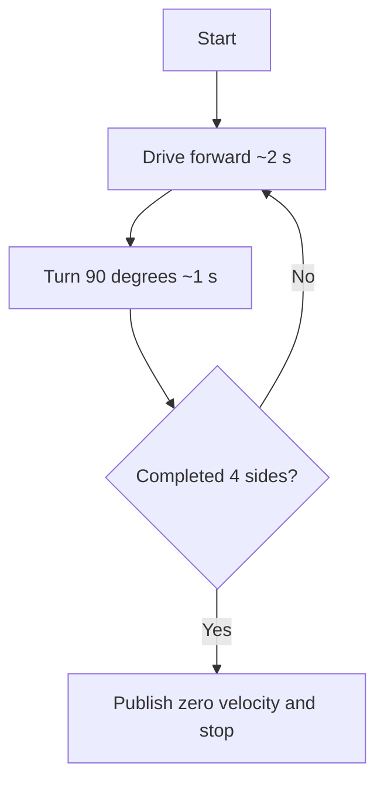

# ROS 2 Beginner Project: Autonomous Turtle Square Controller

> **Project type:** Beginner ROS 2 tutorial  
> **Target platform:** Ubuntu 24.04 LTS + ROS 2 Jazzy  
> **Language:** Python 3  
> **Simulation:** Turtlesim  
> **Hardware required:** None  
> **Outcome:** Create, build, run, and inspect a ROS 2 package that drives a simulated turtle around a square.

---

## 1. Project overview

In this project, you will build a small autonomous robot controller. The simulated robot is a turtle in **Turtlesim**, and your Python program is a ROS 2 **node**. It publishes `geometry_msgs/msg/Twist` velocity commands to make the turtle drive forward and turn 90 degrees four times.

### Learning objectives

By the end, you will be able to:

- Set up a ROS 2 development workspace.
- Recognize **nodes**, **topics**, **publishers**, **messages**, and **timers**.
- Create a Python package with `ament_python`.
- Build the package using `colcon` and run it with `ros2 run`.
- Inspect a live ROS 2 system from the terminal and with `rqt_graph`.
- Understand the limitation of time-based motion and how to improve it with pose feedback.

### System architecture

```mermaid
flowchart TD
    A[Python square_driver node] -->|Publishes Twist velocity at 10 Hz| B[/turtle1/cmd_vel topic]
    B --> C[Turtlesim node]
    C -->|Publishes Pose| D[/turtle1/pose topic]
    D -. Future upgrade: subscribe to position feedback .-> A
```

**Important:** This first version is an *open-loop*, time-based controller. It does not read the turtle's position. A later version can use `/turtle1/pose` for closed-loop control.

---

## 2. Prerequisites and installation

Use **Ubuntu 24.04 LTS** with **ROS 2 Jazzy**. You need a desktop session to view the Turtlesim window.

### 2.1 Check whether ROS 2 is already installed

```bash
ls /opt/ros
```

If `jazzy` appears, load it in your current terminal:

```bash
source /opt/ros/jazzy/setup.bash
```

### 2.2 Install the required packages

If you have not installed ROS 2, first configure the official ROS 2 apt repository following:

[Official ROS 2 Jazzy installation guide for Ubuntu](https://docs.ros.org/en/jazzy/Installation/Ubuntu-Install-Debs.html)

After configuring the repository, install:

```bash
sudo apt update
sudo apt install -y \
  ros-jazzy-desktop \
  ros-jazzy-turtlesim \
  ros-dev-tools
```

Load the ROS 2 environment:

```bash
source /opt/ros/jazzy/setup.bash
```

**Terminal rule:** Every new terminal needs the ROS 2 environment sourced. After building your own package, also source the workspace's `install/setup.bash` in terminals where you will use it.

---

## 3. Launch your first simulated robot

Open **Terminal 1**:

```bash
source /opt/ros/jazzy/setup.bash
ros2 run turtlesim turtlesim_node
```

A blue window with a turtle should appear.

Open **Terminal 2**:

```bash
source /opt/ros/jazzy/setup.bash
ros2 node list
ros2 topic list
```

Expected node:

```text
/turtlesim
```

Topics should include:

- `/turtle1/cmd_vel` — receives motion commands.
- `/turtle1/pose` — reports the turtle's position, orientation, and velocities.

You can inspect the command topic's message type:

```bash
ros2 topic info /turtle1/cmd_vel
```

---

## 4. Move the turtle manually from the CLI

Before writing Python, send a single forward-motion command in **Terminal 2**:

```bash
ros2 topic pub --once \
  /turtle1/cmd_vel \
  geometry_msgs/msg/Twist \
  "{linear: {x: 2.0}, angular: {z: 0.0}}"
```

The turtle should move briefly. One published message is only a short command, not continuous motion.

To publish continuously at 10 Hz and make the turtle move in a circle:

```bash
ros2 topic pub --rate 10 \
  /turtle1/cmd_vel \
  geometry_msgs/msg/Twist \
  "{linear: {x: 1.0}, angular: {z: 1.0}}"
```

Press **Ctrl+C** to stop publishing. You may reset Turtlesim before proceeding:

```bash
ros2 service call /reset std_srvs/srv/Empty "{}"
```

### Understanding the command

| Field | Meaning |
|---|---|
| `linear.x` | Forward speed of the turtle |
| `angular.z` | Rotation speed around the vertical axis |
| `geometry_msgs/msg/Twist` | ROS message containing linear and angular velocity vectors |
| `/turtle1/cmd_vel` | Topic to which movement commands are published |

---

## 5. Create a ROS 2 workspace and Python package

Create a workspace and its source folder:

```bash
mkdir -p ~/ros2_ws/src
cd ~/ros2_ws/src
```

Create your Python package:

```bash
ros2 pkg create turtle_square \
  --build-type ament_python \
  --license Apache-2.0 \
  --dependencies rclpy geometry_msgs
```

After you create the controller in the next step, the important project files will look like this:

```text
ros2_ws/
└── src/
    └── turtle_square/
        ├── package.xml
        ├── setup.py
        ├── setup.cfg
        ├── resource/
        │   └── turtle_square
        └── turtle_square/
            ├── __init__.py
            └── square_driver.py
```

**What these files do:**

- `package.xml`: metadata and package dependencies.
- `setup.py`: Python package installation and CLI executable registration.
- `setup.cfg`: executable installation paths for `ros2 run`.
- `square_driver.py`: your controller implementation.

---

## 6. Write your first ROS 2 node

Create the controller source file:

```bash
nano ~/ros2_ws/src/turtle_square/turtle_square/square_driver.py
```

Paste in the code below:

```python
import math

import rclpy
from geometry_msgs.msg import Twist
from rclpy.node import Node


class SquareDriver(Node):
    """Drive a Turtlesim turtle around an approximate square."""

    def __init__(self):
        super().__init__('square_driver')

        # Send movement commands to Turtlesim.
        self.publisher_ = self.create_publisher(
            Twist,
            '/turtle1/cmd_vel',
            10,
        )

        # Call move() 10 times per second.
        self.timer = self.create_timer(0.1, self.move)
        self.step = 0

        self.get_logger().info('Starting autonomous square movement')

    def move(self):
        command = Twist()

        # Each side takes about 3 seconds:
        # 2 seconds forward + 1 second turning.
        # Four sides x 30 ticks = 120 ticks total.
        if self.step >= 120:
            self.publisher_.publish(command)  # Zero velocity.
            self.timer.cancel()
            self.get_logger().info('Square completed!')
            return

        phase = self.step % 30

        if phase < 20:
            # Forward for approximately 2 seconds.
            command.linear.x = 1.0
        else:
            # Turn approximately 90 degrees in 1 second.
            command.angular.z = math.pi / 2

        self.publisher_.publish(command)
        self.step += 1


def main(args=None):
    rclpy.init(args=args)
    node = SquareDriver()

    try:
        rclpy.spin(node)
    except KeyboardInterrupt:
        pass
    finally:
        # Ask the simulator to stop before shutdown.
        if rclpy.ok():
            node.publisher_.publish(Twist())

        node.destroy_node()

        if rclpy.ok():
            rclpy.shutdown()


if __name__ == '__main__':
    main()
```

Save in Nano with **Ctrl+O**, Enter, then **Ctrl+X**.

### 6.1 How the controller works

| Component | Responsibility |
|---|---|
| `SquareDriver(Node)` | Creates a node named `square_driver` |
| `create_publisher()` | Publishes `Twist` messages to `/turtle1/cmd_vel` |
| `create_timer(0.1, ...)` | Runs the movement method at approximately 10 Hz |
| `phase < 20` | Drive straight for about 2 seconds |
| `phase >= 20` | Turn at approximately π/2 radians per second for about 1 second |
| `step >= 120` | Publish zero velocity and stop the timer |

### 6.2 Expected motion sequence



Because it uses time instead of position feedback, the actual path may not be a perfect closed square.

---

## 7. Register the executable in `setup.py`

Edit:

```bash
nano ~/ros2_ws/src/turtle_square/setup.py
```

Find the `entry_points` argument and set it to:

```python
entry_points={
    'console_scripts': [
        'square_driver = turtle_square.square_driver:main',
    ],
},
```

Keep the rest of the generated `setup.py` unchanged. This entry point maps the executable name `square_driver` to the `main()` function in your Python module.

---

## 8. Build your project

In a terminal with ROS 2 sourced, go to the workspace root:

```bash
cd ~/ros2_ws
colcon build --symlink-install --packages-select turtle_square
```

Source your workspace after the build completes:

```bash
source install/setup.bash
```

Confirm that ROS 2 found your executable:

```bash
ros2 pkg executables turtle_square
```

Expected output:

```text
turtle_square square_driver
```

**Tip:** `--symlink-install` makes iterating on Python code easier. However, changes to `setup.py`, package metadata, or registered entry points can still require another build.

---

## 9. Run the autonomous turtle

### Terminal 1 — Simulator

If Turtlesim is already running, reset its position before testing:

```bash
ros2 service call /reset std_srvs/srv/Empty "{}"
```

Otherwise, launch it:

```bash
source /opt/ros/jazzy/setup.bash
ros2 run turtlesim turtlesim_node
```

### Terminal 2 — Your controller

```bash
source /opt/ros/jazzy/setup.bash
source ~/ros2_ws/install/setup.bash
ros2 run turtle_square square_driver
```

The turtle should:

1. Move forward.
2. Turn about 90 degrees.
3. Repeat the forward-and-turn sequence until it has completed four sides.
4. Stop after its last turn.

You should also see log messages similar to:

```text
[INFO] [square_driver]: Starting autonomous square movement
[INFO] [square_driver]: Square completed!
```

Approximate path:

```text
    ┌───────────┐
    │           │
    │           │
    │           │
    └───────────┘
    START
```

**Note:** The timer stops after completion, but the ROS 2 process remains running because `rclpy.spin()` is still active. Press **Ctrl+C** when you're finished.

---

## 10. Inspect the running ROS 2 system

Open **Terminal 3** and source both environments:

```bash
source /opt/ros/jazzy/setup.bash
source ~/ros2_ws/install/setup.bash
```

While the controller is active, inspect the system:

```bash
ros2 node list
ros2 topic list
ros2 node info /square_driver
```

Read the turtle's position:

```bash
ros2 topic echo /turtle1/pose
```

Visualize the ROS graph:

```bash
ros2 run rqt_graph rqt_graph
```

The graph should show the `square_driver` node publishing on `/turtle1/cmd_vel`, which Turtlesim subscribes to. **Run `rqt_graph` while the nodes are active**; otherwise the graph may not show the controller.

Reset the simulation when needed:

```bash
ros2 service call /reset std_srvs/srv/Empty "{}"
```

---

## 11. Troubleshooting

| Problem | Likely cause | What to check |
|---|---|---|
| `ros2: command not found` | ROS 2 not installed or not sourced | Check `/opt/ros/jazzy` and source `setup.bash` |
| `Package 'turtle_square' not found` | Workspace not built or sourced | Run `colcon build`, then source `~/ros2_ws/install/setup.bash` |
| `No executable found` | Missing or incorrect `setup.py` entry point | Check entry-point spelling and rebuild |
| The turtle window does not appear | No desktop display or simulator not running | Run Turtlesim from an Ubuntu graphical desktop session |
| Turtle does not move | Controller is not publishing or simulator is stopped | Check `ros2 node list` and `ros2 topic echo /turtle1/cmd_vel` while the controller runs |
| Path is not perfectly square | Motion uses elapsed time, not pose feedback | Expected in the beginner version; improve using `/turtle1/pose` |
| Turtle runs into the window boundary | Started near an edge | Reset the simulator before running the controller |

---

## 12. Next project: Closed-loop square controller

The first implementation sends commands according to time, so it assumes the robot moves exactly as expected. Real autonomous systems typically need **feedback**.

Your next upgrade can:

1. Subscribe to `/turtle1/pose` to read the turtle's real-time position and heading.
2. Define four target coordinates that form a square.
3. Calculate the distance and heading error to the active target.
4. Use a simple proportional controller to update `linear.x` and `angular.z`.
5. Switch to the next target only after reaching a chosen distance tolerance.

```mermaid
flowchart LR
    A[Target point] --> B[Compute distance and heading error]
    C[/turtle1/pose feedback] --> B
    B --> D[Proportional controller]
    D --> E[/turtle1/cmd_vel]
    E --> F[Turtlesim]
    F --> C
```

This introduces **closed-loop control**, feedback, odometry concepts, and goal-based navigation—the foundations of more advanced autonomous mobile robots.

---

## References

- [ROS 2 Jazzy — Ubuntu installation](https://docs.ros.org/en/jazzy/Installation/Ubuntu-Install-Debs.html)
- [ROS 2 Jazzy — Turtlesim tutorial](https://docs.ros.org/en/jazzy/Tutorials/Beginner-CLI-Tools/Introducing-Turtlesim/Introducing-Turtlesim.html)
- [ROS 2 Jazzy — Creating a workspace](https://docs.ros.org/en/jazzy/Tutorials/Beginner-Client-Libraries/Creating-A-Workspace/Creating-A-Workspace.html)
- [ROS 2 Jazzy — Creating a Python package](https://docs.ros.org/en/jazzy/Tutorials/Beginner-Client-Libraries/Creating-Your-First-ROS2-Package.html)
- [ROS 2 Jazzy — Writing a simple Python publisher and subscriber](https://docs.ros.org/en/jazzy/Tutorials/Beginner-Client-Libraries/Writing-A-Simple-Py-Publisher-And-Subscriber.html)

