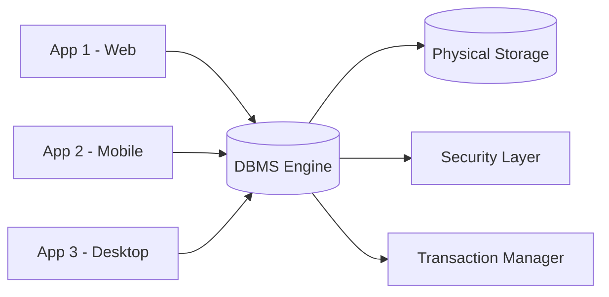
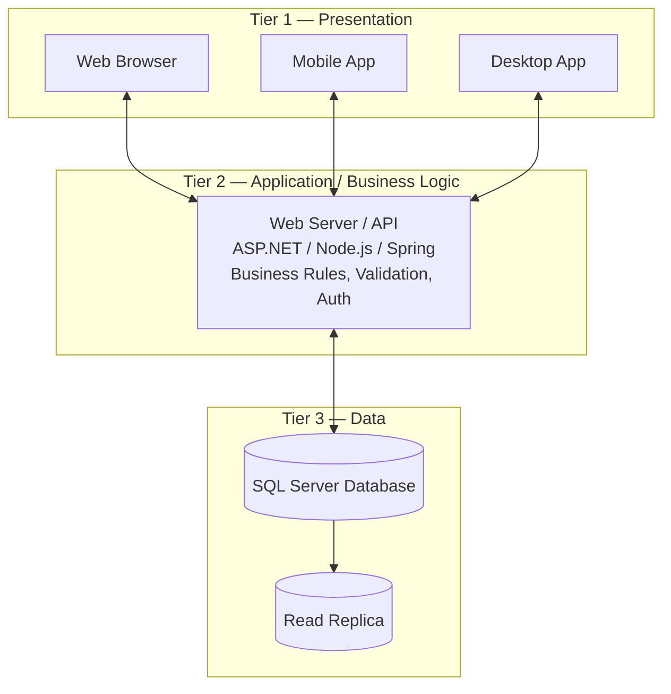
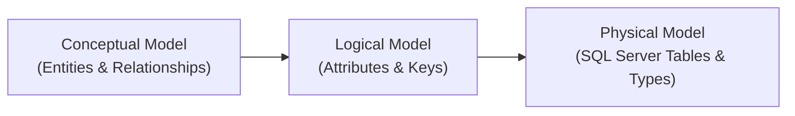
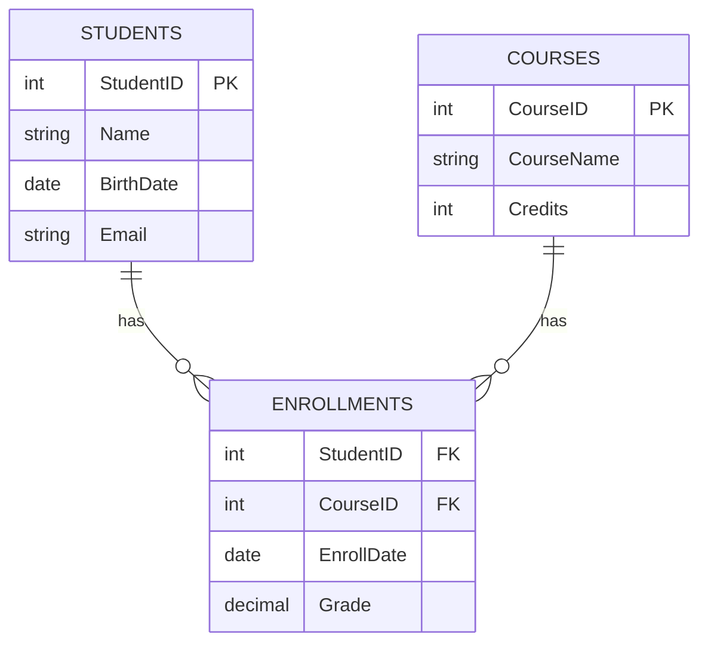
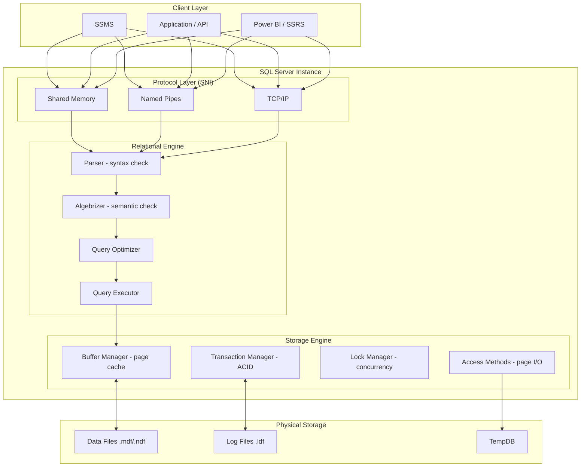
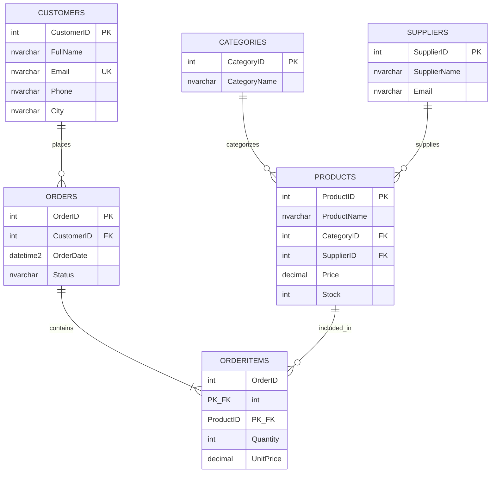

# Database & SQL Server Complete Course (ITI – Eng. Ramy)

> A complete, beginner-to-professional learning resource covering Eng. Ramy's ITI SQL Server playlist, Day 1 through Day 10. Every section includes all tricks, variations, edge cases, realistic sample databases, full `CREATE TABLE` + `INSERT` scripts, working queries with explanations and expected output, practice exercises, and interview tips.

---

## Table of Contents

- [1. Introduction & Database Fundamentals (Day 1)](#1-introduction)
  - [1.1 What is Data vs Information](#11-what-is-data-vs-information)
  - [1.2 What is a Database & DBMS](#12-what-is-a-database--dbms)
  - [1.3 Types of Databases](#13-types-of-databases)
  - [1.4 File System vs Database System](#14-file-system-vs-database-system)
  - [1.5 Database Users & Roles](#15-database-users--roles)
  - [1.6 Database Architecture (3-Tier)](#16-database-architecture-3-tier)
  - [1.7 Introduction to SQL Server](#17-introduction-to-sql-server)
  - [1.8 SQL Server Editions](#18-sql-server-editions)
  - [1.9 Types of SQL Commands (DDL, DML, DCL, TCL, DQL)](#19-types-of-sql-commands)
- [2. SQL Mapping, Schema & Creating Database (Day 2)](#2-sql-mapping)
  - [2.1 Data Models (Conceptual, Logical, Physical)](#21-data-models)
  - [2.2 Mapping ERD to Tables](#22-mapping-erd-to-tables)
  - [2.3 SQL Server Schemas](#23-sql-server-schemas)
  - [2.4 Creating a Database](#24-creating-a-database)
  - [2.5 Data Types in SQL Server](#25-data-types-in-sql-server)
  - [2.6 Creating Tables](#26-creating-tables)
  - [2.7 INSERT — All Forms & Tricks](#27-insert-all-forms)
  - [2.8 UPDATE — All Forms & Tricks](#28-update-all-forms)
  - [2.9 DELETE — All Forms & Tricks](#29-delete-all-forms)
  - [2.10 SELECT Statement — All Forms](#210-select-all-forms)
  - [2.11 DISTINCT & Aliases](#211-distinct--aliases)
  - [2.12 ORDER BY & Sorting](#212-order-by--sorting)
  - [2.13 TOP & Pagination (OFFSET-FETCH)](#213-top--pagination)
  - [2.14 NULL Handling (IS NULL, COALESCE, ISNULL, NULLIF)](#214-null-handling)
  - [2.15 Filtering Advanced (BETWEEN, LIKE, IN)](#215-filtering-advanced)
  - [2.16 Temporary Tables vs Table Variables vs CTEs](#216-temp-tables)
- [3. Joins & Normalization (Day 3)](#3-joins-normalization)
  - [3.1 The CompanyDB Sample Database](#31-the-companydb-sample-database)
  - [3.2 INNER JOIN](#32-inner-join)
  - [3.3 LEFT JOIN](#33-left-join)
  - [3.4 RIGHT JOIN](#34-right-join)
  - [3.5 FULL OUTER JOIN](#35-full-outer-join)
  - [3.6 CROSS JOIN](#36-cross-join)
  - [3.7 SELF JOIN](#37-self-join)
  - [3.8 Multiple Table Joins](#38-multiple-table-joins)
  - [3.9 Normalization (1NF, 2NF, 3NF, BCNF)](#39-normalization)
  - [3.10 Denormalization](#310-denormalization)
  - [3.11 Data Integrity Types](#311-data-integrity-types)
  - [3.12 Surrogate vs Natural Keys](#312-surrogate-vs-natural-keys)
- [4. Aggregate Functions, Grouping, Union, Subqueries (Day 4)](#4-aggregate-grouping-union-subqueries)
  - [4.1 Aggregate Functions](#41-aggregate-functions)
  - [4.2 GROUP BY](#42-group-by)
  - [4.3 HAVING vs WHERE](#43-having-vs-where)
  - [4.4 UNION & UNION ALL](#44-union--union-all)
  - [4.5 INTERSECT & EXCEPT](#45-intersect--except)
  - [4.6 Subqueries — All Types](#46-subqueries)
  - [4.7 Correlated Subqueries](#47-correlated-subqueries)
  - [4.8 EXISTS vs IN](#48-exists-vs-in)
  - [4.9 Query Rewriting Techniques](#49-query-rewriting-techniques)
- [5. Database Engine, Services & Ranking Functions (Day 5)](#5-engine-services-ranking)
  - [5.1 SQL Server Architecture](#51-sql-server-architecture)
  - [5.2 SQL Server Services](#52-sql-server-services)
  - [5.3 SSMS Tour](#53-ssms-tour)
  - [5.4 Window Functions Overview](#54-window-functions-overview)
  - [5.5 ROW_NUMBER()](#55-row_number)
  - [5.6 RANK()](#56-rank)
  - [5.7 DENSE_RANK()](#57-dense_rank)
  - [5.8 NTILE()](#58-ntile)
  - [5.9 PARTITION BY in Depth](#59-partition-by-in-depth)
  - [5.10 LAG() & LEAD()](#510-lag--lead)
  - [5.11 FIRST_VALUE() & LAST_VALUE()](#511-first_value--last_value)
- [6. Constraints & Database Objects (Day 6)](#6-constraints-objects)
  - [6.1 PRIMARY KEY](#61-primary-key)
  - [6.2 FOREIGN KEY](#62-foreign-key)
  - [6.3 UNIQUE Constraint](#63-unique-constraint)
  - [6.4 CHECK Constraint](#64-check-constraint)
  - [6.5 DEFAULT Constraint](#65-default-constraint)
  - [6.6 NOT NULL Constraint](#66-not-null-constraint)
  - [6.7 IDENTITY Column](#67-identity-column)
  - [6.8 ALTER TABLE Operations](#68-alter-table-operations)
  - [6.9 Database Diagrams & Relationships](#69-database-diagrams--relationships)
  - [6.10 Composite Keys](#610-composite-keys)
  - [6.11 ON DELETE / UPDATE Actions](#611-on-delete-update-actions)
  - [6.12 Sequences](#612-sequences)
- [7. Variables, Control Flow & Functions (Day 7)](#7-variables-control-flow-functions)
  - [7.1 Variables (DECLARE, SET, SELECT)](#71-variables)
  - [7.2 IF...ELSE](#72-ifelse)
  - [7.3 WHILE Loop](#73-while-loop)
  - [7.4 CASE Expression](#74-case-expression)
  - [7.5 Built-in Functions (String, Date, Math, Conversion)](#75-built-in-functions)
  - [7.6 User-Defined Functions (Scalar)](#76-scalar-udf)
  - [7.7 User-Defined Functions (Table-Valued)](#77-table-valued-udf)
  - [7.8 TRY...CATCH Error Handling](#78-try-catch)
  - [7.9 THROW vs RAISERROR](#79-throw-vs-raiserror)
  - [7.10 SQL CLR Integration (overview)](#710-sql-clr)
- [8. Views, Indexes, MERGE & PIVOT (Day 8)](#8-views-indexes-merge-pivot)
  - [8.1 Views](#81-views)
  - [8.2 Indexed Views](#82-indexed-views)
  - [8.3 Indexes (Clustered & Non-Clustered)](#83-indexes)
  - [8.4 Execution Plans Basics](#84-execution-plans)
  - [8.5 MERGE Statement](#85-merge-statement)
  - [8.6 PIVOT](#86-pivot)
  - [8.7 UNPIVOT](#87-unpivot)
  - [8.8 Common Table Expressions (CTE)](#88-cte)
  - [8.9 Recursive CTEs](#89-recursive-cte)
  - [8.10 Index Internals (B-Tree)](#810-index-internals)
  - [8.11 Covering & Composite Indexes](#811-covering-composite-indexes)
  - [8.12 Filtered Indexes](#812-filtered-indexes)
  - [8.13 Index Seek vs Scan](#813-index-seek-vs-scan)
  - [8.14 Key Lookup](#814-key-lookup)
  - [8.15 SARGability](#815-sargability)
  - [8.16 MERGE Pitfalls](#816-merge-pitfalls)
  - [8.17 CROSS APPLY & OUTER APPLY](#817-cross-apply--outer-apply)
- [9. Stored Procedures, Triggers & XML (Day 9)](#9-stored-procedures-triggers-xml)
  - [9.1 Stored Procedures Basics](#91-stored-procedures-basics)
  - [9.2 Procedures with Parameters](#92-procedures-with-parameters)
  - [9.3 Output Parameters & Return Values](#93-output-parameters--return-values)
  - [9.4 Triggers (DML: AFTER / INSTEAD OF)](#94-triggers-dml)
  - [9.5 DDL Triggers](#95-ddl-triggers)
  - [9.6 Transactions (COMMIT/ROLLBACK)](#96-transactions)
  - [9.7 Working with XML](#97-xml)
  - [9.8 Working with JSON](#98-json)
  - [9.9 ACID Properties](#99-acid-properties)
  - [9.10 Isolation Levels](#910-isolation-levels)
  - [9.11 Concurrency Issues](#911-concurrency-issues)
  - [9.12 Locking, Blocking & Deadlocks](#912-locking-blocking-deadlocks)
  - [9.13 SNAPSHOT Isolation & Row Versioning](#913-snapshot-isolation)
- [10. Backup, Restore, Jobs & Advanced Topics (Day 10)](#10-backup-restore-jobs-advanced)
  - [10.1 Recovery Models](#101-recovery-models)
  - [10.2 Full, Differential & Transaction Log Backups](#102-backup-types)
  - [10.3 RESTORE Database](#103-restore-database)
  - [10.4 SQL Server Agent & Jobs](#104-sql-server-agent)
  - [10.5 Maintenance Plans](#105-maintenance-plans)
  - [10.6 Security: Logins, Users & Permissions](#106-security)
  - [10.7 Performance Tuning Basics](#107-performance-tuning)
  - [10.8 Database Mail](#108-database-mail)
  - [10.9 Query Optimization & Execution Plans](#109-query-optimization)
  - [10.10 Statistics & Parameter Sniffing](#1010-statistics--parameter-sniffing)
  - [10.11 SQL Server Internals (Pages, Extents, Buffer Pool)](#1011-sql-server-internals)
  - [10.12 Transaction Log & Checkpoints](#1012-transaction-log)
  - [10.13 Monitoring (DMVs, Extended Events)](#1013-monitoring)
  - [10.14 BULK INSERT & Data Import](#1014-bulk-insert)
  - [10.15 High Availability Overview](#1015-high-availability)
  - [10.16 Advanced Security (Encryption, RLS)](#1016-advanced-security)
- [Final Summary](#final-summary)
- [Recommended Practice Projects](#recommended-practice-projects)

---

## 1. Introduction & Database Fundamentals (Day 1)
<a id="1-introduction"></a>

### 1.1 What is Data vs Information
<a id="11-what-is-data-vs-information"></a>

**Data** is a raw collection of unorganized facts — numbers, text, dates — that carry no meaning on their own. **Information** is data that has been processed, organized, and given context so it becomes meaningful and actionable for decision-making.

| Concept | Example |
|---|---|
| Data (raw) | `101`, `Ahmed`, `2024-01-15`, `5000` |
| Information (processed) | "Employee Ahmed (ID 101) was hired on 2024-01-15 with a salary of 5000 EGP" |

Think of data as raw ingredients and information as the finished dish — the ingredients alone tell you nothing, but properly combined and processed they become something useful.

**The DIKW Pyramid** (Data → Information → Knowledge → Wisdom):

```
        /\
       /  \     Wisdom      (Why to act)
      /----\
     /      \   Knowledge   (How things relate)
    /--------\
   /          \ Information (Who/What/When/Where)
  /------------\
 /              \ Data      (Raw facts & figures)
/________________\
```

> **Interview Tip:** *"What is the difference between data and information?"* → **Data = raw unprocessed facts with no context. Information = data that has been processed and given meaning.** A classic follow-up is the DIKW pyramid — knowing it shows deeper understanding.

---

### 1.2 What is a Database & DBMS
<a id="12-what-is-a-database--dbms"></a>

A **Database** is an organized, structured collection of related data stored electronically and designed for easy access, management, and update.

A **DBMS (Database Management System)** is the software layer that sits between users/applications and the physical data storage. It handles all data operations: defining structure, storing data, retrieving data, controlling access, and ensuring consistency.

**Popular DBMS products:**

| DBMS | Type | Vendor |
|---|---|---|
| SQL Server | Relational | Microsoft |
| Oracle DB | Relational | Oracle |
| MySQL | Relational | Oracle (open source) |
| PostgreSQL | Relational | Open source |
| SQLite | Relational | Open source (embedded) |
| MongoDB | Document (NoSQL) | MongoDB Inc. |
| Redis | Key-Value (NoSQL) | Redis Labs |
| Cassandra | Column-Family (NoSQL) | Apache |

**DBMS Functions:**

- **Data Definition** — create/alter/drop tables, indexes, constraints
- **Data Manipulation** — insert, update, delete, retrieve records
- **Data Security** — authentication, authorization, encryption
- **Data Integrity** — constraints, transactions, referential integrity
- **Concurrency Control** — multiple users simultaneously without conflicts
- **Backup & Recovery** — protect against data loss



> **Interview Tip:** Know the difference: **Database = the data itself**. **DBMS = the software managing it**. SQL Server is a DBMS; the `CompanyDB` database living inside it is the Database.

---

### 1.3 Types of Databases
<a id="13-types-of-databases"></a>

| Type | Description | Examples | Best For |
|---|---|---|---|
| **Relational (RDBMS)** | Tables, rows, columns, SQL, relationships via keys | SQL Server, Oracle, MySQL, PostgreSQL | Structured data, transactions, integrity |
| **Document** | JSON/BSON documents, flexible schema | MongoDB, CouchDB | Content management, catalogs, user profiles |
| **Key-Value** | Simple pairs of keys and values | Redis, DynamoDB, Riak | Caching, sessions, leaderboards |
| **Column-Family** | Data organized in column families | Cassandra, HBase | Time-series, IoT, write-heavy |
| **Graph** | Nodes (entities) and edges (relationships) | Neo4j, Amazon Neptune | Social networks, fraud detection, recommendation |
| **Time-Series** | Optimized for timestamped data | InfluxDB, TimescaleDB | Metrics, logs, financial ticks |
| **Search Engine** | Full-text search, inverted indexes | Elasticsearch, Solr | Search features, log analysis |
| **Hierarchical** | Parent-child tree structure | IBM IMS | Legacy mainframe systems |
| **In-Memory** | Data lives entirely in RAM | Redis, Memcached, VoltDB | Ultra-low latency, caching |

**OLTP vs OLAP — two major database usage patterns:**

| Aspect | OLTP (Transactional) | OLAP (Analytical) |
|---|---|---|
| Full Name | Online Transaction Processing | Online Analytical Processing |
| Purpose | Day-to-day operations (insert/update/delete) | Reporting, analysis, BI |
| Data Volume | Current, small transactions | Historical, large aggregations |
| Query Type | Short, simple, frequent | Long-running, complex, infrequent |
| Optimization | Normalization, indexes on PK/FK | Denormalization, star/snowflake schema |
| Examples | Bank transactions, e-commerce orders | Monthly reports, dashboards, data mining |

> **Interview Tip:** *"When would you choose NoSQL over SQL?"* → Choose **SQL/Relational** when data is structured, relationships matter, and ACID transactions are required (banking, ERP, HR). Choose **NoSQL** when you need flexible schemas, horizontal scalability, or handle unstructured data (social feeds, IoT, logs). Always justify your choice with trade-offs, not "one is better than the other."

---

### 1.4 File System vs Database System
<a id="14-file-system-vs-database-system"></a>

Before databases, applications stored data in plain files. Here is why that approach fails at scale:

| Problem | File System | DBMS Solution |
|---|---|---|
| **Data Redundancy** | Same customer stored in 5 different files | Normalization — store once, reference by ID |
| **Data Inconsistency** | Name updated in one file, not others | Single source of truth — one record, one place |
| **No Standard Access** | Each app writes custom file-reading code | SQL — universal query language |
| **Concurrent Access** | Two programs writing same file = corruption | Lock Manager controls concurrent access |
| **No Security** | Anyone with file access reads everything | Roles, permissions, row-level security |
| **No Integrity** | Negative salary accepted silently | CHECK, NOT NULL, FK constraints |
| **No Transactions** | Power cut mid-write = partial/corrupt data | ACID transactions — all-or-nothing |
| **Poor Search** | Must read entire file to find one record | Indexes — jump directly to needed rows |
| **No Backup Strategy** | Manual copy of files, error-prone | Built-in full/differential/log backups |

**Example of the redundancy problem:**

```
File: Registration.xls
Ahmed Hassan | 01012345678 | Computer Science | Year 2

File: Grades.xls
Ahmed Hassan | 01012345678 | Database | A

File: Attendance.xls
Ahmed Hassan | 01012345679 | ... ← phone updated here but not in other files!
```

With a database, `Ahmed Hassan` exists once in a `Students` table and is referenced by `StudentID` everywhere else — one update propagates instantly.

---

### 1.5 Database Users & Roles
<a id="15-database-users--roles"></a>

| Role | Responsibilities |
|---|---|
| **Database Administrator (DBA)** | Install & configure SQL Server, backup/restore, security, performance tuning, monitoring, disaster recovery |
| **Database Designer** | Create ERDs, define entities/relationships, normalize schema, map to physical tables |
| **Application Developer** | Write application code (C#, Java, Python) that issues SQL through connection strings or ORMs |
| **Data Analyst / BI Developer** | Write complex SELECT queries, build reports (SSRS, Power BI), create views and stored procedures for reporting |
| **End User** | Uses the app UI — may never write SQL directly |
| **System Administrator** | Manages the OS, disk, network on which SQL Server runs |
| **Database Auditor** | Reviews access logs, ensures compliance (GDPR, PCI-DSS) |

**DBA sub-specializations:**

- **Development DBA** — schema design, stored procedures, query optimization during development
- **Production DBA** — availability, backups, monitoring, patching in live systems
- **DBA Architect** — high-level design decisions, high availability strategy, capacity planning

> **Interview Tip:** DBA responsibilities are a popular topic. List them as: **installation & configuration, security management, backup & restore, performance tuning, monitoring & alerting, index maintenance, disaster recovery planning, capacity planning, and patching.**

---

### 1.6 Database Architecture (3-Tier)
<a id="16-database-architecture-3-tier"></a>

Modern enterprise applications are built in three distinct tiers:



**Why 3 tiers?**

- **Maintainability** — change the UI without touching the database
- **Scalability** — scale each tier independently (more web servers, bigger DB server)
- **Security** — the database is never directly exposed to the internet; only the app server connects to it
- **Separation of concerns** — each tier has one job

**The ANSI/SPARC 3-Schema Architecture** (database-internal levels):

| Schema Level | Description |
|---|---|
| **External Schema (View Level)** | What each user/application sees (views, subsets) |
| **Conceptual Schema (Logical Level)** | Complete logical structure — all tables, relationships, constraints |
| **Internal Schema (Physical Level)** | How data is physically stored — files, pages, indexes |

This separation allows you to change the physical storage without affecting the logical schema, and change the logical schema without affecting user views.

---

### 1.7 Introduction to SQL Server
<a id="17-introduction-to-sql-server"></a>

**Microsoft SQL Server** is a full-featured RDBMS using **T-SQL (Transact-SQL)** — Microsoft's extension of the ANSI SQL standard, adding procedural elements (variables, loops, conditionals, error handling).

**SQL Server component stack:**

| Component | Purpose |
|---|---|
| **Database Engine** | Core service: stores, processes, secures data |
| **SSMS** | GUI management tool — query editor, object explorer, execution plans |
| **SQL Server Agent** | Job scheduler — automated backups, ETL, alerts |
| **SSIS** | ETL (Extract-Transform-Load) — move and transform data between systems |
| **SSRS** | Reporting Services — build and publish paginated reports |
| **SSAS** | Analysis Services — OLAP cubes, multidimensional analysis, data mining |
| **SQL Server Profiler** | Trace and capture T-SQL activity against a SQL Server instance |
| **Database Tuning Advisor** | Suggests indexes, partitions, statistics based on captured workload |

---

### 1.8 SQL Server Editions
<a id="18-sql-server-editions"></a>

| Edition | Cost | Max DB Size | Key Limits | Use Case |
|---|---|---|---|---|
| **Express** | Free | 10 GB per DB | 1 CPU socket, 1 GB RAM for engine | Learning, small apps, embedded |
| **Developer** | Free | Unlimited | Full Enterprise features, NOT for production | Development & testing only |
| **Web** | Low cost | Unlimited | Limited features | Public web sites |
| **Standard** | Paid | Unlimited | 4 CPU sockets, 128 GB RAM | SMB production systems |
| **Enterprise** | Expensive | Unlimited | Unlimited, all features (Always On, partitioning, etc.) | Large enterprise production |
| **Azure SQL Database** | Pay-as-you-go | Varies by tier | Fully managed cloud PaaS | Cloud-first deployments |

> **Interview Tip:** *"Which edition for learning?"* → **Developer Edition** — free, all Enterprise features, only restriction is it cannot be used in production. *"Which for a small production app?"* → **Standard** for most cases; **Express** only if DB stays under 10 GB and a single socket is acceptable.

---

### 1.9 Types of SQL Commands (DDL, DML, DCL, TCL, DQL)
<a id="19-types-of-sql-commands"></a>

| Category | Full Name | Purpose | Key Commands |
|---|---|---|---|
| **DDL** | Data Definition Language | Define/modify structure | `CREATE`, `ALTER`, `DROP`, `TRUNCATE`, `RENAME` |
| **DML** | Data Manipulation Language | Manipulate data rows | `INSERT`, `UPDATE`, `DELETE`, `MERGE` |
| **DQL** | Data Query Language | Retrieve data | `SELECT` |
| **DCL** | Data Control Language | Control access/permissions | `GRANT`, `REVOKE`, `DENY` |
| **TCL** | Transaction Control Language | Manage transactions | `BEGIN TRANSACTION`, `COMMIT`, `ROLLBACK`, `SAVE TRANSACTION` |

```sql
-- ============ DDL ============
CREATE TABLE Departments (
    DepartmentID   INT PRIMARY KEY,
    DepartmentName NVARCHAR(50)
);

ALTER TABLE Departments ADD Location NVARCHAR(50);

DROP TABLE Departments;

TRUNCATE TABLE Departments;  -- removes all rows, resets identity

-- ============ DML ============
INSERT INTO Departments VALUES (1, 'IT', 'Cairo');

UPDATE Departments SET Location = 'Giza' WHERE DepartmentID = 1;

DELETE FROM Departments WHERE DepartmentID = 1;

-- ============ DQL ============
SELECT * FROM Departments;
SELECT DepartmentName FROM Departments WHERE Location = 'Cairo';

-- ============ DCL ============
GRANT SELECT ON Departments TO UserA;
REVOKE SELECT ON Departments FROM UserA;
DENY  SELECT ON Departments TO UserA;

-- ============ TCL ============
BEGIN TRANSACTION;
    INSERT INTO Departments VALUES (2, 'HR', 'Giza');
COMMIT;

BEGIN TRANSACTION;
    DELETE FROM Departments;
ROLLBACK;  -- nothing deleted
```

**Important distinction — DDL is auto-committed:**

In SQL Server, DDL statements (`CREATE`, `ALTER`, `DROP`) are **automatically committed** — they cannot be rolled back once executed unless they are inside an explicit transaction block. This is different from Oracle where DDL implicitly commits any pending DML.

```sql
-- DDL inside explicit transaction CAN be rolled back in SQL Server
BEGIN TRANSACTION;
    CREATE TABLE TestRollback (ID INT);
    INSERT INTO TestRollback VALUES (1);
ROLLBACK;
-- Table TestRollback does NOT exist after this
SELECT * FROM TestRollback;  -- Error: object does not exist
```

**`TRUNCATE` vs `DELETE` — a critical DDL/DML distinction:**

```sql
-- TRUNCATE is DDL: no WHERE, resets identity, minimally logged, cannot fire triggers
TRUNCATE TABLE Departments;

-- DELETE is DML: supports WHERE, fully logged, fires triggers
DELETE FROM Departments WHERE DepartmentID = 1;

-- DROP removes the entire object (structure + data)
DROP TABLE Departments;
```

> **Interview Tip:** This is one of the **most asked** SQL classification questions. Memorize: DDL = structure; DML = data rows; DQL = read; DCL = permissions; TCL = transaction control. Bonus: explain that `TRUNCATE` is sometimes categorized under DDL (not DML) because it's minimally logged and resets identity — mentioning this nuance impresses interviewers.

### 📝 Practice Exercise — Section 1

> 1. Classify these commands: `DROP TABLE`, `SELECT`, `GRANT`, `ROLLBACK`, `UPDATE`, `ALTER`, `DENY`, `COMMIT`, `INSERT`, `REVOKE`.
> 2. Explain in your own words why the file-based system fails for a school managing 10,000 students across 3 departments.
> 3. What is the difference between DBMS and a Database? Give a real-world analogy.
> 4. Draw (or describe) the ANSI/SPARC 3-schema architecture and explain what each level contains.
> 5. Why can `TRUNCATE` be rolled back inside an explicit transaction in SQL Server but is still considered DDL?

---
## 2. SQL Mapping, Schema & Creating Database (Day 2)
<a id="2-sql-mapping"></a>

### 2.1 Data Models (Conceptual, Logical, Physical)
<a id="21-data-models"></a>

Database design moves through three levels of abstraction before writing a single line of SQL:

| Model | Description | Audience | Tools |
|---|---|---|---|
| **Conceptual** | High-level entities & relationships, no attributes or data types | Business stakeholders | Whiteboard, draw.io |
| **Logical** | Entities with all attributes, PKs, FKs, relationships — DBMS-independent | Designers / Analysts | ERwin, Lucidchart |
| **Physical** | Actual SQL Server tables with exact data types, indexes, constraints, filegroups | DBA / Developers | SSMS, SQL scripts |



**Conceptual → Logical → Physical example for a School:**

```
Conceptual:   Student enrolls in Course

Logical:      Student(StudentID PK, Name, Email)
              Course(CourseID PK, CourseName, Credits)
              Enrollment(StudentID FK, CourseID FK, Grade)

Physical:     CREATE TABLE Students (
                  StudentID INT IDENTITY(1,1) PRIMARY KEY,
                  Name      NVARCHAR(100) NOT NULL,
                  Email     NVARCHAR(100) UNIQUE NOT NULL
              );
```

> **Interview Tip:** *"Logical vs Physical design?"* — Logical is **DBMS-independent** (could be Oracle, MySQL, or SQL Server). Physical is **DBMS-specific** — it uses exact SQL Server data types, IDENTITY columns, specific index types, and filegroup placements.

---

### 2.2 Mapping ERD to Tables
<a id="22-mapping-erd-to-tables"></a>

An **Entity-Relationship Diagram (ERD)** is the blueprint. Mapping rules:

| ERD Concept | Maps To SQL |
|---|---|
| Entity | Table |
| Attribute | Column |
| Primary Key attribute | `PRIMARY KEY` constraint |
| One-to-Many relationship | Foreign Key on the "Many" side |
| Many-to-Many relationship | New junction/bridge table with two FKs |
| One-to-One relationship | FK with a `UNIQUE` constraint on the FK column |
| Multi-valued attribute | Separate table linked by FK |
| Derived attribute | Computed column or view (not stored) |



> **Interview Tip:** *"How do you implement a Many-to-Many relationship?"* → Create a **junction/bridge/associative table** with two foreign keys — one referencing each parent table. The composite PK of the junction table is usually `(FK1, FK2)` to prevent duplicates.

---

### 2.3 SQL Server Schemas
<a id="23-sql-server-schemas"></a>

A **Schema** is a logical namespace inside a database that groups related objects and simplifies permission management. The default schema is `dbo`.

```sql
-- Create custom schemas
CREATE SCHEMA HR;
GO
CREATE SCHEMA Sales;
GO
CREATE SCHEMA Finance;
GO
CREATE SCHEMA Inventory;
GO

-- Create tables in specific schemas
CREATE TABLE HR.Employees        (EmployeeID INT PRIMARY KEY, FullName NVARCHAR(100));
CREATE TABLE Sales.Orders        (OrderID    INT PRIMARY KEY, CustomerID INT);
CREATE TABLE Finance.Invoices    (InvoiceID  INT PRIMARY KEY, Amount DECIMAL(10,2));
CREATE TABLE Inventory.Products  (ProductID  INT PRIMARY KEY, ProductName NVARCHAR(100));

-- Query with schema-qualified names
SELECT * FROM HR.Employees;
SELECT * FROM Sales.Orders;

-- Transfer an object from one schema to another
ALTER SCHEMA Finance TRANSFER dbo.OldInvoiceTable;

-- Grant permissions at schema level (all objects in that schema at once)
GRANT SELECT ON SCHEMA::HR TO ReportUser;
GRANT EXECUTE ON SCHEMA::Sales TO AppUser;

-- List all schemas in the current database
SELECT name, schema_id, principal_id
FROM sys.schemas
ORDER BY name;

-- List all tables with their schema
SELECT TABLE_SCHEMA, TABLE_NAME
FROM INFORMATION_SCHEMA.TABLES
WHERE TABLE_TYPE = 'BASE TABLE'
ORDER BY TABLE_SCHEMA, TABLE_NAME;
```

**Benefits of schemas:**
- Logical grouping: `HR.Employees` vs `Sales.Employees` can coexist in the same database
- Simplified permission management: grant access per schema, not per table
- Avoid naming collisions between departments or modules
- Schema ownership (`AUTHORIZATION`) for delegated administration

> **Interview Tip:** Schemas are about **organization and security**, not physical storage. Don't confuse SQL Server "Schema" (a namespace) with the broader term "database schema" (the overall structure of a database).

---

### 2.4 Creating a Database
<a id="24-creating-a-database"></a>

```sql
-- Simplest form
CREATE DATABASE SchoolDB;
GO
USE SchoolDB;
GO

-- Production-style with file specifications
CREATE DATABASE CompanyDB
ON PRIMARY
(
    NAME        = 'CompanyDB_Data',
    FILENAME    = 'C:\SQLData\CompanyDB_Data.mdf',
    SIZE        = 100MB,
    MAXSIZE     = 1GB,
    FILEGROWTH  = 50MB
),
-- Optional secondary data file (on different disk for I/O spread)
FILEGROUP FG_Archive
(
    NAME        = 'CompanyDB_Archive',
    FILENAME    = 'D:\SQLArchive\CompanyDB_Archive.ndf',
    SIZE        = 200MB,
    MAXSIZE     = UNLIMITED,
    FILEGROWTH  = 100MB
)
LOG ON
(
    NAME        = 'CompanyDB_Log',
    FILENAME    = 'E:\SQLLogs\CompanyDB_Log.ldf',
    SIZE        = 50MB,
    MAXSIZE     = 500MB,
    FILEGROWTH  = 25MB
);
GO
```

| File Specification | Meaning |
|---|---|
| `NAME` | Logical name used inside SQL Server |
| `FILENAME` | Physical OS path |
| `SIZE` | Initial allocation |
| `MAXSIZE` | Maximum size (`UNLIMITED` is valid) |
| `FILEGROWTH` | Growth increment (MB or %) |

**Other essential database commands:**

```sql
-- List all databases on the server
SELECT name, database_id, state_desc, recovery_model_desc, create_date
FROM sys.databases
ORDER BY name;

-- Current database context
SELECT DB_NAME() AS CurrentDB;

-- Change recovery model
ALTER DATABASE CompanyDB SET RECOVERY FULL;
ALTER DATABASE CompanyDB SET RECOVERY SIMPLE;

-- Set compatibility level (affects query optimizer features)
ALTER DATABASE CompanyDB SET COMPATIBILITY_LEVEL = 160;  -- SQL Server 2022

-- Put database in single-user mode (for maintenance)
ALTER DATABASE CompanyDB SET SINGLE_USER WITH ROLLBACK IMMEDIATE;
-- ... do maintenance ...
ALTER DATABASE CompanyDB SET MULTI_USER;

-- Rename a database (must be in single-user mode or no active connections)
ALTER DATABASE SchoolDB MODIFY NAME = SchoolDB_v2;

-- Detach (removes from SQL Server without deleting files)
EXEC sp_detach_db 'SchoolDB_v2';

-- Attach (re-register existing files)
CREATE DATABASE SchoolDB_v2
ON (FILENAME = 'C:\SQLData\SchoolDB_v2.mdf')
FOR ATTACH;

-- Drop a database permanently
DROP DATABASE IF EXISTS SchoolDB_v2;
```

> ⚠️ **Warning:** `DROP DATABASE` permanently and irreversibly deletes all data files. Always verify the database name before executing in any environment.

---

### 2.5 Data Types in SQL Server
<a id="25-data-types-in-sql-server"></a>

Choosing the right data type affects storage, performance, sort behavior, and integrity.

**Exact Numeric Types:**

| Type | Bytes | Range | Use When |
|---|---|---|---|
| `BIT` | 1 bit | 0, 1, NULL | Boolean flags |
| `TINYINT` | 1 | 0–255 | Small counters, status codes |
| `SMALLINT` | 2 | -32,768–32,767 | Moderate counters |
| `INT` | 4 | -2.1B–2.1B | Standard integer PK |
| `BIGINT` | 8 | ±9.2 quintillion | Very large numbers, distributed IDs |
| `DECIMAL(p,s)` / `NUMERIC(p,s)` | 5–17 | Exact precision | Money, percentages, measurements |
| `MONEY` | 8 | ±922T | Currency (4 decimal places) |
| `SMALLMONEY` | 4 | ±214K | Small currency amounts |

**Approximate Numeric Types:**

| Type | Bytes | Precision | Use When |
|---|---|---|---|
| `FLOAT(n)` | 4 or 8 | ~7 or ~15 digits | Scientific calculations |
| `REAL` | 4 | ~7 digits | Less precise scientific |

> ⚠️ Never use `FLOAT` or `REAL` for money — they have rounding errors. Always use `DECIMAL(p,s)` or `MONEY`.

**String Types:**

| Type | Storage | Unicode | Fixed/Variable | Max Size |
|---|---|---|---|---|
| `CHAR(n)` | n bytes | No | Fixed | 8,000 |
| `VARCHAR(n)` | actual + 2 | No | Variable | 8,000 or `MAX` (2 GB) |
| `NCHAR(n)` | 2n bytes | Yes (UTF-16) | Fixed | 4,000 |
| `NVARCHAR(n)` | 2×actual + 2 | Yes (UTF-16) | Variable | 4,000 or `MAX` (2 GB) |
| `TEXT` | varies | No | Variable | 2 GB (deprecated) |
| `NTEXT` | varies | Yes | Variable | 2 GB (deprecated) |

> **Rule of thumb:** Always use `NVARCHAR` for any user-facing text that might contain non-ASCII characters (Arabic, Chinese, emojis, accented letters). Use `VARCHAR` only for internal codes guaranteed to be ASCII (e.g., country codes, file extensions).

**Date and Time Types:**

| Type | Bytes | Range | Precision | Use When |
|---|---|---|---|---|
| `DATE` | 3 | 0001–9999 | Day | Date only (no time) |
| `TIME(n)` | 3–5 | 00:00–23:59 | 100ns | Time only |
| `SMALLDATETIME` | 4 | 1900–2079 | 1 minute | Legacy, small range |
| `DATETIME` | 8 | 1753–9999 | 3.33ms | Legacy (avoid for new code) |
| `DATETIME2(n)` | 6–8 | 0001–9999 | 100ns | **Recommended for new code** |
| `DATETIMEOFFSET(n)` | 8–10 | 0001–9999 | 100ns | Timezone-aware timestamps |

**Other Types:**

| Type | Use When |
|---|---|
| `UNIQUEIDENTIFIER` | GUIDs/UUIDs as primary keys |
| `XML` | Storing XML documents |
| `JSON` (stored as `NVARCHAR`) | Storing JSON data |
| `VARBINARY(MAX)` | Binary files, images, encrypted data |
| `ROWVERSION` / `TIMESTAMP` | Optimistic concurrency control |
| `SQL_VARIANT` | Column holding values of different types |
| `GEOGRAPHY` | GPS coordinates, spatial data |
| `GEOMETRY` | Flat-earth spatial data |
| `HIERARCHYID` | Representing tree/hierarchy positions |

> **Interview Tip:** *"`CHAR` vs `VARCHAR`?"* — `CHAR(n)` is fixed-length (always uses n bytes, padded with spaces). `VARCHAR(n)` is variable-length (uses only what it needs + 2 bytes overhead). Use `CHAR` for fixed-length codes like `'EG'`, `'USD'`; use `VARCHAR` for names, addresses, descriptions. *"`VARCHAR` vs `NVARCHAR`?"* — Prefix `N` = Unicode (2 bytes per character). Use `NVARCHAR` whenever text may contain non-English characters.

---

### 2.6 Creating Tables
<a id="26-creating-tables"></a>

Let's build **SchoolDB** step by step — all tables, fully annotated.

```sql
CREATE DATABASE SchoolDB;
GO
USE SchoolDB;
GO

-- Reference table (no dependencies)
CREATE TABLE Departments (
    DepartmentID   INT           IDENTITY(1,1)  NOT NULL,
    DepartmentName NVARCHAR(50)                 NOT NULL,
    Building       NVARCHAR(30)                 NULL,
    Budget         DECIMAL(12,2)                NULL,
    CONSTRAINT PK_Departments PRIMARY KEY (DepartmentID),
    CONSTRAINT UQ_Departments_Name UNIQUE (DepartmentName)
);

-- Students (depends on Departments)
CREATE TABLE Students (
    StudentID    INT           IDENTITY(1,1)  NOT NULL,
    FirstName    NVARCHAR(50)                 NOT NULL,
    LastName     NVARCHAR(50)                 NOT NULL,
    BirthDate    DATE                         NOT NULL,
    Email        NVARCHAR(100)                NOT NULL,
    Phone        NVARCHAR(20)                 NULL,
    DepartmentID INT                          NULL,
    EnrollDate   DATE          DEFAULT GETDATE() NOT NULL,
    IsActive     BIT           DEFAULT 1      NOT NULL,
    CONSTRAINT PK_Students PRIMARY KEY (StudentID),
    CONSTRAINT UQ_Students_Email UNIQUE (Email),
    CONSTRAINT FK_Students_Departments FOREIGN KEY (DepartmentID)
        REFERENCES Departments(DepartmentID),
    CONSTRAINT CK_Students_BirthDate CHECK (BirthDate < GETDATE()),
    CONSTRAINT CK_Students_Phone     CHECK (Phone IS NULL OR LEN(Phone) >= 10)
);

-- Courses (independent)
CREATE TABLE Courses (
    CourseID    INT           IDENTITY(1,1)  NOT NULL,
    CourseName  NVARCHAR(100)                NOT NULL,
    Credits     TINYINT                      NOT NULL,
    MaxStudents SMALLINT      DEFAULT 30     NOT NULL,
    CONSTRAINT PK_Courses  PRIMARY KEY (CourseID),
    CONSTRAINT CK_Courses_Credits     CHECK (Credits BETWEEN 1 AND 6),
    CONSTRAINT CK_Courses_MaxStudents CHECK (MaxStudents > 0)
);

-- Junction table (depends on Students AND Courses)
CREATE TABLE Enrollments (
    EnrollmentID INT            IDENTITY(1,1) NOT NULL,
    StudentID    INT                          NOT NULL,
    CourseID     INT                          NOT NULL,
    EnrollDate   DATE           DEFAULT GETDATE() NOT NULL,
    Grade        DECIMAL(5,2)                 NULL,
    Status       NVARCHAR(20)   DEFAULT 'Active' NOT NULL,
    CONSTRAINT PK_Enrollments PRIMARY KEY (EnrollmentID),
    CONSTRAINT UQ_Enrollments_StudentCourse UNIQUE (StudentID, CourseID),
    CONSTRAINT FK_Enrollments_Students FOREIGN KEY (StudentID)
        REFERENCES Students(StudentID) ON DELETE CASCADE,
    CONSTRAINT FK_Enrollments_Courses  FOREIGN KEY (CourseID)
        REFERENCES Courses(CourseID),
    CONSTRAINT CK_Enrollments_Grade  CHECK (Grade IS NULL OR Grade BETWEEN 0 AND 100),
    CONSTRAINT CK_Enrollments_Status CHECK (Status IN ('Active','Completed','Withdrawn','Incomplete'))
);
```

**Inspecting table structure — multiple methods:**

```sql
-- Method 1: system stored procedure (most complete)
EXEC sp_help 'Students';

-- Method 2: INFORMATION_SCHEMA views (ANSI standard, portable)
SELECT
    COLUMN_NAME, DATA_TYPE, CHARACTER_MAXIMUM_LENGTH,
    IS_NULLABLE, COLUMN_DEFAULT
FROM INFORMATION_SCHEMA.COLUMNS
WHERE TABLE_NAME = 'Students'
ORDER BY ORDINAL_POSITION;

-- Method 3: sys catalog views (SQL Server-specific, most detailed)
SELECT
    c.name AS ColumnName,
    t.name AS DataType,
    c.max_length, c.precision, c.scale,
    c.is_nullable, c.is_identity,
    OBJECT_DEFINITION(c.default_object_id) AS DefaultValue
FROM sys.columns c
INNER JOIN sys.types t ON c.user_type_id = t.user_type_id
WHERE c.object_id = OBJECT_ID('Students')
ORDER BY c.column_id;

-- List all constraints on a table
SELECT
    tc.CONSTRAINT_NAME, tc.CONSTRAINT_TYPE,
    kcu.COLUMN_NAME
FROM INFORMATION_SCHEMA.TABLE_CONSTRAINTS tc
LEFT JOIN INFORMATION_SCHEMA.KEY_COLUMN_USAGE kcu
    ON tc.CONSTRAINT_NAME = kcu.CONSTRAINT_NAME
WHERE tc.TABLE_NAME = 'Students';

-- Check if a table exists before creating
IF NOT EXISTS (SELECT 1 FROM sys.tables WHERE name = 'Students')
BEGIN
    CREATE TABLE Students ( ... );
END;

-- SQL Server 2016+ shorthand
CREATE TABLE IF NOT EXISTS ... -- NOT supported in SQL Server
-- Use instead:
DROP TABLE IF EXISTS Students;  -- supported since SQL 2016
```

---

### 2.7 INSERT — All Forms & Tricks
<a id="27-insert-all-forms"></a>

`INSERT` has many forms — knowing all of them separates a beginner from a capable developer.

#### Form 1 — Basic Single-Row INSERT

```sql
-- Specify all columns explicitly (best practice — safe against schema changes)
INSERT INTO Departments (DepartmentName, Building, Budget)
VALUES ('Computer Science', 'Building A', 500000);

-- Omit identity column — SQL Server auto-fills it
-- Omit nullable columns — they become NULL
INSERT INTO Departments (DepartmentName)
VALUES ('Mathematics');

-- INSERT without column list (risky — order must match exactly)
INSERT INTO Departments VALUES ('Physics', 'Building C', 300000);
```

#### Form 2 — Multi-Row INSERT (SQL Server 2008+)

```sql
-- Insert multiple rows in a single statement — much faster than one INSERT per row
INSERT INTO Departments (DepartmentName, Building, Budget)
VALUES
    ('Computer Science', 'Building A', 500000.00),
    ('Mathematics',      'Building B', 300000.00),
    ('Physics',          'Building C', 200000.00),
    ('Chemistry',        'Building D', 250000.00),
    ('English',          NULL,          150000.00);  -- NULL is valid for nullable columns

-- ⚠️ All rows are inserted atomically — if ONE row violates a constraint,
-- the ENTIRE statement fails and no rows are inserted
```

#### Form 3 — INSERT ... SELECT (from another table or query)

```sql
-- Copy rows from one table into another
CREATE TABLE Departments_Backup (
    DepartmentID   INT,
    DepartmentName NVARCHAR(50),
    BackedUpAt     DATETIME2 DEFAULT GETDATE()
);

-- Insert all departments into the backup table
INSERT INTO Departments_Backup (DepartmentID, DepartmentName)
SELECT DepartmentID, DepartmentName
FROM Departments;

-- Insert with filtering — only large-budget departments
INSERT INTO Departments_Backup (DepartmentID, DepartmentName)
SELECT DepartmentID, DepartmentName
FROM Departments
WHERE Budget > 200000;

-- Insert with transformation — computed columns
INSERT INTO Departments_Backup (DepartmentID, DepartmentName)
SELECT DepartmentID, UPPER(DepartmentName)  -- transform on the fly
FROM Departments;

-- Insert the result of a JOIN
CREATE TABLE StudentDeptSummary (
    StudentName    NVARCHAR(100),
    DepartmentName NVARCHAR(50)
);

INSERT INTO StudentDeptSummary (StudentName, DepartmentName)
SELECT s.FirstName + ' ' + s.LastName, d.DepartmentName
FROM Students s
INNER JOIN Departments d ON s.DepartmentID = d.DepartmentID;

-- Insert with aggregate — summary data
CREATE TABLE DeptHeadcountSummary (DeptID INT, HeadCount INT);

INSERT INTO DeptHeadcountSummary (DeptID, HeadCount)
SELECT DepartmentID, COUNT(*)
FROM Students
WHERE IsActive = 1
GROUP BY DepartmentID;
```

#### Form 4 — SELECT INTO (Creates a NEW table automatically)

```sql
-- SELECT INTO creates the destination table on the fly — no need to pre-create it
SELECT StudentID, FirstName, LastName, Email
INTO Students_Temp           -- new table created here
FROM Students
WHERE DepartmentID = 1;

-- Copy entire table structure + data
SELECT * INTO Students_Backup FROM Students;

-- Copy structure ONLY, no data (WHERE 1=0 is always false → zero rows copied)
SELECT * INTO Students_Empty FROM Students WHERE 1 = 0;

-- SELECT INTO with computed columns and aliases
SELECT
    FirstName + ' ' + LastName AS FullName,
    DATEDIFF(YEAR, BirthDate, GETDATE()) AS Age,
    GETDATE() AS CopiedAt
INTO StudentAgeReport
FROM Students;

-- ⚠️ Important differences from INSERT INTO:
-- 1. SELECT INTO creates a NEW table (fails if table already exists)
-- 2. The new table inherits column names and types but NOT constraints or indexes
-- 3. Cannot SELECT INTO an existing table — use INSERT INTO ... SELECT for that
```

#### Form 5 — INSERT ... EXEC (from a Stored Procedure)

```sql
-- A stored procedure that returns a result set
CREATE PROCEDURE usp_GetActiveStudents
AS
BEGIN
    SET NOCOUNT ON;
    SELECT StudentID, FirstName, LastName FROM Students WHERE IsActive = 1;
END;
GO

-- Insert the procedure's output directly into a table
CREATE TABLE ActiveStudents_Snapshot (
    StudentID INT, FirstName NVARCHAR(50), LastName NVARCHAR(50),
    SnapTime DATETIME2 DEFAULT GETDATE()
);

INSERT INTO ActiveStudents_Snapshot (StudentID, FirstName, LastName)
EXEC usp_GetActiveStudents;

-- Also works with system stored procedures
CREATE TABLE DBList (name SYSNAME, db_size NVARCHAR(13), owner SYSNAME, dbid SMALLINT, created NVARCHAR(11), status NVARCHAR(600), compatibility_level TINYINT);
INSERT INTO DBList
EXEC sp_databases;
```

#### Form 6 — INSERT with OUTPUT (capture what was inserted)

```sql
-- OUTPUT clause captures the inserted rows (useful for audit trails or getting new IDs)
CREATE TABLE InsertLog (LogID INT IDENTITY(1,1), InsertedID INT, InsertedName NVARCHAR(50), InsertedAt DATETIME2 DEFAULT GETDATE());

INSERT INTO Departments (DepartmentName, Building)
OUTPUT inserted.DepartmentID, inserted.DepartmentName
INTO InsertLog (InsertedID, InsertedName)
VALUES ('New Dept A', 'Building Z'),
       ('New Dept B', 'Building Y');

-- OUTPUT directly to results (no intermediate table)
INSERT INTO Departments (DepartmentName)
OUTPUT inserted.DepartmentID, inserted.DepartmentName, GETDATE() AS InsertedAt
VALUES ('Economics');
```

**Expected OUTPUT result:**

| DepartmentID | DepartmentName | InsertedAt |
|---|---|---|
| 6 | Economics | 2024-07-01 10:30:00 |

#### Form 7 — Conditional INSERT (IF NOT EXISTS pattern)

```sql
-- Insert only if the record doesn't already exist
IF NOT EXISTS (SELECT 1 FROM Departments WHERE DepartmentName = 'Economics')
BEGIN
    INSERT INTO Departments (DepartmentName) VALUES ('Economics');
END;

-- More efficient alternative using MERGE for upsert (insert or update)
MERGE INTO Departments AS Target
USING (SELECT 'Economics' AS DepartmentName) AS Source
    ON Target.DepartmentName = Source.DepartmentName
WHEN NOT MATCHED THEN
    INSERT (DepartmentName) VALUES (Source.DepartmentName);
```

#### Form 8 — IDENTITY_INSERT (force a specific ID value)

```sql
-- Temporarily allow explicit identity values (useful for restoring specific IDs)
SET IDENTITY_INSERT Departments ON;

INSERT INTO Departments (DepartmentID, DepartmentName)
VALUES (100, 'Special Dept');  -- forced ID = 100

SET IDENTITY_INSERT Departments OFF;

-- Only one table per session can have IDENTITY_INSERT ON at a time
```

**Summary of all INSERT forms:**

| Form | Syntax | Use Case |
|---|---|---|
| Single row | `INSERT INTO T (cols) VALUES (vals)` | One new record |
| Multi-row | `INSERT INTO T (cols) VALUES (r1),(r2),(r3)` | Bulk small inserts |
| From SELECT | `INSERT INTO T (cols) SELECT ... FROM ...` | Copy/transform from existing data |
| SELECT INTO | `SELECT ... INTO NewTable FROM ...` | Create + populate new table |
| From EXEC | `INSERT INTO T EXEC procedure_name` | Capture SP output |
| With OUTPUT | `INSERT ... OUTPUT inserted.col INTO ...` | Audit trail, return new IDs |
| Conditional | `IF NOT EXISTS ... INSERT ...` | Avoid duplicate inserts |
| Force identity | `SET IDENTITY_INSERT ON; INSERT (ID,...); SET OFF` | Restore specific IDs |

> **Interview Tip:** Most candidates only know Form 1 and 2. Mentioning `INSERT ... SELECT`, `SELECT INTO`, `INSERT ... EXEC`, and `OUTPUT` clause immediately shows you work with real-world scenarios like data migration, ETL, and audit logging.

---

### 2.8 UPDATE — All Forms & Tricks
<a id="28-update-all-forms"></a>

#### Form 1 — Basic UPDATE

```sql
-- Always add a WHERE clause unless you genuinely want ALL rows updated
UPDATE Students
SET Email = 'ahmed.new@school.com'
WHERE StudentID = 1;

-- Update multiple columns at once
UPDATE Students
SET
    Phone      = '01012345678',
    IsActive   = 1,
    EnrollDate = '2024-09-01'
WHERE StudentID = 1;
```

#### Form 2 — UPDATE with expression/calculation

```sql
-- Append domain to all emails
UPDATE Students
SET Email = LOWER(FirstName) + '.' + LOWER(LastName) + '@school.edu'
WHERE Email LIKE '%@old-domain.com';

-- Increase budget by 10% for all departments with Budget < 300,000
UPDATE Departments
SET Budget = Budget * 1.10
WHERE Budget < 300000;
```

#### Form 3 — UPDATE with JOIN (update based on data from another table)

```sql
-- Update a column in one table using values from another table
-- Syntax: UPDATE alias SET ... FROM table alias JOIN ...
UPDATE s
SET s.DepartmentID = d.DepartmentID
FROM Students s
INNER JOIN Departments d ON d.DepartmentName = 'Computer Science'
WHERE s.LastName = 'Hassan';

-- More complex: update student grades based on a staging/import table
CREATE TABLE GradeImport (
    StudentID INT,
    CourseID  INT,
    NewGrade  DECIMAL(5,2)
);
INSERT INTO GradeImport VALUES (1,1,95.5),(2,1,88.0),(3,2,76.5);

UPDATE e
SET e.Grade = gi.NewGrade
FROM Enrollments e
INNER JOIN GradeImport gi ON e.StudentID = gi.StudentID
                          AND e.CourseID  = gi.CourseID;
```

#### Form 4 — UPDATE with CASE

```sql
-- Apply different logic to different rows in one pass
UPDATE Students
SET Phone = CASE
    WHEN DepartmentID = 1 THEN '0100-XXXXXXX'
    WHEN DepartmentID = 2 THEN '0101-XXXXXXX'
    ELSE '0102-XXXXXXX'
END;

-- Conditional grade rounding
UPDATE Enrollments
SET Grade = CASE
    WHEN Grade BETWEEN 59.5 AND 60 THEN 60   -- round up to passing
    WHEN Grade BETWEEN 49.5 AND 50 THEN 50
    ELSE Grade
END
WHERE Grade IS NOT NULL;
```

#### Form 5 — UPDATE with OUTPUT (capture old and new values)

```sql
-- Capture before/after values for auditing
CREATE TABLE SalaryAudit (
    StudentID  INT,
    OldGrade   DECIMAL(5,2),
    NewGrade   DECIMAL(5,2),
    ChangedAt  DATETIME2 DEFAULT GETDATE()
);

UPDATE Enrollments
SET Grade = Grade + 5
OUTPUT
    inserted.StudentID,
    deleted.Grade   AS OldGrade,
    inserted.Grade  AS NewGrade
INTO SalaryAudit (StudentID, OldGrade, NewGrade)
WHERE CourseID = 1 AND Grade IS NOT NULL;

SELECT * FROM SalaryAudit;
```

#### Form 6 — UPDATE TOP (limit how many rows are affected)

```sql
-- Update only the first 3 rows found (order not guaranteed without subquery)
UPDATE TOP (3) Enrollments
SET Status = 'Completed'
WHERE Status = 'Active';

-- Safer: update TOP with defined order using a CTE or subquery
WITH TopStudents AS (
    SELECT TOP 3 EnrollmentID
    FROM Enrollments
    WHERE Status = 'Active'
    ORDER BY EnrollDate ASC
)
UPDATE Enrollments
SET Status = 'Completed'
WHERE EnrollmentID IN (SELECT EnrollmentID FROM TopStudents);
```

> **Interview Tip:** `UPDATE TOP (n)` without an `ORDER BY` updates an arbitrary set of n rows — SQL Server does not guarantee which ones. Always use a CTE or subquery with `ORDER BY` when the specific rows matter.

---

### 2.9 DELETE — All Forms & Tricks
<a id="29-delete-all-forms"></a>

#### Form 1 — Basic DELETE

```sql
-- Delete specific rows
DELETE FROM Students WHERE StudentID = 5;

-- Delete with multiple conditions
DELETE FROM Enrollments
WHERE Status = 'Withdrawn' AND EnrollDate < '2023-01-01';
```

#### Form 2 — DELETE with JOIN (delete based on related table data)

```sql
-- Delete students who are NOT enrolled in any course
DELETE s
FROM Students s
LEFT JOIN Enrollments e ON s.StudentID = e.StudentID
WHERE e.StudentID IS NULL;

-- Delete enrollments for students in a specific department
DELETE e
FROM Enrollments e
INNER JOIN Students s ON e.StudentID = s.StudentID
INNER JOIN Departments d ON s.DepartmentID = d.DepartmentID
WHERE d.DepartmentName = 'Chemistry';
```

#### Form 3 — DELETE with OUTPUT (capture deleted rows)

```sql
-- Archive before deleting
CREATE TABLE Students_Archive (
    StudentID INT, FirstName NVARCHAR(50), LastName NVARCHAR(50), ArchivedAt DATETIME2 DEFAULT GETDATE()
);

DELETE FROM Students
OUTPUT deleted.StudentID, deleted.FirstName, deleted.LastName
INTO Students_Archive (StudentID, FirstName, LastName)
WHERE IsActive = 0 AND EnrollDate < '2020-01-01';
```

#### Form 4 — DELETE TOP

```sql
-- Delete only the oldest 100 withdrawn enrollments
DELETE TOP (100) FROM Enrollments
WHERE Status = 'Withdrawn';

-- With controlled ordering using CTE
WITH OldestWithdrawn AS (
    SELECT TOP 100 EnrollmentID
    FROM Enrollments
    WHERE Status = 'Withdrawn'
    ORDER BY EnrollDate ASC
)
DELETE FROM Enrollments
WHERE EnrollmentID IN (SELECT EnrollmentID FROM OldestWithdrawn);
```

#### Form 5 — TRUNCATE TABLE

```sql
-- Remove all rows instantly, reset identity counter, minimal logging
TRUNCATE TABLE Enrollments;

-- Cannot use WHERE — removes ALL rows
-- Cannot truncate a table referenced by a FK (even if child table is empty)
-- Fires no DML triggers
-- Can be rolled back inside an explicit transaction
BEGIN TRANSACTION;
    TRUNCATE TABLE Enrollments;
ROLLBACK;  -- rows are restored
```

**DELETE vs TRUNCATE vs DROP — complete comparison:**

| Feature | `DELETE` | `TRUNCATE` | `DROP` |
|---|---|---|---|
| Removes rows | Yes (with/without WHERE) | All rows only | All rows + structure |
| Logging | Fully logged (row by row) | Minimally logged (page dealloc) | Logged |
| WHERE clause | ✅ Yes | ❌ No | ❌ N/A |
| Resets IDENTITY | ❌ No | ✅ Yes | N/A |
| Fires triggers | ✅ Yes | ❌ No | ❌ No |
| FK constraint check | ✅ Yes | ✅ Yes (blocks if child rows exist) | ✅ Yes |
| Can rollback | ✅ Yes | ✅ Yes (inside transaction) | ✅ Yes (inside transaction) |
| Speed on large table | Slow | Very fast | Instant |

> **Interview Tip:** This table is among the **top 5 most asked SQL interview questions**. Know every row — especially that TRUNCATE IS rollback-able inside a transaction, cannot be used if a FK references the table, and does not fire triggers.

---

### 2.10 SELECT Statement — All Forms
<a id="210-select-all-forms"></a>

#### Basic SELECT forms

```sql
-- All columns, all rows
SELECT * FROM Students;

-- Specific columns
SELECT FirstName, LastName, Email FROM Students;

-- Column aliases (AS keyword, or just a space, or [brackets] for spaces)
SELECT
    FirstName   AS [First Name],
    LastName    AS [Last Name],
    BirthDate   AS DOB
FROM Students;

-- Expressions in SELECT
SELECT
    FirstName + ' ' + LastName              AS FullName,
    DATEDIFF(YEAR, BirthDate, GETDATE())    AS Age,
    YEAR(GETDATE()) - YEAR(BirthDate)       AS ApproxAge,
    UPPER(Email)                            AS EmailUpper,
    'Student'                               AS RecordType   -- literal value
FROM Students;

-- Arithmetic
SELECT
    StudentID,
    Grade,
    Grade * 0.10    AS Bonus,
    Grade + (Grade * 0.10) AS GradeWithBonus
FROM Enrollments;
```

#### SELECT with WHERE — all operators

```sql
-- Comparison operators
SELECT * FROM Students WHERE DepartmentID = 1;
SELECT * FROM Students WHERE DepartmentID <> 1;   -- or !=
SELECT * FROM Enrollments WHERE Grade > 80;
SELECT * FROM Enrollments WHERE Grade >= 90;
SELECT * FROM Enrollments WHERE Grade < 50;

-- Logical operators
SELECT * FROM Students WHERE DepartmentID = 1 AND IsActive = 1;
SELECT * FROM Students WHERE DepartmentID = 1 OR DepartmentID = 2;
SELECT * FROM Students WHERE NOT IsActive = 1;    -- same as IsActive = 0

-- Operator precedence: AND binds tighter than OR — use parentheses to be explicit
SELECT * FROM Students
WHERE (DepartmentID = 1 OR DepartmentID = 2) AND IsActive = 1;
```

#### SELECT with computed/constant columns

```sql
-- Add a constant "label" column
SELECT StudentID, FirstName, 'SchoolDB' AS SourceDB FROM Students;

-- Conditional expression
SELECT
    StudentID,
    Grade,
    CASE WHEN Grade >= 60 THEN 'Pass' ELSE 'Fail' END AS Result
FROM Enrollments;
```

#### SELECT without FROM (scalar expressions)

```sql
-- Valid in SQL Server — no FROM needed for pure expressions
SELECT GETDATE() AS Now;
SELECT 1 + 1 AS TwoPlusTwo;
SELECT NEWID() AS NewGUID;
SELECT @@VERSION AS SQLServerVersion;
SELECT @@SERVERNAME AS ServerName;
SELECT @@ROWCOUNT AS LastRowCount;    -- rows affected by last statement
SELECT @@TRANCOUNT AS OpenTransactions;
```

---

### 2.11 DISTINCT & Aliases
<a id="211-distinct--aliases"></a>

```sql
-- DISTINCT removes duplicate rows from the result
SELECT DISTINCT DepartmentID FROM Students;
SELECT DISTINCT DepartmentID, IsActive FROM Students;  -- distinctness based on ALL listed columns

-- DISTINCT with COUNT
SELECT COUNT(DISTINCT DepartmentID) AS UniqueDepts FROM Students;

-- Column alias forms (all equivalent)
SELECT FirstName AS [First Name] FROM Students;   -- AS keyword (recommended)
SELECT FirstName [First Name] FROM Students;      -- space (no AS)
SELECT FirstName 'First Name' FROM Students;      -- single quotes (avoid — confusing)

-- Table alias (mandatory when same table appears twice, e.g. self-join)
SELECT e.FirstName, e.LastName
FROM Students AS e                   -- table alias
WHERE e.IsActive = 1;

-- Alias used in ORDER BY but NOT in WHERE (aliases resolve after WHERE)
SELECT FirstName + ' ' + LastName AS FullName
FROM Students
-- WHERE FullName LIKE 'A%'  ← ERROR: alias not yet available in WHERE
ORDER BY FullName;              -- OK: alias is available in ORDER BY
```

> **Interview Tip:** Column aliases are resolved **after** `WHERE` and `HAVING` but **before** `ORDER BY`. That's why you can use an alias in `ORDER BY` but not in `WHERE`. To filter on a computed column, repeat the expression in `WHERE` or wrap the query in a subquery/CTE.

---

### 2.12 ORDER BY & Sorting
<a id="212-order-by--sorting"></a>

```sql
-- Single column ascending (default)
SELECT * FROM Students ORDER BY LastName;
SELECT * FROM Students ORDER BY LastName ASC;

-- Descending
SELECT * FROM Students ORDER BY EnrollDate DESC;

-- Multiple columns (first by dept, then by last name within dept)
SELECT * FROM Students ORDER BY DepartmentID ASC, LastName ASC;

-- By column position number (not recommended — fragile)
SELECT FirstName, LastName, BirthDate FROM Students ORDER BY 3 DESC;

-- By expression or CASE
SELECT FirstName, DepartmentID FROM Students
ORDER BY CASE DepartmentID
    WHEN 1 THEN 1   -- CS first
    WHEN 2 THEN 2   -- Math second
    ELSE 99         -- everything else last
END;

-- NULLs in ORDER BY: SQL Server puts NULLs LAST when ASC, FIRST when DESC
SELECT * FROM Students ORDER BY DepartmentID ASC;   -- NULLs appear at end
SELECT * FROM Students ORDER BY DepartmentID DESC;  -- NULLs appear at top

-- Force NULLs to always appear last regardless of sort direction
SELECT * FROM Students
ORDER BY CASE WHEN DepartmentID IS NULL THEN 1 ELSE 0 END, DepartmentID ASC;

-- Random ordering (useful for sampling)
SELECT TOP 5 * FROM Students ORDER BY NEWID();
```

---

### 2.13 TOP & Pagination (OFFSET-FETCH)
<a id="213-top--pagination"></a>

#### TOP

```sql
-- Top N rows (with ORDER BY for deterministic results)
SELECT TOP 5 StudentID, FirstName, Grade
FROM Enrollments
ORDER BY Grade DESC;

-- TOP with PERCENT
SELECT TOP 10 PERCENT * FROM Students ORDER BY EnrollDate;

-- TOP WITH TIES (include extra rows that tie for last position)
SELECT TOP 3 WITH TIES StudentID, Grade
FROM Enrollments
ORDER BY Grade DESC;
-- If 3rd and 4th place have same grade, both are returned (might return >3 rows)

-- Dynamic TOP with a variable
DECLARE @n INT = 5;
SELECT TOP (@n) * FROM Students ORDER BY StudentID;
```

#### OFFSET-FETCH (SQL Server 2012+ — standard pagination)

```sql
-- Page 1: rows 1–10
SELECT StudentID, FirstName, LastName
FROM Students
ORDER BY StudentID
OFFSET 0 ROWS FETCH NEXT 10 ROWS ONLY;

-- Page 2: rows 11–20
SELECT StudentID, FirstName, LastName
FROM Students
ORDER BY StudentID
OFFSET 10 ROWS FETCH NEXT 10 ROWS ONLY;

-- Generic page formula: OFFSET (PageNumber-1)*PageSize ROWS FETCH NEXT PageSize ROWS ONLY
DECLARE @PageNumber INT = 3;
DECLARE @PageSize   INT = 10;

SELECT StudentID, FirstName, LastName
FROM Students
ORDER BY StudentID
OFFSET (@PageNumber - 1) * @PageSize ROWS
FETCH NEXT @PageSize ROWS ONLY;

-- OFFSET-FETCH requires ORDER BY — it is mandatory (not optional like in plain SELECT)
-- Can also use for "skip first N rows"
SELECT * FROM Enrollments
ORDER BY Grade DESC
OFFSET 5 ROWS;   -- skip top 5, return all remaining
```

**TOP vs OFFSET-FETCH comparison:**

| Feature | `TOP` | `OFFSET-FETCH` |
|---|---|---|
| Standard | SQL Server specific | ANSI SQL 2008 standard |
| Pagination | Requires subquery trick | Built-in page navigation |
| WITH TIES | ✅ Supported | ❌ Not supported |
| Dynamic value | `TOP (@n)` | `FETCH NEXT @n ROWS` |
| SQL version | All versions | 2012+ |

---

### 2.14 NULL Handling (IS NULL, COALESCE, ISNULL, NULLIF)
<a id="214-null-handling"></a>

`NULL` means **unknown** — it is not zero, not empty string, not false. NULL propagates: any arithmetic or comparison with NULL produces NULL.

```sql
-- Checking for NULL — must use IS NULL / IS NOT NULL
SELECT * FROM Students WHERE DepartmentID IS NULL;
SELECT * FROM Students WHERE DepartmentID IS NOT NULL;

-- WRONG: these never return rows because NULL = NULL is NULL (unknown), not TRUE
SELECT * FROM Students WHERE DepartmentID = NULL;   -- always empty
SELECT * FROM Students WHERE DepartmentID != NULL;  -- always empty

-- NULL in arithmetic
SELECT 5 + NULL;    -- NULL
SELECT 100 * NULL;  -- NULL

-- NULL in string concat
SELECT 'Hello ' + NULL;    -- NULL  (use CONCAT instead)
SELECT CONCAT('Hello ', NULL);  -- 'Hello ' (CONCAT treats NULL as empty string)

-- NULL in comparisons
SELECT * FROM Enrollments WHERE Grade > 80;    -- rows where Grade IS NULL are excluded
SELECT * FROM Enrollments WHERE Grade > 80 OR Grade IS NULL;  -- include NULLs explicitly
```

**NULL-handling functions:**

```sql
-- ISNULL(check, replacement) — SQL Server specific, 2 args
SELECT ISNULL(DepartmentID, 0) AS DeptOrZero FROM Students;
SELECT ISNULL(Phone, 'No Phone') AS PhoneDisplay FROM Students;

-- COALESCE(val1, val2, val3, ...) — ANSI standard, multiple args, returns first non-NULL
SELECT COALESCE(Phone, Email, 'No Contact') AS ContactInfo FROM Students;
SELECT COALESCE(NULL, NULL, 'Third', 'Fourth');  -- returns 'Third'

-- NULLIF(val1, val2) — returns NULL if val1 = val2, else returns val1
-- Common use: avoid divide-by-zero
SELECT 100 / NULLIF(TotalStudents, 0) AS AvgScore FROM SomeSummaryTable;
SELECT NULLIF(Status, 'Withdrawn') AS CleanStatus FROM Enrollments;
-- Returns NULL where Status='Withdrawn', else returns Status

-- NVL equivalent (Oracle): use ISNULL or COALESCE in SQL Server

-- NULL in GROUP BY: NULLs are grouped together
SELECT DepartmentID, COUNT(*) FROM Students GROUP BY DepartmentID;
-- One group will have DepartmentID = NULL with its own count

-- NULL in UNIQUE constraint: SQL Server allows multiple NULLs in a UNIQUE column
-- (because NULL != NULL — they are "unknown", not equal)
INSERT INTO Students (FirstName, LastName, BirthDate, Email, Phone) VALUES ('A','B','2000-01-01','a@b.com', NULL);
INSERT INTO Students (FirstName, LastName, BirthDate, Email, Phone) VALUES ('C','D','2001-01-01','c@d.com', NULL);
-- Both rows with Phone=NULL are allowed even with a UNIQUE constraint on Phone
```

**COALESCE vs ISNULL — key differences:**

| Aspect | `ISNULL` | `COALESCE` |
|---|---|---|
| Standard | SQL Server only | ANSI SQL |
| Arguments | Exactly 2 | 2 or more |
| Return type | Uses type of first argument (may truncate!) | Uses highest-precedence type among args |
| NULLs in args | First non-NULL | First non-NULL |

```sql
-- Type truncation trap with ISNULL
DECLARE @v NVARCHAR(3) = NULL;
SELECT ISNULL(@v, 'Default Value');   -- returns 'Def'  ← TRUNCATED to 3 chars!
SELECT COALESCE(@v, 'Default Value'); -- returns 'Default Value' ← CORRECT
```

> **Interview Tip:** Always prefer `COALESCE` over `ISNULL` because (1) it's ANSI standard, (2) it accepts multiple arguments, and (3) it doesn't silently truncate the replacement value. The truncation behavior of `ISNULL` is a real source of hard-to-find bugs.

---

### 2.15 Filtering Advanced (BETWEEN, LIKE, IN)
<a id="215-filtering-advanced"></a>

```sql
-- BETWEEN (inclusive on both ends)
SELECT * FROM Enrollments WHERE Grade BETWEEN 60 AND 80;  -- includes 60 and 80
SELECT * FROM Students WHERE BirthDate BETWEEN '2000-01-01' AND '2001-12-31';
-- NOT BETWEEN
SELECT * FROM Enrollments WHERE Grade NOT BETWEEN 60 AND 80;

-- IN (matches any value in the list)
SELECT * FROM Students WHERE DepartmentID IN (1, 2, 3);
SELECT * FROM Students WHERE Status IN ('Active', 'OnLeave');
-- NOT IN
SELECT * FROM Students WHERE DepartmentID NOT IN (1, 2);
-- ⚠️ NOT IN + NULL trap: if the list contains NULL, NOT IN returns no rows
SELECT * FROM Students WHERE DepartmentID NOT IN (1, NULL);  -- returns NOTHING!
-- Safe alternative
SELECT * FROM Students WHERE DepartmentID NOT IN (SELECT DepartmentID FROM Departments WHERE DepartmentID IS NOT NULL);

-- LIKE patterns
SELECT * FROM Students WHERE FirstName LIKE 'A%';       -- starts with A
SELECT * FROM Students WHERE FirstName LIKE '%a';       -- ends with a
SELECT * FROM Students WHERE FirstName LIKE '%ah%';     -- contains "ah"
SELECT * FROM Students WHERE FirstName LIKE '_a%';      -- 2nd char is 'a'
SELECT * FROM Students WHERE Phone LIKE '010_______';   -- 010 + any 7 chars
SELECT * FROM Students WHERE Email LIKE '%@gmail.com';  -- gmail users

-- LIKE with character classes
SELECT * FROM Students WHERE FirstName LIKE '[AEIOU]%'; -- starts with a vowel
SELECT * FROM Students WHERE FirstName LIKE '[^AEIOU]%';-- does NOT start with a vowel
SELECT * FROM Students WHERE StudentID LIKE '[1-5]%';  -- StudentID starts with 1-5

-- Escape special LIKE characters (%, _, [, ])
SELECT * FROM Courses WHERE CourseName LIKE '100\% Pure' ESCAPE '\';
-- The % after backslash is treated as a literal %

-- NOT LIKE
SELECT * FROM Students WHERE Email NOT LIKE '%@gmail.com';
```

---

### 2.16 Temporary Tables vs Table Variables vs CTEs
<a id="216-temp-tables"></a>

Three ways to store intermediate results during a session or query:

#### Local Temporary Tables (#table)

```sql
-- Created in tempdb, visible only to current session, auto-dropped when session ends
CREATE TABLE #TempStudents (
    StudentID INT,
    FullName  NVARCHAR(100),
    Grade     DECIMAL(5,2)
);

INSERT INTO #TempStudents
SELECT s.StudentID, s.FirstName + ' ' + s.LastName, e.Grade
FROM Students s
INNER JOIN Enrollments e ON s.StudentID = e.StudentID;

SELECT * FROM #TempStudents WHERE Grade > 80;

-- Must drop explicitly if you want to reuse the name in the same session
DROP TABLE IF EXISTS #TempStudents;
```

#### Global Temporary Tables (##table)

```sql
-- Visible to ALL sessions, dropped when last session using it disconnects
CREATE TABLE ##GlobalTemp (MessageID INT, Message NVARCHAR(200));
INSERT INTO ##GlobalTemp VALUES (1, 'Shared across sessions');
-- Any session on the same SQL Server instance can query ##GlobalTemp
DROP TABLE IF EXISTS ##GlobalTemp;
```

#### Table Variables (@table)

```sql
-- Lives only for the batch/procedure scope, no tempdb DDL
DECLARE @StudentSummary TABLE (
    StudentID  INT,
    FullName   NVARCHAR(100),
    CourseCount INT
);

INSERT INTO @StudentSummary
SELECT s.StudentID, s.FirstName + ' ' + s.LastName, COUNT(e.CourseID)
FROM Students s
LEFT JOIN Enrollments e ON s.StudentID = e.StudentID
GROUP BY s.StudentID, s.FirstName, s.LastName;

SELECT * FROM @StudentSummary WHERE CourseCount > 1;
-- No DROP needed — automatically disappears at end of batch
```

#### CTEs (WITH clause)

```sql
-- Exists only for the duration of the single SELECT/INSERT/UPDATE/DELETE that follows
WITH ActiveStudents AS (
    SELECT StudentID, FirstName, LastName
    FROM Students WHERE IsActive = 1
)
SELECT * FROM ActiveStudents WHERE FirstName LIKE 'A%';
-- CTE is gone after this query
```

**Full comparison:**

| Feature | `#TempTable` | `##GlobalTemp` | `@TableVariable` | CTE |
|---|---|---|---|---|
| Scope | Current session | All sessions | Current batch/SP | Single statement |
| Persists after batch | ✅ Yes | ✅ Yes | ❌ No | ❌ No |
| Indexes | ✅ Can create | ✅ Can create | ⚠️ Only PK/UNIQUE | ❌ No |
| Statistics | ✅ Yes | ✅ Yes | ❌ No (always 1 row estimate) | Depends on query |
| Transactions | ✅ Affected | ✅ Affected | ❌ Not rolled back | N/A |
| Shared across sessions | ❌ No | ✅ Yes | ❌ No | ❌ No |
| Best for | Medium result sets, reuse multiple times | Sharing between sessions | Small result sets, quick operations | Readability, recursion |

> **Interview Tip:** *"When to use temp table vs table variable?"* → Use **temp table** when the result set is large (statistics help the optimizer) or you need indexes. Use **table variable** for small, short-lived intermediate results inside a stored procedure. Table variables are **not rolled back** inside a transaction — this is a critical behavioral difference.

### 📝 Practice Exercise — Section 2

> 1. Insert 5 students using multi-row INSERT, then insert 3 more using `INSERT INTO ... SELECT` from a staging table you create.
> 2. Write a `SELECT INTO` statement to create a backup of the Enrollments table called `Enrollments_Backup` containing only completed enrollments.
> 3. Write an UPDATE with JOIN to set every student's `IsActive = 0` if they have no enrollments.
> 4. Write a DELETE with OUTPUT that archives all withdrawn enrollments into a `Enrollments_Archive` table before deleting them.
> 5. Write a query using OFFSET-FETCH that returns page 3 of students (10 per page), ordered by LastName.
> 6. Demonstrate the ISNULL truncation bug: declare an `NVARCHAR(3)` variable, set it NULL, and compare `ISNULL` vs `COALESCE` results.
> 7. Write an INSERT using `INSERT ... EXEC` to capture the output of a stored procedure into a table.

---
## 3. Joins & Normalization (Day 3)
<a id="3-joins-normalization"></a>

### 3.1 The CompanyDB Sample Database
<a id="31-the-companydb-sample-database"></a>

We build **CompanyDB** — a realistic company model used throughout sections 3–9.

```sql
CREATE DATABASE CompanyDB;
GO
USE CompanyDB;
GO

CREATE TABLE Departments (
    DepartmentID   INT IDENTITY(1,1) NOT NULL,
    DepartmentName NVARCHAR(50)      NOT NULL,
    Location       NVARCHAR(50)      NULL,
    CONSTRAINT PK_Departments PRIMARY KEY (DepartmentID),
    CONSTRAINT UQ_Departments_Name UNIQUE (DepartmentName)
);

CREATE TABLE Employees (
    EmployeeID   INT IDENTITY(1,1)   NOT NULL,
    FirstName    NVARCHAR(50)         NOT NULL,
    LastName     NVARCHAR(50)         NOT NULL,
    Salary       DECIMAL(10,2)        NOT NULL,
    HireDate     DATE                 NOT NULL,
    DepartmentID INT                  NULL,
    ManagerID    INT                  NULL,
    CONSTRAINT PK_Employees           PRIMARY KEY (EmployeeID),
    CONSTRAINT FK_Employees_Dept      FOREIGN KEY (DepartmentID) REFERENCES Departments(DepartmentID),
    CONSTRAINT FK_Employees_Manager   FOREIGN KEY (ManagerID)    REFERENCES Employees(EmployeeID),
    CONSTRAINT CK_Employees_Salary    CHECK (Salary > 0)
);

CREATE TABLE Projects (
    ProjectID    INT IDENTITY(1,1)  NOT NULL,
    ProjectName  NVARCHAR(100)      NOT NULL,
    Budget       DECIMAL(12,2)      NULL,
    DepartmentID INT                NULL,
    CONSTRAINT PK_Projects         PRIMARY KEY (ProjectID),
    CONSTRAINT FK_Projects_Dept    FOREIGN KEY (DepartmentID) REFERENCES Departments(DepartmentID)
);

CREATE TABLE EmployeeProjects (
    EmployeeID    INT          NOT NULL,
    ProjectID     INT          NOT NULL,
    RoleOnProject NVARCHAR(50) NULL,
    HoursPerWeek  INT          NULL,
    CONSTRAINT PK_EmployeeProjects   PRIMARY KEY (EmployeeID, ProjectID),
    CONSTRAINT FK_EP_Employees       FOREIGN KEY (EmployeeID) REFERENCES Employees(EmployeeID),
    CONSTRAINT FK_EP_Projects        FOREIGN KEY (ProjectID)  REFERENCES Projects(ProjectID),
    CONSTRAINT CK_EP_Hours           CHECK (HoursPerWeek > 0 AND HoursPerWeek <= 60)
);
```

```sql
-- Seed data
INSERT INTO Departments (DepartmentName, Location) VALUES
    ('IT',        'Cairo'),
    ('HR',        'Giza'),
    ('Finance',   'Cairo'),
    ('Marketing', 'Alexandria');   -- intentionally has no employees (for OUTER JOIN demos)

INSERT INTO Employees (FirstName, LastName, Salary, HireDate, DepartmentID, ManagerID) VALUES
    ('Mostafa', 'Adel',    15000, '2018-01-10', 1, NULL),  -- 1: IT Manager
    ('Laila',   'Samir',   12000, '2019-03-15', 1, 1),     -- 2: reports to Mostafa
    ('Hany',    'Tarek',   11000, '2020-06-01', 1, 1),     -- 3: reports to Mostafa
    ('Nadia',   'Fathy',   13000, '2017-09-20', 2, NULL),  -- 4: HR Manager
    ('Karim',   'Sami',     9500, '2021-02-11', 2, 4),     -- 5: reports to Nadia
    ('Dalia',   'Mansour', 14000, '2016-05-05', 3, NULL),  -- 6: Finance Manager
    ('Tamer',   'Sayed',   10500, '2022-01-19', 3, 6),     -- 7: reports to Dalia
    ('Rania',   'Gamal',    9000, '2023-04-01', NULL, NULL);-- 8: no dept yet

INSERT INTO Projects (ProjectName, Budget, DepartmentID) VALUES
    ('ERP Upgrade',        500000, 1),
    ('Recruitment Portal', 120000, 2),
    ('Budget Automation',  300000, 3),
    ('Office Relocation',   80000, NULL);  -- no dept (for OUTER JOIN demos)

INSERT INTO EmployeeProjects VALUES
    (1, 1, 'Project Lead', 20),
    (2, 1, 'Developer',    30),
    (3, 1, 'Tester',       25),
    (4, 2, 'Project Lead', 15),
    (5, 2, 'Coordinator',  20),
    (6, 3, 'Project Lead', 10),
    (2, 3, 'Consultant',    5);
```

> Intentional gaps: `Marketing` has no employees; `Rania` has no department; `Office Relocation` has no department. These gaps make OUTER JOIN behavior crystal clear.

---

### 3.2 INNER JOIN
<a id="32-inner-join"></a>

`INNER JOIN` returns **only rows that have matching values in BOTH tables**. Non-matching rows from either side are discarded.

```sql
-- Basic INNER JOIN
SELECT e.FirstName, e.LastName, d.DepartmentName
FROM Employees e
INNER JOIN Departments d ON e.DepartmentID = d.DepartmentID;
```

**Expected Output (8 employees but only 7 returned — Rania excluded because DeptID is NULL):**

| FirstName | LastName | DepartmentName |
|---|---|---|
| Mostafa | Adel | IT |
| Laila | Samir | IT |
| Hany | Tarek | IT |
| Nadia | Fathy | HR |
| Karim | Sami | HR |
| Dalia | Mansour | Finance |
| Tamer | Sayed | Finance |

```sql
-- INNER JOIN with WHERE filter
SELECT e.FirstName, e.Salary, d.DepartmentName
FROM Employees e
INNER JOIN Departments d ON e.DepartmentID = d.DepartmentID
WHERE e.Salary > 11000
ORDER BY e.Salary DESC;

-- INNER JOIN with aggregate (avg salary per dept)
SELECT d.DepartmentName, COUNT(*) AS HeadCount, AVG(e.Salary) AS AvgSalary
FROM Employees e
INNER JOIN Departments d ON e.DepartmentID = d.DepartmentID
GROUP BY d.DepartmentName
ORDER BY AvgSalary DESC;

-- JOIN on non-PK/FK columns (range join)
-- Find employees hired in the same calendar year as another employee
SELECT
    e1.FirstName + ' ' + e1.LastName AS Emp1,
    e2.FirstName + ' ' + e2.LastName AS Emp2,
    YEAR(e1.HireDate) AS HireYear
FROM Employees e1
INNER JOIN Employees e2
    ON YEAR(e1.HireDate) = YEAR(e2.HireDate)
    AND e1.EmployeeID < e2.EmployeeID   -- avoid duplicates and self-pairs
ORDER BY HireYear;

-- Old implicit syntax (avoid — hard to read, easy to accidentally cross join)
SELECT e.FirstName, d.DepartmentName
FROM Employees e, Departments d
WHERE e.DepartmentID = d.DepartmentID;  -- this is the same as INNER JOIN
```

> **Interview Tip:** Always use explicit `JOIN ... ON` syntax. The old comma-style is error-prone: forgetting the `WHERE` condition accidentally produces a `CROSS JOIN` (cartesian product), which can silently return millions of wrong rows.

---

### 3.3 LEFT JOIN
<a id="33-left-join"></a>

`LEFT JOIN` (LEFT OUTER JOIN) returns **all rows from the left table** plus matching rows from the right table. Where there is no match, right-side columns are `NULL`.

```sql
-- All employees, with department name if available
SELECT e.FirstName, e.LastName, d.DepartmentName
FROM Employees e
LEFT JOIN Departments d ON e.DepartmentID = d.DepartmentID;
```

**Expected Output (Rania now appears with NULL department):**

| FirstName | LastName | DepartmentName |
|---|---|---|
| Mostafa | Adel | IT |
| Laila | Samir | IT |
| Hany | Tarek | IT |
| Nadia | Fathy | HR |
| Karim | Sami | HR |
| Dalia | Mansour | Finance |
| Tamer | Sayed | Finance |
| Rania | Gamal | **NULL** |

```sql
-- Pattern: find rows with NO match (anti-join using LEFT JOIN + IS NULL)
SELECT e.FirstName, e.LastName
FROM Employees e
LEFT JOIN Departments d ON e.DepartmentID = d.DepartmentID
WHERE d.DepartmentID IS NULL;
-- Returns only Rania — the employee with no department
```

**Output:**

| FirstName | LastName |
|---|---|
| Rania | Gamal |

```sql
-- Find employees NOT assigned to any project
SELECT e.FirstName, e.LastName
FROM Employees e
LEFT JOIN EmployeeProjects ep ON e.EmployeeID = ep.EmployeeID
WHERE ep.ProjectID IS NULL;

-- LEFT JOIN with aggregation (count projects per employee including employees with 0)
SELECT e.FirstName, e.LastName, COUNT(ep.ProjectID) AS ProjectCount
FROM Employees e
LEFT JOIN EmployeeProjects ep ON e.EmployeeID = ep.EmployeeID
GROUP BY e.EmployeeID, e.FirstName, e.LastName
ORDER BY ProjectCount DESC;

-- ⚠️ Common mistake: filtering on right-side column in WHERE converts LEFT to INNER JOIN
-- WRONG — this becomes an INNER JOIN because WHERE filters out the NULLs:
SELECT e.FirstName, d.DepartmentName
FROM Employees e
LEFT JOIN Departments d ON e.DepartmentID = d.DepartmentID
WHERE d.Location = 'Cairo';     -- Rania disappears again!

-- CORRECT — filter in the ON clause to keep all left-side rows:
SELECT e.FirstName, d.DepartmentName
FROM Employees e
LEFT JOIN Departments d ON e.DepartmentID = d.DepartmentID
                        AND d.Location = 'Cairo';   -- Rania appears with NULL DeptName
```

> **Interview Tip:** The difference between filtering in `ON` vs `WHERE` on a LEFT JOIN is a classic interview trap. **Filter in `ON`** to preserve all left rows with a conditional match; **filter in `WHERE`** converts the LEFT JOIN into an INNER JOIN behavior for that condition.

---

### 3.4 RIGHT JOIN
<a id="34-right-join"></a>

`RIGHT JOIN` (RIGHT OUTER JOIN) mirrors LEFT JOIN — **all rows from the right table** are returned, with NULLs for unmatched left-side columns.

```sql
-- All departments, even those with no employees
SELECT e.FirstName, e.LastName, d.DepartmentName
FROM Employees e
RIGHT JOIN Departments d ON e.DepartmentID = d.DepartmentID;
```

**Expected Output (Marketing appears with NULL employee columns):**

| FirstName | LastName | DepartmentName |
|---|---|---|
| Mostafa | Adel | IT |
| Laila | Samir | IT |
| Hany | Tarek | IT |
| Nadia | Fathy | HR |
| Karim | Sami | HR |
| Dalia | Mansour | Finance |
| Tamer | Sayed | Finance |
| **NULL** | **NULL** | Marketing |

```sql
-- Find departments with NO employees
SELECT d.DepartmentName
FROM Employees e
RIGHT JOIN Departments d ON e.DepartmentID = d.DepartmentID
WHERE e.EmployeeID IS NULL;

-- Equivalent rewrite using LEFT JOIN (same result, better style)
SELECT d.DepartmentName
FROM Departments d
LEFT JOIN Employees e ON d.DepartmentID = e.DepartmentID
WHERE e.EmployeeID IS NULL;
```

> **Interview Tip:** In practice, `RIGHT JOIN` is rarely used. Any `RIGHT JOIN` can be rewritten as a `LEFT JOIN` by swapping the table order. Most coding standards prefer `LEFT JOIN` for consistency and readability.

---

### 3.5 FULL OUTER JOIN
<a id="35-full-outer-join"></a>

`FULL OUTER JOIN` returns **all rows from both tables**, matching where possible and filling with `NULL` where there is no match on either side.

```sql
SELECT e.FirstName, e.LastName, d.DepartmentName
FROM Employees e
FULL OUTER JOIN Departments d ON e.DepartmentID = d.DepartmentID;
```

**Expected Output (both Rania with NULL dept AND Marketing with NULL employee):**

| FirstName | LastName | DepartmentName |
|---|---|---|
| Mostafa | Adel | IT |
| Laila | Samir | IT |
| Hany | Tarek | IT |
| Nadia | Fathy | HR |
| Karim | Sami | HR |
| Dalia | Mansour | Finance |
| Tamer | Sayed | Finance |
| Rania | Gamal | NULL |
| NULL | NULL | Marketing |

```sql
-- Find ALL mismatches (employees without dept OR depts without employees)
SELECT
    e.FirstName, e.LastName,
    d.DepartmentName,
    CASE
        WHEN d.DepartmentID IS NULL THEN 'Employee has no department'
        WHEN e.EmployeeID   IS NULL THEN 'Department has no employees'
    END AS MismatchType
FROM Employees e
FULL OUTER JOIN Departments d ON e.DepartmentID = d.DepartmentID
WHERE e.DepartmentID IS NULL OR d.DepartmentID IS NULL;
```

**Visual JOIN summary:**

```
LEFT JOIN:          RIGHT JOIN:         FULL OUTER JOIN:     INNER JOIN:
  [L] ∩ [R]           [L] ∩ [R]           [L] ∩ [R]           [L] ∩ [R]
 ALL of L            ALL of R            ALL of both           Matched only
 + matched R         + matched L         + all unmatched
```

---

### 3.6 CROSS JOIN
<a id="36-cross-join"></a>

`CROSS JOIN` produces the **Cartesian product** — every combination of every row in both tables. If table A has M rows and table B has N rows, the result has M × N rows.

```sql
-- Every employee paired with every department (4 depts × 8 employees = 32 rows)
SELECT e.FirstName, d.DepartmentName
FROM Employees e
CROSS JOIN Departments d
ORDER BY e.FirstName, d.DepartmentName;

-- Practical use: generate a scheduling grid (employee × shift)
CREATE TABLE Shifts (ShiftName NVARCHAR(20));
INSERT INTO Shifts VALUES ('Morning'), ('Afternoon'), ('Night');

SELECT e.FirstName, s.ShiftName
FROM Employees e
CROSS JOIN Shifts s
ORDER BY e.FirstName, s.ShiftName;
-- 8 employees × 3 shifts = 24 rows — a complete shift coverage matrix

-- Generate a number series (1 to 100) using CROSS JOIN trick
SELECT TOP 100
    ROW_NUMBER() OVER (ORDER BY (SELECT NULL)) AS N
FROM sys.objects a
CROSS JOIN sys.objects b;
```

> **Interview Tip:** CROSS JOIN is useful for generating test data, calendars, scheduling grids, and number series. Watch out: accidentally writing `FROM A, B` without a `WHERE` clause is a silent CROSS JOIN that can bring a server to its knees on large tables.

---

### 3.7 SELF JOIN
<a id="37-self-join"></a>

A **SELF JOIN** joins a table to itself using two aliases. Essential for hierarchical data (manager/employee, parent/child categories).

```sql
-- List each employee with their manager's name
SELECT
    emp.FirstName + ' ' + emp.LastName AS Employee,
    ISNULL(mgr.FirstName + ' ' + mgr.LastName, '— Top Level —') AS Manager,
    emp.Salary,
    emp.DepartmentID
FROM Employees emp
LEFT JOIN Employees mgr ON emp.ManagerID = mgr.EmployeeID
ORDER BY emp.DepartmentID, mgr.EmployeeID;
```

**Expected Output:**

| Employee | Manager | Salary | DepartmentID |
|---|---|---|---|
| Mostafa Adel | — Top Level — | 15000.00 | 1 |
| Laila Samir | Mostafa Adel | 12000.00 | 1 |
| Hany Tarek | Mostafa Adel | 11000.00 | 1 |
| Nadia Fathy | — Top Level — | 13000.00 | 2 |
| Karim Sami | Nadia Fathy | 9500.00 | 2 |
| Dalia Mansour | — Top Level — | 14000.00 | 3 |
| Tamer Sayed | Dalia Mansour | 10500.00 | 3 |
| Rania Gamal | — Top Level — | 9000.00 | NULL |

```sql
-- Find employees earning MORE than their manager
SELECT
    emp.FirstName + ' ' + emp.LastName AS Employee,
    emp.Salary AS EmpSalary,
    mgr.FirstName + ' ' + mgr.LastName AS Manager,
    mgr.Salary AS MgrSalary
FROM Employees emp
INNER JOIN Employees mgr ON emp.ManagerID = mgr.EmployeeID
WHERE emp.Salary > mgr.Salary;

-- Find colleagues who share the same manager
SELECT
    e1.FirstName AS Colleague1,
    e2.FirstName AS Colleague2,
    mgr.FirstName AS SharedManager
FROM Employees e1
INNER JOIN Employees e2  ON e1.ManagerID = e2.ManagerID AND e1.EmployeeID < e2.EmployeeID
INNER JOIN Employees mgr ON e1.ManagerID = mgr.EmployeeID;
```

> **Interview Tip:** Self join with the employee-manager scenario is asked very frequently. Always use `LEFT JOIN` (not INNER JOIN) so top-level managers without a manager still appear in the results.

---

### 3.8 Multiple Table Joins
<a id="38-multiple-table-joins"></a>

```sql
-- 4-table join: Employee + Department + Projects + EmployeeProjects
SELECT
    e.FirstName + ' ' + e.LastName AS Employee,
    d.DepartmentName,
    p.ProjectName,
    ep.RoleOnProject,
    ep.HoursPerWeek,
    p.Budget
FROM Employees e
INNER JOIN Departments d       ON e.DepartmentID = d.DepartmentID
INNER JOIN EmployeeProjects ep ON e.EmployeeID   = ep.EmployeeID
INNER JOIN Projects p          ON ep.ProjectID   = p.ProjectID
ORDER BY d.DepartmentName, Employee;

-- Mixed join types: ALL employees + project info where it exists
SELECT
    e.FirstName, e.LastName,
    d.DepartmentName,
    p.ProjectName,
    ep.HoursPerWeek
FROM Employees e
LEFT JOIN Departments d       ON e.DepartmentID = d.DepartmentID
LEFT JOIN EmployeeProjects ep ON e.EmployeeID   = ep.EmployeeID
LEFT JOIN Projects p          ON ep.ProjectID   = p.ProjectID
ORDER BY e.LastName;

-- ⚠️ Mixed join order matters: once you LEFT JOIN and preserve NULLs,
-- subsequent INNER JOINs on those NULLs will eliminate those rows.
-- Keep using LEFT JOIN for all branches after the first LEFT JOIN.
```

**Find employees with multiple project roles:**

```sql
SELECT e.FirstName, e.LastName, COUNT(ep.ProjectID) AS ProjectCount
FROM Employees e
INNER JOIN EmployeeProjects ep ON e.EmployeeID = ep.EmployeeID
GROUP BY e.EmployeeID, e.FirstName, e.LastName
HAVING COUNT(ep.ProjectID) > 1;
```

**Output:**

| FirstName | LastName | ProjectCount |
|---|---|---|
| Laila | Samir | 2 |

---

### 3.9 Normalization (1NF, 2NF, 3NF, BCNF)
<a id="39-normalization"></a>

**Normalization** is the systematic process of organizing data to eliminate redundancy and ensure data integrity, by splitting tables and establishing relationships.

#### Unnormalized Form (0NF) — the problem

```sql
-- Imagine a flat "everything in one table" design:
-- OrderID | Customer | Phone     | Product1 | Price1 | Product2 | Price2
-- 1       | Ahmed    | 010xxxxx  | Laptop   | 25000  | Mouse    | 350
-- 2       | Sara     | 011xxxxx  | Keyboard | 800    | NULL     | NULL
```

Problems: repeating groups (Product1/Product2...), wasted NULLs, can't add a 4th product without ALTER TABLE.

#### First Normal Form (1NF)

**Rule:** Every column must hold **atomic (indivisible) values**, no repeating groups, each row must be uniquely identifiable.

```sql
-- Fix: one row per product per order
CREATE TABLE Orders_1NF (
    OrderID      INT,
    CustomerName NVARCHAR(50),
    CustomerPhone NVARCHAR(20),
    Product       NVARCHAR(50),
    Price         DECIMAL(10,2)
);

INSERT INTO Orders_1NF VALUES
(1, 'Ahmed Hassan', '010xxxxxxx', 'Laptop',   25000),
(1, 'Ahmed Hassan', '010xxxxxxx', 'Mouse',      350),
(2, 'Sara Mostafa', '011xxxxxxx', 'Keyboard',   800);
```

Still has a problem: `CustomerName` and `CustomerPhone` repeat for every product of the same order → data redundancy.

#### Second Normal Form (2NF)

**Rule:** Must be in 1NF + **no partial dependency** — every non-key column must depend on the **entire** composite primary key.

In `Orders_1NF`, the composite key would be `(OrderID, Product)`. But `CustomerName` and `CustomerPhone` depend only on `OrderID`, not on `Product` → partial dependency → violates 2NF.

```sql
-- Fix: separate the order header from the order items
CREATE TABLE Orders_2NF (
    OrderID       INT PRIMARY KEY,
    CustomerName  NVARCHAR(50),
    CustomerPhone NVARCHAR(20)
);

CREATE TABLE OrderItems_2NF (
    OrderID  INT,
    Product  NVARCHAR(50),
    Price    DECIMAL(10,2),
    CONSTRAINT PK_OrderItems_2NF PRIMARY KEY (OrderID, Product),
    CONSTRAINT FK_OrderItems_2NF FOREIGN KEY (OrderID) REFERENCES Orders_2NF(OrderID)
);
```

Still has a transitive dependency: if we add `CustomerCity` and `CustomerPostalCode`, the postal code depends on the city, not directly on `OrderID`.

#### Third Normal Form (3NF)

**Rule:** Must be in 2NF + **no transitive dependency** — non-key columns must depend **only** on the primary key, not on another non-key column.

```sql
-- Fix: separate customers from orders
CREATE TABLE Customers_3NF (
    CustomerID    INT IDENTITY(1,1) PRIMARY KEY,
    CustomerName  NVARCHAR(50),
    CustomerPhone NVARCHAR(20),
    City          NVARCHAR(50),
    PostalCode    NVARCHAR(10)
);

CREATE TABLE Orders_3NF (
    OrderID    INT PRIMARY KEY,
    CustomerID INT,
    OrderDate  DATE,
    CONSTRAINT FK_Orders_3NF_Customer FOREIGN KEY (CustomerID)
        REFERENCES Customers_3NF(CustomerID)
);

CREATE TABLE Products_3NF (
    ProductID   INT IDENTITY(1,1) PRIMARY KEY,
    ProductName NVARCHAR(50),
    Price       DECIMAL(10,2)
);

CREATE TABLE OrderItems_3NF (
    OrderID   INT,
    ProductID INT,
    Quantity  INT,
    CONSTRAINT PK_OrderItems_3NF PRIMARY KEY (OrderID, ProductID),
    CONSTRAINT FK_OI_Order   FOREIGN KEY (OrderID)   REFERENCES Orders_3NF(OrderID),
    CONSTRAINT FK_OI_Product FOREIGN KEY (ProductID) REFERENCES Products_3NF(ProductID)
);
```

#### Boyce-Codd Normal Form (BCNF)

**Rule:** A stricter form of 3NF — for every functional dependency `X → Y`, `X` must be a **superkey** (uniquely identifies rows). Handles edge cases with overlapping candidate keys.

```sql
-- Problem example: CourseInstructor table
-- Assumption: each Course has exactly ONE instructor, one instructor teaches many courses
-- Candidate keys: (StudentID, Course) and (StudentID, Instructor)
-- But Course → Instructor is a dependency where Course is NOT a superkey → violates BCNF

-- Fix: split into two tables
CREATE TABLE CourseInstructors_BCNF (
    CourseID    INT PRIMARY KEY,
    CourseName  NVARCHAR(100),
    InstructorID INT
);

CREATE TABLE StudentCourses_BCNF (
    StudentID INT,
    CourseID  INT,
    PRIMARY KEY (StudentID, CourseID),
    FOREIGN KEY (CourseID) REFERENCES CourseInstructors_BCNF(CourseID)
);
```

**Normalization summary:**

| NF | Requirement |
|---|---|
| 1NF | Atomic values, no repeating groups |
| 2NF | 1NF + no partial dependency (on part of a composite PK) |
| 3NF | 2NF + no transitive dependency (non-key → non-key) |
| BCNF | 3NF + every determinant is a candidate key (superkey) |

> **Interview Tip:** Know each normal form **by definition + example of violation + fix**. 3NF is the most commonly asked. BCNF is a bonus. Remember: normalization targets **write anomalies** — insertion, update, and deletion anomalies caused by redundancy.

---

### 3.10 Denormalization
<a id="310-denormalization"></a>

**Denormalization** deliberately reintroduces redundancy to improve **read performance**, used in reporting/analytics systems (OLAP, data warehouses) where query speed matters more than write efficiency.

```sql
-- Denormalized reporting table: pre-joined for fast reads
CREATE TABLE SalesReport_Denorm (
    OrderID        INT,
    CustomerName   NVARCHAR(50),   -- redundant (also in Customers table)
    CustomerCity   NVARCHAR(50),   -- redundant
    ProductName    NVARCHAR(100),  -- redundant (also in Products table)
    Category       NVARCHAR(50),   -- redundant
    Quantity       INT,
    UnitPrice      DECIMAL(10,2),
    LineTotal      AS Quantity * UnitPrice,  -- computed
    OrderDate      DATE
);
```

| Aspect | Normalized (OLTP) | Denormalized (OLAP) |
|---|---|---|
| Redundancy | Minimized | Intentional |
| Write speed | Faster (one place to update) | Slower (multiple copies) |
| Read speed | Slower (many joins) | Much faster (pre-joined) |
| Storage | Less | More |
| Risk | Update anomalies | Update anomalies |
| Use case | Transactional systems (ERP, banking) | Reporting, dashboards, BI |

---

### 3.11 Data Integrity Types
<a id="311-data-integrity-types"></a>

Data integrity ensures data is accurate, consistent, and reliable. SQL Server enforces four types:

| Type | Enforced By | Description |
|---|---|---|
| **Entity Integrity** | PRIMARY KEY, UNIQUE | Each row is uniquely identifiable; no duplicate PKs, no NULL PKs |
| **Referential Integrity** | FOREIGN KEY | A FK value must reference an existing PK value (or be NULL) |
| **Domain Integrity** | CHECK, NOT NULL, DEFAULT, Data Types | Column values must fall within a valid domain (range, type, format) |
| **User-Defined Integrity** | Triggers, Stored Procedures, Application Logic | Custom business rules not captured by standard constraints |

```sql
-- Entity integrity: PK ensures uniqueness and non-NULL
CREATE TABLE Example_EntityIntegrity (
    ID   INT PRIMARY KEY,     -- no duplicate IDs, no NULL IDs
    Name NVARCHAR(50)
);

-- Referential integrity: FK enforces valid references
CREATE TABLE Example_RefIntegrity (
    DetailID  INT PRIMARY KEY,
    MasterID  INT NOT NULL,
    CONSTRAINT FK_Example FOREIGN KEY (MasterID) REFERENCES Example_EntityIntegrity(ID)
);

-- Domain integrity: CHECK and data types enforce valid values
CREATE TABLE Example_DomainIntegrity (
    Age         INT CHECK (Age BETWEEN 0 AND 150),
    Email       NVARCHAR(100) CHECK (Email LIKE '%@%.%'),
    Status      NVARCHAR(20)  CHECK (Status IN ('Active','Inactive','Pending')),
    CreatedDate DATE          NOT NULL DEFAULT GETDATE()
);

-- User-defined integrity: a trigger enforcing a business rule
-- "An employee's salary cannot decrease"
CREATE TRIGGER trg_NoSalaryDecrease
ON Employees AFTER UPDATE
AS
BEGIN
    IF EXISTS (SELECT 1 FROM inserted i INNER JOIN deleted d ON i.EmployeeID = d.EmployeeID
               WHERE i.Salary < d.Salary)
    BEGIN
        RAISERROR('Salary cannot be decreased.', 16, 1);
        ROLLBACK;
    END;
END;
```

---

### 3.12 Surrogate vs Natural Keys
<a id="312-surrogate-vs-natural-keys"></a>

**Natural Key:** A key that is naturally part of the data and has business meaning (e.g., NationalID, Email, ISBN).

**Surrogate Key:** An artificial, system-generated key with no business meaning, added purely to serve as a PK (e.g., `IDENTITY` integer, `NEWID()` GUID).

```sql
-- Natural key example
CREATE TABLE Countries_NaturalKey (
    CountryCode CHAR(2) PRIMARY KEY,  -- 'EG', 'US', 'DE' — meaningful
    CountryName NVARCHAR(100)
);

-- Surrogate key example
CREATE TABLE Countries_SurrogateKey (
    CountryID   INT IDENTITY(1,1) PRIMARY KEY,  -- meaningless integer
    CountryCode CHAR(2) UNIQUE NOT NULL,         -- still stored for business use
    CountryName NVARCHAR(100)
);

-- GUID as surrogate key (good for distributed systems / replication)
CREATE TABLE Orders_GUID (
    OrderID     UNIQUEIDENTIFIER DEFAULT NEWSEQUENTIALID() PRIMARY KEY,
    OrderDate   DATE,
    CustomerID  INT
);
```

**When to use which:**

| Aspect | Natural Key | Surrogate Key |
|---|---|---|
| Business meaning | ✅ Yes | ❌ None |
| Stability | ❌ Can change (email changes!) | ✅ Never changes |
| Join complexity | May require multi-column composite keys | Simple single-column int FK |
| Readability | ✅ Self-documenting | ❌ Opaque numbers |
| Performance | ❌ Wider keys = slower indexes | ✅ INT is the fastest PK type |
| Distributed systems | ❌ Coordination needed | ✅ GUID is globally unique |

> **Interview Tip:** The safe rule in most enterprise systems is to use a **surrogate key (IDENTITY INT) as PK** for performance and stability, and enforce uniqueness on natural key columns with a `UNIQUE` constraint. This gives you the best of both worlds — fast joins on the INT surrogate and business-rule uniqueness on the natural key.

### 📝 Practice Exercise — Section 3

> 1. Write a LEFT JOIN query to find all projects that have NO employees assigned to them.
> 2. Write a SELF JOIN to find all pairs of employees who earn within 1000 EGP of each other.
> 3. Take this unnormalized table: `StudentCourses(StudentID, StudentName, Phone, CourseCode, CourseName, Credits, Grade)` and normalize it to 3NF, writing CREATE TABLE statements at each step.
> 4. Write a FULL OUTER JOIN between Employees and Projects (not through the junction table — join directly by DepartmentID) to show employees and projects in the same department, including orphans on both sides.
> 5. Explain with an example the difference between domain integrity and referential integrity.
> 6. Design a schema for a hospital appointment system using a surrogate key strategy — explain your choice for each PK.

---
## 4. Aggregate Functions, Grouping, Union, Subqueries (Day 4)
<a id="4-aggregate-grouping-union-subqueries"></a>

### 4.1 Aggregate Functions
<a id="41-aggregate-functions"></a>

Aggregate functions operate on a **set of rows** and return a **single value**. They ignore `NULL` values (except `COUNT(*)`).

```sql
USE CompanyDB;
GO

-- COUNT variants
SELECT COUNT(*)              AS TotalRows           FROM Employees;  -- all rows including NULLs
SELECT COUNT(DepartmentID)   AS RowsWithDept        FROM Employees;  -- ignores NULLs in DeptID
SELECT COUNT(1)              AS AlsoAllRows         FROM Employees;  -- same as COUNT(*)
SELECT COUNT(DISTINCT DepartmentID) AS UniqueDepts  FROM Employees;  -- distinct non-null values

-- SUM, AVG, MIN, MAX
SELECT
    SUM(Salary)              AS TotalPayroll,
    AVG(Salary)              AS AvgSalary,
    MIN(Salary)              AS LowestSalary,
    MAX(Salary)              AS HighestSalary,
    MAX(Salary) - MIN(Salary) AS SalaryRange
FROM Employees;

-- Expected Output:
-- TotalPayroll  AvgSalary   LowestSalary  HighestSalary  SalaryRange
-- 94000.00      11750.00    9000.00       15000.00       6000.00

-- All aggregates in one summary row
SELECT
    COUNT(*)                AS TotalEmployees,
    COUNT(DepartmentID)     AS WithDept,
    COUNT(*) - COUNT(DepartmentID) AS WithoutDept,
    SUM(Salary)             AS TotalPayroll,
    AVG(Salary)             AS AvgSalary,
    MIN(HireDate)           AS EarliestHire,
    MAX(HireDate)           AS LatestHire,
    DATEDIFF(YEAR, MIN(HireDate), MAX(HireDate)) AS YearsSpan
FROM Employees;

-- Aggregate on filtered rows (WHERE applied before aggregation)
SELECT AVG(Salary) AS AvgSalaryAbove10K
FROM Employees
WHERE Salary > 10000;

-- STRING_AGG: concatenate values into a delimited string (SQL Server 2017+)
SELECT
    DepartmentID,
    STRING_AGG(FirstName, ', ') AS EmployeeNames,
    STRING_AGG(FirstName, ', ') WITHIN GROUP (ORDER BY FirstName) AS SortedNames
FROM Employees
WHERE DepartmentID IS NOT NULL
GROUP BY DepartmentID;

-- Expected Output:
-- 1  Hany, Laila, Mostafa   Hany, Laila, Mostafa
-- 2  Karim, Nadia           Karim, Nadia
-- 3  Dalia, Tamer           Dalia, Tamer
```

> **Interview Tip:** `COUNT(*)` counts ALL rows including NULLs. `COUNT(column)` counts only rows where that column is NOT NULL. `COUNT(DISTINCT column)` counts unique non-NULL values. These three behave very differently and the distinction is tested in nearly every SQL interview.

---

### 4.2 GROUP BY
<a id="42-group-by"></a>

`GROUP BY` groups rows sharing the same values in specified columns so aggregate functions operate per group.

```sql
-- Count employees per department
SELECT DepartmentID, COUNT(*) AS EmployeeCount
FROM Employees
GROUP BY DepartmentID;

-- With JOIN to get department name
SELECT d.DepartmentName, COUNT(e.EmployeeID) AS HeadCount, AVG(e.Salary) AS AvgSalary
FROM Departments d
LEFT JOIN Employees e ON d.DepartmentID = e.DepartmentID
GROUP BY d.DepartmentID, d.DepartmentName
ORDER BY AvgSalary DESC;

-- Group by multiple columns
SELECT DepartmentID, YEAR(HireDate) AS HireYear, COUNT(*) AS Hires
FROM Employees
GROUP BY DepartmentID, YEAR(HireDate)
ORDER BY DepartmentID, HireYear;

-- GROUPING SETS: multiple GROUP BY combinations in one query
SELECT DepartmentID, YEAR(HireDate) AS HireYear, COUNT(*) AS Hires
FROM Employees
GROUP BY GROUPING SETS
(
    (DepartmentID, YEAR(HireDate)),  -- both columns
    (DepartmentID),                  -- dept subtotals
    (YEAR(HireDate)),                -- year subtotals
    ()                               -- grand total
);

-- ROLLUP: hierarchical subtotals (most useful for reports)
SELECT
    ISNULL(CAST(DepartmentID AS NVARCHAR), 'ALL DEPTS') AS Dept,
    ISNULL(CAST(YEAR(HireDate) AS NVARCHAR), 'ALL YEARS') AS Year,
    COUNT(*) AS Hires
FROM Employees
GROUP BY ROLLUP (DepartmentID, YEAR(HireDate));

-- CUBE: all possible subtotal combinations
SELECT DepartmentID, YEAR(HireDate) AS HireYear, COUNT(*) AS Hires
FROM Employees
GROUP BY CUBE (DepartmentID, YEAR(HireDate));

-- GROUPING() function: identifies if a column is a subtotal row (1) or real row (0)
SELECT
    CASE WHEN GROUPING(DepartmentID) = 1 THEN 'TOTAL' ELSE CAST(DepartmentID AS NVARCHAR) END AS Dept,
    COUNT(*) AS Cnt
FROM Employees
GROUP BY ROLLUP(DepartmentID);
```

> **Interview Tip:** **Every column in SELECT that is not inside an aggregate function MUST appear in GROUP BY.** This is the #1 GROUP BY rule. Bonus: mention `ROLLUP`, `CUBE`, and `GROUPING SETS` to show knowledge of advanced reporting aggregation.

---

### 4.3 HAVING vs WHERE
<a id="43-having-vs-where"></a>

`WHERE` filters individual **rows** before grouping. `HAVING` filters **groups** after aggregation.

```sql
-- WHERE: filters rows BEFORE GROUP BY
SELECT DepartmentID, COUNT(*) AS Cnt, AVG(Salary) AS AvgSal
FROM Employees
WHERE HireDate >= '2018-01-01'        -- only post-2018 hires included in groups
GROUP BY DepartmentID;

-- HAVING: filters groups AFTER aggregation
SELECT DepartmentID, COUNT(*) AS Cnt, AVG(Salary) AS AvgSal
FROM Employees
GROUP BY DepartmentID
HAVING COUNT(*) > 1;                  -- only groups with more than 1 employee

-- BOTH together
SELECT d.DepartmentName, AVG(e.Salary) AS AvgSalary, COUNT(*) AS HeadCount
FROM Employees e
INNER JOIN Departments d ON e.DepartmentID = d.DepartmentID
WHERE e.HireDate >= '2016-01-01'      -- row filter first
GROUP BY d.DepartmentID, d.DepartmentName
HAVING AVG(e.Salary) > 10000          -- group filter after
   AND COUNT(*) >= 2                  -- another group filter
ORDER BY AvgSalary DESC;

-- ⚠️ Cannot use column alias in HAVING (it's resolved before SELECT):
-- WRONG:
-- SELECT AVG(Salary) AS AvgSal FROM Employees GROUP BY DeptID HAVING AvgSal > 10000;
-- CORRECT: repeat the expression
SELECT DepartmentID, AVG(Salary) AS AvgSal
FROM Employees
GROUP BY DepartmentID
HAVING AVG(Salary) > 10000;

-- HAVING without GROUP BY (rarely used — treats entire table as one group)
SELECT AVG(Salary) AS CompanyAvg
FROM Employees
HAVING AVG(Salary) > 10000;   -- returns the avg only if it exceeds 10000
```

**SQL execution order (critical for understanding WHERE vs HAVING):**

```
1. FROM        (identify source tables)
2. ON          (join condition)
3. JOIN        (apply join type)
4. WHERE       (filter individual rows)
5. GROUP BY    (group the filtered rows)
6. HAVING      (filter the groups)
7. SELECT      (compute expressions, aliases)
8. DISTINCT    (remove duplicates)
9. ORDER BY    (sort)
10. TOP/OFFSET (limit rows)
```

> **Interview Tip:** This execution order is one of the most important things to internalize. It explains: why you can't use a SELECT alias in WHERE (alias not yet assigned), why you can use it in ORDER BY (executed after SELECT), and why HAVING must use aggregate expressions instead of aliases.

---

### 4.4 UNION & UNION ALL
<a id="44-union--union-all"></a>

`UNION` combines results of two or more SELECT statements, **removing duplicates** (implicit DISTINCT). `UNION ALL` keeps ALL rows including duplicates and is faster.

**Rules:** Both queries must have the same number of columns with compatible data types. Column names come from the first query.

```sql
-- Setup: a consultant table with overlapping data
CREATE TABLE Consultants (
    ConsultantID INT IDENTITY(1,1) PRIMARY KEY,
    FullName     NVARCHAR(100),
    Specialty    NVARCHAR(50)
);
INSERT INTO Consultants (FullName, Specialty) VALUES
    ('Mostafa Adel', 'Cloud'),    -- same name as employee 1
    ('Yara Nabil',   'Security');

-- UNION: removes duplicate "Mostafa Adel"
SELECT FirstName + ' ' + LastName AS Name, 'Employee'   AS Type FROM Employees
UNION
SELECT FullName, 'Consultant' AS Type               FROM Consultants;

-- UNION ALL: keeps both "Mostafa Adel" rows
SELECT FirstName + ' ' + LastName AS Name, 'Employee'   AS Type FROM Employees
UNION ALL
SELECT FullName, 'Consultant'                       FROM Consultants;

-- UNION with ORDER BY: ORDER BY applies to the COMBINED result (not individual queries)
-- ⚠️ ORDER BY can only appear ONCE at the end of the last query
SELECT FirstName + ' ' + LastName AS Name FROM Employees
UNION
SELECT FullName                           FROM Consultants
ORDER BY Name;   -- applies to union result

-- UNION with different data types (compatible types auto-cast)
SELECT EmployeeID AS ID, FirstName AS Name FROM Employees
UNION ALL
SELECT ConsultantID, FullName              FROM Consultants;

-- Combining current + archived data
CREATE TABLE Employees_Archive
    (EmployeeID INT, FirstName NVARCHAR(50), LastName NVARCHAR(50), LeftDate DATE);
INSERT INTO Employees_Archive VALUES (99, 'Heba', 'Younis', '2023-12-01');

SELECT FirstName, LastName, 'Active'  AS Status, NULL    AS LeftDate FROM Employees
UNION ALL
SELECT FirstName, LastName, 'Former', CAST(LeftDate AS NVARCHAR(20)) FROM Employees_Archive;

-- Chaining 3+ UNION ALLs
SELECT 'January' AS Month, 150000 AS Revenue
UNION ALL SELECT 'February', 165000
UNION ALL SELECT 'March',    142000
UNION ALL SELECT 'April',    180000;
```

> **Interview Tip:** `UNION` performs an implicit sort to find/remove duplicates (like `DISTINCT`) which makes it slower. Always use `UNION ALL` unless you specifically need duplicate elimination — and know which is needed for a given scenario.

---

### 4.5 INTERSECT & EXCEPT
<a id="45-intersect--except"></a>

`INTERSECT` returns rows present in **both** result sets. `EXCEPT` returns rows from the first set that are **not** in the second.

```sql
-- INTERSECT: employees who are also consultants (by full name)
SELECT FirstName + ' ' + LastName AS Name FROM Employees
INTERSECT
SELECT FullName FROM Consultants;
-- Returns: Mostafa Adel

-- EXCEPT: employees who are NOT consultants
SELECT FirstName + ' ' + LastName AS Name FROM Employees
EXCEPT
SELECT FullName FROM Consultants;
-- Returns: everyone except Mostafa Adel

-- EXCEPT for data comparison (find rows in TableA not in TableB — data diff)
-- Useful during data migrations to verify completeness
CREATE TABLE Employees_Migrated (
    FirstName NVARCHAR(50), LastName NVARCHAR(50), Salary DECIMAL(10,2)
);
INSERT INTO Employees_Migrated SELECT FirstName, LastName, Salary FROM Employees WHERE EmployeeID < 7;

-- Find employees NOT yet migrated
SELECT FirstName, LastName, Salary FROM Employees
EXCEPT
SELECT FirstName, LastName, Salary FROM Employees_Migrated;

-- All four set operators together
SELECT 'All' AS Op, Name FROM (SELECT FirstName + ' ' + LastName AS Name FROM Employees UNION ALL SELECT FullName FROM Consultants) X
UNION ALL
SELECT 'Union Distinct', Name FROM (SELECT FirstName + ' ' + LastName AS Name FROM Employees UNION SELECT FullName FROM Consultants) Y
UNION ALL
SELECT 'Intersect', FirstName + ' ' + LastName FROM Employees INTERSECT SELECT FullName FROM Consultants
UNION ALL
SELECT 'Except', FirstName + ' ' + LastName FROM Employees EXCEPT SELECT FullName FROM Consultants;
```

| Operator | Returns |
|---|---|
| `UNION` | All distinct rows from both sets |
| `UNION ALL` | All rows (duplicates kept) |
| `INTERSECT` | Rows present in both sets |
| `EXCEPT` | Rows in set 1 but not in set 2 |

---

### 4.6 Subqueries — All Types
<a id="46-subqueries"></a>

A **subquery** is a query nested inside another query. It can appear in SELECT, FROM, WHERE, or HAVING clauses.

#### Type 1 — Scalar Subquery (returns one value)

```sql
-- Compare each employee's salary to the company average
SELECT
    FirstName, LastName, Salary,
    (SELECT AVG(Salary) FROM Employees)                AS CompanyAvg,
    Salary - (SELECT AVG(Salary) FROM Employees)       AS Diff,
    CASE WHEN Salary > (SELECT AVG(Salary) FROM Employees) THEN 'Above' ELSE 'Below' END AS VsAvg
FROM Employees;

-- In WHERE clause
SELECT FirstName, LastName, Salary
FROM Employees
WHERE Salary > (SELECT AVG(Salary) FROM Employees);

-- In HAVING clause
SELECT DepartmentID, AVG(Salary) AS DeptAvg
FROM Employees
GROUP BY DepartmentID
HAVING AVG(Salary) > (SELECT AVG(Salary) FROM Employees);  -- depts above company avg
```

#### Type 2 — Multi-row Subquery (used with IN, ANY, ALL)

```sql
-- IN: employees in Cairo-based departments
SELECT FirstName, LastName
FROM Employees
WHERE DepartmentID IN (
    SELECT DepartmentID FROM Departments WHERE Location = 'Cairo'
);

-- NOT IN (careful with NULLs — see section 4.8)
SELECT FirstName, LastName
FROM Employees
WHERE DepartmentID NOT IN (
    SELECT DepartmentID FROM Departments WHERE Location = 'Cairo'
);

-- ANY: salary greater than ANY salary in HR dept
SELECT FirstName, Salary
FROM Employees
WHERE Salary > ANY (SELECT Salary FROM Employees WHERE DepartmentID = 2);
-- equivalent to: WHERE Salary > (SELECT MIN(Salary) FROM Employees WHERE DepartmentID = 2)

-- ALL: salary greater than ALL salaries in HR dept
SELECT FirstName, Salary
FROM Employees
WHERE Salary > ALL (SELECT Salary FROM Employees WHERE DepartmentID = 2);
-- equivalent to: WHERE Salary > (SELECT MAX(Salary) FROM Employees WHERE DepartmentID = 2)
```

#### Type 3 — Table Subquery / Derived Table (in FROM clause)

```sql
-- Use a subquery as a derived table
SELECT DeptStats.DepartmentID, DeptStats.AvgSal
FROM (
    SELECT DepartmentID, AVG(Salary) AS AvgSal
    FROM Employees
    GROUP BY DepartmentID
) AS DeptStats
WHERE DeptStats.AvgSal > 11000;

-- Derived table with JOIN
SELECT e.FirstName, e.Salary, ds.AvgSal, e.Salary - ds.AvgSal AS VsAvg
FROM Employees e
INNER JOIN (
    SELECT DepartmentID, AVG(Salary) AS AvgSal
    FROM Employees
    GROUP BY DepartmentID
) AS ds ON e.DepartmentID = ds.DepartmentID;

-- Nested derived tables (multiple levels)
SELECT * FROM (
    SELECT *, ROW_NUMBER() OVER (PARTITION BY DepartmentID ORDER BY Salary DESC) AS Rnk
    FROM (
        SELECT * FROM Employees WHERE DepartmentID IS NOT NULL
    ) AS FilteredEmps
) AS RankedEmps
WHERE Rnk = 1;  -- top earner per department
```

#### Type 4 — Subquery in SELECT clause

```sql
-- Scalar subquery for each row (computes per-row)
SELECT
    d.DepartmentName,
    (SELECT COUNT(*) FROM Employees e WHERE e.DepartmentID = d.DepartmentID) AS HeadCount,
    (SELECT MAX(Salary) FROM Employees e WHERE e.DepartmentID = d.DepartmentID) AS MaxSalary
FROM Departments d;
```

#### Type 5 — Subquery in UPDATE / DELETE

```sql
-- UPDATE using subquery
UPDATE Employees
SET Salary = Salary * 1.10
WHERE DepartmentID = (SELECT DepartmentID FROM Departments WHERE DepartmentName = 'IT');

-- DELETE using subquery
DELETE FROM Enrollments
WHERE StudentID IN (
    SELECT StudentID FROM Students WHERE IsActive = 0
);
```

---

### 4.7 Correlated Subqueries
<a id="47-correlated-subqueries"></a>

A **correlated subquery** references a column from the **outer query** — it conceptually executes once per row of the outer query (though the optimizer often transforms it).

```sql
-- Find employees earning more than their department average
SELECT e.FirstName, e.LastName, e.Salary, e.DepartmentID
FROM Employees e
WHERE e.Salary > (
    SELECT AVG(e2.Salary)
    FROM Employees e2
    WHERE e2.DepartmentID = e.DepartmentID  -- references outer query's row
);

-- Rank employees within department without window functions
SELECT
    e.FirstName, e.LastName, e.DepartmentID, e.Salary,
    (
        SELECT COUNT(*) + 1
        FROM Employees e2
        WHERE e2.DepartmentID = e.DepartmentID
          AND e2.Salary > e.Salary
    ) AS SalaryRank
FROM Employees e
WHERE e.DepartmentID IS NOT NULL
ORDER BY e.DepartmentID, SalaryRank;

-- Expected Output:
-- Mostafa Adel   1  15000  1
-- Laila Samir    1  12000  2
-- Hany Tarek     1  11000  3
-- Nadia Fathy    2  13000  1
-- ...

-- Correlated subquery in EXISTS
SELECT DepartmentName
FROM Departments d
WHERE EXISTS (
    SELECT 1
    FROM Employees e
    WHERE e.DepartmentID = d.DepartmentID
      AND e.Salary > 12000
);
-- Returns departments that have at least one employee earning > 12000
```

---

### 4.8 EXISTS vs IN
<a id="48-exists-vs-in"></a>

Both test for membership but behave differently — especially with NULLs.

```sql
-- IN: matches against a list of values
SELECT DepartmentName FROM Departments
WHERE DepartmentID IN (SELECT DepartmentID FROM Employees);

-- EXISTS: tests whether the subquery returns at least one row (stops at first match)
SELECT DepartmentName FROM Departments d
WHERE EXISTS (
    SELECT 1 FROM Employees e WHERE e.DepartmentID = d.DepartmentID
);

-- ============ THE NULL TRAP ============
-- Setup: add a NULL DepartmentID row to Employees (Rania already has it)
-- NOT IN with a subquery that returns NULLs
SELECT DepartmentName FROM Departments
WHERE DepartmentID NOT IN (SELECT DepartmentID FROM Employees);
-- ⚠️ RETURNS ZERO ROWS! Because:
-- (SELECT DepartmentID FROM Employees) includes NULL
-- DepartmentID NOT IN (..., NULL) => DepartmentID != NULL => UNKNOWN => filtered out

-- SAFE: NOT EXISTS never has the NULL problem
SELECT DepartmentName FROM Departments d
WHERE NOT EXISTS (
    SELECT 1 FROM Employees e WHERE e.DepartmentID = d.DepartmentID
);
-- Returns 'Marketing' correctly

-- SAFE NOT IN: only if you explicitly exclude NULLs from the subquery
SELECT DepartmentName FROM Departments
WHERE DepartmentID NOT IN (
    SELECT DepartmentID FROM Employees WHERE DepartmentID IS NOT NULL
);
```

**Performance considerations:**

```sql
-- EXISTS short-circuits: stops scanning once it finds the first matching row
-- IN materializes the entire subquery result first

-- For large tables, EXISTS is often faster for "does any matching row exist" checks
-- IN is fine for small, static lists

-- Modern SQL Server optimizer often rewrites both the same way, but
-- NOT EXISTS is ALWAYS semantically correct, NOT IN is a NULL trap
```

| Aspect | `IN` / `NOT IN` | `EXISTS` / `NOT EXISTS` |
|---|---|---|
| NULL handling | `NOT IN` breaks with NULLs | Always correct |
| Performance | Good for small lists | Often better for large correlated checks |
| Short-circuit | ❌ No (materializes all) | ✅ Yes (stops at first match) |
| Readability | Simple for value lists | Better for "existence" logic |

> **Interview Tip:** This is a **critical distinction**. Say it clearly: *"`NOT IN` returns zero rows if the subquery result contains even ONE NULL value — because `x NOT IN (..., NULL)` evaluates to UNKNOWN, not TRUE or FALSE. `NOT EXISTS` does not have this problem and is always the safer choice."*

---

### 4.9 Query Rewriting Techniques
<a id="49-query-rewriting-techniques"></a>

The same business question can often be answered multiple ways. Understanding these equivalences makes you a better query writer and helps in optimization.

#### Rewrite 1: Correlated subquery → JOIN

```sql
-- Correlated subquery (potentially slower on large tables)
SELECT e.FirstName, e.Salary
FROM Employees e
WHERE e.Salary > (SELECT AVG(Salary) FROM Employees e2 WHERE e2.DepartmentID = e.DepartmentID);

-- Equivalent JOIN with derived table (often faster — computed once per dept)
SELECT e.FirstName, e.Salary
FROM Employees e
INNER JOIN (
    SELECT DepartmentID, AVG(Salary) AS AvgSal
    FROM Employees
    GROUP BY DepartmentID
) AS da ON e.DepartmentID = da.DepartmentID
WHERE e.Salary > da.AvgSal;

-- Equivalent using CTE (most readable)
WITH DeptAvg AS (
    SELECT DepartmentID, AVG(Salary) AS AvgSal
    FROM Employees GROUP BY DepartmentID
)
SELECT e.FirstName, e.Salary
FROM Employees e
INNER JOIN DeptAvg da ON e.DepartmentID = da.DepartmentID
WHERE e.Salary > da.AvgSal;

-- Equivalent using window function (most elegant)
SELECT FirstName, Salary
FROM (
    SELECT FirstName, Salary, DepartmentID,
           AVG(Salary) OVER (PARTITION BY DepartmentID) AS DeptAvg
    FROM Employees
) x
WHERE Salary > DeptAvg;
```

#### Rewrite 2: NOT IN → NOT EXISTS → LEFT JOIN anti-join

```sql
-- Find departments with NO employees

-- NOT IN (unsafe with NULLs)
SELECT DepartmentName FROM Departments
WHERE DepartmentID NOT IN (SELECT DepartmentID FROM Employees WHERE DepartmentID IS NOT NULL);

-- NOT EXISTS (safest)
SELECT DepartmentName FROM Departments d
WHERE NOT EXISTS (SELECT 1 FROM Employees e WHERE e.DepartmentID = d.DepartmentID);

-- LEFT JOIN anti-join (often fastest with proper indexes)
SELECT d.DepartmentName
FROM Departments d
LEFT JOIN Employees e ON d.DepartmentID = e.DepartmentID
WHERE e.EmployeeID IS NULL;
```

#### Rewrite 3: Multiple self-joins → window functions

```sql
-- Find top earner per department (old approach: correlated subquery)
SELECT FirstName, Salary, DepartmentID
FROM Employees e
WHERE Salary = (SELECT MAX(Salary) FROM Employees WHERE DepartmentID = e.DepartmentID);

-- Modern approach: window function (cleaner and faster)
SELECT FirstName, Salary, DepartmentID
FROM (
    SELECT *, DENSE_RANK() OVER (PARTITION BY DepartmentID ORDER BY Salary DESC) AS Rnk
    FROM Employees WHERE DepartmentID IS NOT NULL
) x
WHERE Rnk = 1;
```

#### Rewrite 4: CASE in WHERE → OR conditions

```sql
-- Using OR
SELECT * FROM Employees WHERE DepartmentID = 1 OR DepartmentID = 3;

-- Using IN (cleaner for multiple values)
SELECT * FROM Employees WHERE DepartmentID IN (1, 3);

-- Using CASE (useful for complex filtering in dynamic queries)
SELECT * FROM Employees
WHERE 1 = CASE WHEN DepartmentID IN (1, 3) THEN 1 ELSE 0 END;
```

### 📝 Practice Exercise — Section 4

> 1. Write a query using `ROLLUP` to show total salary per department with a grand total row.
> 2. Write a query using `STRING_AGG` to list all employee names per department as a comma-separated string.
> 3. Write a subquery using `ANY` to find employees earning more than any HR department employee.
> 4. Rewrite a NOT IN query (that could fail with NULLs) as a NOT EXISTS and as a LEFT JOIN anti-join — verify all three return the same result.
> 5. Write a derived table (subquery in FROM) that shows each employee's salary percentile within their department (use COUNT to compute rank then divide by total).
> 6. Demonstrate the NULL trap: create a table with a NULL value in one row, write a NOT IN query that returns unexpected empty results, then fix it with NOT EXISTS.

---
## 5. Database Engine, Services & Ranking Functions (Day 5)
<a id="5-engine-services-ranking"></a>

### 5.1 SQL Server Architecture
<a id="51-sql-server-architecture"></a>



**Query Processor pipeline in detail:**

| Step | What Happens |
|---|---|
| **Parser** | Tokenizes SQL text, checks syntax rules — produces a parse tree |
| **Algebrizer** | Resolves object names (do tables/columns exist?), checks permissions, determines data types |
| **Query Optimizer** | Evaluates thousands of possible execution plans using cost estimates, selects the cheapest one |
| **Query Executor** | Executes the chosen plan, coordinates data access through the Storage Engine |

**Storage Engine components:**

| Component | Role |
|---|---|
| **Buffer Manager** | Manages the **Buffer Pool** — an in-memory cache of 8KB data pages. Reads from disk only if the page isn't already cached. |
| **Transaction Manager** | Enforces ACID; coordinates BEGIN/COMMIT/ROLLBACK |
| **Lock Manager** | Issues row/page/table/extent locks to control concurrent access |
| **Access Methods** | Manages B-tree index navigation and heap scans |

```sql
-- Useful system queries to see architecture in action
SELECT @@VERSION;                            -- full version string
SELECT @@SERVERNAME;                         -- instance name
SELECT SERVERPROPERTY('Edition');            -- Enterprise, Developer, etc.
SELECT SERVERPROPERTY('ProductVersion');     -- e.g., 16.0.1000.6
SELECT SERVERPROPERTY('Collation');          -- default sort/comparison rules

-- Buffer pool usage
SELECT
    physical_memory_in_use_kb / 1024 AS MemUsedMB,
    page_fault_count,
    memory_utilization_percentage
FROM sys.dm_os_process_memory;

-- Check data and log file sizes
SELECT
    name AS FileName,
    type_desc AS FileType,
    size * 8.0 / 1024 AS SizeMB,
    FILEPROPERTY(name, 'SpaceUsed') * 8.0 / 1024 AS UsedMB
FROM sys.database_files;
```

> **Interview Tip:** When asked "what happens when you execute a SQL query?", walk through the full pipeline: **Client sends SQL → Protocol layer (TCP/IP) → Parser (syntax) → Algebrizer (objects/types) → Query Optimizer (best plan) → Query Executor → Storage Engine (Buffer Pool / Disk I/O) → Result back to client.**

---

### 5.2 SQL Server Services
<a id="52-sql-server-services"></a>

| Service | Service Name | Required? | Purpose |
|---|---|---|---|
| **SQL Server (MSSQLSERVER)** | `MSSQLSERVER` | ✅ Core | The database engine itself |
| **SQL Server Agent** | `SQLSERVERAGENT` | ❌ Optional | Job scheduling, alerts, automated tasks |
| **SQL Server Browser** | `SQLBrowser` | ❌ Optional | Helps clients resolve named instances on the network |
| **SQL Server VSS Writer** | `SQLWriter` | ❌ Optional | Enables consistent VSS backups by Windows Backup |
| **SQL Full-text Filter Daemon Launcher** | varies | ❌ Optional | Full-text search indexing |
| **SQL Server Integration Services** | `MsDtsServer160` | ❌ Optional | ETL engine |
| **SQL Server Reporting Services** | varies | ❌ Optional | Report server |
| **SQL Server Analysis Services** | varies | ❌ Optional | OLAP cubes |

```sql
-- Check running services status from T-SQL (SQL Server 2008 R2+)
SELECT
    servicename,
    startup_type_desc,
    status_desc,
    process_id,
    last_startup_time
FROM sys.dm_server_services;

-- Check server configuration options
EXEC sp_configure;  -- shows all config options and current values

-- Enable/change a specific config (example: max server memory)
EXEC sp_configure 'max server memory (MB)', 8192;
RECONFIGURE WITH OVERRIDE;

-- Check SQL Server error log
EXEC xp_readerrorlog 0, 1, NULL, NULL, NULL, NULL, 'DESC';
-- 0 = current error log, 1 = SQL Server error log type
```

---

### 5.3 SSMS Tour
<a id="53-ssms-tour"></a>

**Key areas of SSMS:**

| Area | How to Open | Purpose |
|---|---|---|
| Object Explorer | View → Object Explorer | Tree of servers, databases, tables, views, SPs, jobs |
| Query Editor | Ctrl+N or File→New Query | Write and execute T-SQL |
| Estimated Execution Plan | Ctrl+L | See plan before running the query |
| Actual Execution Plan | Ctrl+M then F5 | See real plan and statistics after running |
| Activity Monitor | Right-click server → Activity Monitor | Live CPU, I/O, waits, running processes |
| Template Explorer | View → Template Explorer | Pre-written T-SQL script templates |
| Object Explorer Details | F7 | Tabular list of objects with properties |
| SQL Server Profiler | Tools → SQL Server Profiler | Capture all SQL activity against the server |

**SSMS Keyboard Shortcuts:**

| Shortcut | Action |
|---|---|
| `F5` | Execute (all or selected) |
| `Ctrl+E` | Execute selected only |
| `Ctrl+L` | Display estimated execution plan |
| `Ctrl+M` | Toggle actual execution plan |
| `Ctrl+K, Ctrl+C` | Comment selected lines |
| `Ctrl+K, Ctrl+U` | Uncomment selected lines |
| `Alt+F1` | `sp_help` on selected object |
| `Ctrl+Shift+R` | Refresh IntelliSense cache |
| `Ctrl+R` | Toggle results/messages pane |
| `Ctrl+Shift+F` | Find in files |
| `F8` | Toggle Object Explorer focus |

---

### 5.4 Window Functions Overview
<a id="54-window-functions-overview"></a>

**Window functions** perform calculations across a **window** (set of related rows) **without collapsing them into one row** the way GROUP BY aggregates do. Each row keeps its identity while gaining a computed value derived from its window.

```sql
-- GROUP BY loses row detail:
SELECT DepartmentID, AVG(Salary) AS AvgSal FROM Employees GROUP BY DepartmentID;
-- Returns: one row per dept (individual rows gone)

-- Window function preserves row detail:
SELECT FirstName, DepartmentID, Salary,
       AVG(Salary) OVER (PARTITION BY DepartmentID) AS DeptAvgSal
FROM Employees;
-- Returns: all 8 rows, each with their dept's average alongside
```

**OVER clause syntax:**

```sql
FUNCTION_NAME() OVER (
    [PARTITION BY  partition_column(s)]
    [ORDER BY      sort_column(s) [ASC|DESC]]
    [ROWS|RANGE    BETWEEN start AND end]
)
```

| Clause | Purpose |
|---|---|
| `PARTITION BY` | Divides rows into partitions; function resets per partition (like GROUP BY but keeps all rows) |
| `ORDER BY` | Defines row order within the partition |
| `ROWS BETWEEN` | Defines a physical row frame (by row count) |
| `RANGE BETWEEN` | Defines a logical value frame (by value range) |

**Frame specification options:**

```sql
-- Common frame specs
ROWS BETWEEN UNBOUNDED PRECEDING AND CURRENT ROW   -- all rows up to current (running total)
ROWS BETWEEN 1 PRECEDING AND 1 FOLLOWING           -- current row + one before + one after
ROWS BETWEEN UNBOUNDED PRECEDING AND UNBOUNDED FOLLOWING  -- all rows in partition
RANGE BETWEEN CURRENT ROW AND UNBOUNDED FOLLOWING  -- current row to end
```

**Window function categories:**

| Category | Functions |
|---|---|
| **Ranking** | `ROW_NUMBER()`, `RANK()`, `DENSE_RANK()`, `NTILE()` |
| **Windowed Aggregates** | `SUM() OVER`, `AVG() OVER`, `COUNT() OVER`, `MIN() OVER`, `MAX() OVER` |
| **Offset / Navigation** | `LAG()`, `LEAD()`, `FIRST_VALUE()`, `LAST_VALUE()` |
| **Distribution** | `PERCENT_RANK()`, `CUME_DIST()`, `PERCENTILE_CONT()`, `PERCENTILE_DISC()` |

---

### 5.5 ROW_NUMBER()
<a id="55-row_number"></a>

Assigns a **unique sequential integer** to each row within its partition. No ties — every row gets a distinct number even if values are identical.

```sql
-- Overall ranking by salary
SELECT FirstName, LastName, Salary, DepartmentID,
       ROW_NUMBER() OVER (ORDER BY Salary DESC) AS OverallRank
FROM Employees;

-- Per-department ranking (PARTITION BY)
SELECT FirstName, LastName, DepartmentID, Salary,
       ROW_NUMBER() OVER (PARTITION BY DepartmentID ORDER BY Salary DESC) AS RankInDept
FROM Employees
WHERE DepartmentID IS NOT NULL
ORDER BY DepartmentID, RankInDept;
```

**Expected Output:**

| FirstName | DepartmentID | Salary | RankInDept |
|---|---|---|---|
| Mostafa | 1 | 15000.00 | 1 |
| Laila | 1 | 12000.00 | 2 |
| Hany | 1 | 11000.00 | 3 |
| Nadia | 2 | 13000.00 | 1 |
| Karim | 2 | 9500.00 | 2 |
| Dalia | 3 | 14000.00 | 1 |
| Tamer | 3 | 10500.00 | 2 |

```sql
-- Remove duplicates: keep only the most recent record per employee
-- (simulated: keep the highest-salary enrollment per student per course)
WITH Deduped AS (
    SELECT *,
        ROW_NUMBER() OVER (PARTITION BY EmployeeID ORDER BY HireDate DESC) AS Rn
    FROM Employees
)
SELECT * FROM Deduped WHERE Rn = 1;

-- Pagination: rows 11-20
SELECT * FROM (
    SELECT *, ROW_NUMBER() OVER (ORDER BY EmployeeID) AS RowNum
    FROM Employees
) AS Numbered
WHERE RowNum BETWEEN 11 AND 20;

-- Assign unique IDs to a result set that has no natural key
SELECT
    ROW_NUMBER() OVER (ORDER BY (SELECT NULL)) AS TempID,
    FirstName, LastName
FROM Employees;
-- (SELECT NULL) means no ordering guarantee — used when order doesn't matter
```

---

### 5.6 RANK()
<a id="56-rank"></a>

Like `ROW_NUMBER()` but **tied values get the same rank**, and the next rank **skips** the appropriate number (1, 2, 2, **4** — no 3).

```sql
-- Add a tie to make the difference visible
INSERT INTO Employees (FirstName, LastName, Salary, HireDate, DepartmentID, ManagerID)
VALUES ('Sherif', 'Nour', 12000, '2020-08-15', 1, 1);

SELECT
    FirstName, LastName, DepartmentID, Salary,
    ROW_NUMBER() OVER (ORDER BY Salary DESC) AS RowNum,
    RANK()       OVER (ORDER BY Salary DESC) AS RankNum
FROM Employees WHERE DepartmentID = 1;
```

**Expected Output:**

| FirstName | Salary | RowNum | RankNum |
|---|---|---|---|
| Mostafa | 15000.00 | 1 | 1 |
| Laila | 12000.00 | 2 | 2 |
| Sherif | 12000.00 | 3 | **2** |
| Hany | 11000.00 | 4 | **4** |

RANK skips 3 because two people share rank 2 — so the next rank is 4.

```sql
-- RANK with PARTITION BY
SELECT FirstName, DepartmentID, Salary,
       RANK() OVER (PARTITION BY DepartmentID ORDER BY Salary DESC) AS DeptRank
FROM Employees WHERE DepartmentID IS NOT NULL
ORDER BY DepartmentID, DeptRank;
```

---

### 5.7 DENSE_RANK()
<a id="57-dense_rank"></a>

Like `RANK()` but **does NOT skip numbers** after ties (1, 2, 2, **3** — no gaps).

```sql
SELECT
    FirstName, Salary,
    RANK()       OVER (ORDER BY Salary DESC) AS RankGap,    -- 1,2,2,4
    DENSE_RANK() OVER (ORDER BY Salary DESC) AS DenseRank   -- 1,2,2,3
FROM Employees WHERE DepartmentID = 1;
```

**Expected Output:**

| FirstName | Salary | RankGap | DenseRank |
|---|---|---|---|
| Mostafa | 15000.00 | 1 | 1 |
| Laila | 12000.00 | 2 | 2 |
| Sherif | 12000.00 | 2 | 2 |
| Hany | 11000.00 | 4 | 3 |

**Classic interview question — find the Nth highest salary:**

```sql
-- Find the 2nd highest DISTINCT salary company-wide
SELECT * FROM (
    SELECT FirstName, LastName, Salary,
           DENSE_RANK() OVER (ORDER BY Salary DESC) AS DR
    FROM Employees
) RankedEmps
WHERE DR = 2;

-- Find the 2nd highest salary PER DEPARTMENT
SELECT * FROM (
    SELECT FirstName, LastName, DepartmentID, Salary,
           DENSE_RANK() OVER (PARTITION BY DepartmentID ORDER BY Salary DESC) AS DR
    FROM Employees WHERE DepartmentID IS NOT NULL
) RankedEmps
WHERE DR = 2;
```

**Expected Output (2nd highest per dept):**

| FirstName | LastName | DepartmentID | Salary | DR |
|---|---|---|---|---|
| Laila | Samir | 1 | 12000.00 | 2 |
| Sherif | Nour | 1 | 12000.00 | 2 |
| Karim | Sami | 2 | 9500.00 | 2 |
| Tamer | Sayed | 3 | 10500.00 | 2 |

> **Interview Tip:** The Nth highest salary using `DENSE_RANK()` is **the most commonly asked SQL coding question** in technical interviews worldwide. Memorize this pattern completely. Note: Laila and Sherif both appear for department 1 because they share the 2nd salary tier.

---

### 5.8 NTILE()
<a id="58-ntile"></a>

Divides rows into `n` approximately equal buckets and returns the bucket number for each row.

```sql
-- Divide all employees into 4 salary quartiles
SELECT FirstName, LastName, Salary,
       NTILE(4) OVER (ORDER BY Salary DESC) AS Quartile
FROM Employees
ORDER BY Salary DESC;

-- Expected Output:
-- Mostafa   15000   Q1
-- Dalia     14000   Q1
-- Nadia     13000   Q1 (9 employees ÷ 4 buckets = 3,2,2,2 or 3,3,2,1 depending on rounding)
-- Laila     12000   Q2
-- Sherif    12000   Q2
-- Hany      11000   Q3
-- Tamer     10500   Q3
-- Karim      9500   Q4
-- Rania      9000   Q4

-- NTILE with labels (using CASE)
SELECT FirstName, Salary,
    CASE NTILE(4) OVER (ORDER BY Salary DESC)
        WHEN 1 THEN 'Top 25%'
        WHEN 2 THEN 'Upper-Mid 25%'
        WHEN 3 THEN 'Lower-Mid 25%'
        WHEN 4 THEN 'Bottom 25%'
    END AS SalaryTier
FROM Employees
ORDER BY Salary DESC;

-- NTILE per department
SELECT FirstName, DepartmentID, Salary,
       NTILE(3) OVER (PARTITION BY DepartmentID ORDER BY Salary DESC) AS TierInDept
FROM Employees WHERE DepartmentID IS NOT NULL
ORDER BY DepartmentID, Salary DESC;

-- How many employees per quartile
SELECT Quartile, COUNT(*) AS Count, MIN(Salary) AS MinSal, MAX(Salary) AS MaxSal
FROM (
    SELECT Salary, NTILE(4) OVER (ORDER BY Salary DESC) AS Quartile
    FROM Employees
) Q
GROUP BY Quartile;
```

---

### 5.9 PARTITION BY in Depth
<a id="59-partition-by-in-depth"></a>

`PARTITION BY` divides result rows into groups for window function calculation. It is **not** `GROUP BY` — it doesn't collapse rows.

```sql
-- Windowed aggregates: compare each employee against their dept stats
SELECT
    FirstName, LastName, DepartmentID, Salary,
    COUNT(*)    OVER (PARTITION BY DepartmentID)              AS DeptHeadCount,
    SUM(Salary) OVER (PARTITION BY DepartmentID)              AS DeptTotalPayroll,
    AVG(Salary) OVER (PARTITION BY DepartmentID)              AS DeptAvgSalary,
    MIN(Salary) OVER (PARTITION BY DepartmentID)              AS DeptMinSalary,
    MAX(Salary) OVER (PARTITION BY DepartmentID)              AS DeptMaxSalary,
    SUM(Salary) OVER ()                                       AS CompanyTotalPayroll,
    ROUND(Salary * 100.0 / SUM(Salary) OVER (PARTITION BY DepartmentID), 2) AS PctOfDeptPayroll
FROM Employees
WHERE DepartmentID IS NOT NULL
ORDER BY DepartmentID, Salary DESC;

-- Running totals using frame specification
SELECT
    FirstName, HireDate, Salary,
    SUM(Salary) OVER (ORDER BY HireDate
                      ROWS BETWEEN UNBOUNDED PRECEDING AND CURRENT ROW) AS RunningPayroll
FROM Employees
ORDER BY HireDate;

-- Moving average (3-row window)
SELECT
    FirstName, Salary,
    AVG(Salary) OVER (ORDER BY EmployeeID
                      ROWS BETWEEN 1 PRECEDING AND 1 FOLLOWING) AS MovingAvg3
FROM Employees
ORDER BY EmployeeID;

-- Percentage of total using window vs GROUP BY
SELECT
    DepartmentID, Salary,
    ROUND(Salary * 100.0 / SUM(Salary) OVER (), 2) AS PctOfCompany,
    ROUND(Salary * 100.0 / SUM(Salary) OVER (PARTITION BY DepartmentID), 2) AS PctOfDept
FROM Employees WHERE DepartmentID IS NOT NULL;
```

---

### 5.10 LAG() & LEAD()
<a id="510-lag--lead"></a>

`LAG()` looks **backward** to a previous row; `LEAD()` looks **forward** to a subsequent row — within the same partition, in the defined ORDER BY.

```sql
-- Syntax: LAG(column, offset, default) OVER (PARTITION BY ... ORDER BY ...)

-- Compare each employee's salary to the previous employee hired
SELECT
    FirstName, LastName, HireDate, Salary,
    LAG(Salary, 1, 0) OVER (ORDER BY HireDate) AS PrevEmpSalary,
    Salary - LAG(Salary, 1, 0) OVER (ORDER BY HireDate) AS SalaryDiff,
    LEAD(Salary, 1, 0) OVER (ORDER BY HireDate) AS NextEmpSalary
FROM Employees
ORDER BY HireDate;

-- Month-over-month sales comparison (demo with generated data)
CREATE TABLE MonthlySales (SaleMonth DATE, Revenue DECIMAL(12,2));
INSERT INTO MonthlySales VALUES
('2024-01-01', 150000), ('2024-02-01', 165000), ('2024-03-01', 142000),
('2024-04-01', 188000), ('2024-05-01', 172000), ('2024-06-01', 195000);

SELECT
    FORMAT(SaleMonth, 'MMM yyyy') AS Month,
    Revenue,
    LAG(Revenue) OVER (ORDER BY SaleMonth) AS PrevMonthRevenue,
    Revenue - LAG(Revenue) OVER (ORDER BY SaleMonth) AS MonthlyChange,
    ROUND(
        (Revenue - LAG(Revenue) OVER (ORDER BY SaleMonth))
        * 100.0 / NULLIF(LAG(Revenue) OVER (ORDER BY SaleMonth), 0),
    2) AS PctChange
FROM MonthlySales
ORDER BY SaleMonth;
```

**Expected Output:**

| Month | Revenue | PrevMonthRevenue | MonthlyChange | PctChange |
|---|---|---|---|---|
| Jan 2024 | 150000.00 | NULL | NULL | NULL |
| Feb 2024 | 165000.00 | 150000.00 | 15000.00 | 10.00 |
| Mar 2024 | 142000.00 | 165000.00 | -23000.00 | -13.94 |
| Apr 2024 | 188000.00 | 142000.00 | 46000.00 | 32.39 |
| May 2024 | 172000.00 | 188000.00 | -16000.00 | -8.51 |
| Jun 2024 | 195000.00 | 172000.00 | 23000.00 | 13.37 |

```sql
-- LAG with PARTITION BY (per-department comparison)
SELECT
    FirstName, DepartmentID, Salary,
    LAG(Salary) OVER (PARTITION BY DepartmentID ORDER BY Salary DESC) AS NextHigherSalary
FROM Employees
WHERE DepartmentID IS NOT NULL
ORDER BY DepartmentID, Salary DESC;

-- Find gaps in a number sequence using LAG
CREATE TABLE SequenceTest (ID INT);
INSERT INTO SequenceTest VALUES (1),(2),(3),(5),(6),(9),(10);

SELECT
    ID,
    LAG(ID) OVER (ORDER BY ID) AS PrevID,
    ID - LAG(ID) OVER (ORDER BY ID) AS Gap
FROM SequenceTest
ORDER BY ID;
-- Gap > 1 means a missing number in the sequence
```

---

### 5.11 FIRST_VALUE() & LAST_VALUE()
<a id="511-first_value--last_value"></a>

`FIRST_VALUE()` returns the value from the **first row** of the window frame; `LAST_VALUE()` returns the value from the **last row**.

```sql
-- First and last value in the whole partition
SELECT
    FirstName, DepartmentID, Salary,
    FIRST_VALUE(FirstName) OVER (PARTITION BY DepartmentID ORDER BY Salary DESC) AS TopEarner,
    LAST_VALUE(FirstName)  OVER (
        PARTITION BY DepartmentID
        ORDER BY Salary DESC
        ROWS BETWEEN UNBOUNDED PRECEDING AND UNBOUNDED FOLLOWING  -- ⚠️ important!
    ) AS LowestEarner
FROM Employees
WHERE DepartmentID IS NOT NULL
ORDER BY DepartmentID, Salary DESC;
```

> ⚠️ **Critical:** `LAST_VALUE()` without an explicit frame defaults to `RANGE BETWEEN UNBOUNDED PRECEDING AND CURRENT ROW` — which means it returns the current row's value (since the current row IS the last row of that default frame). Always specify `ROWS BETWEEN UNBOUNDED PRECEDING AND UNBOUNDED FOLLOWING` to get the actual last value of the partition.

```sql
-- Practical: tag each row with the department's highest and lowest salary earner
SELECT
    FirstName, LastName, DepartmentID, Salary,
    FIRST_VALUE(Salary) OVER (PARTITION BY DepartmentID ORDER BY Salary DESC
                               ROWS BETWEEN UNBOUNDED PRECEDING AND UNBOUNDED FOLLOWING) AS MaxInDept,
    LAST_VALUE(Salary)  OVER (PARTITION BY DepartmentID ORDER BY Salary DESC
                               ROWS BETWEEN UNBOUNDED PRECEDING AND UNBOUNDED FOLLOWING) AS MinInDept
FROM Employees
WHERE DepartmentID IS NOT NULL
ORDER BY DepartmentID, Salary DESC;

-- Distribution functions
SELECT
    FirstName, Salary,
    PERCENT_RANK() OVER (ORDER BY Salary) AS PercentRank,
    -- = (rank - 1) / (total rows - 1), ranges 0 to 1
    CUME_DIST() OVER (ORDER BY Salary) AS CumulativeDist
    -- = rows with salary <= this / total rows, ranges 1/n to 1
FROM Employees
ORDER BY Salary;

-- PERCENTILE_CONT: find the value AT a specific percentile (interpolated)
SELECT DISTINCT
    PERCENTILE_CONT(0.5) WITHIN GROUP (ORDER BY Salary) OVER () AS MedianSalary,
    PERCENTILE_CONT(0.9) WITHIN GROUP (ORDER BY Salary) OVER () AS P90Salary
FROM Employees;
```

### 📝 Practice Exercise — Section 5

> 1. Use `ROW_NUMBER()` to return only the **last hired** employee per department.
> 2. Use `DENSE_RANK()` to find all employees in the **top 3 salary tiers** company-wide.
> 3. Use `LAG()` to calculate month-over-month revenue change percentage for the `MonthlySales` table.
> 4. Use `FIRST_VALUE()` and `LAST_VALUE()` (with correct frame) to show the highest and lowest salary in each department alongside every row.
> 5. Use `NTILE(5)` to divide employees into 5 salary bands, then calculate the average salary per band.
> 6. Write a query using `SUM() OVER()` with `ROWS BETWEEN` to compute a 3-month rolling average of monthly sales.

---
## 6. Constraints & Database Objects (Day 6)
<a id="6-constraints-objects"></a>

Constraints are rules enforced at the database engine level — they protect data integrity regardless of which application or user inserts data. We build **EcommerceDB** for this section.

```sql
CREATE DATABASE EcommerceDB;
GO
USE EcommerceDB;
GO
```

---

### 6.1 PRIMARY KEY
<a id="61-primary-key"></a>

A **PRIMARY KEY** uniquely identifies every row in a table. Rules:
- Only **one** PRIMARY KEY per table (but it can span multiple columns — composite PK)
- All values must be **UNIQUE**
- Cannot contain **NULL**
- SQL Server automatically creates a **clustered index** on the PK by default

```sql
-- Style 1: Inline constraint (simple tables)
CREATE TABLE Categories (
    CategoryID   INT IDENTITY(1,1) PRIMARY KEY,
    CategoryName NVARCHAR(50) NOT NULL
);

-- Style 2: Named constraint at table level (recommended — easier to ALTER/DROP)
CREATE TABLE Products (
    ProductID   INT IDENTITY(1,1),
    ProductName NVARCHAR(100) NOT NULL,
    CategoryID  INT,
    Price       DECIMAL(10,2),
    Stock       INT DEFAULT 0,
    CONSTRAINT PK_Products PRIMARY KEY (ProductID)
);

-- Non-clustered PK (rare — do this when you want a different column as the clustered index)
CREATE TABLE Events (
    EventID    INT IDENTITY(1,1),
    EventDate  DATE NOT NULL,
    EventName  NVARCHAR(100),
    CONSTRAINT PK_Events         PRIMARY KEY NONCLUSTERED (EventID),
    INDEX      IX_Events_Date    CLUSTERED   (EventDate)   -- date is more useful to cluster on
);

-- Composite primary key (spans two columns)
CREATE TABLE OrderItems (
    OrderID   INT NOT NULL,
    ProductID INT NOT NULL,
    Quantity  INT NOT NULL,
    UnitPrice DECIMAL(10,2) NOT NULL,
    CONSTRAINT PK_OrderItems PRIMARY KEY (OrderID, ProductID)
    -- (OrderID + ProductID) combination must be unique
    -- a customer cannot order the same product twice in the same order
);

-- Querying constraint information
SELECT
    tc.CONSTRAINT_NAME,
    tc.CONSTRAINT_TYPE,
    kcu.COLUMN_NAME
FROM INFORMATION_SCHEMA.TABLE_CONSTRAINTS tc
JOIN INFORMATION_SCHEMA.KEY_COLUMN_USAGE kcu
    ON tc.CONSTRAINT_NAME = kcu.CONSTRAINT_NAME
WHERE tc.TABLE_NAME = 'Products'
  AND tc.CONSTRAINT_TYPE = 'PRIMARY KEY';
```

> **Interview Tip:** *"Difference between PRIMARY KEY and UNIQUE constraint?"* → **PK:** one per table, no NULLs allowed, creates clustered index by default. **UNIQUE:** multiple per table, allows ONE NULL per column (because NULL ≠ NULL in SQL Server), creates a non-clustered index. Both enforce uniqueness, but they serve different purposes.

---

### 6.2 FOREIGN KEY
<a id="62-foreign-key"></a>

A **FOREIGN KEY** enforces **referential integrity** — the FK value in the child table must either match an existing PK/UNIQUE value in the parent table, or be NULL.

```sql
CREATE TABLE Customers (
    CustomerID  INT IDENTITY(1,1),
    FullName    NVARCHAR(100) NOT NULL,
    Email       NVARCHAR(100) NOT NULL,
    Phone       NVARCHAR(20)  NULL,
    City        NVARCHAR(50)  NULL,
    CONSTRAINT PK_Customers    PRIMARY KEY (CustomerID),
    CONSTRAINT UQ_Customers_Email UNIQUE (Email)
);

CREATE TABLE Orders (
    OrderID    INT IDENTITY(1,1),
    CustomerID INT NOT NULL,
    OrderDate  DATETIME2 DEFAULT GETDATE() NOT NULL,
    Status     NVARCHAR(20) DEFAULT 'Pending' NOT NULL,
    CONSTRAINT PK_Orders              PRIMARY KEY (OrderID),
    CONSTRAINT FK_Orders_Customers    FOREIGN KEY (CustomerID)
        REFERENCES Customers(CustomerID)
        ON DELETE NO ACTION
        ON UPDATE CASCADE
);

-- Add FK to existing table
ALTER TABLE OrderItems
    ADD CONSTRAINT FK_OrderItems_Orders
        FOREIGN KEY (OrderID)   REFERENCES Orders(OrderID)  ON DELETE CASCADE,
        CONSTRAINT FK_OrderItems_Products
        FOREIGN KEY (ProductID) REFERENCES Products(ProductID) ON DELETE NO ACTION;

-- FK referencing a UNIQUE column (not PK) — valid
CREATE TABLE SupplierContacts (
    ContactID  INT IDENTITY(1,1) PRIMARY KEY,
    Email      NVARCHAR(100) NOT NULL,
    SupplierEmail NVARCHAR(100),
    CONSTRAINT FK_SupplierContacts_Email
        FOREIGN KEY (SupplierEmail) REFERENCES Customers(Email)
        -- references the UNIQUE column, not the PK
);

-- Test FK enforcement
INSERT INTO Customers (FullName, Email, City) VALUES
    ('Ahmed Hassan', 'ahmed@shop.com', 'Cairo'),
    ('Sara Mostafa', 'sara@shop.com', 'Giza'),
    ('Omar Ali',     'omar@shop.com', 'Alexandria');

INSERT INTO Orders (CustomerID, Status) VALUES
    (1, 'Completed'),
    (1, 'Pending'),
    (2, 'Processing');

-- This FAILS: CustomerID 999 does not exist
INSERT INTO Orders (CustomerID) VALUES (999);
-- Error: The INSERT statement conflicted with the FOREIGN KEY constraint

-- Check all foreign keys in the database
SELECT
    fk.name AS FKName,
    OBJECT_NAME(fk.parent_object_id) AS ChildTable,
    COL_NAME(fkc.parent_object_id, fkc.parent_column_id) AS ChildColumn,
    OBJECT_NAME(fk.referenced_object_id) AS ParentTable,
    COL_NAME(fkc.referenced_object_id, fkc.referenced_column_id) AS ParentColumn,
    fk.delete_referential_action_desc,
    fk.update_referential_action_desc
FROM sys.foreign_keys fk
JOIN sys.foreign_key_columns fkc ON fk.object_id = fkc.constraint_object_id
ORDER BY ChildTable;
```

---

### 6.3 UNIQUE Constraint
<a id="63-unique-constraint"></a>

Ensures all values in a column (or combination of columns) are distinct. Unlike PRIMARY KEY, a UNIQUE column can contain **one NULL** (because NULL is considered "unknown", not a value to compare).

```sql
-- Single-column UNIQUE
CREATE TABLE Suppliers (
    SupplierID   INT IDENTITY(1,1) PRIMARY KEY,
    SupplierName NVARCHAR(100) NOT NULL,
    TaxNumber    NVARCHAR(20)  NULL,
    Email        NVARCHAR(100) NULL,
    CONSTRAINT UQ_Suppliers_TaxNumber UNIQUE (TaxNumber),
    CONSTRAINT UQ_Suppliers_Email     UNIQUE (Email)
);

-- Composite UNIQUE (combination must be unique)
CREATE TABLE ProductReviews (
    ReviewID   INT IDENTITY(1,1) PRIMARY KEY,
    CustomerID INT NOT NULL,
    ProductID  INT NOT NULL,
    Rating     TINYINT NOT NULL,
    ReviewText NVARCHAR(500),
    ReviewDate DATETIME2 DEFAULT GETDATE(),
    CONSTRAINT UQ_Reviews_CustomerProduct UNIQUE (CustomerID, ProductID),
    -- one review per customer per product
    CONSTRAINT CK_Reviews_Rating CHECK (Rating BETWEEN 1 AND 5)
);

-- Add UNIQUE constraint to existing table
ALTER TABLE Products
    ADD CONSTRAINT UQ_Products_Name UNIQUE (ProductName);

-- UNIQUE allows one NULL per SQL Server:
INSERT INTO Suppliers (SupplierName, TaxNumber) VALUES ('Supplier A', NULL);
INSERT INTO Suppliers (SupplierName, TaxNumber) VALUES ('Supplier B', NULL);
-- Both succeed — two NULLs allowed in a UNIQUE column

INSERT INTO Suppliers (SupplierName, TaxNumber) VALUES ('Supplier C', '123456');
INSERT INTO Suppliers (SupplierName, TaxNumber) VALUES ('Supplier D', '123456');
-- Second one FAILS — duplicate non-NULL value

-- Create a UNIQUE index (same effect as UNIQUE constraint but more flexible)
CREATE UNIQUE INDEX UIX_Customers_Email_NotNull
ON Customers(Email)
WHERE Email IS NOT NULL;   -- filtered unique index: only enforces uniqueness for non-NULLs
```

> **Interview Tip:** A UNIQUE constraint automatically creates a non-clustered index on the column(s). So UNIQUE constraints serve dual purpose: enforcing uniqueness AND providing an index for faster lookups on that column.

---

### 6.4 CHECK Constraint
<a id="64-check-constraint"></a>

A `CHECK` constraint restricts column values by evaluating a Boolean expression. Any row where the expression evaluates to `FALSE` is rejected (NULL is treated as unknown, so it passes CHECK).

```sql
-- Multiple CHECK constraints on a table
CREATE TABLE Products_v2 (
    ProductID   INT IDENTITY(1,1) PRIMARY KEY,
    ProductName NVARCHAR(100) NOT NULL,
    Price       DECIMAL(10,2) NOT NULL,
    Stock       INT           NOT NULL DEFAULT 0,
    Discount    DECIMAL(5,2)  NULL,
    Weight      DECIMAL(8,3)  NULL,
    Status      NVARCHAR(20)  NOT NULL DEFAULT 'Active',
    CreatedDate DATE          NOT NULL DEFAULT GETDATE(),
    CONSTRAINT CK_Products_Price    CHECK (Price > 0),
    CONSTRAINT CK_Products_Stock    CHECK (Stock >= 0),
    CONSTRAINT CK_Products_Discount CHECK (Discount IS NULL OR Discount BETWEEN 0 AND 100),
    CONSTRAINT CK_Products_Weight   CHECK (Weight IS NULL OR Weight > 0),
    CONSTRAINT CK_Products_Status   CHECK (Status IN ('Active','Discontinued','OutOfStock','Draft')),
    CONSTRAINT CK_Products_PriceDiscount CHECK (Discount IS NULL OR Price * (1 - Discount/100) > 0)
    -- cross-column check: discounted price must still be positive
);

-- CHECK on date column
CREATE TABLE Promotions (
    PromoID    INT IDENTITY(1,1) PRIMARY KEY,
    PromoName  NVARCHAR(100),
    StartDate  DATE NOT NULL,
    EndDate    DATE NOT NULL,
    CONSTRAINT CK_Promotions_Dates CHECK (EndDate > StartDate),
    CONSTRAINT CK_Promotions_Future CHECK (StartDate >= CAST(GETDATE() AS DATE))
);

-- CHECK with LIKE for format validation
CREATE TABLE Contacts (
    ContactID INT IDENTITY(1,1) PRIMARY KEY,
    Phone     NVARCHAR(20),
    PostCode  NVARCHAR(10),
    NationalID NVARCHAR(14),
    CONSTRAINT CK_Contacts_Phone    CHECK (Phone IS NULL OR Phone LIKE '0[0-9][0-9][0-9][0-9][0-9][0-9][0-9][0-9][0-9][0-9]'),
    CONSTRAINT CK_Contacts_NatID    CHECK (NationalID IS NULL OR LEN(NationalID) = 14)
);

-- Add CHECK constraint to existing table
ALTER TABLE Orders
    ADD CONSTRAINT CK_Orders_Status
    CHECK (Status IN ('Pending','Processing','Shipped','Completed','Cancelled'));

-- Add with NOCHECK (doesn't validate existing data — check only new rows)
ALTER TABLE Orders
    WITH NOCHECK
    ADD CONSTRAINT CK_Orders_Future CHECK (OrderDate >= '2020-01-01');

-- Add with WITH CHECK (validates all existing rows too — recommended)
ALTER TABLE Products_v2
    WITH CHECK
    ADD CONSTRAINT CK_Products_MaxPrice CHECK (Price <= 1000000);

-- Disable / Enable a CHECK constraint
ALTER TABLE Products_v2 NOCHECK CONSTRAINT CK_Products_Price;   -- disable
ALTER TABLE Products_v2   CHECK CONSTRAINT CK_Products_Price;   -- enable

-- Test
INSERT INTO Products_v2 (ProductName, Price, Stock) VALUES ('Valid', 100, 10);   -- OK
INSERT INTO Products_v2 (ProductName, Price, Stock) VALUES ('Bad',   -50, 10);   -- FAIL: CK_Price
INSERT INTO Products_v2 (ProductName, Price, Stock) VALUES ('Bad2', 100, -5);    -- FAIL: CK_Stock
```

> **Interview Tip:** CHECK constraints are checked on INSERT and UPDATE, not on SELECT. A NULL value in the checked column passes the constraint (NULL is unknown, not FALSE). Also: constraints added `WITH NOCHECK` are technically "not trusted" by the query optimizer — it won't use them for plan optimization until you re-enable with `WITH CHECK CHECK CONSTRAINT`.

---

### 6.5 DEFAULT Constraint
<a id="65-default-constraint"></a>

A `DEFAULT` constraint automatically provides a value when no explicit value is given in the INSERT statement.

```sql
CREATE TABLE AuditLog (
    LogID       INT IDENTITY(1,1) PRIMARY KEY,
    TableName   NVARCHAR(50)  NOT NULL,
    Action      NVARCHAR(10)  NOT NULL,
    ChangedAt   DATETIME2     NOT NULL CONSTRAINT DF_AuditLog_ChangedAt  DEFAULT SYSDATETIME(),
    ChangedBy   NVARCHAR(100) NOT NULL CONSTRAINT DF_AuditLog_ChangedBy  DEFAULT SYSTEM_USER,
    HostName    NVARCHAR(100) NOT NULL CONSTRAINT DF_AuditLog_HostName   DEFAULT HOST_NAME(),
    AppName     NVARCHAR(100) NOT NULL CONSTRAINT DF_AuditLog_AppName    DEFAULT APP_NAME(),
    IsActive    BIT           NOT NULL CONSTRAINT DF_AuditLog_IsActive   DEFAULT 1,
    BatchID     UNIQUEIDENTIFIER        CONSTRAINT DF_AuditLog_BatchID   DEFAULT NEWID()
);

-- Common default expressions
-- GETDATE()        → current datetime (DATETIME precision)
-- SYSDATETIME()    → current datetime (DATETIME2 precision, recommended)
-- SYSTEM_USER      → current SQL Server login name
-- USER_NAME()      → current database user name
-- HOST_NAME()      → client machine name
-- APP_NAME()       → client application name
-- NEWID()          → new GUID
-- NEWSEQUENTIALID()→ sequential GUID (better for clustered indexes)

-- Insert without specifying defaulted columns
INSERT INTO AuditLog (TableName, Action) VALUES ('Products', 'INSERT');
SELECT * FROM AuditLog;
-- ChangedAt, ChangedBy, HostName, AppName, IsActive, BatchID all auto-filled

-- Override a default explicitly
INSERT INTO AuditLog (TableName, Action, IsActive) VALUES ('Orders', 'UPDATE', 0);

-- Add DEFAULT to existing column
ALTER TABLE Products
    ADD CONSTRAINT DF_Products_Stock DEFAULT 0 FOR Stock;

-- Drop a DEFAULT constraint
ALTER TABLE Products DROP CONSTRAINT DF_Products_Stock;

-- DEFAULT on computed expressions
CREATE TABLE OrderSummary (
    SummaryID   INT IDENTITY(1,1) PRIMARY KEY,
    OrderID     INT,
    CreatedDate DATE DEFAULT CAST(GETDATE() AS DATE),
    FiscalYear  INT  DEFAULT YEAR(GETDATE()),
    FiscalQ     INT  DEFAULT CEILING(MONTH(GETDATE()) / 3.0)
);
```

---

### 6.6 NOT NULL Constraint
<a id="66-not-null-constraint"></a>

`NOT NULL` prevents a column from storing `NULL` values — forces every row to provide a meaningful value.

```sql
-- Defined inline
CREATE TABLE Employees_Strict (
    EmployeeID  INT           NOT NULL PRIMARY KEY,
    FirstName   NVARCHAR(50)  NOT NULL,
    LastName    NVARCHAR(50)  NOT NULL,
    Email       NVARCHAR(100) NOT NULL,
    Salary      DECIMAL(10,2) NOT NULL,
    HireDate    DATE          NOT NULL,
    DepartmentID INT          NULL     -- explicitly nullable: department assignment is optional
);

-- Adding NOT NULL to an existing column:
-- Step 1: fill existing NULLs (required if any exist)
UPDATE Products SET Stock = 0 WHERE Stock IS NULL;
-- Step 2: alter column
ALTER TABLE Products ALTER COLUMN Stock INT NOT NULL;

-- ⚠️ Cannot add NOT NULL to a column with existing NULLs without first filling them
-- This will fail if any NULLs exist:
-- ALTER TABLE Products ALTER COLUMN Stock INT NOT NULL;  -- Error if NULLs present

-- Remove NOT NULL (make nullable):
ALTER TABLE Products ALTER COLUMN Stock INT NULL;

-- NOT NULL with DEFAULT (best practice for required-with-default columns)
ALTER TABLE Products
    ADD LastModified DATETIME2 NOT NULL DEFAULT SYSDATETIME();
-- DEFAULT provides the value; NOT NULL enforces it's always set
```

---

### 6.7 IDENTITY Column
<a id="67-identity-column"></a>

`IDENTITY(seed, increment)` auto-generates sequential integers. `seed` = first value, `increment` = step between values.

```sql
-- Standard: start at 1, increment by 1
CREATE TABLE Invoices (
    InvoiceID   INT IDENTITY(1,1) PRIMARY KEY,
    OrderID     INT,
    TotalAmount DECIMAL(10,2)
);

-- Start at 1000, increment by 10
CREATE TABLE BatchJobs (
    JobID     INT IDENTITY(1000, 10) PRIMARY KEY,
    JobName   NVARCHAR(100)
);

-- Negative increment (counting down)
CREATE TABLE CountDown (
    CounterID INT IDENTITY(100, -1) PRIMARY KEY,
    Label     NVARCHAR(50)
);

-- Insert and capture the generated ID
INSERT INTO Invoices (OrderID, TotalAmount) VALUES (1, 25700.00);
INSERT INTO Invoices (OrderID, TotalAmount) VALUES (2,   360.00);

-- Methods to retrieve the last generated identity:
SELECT SCOPE_IDENTITY()          AS ScopeIdentity;    -- last in current scope (SAFEST)
SELECT @@IDENTITY                AS GlobalIdentity;   -- last in current session (any scope)
SELECT IDENT_CURRENT('Invoices') AS TableIdentity;    -- last in specific table (any session)

-- SCOPE_IDENTITY() vs @@IDENTITY: if a trigger inserts into another identity table,
-- @@IDENTITY returns the trigger's identity, SCOPE_IDENTITY returns the original statement's.
-- ALWAYS use SCOPE_IDENTITY() in application code.

-- IDENTITY_INSERT: force a specific identity value
SET IDENTITY_INSERT Invoices ON;
INSERT INTO Invoices (InvoiceID, OrderID, TotalAmount) VALUES (9999, 3, 500.00);
SET IDENTITY_INSERT Invoices OFF;
-- Only ONE table per session can have IDENTITY_INSERT ON at a time

-- Reseed identity counter (after bulk delete or corruption)
DBCC CHECKIDENT ('Invoices', RESEED, 100);   -- next value will be 101
DBCC CHECKIDENT ('Invoices', RESEED, 0);     -- next value will be 1
DBCC CHECKIDENT ('Invoices', NORESEED);      -- just check current seed, don't change

-- Check current identity value
SELECT IDENT_CURRENT('Invoices') AS CurrentSeed;

-- View identity properties
SELECT
    name AS TableName,
    IDENT_SEED(name)      AS Seed,
    IDENT_INCR(name)      AS Increment,
    IDENT_CURRENT(name)   AS LastValue
FROM sys.tables
WHERE OBJECTPROPERTY(object_id, 'TableHasIdentity') = 1;

-- Gap in identity values: gaps are NORMAL and expected
-- They occur from: rolled-back transactions, DELETE operations,
-- failed inserts, DBCC CHECKIDENT reseeds. Never rely on identity being gapless.
```

> **Interview Tip:** Three identity-retrieval functions are commonly tested: **`SCOPE_IDENTITY()`** (safest — last identity in current scope), **`@@IDENTITY`** (last identity in session, can be hijacked by triggers), **`IDENT_CURRENT('table')`** (last identity for specific table regardless of session). Always recommend `SCOPE_IDENTITY()` in application code.

---

### 6.8 ALTER TABLE Operations
<a id="68-alter-table-operations"></a>

```sql
-- ADD a new column
ALTER TABLE Products ADD Weight DECIMAL(8,3) NULL;
ALTER TABLE Products ADD CreatedAt DATETIME2 NOT NULL DEFAULT SYSDATETIME();
ALTER TABLE Products ADD IsActive BIT NOT NULL DEFAULT 1;

-- ADD multiple columns at once
ALTER TABLE Customers ADD
    DateOfBirth DATE NULL,
    Gender      NCHAR(1) NULL,
    Loyalty     INT NOT NULL DEFAULT 0;

-- MODIFY a column (data type or nullability)
ALTER TABLE Products ALTER COLUMN ProductName NVARCHAR(200) NOT NULL;
ALTER TABLE Products ALTER COLUMN Weight DECIMAL(10,3) NULL;
-- ⚠️ Cannot change to a smaller type if existing data would be truncated
-- ⚠️ Cannot change nullable to NOT NULL if NULLs exist

-- DROP a column
ALTER TABLE Products DROP COLUMN Weight;

-- DROP multiple columns
ALTER TABLE Customers DROP COLUMN DateOfBirth, Gender;

-- ADD a named constraint
ALTER TABLE Products
    ADD CONSTRAINT CK_Products_Price CHECK (Price > 0);

ALTER TABLE Products
    ADD CONSTRAINT DF_Products_Status DEFAULT 'Active' FOR Status;

-- DROP a constraint (must know the constraint name)
ALTER TABLE Products DROP CONSTRAINT CK_Products_Price;
ALTER TABLE Products DROP CONSTRAINT DF_Products_Status;

-- ADD a FOREIGN KEY
ALTER TABLE Products
    ADD CONSTRAINT FK_Products_Categories
    FOREIGN KEY (CategoryID) REFERENCES Categories(CategoryID)
    ON DELETE SET NULL;

-- DROP a FOREIGN KEY
ALTER TABLE Products DROP CONSTRAINT FK_Products_Categories;

-- RENAME a table (sp_rename)
EXEC sp_rename 'Products_v2', 'ProductsCatalog';

-- RENAME a column
EXEC sp_rename 'Customers.FullName', 'CustomerName', 'COLUMN';

-- RENAME an index
EXEC sp_rename 'Products.IX_Products_CategoryID', 'IX_Products_Cat', 'INDEX';

-- Enable/Disable constraints for bulk operations
ALTER TABLE OrderItems NOCHECK CONSTRAINT FK_OrderItems_Orders;   -- disable
-- ... bulk insert operations ...
ALTER TABLE OrderItems   CHECK CONSTRAINT FK_OrderItems_Orders;   -- enable

ALTER TABLE OrderItems NOCHECK CONSTRAINT ALL;  -- disable all constraints
ALTER TABLE OrderItems   CHECK CONSTRAINT ALL;  -- enable all constraints

-- DROP TABLE with existence check (SQL Server 2016+)
DROP TABLE IF EXISTS Products_v2;
DROP TABLE IF EXISTS #TempTable;

-- Check column existence before adding
IF NOT EXISTS (
    SELECT 1 FROM INFORMATION_SCHEMA.COLUMNS
    WHERE TABLE_NAME = 'Products' AND COLUMN_NAME = 'Weight'
)
BEGIN
    ALTER TABLE Products ADD Weight DECIMAL(8,3) NULL;
END;
```

---

### 6.9 Database Diagrams & Relationships
<a id="69-database-diagrams--relationships"></a>

SQL Server supports visual database diagrams via SSMS → right-click "Database Diagrams" → "New Database Diagram". Here is the ERD of **EcommerceDB**:



---

### 6.10 Composite Keys
<a id="610-composite-keys"></a>

A **composite key** is a primary or unique key that spans **two or more columns**. Useful when no single column uniquely identifies a row.

```sql
-- Composite PK: a student can only enroll in the same course once
CREATE TABLE Enrollments (
    StudentID  INT NOT NULL,
    CourseID   INT NOT NULL,
    SemesterID INT NOT NULL,
    Grade      DECIMAL(5,2) NULL,
    CONSTRAINT PK_Enrollments PRIMARY KEY (StudentID, CourseID, SemesterID)
    -- All three together must be unique
);

-- Composite FK: references a composite PK
CREATE TABLE ExamResults (
    ExamID     INT IDENTITY(1,1) PRIMARY KEY,
    StudentID  INT NOT NULL,
    CourseID   INT NOT NULL,
    SemesterID INT NOT NULL,
    Score      DECIMAL(5,2),
    CONSTRAINT FK_ExamResults_Enrollments
        FOREIGN KEY (StudentID, CourseID, SemesterID)
        REFERENCES Enrollments(StudentID, CourseID, SemesterID)
);

-- Composite UNIQUE: same employee cannot hold the same role on same project
CREATE TABLE EmployeeRoles (
    RoleID     INT IDENTITY(1,1) PRIMARY KEY,
    EmployeeID INT NOT NULL,
    ProjectID  INT NOT NULL,
    RoleName   NVARCHAR(50) NOT NULL,
    CONSTRAINT UQ_EmployeeRoles UNIQUE (EmployeeID, ProjectID, RoleName)
);

-- Querying composite key tables
SELECT * FROM Enrollments WHERE StudentID = 1 AND SemesterID = 2024;

-- Updating a composite key member (requires caution — cascade must be set up)
-- Generally: update the FK'd parent's composite key carefully
```

> **Interview Tip:** Composite PKs are useful for junction/bridge tables in many-to-many relationships and for weak entities (entities that depend on another for their identity). The trade-off: every FK referencing this table must include ALL composite key columns — wider FKs, wider indexes.

---

### 6.11 ON DELETE / UPDATE Actions
<a id="611-on-delete-update-actions"></a>

Defines what happens to child (FK) rows when the parent row is **deleted** or its PK is **updated**.

| Action | On DELETE | On UPDATE |
|---|---|---|
| `NO ACTION` | Error — blocks delete if child rows exist | Error — blocks update if child rows exist |
| `RESTRICT` | Same as NO ACTION (ANSI equivalent) | Same as NO ACTION |
| `CASCADE` | Automatically deletes all child rows | Automatically updates all FK values |
| `SET NULL` | Sets FK column to NULL in child rows | Sets FK column to NULL in child rows |
| `SET DEFAULT` | Sets FK column to its DEFAULT value | Sets FK column to its DEFAULT value |

```sql
-- Demonstrate each action

-- CASCADE DELETE: when a customer is deleted, all their orders are deleted too
CREATE TABLE Orders_Cascade (
    OrderID    INT IDENTITY(1,1) PRIMARY KEY,
    CustomerID INT NOT NULL,
    CONSTRAINT FK_Orders_Cascade
        FOREIGN KEY (CustomerID) REFERENCES Customers(CustomerID)
        ON DELETE CASCADE
        ON UPDATE CASCADE
);

INSERT INTO Customers (FullName, Email) VALUES ('Test Customer', 'test@test.com');
INSERT INTO Orders_Cascade (CustomerID) VALUES (SCOPE_IDENTITY());
INSERT INTO Orders_Cascade (CustomerID) VALUES (@@IDENTITY);

DELETE FROM Customers WHERE Email = 'test@test.com';
-- Automatically deletes matching rows in Orders_Cascade

-- SET NULL: when a category is deleted, set product's CategoryID to NULL
CREATE TABLE Products_SetNull (
    ProductID  INT IDENTITY(1,1) PRIMARY KEY,
    ProductName NVARCHAR(100),
    CategoryID INT NULL,
    CONSTRAINT FK_Products_SetNull
        FOREIGN KEY (CategoryID) REFERENCES Categories(CategoryID)
        ON DELETE SET NULL
);

-- SET DEFAULT: when category deleted, product falls back to a default category
INSERT INTO Categories (CategoryName) VALUES ('Uncategorized');  -- CategoryID e.g. = 5

CREATE TABLE Products_SetDefault (
    ProductID   INT IDENTITY(1,1) PRIMARY KEY,
    ProductName NVARCHAR(100),
    CategoryID  INT NOT NULL DEFAULT 5,  -- 5 = 'Uncategorized'
    CONSTRAINT FK_Products_SetDefault
        FOREIGN KEY (CategoryID) REFERENCES Categories(CategoryID)
        ON DELETE SET DEFAULT
);

-- NO ACTION (default): attempting to delete a parent with children raises an error
-- This is the safest option — forces you to handle the situation explicitly
DELETE FROM Categories WHERE CategoryID = 1;
-- Error: The DELETE statement conflicted with the REFERENCE constraint

-- Choosing the right action:
-- CASCADE    → use when child records have no meaning without parent (e.g. order items when order deleted)
-- SET NULL   → use when the relationship is optional (e.g. product can exist without a category)
-- SET DEFAULT → use when a fallback category/status makes business sense
-- NO ACTION  → use when you must handle orphan records explicitly (most common in production)
```

> **Interview Tip:** `NO ACTION` and `RESTRICT` are often confused. In SQL Server, `NO ACTION` defers the check to end of statement but raises an error if a violation still exists. They behave identically in most practical cases. The key interview answer: **CASCADE is convenient but dangerous in complex systems** — a single DELETE at the top can silently wipe thousands of related rows across multiple levels.

---

### 6.12 Sequences
<a id="612-sequences"></a>

A **SEQUENCE** is a database object that generates a sequential number series — similar to IDENTITY but more flexible: it's independent of any table, can be shared across tables, can cycle, and you can reserve a range in advance.

```sql
-- Create a basic sequence
CREATE SEQUENCE dbo.seq_OrderNumber
    AS INT
    START WITH 1000
    INCREMENT BY 1
    MINVALUE 1000
    MAXVALUE 9999999
    NO CYCLE              -- stops at MAXVALUE (use CYCLE to wrap around)
    CACHE 50;             -- pre-allocate 50 values in memory for performance

-- Get next value
SELECT NEXT VALUE FOR dbo.seq_OrderNumber AS NextOrderNum;
SELECT NEXT VALUE FOR dbo.seq_OrderNumber AS NextOrderNum;
SELECT NEXT VALUE FOR dbo.seq_OrderNumber AS NextOrderNum;
-- Returns: 1000, 1001, 1002

-- Use in INSERT
INSERT INTO Orders (CustomerID, Status)
VALUES (1, 'Pending');
-- With a default that uses the sequence:

CREATE TABLE Orders_Seq (
    OrderID    INT DEFAULT (NEXT VALUE FOR dbo.seq_OrderNumber) PRIMARY KEY,
    CustomerID INT,
    OrderDate  DATETIME2 DEFAULT SYSDATETIME()
);
INSERT INTO Orders_Seq (CustomerID) VALUES (1);  -- OrderID auto-filled from sequence

-- Get current value without advancing
SELECT current_value FROM sys.sequences WHERE name = 'seq_OrderNumber';

-- Reserve a range (advance by N without individual calls)
EXEC sp_sequence_get_range
    @sequence_name = N'dbo.seq_OrderNumber',
    @range_size    = 100,
    @range_first_value = @first OUTPUT;
-- @first = start of your reserved range; you can use @first to @first+99

-- Restart a sequence
ALTER SEQUENCE dbo.seq_OrderNumber RESTART WITH 1000;

-- Shared sequence across multiple tables
CREATE SEQUENCE dbo.seq_GlobalID
    AS BIGINT
    START WITH 1
    INCREMENT BY 1;

CREATE TABLE TableA (ID BIGINT DEFAULT (NEXT VALUE FOR dbo.seq_GlobalID) PRIMARY KEY, Data NVARCHAR(50));
CREATE TABLE TableB (ID BIGINT DEFAULT (NEXT VALUE FOR dbo.seq_GlobalID) PRIMARY KEY, Data NVARCHAR(50));

INSERT INTO TableA (Data) VALUES ('A1'), ('A2');
INSERT INTO TableB (Data) VALUES ('B1');
-- TableA gets IDs 1,2; TableB gets ID 3 — globally unique across both tables

-- SEQUENCE vs IDENTITY comparison
```

| Feature | `IDENTITY` | `SEQUENCE` |
|---|---|---|
| Scope | Tied to one table | Independent object, shareable |
| Multiple tables | ❌ One table only | ✅ Shared across tables |
| Pre-range reservation | ❌ No | ✅ Yes (sp_sequence_get_range) |
| Can cycle | ❌ No | ✅ With CYCLE option |
| Default usage | Column property | Column DEFAULT expression |
| Reuse gaps | ❌ IDENTITY never reuses | ✅ Can reset/restart |
| ROLLBACK behavior | Gaps created on rollback | Gaps created on rollback |

> **Interview Tip:** Both SEQUENCE and IDENTITY may produce **gaps** — because pre-allocated cache values are lost on server restart or rollback. If your business requirement is truly gap-free sequential numbers (like invoice numbers), you must implement that at the application level with a locking strategy, not with IDENTITY or SEQUENCE.

### 📝 Practice Exercise — Section 6

> 1. Create a table `EmployeeCertifications(EmployeeID, CertificationCode, IssueDate, ExpiryDate)` with a composite PK and appropriate CHECK constraints (ExpiryDate > IssueDate, IssueDate not in future).
> 2. Add a FOREIGN KEY to that table referencing `Employees(EmployeeID)` with `ON DELETE CASCADE`.
> 3. Demonstrate the ISNULL-allows-multiple-NULLs behavior in a UNIQUE column by inserting two rows with NULL in that column.
> 4. Write an ALTER TABLE script that: adds a `LastModified DATETIME2` column with a DEFAULT, adds a CHECK constraint for `Price > 0`, then drops the CHECK and adds a stricter one `Price BETWEEN 1 AND 500000`.
> 5. Create a SEQUENCE `seq_InvoiceNumber` starting at 10000 incrementing by 1, and use it as a DEFAULT for an `Invoices` table. Insert 3 rows and verify the sequence values.
> 6. Explain with code why `SET DEFAULT` on FK deletion requires the DEFAULT value to be a valid PK value in the parent table.

---
## 7. Variables, Control Flow & Functions (Day 7)
<a id="7-variables-control-flow-functions"></a>

### 7.1 Variables (DECLARE, SET, SELECT)
<a id="71-variables"></a>

Variables in T-SQL are local to the current **batch**, stored procedure, or function. They always begin with `@`.

```sql
USE CompanyDB;
GO

-- DECLARE single variable
DECLARE @EmployeeCount INT;
SET @EmployeeCount = (SELECT COUNT(*) FROM Employees);
PRINT 'Total Employees: ' + CAST(@EmployeeCount AS NVARCHAR);

-- DECLARE with immediate assignment (SQL Server 2008+)
DECLARE @AvgSalary DECIMAL(10,2) = (SELECT AVG(Salary) FROM Employees);
PRINT 'Average Salary: ' + CAST(@AvgSalary AS NVARCHAR);

-- DECLARE multiple variables at once
DECLARE
    @MinSal    DECIMAL(10,2),
    @MaxSal    DECIMAL(10,2),
    @TotalSal  DECIMAL(10,2),
    @EmpCount  INT,
    @DeptName  NVARCHAR(50);

-- Assign multiple variables in a single SELECT
SELECT
    @MinSal   = MIN(Salary),
    @MaxSal   = MAX(Salary),
    @TotalSal = SUM(Salary),
    @EmpCount = COUNT(*)
FROM Employees;

PRINT 'Min: '   + CAST(@MinSal AS NVARCHAR) +
      ' Max: '  + CAST(@MaxSal AS NVARCHAR) +
      ' Total: '+ CAST(@TotalSal AS NVARCHAR);

-- SET vs SELECT for variable assignment — key difference
DECLARE @Dept1 NVARCHAR(50), @Dept2 NVARCHAR(50);

-- SET: strict single-value assignment — raises error if subquery returns multiple rows
SET @Dept1 = (SELECT DepartmentName FROM Departments WHERE DepartmentID = 1);

-- SELECT: if query returns multiple rows, keeps LAST row's value silently!
SELECT @Dept2 = DepartmentName FROM Departments;  -- no WHERE → multiple rows!
-- @Dept2 = last DepartmentName encountered (unpredictable and dangerous!)
PRINT @Dept2;   -- could be any department

-- Safe SELECT assignment pattern
SELECT @DeptName = DepartmentName FROM Departments WHERE DepartmentID = 1;
-- Fine here because WHERE ensures at most one row

-- Table variable (temporary result set scoped to batch)
DECLARE @TopEarners TABLE (
    EmployeeID INT,
    FullName   NVARCHAR(100),
    Salary     DECIMAL(10,2),
    DeptName   NVARCHAR(50)
);

INSERT INTO @TopEarners
SELECT e.EmployeeID, e.FirstName + ' ' + e.LastName, e.Salary, d.DepartmentName
FROM Employees e
JOIN Departments d ON e.DepartmentID = d.DepartmentID
WHERE e.Salary > (SELECT AVG(Salary) FROM Employees);

SELECT * FROM @TopEarners ORDER BY Salary DESC;

-- Variables in dynamic queries
DECLARE @TableName NVARCHAR(100) = 'Employees';
DECLARE @SQL NVARCHAR(MAX) = N'SELECT COUNT(*) FROM ' + QUOTENAME(@TableName);
EXEC sp_executesql @SQL;
-- QUOTENAME() safely brackets the name → [Employees] preventing SQL injection
```

> **Interview Tip:** The SET vs SELECT assignment behavior with multiple rows is a classic interview trap. **SET raises an error** if the subquery returns multiple rows; **SELECT silently takes the last row** — which can introduce hard-to-find bugs in stored procedures. Best practice: use SET for single-value assignments, use SELECT only when assigning multiple variables simultaneously from the same row.

---

### 7.2 IF...ELSE
<a id="72-ifelse"></a>

```sql
-- Basic IF...ELSE
DECLARE @Salary DECIMAL(10,2) = 13500;

IF @Salary >= 14000
BEGIN
    PRINT 'Senior tier: ' + CAST(@Salary AS NVARCHAR);
END
ELSE IF @Salary >= 11000
BEGIN
    PRINT 'Mid tier: ' + CAST(@Salary AS NVARCHAR);
END
ELSE IF @Salary >= 9000
BEGIN
    PRINT 'Junior tier: ' + CAST(@Salary AS NVARCHAR);
END
ELSE
BEGIN
    PRINT 'Entry level: ' + CAST(@Salary AS NVARCHAR);
END;

-- IF EXISTS (most efficient existence check — stops at first matching row)
IF EXISTS (SELECT 1 FROM Employees WHERE DepartmentID IS NULL)
BEGIN
    PRINT 'Warning: unassigned employees found.';
    SELECT FirstName, LastName FROM Employees WHERE DepartmentID IS NULL;
END
ELSE
BEGIN
    PRINT 'All employees have a department.';
END;

-- IF NOT EXISTS pattern
IF NOT EXISTS (SELECT 1 FROM sys.tables WHERE name = 'EmployeeArchive')
BEGIN
    CREATE TABLE EmployeeArchive (
        EmployeeID INT, FullName NVARCHAR(100), ArchivedAt DATETIME2 DEFAULT SYSDATETIME()
    );
    PRINT 'Archive table created.';
END;

-- Nested IF inside a stored procedure context
DECLARE @DeptID INT = 1, @Threshold DECIMAL(10,2) = 12000;

IF EXISTS (SELECT 1 FROM Departments WHERE DepartmentID = @DeptID)
BEGIN
    DECLARE @DeptAvg DECIMAL(10,2);
    SELECT @DeptAvg = AVG(Salary) FROM Employees WHERE DepartmentID = @DeptID;

    IF @DeptAvg IS NULL
    BEGIN
        PRINT 'Department has no employees.';
    END
    ELSE IF @DeptAvg > @Threshold
    BEGIN
        PRINT 'Dept ' + CAST(@DeptID AS NVARCHAR) + ' avg salary above threshold: ' + CAST(@DeptAvg AS NVARCHAR);
    END
    ELSE
    BEGIN
        PRINT 'Dept ' + CAST(@DeptID AS NVARCHAR) + ' avg salary below threshold: ' + CAST(@DeptAvg AS NVARCHAR);
    END;
END
ELSE
BEGIN
    PRINT 'Department ID ' + CAST(@DeptID AS NVARCHAR) + ' not found.';
END;
```

---

### 7.3 WHILE Loop
<a id="73-while-loop"></a>

```sql
-- Basic WHILE: print 1 to 10
DECLARE @i INT = 1;
WHILE @i <= 10
BEGIN
    PRINT 'Iteration: ' + CAST(@i AS NVARCHAR);
    SET @i += 1;  -- shorthand for SET @i = @i + 1
END;

-- BREAK: exit loop immediately
DECLARE @Counter INT = 1;
WHILE @Counter <= 100
BEGIN
    IF @Counter = 5
    BEGIN
        PRINT 'Breaking at 5';
        BREAK;
    END;
    PRINT @Counter;
    SET @Counter += 1;
END;

-- CONTINUE: skip current iteration and go to next
DECLARE @Num INT = 0;
WHILE @Num < 20
BEGIN
    SET @Num += 1;
    IF @Num % 2 = 0 CONTINUE;   -- skip even numbers
    PRINT 'Odd: ' + CAST(@Num AS NVARCHAR);
END;

-- Practical: batch delete to avoid large transaction log growth
-- Delete old cancelled orders 1000 rows at a time
WHILE EXISTS (
    SELECT TOP 1 1 FROM Orders WHERE Status = 'Cancelled' AND OrderDate < '2022-01-01'
)
BEGIN
    DELETE TOP (1000) FROM Orders
    WHERE Status = 'Cancelled' AND OrderDate < '2022-01-01';

    PRINT 'Deleted batch. Rows remaining: ' +
          CAST((SELECT COUNT(*) FROM Orders WHERE Status='Cancelled' AND OrderDate < '2022-01-01') AS NVARCHAR);

    WAITFOR DELAY '00:00:01';   -- 1-second pause between batches
END;
PRINT 'Batch delete complete.';

-- Populate a calendar table using WHILE
CREATE TABLE CalendarDates (CalDate DATE PRIMARY KEY, DayName NVARCHAR(20), MonthName NVARCHAR(20), Quarter TINYINT);

DECLARE @StartDate DATE = '2024-01-01';
DECLARE @EndDate   DATE = '2024-12-31';
DECLARE @CurDate   DATE = @StartDate;

WHILE @CurDate <= @EndDate
BEGIN
    INSERT INTO CalendarDates VALUES (
        @CurDate,
        DATENAME(WEEKDAY, @CurDate),
        DATENAME(MONTH, @CurDate),
        CEILING(MONTH(@CurDate) / 3.0)
    );
    SET @CurDate = DATEADD(DAY, 1, @CurDate);
END;

SELECT COUNT(*) AS TotalDays FROM CalendarDates;  -- 366 (2024 is a leap year)
```

---

### 7.4 CASE Expression
<a id="74-case-expression"></a>

`CASE` is an expression that returns a value — it can appear anywhere a value is expected.

```sql
-- Simple CASE (equality check)
SELECT
    FirstName, DepartmentID,
    CASE DepartmentID
        WHEN 1 THEN 'Information Technology'
        WHEN 2 THEN 'Human Resources'
        WHEN 3 THEN 'Finance'
        ELSE 'Other / Unassigned'
    END AS DepartmentLabel
FROM Employees;

-- Searched CASE (any Boolean expression)
SELECT
    FirstName, Salary,
    CASE
        WHEN Salary >= 14000 THEN 'Senior'
        WHEN Salary >= 11000 THEN 'Mid-Level'
        WHEN Salary >= 9000  THEN 'Junior'
        ELSE 'Entry'
    END AS Band
FROM Employees
ORDER BY Salary DESC;

-- CASE in UPDATE (one-pass multi-condition update)
UPDATE Employees
SET Salary = Salary *
    CASE
        WHEN DepartmentID = 1 AND Salary < 12000 THEN 1.15   -- IT gets 15% if below 12k
        WHEN DepartmentID = 2                   THEN 1.10   -- HR gets 10% flat
        WHEN ManagerID IS NULL                  THEN 1.05   -- managers get 5%
        ELSE 1.03                                           -- everyone else gets 3%
    END;

-- CASE in ORDER BY (custom sort logic)
SELECT FirstName, DepartmentID
FROM Employees
ORDER BY
    CASE DepartmentID
        WHEN 1 THEN 1   -- IT first
        WHEN 2 THEN 2   -- HR second
        WHEN 3 THEN 3   -- Finance third
        ELSE 99
    END,
    FirstName;

-- CASE in GROUP BY (conditional grouping)
SELECT
    CASE
        WHEN Salary >= 13000 THEN 'High'
        WHEN Salary >= 10000 THEN 'Medium'
        ELSE 'Low'
    END AS SalaryBand,
    COUNT(*) AS HeadCount,
    AVG(Salary) AS AvgInBand
FROM Employees
GROUP BY
    CASE
        WHEN Salary >= 13000 THEN 'High'
        WHEN Salary >= 10000 THEN 'Medium'
        ELSE 'Low'
    END;

-- CASE in HAVING
SELECT DepartmentID, AVG(Salary) AS AvgSal
FROM Employees
GROUP BY DepartmentID
HAVING AVG(CASE WHEN ManagerID IS NOT NULL THEN Salary END) > 10000;
-- Only departments where the average salary of NON-managers exceeds 10000

-- Nested CASE
SELECT FirstName, Salary, DepartmentID,
    CASE
        WHEN DepartmentID = 1 THEN
            CASE WHEN Salary > 13000 THEN 'IT Senior' ELSE 'IT Junior' END
        WHEN DepartmentID = 2 THEN
            CASE WHEN Salary > 11000 THEN 'HR Senior' ELSE 'HR Junior' END
        ELSE 'Other'
    END AS DetailedBand
FROM Employees;

-- CASE vs IIF (SQL Server 2012+) — IIF is shorthand for 2-way CASE
SELECT FirstName,
    IIF(Salary > 12000, 'High', 'Low') AS SalaryCategory,
    -- equivalent to:
    CASE WHEN Salary > 12000 THEN 'High' ELSE 'Low' END AS SalaryCategory2
FROM Employees;

-- CHOOSE (SQL Server 2012+) — index into a list
SELECT CHOOSE(MONTH(GETDATE()), 'Jan','Feb','Mar','Apr','May','Jun','Jul','Aug','Sep','Oct','Nov','Dec') AS MonthAbbr;
```

---

### 7.5 Built-in Functions (String, Date, Math, Conversion)
<a id="75-built-in-functions"></a>

#### String Functions

```sql
-- Length and casing
SELECT
    LEN('  Hello World  ')          AS Len,           -- 15 (excludes trailing spaces only)
    DATALENGTH('Hello')             AS DataLen,        -- 5 bytes for VARCHAR, 10 for NVARCHAR
    UPPER('hello world')            AS Upper,          -- HELLO WORLD
    LOWER('HELLO WORLD')            AS Lower,          -- hello world
    LTRIM('  Hello  ')              AS LTrim,          -- 'Hello  '
    RTRIM('  Hello  ')              AS RTrim,          -- '  Hello'
    TRIM('  Hello  ')               AS Trim;           -- 'Hello' (SQL 2017+)

-- Substring operations
SELECT
    LEFT('Ahmed Hassan', 5)         AS LeftPart,       -- Ahmed
    RIGHT('Ahmed Hassan', 6)        AS RightPart,      -- Hassan
    SUBSTRING('Ahmed Hassan', 7, 6) AS SubPart,        -- Hassan
    CHARINDEX('Hassan','Ahmed Hassan') AS Position,    -- 7
    CHARINDEX('z','Ahmed Hassan')   AS NotFound;       -- 0

-- Replace and reverse
SELECT
    REPLACE('Hello World', 'World', 'SQL')  AS Replaced,  -- Hello SQL
    STUFF('Ahmed', 1, 5, 'Khaled')          AS Stuffed,   -- Khaled (replaces 5 chars from pos 1)
    REVERSE('Ahmed')                         AS Reversed;  -- demhA

-- Padding
SELECT
    REPLICATE('*', 10)                       AS Stars,      -- **********
    SPACE(5)                                 AS Spaces,     -- '     '
    FORMAT(42, '0000')                       AS PadNum,     -- 0042
    RIGHT('000' + CAST(42 AS VARCHAR), 4)   AS PadNum2;    -- 0042

-- String building
SELECT
    CONCAT('Ahmed', ' ', 'Hassan')           AS Concat,    -- Ahmed Hassan
    CONCAT_WS(', ', 'Cairo', NULL, 'Giza')  AS ConcatWS,  -- Cairo, Giza (skips NULLs!)
    STRING_AGG(FirstName, ' | ')             AS AllNames
FROM Employees;

-- Splitting strings (SQL Server 2016+)
SELECT value FROM STRING_SPLIT('Apple,Banana,Cherry', ',');
-- Returns: Apple / Banana / Cherry as separate rows

-- Useful string patterns
SELECT
    -- Extract domain from email
    SUBSTRING(Email, CHARINDEX('@', Email)+1, LEN(Email)) AS EmailDomain,
    -- Mask middle of email
    LEFT(Email, 2) + '****' + RIGHT(Email, CHARINDEX('@', REVERSE(Email))) AS MaskedEmail,
    -- Count occurrences of a character
    LEN(Email) - LEN(REPLACE(Email, '.', '')) AS DotCount,
    -- Capitalize first letter only
    UPPER(LEFT(FirstName, 1)) + LOWER(SUBSTRING(FirstName, 2, LEN(FirstName))) AS Proper
FROM Employees;

-- PATINDEX: like CHARINDEX but supports patterns
SELECT PATINDEX('%[0-9]%', 'abc123def');   -- 4 (position of first digit)
SELECT PATINDEX('%@%.%', 'user@domain.com');  -- position of @
```

#### Date Functions

```sql
-- Get current datetime
SELECT GETDATE()           AS Now_DateTime;        -- DATETIME
SELECT SYSDATETIME()       AS Now_DateTime2;       -- DATETIME2 (more precise)
SELECT GETUTCDATE()        AS UTC_DateTime;        -- UTC time
SELECT SYSDATETIMEOFFSET() AS Now_WithOffset;      -- DATETIMEOFFSET

-- Extract parts
SELECT
    YEAR(GETDATE())          AS Yr,
    MONTH(GETDATE())         AS Mo,
    DAY(GETDATE())           AS Dy,
    DATEPART(HOUR, GETDATE())   AS Hr,
    DATEPART(MINUTE, GETDATE()) AS Min,
    DATEPART(SECOND, GETDATE()) AS Sec,
    DATEPART(MILLISECOND, GETDATE()) AS Ms,
    DATEPART(WEEKDAY, GETDATE()) AS Weekday,    -- 1=Sun,2=Mon,...
    DATEPART(WEEK, GETDATE())    AS WeekNum,
    DATEPART(QUARTER, GETDATE()) AS Qtr;

-- Date names
SELECT
    DATENAME(WEEKDAY, GETDATE())    AS DayName,     -- Wednesday
    DATENAME(MONTH, GETDATE())      AS MonthName;   -- July

-- Date arithmetic
SELECT
    DATEADD(DAY,    30,  GETDATE()) AS Plus30Days,
    DATEADD(MONTH, -3,  GETDATE()) AS Minus3Months,
    DATEADD(YEAR,   1,  GETDATE()) AS NextYear,
    DATEADD(HOUR,  -8,  GETDATE()) AS Minus8Hours;

-- Date differences
SELECT
    DATEDIFF(DAY,   '2024-01-01', GETDATE()) AS DaysSince,
    DATEDIFF(MONTH, '2024-01-01', GETDATE()) AS MonthsSince,
    DATEDIFF(YEAR,  '2000-06-15', GETDATE()) AS YearsSince;  -- ⚠️ counts boundary crossings

-- ⚠️ DATEDIFF counts boundary crossings, not full periods:
SELECT DATEDIFF(YEAR, '2000-12-31', '2001-01-01');  -- returns 1, even though only 1 day apart

-- Proper age calculation
DECLARE @BirthDate DATE = '1990-07-15';
SELECT
    DATEDIFF(YEAR, @BirthDate, GETDATE())
    - CASE WHEN MONTH(@BirthDate) > MONTH(GETDATE())
            OR (MONTH(@BirthDate) = MONTH(GETDATE()) AND DAY(@BirthDate) > DAY(GETDATE()))
           THEN 1 ELSE 0 END AS ExactAge;

-- Start/end of periods
SELECT
    CAST(GETDATE() AS DATE)                                         AS Today,
    DATEADD(DAY, 1-DAY(GETDATE()), GETDATE())                      AS FirstDayOfMonth,
    EOMONTH(GETDATE())                                              AS LastDayOfMonth,
    DATEADD(DAY, 1, EOMONTH(GETDATE()))                            AS FirstDayNextMonth,
    DATEADD(MONTH, DATEDIFF(MONTH, 0, GETDATE()), 0)               AS FirstDayOfMonth2,
    DATEFROMPARTS(YEAR(GETDATE()), 1, 1)                           AS FirstDayOfYear,
    DATEFROMPARTS(YEAR(GETDATE()), 12, 31)                         AS LastDayOfYear;

-- Format dates (SQL Server 2012+)
SELECT
    FORMAT(GETDATE(), 'dd/MM/yyyy')          AS ArabicFormat,   -- 01/07/2024
    FORMAT(GETDATE(), 'yyyy-MM-dd')          AS ISOFormat,      -- 2024-07-01
    FORMAT(GETDATE(), 'MMMM dd, yyyy')       AS LongFormat,     -- July 01, 2024
    FORMAT(GETDATE(), 'dddd')                AS DayName,        -- Monday
    FORMAT(1234567.89, 'N2')                AS NumFormat,      -- 1,234,567.89
    FORMAT(0.1534, 'P1')                    AS PctFormat;      -- 15.3%

-- Convert datetime styles (legacy but still used)
SELECT
    CONVERT(NVARCHAR, GETDATE(), 103) AS British,     -- dd/MM/yyyy
    CONVERT(NVARCHAR, GETDATE(), 112) AS ISO8601,     -- yyyyMMdd
    CONVERT(NVARCHAR, GETDATE(), 120) AS ODBCCanon,   -- yyyy-mm-dd hh:mi:ss
    CONVERT(NVARCHAR, GETDATE(), 126) AS ISO8601Full; -- yyyy-mm-ddThh:mi:ss.mmm
```

#### Math Functions

```sql
SELECT
    ABS(-42)             AS Abs,         -- 42
    SIGN(-42)            AS Sign,        -- -1  (negative)
    SIGN(42)             AS Sign2,       -- 1   (positive)
    CEILING(4.1)         AS Ceil,        -- 5
    FLOOR(4.9)           AS Floor,       -- 4
    ROUND(4.556, 2)      AS Round2,      -- 4.56
    ROUND(4.556, 0)      AS Round0,      -- 5.0
    ROUND(4.556, -1)     AS RoundMinus1, -- 0.0 (round to tens)
    POWER(2, 10)         AS Pow,         -- 1024
    SQRT(144)            AS Sqrt,        -- 12
    SQUARE(12)           AS Sq,          -- 144
    EXP(1)               AS E,           -- 2.718...
    LOG(EXP(1))          AS Log,         -- 1
    LOG10(1000)          AS Log10,       -- 3
    PI()                 AS Pi;          -- 3.14159...

-- Random numbers
SELECT RAND() AS RandomFloat;                               -- 0.0 to 1.0
SELECT CAST(RAND() * 100 AS INT) AS Random0to99;
SELECT CAST(RAND() * (100-1+1) + 1 AS INT) AS Random1to100;
SELECT ABS(CHECKSUM(NEWID())) % 100 + 1 AS TrueRandom1to100; -- more truly random

-- Modulo
SELECT 17 % 5 AS Remainder;   -- 2
SELECT 17 / 5 AS IntDivision; -- 3 (integer division)
SELECT 17.0 / 5 AS FloatDiv;  -- 3.4
```

#### Conversion Functions

```sql
-- CAST (ANSI standard)
SELECT
    CAST(123 AS NVARCHAR(10))       AS IntToStr,
    CAST('456' AS INT)              AS StrToInt,
    CAST(3.14159 AS DECIMAL(5,2))   AS FloatToDec,   -- 3.14
    CAST(GETDATE() AS DATE)         AS DateTimeToDate,
    CAST(GETDATE() AS TIME)         AS DateTimeToTime,
    CAST(1 AS BIT)                  AS IntToBit;

-- CONVERT (SQL Server specific, allows style parameter)
SELECT
    CONVERT(INT, '789')                   AS StrToInt,
    CONVERT(DECIMAL(10,2), '3.14')        AS StrToDec,
    CONVERT(NVARCHAR, GETDATE(), 103)     AS WithStyle;    -- 01/07/2024

-- TRY_CAST / TRY_CONVERT (SQL Server 2012+) — return NULL on failure instead of error
SELECT TRY_CAST('abc' AS INT)        AS Safe1;  -- NULL (not an error)
SELECT TRY_CAST('123' AS INT)        AS Safe2;  -- 123
SELECT TRY_CONVERT(INT, 'xyz')       AS Safe3;  -- NULL

-- Parse and TRY_PARSE (culture-aware)
SELECT TRY_PARSE('01/31/2024' AS DATE USING 'en-US') AS ParsedUS;  -- Jan 31
SELECT TRY_PARSE('31/01/2024' AS DATE USING 'en-GB') AS ParsedGB;  -- Jan 31

-- STR (number to string with width/decimal places)
SELECT STR(3.14159, 10, 3) AS Formatted;   -- '     3.142' (right-aligned in 10 chars)

-- Implicit vs Explicit conversion
SELECT '2024' + 1;           -- Error: cannot add string to int implicitly
SELECT CAST('2024' AS INT) + 1;  -- 2025: explicit cast required
SELECT 1 + 2.5;              -- 3.5: int implicitly promoted to decimal (safe implicit)
```

---

### 7.6 User-Defined Functions (Scalar)
<a id="76-scalar-udf"></a>

A **scalar UDF** takes parameters, performs logic, and returns a **single scalar value**. Must always use `dbo.` prefix when calling.

```sql
USE CompanyDB;
GO

-- Basic scalar function
CREATE OR ALTER FUNCTION dbo.fn_NetSalary (
    @GrossSalary DECIMAL(10,2),
    @TaxRate     DECIMAL(5,4)   -- e.g., 0.15 = 15%
)
RETURNS DECIMAL(10,2)
AS
BEGIN
    RETURN @GrossSalary * (1 - @TaxRate);
END;
GO

-- Usage
SELECT FirstName, Salary, dbo.fn_NetSalary(Salary, 0.15) AS NetSalary
FROM Employees;

-- Function with conditional logic
CREATE OR ALTER FUNCTION dbo.fn_PerformanceBonus (
    @EmployeeID INT
)
RETURNS DECIMAL(10,2)
AS
BEGIN
    DECLARE @Salary      DECIMAL(10,2);
    DECLARE @ProjectCount INT;
    DECLARE @Bonus       DECIMAL(10,2);

    SELECT @Salary = Salary FROM Employees WHERE EmployeeID = @EmployeeID;
    SELECT @ProjectCount = COUNT(*) FROM EmployeeProjects WHERE EmployeeID = @EmployeeID;

    SET @Bonus =
        @Salary *
        CASE
            WHEN @ProjectCount >= 3 THEN 0.20
            WHEN @ProjectCount >= 2 THEN 0.15
            WHEN @ProjectCount >= 1 THEN 0.10
            ELSE 0.05
        END;

    RETURN ISNULL(@Bonus, 0);
END;
GO

SELECT
    e.FirstName, e.LastName, e.Salary,
    COUNT(ep.ProjectID)              AS Projects,
    dbo.fn_PerformanceBonus(e.EmployeeID) AS Bonus
FROM Employees e
LEFT JOIN EmployeeProjects ep ON e.EmployeeID = ep.EmployeeID
GROUP BY e.EmployeeID, e.FirstName, e.LastName, e.Salary;

-- Scalar UDF for date utilities
CREATE OR ALTER FUNCTION dbo.fn_BusinessDays (
    @StartDate DATE,
    @EndDate   DATE
)
RETURNS INT
AS
BEGIN
    DECLARE @Days INT = 0;
    DECLARE @Cur  DATE = @StartDate;

    WHILE @Cur <= @EndDate
    BEGIN
        IF DATEPART(WEEKDAY, @Cur) NOT IN (1, 7)  -- 1=Sunday, 7=Saturday
            SET @Days += 1;
        SET @Cur = DATEADD(DAY, 1, @Cur);
    END;

    RETURN @Days;
END;
GO

SELECT dbo.fn_BusinessDays('2024-07-01', '2024-07-31') AS BusinessDaysInJuly;

-- Modify function
ALTER FUNCTION dbo.fn_NetSalary ( ... ) ...

-- Drop function
DROP FUNCTION IF EXISTS dbo.fn_NetSalary;

-- List all UDFs in the database
SELECT name, type_desc, create_date, modify_date
FROM sys.objects
WHERE type IN ('FN', 'IF', 'TF')   -- FN=scalar, IF=inline TVF, TF=multi-statement TVF
ORDER BY type_desc, name;
```

> ⚠️ **Performance Warning:** Scalar UDFs used in `WHERE` or `SELECT` on large tables execute **row-by-row** in SQL Server 2017 and earlier, causing massive slowdowns. SQL Server 2019 introduced **Scalar UDF Inlining** which can automatically transform eligible UDFs into inline expressions. Always test scalar UDFs for performance on realistic data volumes.

---

### 7.7 User-Defined Functions (Table-Valued)
<a id="77-table-valued-udf"></a>

A **Table-Valued Function (TVF)** returns a table and can be used in the FROM clause.

#### Inline TVF (single SELECT — most performant)

```sql
-- Inline TVF: single RETURN with one SELECT
CREATE OR ALTER FUNCTION dbo.fn_EmployeesByDept (
    @DepartmentID INT
)
RETURNS TABLE
AS
RETURN
(
    SELECT
        e.EmployeeID,
        e.FirstName + ' ' + e.LastName AS FullName,
        e.Salary,
        e.HireDate,
        d.DepartmentName
    FROM Employees e
    INNER JOIN Departments d ON e.DepartmentID = d.DepartmentID
    WHERE e.DepartmentID = @DepartmentID
);
GO

-- Use exactly like a table
SELECT * FROM dbo.fn_EmployeesByDept(1);

-- Join with other tables
SELECT f.FullName, p.ProjectName, ep.RoleOnProject
FROM dbo.fn_EmployeesByDept(1) f
INNER JOIN EmployeeProjects ep ON f.EmployeeID = ep.EmployeeID
INNER JOIN Projects p          ON ep.ProjectID = p.ProjectID;

-- In a subquery or CTE
WITH ITTeam AS (
    SELECT * FROM dbo.fn_EmployeesByDept(1)
)
SELECT FullName, Salary FROM ITTeam WHERE Salary > 11000;
```

#### Multi-Statement TVF (complex logic, returns @table variable)

```sql
CREATE OR ALTER FUNCTION dbo.fn_DeptSummary (
    @MinSalary DECIMAL(10,2) = 0
)
RETURNS @Summary TABLE (
    DeptID       INT,
    DeptName     NVARCHAR(50),
    HeadCount    INT,
    TotalPayroll DECIMAL(12,2),
    AvgSalary    DECIMAL(10,2),
    SalaryBand   NVARCHAR(20)
)
AS
BEGIN
    INSERT INTO @Summary (DeptID, DeptName, HeadCount, TotalPayroll, AvgSalary, SalaryBand)
    SELECT
        d.DepartmentID,
        d.DepartmentName,
        COUNT(e.EmployeeID),
        SUM(e.Salary),
        AVG(e.Salary),
        CASE
            WHEN AVG(e.Salary) >= 13000 THEN 'High'
            WHEN AVG(e.Salary) >= 10000 THEN 'Medium'
            ELSE 'Low'
        END
    FROM Departments d
    LEFT JOIN Employees e ON d.DepartmentID = e.DepartmentID
    WHERE e.Salary >= @MinSalary OR e.EmployeeID IS NULL
    GROUP BY d.DepartmentID, d.DepartmentName;

    RETURN;
END;
GO

SELECT * FROM dbo.fn_DeptSummary(10000) ORDER BY AvgSalary DESC;
```

**Inline TVF vs Multi-Statement TVF:**

| Aspect | Inline TVF | Multi-Statement TVF |
|---|---|---|
| Body | Single SELECT | Multiple statements, returns @table |
| Performance | Fastest — optimizer can look inside | Slower — optimizer sees it as a black box |
| Statistics | Available for optimization | Not available (always estimates 1 row) |
| Complexity | Limited to what one SELECT can express | Full procedural logic |
| Recommended | ✅ Prefer whenever possible | Use only when complex logic is needed |

---

### 7.8 TRY...CATCH Error Handling
<a id="78-try-catch"></a>

```sql
-- Basic structure
BEGIN TRY
    SELECT 100 / 0;   -- divide by zero error
END TRY
BEGIN CATCH
    SELECT
        ERROR_NUMBER()    AS ErrorNumber,
        ERROR_SEVERITY()  AS ErrorSeverity,
        ERROR_STATE()     AS ErrorState,
        ERROR_LINE()      AS ErrorLine,
        ERROR_PROCEDURE() AS ErrorProcedure,
        ERROR_MESSAGE()   AS ErrorMessage;
END CATCH;

-- TRY...CATCH with transaction rollback (classic pattern)
CREATE PROCEDURE dbo.usp_TransferBudget
    @FromDeptID INT,
    @ToDeptID   INT,
    @Amount     DECIMAL(12,2)
AS
BEGIN
    SET NOCOUNT ON;

    IF @Amount <= 0
    BEGIN
        THROW 50001, 'Transfer amount must be positive.', 1;
        RETURN;
    END;

    BEGIN TRY
        BEGIN TRANSACTION;

            -- Deduct from source
            UPDATE Departments SET Budget = Budget - @Amount WHERE DepartmentID = @FromDeptID;

            -- Validate source has enough budget
            IF (SELECT Budget FROM Departments WHERE DepartmentID = @FromDeptID) < 0
            BEGIN
                THROW 50002, 'Insufficient budget in source department.', 1;
            END;

            -- Add to destination
            UPDATE Departments SET Budget = Budget + @Amount WHERE DepartmentID = @ToDeptID;

        COMMIT TRANSACTION;
        PRINT 'Budget transfer of ' + CAST(@Amount AS NVARCHAR) + ' completed successfully.';

    END TRY
    BEGIN CATCH
        IF @@TRANCOUNT > 0
            ROLLBACK TRANSACTION;

        -- Log the error
        INSERT INTO AuditLog (TableName, Action)
        VALUES ('Departments', 'FAILED TRANSFER: ' + ERROR_MESSAGE());

        -- Re-throw to calling application
        THROW;
    END CATCH;
END;
GO

-- Error functions reference
-- ERROR_NUMBER()    → SQL Server error code
-- ERROR_SEVERITY()  → 1-10 informational, 11-16 user errors, 17-19 resource/software, 20-25 fatal
-- ERROR_STATE()     → error state number
-- ERROR_LINE()      → line number within batch or SP
-- ERROR_PROCEDURE() → SP/function name (NULL if in ad-hoc batch)
-- ERROR_MESSAGE()   → full error message text
```

---

### 7.9 THROW vs RAISERROR
<a id="79-throw-vs-raiserror"></a>

Two ways to raise custom errors in T-SQL:

```sql
-- RAISERROR (older, SQL Server 2000+)
RAISERROR('Custom error message', 16, 1);              -- no % formatting
RAISERROR('Value %d is invalid', 16, 1, 42);           -- with int substitution
RAISERROR('Name %s not found', 16, 1, 'Ahmed');        -- with string substitution
RAISERROR('Error at row %d of %d', 16, 1, 3, 100);    -- multiple params
-- Severity 16 = user error (most common), State = arbitrary 1-127
-- RAISERROR continues execution after raising (unless in CATCH with RETURN)

-- THROW (SQL Server 2012+ — recommended)
THROW 50000, 'Custom error message.', 1;
-- Three arguments: error_number (50000-2147483647), message, state (1-255)
-- THROW always terminates the current batch immediately
-- THROW with no args inside CATCH re-raises the original error

-- Re-throwing inside CATCH
BEGIN TRY
    INSERT INTO Departments VALUES (NULL);  -- will fail
END TRY
BEGIN CATCH
    PRINT 'Caught error, re-raising...';
    THROW;   -- re-raises original error with original number/message/state
END CATCH;

-- RAISERROR re-throw (old style)
BEGIN TRY
    INSERT INTO Departments VALUES (NULL);
END TRY
BEGIN CATCH
    RAISERROR('Wrapped error: %s', 16, 1, ERROR_MESSAGE());
    -- Creates a NEW error (different number, loses original context)
END CATCH;
```

**THROW vs RAISERROR comparison:**

| Feature | `RAISERROR` | `THROW` |
|---|---|---|
| SQL Version | All versions | 2012+ |
| Syntax | Complex (severity, state, params) | Simple (number, msg, state) |
| Re-raise | ❌ Creates new error | ✅ Preserves original with no args |
| Execution after | Continues (unless caught) | Always terminates batch |
| Error number range | Any severity 1-25 | 50000-2147483647 for custom |
| `sp_addmessage` | Works with pre-defined messages | No (inline only) |
| Recommendation | Legacy code | ✅ Use in new code |

---

### 7.10 SQL CLR Integration (overview)
<a id="710-sql-clr"></a>

**SQL CLR (Common Language Runtime)** allows writing SQL Server objects (functions, procedures, triggers, types, aggregates) using .NET languages (C#, VB.NET). Enabled when T-SQL isn't expressive enough.

```sql
-- Enable CLR integration (disabled by default)
EXEC sp_configure 'clr enabled', 1;
RECONFIGURE;

-- Enable strict CLR security (SQL Server 2017+)
EXEC sp_configure 'clr strict security', 0;  -- 0=off for dev, 1=on for production
RECONFIGURE;

-- Register a .NET assembly (compiled DLL)
CREATE ASSEMBLY SqlClrDemo
FROM 'C:\Assemblies\SqlClrDemo.dll'
WITH PERMISSION_SET = SAFE;      -- SAFE = no external access
                                 -- EXTERNAL_ACCESS = files/network/registry
                                 -- UNSAFE = unrestricted (not recommended)

-- Create a CLR scalar function from the assembly
CREATE FUNCTION dbo.fn_RegexMatch (
    @input   NVARCHAR(MAX),
    @pattern NVARCHAR(500)
)
RETURNS BIT
AS EXTERNAL NAME SqlClrDemo.[SqlClrDemo.RegexFunctions].IsMatch;
GO

-- Use the CLR function
SELECT Email, dbo.fn_RegexMatch(Email, '^[a-zA-Z0-9._%+-]+@[a-zA-Z0-9.-]+\.[a-zA-Z]{2,}$') AS IsValidEmail
FROM Customers;

-- CLR Aggregate: custom aggregation not natively supported by SQL Server
-- (e.g., median, geometric mean, string concatenation with complex logic)
CREATE AGGREGATE dbo.Median (@value FLOAT)
RETURNS FLOAT
EXTERNAL NAME SqlClrDemo.[SqlClrDemo.MedianAggregate];

-- View registered assemblies
SELECT name, permission_set_desc, create_date FROM sys.assemblies WHERE is_user_defined = 1;

-- Drop assembly
DROP FUNCTION dbo.fn_RegexMatch;
DROP ASSEMBLY SqlClrDemo;
```

**When to use CLR vs T-SQL:**

| Use CLR When... | Use T-SQL When... |
|---|---|
| Complex string manipulation (regex) | Standard CRUD and queries |
| Complex mathematical algorithms | Aggregations, joins, filters |
| Accessing external resources (files, HTTP) | Business logic on relational data |
| Custom aggregates (median, mode) | Stored procedures and triggers |
| Cryptographic operations | Data transformation and reporting |

> **Interview Tip:** CLR integration is a relatively advanced topic. Know that it exists, when to consider it (regex, complex math, external access), and its security permission sets (`SAFE`, `EXTERNAL_ACCESS`, `UNSAFE`). Most SQL Server shops avoid CLR unless they have a clear need — T-SQL should be the first choice.

### 📝 Practice Exercise — Section 7

> 1. Write a scalar UDF `dbo.fn_GradeToLetter(@Grade DECIMAL)` that returns 'A' (90+), 'B' (80-89), 'C' (70-79), 'D' (60-69), 'F' (<60).
> 2. Write an inline TVF `dbo.fn_OrdersByCustomer(@CustomerID INT)` in EcommerceDB returning full order details for that customer.
> 3. Write a WHILE loop that generates a 12-row month table (MonthNum 1-12, MonthName using DATENAME, DaysInMonth using EOMONTH).
> 4. Write a stored procedure `usp_PromoteEmployee(@EmployeeID, @NewSalary)` using TRY...CATCH that validates the new salary > current salary, updates it, and re-throws on any error.
> 5. Demonstrate the SET vs SELECT multiple-row assignment trap: create a table with 3 rows, assign the "Name" column to a variable using SELECT (no WHERE) and show which value ends up in the variable.
> 6. Use `TRY_CAST` to safely convert a mixed column of values (some numeric, some text) to INT, returning NULL for invalid values instead of crashing.

---
## 8. Views, Indexes, MERGE & PIVOT (Day 8)
<a id="8-views-indexes-merge-pivot"></a>

### 8.1 Views
<a id="81-views"></a>

A **View** is a named, stored SELECT query — a virtual table. It doesn't store data (unless indexed) — every query against a view executes its underlying SELECT.

```sql
USE CompanyDB;
GO

-- Basic view
CREATE VIEW vw_EmployeeSummary
AS
SELECT
    e.EmployeeID,
    e.FirstName + ' ' + e.LastName      AS FullName,
    d.DepartmentName,
    d.Location,
    e.Salary,
    e.HireDate,
    DATEDIFF(YEAR, e.HireDate, GETDATE()) AS YearsOfService,
    ISNULL(mgr.FirstName + ' ' + mgr.LastName, 'No Manager') AS ManagerName
FROM Employees e
LEFT JOIN Departments d ON e.DepartmentID = d.DepartmentID
LEFT JOIN Employees mgr ON e.ManagerID = mgr.EmployeeID;
GO

-- Use exactly like a table
SELECT * FROM vw_EmployeeSummary;
SELECT FullName, Salary FROM vw_EmployeeSummary WHERE DepartmentName = 'IT';
SELECT DepartmentName, AVG(Salary) AS AvgSal FROM vw_EmployeeSummary GROUP BY DepartmentName;

-- Security view: expose only certain columns (hide Salary from general users)
CREATE VIEW vw_EmployeeDirectory
AS
SELECT EmployeeID, FirstName, LastName, DepartmentID, HireDate
FROM Employees;
-- No Salary column — grant SELECT on this view instead of the base table
GO

-- Filtered view with WITH CHECK OPTION
CREATE VIEW vw_ITEmployees
AS
SELECT * FROM Employees WHERE DepartmentID = 1
WITH CHECK OPTION;
-- WITH CHECK OPTION: prevents INSERT/UPDATE through this view
-- that would move the row OUTSIDE the view's filter (DepartmentID = 1)
GO

-- Attempt to insert an employee into dept 2 through the IT view — FAILS
INSERT INTO vw_ITEmployees (FirstName, LastName, Salary, HireDate, DepartmentID)
VALUES ('Test', 'User', 10000, GETDATE(), 2);
-- Error: CHECK OPTION on view prevents this

-- ENCRYPTION: hides the view definition from users
CREATE VIEW vw_SensitiveData
WITH ENCRYPTION
AS
SELECT EmployeeID, Salary FROM Employees;
-- sp_helptext 'vw_SensitiveData' returns "The text for object vw_SensitiveData is encrypted."
GO

-- SCHEMABINDING: prevents changes to base tables that would break the view
CREATE VIEW vw_DeptPayroll
WITH SCHEMABINDING
AS
SELECT d.DepartmentID, d.DepartmentName, SUM(e.Salary) AS TotalPayroll, COUNT_BIG(*) AS HeadCount
FROM dbo.Employees e
JOIN dbo.Departments d ON e.DepartmentID = d.DepartmentID
GROUP BY d.DepartmentID, d.DepartmentName;
GO
-- Now: ALTER TABLE Employees DROP COLUMN Salary will FAIL because view depends on it

-- ALTER and DROP
ALTER VIEW vw_EmployeeSummary AS SELECT * FROM Employees;  -- simplified
CREATE OR ALTER VIEW vw_EmployeeSummary AS ...;            -- SQL 2016+ idempotent form
DROP VIEW IF EXISTS vw_SensitiveData;

-- List all views
SELECT name, is_ms_shipped, WITH_CHECK_OPTION, is_schema_bound, is_encrypted
FROM sys.views WHERE is_ms_shipped = 0 ORDER BY name;

-- Get view definition
SELECT OBJECT_DEFINITION(OBJECT_ID('vw_EmployeeSummary'));
EXEC sp_helptext 'vw_EmployeeSummary';
```

**When views are updatable:**

A view supports `INSERT`/`UPDATE`/`DELETE` if:
- Based on a **single base table** (no JOINs in simple cases)
- Does NOT use `DISTINCT`, `GROUP BY`, `HAVING`, `TOP`, `UNION`
- Does NOT use aggregate functions or subqueries in SELECT list
- All NOT NULL columns of the base table are in the view

```sql
-- Updatable view (single table, no aggregates)
CREATE VIEW vw_ActiveEmployees AS
SELECT EmployeeID, FirstName, LastName, DepartmentID
FROM Employees WHERE DepartmentID IS NOT NULL;
GO

-- These work through the view:
UPDATE vw_ActiveEmployees SET LastName = 'Updated' WHERE EmployeeID = 2;
INSERT INTO vw_ActiveEmployees (FirstName, LastName, Salary, HireDate, DepartmentID)
VALUES ('New','Emp', 10000, GETDATE(), 1);  -- ⚠️ Salary and HireDate columns not in view but NOT NULL
-- This fails: Salary and HireDate are NOT NULL and have no DEFAULT, but aren't in the view
```

---

### 8.2 Indexed Views
<a id="82-indexed-views"></a>

An **Indexed View** (materialized view) physically stores the aggregated result on disk and keeps it synchronized with base table changes.

```sql
-- Requirements: WITH SCHEMABINDING, no outer joins, no subqueries,
--               no self-joins, deterministic functions only, COUNT_BIG for aggregates
CREATE VIEW vw_DeptSalaryStats
WITH SCHEMABINDING
AS
SELECT
    d.DepartmentID,
    d.DepartmentName,
    COUNT_BIG(*) AS EmployeeCount,
    SUM(e.Salary) AS TotalSalary
FROM dbo.Employees e
INNER JOIN dbo.Departments d ON e.DepartmentID = d.DepartmentID
GROUP BY d.DepartmentID, d.DepartmentName;
GO

-- Create unique clustered index — this MATERIALIZES the view (stores it on disk)
CREATE UNIQUE CLUSTERED INDEX IX_vw_DeptSalaryStats
ON vw_DeptSalaryStats (DepartmentID);
GO

-- Optional non-clustered indexes for faster reads
CREATE INDEX IX_vw_DeptSalaryStats_Name ON vw_DeptSalaryStats (DepartmentName);

-- Use with NOEXPAND hint (Standard/Enterprise edition — forces using materialized data)
SELECT * FROM vw_DeptSalaryStats WITH (NOEXPAND);

-- Without NOEXPAND (optimizer may or may not use the materialized data on Standard edition)
SELECT * FROM vw_DeptSalaryStats;
```

---

### 8.3 Indexes (Clustered & Non-Clustered)
<a id="83-indexes"></a>

```sql
USE EcommerceDB;
GO

-- View existing indexes
EXEC sp_helpindex 'Orders';
SELECT * FROM sys.indexes WHERE object_id = OBJECT_ID('Orders');

-- Non-clustered indexes on frequently filtered/joined columns
CREATE INDEX IX_Orders_CustomerID  ON Orders (CustomerID);
CREATE INDEX IX_Orders_Status      ON Orders (Status);
CREATE INDEX IX_Orders_OrderDate   ON Orders (OrderDate DESC);

-- Composite index (column order matters — most selective first usually)
CREATE INDEX IX_Orders_Status_Date ON Orders (Status, OrderDate DESC);

-- Covering index: include extra columns to avoid Key Lookup
CREATE INDEX IX_Orders_Customer_Covering
ON Orders (CustomerID)
INCLUDE (OrderDate, Status, TotalAmount);
-- Query: SELECT OrderDate, Status FROM Orders WHERE CustomerID = 1
-- → Index Seek on CustomerID, gets OrderDate/Status from INCLUDE columns — no lookup needed

-- Unique index (enforces uniqueness without being a constraint)
CREATE UNIQUE INDEX UIX_Customers_Email ON Customers (Email);

-- Filtered index (partial index — only indexes rows meeting a condition)
CREATE INDEX IX_Orders_Pending
ON Orders (CustomerID, OrderDate)
WHERE Status = 'Pending';
-- Much smaller index: only pending orders indexed

-- Check index fragmentation
SELECT
    i.name AS IndexName,
    s.avg_fragmentation_in_percent,
    s.page_count,
    s.fragment_count
FROM sys.dm_db_index_physical_stats(DB_ID(), OBJECT_ID('Orders'), NULL, NULL, 'LIMITED') s
JOIN sys.indexes i ON s.object_id = i.object_id AND s.index_id = i.index_id
WHERE s.avg_fragmentation_in_percent > 5
ORDER BY s.avg_fragmentation_in_percent DESC;

-- Reorganize (online, for <30% fragmentation)
ALTER INDEX IX_Orders_CustomerID ON Orders REORGANIZE;

-- Rebuild (for >30% fragmentation; ONLINE = Enterprise only)
ALTER INDEX IX_Orders_CustomerID ON Orders REBUILD WITH (ONLINE = OFF);
ALTER INDEX ALL ON Orders REBUILD;

-- Drop indexes
DROP INDEX IX_Orders_Status ON Orders;
DROP INDEX IF EXISTS IX_Orders_Status ON Orders;  -- SQL 2016+

-- Disable an index (structure kept, data not maintained)
ALTER INDEX IX_Orders_OrderDate ON Orders DISABLE;
-- Re-enable (requires rebuild)
ALTER INDEX IX_Orders_OrderDate ON Orders REBUILD;
```

---

### 8.4 Execution Plans Basics
<a id="84-execution-plans"></a>

```sql
-- Enable actual execution plan in SSMS: Ctrl+M, then run query
-- Estimated plan (no execution): Ctrl+L

-- IO and time statistics
SET STATISTICS IO ON;
SET STATISTICS TIME ON;
GO
SELECT o.OrderID, c.FullName
FROM Orders o JOIN Customers c ON o.CustomerID = c.CustomerID
WHERE o.Status = 'Pending';
GO
SET STATISTICS IO OFF;
SET STATISTICS TIME OFF;
GO

-- Show plan as XML
SELECT query_plan
FROM sys.dm_exec_cached_plans cp
CROSS APPLY sys.dm_exec_query_plan(cp.plan_handle) qp
WHERE qp.query_plan IS NOT NULL;
```

| Operator | Meaning | Desired? |
|---|---|---|
| **Index Seek** | Jumps directly to specific rows | ✅ Best |
| **Index Scan** | Reads entire index sequentially | ⚠️ OK for large % of rows |
| **Table Scan** | No usable index, reads all rows | ❌ Avoid on large tables |
| **Key Lookup** | Extra hop from NC index to clustered | ⚠️ Fix with covering index |
| **Nested Loops** | Efficient join for small inner | ✅ For small row counts |
| **Hash Match** | Join with no sorted inputs | ⚠️ Memory intensive |
| **Merge Join** | Both inputs sorted | ✅ Fast on sorted data |
| **Sort** | Sorting rows | ❌ Consider index to avoid |
| **Spool** | Temporary storage during execution | ⚠️ Can be expensive |

---

### 8.5 MERGE Statement
<a id="85-merge-statement"></a>

`MERGE` synchronizes a target table from a source in a single atomic statement.

```sql
-- Staging table
CREATE TABLE Products_Staging (
    ProductID   INT,
    ProductName NVARCHAR(100),
    Price       DECIMAL(10,2),
    Stock       INT,
    IsDeleted   BIT DEFAULT 0
);

INSERT INTO Products_Staging VALUES
    (1, 'Laptop Pro 15', 23000, 45, 0),   -- exists, price changed
    (2, 'Wireless Mouse', 350, 200, 0),    -- exists, unchanged
    (5, 'USB-C Hub', 450, 80, 0),          -- new product
    (3, NULL, 0, 0, 1);                    -- marked for deletion

-- Full MERGE with all three clauses
MERGE Products AS Target
USING Products_Staging AS Source
    ON Target.ProductID = Source.ProductID
WHEN MATCHED AND Source.IsDeleted = 1 THEN
    DELETE
WHEN MATCHED AND Source.IsDeleted = 0 THEN
    UPDATE SET
        Target.ProductName = Source.ProductName,
        Target.Price       = Source.Price,
        Target.Stock       = Source.Stock
WHEN NOT MATCHED BY TARGET AND Source.IsDeleted = 0 THEN
    INSERT (ProductName, CategoryID, Price, Stock)
    VALUES (Source.ProductName, 1, Source.Price, Source.Stock)
WHEN NOT MATCHED BY SOURCE THEN
    -- Products in Target that don't exist in Source at all
    UPDATE SET Target.Stock = 0;  -- mark as out of stock
-- Semicolon is REQUIRED after MERGE
;

-- MERGE with OUTPUT clause (capture what happened)
MERGE Products AS T
USING Products_Staging AS S ON T.ProductID = S.ProductID
WHEN MATCHED THEN UPDATE SET T.Price = S.Price
WHEN NOT MATCHED BY TARGET THEN INSERT (ProductName, CategoryID, Price, Stock)
    VALUES (S.ProductName, 1, S.Price, S.Stock)
OUTPUT
    $action AS Action,        -- 'INSERT', 'UPDATE', or 'DELETE'
    inserted.ProductID,
    inserted.ProductName,
    deleted.Price AS OldPrice,
    inserted.Price AS NewPrice,
    SYSDATETIME() AS ActionTime;
```

---

### 8.6 PIVOT
<a id="86-pivot"></a>

`PIVOT` rotates rows into columns — converts distinct row values into column headers.

```sql
-- Sample data: monthly sales by department
CREATE TABLE MonthlySales (
    DeptName  NVARCHAR(50),
    SaleMonth NVARCHAR(10),
    Revenue   DECIMAL(12,2)
);
INSERT INTO MonthlySales VALUES
    ('IT','Jan',50000),('IT','Feb',60000),('IT','Mar',55000),
    ('HR','Jan',20000),('HR','Feb',22000),('HR','Mar',19000),
    ('Finance','Jan',80000),('Finance','Feb',75000),('Finance','Mar',90000);

-- Static PIVOT (column list known at design time)
SELECT DeptName, [Jan], [Feb], [Mar]
FROM MonthlySales
PIVOT (
    SUM(Revenue)
    FOR SaleMonth IN ([Jan], [Feb], [Mar])
) AS PivotTable
ORDER BY DeptName;
```

**Expected Output:**

| DeptName | Jan | Feb | Mar |
|---|---|---|---|
| Finance | 80000.00 | 75000.00 | 90000.00 |
| HR | 20000.00 | 22000.00 | 19000.00 |
| IT | 50000.00 | 60000.00 | 55000.00 |

```sql
-- PIVOT with aggregation alongside
SELECT DeptName, [Jan], [Feb], [Mar],
       ISNULL([Jan],0) + ISNULL([Feb],0) + ISNULL([Mar],0) AS Q1Total
FROM MonthlySales
PIVOT (SUM(Revenue) FOR SaleMonth IN ([Jan],[Feb],[Mar])) AS P;

-- Dynamic PIVOT (column list from data — not known at design time)
DECLARE @Months NVARCHAR(MAX);
DECLARE @SQL    NVARCHAR(MAX);

SELECT @Months = STRING_AGG('[' + SaleMonth + ']', ', ')
                 WITHIN GROUP (ORDER BY
                     CASE SaleMonth WHEN 'Jan' THEN 1 WHEN 'Feb' THEN 2 WHEN 'Mar' THEN 3
                         WHEN 'Apr' THEN 4 WHEN 'May' THEN 5 WHEN 'Jun' THEN 6
                         ELSE 99 END)
FROM (SELECT DISTINCT SaleMonth FROM MonthlySales) M;

SET @SQL = N'
SELECT DeptName, ' + @Months + ',
       ' + REPLACE(@Months, ',', '+0,') + '+0 AS YTDTotal
FROM MonthlySales
PIVOT (SUM(Revenue) FOR SaleMonth IN (' + @Months + ')) AS DynPivot
ORDER BY DeptName;';

EXEC sp_executesql @SQL;
```

---

### 8.7 UNPIVOT
<a id="87-unpivot"></a>

`UNPIVOT` rotates column headers back into rows — the reverse of PIVOT.

```sql
CREATE TABLE QuarterlySales (
    DeptName NVARCHAR(50), Q1 DECIMAL(10,2), Q2 DECIMAL(10,2), Q3 DECIMAL(10,2), Q4 DECIMAL(10,2)
);
INSERT INTO QuarterlySales VALUES
    ('IT', 150000, 160000, 170000, 180000),
    ('HR', 60000, 62000, 58000, 65000),
    ('Finance', 240000, 250000, 230000, 270000);

-- UNPIVOT
SELECT DeptName, Quarter, Revenue
FROM QuarterlySales
UNPIVOT (Revenue FOR Quarter IN (Q1, Q2, Q3, Q4)) AS UnpivotTable
ORDER BY DeptName, Quarter;

-- Alternative using CROSS APPLY (more flexible, handles NULLs better — UNPIVOT silently drops NULLs)
SELECT DeptName, Quarter, Revenue
FROM QuarterlySales
CROSS APPLY (VALUES
    ('Q1', Q1), ('Q2', Q2), ('Q3', Q3), ('Q4', Q4)
) AS Unpivoted(Quarter, Revenue)
ORDER BY DeptName, Quarter;
-- CROSS APPLY version KEEPS NULL revenue rows; UNPIVOT silently drops them

-- Verify: add a NULL to see the difference
INSERT INTO QuarterlySales VALUES ('Marketing', NULL, 5000, 6000, 7000);

-- UNPIVOT: Marketing Q1 row disappears (NULL dropped)
SELECT DeptName, Quarter, Revenue FROM QuarterlySales UNPIVOT (Revenue FOR Quarter IN (Q1,Q2,Q3,Q4)) U;

-- CROSS APPLY: Marketing Q1 appears with Revenue = NULL
SELECT DeptName, Quarter, Revenue FROM QuarterlySales
CROSS APPLY (VALUES ('Q1',Q1),('Q2',Q2),('Q3',Q3),('Q4',Q4)) CA(Quarter, Revenue);
```

---

### 8.8 Common Table Expressions (CTE)
<a id="88-cte"></a>

A **CTE** is a named temporary result defined with `WITH`, valid only for the single statement that immediately follows it.

```sql
-- Basic CTE
WITH AboveAvgEarners AS (
    SELECT EmployeeID, FirstName, LastName, Salary, DepartmentID
    FROM Employees
    WHERE Salary > (SELECT AVG(Salary) FROM Employees)
)
SELECT a.FirstName, a.LastName, a.Salary, d.DepartmentName
FROM AboveAvgEarners a
JOIN Departments d ON a.DepartmentID = d.DepartmentID;

-- Multiple CTEs (chained with comma)
WITH
DeptStats AS (
    SELECT DepartmentID, AVG(Salary) AS AvgSal, MAX(Salary) AS MaxSal, COUNT(*) AS HeadCount
    FROM Employees GROUP BY DepartmentID
),
TopPerformers AS (
    SELECT e.*, ROW_NUMBER() OVER (PARTITION BY e.DepartmentID ORDER BY e.Salary DESC) AS Rnk
    FROM Employees e
),
Result AS (
    SELECT
        tp.FirstName, tp.LastName, tp.Salary,
        ds.AvgSal AS DeptAvg, ds.HeadCount,
        tp.Rnk
    FROM TopPerformers tp
    JOIN DeptStats ds ON tp.DepartmentID = ds.DepartmentID
    WHERE tp.Rnk <= 2
)
SELECT * FROM Result ORDER BY DepartmentID, Rnk;

-- CTE in UPDATE (very useful pattern)
WITH EmployeesToUpdate AS (
    SELECT EmployeeID, Salary,
           ROW_NUMBER() OVER (PARTITION BY DepartmentID ORDER BY HireDate) AS HireRank
    FROM Employees WHERE DepartmentID = 1
)
UPDATE EmployeesToUpdate
SET Salary = Salary * 1.05
WHERE HireRank = 1;  -- oldest employee in each dept gets 5% raise

-- CTE in DELETE
WITH OldWithdrawnEnrollments AS (
    SELECT TOP 100 EnrollmentID
    FROM SchoolDB.dbo.Enrollments
    WHERE Status = 'Withdrawn' AND EnrollDate < '2022-01-01'
    ORDER BY EnrollDate
)
DELETE FROM SchoolDB.dbo.Enrollments
WHERE EnrollmentID IN (SELECT EnrollmentID FROM OldWithdrawnEnrollments);
```

---

### 8.9 Recursive CTEs
<a id="89-recursive-cte"></a>

A **recursive CTE** references itself — used for hierarchical or graph data (org charts, category trees, bill of materials).

```sql
-- Org chart traversal
WITH OrgChart AS (
    -- Anchor: top-level employees (no manager)
    SELECT
        EmployeeID, FirstName, LastName, ManagerID,
        0 AS Level,
        CAST(FirstName + ' ' + LastName AS NVARCHAR(500)) AS HierarchyPath,
        CAST(REPLICATE('  ', 0) + FirstName + ' ' + LastName AS NVARCHAR(500)) AS OrgDisplay
    FROM Employees WHERE ManagerID IS NULL

    UNION ALL

    -- Recursive: join each employee to their found manager
    SELECT
        e.EmployeeID, e.FirstName, e.LastName, e.ManagerID,
        oc.Level + 1,
        CAST(oc.HierarchyPath + ' > ' + e.FirstName + ' ' + e.LastName AS NVARCHAR(500)),
        CAST(REPLICATE('  ', oc.Level + 1) + e.FirstName + ' ' + e.LastName AS NVARCHAR(500))
    FROM Employees e
    INNER JOIN OrgChart oc ON e.ManagerID = oc.EmployeeID
)
SELECT OrgDisplay, Level, HierarchyPath
FROM OrgChart
ORDER BY HierarchyPath;

-- Expected Output:
-- Dalia Mansour          Level 0
--   Tamer Sayed          Level 1
-- Mostafa Adel           Level 0
--   Hany Tarek           Level 1
--   Laila Samir          Level 1
--   Sherif Nour          Level 1
-- Nadia Fathy            Level 0
--   Karim Sami           Level 1
-- Rania Gamal            Level 0

-- Generate a date series using recursive CTE
WITH DateSeries AS (
    SELECT CAST('2024-01-01' AS DATE) AS Dt
    UNION ALL
    SELECT DATEADD(DAY, 1, Dt) FROM DateSeries WHERE Dt < '2024-01-31'
)
SELECT Dt, DATENAME(WEEKDAY, Dt) AS DayName FROM DateSeries
OPTION (MAXRECURSION 31);  -- default max is 100, specify higher if needed (0 = unlimited)

-- Bill of Materials (product components)
CREATE TABLE BOM (
    ComponentID INT PRIMARY KEY,
    ComponentName NVARCHAR(100),
    ParentID INT NULL,  -- NULL = top-level product
    Quantity INT
);
INSERT INTO BOM VALUES
    (1,'Bicycle',NULL,1),(2,'Frame',1,1),(3,'Wheels',1,2),
    (4,'Handlebars',1,1),(5,'Rim',3,1),(6,'Tire',3,1),(7,'Spokes',5,32);

WITH BOMExplosion AS (
    SELECT ComponentID, ComponentName, ParentID, Quantity, 0 AS Level,
           CAST(ComponentName AS NVARCHAR(500)) AS FullPath
    FROM BOM WHERE ParentID IS NULL
    UNION ALL
    SELECT b.ComponentID, b.ComponentName, b.ParentID, b.Quantity, be.Level+1,
           CAST(be.FullPath + ' > ' + b.ComponentName AS NVARCHAR(500))
    FROM BOM b JOIN BOMExplosion be ON b.ParentID = be.ComponentID
)
SELECT REPLICATE('  ', Level) + ComponentName AS Component, Quantity, Level, FullPath
FROM BOMExplosion ORDER BY FullPath
OPTION (MAXRECURSION 0);

-- ⚠️ MAXRECURSION: SQL Server limits recursion to 100 by default
-- Use OPTION (MAXRECURSION 0) to allow unlimited (be careful of infinite loops)
-- Always ensure the recursive member has a termination condition
```

---

### 8.10 Index Internals (B-Tree)
<a id="810-index-internals"></a>

SQL Server stores all indexes (both clustered and non-clustered) as **B-Tree (Balanced Tree)** structures made of 8 KB pages.

```
                     Root Page
                    [10 | 50 | 90]
                   /    |    |    \
          Intermediate Pages (if needed)
         /           |           \
  [1|3|7|9]      [12|25|45]   [55|67|88]
  Leaf Level     Leaf Level   Leaf Level
```

- **Root page:** entry point, contains key ranges pointing to child pages
- **Intermediate pages:** navigation pages (exist only in large indexes)
- **Leaf pages:**
  - **Clustered index:** leaf pages ARE the actual data rows
  - **Non-clustered index:** leaf pages contain index keys + pointer (RID for heap, clustered key for clustered table)

```sql
-- Page and extent information
-- SQL Server stores data in 8 KB pages; 8 pages = 1 extent (64 KB)
-- Mixed extents: shared by multiple objects (small tables)
-- Uniform extents: owned by one object (tables > 8 pages)

-- See page structure for a table
DBCC IND('CompanyDB', 'Employees', 1);  -- 1 = clustered index
-- Shows: PageFID, PagePID, IAMFID, IAMPID, ObjectID, IndexID, PageType, etc.

-- Inspect actual page data (enable trace flag 3604 first)
DBCC TRACEON(3604);
DBCC PAGE('CompanyDB', 1, <PagePID>, 3);   -- 3 = full page dump
DBCC TRACEOFF(3604);

-- Table storage type
SELECT
    OBJECTPROPERTY(OBJECT_ID('Employees'), 'TableHasClustIndex') AS HasClustered,
    -- 1 = clustered table (B-tree), 0 = heap (unordered)
    OBJECTPROPERTY(OBJECT_ID('Employees'), 'TableIsHeap') AS IsHeap;
```

---

### 8.11 Covering & Composite Indexes
<a id="811-covering-composite-indexes"></a>

```sql
-- Composite index: key columns the query filters/joins on
-- Column order matters: put equality predicates first, range predicates last
-- (matches SQL Server's index navigation rules)

-- Query: WHERE Status = 'Pending' AND OrderDate > '2024-01-01'
-- Good composite index: (Status, OrderDate) — equality on Status first
CREATE INDEX IX_Orders_Status_Date ON Orders (Status, OrderDate);

-- Covering index: adds INCLUDE columns for columns needed in SELECT
-- Avoids an extra Key Lookup to retrieve those columns from the clustered index

-- Query: SELECT CustomerID, TotalAmount FROM Orders WHERE Status = 'Pending'
-- Without covering: Seek on IX_Orders_Status + Key Lookup for CustomerID, TotalAmount
-- With covering: Seek + no lookup needed
CREATE INDEX IX_Orders_Status_Covering
ON Orders (Status)
INCLUDE (CustomerID, TotalAmount, OrderDate);

-- Find queries causing Key Lookups (check execution plan for "Key Lookup" operator)
-- The fix: add the looked-up columns to INCLUDE of the existing index
```

---

### 8.12 Filtered Indexes
<a id="812-filtered-indexes"></a>

```sql
-- Filtered index: index only a subset of rows (WHERE clause)
-- Smaller, faster, less maintenance overhead

-- Only active orders get indexed (most queries filter on active/pending)
CREATE INDEX IX_Orders_Active
ON Orders (CustomerID, OrderDate)
WHERE Status IN ('Pending', 'Processing');

-- Only non-NULL phone numbers (avoids indexing NULLs)
CREATE INDEX IX_Customers_Phone
ON Customers (Phone)
WHERE Phone IS NOT NULL;

-- Benefits of filtered indexes:
-- Smaller size → faster seeks, less I/O
-- Less maintenance → only filtered rows updated on DML
-- Better statistics → more accurate estimates for that subset

-- Verify filtered index is used
SET STATISTICS IO ON;
SELECT * FROM Orders WHERE Status = 'Pending' AND CustomerID = 1;
-- Check: "logical reads" should be lower with filtered index
SET STATISTICS IO OFF;
```

---

### 8.13 Index Seek vs Scan
<a id="813-index-seek-vs-scan"></a>

```sql
-- Index SEEK: SQL Server navigates the B-tree to find specific rows
-- → happens when WHERE clause matches the leading key column(s) of the index
SELECT * FROM Orders WHERE CustomerID = 1;           -- SEEK on IX_Orders_CustomerID

-- Index SCAN: SQL Server reads all leaf pages of the index
-- → happens when:
--   (1) No suitable index exists
--   (2) Filter is NOT SARGable (see 8.15)
--   (3) Query needs a large % of rows (optimizer prefers scan over many seeks)
SELECT * FROM Orders;                                 -- SCAN (all rows needed)
SELECT * FROM Orders WHERE YEAR(OrderDate) = 2024;   -- SCAN (function on column → not SARGable)

-- Table SCAN: reads the heap (table with no clustered index)
-- → always bad on large tables; add a clustered index to eliminate heap scans

-- Force an index hint (testing only — don't use in production)
SELECT * FROM Orders WITH (INDEX(IX_Orders_CustomerID)) WHERE CustomerID = 1;
SELECT * FROM Orders WITH (INDEX(0)) WHERE CustomerID = 1;  -- force table scan
```

---

### 8.14 Key Lookup
<a id="814-key-lookup"></a>

A **Key Lookup** happens when a non-clustered index satisfies the filter but SQL Server must go back to the clustered index (or heap) to get additional columns needed by the query.

```sql
-- Scenario: non-clustered index on (CustomerID), query also needs Status and TotalAmount
-- Plan: Index Seek on IX_Orders_CustomerID → Key Lookup for Status, TotalAmount

-- Identify in execution plan: look for "Key Lookup" operator (orange = expensive)

-- Fix 1: Add columns to INCLUDE
DROP INDEX IF EXISTS IX_Orders_CustomerID ON Orders;
CREATE INDEX IX_Orders_CustomerID ON Orders (CustomerID) INCLUDE (Status, TotalAmount, OrderDate);

-- Fix 2: Create a covering index (see 8.11)

-- Fix 3: If Key Lookup is cheap (few rows), it may be acceptable — don't over-index

-- Detect key lookups in execution plan XML
SELECT TOP 10
    qs.total_logical_reads / qs.execution_count AS AvgLogicalReads,
    SUBSTRING(st.text, (qs.statement_start_offset/2)+1,
        ((CASE qs.statement_end_offset WHEN -1 THEN DATALENGTH(st.text)
          ELSE qs.statement_end_offset END - qs.statement_start_offset)/2)+1) AS QueryText
FROM sys.dm_exec_query_stats qs
CROSS APPLY sys.dm_exec_sql_text(qs.sql_handle) st
ORDER BY AvgLogicalReads DESC;
```

---

### 8.15 SARGability
<a id="815-sargability"></a>

**SARGable** (Search ARGument Able) — a predicate that allows SQL Server to use an index Seek instead of a Scan.

```sql
-- ❌ NOT SARGable (function on the indexed column — forces scan)
SELECT * FROM Orders WHERE YEAR(OrderDate) = 2024;
SELECT * FROM Employees WHERE UPPER(LastName) = 'HASSAN';
SELECT * FROM Orders WHERE DATEDIFF(DAY, OrderDate, GETDATE()) < 30;
SELECT * FROM Products WHERE Price * 0.9 > 100;

-- ✅ SARGable rewrites of the same logic
SELECT * FROM Orders WHERE OrderDate >= '2024-01-01' AND OrderDate < '2025-01-01';
SELECT * FROM Employees WHERE LastName = 'Hassan';  -- make column case-insensitive via collation
SELECT * FROM Orders WHERE OrderDate > DATEADD(DAY, -30, GETDATE());
SELECT * FROM Products WHERE Price > 100 / 0.9;    -- move math to the constant side

-- ❌ NOT SARGable: leading wildcard in LIKE
SELECT * FROM Customers WHERE Email LIKE '%@gmail.com';  -- can't use index (scan)

-- ✅ SARGable LIKE: trailing wildcard only
SELECT * FROM Customers WHERE FirstName LIKE 'Ah%';     -- can use index (seek)

-- ❌ Implicit type conversion (column vs parameter of different type)
SELECT * FROM Orders WHERE OrderID = '1001';  -- OrderID is INT, '1001' is VARCHAR
-- SQL Server converts OrderID to VARCHAR to compare → not SARGable

-- ✅ Match types explicitly
SELECT * FROM Orders WHERE OrderID = 1001;   -- INT = INT → SARGable

-- ❌ OR on different columns (often causes scan)
SELECT * FROM Employees WHERE DepartmentID = 1 OR ManagerID = 1;
-- ✅ Rewrite with UNION ALL (each branch can use its own index)
SELECT * FROM Employees WHERE DepartmentID = 1
UNION ALL
SELECT * FROM Employees WHERE ManagerID = 1 AND DepartmentID <> 1;
```

---

### 8.16 MERGE Pitfalls
<a id="816-merge-pitfalls"></a>

```sql
-- Pitfall 1: MERGE requires a semicolon at the end
MERGE Target USING Source ON Target.ID = Source.ID
WHEN MATCHED THEN UPDATE SET Target.Val = Source.Val;
-- Missing ; causes next statement to be parsed as part of MERGE

-- Pitfall 2: Duplicate source rows cause "same row affected twice" error
-- If Source has two rows matching the same Target row → runtime error
-- Fix: deduplicate source before MERGE
WITH DeduplicatedSource AS (
    SELECT *, ROW_NUMBER() OVER (PARTITION BY ProductID ORDER BY UpdatedAt DESC) AS Rn
    FROM Products_Staging
)
MERGE Products AS T
USING (SELECT * FROM DeduplicatedSource WHERE Rn = 1) AS S
ON T.ProductID = S.ProductID
WHEN MATCHED THEN UPDATE SET T.Price = S.Price;

-- Pitfall 3: MERGE does not fire INSTEAD OF triggers (only AFTER triggers fire)

-- Pitfall 4: MERGE with OUTPUT uses inserted/deleted pseudo-tables
-- For INSERT actions, only `inserted` has data; `deleted` is NULL
-- For DELETE actions, only `deleted` has data; `inserted` is NULL
-- For UPDATE actions, both have data (old in deleted, new in inserted)

-- Pitfall 5: Race condition in concurrent environments
-- MERGE is not atomic against concurrent inserts on the target
-- Fix: use with SERIALIZABLE or UPDLOCK hints
MERGE Products WITH (HOLDLOCK) AS T
USING Products_Staging AS S ON T.ProductID = S.ProductID
WHEN NOT MATCHED THEN INSERT ...
WHEN MATCHED THEN UPDATE ...;
-- HOLDLOCK = SERIALIZABLE isolation for this MERGE
```

---

### 8.17 CROSS APPLY & OUTER APPLY
<a id="817-cross-apply--outer-apply"></a>

`APPLY` operators allow invoking a table-valued function (or inline subquery) **per row** of the outer table — like a row-by-row join where the inner query can reference outer columns.

```sql
-- CROSS APPLY: like INNER JOIN — only rows where the right side returns results
-- OUTER APPLY: like LEFT JOIN — all left rows, NULL if right side returns nothing

-- Example 1: Get top 2 employees per department using CROSS APPLY
SELECT d.DepartmentName, e.FirstName, e.Salary
FROM Departments d
CROSS APPLY (
    SELECT TOP 2 FirstName, Salary
    FROM Employees
    WHERE DepartmentID = d.DepartmentID
    ORDER BY Salary DESC
) e
ORDER BY d.DepartmentName, e.Salary DESC;

-- OUTER APPLY: includes departments even if they have no employees
SELECT d.DepartmentName, e.FirstName, e.Salary
FROM Departments d
OUTER APPLY (
    SELECT TOP 2 FirstName, Salary
    FROM Employees
    WHERE DepartmentID = d.DepartmentID
    ORDER BY Salary DESC
) e
ORDER BY d.DepartmentName;
-- Marketing appears with NULL for FirstName/Salary

-- Example 2: Call a Table-Valued Function per row
SELECT d.DepartmentName, empFunc.FullName, empFunc.Salary
FROM Departments d
CROSS APPLY dbo.fn_EmployeesByDept(d.DepartmentID) empFunc;

-- Example 3: Efficient string splitting per row using CROSS APPLY
CREATE TABLE ProjectTags (ProjectID INT, Tags NVARCHAR(200));
INSERT INTO ProjectTags VALUES (1, 'SQL,Azure,Cloud'), (2, 'Python,ML,AI');

SELECT pt.ProjectID, tag.value AS Tag
FROM ProjectTags pt
CROSS APPLY STRING_SPLIT(pt.Tags, ',') tag;

-- Expected Output:
-- 1  SQL
-- 1  Azure
-- 1  Cloud
-- 2  Python
-- 2  ML
-- 2  AI

-- Example 4: CROSS APPLY with VALUES (inline unpivot — cleaner than UNPIVOT)
SELECT e.FirstName, col.ColName, col.ColValue
FROM Employees e
CROSS APPLY (VALUES
    ('FirstName', e.FirstName),
    ('LastName',  e.LastName),
    ('Salary',    CAST(e.Salary AS NVARCHAR))
) col(ColName, ColValue);

-- CROSS APPLY vs JOIN:
-- JOIN is set-based (same condition for all rows)
-- CROSS APPLY is row-based (inner query sees outer row's values)
-- Use CROSS APPLY when you need TOP N per group, or call a TVF with row-specific params
```

### 📝 Practice Exercise — Section 8

> 1. Create a view `vw_OrderSummary` in EcommerceDB with `CustomerName`, `OrderID`, `OrderDate`, `LineCount`, `TotalAmount`. Make it `WITH SCHEMABINDING`.
> 2. Create a covering non-clustered index on `Orders(CustomerID)` including `OrderDate` and `Status`. Explain when a Key Lookup would still occur after adding this index.
> 3. Write a dynamic PIVOT query on the `MonthlySales` table where months are determined from the data (not hardcoded).
> 4. Write a MERGE that synchronizes `Products` from `Products_Staging`, including correct handling of duplicate source rows.
> 5. Write a recursive CTE that traverses a product category tree (self-referencing `Categories` table with `ParentCategoryID`) showing full path for each category.
> 6. Rewrite `WHERE YEAR(OrderDate) = 2024` as a SARGable predicate and explain why the original version prevents index seeks.
> 7. Use `CROSS APPLY` with `STRING_SPLIT` to normalize a `TaggedProducts(ProductID, Tags)` table where Tags is a comma-delimited string.

---
## 9. Stored Procedures, Triggers & XML (Day 9)
<a id="9-stored-procedures-triggers-xml"></a>

### 9.1 Stored Procedures Basics
<a id="91-stored-procedures-basics"></a>

A **Stored Procedure (SP)** is a named, saved, pre-compiled block of T-SQL stored inside the database. Called by name, accepts parameters, and can contain any T-SQL logic.

**Advantages:**
- **Performance:** Execution plan compiled once, cached, reused on every subsequent call
- **Security:** Grant `EXECUTE` permission on the procedure without exposing base tables
- **Maintainability:** Business logic lives in one place — change once, affects all callers
- **Reduced network traffic:** One short `EXEC` call instead of sending long SQL text repeatedly
- **Code reuse:** Called from multiple applications, jobs, triggers

```sql
USE CompanyDB;
GO

-- Basic procedure (no parameters)
CREATE OR ALTER PROCEDURE usp_GetAllEmployees
AS
BEGIN
    SET NOCOUNT ON;   -- ← ALWAYS add: suppresses "N rows affected" messages

    SELECT
        e.EmployeeID,
        e.FirstName + ' ' + e.LastName      AS FullName,
        d.DepartmentName,
        e.Salary,
        e.HireDate,
        DATEDIFF(YEAR, e.HireDate, GETDATE()) AS YearsOfService
    FROM Employees e
    LEFT JOIN Departments d ON e.DepartmentID = d.DepartmentID
    ORDER BY e.LastName, e.FirstName;
END;
GO

-- Execute a procedure
EXEC usp_GetAllEmployees;
EXECUTE usp_GetAllEmployees;   -- EXEC and EXECUTE are identical

-- Inspect procedure definition
EXEC sp_helptext 'usp_GetAllEmployees';
SELECT OBJECT_DEFINITION(OBJECT_ID('usp_GetAllEmployees'));

-- List all user procedures
SELECT name, create_date, modify_date
FROM sys.procedures
WHERE is_ms_shipped = 0
ORDER BY name;

-- Drop safely
DROP PROCEDURE IF EXISTS usp_GetAllEmployees;

-- WITH ENCRYPTION: hides source code from users
CREATE OR ALTER PROCEDURE usp_GetSalaries
WITH ENCRYPTION
AS
BEGIN
    SET NOCOUNT ON;
    SELECT EmployeeID, Salary FROM Employees;
END;
GO
-- EXEC sp_helptext 'usp_GetSalaries' → "The text for object is encrypted."

-- WITH RECOMPILE: force new plan on every execution
-- (useful when parameters vary wildly and plan caching hurts — see parameter sniffing)
CREATE OR ALTER PROCEDURE usp_SearchEmployees
    @SearchTerm NVARCHAR(100)
WITH RECOMPILE
AS
BEGIN
    SET NOCOUNT ON;
    SELECT * FROM Employees
    WHERE FirstName LIKE '%' + @SearchTerm + '%'
       OR LastName  LIKE '%' + @SearchTerm + '%';
END;
GO

-- EXECUTE AS: procedure runs under a specific security context
CREATE OR ALTER PROCEDURE usp_GetSecureData
WITH EXECUTE AS 'dbo'    -- runs as dbo regardless of caller's permissions
AS
BEGIN
    SET NOCOUNT ON;
    SELECT * FROM Employees;
END;
GO
```

> **Interview Tip:** Always add `SET NOCOUNT ON` at the top of every stored procedure. Without it, SQL Server sends a "N rows affected" message for every DML operation inside the procedure, adding network overhead and sometimes confusing client code that counts result sets.

---

### 9.2 Procedures with Parameters
<a id="92-procedures-with-parameters"></a>

```sql
-- Input parameters (basic)
CREATE OR ALTER PROCEDURE usp_GetEmployeesByDept
    @DepartmentID INT
AS
BEGIN
    SET NOCOUNT ON;
    SELECT EmployeeID, FirstName, LastName, Salary, HireDate
    FROM Employees
    WHERE DepartmentID = @DepartmentID
    ORDER BY LastName;
END;
GO

-- Call with named parameters (recommended — order independent)
EXEC usp_GetEmployeesByDept @DepartmentID = 1;
-- Call with positional parameters (order must match declaration)
EXEC usp_GetEmployeesByDept 2;

-- Default parameter values
CREATE OR ALTER PROCEDURE usp_GetTopEarners
    @TopN         INT            = 5,      -- default 5
    @DepartmentID INT            = NULL,   -- default NULL = all departments
    @MinSalary    DECIMAL(10,2)  = 0
AS
BEGIN
    SET NOCOUNT ON;

    SELECT TOP (@TopN)
        e.FirstName, e.LastName, e.Salary, d.DepartmentName
    FROM Employees e
    LEFT JOIN Departments d ON e.DepartmentID = d.DepartmentID
    WHERE (@DepartmentID IS NULL OR e.DepartmentID = @DepartmentID)
      AND e.Salary >= @MinSalary
    ORDER BY e.Salary DESC;
END;
GO

EXEC usp_GetTopEarners;                              -- uses all defaults: top 5, all depts
EXEC usp_GetTopEarners @TopN = 3;                   -- top 3, all depts
EXEC usp_GetTopEarners @TopN = 3, @DepartmentID = 1; -- top 3 in IT
EXEC usp_GetTopEarners @MinSalary = 11000;           -- top 5 earning ≥ 11000

-- DML inside procedures
CREATE OR ALTER PROCEDURE usp_AddEmployee
    @FirstName    NVARCHAR(50),
    @LastName     NVARCHAR(50),
    @Salary       DECIMAL(10,2),
    @DepartmentID INT  = NULL,
    @ManagerID    INT  = NULL,
    @NewEmployeeID INT OUTPUT   -- return the new ID
AS
BEGIN
    SET NOCOUNT ON;

    -- Validate input
    IF @Salary <= 0
        THROW 50001, 'Salary must be a positive value.', 1;

    IF @DepartmentID IS NOT NULL AND NOT EXISTS (SELECT 1 FROM Departments WHERE DepartmentID = @DepartmentID)
        THROW 50002, 'Department does not exist.', 1;

    IF @ManagerID IS NOT NULL AND NOT EXISTS (SELECT 1 FROM Employees WHERE EmployeeID = @ManagerID)
        THROW 50003, 'Manager does not exist.', 1;

    -- Insert
    INSERT INTO Employees (FirstName, LastName, Salary, HireDate, DepartmentID, ManagerID)
    VALUES (@FirstName, @LastName, @Salary, GETDATE(), @DepartmentID, @ManagerID);

    SET @NewEmployeeID = SCOPE_IDENTITY();
END;
GO

-- Call with OUTPUT parameter
DECLARE @NewID INT;
EXEC usp_AddEmployee
    @FirstName    = 'Amr',
    @LastName     = 'Wael',
    @Salary       = 10800,
    @DepartmentID = 2,
    @ManagerID    = 4,
    @NewEmployeeID = @NewID OUTPUT;
PRINT 'New Employee ID: ' + CAST(@NewID AS NVARCHAR);

-- Multi-result set procedure
CREATE OR ALTER PROCEDURE usp_DepartmentReport
    @DepartmentID INT
AS
BEGIN
    SET NOCOUNT ON;

    -- Result set 1: department info
    SELECT DepartmentID, DepartmentName, Location
    FROM Departments WHERE DepartmentID = @DepartmentID;

    -- Result set 2: employees in that department
    SELECT EmployeeID, FirstName, LastName, Salary, HireDate
    FROM Employees WHERE DepartmentID = @DepartmentID
    ORDER BY Salary DESC;

    -- Result set 3: projects owned by that department
    SELECT ProjectID, ProjectName, Budget
    FROM Projects WHERE DepartmentID = @DepartmentID;
END;
GO

EXEC usp_DepartmentReport 1;
-- Returns 3 separate result sets in SSMS
```

---

### 9.3 Output Parameters & Return Values
<a id="93-output-parameters--return-values"></a>

```sql
-- OUTPUT parameters: return multiple values from a procedure
CREATE OR ALTER PROCEDURE usp_GetDeptStats
    @DepartmentID  INT,
    @HeadCount     INT           OUTPUT,
    @AvgSalary     DECIMAL(10,2) OUTPUT,
    @TotalPayroll  DECIMAL(12,2) OUTPUT,
    @DeptName      NVARCHAR(50)  OUTPUT
AS
BEGIN
    SET NOCOUNT ON;

    SELECT
        @HeadCount    = COUNT(*),
        @AvgSalary    = AVG(Salary),
        @TotalPayroll = SUM(Salary),
        @DeptName     = (SELECT DepartmentName FROM Departments WHERE DepartmentID = @DepartmentID)
    FROM Employees
    WHERE DepartmentID = @DepartmentID;
END;
GO

-- Call and capture OUTPUT values
DECLARE
    @HC  INT,
    @Avg DECIMAL(10,2),
    @Tot DECIMAL(12,2),
    @Nm  NVARCHAR(50);

EXEC usp_GetDeptStats
    @DepartmentID = 1,
    @HeadCount    = @HC  OUTPUT,
    @AvgSalary    = @Avg OUTPUT,
    @TotalPayroll = @Tot OUTPUT,
    @DeptName     = @Nm  OUTPUT;

PRINT @Nm + ': ' + CAST(@HC AS NVARCHAR) + ' employees, avg ' + CAST(@Avg AS NVARCHAR);

-- RETURN value (integer only — 0=success by convention, non-zero=error)
CREATE OR ALTER PROCEDURE usp_DeleteEmployee
    @EmployeeID INT
AS
BEGIN
    SET NOCOUNT ON;

    IF NOT EXISTS (SELECT 1 FROM Employees WHERE EmployeeID = @EmployeeID)
    BEGIN
        PRINT 'Employee ' + CAST(@EmployeeID AS NVARCHAR) + ' not found.';
        RETURN -1;    -- not found
    END;

    IF EXISTS (SELECT 1 FROM EmployeeProjects WHERE EmployeeID = @EmployeeID)
    BEGIN
        PRINT 'Cannot delete: active project assignments exist.';
        RETURN -2;    -- has dependencies
    END;

    DELETE FROM Employees WHERE EmployeeID = @EmployeeID;
    RETURN 0;         -- success
END;
GO

-- Capture RETURN value
DECLARE @Code INT;
EXEC @Code = usp_DeleteEmployee @EmployeeID = 999;

SELECT @Code AS ReturnCode,
    CASE @Code
        WHEN  0 THEN 'Success'
        WHEN -1 THEN 'Not Found'
        WHEN -2 THEN 'Has Dependencies'
        ELSE 'Unknown Error'
    END AS Meaning;
```

---

### 9.4 Triggers (DML: AFTER / INSTEAD OF)
<a id="94-triggers-dml"></a>

A **trigger** is a special stored procedure that fires automatically in response to a DML event (`INSERT`, `UPDATE`, `DELETE`) on a table or view.

**Virtual tables inside triggers:**

| Operation | `inserted` table | `deleted` table |
|---|---|---|
| INSERT | New rows being inserted | Empty |
| DELETE | Empty | Rows being deleted |
| UPDATE | New (updated) row values | Old (pre-update) row values |

```sql
USE EcommerceDB;
GO

-- Audit table for tracking product changes
CREATE TABLE Product_AuditLog (
    AuditID    INT IDENTITY(1,1) PRIMARY KEY,
    ProductID  INT,
    ChangeType NVARCHAR(10),
    OldPrice   DECIMAL(10,2),
    NewPrice   DECIMAL(10,2),
    OldStock   INT,
    NewStock   INT,
    ChangedBy  NVARCHAR(100) DEFAULT SYSTEM_USER,
    ChangedAt  DATETIME2     DEFAULT SYSDATETIME()
);

-- AFTER trigger: fires AFTER the DML completes
CREATE OR ALTER TRIGGER trg_Products_Audit
ON Products
AFTER INSERT, UPDATE, DELETE
AS
BEGIN
    SET NOCOUNT ON;

    -- Determine the type of operation
    DECLARE @Action NVARCHAR(10);

    IF EXISTS (SELECT 1 FROM inserted) AND EXISTS (SELECT 1 FROM deleted)
        SET @Action = 'UPDATE';
    ELSE IF EXISTS (SELECT 1 FROM inserted)
        SET @Action = 'INSERT';
    ELSE
        SET @Action = 'DELETE';

    -- Log the change (handles multi-row operations via set-based INSERT)
    INSERT INTO Product_AuditLog (ProductID, ChangeType, OldPrice, NewPrice, OldStock, NewStock)
    SELECT
        ISNULL(i.ProductID, d.ProductID),
        @Action,
        d.Price,    -- old price (NULL for INSERT)
        i.Price,    -- new price (NULL for DELETE)
        d.Stock,
        i.Stock
    FROM inserted i
    FULL OUTER JOIN deleted d ON i.ProductID = d.ProductID;
END;
GO

-- Test the audit trigger
UPDATE Products SET Price = 23500 WHERE ProductID = 1;
DELETE FROM Products WHERE ProductID = 4;
SELECT * FROM Product_AuditLog;

-- Trigger to auto-update stock when order items are inserted
CREATE OR ALTER TRIGGER trg_OrderItems_DeductStock
ON OrderItems
AFTER INSERT
AS
BEGIN
    SET NOCOUNT ON;

    -- Set-based update: handles multiple rows inserted at once
    UPDATE p
    SET p.Stock = p.Stock - i.Quantity
    FROM Products p
    INNER JOIN inserted i ON p.ProductID = i.ProductID;

    -- Check for stock going negative and raise warning
    IF EXISTS (
        SELECT 1 FROM Products p
        INNER JOIN inserted i ON p.ProductID = i.ProductID
        WHERE p.Stock < 0
    )
    BEGIN
        ROLLBACK;
        THROW 50010, 'Insufficient stock for one or more products.', 1;
    END;
END;
GO

-- Trigger to prevent price decrease
CREATE OR ALTER TRIGGER trg_Products_NoPriceDecrease
ON Products
AFTER UPDATE
AS
BEGIN
    SET NOCOUNT ON;

    IF UPDATE(Price)   -- only fires column-specific check if Price was changed
    BEGIN
        IF EXISTS (
            SELECT 1 FROM inserted i
            INNER JOIN deleted d ON i.ProductID = d.ProductID
            WHERE i.Price < d.Price
        )
        BEGIN
            ROLLBACK;
            THROW 50011, 'Product price cannot be decreased.', 1;
        END;
    END;
END;
GO

-- INSTEAD OF trigger: REPLACES the DML operation entirely
-- Most useful for: making views updatable, intercepting operations on complex views
USE CompanyDB;
GO

CREATE OR ALTER TRIGGER trg_vw_ITEmployees_Insert
ON vw_ITEmployees
INSTEAD OF INSERT
AS
BEGIN
    SET NOCOUNT ON;

    -- Force DepartmentID = 1 regardless of what was supplied
    INSERT INTO Employees (FirstName, LastName, Salary, HireDate, DepartmentID, ManagerID)
    SELECT
        FirstName, LastName,
        ISNULL(Salary, 9000),        -- default salary if not supplied
        ISNULL(HireDate, GETDATE()), -- default to today
        1,                           -- always force IT dept
        ManagerID
    FROM inserted;
END;
GO

-- Manage triggers
DISABLE TRIGGER trg_Products_Audit ON Products;    -- disable temporarily
ENABLE  TRIGGER trg_Products_Audit ON Products;    -- re-enable
DISABLE TRIGGER ALL ON Products;                   -- disable all triggers on table
ENABLE  TRIGGER ALL ON Products;

DROP TRIGGER IF EXISTS trg_Products_NoPriceDecrease;

-- List all triggers
SELECT
    t.name AS TriggerName,
    OBJECT_NAME(t.parent_id) AS TableName,
    t.type_desc,
    te.type_desc AS EventType,
    t.is_disabled,
    t.is_instead_of_trigger
FROM sys.triggers t
JOIN sys.trigger_events te ON t.object_id = te.object_id
WHERE t.is_ms_shipped = 0
ORDER BY TableName, TriggerName;
```

> **Interview Tip:** *"AFTER vs INSTEAD OF?"* → **AFTER triggers** fire **after** the DML completes (data is already changed) — used for auditing, cascades, validations with rollback. **INSTEAD OF triggers** completely **replace** the DML — used to make views updatable or to intercept and transform operations before they happen. A common trap: AFTER triggers on views are not supported — only INSTEAD OF triggers work on views.

---

### 9.5 DDL Triggers
<a id="95-ddl-triggers"></a>

**DDL Triggers** fire on schema-change events (`CREATE`, `ALTER`, `DROP` of tables, procedures, logins, etc.) — not on data changes.

```sql
USE CompanyDB;
GO

-- Audit table for DDL changes
CREATE TABLE DDL_ChangeLog (
    LogID      INT IDENTITY(1,1) PRIMARY KEY,
    EventType  NVARCHAR(100),
    ObjectName NVARCHAR(200),
    ObjectType NVARCHAR(100),
    TSQLCommand NVARCHAR(MAX),
    ChangedBy  NVARCHAR(100) DEFAULT SYSTEM_USER,
    ChangedAt  DATETIME2     DEFAULT SYSDATETIME(),
    EventXML   XML
);

-- Database-level DDL trigger (fires for events in this database)
CREATE OR ALTER TRIGGER trg_DDL_LogChanges
ON DATABASE
FOR CREATE_TABLE, ALTER_TABLE, DROP_TABLE,
    CREATE_PROCEDURE, ALTER_PROCEDURE, DROP_PROCEDURE,
    CREATE_INDEX, DROP_INDEX
AS
BEGIN
    SET NOCOUNT ON;

    DECLARE @EventData XML = EVENTDATA();

    INSERT INTO DDL_ChangeLog (EventType, ObjectName, ObjectType, TSQLCommand, EventXML)
    VALUES (
        @EventData.value('(/EVENT_INSTANCE/EventType)[1]',    'NVARCHAR(100)'),
        @EventData.value('(/EVENT_INSTANCE/ObjectName)[1]',   'NVARCHAR(200)'),
        @EventData.value('(/EVENT_INSTANCE/ObjectType)[1]',   'NVARCHAR(100)'),
        @EventData.value('(/EVENT_INSTANCE/TSQLCommand)[1]',  'NVARCHAR(MAX)'),
        @EventData
    );
END;
GO

-- Test
CREATE TABLE TestDDLTrigger (ID INT);
ALTER TABLE TestDDLTrigger ADD Name NVARCHAR(50);
DROP TABLE TestDDLTrigger;

SELECT EventType, ObjectName, ObjectType, ChangedBy, ChangedAt, TSQLCommand
FROM DDL_ChangeLog ORDER BY ChangedAt;

-- Prevent dropping tables (protection trigger)
CREATE OR ALTER TRIGGER trg_PreventDropTable
ON DATABASE
FOR DROP_TABLE
AS
BEGIN
    PRINT 'Dropping tables is not allowed in production!';
    ROLLBACK;
END;
GO

-- Test: this will now fail
DROP TABLE Departments;  -- Error: rolled back by trigger

-- Server-level DDL trigger (fires across all databases)
-- Must be created in master context
CREATE OR ALTER TRIGGER trg_ServerLevel_LogLogins
ON ALL SERVER
FOR CREATE_LOGIN, DROP_LOGIN, ALTER_LOGIN
AS
BEGIN
    SET NOCOUNT ON;
    DECLARE @ED XML = EVENTDATA();
    PRINT 'Login event: ' + @ED.value('(/EVENT_INSTANCE/EventType)[1]', 'NVARCHAR(100)')
        + ' on ' + @ED.value('(/EVENT_INSTANCE/ObjectName)[1]', 'NVARCHAR(100)');
END;
GO

-- Clean up server trigger
DROP TRIGGER IF EXISTS trg_ServerLevel_LogLogins ON ALL SERVER;
-- Clean up database trigger
DROP TRIGGER IF EXISTS trg_DDL_LogChanges ON DATABASE;
DROP TRIGGER IF EXISTS trg_PreventDropTable ON DATABASE;
```

---

### 9.6 Transactions (COMMIT/ROLLBACK)
<a id="96-transactions"></a>

A **transaction** is a logical unit of work — either ALL operations complete successfully (COMMIT) or NONE do (ROLLBACK).

```sql
-- Explicit transaction
BEGIN TRANSACTION;
    INSERT INTO Departments (DepartmentName, Location) VALUES ('Legal', 'Cairo');
    INSERT INTO Employees (FirstName, LastName, Salary, HireDate, DepartmentID)
    VALUES ('Sherif', 'Lawyer', 16000, GETDATE(), SCOPE_IDENTITY());
COMMIT TRANSACTION;

-- Rollback on error
BEGIN TRANSACTION;
    UPDATE Employees SET Salary = Salary * 2;  -- double everyone's salary
    -- Realised it was a mistake
ROLLBACK TRANSACTION;
-- No salaries changed

-- TRY...CATCH with transaction (standard production pattern)
CREATE OR ALTER PROCEDURE usp_TransferEmployee
    @EmployeeID   INT,
    @NewDeptID    INT,
    @NewManagerID INT = NULL
AS
BEGIN
    SET NOCOUNT ON;

    BEGIN TRY
        BEGIN TRANSACTION;

            -- Validate new department exists
            IF NOT EXISTS (SELECT 1 FROM Departments WHERE DepartmentID = @NewDeptID)
                THROW 50020, 'Target department does not exist.', 1;

            -- Log the old assignment
            INSERT INTO DDL_ChangeLog (EventType, ObjectName, ObjectType, TSQLCommand)
            SELECT 'TRANSFER', FirstName + ' ' + LastName, 'Employee',
                   'Moved from DeptID ' + CAST(DepartmentID AS NVARCHAR) +
                   ' to DeptID ' + CAST(@NewDeptID AS NVARCHAR)
            FROM Employees WHERE EmployeeID = @EmployeeID;

            -- Perform the transfer
            UPDATE Employees
            SET DepartmentID = @NewDeptID,
                ManagerID    = @NewManagerID
            WHERE EmployeeID = @EmployeeID;

        COMMIT TRANSACTION;
        PRINT 'Employee transferred successfully.';
    END TRY
    BEGIN CATCH
        IF @@TRANCOUNT > 0
            ROLLBACK TRANSACTION;

        PRINT 'Transfer failed: ' + ERROR_MESSAGE();
        THROW;  -- re-raise to caller
    END CATCH;
END;
GO

-- Named transactions (for clarity)
BEGIN TRANSACTION BudgetUpdate;
    UPDATE Departments SET Budget = Budget * 1.10;
COMMIT TRANSACTION BudgetUpdate;

-- SAVE TRANSACTION (partial rollback / savepoints)
BEGIN TRANSACTION;

    INSERT INTO Departments (DepartmentName) VALUES ('TempA');
    SAVE TRANSACTION SP1;               -- savepoint after first insert

    INSERT INTO Departments (DepartmentName) VALUES ('TempB');
    ROLLBACK TRANSACTION SP1;           -- undo only TempB; TempA still pending

    INSERT INTO Departments (DepartmentName) VALUES ('TempC');

COMMIT TRANSACTION;
-- Result: TempA and TempC are committed; TempB was rolled back to SP1

-- @@TRANCOUNT: how many open transactions in current session
SELECT @@TRANCOUNT AS OpenTransactions;  -- 0 = no transaction

BEGIN TRANSACTION; SELECT @@TRANCOUNT;  -- 1
BEGIN TRANSACTION; SELECT @@TRANCOUNT;  -- 2 (nested)
COMMIT;            SELECT @@TRANCOUNT;  -- 1
COMMIT;            SELECT @@TRANCOUNT;  -- 0

-- Nested transactions: SQL Server only truly commits when @@TRANCOUNT reaches 0
-- Inner COMMITs just decrement the counter, not actually commit
-- A ROLLBACK at any nesting level rolls back ALL the way to the outermost BEGIN
```

---

### 9.7 Working with XML
<a id="97-xml"></a>

```sql
-- Generate XML from query results
SELECT EmployeeID, FirstName, LastName, Salary
FROM Employees
FOR XML AUTO;           -- auto-names elements from table/column names

-- FOR XML PATH: full control over structure
SELECT
    e.EmployeeID    AS "@ID",           -- @ prefix → XML attribute
    e.FirstName     AS "Name/First",    -- slash → nested element
    e.LastName      AS "Name/Last",
    e.Salary        AS "Compensation/Salary",
    d.DepartmentName AS "Department"
FROM Employees e
INNER JOIN Departments d ON e.DepartmentID = d.DepartmentID
FOR XML PATH('Employee'), ROOT('Employees'), TYPE;

-- FOR XML PATH with ELEMENTS (columns as child elements instead of attributes)
SELECT EmployeeID, FirstName, Salary
FROM Employees
FOR XML PATH('Employee'), ELEMENTS, ROOT('Employees');

-- Store XML in a column
CREATE TABLE EmployeeProfiles (
    EmployeeID  INT PRIMARY KEY,
    ProfileXML  XML
);

INSERT INTO EmployeeProfiles VALUES
(1, N'<Profile>
        <Skills>
            <Skill Level="Expert">SQL Server</Skill>
            <Skill Level="Intermediate">C#</Skill>
            <Skill Level="Beginner">Python</Skill>
        </Skills>
        <Languages>
            <Lang>Arabic</Lang>
            <Lang>English</Lang>
        </Languages>
        <YearsExp>6</YearsExp>
     </Profile>'),
(2, N'<Profile>
        <Skills>
            <Skill Level="Expert">Python</Skill>
            <Skill Level="Expert">Azure</Skill>
        </Skills>
        <Languages><Lang>Arabic</Lang></Languages>
        <YearsExp>4</YearsExp>
     </Profile>');

-- XQuery: value() — extract a single scalar value
SELECT
    ep.EmployeeID,
    e.FirstName,
    ep.ProfileXML.value('(/Profile/YearsExp)[1]', 'INT')          AS YearsExp,
    ep.ProfileXML.value('(/Profile/Skills/Skill[@Level="Expert"])[1]', 'NVARCHAR(50)') AS TopSkill
FROM EmployeeProfiles ep
INNER JOIN Employees e ON ep.EmployeeID = e.EmployeeID;

-- XQuery: query() — extract an XML fragment
SELECT
    EmployeeID,
    ProfileXML.query('/Profile/Skills') AS SkillsFragment
FROM EmployeeProfiles;

-- XQuery: exist() — check if a node/value exists (returns 0 or 1)
SELECT EmployeeID
FROM EmployeeProfiles
WHERE ProfileXML.exist('/Profile/Skills/Skill[text()="SQL Server"]') = 1;

-- XQuery: nodes() with CROSS APPLY — shred XML into rows
SELECT
    ep.EmployeeID,
    Skill.value('.', 'NVARCHAR(50)')          AS SkillName,
    Skill.value('@Level', 'NVARCHAR(20)')     AS SkillLevel
FROM EmployeeProfiles ep
CROSS APPLY ep.ProfileXML.nodes('/Profile/Skills/Skill') AS Skills(Skill);

-- Expected Output:
-- 1  SQL Server  Expert
-- 1  C#          Intermediate
-- 1  Python      Beginner
-- 2  Python      Expert
-- 2  Azure       Expert

-- modify(): update XML data in-place
-- insert: add a new node
UPDATE EmployeeProfiles
SET ProfileXML.modify('
    insert <Skill Level="Beginner">Docker</Skill>
    into (/Profile/Skills)[1]')
WHERE EmployeeID = 1;

-- delete: remove a node
UPDATE EmployeeProfiles
SET ProfileXML.modify('
    delete /Profile/Skills/Skill[text()="Python"]')
WHERE EmployeeID = 1;

-- replace value of: update a specific value
UPDATE EmployeeProfiles
SET ProfileXML.modify('
    replace value of (/Profile/YearsExp/text())[1]
    with "7"')
WHERE EmployeeID = 1;

-- XML index for performance (on XML columns with many queries)
CREATE PRIMARY XML INDEX PXML_EmployeeProfiles
ON EmployeeProfiles(ProfileXML);

-- Secondary XML indexes (for specific XQuery patterns)
CREATE XML INDEX SXML_EmployeeProfiles_Path
ON EmployeeProfiles(ProfileXML)
USING XML INDEX PXML_EmployeeProfiles
FOR PATH;       -- optimizes .exist() and .nodes() with path expressions
                -- Other options: FOR VALUE, FOR PROPERTY
```

---

### 9.8 Working with JSON
<a id="98-json"></a>

SQL Server 2016+ has native JSON support.

```sql
-- FOR JSON AUTO: automatic JSON structure from query
SELECT EmployeeID, FirstName, LastName, Salary
FROM Employees
FOR JSON AUTO;

-- FOR JSON PATH: full control over structure
SELECT
    e.EmployeeID    AS 'id',
    e.FirstName     AS 'name.first',    -- dot notation → nested object
    e.LastName      AS 'name.last',
    e.Salary        AS 'compensation.salary',
    d.DepartmentName AS 'department'
FROM Employees e
INNER JOIN Departments d ON e.DepartmentID = d.DepartmentID
FOR JSON PATH, ROOT('employees');
-- ROOT wraps everything in {"employees": [...]}

-- FOR JSON PATH with INCLUDE_NULL_VALUES (include NULL fields in output)
SELECT EmployeeID, FirstName, DepartmentID
FROM Employees
FOR JSON PATH, INCLUDE_NULL_VALUES;

-- FOR JSON AUTO with WITHOUT_ARRAY_WRAPPER (single object, no array)
SELECT TOP 1 EmployeeID, FirstName FROM Employees
FOR JSON AUTO, WITHOUT_ARRAY_WRAPPER;

-- Nested JSON (orders with items nested inside)
SELECT
    o.OrderID,
    o.OrderDate,
    o.Status,
    (
        SELECT oi.ProductID, oi.Quantity, oi.UnitPrice,
               p.ProductName
        FROM EcommerceDB.dbo.OrderItems oi
        JOIN EcommerceDB.dbo.Products p ON oi.ProductID = p.ProductID
        WHERE oi.OrderID = o.OrderID
        FOR JSON PATH
    ) AS Items
FROM EcommerceDB.dbo.Orders o
FOR JSON PATH, ROOT('orders');

-- JSON functions
DECLARE @json NVARCHAR(MAX) = N'{
    "id": 1,
    "name": {"first": "Ahmed", "last": "Hassan"},
    "salary": 12000,
    "skills": ["SQL", "Azure", "C#"],
    "active": true
}';

SELECT
    JSON_VALUE(@json, '$.id')              AS ID,           -- 1
    JSON_VALUE(@json, '$.name.first')      AS FirstName,    -- Ahmed
    JSON_VALUE(@json, '$.salary')          AS Salary,       -- 12000
    JSON_VALUE(@json, '$.skills[0]')       AS FirstSkill,   -- SQL
    JSON_QUERY(@json, '$.name')            AS NameObject,   -- {"first":"Ahmed","last":"Hassan"}
    JSON_QUERY(@json, '$.skills')          AS SkillsArray,  -- ["SQL","Azure","C#"]
    ISJSON(@json)                          AS IsValid;      -- 1

-- JSON_VALUE vs JSON_QUERY:
-- JSON_VALUE → extracts a scalar value (string, number, bool)
-- JSON_QUERY → extracts an object or array (returns JSON fragment)

-- OPENJSON: parse JSON into a relational rowset
DECLARE @employees NVARCHAR(MAX) = N'[
    {"id": 1, "name": "Ahmed Hassan", "salary": 12000, "dept": "IT"},
    {"id": 2, "name": "Sara Mostafa", "salary": 9500, "dept": "HR"},
    {"id": 3, "name": "Omar Ali", "salary": 11000, "dept": "Finance"}
]';

-- Auto schema (columns: key, value, type)
SELECT * FROM OPENJSON(@employees);

-- WITH schema (specify column types explicitly)
SELECT *
FROM OPENJSON(@employees)
WITH (
    id     INT           '$.id',
    name   NVARCHAR(100) '$.name',
    salary DECIMAL(10,2) '$.salary',
    dept   NVARCHAR(50)  '$.dept'
);

-- OPENJSON on a nested JSON
SELECT
    main.id, main.salary,
    sub.first, sub.last
FROM OPENJSON(@json)
WITH (
    id     INT           '$.id',
    salary DECIMAL(10,2) '$.salary',
    name   NVARCHAR(MAX) '$.name'  AS JSON   -- AS JSON = extract sub-object
) main
CROSS APPLY OPENJSON(main.name)
WITH (
    first NVARCHAR(50) '$.first',
    last  NVARCHAR(50) '$.last'
) sub;

-- JSON_MODIFY: update JSON data
DECLARE @j NVARCHAR(MAX) = N'{"name":"Ahmed","salary":12000}';
SET @j = JSON_MODIFY(@j, '$.salary', 13000);          -- update value
SET @j = JSON_MODIFY(@j, '$.dept', 'IT');             -- add new key
SET @j = JSON_MODIFY(@j, '$.name', NULL);             -- remove key (set to null)
SELECT @j;   -- {"salary":13000,"dept":"IT"}

-- Storing JSON in a table column
ALTER TABLE Employees ADD ProfileJSON NVARCHAR(MAX) NULL;

UPDATE Employees
SET ProfileJSON = (
    SELECT
        EmployeeID AS id,
        FirstName + ' ' + LastName AS fullName,
        Salary AS salary
    FOR JSON PATH, WITHOUT_ARRAY_WRAPPER
)
WHERE EmployeeID = 1;

-- Query JSON stored in column
SELECT
    EmployeeID,
    JSON_VALUE(ProfileJSON, '$.fullName') AS FullName,
    JSON_VALUE(ProfileJSON, '$.salary')   AS Salary
FROM Employees
WHERE ISJSON(ProfileJSON) = 1;

-- Add CHECK constraint to validate JSON
ALTER TABLE Employees
    ADD CONSTRAINT CK_Employees_ValidJSON
    CHECK (ProfileJSON IS NULL OR ISJSON(ProfileJSON) = 1);
```

---

### 9.9 ACID Properties
<a id="99-acid-properties"></a>

**ACID** is the set of properties that guarantee reliable database transactions:

| Property | Meaning | How SQL Server Enforces It |
|---|---|---|
| **Atomicity** | A transaction is all-or-nothing — either all operations succeed or none do | `ROLLBACK` undoes partial work; `COMMIT` finalizes it |
| **Consistency** | A transaction takes the database from one valid state to another valid state | Constraints (PK, FK, CHECK), triggers, business rules |
| **Isolation** | Concurrent transactions execute as if they were serial — one doesn't see another's uncommitted changes | Isolation levels, locks, row versioning (MVCC) |
| **Durability** | Once committed, a transaction's changes survive crashes, power loss, server restart | Transaction log written to disk before COMMIT returns; crash recovery using log |

```sql
-- Atomicity demonstration
BEGIN TRANSACTION;
    UPDATE Departments SET Budget = Budget - 50000 WHERE DepartmentID = 1;
    UPDATE Departments SET Budget = Budget + 50000 WHERE DepartmentID = 2;
    -- If second UPDATE fails, first is also rolled back → atomicity
COMMIT;

-- Durability: SQL Server uses Write-Ahead Logging (WAL)
-- The log record is written to disk BEFORE the data page
-- On crash recovery: completed transactions are redone (REDO), incomplete are undone (UNDO)
-- This guarantees committed data survives crashes

-- Consistency: enforced by constraints
-- If you try to INSERT a salary of -5000, CK_Employees_Salary rejects it → consistency maintained
```

---

### 9.10 Isolation Levels
<a id="910-isolation-levels"></a>

**Isolation levels** define how much one transaction is isolated from changes made by concurrent transactions. Higher isolation = more consistent reads, but more blocking.

```sql
-- Read Uncommitted: reads dirty (uncommitted) data — lowest isolation
-- Use only when absolutely necessary (reporting where stale data is acceptable)
SET TRANSACTION ISOLATION LEVEL READ UNCOMMITTED;
SELECT * FROM Employees;  -- might see uncommitted changes from other sessions
-- Same effect with NOLOCK hint (per query):
SELECT * FROM Employees WITH (NOLOCK);

-- Read Committed (SQL Server DEFAULT)
SET TRANSACTION ISOLATION LEVEL READ COMMITTED;
-- Only reads committed data; no dirty reads
-- Data can still change BETWEEN two reads in the same transaction (non-repeatable reads)

-- Repeatable Read: data you've already read won't change during your transaction
SET TRANSACTION ISOLATION LEVEL REPEATABLE READ;
-- Prevents dirty reads AND non-repeatable reads
-- But phantom rows (new rows inserted by another session) can still appear

-- Serializable: strictest pessimistic level — prevents all anomalies
SET TRANSACTION ISOLATION LEVEL SERIALIZABLE;
-- Range locks prevent even phantom reads
-- Highest consistency but most blocking — can cause deadlocks

-- Snapshot Isolation: optimistic — reads a consistent snapshot at transaction start
-- Readers don't block writers; writers don't block readers
-- Requires enabling: ALTER DATABASE CompanyDB SET ALLOW_SNAPSHOT_ISOLATION ON;
ALTER DATABASE CompanyDB SET ALLOW_SNAPSHOT_ISOLATION ON;
GO
SET TRANSACTION ISOLATION LEVEL SNAPSHOT;

-- Read Committed Snapshot (RCSI): default read committed but uses row versioning
-- Readers see a snapshot of committed data as of statement start
-- ALTER DATABASE CompanyDB SET READ_COMMITTED_SNAPSHOT ON;
ALTER DATABASE CompanyDB SET READ_COMMITTED_SNAPSHOT ON;
GO

-- Check current isolation level
SELECT transaction_isolation_level,
    CASE transaction_isolation_level
        WHEN 0 THEN 'Unspecified'
        WHEN 1 THEN 'Read Uncommitted'
        WHEN 2 THEN 'Read Committed'
        WHEN 3 THEN 'Repeatable Read'
        WHEN 4 THEN 'Serializable'
        WHEN 5 THEN 'Snapshot'
    END AS IsolationLevelName
FROM sys.dm_exec_sessions
WHERE session_id = @@SPID;
```

**Isolation level comparison:**

| Level | Dirty Read | Non-Repeatable Read | Phantom Read | Blocking | Performance |
|---|---|---|---|---|---|
| Read Uncommitted | ✅ Possible | ✅ Possible | ✅ Possible | Minimal | Highest |
| Read Committed (default) | ❌ Prevented | ✅ Possible | ✅ Possible | Moderate | Good |
| Repeatable Read | ❌ Prevented | ❌ Prevented | ✅ Possible | High | Lower |
| Serializable | ❌ Prevented | ❌ Prevented | ❌ Prevented | Highest | Lowest |
| Snapshot | ❌ Prevented | ❌ Prevented | ❌ Prevented | None (readers) | Good |

> **Interview Tip:** Know all four classical anomalies: **Dirty Read** (reading uncommitted data), **Non-Repeatable Read** (same row read twice gives different values), **Phantom Read** (new rows appear between two reads of a range), **Lost Update** (two sessions both update same row, one overwrites the other). Map each to the isolation level that prevents it.

---

### 9.11 Concurrency Issues
<a id="911-concurrency-issues"></a>

```sql
-- DIRTY READ: Session 1 reads data Session 2 hasn't committed yet
-- Session 1 (READ UNCOMMITTED):
SET TRANSACTION ISOLATION LEVEL READ UNCOMMITTED;
SELECT Salary FROM Employees WHERE EmployeeID = 1;
-- May return Session 2's uncommitted value of 99999

-- Session 2 (concurrent, not committed):
-- BEGIN TRANSACTION;
-- UPDATE Employees SET Salary = 99999 WHERE EmployeeID = 1;
-- (not yet committed)

-- NON-REPEATABLE READ: same row read twice, different values
-- Session 1:
SET TRANSACTION ISOLATION LEVEL READ COMMITTED;
BEGIN TRANSACTION;
    SELECT Salary FROM Employees WHERE EmployeeID = 1;  -- reads 15000
    -- Session 2 commits: UPDATE Employees SET Salary = 16000 WHERE EmployeeID = 1
    SELECT Salary FROM Employees WHERE EmployeeID = 1;  -- reads 16000 (changed!)
COMMIT;

-- PHANTOM READ: new rows appear between two range reads
-- Session 1:
SET TRANSACTION ISOLATION LEVEL REPEATABLE READ;
BEGIN TRANSACTION;
    SELECT * FROM Employees WHERE DepartmentID = 1;  -- returns 4 rows
    -- Session 2 inserts a new employee in DeptID=1 and commits
    SELECT * FROM Employees WHERE DepartmentID = 1;  -- now returns 5 rows (phantom!)
COMMIT;

-- LOST UPDATE: two sessions both modify the same row
-- Session 1: reads Salary=15000, calculates 15000+1000=16000
-- Session 2: reads Salary=15000, calculates 15000+2000=17000
-- Session 1: writes 16000
-- Session 2: writes 17000  ← Session 1's update is LOST
-- Fix: use UPDLOCK hint or SERIALIZABLE isolation

-- Optimistic concurrency with ROWVERSION
ALTER TABLE Employees ADD RowVer ROWVERSION;

-- Read the row and its version
DECLARE @RowVer BINARY(8);
SELECT @RowVer = RowVer FROM Employees WHERE EmployeeID = 1;

-- Update only if row hasn't changed since we read it
UPDATE Employees
SET Salary = 16000
WHERE EmployeeID = 1 AND RowVer = @RowVer;

IF @@ROWCOUNT = 0
    PRINT 'Concurrency conflict: row was modified by another user. Please refresh and retry.';
```

---

### 9.12 Locking, Blocking & Deadlocks
<a id="912-locking-blocking-deadlocks"></a>

```sql
-- Lock types SQL Server uses internally
-- Shared (S):   Read lock; multiple sessions can hold simultaneously
-- Exclusive (X): Write lock; only one session; blocks all others
-- Update (U):   Prevents deadlocks during update phase (read → upgrade to X)
-- Intent (I):   Signals intent to lock at finer granularity (IS, IX, SIX)
-- Schema (Sch): Schema modification (Sch-M) and stability (Sch-S) locks

-- Lock granularity (finest to coarsest):
-- Row → Key → Page → Extent → Table → Database

-- View current locks
SELECT
    tl.resource_type,
    tl.resource_description,
    tl.request_mode,
    tl.request_status,
    tl.request_session_id,
    wt.blocking_session_id,
    st.text AS QueryText
FROM sys.dm_tran_locks tl
LEFT JOIN sys.dm_os_waiting_tasks wt
    ON tl.lock_owner_address = wt.resource_address
LEFT JOIN sys.dm_exec_requests er
    ON tl.request_session_id = er.session_id
OUTER APPLY sys.dm_exec_sql_text(er.sql_handle) st
WHERE tl.resource_database_id = DB_ID()
  AND tl.request_session_id > 50;   -- exclude system sessions

-- Detect blocking
SELECT
    r.session_id         AS BlockedSession,
    r.blocking_session_id AS BlockingSession,
    r.wait_type,
    r.wait_time / 1000.0 AS WaitSeconds,
    st.text              AS BlockedQuery
FROM sys.dm_exec_requests r
CROSS APPLY sys.dm_exec_sql_text(r.sql_handle) st
WHERE r.blocking_session_id > 0;

-- Lock hints (use sparingly — interfere with optimizer)
SELECT * FROM Employees WITH (UPDLOCK);          -- take update lock (prevents lost update)
SELECT * FROM Employees WITH (ROWLOCK);          -- force row-level locking
SELECT * FROM Employees WITH (NOLOCK);           -- read uncommitted (dirty reads)
SELECT * FROM Employees WITH (HOLDLOCK);         -- hold shared lock for full transaction = SERIALIZABLE
SELECT * FROM Employees WITH (TABLOCK, HOLDLOCK);-- table-level shared lock for transaction

-- DEADLOCK: two sessions each hold a lock the other needs
-- Session 1: locks Table A, then tries to lock Table B
-- Session 2: locks Table B, then tries to lock Table A
-- → circular wait → SQL Server detects and kills the "deadlock victim" (cheapest rollback)

-- Prevent deadlocks:
-- 1. Always access tables in the same order across transactions
-- 2. Keep transactions short (commit as soon as possible)
-- 3. Use SNAPSHOT isolation to avoid reader-writer conflicts
-- 4. Use sp_getapplock for application-level serialization

-- Enable deadlock trace flag (captures deadlock graph in error log)
DBCC TRACEON(1222, -1);   -- detailed deadlock info
DBCC TRACEON(1204, -1);   -- basic deadlock info
-- Or configure via SQL Server Agent Alerts for Error 1205

-- Query deadlock history from Extended Events (SQL Server 2012+)
SELECT
    xdr.value('@timestamp', 'datetime2')  AS DeadlockTime,
    xdr.query('.')                        AS DeadlockGraph
FROM (
    SELECT CAST(target_data AS XML) AS TargetData
    FROM sys.dm_xe_session_targets t
    JOIN sys.dm_xe_sessions s ON t.event_session_address = s.address
    WHERE s.name = 'system_health'
      AND t.target_name = 'ring_buffer'
) AS Data
CROSS APPLY TargetData.nodes('//RingBufferTarget/event[@name="xml_deadlock_report"]') AS XEventData(xdr)
ORDER BY DeadlockTime DESC;

-- Set lock timeout (raises error instead of waiting forever)
SET LOCK_TIMEOUT 5000;  -- wait max 5 seconds, then raise error 1222
SET LOCK_TIMEOUT -1;    -- default: wait indefinitely
SET LOCK_TIMEOUT 0;     -- don't wait at all (immediate error if blocked)
```

---

### 9.13 SNAPSHOT Isolation & Row Versioning
<a id="913-snapshot-isolation"></a>

**Snapshot isolation** uses **row versioning** stored in `tempdb` — readers see a consistent snapshot without blocking writers.

```sql
-- Enable Snapshot Isolation
ALTER DATABASE CompanyDB SET ALLOW_SNAPSHOT_ISOLATION ON;

-- Enable Read Committed Snapshot (RCSI) — changes default READ COMMITTED behavior
-- Readers use snapshots instead of shared locks
ALTER DATABASE CompanyDB SET READ_COMMITTED_SNAPSHOT ON;
-- ⚠️ Requires exclusive database access to enable; use during maintenance window

-- Check database snapshot settings
SELECT
    name,
    snapshot_isolation_state_desc,
    is_read_committed_snapshot_on
FROM sys.databases WHERE name = 'CompanyDB';

-- Use Snapshot isolation in a session
SET TRANSACTION ISOLATION LEVEL SNAPSHOT;
BEGIN TRANSACTION;
    -- This reads data as it was at transaction START TIME
    SELECT Salary FROM Employees WHERE EmployeeID = 1;
    -- Even if another session updates and commits Salary,
    -- this transaction still sees the original value
    WAITFOR DELAY '00:00:10';  -- simulate long-running read
    SELECT Salary FROM Employees WHERE EmployeeID = 1;  -- same value as first read
COMMIT;

-- How row versioning works:
-- When a row is modified under snapshot isolation, SQL Server:
-- 1. Writes the new version to the data page
-- 2. Copies the OLD version to the version store in tempdb
-- 3. Adds a version pointer to the row
-- When a snapshot reader reads the row, it follows the version chain
-- to find the version that was current at its transaction start time

-- Version store in tempdb
SELECT
    record_length_first_part_in_bytes,
    record_length_second_part_in_bytes,
    version_sequence_num
FROM sys.dm_tran_version_store
ORDER BY version_sequence_num DESC;

-- Monitor tempdb version store size
SELECT
    reserved_page_count * 8.0 / 1024 AS VersionStoreSizeMB,
    version_store_reserved_page_count * 8.0 / 1024 AS ReservedVersionStoreMB
FROM sys.dm_db_file_space_usage;

-- Conflict detection in Snapshot Isolation (UPDATE conflicts):
-- If two transactions both read and then UPDATE the same row:
-- The second committer gets error 3960:
-- "Snapshot isolation transaction aborted due to update conflict"
-- → Application must retry the transaction

-- RCSI vs Snapshot difference:
-- RCSI (Read Committed Snapshot):
--   → applies to READ COMMITTED (default) automatically
--   → snapshot is taken at STATEMENT start (not transaction start)
--   → no conflict detection
--   → recommended for most OLTP systems

-- SNAPSHOT isolation:
--   → must explicitly set ISOLATION LEVEL SNAPSHOT
--   → snapshot taken at TRANSACTION start
--   → has update conflict detection
--   → used when you need transaction-level consistency
```

> **Interview Tip:** SNAPSHOT isolation and RCSI are the most important modern SQL Server concurrency features. Key point: **they eliminate reader-writer blocking** by having readers read from the version store instead of acquiring shared locks. The trade-off is **tempdb growth** (version store) and slight write overhead. In high-concurrency OLTP systems, enabling RCSI is often the single most impactful change for reducing blocking.

### 📝 Practice Exercise — Section 9

> 1. Write a stored procedure `usp_PlaceOrder(@CustomerID, @ProductList)` that inserts an order and its items in a single transaction, rolling back if any product has insufficient stock.
> 2. Create an AFTER UPDATE trigger on `Employees` that logs salary changes to an `EmployeeSalaryHistory` table only when the Salary column actually changes.
> 3. Write a DDL trigger that prevents `DROP TABLE` in the database by any user other than `dbo`.
> 4. Demonstrate the `PHANTOM READ` anomaly using two sessions at `REPEATABLE READ` isolation level, then show how `SERIALIZABLE` prevents it.
> 5. Use `OPENJSON` to parse a JSON array of new products and insert them into the `Products` table.
> 6. Write a procedure using `SAVE TRANSACTION` (savepoints) that inserts a parent and multiple children — if any child fails, only roll back that child and continue with the remaining children.
> 7. Explain with code why `SET TRANSACTION ISOLATION LEVEL SNAPSHOT` requires `ALLOW_SNAPSHOT_ISOLATION ON` on the database, but `READ COMMITTED SNAPSHOT` isolation is controlled separately with `READ_COMMITTED_SNAPSHOT ON`.

---
## 10. Backup, Restore, Jobs & Advanced Topics (Day 10)
<a id="10-backup-restore-jobs-advanced"></a>

### 10.1 Recovery Models
<a id="101-recovery-models"></a>

The **recovery model** controls how transactions are logged and what backup/restore options are available.

```sql
-- Check recovery model of all databases
SELECT name, recovery_model_desc, log_reuse_wait_desc
FROM sys.databases
ORDER BY name;

-- Change recovery model
ALTER DATABASE CompanyDB    SET RECOVERY FULL;
ALTER DATABASE EcommerceDB  SET RECOVERY SIMPLE;
ALTER DATABASE SchoolDB     SET RECOVERY BULK_LOGGED;
```

| Recovery Model | Log Behavior | Point-in-Time Restore? | Log Backup Needed? | Best For |
|---|---|---|---|---|
| **Simple** | Auto-truncated at checkpoint; old entries overwritten | ❌ No | ❌ No | Dev, test, small DBs tolerating last-backup data loss |
| **Full** | All operations fully logged; log grows until backed up | ✅ Yes | ✅ Yes (or log grows forever) | Production: zero data loss requirement |
| **Bulk-Logged** | Bulk operations minimally logged; others fully logged | ✅ Mostly | ✅ Yes | During large ETL/bulk loads; switch back to Full after |

> **Interview Tip:** *"Why Full over Simple?"* → Full recovery enables **point-in-time restore** — if DB crashes at 3:47 PM you can restore to exactly 3:46 PM given full+differential+log backups. Simple can only restore to the last full or differential backup.

---

### 10.2 Full, Differential & Transaction Log Backups
<a id="102-backup-types"></a>

```sql
-- ============ FULL BACKUP ============
BACKUP DATABASE CompanyDB
TO DISK = 'C:\Backups\CompanyDB_Full_20240701.bak'
WITH
    FORMAT,           -- overwrite/create new backup set
    INIT,             -- overwrite existing file
    COMPRESSION,      -- compress (recommended — faster, smaller file)
    CHECKSUM,         -- write/verify checksum (detects corruption)
    STATS = 10,       -- progress every 10%
    NAME = 'CompanyDB Full Backup 2024-07-01',
    DESCRIPTION = 'Weekly full backup';

-- Backup to multiple files (parallelism for large databases)
BACKUP DATABASE CompanyDB
TO
    DISK = 'D:\Backups\CompanyDB_Full_1.bak',
    DISK = 'E:\Backups\CompanyDB_Full_2.bak'
WITH COMPRESSION, STATS = 5;

-- Backup to a named device (created once, reused)
EXEC sp_addumpdevice 'disk', 'CompanyDB_Device', 'C:\Backups\CompanyDB_Device.bak';
BACKUP DATABASE CompanyDB TO CompanyDB_Device WITH INIT, COMPRESSION;

-- ============ DIFFERENTIAL BACKUP ============
-- Backs up only pages changed since the last FULL backup
BACKUP DATABASE CompanyDB
TO DISK = 'C:\Backups\CompanyDB_Diff_20240702.bak'
WITH
    DIFFERENTIAL,   -- ← marks this as differential
    INIT,
    COMPRESSION,
    CHECKSUM,
    STATS = 10;

-- ============ TRANSACTION LOG BACKUP ============
-- Requires FULL or BULK_LOGGED recovery model
BACKUP LOG CompanyDB
TO DISK = 'C:\Backups\CompanyDB_Log_20240702_1400.bak'
WITH
    INIT,
    COMPRESSION,
    CHECKSUM,
    STATS = 10;

-- Tail-log backup (captures log changes AFTER last log backup, before restore)
-- Used when database is still accessible just before restoring
BACKUP LOG CompanyDB
TO DISK = 'C:\Backups\CompanyDB_TailLog.bak'
WITH
    NORECOVERY,       -- ← leaves database in restoring state
    NO_TRUNCATE,      -- back up log even if data files are damaged
    COMPRESSION;

-- ============ COPY-ONLY BACKUP ============
-- Ad-hoc backup that doesn't break the differential/log backup chain
BACKUP DATABASE CompanyDB
TO DISK = 'C:\Backups\CompanyDB_CopyOnly.bak'
WITH COPY_ONLY, COMPRESSION;

-- ============ INSPECT BACKUP FILES ============
RESTORE HEADERONLY  FROM DISK = 'C:\Backups\CompanyDB_Full_20240701.bak';
RESTORE FILELISTONLY FROM DISK = 'C:\Backups\CompanyDB_Full_20240701.bak';
RESTORE LABELONLY   FROM DISK = 'C:\Backups\CompanyDB_Full_20240701.bak';
RESTORE VERIFYONLY  FROM DISK = 'C:\Backups\CompanyDB_Full_20240701.bak' WITH CHECKSUM;

-- ============ BACKUP HISTORY ============
SELECT
    bs.database_name,
    bs.backup_start_date,
    bs.backup_finish_date,
    bs.type AS BackupType,  -- D=Full, I=Differential, L=Log
    bs.backup_size / 1048576.0 AS SizeMB,
    bmf.physical_device_name
FROM msdb.dbo.backupset bs
JOIN msdb.dbo.backupmediafamily bmf ON bs.media_set_id = bmf.media_set_id
WHERE bs.database_name = 'CompanyDB'
ORDER BY bs.backup_start_date DESC;
```

---

### 10.3 RESTORE Database
<a id="103-restore-database"></a>

```sql
-- ============ FULL RESTORE (simplest — single backup, bring online) ============
RESTORE DATABASE CompanyDB_Restored
FROM DISK = 'C:\Backups\CompanyDB_Full_20240701.bak'
WITH
    RECOVERY,    -- ← bring database ONLINE immediately
    MOVE 'CompanyDB_Data' TO 'C:\SQLData\CompanyDB_Restored.mdf',
    MOVE 'CompanyDB_Log'  TO 'C:\SQLData\CompanyDB_Restored_log.ldf',
    STATS = 10;

-- ============ RESTORE CHAIN (Full + Diff + Log) ============
-- Step 1: Restore full backup — WITH NORECOVERY (leaves DB in restoring state)
RESTORE DATABASE CompanyDB
FROM DISK = 'C:\Backups\CompanyDB_Full_20240701.bak'
WITH
    NORECOVERY,   -- ← MORE backups to apply, don't bring online yet
    REPLACE,      -- overwrite existing database
    MOVE 'CompanyDB_Data' TO 'C:\SQLData\CompanyDB.mdf',
    MOVE 'CompanyDB_Log'  TO 'C:\SQLData\CompanyDB_log.ldf',
    STATS = 10;

-- Step 2: Restore differential backup — still NORECOVERY
RESTORE DATABASE CompanyDB
FROM DISK = 'C:\Backups\CompanyDB_Diff_20240702.bak'
WITH NORECOVERY, STATS = 10;

-- Step 3: Restore transaction log backup(s) — NORECOVERY for all except last
RESTORE LOG CompanyDB
FROM DISK = 'C:\Backups\CompanyDB_Log_20240702_0200.bak'
WITH NORECOVERY, STATS = 10;

RESTORE LOG CompanyDB
FROM DISK = 'C:\Backups\CompanyDB_Log_20240702_0600.bak'
WITH NORECOVERY, STATS = 10;

-- Step 4: Final log — WITH RECOVERY to bring database ONLINE
RESTORE LOG CompanyDB
FROM DISK = 'C:\Backups\CompanyDB_Log_20240702_1400.bak'
WITH
    RECOVERY,                             -- ← LAST backup: bring online
    STOPAT = '2024-07-02 13:47:00';       -- ← point-in-time recovery!

-- If no more log backups, just bring the DB online
RESTORE DATABASE CompanyDB WITH RECOVERY;

-- ============ PAGE-LEVEL RESTORE ============
-- Restore only specific corrupted pages (minimizes downtime)
RESTORE DATABASE CompanyDB
PAGE = '1:234, 1:235'           -- FileID:PageID pairs from DBCC CHECKDB output
FROM DISK = 'C:\Backups\CompanyDB_Full_20240701.bak'
WITH NORECOVERY;

RESTORE LOG CompanyDB
FROM DISK = 'C:\Backups\CompanyDB_Log_20240702_1400.bak'
WITH RECOVERY;

-- ============ RESTORE HISTORY ============
SELECT
    rh.destination_database_name,
    rh.restore_date,
    rh.restore_type,   -- D=Database, L=Log, F=File, I=Differential
    rh.user_name,
    bs.backup_finish_date AS BackupDate
FROM msdb.dbo.restorehistory rh
JOIN msdb.dbo.backupset bs ON rh.backup_set_id = bs.backup_set_id
ORDER BY rh.restore_date DESC;
```

> **Interview Tip:** The restore chain sequence is critical: **Full (NORECOVERY) → Differential (NORECOVERY) → Log(s) (NORECOVERY) → Final Log or RESTORE WITH RECOVERY**. The rule: every step except the last uses `WITH NORECOVERY`. The last step uses `WITH RECOVERY` to bring the database online. Confusing these will leave the database stuck in "Restoring..." state.

---

### 10.4 SQL Server Agent & Jobs
<a id="104-sql-server-agent"></a>

```sql
USE msdb;
GO

-- Create a job
EXEC sp_add_job
    @job_name        = 'Nightly CompanyDB Backup',
    @description     = 'Full backup every night at midnight',
    @enabled         = 1,
    @notify_level_eventlog = 2,   -- 1=Success, 2=Failure, 3=Always
    @owner_login_name = 'sa';

-- Add a step to the job
EXEC sp_add_jobstep
    @job_name       = 'Nightly CompanyDB Backup',
    @step_name      = 'Full Backup Step',
    @subsystem      = 'TSQL',
    @database_name  = 'master',
    @command        = N'
        DECLARE @FileName NVARCHAR(200) =
            ''C:\Backups\CompanyDB_Full_'' + CONVERT(NVARCHAR,GETDATE(),112) + ''.bak'';
        BACKUP DATABASE CompanyDB
        TO DISK = @FileName
        WITH COMPRESSION, CHECKSUM, STATS=10;',
    @on_success_action = 1,   -- 1=Quit with success
    @on_fail_action    = 2;   -- 2=Quit with failure

-- Create a schedule
EXEC sp_add_schedule
    @schedule_name      = 'Daily Midnight',
    @freq_type          = 4,        -- 4=Daily
    @freq_interval      = 1,        -- every 1 day
    @active_start_time  = 000000,   -- 00:00:00
    @active_end_time    = 235959;

-- Attach schedule to job
EXEC sp_attach_schedule
    @job_name      = 'Nightly CompanyDB Backup',
    @schedule_name = 'Daily Midnight';

-- Assign job to local server
EXEC sp_add_jobserver
    @job_name = 'Nightly CompanyDB Backup';

-- Start job manually (for testing)
EXEC sp_start_job @job_name = 'Nightly CompanyDB Backup';

-- Stop a running job
EXEC sp_stop_job @job_name = 'Nightly CompanyDB Backup';

-- View job status
SELECT
    j.name,
    j.enabled,
    jh.run_status,  -- 0=Failed, 1=Succeeded, 2=Retry, 3=Cancelled
    CONVERT(CHAR(8), CAST(jh.run_date AS CHAR(8)), 112) AS RunDate,
    jh.message
FROM msdb.dbo.sysjobs j
LEFT JOIN msdb.dbo.sysjobhistory jh ON j.job_id = jh.job_id
WHERE jh.step_id = 0   -- summary row only
ORDER BY jh.run_date DESC, jh.run_time DESC;

-- Typical job schedule matrix
-- Full backup:      Weekly Sunday 01:00
-- Differential:     Daily Mon-Sat 01:00
-- Log backup:       Every 15 minutes (24/7 for prod)
-- Index rebuild:    Weekly Sunday 03:00
-- Update stats:     Nightly 02:00
-- Integrity check:  Weekly Sunday 05:00 (DBCC CHECKDB)
-- Purge old data:   Nightly 04:00
```

---

### 10.5 Maintenance Plans
<a id="105-maintenance-plans"></a>

```sql
-- Rebuild all indexes on a database (T-SQL equivalent of SSMS maintenance plan)
USE CompanyDB;
GO

-- Step 1: Find fragmented indexes
SELECT
    OBJECT_NAME(s.object_id) AS TableName,
    i.name AS IndexName,
    s.avg_fragmentation_in_percent,
    s.page_count
FROM sys.dm_db_index_physical_stats(DB_ID(), NULL, NULL, NULL, 'LIMITED') s
JOIN sys.indexes i ON s.object_id = i.object_id AND s.index_id = i.index_id
WHERE s.avg_fragmentation_in_percent > 5
  AND s.page_count > 1000
  AND i.index_id > 0   -- exclude heaps
ORDER BY s.avg_fragmentation_in_percent DESC;

-- Step 2: Smart rebuild/reorganize script
DECLARE @SQL NVARCHAR(MAX) = '';

SELECT @SQL = @SQL +
    CASE
        WHEN s.avg_fragmentation_in_percent > 30 THEN
            'ALTER INDEX ' + QUOTENAME(i.name) + ' ON ' +
            QUOTENAME(OBJECT_SCHEMA_NAME(s.object_id)) + '.' +
            QUOTENAME(OBJECT_NAME(s.object_id)) +
            ' REBUILD WITH (ONLINE = OFF); ' + CHAR(13)
        WHEN s.avg_fragmentation_in_percent > 10 THEN
            'ALTER INDEX ' + QUOTENAME(i.name) + ' ON ' +
            QUOTENAME(OBJECT_SCHEMA_NAME(s.object_id)) + '.' +
            QUOTENAME(OBJECT_NAME(s.object_id)) +
            ' REORGANIZE; ' + CHAR(13)
        ELSE ''
    END
FROM sys.dm_db_index_physical_stats(DB_ID(), NULL, NULL, NULL, 'LIMITED') s
JOIN sys.indexes i ON s.object_id = i.object_id AND s.index_id = i.index_id
WHERE s.avg_fragmentation_in_percent > 10
  AND s.page_count > 1000
  AND i.index_id > 0;

IF LEN(@SQL) > 0
    EXEC sp_executesql @SQL;

-- Update statistics
EXEC sp_updatestats;

-- Check database integrity (should run weekly)
DBCC CHECKDB ('CompanyDB') WITH NO_INFOMSGS, ALL_ERRORMSGS;

-- Shrink log file (only after a log backup has been taken; sparingly in production)
BACKUP LOG CompanyDB TO DISK = 'NUL';  -- backup to NULL device (discard, just truncate log)
DBCC SHRINKFILE ('CompanyDB_Log', 1);  -- shrink to 1 MB target
```

---

### 10.6 Security: Logins, Users & Permissions
<a id="106-security"></a>

```sql
-- ============ SERVER-LEVEL: LOGINS ============
-- SQL Server login (stored in master, uses SQL authentication)
CREATE LOGIN AppUser_Login
WITH PASSWORD = 'Str0ng!P@ss#2024',
     CHECK_POLICY = ON,          -- enforce Windows password policy
     CHECK_EXPIRATION = OFF,     -- no expiry for service accounts
     DEFAULT_DATABASE = CompanyDB;

-- Windows login
-- CREATE LOGIN [DOMAIN\WindowsUser] FROM WINDOWS;

-- Manage login
ALTER LOGIN AppUser_Login WITH PASSWORD = 'NewP@ss#2024';
ALTER LOGIN AppUser_Login DISABLE;
ALTER LOGIN AppUser_Login ENABLE;
DROP LOGIN AppUser_Login;

-- List all logins
SELECT name, type_desc, is_disabled, create_date, default_database_name
FROM sys.server_principals
WHERE type IN ('S', 'U', 'G')   -- S=SQL, U=Windows user, G=Windows group
ORDER BY name;

-- ============ DATABASE-LEVEL: USERS ============
USE CompanyDB;
GO

-- Create database user mapped to a login
CREATE USER AppUser FOR LOGIN AppUser_Login;

-- Create user with no login (contained database user — SQL Server 2012+)
CREATE USER ContainedUser WITH PASSWORD = 'P@ss#2024';

-- Create a schema-owning user
CREATE USER ReportUser FOR LOGIN AppUser_Login WITH DEFAULT_SCHEMA = HR;

-- ============ ROLES ============
-- Add to built-in database roles
EXEC sp_addrolemember 'db_datareader', 'AppUser';    -- SELECT on all tables
EXEC sp_addrolemember 'db_datawriter', 'AppUser';    -- INSERT/UPDATE/DELETE

-- Create a custom role
CREATE ROLE ReportViewers;
GRANT SELECT ON vw_EmployeeSummary   TO ReportViewers;
GRANT SELECT ON vw_DeptSalaryStats   TO ReportViewers;
GRANT EXECUTE ON usp_GetTopEarners   TO ReportViewers;

-- Add user to custom role
ALTER ROLE ReportViewers ADD MEMBER AppUser;
ALTER ROLE ReportViewers DROP MEMBER AppUser;

-- ============ PERMISSIONS ============
-- GRANT: give permission
GRANT SELECT ON Employees TO AppUser;
GRANT SELECT, INSERT ON Projects TO AppUser;
GRANT EXECUTE ON usp_GetAllEmployees TO AppUser;
GRANT SELECT ON SCHEMA::HR TO AppUser;     -- all objects in HR schema

-- Column-level permissions
GRANT SELECT ON Employees (EmployeeID, FirstName, LastName, HireDate) TO AppUser;
DENY  SELECT ON Employees (Salary) TO AppUser;   -- hide salary specifically

-- DENY: explicitly blocks even if granted through a role
DENY DELETE ON Employees TO AppUser;       -- cannot delete even if db_datawriter

-- REVOKE: removes a previously granted or denied permission
REVOKE SELECT ON Employees FROM AppUser;  -- neutral (falls back to role grants)
REVOKE DENY DELETE ON Employees FROM AppUser;  -- removes the explicit DENY

-- View effective permissions for a user
EXECUTE AS USER = 'AppUser';
SELECT * FROM fn_my_permissions('Employees', 'OBJECT');
REVERT;

-- View all permissions
SELECT
    dp.name AS Principal,
    dp.type_desc AS PrincipalType,
    o.name AS ObjectName,
    p.permission_name,
    p.state_desc
FROM sys.database_permissions p
JOIN sys.database_principals dp ON p.grantee_principal_id = dp.principal_id
LEFT JOIN sys.objects o ON p.major_id = o.object_id
WHERE dp.name = 'AppUser';

-- ============ ROW-LEVEL SECURITY (SQL Server 2016+) ============
-- Restrict which rows each user can see without changing queries

-- Security predicate function
CREATE FUNCTION dbo.fn_SecurityPredicate (@DepartmentID INT)
RETURNS TABLE
WITH SCHEMABINDING
AS
RETURN
(
    SELECT 1 AS Result
    WHERE
        IS_MEMBER('db_owner') = 1              -- DBAs see everything
        OR @DepartmentID = (
            SELECT DepartmentID
            FROM Employees
            WHERE FirstName = USER_NAME()      -- each employee sees their own dept
        )
);

-- Create security policy
CREATE SECURITY POLICY DepartmentSecurity
ADD FILTER PREDICATE dbo.fn_SecurityPredicate(DepartmentID)
ON dbo.Employees
WITH (STATE = ON);

-- Now each user automatically sees only their own department's rows
-- No change needed to application queries
-- Remove the policy:
DROP SECURITY POLICY DepartmentSecurity;
```

---

### 10.7 Performance Tuning Basics
<a id="107-performance-tuning"></a>

```sql
-- ============ IDENTIFY EXPENSIVE QUERIES ============
-- Top 10 queries by average logical reads (CPU work)
SELECT TOP 10
    qs.execution_count,
    qs.total_logical_reads / qs.execution_count  AS AvgLogicalReads,
    qs.total_elapsed_time / qs.execution_count / 1000 AS AvgDurationMs,
    qs.total_worker_time / qs.execution_count / 1000  AS AvgCPUMs,
    SUBSTRING(st.text,
        (qs.statement_start_offset/2)+1,
        ((CASE qs.statement_end_offset WHEN -1 THEN DATALENGTH(st.text)
          ELSE qs.statement_end_offset END - qs.statement_start_offset)/2)+1
    ) AS QueryText
FROM sys.dm_exec_query_stats qs
CROSS APPLY sys.dm_exec_sql_text(qs.sql_handle) st
ORDER BY AvgLogicalReads DESC;

-- ============ MISSING INDEX SUGGESTIONS ============
SELECT TOP 20
    ROUND(migs.avg_total_user_cost *
          migs.avg_user_impact *
          (migs.user_seeks + migs.user_scans), 0) AS ImpactScore,
    mid.statement AS TableName,
    mid.equality_columns,
    mid.inequality_columns,
    mid.included_columns,
    migs.user_seeks,
    migs.user_scans,
    migs.last_user_seek
FROM sys.dm_db_missing_index_groups mig
JOIN sys.dm_db_missing_index_group_stats migs ON mig.index_group_handle = migs.group_handle
JOIN sys.dm_db_missing_index_details mid ON mig.index_handle = mid.index_handle
ORDER BY ImpactScore DESC;

-- ============ INDEX USAGE STATISTICS ============
SELECT
    OBJECT_NAME(i.object_id) AS TableName,
    i.name AS IndexName,
    i.type_desc,
    s.user_seeks, s.user_scans, s.user_lookups, s.user_updates,
    s.last_user_seek, s.last_user_scan
FROM sys.indexes i
JOIN sys.dm_db_index_usage_stats s
    ON i.object_id = s.object_id AND i.index_id = s.index_id
WHERE s.database_id = DB_ID()
  AND OBJECT_NAME(i.object_id) NOT LIKE 'sys%'
ORDER BY s.user_seeks + s.user_scans DESC;

-- Find unused indexes (zero seeks and scans — candidates for removal)
SELECT
    OBJECT_NAME(i.object_id) AS TableName,
    i.name AS IndexName,
    i.type_desc
FROM sys.indexes i
LEFT JOIN sys.dm_db_index_usage_stats s
    ON i.object_id = s.object_id
    AND i.index_id = s.index_id
    AND s.database_id = DB_ID()
WHERE i.type > 0   -- exclude heaps
  AND (s.user_seeks IS NULL OR s.user_seeks + s.user_scans + s.user_lookups = 0)
  AND OBJECT_NAME(i.object_id) NOT LIKE 'sys%';

-- ============ WAIT STATISTICS (top waits causing slowness) ============
SELECT TOP 20
    wait_type,
    wait_time_ms / 1000.0             AS WaitSeconds,
    waiting_tasks_count               AS WaitCount,
    wait_time_ms / waiting_tasks_count AS AvgWaitMs
FROM sys.dm_os_wait_stats
WHERE wait_type NOT IN (
    'SLEEP_TASK','BROKER_TO_FLUSH','BROKER_TASK_STOP','CLR_AUTO_EVENT',
    'DISPATCHER_QUEUE_SEMAPHORE','FT_IFTS_SCHEDULER_IDLE_WAIT',
    'HADR_WORK_QUEUE','LAZYWRITER_SLEEP','LOGMGR_QUEUE','ONDEMAND_TASK_QUEUE',
    'REQUEST_FOR_DEADLOCK_MONITOR','RESOURCE_QUEUE','SERVER_IDLE_CHECK',
    'SLEEP_DBSTARTUP','SLEEP_DCOMSTARTUP','SLEEP_MASTERDBREADY',
    'SLEEP_MASTERMDREADY','SLEEP_MASTERUPGRADED','SLEEP_MSDBSTARTUP',
    'SLEEP_SYSTEMTASK','SLEEP_TEMPDBSTARTUP','SNI_HTTP_ACCEPT',
    'SP_SERVER_DIAGNOSTICS_SLEEP','SQLTRACE_BUFFER_FLUSH','WAITFOR',
    'XE_DISPATCHER_WAIT','XE_TIMER_EVENT','BROKER_EVENTHANDLER',
    'CHECKPOINT_QUEUE','DBMIRROR_EVENTS_QUEUE','SQLTRACE_INCREMENTAL_FLUSH_SLEEP'
)
  AND wait_time_ms > 0
ORDER BY WaitSeconds DESC;
```

**Common wait types and what they mean:**

| Wait Type | Meaning | Action |
|---|---|---|
| `PAGEIOLATCH_SH/EX` | Waiting for data page from disk | Add RAM (buffer pool too small), optimize I/O |
| `LCK_M_X/S` | Waiting for a lock | Reduce transaction duration, check blocking queries |
| `CXPACKET/CXCONSUMER` | Parallel query coordination | Check `max degree of parallelism` setting, costly queries |
| `ASYNC_NETWORK_IO` | Waiting for client to consume results | Client is slow, reduce result set size |
| `SOS_SCHEDULER_YIELD` | CPU pressure | Query optimization needed, more CPU |
| `WRITELOG` | Waiting for transaction log write | Faster disk for log files (SSD), consider Delayed Durability |

---

### 10.8 Database Mail
<a id="108-database-mail"></a>

```sql
-- Enable Database Mail (one-time setup)
EXEC sp_configure 'show advanced options', 1; RECONFIGURE;
EXEC sp_configure 'Database Mail XPs', 1;     RECONFIGURE;

-- Configure mail account
EXEC msdb.dbo.sysmail_add_account_sp
    @account_name        = 'DBA_Alerts',
    @email_address       = 'dba@company.com',
    @display_name        = 'SQL Server Alerts',
    @mailserver_name     = 'smtp.company.com',
    @port                = 587,
    @enable_ssl          = 1,
    @username            = 'dba@company.com',
    @password            = 'MailPassword123';

-- Configure mail profile
EXEC msdb.dbo.sysmail_add_profile_sp @profile_name = 'DBA_Profile';
EXEC msdb.dbo.sysmail_add_profileaccount_sp
    @profile_name  = 'DBA_Profile',
    @account_name  = 'DBA_Alerts',
    @sequence_number = 1;

-- Send test email
EXEC msdb.dbo.sp_send_dbmail
    @profile_name = 'DBA_Profile',
    @recipients   = 'manager@company.com',
    @subject      = 'SQL Server Test Alert',
    @body         = 'This is an automated test from SQL Server.',
    @body_format  = 'TEXT';

-- Send query results as email body or attachment
EXEC msdb.dbo.sp_send_dbmail
    @profile_name              = 'DBA_Profile',
    @recipients                = 'manager@company.com',
    @subject                   = 'Daily Employee Report',
    @body                      = 'Please find the attached daily employee report.',
    @query                     = 'SELECT FirstName, LastName, Salary FROM CompanyDB.dbo.Employees ORDER BY Salary DESC',
    @attach_query_result_as_file = 1,
    @query_attachment_filename = 'EmployeeReport.csv',
    @query_result_separator    = ',',
    @query_result_no_padding   = 1;

-- Alert: send email when a job fails (configured in SQL Server Agent → Alerts)
-- Or check mail queue
SELECT * FROM msdb.dbo.sysmail_mailitems ORDER BY send_request_date DESC;
SELECT * FROM msdb.dbo.sysmail_log ORDER BY log_date DESC;
```

---

### 10.9 Query Optimization & Execution Plans
<a id="109-query-optimization"></a>

```sql
-- Force/test different plans with hints
-- OPTION (RECOMPILE): generate fresh plan, ignoring cached plan
SELECT * FROM Employees WHERE DepartmentID = 1 OPTION (RECOMPILE);

-- OPTION (OPTIMIZE FOR): plan for a specific parameter value
CREATE PROCEDURE usp_GetEmployees @DeptID INT
AS
    SELECT * FROM Employees WHERE DepartmentID = @DeptID
    OPTION (OPTIMIZE FOR (@DeptID = 1));  -- plan optimized assuming DeptID=1

-- OPTION (OPTIMIZE FOR UNKNOWN): plan for average/unknown distribution (avoids sniffing)
CREATE PROCEDURE usp_GetEmployees2 @DeptID INT
AS
    SELECT * FROM Employees WHERE DepartmentID = @DeptID
    OPTION (OPTIMIZE FOR (@DeptID UNKNOWN));

-- OPTION (MAXDOP N): limit parallelism for specific query
SELECT SUM(Salary) FROM Employees OPTION (MAXDOP 1);   -- single-threaded
SELECT SUM(Salary) FROM Employees OPTION (MAXDOP 4);   -- max 4 threads

-- OPTION (HASH JOIN / LOOP JOIN / MERGE JOIN): force join algorithm
SELECT * FROM Employees e
JOIN Departments d ON e.DepartmentID = d.DepartmentID
OPTION (HASH JOIN);

-- OPTION (FAST N): return first N rows as fast as possible (optimize for first rows)
SELECT * FROM Employees ORDER BY LastName OPTION (FAST 10);

-- FORCESCAN / FORCESEEK hints (use only in testing)
SELECT * FROM Employees WITH (FORCESEEK) WHERE DepartmentID = 1;
SELECT * FROM Employees WITH (FORCESCAN);

-- Clear plan cache (NEVER in production — causes performance spike)
DBCC FREEPROCCACHE;                         -- clears ALL cached plans
DBCC FREEPROCCACHE (plan_handle);           -- clears specific plan
DBCC DROPCLEANBUFFERS;                      -- clears buffer pool (NEVER in production)
```

---

### 10.10 Statistics & Parameter Sniffing
<a id="1010-statistics--parameter-sniffing"></a>

**Statistics** are histograms describing the distribution of values in index columns. The Query Optimizer uses them to estimate row counts and pick the best plan.

```sql
-- View statistics on a table
DBCC SHOW_STATISTICS ('Employees', 'PK_Employees');
-- Shows: header (density, sample rate), density vector, histogram (RANGE_HI_KEY steps)

-- Update statistics manually
UPDATE STATISTICS Employees;                  -- all stats on table
UPDATE STATISTICS Employees PK_Employees;    -- specific statistic
UPDATE STATISTICS Employees WITH FULLSCAN;   -- scan 100% of rows (slowest, most accurate)
UPDATE STATISTICS Employees WITH SAMPLE 30 PERCENT;  -- sample 30%

-- Update all stats in database
EXEC sp_updatestats;

-- Auto-update statistics threshold
-- SQL Server 2014 and earlier: triggers at 20% row change
-- SQL Server 2016+ with Trace Flag 2371 or compatibility 130+: dynamic threshold
ALTER DATABASE CompanyDB SET AUTO_UPDATE_STATISTICS ON;
ALTER DATABASE CompanyDB SET AUTO_UPDATE_STATISTICS_ASYNC ON;  -- update in background

-- ============ PARAMETER SNIFFING ============
-- SQL Server compiles a plan using the FIRST parameter value it encounters
-- If that value is not representative, all subsequent calls use a bad plan

-- Example of parameter sniffing problem:
CREATE PROCEDURE usp_GetOrders @CustomerID INT
AS
    SELECT * FROM EcommerceDB.dbo.Orders WHERE CustomerID = @CustomerID;

-- First call: CustomerID=1 (has 1000 orders) → optimizer chooses Table Scan (many rows)
EXEC usp_GetOrders 1;
-- Subsequent call: CustomerID=99 (has 1 order) → STILL uses Table Scan plan (wrong!)
EXEC usp_GetOrders 99;

-- Solutions to parameter sniffing:

-- Solution 1: WITH RECOMPILE (recompile every execution — no sniffing)
CREATE PROCEDURE usp_GetOrders_v2 @CustomerID INT
WITH RECOMPILE
AS
    SELECT * FROM EcommerceDB.dbo.Orders WHERE CustomerID = @CustomerID;

-- Solution 2: OPTION (RECOMPILE) on the query (per-query, not whole procedure)
CREATE PROCEDURE usp_GetOrders_v3 @CustomerID INT
AS
    SELECT * FROM EcommerceDB.dbo.Orders WHERE CustomerID = @CustomerID
    OPTION (RECOMPILE);

-- Solution 3: OPTIMIZE FOR UNKNOWN (use average statistics)
CREATE PROCEDURE usp_GetOrders_v4 @CustomerID INT
AS
    SELECT * FROM EcommerceDB.dbo.Orders WHERE CustomerID = @CustomerID
    OPTION (OPTIMIZE FOR (@CustomerID UNKNOWN));

-- Solution 4: Local variable (breaks sniffing — optimizer uses average for local vars)
CREATE PROCEDURE usp_GetOrders_v5 @CustomerID INT
AS
BEGIN
    DECLARE @LocalCustID INT = @CustomerID;
    SELECT * FROM EcommerceDB.dbo.Orders WHERE CustomerID = @LocalCustID;
    -- Optimizer uses statistics averages for @LocalCustID (not the sniffed value)
END;

-- Solution 5: Multiple plans with IF logic
CREATE PROCEDURE usp_GetOrders_v6 @CustomerID INT
AS
BEGIN
    IF @CustomerID IN (1, 2, 3)   -- known high-volume customers
        SELECT * FROM EcommerceDB.dbo.Orders WHERE CustomerID = @CustomerID
        OPTION (RECOMPILE);
    ELSE
        SELECT * FROM EcommerceDB.dbo.Orders WHERE CustomerID = @CustomerID;
END;
```

---

### 10.11 SQL Server Internals (Pages, Extents, Buffer Pool)
<a id="1011-sql-server-internals"></a>

```sql
-- SQL Server stores all data in 8 KB pages
-- 8 pages = 1 extent (64 KB)
-- Page types: data (1), index (2), text/image (3), IAM (10), etc.

-- Check page count for each table
SELECT
    OBJECT_NAME(i.object_id) AS TableName,
    i.name AS IndexName,
    i.type_desc,
    p.rows,
    a.total_pages * 8 AS TotalKB,
    a.used_pages  * 8 AS UsedKB,
    a.data_pages  * 8 AS DataKB
FROM sys.indexes i
JOIN sys.partitions p ON i.object_id = p.object_id AND i.index_id = p.index_id
JOIN sys.allocation_units a ON p.partition_id = a.container_id
WHERE i.object_id = OBJECT_ID('Employees')
ORDER BY i.index_id;

-- Buffer pool: in-memory cache of data pages
-- Target: keep hot pages in memory to avoid disk I/O
SELECT
    COUNT(*) * 8.0 / 1024 AS TotalBufferPoolMB,
    SUM(CASE WHEN is_modified = 1 THEN 1 ELSE 0 END) * 8.0 / 1024 AS DirtyPagesMB
FROM sys.dm_os_buffer_descriptors
WHERE database_id = DB_ID();

-- Buffer pool usage by table
SELECT TOP 20
    OBJECT_NAME(p.object_id) AS TableName,
    COUNT(*) * 8.0 / 1024 AS BufferPoolMB,
    COUNT(*) AS PageCount
FROM sys.dm_os_buffer_descriptors b
JOIN sys.allocation_units au ON b.allocation_unit_id = au.allocation_unit_id
JOIN sys.partitions p ON au.container_id = p.partition_id
WHERE b.database_id = DB_ID()
GROUP BY p.object_id
ORDER BY BufferPoolMB DESC;

-- Memory configuration
EXEC sp_configure 'max server memory (MB)';        -- total max
EXEC sp_configure 'min server memory (MB)';        -- minimum held
-- Set max server memory (best practice: leave 10-15% of total RAM for OS)
EXEC sp_configure 'max server memory (MB)', 12288; -- 12 GB
RECONFIGURE;
```

---

### 10.12 Transaction Log & Checkpoints
<a id="1012-transaction-log"></a>

```sql
-- Transaction log VLFs (Virtual Log Files) — internal structure
DBCC LOGINFO('CompanyDB');  -- shows VLF status
-- Status 0 = inactive (can be reused), Status 2 = active (needed for recovery)

-- Log space usage
SELECT
    DB_NAME(database_id) AS DBName,
    log_size_mb,
    log_used_mb,
    ROUND(log_used_mb * 100.0 / log_size_mb, 2) AS LogUsedPct
FROM sys.dm_db_log_space_usage;

-- Log reuse wait reason (why can't we reuse log space?)
SELECT name, log_reuse_wait_desc FROM sys.databases;
-- LOG_BACKUP = waiting for log backup (most common in FULL recovery)
-- ACTIVE_TRANSACTION = open transaction holding log
-- CHECKPOINT = waiting for checkpoint (SIMPLE recovery)
-- DATABASE_MIRRORING / AVAILABILITY_REPLICA = HA feature holding log

-- Manual checkpoint (writes dirty buffer pages to disk, advances log truncation point)
CHECKPOINT;
CHECKPOINT 10;   -- target completion within 10 seconds

-- Delayed Durability (SQL Server 2014+): defer log writes for performance
ALTER DATABASE CompanyDB SET DELAYED_DURABILITY = ALLOWED;
-- Individual transactions opt-in:
COMMIT WITH (DELAYED_DURABILITY = ON);
-- ⚠️ Risk: up to last ~1 MB of committed transactions can be lost on server crash
```

---

### 10.13 Monitoring (DMVs, Extended Events)
<a id="1013-monitoring"></a>

```sql
-- ============ KEY DMVs ============

-- Active sessions and their queries
SELECT
    s.session_id,
    s.login_name,
    s.host_name,
    s.program_name,
    r.status,
    r.command,
    r.wait_type,
    r.wait_time / 1000.0   AS WaitSec,
    r.cpu_time / 1000.0    AS CPUSec,
    r.logical_reads,
    r.total_elapsed_time / 1000.0 AS ElapsedSec,
    t.text AS QueryText
FROM sys.dm_exec_sessions s
LEFT JOIN sys.dm_exec_requests r ON s.session_id = r.session_id
OUTER APPLY sys.dm_exec_sql_text(r.sql_handle) t
WHERE s.session_id > 50   -- exclude system sessions
  AND s.is_user_process = 1
ORDER BY r.total_elapsed_time DESC;

-- Database file I/O statistics
SELECT
    DB_NAME(fs.database_id) AS DBName,
    mf.physical_name,
    fs.io_stall_read_ms,
    fs.num_of_reads,
    fs.io_stall_write_ms,
    fs.num_of_writes,
    CASE WHEN fs.num_of_reads = 0 THEN 0
         ELSE ROUND(fs.io_stall_read_ms * 1.0 / fs.num_of_reads, 2) END AS AvgReadMs,
    CASE WHEN fs.num_of_writes = 0 THEN 0
         ELSE ROUND(fs.io_stall_write_ms * 1.0 / fs.num_of_writes, 2) END AS AvgWriteMs
FROM sys.dm_io_virtual_file_stats(NULL, NULL) fs
JOIN sys.master_files mf ON fs.database_id = mf.database_id AND fs.file_id = mf.file_id
ORDER BY fs.io_stall_read_ms + fs.io_stall_write_ms DESC;

-- ============ EXTENDED EVENTS (replacement for SQL Profiler) ============
-- Create a session to capture slow queries and deadlocks
CREATE EVENT SESSION CaptureSlowQueries ON SERVER
ADD EVENT sqlserver.sql_statement_completed (
    WHERE duration > 1000000   -- duration in microseconds: 1 second = 1,000,000 μs
    ACTION (sqlserver.sql_text, sqlserver.database_name, sqlserver.username)
),
ADD EVENT sqlserver.xml_deadlock_report (
    ACTION (sqlserver.database_name)
)
ADD TARGET package0.ring_buffer (SET max_memory = 51200),  -- 50 MB ring buffer
ADD TARGET package0.event_file (
    SET filename = 'C:\XEvents\SlowQueries.xel',
    max_file_size = 50,   -- 50 MB per file
    max_rollover_files = 5
)
WITH (MAX_DISPATCH_LATENCY = 5 SECONDS);
GO

-- Start/stop the session
ALTER EVENT SESSION CaptureSlowQueries ON SERVER STATE = START;
ALTER EVENT SESSION CaptureSlowQueries ON SERVER STATE = STOP;
DROP EVENT SESSION CaptureSlowQueries ON SERVER;

-- Read captured events from ring buffer
SELECT
    xdr.value('@timestamp', 'datetime2') AS EventTime,
    xdr.value('(action[@name="database_name"]/value)[1]', 'nvarchar(128)') AS DBName,
    xdr.value('(action[@name="sql_text"]/value)[1]', 'nvarchar(max)') AS SQLText,
    xdr.value('(data[@name="duration"]/value)[1]', 'bigint') / 1000 AS DurationMs
FROM (
    SELECT CAST(target_data AS XML) AS XData
    FROM sys.dm_xe_session_targets t
    JOIN sys.dm_xe_sessions s ON t.event_session_address = s.address
    WHERE s.name = 'CaptureSlowQueries' AND t.target_name = 'ring_buffer'
) AS Raw
CROSS APPLY XData.nodes('RingBufferTarget/event[@name="sql_statement_completed"]') AS Events(xdr)
ORDER BY DurationMs DESC;
```

---

### 10.14 BULK INSERT & Data Import
<a id="1014-bulk-insert"></a>

```sql
-- ============ BULK INSERT ============
-- Import CSV into a table
BULK INSERT Employees
FROM 'C:\Data\NewEmployees.csv'
WITH (
    FIELDTERMINATOR = ',',      -- column delimiter
    ROWTERMINATOR   = '\n',     -- row delimiter
    FIRSTROW        = 2,        -- skip header row
    MAXERRORS       = 10,       -- allow up to 10 errors before failing
    TABLOCK,                    -- table-level lock (faster for large imports)
    ERRORFILE = 'C:\Data\ImportErrors.log',
    FORMAT = 'CSV',             -- SQL 2017+: properly handles quoted fields
    CODEPAGE = '65001'          -- UTF-8
);

-- ============ OPENROWSET (ad-hoc import) ============
-- Enable ad-hoc distributed queries
EXEC sp_configure 'ad hoc distributed queries', 1; RECONFIGURE;

SELECT * FROM OPENROWSET(
    BULK 'C:\Data\NewEmployees.csv',
    FORMATFILE = 'C:\Data\Employees.fmt',
    FIRSTROW = 2
) AS BulkData;

-- ============ FORMAT FILE ============
-- XML format file (more flexible than non-XML)
/*
<?xml version="1.0"?>
<BCPFORMAT xmlns="http://schemas.microsoft.com/sqlserver/2004/bulkload/format"
           xmlns:xsi="http://www.w3.org/2001/XMLSchema-instance">
    <RECORD>
        <FIELD ID="1" xsi:type="CharTerm" TERMINATOR="," MAX_LENGTH="50"/>
        <FIELD ID="2" xsi:type="CharTerm" TERMINATOR="," MAX_LENGTH="50"/>
        <FIELD ID="3" xsi:type="CharTerm" TERMINATOR="," MAX_LENGTH="10"/>
        <FIELD ID="4" xsi:type="CharTerm" TERMINATOR="\n" MAX_LENGTH="100"/>
    </RECORD>
    <ROW>
        <COLUMN SOURCE="1" NAME="FirstName"  xsi:type="SQLNVARCHAR"/>
        <COLUMN SOURCE="2" NAME="LastName"   xsi:type="SQLNVARCHAR"/>
        <COLUMN SOURCE="3" NAME="Salary"     xsi:type="SQLDECIMAL" PRECISION="10" SCALE="2"/>
        <COLUMN SOURCE="4" NAME="Email"      xsi:type="SQLNVARCHAR"/>
    </ROW>
</BCPFORMAT>
*/

-- ============ BCP UTILITY (command-line) ============
-- Export table to file
-- bcp CompanyDB.dbo.Employees out C:\Data\Employees.dat -S ServerName -T -c

-- Import file to table
-- bcp CompanyDB.dbo.Employees in C:\Data\Employees.dat -S ServerName -T -c

-- Generate format file
-- bcp CompanyDB.dbo.Employees format nul -S ServerName -T -c -f C:\Data\Employees.fmt

-- ============ INSERT with TABLOCK for minimal logging ============
-- When recovery model is BULK_LOGGED or SIMPLE, using TABLOCK minimizes logging
INSERT INTO EmployeesBulk WITH (TABLOCK)
SELECT * FROM Employees_Staging;
```

---

### 10.15 High Availability Overview
<a id="1015-high-availability"></a>

```sql
-- ============ LOG SHIPPING ============
-- Automatically ships transaction log backups from Primary to Secondary
-- Secondary can be in STANDBY (readable) or NORECOVERY (not readable)
-- RTO: minutes | RPO: last log backup interval (e.g., 5-15 minutes)

-- ============ DATABASE MIRRORING (deprecated in SQL 2016+) ============
-- Replaced by Always On Availability Groups

-- ============ ALWAYS ON AVAILABILITY GROUPS (SQL 2012+) ============
-- Enterprise-grade HA/DR: synchronous or asynchronous replication
-- Multiple secondaries, readable secondaries, automatic failover
-- RTO: seconds | RPO: near-zero (synchronous mode)

-- Check AG status
SELECT
    ag.name AS AGName,
    ar.replica_server_name,
    ar.availability_mode_desc,
    ar.failover_mode_desc,
    ars.role_desc,
    ars.operational_state_desc,
    ars.synchronization_health_desc
FROM sys.availability_groups ag
JOIN sys.availability_replicas ar ON ag.group_id = ar.group_id
JOIN sys.dm_hadr_availability_replica_states ars ON ar.replica_id = ars.replica_id;

-- Check database synchronization state
SELECT
    DB_NAME(database_id) AS DBName,
    synchronization_state_desc,
    synchronization_health_desc,
    is_primary_replica
FROM sys.dm_hadr_database_replica_states;

-- ============ FAILOVER CLUSTER INSTANCES (FCI) ============
-- Shared storage, multiple nodes, server-level HA (not per-database)
-- Protects against server hardware failures
-- RTO: minutes (cluster failover time) | RPO: zero (shared storage)

-- ============ COMPARISON ============
-- | Solution | RTO | RPO | Readable Secondary | Cost |
-- | Log Shipping | Minutes | Minutes | Standby only | Low |
-- | Always On AG | Seconds | Near-zero | ✅ Yes | High (Enterprise) |
-- | FCI | Minutes | Zero | ❌ No | Medium |
-- | Azure SQL DB | ~30s | Near-zero | ✅ Yes | Pay-as-you-go |
```

---

### 10.16 Advanced Security (Encryption, RLS)
<a id="1016-advanced-security"></a>

```sql
-- ============ TRANSPARENT DATA ENCRYPTION (TDE) ============
-- Encrypts data files and backup files at rest
-- No application changes needed — encryption/decryption is transparent

-- Create Database Master Key (in master)
USE master;
CREATE MASTER KEY ENCRYPTION BY PASSWORD = 'MasterKeyP@ss2024';

-- Create certificate to protect TDE key
CREATE CERTIFICATE TDE_Cert WITH SUBJECT = 'TDE Certificate for CompanyDB';

-- Enable TDE on the database
USE CompanyDB;
CREATE DATABASE ENCRYPTION KEY
WITH ALGORITHM = AES_256
ENCRYPTION BY SERVER CERTIFICATE TDE_Cert;

ALTER DATABASE CompanyDB SET ENCRYPTION ON;

-- Monitor TDE progress
SELECT
    DB_NAME(database_id) AS DBName,
    encryption_state,
    encryption_state_desc,
    percent_complete
FROM sys.dm_database_encryption_keys;

-- ALWAYS back up the TDE certificate + private key
BACKUP CERTIFICATE TDE_Cert
TO FILE = 'C:\Certs\TDE_Cert.cer'
WITH PRIVATE KEY (
    FILE = 'C:\Certs\TDE_Cert_key.pvk',
    ENCRYPTION BY PASSWORD = 'CertBackupP@ss2024'
);

-- ============ COLUMN-LEVEL ENCRYPTION ============
-- Encrypts specific columns (e.g., SSN, credit card numbers)
USE CompanyDB;

-- Create encryption hierarchy
CREATE MASTER KEY ENCRYPTION BY PASSWORD = 'MasterP@ss2024';
CREATE CERTIFICATE ColEnc_Cert WITH SUBJECT = 'Column Encryption Cert';
CREATE SYMMETRIC KEY ColEnc_Key
WITH ALGORITHM = AES_256
ENCRYPTION BY CERTIFICATE ColEnc_Cert;

-- Create table with encrypted column
CREATE TABLE EmployeeSensitive (
    EmployeeID INT PRIMARY KEY,
    SSN        VARBINARY(256)    -- store encrypted value as binary
);

-- Encrypt on insert
OPEN SYMMETRIC KEY ColEnc_Key DECRYPTION BY CERTIFICATE ColEnc_Cert;

INSERT INTO EmployeeSensitive (EmployeeID, SSN)
SELECT EmployeeID, ENCRYPTBYKEY(KEY_GUID('ColEnc_Key'), '29001012345678')
FROM Employees WHERE EmployeeID = 1;

CLOSE SYMMETRIC KEY ColEnc_Key;

-- Decrypt on read
OPEN SYMMETRIC KEY ColEnc_Key DECRYPTION BY CERTIFICATE ColEnc_Cert;

SELECT
    EmployeeID,
    CAST(DECRYPTBYKEY(SSN) AS NVARCHAR(20)) AS SSN_Decrypted
FROM EmployeeSensitive;

CLOSE SYMMETRIC KEY ColEnc_Key;

-- ============ ALWAYS ENCRYPTED (SQL Server 2016+) ============
-- Encryption happens in the client driver — server NEVER sees plaintext
-- Protects from DBAs, backup theft, and compromised server
-- Column Master Key (CMK) stored in client certificate store, not SQL Server

-- ============ DYNAMIC DATA MASKING ============
-- Masks data from non-privileged users at query time (no storage change)
ALTER TABLE Employees ADD EmailMasked NVARCHAR(100)
    MASKED WITH (FUNCTION = 'email()');         -- a@XXXX.com

ALTER TABLE Employees ADD PhoneMasked NVARCHAR(20)
    MASKED WITH (FUNCTION = 'partial(0,"XXXXXXXX",2)');  -- XXXXXXXX45

ALTER TABLE Employees ADD SalaryMasked DECIMAL(10,2)
    MASKED WITH (FUNCTION = 'random(1000, 5000)'); -- random value in range

-- Grant UNMASK to privileged users
GRANT UNMASK TO PrivilegedUser;

-- Test: non-privileged user sees masked values
EXECUTE AS USER = 'AppUser';
SELECT EmailMasked, PhoneMasked, SalaryMasked FROM Employees;
REVERT;

-- ============ AUDITING ============
-- Server audit: capture logins, DDL, DML on specific objects
CREATE SERVER AUDIT CompanyAudit
TO FILE (FILEPATH = 'C:\Audits\', MAXSIZE = 100 MB, MAX_ROLLOVER_FILES = 5)
WITH (ON_FAILURE = CONTINUE);    -- CONTINUE=allow access even if audit fails; SHUTDOWN=block

CREATE DATABASE AUDIT SPECIFICATION DBSpec_Employees
FOR SERVER AUDIT CompanyAudit
ADD (SELECT, INSERT, UPDATE, DELETE ON Employees BY PUBLIC),
ADD (EXECUTE ON SCHEMA::dbo BY PUBLIC)
WITH (STATE = ON);

ALTER SERVER AUDIT CompanyAudit WITH (STATE = ON);

-- Read audit log
SELECT event_time, action_id, succeeded, server_principal_name, object_name, statement
FROM sys.fn_get_audit_file('C:\Audits\*.sqlaudit', DEFAULT, DEFAULT)
ORDER BY event_time DESC;
```

---

## Final Summary
<a id="final-summary"></a>

| Day | Topics | Key Skills Gained |
|---|---|---|
| 1 | DB Fundamentals, DBMS, SQL Command Types | Understanding why DBs exist, DDL/DML/DQL/DCL/TCL |
| 2 | ERD Mapping, Schemas, All DML forms, SELECT tricks | All INSERT/UPDATE/DELETE variations, NULL handling, pagination, temp tables |
| 3 | All JOIN types, Normalization 1NF→BCNF, Data Integrity | Multi-table queries, schema design, surrogate vs natural keys |
| 4 | Aggregates, GROUP BY/ROLLUP/CUBE, Subqueries, UNION/INTERSECT/EXCEPT | Set-based analytics, NULL trap in NOT IN, query rewriting |
| 5 | SQL Server architecture, Ranking functions, Window functions | ROW_NUMBER/RANK/DENSE_RANK, LAG/LEAD/FIRST_VALUE/LAST_VALUE |
| 6 | All constraints, IDENTITY, ALTER TABLE, Sequences | Data integrity enforcement, surrogate keys, CASCADE rules |
| 7 | Variables, IF/WHILE/CASE, all built-in functions, UDFs, TRY/CATCH | Procedural T-SQL, scalar/TVF UDFs, THROW vs RAISERROR |
| 8 | Views, Indexes, MERGE, PIVOT/UNPIVOT, CTEs, SARGability, APPLY | Advanced query patterns, index internals, query optimization |
| 9 | Stored Procedures, Triggers, Transactions, XML, JSON, ACID, Isolation, Locking | Production database programming, concurrency control |
| 10 | Backup/Restore, Agent Jobs, Security, Performance, HA, Encryption | Operating and securing a production SQL Server |

**The 15 Golden Rules of SQL Server Development:**

1. Always `SET NOCOUNT ON` in stored procedures
2. Use `BEGIN TRANSACTION` before any destructive DML in development
3. Name ALL constraints explicitly (`PK_`, `FK_`, `UQ_`, `CK_`, `DF_`)
4. Use `NVARCHAR` for any user-facing text
5. Prefer `COALESCE` over `ISNULL` — never silently truncates
6. Always use `SCOPE_IDENTITY()` — never `@@IDENTITY`
7. Never use `SELECT *` in production code — list columns explicitly
8. Write SARGable predicates — avoid functions on indexed columns in WHERE
9. Prefer set-based operations over row-by-row loops
10. Use `NOT EXISTS` instead of `NOT IN` when subquery may return NULLs
11. Always specify `ORDER BY` when using `TOP` or `OFFSET-FETCH`
12. Add `WITH (HOLDLOCK)` to MERGE to prevent race conditions
13. Use `THROW` in new code — not `RAISERROR`
14. Enable RCSI (`READ_COMMITTED_SNAPSHOT`) on high-concurrency OLTP databases
15. Back up the TDE certificate separately from the database backup

---

## Recommended Practice Projects
<a id="recommended-practice-projects"></a>

### 🏫 Project 1 — University Management System
**Entities:** Students, Instructors, Courses, Departments, Enrollments, Semesters, Classrooms
**Must implement:**
- Full 3NF normalization with all constraints
- `usp_EnrollStudent` with validation (capacity, prerequisites, duplicate check)
- AFTER trigger: decrement seat count on enrollment insert, increment on delete
- View `vw_StudentTranscript` with GPA calculation using window functions
- Recursive CTE: prerequisite chain for a course
- Indexed view for fast dept GPA reporting
- Agent Job: nightly backup + weekly index rebuild

### 🛒 Project 2 — E-Commerce Platform
**Entities:** Customers, Products, Categories (hierarchical), Orders, OrderItems, Reviews, Coupons
**Must implement:**
- MERGE for inventory sync from supplier staging table
- PIVOT: monthly revenue by category
- AFTER trigger: auto-decrement stock, rollback if insufficient
- `usp_PlaceOrder` transaction (insert order + items + update stock + apply coupon)
- `FOR JSON PATH` output for order confirmation API payload
- Dynamic Data Masking on customer email and credit card columns
- Recursive CTE for category hierarchy

### 🏥 Project 3 — Hospital Management System
**Entities:** Patients, Doctors, Departments, Appointments, Prescriptions, MedicalRecords, Rooms
**Must implement:**
- Row-Level Security: doctors see only their patients
- INSTEAD OF trigger: prevent double-booking appointments
- `usp_AdmitPatient` with full transaction + error handling
- XML storage for medical notes with XQuery extraction
- DDL trigger: log all schema changes for HIPAA compliance
- Full SNAPSHOT isolation for concurrent reads of patient records
- Backup strategy: Full (weekly) + Diff (daily) + Log (every 15 min)

### 💰 Project 4 — HR & Payroll System
**Entities:** Employees, Departments, Positions, SalaryHistory, Leaves, Attendance, Payroll
**Must implement:**
- Recursive CTE: org chart traversal from CEO
- Scalar UDF `fn_CalculateTax(@GrossIncome)` with progressive tax brackets
- MERGE: monthly payroll calculation from attendance data
- PIVOT: quarterly salary summary by department
- Indexed view: monthly payroll totals for fast reporting
- Agent Job: generate and email payroll report using Database Mail
- Column-level encryption on salary and NationalID fields

---

### 🎓 Complete Interview Quick-Reference

| Question | Answer |
|---|---|
| DDL vs DML | DDL=structure (CREATE/ALTER/DROP); DML=data rows (INSERT/UPDATE/DELETE) |
| DELETE vs TRUNCATE | DELETE: WHERE/logged/triggers/no identity reset; TRUNCATE: all rows/minimal log/no triggers/resets identity |
| INNER vs LEFT JOIN | INNER: matched rows only; LEFT: all left + matched right (NULLs for unmatched) |
| WHERE vs HAVING | WHERE: filters rows before GROUP BY; HAVING: filters groups after aggregation |
| Clustered vs Non-Clustered | One per table (data IS the index) vs many (separate structure + pointers) |
| RANK vs DENSE_RANK | RANK: gaps after ties (1,2,2,4); DENSE_RANK: no gaps (1,2,2,3) |
| PRIMARY KEY vs UNIQUE | PK: one/table, no NULL, clustered idx; UNIQUE: many/table, one NULL, non-clustered |
| NOT IN vs NOT EXISTS | NOT IN breaks silently with NULLs in subquery; NOT EXISTS is always safe |
| SCOPE_IDENTITY vs @@IDENTITY | SCOPE_IDENTITY: current scope only (safe); @@IDENTITY: any scope (hijackable by triggers) |
| AFTER vs INSTEAD OF Trigger | AFTER: fires after DML completes; INSTEAD OF: replaces DML entirely |
| UNION vs UNION ALL | UNION: deduplicates (slower); UNION ALL: keeps all rows (faster) |
| SARGable | Predicate that can use an index seek; functions on columns prevent SARGability |
| Recovery Models | Simple: no point-in-time; Full: yes, needs log backups; Bulk-Logged: for ETL |
| COALESCE vs ISNULL | COALESCE: ANSI, multiple args, preserves type; ISNULL: 2 args, may truncate |
| Parameter Sniffing | Plan compiled for first parameter value; bad if not representative; fix: WITH RECOMPILE or OPTIMIZE FOR UNKNOWN |
| SNAPSHOT vs RCSI | SNAPSHOT: transaction-level snapshot, conflict detection; RCSI: statement-level, transparent, no conflicts |

### 📝 Practice Exercise — Section 10

> 1. Write a T-SQL script that performs a **full backup** of `EcommerceDB` to a file named with today's date (e.g. `EcommerceDB_20240701.bak`), then immediately verifies it with `RESTORE VERIFYONLY`.
> 2. Create a SQL Server Agent job that runs every **Sunday at 02:00 AM** to rebuild all fragmented indexes (>30%) on `CompanyDB` using the dynamic rebuild script from section 10.5.
> 3. Create a login `ReportUser` with a strong password, map it to a database user in `CompanyDB`, create a custom role `ReportViewers`, grant that role `SELECT` on `vw_EmployeeSummary` only, and verify the user cannot `SELECT` from `Employees` directly.
> 4. Demonstrate **parameter sniffing**: create `usp_GetEmployeesByDept @DeptID INT`, call it first with `DeptID=1` (3 employees), then call it with `DeptID=99` (0 employees) — use `SET STATISTICS IO ON` to show it uses the wrong plan. Fix it with `OPTION (RECOMPILE)`.
> 5. Enable `READ_COMMITTED_SNAPSHOT` on `CompanyDB`, then write a two-session simulation showing that a reader no longer blocks a writer (comment showing what each session does and the expected outcome).
> 6. Use `sys.dm_db_missing_index_details` to find the top 3 missing indexes on `Orders` after running several `WHERE`-clause queries, then create those indexes and verify the improvement with `SET STATISTICS IO`.
> 7. Write a `BULK INSERT` script that loads a CSV file of new products into a staging table, validates with `CHECK CONSTRAINT`, then uses `MERGE` to sync valid rows into the `Products` table.
> 8. Enable **Dynamic Data Masking** on the `Customers` table: mask `Email` with the email function, mask `Phone` showing only last 2 digits. Create a low-privilege user and verify they see masked values.

---
*Document compiled for Eng. Ramy's ITI SQL Server Playlist — Days 1 through 10 — Complete Edition with all tricks, variations, and advanced topics.*
