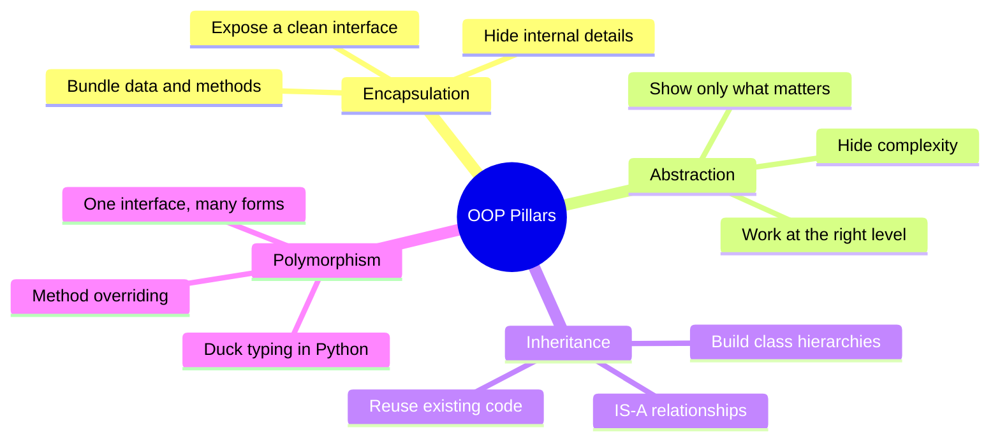
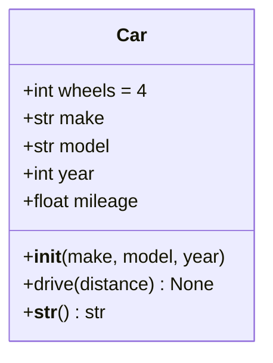
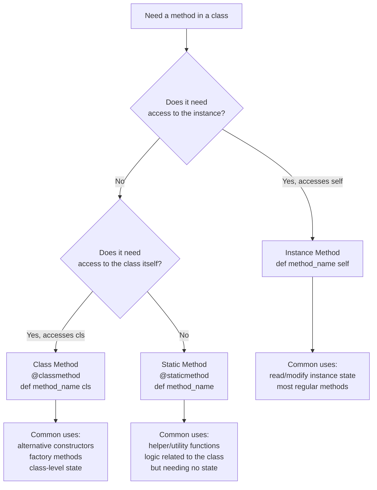

# 01 — OOP Foundations: Introduction, Classes & Objects, Methods & Behavior

> **Series:** Complete Object-Oriented Programming in Python
> **File:** 1 of 10
> **Topics Covered:** Part 1 · Part 2 · Part 3

---

## Table of Contents

- [Part 1 — Introduction to Object-Oriented Programming](#part-1--introduction-to-object-oriented-programming)
  - [1.1 What Is OOP?](#11-what-is-oop)
  - [1.2 A Brief History](#12-a-brief-history)
  - [1.3 Procedural vs Object-Oriented Programming](#13-procedural-vs-object-oriented-programming)
  - [1.4 The Four Pillars — An Overview](#14-the-four-pillars--an-overview)
  - [1.5 When to Use OOP](#15-when-to-use-oop)
- [Part 2 — Classes and Objects](#part-2--classes-and-objects)
  - [2.1 What Is a Class?](#21-what-is-a-class)
  - [2.2 What Is an Object?](#22-what-is-an-object)
  - [2.3 Defining a Class in Python](#23-defining-a-class-in-python)
  - [2.4 Instance Attributes vs Class Attributes](#24-instance-attributes-vs-class-attributes)
  - [2.5 The `__init__` Method](#25-the-__init__-method)
  - [2.6 The `self` Parameter](#26-the-self-parameter)
  - [2.7 Object Identity, Equality, and Representation](#27-object-identity-equality-and-representation)
- [Part 3 — Methods and Behavior](#part-3--methods-and-behavior)
  - [3.1 Instance Methods](#31-instance-methods)
  - [3.2 Class Methods](#32-class-methods)
  - [3.3 Static Methods](#33-static-methods)
  - [3.4 Method Chaining](#34-method-chaining)
  - [3.5 Properties and Computed Attributes](#35-properties-and-computed-attributes)
  - [3.6 Choosing the Right Method Type](#36-choosing-the-right-method-type)
- [Summary Tables](#summary-tables)
- [Exercises](#exercises)
- [Common Mistakes](#common-mistakes)
- [Interview Tips](#interview-tips)

---

# Part 1 — Introduction to Object-Oriented Programming

## 1.1 What Is OOP?

**Object-Oriented Programming (OOP)** is a programming paradigm that organises software design around **data** (objects) rather than **functions and logic**. Instead of writing a sequence of instructions, you model your program as a collection of interacting objects, each responsible for its own state and behaviour.

> **Real-World Analogy:** Think of a car. A car has *attributes* (colour, model, fuel level) and *behaviours* (start, accelerate, brake). OOP lets you model this directly in code — a `Car` class captures the blueprint, and each specific car you create is an *instance* (object) of that blueprint.

### Core Idea

```
Program = Collection of objects that communicate by sending messages (calling methods)
```

Each object:
- **Knows** things → stored in *attributes* (state)
- **Does** things → defined in *methods* (behaviour)
- **Hides** complexity → exposes only what's necessary (*encapsulation*)

---

## 1.2 A Brief History

| Year | Milestone |
|------|-----------|
| 1960s | **Simula** (Ole-Johan Dahl & Kristen Nygaard) — first language with classes and objects |
| 1970s | **Smalltalk** (Alan Kay) — coined the term "object-oriented"; everything is an object |
| 1980s | **C++** brings OOP to systems programming; **Objective-C** emerges |
| 1990s | **Java** makes OOP mainstream with "write once, run anywhere" |
| 2000s | **Python**, Ruby, C# mature as OOP languages |
| 2010s+ | OOP blends with functional programming; Python deepens its object model |

> **Alan Kay's insight:** *"I thought of objects being like biological cells, only able to communicate with messages."* — The emphasis was always on **messaging** (method calls) between autonomous units.

---

## 1.3 Procedural vs Object-Oriented Programming

The contrast is most vivid in a concrete example. Let's model a bank account.

### Procedural Approach

```python
# State lives in plain data structures — dictionaries or loose variables
account = {"owner": "Alice", "balance": 1000.0}

def deposit(account, amount):
    """Add money to an account dict."""
    if amount <= 0:
        raise ValueError("Deposit amount must be positive")
    account["balance"] += amount

def withdraw(account, amount):
    """Remove money from an account dict."""
    if amount > account["balance"]:
        raise ValueError("Insufficient funds")
    account["balance"] -= amount

def get_balance(account):
    return account["balance"]

# Usage
deposit(account, 500)
withdraw(account, 200)
print(get_balance(account))  # 1300.0
```

**Problems with the procedural approach:**
- Data and functions are **separate** — easy to accidentally mutate the dict directly
- As the codebase grows, functions multiply and become hard to organise
- No natural way to associate `deposit` specifically with accounts (vs orders, invoices, etc.)
- Reuse requires copying and adapting the entire set of functions

### Object-Oriented Approach

```python
class BankAccount:
    """A simple bank account.

    Bundles state (owner, balance) with the operations that act on it.
    """

    def __init__(self, owner: str, initial_balance: float = 0.0):
        self.owner = owner
        self._balance = initial_balance  # underscore signals "internal detail"

    def deposit(self, amount: float) -> None:
        if amount <= 0:
            raise ValueError("Deposit amount must be positive")
        self._balance += amount

    def withdraw(self, amount: float) -> None:
        if amount > self._balance:
            raise ValueError("Insufficient funds")
        self._balance -= amount

    def get_balance(self) -> float:
        return self._balance

# Usage — clean, self-documenting
alice_account = BankAccount("Alice", 1000.0)
alice_account.deposit(500)
alice_account.withdraw(200)
print(alice_account.get_balance())  # 1300.0
```

### Side-by-Side Comparison

| Aspect | Procedural | Object-Oriented |
|--------|------------|-----------------|
| Organisation | Functions grouped in modules | Objects group state + behaviour |
| State management | Separate data structures | Encapsulated inside objects |
| Code reuse | Copy/modify functions | Inheritance and composition |
| Modelling fit | Algorithms, scripts, pipelines | Entities with identity and lifecycle |
| Readability | Can be clear for small programs | Scales better to large systems |
| Typical use | Data transforms, system scripts | Applications, games, GUIs, simulations |

> **Key Insight:** OOP is not *better* than procedural programming in all cases. It is a **tool** with a specific strength: modelling systems with many interacting entities that change over time.

---

## 1.4 The Four Pillars — An Overview

These concepts are the core of OOP. Each will receive a full chapter later; here we name and place them.



| Pillar | One-Line Definition | Real-World Analogy |
|--------|--------------------|--------------------|
| **Encapsulation** | Bundle data and methods; restrict direct access | A capsule — medicine sealed inside, accessed through a defined opening |
| **Abstraction** | Expose only what the caller needs to know | A car's steering wheel — you don't need to know about the rack-and-pinion |
| **Inheritance** | A new class acquires properties of an existing class | A `SavingsAccount` IS-A `BankAccount` with extra interest logic |
| **Polymorphism** | Different objects respond to the same call differently | `speak()` on a `Dog` barks; on a `Cat` it meows |

---

## 1.5 When to Use OOP

OOP is not a silver bullet. Use it when:

✅ **Good fit for OOP:**
- Modelling real-world entities with identity (users, products, vehicles)
- Building systems where objects have a lifecycle (create → modify → destroy)
- Large codebases where multiple developers work on different parts
- GUI applications, game engines, simulations
- When you need polymorphic behaviour (plugins, strategy patterns)

❌ **OOP may be overkill:**
- Short scripts or one-off data transforms
- Pure mathematical/algorithmic problems
- When a simple function and a dict would do the job

> **Python's pragmatic approach:** Python does not *force* OOP. Functions, classes, and modules coexist. Use classes when the complexity justifies them.

---

# Part 2 — Classes and Objects

## 2.1 What Is a Class?

A **class** is a **blueprint** or **template** for creating objects. It defines:
- What **data** (attributes) instances will hold
- What **actions** (methods) instances can perform

```
Class  →  Blueprint / Cookie Cutter / Mold
Object →  Specific instance created from that blueprint
```

> **Analogy:** An architectural drawing is the class. Every house built from it is an object (instance). The drawing defines the structure; each house has its own specific address, paint colour, and residents.

---

## 2.2 What Is an Object?

An **object** (also called an **instance**) is a **concrete realisation** of a class. When Python executes `obj = MyClass()`, it:
1. Allocates memory for a new object
2. Calls `__init__` to initialise its state
3. Returns a reference to the object

Every object has:
- **Identity** — a unique memory address (`id(obj)`)
- **Type** — which class it was made from (`type(obj)`)
- **State** — the current values of its attributes
- **Behaviour** — the methods it can perform

```python
class Dog:
    pass  # Empty class for now

rex = Dog()   # Object 1
fido = Dog()  # Object 2

print(id(rex) == id(fido))    # False — different objects in memory
print(type(rex))               # <class '__main__.Dog'>
print(isinstance(rex, Dog))    # True
```

---

## 2.3 Defining a Class in Python

### Minimal Class

```python
class Car:
    """A simple representation of a car."""
    pass
```

### A Full Blueprint

```python
class Car:
    """
    Represents a car with make, model, year, and mileage.

    Attributes:
        make (str): The manufacturer (e.g., 'Toyota').
        model (str): The model name (e.g., 'Corolla').
        year (int): The production year.
        mileage (float): Current odometer reading in km.
    """

    # ── Class attribute: shared by ALL instances ──────────────────────────────
    wheels = 4  # Every car (in this world) has 4 wheels

    def __init__(self, make: str, model: str, year: int):
        # ── Instance attributes: unique per object ────────────────────────────
        self.make = make
        self.model = model
        self.year = year
        self.mileage = 0.0  # Starts at zero for every new car

    def drive(self, distance: float) -> None:
        """Simulate driving and update the odometer."""
        if distance < 0:
            raise ValueError("Distance cannot be negative")
        self.mileage += distance
        print(f"{self.make} {self.model} drove {distance} km. "
              f"Total: {self.mileage} km")

    def __str__(self) -> str:
        """Human-readable string for print()."""
        return f"{self.year} {self.make} {self.model} ({self.mileage:.1f} km)"


# Creating instances
my_car = Car("Toyota", "Corolla", 2022)
your_car = Car("Honda", "Civic", 2023)

my_car.drive(150)
print(my_car)    # 2022 Toyota Corolla (150.0 km)
print(your_car)  # 2023 Honda Civic (0.0 km) — independent state
```

### UML Class Diagram



---

## 2.4 Instance Attributes vs Class Attributes

This is one of the most important distinctions in Python OOP.

```python
class Counter:
    # Class attribute — shared state across ALL instances
    total_created = 0

    def __init__(self, name: str):
        Counter.total_created += 1          # Modify via class name (best practice)
        self.name = name                     # Instance attribute — unique to this object
        self.count = 0                       # Instance attribute — starts at 0

    def increment(self):
        self.count += 1


a = Counter("A")
b = Counter("B")
c = Counter("C")

print(Counter.total_created)  # 3 — class attribute, shared
print(a.count)                 # 0
a.increment()
a.increment()
print(a.count)                 # 2
print(b.count)                 # 0 — independent
```

### The Shadowing Trap

```python
class Config:
    debug = False          # Class attribute

cfg = Config()
print(cfg.debug)           # False — reads class attribute (no instance attribute yet)

cfg.debug = True           # ⚠️ Creates an INSTANCE attribute named 'debug'!
print(cfg.debug)           # True — reads the new instance attribute
print(Config.debug)        # False — class attribute is UNCHANGED

# This is confusing. Use class attributes for constants / shared state only.
```

### Lookup Order

```
obj.attr  →  1. obj.__dict__  (instance)
          →  2. type(obj).__dict__  (class)
          →  3. base class __dict__  (inheritance chain)
          →  AttributeError if not found
```

### When to Use Each

| | Instance Attribute | Class Attribute |
|--|---|---|
| **Purpose** | Per-object state | Shared state / constants |
| **Defined in** | `__init__` (via `self`) | Class body (outside methods) |
| **Example** | `self.name`, `self.balance` | `wheels = 4`, `total_count = 0` |
| **Mutability** | Each object has its own copy | Shared — mutating it affects all instances |
| **Pitfall** | None specific | Shadowing — assigning via `self` creates an instance attr |

---

## 2.5 The `__init__` Method

`__init__` is Python's **initialiser** (often loosely called a constructor). It is called automatically after the object is created and its job is to set the initial state.

```python
class Rectangle:
    """A rectangle defined by width and height."""

    def __init__(self, width: float, height: float):
        # Validate on creation — fail fast
        if width <= 0 or height <= 0:
            raise ValueError(f"Dimensions must be positive, got {width}x{height}")

        self.width = width
        self.height = height

    def area(self) -> float:
        return self.width * self.height

    def perimeter(self) -> float:
        return 2 * (self.width + self.height)

    def is_square(self) -> bool:
        return self.width == self.height


r = Rectangle(5, 3)
print(r.area())       # 15
print(r.is_square())  # False

s = Rectangle(4, 4)
print(s.is_square())  # True

# Rectangle(0, 5)   → ValueError: Dimensions must be positive, got 0x5
```

### What `__init__` Is NOT

```python
# __new__ creates the object; __init__ initialises it
# In 99% of Python code, you only need to override __init__

class Example:
    def __new__(cls, *args, **kwargs):
        print("1. __new__ called — object being created")
        instance = super().__new__(cls)
        return instance

    def __init__(self, value):
        print("2. __init__ called — object being initialised")
        self.value = value

e = Example(42)
# 1. __new__ called — object being created
# 2. __init__ called — object being initialised
```

---

## 2.6 The `self` Parameter

`self` is simply a **reference to the current instance**. Python passes it automatically as the first argument when you call an instance method; you just need to declare it.

```python
class Greeter:
    def __init__(self, name: str):
        self.name = name         # self.name stored ON this object

    def greet(self) -> str:
        return f"Hello, I am {self.name}!"


g = Greeter("Alice")

# These two calls are IDENTICAL:
g.greet()              # Python rewrites this as:
Greeter.greet(g)       # Greeter.greet(g) — self = g
```

> **Why the name `self`?** It's a strong convention, not a keyword. You *could* write `def __init__(this, name)` — but please don't. Every Python programmer expects `self`.

### Visualising `self`

```
Memory:
┌──────────────────────────────────┐
│  Greeter instance @ 0x7f3a...    │
│  ┌────────────────────────────┐  │
│  │ name = "Alice"             │  │◄── self.name
│  └────────────────────────────┘  │
└──────────────────────────────────┘
         ▲
         │  self points here
         │
   g.greet() ──── Python auto-passes g as self
```

---

## 2.7 Object Identity, Equality, and Representation

Python gives you fine-grained control over how objects compare and display themselves.

```python
class Point:
    """A 2D point."""

    def __init__(self, x: float, y: float):
        self.x = x
        self.y = y

    # __repr__: unambiguous string, used in the REPL and for debugging
    def __repr__(self) -> str:
        return f"Point(x={self.x}, y={self.y})"

    # __str__: readable string, used by print() and str()
    def __str__(self) -> str:
        return f"({self.x}, {self.y})"

    # __eq__: value equality (==)
    def __eq__(self, other: object) -> bool:
        if not isinstance(other, Point):
            return NotImplemented
        return self.x == other.x and self.y == other.y


p1 = Point(1, 2)
p2 = Point(1, 2)
p3 = Point(3, 4)

# Identity (same object in memory?)
print(p1 is p2)     # False — two different objects
print(p1 is p1)     # True

# Equality (same value?)
print(p1 == p2)     # True  — __eq__ compares x, y
print(p1 == p3)     # False

# Representation
print(repr(p1))     # Point(x=1, y=2)   ← unambiguous
print(str(p1))      # (1, 2)            ← friendly
print(p1)           # (1, 2)            ← print() uses __str__
```

### Rule of Thumb

| Method | When called | Purpose |
|--------|-------------|---------|
| `__repr__` | REPL, `repr()`, logging, debuggers | Unambiguous; should ideally be eval-able |
| `__str__` | `print()`, `str()`, f-strings | Human-readable; falls back to `__repr__` if missing |
| `__eq__` | `==` operator | Value equality |
| `__hash__` | `hash()`, dict keys, sets | Must define if you define `__eq__`; return `None` to make unhashable |

---

# Part 3 — Methods and Behavior

Methods are **functions defined inside a class**. They give objects their behaviour. Python has three flavours.

## 3.1 Instance Methods

The most common type. They receive `self` as the first argument, giving them access to the instance's state.

```python
class BankAccount:
    """Full bank account with deposit, withdraw, and history."""

    def __init__(self, owner: str, balance: float = 0.0):
        self.owner = owner
        self._balance = balance
        self._transactions: list[float] = []

    # ── Instance methods ──────────────────────────────────────────────────────

    def deposit(self, amount: float) -> None:
        """Credit the account."""
        self._validate_amount(amount, "Deposit")
        self._balance += amount
        self._transactions.append(+amount)

    def withdraw(self, amount: float) -> None:
        """Debit the account."""
        self._validate_amount(amount, "Withdrawal")
        if amount > self._balance:
            raise ValueError(
                f"Insufficient funds: balance is {self._balance:.2f}, "
                f"tried to withdraw {amount:.2f}"
            )
        self._balance -= amount
        self._transactions.append(-amount)

    def get_balance(self) -> float:
        """Return current balance."""
        return self._balance

    def print_statement(self) -> None:
        """Display a simple account statement."""
        print(f"\nAccount Statement — {self.owner}")
        print("-" * 35)
        running = 0.0
        for i, t in enumerate(self._transactions, 1):
            running += t
            label = "Credit" if t > 0 else "Debit "
            print(f"  {i:>3}. {label}  {abs(t):>10.2f}   Balance: {running:>10.2f}")
        print("-" * 35)
        print(f"  Current balance: {self._balance:.2f}\n")

    # ── "Private" helper — internal use only (convention, not enforced) ───────

    def _validate_amount(self, amount: float, label: str) -> None:
        if amount <= 0:
            raise ValueError(f"{label} amount must be positive, got {amount}")


acc = BankAccount("Alice", 500.0)
acc.deposit(200)
acc.withdraw(50)
acc.deposit(100)
acc.print_statement()
```

---

## 3.2 Class Methods

Decorated with `@classmethod`. Receive `cls` (the class itself) as the first argument instead of `self`. They operate on the **class**, not a specific instance. Most commonly used as **alternative constructors**.

```python
class Temperature:
    """Temperature with multiple construction pathways."""

    def __init__(self, celsius: float):
        self.celsius = celsius

    # ── Alternative constructors (factory methods) ────────────────────────────

    @classmethod
    def from_fahrenheit(cls, fahrenheit: float) -> "Temperature":
        """Create a Temperature from a Fahrenheit value."""
        celsius = (fahrenheit - 32) * 5 / 9
        return cls(celsius)       # cls() calls Temperature() — works even for subclasses

    @classmethod
    def from_kelvin(cls, kelvin: float) -> "Temperature":
        """Create a Temperature from a Kelvin value."""
        if kelvin < 0:
            raise ValueError("Kelvin cannot be negative")
        return cls(kelvin - 273.15)

    # ── Regular instance methods ──────────────────────────────────────────────

    @property
    def fahrenheit(self) -> float:
        return self.celsius * 9 / 5 + 32

    @property
    def kelvin(self) -> float:
        return self.celsius + 273.15

    def __repr__(self) -> str:
        return (f"Temperature(celsius={self.celsius:.2f}, "
                f"fahrenheit={self.fahrenheit:.2f}, "
                f"kelvin={self.kelvin:.2f})")


# Three different ways to construct the same kind of object
t1 = Temperature(100)                   # Direct: 100°C
t2 = Temperature.from_fahrenheit(212)   # From Fahrenheit
t3 = Temperature.from_kelvin(373.15)    # From Kelvin

print(t1)  # Temperature(celsius=100.00, fahrenheit=212.00, kelvin=373.15)
print(t2)  # Temperature(celsius=100.00, fahrenheit=212.00, kelvin=373.15)
print(t3)  # Temperature(celsius=100.00, fahrenheit=212.00, kelvin=373.15)
```

### Why `cls` Instead of Hard-Coding the Class Name?

```python
class Animal:
    sound = "..."

    @classmethod
    def make_sound(cls):
        # cls refers to whatever class this is called ON
        return f"A {cls.__name__} says {cls.sound}"

class Dog(Animal):
    sound = "Woof"

class Cat(Animal):
    sound = "Meow"

# cls correctly resolves to the subclass!
print(Dog.make_sound())  # A Dog says Woof
print(Cat.make_sound())  # A Cat says Meow
# If we hard-coded Animal.sound, subclass customisation would break
```

---

## 3.3 Static Methods

Decorated with `@staticmethod`. They receive **neither `self` nor `cls`** — they are plain functions namespaced inside a class. Use them when the logic is related to the class conceptually but doesn't depend on instance or class state.

```python
class MathUtils:
    """Utility functions related to mathematics."""

    @staticmethod
    def is_prime(n: int) -> bool:
        """Return True if n is a prime number."""
        if n < 2:
            return False
        for i in range(2, int(n**0.5) + 1):
            if n % i == 0:
                return False
        return True

    @staticmethod
    def clamp(value: float, minimum: float, maximum: float) -> float:
        """Constrain value to [minimum, maximum]."""
        return max(minimum, min(value, maximum))

    @staticmethod
    def lerp(a: float, b: float, t: float) -> float:
        """Linear interpolation between a and b by factor t (0..1)."""
        return a + (b - a) * t


# Called on the class — no instance needed
print(MathUtils.is_prime(17))          # True
print(MathUtils.clamp(150, 0, 100))    # 100
print(MathUtils.lerp(0, 10, 0.3))     # 3.0

# Can also be called on an instance (unusual, but valid)
utils = MathUtils()
print(utils.is_prime(4))               # False
```

---

## 3.4 Method Chaining

Method chaining lets you call multiple methods in a single expression by having each method return `self`.

```python
class QueryBuilder:
    """A simplified SQL-like query builder demonstrating method chaining."""

    def __init__(self, table: str):
        self._table = table
        self._conditions: list[str] = []
        self._selected: list[str] = ["*"]
        self._limit_val: int | None = None
        self._order_col: str | None = None

    def select(self, *columns: str) -> "QueryBuilder":
        self._selected = list(columns)
        return self  # ← Return self to enable chaining

    def where(self, condition: str) -> "QueryBuilder":
        self._conditions.append(condition)
        return self

    def order_by(self, column: str) -> "QueryBuilder":
        self._order_col = column
        return self

    def limit(self, n: int) -> "QueryBuilder":
        self._limit_val = n
        return self

    def build(self) -> str:
        """Compile and return the SQL query string."""
        cols = ", ".join(self._selected)
        query = f"SELECT {cols} FROM {self._table}"
        if self._conditions:
            query += " WHERE " + " AND ".join(self._conditions)
        if self._order_col:
            query += f" ORDER BY {self._order_col}"
        if self._limit_val:
            query += f" LIMIT {self._limit_val}"
        return query


# Fluid, readable API thanks to chaining
sql = (
    QueryBuilder("users")
    .select("id", "name", "email")
    .where("age > 18")
    .where("active = true")
    .order_by("name")
    .limit(10)
    .build()
)

print(sql)
# SELECT id, name, email FROM users
# WHERE age > 18 AND active = true ORDER BY name LIMIT 10
```

> **Popular libraries using method chaining:** SQLAlchemy ORM queries, pandas DataFrame operations, Django ORM querysets, builder patterns.

---

## 3.5 Properties and Computed Attributes

The `@property` decorator lets you define **computed attributes** — values derived from stored state — that are accessed like simple attributes (no parentheses). This gives you the clean access syntax of a public attribute while keeping full control internally.

```python
class Circle:
    """A circle that enforces a positive radius."""

    def __init__(self, radius: float):
        self.radius = radius  # Goes through the setter below

    # ── The property ──────────────────────────────────────────────────────────

    @property
    def radius(self) -> float:
        """The radius of the circle (always positive)."""
        return self._radius

    @radius.setter
    def radius(self, value: float) -> None:
        """Validate and set the radius."""
        if value < 0:
            raise ValueError(f"Radius must be non-negative, got {value}")
        self._radius = value

    @radius.deleter
    def radius(self) -> None:
        del self._radius

    # ── Computed (read-only) properties ──────────────────────────────────────

    @property
    def diameter(self) -> float:
        return 2 * self._radius

    @property
    def area(self) -> float:
        import math
        return math.pi * self._radius ** 2

    @property
    def circumference(self) -> float:
        import math
        return 2 * math.pi * self._radius

    def __repr__(self) -> str:
        return f"Circle(radius={self._radius})"


c = Circle(5)
print(c.radius)           # 5  — looks like an attribute, but goes through getter
print(c.diameter)         # 10
print(f"{c.area:.4f}")    # 78.5398

c.radius = 10             # Goes through setter — validated
# c.radius = -1           # ValueError: Radius must be non-negative, got -1

print(c.diameter)         # 20 — automatically updated
```

### Property vs Method — When to Choose

| | `@property` | Regular method |
|--|---|---|
| **Use when** | It reads like a noun ("diameter", "is_valid") | It reads like a verb ("calculate_tax", "send_email") |
| **Has side effects?** | No (usually) | Yes or No |
| **Takes arguments?** | No | Yes |
| **Computation cost** | Should be cheap | Any |
| **Example** | `circle.area` | `account.transfer(amount)` |

---

## 3.6 Choosing the Right Method Type



### Quick Reference

```python
class Example:

    class_var = 0

    def __init__(self, x):
        self.x = x

    def instance_method(self):
        # ✅ Can access: self.x, self.__class__, Example.class_var
        return f"instance: {self.x}"

    @classmethod
    def class_method(cls):
        # ✅ Can access: cls.class_var, cls() to create instances
        # ❌ Cannot access: self.x (no instance)
        return f"class: {cls.class_var}"

    @staticmethod
    def static_method(value):
        # ❌ Cannot access: self.x or cls.class_var
        # ✅ Pure function logic; just happens to live here
        return f"static: {value * 2}"
```

---

# Summary Tables

## Part 1 — OOP Concepts

| Concept | Definition | Python Example |
|---------|------------|----------------|
| Class | Blueprint for objects | `class Dog:` |
| Object | Instance of a class | `rex = Dog()` |
| Attribute | Data stored in an object | `self.name = "Rex"` |
| Method | Function defined in a class | `def bark(self):` |
| Encapsulation | Bundling data and behaviour | Class with `_private` attrs |
| Inheritance | IS-A relationship between classes | `class Poodle(Dog):` |
| Polymorphism | Same interface, different behaviour | Overriding `speak()` |
| Abstraction | Hiding implementation details | `@abstractmethod` |

## Part 2 — Attributes

| | Instance Attribute | Class Attribute |
|--|---|---|
| Scope | Per instance | Shared across all instances |
| Defined in | `__init__` using `self` | Class body |
| Access | `self.attr` or `obj.attr` | `ClassName.attr` |
| When to use | Per-object state | Constants, shared counters |

## Part 3 — Method Types

| Type | Decorator | First Arg | Accesses | Common Use |
|------|-----------|-----------|----------|------------|
| Instance method | _(none)_ | `self` | Instance state | Most logic |
| Class method | `@classmethod` | `cls` | Class state | Factory/alt constructors |
| Static method | `@staticmethod` | _(none)_ | Nothing | Pure utility helpers |

---

# Exercises

### Exercise 1 — `Person` Class
Create a `Person` class with attributes `name`, `age`, and `email`. Add:
- An `__init__` that validates age (must be 0–150)
- A `greet()` instance method returning `"Hi, I'm {name} and I'm {age} years old."`
- A `from_dict(cls, data)` class method that creates a `Person` from a dictionary
- A `is_adult` property that returns `True` if age ≥ 18
- `__repr__` and `__str__` methods

### Exercise 2 — `Stack` Class
Implement a generic `Stack` (LIFO data structure) class with:
- `push(item)` — add to top
- `pop()` — remove and return top item (raise `IndexError` if empty)
- `peek()` — return top item without removing
- `is_empty` property
- `size` property
- `__len__`, `__repr__`

### Exercise 3 — Method Type Identification
For each method below, identify whether it should be an instance method, class method, or static method:
1. `parse_date(date_string)` in a `DateRange` class — no instance state needed
2. `connect(self)` in a `DatabaseConnection` class — uses `self.host`, `self.port`
3. `from_csv(cls, filepath)` in a `DataSet` class — creates a new `DataSet` instance
4. `validate_email(email)` in a `User` class — pure string check, no state needed

### Exercise 4 — Fluent Interface
Implement a `Pizza` builder class supporting:
```python
pizza = (
    Pizza("Margherita")
    .set_size("large")
    .add_topping("mushrooms")
    .add_topping("olives")
    .set_crust("thin")
)
print(pizza.describe())
# Large Margherita pizza with thin crust, toppings: mushrooms, olives
```

---

# Common Mistakes

### 1. Mutable Default Arguments in `__init__`

```python
# ❌ WRONG — the list is shared across ALL instances!
class BadNote:
    def __init__(self, tags=[]):
        self.tags = tags  # All instances share the same list object

n1 = BadNote()
n2 = BadNote()
n1.tags.append("urgent")
print(n2.tags)  # ["urgent"] — oops!

# ✅ CORRECT — create a new list each time
class GoodNote:
    def __init__(self, tags=None):
        self.tags = tags if tags is not None else []
```

### 2. Forgetting `self`

```python
class Broken:
    def __init__(self, value):
        self.value = value

    def double():             # ❌ Missing self — will crash on call
        return self.value * 2 # NameError: name 'self' is not defined

class Fixed:
    def __init__(self, value):
        self.value = value

    def double(self):         # ✅
        return self.value * 2
```

### 3. Mutating a Class Attribute via `self`

```python
class Team:
    members = []  # Intended as class-level shared list

    def add_member(self, name):
        self.members.append(name)  # Mutates the class-level list — shared!
        # Bug: all Team instances (including subclasses) see this change

    # Fix: initialise members per-instance in __init__
    def __init__(self):
        self.members = []  # Now each team has its own list
```

### 4. Using `==` When You Mean `is` (or Vice Versa)

```python
a = [1, 2, 3]
b = [1, 2, 3]
c = a

print(a == b)  # True  — same value
print(a is b)  # False — different objects
print(a is c)  # True  — same object (c is an alias)
```

### 5. Not Calling `super().__init__()` in Subclasses

```python
class Animal:
    def __init__(self, name):
        self.name = name

class Dog(Animal):
    def __init__(self, name, breed):
        # ❌ Forgetting super().__init__(name) means self.name never gets set
        self.breed = breed

# ✅ Always call super().__init__() first
class Dog(Animal):
    def __init__(self, name, breed):
        super().__init__(name)  # Initialise parent portion
        self.breed = breed
```

---

# Interview Tips

> **Q: What is the difference between a class and an object?**
> A: A class is the *blueprint* or *template* — it defines structure and behaviour. An object is a *concrete instance* of that class with its own state in memory.

> **Q: What is `self` in Python?**
> A: `self` is a reference to the current instance. Python passes it automatically as the first argument to all instance methods; it is not a keyword (just a convention) but virtually universal. It gives methods access to the instance's attributes and other methods.

> **Q: What is the difference between `__str__` and `__repr__`?**
> A: `__repr__` should return an unambiguous, ideally eval-able string (for debugging). `__str__` should return a user-friendly string. When `print()` is called, Python uses `__str__`, falling back to `__repr__` if `__str__` is not defined.

> **Q: When would you use a class method vs a static method?**
> A: Use `@classmethod` when the method needs access to the class (e.g., factory/constructor methods that call `cls()`). Use `@staticmethod` when the logic belongs conceptually to the class but requires neither instance nor class state.

> **Q: What is a class attribute vs an instance attribute?**
> A: A class attribute is defined in the class body and shared by all instances. An instance attribute is defined in `__init__` (via `self`) and is unique to each object. Assigning to `self.attr` always creates/updates the *instance* attribute, never the class attribute.

> **Q: What is the `@property` decorator used for?**
> A: `@property` lets you define getter/setter/deleter logic for an attribute while keeping the clean `obj.attr` access syntax. It allows you to add validation or computation without changing the external API.

---

> **Next File →** [02 — OOP Core Principles: Encapsulation, Abstraction, Inheritance, Polymorphism & Object Relationships](./02_oop_core_principles.md)
