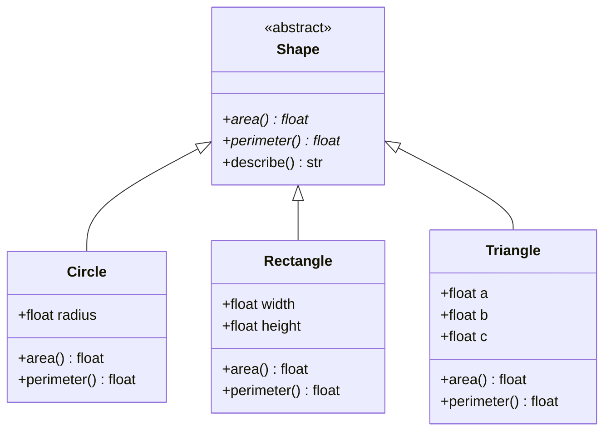
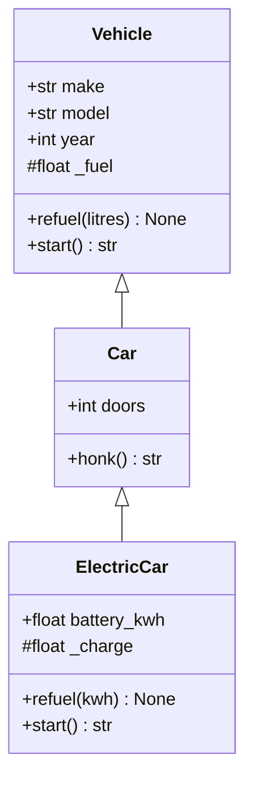
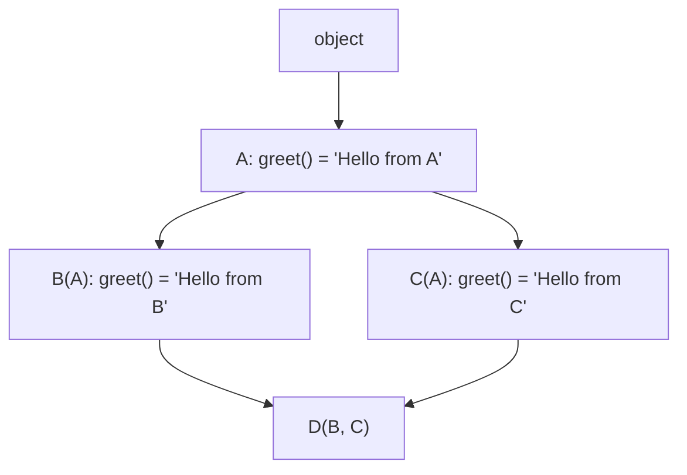
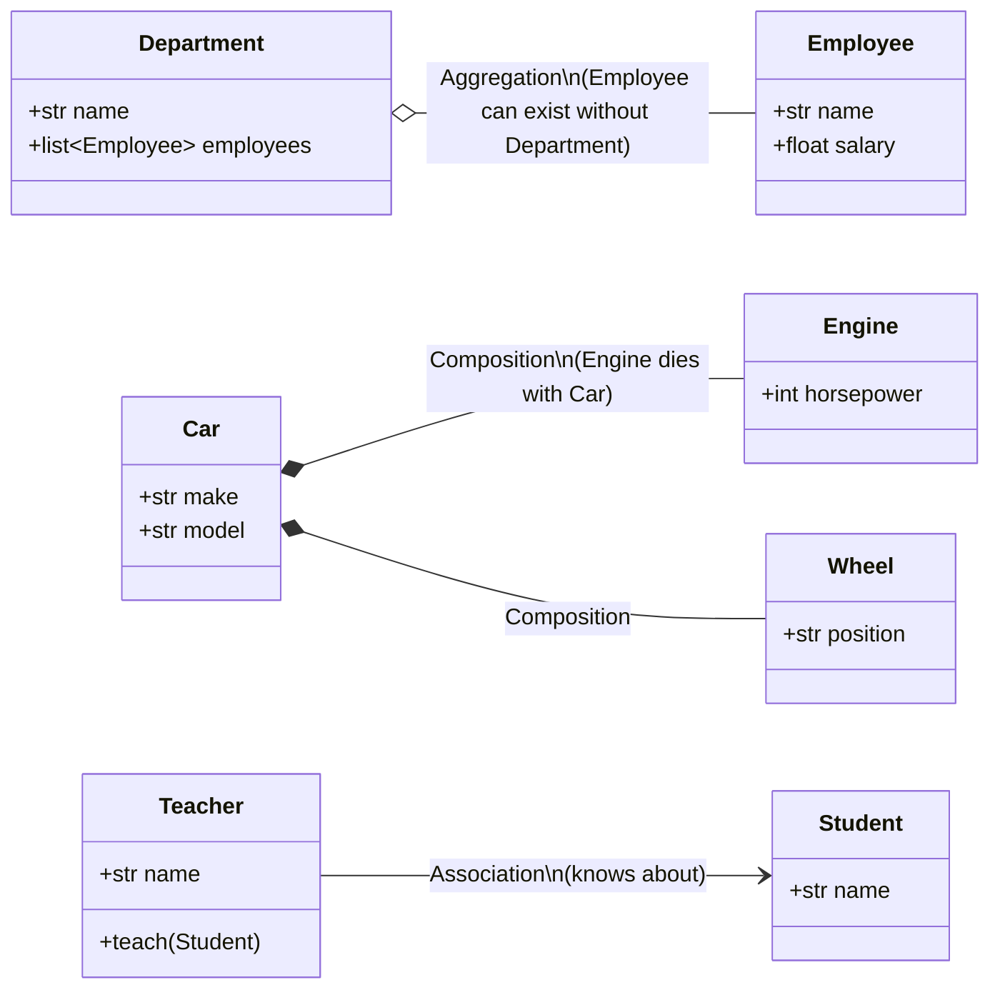

# 02 — OOP Core Principles: Encapsulation, Abstraction, Inheritance, Polymorphism & Object Relationships

> **Series:** Complete Object-Oriented Programming in Python
> **File:** 2 of 10
> **Topics Covered:** Part 4 · Part 5 · Part 6 · Part 7

---

## Table of Contents

- [Part 4 — Encapsulation](#part-4--encapsulation)
  - [4.1 What Is Encapsulation?](#41-what-is-encapsulation)
  - [4.2 Access Levels in Python](#42-access-levels-in-python)
  - [4.3 Name Mangling](#43-name-mangling)
  - [4.4 Properties as the Pythonic Gate](#44-properties-as-the-pythonic-gate)
  - [4.5 Encapsulation in Practice](#45-encapsulation-in-practice)
- [Part 5 — Abstraction](#part-5--abstraction)
  - [5.1 What Is Abstraction?](#51-what-is-abstraction)
  - [5.2 Abstract Base Classes with `abc`](#52-abstract-base-classes-with-abc)
  - [5.3 Abstract Methods and Properties](#53-abstract-methods-and-properties)
  - [5.4 Abstraction vs Encapsulation](#54-abstraction-vs-encapsulation)
- [Part 6 — Inheritance](#part-6--inheritance)
  - [6.1 What Is Inheritance?](#61-what-is-inheritance)
  - [6.2 Single Inheritance](#62-single-inheritance)
  - [6.3 `super()` — The Right Way to Call Parents](#63-super----the-right-way-to-call-parents)
  - [6.4 Method Overriding](#64-method-overriding)
  - [6.5 Multi-Level Inheritance](#65-multi-level-inheritance)
  - [6.6 Multiple Inheritance and the MRO](#66-multiple-inheritance-and-the-mro)
  - [6.7 Inheriting Built-in Types](#67-inheriting-built-in-types)
  - [6.8 Composition vs Inheritance](#68-composition-vs-inheritance)
- [Part 7 — Polymorphism & Object Relationships](#part-7--polymorphism--object-relationships)
  - [7.1 What Is Polymorphism?](#71-what-is-polymorphism)
  - [7.2 Method Overriding (Runtime Polymorphism)](#72-method-overriding-runtime-polymorphism)
  - [7.3 Duck Typing](#73-duck-typing)
  - [7.4 Operator Overloading](#74-operator-overloading)
  - [7.5 `isinstance` and `type` Checks](#75-isinstance-and-type-checks)
  - [7.6 Object Relationships: Association, Aggregation, Composition](#76-object-relationships-association-aggregation-composition)
- [Summary Tables](#summary-tables)
- [Exercises](#exercises)
- [Common Mistakes](#common-mistakes)
- [Interview Tips](#interview-tips)

---

# Part 4 — Encapsulation

## 4.1 What Is Encapsulation?

**Encapsulation** is the practice of **bundling data (attributes) and the methods that operate on that data into a single unit (the class)**, and **restricting direct access** to some of the object's internals.

It serves two purposes:
1. **Bundling** — keeping related data and behaviour together
2. **Information hiding** — preventing external code from depending on implementation details

> **Real-World Analogy:** An ATM machine. You interact with it through a defined interface — insert card, enter PIN, select amount. You cannot (and should not) reach inside and manipulate the cash directly. The internal wiring, counters, and validation logic are encapsulated. The buttons are the public interface.

```
┌─────────────────────────────────────────────────────────────────┐
│  BankAccount                                                    │
│                                                                 │
│  ┌──────────────────────────────┐                               │
│  │  PRIVATE (internal detail)   │                               │
│  │  _balance: float             │                               │
│  │  _transaction_log: list      │                               │
│  │  _validate_amount()          │                               │
│  └──────────────────────────────┘                               │
│                                                                 │
│  ┌──────────────────────────────┐                               │
│  │  PUBLIC (interface / API)    │                               │
│  │  deposit(amount)             │◄──── External code uses these │
│  │  withdraw(amount)            │                               │
│  │  get_balance() → float       │                               │
│  └──────────────────────────────┘                               │
└─────────────────────────────────────────────────────────────────┘
```

---

## 4.2 Access Levels in Python

Python does **not** have hard `private`/`protected`/`public` keywords like Java or C++. Instead, it uses **naming conventions** that signal intent to other developers.

| Convention | Syntax | Meaning | Enforced? |
|------------|--------|---------|-----------|
| Public | `name` | Anyone can access | No restriction |
| Protected | `_name` | Internal use; subclasses may access | Convention only |
| Private | `__name` | Class-internal only; not for subclasses | Name-mangled |

```python
class AccessDemo:
    def __init__(self):
        self.public_attr = "Everyone welcome"      # public
        self._protected_attr = "Handle with care"  # protected (by convention)
        self.__private_attr = "Keep out"           # private (name-mangled)

    def public_method(self):
        return "I'm public"

    def _protected_method(self):
        return "Subclasses may use me"

    def __private_method(self):
        return "Only this class uses me"

    def show_private(self):
        # ✅ Accessible WITHIN the class
        return self.__private_attr


obj = AccessDemo()

print(obj.public_attr)           # ✅ "Everyone welcome"
print(obj._protected_attr)       # ⚠️  Works, but convention says "don't"
# print(obj.__private_attr)      # ❌ AttributeError — name-mangled!
print(obj.show_private())        # ✅ Accessed through a public method
```

### Python's Philosophy

> *"We are all consenting adults here."* — Python community idiom

Python trusts developers. The underscore is a social contract, not a lock. You *can* access `_protected` attributes — but you're signalling to maintainers that you understand you're relying on an implementation detail that may change.

---

## 4.3 Name Mangling

When you use a **double leading underscore** (`__name`), Python applies **name mangling**: it rewrites the attribute name to `_ClassName__name`. This prevents accidental collision in subclasses — not a security feature.

```python
class Parent:
    def __init__(self):
        self.__secret = "parent secret"  # Stored as _Parent__secret

    def reveal(self):
        return self.__secret  # Python translates to self._Parent__secret


class Child(Parent):
    def __init__(self):
        super().__init__()
        self.__secret = "child secret"   # Stored as _Child__secret — DIFFERENT attr!

    def reveal_child(self):
        return self.__secret  # Returns _Child__secret


p = Parent()
c = Child()

print(p.reveal())          # "parent secret"
print(c.reveal())          # "parent secret" — Parent's __secret still intact
print(c.reveal_child())    # "child secret"

# You CAN access name-mangled attrs if you know the mangled name (not recommended):
print(c._Parent__secret)   # "parent secret"
print(c._Child__secret)    # "child secret"

# Inspect the actual attribute names stored on the object:
print([k for k in c.__dict__])
# ['_Parent__secret', '_Child__secret']
```

> **Key Insight:** Name mangling protects against *accidental* attribute clashes between a base class and a subclass that happen to choose the same `__name`. It is not a security mechanism.

---

## 4.4 Properties as the Pythonic Gate

Properties (introduced in File 1) are the idiomatic way to encapsulate attribute access in Python. They let you start with a simple public attribute and add validation later — without changing the external API.

```python
class Employee:
    """Demonstrates the property-based encapsulation pattern."""

    def __init__(self, name: str, salary: float, department: str):
        self.name = name           # Goes through the setter
        self.salary = salary       # Goes through the setter
        self.department = department

    # ── name property ─────────────────────────────────────────────────────────
    @property
    def name(self) -> str:
        return self._name

    @name.setter
    def name(self, value: str) -> None:
        value = value.strip()
        if not value:
            raise ValueError("Name cannot be empty")
        self._name = value.title()  # Normalise capitalisation

    # ── salary property ───────────────────────────────────────────────────────
    @property
    def salary(self) -> float:
        return self._salary

    @salary.setter
    def salary(self, value: float) -> None:
        if value < 0:
            raise ValueError(f"Salary cannot be negative, got {value}")
        self._salary = round(value, 2)

    # ── Read-only computed property ───────────────────────────────────────────
    @property
    def annual_salary(self) -> float:
        return self._salary * 12

    def give_raise(self, percent: float) -> None:
        """Apply a percentage raise (0 < percent <= 100)."""
        if not 0 < percent <= 100:
            raise ValueError(f"Raise percent must be between 0 and 100, got {percent}")
        self.salary *= (1 + percent / 100)  # Goes through setter — stays validated

    def __repr__(self) -> str:
        return (f"Employee(name='{self.name}', "
                f"salary={self.salary:.2f}, dept='{self.department}')")


emp = Employee("  alice smith  ", 75_000, "Engineering")
print(emp.name)            # "Alice Smith" — normalised
print(emp.annual_salary)   # 900000.0

emp.give_raise(10)
print(emp.salary)          # 82500.0

# emp.salary = -5000       # ValueError: Salary cannot be negative, got -5000
```

### The Encapsulation Refactoring Pattern

A key benefit: you can start simple and add encapsulation later with **zero breakage** to calling code.

```python
# Stage 1: Simple, no validation needed yet
class Point:
    def __init__(self, x, y):
        self.x = x   # Public attribute
        self.y = y

p = Point(3, 4)
p.x = 10             # Direct assignment works

# Stage 2: Requirements change — x must be non-negative
# Convert to property WITHOUT changing the external API
class Point:
    def __init__(self, x, y):
        self.x = x   # Now goes through setter — callers don't change their code
        self.y = y

    @property
    def x(self):
        return self._x

    @x.setter
    def x(self, value):
        if value < 0:
            raise ValueError("x must be non-negative")
        self._x = value

p = Point(3, 4)
p.x = 10             # ✅ Still works exactly the same way
# p.x = -1           # ❌ Now raises ValueError
```

---

## 4.5 Encapsulation in Practice

### Full Example: A Validated Configuration Object

```python
from typing import Any


class AppConfig:
    """
    Encapsulated application configuration.

    All settings are validated on write. Internal storage is hidden.
    Callers interact only through the defined interface.
    """

    VALID_ENVIRONMENTS = {"development", "staging", "production"}
    MAX_WORKERS = 32

    def __init__(self, env: str, debug: bool = False, workers: int = 4):
        self._settings: dict[str, Any] = {}  # Hidden internal storage
        self.environment = env               # Goes through setter
        self.debug = debug
        self.workers = workers

    @property
    def environment(self) -> str:
        return self._settings["environment"]

    @environment.setter
    def environment(self, value: str) -> None:
        if value not in self.VALID_ENVIRONMENTS:
            raise ValueError(
                f"environment must be one of {self.VALID_ENVIRONMENTS}, got '{value}'"
            )
        self._settings["environment"] = value

    @property
    def debug(self) -> bool:
        return self._settings.get("debug", False)

    @debug.setter
    def debug(self, value: bool) -> None:
        if not isinstance(value, bool):
            raise TypeError(f"debug must be bool, got {type(value).__name__}")
        self._settings["debug"] = value

    @property
    def workers(self) -> int:
        return self._settings.get("workers", 4)

    @workers.setter
    def workers(self, value: int) -> None:
        if not isinstance(value, int) or value < 1 or value > self.MAX_WORKERS:
            raise ValueError(
                f"workers must be an int between 1 and {self.MAX_WORKERS}"
            )
        self._settings["workers"] = value

    @property
    def is_production(self) -> bool:
        return self._settings["environment"] == "production"

    def __repr__(self) -> str:
        return (f"AppConfig(env='{self.environment}', "
                f"debug={self.debug}, workers={self.workers})")


cfg = AppConfig("production", debug=False, workers=8)
print(cfg)                   # AppConfig(env='production', debug=False, workers=8)
print(cfg.is_production)     # True

# cfg.environment = "test"   # ValueError: environment must be one of ...
# cfg.workers = 0            # ValueError: workers must be int between 1 and 32
```

---

# Part 5 — Abstraction

## 5.1 What Is Abstraction?

**Abstraction** means exposing **what** an object does while hiding **how** it does it. You define a contract (an interface) that concrete classes must fulfil, without specifying the implementation.

> **Real-World Analogy:** A TV remote. You press "Volume Up" and the volume increases. You don't need to know whether the TV uses infrared signals, Bluetooth, or Wi-Fi internally. The abstraction — the button — hides the complexity.

### Abstraction vs Encapsulation — The Critical Distinction

These two are often confused. They work together but address different concerns.

| | Encapsulation | Abstraction |
|--|---|---|
| **Focus** | *How* to hide implementation | *What* to expose (the interface) |
| **Goal** | Data protection, controlling access | Reducing complexity, defining contracts |
| **Mechanism** | Access modifiers, properties | Abstract classes, interfaces, protocols |
| **Question** | "How do I protect this data?" | "What operations must this object support?" |
| **Analogy** | ATM hides its internal wiring | ATM exposes specific buttons (insert card, etc.) |

They complement each other: abstraction says *what buttons exist*; encapsulation hides *what happens when you press them*.

---

## 5.2 Abstract Base Classes with `abc`

Python's `abc` module provides `ABC` (Abstract Base Class) and the `@abstractmethod` decorator to define contracts that subclasses **must** implement.

```python
from abc import ABC, abstractmethod


class Shape(ABC):
    """
    Abstract base class for all 2D shapes.

    Defines the CONTRACT: every shape must be able to report
    its area and perimeter. HOW they do it is up to each subclass.
    """

    @abstractmethod
    def area(self) -> float:
        """Return the area of the shape."""
        ...  # Ellipsis or pass — body is never called directly

    @abstractmethod
    def perimeter(self) -> float:
        """Return the perimeter of the shape."""
        ...

    # ── Concrete method on the abstract class ─────────────────────────────────
    # (Subclasses inherit this without overriding)
    def describe(self) -> str:
        return (f"{type(self).__name__}: "
                f"area={self.area():.2f}, perimeter={self.perimeter():.2f}")


# Trying to instantiate the abstract class directly raises an error:
# s = Shape()
# TypeError: Can't instantiate abstract class Shape
# with abstract methods area, perimeter


class Circle(Shape):
    import math as _math

    def __init__(self, radius: float):
        self.radius = radius

    def area(self) -> float:                   # ✅ Implementing the contract
        import math
        return math.pi * self.radius ** 2

    def perimeter(self) -> float:              # ✅ Implementing the contract
        import math
        return 2 * math.pi * self.radius


class Rectangle(Shape):
    def __init__(self, width: float, height: float):
        self.width = width
        self.height = height

    def area(self) -> float:
        return self.width * self.height

    def perimeter(self) -> float:
        return 2 * (self.width + self.height)


class Triangle(Shape):
    def __init__(self, a: float, b: float, c: float):
        self.a, self.b, self.c = a, b, c

    def area(self) -> float:
        # Heron's formula
        s = (self.a + self.b + self.c) / 2
        return (s * (s - self.a) * (s - self.b) * (s - self.c)) ** 0.5

    def perimeter(self) -> float:
        return self.a + self.b + self.c


shapes: list[Shape] = [
    Circle(5),
    Rectangle(4, 6),
    Triangle(3, 4, 5),
]

for shape in shapes:
    print(shape.describe())

# Circle: area=78.54, perimeter=31.42
# Rectangle: area=24.00, perimeter=20.00
# Triangle: area=6.00, perimeter=12.00
```



---

## 5.3 Abstract Methods and Properties

You can mark both methods and properties as abstract.

```python
from abc import ABC, abstractmethod


class DataStore(ABC):
    """Abstract interface for a persistent data store."""

    @abstractmethod
    def connect(self) -> None:
        """Open a connection to the store."""
        ...

    @abstractmethod
    def disconnect(self) -> None:
        """Close the connection."""
        ...

    @abstractmethod
    def read(self, key: str) -> str | None:
        """Read a value by key. Returns None if not found."""
        ...

    @abstractmethod
    def write(self, key: str, value: str) -> None:
        """Write a key-value pair."""
        ...

    @property
    @abstractmethod
    def is_connected(self) -> bool:
        """Return True if currently connected."""
        ...

    # ── Template method (uses the abstract methods above) ─────────────────────
    def safe_read(self, key: str, default: str = "") -> str:
        """Read with a fallback default — built on the abstract interface."""
        result = self.read(key)
        return result if result is not None else default


class InMemoryStore(DataStore):
    """Concrete implementation: in-memory dictionary store."""

    def __init__(self):
        self._data: dict[str, str] = {}
        self._connected = False

    def connect(self) -> None:
        self._connected = True
        print("InMemoryStore: connected")

    def disconnect(self) -> None:
        self._connected = False
        print("InMemoryStore: disconnected")

    def read(self, key: str) -> str | None:
        return self._data.get(key)

    def write(self, key: str, value: str) -> None:
        self._data[key] = value

    @property
    def is_connected(self) -> bool:
        return self._connected


store = InMemoryStore()
store.connect()
store.write("user:1", "Alice")
print(store.read("user:1"))              # "Alice"
print(store.safe_read("user:99", "N/A")) # "N/A"
print(store.is_connected)               # True
store.disconnect()
```

### Template Method Pattern

Notice `safe_read` in the example above: it is a **concrete method on the abstract class** that calls abstract methods. This is the **Template Method pattern** — the abstract class defines the *skeleton* of an algorithm; subclasses fill in the details.

---

## 5.4 Abstraction vs Encapsulation

```python
class Thermostat(ABC):  # ← ABSTRACTION: defines the interface contract

    @abstractmethod
    def set_temperature(self, temp: float) -> None: ...

    @abstractmethod
    def get_temperature(self) -> float: ...


class SmartThermostat(Thermostat):

    def __init__(self):
        self.__temp = 20.0          # ← ENCAPSULATION: hides the raw float
        self.__history: list = []   # ← ENCAPSULATION: hides the log

    def set_temperature(self, temp: float) -> None:  # ← fulfils ABSTRACTION
        if not 10 <= temp <= 30:
            raise ValueError("Temperature out of safe range")
        self.__history.append(self.__temp)           # uses ENCAPSULATION
        self.__temp = temp                           # uses ENCAPSULATION

    def get_temperature(self) -> float:              # ← fulfils ABSTRACTION
        return self.__temp                           # uses ENCAPSULATION

# Abstraction: callers only know set/get_temperature exist
# Encapsulation: callers cannot see __temp or __history
```

---

# Part 6 — Inheritance

## 6.1 What Is Inheritance?

**Inheritance** allows a new class (the **subclass** or **child**) to acquire attributes and methods from an existing class (the **superclass**, **base class**, or **parent**). The subclass can then:
- **Use** inherited behaviour as-is
- **Override** inherited behaviour to specialise it
- **Extend** it by adding new attributes and methods

> **Real-World Analogy:** A `SavingsAccount` IS-A `BankAccount`. It has all the features of a bank account (deposit, withdraw, balance) plus additional behaviour (interest accrual, withdrawal limits). Inheritance models this IS-A relationship.

```
         BankAccount  (parent / superclass)
         /           \
SavingsAccount    CurrentAccount   (children / subclasses)
        |
 HighYieldSavings                  (grandchild)
```

### IS-A vs HAS-A

| Relationship | Type | Example | Model with |
|---|---|---|---|
| IS-A | Inheritance | `SavingsAccount` IS-A `BankAccount` | Class hierarchy |
| HAS-A | Composition | `Car` HAS-A `Engine` | Instance attribute |

> **Rule of Thumb:** If you can't honestly say "X IS-A Y", don't use inheritance. Use composition instead.

---

## 6.2 Single Inheritance

```python
class Vehicle:
    """Base class for all vehicles."""

    def __init__(self, make: str, model: str, year: int):
        self.make = make
        self.model = model
        self.year = year
        self._fuel = 0.0

    def refuel(self, litres: float) -> None:
        if litres <= 0:
            raise ValueError("Must refuel a positive amount")
        self._fuel += litres
        print(f"Refuelled {litres}L. Tank: {self._fuel}L")

    def start(self) -> str:
        return f"{self.make} {self.model} engine started."

    def __repr__(self) -> str:
        return f"{self.__class__.__name__}({self.year} {self.make} {self.model})"


class Car(Vehicle):
    """A car — a specialised Vehicle with doors and seating."""

    def __init__(self, make: str, model: str, year: int, doors: int = 4):
        super().__init__(make, model, year)  # ← delegate to parent __init__
        self.doors = doors

    def honk(self) -> str:
        return f"{self.make} {self.model}: Beep beep!"


class ElectricCar(Car):
    """An electric car — a Car that uses a battery instead of fuel."""

    def __init__(self, make: str, model: str, year: int,
                 battery_kwh: float, doors: int = 4):
        super().__init__(make, model, year, doors)
        self.battery_kwh = battery_kwh
        self._charge = 0.0

    def refuel(self, kwh: float) -> None:
        """Override: electric cars charge, they don't refuel with fuel."""
        if kwh <= 0:
            raise ValueError("Charge amount must be positive")
        self._charge = min(self._charge + kwh, self.battery_kwh)
        print(f"Charged {kwh} kWh. Battery: {self._charge}/{self.battery_kwh} kWh")

    def start(self) -> str:
        """Override: electric cars hum, they don't roar."""
        return f"{self.make} {self.model} motor humming silently."


# Usage
my_car = Car("Toyota", "Corolla", 2022)
my_ev = ElectricCar("Tesla", "Model 3", 2023, battery_kwh=75)

print(my_car.start())         # Toyota Corolla engine started.
my_car.refuel(40)             # Refuelled 40L. Tank: 40.0L

print(my_ev.start())          # Tesla Model 3 motor humming silently.
my_ev.refuel(50)              # Charged 50 kWh. Battery: 50/75 kWh
print(my_ev.honk())           # Tesla Model 3: Beep beep! (inherited from Car)

# Type checks
print(isinstance(my_ev, ElectricCar))  # True
print(isinstance(my_ev, Car))          # True  — IS-A Car
print(isinstance(my_ev, Vehicle))      # True  — IS-A Vehicle
```



---

## 6.3 `super()` — The Right Way to Call Parents

`super()` returns a proxy object that delegates method calls to the **next class in the MRO** (Method Resolution Order). This is safer than hard-coding the parent class name.

```python
class Animal:
    def __init__(self, name: str):
        self.name = name
        print(f"  Animal.__init__({name})")

    def describe(self) -> str:
        return f"I am {self.name}"


class Pet(Animal):
    def __init__(self, name: str, owner: str):
        super().__init__(name)               # ✅ Always call super().__init__
        self.owner = owner
        print(f"  Pet.__init__({name}, {owner})")

    def describe(self) -> str:
        base = super().describe()            # Reuse parent's describe()
        return f"{base}, owned by {self.owner}"


class Dog(Pet):
    def __init__(self, name: str, owner: str, breed: str):
        super().__init__(name, owner)
        self.breed = breed
        print(f"  Dog.__init__({name}, {owner}, {breed})")

    def describe(self) -> str:
        base = super().describe()
        return f"{base} ({self.breed})"


print("Creating Dog:")
d = Dog("Rex", "Alice", "Labrador")
# Animal.__init__(Rex)
# Pet.__init__(Rex, Alice)
# Dog.__init__(Rex, Alice, Labrador)

print(d.describe())
# I am Rex, owned by Alice (Labrador)
```

### Hard-Coding vs `super()` — Why `super()` Wins

```python
class A:
    def greet(self):
        return "Hello from A"

class B(A):
    def greet(self):
        # ❌ Hard-coded — brittle under multiple inheritance or class rename
        return A.greet(self) + " and B"

class C(A):
    def greet(self):
        # ✅ super() — cooperative, follows MRO
        return super().greet() + " and C"
```

---

## 6.4 Method Overriding

A subclass **overrides** a method by redefining it with the same name. Python always calls the most specific (lowest in the hierarchy) version.

```python
class Logger:
    """Base logger that writes to stdout."""

    def log(self, message: str) -> None:
        print(f"[LOG] {message}")

    def error(self, message: str) -> None:
        self.log(f"ERROR: {message}")   # calls whichever log() is active


class FileLogger(Logger):
    """Override log() to write to a file instead."""

    def __init__(self, filepath: str):
        self.filepath = filepath

    def log(self, message: str) -> None:
        # Overrides Logger.log()
        with open(self.filepath, "a") as f:
            f.write(f"[LOG] {message}\n")


class TimestampLogger(Logger):
    """Extend log() to prepend a timestamp."""

    def log(self, message: str) -> None:
        from datetime import datetime
        ts = datetime.now().strftime("%Y-%m-%d %H:%M:%S")
        super().log(f"[{ts}] {message}")  # Prepend, then delegate to parent


base = Logger()
ts_logger = TimestampLogger()

base.log("System start")           # [LOG] System start
ts_logger.log("System start")      # [LOG] [2025-06-01 10:30:00] System start
ts_logger.error("Disk full")       # [LOG] [timestamp] ERROR: Disk full
```

> **Important:** When a parent method calls `self.some_method()`, it calls the **overridden version** in the subclass — not the parent's. This is called **dynamic dispatch** and is fundamental to polymorphism.

---

## 6.5 Multi-Level Inheritance

```python
class LivingThing:
    def breathe(self) -> str:
        return "Inhale... exhale..."


class Animal(LivingThing):
    def __init__(self, name: str):
        self.name = name

    def eat(self) -> str:
        return f"{self.name} is eating"


class Mammal(Animal):
    def nurse_young(self) -> str:
        return f"{self.name} nurses its young"


class Dog(Mammal):
    def bark(self) -> str:
        return f"{self.name}: Woof!"


rex = Dog("Rex")
print(rex.breathe())       # Inherited from LivingThing
print(rex.eat())           # Inherited from Animal
print(rex.nurse_young())   # Inherited from Mammal
print(rex.bark())          # Defined on Dog

# Method Resolution Order shows the chain:
print(Dog.__mro__)
# (<class 'Dog'>, <class 'Mammal'>, <class 'Animal'>,
#  <class 'LivingThing'>, <class 'object'>)
```

> **Every class in Python ultimately inherits from `object`** — the root of the class hierarchy.

---

## 6.6 Multiple Inheritance and the MRO

Python allows a class to inherit from **more than one parent**. Python resolves method lookup order using the **C3 Linearisation algorithm** (the MRO).

```python
class Flyable:
    def move(self) -> str:
        return "Flying through the air"

    def describe(self) -> str:
        return "I can fly"


class Swimmable:
    def move(self) -> str:
        return "Swimming through the water"

    def describe(self) -> str:
        return "I can swim"


class Duck(Flyable, Swimmable):
    """A duck can both fly and swim."""

    def quack(self) -> str:
        return "Quack!"


donald = Duck()

# MRO: Duck → Flyable → Swimmable → object
print(Duck.__mro__)
# (<class 'Duck'>, <class 'Flyable'>, <class 'Swimmable'>, <class 'object'>)

# move() resolves to Flyable.move() because Flyable comes first in Duck's bases
print(donald.move())     # "Flying through the air"
print(donald.quack())    # "Quack!"

# super() follows the MRO chain cooperatively
class Duck2(Flyable, Swimmable):
    def describe(self) -> str:
        # Calls Flyable.describe(), which (if cooperative) calls Swimmable.describe()
        return f"Duck: {super().describe()}"

print(Duck2().describe())  # Duck: I can fly
```

### The Diamond Problem — Solved by MRO



```python
class A:
    def greet(self): return "A"

class B(A):
    def greet(self): return "B → " + super().greet()

class C(A):
    def greet(self): return "C → " + super().greet()

class D(B, C):
    def greet(self): return "D → " + super().greet()

# MRO: D → B → C → A → object
print(D.__mro__)
# (<class 'D'>, <class 'B'>, <class 'C'>, <class 'A'>, <class 'object'>)

print(D().greet())   # D → B → C → A
# Each super() follows the MRO — A is only called once!
```

> **Practical Rule:** Keep multiple inheritance to **mixins** (small, focused add-on classes with no `__init__` state of their own). Avoid complex diamond hierarchies — they are hard to reason about.

---

## 6.7 Inheriting Built-in Types

You can subclass Python's built-in types to extend their behaviour.

```python
class PositiveList(list):
    """A list that only accepts positive numbers."""

    def append(self, item: float) -> None:
        if item <= 0:
            raise ValueError(f"Only positive numbers allowed, got {item}")
        super().append(item)

    def extend(self, iterable) -> None:
        for item in iterable:
            self.append(item)  # Route through our validated append


pl = PositiveList([1, 2, 3])
pl.append(4)
print(pl)           # [1, 2, 3, 4]
# pl.append(-1)     # ValueError: Only positive numbers allowed, got -1


class CaseInsensitiveDict(dict):
    """A dict with case-insensitive string keys."""

    def __setitem__(self, key, value):
        super().__setitem__(key.lower(), value)

    def __getitem__(self, key):
        return super().__getitem__(key.lower())

    def __contains__(self, key):
        return super().__contains__(key.lower())


d = CaseInsensitiveDict()
d["Name"] = "Alice"
d["EMAIL"] = "alice@example.com"
print(d["name"])    # "Alice"
print(d["email"])   # "alice@example.com"
print("NAME" in d)  # True
```

---

## 6.8 Composition vs Inheritance

This is one of the most important design decisions in OOP.

> **"Favour composition over inheritance"** — Gang of Four (Design Patterns, 1994)

```python
# ─── Inheritance approach ────────────────────────────────────────────────────
# Works for IS-A, but can become rigid

class Animal:
    def breathe(self): return "breathing"

class FlyingAnimal(Animal):
    def fly(self): return "flying"

class SwimmingAnimal(Animal):
    def swim(self): return "swimming"

# What about a duck? Multiple inheritance gets messy.
class Duck(FlyingAnimal, SwimmingAnimal): pass


# ─── Composition approach ────────────────────────────────────────────────────
# More flexible: build behaviour from components

class FlyBehaviour:
    def fly(self) -> str:
        return "flying with wings"

class NoFlyBehaviour:
    def fly(self) -> str:
        return "cannot fly"

class SwimBehaviour:
    def swim(self) -> str:
        return "swimming with webbed feet"

class NoSwimBehaviour:
    def swim(self) -> str:
        return "cannot swim"


class Animal:
    def __init__(self, name: str, fly_behaviour, swim_behaviour):
        self.name = name
        self._fly = fly_behaviour
        self._swim = swim_behaviour

    def fly(self) -> str:
        return f"{self.name}: {self._fly.fly()}"

    def swim(self) -> str:
        return f"{self.name}: {self._swim.swim()}"


duck = Animal("Duck", FlyBehaviour(), SwimBehaviour())
penguin = Animal("Penguin", NoFlyBehaviour(), SwimBehaviour())
eagle = Animal("Eagle", FlyBehaviour(), NoSwimBehaviour())

print(duck.fly())      # Duck: flying with wings
print(duck.swim())     # Duck: swimming with webbed feet
print(penguin.fly())   # Penguin: cannot fly
print(eagle.swim())    # Eagle: cannot swim

# Bonus: swap behaviour at runtime!
penguin._fly = FlyBehaviour()
print(penguin.fly())   # Penguin: flying with wings (hypothetical evolution!)
```

### When to Use Each

| Use Inheritance when… | Use Composition when… |
|---|---|
| A genuine IS-A relationship exists | A HAS-A or USES-A relationship is more accurate |
| You want subclasses to be substitutable for the parent | Behaviour needs to change at runtime |
| The hierarchy is shallow (≤ 2–3 levels) | Multiple unrelated abilities need combining |
| Polymorphic dispatch through `super()` is needed | The parent class would become a "god class" |

---

# Part 7 — Polymorphism & Object Relationships

## 7.1 What Is Polymorphism?

**Polymorphism** (Greek: *poly* = many, *morphos* = forms) means that a single interface can be used with objects of different types. The correct behaviour is determined at **runtime** based on the actual type of the object.

> **Real-World Analogy:** A power outlet is the same interface everywhere in a country. You plug in a lamp, a laptop, a phone charger — each device uses the outlet differently (draws different current, has a different internal circuit), but they all conform to the same two-pin (or three-pin) interface.

### Forms of Polymorphism in Python

```
1. Subtype Polymorphism     — method overriding in class hierarchies
2. Duck Typing              — "if it quacks, it's a duck" — no type check needed
3. Operator Overloading     — __add__, __eq__, etc.
4. Parametric Polymorphism  — generic code via type hints + generics
```

---

## 7.2 Method Overriding (Runtime Polymorphism)

```python
from abc import ABC, abstractmethod
import math


class Shape(ABC):
    @abstractmethod
    def area(self) -> float: ...

    @abstractmethod
    def draw(self) -> str: ...


class Circle(Shape):
    def __init__(self, radius: float):
        self.radius = radius

    def area(self) -> float:
        return math.pi * self.radius ** 2

    def draw(self) -> str:
        return f"⬤  Circle (r={self.radius})"


class Square(Shape):
    def __init__(self, side: float):
        self.side = side

    def area(self) -> float:
        return self.side ** 2

    def draw(self) -> str:
        return f"■  Square (s={self.side})"


class Triangle(Shape):
    def __init__(self, base: float, height: float):
        self.base = base
        self.height = height

    def area(self) -> float:
        return 0.5 * self.base * self.height

    def draw(self) -> str:
        return f"▲  Triangle (b={self.base}, h={self.height})"


def print_canvas(shapes: list[Shape]) -> None:
    """
    Works with ANY Shape subclass — current or future.
    This is the power of polymorphism: the function doesn't care
    what concrete type each shape is, just that it has area() and draw().
    """
    total_area = 0.0
    for shape in shapes:
        print(f"  {shape.draw():30s} area = {shape.area():.2f}")
        total_area += shape.area()
    print(f"  {'Total area':30s} = {total_area:.2f}")


canvas: list[Shape] = [
    Circle(5),
    Square(4),
    Triangle(6, 3),
    Circle(2),
]

print_canvas(canvas)
# ⬤  Circle (r=5)                 area = 78.54
# ■  Square (s=4)                 area = 16.00
# ▲  Triangle (b=6, h=3)          area = 9.00
# ⬤  Circle (r=2)                 area = 12.57
# Total area                       = 116.11
```

The `print_canvas` function is **closed for modification but open for extension**: add a `Hexagon` class tomorrow and `print_canvas` works without any changes — this is the **Open/Closed Principle** (covered in File 5).

---

## 7.3 Duck Typing

Python's most idiomatic form of polymorphism. If an object has the methods/attributes you need, it works — regardless of its actual type. **No inheritance required.**

> **"If it walks like a duck and quacks like a duck, it's a duck."**

```python
# Three completely unrelated classes — NO shared base class
class Dog:
    def speak(self) -> str:
        return "Woof!"

class Cat:
    def speak(self) -> str:
        return "Meow!"

class Robot:
    def speak(self) -> str:
        return "Bzzt! I am a robot."

class AudioSpeaker:
    """Doesn't have a speak() method — different interface."""
    def play_audio(self, text: str) -> str:
        return f"[Playing audio: '{text}']"


def make_it_speak(thing) -> None:
    """
    Works with ANYTHING that has a speak() method.
    No isinstance() check. No shared base class required.
    """
    print(thing.speak())


for creature in [Dog(), Cat(), Robot()]:
    make_it_speak(creature)

# Woof!
# Meow!
# Bzzt! I am a robot.


# ── Using typing.Protocol for documented duck typing ─────────────────────────
from typing import Protocol

class Speakable(Protocol):
    """Structural type: anything with a speak() method qualifies."""
    def speak(self) -> str: ...


def chorus(participants: list[Speakable]) -> str:
    return " | ".join(p.speak() for p in participants)

print(chorus([Dog(), Cat(), Robot()]))
# Woof! | Meow! | Bzzt! I am a robot.
```

### Duck Typing vs Nominal Typing

| | Nominal Typing (Java/C#) | Duck Typing (Python) |
|--|---|---|
| **Type check** | Based on declared type / class | Based on possessed attributes/methods |
| **Inheritance required?** | Yes (or interface implementation) | No |
| **Checked at** | Compile time | Runtime |
| **Flexibility** | Lower | Higher |
| **Danger** | Rigid hierarchies | Runtime `AttributeError` if wrong |
| **Python tool** | `isinstance(obj, Base)` | `hasattr(obj, 'method')` / `Protocol` |

---

## 7.4 Operator Overloading

Python lets you define the behaviour of **built-in operators** (`+`, `-`, `==`, `<`, `[]`, etc.) for your custom classes by implementing **magic methods** (covered in depth in File 3).

```python
from __future__ import annotations
import math


class Vector2D:
    """2D mathematical vector with operator overloading."""

    def __init__(self, x: float, y: float):
        self.x = x
        self.y = y

    # Arithmetic
    def __add__(self, other: Vector2D) -> Vector2D:
        return Vector2D(self.x + other.x, self.y + other.y)

    def __sub__(self, other: Vector2D) -> Vector2D:
        return Vector2D(self.x - other.x, self.y - other.y)

    def __mul__(self, scalar: float) -> Vector2D:
        """Scalar multiplication: v * 3"""
        return Vector2D(self.x * scalar, self.y * scalar)

    def __rmul__(self, scalar: float) -> Vector2D:
        """Reverse scalar multiplication: 3 * v"""
        return self.__mul__(scalar)

    def __neg__(self) -> Vector2D:
        return Vector2D(-self.x, -self.y)

    # Comparison
    def __eq__(self, other: object) -> bool:
        if not isinstance(other, Vector2D):
            return NotImplemented
        return math.isclose(self.x, other.x) and math.isclose(self.y, other.y)

    def __abs__(self) -> float:
        """The magnitude of the vector."""
        return math.sqrt(self.x ** 2 + self.y ** 2)

    def __repr__(self) -> str:
        return f"Vector2D({self.x}, {self.y})"


v1 = Vector2D(1, 2)
v2 = Vector2D(3, 4)

print(v1 + v2)        # Vector2D(4, 6)
print(v2 - v1)        # Vector2D(2, 2)
print(v1 * 3)         # Vector2D(3, 6)
print(3 * v1)         # Vector2D(3, 6)   ← __rmul__
print(-v1)            # Vector2D(-1, -2)
print(abs(v2))        # 5.0              ← magnitude
print(v1 == Vector2D(1, 2))  # True
```

### Common Operator Magic Methods

| Operator | Magic Method | Notes |
|----------|-------------|-------|
| `+` | `__add__` | Left operand is `self` |
| `-` | `__sub__` | |
| `*` | `__mul__` | |
| `/` | `__truediv__` | |
| `//` | `__floordiv__` | |
| `%` | `__mod__` | |
| `**` | `__pow__` | |
| `==` | `__eq__` | Also disables hashing |
| `!=` | `__ne__` | Auto-derived from `__eq__` |
| `<` | `__lt__` | |
| `<=` | `__le__` | |
| `>` | `__gt__` | |
| `>=` | `__ge__` | |
| `len()` | `__len__` | |
| `abs()` | `__abs__` | |
| `[]` | `__getitem__` | |
| `in` | `__contains__` | |

---

## 7.5 `isinstance` and `type` Checks

```python
class Animal: pass
class Dog(Animal): pass
class Cat(Animal): pass

dog = Dog()

# isinstance: checks inheritance chain (preferred)
print(isinstance(dog, Dog))     # True
print(isinstance(dog, Animal))  # True  — Dog IS-A Animal
print(isinstance(dog, Cat))     # False

# type(): exact type only — does NOT check inheritance
print(type(dog) == Dog)         # True
print(type(dog) == Animal)      # False — even though Dog inherits Animal

# issubclass: checks class relationships (not instances)
print(issubclass(Dog, Animal))  # True
print(issubclass(Dog, Dog))     # True (a class is a subclass of itself)
```

### When to Use Each

```python
# ✅ Use isinstance for runtime dispatch
def process(animal):
    if isinstance(animal, Dog):
        animal.fetch()
    elif isinstance(animal, Cat):
        animal.purr()

# ✅ Use isinstance to validate input type
def area(shape):
    if not isinstance(shape, Shape):
        raise TypeError(f"Expected a Shape, got {type(shape).__name__}")
    return shape.area()

# ⚠️  Prefer duck typing / polymorphism over type checks where possible
# ❌ Over-relying on isinstance is a code smell (breaks Open/Closed Principle)
def process_better(animal):
    animal.make_sound()  # Trust the interface; let polymorphism do the work
```

---

## 7.6 Object Relationships: Association, Aggregation, Composition

Beyond inheritance, objects relate to each other in several ways. Understanding these is essential for sound design.

### Association

The loosest relationship. Objects **know about** each other, but neither owns the other.

```python
class Teacher:
    def __init__(self, name: str):
        self.name = name

    def teach(self, student: "Student") -> str:
        return f"{self.name} teaches {student.name}"


class Student:
    def __init__(self, name: str):
        self.name = name

    def learn_from(self, teacher: Teacher) -> str:
        return f"{self.name} learns from {teacher.name}"


alice = Teacher("Alice")
bob = Student("Bob")

print(alice.teach(bob))       # Alice teaches Bob
print(bob.learn_from(alice))  # Bob learns from Alice
# Neither created the other; neither owns the other
```

### Aggregation

A **whole–part** relationship where the part can **exist independently** of the whole. Represented with a hollow diamond in UML.

```python
class Author:
    """Can exist without being part of any book."""
    def __init__(self, name: str):
        self.name = name

    def __repr__(self) -> str:
        return f"Author({self.name!r})"


class Book:
    """Aggregates Author objects — authors exist independently."""

    def __init__(self, title: str, authors: list[Author]):
        self.title = title
        self.authors = authors  # References to external Author objects

    def __repr__(self) -> str:
        names = ", ".join(a.name for a in self.authors)
        return f"Book({self.title!r}, authors=[{names}])"


# Authors created independently
guido = Author("Guido van Rossum")
barry = Author("Barry Warsaw")

# Book aggregates them — but they outlive the book
python_book = Book("Python Language Reference", [guido, barry])
print(python_book)

del python_book          # Book is destroyed...
print(guido.name)        # "Guido van Rossum" — Author still exists!
```

### Composition

A **strong whole–part** relationship where the part **cannot exist independently** — it is created and destroyed with the whole. Represented with a filled diamond in UML.

```python
class Engine:
    """An engine belongs entirely to one specific car."""

    def __init__(self, horsepower: int):
        self.horsepower = horsepower
        self._running = False

    def start(self) -> str:
        self._running = True
        return f"Engine ({self.horsepower}hp) roaring"

    def stop(self) -> None:
        self._running = False

    @property
    def is_running(self) -> bool:
        return self._running


class Wheel:
    def __init__(self, position: str):
        self.position = position
        self.flat = False

    def __repr__(self) -> str:
        status = "FLAT" if self.flat else "OK"
        return f"Wheel({self.position}, {status})"


class Car:
    """
    Car COMPOSES Engine and Wheels.
    These parts are created inside __init__ and destroyed when the Car is.
    They have no meaningful existence outside this Car.
    """

    def __init__(self, make: str, model: str, horsepower: int):
        self.make = make
        self.model = model
        # Engine and wheels are OWNED by this Car — composition
        self._engine = Engine(horsepower)
        self._wheels = [Wheel(pos) for pos in ("FL", "FR", "RL", "RR")]

    def start(self) -> str:
        return f"{self.make} {self.model}: {self._engine.start()}"

    def check_tyres(self) -> list[str]:
        return [str(w) for w in self._wheels]

    def get_flat_tyre(self) -> Wheel | None:
        for w in self._wheels:
            if w.flat:
                return w
        return None


car = Car("BMW", "M3", 510)
print(car.start())
print(car.check_tyres())
# The Engine and Wheels only exist as part of this Car.
```

### Relationship Summary Diagram



### Comparison Table

| Relationship | Coupling | Lifecycle Dependency | UML | Python Example |
|---|---|---|---|---|
| **Association** | Weak | Independent | Arrow `→` | Teacher references Student |
| **Aggregation** | Medium | Part survives whole | Hollow diamond `◇` | Department holds Employees |
| **Composition** | Strong | Part dies with whole | Filled diamond `◆` | Car creates its Engine |
| **Inheritance** | Strongest | Subclass extends base | Hollow triangle `△` | `Dog(Animal)` |

---

# Summary Tables

## The Four Pillars at a Glance

| Pillar | Core Idea | Python Mechanism | Benefit |
|---|---|---|---|
| **Encapsulation** | Bundle data + behaviour; restrict access | `_attr`, `__attr`, `@property` | Prevents invalid state; allows safe refactoring |
| **Abstraction** | Define *what*, not *how* | `ABC`, `@abstractmethod`, `Protocol` | Callers depend on interfaces, not implementations |
| **Inheritance** | Subclass acquires parent's features | `class Child(Parent)`, `super()` | Code reuse; modelling IS-A hierarchies |
| **Polymorphism** | Same call, different behaviour | Method overriding, duck typing, `__dunder__` | Extensible, decoupled code |

## Access Level Conventions

| Convention | Example | Meaning |
|---|---|---|
| Public | `self.name` | Open to all |
| Protected | `self._balance` | Internal / subclass use |
| Private | `self.__secret` | This class only (name-mangled) |

## Inheritance Types

| Type | Syntax | Use Case |
|---|---|---|
| Single | `class B(A)` | Most common; clean hierarchy |
| Multi-level | `class C(B)` where `B(A)` | Deep specialisation |
| Multiple | `class D(B, C)` | Mixins, capability composition |

---

# Exercises

### Exercise 1 — Encapsulation: `Inventory` Class
Build an `Inventory` class for a shop:
- Store items as a `dict[str, int]` (item name → quantity), **private**.
- `add_stock(item, qty)` — adds to existing or creates new item; qty must be > 0.
- `remove_stock(item, qty)` — reduces quantity; raises `ValueError` if insufficient.
- `stock_level(item)` → `int` property-style lookup.
- `total_items` → computed property: sum of all quantities.
- `__repr__` and prevent direct access to the internal dict.

### Exercise 2 — Abstraction: `Notification` System
Define an abstract `Notification` base class with abstract methods:
- `send(recipient: str, subject: str, body: str) -> bool`
- `format_message(subject: str, body: str) -> str`

Implement three concrete classes: `EmailNotification`, `SMSNotification`, `PushNotification`. Each formats and "sends" differently (print to simulate). Write a `notify_all(notifications, recipient, subject, body)` function that works polymorphically.

### Exercise 3 — Inheritance: `Employee` Hierarchy
Build this hierarchy:
```
Employee (name, employee_id, base_salary)
 ├── Manager (department, team_size, bonus_rate)
 └── Developer (programming_language, seniority_level)
      └── SeniorDeveloper (mentees: list, conference_budget)
```
Each subclass adds a `calculate_total_compensation()` method and a `__str__`.

### Exercise 4 — Polymorphism: Shape Area Calculator
- Create a `Shape` ABC with `area()` and `perimeter()` methods.
- Implement `Circle`, `Rectangle`, `Triangle`, and `Pentagon`.
- Write `total_area(shapes: list[Shape]) -> float` and `largest_shape(shapes: list[Shape]) -> Shape` using pure polymorphism (no `isinstance` checks inside).

### Exercise 5 — Composition: `Computer` System
Model a `Computer` composed of:
- A `CPU` (brand, cores, clock_speed_ghz) — composition
- A `RAM` (size_gb) — composition
- A list of `StorageDrive` (type, capacity_gb) — composition
- An optional `GraphicsCard` (brand, vram_gb) — aggregation (can be shared)

Add a `benchmark_score()` method and a `specs()` method that returns a formatted summary.

---

# Common Mistakes

### 1. Confusing Encapsulation with Security
```python
# ❌ Thinking name mangling provides security
class Secure:
    def __init__(self):
        self.__password = "secret123"

s = Secure()
# Anyone can still access it:
print(s._Secure__password)  # "secret123"
# Name mangling prevents ACCIDENTAL collisions — it is not access control
```

### 2. Calling Abstract Methods Directly
```python
from abc import ABC, abstractmethod

class Animal(ABC):
    @abstractmethod
    def speak(self) -> str: ...

# ❌ Trying to instantiate an ABC
# a = Animal()   → TypeError

# ❌ Forgetting to implement all abstract methods
class Dog(Animal):
    pass  # speak() not implemented
# d = Dog()  → TypeError: Can't instantiate abstract class Dog with abstract method speak
```

### 3. Infinite Recursion with `super()` Misuse
```python
class MyList(list):
    def append(self, item):
        # ❌ Calling self.append() — infinite recursion!
        self.append(item)

    def append(self, item):
        # ✅ Call the parent via super()
        super().append(item)
```

### 4. Inheritance for Code Reuse Alone (Not IS-A)
```python
# ❌ Stack should NOT inherit list just to reuse its storage
class Stack(list):
    def push(self, item): self.append(item)
    def pop_top(self): return self.pop()
    # Problem: Stack now exposes insert(), remove(), __setitem__, etc.
    # A Stack is NOT a List — users shouldn't be able to insert at position 0

# ✅ Composition: Stack HAS a list
class Stack:
    def __init__(self):
        self._data = []  # Hidden implementation

    def push(self, item): self._data.append(item)
    def pop(self):
        if not self._data: raise IndexError("Stack is empty")
        return self._data.pop()
    def peek(self): return self._data[-1]
    def __len__(self): return len(self._data)
```

### 5. `isinstance` Check Instead of Polymorphism
```python
# ❌ Anti-pattern: type-checking in a switch-like structure
def process_shape(shape):
    if isinstance(shape, Circle):
        return 3.14 * shape.radius ** 2
    elif isinstance(shape, Rectangle):
        return shape.width * shape.height
    # Adding a new shape requires modifying this function — fragile!

# ✅ Polymorphism: each shape knows its own area
def process_shape(shape):
    return shape.area()
    # New shapes just implement area() — no changes needed here
```

### 6. Mutable Default in Multiple Inheritance `__init__`
```python
# ❌ Forgetting super().__init__() in a multi-inheritance chain
class A:
    def __init__(self):
        self.a = "A initialized"

class B(A):
    def __init__(self):
        # Missing super().__init__() — A's __init__ never runs!
        self.b = "B initialized"

b = B()
print(b.b)    # ✅ "B initialized"
# print(b.a)  # ❌ AttributeError: 'B' object has no attribute 'a'
```

---

# Interview Tips

> **Q: What is the difference between encapsulation and abstraction?**
> A: Encapsulation is about *hiding data* — bundling state and behaviour together and restricting direct access. Abstraction is about *hiding complexity* — defining an interface (what operations are available) while hiding the implementation. Encapsulation is the mechanism; abstraction is the design goal. A class can be abstract (define a contract) and encapsulated (hide its internals) simultaneously.

> **Q: What are the access modifiers in Python?**
> A: Python uses naming conventions: `name` is public (no restriction), `_name` is protected by convention (signals "internal, handle with care"), and `__name` triggers name mangling (stored as `_ClassName__name`) which prevents accidental subclass name collisions. Python does not enforce access at runtime — there are no keywords like `private` or `protected`.

> **Q: What is the Method Resolution Order (MRO)?**
> A: The MRO is the order in which Python searches classes to find a method. Python uses the C3 Linearisation algorithm to compute a consistent linear order of base classes. You can inspect it with `ClassName.__mro__` or `ClassName.mro()`. It guarantees that a class always appears before its bases, and a base shared by two paths is only included once (solving the diamond problem).

> **Q: When would you use composition over inheritance?**
> A: Prefer composition when (a) the relationship is HAS-A rather than IS-A, (b) you need to combine abilities from multiple unrelated sources, (c) behaviour needs to change at runtime, or (d) inheriting a large parent exposes methods the child should not have. Composition is generally more flexible; inheritance creates tight coupling between parent and child.

> **Q: Explain duck typing with an example.**
> A: Duck typing means Python cares about what an object *can do* (the methods it has), not what it *is* (its class). If I write `def save(obj): obj.write(data)`, any object with a `write()` method works — a `File`, a `Socket`, a `StringIO`, an in-memory buffer — regardless of whether they share a common base class. The name comes from the saying: "If it walks like a duck and quacks like a duck, it's a duck."

> **Q: What is the difference between `@classmethod` and `@staticmethod` in the context of inheritance?**
> A: A `@classmethod` receives `cls` — the class it's called on, which may be a subclass. This makes it behave correctly as a factory method for subclasses. A `@staticmethod` receives neither `self` nor `cls` and has no knowledge of the class hierarchy — if a subclass inherits a static method, it behaves identically regardless of which class it's called on.

> **Q: What is the difference between aggregation and composition?**
> A: Both are HAS-A relationships. In **aggregation**, the part can exist independently of the whole (a `Department` aggregates `Employee` objects; employees exist without the department). In **composition**, the part's lifecycle is tied to the whole (a `Car` composes an `Engine`; if the car is destroyed, its engine is destroyed with it). Composition implies stronger ownership.

---

> **← Previous File:** [01 — OOP Foundations](./01_oop_foundations.md)
>
> **Next File →** [03 — Advanced OOP Concepts: Constructors & Destructors, Magic Methods, Class Internals & Metaprogramming](./03_advanced_oop_concepts.md)
